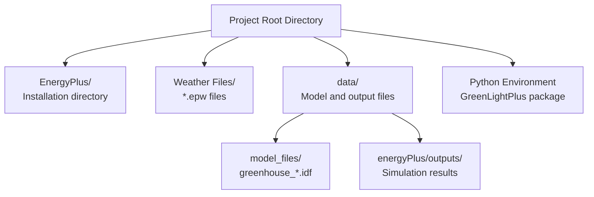

# Installation and Setup

> **Relevant source files**
> * [README.md](https://github.com/greenpeer/GreenLightPlus/blob/262399d9/README.md)
> * [pyproject.toml](https://github.com/greenpeer/GreenLightPlus/blob/262399d9/pyproject.toml)

This document provides comprehensive instructions for installing GreenLightPlus and configuring its dependencies. It covers the complete setup process from initial installation through verification of all components including EnergyPlus integration and weather data configuration.

For information about the core system architecture and component relationships, see [System Architecture](/greenpeer/GreenLightPlus/1.1-system-architecture). For usage examples after installation, see [Usage Examples](/greenpeer/GreenLightPlus/4-usage-examples).

## System Requirements

GreenLightPlus requires Python 3.8 or higher and has both required and optional dependencies based on the features you plan to use.

### Python Version Support

| Python Version | Support Status |
| --- | --- |
| 3.8 | ✅ Supported |
| 3.9 | ✅ Supported |
| 3.10 | ✅ Supported |
| 3.11+ | ⚠️ Not tested |

### Core Dependencies

The following packages are automatically installed with GreenLightPlus:

```

```

**Dependencies Installation Flow**
Sources: [pyproject.toml L25-L33](https://github.com/greenpeer/GreenLightPlus/blob/262399d9/pyproject.toml#L25-L33)

## Installation Methods

### Standard Installation

Install GreenLightPlus using pip:

```
pip install GreenLightPlus
```

This installs the package with all required dependencies. The installation creates a command-line interface accessible via the `GreenLightPlus` command.

### Development Installation

For development work or to access the latest features:

```
git clone https://github.com/greenpeer/GreenLightPlus.git
cd GreenLightPlus
pip install -e .
```

### Optional Development Dependencies

Install additional tools for development:

```
pip install GreenLightPlus[dev]
```

This includes pytest, sphinx, and sphinx-rtd-theme for testing and documentation.

Sources: [pyproject.toml L35-L40](https://github.com/greenpeer/GreenLightPlus/blob/262399d9/pyproject.toml#L35-L40)

 [README.md L94-L96](https://github.com/greenpeer/GreenLightPlus/blob/262399d9/README.md#L94-L96)

## EnergyPlus Setup

EnergyPlus is required for detailed building energy simulations using the `GreenhouseSimulation` class. The setup process varies by operating system.

### EnergyPlus Installation Process

```

```

**EnergyPlus Setup Workflow**

### Linux Installation

Download and extract EnergyPlus v23.2.0:

```
wget https://github.com/NREL/EnergyPlus/releases/download/v23.2.0/EnergyPlus-23.2.0-7636e6b3e9-Linux-Ubuntu22.04-x86_64.tar.gz
tar -xzvf EnergyPlus-23.2.0-7636e6b3e9-Linux-Ubuntu22.04-x86_64.tar.gz
mv EnergyPlus-23.2.0-7636e6b3e9-Linux-Ubuntu22.04-x86_64 EnergyPlus
```

### Python Path Configuration

After installation, add EnergyPlus to your Python path:

```javascript
import sys
sys.path.insert(0, "./EnergyPlus")
```

Sources: [README.md L55-L78](https://github.com/greenpeer/GreenLightPlus/blob/262399d9/README.md#L55-L78)

 [README.md L297-L299](https://github.com/greenpeer/GreenLightPlus/blob/262399d9/README.md#L297-L299)

## Weather Data Configuration

Weather files are essential for accurate greenhouse simulations. GreenLightPlus supports EPW (EnergyPlus Weather) format files.

### Weather File Dependencies

```

```

**Weather Data Processing Pipeline**

### Download Amsterdam Weather Data

```
wget https://energyplus-weather.s3.amazonaws.com/europe_wmo_region_6/NLD/NLD_Amsterdam.062400_IWEC/NLD_Amsterdam.062400_IWEC.epw
```

### Weather File Processing

The `convert_epw2csv` function processes EPW files for use with EnergyPlus simulations:

```javascript
from GreenLightPlus import convert_epw2csv
csv_path = convert_epw2csv(epw_path="NLD_Amsterdam.062400_IWEC.epw", time_step=1)
```

Sources: [README.md L80-L90](https://github.com/greenpeer/GreenLightPlus/blob/262399d9/README.md#L80-L90)

 [README.md L312-L313](https://github.com/greenpeer/GreenLightPlus/blob/262399d9/README.md#L312-L313)

## Installation Verification

Verify your installation by testing each major component:

### Basic Import Test

```javascript
# Test core imports
from GreenLightPlus import (
    GreenLightModel,
    GreenhouseEnv,
    GreenhouseGeometry,
    GreenhouseSimulation
)
print("✅ Core components imported successfully")
```

### EnergyPlus Integration Test

```javascript
import sys
sys.path.insert(0, "./EnergyPlus")

try:
    from pyenergyplus.api import EnergyPlusAPI
    api = EnergyPlusAPI()
    print("✅ EnergyPlus integration working")
except ImportError:
    print("❌ EnergyPlus not properly configured")
```

### Ray RLlib Test

```javascript
try:
    from ray.rllib.algorithms.ppo import PPOConfig
    config = PPOConfig()
    print("✅ Ray RLlib available")
except ImportError:
    print("❌ Ray RLlib not available")
```

### Component Verification Matrix

| Component | Test Method | Expected Result |
| --- | --- | --- |
| `GreenLightModel` | Basic import | No import errors |
| `GreenhouseEnv` | Gymnasium registration | Environment creates |
| `GreenhouseGeometry` | Geometry generation | IDF files created |
| `GreenhouseSimulation` | EnergyPlus API test | API object created |
| Weather processing | `convert_epw2csv` | CSV output generated |

Sources: [README.md L179-L185](https://github.com/greenpeer/GreenLightPlus/blob/262399d9/README.md#L179-L185)

 [README.md L301-L302](https://github.com/greenpeer/GreenLightPlus/blob/262399d9/README.md#L301-L302)

 [README.md L351-L353](https://github.com/greenpeer/GreenLightPlus/blob/262399d9/README.md#L351-L353)

## Configuration Files and Paths

### Project Structure for Setup



**Recommended Directory Structure**

### Environment Variables

Set these environment variables for consistent operation:

| Variable | Purpose | Example Value |
| --- | --- | --- |
| `ENERGYPLUS_DIR` | EnergyPlus installation path | `./EnergyPlus` |
| `WEATHER_DATA_DIR` | Weather files directory | `./weather_data` |
| `GREENHOUSE_MODELS_DIR` | IDF model files path | `./data/model_files` |

### CLI Configuration

The package provides a command-line interface via the `GreenLightPlus` command, configured through the project's entry point:

```markdown
# Available after installation
GreenLightPlus --help
```

Sources: [pyproject.toml L47-L48](https://github.com/greenpeer/GreenLightPlus/blob/262399d9/pyproject.toml#L47-L48)

 [README.md L309-L316](https://github.com/greenpeer/GreenLightPlus/blob/262399d9/README.md#L309-L316)

## Troubleshooting Common Setup Issues

### Dependency Conflicts

If you encounter OpenStudio version conflicts:

```
pip uninstall openstudio
pip install openstudio==3.6.1
```

### EnergyPlus Path Issues

Ensure EnergyPlus is accessible to Python:

```javascript
import os
energyplus_path = "./EnergyPlus"
if not os.path.exists(energyplus_path):
    print("❌ EnergyPlus directory not found")
else:
    print("✅ EnergyPlus directory exists")
```

### Memory Requirements

Ray RLlib may require significant memory for distributed training. Monitor system resources during RL training phases.

Sources: [pyproject.toml L30](https://github.com/greenpeer/GreenLightPlus/blob/262399d9/pyproject.toml#L30-L30)

 [README.md L297-L299](https://github.com/greenpeer/GreenLightPlus/blob/262399d9/README.md#L297-L299)