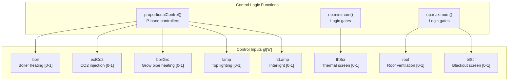
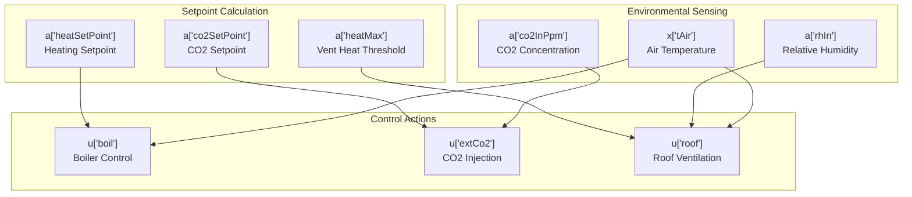

# Model Configuration

> **Relevant source files**
> * [create_green_light_model/set_default_lamp_params.py](https://github.com/greenpeer/GreenLightPlus/blob/262399d9/create_green_light_model/set_default_lamp_params.py)
> * [create_green_light_model/set_gl_aux.py](https://github.com/greenpeer/GreenLightPlus/blob/262399d9/create_green_light_model/set_gl_aux.py)
> * [create_green_light_model/set_gl_control.py](https://github.com/greenpeer/GreenLightPlus/blob/262399d9/create_green_light_model/set_gl_control.py)

This document covers the advanced configuration capabilities of the GreenLightPlus model, including control logic implementation, auxiliary calculations setup, and parameter customization options. These configuration systems allow users to customize model behavior, implement control strategies, and compute derived model states.

For basic model creation and initialization, see [Model Creation](/greenpeer/GreenLightPlus/3.2-model-creation). For result analysis and visualization of configured models, see [Result Analysis](/greenpeer/GreenLightPlus/3.4-result-analysis).

## Overview

The GreenLightPlus model configuration system consists of three primary components that work together to create a fully-configured greenhouse simulation:

```

```

**Sources:** [create_green_light_model/set_default_lamp_params.py L18-L85](https://github.com/greenpeer/GreenLightPlus/blob/262399d9/create_green_light_model/set_default_lamp_params.py#L18-L85)

 [create_green_light_model/set_gl_aux.py L6-L2346](https://github.com/greenpeer/GreenLightPlus/blob/262399d9/create_green_light_model/set_gl_aux.py#L6-L2346)

 [create_green_light_model/set_gl_control.py L23-L75](https://github.com/greenpeer/GreenLightPlus/blob/262399d9/create_green_light_model/set_gl_control.py#L23-L75)

## Parameter Customization

Parameter customization allows users to configure physical and operational characteristics of greenhouse components. The primary customization interface is through lamp parameter configuration, which supports different lighting technologies.

### Lamp Parameter Configuration

The `set_default_lamp_params()` function provides pre-configured parameter sets for different lamp technologies:

| Parameter | HPS Value | LED Value | Units | Description |
| --- | --- | --- | --- | --- |
| `thetaLampMax` | 111.11 | 66.67 | W m⁻² | Maximum lamp intensity |
| `etaLampPar` | 0.367 | 0.555 | - | PAR conversion efficiency |
| `etaLampNir` | 0.22 | 0.02 | - | NIR conversion efficiency |
| `epsLampTop` | 0.1 | 0.88 | - | Top emissivity |
| `epsLampBottom` | 0.9 | 0.88 | - | Bottom emissivity |
| `capLamp` | 100 | 10 | J K⁻¹ m⁻² | Heat capacity |
| `cHecLampAir` | 0.09 | 2.3 | W m⁻² K⁻¹ | Heat exchange coefficient |

```

```

**Sources:** [create_green_light_model/set_default_lamp_params.py L46-L83](https://github.com/greenpeer/GreenLightPlus/blob/262399d9/create_green_light_model/set_default_lamp_params.py#L46-L83)

### Parameter Structure

The GreenLight model organizes parameters into the `gl["p"]` dictionary, which contains physical constants, equipment specifications, and operational limits. Common parameter categories include:

* **Geometric parameters**: Floor area (`aFlr`), cover area (`aCov`), pipe dimensions
* **Thermal parameters**: Heat capacities (`capLeaf`, `capCov`), emissivities, conductivities
* **Optical parameters**: Transmission (`tau`), reflection (`rho`), absorption coefficients
* **Control parameters**: Setpoints, deadbands, proportional bands

**Sources:** [create_green_light_model/set_default_lamp_params.py L47-L83](https://github.com/greenpeer/GreenLightPlus/blob/262399d9/create_green_light_model/set_default_lamp_params.py#L47-L83)

 [create_green_light_model/set_gl_aux.py L469-L473](https://github.com/greenpeer/GreenLightPlus/blob/262399d9/create_green_light_model/set_gl_aux.py#L469-L473)

## Auxiliary Calculations

The auxiliary calculation system computes derived states and intermediate values needed for the greenhouse simulation. This is implemented through the `GreenLightAuxiliaryStates` class, which contains over 20 specialized calculation methods.

### Auxiliary State Categories

```

```

**Sources:** [create_green_light_model/set_gl_aux.py L15-L34](https://github.com/greenpeer/GreenLightPlus/blob/262399d9/create_green_light_model/set_gl_aux.py#L15-L34)

 [create_green_light_model/set_gl_aux.py L2324-L2344](https://github.com/greenpeer/GreenLightPlus/blob/262399d9/create_green_light_model/set_gl_aux.py#L2324-L2344)

### Key Auxiliary Calculations

#### Optical Properties

The model computes transmission and reflection coefficients for multi-layer cover systems including shadow screens, thermal screens, and blackout screens:

```

```

**Sources:** [create_green_light_model/set_gl_aux.py L36-L82](https://github.com/greenpeer/GreenLightPlus/blob/262399d9/create_green_light_model/set_gl_aux.py#L36-L82)

 [create_green_light_model/set_gl_aux.py L317-L460](https://github.com/greenpeer/GreenLightPlus/blob/262399d9/create_green_light_model/set_gl_aux.py#L317-L460)

#### Heat Flux Calculations

The system computes radiation absorption by different greenhouse components:

* **Canopy absorption**: Direct and reflected PAR/NIR from sun, lamps, and interlights
* **Floor absorption**: Transmitted radiation after canopy interception
* **Air absorption**: Fraction of global radiation absorbed by greenhouse air
* **Cover absorption**: Solar radiation absorbed by cover materials

**Sources:** [create_green_light_model/set_gl_aux.py L500-L807](https://github.com/greenpeer/GreenLightPlus/blob/262399d9/create_green_light_model/set_gl_aux.py#L500-L807)

#### Control Logic Integration

Auxiliary calculations provide the intermediate values needed for control decisions:

* **Time-based logic**: `timeOfDay`, `dayOfYear` for scheduling
* **Environmental conditions**: `rhIn` (relative humidity), `co2InPpm` (CO2 concentration)
* **Setpoint calculations**: `heatSetPoint`, `co2SetPoint` based on day/night and lamp status

**Sources:** [create_green_light_model/set_gl_aux.py L1514-L1718](https://github.com/greenpeer/GreenLightPlus/blob/262399d9/create_green_light_model/set_gl_aux.py#L1514-L1718)

## Control Logic

The control logic system implements the greenhouse management strategy through the `set_gl_control()` function. This function sets control inputs in the `gl["u"]` dictionary based on current states and auxiliary calculations.

### Control Input Structure



**Sources:** [create_green_light_model/set_gl_control.py L30-L70](https://github.com/greenpeer/GreenLightPlus/blob/262399d9/create_green_light_model/set_gl_control.py#L30-L70)

### Proportional Control Implementation

The control system uses proportional controllers with deadbands for smooth operation:

| Control | Setpoint Source | Proportional Band | Range |
| --- | --- | --- | --- |
| Heating | `a["heatSetPoint"]` | `p["tHeatBand"]` | [0, 1] |
| CO2 | `a["co2SetPoint"]` | `p["co2Band"]` | [0, 1] |
| Ventilation | `a["heatMax"]`, `p["rhMax"]` | `p["ventHeatPband"]`, `p["ventRhPband"]` | [0, 1] |

### Control Logic Flow



**Sources:** [create_green_light_model/set_gl_control.py L31-L48](https://github.com/greenpeer/GreenLightPlus/blob/262399d9/create_green_light_model/set_gl_control.py#L31-L48)

### Advanced Control Features

#### Screen Control Logic

The thermal screen control combines multiple factors:

* **Cold protection**: Closes based on outdoor temperature
* **Humidity control**: Opens for dehumidification
* **Heat protection**: Opens to prevent overheating

#### Lighting Control Integration

Lamp control includes sophisticated logic for:

* **Time-based scheduling**: `lampsOn`/`lampsOff` times
* **Radiation limits**: `lampRadSumLimit` for daily light integral
* **Temperature constraints**: Heat addition considerations
* **Humidity interactions**: Coordination with screen control

**Sources:** [create_green_light_model/set_gl_control.py L45-L70](https://github.com/greenpeer/GreenLightPlus/blob/262399d9/create_green_light_model/set_gl_control.py#L45-L70)

 [create_green_light_model/set_gl_aux.py L1564-L1698](https://github.com/greenpeer/GreenLightPlus/blob/262399d9/create_green_light_model/set_gl_aux.py#L1564-L1698)

## Configuration Integration

The three configuration components work together in a specific sequence during model setup:

1. **Parameter Customization**: Sets physical and operational parameters
2. **Auxiliary Calculations**: Computes derived states from parameters and current states
3. **Control Logic**: Determines control actions based on auxiliary calculations

This sequence ensures that all dependencies are resolved correctly and that the model maintains physical consistency throughout the simulation.

**Sources:** [create_green_light_model/set_default_lamp_params.py L18-L85](https://github.com/greenpeer/GreenLightPlus/blob/262399d9/create_green_light_model/set_default_lamp_params.py#L18-L85)

 [create_green_light_model/set_gl_aux.py L2324-L2346](https://github.com/greenpeer/GreenLightPlus/blob/262399d9/create_green_light_model/set_gl_aux.py#L2324-L2346)

 [create_green_light_model/set_gl_control.py L23-L75](https://github.com/greenpeer/GreenLightPlus/blob/262399d9/create_green_light_model/set_gl_control.py#L23-L75)