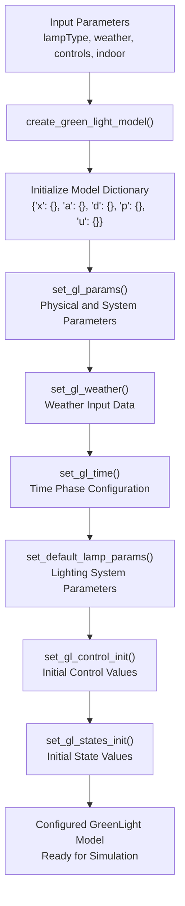
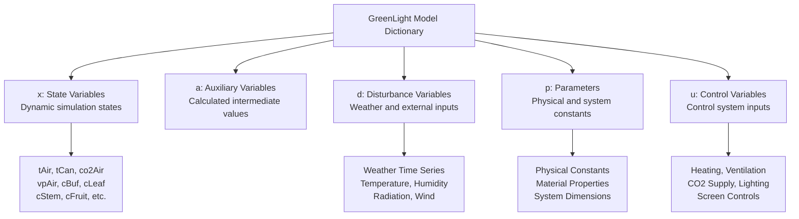
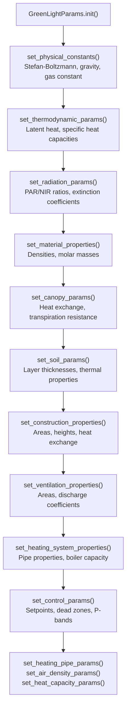
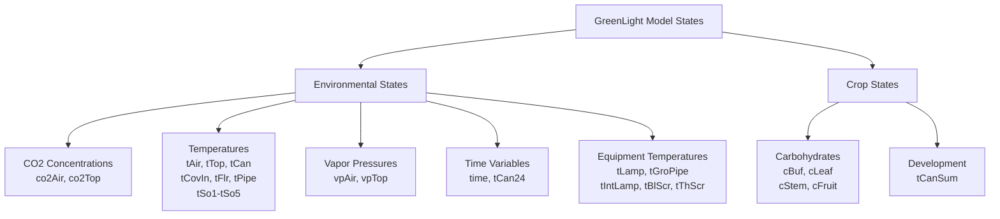
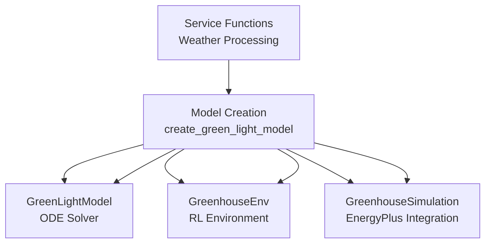

# Model Creation

> **Relevant source files**
> * [create_green_light_model/create_green_light_model.py](https://github.com/greenpeer/GreenLightPlus/blob/262399d9/create_green_light_model/create_green_light_model.py)
> * [create_green_light_model/set_gl_params.py](https://github.com/greenpeer/GreenLightPlus/blob/262399d9/create_green_light_model/set_gl_params.py)
> * [create_green_light_model/set_gl_states.py](https://github.com/greenpeer/GreenLightPlus/blob/262399d9/create_green_light_model/set_gl_states.py)

This document covers the components responsible for initializing and configuring the GreenLight model structure. The model creation system transforms input parameters and weather data into a fully configured GreenLight model instance ready for simulation. For information about using the created model in simulations, see [GreenLightModel](/greenpeer/GreenLightPlus/2.1-greenlightmodel). For details about configuring advanced model settings, see [Model Configuration](/greenpeer/GreenLightPlus/3.3-model-configuration).

## Overview

The model creation system provides the foundational layer that assembles all necessary components into a coherent GreenLight model instance. The system consists of a main orchestration function and specialized parameter-setting modules that configure different aspects of the greenhouse simulation model.

### Model Creation Workflow

Sources: [create_green_light_model/create_green_light_model.py L34-L88](https://github.com/greenpeer/GreenLightPlus/blob/262399d9/create_green_light_model/create_green_light_model.py#L34-L88)

## Model Structure

The GreenLight model is organized as a dictionary with five main sections that contain different types of data and parameters.

### Model Dictionary Architecture

Sources: [create_green_light_model/create_green_light_model.py L60](https://github.com/greenpeer/GreenLightPlus/blob/262399d9/create_green_light_model/create_green_light_model.py#L60-L60)

 [create_green_light_model/set_gl_states.py L40-L135](https://github.com/greenpeer/GreenLightPlus/blob/262399d9/create_green_light_model/set_gl_states.py#L40-L135)

## Parameter Configuration

The parameter configuration system sets hundreds of physical, thermodynamic, and system-specific parameters required for accurate greenhouse simulation.

### Parameter Categories

| Category | Purpose | Key Parameters | Lines |
| --- | --- | --- | --- |
| Physical Constants | Fundamental physics | `sigma`, `g`, `R` | [set_gl_params.py L33-L37](https://github.com/greenpeer/GreenLightPlus/blob/262399d9/set_gl_params.py#L33-L37) |
| Thermodynamic | Heat and mass transfer | `L`, `gamma`, `cPAir` | [set_gl_params.py L39-L46](https://github.com/greenpeer/GreenLightPlus/blob/262399d9/set_gl_params.py#L39-L46) |
| Radiation | Light interaction | `etaGlobNir`, `k1Par`, `kFir` | [set_gl_params.py L47-L58](https://github.com/greenpeer/GreenLightPlus/blob/262399d9/set_gl_params.py#L47-L58) |
| Material Properties | Substance characteristics | `rhoAir0`, `rhoSteel`, `mWater` | [set_gl_params.py L60-L67](https://github.com/greenpeer/GreenLightPlus/blob/262399d9/set_gl_params.py#L60-L67) |
| Construction | Greenhouse structure | `aFlr`, `aCov`, `hAir` | [set_gl_params.py L96-L108](https://github.com/greenpeer/GreenLightPlus/blob/262399d9/set_gl_params.py#L96-L108) |
| Canopy | Plant properties | `alfaLeafAir`, `rSMin`, `laiMax` | [set_gl_params.py L69-L75](https://github.com/greenpeer/GreenLightPlus/blob/262399d9/set_gl_params.py#L69-L75)    [set_gl_params.py L256-L287](https://github.com/greenpeer/GreenLightPlus/blob/262399d9/set_gl_params.py#L256-L287) |
| Control | System operation | `tSpDay`, `co2SpDay`, `rhMax` | [set_gl_params.py L301-L335](https://github.com/greenpeer/GreenLightPlus/blob/262399d9/set_gl_params.py#L301-L335) |

### Parameter Setting Process

Sources: [create_green_light_model/set_gl_params.py L394-L427](https://github.com/greenpeer/GreenLightPlus/blob/262399d9/create_green_light_model/set_gl_params.py#L394-L427)

## State Initialization

The state initialization system prepares all dynamic variables that will be tracked during simulation.

### State Variable Categories

Sources: [create_green_light_model/set_gl_states.py L40-L135](https://github.com/greenpeer/GreenLightPlus/blob/262399d9/create_green_light_model/set_gl_states.py#L40-L135)

## Integration with System Components

The model creation system interfaces with other major system components to provide a complete simulation framework.

### Component Dependencies

Sources: [create_green_light_model/create_green_light_model.py L25-L31](https://github.com/greenpeer/GreenLightPlus/blob/262399d9/create_green_light_model/create_green_light_model.py#L25-L31)

## Usage Patterns

The model creation system supports different usage scenarios depending on the simulation requirements.

### Basic Model Creation

The primary entry point is the `create_green_light_model()` function which accepts:

* `lampType`: String specifying lamp technology (`'hps'`, `'led'`, or `''`)
* `weather`: Numerical array with weather time series data
* `controls`: Optional control trajectory data
* `indoor`: Optional indoor condition specifications

Sources: [create_green_light_model/create_green_light_model.py L34-L51](https://github.com/greenpeer/GreenLightPlus/blob/262399d9/create_green_light_model/create_green_light_model.py#L34-L51)

### Model Validation

The system includes parameter validation and initialization checks to ensure model consistency:

* Weather data format validation with expected columns
* Lamp type validation against supported options
* Parameter dependency calculations for derived values
* State array initialization with proper dimensions

Sources: [create_green_light_model/create_green_light_model.py L54-L57](https://github.com/greenpeer/GreenLightPlus/blob/262399d9/create_green_light_model/create_green_light_model.py#L54-L57)

 [create_green_light_model/set_gl_params.py L216-L255](https://github.com/greenpeer/GreenLightPlus/blob/262399d9/create_green_light_model/set_gl_params.py#L216-L255)