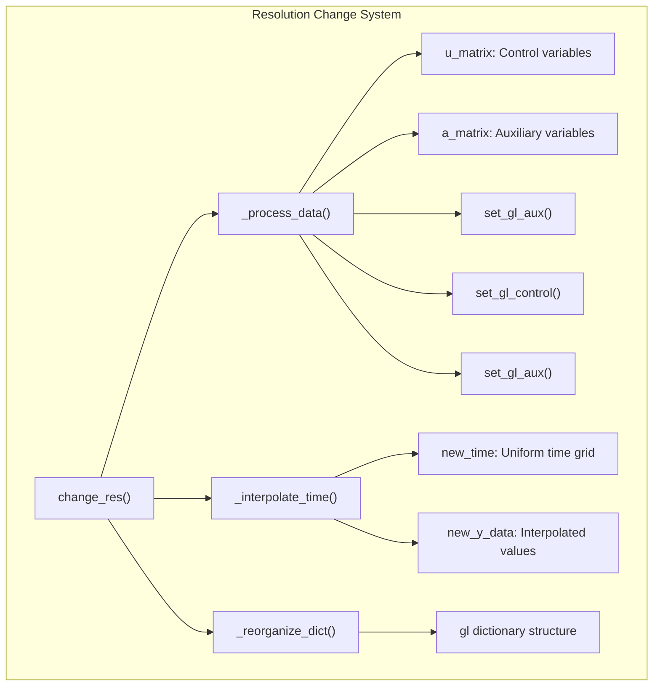
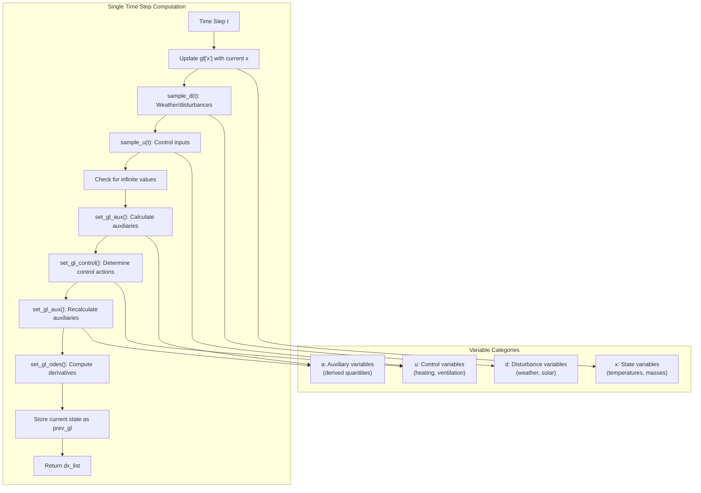
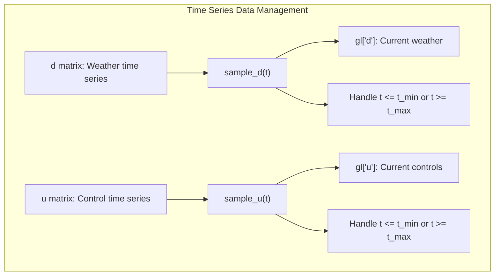

# Model Internals

> **Relevant source files**
> * [create_green_light_model/change_res.py](https://github.com/greenpeer/GreenLightPlus/blob/262399d9/create_green_light_model/change_res.py)
> * [create_green_light_model/ode.py](https://github.com/greenpeer/GreenLightPlus/blob/262399d9/create_green_light_model/ode.py)
> * [create_green_light_model/set_dep_params.py](https://github.com/greenpeer/GreenLightPlus/blob/262399d9/create_green_light_model/set_dep_params.py)

This document provides a detailed technical overview of the GreenLight model's internal architecture, focusing on the ODE solving system, parameter dependencies, and data flow mechanisms. It covers the core computational engine that drives greenhouse simulations, including how state variables are managed, how differential equations are solved, and how model parameters are computed and interdepend.

For information about using the model from a user perspective, see [GreenLightModel](/greenpeer/GreenLightPlus/2.1-greenlightmodel). For details about model configuration and parameter customization, see [Model Configuration](/greenpeer/GreenLightPlus/3.3-model-configuration).

## Core ODE System Architecture

The heart of the GreenLight model is implemented in the `ODESolver` class, which manages the system of ordinary differential equations that govern greenhouse dynamics. The solver integrates multiple subsystems including thermal dynamics, crop growth, and environmental controls.

### ODE Solver Architecture

```

```

The `ODESolver` class [create_green_light_model/ode.py L28-L133](https://github.com/greenpeer/GreenLightPlus/blob/262399d9/create_green_light_model/ode.py#L28-L133)

 implements the core integration loop. At each time step `t`, the `ode()` method [create_green_light_model/ode.py L89-L133](https://github.com/greenpeer/GreenLightPlus/blob/262399d9/create_green_light_model/ode.py#L89-L133)

 performs these operations:

1. Updates state variables in `gl["x"]` with current values
2. Samples weather/disturbance data at time `t` using `sample_d()`
3. Samples control variables at time `t` using `sample_u()`
4. Handles infinite values by reverting to previous valid states
5. Calculates auxiliary variables via `set_gl_aux()`
6. Determines control actions via `set_gl_control()`
7. Computes ODE derivatives via `set_gl_odes()`

**Sources:** [create_green_light_model/ode.py L89-L133](https://github.com/greenpeer/GreenLightPlus/blob/262399d9/create_green_light_model/ode.py#L89-L133)

### State Variable Management

```

```

The solver includes robust state management that prevents numerical instabilities. Critical state variables `["tBlScr", "tThScr", "tIntLamp", "tCovIn", "time"]` are monitored for infinite values [create_green_light_model/ode.py L109-L117](https://github.com/greenpeer/GreenLightPlus/blob/262399d9/create_green_light_model/ode.py#L109-L117)

 which can occur during extreme operating conditions or numerical errors.

**Sources:** [create_green_light_model/ode.py L108-L117](https://github.com/greenpeer/GreenLightPlus/blob/262399d9/create_green_light_model/ode.py#L108-L117)

 [create_green_light_model/ode.py L130-L131](https://github.com/greenpeer/GreenLightPlus/blob/262399d9/create_green_light_model/ode.py#L130-L131)

## Model Parameter Dependency System

The GreenLight model contains a complex web of interdependent parameters where some parameters are computed from others. The `DependentParameters` class manages these relationships.

### Parameter Dependency Graph

```

```

The parameter dependency system [create_green_light_model/set_dep_params.py L82-L95](https://github.com/greenpeer/GreenLightPlus/blob/262399d9/create_green_light_model/set_dep_params.py#L82-L95)

 calculates derived parameters in the correct order:

| Parameter Category | Key Parameters | Dependencies |
| --- | --- | --- |
| Pipe Properties | `capPipe`, `aPipe` | `lPipe`, `phiPipeE`, `phiPipeI`, material properties |
| Air Properties | `rhoAir`, `pressure` | `hElevation`, temperature, atmospheric constants |
| Heat Capacities | `capAir`, `capFlr`, `capSo1-5` | Dimensions, densities, specific heats |
| CO2 Capacities | `capCo2Air`, `capCo2Top` | Compartment heights |
| Geometric Factors | `fCanFlr`, `cLeafMax` | Pipe geometry, leaf area index |

**Sources:** [create_green_light_model/set_dep_params.py L26-L95](https://github.com/greenpeer/GreenLightPlus/blob/262399d9/create_green_light_model/set_dep_params.py#L26-L95)

### Computational Dependencies

```

```

**Sources:** [create_green_light_model/set_dep_params.py L82-L95](https://github.com/greenpeer/GreenLightPlus/blob/262399d9/create_green_light_model/set_dep_params.py#L82-L95)

## Data Interpolation and Resolution Management

The `GreenLightChangeRes` class handles temporal resolution changes and data interpolation, which is crucial for coupling different simulation components operating at different time scales.

### Resolution Change Architecture



The resolution change process [create_green_light_model/change_res.py L123-L158](https://github.com/greenpeer/GreenLightPlus/blob/262399d9/create_green_light_model/change_res.py#L123-L158)

 involves:

1. **Data Processing**: For each time point, calculate auxiliary (`a`) and control (`u`) variables by calling the computation chain: `set_gl_aux()` → `set_gl_control()` → `set_gl_aux()`
2. **Time Interpolation**: Create uniform time grids and interpolate all variables using linear interpolation
3. **Dictionary Reorganization**: Restructure the `gl` dictionary with new time-series data

**Sources:** [create_green_light_model/change_res.py L28-L68](https://github.com/greenpeer/GreenLightPlus/blob/262399d9/create_green_light_model/change_res.py#L28-L68)

 [create_green_light_model/change_res.py L123-L158](https://github.com/greenpeer/GreenLightPlus/blob/262399d9/create_green_light_model/change_res.py#L123-L158)

## Data Flow Through Model Internals

The internal data flow follows a specific sequence that ensures consistency between different variable types and computational dependencies.

### Internal Computation Flow



The computation flow ensures that:

* Auxiliary variables are calculated twice: once before control logic to provide current conditions, and once after to reflect control decisions
* State variable updates are validated for numerical stability
* Previous valid states are maintained for recovery from numerical errors

**Sources:** [create_green_light_model/ode.py L96-L133](https://github.com/greenpeer/GreenLightPlus/blob/262399d9/create_green_light_model/ode.py#L96-L133)

### Data Sampling and Interpolation



Both `sample_d()` and `sample_u()` [create_green_light_model/ode.py L61-L87](https://github.com/greenpeer/GreenLightPlus/blob/262399d9/create_green_light_model/ode.py#L61-L87)

 implement identical interpolation logic:

* Linear interpolation for times within the data range
* Boundary value extraction for times outside the range
* Column-wise interpolation for multi-dimensional data

**Sources:** [create_green_light_model/ode.py L61-L87](https://github.com/greenpeer/GreenLightPlus/blob/262399d9/create_green_light_model/ode.py#L61-L87)

## Numerical Considerations

The model includes several mechanisms to handle numerical stability:

| Issue | Solution | Implementation |
| --- | --- | --- |
| Infinite state values | Revert to previous valid state | [create_green_light_model/ode.py L109-L117](https://github.com/greenpeer/GreenLightPlus/blob/262399d9/create_green_light_model/ode.py#L109-L117) |
| Numpy warnings | Suppress overflow/invalid warnings | [create_green_light_model/ode.py L26](https://github.com/greenpeer/GreenLightPlus/blob/262399d9/create_green_light_model/ode.py#L26-L26) |
| Time boundary conditions | Use boundary values instead of extrapolation | [create_green_light_model/ode.py L67-L73](https://github.com/greenpeer/GreenLightPlus/blob/262399d9/create_green_light_model/ode.py#L67-L73) |
| Matrix dimension consistency | Validate array shapes before operations | [create_green_light_model/change_res.py L49-L52](https://github.com/greenpeer/GreenLightPlus/blob/262399d9/create_green_light_model/change_res.py#L49-L52) |

The model prioritizes numerical stability over strict physical accuracy in edge cases, ensuring that simulations can continue running even under extreme or unrealistic operating conditions.

**Sources:** [create_green_light_model/ode.py L26](https://github.com/greenpeer/GreenLightPlus/blob/262399d9/create_green_light_model/ode.py#L26-L26)

 [create_green_light_model/ode.py L109-L117](https://github.com/greenpeer/GreenLightPlus/blob/262399d9/create_green_light_model/ode.py#L109-L117)

 [create_green_light_model/change_res.py L49-L52](https://github.com/greenpeer/GreenLightPlus/blob/262399d9/create_green_light_model/change_res.py#L49-L52)