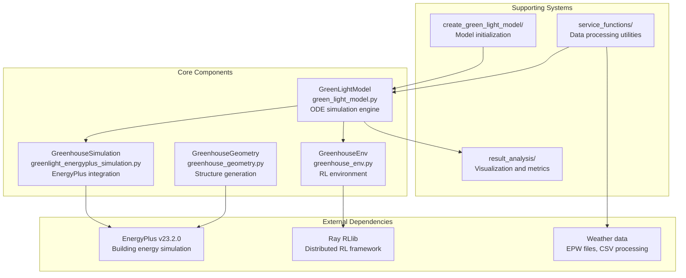
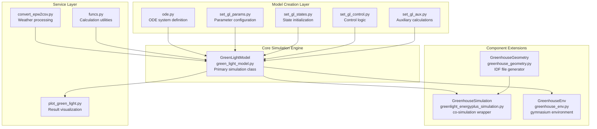
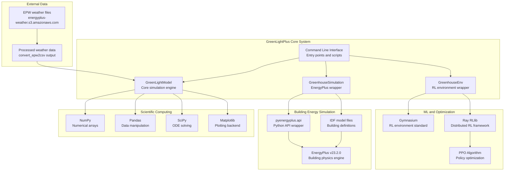
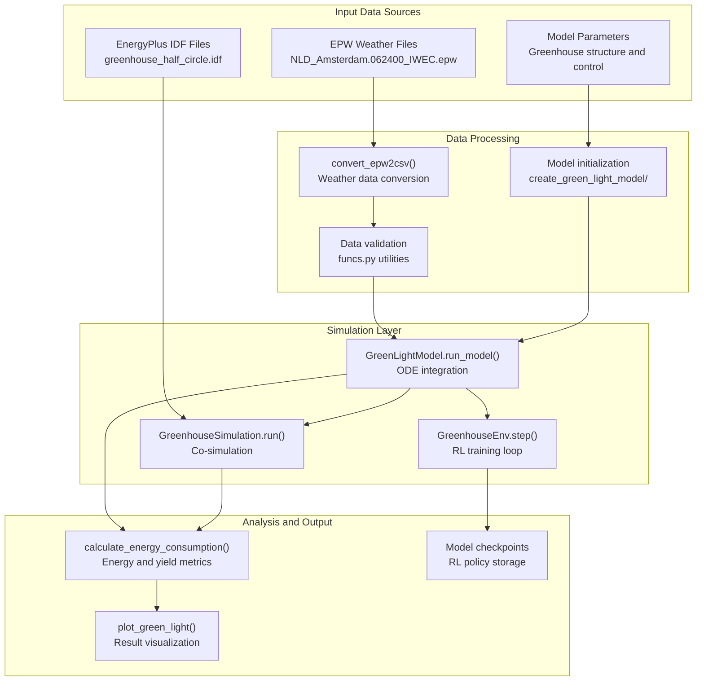

# Overview

> **Relevant source files**
> * [README.md](https://github.com/greenpeer/GreenLightPlus/blob/262399d9/README.md)
> * [README_zh.md](https://github.com/greenpeer/GreenLightPlus/blob/262399d9/README_zh.md)

This document provides a comprehensive overview of GreenLightPlus, a Python toolkit for greenhouse environment simulation and energy optimization. It covers the system's architecture, core components, and integration capabilities.

GreenLightPlus is designed for researchers, engineers, and developers working on greenhouse automation, energy optimization, and agricultural AI systems. For detailed usage examples, see [Usage Examples](/greenpeer/GreenLightPlus/4-usage-examples). For development information, see [Development](/greenpeer/GreenLightPlus/5-development).

## System Overview

GreenLightPlus is a Python-based greenhouse simulation and optimization platform that extends David Katzin's original MATLAB GreenLight model. The system provides four primary capabilities:

| Capability | Purpose | Primary Component |
| --- | --- | --- |
| Environment Simulation | Model greenhouse climate dynamics and crop growth | `GreenLightModel` |
| Energy Analysis | Detailed building energy consumption analysis | `GreenhouseSimulation` |
| AI Optimization | Reinforcement learning for control strategies | `GreenhouseEnv` |
| Structural Modeling | Generate greenhouse geometric configurations | `GreenhouseGeometry` |

The toolkit integrates with external systems including EnergyPlus v23.2.0 for building simulation, Ray RLlib for distributed reinforcement learning, and standard weather data formats (EPW files).

**Core Architecture**

Sources: [README.md L14-L50](https://github.com/greenpeer/GreenLightPlus/blob/262399d9/README.md#L14-L50)

 [README.md L38-L50](https://github.com/greenpeer/GreenLightPlus/blob/262399d9/README.md#L38-L50)

## Core Component Relationships

The four core components of GreenLightPlus operate in a hierarchical relationship where `GreenLightModel` serves as the central simulation engine that other components depend on or extend.

**Component Dependencies and Data Flow**

**Key Integration Points:**

* **Model Initialization**: The `create_green_light_model/` directory contains modules that construct the ODE system, set parameters, and initialize states for `GreenLightModel`
* **Simulation Extensions**: Both `GreenhouseSimulation` and `GreenhouseEnv` wrap `GreenLightModel` to provide specialized interfaces
* **Data Processing**: Weather data flows through `convert_epw2csv.py` before reaching the simulation engine
* **Result Analysis**: Output from `GreenLightModel` is processed by visualization and analysis functions

Sources: [README.md L40-L50](https://github.com/greenpeer/GreenLightPlus/blob/262399d9/README.md#L40-L50)

 [README.md L47-L49](https://github.com/greenpeer/GreenLightPlus/blob/262399d9/README.md#L47-L49)

## External System Integration

GreenLightPlus integrates with multiple external systems to provide comprehensive greenhouse simulation and optimization capabilities.

**Integration Architecture**

**Integration Details:**

| External System | Integration Method | Primary Interface | Purpose |
| --- | --- | --- | --- |
| EnergyPlus | Python API (`pyenergyplus.api`) | `GreenhouseSimulation` class | Building energy analysis |
| Ray RLlib | Direct import and configuration | `GreenhouseEnv` as Gymnasium environment | Distributed RL training |
| Weather Data | AWS S3 downloads and CSV conversion | `convert_epw2csv.py` | Climate data processing |
| Scientific Stack | Standard Python imports | Throughout codebase | Numerical computation |

**Configuration Requirements:**

* EnergyPlus installation path must be added to Python `sys.path` [README.md L298-L299](https://github.com/greenpeer/GreenLightPlus/blob/262399d9/README.md#L298-L299)
* Weather files downloaded from AWS S3 bucket [README.md L85-L86](https://github.com/greenpeer/GreenLightPlus/blob/262399d9/README.md#L85-L86)
* Ray RLlib configuration through `PPOConfig` class [README.md L359-L433](https://github.com/greenpeer/GreenLightPlus/blob/262399d9/README.md#L359-L433)

Sources: [README.md L55-L96](https://github.com/greenpeer/GreenLightPlus/blob/262399d9/README.md#L55-L96)

 [README.md L288-L340](https://github.com/greenpeer/GreenLightPlus/blob/262399d9/README.md#L288-L340)

 [README.md L341-L452](https://github.com/greenpeer/GreenLightPlus/blob/262399d9/README.md#L341-L452)

## Data Processing Pipeline

GreenLightPlus implements a comprehensive data processing pipeline that transforms weather data, manages simulation states, and produces analysis outputs.

**Pipeline Architecture**

**Processing Functions:**

| Stage | Function/Class | Input Format | Output Format | Purpose |
| --- | --- | --- | --- | --- |
| Weather Processing | `convert_epw2csv()` | EPW files | CSV time series | Climate data standardization |
| Model Creation | `create_green_light_model/` modules | Parameters dict | Model state dict | Simulation initialization |
| Simulation | `GreenLightModel.run_model()` | State dict + parameters | Updated state dict | Core greenhouse dynamics |
| Analysis | `calculate_energy_consumption()` | Simulation results | Scalar metrics | Performance evaluation |
| Visualization | `plot_green_light()` | Simulation results | Matplotlib figures | Result presentation |

**State Management:**

The system maintains simulation state through nested dictionaries containing:

* Physical parameters (`'p'` key) for greenhouse structure and control settings
* State variables for temperatures, humidity, CO2, and crop growth
* Time-series outputs for energy consumption and environmental conditions

Sources: [README.md L175-L286](https://github.com/greenpeer/GreenLightPlus/blob/262399d9/README.md#L175-L286)

 [README.md L187-L262](https://github.com/greenpeer/GreenLightPlus/blob/262399d9/README.md#L187-L262)

 [README.md L312-L338](https://github.com/greenpeer/GreenLightPlus/blob/262399d9/README.md#L312-L338)