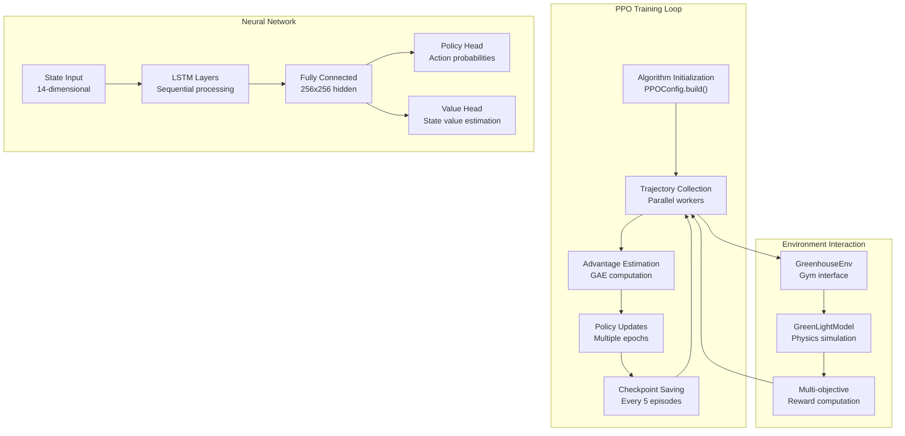
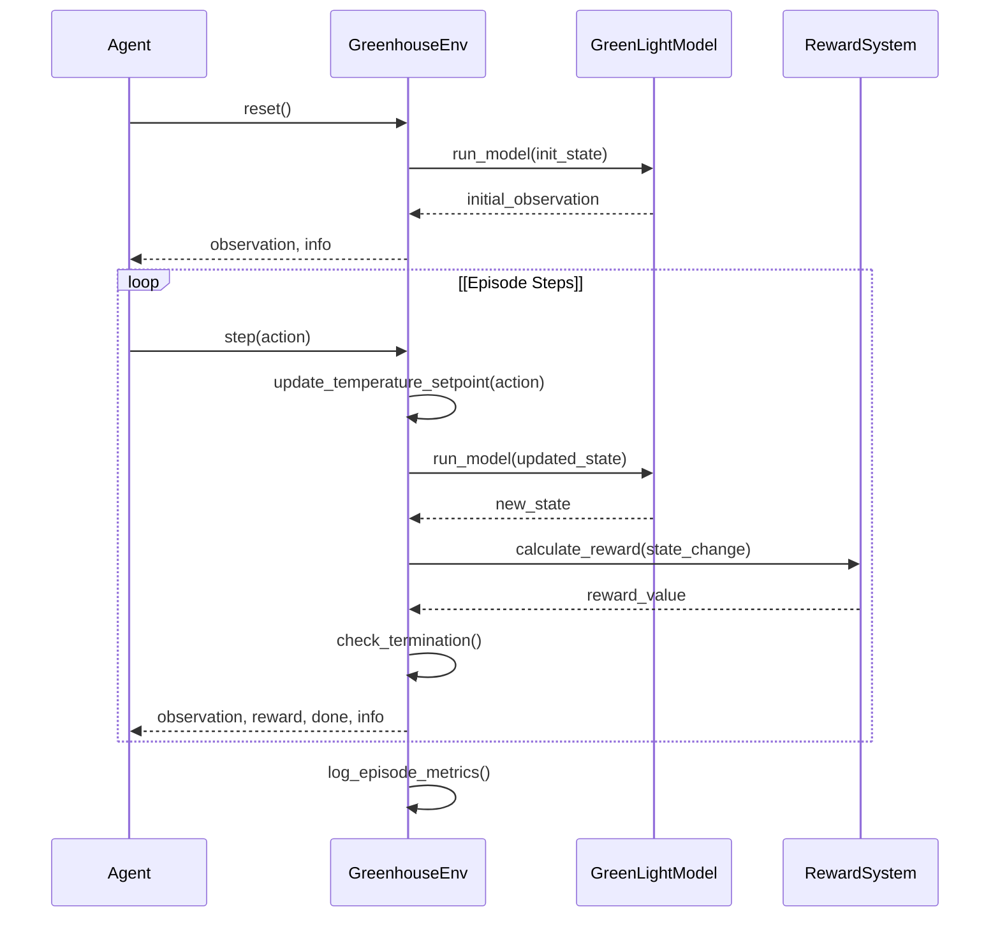

# Reinforcement Learning Training

> **Relevant source files**
> * [README.md](https://github.com/greenpeer/GreenLightPlus/blob/262399d9/README.md)
> * [core/greenhouse_env.py](https://github.com/greenpeer/GreenLightPlus/blob/262399d9/core/greenhouse_env.py)

This document covers the reinforcement learning (RL) training capabilities of GreenLightPlus, specifically focusing on training AI agents to optimize greenhouse control strategies using the PPO (Proximal Policy Optimization) algorithm. The RL system enables automatic learning of optimal greenhouse management policies for temperature, CO2, and other environmental controls to maximize crop yield while minimizing energy consumption.

For basic greenhouse simulation without RL optimization, see [Basic Greenhouse Simulation](/greenpeer/GreenLightPlus/4.1-basic-greenhouse-simulation). For the underlying RL environment implementation details, see [GreenhouseEnv](/greenpeer/GreenLightPlus/2.3-greenhouseenv).

## RL System Architecture

The reinforcement learning system in GreenLightPlus integrates multiple components to enable agent training for greenhouse optimization. The system uses Ray RLlib as the distributed training framework with PPO as the primary algorithm.

### High-Level RL Architecture

```

```

Sources: [README.md L341-L450](https://github.com/greenpeer/GreenLightPlus/blob/262399d9/README.md#L341-L450)

 [core/greenhouse_env.py L21-L376](https://github.com/greenpeer/GreenLightPlus/blob/262399d9/core/greenhouse_env.py#L21-L376)

### RL Training Data Flow

```

```

Sources: [README.md L358-L441](https://github.com/greenpeer/GreenLightPlus/blob/262399d9/README.md#L358-L441)

 [core/greenhouse_env.py L137-L171](https://github.com/greenpeer/GreenLightPlus/blob/262399d9/core/greenhouse_env.py#L137-L171)

 [core/greenhouse_env.py L341-L369](https://github.com/greenpeer/GreenLightPlus/blob/262399d9/core/greenhouse_env.py#L341-L369)

## Environment Implementation

The `GreenhouseEnv` class implements the core RL environment following the OpenAI Gym interface. It wraps the `GreenLightModel` to provide standardized RL interactions.

### Environment Configuration

The environment accepts a configuration dictionary with the following key parameters:

| Parameter | Type | Default | Description |
| --- | --- | --- | --- |
| `first_day` | int | 1 | Starting day of year for simulation |
| `season_length` | int | 60 | Duration of growing season (days) |
| `season_interval` | float | 1/24 | Time step interval (days) |
| `target_yield` | float | 0 | Target crop yield (kg/m²) |
| `target_yield_unit_energy_input` | float | 0 | Target energy efficiency (MJ/kg) |
| `isMature` | bool | False | Initial crop maturity state |
| `epw_path` | str | "" | Weather data file path |
| `init_state` | dict | {} | Initial greenhouse parameters |

Sources: [core/greenhouse_env.py L27-L51](https://github.com/greenpeer/GreenLightPlus/blob/262399d9/core/greenhouse_env.py#L27-L51)

### Action and Observation Spaces

The environment defines discrete actions for temperature control and continuous observations for system state:

```

```

The observation vector includes:

* Day of year (0-365)
* Night/day temperature setpoints (18-28°C)
* CO2 setpoint (400-1600 ppm)
* Air CO2 concentration, vapor pressure, temperature
* Fruit dry matter weight, respiration rates
* Solar radiation, outdoor temperature
* Lamp and boiler energy consumption

Sources: [core/greenhouse_env.py L77-L132](https://github.com/greenpeer/GreenLightPlus/blob/262399d9/core/greenhouse_env.py#L77-L132)

 [core/greenhouse_env.py L173-L230](https://github.com/greenpeer/GreenLightPlus/blob/262399d9/core/greenhouse_env.py#L173-L230)

## Reward System

The reward system implements multi-objective optimization balancing crop yield and energy efficiency across growth and harvest phases.

### Growth Phase Rewards

During the growth phase (before fruit maturation), rewards are based on fruit biomass accumulation:

```markdown
# Fruit growth reward calculation
cFruit_growth = self.new_gl["x"]["cFruit"] - self.gl["x"]["cFruit"]
reward = cFruit_growth * 1e-3  # Reward scaling to g/m²
```

### Harvest Phase Rewards

During harvest phase, rewards incorporate yield targets and energy efficiency:

```yaml
# Base harvest reward
reward = self.yield_change * 1e3  # Yield in g/m²

# Progressive target adjustment
incremental_target_yield = self.target_yield * (0.1 + 0.9 * harvest_progress)

# Performance-based scaling
if self.total_yield >= incremental_target_yield:
    reward *= 1.2  # 20% bonus for meeting targets
else:
    reward *= 0.8  # 20% penalty for underperformance
```

### Terminal Rewards

At episode termination, additional rewards/penalties are applied based on overall performance metrics:

```markdown
# Energy efficiency and yield gap calculations
energy_diff_pct = (target_energy - actual_energy) / target_energy
yield_diff_pct = (actual_yield - target_yield) / target_yield

# Terminal reward adjustment
reward += (energy_diff_pct + yield_diff_pct) * self.total_reward
```

Sources: [core/greenhouse_env.py L234-L323](https://github.com/greenpeer/GreenLightPlus/blob/262399d9/core/greenhouse_env.py#L234-L323)

## Training Configuration

Training uses Ray RLlib's PPO algorithm with LSTM networks for sequential decision making:

### PPO Configuration

| Parameter | Value | Purpose |
| --- | --- | --- |
| `gamma` | 0.9 | Discount factor for future rewards |
| `lr` | 0.0001 | Learning rate for policy updates |
| `kl_coeff` | 0.3 | KL divergence constraint coefficient |
| `fcnet_hiddens` | [256, 256] | Hidden layer architecture |
| `use_lstm` | True | Enable recurrent neural networks |
| `max_seq_len` | 48 | Maximum LSTM sequence length |

### Training Architecture



Sources: [README.md L358-L431](https://github.com/greenpeer/GreenLightPlus/blob/262399d9/README.md#L358-L431)

## Training Process

The training process follows a standard RL training loop with episode-based learning:

### Training Loop Implementation

```python
# Algorithm initialization
algo = config.build()

# Training loop
for episode in tqdm(range(250)):
    result = algo.train()
    if episode % 5 == 0:
        checkpoint_dir = algo.save().checkpoint.path
        print(f"Checkpoint saved in directory {checkpoint_dir}")
```

### Episode Lifecycle



Sources: [README.md L435-L441](https://github.com/greenpeer/GreenLightPlus/blob/262399d9/README.md#L435-L441)

 [core/greenhouse_env.py L137-L171](https://github.com/greenpeer/GreenLightPlus/blob/262399d9/core/greenhouse_env.py#L137-L171)

 [core/greenhouse_env.py L341-L369](https://github.com/greenpeer/GreenLightPlus/blob/262399d9/core/greenhouse_env.py#L341-L369)

## Performance Monitoring

The system tracks multiple performance metrics throughout training:

### Episode Metrics

The environment maintains performance statistics across episodes:

* `episode_unit_energy_inputs`: Energy efficiency per episode
* `episode_total_yields`: Crop yield per episode
* `yield_unit_energy_input`: Overall energy efficiency (MJ/kg)
* `total_yield`: Cumulative crop production (kg/m²)

### Training Outputs

Training produces detailed performance logs:

```python
print(f"单位能耗是{self.yield_unit_energy_input}, 目标单位能耗是{self.target_yield_unit_energy_input}")
print(f"总产量是{self.total_yield}, 目标总产量是{self.target_yield}")
print(f"本次起始日期{self.new_first_day}的{self.season_length}天,总奖励是 {self.total_reward}")
```

### Checkpoint Management

Model checkpoints are saved periodically to enable training resume and policy evaluation:

```python
if episode % 5 == 0:
    checkpoint_dir = algo.save().checkpoint.path
    print(f"Checkpoint saved in directory {checkpoint_dir}")
```

Sources: [core/greenhouse_env.py L312-L317](https://github.com/greenpeer/GreenLightPlus/blob/262399d9/core/greenhouse_env.py#L312-L317)

 [README.md L439-L441](https://github.com/greenpeer/GreenLightPlus/blob/262399d9/README.md#L439-L441)

## Usage Example

The following example demonstrates complete RL training setup for greenhouse optimization:

```javascript
from ray.rllib.algorithms.ppo import PPOConfig
from GreenLightPlus import GreenhouseEnv

# Configure PPO algorithm
config = PPOConfig()
config.rollouts(num_rollout_workers=1)
config.resources(num_cpus_per_worker=1)
config.environment(
    env=GreenhouseEnv,
    env_config={
        "first_day": 101,
        "season_length": 60,
        "season_interval": 1/24*4,  # 6-hour intervals
        "target_yield": 8,
        "target_yield_unit_energy_input": 22,
        # ... additional configuration
    }
)

# Build and train algorithm
algo = config.build()
for episode in range(250):
    result = algo.train()
```

This configuration trains an agent to optimize greenhouse temperature control over 60-day growing seasons, targeting 8 kg/m² yield with 22 MJ/kg energy efficiency.

Sources: [README.md L349-L441](https://github.com/greenpeer/GreenLightPlus/blob/262399d9/README.md#L349-L441)