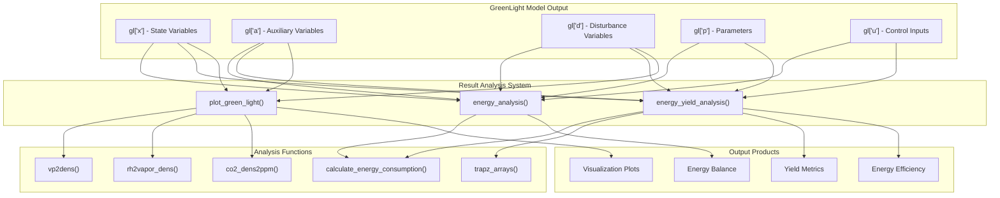
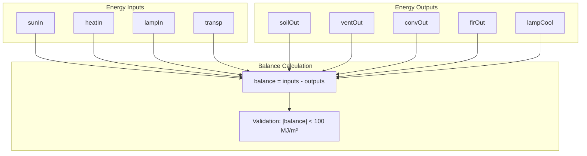
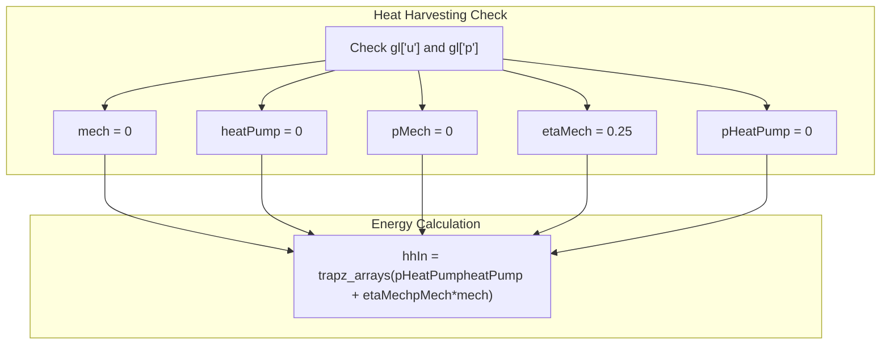
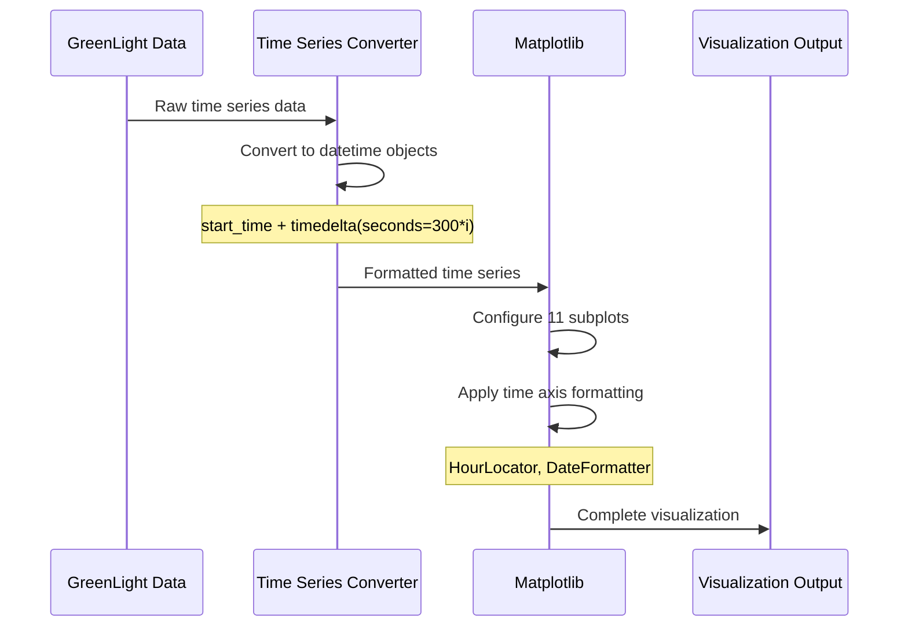
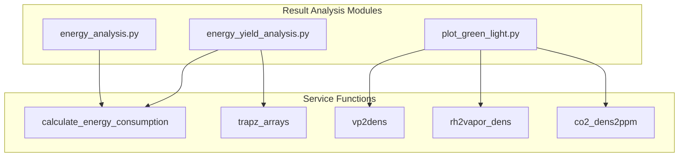

# Result Analysis

> **Relevant source files**
> * [result_analysis/energy_analysis.py](https://github.com/greenpeer/GreenLightPlus/blob/262399d9/result_analysis/energy_analysis.py)
> * [result_analysis/energy_yield_analysis.py](https://github.com/greenpeer/GreenLightPlus/blob/262399d9/result_analysis/energy_yield_analysis.py)
> * [result_analysis/plot_green_light.py](https://github.com/greenpeer/GreenLightPlus/blob/262399d9/result_analysis/plot_green_light.py)

## Purpose and Scope

The Result Analysis system provides comprehensive tools for analyzing simulation results from GreenLight model runs, generating visualizations, and computing energy performance metrics. This system processes the output data structures from completed simulations to produce energy balance calculations, yield analysis, and detailed visualization plots.

For information about running simulations that generate the data analyzed by this system, see [Basic Greenhouse Simulation](/greenpeer/GreenLightPlus/4.1-basic-greenhouse-simulation). For details on the core simulation engine that produces these results, see [GreenLightModel](/greenpeer/GreenLightPlus/2.1-greenlightmodel).

## System Overview

The Result Analysis system consists of three primary modules that work together to transform raw simulation output into actionable insights and visualizations.



Sources: [result_analysis/energy_analysis.py L22-L96](https://github.com/greenpeer/GreenLightPlus/blob/262399d9/result_analysis/energy_analysis.py#L22-L96)

 [result_analysis/energy_yield_analysis.py L20-L99](https://github.com/greenpeer/GreenLightPlus/blob/262399d9/result_analysis/energy_yield_analysis.py#L20-L99)

 [result_analysis/plot_green_light.py L30-L198](https://github.com/greenpeer/GreenLightPlus/blob/262399d9/result_analysis/plot_green_light.py#L30-L198)

## Energy Analysis Module

The `energy_analysis` function provides comprehensive energy balance calculations for greenhouse simulations by analyzing heat flows, energy inputs, and energy losses across all system components.

### Energy Balance Components

| Component | Variable Names | Description |
| --- | --- | --- |
| Solar Input | `rGlobSunAir`, `rParSunCan`, `rNirSunCan`, `rParSunFlr`, `rNirSunFlr`, `rGlobSunCovE` | Solar radiation energy entering the system |
| Heat Input | `hBoilPipe`, `hBoilGroPipe` | Energy from heating systems |
| Transpiration | `lAirThScr`, `lAirBlScr`, `lTopCovIn`, `lCanAir` | Latent heat from plant transpiration |
| Soil Output | `hSo5SoOut` | Heat loss to soil |
| Ventilation Output | `hAirOut`, `hTopOut` | Heat loss through ventilation |
| Convection Output | `hCovEOut` | Convective heat loss |
| Radiative Output | `rCovESky`, `rThScrSky`, `rBlScrSky`, `rCanSky`, `rPipeSky`, `rFlrSky`, `rLampSky` | Long-wave radiation to sky |
| Lamp Input | `qLampIn`, `qIntLampIn` | Energy from artificial lighting |
| Lamp Cooling | `hLampCool` | Heat removed by lamp cooling systems |

### Energy Balance Validation

The system performs automatic validation of energy conservation by computing the total energy balance. A warning is generated if the absolute balance exceeds 100 MJ m⁻².



Sources: [result_analysis/energy_analysis.py L22-L96](https://github.com/greenpeer/GreenLightPlus/blob/262399d9/result_analysis/energy_analysis.py#L22-L96)

## Energy-Yield Analysis Module

The `energy_yield_analysis` function computes the relationship between energy consumption and crop productivity, providing key performance indicators for greenhouse operation efficiency.

### Performance Metrics

The analysis calculates several critical metrics:

* **Energy Consumption**: Separate tracking of lamp energy (`lampIn`), boiler energy (`boilIn`), and heat harvesting energy (`hhIn`)
* **Light Delivery**: PAR light from sun (`parSun`) and lamps (`parLamps`) measured in mol m⁻²
* **Crop Yield**: Fresh weight tomato yield (`yield_fw`) in kg m⁻²
* **Energy Efficiency**: Energy input per unit yield (`efficiency`) in MJ kg⁻¹

### Heat Harvesting Integration

The system handles optional heat harvesting components by setting default values when these systems are not present:



Sources: [result_analysis/energy_yield_analysis.py L34-L64](https://github.com/greenpeer/GreenLightPlus/blob/262399d9/result_analysis/energy_yield_analysis.py#L34-L64)

## Visualization System

The `plot_green_light` function creates comprehensive multi-panel visualizations of simulation results using matplotlib. The system generates 11 subplots covering all major greenhouse variables and processes.

### Plot Configuration

| Subplot | Variables | Description |
| --- | --- | --- |
| 1 | `tAir`, `tOut` | Indoor vs outdoor temperature |
| 2 | `vpAir`, `vpOut` | Indoor vs outdoor vapor pressure |
| 3 | `rhIn`, outdoor RH | Indoor vs outdoor relative humidity |
| 4 | `co2Air`, `co2Out` | CO₂ concentration (mg m⁻³) |
| 5 | `co2InPpm`, outdoor CO₂ | CO₂ concentration (ppm) |
| 6 | `iGlob`, `rParGhSun`, `rParGhLamp`, `qLampIn` | Solar radiation and lighting |
| 7 | PAR from sun and lamps | Photosynthetic photon flux density |
| 8 | `mcAirCan`, `mcAirBuf`, `mcBufAir`, `mcOrgAir` | Carbon assimilation and respiration |
| 9 | `cFruit`, `cStem`, `cLeaf`, `cBuf`, `lai` | Plant biomass and leaf area index |
| 10 | `cFruit`, `mcFruitHar` | Fruit development and harvest |
| 11 | Temperature states | All system temperatures |

### Time Series Processing

The visualization system converts simulation time steps to datetime objects for proper time axis formatting:



Sources: [result_analysis/plot_green_light.py L30-L198](https://github.com/greenpeer/GreenLightPlus/blob/262399d9/result_analysis/plot_green_light.py#L30-L198)

## Integration with Service Functions

The Result Analysis system relies heavily on utility functions from the service functions module for data processing and unit conversions.

### Key Dependencies

| Function | Purpose | Usage Context |
| --- | --- | --- |
| `calculate_energy_consumption` | Computes energy totals from time series | Energy balance calculations |
| `trapz_arrays` | Numerical integration using trapezoidal rule | PAR light and energy totals |
| `vp2dens` | Vapor pressure to density conversion | Humidity calculations |
| `rh2vapor_dens` | Relative humidity to vapor density | Outdoor humidity computation |
| `co2_dens2ppm` | CO₂ density to ppm conversion | CO₂ concentration display |



Sources: [result_analysis/energy_analysis.py L19](https://github.com/greenpeer/GreenLightPlus/blob/262399d9/result_analysis/energy_analysis.py#L19-L19)

 [result_analysis/energy_yield_analysis.py L17](https://github.com/greenpeer/GreenLightPlus/blob/262399d9/result_analysis/energy_yield_analysis.py#L17-L17)

 [result_analysis/plot_green_light.py L24-L27](https://github.com/greenpeer/GreenLightPlus/blob/262399d9/result_analysis/plot_green_light.py#L24-L27)

## Return Values and Data Structures

### Energy Analysis Output

The `energy_analysis` function returns a tuple containing:

```
(sunIn, heatIn, transp, soilOut, ventOut, firOut, lampIn, convOut, lampCool, balance)
```

All values are in MJ m⁻² units representing energy flows over the simulation period.

### Energy-Yield Analysis Output

The `energy_yield_analysis` function returns:

```
(lampIn, boilIn, hhIn, parSun, parLamps, yield_fw, efficiency)
```

Where energy values are in MJ m⁻², PAR values in mol m⁻², yield in kg m⁻², and efficiency in MJ kg⁻¹.

### Visualization Output

The `plot_green_light` function produces a matplotlib figure object with 11 configured subplots, formatted for publication-quality output at 300 DPI resolution.

Sources: [result_analysis/energy_analysis.py L84-L96](https://github.com/greenpeer/GreenLightPlus/blob/262399d9/result_analysis/energy_analysis.py#L84-L96)

 [result_analysis/energy_yield_analysis.py L99](https://github.com/greenpeer/GreenLightPlus/blob/262399d9/result_analysis/energy_yield_analysis.py#L99-L99)

 [result_analysis/plot_green_light.py L41](https://github.com/greenpeer/GreenLightPlus/blob/262399d9/result_analysis/plot_green_light.py#L41-L41)