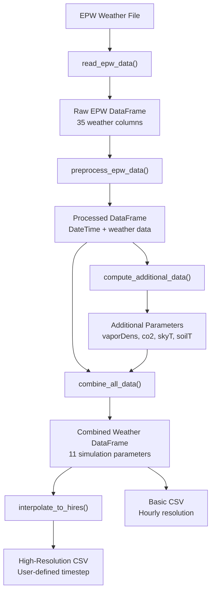
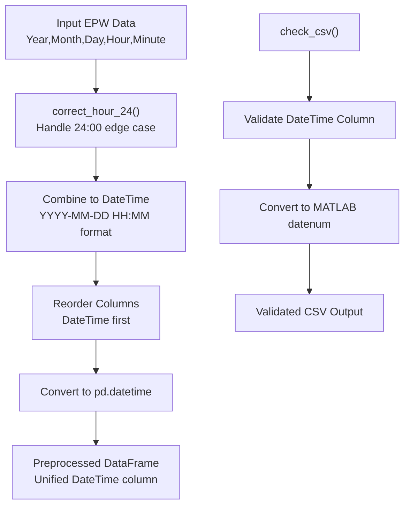
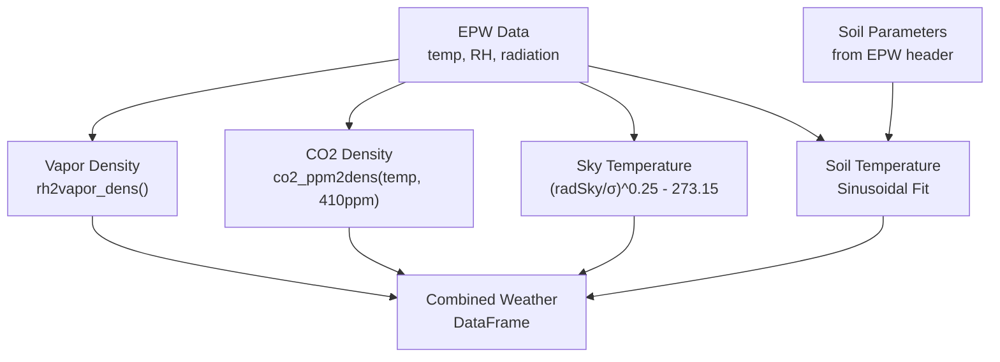
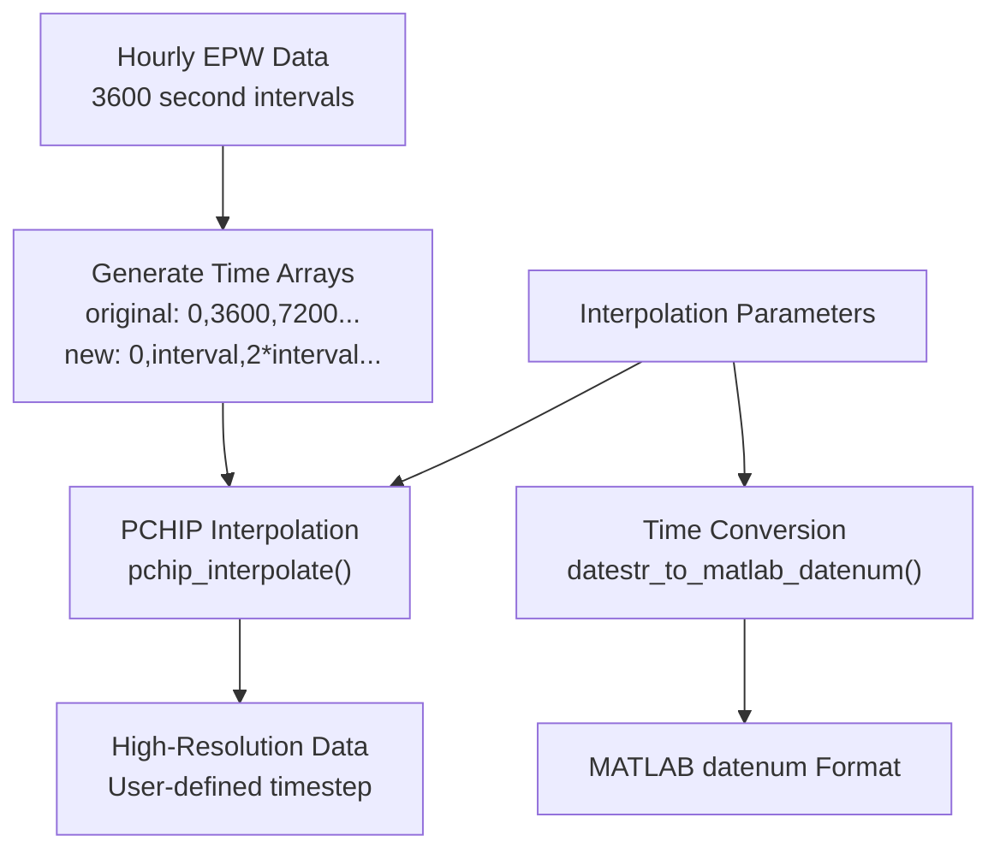
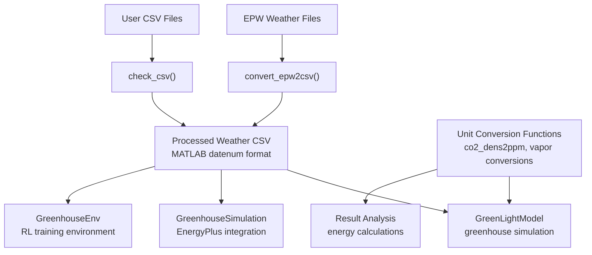

# Service Functions

> **Relevant source files**
> * [service_functions/co2_dens2ppm.py](https://github.com/greenpeer/GreenLightPlus/blob/262399d9/service_functions/co2_dens2ppm.py)
> * [service_functions/convert_epw2csv.py](https://github.com/greenpeer/GreenLightPlus/blob/262399d9/service_functions/convert_epw2csv.py)

## Purpose and Scope

Service Functions provide essential utility operations for data processing, weather file conversion, and unit conversions within the GreenLightPlus system. These functions handle the preprocessing of weather data from EPW (EnergyPlus Weather) format, perform thermodynamic calculations, and ensure data compatibility across different simulation components.

For information about core greenhouse simulation logic, see [GreenLightModel](/greenpeer/GreenLightPlus/2.1-greenlightmodel). For model parameter configuration, see [Model Configuration](/greenpeer/GreenLightPlus/3.3-model-configuration).

## Weather Data Processing Pipeline

The primary workflow of service functions centers around converting raw weather data into a format suitable for greenhouse simulation. The system processes EPW files through multiple stages to generate high-resolution CSV files with computed atmospheric parameters.

### EPW to CSV Conversion Process

Sources: [service_functions/convert_epw2csv.py L450-L511](https://github.com/greenpeer/GreenLightPlus/blob/262399d9/service_functions/convert_epw2csv.py#L450-L511)

The `convert_epw2csv` function orchestrates this entire pipeline, taking an EPW file path, time step, and output folder as parameters. The process begins with `read_epw_data` parsing the EPW file structure and extracting 35 weather parameters into a pandas DataFrame.

### Data Preprocessing and Validation

Sources: [service_functions/convert_epw2csv.py L193-L238](https://github.com/greenpeer/GreenLightPlus/blob/262399d9/service_functions/convert_epw2csv.py#L193-L238)

 [service_functions/convert_epw2csv.py L514-L580](https://github.com/greenpeer/GreenLightPlus/blob/262399d9/service_functions/convert_epw2csv.py#L514-L580)

The preprocessing stage handles time format inconsistencies, particularly the EPW convention of using "24:00" to represent midnight of the following day. The `correct_hour_24` function converts these to "00:00" of the appropriate date to maintain datetime consistency.

## Unit Conversion and Thermodynamic Calculations

Service functions provide critical unit conversions between different atmospheric measurement systems used in greenhouse simulation.

### Atmospheric Parameter Conversions

| Function | Input Parameters | Output | Purpose |
| --- | --- | --- | --- |
| `relative_humidity_to_vapor_density` | temperature (°C), RH (%) | vapor density (kg/m³) | Convert RH to absolute moisture content |
| `vapor_density_to_pressure` | temperature (°C), vapor density (kg/m³) | vapor pressure (Pa) | Calculate vapor pressure from density |
| `co2_ppm_to_density` | temperature (°C), CO2 (ppm) | CO2 density (kg/m³) | Convert molar to mass concentration |
| `co2_dens2ppm` | temperature (°C), CO2 density (kg/m³) | CO2 (ppm) | Convert mass to molar concentration |

Sources: [service_functions/convert_epw2csv.py L42-L126](https://github.com/greenpeer/GreenLightPlus/blob/262399d9/service_functions/convert_epw2csv.py#L42-L126)

 [service_functions/co2_dens2ppm.py L21-L57](https://github.com/greenpeer/GreenLightPlus/blob/262399d9/service_functions/co2_dens2ppm.py#L21-L57)

These conversions use thermodynamic relationships based on the ideal gas law and empirical equations for saturation vapor pressure. The system assumes standard atmospheric pressure (101325 Pa) and uses physical constants defined within each function.

### Additional Parameter Computation

Sources: [service_functions/convert_epw2csv.py L241-L326](https://github.com/greenpeer/GreenLightPlus/blob/262399d9/service_functions/convert_epw2csv.py#L241-L326)

The `compute_additional_data` function derives parameters not directly available in EPW files. CO2 concentration is assumed constant at 410 ppm, sky temperature is calculated from infrared radiation using the Stefan-Boltzmann law, and soil temperature follows an annual sinusoidal pattern fitted to monthly data in the EPW header.

## Data Interpolation and Time Resolution

The system supports multiple time resolutions through interpolation, allowing users to generate high-frequency data from hourly EPW measurements.

### Interpolation Process

Sources: [service_functions/convert_epw2csv.py L383-L417](https://github.com/greenpeer/GreenLightPlus/blob/262399d9/service_functions/convert_epw2csv.py#L383-L417)

 [service_functions/convert_epw2csv.py L420-L447](https://github.com/greenpeer/GreenLightPlus/blob/262399d9/service_functions/convert_epw2csv.py#L420-L447)

The `interpolate_to_hires` function uses piecewise cubic Hermite interpolating polynomial (PCHIP) to generate smooth curves between hourly data points. This preserves the shape of the original data while providing the temporal resolution required for detailed greenhouse simulations.

## Integration with Core Components

Service functions serve as the data preparation layer for the greenhouse simulation ecosystem, providing standardized inputs to core components.

### Data Flow to Core Components

Sources: [service_functions/convert_epw2csv.py L450-L511](https://github.com/greenpeer/GreenLightPlus/blob/262399d9/service_functions/convert_epw2csv.py#L450-L511)

 [service_functions/convert_epw2csv.py L514-L580](https://github.com/greenpeer/GreenLightPlus/blob/262399d9/service_functions/convert_epw2csv.py#L514-L580)

The standardized CSV output contains 11 columns of weather parameters essential for greenhouse simulation: outdoor global irradiation, air temperature, vapor concentration, CO2 concentration, wind speed, sky temperature, soil temperature, daily light sum, elevation, and vapor pressure. The DateTime column uses MATLAB datenum format for compatibility with the core GreenLight model equations.