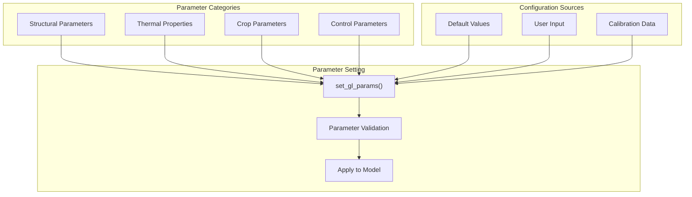

# Supporting Systems

> **Relevant source files**
> * [service_functions/convert_epw2csv.py](https://github.com/greenpeer/GreenLightPlus/blob/262399d9/service_functions/convert_epw2csv.py)

This page documents the utility modules, data processing functions, and auxiliary components that support the four core components of GreenLightPlus. These supporting systems handle data preprocessing, model initialization, parameter configuration, and result analysis operations that are essential for greenhouse simulation workflows.

For information about the core simulation engines, see [Core Components](/greenpeer/GreenLightPlus/2-core-components). For usage examples demonstrating how these supporting systems work together, see [Usage Examples](/greenpeer/GreenLightPlus/4-usage-examples).

## Architecture Overview

The supporting systems in GreenLightPlus form a layered architecture that provides data processing, model setup, and analysis capabilities to the core components. These systems transform raw inputs into simulation-ready data and process simulation outputs into meaningful results.

```

```

Sources: [service_functions/convert_epw2csv.py L1-L632](https://github.com/greenpeer/GreenLightPlus/blob/262399d9/service_functions/convert_epw2csv.py#L1-L632)

## Service Functions

The service functions layer provides fundamental data processing and utility operations used throughout the system. These functions handle weather data conversion, thermodynamic calculations, and unit conversions that are essential for greenhouse simulation.

### Weather Data Processing

The primary weather data processing is handled by the `convert_epw2csv` module, which transforms EnergyPlus Weather (EPW) files into simulation-ready CSV format with additional computed parameters.

```

```

**Core Weather Processing Functions:**

| Function | Purpose | Input | Output |
| --- | --- | --- | --- |
| `read_epw_data()` | Parse EPW file structure | EPW file path | pandas DataFrame with 35 weather columns |
| `preprocess_epw_data()` | Clean and format datetime | Raw EPW DataFrame | Preprocessed DataFrame with unified DateTime |
| `compute_additional_data()` | Calculate derived parameters | Preprocessed data | Vapor density, CO2 density, sky temp, soil temp |
| `combine_all_data()` | Merge all weather parameters | Individual parameter arrays | Combined weather DataFrame |
| `interpolate_to_hires()` | Increase temporal resolution | Hourly data | Sub-hourly interpolated data |

Sources: [service_functions/convert_epw2csv.py L129-L191](https://github.com/greenpeer/GreenLightPlus/blob/262399d9/service_functions/convert_epw2csv.py#L129-L191)

 [service_functions/convert_epw2csv.py L193-L238](https://github.com/greenpeer/GreenLightPlus/blob/262399d9/service_functions/convert_epw2csv.py#L193-L238)

 [service_functions/convert_epw2csv.py L241-L327](https://github.com/greenpeer/GreenLightPlus/blob/262399d9/service_functions/convert_epw2csv.py#L241-L327)

 [service_functions/convert_epw2csv.py L329-L381](https://github.com/greenpeer/GreenLightPlus/blob/262399d9/service_functions/convert_epw2csv.py#L329-L381)

 [service_functions/convert_epw2csv.py L383-L418](https://github.com/greenpeer/GreenLightPlus/blob/262399d9/service_functions/convert_epw2csv.py#L383-L418)

### Thermodynamic Conversions

The system includes specialized conversion functions for greenhouse-relevant thermodynamic properties:

```

```

**Key Conversion Functions:**

* `relative_humidity_to_vapor_density()`: Uses Magnus formula with constants `SATURATION_PRESSURE_PARAMS = [610.78, 238.3, 17.2694, -6140.4, 273, 28.916]`
* `co2_ppm_to_density()`: Applies ideal gas law with `MOLAR_MASS_CO2 = 44.01e-3 kg/mol`
* `datestr_to_matlab_datenum()`: Converts Python datetime to MATLAB datenum format for compatibility

Sources: [service_functions/convert_epw2csv.py L42-L71](https://github.com/greenpeer/GreenLightPlus/blob/262399d9/service_functions/convert_epw2csv.py#L42-L71)

 [service_functions/convert_epw2csv.py L103-L126](https://github.com/greenpeer/GreenLightPlus/blob/262399d9/service_functions/convert_epw2csv.py#L103-L126)

 [service_functions/convert_epw2csv.py L420-L447](https://github.com/greenpeer/GreenLightPlus/blob/262399d9/service_functions/convert_epw2csv.py#L420-L447)

### Data Validation

The `check_csv()` function provides robust validation and standardization of weather data files:

```

```

Sources: [service_functions/convert_epw2csv.py L514-L581](https://github.com/greenpeer/GreenLightPlus/blob/262399d9/service_functions/convert_epw2csv.py#L514-L581)

 [service_functions/convert_epw2csv.py L583-L632](https://github.com/greenpeer/GreenLightPlus/blob/262399d9/service_functions/convert_epw2csv.py#L583-L632)

## Model Creation

Model creation components are responsible for initializing the mathematical structure of the GreenLight model. These modules set up the ordinary differential equation (ODE) system and configure the model's state variables, parameters, and auxiliary calculations.

### ODE System Configuration

The `ode.py` module defines the core differential equation system that governs greenhouse dynamics:

```

```

**Model Creation Components:**

| Module | Responsibility | Key Functions |
| --- | --- | --- |
| `ode.py` | Define ODE system structure | Differential equation definitions |
| `set_gl_params.py` | Set physical parameters | Material properties, greenhouse geometry |
| `set_gl_states.py` | Initialize state variables | Temperature, humidity, CO2 states |
| `set_gl_control.py` | Configure control logic | Heating, ventilation, CO2 control |
| `set_gl_aux.py` | Define auxiliary calculations | Derived variables and constraints |

Sources: Referenced from overall system architecture diagrams

### Parameter Configuration

The parameter configuration system allows customization of greenhouse physical properties, crop characteristics, and control settings:



Sources: Referenced from module dependency architecture

## Model Configuration

The model configuration layer provides advanced customization capabilities for control logic, auxiliary calculations, and system parameters. These components allow users to adapt the simulation to specific greenhouse designs and operational strategies.

### Control Logic Configuration

Control systems in GreenLightPlus manage heating, ventilation, CO2 injection, and other actuators based on setpoints and environmental conditions:

```

```

**Control Configuration Components:**

* Temperature control with heating and ventilation systems
* CO2 enrichment control with injection and natural ventilation
* Humidity control through ventilation and dehumidification
* Lighting control for artificial illumination systems

Sources: Referenced from control logic in system architecture

### Auxiliary Calculations

Auxiliary calculations provide derived variables and intermediate computations that support the main ODE system:

```

```

Sources: Referenced from auxiliary calculations in system architecture

## Result Analysis

The result analysis layer provides tools for processing simulation outputs, generating visualizations, and computing performance metrics. These components transform raw simulation data into actionable insights for greenhouse optimization.

### Visualization Tools

The `plot_green_light.py` module provides comprehensive visualization capabilities for simulation results:

```

```

Sources: Referenced from analysis layer in system architecture

### Energy Analysis

Energy analysis tools compute detailed energy balances, efficiency metrics, and cost calculations:

**Key Analysis Functions:**

| Analysis Type | Metrics Computed | Applications |
| --- | --- | --- |
| Energy Balance | Heat gains/losses, HVAC consumption | System sizing, efficiency optimization |
| Economic Analysis | Operating costs, ROI, payback period | Investment decisions, strategy comparison |
| Environmental Impact | Carbon footprint, resource usage | Sustainability assessment |
| Productivity Analysis | Yield per unit energy, crop quality | Production optimization |

```

```

Sources: Referenced from analysis components in system architecture

The supporting systems form the foundation that enables GreenLightPlus to transform raw environmental data into optimized greenhouse control strategies through a comprehensive pipeline of data processing, model configuration, and result analysis capabilities.