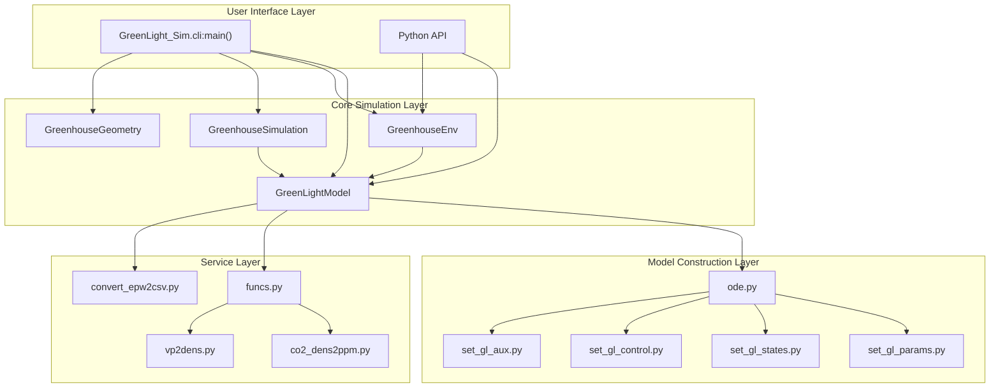
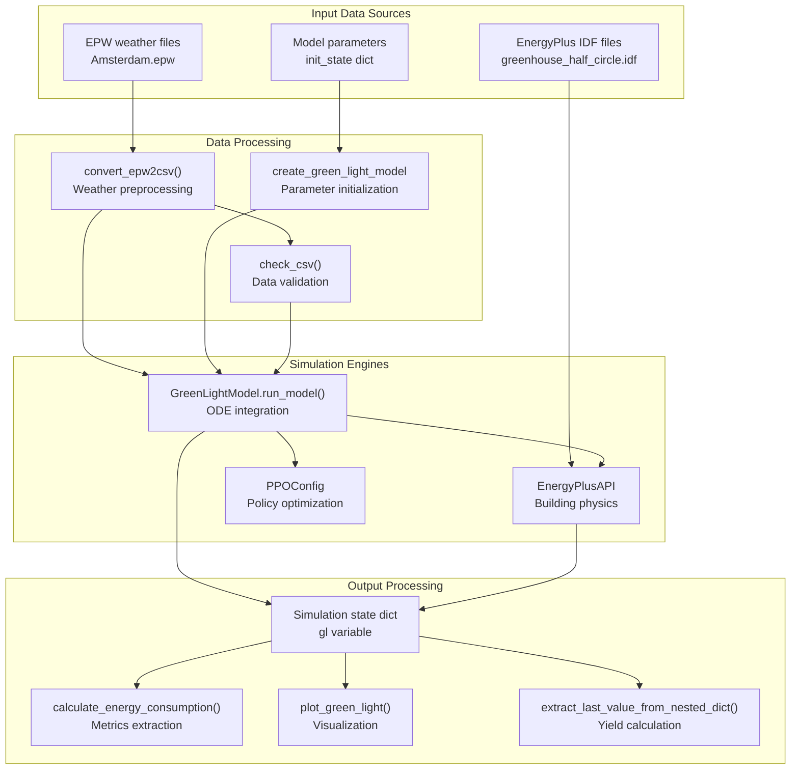
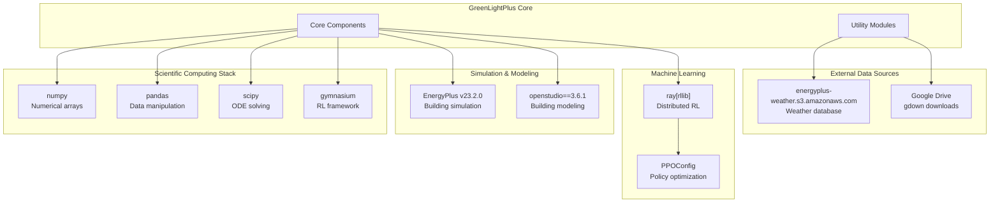
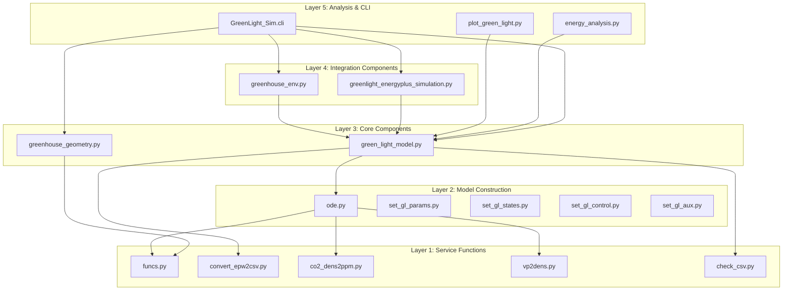

# System Architecture

> **Relevant source files**
> * [README.md](https://github.com/greenpeer/GreenLightPlus/blob/262399d9/README.md)
> * [pyproject.toml](https://github.com/greenpeer/GreenLightPlus/blob/262399d9/pyproject.toml)

## Purpose and Scope

This document provides a comprehensive overview of the GreenLightPlus system architecture, detailing how the four core components interact within the greenhouse simulation and optimization ecosystem. It covers the structural organization of the codebase, component relationships, data flow patterns, and external system integrations.

For installation and setup procedures, see [Installation and Setup](/greenpeer/GreenLightPlus/1.2-installation-and-setup). For detailed documentation of individual components, see [Core Components](/greenpeer/GreenLightPlus/2-core-components). For information about specific utility modules and supporting systems, see [Supporting Systems](/greenpeer/GreenLightPlus/3-supporting-systems).

## Core System Components

GreenLightPlus is built around four primary components that work together to provide comprehensive greenhouse simulation and optimization capabilities:

### Component Overview

```

```

**Core Component Responsibilities:**

| Component | Primary Class | Key Functions | Purpose |
| --- | --- | --- | --- |
| GreenLightModel | `GreenLightModel` | `run_model()`, `solve_ode()` | ODE-based greenhouse simulation |
| GreenhouseGeometry | `GreenhouseGeometry` | `create_houses()` | Geometric structure generation |
| GreenhouseSimulation | `GreenhouseSimulation` | `run()`, `get_results()` | EnergyPlus integration |
| GreenhouseEnv | `GreenhouseEnv` | `step()`, `reset()` | Gymnasium RL interface |

Sources: [README.md L40-L43](https://github.com/greenpeer/GreenLightPlus/blob/262399d9/README.md#L40-L43)

 [README.md L45-L49](https://github.com/greenpeer/GreenLightPlus/blob/262399d9/README.md#L45-L49)

## Component Interaction Architecture

The system follows a hierarchical architecture where `GreenLightModel` serves as the central simulation engine, with other components building upon its functionality:

### Interaction Flow



**Key Interaction Patterns:**

1. **Composition**: `GreenhouseEnv` and `GreenhouseSimulation` both contain and control `GreenLightModel` instances
2. **Dependency**: `GreenLightModel` depends on model construction modules in `create_green_light_model/`
3. **Delegation**: Service functions provide specialized calculations used throughout the system

Sources: [pyproject.toml L48](https://github.com/greenpeer/GreenLightPlus/blob/262399d9/pyproject.toml#L48-L48)

 [README.md L40-L49](https://github.com/greenpeer/GreenLightPlus/blob/262399d9/README.md#L40-L49)

## Data Flow Architecture

The system processes data through a well-defined pipeline from input sources to analysis outputs:

### Data Processing Pipeline



**Data Transformation Stages:**

1. **Input Processing**: Weather data converted from EPW to CSV format using `convert_epw2csv()`
2. **Parameter Initialization**: Model structure defined through `create_green_light_model` modules
3. **Simulation Execution**: ODE system solved via `GreenLightModel.run_model()`
4. **Result Extraction**: Metrics calculated using utility functions like `calculate_energy_consumption()`

Sources: [README.md L179-L262](https://github.com/greenpeer/GreenLightPlus/blob/262399d9/README.md#L179-L262)

 [README.md L296-L331](https://github.com/greenpeer/GreenLightPlus/blob/262399d9/README.md#L296-L331)

## External System Dependencies

GreenLightPlus integrates with several external systems to provide comprehensive simulation capabilities:

### Integration Architecture



**Key External Dependencies:**

| System | Version | Integration Point | Purpose |
| --- | --- | --- | --- |
| EnergyPlus | v23.2.0 | `EnergyPlusAPI` | Building energy simulation |
| OpenStudio | 3.6.1 | IDF file processing | Building model management |
| Ray RLlib | Latest | `PPOConfig`, `GreenhouseEnv` | Distributed RL training |
| SciPy | Latest | `solve_ivp()` in ODE module | Differential equation solving |
| Gymnasium | Latest | `GreenhouseEnv` base class | RL environment framework |

Sources: [pyproject.toml L25-L33](https://github.com/greenpeer/GreenLightPlus/blob/262399d9/pyproject.toml#L25-L33)

 [README.md L55-L90](https://github.com/greenpeer/GreenLightPlus/blob/262399d9/README.md#L55-L90)

## Module Dependency Structure

The codebase is organized into a clear hierarchy of dependencies that supports maintainability and extensibility:

### Dependency Hierarchy



**Architectural Principles:**

1. **Layered Dependencies**: Higher layers depend on lower layers, preventing circular dependencies
2. **Service Layer Isolation**: Core mathematical and conversion functions isolated in service layer
3. **Component Composition**: Integration components compose rather than inherit from core components
4. **Single Responsibility**: Each module has a focused purpose within its layer

Sources: [README.md L40-L49](https://github.com/greenpeer/GreenLightPlus/blob/262399d9/README.md#L40-L49)

 [pyproject.toml L48](https://github.com/greenpeer/GreenLightPlus/blob/262399d9/pyproject.toml#L48-L48)