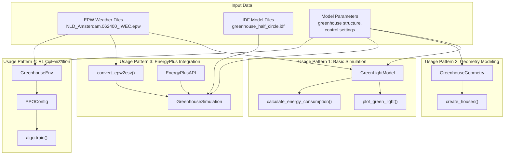
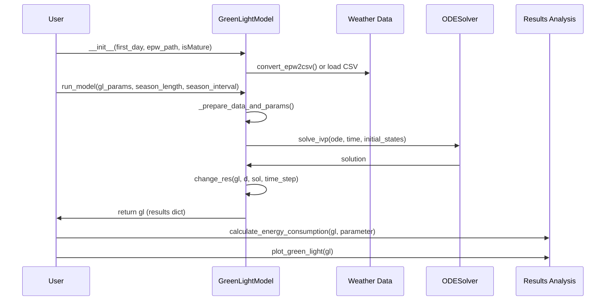
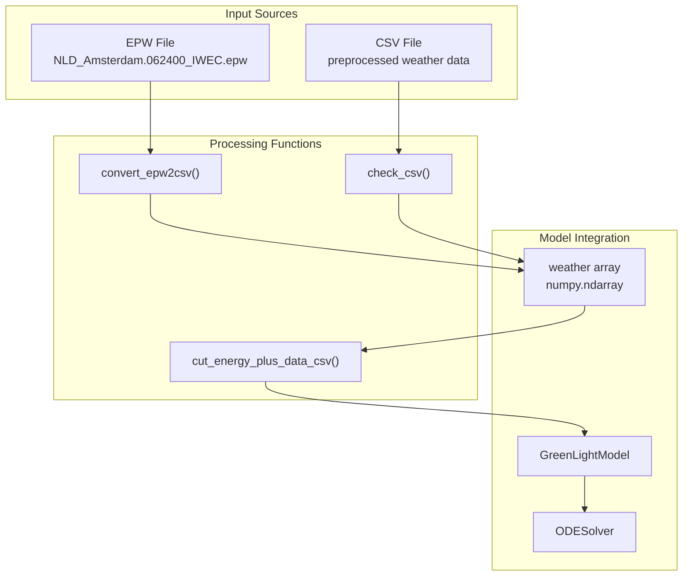

# Usage Examples

> **Relevant source files**
> * [README.md](https://github.com/greenpeer/GreenLightPlus/blob/262399d9/README.md)
> * [core/green_light_model.py](https://github.com/greenpeer/GreenLightPlus/blob/262399d9/core/green_light_model.py)

This document provides practical examples demonstrating how to use GreenLightPlus for various greenhouse simulation and optimization tasks. It covers the four main usage patterns: basic greenhouse simulation, geometry modeling, EnergyPlus integration, and reinforcement learning optimization.

For detailed installation and setup instructions, see [Installation and Setup](/greenpeer/GreenLightPlus/1.2-installation-and-setup). For comprehensive documentation of individual components, see [Core Components](/greenpeer/GreenLightPlus/2-core-components) and [Supporting Systems](/greenpeer/GreenLightPlus/3-supporting-systems).

## Overview of Usage Patterns

GreenLightPlus supports four primary usage patterns, each targeting different aspects of greenhouse modeling and optimization:

### Usage Pattern Workflow



**Sources:** [README.md L99-L450](https://github.com/greenpeer/GreenLightPlus/blob/262399d9/README.md#L99-L450)

### Core Components and Their Roles

```

```

**Sources:** [core/green_light_model.py L38-L56](https://github.com/greenpeer/GreenLightPlus/blob/262399d9/core/green_light_model.py#L38-L56)

 [README.md L38-L49](https://github.com/greenpeer/GreenLightPlus/blob/262399d9/README.md#L38-L49)

## Basic Greenhouse Simulation Workflow

The fundamental usage pattern involves creating a `GreenLightModel` instance, configuring parameters, and running simulations over multiple time steps:

### Simulation Sequence



**Sources:** [core/green_light_model.py L237-L325](https://github.com/greenpeer/GreenLightPlus/blob/262399d9/core/green_light_model.py#L237-L325)

 [README.md L171-L286](https://github.com/greenpeer/GreenLightPlus/blob/262399d9/README.md#L171-L286)

## Key Parameters and Configuration

### Model Initialization Parameters

| Parameter | Type | Description | Default |
| --- | --- | --- | --- |
| `first_day` | int | Initial day of year | 1 |
| `lampType` | str | Lamp type: 'led', 'hps', or 'none' | 'led' |
| `isMature` | bool | Start with mature crop | False |
| `epw_path` | str | Path to weather EPW file | None |
| `csv_path` | str | Path to weather CSV file | None |

### Runtime Parameters

| Parameter | Type | Description | Default |
| --- | --- | --- | --- |
| `season_length` | float | Simulation duration in days | 1/24 |
| `season_interval` | float | Time step interval in days | 1/24/12 |
| `step` | int | Current simulation step | 0 |
| `time_step` | int | Final interpolation time step (seconds) | 60 |

**Sources:** [core/green_light_model.py L58-L88](https://github.com/greenpeer/GreenLightPlus/blob/262399d9/core/green_light_model.py#L58-L88)

 [core/green_light_model.py L237-L246](https://github.com/greenpeer/GreenLightPlus/blob/262399d9/core/green_light_model.py#L237-L246)

## Data Flow and Processing

### Weather Data Processing Pipeline



**Sources:** [core/green_light_model.py L91-L141](https://github.com/greenpeer/GreenLightPlus/blob/262399d9/core/green_light_model.py#L91-L141)

 [service_functions/convert_epw2csv.py](https://github.com/greenpeer/GreenLightPlus/blob/262399d9/service_functions/convert_epw2csv.py)

### Result Analysis Functions

The following functions extract and analyze simulation results:

* `calculate_energy_consumption(gl, *parameters)` - Calculates energy consumption for specified parameters
* `extract_last_value_from_nested_dict(nested_dict)` - Extracts final values from nested result dictionaries
* `plot_green_light(gl)` - Generates comprehensive visualization of simulation results

**Sources:** [service_functions/funcs.py L26-L29](https://github.com/greenpeer/GreenLightPlus/blob/262399d9/service_functions/funcs.py#L26-L29)

 [result_analysis/plot_green_light.py](https://github.com/greenpeer/GreenLightPlus/blob/262399d9/result_analysis/plot_green_light.py)

## Usage Pattern Examples

### Pattern 1: Basic Simulation Loop

```markdown
# Initialize model
model = GreenLightModel(first_day=91, isMature=True, epw_path="weather.epw")

# Run multi-step simulation
for step in range(simulation_steps):
    gl = model.run_model(gl_params=init_state, season_length=10, 
                        season_interval=1, step=step)
    # Process results
    yield = calculate_energy_consumption(gl, 'mcFruitHar')
    energy = calculate_energy_consumption(gl, "qLampIn", "qIntLampIn")
```

### Pattern 2: Geometry Generation

```sql
# Create greenhouse geometry
greenhouse_model = GreenhouseGeometry(
    roof_type="half_circle", slope=22, wall_height=6.5,
    wall_width=4, wall_length=1.67, num_segments=6
)
greenhouse_model.create_houses()
```

### Pattern 3: EnergyPlus Co-simulation

```markdown
# Initialize EnergyPlus simulation
api = EnergyPlusAPI()
simulation = GreenhouseSimulation(api, epw_path, idf_path, csv_path, 
                                 output_directory, first_day, season_length)
simulation.run()
total_yield, lampIn, boilIn = simulation.get_results()
```

### Pattern 4: Reinforcement Learning Training

```go
# Configure PPO algorithm
config = PPOConfig()
config.environment(env=GreenhouseEnv, env_config={...})
algo = config.build()

# Training loop
for episode in range(250):
    result = algo.train()
```

**Sources:** [README.md L179-L441](https://github.com/greenpeer/GreenLightPlus/blob/262399d9/README.md#L179-L441)

## Detailed Examples

For comprehensive step-by-step examples of each usage pattern, see the following pages:

* [Basic Greenhouse Simulation](/greenpeer/GreenLightPlus/4.1-basic-greenhouse-simulation) - Complete walkthrough of `GreenLightModel` usage with parameter configuration and result analysis
* [EnergyPlus Integration](/greenpeer/GreenLightPlus/4.2-energyplus-integration) - Detailed guide to combining GreenLight with EnergyPlus using `GreenhouseSimulation`
* [Reinforcement Learning Training](/greenpeer/GreenLightPlus/4.3-reinforcement-learning-training) - Instructions for training RL agents with `GreenhouseEnv` and Ray RLlib

Each page provides working code examples, parameter explanations, and expected outputs for the respective usage patterns.

**Sources:** [README.md L98-L450](https://github.com/greenpeer/GreenLightPlus/blob/262399d9/README.md#L98-L450)