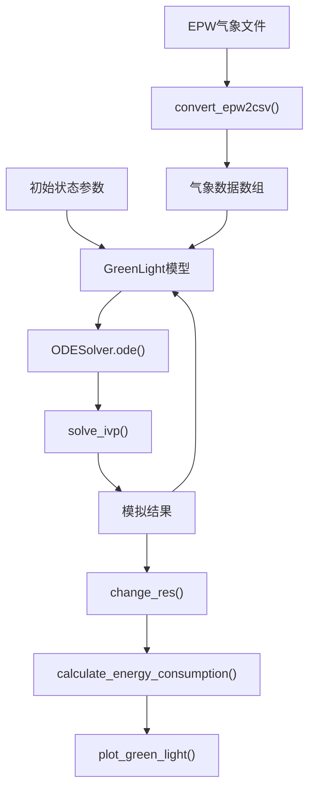
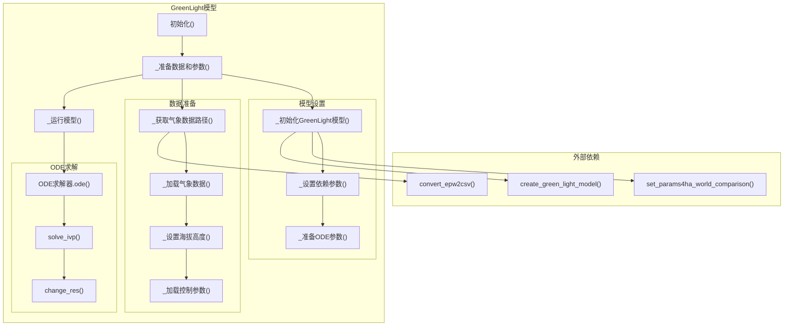

# 基础温室模拟

> **相关源文件**
> * [README.md](https://github.com/greenpeer/GreenLightPlus/blob/262399d9/README.md)
> * [core/green_light_model.py](https://github.com/greenpeer/GreenLightPlus/blob/262399d9/core/green_light_model.py)

## 目的与范围

本文档提供了使用`GreenLightModel`类运行基础温室模拟的逐步指南。它涵盖了在指定时间范围内模拟作物生长、能源消耗和温室环境动态的基本工作流程。

如需高级EnergyPlus集成，请参阅[EnergyPlus集成](/greenpeer/GreenLightPlus/4.2-energyplus-integration)。如需强化学习优化，请参阅[强化学习训练](/greenpeer/GreenLightPlus/4.3-reinforcement-learning-training)。如需详细模型内部结构，请参阅[模型内部结构](/greenpeer/GreenLightPlus/5.2-model-internals)。

## 模拟工作流程概述

基础温室模拟包括初始化`GreenLightModel`实例、配置模拟参数、运行模型时间步长以及分析结果。该模拟整合了天气数据、温室结构参数和控制策略，以预测作物产量和能源消耗。

**基础模拟工作流程**

```

```

来源: [README.md L177-L262](https://github.com/greenpeer/GreenLightPlus/blob/262399d9/README.md#L177-L262)

 [core/green_light_model.py L237-L325](https://github.com/greenpeer/GreenLightPlus/blob/262399d9/core/green_light_model.py#L237-L325)

## 核心组件

基础模拟依赖于`GreenLightModel`类中的几个关键组件:

| 组件 | 用途 | 关键方法 |
| --- | --- | --- |
| 天气数据处理 | 将EPW文件转换为CSV格式 | `_get_weather_data_path()`, `_load_weather_data()` |
| 模型初始化 | 设置温室参数和ODE系统 | `_initialize_green_light_model()`, `_set_dependent_params()` |
| ODE求解器 | 求解植物生长的微分方程 | `run_model()` 配合 `solve_ivp()` |
| 结果处理 | 提取和计算模拟输出 | `change_res()`, `set_gl_aux()` |

来源: [core/green_light_model.py L91-L106](https://github.com/greenpeer/GreenLightPlus/blob/262399d9/core/green_light_model.py#L91-L106)

 [core/green_light_model.py L167-L184](https://github.com/greenpeer/GreenLightPlus/blob/262399d9/core/green_light_model.py#L167-L184)

 [core/green_light_model.py L237-L325](https://github.com/greenpeer/GreenLightPlus/blob/262399d9/core/green_light_model.py#L237-L325)

## 分步实现

### 1. 模型初始化

创建`GreenLightModel`实例并进行基础配置:

```markdown
model = GreenLightModel(
    first_day=91,  # Day of year to start simulation
    isMature=True,  # Start with mature crop
    epw_path="NLD_Amsterdam.062400_IWEC.epw"  # Weather data file
)
```

构造函数初始化关键属性，包括 `first_day`、`lampType`、`isMature` 和 `epw_path`，如 [core/green_light_model.py L58-L88](https://github.com/greenpeer/GreenLightPlus/blob/262399d9/core/green_light_model.py#L58-L88) 所示

### 2. 参数配置

定义温室结构和控制参数：

```css
init_state = {
    "p": {
        'psi': 22,           # Greenhouse cover slope (degrees)
        'aFlr': 4e4,         # Floor area (m²)
        'aCov': 4.84e4,      # Cover area (m²)
        'hAir': 6.3,         # Main compartment height (m)
        'co2SpDay': 1000,    # CO2 setpoint light period (ppm)
        'tSpNight': 18.5,    # Temperature setpoint night (°C)
        'tSpDay': 19.5,      # Temperature setpoint day (°C)
        'pBoil': 300*4e4,    # Boiler capacity (W)
    }
}
```

### 3. 模拟循环

在多个时间步长上执行模拟:

```sql
for current_step in range(int(season_length // season_interval)):
    gl = model.run_model(
        gl_params=init_state, 
        season_length=season_length,
        season_interval=season_interval, 
        step=current_step
    )
    init_state = gl  # Update state for next iteration
```

### 4. 结果分析

从模拟结果中提取关键指标:

```markdown
# 计算果实产量
current_yield = 1e-6 * calculate_energy_consumption(gl, 'mcFruitHar') / dmc

# 计算能耗
lampIn += 1e-6 * calculate_energy_consumption(gl, "qLampIn", "qIntLampIn")
boilIn += 1e-6 * calculate_energy_consumption(gl, "hBoilPipe", "hBoilGroPipe")
```

来源: [README.md L235-L258](https://github.com/greenpeer/GreenLightPlus/blob/262399d9/README.md#L235-L258)

## 数据流架构

**模拟数据流**



来源: [core/green_light_model.py L91-L106](https://github.com/greenpeer/GreenLightPlus/blob/262399d9/core/green_light_model.py#L91-L106)

 [core/green_light_model.py L207-L236](https://github.com/greenpeer/GreenLightPlus/blob/262399d9/core/green_light_model.py#L207-L236)

 [core/green_light_model.py L311-L325](https://github.com/greenpeer/GreenLightPlus/blob/262399d9/core/green_light_model.py#L311-L325)

## 组件交互

**GreenLightModel 内部架构**



源码位置: [core/green_light_model.py L207-L236](https://github.com/greenpeer/GreenLightPlus/blob/262399d9/core/green_light_model.py#L207-L236)

 [core/green_light_model.py L167-L184](https://github.com/greenpeer/GreenLightPlus/blob/262399d9/core/green_light_model.py#L167-L184)

 [core/green_light_model.py L237-L325](https://github.com/greenpeer/GreenLightPlus/blob/262399d9/core/green_light_model.py#L237-L325)

## 关键模拟参数

### 时间参数

* `season_length`: 模拟总时长(天)
* `season_interval`: 时间步长间隔(天) 
* `first_day`: 起始日期(1-365)
* `time_step`: 最终输出分辨率(秒，默认60)

### 模型配置

* `isMature`: 成熟作物初始化的布尔标志
* `lampType`: 照明系统类型("led", "hps", "none")
* `epw_path`: EnergyPlus天气文件路径
* `csv_path`: 可选预处理天气数据路径

### 温室结构

* `aFlr`: 地面面积(m²)
* `aCov`: 包含侧墙的覆盖面积(m²)
* `hAir`: 主空间高度(m)
* `psi`: 温室覆盖平均坡度(度)

源码位置: [core/green_light_model.py L58-L88](https://github.com/greenpeer/GreenLightPlus/blob/262399d9/core/green_light_model.py#L58-L88)

 [core/green_light_model.py L237-L262](https://github.com/greenpeer/GreenLightPlus/blob/262399d9/core/green_light_model.py#L237-L262)

 [README.md L205-L232](https://github.com/greenpeer/GreenLightPlus/blob/262399d9/README.md#L205-L232)

## ODE求解器配置

模拟使用`scipy.integrate.solve_ivp`并采用以下配置:

```css
options = {
    "atol": 1e-6,  # Absolute tolerance
    "rtol": 1e-3,  # Relative tolerance
}
solver = "BDF"  # Backward Differentiation Formula
```

求解器使用`self.gl["x"]`中的初始条件，在`self.gl["t"]`定义的时间范围内对`ODESolver.ode()`中定义的微分方程组进行积分。

源码位置: [core/green_light_model.py L299-L319](https://github.com/greenpeer/GreenLightPlus/blob/262399d9/core/green_light_model.py#L299-L319)

## 结果输出结构

模拟返回一个包含完整数据的字典`gl`，其中包含:

* `x`: 状态变量(温度、浓度、植物重量)
* `a`: 辅助变量(计算得到的环境条件) 
* `u`: 控制变量(加热、通风、CO2注入)
* `d`: 干扰变量(天气输入)
* `p`: 参数(结构和控制设置)
* `t`: 时间向量

关键输出指标包括作物产量(`mcFruitHar`)、能耗(`qLampIn`, `hBoilPipe`)和环境条件(温度、湿度、CO2)。

源码位置: [README.md L244-L258](https://github.com/greenpeer/GreenLightPlus/blob/262399d9/README.md#L244-L258)

 [core/green_light_model.py L322-L325](https://github.com/greenpeer/GreenLightPlus/blob/262399d9/core/green_light_model.py#L322-L325)