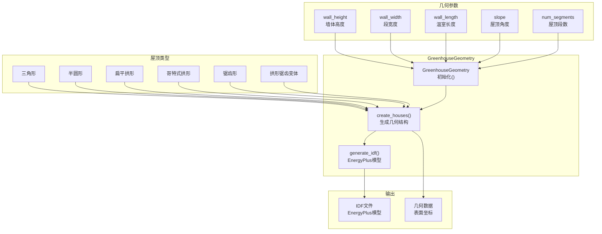
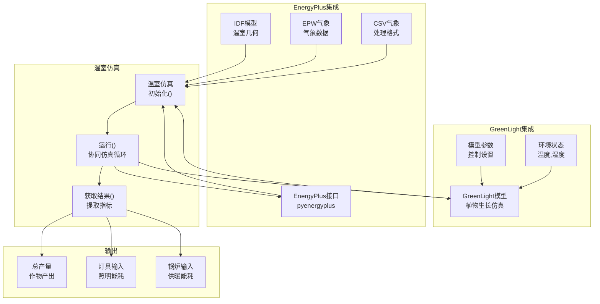
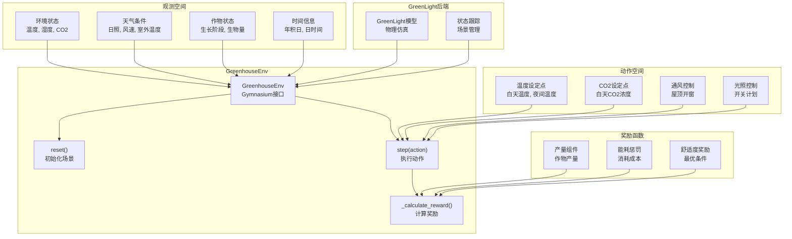
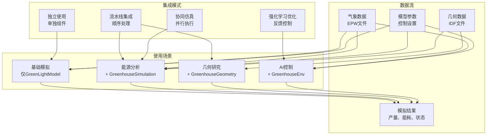

# 核心组件

> **相关源文件**
> * [README.md](https://github.com/greenpeer/GreenLightPlus/blob/262399d9/README.md)

本文档介绍了构成GreenLightPlus计算基础的四个主要模拟组件。这些组件负责温室物理建模、能源分析、强化学习优化和结构几何生成。

有关支持工具和模型配置的信息，请参阅[支持系统](/greenpeer/GreenLightPlus/3-supporting-systems)。要查看这些组件的实际应用示例，请参阅[使用示例](/greenpeer/GreenLightPlus/4-usage-examples)。

## 概述

GreenLightPlus由四个核心组件组成，它们协同工作提供全面的温室模拟和优化功能：

```

```

**组件交互架构**

来源: [README.md L38-L44](https://github.com/greenpeer/GreenLightPlus/blob/262399d9/README.md#L38-L44)

 [README.md L100-L159](https://github.com/greenpeer/GreenLightPlus/blob/262399d9/README.md#L100-L159)

 [README.md L171-L262](https://github.com/greenpeer/GreenLightPlus/blob/262399d9/README.md#L171-L262)

 [README.md L288-L331](https://github.com/greenpeer/GreenLightPlus/blob/262399d9/README.md#L288-L331)

 [README.md L341-L441](https://github.com/greenpeer/GreenLightPlus/blob/262399d9/README.md#L341-L441)

| 组件 | 主要功能 | 关键依赖 | 输出 |
| --- | --- | --- | --- |
| `GreenLightModel` | 核心温室物理模拟 | ODE求解器, 气象数据 | 环境状态, 作物生长 |
| `GreenhouseGeometry` | 结构建模和IDF生成 | 几何参数 | EnergyPlus模型文件 |
| `GreenhouseSimulation` | 与EnergyPlus的协同模拟 | GreenLightModel, EnergyPlus API | 详细能耗数据 |
| `GreenhouseEnv` | 强化学习环境 | GreenLightModel, Gymnasium | RL训练接口 |

## GreenLightModel

`GreenLightModel`类作为核心模拟引擎，实现了温室环境物理和作物生长动态的核心模拟功能，该功能最初是在MATLAB GreenLight中开发的。

```

```

**GreenLightModel 内部架构**

`GreenLightModel` 实现了离散时间模拟，每个时间步包含以下步骤：

1. **状态积分**：求解 [create_green_light_model/ode.py](https://github.com/greenpeer/GreenLightPlus/blob/262399d9/create_green_light_model/ode.py) 中定义的微分方程组
2. **辅助计算**：通过 [create_green_light_model/set_gl_aux.py](https://github.com/greenpeer/GreenLightPlus/blob/262399d9/create_green_light_model/set_gl_aux.py) 计算派生变量
3. **控制更新**：应用来自 [create_green_light_model/set_gl_control.py](https://github.com/greenpeer/GreenLightPlus/blob/262399d9/create_green_light_model/set_gl_control.py) 的温室控制逻辑

### 关键方法

* `__init__(first_day, isMature, epw_path)`：使用气象数据和作物成熟状态初始化模型
* `run_model(gl_params, season_length, season_interval, step)`：执行指定时间段的模拟
* `create_green_light_model()`：设置初始模型结构和参数

### 模拟参数

模型接受包含以下内容的结构化参数字典：

| 参数类别 | 关键示例 | 用途 |
| --- | --- | --- |
| 结构 | `aFlr`, `aCov`, `hAir` | 温室几何参数 |
| 控制 | `tSpDay`, `tSpNight`, `co2SpDay` | 环境设定值 |
| 设备 | `pBoil`, `phiExtCo2`, `lPipe` | 加热和CO2系统 |

来源: [README.md L179-L262](https://github.com/greenpeer/GreenLightPlus/blob/262399d9/README.md#L179-L262)

 [green_light_model.py](https://github.com/greenpeer/GreenLightPlus/blob/262399d9/green_light_model.py)

## GreenhouseGeometry

`GreenhouseGeometry` 类为不同的温室屋顶结构生成几何模型，并创建相应的 EnergyPlus IDF 文件用于详细能耗分析。



**GreenhouseGeometry 处理流程**

### 支持的屋顶类型

`GreenhouseGeometry` 类支持六种不同的屋顶配置：

| 屋顶类型 | 描述 | 典型应用场景 |
| --- | --- | --- |
| `triangle` | 标准尖顶 | 传统温室 |
| `half_circle` | 半圆形拱顶 | 现代多跨结构 |
| `flat_arch` | 扁平拱形 | 低矮安装环境 |
| `gothic_arch` | 哥特式尖拱 | 高透光率需求 |
| `sawtooth` | 不对称锯齿形 | 均匀光线分布 |
| `sawtooth_arch` | 拱形锯齿变体 | 增强结构强度 |

### 配置参数

关键初始化参数控制几何生成：

* `roof_type`: 从可用屋顶配置中选择
* `wall_height`, `wall_width`, `wall_length`: 基本尺寸参数
* `num_segments`: 多跨结构的屋顶跨数
* `slope`: 屋顶角度（度）
* `number_width`, `number_length`: 大型设施的阵列缩放参数

### 输出生成

`create_houses()` 方法生成：

1. **IDF 文件**: 兼容EnergyPlus的建筑模型，用于能源模拟
2. **几何数据**: 表面坐标和区域定义
3. **可视化**: 可选生成的3D结构展示

来源: [README.md L100-L169](https://github.com/greenpeer/GreenLightPlus/blob/262399d9/README.md#L100-L169)

 [greenhouse_geometry.py](https://github.com/greenpeer/GreenLightPlus/blob/262399d9/greenhouse_geometry.py)

## GreenhouseSimulation

`GreenhouseSimulation` 类将 `GreenLightModel` 与 EnergyPlus 集成，通过联合仿真提供详细的能耗分析。



**GreenhouseSimulation 协同仿真架构**

### 协同仿真流程

`GreenhouseSimulation` 通过时间步进方法协调 GreenLight 和 EnergyPlus：

1. **初始化**：建立 EnergyPlus API 连接和 GreenLight 模型
2. **时间循环**：交替执行 GreenLight 植物仿真和 EnergyPlus 建筑仿真  
3. **数据交换**：在模型间传递环境条件和能源负荷
4. **结果收集**：汇总作物产量和能源消耗指标

### 必要输入

| 输入类型 | 参数 | 用途 |
| --- | --- | --- |
| 气象数据 | `epw_path` | 气象边界条件 |
| 模型数据 | `idf_path` | EnergyPlus 建筑几何 |
| 仿真参数 | `first_day`, `season_length` | 时间边界 |
| 处理数据 | `csv_path` | 转换后的气象数据 |

### 输出指标

仿真产生三个主要指标：

* **总产量**：作物产量（kg/m²）
* **灯具能耗**：人工照明能耗（MJ/m²）  
* **锅炉能耗**：供暖能耗（MJ/m²）

### 与 GreenhouseGeometry 的集成

`GreenhouseSimulation` 通常使用 `GreenhouseGeometry` 生成的 IDF 文件，以确保结构建模与能源分析的一致性。

来源: [README.md L288-L340](https://github.com/greenpeer/GreenLightPlus/blob/262399d9/README.md#L288-L340)

 [greenlight_energyplus_simulation.py](https://github.com/greenpeer/GreenLightPlus/blob/262399d9/greenlight_energyplus_simulation.py)

## GreenhouseEnv

`GreenhouseEnv` 类实现了兼容 Gymnasium 的强化学习环境，用于训练 AI 代理优化温室控制策略。



**GreenhouseEnv 强化学习接口**

### 环境配置

`GreenhouseEnv` 通过 `env_config` 接受全面配置：

| 配置项 | 参数 | 用途 |
| --- | --- | --- |
| 时间相关 | `first_day`, `season_length`, `season_interval` | 模拟时间设置 |
| 目标值 | `target_yield`, `target_yield_unit_energy_input` | 优化目标 |
| 天气 | `epw_path` | 环境边界条件 |
| 作物 | `isMature` | 生长阶段指定 |
| 初始状态 | `init_state["p"]` | 温室参数 |

### 动作空间

环境支持多维连续控制动作：

* **温度设定点**：白天和夜晚的温度目标
* **CO2浓度**：光合作用优化
* **通风设置**：屋顶开窗百分比
* **光照计划**：补光控制

### 观测空间

观测向量包含：

* **环境变量**：当前温度、湿度、CO2水平
* **天气数据**：太阳辐射、室外温度、风速
* **作物指标**：生长阶段、叶面积指数、生物量积累
* **时间上下文**：一天中的时间、一年中的天数、季节进度

### 奖励结构

奖励函数平衡多个目标：

```
reward = yield_component - energy_penalty + comfort_bonus
```

其中：

* `yield_component`: 鼓励作物生产
* `energy_penalty`: 惩罚过度能源消耗  
* `comfort_bonus`: 奖励维持最佳生长条件

### 与Ray RLlib的集成

该环境兼容Ray RLlib算法，特别是用于温室控制优化的PPO算法。训练过程通常包括：

1. **经验收集**: 通过环境交互获取经验数据
2. **策略更新**: 学习改进的控制策略
3. **检查点管理**: 保存训练好的模型用于部署

来源: [README.md L341-L451](https://github.com/greenpeer/GreenLightPlus/blob/262399d9/README.md#L341-L451)

 [greenhouse_env.py](https://github.com/greenpeer/GreenLightPlus/blob/262399d9/greenhouse_env.py)

## 组件集成模式

四个核心组件遵循成熟的集成模式，以实现灵活的系统组合：



**组件集成与使用模式**

### 常见集成场景

1. **独立模拟**: 直接使用 `GreenLightModel` 进行基础温室分析
2. **能源分析**: `GreenhouseSimulation` + `GreenLightModel` 用于详细能耗分析
3. **几何研究**: `GreenhouseGeometry` + `GreenhouseSimulation` 用于结构优化
4. **AI驱动控制**: `GreenhouseEnv` + `GreenLightModel` 用于强化学习优化

### 数据交换协议

组件通过标准化接口交换数据:

* **气象数据**: EPW格式处理后转为CSV供模型使用
* **状态变量**: 包含环境和作物状态的嵌套字典
* **参数配置**: 带有验证的结构化配置对象
* **结果输出**: 产量、能耗和环境条件的标准化指标

来源: [README.md L171-L451](https://github.com/greenpeer/GreenLightPlus/blob/262399d9/README.md#L171-L451)