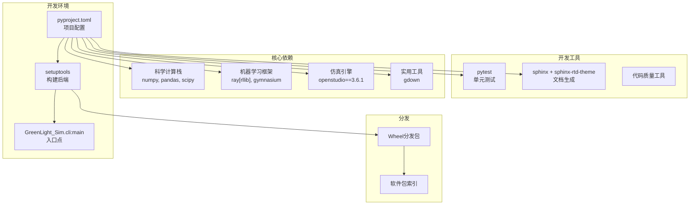
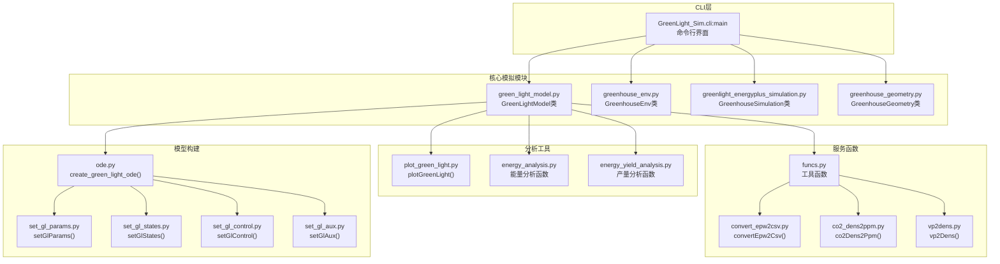

# 开发指南

> **相关源文件**
> * [LICENSE.txt](https://github.com/greenpeer/GreenLightPlus/blob/262399d9/LICENSE.txt)
> * [pyproject.toml](https://github.com/greenpeer/GreenLightPlus/blob/262399d9/pyproject.toml)

本节为想要贡献或扩展GreenLightPlus的开发者提供相关信息。内容包括项目结构、开发环境设置以及代码库贡献指南。

有关内部模型结构和算法的详细信息，请参阅[模型内部结构](/greenpeer/GreenLightPlus/5.2-model-internals)。关于贡献指南和许可信息，请参阅[贡献指南](/greenpeer/GreenLightPlus/5.3-contributing)。

## 开发环境

GreenLightPlus采用现代Python包的形式构建，使用`setuptools`构建系统和声明式配置方法。项目要求Python 3.8+版本，并集成了多个外部仿真和机器学习框架。

### 构建系统与依赖

项目使用标准Python打包结构，定义在[pyproject.toml L1-L55](https://github.com/greenpeer/GreenLightPlus/blob/262399d9/pyproject.toml#L1-L55):

| 组件 | 版本/要求 | 用途 |
| --- | --- | --- |
| Python | >=3.8 | 运行时环境 |
| setuptools | >=61.0 | 构建后端 |
| numpy, pandas, scipy | 最新版 | 核心科学计算 |
| gymnasium | 最新版 | 强化学习环境框架 |
| openstudio | ==3.6.1 | EnergyPlus集成 |
| ray[rllib] | 最新版 | 分布式强化学习训练 |
| gdown | 最新版 | 模型文件下载 |

项目包含用于测试和文档的可选开发依赖：

* `pytest` 用于单元测试
* `sphinx` 和 `sphinx-rtd-theme` 用于文档生成

### 包入口点

主CLI接口通过`GreenLightPlus`命令暴露，该命令映射到`GreenLight_Sim.cli:main`，定义在[pyproject.toml L47-L48](https://github.com/greenpeer/GreenLightPlus/blob/262399d9/pyproject.toml#L47-L48)

## 开发工作流

### 开发工具集成

**开发工作流架构**

该图表展示了开发环境如何围绕`pyproject.toml`中的声明式配置进行构建，该文件同时管理运行时依赖和开发工具。

来源: [pyproject.toml L1-L55](https://github.com/greenpeer/GreenLightPlus/blob/262399d9/pyproject.toml#L1-L55)

### 代码架构概览

**核心代码架构与函数命名**

此图表将高级系统组件映射到代码库中的实际实现，展示了开发者将会遇到的主要类和函数。

来源: [pyproject.toml L47-L48](https://github.com/greenpeer/GreenLightPlus/blob/262399d9/pyproject.toml#L47-L48)

## 许可与法律框架

GreenLightPlus 采用 GNU 通用公共许可证第3版 (GPL v3)，详见 [LICENSE.txt L1-L675](https://github.com/greenpeer/GreenLightPlus/blob/262399d9/LICENSE.txt#L1-L675)

 该著佐权许可证对开发有重要影响:

### GPL v3 关键要求

| 要求 | 对开发的影响 |
| --- | --- |
| 源代码可用性 | 所有分发版本必须包含源代码 |
| 衍生作品许可 | 扩展必须与 GPL v3 兼容 |
| 版权声明 | 必须保留现有版权和许可声明 |
| 安装信息 | 必须为用户产品提供安装说明 |

GPL v3 许可证确保 GreenLightPlus 保持自由开源，但开发者必须确保任何贡献或衍生作品符合许可条款。

### 项目元数据

项目由 Daidai Qiu ([qiu.daidai@outlook.com](mailto:qiu.daidai@outlook.com)) 维护，分类为:

* 开发状态: Alpha
* 目标受众: 科研领域
* 主题: 科学/工程

来源: [pyproject.toml L8-L24](https://github.com/greenpeer/GreenLightPlus/blob/262399d9/pyproject.toml#L8-L24)

 [LICENSE.txt L1-L675](https://github.com/greenpeer/GreenLightPlus/blob/262399d9/LICENSE.txt#L1-L675)

## 集成点

### 外部系统依赖

GreenLightPlus 集成了开发者需要了解的多个外部系统:

1. **EnergyPlus 3.6.1**: 通过 OpenStudio 访问的建筑能源模拟引擎
2. **Ray RLlib**: 用于智能体训练的分布式强化学习框架
3. **Gymnasium**: 用于智能体-环境交互的标准RL环境接口

### Python 版本兼容性

代码库支持 Python 3.8、3.9 和 3.10，详见 [pyproject.toml L20-L22](https://github.com/greenpeer/GreenLightPlus/blob/262399d9/pyproject.toml#L20-L22)

 开发者在贡献时应确保跨版本兼容性。

## 开发标准

### 包结构

项目遵循标准 Python 包规范，通过 [pyproject.toml L53-L54](https://github.com/greenpeer/GreenLightPlus/blob/262399d9/pyproject.toml#L53-L54) 启用 setuptools 自动发现功能。`include-package-data = true` 指令确保非 Python 文件包含在分发中。

### 命令行接口

主入口点通过 `GreenLightPlus` 命令提供统一的功能接口，实现在 `GreenLight_Sim.cli` 模块中。

来源: [pyproject.toml L1-L55](https://github.com/greenpeer/GreenLightPlus/blob/262399d9/pyproject.toml#L1-L55)

 [LICENSE.txt L1-L675](https://github.com/greenpeer/GreenLightPlus/blob/262399d9/LICENSE.txt#L1-L675)