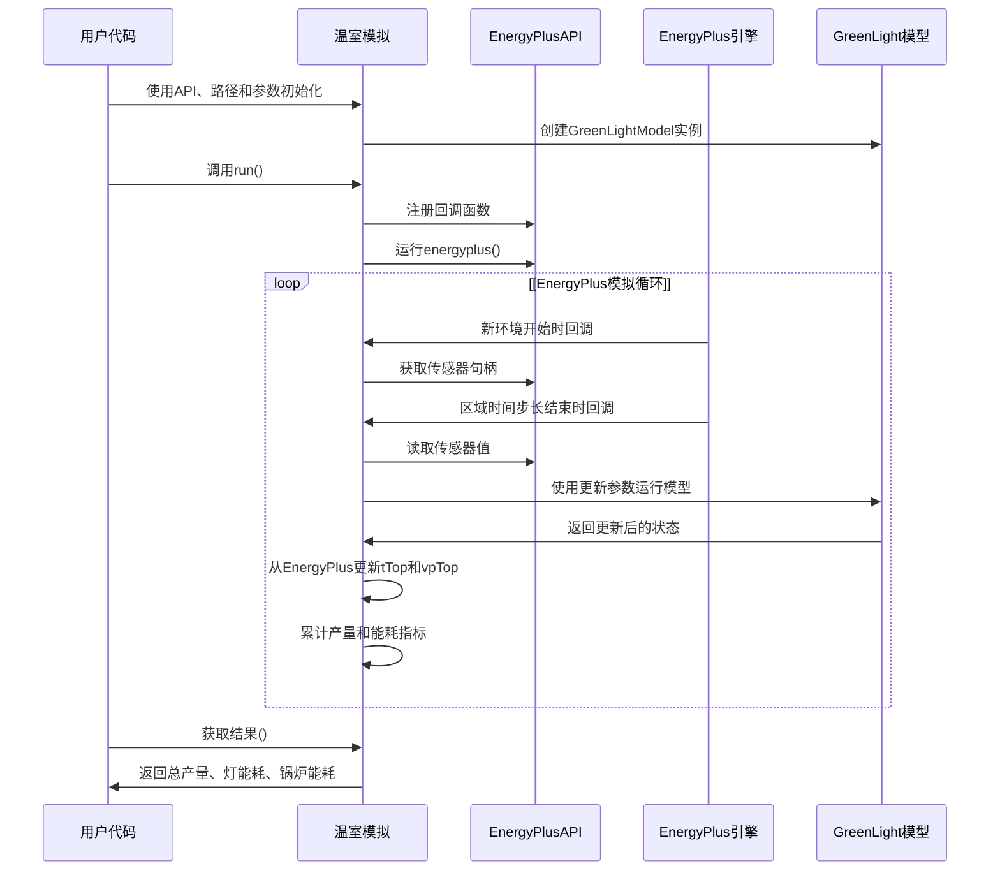
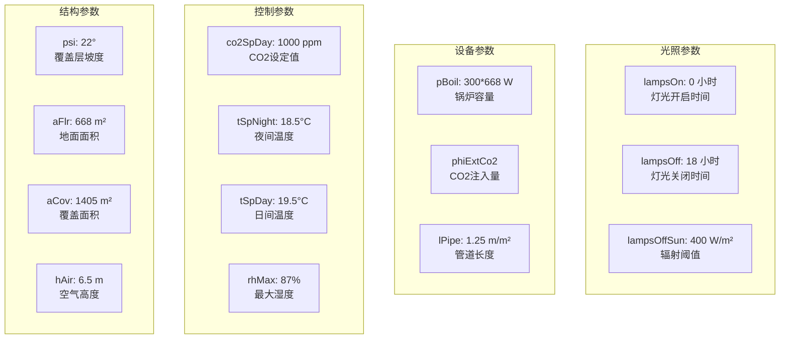

# EnergyPlus 集成

> **相关源文件**
> * [README.md](https://github.com/greenpeer/GreenLightPlus/blob/262399d9/README.md)
> * [core/greenlight_energyplus_simulation.py](https://github.com/greenpeer/GreenLightPlus/blob/262399d9/core/greenlight_energyplus_simulation.py)

本文档介绍 GreenLightPlus 中的 EnergyPlus 集成子系统，该系统实现了建筑能耗模拟与温室作物生长模型的耦合。该集成将 EnergyPlus 的建筑物理模拟与 GreenLight 作物模型相结合，提供全面的能耗分析和产量预测。

有关不使用 EnergyPlus 的基础温室模拟信息，请参阅[基础温室模拟](/greenpeer/GreenLightPlus/4.1-basic-greenhouse-simulation)。关于独立 GreenLight 模型的详细信息，请参阅[GreenLightModel](/greenpeer/GreenLightPlus/2.1-greenlightmodel)。

## 概述

EnergyPlus 集成使 GreenLightPlus 能够利用 EnergyPlus v23.2.0 进行详细的建筑能耗模拟，同时保留 GreenLight 模型中的复杂作物生长建模。这种协同模拟方法通过考虑详细的建筑物理特性、HVAC 系统和环境控制交互，提供了更精确的能耗计算。

```

```

**EnergyPlus 集成数据流**

来源: [core/greenlight_energyplus_simulation.py L1-L233](https://github.com/greenpeer/GreenLightPlus/blob/262399d9/core/greenlight_energyplus_simulation.py#L1-L233)

 [README.md L288-L340](https://github.com/greenpeer/GreenLightPlus/blob/262399d9/README.md#L288-L340)

## 核心集成组件

`GreenhouseSimulation` 类作为主要的集成控制器，管理 EnergyPlus 和 GreenLight 模型之间的协同模拟。

### GreenhouseSimulation 类结构

| 组件 | 用途 | 关键方法 |
| --- | --- | --- |
| 构造函数 | 初始化模拟参数 | `__init__()` |
| EnergyPlus 回调 | 处理模拟事件 | `on_begin_new_environment()`, `on_end_of_zone_timestep_after_zone_reporting()` |
| 模型集成 | 在 EnergyPlus 时间步长内运行 GreenLight | 通过传感器句柄进行数据交换 |
| 结果收集 | 汇总产量和能耗指标 | `get_results()` |

```

```

**GreenhouseSimulation 组件交互**

来源: [core/greenlight_energyplus_simulation.py L15-L93](https://github.com/greenpeer/GreenLightPlus/blob/262399d9/core/greenlight_energyplus_simulation.py#L15-L93)

 [core/greenlight_energyplus_simulation.py L208-L232](https://github.com/greenpeer/GreenLightPlus/blob/262399d9/core/greenlight_energyplus_simulation.py#L208-L232)

## 数据交换机制

该集成通过传感器句柄和状态变量更新实现了 EnergyPlus 和 GreenLight 模型之间的双向数据交换。

### 传感器句柄配置

```

```

**EnergyPlus与GreenLight之间的数据交换**

数据交换通过`on_end_of_zone_timestep_after_zone_reporting`回调函数在每个EnergyPlus时间步长内进行：

1. **读取EnergyPlus数值**：从EnergyPlus区域获取温度和湿度数据
2. **单位转换**：利用大气压力计算将湿度比转换为蒸汽压
3. **更新GreenLight状态**：替换模型状态中的`tTop`和`vpTop`值
4. **继续模拟**：GreenLight模型使用更新后的环境条件

来源: [core/greenlight_energyplus_simulation.py L94-L125](https://github.com/greenpeer/GreenLightPlus/blob/262399d9/core/greenlight_energyplus_simulation.py#L94-L125)

 [core/greenlight_energyplus_simulation.py L132-L207](https://github.com/greenpeer/GreenLightPlus/blob/262399d9/core/greenlight_energyplus_simulation.py#L132-L207)

## 模拟工作流程

该集成遵循结构化工作流程，协调EnergyPlus建筑模拟与GreenLight作物建模。



**协同仿真流程**

来源: [core/greenlight_energyplus_simulation.py L208-L232](https://github.com/greenpeer/GreenLightPlus/blob/262399d9/core/greenlight_energyplus_simulation.py#L208-L232)

 [core/greenlight_energyplus_simulation.py L132-L207](https://github.com/greenpeer/GreenLightPlus/blob/262399d9/core/greenlight_energyplus_simulation.py#L132-L207)

## 配置参数

`GreenhouseSimulation` 类需要特定的初始化参数并维护默认的温室控制设置。

### 初始化参数

| 参数 | 类型 | 用途 | 示例 |
| --- | --- | --- | --- |
| `api` | EnergyPlusAPI | EnergyPlus API实例 | `EnergyPlusAPI()` |
| `epw_path` | str | 气象文件路径 | `"NLD_Amsterdam.062400_IWEC.epw"` |
| `idf_path` | str | 建筑模型文件 | `"greenhouse_half_circle.idf"` |
| `csv_path` | str | 处理后的气象数据 | `convert_epw2csv()` 输出 |
| `output_directory` | str | EnergyPlus输出目录 | `"data/energyPlus/outputs"` |
| `first_day` | int | 年起始日 | `91` |
| `season_length` | int | 模拟时长(天) | `7` |

### 默认控制设置

该集成包含存储在 `init_state["p"]` 中的全面温室控制参数:



**配置参数类别**

来源: [core/greenlight_energyplus_simulation.py L52-L92](https://github.com/greenpeer/GreenLightPlus/blob/262399d9/core/greenlight_energyplus_simulation.py#L52-L92)

## 使用示例

典型的使用模式包括设置EnergyPlus API、配置文件路径以及运行协同仿真:

```javascript
import sys
sys.path.insert(0, "./EnergyPlus")
from GreenLightPlus import GreenhouseSimulation, convert_epw2csv
from pyenergyplus.api import EnergyPlusAPI

# Setup
api = EnergyPlusAPI()
epw_path = "NLD_Amsterdam.062400_IWEC.epw"
idf_path = "data/model_files/greenhouse_half_circle.idf"
csv_path = convert_epw2csv(epw_path=epw_path, time_step=1)

# Run simulation
simulation = GreenhouseSimulation(
    api, epw_path, idf_path, csv_path, 
    "data/energyPlus/outputs", first_day=91, season_length=7, isMature=True
)
simulation.run()

# Get results
total_yield, lampIn, boilIn = simulation.get_results()
```

该集成方案通过结合EnergyPlus详细的建筑物理模型与GreenLight先进的作物生长模型，实现了全面的温室分析，能够提供精确的能耗计算和产量预测。

来源: [README.md L296-L331](https://github.com/greenpeer/GreenLightPlus/blob/262399d9/README.md#L296-L331)