# GreenLightModel

> **相关源文件**
> * [core/green_light_model.py](https://github.com/greenpeer/GreenLightPlus/blob/262399d9/core/green_light_model.py)
> * [create_green_light_model/ode.py](https://github.com/greenpeer/GreenLightPlus/blob/262399d9/create_green_light_model/ode.py)

## 目的与范围

GreenLightModel 是 GreenLightPlus 的核心模拟引擎，负责对温室环境进行建模，包括全面的植物生长动态、气候控制和能源消耗。该系统实现了复杂的常微分方程(ODE)求解器，用于模拟温室微气候、作物生理学和控制体系随时间变化的复杂交互作用。

GreenLightModel 处理气象数据处理、控制策略实施以及温室系统动力学的数值积分。有关使用该模型的强化学习环境信息，请参阅 [GreenhouseEnv](/greenpeer/GreenLightPlus/2.3-greenhouseenv)。有关扩展该模型功能的 EnergyPlus 集成详情，请参阅 [GreenhouseSimulation](/greenpeer/GreenLightPlus/2.2-greenhousesimulation)。

## 系统架构

GreenLightModel 由两个主要类组成，它们协同工作以提供全面的温室模拟功能。

**GreenLightModel 系统架构**

```

```

来源: [core/green_light_model.py L38-L325](https://github.com/greenpeer/GreenLightPlus/blob/262399d9/core/green_light_model.py#L38-L325)

 [create_green_light_model/ode.py L28-L133](https://github.com/greenpeer/GreenLightPlus/blob/262399d9/create_green_light_model/ode.py#L28-L133)

## 核心组件

### GreenLightModel 类

`GreenLightModel` 类作为温室模拟的主要接口，负责管理数据准备、模型初始化和模拟执行。

| 属性 | 类型 | 用途 |
| --- | --- | --- |
| `filename` | str | 模拟结果的输出文件名 |
| `first_day` | int | 模拟开始日期(1-365) |
| `lampType` | str | 照明类型: 'led', 'hps' 或 'none' |
| `isMature` | bool | 是否从成熟作物条件开始 |
| `controls_file` | str | 控制策略CSV文件路径 |
| `epw_path` | str | EnergyPlus天气文件路径 |
| `csv_path` | str | 处理后的CSV天气数据路径 |

**关键方法:**

* `run_model()`: 协调整个建模过程的主要模拟执行方法
* `_prepare_data_and_params()`: 协调数据加载和模型初始化
* `_load_weather_data()`: 处理来自EPW或CSV源的天气数据
* `_load_controls()`: 加载预定义的控制策略(如果提供)

来源: [core/green_light_model.py L58-L89](https://github.com/greenpeer/GreenLightPlus/blob/262399d9/core/green_light_model.py#L58-L89)

 [core/green_light_model.py L237-L325](https://github.com/greenpeer/GreenLightPlus/blob/262399d9/core/green_light_model.py#L237-L325)

### ODESolver 类

`ODESolver` 类实现了数值积分引擎，用于求解代表温室动力学的常微分方程组。

| 属性 | 类型 | 用途 |
| --- | --- | --- |
| `gl` | dict | 完整的GreenLight模型状态和参数 |
| `d` | numpy.ndarray | 非受控变量矩阵(天气、干扰) |
| `u` | numpy.ndarray | 控制变量矩阵(用户定义的控制) |
| `prev_gl` | dict | 用于处理数值问题的先前模型状态 |

**关键方法:**

* `ode()`: 数值积分器调用的主要ODE函数
* `sample_d()`: 在特定时间点插值非受控变量
* `sample_u()`: 在特定时间点插值控制变量

来源: [create_green_light_model/ode.py L28-L40](https://github.com/greenpeer/GreenLightPlus/blob/262399d9/create_green_light_model/ode.py#L28-L40)

 [create_green_light_model/ode.py L89-L133](https://github.com/greenpeer/GreenLightPlus/blob/262399d9/create_green_light_model/ode.py#L89-L133)

## 数据流与处理

GreenLightModel通过结构化管道处理数据，将原始输入转换为模拟就绪的参数。

**数据处理管道**

```

```

来源: [core/green_light_model.py L91-L106](https://github.com/greenpeer/GreenLightPlus/blob/262399d9/core/green_light_model.py#L91-L106)

 [core/green_light_model.py L207-L235](https://github.com/greenpeer/GreenLightPlus/blob/262399d9/core/green_light_model.py#L207-L235)

 [core/green_light_model.py L185-L205](https://github.com/greenpeer/GreenLightPlus/blob/262399d9/core/green_light_model.py#L185-L205)

## ODE系统与模拟过程

温室模拟被建模为一个常微分方程组，用于捕捉植物生长、能量流动和环境条件的时间动态变化。

**ODE求解过程**

```

```

ODE求解器配置采用具有自适应容差的向后微分公式(BDF)方法：

| 参数 | 值 | 用途 |
| --- | --- | --- |
| `method` | "BDF" | 用于刚性系统的向后微分公式 |
| `atol` | 1e-6 | 数值计算的绝对容差 |
| `rtol` | 1e-3 | 计算效率的相对容差 |
| `dense_output` | True | 启用时间步之间的插值 |

来源: [core/green_light_model.py L299-L319](https://github.com/greenpeer/GreenLightPlus/blob/262399d9/core/green_light_model.py#L299-L319)

 [create_green_light_model/ode.py L89-L133](https://github.com/greenpeer/GreenLightPlus/blob/262399d9/create_green_light_model/ode.py#L89-L133)

## 集成点

GreenLightModel与多个外部系统和内部组件集成，提供全面的模拟能力。

**系统集成架构**

```mermaid
flowchart TD

GLM_CORE["GreenLight模型核心"]
ODE_SOLVER["ODE求解器"]
EPW_CONV["转换EPW到CSV"]
CSV_CHECK["检查CSV"]
WEATHER_CUT["裁剪气象数据CSV"]
ARTIFICIAL["生成人工输入"]
CREATE_MODEL["创建绿光模型"]
SET_PARAMS["设置全局比较参数"]
SET_DEP["设置依赖参数"]
SET_AUX["设置辅助参数"]
SET_CONTROL["设置控制参数"]
SET_ODES["设置ODE方程"]
CHANGE_RES["调整结果"]
EXTRACT_LAST["从嵌套字典提取最后值"]
SCIPY["scipy.integrate.solve_ivp"]
NUMPY["numpy"]
PANDAS["pandas"]

GLM_CORE --> EPW_CONV
GLM_CORE --> CSV_CHECK
GLM_CORE --> WEATHER_CUT
GLM_CORE --> ARTIFICIAL
GLM_CORE --> CREATE_MODEL
GLM_CORE --> SET_PARAMS
GLM_CORE --> SET_DEP
ODE_SOLVER --> SET_AUX
ODE_SOLVER --> SET_CONTROL
ODE_SOLVER --> SET_ODES
GLM_CORE --> CHANGE_RES
GLM_CORE --> EXTRACT_LAST
GLM_CORE --> SCIPY
ODE_SOLVER --> NUMPY
GLM_CORE --> PANDAS

subgraph subGraph5 ["外部库"]
    SCIPY
    NUMPY
    PANDAS
end

subgraph subGraph4 ["结果处理"]
    CHANGE_RES
    EXTRACT_LAST
end

subgraph subGraph3 ["ODE组件"]
    SET_AUX
    SET_CONTROL
    SET_ODES
end

subgraph subGraph2 ["模型构建"]
    CREATE_MODEL
    SET_PARAMS
    SET_DEP
end

subgraph subGraph1 ["气象数据处理"]
    EPW_CONV
    CSV_CHECK
    WEATHER_CUT
    ARTIFICIAL
end

subgraph subGraph0 ["GreenLight模型核心"]
    GLM_CORE
    ODE_SOLVER
end
```



**控制集成**

该模型支持两种控制模式：

1. **预定义控制**：通过`controls_file`参数加载的外部控制文件
2. **基于规则的控制**：在`set_gl_control()`中实现的动态控制逻辑

控制变量在每个时间步进行插值，并通过ODE求解器中的`u`矩阵应用。

来源: [core/green_light_model.py L22-L36](https://github.com/greenpeer/GreenLightPlus/blob/262399d9/core/green_light_model.py#L22-L36)

 [core/green_light_model.py L156-L165](https://github.com/greenpeer/GreenLightPlus/blob/262399d9/core/green_light_model.py#L156-L165)

 [create_green_light_model/ode.py L75-L87](https://github.com/greenpeer/GreenLightPlus/blob/262399d9/create_green_light_model/ode.py#L75-L87)

 [create_green_light_model/ode.py L103-L106](https://github.com/greenpeer/GreenLightPlus/blob/262399d9/create_green_light_model/ode.py#L103-L106)

**成熟作物初始化**

当`isMature=True`时，模型以成熟作物条件初始化：

| 状态变量 | 初始值 | 单位 | 描述 |
| --- | --- | --- | --- |
| `cFruit` | 2.8e5 | mg m⁻² | 果实干物质重量 |
| `cLeaf` | 0.9e5 | mg m⁻² | 叶片干物质重量 |
| `cStem` | 2.5e5 | mg m⁻² | 茎干物质重量 |
| `tCanSum` | 3000 | °C·h | 发育温度总和 |

来源: [core/green_light_model.py L284-L291](https://github.com/greenpeer/GreenLightPlus/blob/262399d9/core/green_light_model.py#L284-L291)