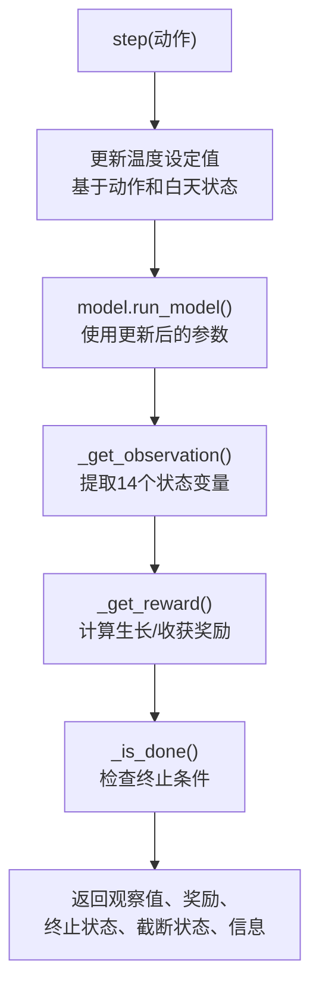
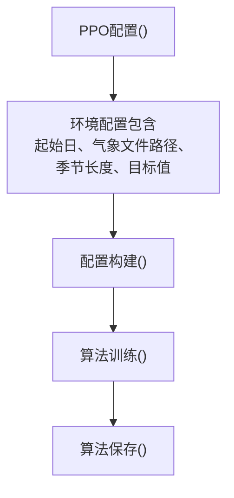

# GreenhouseEnv

> **相关源文件**
> * [README.md](https://github.com/greenpeer/GreenLightPlus/blob/262399d9/README.md)
> * [core/greenhouse_env.py](https://github.com/greenpeer/GreenLightPlus/blob/262399d9/core/greenhouse_env.py)

本文档介绍 `GreenhouseEnv` 类，它提供了一个强化学习环境，用于训练AI代理优化温室控制策略。该环境遵循OpenAI Gymnasium接口，并与核心GreenLight模拟模型集成，实现自动化控制优化。

有关基础温室模拟模型的信息，请参阅[GreenLightModel](/greenpeer/GreenLightPlus/2.1-greenlightmodel)。关于EnergyPlus集成功能的详细信息，请参阅[GreenhouseSimulation](/greenpeer/GreenLightPlus/2.2-greenhousesimulation)。

## 架构与集成

`GreenhouseEnv` 作为强化学习框架（主要是Ray RLlib）和GreenLight温室模拟引擎之间的桥梁。它将 `GreenLightModel` 封装在标准化的RL接口中，使AI代理能够通过环境交互学习最优控制策略。

**GreenhouseEnv集成架构**

```

```

Sources: [core/greenhouse_env.py L1-L376](https://github.com/greenpeer/GreenLightPlus/blob/262399d9/core/greenhouse_env.py#L1-L376)

 [README.md L341-L449](https://github.com/greenpeer/GreenLightPlus/blob/262399d9/README.md#L341-L449)

## 环境配置

`GreenhouseEnv` 在初始化时通过 `env_config` 参数接受全面的配置。配置参数控制模拟时间、目标性能指标和温室初始状态。

| 参数 | 类型 | 默认值 | 描述 |
| --- | --- | --- | --- |
| `first_day` | int | 1 | 模拟开始的年积日 |
| `isMature` | bool | False | 作物是否从成熟状态开始 |
| `epw_path` | str | "" | 气象数据文件路径 |
| `season_length` | int | 60 | 模拟总时长(天) |
| `season_interval` | float | 1/24 | 时间步长间隔(天) |
| `target_yield` | float | 0 | 目标作物产量(kg/m²) |
| `target_yield_unit_energy_input` | float | 0 | 目标能源效率(MJ/kg) |
| `init_state` | dict | {} | 温室初始参数 |

**环境初始化流程**

```

```

Sources: [core/greenhouse_env.py L27-L135](https://github.com/greenpeer/GreenLightPlus/blob/262399d9/core/greenhouse_env.py#L27-L135)

## 动作与观测空间

### 动作空间

该环境通过11个离散动作提供温度控制，表示温度设定值范围为18°C至28°C。根据当前时间段，动作会应用于白天或夜晚的温度设定值。

```markdown
# 动作映射：action ∈ [0, 10] → 温度 ∈ [18, 28]°C
temperature_setpoint = action + 18
```

**动作处理逻辑**

```

```

Sources: [core/greenhouse_env.py L77-L78](https://github.com/greenpeer/GreenLightPlus/blob/262399d9/core/greenhouse_env.py#L77-L78)

 [core/greenhouse_env.py L146-L160](https://github.com/greenpeer/GreenLightPlus/blob/262399d9/core/greenhouse_env.py#L146-L160)

### 观测空间

观测空间包含14个连续变量，代表温室状态、环境条件和控制参数：

| 索引 | 变量 | 单位 | 范围 | 描述 |
| --- | --- | --- | --- | --- |
| 0 | `day_of_year` | 天 | [0, 365] | 当前模拟天数 |
| 1 | `tSpNight` | °C | [18, 28] | 夜间温度设定值 |
| 2 | `tSpDay` | °C | [18, 28] | 白天温度设定值 |
| 3 | `co2SpDay` | ppm | [400, 1600] | 光照期间CO2设定值 |
| 4 | `co2Air` | mg/m³ | [400, 2500] | 空气CO2浓度 |
| 5 | `vpAir` | Pa | [0, 5000] | 空气水汽压 |
| 6 | `tAir` | °C | [0, 40] | 空气温度 |
| 7 | `cFruit` | mg/m² | [300, 3e5] | 果实干物质重量 |
| 8 | `mcOrgAir` | mg/m²/s | [0, 0.2] | 总维持呼吸速率 |
| 9 | `mcAirBuf` | mg/m²/s | [0, 2] | 净光合作用速率 |
| 10 | `iGlob` | W/m² | [0, 1000] | 总太阳辐射 |
| 11 | `tOut` | °C | [-10, 40] | 室外温度 |
| 12 | `lampIn` | MJ/m² | [0, 500] | 灯具能量输入 |
| 13 | `boilIn` | MJ/m² | [0, 500] | 锅炉能量输入 |

Sources: [core/greenhouse_env.py L80-L132](https://github.com/greenpeer/GreenLightPlus/blob/262399d9/core/greenhouse_env.py#L80-L132)

 [core/greenhouse_env.py L204-L230](https://github.com/greenpeer/GreenLightPlus/blob/262399d9/core/greenhouse_env.py#L204-L230)

## 奖励系统

奖励系统分为两个不同阶段运行：生长期和收获期。奖励机制同时激励作物发育和能源效率。

### 生长期奖励

在生长阶段(果实成熟前)，奖励基于果实干物质积累：

```markdown
# 生长期奖励计算
cFruit_growth = new_state["cFruit"] - previous_state["cFruit"]  # mg/m²
reward = cFruit_growth * 1e-3  # Convert to g/m² for scaling
```

### 收获期奖励

在收获阶段，奖励基于实际产量并结合性能调整因子：

```yaml
# Base harvest reward
reward = yield_change * 1e3  # g/m²

# Performance modifiers
if total_yield >= incremental_target_yield:
    reward *= 1.2  # 20% bonus for meeting yield targets
else:
    reward *= 0.8  # 20% penalty for underperformance

if harvest_unit_energy_input <= target_harvest_unit_energy_input:
    reward *= 1.2  # 20% bonus for energy efficiency
else:
    reward *= 0.8  # 20% penalty for energy inefficiency
```

### 终止奖励

在训练周期结束时，会根据整体表现与目标的对比施加额外奖励/惩罚：

```markdown
# Terminal performance adjustment
energy_diff_pct = (target_unit_energy - actual_unit_energy) / target_unit_energy
yield_diff_pct = (actual_yield - target_yield) / target_yield
terminal_reward = (energy_diff_pct + yield_diff_pct) * total_reward
```

Sources: [core/greenhouse_env.py L234-L323](https://github.com/greenpeer/GreenLightPlus/blob/262399d9/core/greenhouse_env.py#L234-L323)

## 环境生命周期

该环境遵循标准的Gymnasium生命周期，包含为温室模拟定制的`reset()`、`step()`和终止逻辑。

**环境步骤周期**



### 终止条件

当满足以下任一条件时，训练周期将终止：

1. **基于时间的终止**：`current_step >= season_length * (1 / season_interval)`
2. **成熟度检测**：`mcFruitHar > 0.01`（采收率超过阈值）

### 重置行为

`reset()`方法会重新初始化所有跟踪变量并运行初始模拟步骤：

```python
def reset(self, *, seed=None, options=None):
    self.current_step = 0
    self.total_energy_input = 0
    self.total_yield = 0
    self.total_reward = 0
    # Run initial model step
    self.new_gl = self.model.run_model(gl_params=self.init_state, ...)
    return self._get_observation(), {}
```

Sources: [core/greenhouse_env.py L137-L171](https://github.com/greenpeer/GreenLightPlus/blob/262399d9/core/greenhouse_env.py#L137-L171)

 [core/greenhouse_env.py L326-L369](https://github.com/greenpeer/GreenLightPlus/blob/262399d9/core/greenhouse_env.py#L326-L369)

## 使用集成

`GreenhouseEnv` 与 Ray RLlib 集成，用于分布式强化学习训练。典型的训练配置使用支持 LSTM 的 PPO 算法来处理温室控制中的序列依赖关系。

**训练集成示例**



Ray RLlib 的关键集成参数：

* **环境注册**：`env=GreenhouseEnv`
* **模型配置**：使用 LSTM 和 `max_seq_len=48` 进行序列控制
* **网络架构**：`fcnet_hiddens=[256, 256]` 带 ReLU 激活函数
* **算法参数**：PPO 算法参数为 `gamma=0.9`、`lr=0.0001`、`kl_coeff=0.3`

来源：[README.md L349-L441](https://github.com/greenpeer/GreenLightPlus/blob/262399d9/README.md#L349-L441)