# GreenhouseGeometry

> **相关源文件**
> * [README.md](https://github.com/greenpeer/GreenLightPlus/blob/262399d9/README.md)

GreenhouseGeometry系统提供了结构建模能力，用于生成不同温室结构的几何模型。该组件负责创建具有各种屋顶配置的温室的详细几何表示，这些表示作为GreenLightPlus框架内环境模拟和能源分析的基础。

有关使用这些几何模型的核心模拟引擎的信息，请参阅[GreenLightModel](/greenpeer/GreenLightPlus/2.1-greenlightmodel)。有关利用这些几何结构的EnergyPlus集成的详细信息，请参阅[GreenhouseSimulation](/greenpeer/GreenLightPlus/2.2-greenhousesimulation)。

## 系统概述

GreenhouseGeometry系统以`GreenhouseGeometry`类为核心，该类可生成具有六种不同屋顶类型的参数化温室模型。该系统提供标准化的几何参数，可供GreenLightPlus生态系统中的其他组件用于模拟和分析。

```mermaid
flowchart TD

GG["GreenhouseGeometry类<br>greenhouse_geometry.py"]
RF["屋顶类型生成器"]
PG["参数生成器"]
GM["几何模型"]
RT["屋顶类型<br>三角形, 半圆形,<br>扁平拱形, 哥特式拱形,<br>锯齿形, 锯齿拱形"]
SP["结构参数<br>墙高, 墙宽,<br>墙长, 分段数,<br>坡度"]
EP["环境参数<br>最大室内温度,<br>最小室外温度,<br>最大风速"]
TP["时间参数<br>起始月, 起始日,<br>结束月, 结束日"]
IDM["IDF模型文件<br>EnergyPlus兼容"]
GM_OUT["几何模型<br>结构数据"]

RT --> GG
SP --> GG
EP --> GG
TP --> GG
GM --> IDM
GM --> GM_OUT

subgraph subGraph2 ["输出模型"]
    IDM
    GM_OUT
end

subgraph subGraph1 ["输入参数"]
    RT
    SP
    EP
    TP
end

subgraph subGraph0 ["GreenhouseGeometry系统"]
    GG
    RF
    PG
    GM
    GG --> RF
    GG --> PG
    RF --> GM
    PG --> GM
end
```



**来源**: [README.md L42](https://github.com/greenpeer/GreenLightPlus/blob/262399d9/README.md#L42-L42)

 [README.md L100-L159](https://github.com/greenpeer/GreenLightPlus/blob/262399d9/README.md#L100-L159)

## 支持的屋顶类型

GreenhouseGeometry系统支持六种不同的屋顶配置，每种都针对不同的结构、环境和经济需求进行了优化：

| 屋顶类型 | 标识符 | 特性描述 |
| --- | --- | --- |
| 三角形 | `triangle` | 简单的尖顶屋顶，带有线性坡度 |
| 半圆形 | `half_circle` | 带有半圆形轮廓的弧形屋顶 |
| 扁平拱形 | `flat_arch` | 具有扁平轮廓的拱形屋顶 |
| 哥特式拱形 | `gothic_arch` | 带有传统哥特式轮廓的尖拱 |
| 锯齿形 | `sawtooth` | 多个三角形段组成的锯齿状图案 |
| 锯齿拱形 | `sawtooth_arch` | 锯齿状配置的弧形段 |


**来源**: [README.md L113-L120](https://github.com/greenpeer/GreenLightPlus/blob/262399d9/README.md#L113-L120)

 [README.md L32](https://github.com/greenpeer/GreenLightPlus/blob/262399d9/README.md#L32-L32)

## 核心参数

GreenhouseGeometry 类接受一组全面的参数，这些参数定义了温室模型的结构、环境和时间特性：

### 结构参数


**来源**: [README.md L125-L155](https://github.com/greenpeer/GreenLightPlus/blob/262399d9/README.md#L125-L155)

## 类结构与方法

GreenhouseGeometry 类遵循结构化的初始化和生成模式:


**来源**: [README.md L134-L158](https://github.com/greenpeer/GreenLightPlus/blob/262399d9/README.md#L134-L158)

## 与核心系统的集成

GreenhouseGeometry系统通过标准化接口与其他GreenLightPlus组件集成:


**来源**: [README.md L42](https://github.com/greenpeer/GreenLightPlus/blob/262399d9/README.md#L42-L42)

 [README.md L188-L233](https://github.com/greenpeer/GreenLightPlus/blob/262399d9/README.md#L188-L233)

## 使用模式

使用GreenhouseGeometry的典型工作流程包括参数配置、实例化和模型生成:

```

```

**来源**: [README.md L109-L159](https://github.com/greenpeer/GreenLightPlus/blob/262399d9/README.md#L109-L159)

GreenhouseGeometry系统提供了基础结构数据，使得在整个GreenLightPlus仿真框架中能够进行精确的环境建模和能源分析。通过支持多种屋顶配置和全面的参数集，该系统能够对不同温室设计及其对能源性能和作物产量的影响进行对比分析。