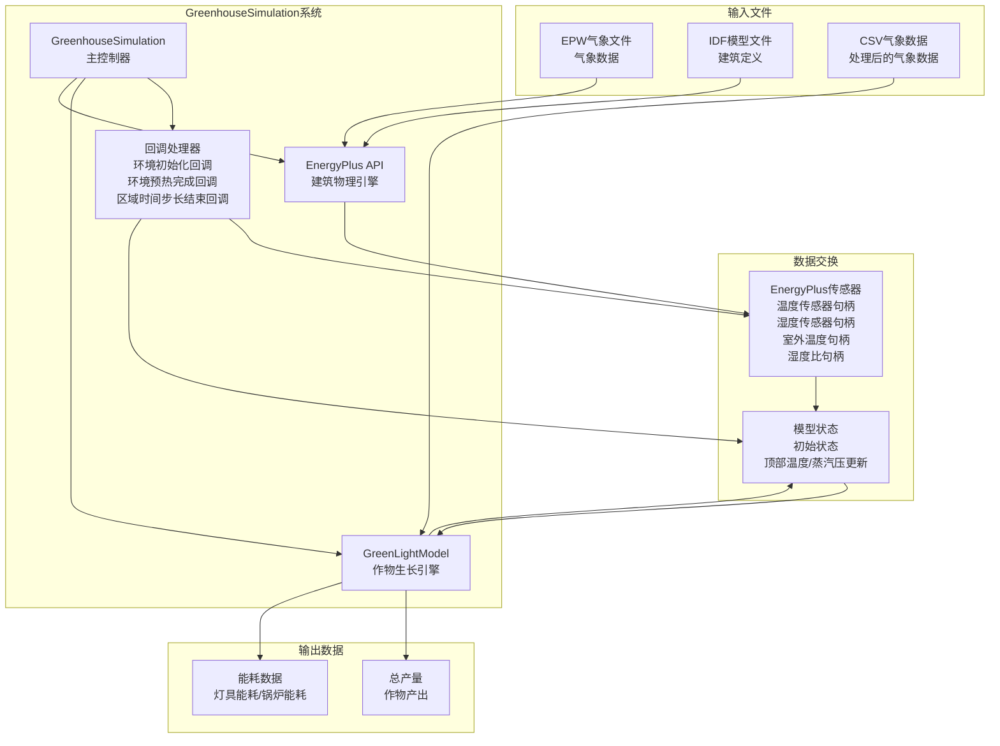
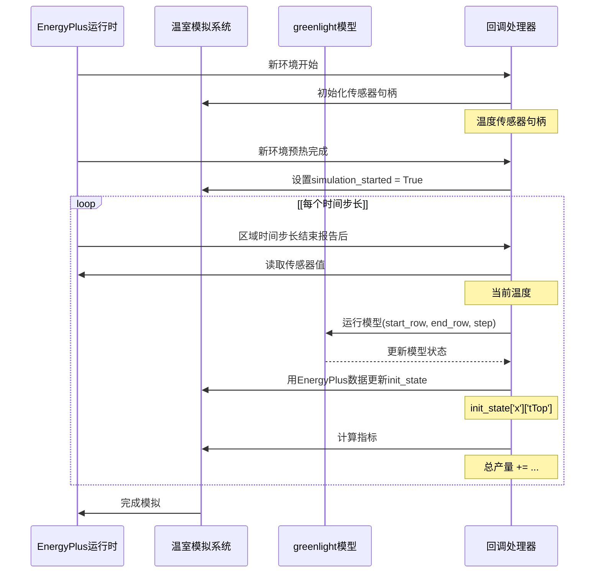

# GreenhouseSimulation

> **相关源文件**
> * [README.md](https://github.com/greenpeer/GreenLightPlus/blob/262399d9/README.md)
> * [core/greenlight_energyplus_simulation.py](https://github.com/greenpeer/GreenLightPlus/blob/262399d9/core/greenlight_energyplus_simulation.py)

`GreenhouseSimulation`组件为温室模拟提供了EnergyPlus集成，用于详细的建筑能耗分析。该组件实现了GreenLight作物生长模型与EnergyPlus建筑物理引擎的联合仿真，支持全面的能耗分析和更精确的环境建模。

有关不包含EnergyPlus集成的核心温室模拟引擎信息，请参阅[GreenLightModel](/greenpeer/GreenLightPlus/2.1-greenlightmodel)。关于使用该组件的强化学习应用，请参阅[GreenhouseEnv](/greenpeer/GreenLightPlus/2.3-greenhouseenv)。

## 系统架构

`GreenhouseSimulation`系统作为GreenLight模型与EnergyPlus之间的桥梁，在运行时仿真周期中协调数据交换。

### 组件概述



**EnergyPlus集成架构**
该图表展示了`GreenhouseSimulation`如何在EnergyPlus和GreenLight组件之间进行协调，通过回调处理程序和传感器接口管理数据流。

来源: [core/greenlight_energyplus_simulation.py L1-L233](https://github.com/greenpeer/GreenLightPlus/blob/262399d9/core/greenlight_energyplus_simulation.py#L1-L233)

### 模拟期间的数据流



**模拟数据交换时序**
该图表展示了EnergyPlus和GreenLight在联合仿真期间的运行时数据交换，显示了特定的回调方法和数据变量。

来源: [core/greenlight_energyplus_simulation.py L94-L207](https://github.com/greenpeer/GreenLightPlus/blob/262399d9/core/greenlight_energyplus_simulation.py#L94-L207)

## 关键组件

### GreenhouseSimulation 类

主`GreenhouseSimulation`类协调联合仿真过程并管理系统间的数据交换。

| 组件 | 类型 | 用途 |
| --- | --- | --- |
| `api` | EnergyPlusAPI | EnergyPlus运行时接口 |
| `model` | GreenLightModel | 作物生长模拟引擎 |
| `init_state` | dict | 模型参数和当前状态 |
| `callback handlers` | methods | EnergyPlus事件处理器 |

**初始化参数**

类构造函数接受以下关键参数:

```python
def __init__(self, api, epw_path, idf_path, csv_path, output_directory, 
             first_day, season_length, isMature=False)
```

| 参数 | 类型 | 描述 |
| --- | --- | --- |
| `api` | EnergyPlusAPI | EnergyPlus API实例 |
| `epw_path` | str | 气象文件路径 |
| `idf_path` | str | 建筑模型文件路径 |
| `csv_path` | str | 处理后的气象数据路径 |
| `output_directory` | str | EnergyPlus输出目录 |
| `first_day` | int | 年起始日 |
| `season_length` | int | 模拟持续时间(天) |
| `isMature` | bool | 作物成熟状态 |

来源: [core/greenlight_energyplus_simulation.py L15-L92](https://github.com/greenpeer/GreenLightPlus/blob/262399d9/core/greenlight_energyplus_simulation.py#L15-L92)

### 回调处理系统

模拟使用三个回调方法来处理EnergyPlus执行的不同阶段:

#### on_begin_new_environment

在模拟开始时初始化传感器句柄。

```python
def on_begin_new_environment(self, state):
    self.temp_sensor_handle = self.api.exchange.get_variable_handle(
        state, "Zone Air Temperature", "GREENHOUSE ZONE ROOF")
    self.rh_sensor_handle = self.api.exchange.get_variable_handle(
        state, "Zone Air Relative Humidity", "GREENHOUSE ZONE ROOF")
    # Additional sensor initialization...
```

#### on_after_new_environment_warmup_complete

在EnergyPlus预热期结束后设置模拟状态。

#### on_end_of_zone_timestep_after_zone_reporting

在每个时间步处理数据交换，包括：

* 读取EnergyPlus传感器值
* 使用当前数据运行GreenLight模型
* 使用EnergyPlus输出更新模型状态
* 计算能源和产量指标

来源: [core/greenlight_energyplus_simulation.py L94-L207](https://github.com/greenpeer/GreenLightPlus/blob/262399d9/core/greenlight_energyplus_simulation.py#L94-L207)

## 数据交换机制

### 传感器数据集成

系统读取特定的EnergyPlus变量并将其映射到GreenLight模型状态：

| EnergyPlus变量 | 句柄 | GreenLight状态 | 用途 |
| --- | --- | --- | --- |
| `Zone Air Temperature` | `temp_sensor_handle` | `tTop[-1][-1]` | 室内空气温度 |
| `Zone Air Humidity Ratio` | `humidity_ratio_handle` | `vpTop[-1][-1]` | 室内蒸汽压 |
| `Site Outdoor Air Drybulb Temperature` | `outdoor_air_temp_handle` | - | 参考温度 |

### 状态更新流程

在每个时间步，系统执行以下数据交换：

1. **读取EnergyPlus传感器**：提取当前环境值
2. **计算衍生值**：使用大气压将湿度比转换为蒸汽压
3. **更新GreenLight状态**：用EnergyPlus输出替换模型状态值
4. **运行GreenLight模型**：使用更新后的条件执行作物生长模拟
5. **累计指标**：跟踪能源消耗和随时间变化的产量

来源: [core/greenlight_energyplus_simulation.py L132-L207](https://github.com/greenpeer/GreenLightPlus/blob/262399d9/core/greenlight_energyplus_simulation.py#L132-L207)

## 模拟执行

### 运行时配置

模拟通过`run()`方法执行，该方法：

1. 创建EnergyPlus状态管理器
2. 注册回调函数
3. 使用指定参数执行EnergyPlus

```python
def run(self):
    state = self.api.state_manager.new_state()
    
    # Register callbacks
    self.api.runtime.callback_begin_new_environment(
        state, self.on_begin_new_environment)
    self.api.runtime.callback_after_new_environment_warmup_complete(
        state, self.on_after_new_environment_warmup_complete)
    self.api.runtime.callback_end_zone_timestep_after_zone_reporting(
        state, self.on_end_of_zone_timestep_after_zone_reporting)
    
    # Execute simulation
    self.api.runtime.run_energyplus(
        state, ["-w", self.epw_path, "-d", self.output_directory, 
                "-r", "-x", "-m", self.idf_path])
```

### 结果提取

通过`get_results()`方法获取结果，返回：

* `total_yield`: 累计作物产量 (kg/m²)
* `lampIn`: 照明能耗 (MJ/m²)
* `boilIn`: 加热能耗 (MJ/m²)

来源: [core/greenlight_energyplus_simulation.py L208-L232](https://github.com/greenpeer/GreenLightPlus/blob/262399d9/core/greenlight_energyplus_simulation.py#L208-L232)

## 模型参数

### 默认温室结构

系统使用预定义的温室结构参数，针对典型商业温室配置进行了优化：

| 参数 | 值 | 单位 | 描述 |
| --- | --- | --- | --- |
| `aFlr` | 668 | m² | 地面面积 |
| `aCov` | 1405 | m² | 包含墙体的覆盖面积 |
| `hAir` | 6.5 | m | 主隔间高度 |
| `hGh` | 6.905 | m | 温室平均高度 |
| `aRoof` | 78 | m² | 最大屋顶通风面积 |
| `pBoil` | 200,400 | W | 总锅炉容量 |

### 控制设置

温室运行的默认控制参数：

| 参数 | 值 | 单位 | 描述 |
| --- | --- | --- | --- |
| `co2SpDay` | 1000 | ppm | 光照期CO₂设定值 |
| `tSpNight` | 18.5 | °C | 夜间温度设定值 |
| `tSpDay` | 19.5 | °C | 日间温度设定值 |
| `rhMax` | 87 | % | 最大相对湿度 |
| `lampsOn` | 0 | h | 灯具开启时间 |
| `lampsOff` | 18 | h | 灯具关闭时间 |

来源: [core/greenlight_energyplus_simulation.py L52-L92](https://github.com/greenpeer/GreenLightPlus/blob/262399d9/core/greenlight_energyplus_simulation.py#L52-L92)

## 集成依赖

`GreenhouseSimulation`组件需要与以下支持模块集成：

* **GreenLightModel**: 核心作物模拟引擎 [green_light_model.py](https://github.com/greenpeer/GreenLightPlus/blob/262399d9/green_light_model.py)
* **Service Functions**: 能量计算工具 [service_functions/funcs.py](https://github.com/greenpeer/GreenLightPlus/blob/262399d9/service_functions/funcs.py)
* **EnergyPlus API**: 外部建筑模拟引擎
* **Weather Processing**: EPW转CSV工具

该组件作为集成层，通过结合作物生长建模和建筑物理模拟，实现了全面的温室能源分析。

来源: [core/greenlight_energyplus_simulation.py L11-L12](https://github.com/greenpeer/GreenLightPlus/blob/262399d9/core/greenlight_energyplus_simulation.py#L11-L12)

 [README.md L288-L340](https://github.com/greenpeer/GreenLightPlus/blob/262399d9/README.md#L288-L340)