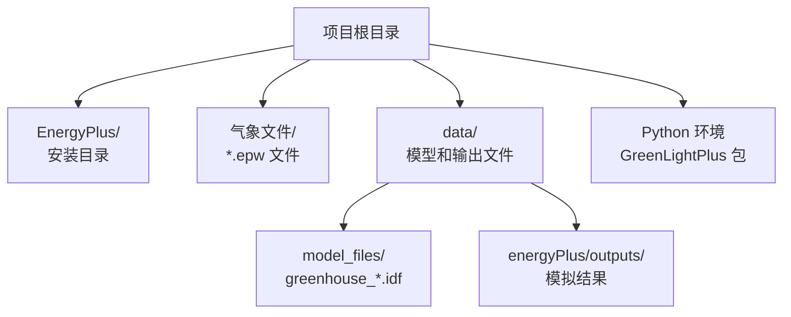

# 安装与设置

> **相关源文件**  
> * [README.md](https://github.com/greenpeer/GreenLightPlus/blob/262399d9/README.md)  
> * [pyproject.toml](https://github.com/greenpeer/GreenLightPlus/blob/262399d9/pyproject.toml)  

本文档提供了安装GreenLightPlus及配置其依赖项的完整指南，涵盖从初始安装到所有组件（包括EnergyPlus集成和天气数据配置）验证的完整设置流程。

有关核心系统架构和组件关系的信息，请参阅[系统架构](/greenpeer/GreenLightPlus/1.1-system-architecture)。安装后的使用示例请参见[使用示例](/greenpeer/GreenLightPlus/4-usage-examples)。

## 系统要求

GreenLightPlus需要Python 3.8或更高版本，并根据您计划使用的功能具有必需和可选的依赖项。

### Python版本支持

| Python版本 | 支持状态 |
| --- | --- |
| 3.8 | ✅ 支持 |
| 3.9 | ✅ 支持 |
| 3.10 | ✅ 支持 |
| 3.11+ | ⚠️ 未测试 |

### 核心依赖项

以下软件包会随GreenLightPlus自动安装：

```

```

**依赖项安装流程**
来源: [pyproject.toml L25-L33](https://github.com/greenpeer/GreenLightPlus/blob/262399d9/pyproject.toml#L25-L33)

## 安装方法

### 标准安装

使用pip安装GreenLightPlus:

```
pip install GreenLightPlus
```

这将安装包含所有必需依赖项的软件包。安装完成后，可以通过`GreenLightPlus`命令访问命令行界面。

### 开发安装

如需进行开发工作或获取最新功能：

```
git clone https://github.com/greenpeer/GreenLightPlus.git
cd GreenLightPlus
pip install -e .
```

### 可选开发依赖项

安装额外的开发工具：

```
pip install GreenLightPlus[dev]
```

这包括用于测试和文档的 pytest、sphinx 和 sphinx-rtd-theme。

来源: [pyproject.toml L35-L40](https://github.com/greenpeer/GreenLightPlus/blob/262399d9/pyproject.toml#L35-L40)

 [README.md L94-L96](https://github.com/greenpeer/GreenLightPlus/blob/262399d9/README.md#L94-L96)

## EnergyPlus 设置

使用 `GreenhouseSimulation` 类进行详细的建筑能耗模拟需要 EnergyPlus。安装过程因操作系统而异。

### EnergyPlus 安装流程

```

```

**EnergyPlus 安装流程**

### Linux 系统安装

下载并解压 EnergyPlus v23.2.0:

```
wget https://github.com/NREL/EnergyPlus/releases/download/v23.2.0/EnergyPlus-23.2.0-7636e6b3e9-Linux-Ubuntu22.04-x86_64.tar.gz
tar -xzvf EnergyPlus-23.2.0-7636e6b3e9-Linux-Ubuntu22.04-x86_64.tar.gz
mv EnergyPlus-23.2.0-7636e6b3e9-Linux-Ubuntu22.04-x86_64 EnergyPlus
```

### Python 路径配置

安装完成后，将 EnergyPlus 添加到 Python 路径中：

```javascript
import sys
sys.path.insert(0, "./EnergyPlus")
```

来源: [README.md L55-L78](https://github.com/greenpeer/GreenLightPlus/blob/262399d9/README.md#L55-L78)

 [README.md L297-L299](https://github.com/greenpeer/GreenLightPlus/blob/262399d9/README.md#L297-L299)

## 气象数据配置

气象文件对于温室模拟的准确性至关重要。GreenLightPlus 支持 EPW (EnergyPlus Weather) 格式的气象文件。

### 气象文件依赖项

```

```

**气象数据处理流程**

### 下载阿姆斯特丹气象数据

```
wget https://energyplus-weather.s3.amazonaws.com/europe_wmo_region_6/NLD/NLD_Amsterdam.062400_IWEC/NLD_Amsterdam.062400_IWEC.epw
```

### 气象文件处理

`convert_epw2csv` 函数用于处理 EPW 文件以供 EnergyPlus 模拟使用:

```javascript
from GreenLightPlus import convert_epw2csv
csv_path = convert_epw2csv(epw_path="NLD_Amsterdam.062400_IWEC.epw", time_step=1)
```

来源: [README.md L80-L90](https://github.com/greenpeer/GreenLightPlus/blob/262399d9/README.md#L80-L90)

 [README.md L312-L313](https://github.com/greenpeer/GreenLightPlus/blob/262399d9/README.md#L312-L313)

## 安装验证

通过测试每个主要组件来验证您的安装:

### 基础导入测试

```javascript
# Test core imports
from GreenLightPlus import (
    GreenLightModel,
    GreenhouseEnv,
    GreenhouseGeometry,
    GreenhouseSimulation
)
print("✅ Core components imported successfully")
```

### EnergyPlus 集成测试

```javascript
import sys
sys.path.insert(0, "./EnergyPlus")

try:
    from pyenergyplus.api import EnergyPlusAPI
    api = EnergyPlusAPI()
    print("✅ EnergyPlus integration working")
except ImportError:
    print("❌ EnergyPlus not properly configured")
```

### Ray RLlib 测试

```javascript
try:
    from ray.rllib.algorithms.ppo import PPOConfig
    config = PPOConfig()
    print("✅ Ray RLlib available")
except ImportError:
    print("❌ Ray RLlib not available")
```

### 组件验证矩阵

| 组件 | 测试方法 | 预期结果 |
| --- | --- | --- |
| `GreenLightModel` | 基础导入 | 无导入错误 |
| `GreenhouseEnv` | Gymnasium注册 | 环境创建成功 |
| `GreenhouseGeometry` | 几何生成 | 生成IDF文件 |
| `GreenhouseSimulation` | EnergyPlus API测试 | 创建API对象 |
| 天气数据处理 | `convert_epw2csv` | 生成CSV输出 |

来源: [README.md L179-L185](https://github.com/greenpeer/GreenLightPlus/blob/262399d9/README.md#L179-L185)

 [README.md L301-L302](https://github.com/greenpeer/GreenLightPlus/blob/262399d9/README.md#L301-L302)

 [README.md L351-L353](https://github.com/greenpeer/GreenLightPlus/blob/262399d9/README.md#L351-L353)

## 配置文件和路径

### 项目结构设置



**推荐的目录结构**

### 环境变量设置

为确保稳定运行，请设置以下环境变量：

| 变量名 | 用途 | 示例值 |
| --- | --- | --- |
| `ENERGYPLUS_DIR` | EnergyPlus安装路径 | `./EnergyPlus` |
| `WEATHER_DATA_DIR` | 气象数据文件目录 | `./weather_data` |
| `GREENHOUSE_MODELS_DIR` | IDF模型文件路径 | `./data/model_files` |

### 命令行接口配置

本软件包通过`GreenLightPlus`命令提供命令行接口，通过项目的入口点进行配置：

```markdown
# 安装后可用
GreenLightPlus --help
```

来源: [pyproject.toml L47-L48](https://github.com/greenpeer/GreenLightPlus/blob/262399d9/pyproject.toml#L47-L48)

 [README.md L309-L316](https://github.com/greenpeer/GreenLightPlus/blob/262399d9/README.md#L309-L316)

## 常见安装问题排查

### 依赖冲突

如果遇到OpenStudio版本冲突:

```
pip uninstall openstudio
pip install openstudio==3.6.1
```

### EnergyPlus路径问题

确保Python可以访问EnergyPlus:

```javascript
import os
energyplus_path = "./EnergyPlus"
if not os.path.exists(energyplus_path):
    print("❌ EnergyPlus directory not found")
else:
    print("✅ EnergyPlus directory exists")
```

### 内存需求

Ray RLlib 在进行分布式训练时可能需要大量内存。在强化学习训练阶段请监控系统资源使用情况。

来源: [pyproject.toml L30](https://github.com/greenpeer/GreenLightPlus/blob/262399d9/pyproject.toml#L30-L30)

 [README.md L297-L299](https://github.com/greenpeer/GreenLightPlus/blob/262399d9/README.md#L297-L299)