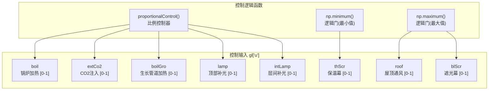
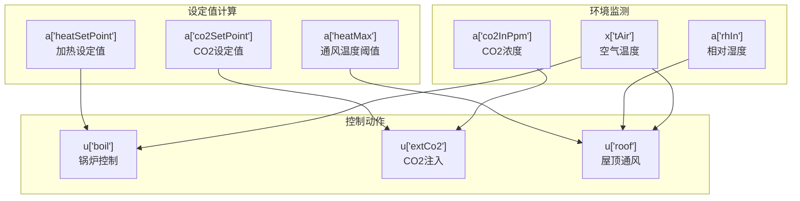

# 模型配置

> **相关源文件**
> * [create_green_light_model/set_default_lamp_params.py](https://github.com/greenpeer/GreenLightPlus/blob/262399d9/create_green_light_model/set_default_lamp_params.py)
> * [create_green_light_model/set_gl_aux.py](https://github.com/greenpeer/GreenLightPlus/blob/262399d9/create_green_light_model/set_gl_aux.py)
> * [create_green_light_model/set_gl_control.py](https://github.com/greenpeer/GreenLightPlus/blob/262399d9/create_green_light_model/set_gl_control.py)

本文档介绍了GreenLightPlus模型的高级配置功能，包括控制逻辑实现、辅助计算设置和参数自定义选项。这些配置系统允许用户自定义模型行为、实现控制策略并计算派生模型状态。

关于基础模型创建和初始化，请参阅[模型创建](/greenpeer/GreenLightPlus/3.2-model-creation)。关于已配置模型的结果分析和可视化，请参阅[结果分析](/greenpeer/GreenLightPlus/3.4-result-analysis)。

## 概述

GreenLightPlus模型配置系统由三个主要组件组成，它们共同协作创建一个完整配置的温室模拟：

```

```

**来源:** [create_green_light_model/set_default_lamp_params.py L18-L85](https://github.com/greenpeer/GreenLightPlus/blob/262399d9/create_green_light_model/set_default_lamp_params.py#L18-L85)

 [create_green_light_model/set_gl_aux.py L6-L2346](https://github.com/greenpeer/GreenLightPlus/blob/262399d9/create_green_light_model/set_gl_aux.py#L6-L2346)

 [create_green_light_model/set_gl_control.py L23-L75](https://github.com/greenpeer/GreenLightPlus/blob/262399d9/create_green_light_model/set_gl_control.py#L23-L75)

## 参数自定义

参数自定义功能允许用户配置温室组件的物理和运行特性。主要的自定义接口是通过灯具参数配置，支持不同的照明技术。

### 灯具参数配置

`set_default_lamp_params()` 函数为不同类型的灯具技术提供了预配置参数集:

| 参数 | HPS 值 | LED 值 | 单位 | 描述 |
| --- | --- | --- | --- | --- |
| `thetaLampMax` | 111.11 | 66.67 | W m⁻² | 最大灯具强度 |
| `etaLampPar` | 0.367 | 0.555 | - | PAR转换效率 |
| `etaLampNir` | 0.22 | 0.02 | - | NIR转换效率 |
| `epsLampTop` | 0.1 | 0.88 | - | 顶部发射率 |
| `epsLampBottom` | 0.9 | 0.88 | - | 底部发射率 |
| `capLamp` | 100 | 10 | J K⁻¹ m⁻² | 热容量 |
| `cHecLampAir` | 0.09 | 2.3 | W m⁻² K⁻¹ | 热交换系数 |

```

```

**来源:** [create_green_light_model/set_default_lamp_params.py L46-L83](https://github.com/greenpeer/GreenLightPlus/blob/262399d9/create_green_light_model/set_default_lamp_params.py#L46-L83)

### 参数结构

GreenLight模型将参数组织到`gl["p"]`字典中，包含物理常数、设备规格和操作限制。常见的参数类别包括:

* **几何参数**: 地面面积(`aFlr`)、覆盖面积(`aCov`)、管道尺寸
* **热力学参数**: 热容量(`capLeaf`, `capCov`)、发射率、导热系数  
* **光学参数**: 透射率(`tau`)、反射率(`rho`)、吸收系数
* **控制参数**: 设定点、死区、比例带

**来源:** [create_green_light_model/set_default_lamp_params.py L47-L83](https://github.com/greenpeer/GreenLightPlus/blob/262399d9/create_green_light_model/set_default_lamp_params.py#L47-L83)

 [create_green_light_model/set_gl_aux.py L469-L473](https://github.com/greenpeer/GreenLightPlus/blob/262399d9/create_green_light_model/set_gl_aux.py#L469-L473)

## 辅助计算

辅助计算系统计算温室模拟所需的派生状态和中间值。这是通过`GreenLightAuxiliaryStates`类实现的，该类包含20多个专用计算方法。

### 辅助状态类别

```

```

**来源:** [create_green_light_model/set_gl_aux.py L15-L34](https://github.com/greenpeer/GreenLightPlus/blob/262399d9/create_green_light_model/set_gl_aux.py#L15-L34)

 [create_green_light_model/set_gl_aux.py L2324-L2344](https://github.com/greenpeer/GreenLightPlus/blob/262399d9/create_green_light_model/set_gl_aux.py#L2324-L2344)

### 关键辅助计算

#### 光学特性

该模型计算多层覆盖系统(包括遮阳幕、保温幕和遮光幕)的透射和反射系数:

```

```

**来源:** [create_green_light_model/set_gl_aux.py L36-L82](https://github.com/greenpeer/GreenLightPlus/blob/262399d9/create_green_light_model/set_gl_aux.py#L36-L82)

 [create_green_light_model/set_gl_aux.py L317-L460](https://github.com/greenpeer/GreenLightPlus/blob/262399d9/create_green_light_model/set_gl_aux.py#L317-L460)

#### 热通量计算

系统计算温室各组件对辐射的吸收情况:

* **冠层吸收**: 来自太阳、灯具和层间灯的直射及反射PAR/NIR
* **地面吸收**: 冠层拦截后的透射辐射
* **空气吸收**: 温室空气吸收的全局辐射比例  
* **覆盖层吸收**: 覆盖材料吸收的太阳辐射

**来源:** [create_green_light_model/set_gl_aux.py L500-L807](https://github.com/greenpeer/GreenLightPlus/blob/262399d9/create_green_light_model/set_gl_aux.py#L500-L807)

#### 控制逻辑集成

辅助计算为控制决策提供中间值:

* **基于时间的逻辑**: 用于调度的`timeOfDay`(当前时间)、`dayOfYear`(年积日)
* **环境条件**: `rhIn`(相对湿度)、`co2InPpm`(CO2浓度)
* **设定点计算**: 根据昼夜和灯具状态计算`heatSetPoint`(加热设定点)、`co2SetPoint`(CO2设定点)

**来源:** [create_green_light_model/set_gl_aux.py L1514-L1718](https://github.com/greenpeer/GreenLightPlus/blob/262399d9/create_green_light_model/set_gl_aux.py#L1514-L1718)

## 控制逻辑

控制系统通过`set_gl_control()`函数实现温室管理策略。该函数基于当前状态和辅助计算在`gl["u"]`字典中设置控制输入。

### 控制输入结构



**来源:** [create_green_light_model/set_gl_control.py L30-L70](https://github.com/greenpeer/GreenLightPlus/blob/262399d9/create_green_light_model/set_gl_control.py#L30-L70)

### 比例控制实现

控制系统使用带死区的比例控制器实现平滑操作:

| 控制项 | 设定点来源 | 比例带 | 范围 |
| --- | --- | --- | --- |
| 加热 | `a["heatSetPoint"]` | `p["tHeatBand"]` | [0, 1] |
| CO2 | `a["co2SetPoint"]` | `p["co2Band"]` | [0, 1] |
| 通风 | `a["heatMax"]`, `p["rhMax"]` | `p["ventHeatPband"]`, `p["ventRhPband"]` | [0, 1] |

### 控制逻辑流程



**来源:** [create_green_light_model/set_gl_control.py L31-L48](https://github.com/greenpeer/GreenLightPlus/blob/262399d9/create_green_light_model/set_gl_control.py#L31-L48)

### 高级控制功能

#### 遮阳幕控制逻辑

温控遮阳幕结合了多种控制因素:

* **防寒保护**: 根据室外温度关闭
* **湿度控制**: 开启以进行除湿
* **过热保护**: 开启以防止温度过高

#### 光照控制集成

补光灯控制包含以下复杂逻辑:

* **基于时间的调度**: `lampsOn`/`lampsOff` 时间设定
* **辐射限制**: `lampRadSumLimit` 用于控制每日光照总量
* **温度约束**: 考虑热量增加因素
* **湿度交互**: 与遮阳幕控制的协调

**来源:** [create_green_light_model/set_gl_control.py L45-L70](https://github.com/greenpeer/GreenLightPlus/blob/262399d9/create_green_light_model/set_gl_control.py#L45-L70)

 [create_green_light_model/set_gl_aux.py L1564-L1698](https://github.com/greenpeer/GreenLightPlus/blob/262399d9/create_green_light_model/set_gl_aux.py#L1564-L1698)

## 配置集成

三个配置组件在模型设置过程中按特定顺序协同工作:

1. **参数定制**: 设置物理和运行参数
2. **辅助计算**: 根据参数和当前状态计算派生状态
3. **控制逻辑**: 基于辅助计算确定控制动作

这种顺序确保所有依赖关系都能正确解析，并保证模型在整个模拟过程中保持物理一致性。

**来源:** [create_green_light_model/set_default_lamp_params.py L18-L85](https://github.com/greenpeer/GreenLightPlus/blob/262399d9/create_green_light_model/set_default_lamp_params.py#L18-L85)

 [create_green_light_model/set_gl_aux.py L2324-L2346](https://github.com/greenpeer/GreenLightPlus/blob/262399d9/create_green_light_model/set_gl_aux.py#L2324-L2346)

 [create_green_light_model/set_gl_control.py L23-L75](https://github.com/greenpeer/GreenLightPlus/blob/262399d9/create_green_light_model/set_gl_control.py#L23-L75)