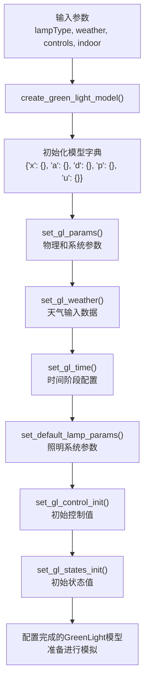
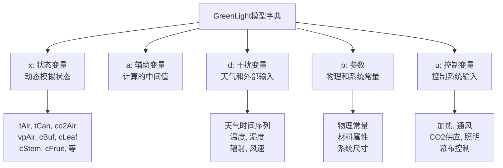
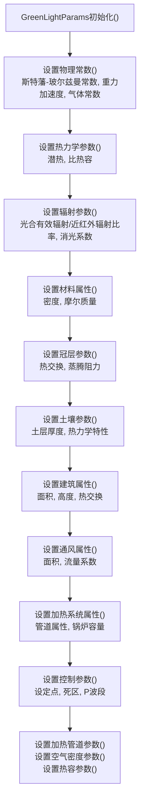
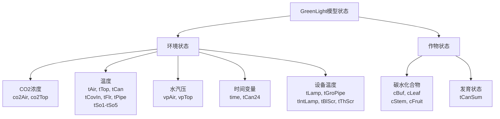
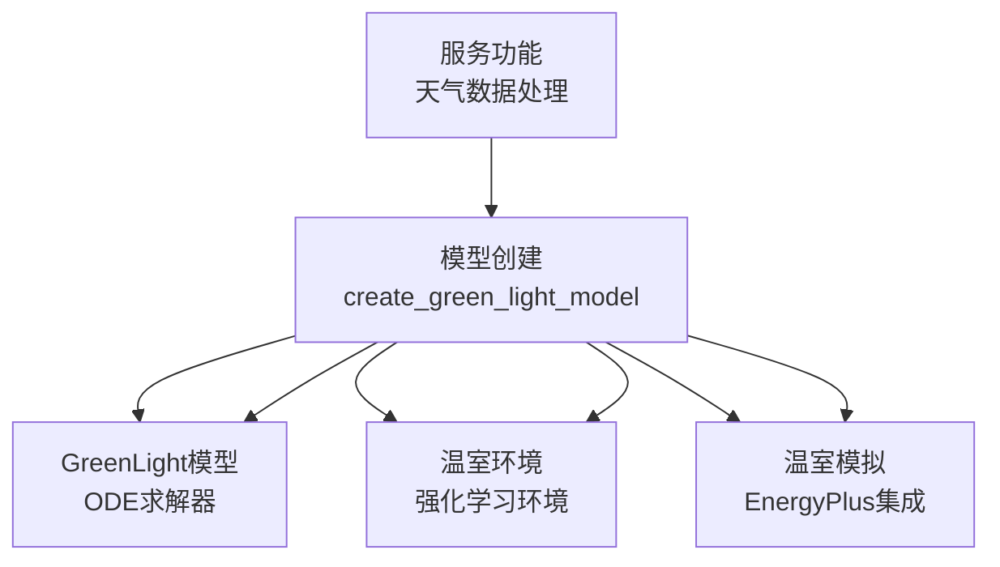

# 模型创建

> **相关源文件**
> * [create_green_light_model/create_green_light_model.py](https://github.com/greenpeer/GreenLightPlus/blob/262399d9/create_green_light_model/create_green_light_model.py)
> * [create_green_light_model/set_gl_params.py](https://github.com/greenpeer/GreenLightPlus/blob/262399d9/create_green_light_model/set_gl_params.py)
> * [create_green_light_model/set_gl_states.py](https://github.com/greenpeer/GreenLightPlus/blob/262399d9/create_green_light_model/set_gl_states.py)

本文档介绍了负责初始化和配置GreenLight模型结构的组件。模型创建系统将输入参数和天气数据转换为完全配置好的GreenLight模型实例，准备进行模拟。有关在模拟中使用已创建模型的信息，请参阅[GreenLightModel](/greenpeer/GreenLightPlus/2.1-greenlightmodel)。有关配置高级模型设置的详细信息，请参阅[模型配置](/greenpeer/GreenLightPlus/3.3-model-configuration)。

## 概述

模型创建系统提供了基础层，将所有必要组件组装成一个连贯的GreenLight模型实例。该系统由一个主协调函数和专门用于配置温室模拟模型不同方面的参数设置模块组成。

### 模型创建工作流程

来源: [create_green_light_model/create_green_light_model.py L34-L88](https://github.com/greenpeer/GreenLightPlus/blob/262399d9/create_green_light_model/create_green_light_model.py#L34-L88)

## 模型结构

GreenLight模型被组织为一个包含五个主要部分的字典，这些部分包含不同类型的数据和参数。

### 模型字典架构

来源: [create_green_light_model/create_green_light_model.py L60](https://github.com/greenpeer/GreenLightPlus/blob/262399d9/create_green_light_model/create_green_light_model.py#L60-L60)

 [create_green_light_model/set_gl_states.py L40-L135](https://github.com/greenpeer/GreenLightPlus/blob/262399d9/create_green_light_model/set_gl_states.py#L40-L135)

## 参数配置

参数配置系统设置了数百个物理、热力学和系统特定参数，这些参数是精确模拟温室环境所必需的。

### 参数类别

| 类别 | 用途 | 关键参数 | 代码行 |
| --- | --- | --- | --- |
| 物理常数 | 基础物理量 | `sigma`, `g`, `R` | [set_gl_params.py L33-L37](https://github.com/greenpeer/GreenLightPlus/blob/262399d9/set_gl_params.py#L33-L37) |
| 热力学 | 热量和质量传递 | `L`, `gamma`, `cPAir` | [set_gl_params.py L39-L46](https://github.com/greenpeer/GreenLightPlus/blob/262399d9/set_gl_params.py#L39-L46) |
| 辐射 | 光相互作用 | `etaGlobNir`, `k1Par`, `kFir` | [set_gl_params.py L47-L58](https://github.com/greenpeer/GreenLightPlus/blob/262399d9/set_gl_params.py#L47-L58) |
| 材料属性 | 物质特性 | `rhoAir0`, `rhoSteel`, `mWater` | [set_gl_params.py L60-L67](https://github.com/greenpeer/GreenLightPlus/blob/262399d9/set_gl_params.py#L60-L67) |
| 建筑结构 | 温室结构 | `aFlr`, `aCov`, `hAir` | [set_gl_params.py L96-L108](https://github.com/greenpeer/GreenLightPlus/blob/262399d9/set_gl_params.py#L96-L108) |
| 冠层 | 植物特性 | `alfaLeafAir`, `rSMin`, `laiMax` | [set_gl_params.py L69-L75](https://github.com/greenpeer/GreenLightPlus/blob/262399d9/set_gl_params.py#L69-L75)    [set_gl_params.py L256-L287](https://github.com/greenpeer/GreenLightPlus/blob/262399d9/set_gl_params.py#L256-L287) |
| 控制 | 系统操作 | `tSpDay`, `co2SpDay`, `rhMax` | [set_gl_params.py L301-L335](https://github.com/greenpeer/GreenLightPlus/blob/262399d9/set_gl_params.py#L301-L335) |

### 参数设置流程

Sources: [create_green_light_model/set_gl_params.py L394-L427](https://github.com/greenpeer/GreenLightPlus/blob/262399d9/create_green_light_model/set_gl_params.py#L394-L427)

## 状态初始化

状态初始化系统负责准备模拟过程中需要跟踪的所有动态变量。

### 状态变量分类

Sources: [create_green_light_model/set_gl_states.py L40-L135](https://github.com/greenpeer/GreenLightPlus/blob/262399d9/create_green_light_model/set_gl_states.py#L40-L135)

## 系统组件集成

模型创建系统与其他主要系统组件对接，提供完整的模拟框架。

### 组件依赖关系

来源: [create_green_light_model/create_green_light_model.py L25-L31](https://github.com/greenpeer/GreenLightPlus/blob/262399d9/create_green_light_model/create_green_light_model.py#L25-L31)

## 使用模式

模型创建系统根据不同的模拟需求支持多种使用场景。

### 基础模型创建

主要入口点是`create_green_light_model()`函数，它接受以下参数:

* `lampType`: 字符串指定灯具技术类型(`'hps'`, `'led'`或`''`)
* `weather`: 包含天气时间序列数据的数值数组
* `controls`: 可选的控件轨迹数据
* `indoor`: 可选的室内条件规格

来源: [create_green_light_model/create_green_light_model.py L34-L51](https://github.com/greenpeer/GreenLightPlus/blob/262399d9/create_green_light_model/create_green_light_model.py#L34-L51)

### 模型验证

系统包含参数验证和初始化检查以确保模型一致性:

* 天气数据格式验证(检查预期列)
* 灯具类型验证(检查支持选项)
* 派生值的参数依赖计算
* 具有正确维度的状态数组初始化

来源: [create_green_light_model/create_green_light_model.py L54-L57](https://github.com/greenpeer/GreenLightPlus/blob/262399d9/create_green_light_model/create_green_light_model.py#L54-L57)

[create_green_light_model/set_gl_params.py L216-L255](https://github.com/greenpeer/GreenLightPlus/blob/262399d9/create_green_light_model/set_gl_params.py#L216-L255)