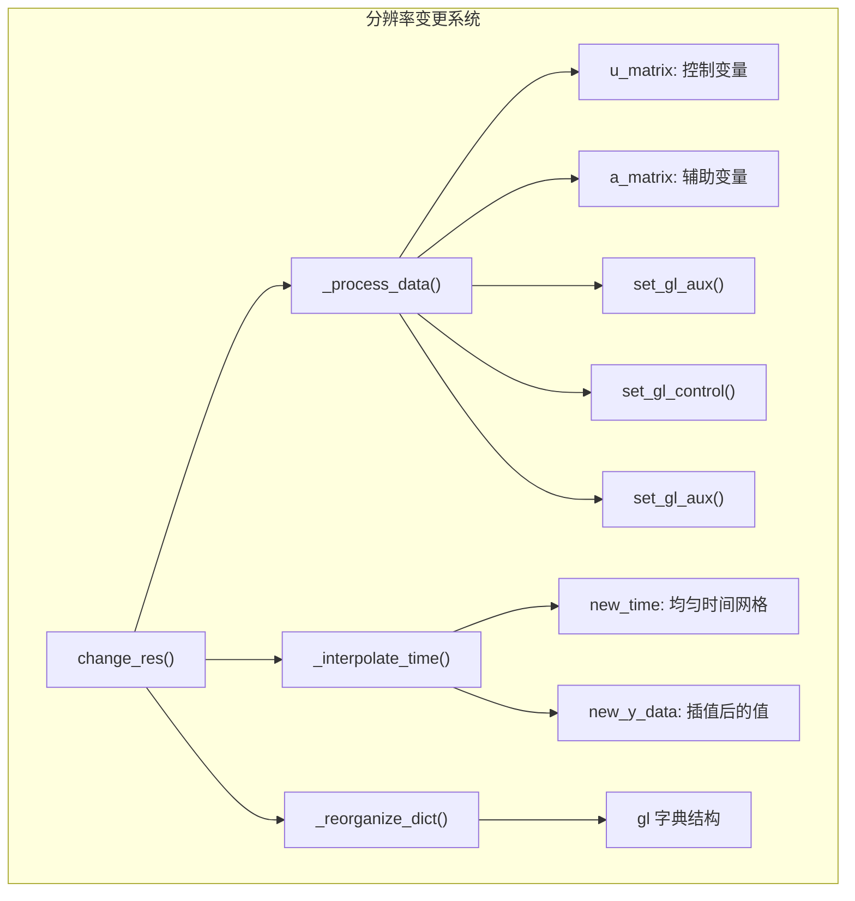
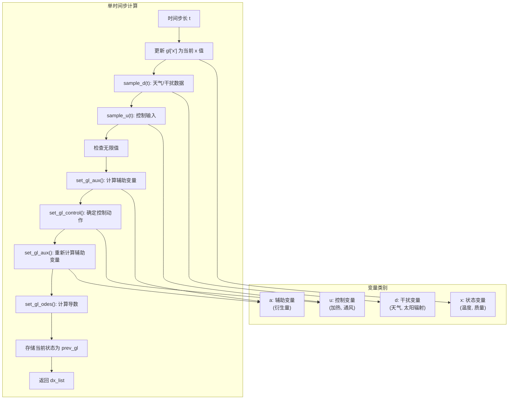
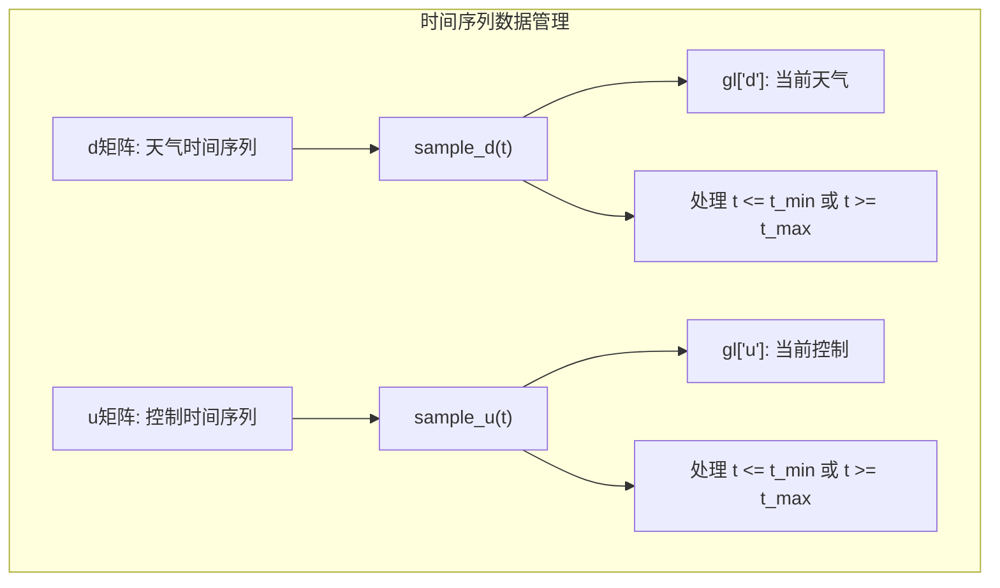

# 模型内部结构

> **相关源文件**
> * [create_green_light_model/change_res.py](https://github.com/greenpeer/GreenLightPlus/blob/262399d9/create_green_light_model/change_res.py)
> * [create_green_light_model/ode.py](https://github.com/greenpeer/GreenLightPlus/blob/262399d9/create_green_light_model/ode.py)
> * [create_green_light_model/set_dep_params.py](https://github.com/greenpeer/GreenLightPlus/blob/262399d9/create_green_light_model/set_dep_params.py)

本文档提供了GreenLight模型内部架构的详细技术概述，重点介绍了ODE求解系统、参数依赖关系和数据流机制。涵盖了驱动温室模拟的核心计算引擎，包括状态变量管理、微分方程求解以及模型参数计算和相互依赖关系。

关于从用户角度使用模型的信息，请参阅[GreenLightModel](/greenpeer/GreenLightPlus/2.1-greenlightmodel)。有关模型配置和参数定制的详细信息，请参阅[模型配置](/greenpeer/GreenLightPlus/3.3-model-configuration)。

## 核心ODE系统架构

GreenLight模型的核心实现于`ODESolver`类中，该类管理着控制温室动态的常微分方程组。该求解器集成了多个子系统，包括热力学动态、作物生长和环境控制。

### ODE求解器架构

```

```

`ODESolver` 类 [create_green_light_model/ode.py L28-L133](https://github.com/greenpeer/GreenLightPlus/blob/262399d9/create_green_light_model/ode.py#L28-L133) 实现了核心的积分循环。在每个时间步 `t` 时，`ode()` 方法 [create_green_light_model/ode.py L89-L133](https://github.com/greenpeer/GreenLightPlus/blob/262399d9/create_green_light_model/ode.py#L89-L133) 会执行以下操作：

1. 使用当前值更新 `gl["x"]` 中的状态变量
2. 通过 `sample_d()` 采样时间 `t` 的天气/干扰数据  
3. 通过 `sample_u()` 采样时间 `t` 的控制变量
4. 通过回退到之前有效状态来处理无限值
5. 通过 `set_gl_aux()` 计算辅助变量
6. 通过 `set_gl_control()` 确定控制动作
7. 通过 `set_gl_odes()` 计算ODE导数

**来源:** [create_green_light_model/ode.py L89-L133](https://github.com/greenpeer/GreenLightPlus/blob/262399d9/create_green_light_model/ode.py#L89-L133)

### 状态变量管理

```

```

求解器包含鲁棒的状态管理机制，可防止数值不稳定。关键状态变量 `["tBlScr", "tThScr", "tIntLamp", "tCovIn", "time"]` 会被持续监测是否存在无限值 [create_green_light_model/ode.py L109-L117](https://github.com/greenpeer/GreenLightPlus/blob/262399d9/create_green_light_model/ode.py#L109-L117)，这种情况可能在极端操作条件或数值错误时发生。

**来源:** [create_green_light_model/ode.py L108-L117](https://github.com/greenpeer/GreenLightPlus/blob/262399d9/create_green_light_model/ode.py#L108-L117)

 [create_green_light_model/ode.py L130-L131](https://github.com/greenpeer/GreenLightPlus/blob/262399d9/create_green_light_model/ode.py#L130-L131)

## 模型参数依赖系统

GreenLight模型包含复杂的参数互依赖网络，其中某些参数是从其他参数计算得出的。`DependentParameters` 类负责管理这些依赖关系。

### 参数依赖图

```

```

参数依赖系统 [create_green_light_model/set_dep_params.py L82-L95](https://github.com/greenpeer/GreenLightPlus/blob/262399d9/create_green_light_model/set_dep_params.py#L82-L95) 会按照正确的顺序计算派生参数：

| 参数类别 | 关键参数 | 依赖项 |
| --- | --- | --- |
| 管道属性 | `capPipe`, `aPipe` | `lPipe`, `phiPipeE`, `phiPipeI`, 材料属性 |
| 空气属性 | `rhoAir`, `pressure` | `hElevation`, 温度, 大气常数 |
| 热容量 | `capAir`, `capFlr`, `capSo1-5` | 尺寸, 密度, 比热容 |
| CO2容量 | `capCo2Air`, `capCo2Top` | 隔室高度 |
| 几何因子 | `fCanFlr`, `cLeafMax` | 管道几何形状, 叶面积指数 |

**来源:** [create_green_light_model/set_dep_params.py L26-L95](https://github.com/greenpeer/GreenLightPlus/blob/262399d9/create_green_light_model/set_dep_params.py#L26-L95)

### 计算依赖关系

```

```

**来源:** [create_green_light_model/set_dep_params.py L82-L95](https://github.com/greenpeer/GreenLightPlus/blob/262399d9/create_green_light_model/set_dep_params.py#L82-L95)

## 数据插值与分辨率管理

`GreenLightChangeRes` 类负责处理时间分辨率变化和数据插值，这对于耦合不同时间尺度运行的模拟组件至关重要。

### 分辨率变更架构



分辨率变更过程 [create_green_light_model/change_res.py L123-L158](https://github.com/greenpeer/GreenLightPlus/blob/262399d9/create_green_light_model/change_res.py#L123-L158) 包含以下步骤：

1. **数据处理**：对于每个时间点，通过调用计算链 `set_gl_aux()` → `set_gl_control()` → `set_gl_aux()` 计算辅助变量(`a`)和控制变量(`u`)
2. **时间插值**：创建均匀时间网格并使用线性插值对所有变量进行插值
3. **字典重组**：使用新的时间序列数据重构 `gl` 字典结构

**数据来源:** [create_green_light_model/change_res.py L28-L68](https://github.com/greenpeer/GreenLightPlus/blob/262399d9/create_green_light_model/change_res.py#L28-L68)

 [create_green_light_model/change_res.py L123-L158](https://github.com/greenpeer/GreenLightPlus/blob/262399d9/create_green_light_model/change_res.py#L123-L158)

## 模型内部数据流

内部数据流遵循特定顺序，确保不同变量类型和计算依赖之间的一致性。

### 内部计算流程



计算流程确保：

* 辅助变量会计算两次：一次在控制逻辑前提供当前条件，一次在控制逻辑后反映控制决策
* 状态变量更新会进行数值稳定性验证
* 保留之前有效的状态以便从数值错误中恢复

**来源:** [create_green_light_model/ode.py L96-L133](https://github.com/greenpeer/GreenLightPlus/blob/262399d9/create_green_light_model/ode.py#L96-L133)

### 数据采样与插值



`sample_d()` 和 `sample_u()` 函数 [create_green_light_model/ode.py L61-L87](https://github.com/greenpeer/GreenLightPlus/blob/262399d9/create_green_light_model/ode.py#L61-L87) 实现了相同的插值逻辑：

* 对数据范围内的时刻使用线性插值
* 对超出范围的时间使用边界值提取
* 对多维数据按列进行插值

**来源:** [create_green_light_model/ode.py L61-L87](https://github.com/greenpeer/GreenLightPlus/blob/262399d9/create_green_light_model/ode.py#L61-L87)

## 数值考量

该模型包含多种处理数值稳定性的机制：

| 问题 | 解决方案 | 实现位置 |
| --- | --- | --- |
| 无限状态值 | 回退到之前有效的状态 | [create_green_light_model/ode.py L109-L117](https://github.com/greenpeer/GreenLightPlus/blob/262399d9/create_green_light_model/ode.py#L109-L117) |
| Numpy警告 | 抑制溢出/无效警告 | [create_green_light_model/ode.py L26](https://github.com/greenpeer/GreenLightPlus/blob/262399d9/create_green_light_model/ode.py#L26-L26) |
| 时间边界条件 | 使用边界值而非外推 | [create_green_light_model/ode.py L67-L73](https://github.com/greenpeer/GreenLightPlus/blob/262399d9/create_green_light_model/ode.py#L67-L73) |
| 矩阵维度一致性 | 操作前验证数组形状 | [create_green_light_model/change_res.py L49-L52](https://github.com/greenpeer/GreenLightPlus/blob/262399d9/create_green_light_model/change_res.py#L49-L52) |

该模型在极端情况下优先考虑数值稳定性而非严格的物理准确性，确保即使在极端或不切实际的操作条件下，模拟也能继续运行。

**来源:** [create_green_light_model/ode.py L26](https://github.com/greenpeer/GreenLightPlus/blob/262399d9/create_green_light_model/ode.py#L26-L26)

 [create_green_light_model/ode.py L109-L117](https://github.com/greenpeer/GreenLightPlus/blob/262399d9/create_green_light_model/ode.py#L109-L117)

 [create_green_light_model/change_res.py L49-L52](https://github.com/greenpeer/GreenLightPlus/blob/262399d9/create_green_light_model/change_res.py#L49-L52)