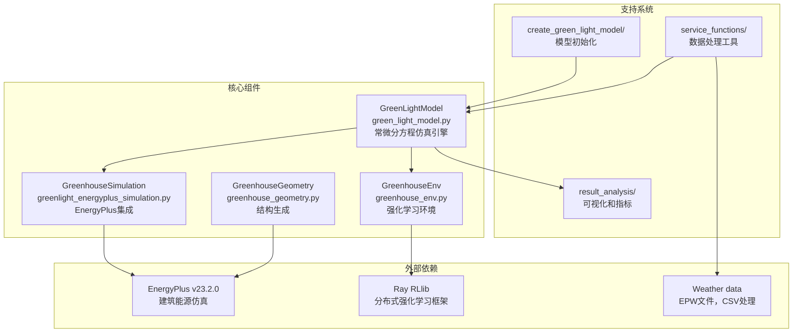
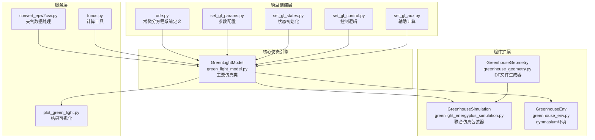
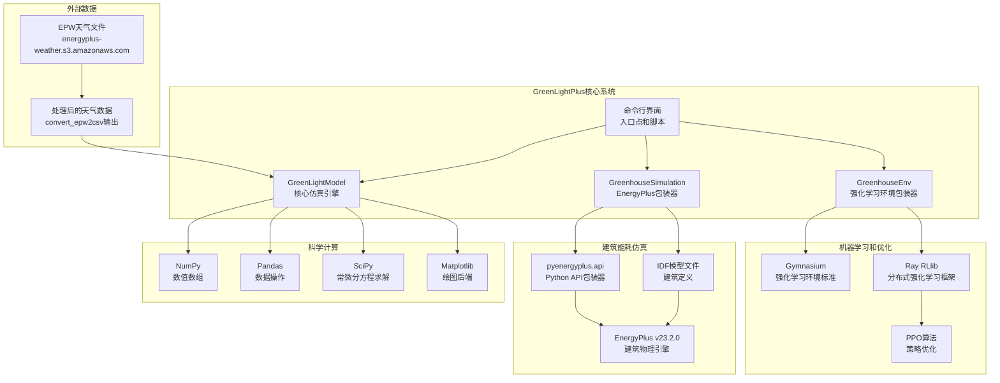
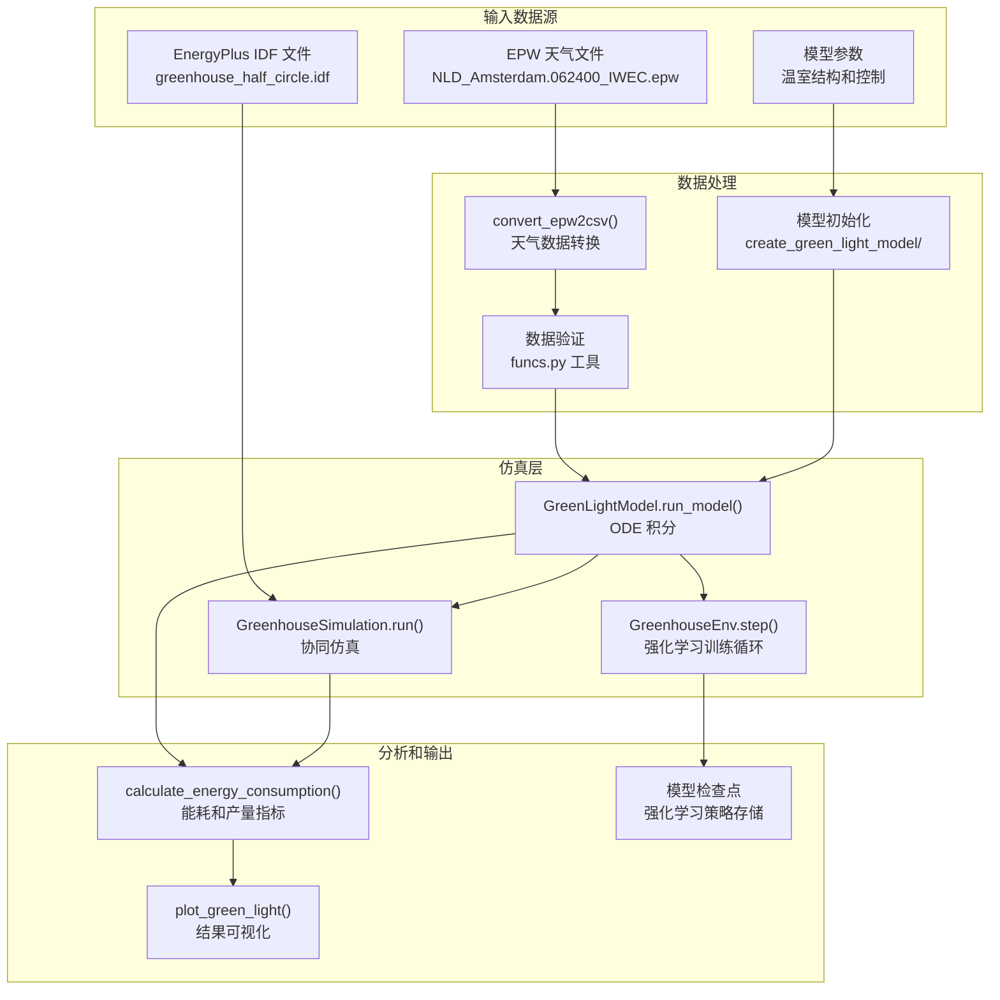

# 概述

> **相关源文件**
> * [README.md](https://github.com/greenpeer/GreenLightPlus/blob/262399d9/README.md)
> * [README_zh.md](https://github.com/greenpeer/GreenLightPlus/blob/262399d9/README_zh.md)

本文档提供了 GreenLightPlus 的全面概述，这是一个用于温室环境模拟和能源优化的 Python 工具包。它涵盖了系统的架构、核心组件和集成能力。

GreenLightPlus 专为从事温室自动化、能源优化和农业 AI 系统的研究人员、工程师和开发人员而设计。有关详细使用示例，请参阅[使用示例](/greenpeer/GreenLightPlus/4-usage-examples)。有关开发信息，请参阅[开发](/greenpeer/GreenLightPlus/5-development)。

## 系统概述

GreenLightPlus 是一个基于 Python 的温室模拟和优化平台，它扩展了 David Katzin 的原始 MATLAB GreenLight 模型。该系统提供四个主要功能：

| 功能 | 用途 | 主要组件 |
| --- | --- | --- |
| 环境模拟 | 模拟温室气候动态和作物生长 | `GreenLightModel` |
| 能源分析 | 详细的建筑能源消耗分析 | `GreenhouseSimulation` |
| AI 优化 | 强化学习控制策略 | `GreenhouseEnv` |
| 结构建模 | 生成温室几何配置 | `GreenhouseGeometry` |

该工具包与外部系统集成，包括用于建筑模拟的 EnergyPlus v23.2.0、用于分布式强化学习的 Ray RLlib，以及标准天气数据格式（EPW 文件）。

**核心架构**

来源: [README.md L14-L50](https://github.com/greenpeer/GreenLightPlus/blob/262399d9/README.md#L14-L50)

 [README.md L38-L50](https://github.com/greenpeer/GreenLightPlus/blob/262399d9/README.md#L38-L50)

## 核心组件关系

GreenLightPlus 的四个核心组件在层次关系中运行，其中 `GreenLightModel` 作为中央仿真引擎，其他组件依赖或扩展它。

**组件依赖关系和数据流**

**关键集成点：**

* **模型初始化**：`create_green_light_model/` 目录包含构建 ODE 系统、设置参数和为 `GreenLightModel` 初始化状态的模块
* **仿真扩展**：`GreenhouseSimulation` 和 `GreenhouseEnv` 都包装了 `GreenLightModel` 以提供专门的接口
* **数据处理**：天气数据通过 `convert_epw2csv.py` 流向仿真引擎
* **结果分析**：`GreenLightModel` 的输出由可视化和分析函数处理

来源：[README.md L40-L50](https://github.com/greenpeer/GreenLightPlus/blob/262399d9/README.md#L40-L50)

 [README.md L47-L49](https://github.com/greenpeer/GreenLightPlus/blob/262399d9/README.md#L47-L49)

## 外部系统集成

GreenLightPlus 与多个外部系统集成，提供全面的温室仿真和优化功能。

**集成架构**

**集成详情：**

| 外部系统 | 集成方法 | 主要接口 | 用途 |
| --- | --- | --- | --- |
| EnergyPlus | Python API (`pyenergyplus.api`) | `GreenhouseSimulation` class | 建筑能耗分析 |
| Ray RLlib | 直接导入和配置 | `GreenhouseEnv` as Gymnasium environment | 分布式强化学习训练 |
| Weather Data | AWS S3下载和CSV转换 | `convert_epw2csv.py` | 气候数据处理 |
| Scientific Stack | 标准Python导入 | 整个代码库 | 数值计算 |

**配置要求：**

* EnergyPlus安装路径必须添加到Python `sys.path` [README.md L298-L299](https://github.com/greenpeer/GreenLightPlus/blob/262399d9/README.md#L298-L299)
* 从AWS S3存储桶下载天气文件 [README.md L85-L86](https://github.com/greenpeer/GreenLightPlus/blob/262399d9/README.md#L85-L86)
* 通过`PPOConfig`类配置Ray RLlib [README.md L359-L433](https://github.com/greenpeer/GreenLightPlus/blob/262399d9/README.md#L359-L433)

来源：[README.md L55-L96](https://github.com/greenpeer/GreenLightPlus/blob/262399d9/README.md#L55-L96)

 [README.md L288-L340](https://github.com/greenpeer/GreenLightPlus/blob/262399d9/README.md#L288-L340)

 [README.md L341-L452](https://github.com/greenpeer/GreenLightPlus/blob/262399d9/README.md#L341-L452)

## 数据处理管道

GreenLightPlus实现了一个全面的数据处理管道，用于转换天气数据、管理仿真状态并生成分析输出。

**管道架构**

**处理函数：**

| 阶段 | 函数/类 | 输入格式 | 输出格式 | 用途 |
| --- | --- | --- | --- | --- |
| 天气处理 | `convert_epw2csv()` | EPW 文件 | CSV 时间序列 | 气候数据标准化 |
| 模型创建 | `create_green_light_model/` 模块 | 参数字典 | 模型状态字典 | 仿真初始化 |
| 仿真 | `GreenLightModel.run_model()` | 状态字典 + 参数 | 更新的状态字典 | 核心温室动力学 |
| 分析 | `calculate_energy_consumption()` | 仿真结果 | 标量指标 | 性能评估 |
| 可视化 | `plot_green_light()` | 仿真结果 | Matplotlib 图形 | 结果展示 |

**状态管理：**

系统通过嵌套字典维护仿真状态，包含：

* 物理参数（`'p'` 键）用于温室结构和控制设置
* 温度、湿度、CO2 和作物生长的状态变量
* 能耗和环境条件的时间序列输出

来源：[README.md L175-L286](https://github.com/greenpeer/GreenLightPlus/blob/262399d9/README.md#L175-L286)

 [README.md L187-L262](https://github.com/greenpeer/GreenLightPlus/blob/262399d9/README.md#L187-L262)

 [README.md L312-L338](https://github.com/greenpeer/GreenLightPlus/blob/262399d9/README.md#L312-L338)