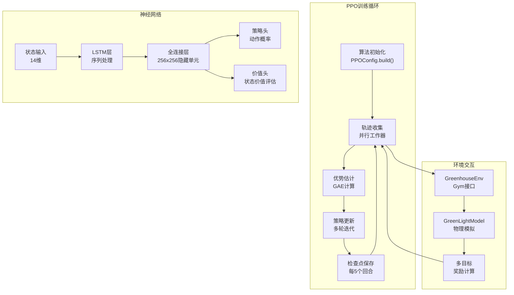
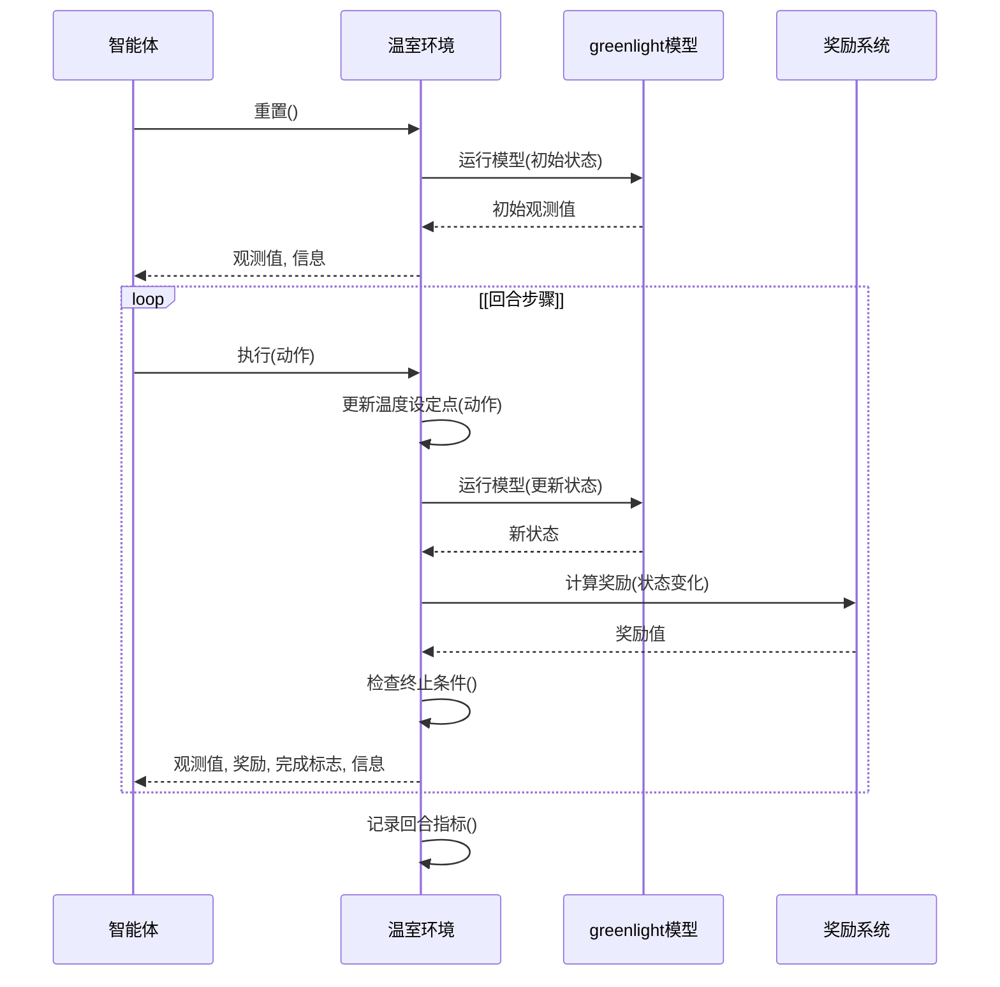

# 强化学习训练

> **相关源文件**
> * [README.md](https://github.com/greenpeer/GreenLightPlus/blob/262399d9/README.md)
> * [core/greenhouse_env.py](https://github.com/greenpeer/GreenLightPlus/blob/262399d9/core/greenhouse_env.py)

本文档介绍GreenLightPlus的强化学习(RL)训练功能，重点阐述如何使用PPO(近端策略优化)算法训练AI代理来优化温室控制策略。该RL系统能够自动学习最优的温室管理策略，包括温度、CO2等环境控制参数，在最小化能耗的同时最大化作物产量。

如需了解不使用RL优化的基础温室模拟，请参阅[基础温室模拟](/greenpeer/GreenLightPlus/4.1-basic-greenhouse-simulation)。有关底层RL环境实现细节，请参阅[GreenhouseEnv](/greenpeer/GreenLightPlus/2.3-greenhouseenv)。

## RL系统架构

GreenLightPlus中的强化学习系统集成了多个组件来实现温室优化的代理训练。该系统使用Ray RLlib作为分布式训练框架，并以PPO作为主要算法。

### 高层RL架构

```

```

源文件: [README.md L341-L450](https://github.com/greenpeer/GreenLightPlus/blob/262399d9/README.md#L341-L450)

 [core/greenhouse_env.py L21-L376](https://github.com/greenpeer/GreenLightPlus/blob/262399d9/core/greenhouse_env.py#L21-L376)

### RL训练数据流

```

```

源文件: [README.md L358-L441](https://github.com/greenpeer/GreenLightPlus/blob/262399d9/README.md#L358-L441)

 [core/greenhouse_env.py L137-L171](https://github.com/greenpeer/GreenLightPlus/blob/262399d9/core/greenhouse_env.py#L137-L171)

 [core/greenhouse_env.py L341-L369](https://github.com/greenpeer/GreenLightPlus/blob/262399d9/core/greenhouse_env.py#L341-L369)

## 环境实现

`GreenhouseEnv` 类实现了核心强化学习环境，遵循 OpenAI Gym 接口规范。它封装了 `GreenLightModel` 以提供标准化的强化学习交互。

### 环境配置

环境接受一个配置字典，包含以下关键参数：

| 参数 | 类型 | 默认值 | 描述 |
| --- | --- | --- | --- |
| `first_day` | int | 1 | 模拟开始的年积日 |
| `season_length` | int | 60 | 生长季节持续时间(天) |
| `season_interval` | float | 1/24 | 时间步长间隔(天) |
| `target_yield` | float | 0 | 目标作物产量(kg/m²) |
| `target_yield_unit_energy_input` | float | 0 | 目标能源效率(MJ/kg) |
| `isMature` | bool | False | 作物初始成熟状态 |
| `epw_path` | str | "" | 气象数据文件路径 |
| `init_state` | dict | {} | 初始温室参数 |

源文件: [core/greenhouse_env.py L27-L51](https://github.com/greenpeer/GreenLightPlus/blob/262399d9/core/greenhouse_env.py#L27-L51)

### 动作与观察空间

环境定义了用于温度控制的离散动作和用于系统状态监测的连续观察空间:

```

```

观测向量包含以下要素：

* 年积日 (0-365)
* 夜间/日间温度设定值 (18-28°C)  
* CO2设定值 (400-1600 ppm)
* 空气CO2浓度、蒸汽压、温度
* 果实干物质重量、呼吸速率  
* 太阳辐射、室外温度
* 灯具和锅炉能耗

源文件: [core/greenhouse_env.py L77-L132](https://github.com/greenpeer/GreenLightPlus/blob/262399d9/core/greenhouse_env.py#L77-L132)

 [core/greenhouse_env.py L173-L230](https://github.com/greenpeer/GreenLightPlus/blob/262399d9/core/greenhouse_env.py#L173-L230)

## 奖励系统

奖励系统实现了多目标优化，在生长和收获阶段平衡作物产量与能源效率。

### 生长阶段奖励

在生长阶段（果实成熟前），奖励基于果实生物量的累积：

```markdown
# 果实生长奖励计算
cFruit_growth = self.new_gl["x"]["cFruit"] - self.gl["x"]["cFruit"]
reward = cFruit_growth * 1e-3  # Reward scaling to g/m²
```

### 收获阶段奖励

在收获阶段，奖励机制综合考虑产量目标和能源效率：

```yaml
# Base harvest reward
reward = self.yield_change * 1e3  # Yield in g/m²

# Progressive target adjustment
incremental_target_yield = self.target_yield * (0.1 + 0.9 * harvest_progress)

# Performance-based scaling
if self.total_yield >= incremental_target_yield:
    reward *= 1.2  # 20% bonus for meeting targets
else:
    reward *= 0.8  # 20% penalty for underperformance
```

### 终止奖励

在训练周期结束时，会根据整体性能指标应用额外的奖励/惩罚：

```markdown
# 能源效率与产量差距计算
energy_diff_pct = (target_energy - actual_energy) / target_energy
yield_diff_pct = (actual_yield - target_yield) / target_yield

# 终止奖励调整
reward += (energy_diff_pct + yield_diff_pct) * self.total_reward
```

Sources: [core/greenhouse_env.py L234-L323](https://github.com/greenpeer/GreenLightPlus/blob/262399d9/core/greenhouse_env.py#L234-L323)

## 训练配置

训练使用 Ray RLlib 的 PPO 算法配合 LSTM 网络进行序列决策：

### PPO 配置

| 参数 | 值 | 用途 |
| --- | --- | --- |
| `gamma` | 0.9 | 未来奖励的折扣因子 |
| `lr` | 0.0001 | 策略更新的学习率 |
| `kl_coeff` | 0.3 | KL散度约束系数 |
| `fcnet_hiddens` | [256, 256] | 隐藏层架构 |
| `use_lstm` | True | 启用循环神经网络 |
| `max_seq_len` | 48 | LSTM最大序列长度 |

### 训练架构



来源: [README.md L358-L431](https://github.com/greenpeer/GreenLightPlus/blob/262399d9/README.md#L358-L431)

## 训练流程

训练过程遵循标准的基于回合的强化学习训练循环:

### 训练循环实现

```python
# Algorithm initialization
algo = config.build()

# Training loop
for episode in tqdm(range(250)):
    result = algo.train()
    if episode % 5 == 0:
        checkpoint_dir = algo.save().checkpoint.path
        print(f"Checkpoint saved in directory {checkpoint_dir}")
```

### 回合生命周期



来源: [README.md L435-L441](https://github.com/greenpeer/GreenLightPlus/blob/262399d9/README.md#L435-L441)

 [core/greenhouse_env.py L137-L171](https://github.com/greenpeer/GreenLightPlus/blob/262399d9/core/greenhouse_env.py#L137-L171)

 [core/greenhouse_env.py L341-L369](https://github.com/greenpeer/GreenLightPlus/blob/262399d9/core/greenhouse_env.py#L341-L369)

## 性能监控

系统在整个训练过程中跟踪多个性能指标:

### 回合指标

环境维护跨回合的性能统计:

* `episode_unit_energy_inputs`: 每回合能源效率
* `episode_total_yields`: 每回合作物产量
* `yield_unit_energy_input`: 总体能源效率(MJ/kg)
* `total_yield`: 累计作物产量(kg/m²)

### 训练输出

训练产生详细的性能日志:

```python
print(f"单位能耗是{self.yield_unit_energy_input}, 目标单位能耗是{self.target_yield_unit_energy_input}")
print(f"总产量是{self.total_yield}, 目标总产量是{self.target_yield}")
print(f"本次起始日期{self.new_first_day}的{self.season_length}天,总奖励是 {self.total_reward}")
```

### 检查点管理

模型检查点会定期保存，以便恢复训练和策略评估：

```python
if episode % 5 == 0:
    checkpoint_dir = algo.save().checkpoint.path
    print(f"Checkpoint saved in directory {checkpoint_dir}")
```

来源: [core/greenhouse_env.py L312-L317](https://github.com/greenpeer/GreenLightPlus/blob/262399d9/core/greenhouse_env.py#L312-L317)

 [README.md L439-L441](https://github.com/greenpeer/GreenLightPlus/blob/262399d9/README.md#L439-L441)

## 使用示例

以下示例展示了完整的温室优化强化学习训练设置:

```javascript
from ray.rllib.algorithms.ppo import PPOConfig
from GreenLightPlus import GreenhouseEnv

# Configure PPO algorithm
config = PPOConfig()
config.rollouts(num_rollout_workers=1)
config.resources(num_cpus_per_worker=1)
config.environment(
    env=GreenhouseEnv,
    env_config={
        "first_day": 101,
        "season_length": 60,
        "season_interval": 1/24*4,  # 6-hour intervals
        "target_yield": 8,
        "target_yield_unit_energy_input": 22,
        # ... additional configuration
    }
)

# Build and train algorithm
algo = config.build()
for episode in range(250):
    result = algo.train()
```

该配置训练智能体在60天的生长季中优化温室温度控制，目标是实现8公斤/平方米的产量和22兆焦/公斤的能源效率。

来源: [README.md L349-L441](https://github.com/greenpeer/GreenLightPlus/blob/262399d9/README.md#L349-L441)