# 结果分析

> **相关源文件**
> * [result_analysis/energy_analysis.py](https://github.com/greenpeer/GreenLightPlus/blob/262399d9/result_analysis/energy_analysis.py)
> * [result_analysis/energy_yield_analysis.py](https://github.com/greenpeer/GreenLightPlus/blob/262399d9/result_analysis/energy_yield_analysis.py)
> * [result_analysis/plot_green_light.py](https://github.com/greenpeer/GreenLightPlus/blob/262399d9/result_analysis/plot_green_light.py)

## 目的与范围

结果分析系统提供了一套全面的工具，用于分析GreenLight模型运行的模拟结果、生成可视化图表并计算能源性能指标。该系统处理已完成模拟的输出数据结构，生成能量平衡计算、产量分析以及详细的可视化图表。

有关运行模拟以生成该系统分析数据的信息，请参阅[基础温室模拟](/greenpeer/GreenLightPlus/4.1-basic-greenhouse-simulation)。关于产生这些结果的核心模拟引擎的详细信息，请参阅[GreenLightModel](/greenpeer/GreenLightPlus/2.1-greenlightmodel)。

## 系统概述

结果分析系统由三个主要模块组成，这些模块协同工作，将原始模拟输出转化为可操作的见解和可视化结果。


Sources: [result_analysis/energy_analysis.py L22-L96](https://github.com/greenpeer/GreenLightPlus/blob/262399d9/result_analysis/energy_analysis.py#L22-L96)

 [result_analysis/energy_yield_analysis.py L20-L99](https://github.com/greenpeer/GreenLightPlus/blob/262399d9/result_analysis/energy_yield_analysis.py#L20-L99)

 [result_analysis/plot_green_light.py L30-L198](https://github.com/greenpeer/GreenLightPlus/blob/262399d9/result_analysis/plot_green_light.py#L30-L198)

## 能量分析模块

`energy_analysis` 函数通过分析系统各组成部分的热流、能量输入和能量损失，为温室模拟提供全面的能量平衡计算。

### 能量平衡组成

| 组件 | 变量名 | 描述 |
| --- | --- | --- |
| 太阳辐射输入 | `rGlobSunAir`, `rParSunCan`, `rNirSunCan`, `rParSunFlr`, `rNirSunFlr`, `rGlobSunCovE` | 进入系统的太阳辐射能量 |
| 加热系统输入 | `hBoilPipe`, `hBoilGroPipe` | 来自加热系统的能量 |
| 蒸腾作用 | `lAirThScr`, `lAirBlScr`, `lTopCovIn`, `lCanAir` | 植物蒸腾作用的潜热 |
| 土壤输出 | `hSo5SoOut` | 向土壤的热量损失 |
| 通风输出 | `hAirOut`, `hTopOut` | 通过通风的热量损失 |
| 对流输出 | `hCovEOut` | 对流热量损失 |
| 辐射输出 | `rCovESky`, `rThScrSky`, `rBlScrSky`, `rCanSky`, `rPipeSky`, `rFlrSky`, `rLampSky` | 向天空的长波辐射 |
| 人工光照输入 | `qLampIn`, `qIntLampIn` | 来自人工照明的能量 |
| 灯具冷却 | `hLampCool` | 灯具冷却系统带走的热量 |

### 能量平衡验证

系统通过计算总能量平衡来自动验证能量守恒。如果绝对平衡值超过100 MJ m⁻²，将生成警告。


来源: [result_analysis/energy_analysis.py L22-L96](https://github.com/greenpeer/GreenLightPlus/blob/262399d9/result_analysis/energy_analysis.py#L22-L96)

## 能量-产量分析模块

`energy_yield_analysis` 函数计算能源消耗与作物产量之间的关系，为温室运行效率提供关键性能指标。

### 性能指标

分析计算以下几个关键指标:

* **能源消耗**: 分别追踪灯具能耗(`lampIn`)、锅炉能耗(`boilIn`)和热量回收能耗(`hhIn`)
* **光照供给**: 来自太阳的光合有效辐射(`parSun`)和灯具的光合有效辐射(`parLamps`)，单位为 mol m⁻²
* **作物产量**: 番茄鲜重产量(`yield_fw`)，单位为 kg m⁻²
* **能源效率**: 单位产量能源投入(`efficiency`)，单位为 MJ kg⁻¹

### 热量回收集成

当这些系统不存在时，系统通过设置默认值来处理可选的热量回收组件:


来源: [result_analysis/energy_yield_analysis.py L34-L64](https://github.com/greenpeer/GreenLightPlus/blob/262399d9/result_analysis/energy_yield_analysis.py#L34-L64)

## 可视化系统

`plot_green_light` 函数使用 matplotlib 创建模拟结果的综合多面板可视化。该系统生成11个子图，涵盖所有主要温室变量和过程。

### 图表配置

| 子图 | 变量 | 描述 |
| --- | --- | --- |
| 1 | `tAir`, `tOut` | 室内外温度对比 |
| 2 | `vpAir`, `vpOut` | 室内外水汽压对比 |
| 3 | `rhIn`, outdoor RH | 室内外相对湿度对比 |
| 4 | `co2Air`, `co2Out` | CO₂浓度 (mg m⁻³) |
| 5 | `co2InPpm`, outdoor CO₂ | CO₂浓度 (ppm) |
| 6 | `iGlob`, `rParGhSun`, `rParGhLamp`, `qLampIn` | 太阳辐射和人工照明 |
| 7 | PAR from sun and lamps | 光合光子通量密度 |
| 8 | `mcAirCan`, `mcAirBuf`, `mcBufAir`, `mcOrgAir` | 碳同化和呼吸作用 |
| 9 | `cFruit`, `cStem`, `cLeaf`, `cBuf`, `lai` | 植物生物量和叶面积指数 |
| 10 | `cFruit`, `mcFruitHar` | 果实发育和收获 |
| 11 | Temperature states | 所有系统温度状态 |

### 时间序列处理

可视化系统将模拟时间步长转换为 datetime 对象，以便正确格式化时间轴:

```mermaid
sequenceDiagram
  participant GreenLight数据
  participant 时间序列转换器
  participant Matplotlib
  participant 可视化输出

  GreenLight数据->>时间序列转换器: 原始时间序列数据
  时间序列转换器->>时间序列转换器: 转换为datetime对象
  note over 时间序列转换器: 起始时间 + timedelta(秒=300*i)
  时间序列转换器->>Matplotlib: 格式化后的时间序列
  Matplotlib->>Matplotlib: 配置11个子图
  Matplotlib->>Matplotlib: 应用时间轴格式化
  note over Matplotlib: 小时定位器, 日期格式化器
  Matplotlib->>可视化输出: 完整可视化结果
```



来源: [result_analysis/plot_green_light.py L30-L198](https://github.com/greenpeer/GreenLightPlus/blob/262399d9/result_analysis/plot_green_light.py#L30-L198)

## 与服务功能模块的集成

结果分析系统高度依赖服务功能模块中的工具函数进行数据处理和单位转换。

### 关键依赖项

| 函数 | 用途 | 使用场景 |
| --- | --- | --- |
| `calculate_energy_consumption` | 计算时间序列中的能量总和 | 能量平衡计算 |
| `trapz_arrays` | 使用梯形法则进行数值积分 | PAR光照和能量总和计算 |
| `vp2dens` | 水汽压到密度的转换 | 湿度计算 |
| `rh2vapor_dens` | 相对湿度到水汽密度的转换 | 室外湿度计算 |
| `co2_dens2ppm` | CO₂密度到ppm的转换 | CO₂浓度显示 |


来源: [result_analysis/energy_analysis.py L19](https://github.com/greenpeer/GreenLightPlus/blob/262399d9/result_analysis/energy_analysis.py#L19-L19)

 [result_analysis/energy_yield_analysis.py L17](https://github.com/greenpeer/GreenLightPlus/blob/262399d9/result_analysis/energy_yield_analysis.py#L17-L17)

 [result_analysis/plot_green_light.py L24-L27](https://github.com/greenpeer/GreenLightPlus/blob/262399d9/result_analysis/plot_green_light.py#L24-L27)

## 返回值与数据结构

### 能量分析输出

`energy_analysis` 函数返回一个包含以下元素的元组:

```
(sunIn, heatIn, transp, soilOut, ventOut, firOut, lampIn, convOut, lampCool, balance)
```

所有数值均以MJ m⁻²为单位，表示模拟期间的能量流动。

### 能量-产量分析输出

`energy_yield_analysis` 函数返回:

```
(lampIn, boilIn, hhIn, parSun, parLamps, yield_fw, efficiency)
```

其中能量值单位为MJ m⁻²，PAR值单位为mol m⁻²，产量单位为kg m⁻²，效率单位为MJ kg⁻¹。

### 可视化输出

`plot_green_light` 函数生成一个包含11个配置好的子图的matplotlib图形对象，格式设置为300 DPI分辨率的出版质量输出。

来源: [result_analysis/energy_analysis.py L84-L96](https://github.com/greenpeer/GreenLightPlus/blob/262399d9/result_analysis/energy_analysis.py#L84-L96)

 [result_analysis/energy_yield_analysis.py L99](https://github.com/greenpeer/GreenLightPlus/blob/262399d9/result_analysis/energy_yield_analysis.py#L99-L99)

 [result_analysis/plot_green_light.py L41](https://github.com/greenpeer/GreenLightPlus/blob/262399d9/result_analysis/plot_green_light.py#L41-L41)