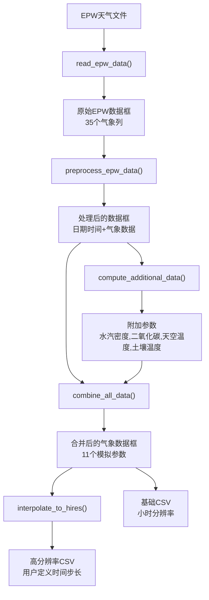
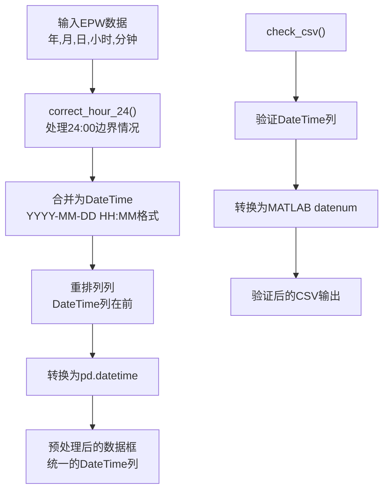
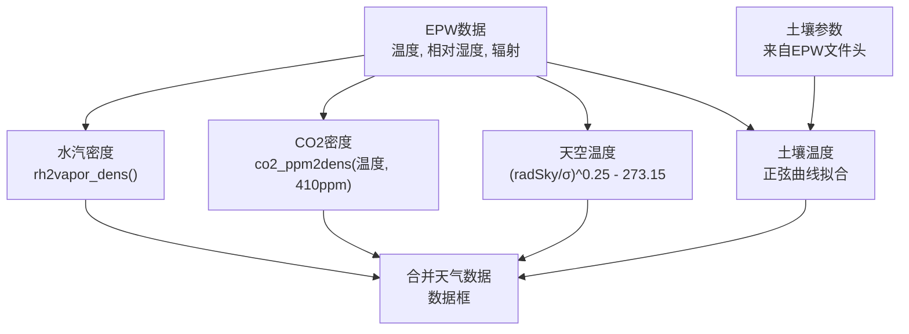
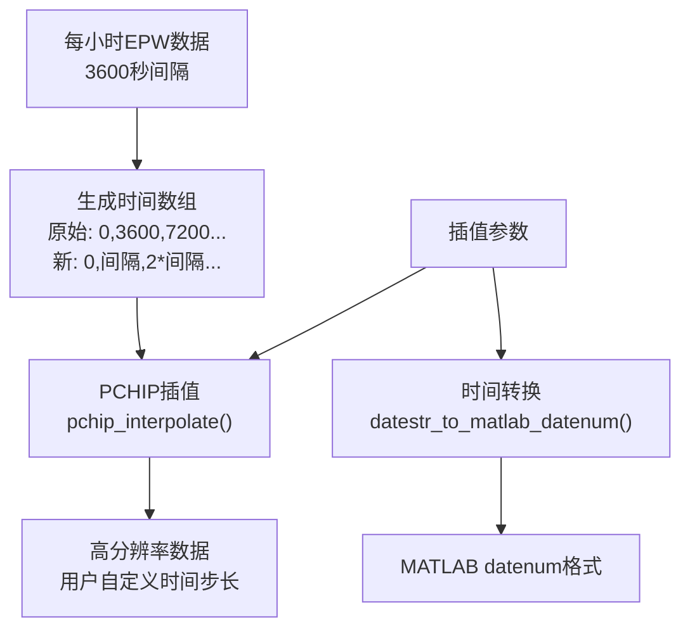
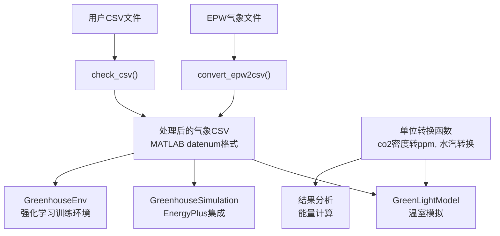

# 服务功能

> **相关源文件**
> * [service_functions/co2_dens2ppm.py](https://github.com/greenpeer/GreenLightPlus/blob/262399d9/service_functions/co2_dens2ppm.py)
> * [service_functions/convert_epw2csv.py](https://github.com/greenpeer/GreenLightPlus/blob/262399d9/service_functions/convert_epw2csv.py)

## 目的与范围

Service Functions 为 GreenLightPlus 系统提供数据处理的实用工具操作，包括天气文件转换和单位转换。这些功能处理来自 EPW (EnergyPlus Weather) 格式的天气数据预处理，执行热力学计算，并确保不同模拟组件之间的数据兼容性。

有关核心温室模拟逻辑的信息，请参阅 [GreenLightModel](/greenpeer/GreenLightPlus/2.1-greenlightmodel)。有关模型参数配置，请参阅 [Model Configuration](/greenpeer/GreenLightPlus/3.3-model-configuration)。

## 天气数据处理流程

服务功能的主要工作流程围绕将原始天气数据转换为适合温室模拟的格式。系统通过多个阶段处理 EPW 文件，生成包含计算大气参数的高分辨率 CSV 文件。

### EPW 到 CSV 的转换过程

来源: [service_functions/convert_epw2csv.py L450-L511](https://github.com/greenpeer/GreenLightPlus/blob/262399d9/service_functions/convert_epw2csv.py#L450-L511)

`convert_epw2csv` 函数负责协调整个处理流程，接收 EPW 文件路径、时间步长和输出文件夹作为参数。该过程始于 `read_epw_data` 解析 EPW 文件结构，并将 35 个气象参数提取到 pandas DataFrame 中。

### 数据预处理与验证

来源: [service_functions/convert_epw2csv.py L193-L238](https://github.com/greenpeer/GreenLightPlus/blob/262399d9/service_functions/convert_epw2csv.py#L193-L238)

 [service_functions/convert_epw2csv.py L514-L580](https://github.com/greenpeer/GreenLightPlus/blob/262399d9/service_functions/convert_epw2csv.py#L514-L580)

预处理阶段处理时间格式不一致问题，特别是EPW文件中使用"24:00"表示次日午夜的情况。`correct_hour_24`函数会将这些时间转换为相应日期的"00:00"以保持时间一致性。

## 单位转换与热力学计算

服务函数提供了温室模拟中使用的不同大气测量系统之间的关键单位转换。

### 大气参数转换

| 函数 | 输入参数 | 输出 | 用途 |
| --- | --- | --- | --- |
| `relative_humidity_to_vapor_density` | 温度(°C), 相对湿度(%) | 水汽密度(kg/m³) | 将相对湿度转换为绝对湿度 |
| `vapor_density_to_pressure` | 温度(°C), 水汽密度(kg/m³) | 水汽压(Pa) | 根据密度计算水汽压 |
| `co2_ppm_to_density` | 温度(°C), CO2(ppm) | CO2密度(kg/m³) | 将摩尔浓度转换为质量浓度 |
| `co2_dens2ppm` | 温度(°C), CO2密度(kg/m³) | CO2(ppm) | 将质量浓度转换为摩尔浓度 |

来源: [service_functions/convert_epw2csv.py L42-L126](https://github.com/greenpeer/GreenLightPlus/blob/262399d9/service_functions/convert_epw2csv.py#L42-L126)

 [service_functions/co2_dens2ppm.py L21-L57](https://github.com/greenpeer/GreenLightPlus/blob/262399d9/service_functions/co2_dens2ppm.py#L21-L57)

这些转换基于理想气体定律和饱和水汽压的经验公式。系统假设标准大气压(101325 Pa)并使用每个函数中定义的物理常数。

### 附加参数计算

来源: [service_functions/convert_epw2csv.py L241-L326](https://github.com/greenpeer/GreenLightPlus/blob/262399d9/service_functions/convert_epw2csv.py#L241-L326)

`compute_additional_data`函数计算EPW文件中不直接提供的参数。假设CO2浓度恒定为410 ppm，天空温度通过红外辐射使用斯特藩-玻尔兹曼定律计算，土壤温度则遵循与EPW文件头中月度数据拟合的年度正弦曲线模式。

## 数据插值与时间分辨率

系统通过插值支持多种时间分辨率，允许用户从每小时EPW测量数据生成高频数据。

### 插值过程

来源: [service_functions/convert_epw2csv.py L383-L417](https://github.com/greenpeer/GreenLightPlus/blob/262399d9/service_functions/convert_epw2csv.py#L383-L417)

 [service_functions/convert_epw2csv.py L420-L447](https://github.com/greenpeer/GreenLightPlus/blob/262399d9/service_functions/convert_epw2csv.py#L420-L447)

`interpolate_to_hires`函数使用分段三次Hermite插值多项式(PCHIP)在每小时数据点之间生成平滑曲线。这种方法既能保持原始数据的形状，又能提供温室详细模拟所需的时间分辨率。

## 与核心组件的集成

服务函数作为温室模拟生态系统的数据准备层，为核心组件提供标准化输入。

### 核心组件数据流

来源: [service_functions/convert_epw2csv.py L450-L511](https://github.com/greenpeer/GreenLightPlus/blob/262399d9/service_functions/convert_epw2csv.py#L450-L511)

 [service_functions/convert_epw2csv.py L514-L580](https://github.com/greenpeer/GreenLightPlus/blob/262399d9/service_functions/convert_epw2csv.py#L514-L580)

标准化的CSV输出包含11列对温室模拟至关重要的气象参数：室外总辐射、空气温度、水汽浓度、CO2浓度、风速、天空温度、土壤温度、日累计光照量、海拔高度和水汽压。DateTime列采用MATLAB datenum格式，以确保与核心GreenLight模型方程的兼容性。