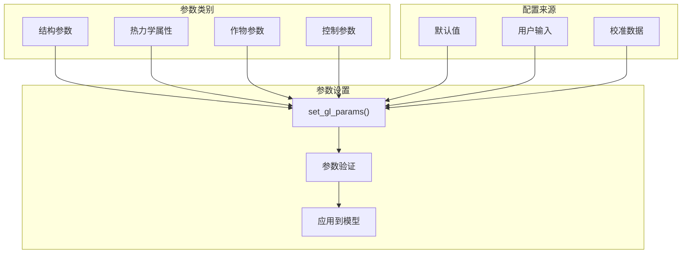

# 支持系统

> **相关源文件**
> * [service_functions/convert_epw2csv.py](https://github.com/greenpeer/GreenLightPlus/blob/262399d9/service_functions/convert_epw2csv.py)

本文档记录了支持GreenLightPlus四个核心组件的实用模块、数据处理功能和辅助组件。这些支持系统处理温室模拟工作流中必不可少的数据预处理、模型初始化、参数配置和结果分析操作。

有关核心模拟引擎的信息，请参阅[核心组件](/greenpeer/GreenLightPlus/2-core-components)。有关这些支持系统如何协同工作的使用示例，请参阅[使用示例](/greenpeer/GreenLightPlus/4-usage-examples)。

## 架构概述

GreenLightPlus中的支持系统采用分层架构，为核心组件提供数据处理、模型设置和分析能力。这些系统将原始输入转换为可用于模拟的数据，并将模拟输出处理为有意义的结果。

```

```

来源: [service_functions/convert_epw2csv.py L1-L632](https://github.com/greenpeer/GreenLightPlus/blob/262399d9/service_functions/convert_epw2csv.py#L1-L632)

## 服务功能

服务功能层为整个系统提供基础的数据处理和实用操作。这些功能处理天气数据转换、热力学计算和单位转换等对温室模拟至关重要的操作。

### 天气数据处理

主要的天气数据处理由`convert_epw2csv`模块完成，该模块将EnergyPlus Weather (EPW)文件转换为可用于模拟的CSV格式，并添加额外的计算参数。

```

```

**核心天气处理函数:**

| 函数 | 功能 | 输入 | 输出 |
| --- | --- | --- | --- |
| `read_epw_data()` | 解析EPW文件结构 | EPW文件路径 | 包含35个天气列的pandas DataFrame |
| `preprocess_epw_data()` | 清理并格式化时间数据 | 原始EPW DataFrame | 预处理后的统一DateTime格式DataFrame |
| `compute_additional_data()` | 计算衍生参数 | 预处理数据 | 水汽密度、CO2密度、天空温度、土壤温度 |
| `combine_all_data()` | 合并所有天气参数 | 独立参数数组 | 合并后的天气DataFrame |
| `interpolate_to_hires()` | 提高时间分辨率 | 小时数据 | 亚小时级插值数据 |

来源: [service_functions/convert_epw2csv.py L129-L191](https://github.com/greenpeer/GreenLightPlus/blob/262399d9/service_functions/convert_epw2csv.py#L129-L191)

 [service_functions/convert_epw2csv.py L193-L238](https://github.com/greenpeer/GreenLightPlus/blob/262399d9/service_functions/convert_epw2csv.py#L193-L238)

 [service_functions/convert_epw2csv.py L241-L327](https://github.com/greenpeer/GreenLightPlus/blob/262399d9/service_functions/convert_epw2csv.py#L241-L327)

 [service_functions/convert_epw2csv.py L329-L381](https://github.com/greenpeer/GreenLightPlus/blob/262399d9/service_functions/convert_epw2csv.py#L329-L381)

 [service_functions/convert_epw2csv.py L383-L418](https://github.com/greenpeer/GreenLightPlus/blob/262399d9/service_functions/convert_epw2csv.py#L383-L418)

### 热力学转换

系统包含专门针对温室环境的热力学属性转换函数:

```

```

**关键转换函数:**

* `relative_humidity_to_vapor_density()`: 使用Magnus公式计算，常数参数为 `SATURATION_PRESSURE_PARAMS = [610.78, 238.3, 17.2694, -6140.4, 273, 28.916]`
* `co2_ppm_to_density()`: 应用理想气体定律，参数为 `MOLAR_MASS_CO2 = 44.01e-3 kg/mol`
* `datestr_to_matlab_datenum()`: 将Python datetime转换为MATLAB datenum格式以确保兼容性

来源: [service_functions/convert_epw2csv.py L42-L71](https://github.com/greenpeer/GreenLightPlus/blob/262399d9/service_functions/convert_epw2csv.py#L42-L71)

 [service_functions/convert_epw2csv.py L103-L126](https://github.com/greenpeer/GreenLightPlus/blob/262399d9/service_functions/convert_epw2csv.py#L103-L126)

 [service_functions/convert_epw2csv.py L420-L447](https://github.com/greenpeer/GreenLightPlus/blob/262399d9/service_functions/convert_epw2csv.py#L420-L447)

### 数据验证

`check_csv()` 函数提供了对天气数据文件的健壮验证和标准化处理:

```

```

来源: [service_functions/convert_epw2csv.py L514-L581](https://github.com/greenpeer/GreenLightPlus/blob/262399d9/service_functions/convert_epw2csv.py#L514-L581)

 [service_functions/convert_epw2csv.py L583-L632](https://github.com/greenpeer/GreenLightPlus/blob/262399d9/service_functions/convert_epw2csv.py#L583-L632)

## 模型创建

模型创建组件负责初始化GreenLight模型的数学结构。这些模块设置常微分方程(ODE)系统，并配置模型的状态变量、参数和辅助计算。

### ODE系统配置

`ode.py`模块定义了控制温室动态的核心微分方程系统:

```

```

**模型创建组件:**

| 模块 | 职责 | 关键功能 |
| --- | --- | --- |
| `ode.py` | 定义ODE系统结构 | 微分方程定义 |
| `set_gl_params.py` | 设置物理参数 | 材料属性、温室几何参数 |
| `set_gl_states.py` | 初始化状态变量 | 温度、湿度、CO2状态 |
| `set_gl_control.py` | 配置控制逻辑 | 加热、通风、CO2控制 |
| `set_gl_aux.py` | 定义辅助计算 | 派生变量和约束条件 |

来源: 参考自整体系统架构图

### 参数配置

参数配置系统允许自定义温室物理属性、作物特性和控制设置:



来源: 参考自模块依赖架构

## 模型配置

模型配置层提供了对控制逻辑、辅助计算和系统参数的高级定制能力。这些组件使用户能够根据特定温室设计和运营策略调整模拟系统。

### 控制逻辑配置

GreenLightPlus中的控制系统基于设定值和环境条件来管理加热、通风、CO2注入和其他执行器:

```

```

**控制配置组件:**

* 通过加热和通风系统进行温度控制
* 通过CO2注入和自然通风进行CO2富集控制  
* 通过通风和除湿进行湿度控制
* 人工照明系统的光照控制

来源: 参考自系统架构中的控制逻辑

### 辅助计算

辅助计算提供了支持主ODE系统的派生变量和中间计算:

```

```

来源：参考自系统架构中的辅助计算

## 结果分析

结果分析层提供了处理模拟输出、生成可视化图表和计算性能指标的工具。这些组件将原始模拟数据转化为可用于温室优化的可执行见解。

### 可视化工具

`plot_green_light.py` 模块为模拟结果提供了全面的可视化功能：

```

```

来源：参考自系统架构中的分析层

### 能源分析

能源分析工具可计算详细的能量平衡、效率指标和成本核算：

**关键分析功能：**

| 分析类型 | 计算指标 | 应用场景 |
| --- | --- | --- |
| 能量平衡 | 热量增益/损耗，暖通空调能耗 | 系统容量设计，效率优化 |
| 经济分析 | 运营成本，投资回报率，回收期 | 投资决策，策略比较 |
| 环境影响 | 碳足迹，资源使用量 | 可持续性评估 |
| 生产力分析 | 单位能耗产量，作物品质 | 生产优化 |

```

```

来源：参考自系统架构中的分析组件

支持系统构成了GreenLightPlus的基础能力，通过完整的数据处理、模型配置和结果分析流程，将原始环境数据转化为优化的温室控制策略。