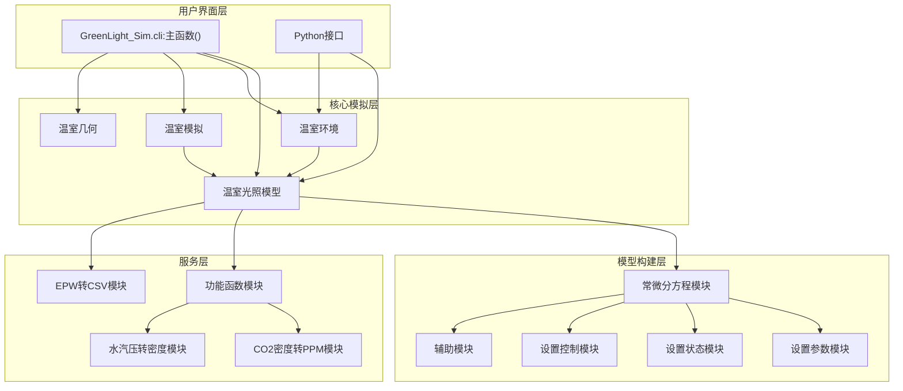
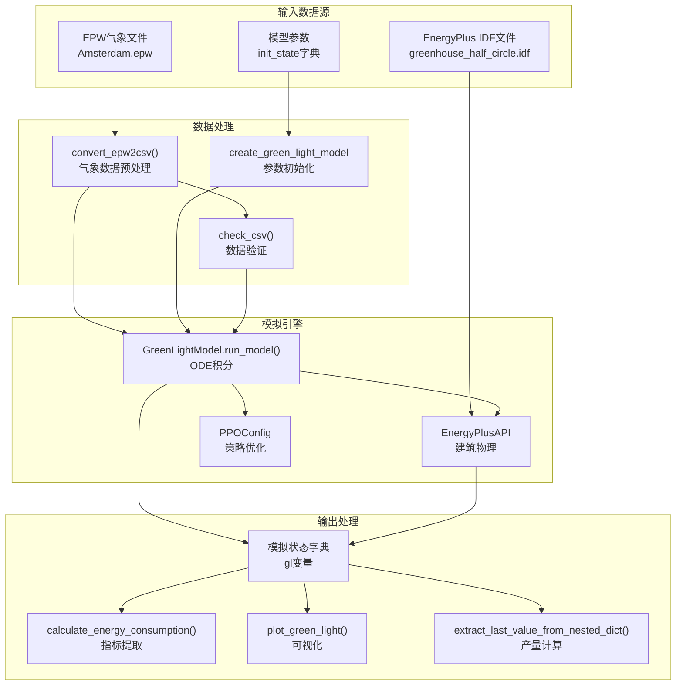
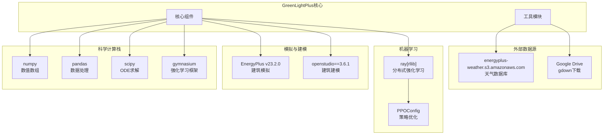
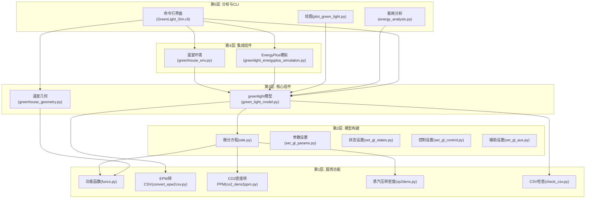

# 系统架构

> **相关源文件**
> * [README.md](https://github.com/greenpeer/GreenLightPlus/blob/262399d9/README.md)
> * [pyproject.toml](https://github.com/greenpeer/GreenLightPlus/blob/262399d9/pyproject.toml)

## 目的和范围

本文档提供了 GreenLightPlus 系统架构的全面概述，详细说明了四个核心组件如何在温室模拟和优化生态系统中相互作用。它涵盖了代码库的结构组织、组件关系、数据流模式和外部系统集成。

有关安装和设置程序，请参阅[安装和设置](/greenpeer/GreenLightPlus/1.2-installation-and-setup)。有关各个组件的详细文档，请参阅[核心组件](/greenpeer/GreenLightPlus/2-core-components)。有关特定实用程序模块和支持系统的信息，请参阅[支持系统](/greenpeer/GreenLightPlus/3-supporting-systems)。

## 核心系统组件

GreenLightPlus 围绕四个主要组件构建，这些组件协同工作以提供全面的温室模拟和优化功能：

### 组件概述

```

```

**核心组件职责：**

| 组件 | 主要类 | 关键函数 | 用途 |
| --- | --- | --- | --- |
| GreenLightModel | `GreenLightModel` | `run_model()`, `solve_ode()` | 基于ODE的温室模拟 |
| GreenhouseGeometry | `GreenhouseGeometry` | `create_houses()` | 几何结构生成 |
| GreenhouseSimulation | `GreenhouseSimulation` | `run()`, `get_results()` | EnergyPlus集成 |
| GreenhouseEnv | `GreenhouseEnv` | `step()`, `reset()` | Gymnasium RL接口 |

来源：[README.md L40-L43](https://github.com/greenpeer/GreenLightPlus/blob/262399d9/README.md#L40-L43)

 [README.md L45-L49](https://github.com/greenpeer/GreenLightPlus/blob/262399d9/README.md#L45-L49)

## 组件交互架构

系统采用分层架构，其中 `GreenLightModel` 作为中央模拟引擎，其他组件基于其功能构建：

### 交互流程



**关键交互模式：**

1. **组合**: `GreenhouseEnv` 和 `GreenhouseSimulation` 都包含并控制 `GreenLightModel` 实例
2. **依赖**: `GreenLightModel` 依赖于 `create_green_light_model/` 中的模型构建模块
3. **委托**: 服务函数提供整个系统中使用的专门计算

来源: [pyproject.toml L48](https://github.com/greenpeer/GreenLightPlus/blob/262399d9/pyproject.toml#L48-L48)

 [README.md L40-L49](https://github.com/greenpeer/GreenLightPlus/blob/262399d9/README.md#L40-L49)

## 数据流架构

系统通过从输入源到分析输出的明确定义的管道处理数据：

### 数据处理管道



**数据转换阶段：**

1. **输入处理**：使用 `convert_epw2csv()` 将天气数据从 EPW 格式转换为 CSV 格式
2. **参数初始化**：通过 `create_green_light_model` 模块定义模型结构
3. **仿真执行**：通过 `GreenLightModel.run_model()` 求解 ODE 系统
4. **结果提取**：使用 `calculate_energy_consumption()` 等实用函数计算指标

来源：[README.md L179-L262](https://github.com/greenpeer/GreenLightPlus/blob/262399d9/README.md#L179-L262)

 [README.md L296-L331](https://github.com/greenpeer/GreenLightPlus/blob/262399d9/README.md#L296-L331)

## 外部系统依赖

GreenLightPlus 与多个外部系统集成，以提供全面的仿真功能：

### 集成架构



**关键外部依赖:**

| 系统 | 版本 | 集成点 | 用途 |
| --- | --- | --- | --- |
| EnergyPlus | v23.2.0 | `EnergyPlusAPI` | 建筑能源模拟 |
| OpenStudio | 3.6.1 | IDF文件处理 | 建筑模型管理 |
| Ray RLlib | Latest | `PPOConfig`, `GreenhouseEnv` | 分布式强化学习训练 |
| SciPy | Latest | ODE模块中的`solve_ivp()` | 微分方程求解 |
| Gymnasium | Latest | `GreenhouseEnv`基类 | 强化学习环境框架 |

来源: [pyproject.toml L25-L33](https://github.com/greenpeer/GreenLightPlus/blob/262399d9/pyproject.toml#L25-L33)

 [README.md L55-L90](https://github.com/greenpeer/GreenLightPlus/blob/262399d9/README.md#L55-L90)

## 模块依赖结构

代码库被组织成一个清晰的依赖层次结构，支持可维护性和可扩展性：

### 依赖层次结构



**架构原则：**

1. **分层依赖**：高层依赖低层，防止循环依赖
2. **服务层隔离**：核心数学和转换函数在服务层中隔离
3. **组件组合**：集成组件通过组合而非继承来使用核心组件
4. **单一职责**：每个模块在其层级内都有明确的职责

来源：[README.md L40-L49](https://github.com/greenpeer/GreenLightPlus/blob/262399d9/README.md#L40-L49)

 [pyproject.toml L48](https://github.com/greenpeer/GreenLightPlus/blob/262399d9/pyproject.toml#L48-L48)