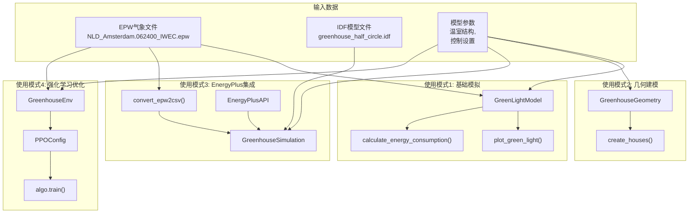
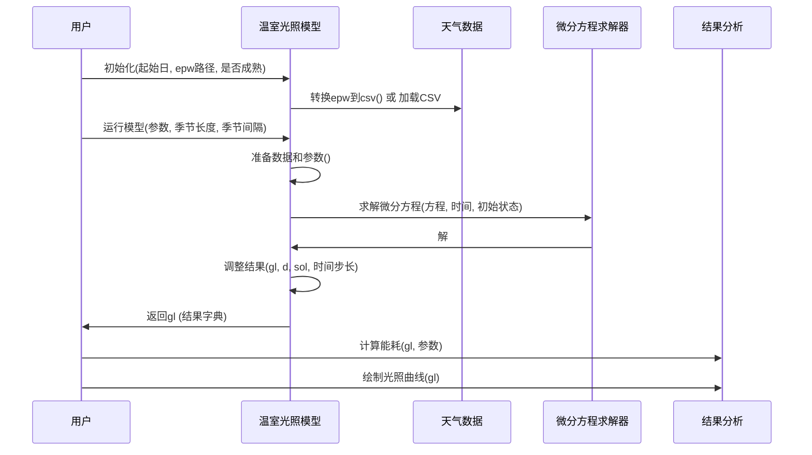
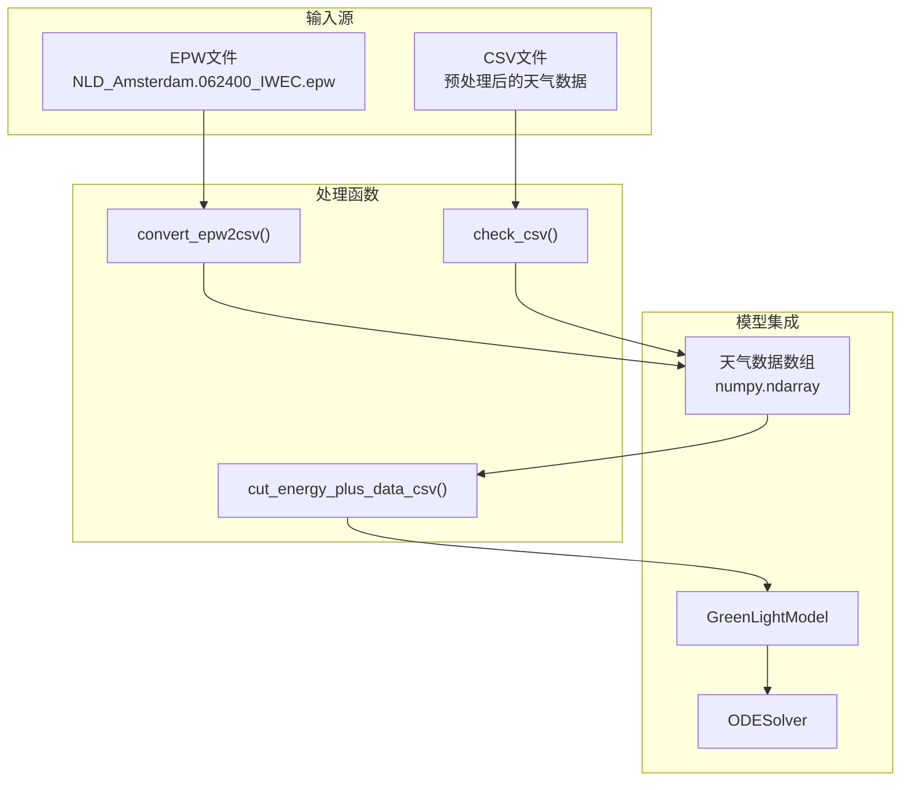

# 使用示例

> **相关源文件**
> * [README.md](https://github.com/greenpeer/GreenLightPlus/blob/262399d9/README.md)
> * [core/green_light_model.py](https://github.com/greenpeer/GreenLightPlus/blob/262399d9/core/green_light_model.py)

本文档提供了使用GreenLightPlus进行各种温室模拟和优化任务的实用示例。它涵盖了四种主要使用模式：基础温室模拟、几何建模、EnergyPlus集成和强化学习优化。

有关详细的安装和设置说明，请参阅[安装与设置](/greenpeer/GreenLightPlus/1.2-installation-and-setup)。有关各个组件的完整文档，请参阅[核心组件](/greenpeer/GreenLightPlus/2-core-components)和[支持系统](/greenpeer/GreenLightPlus/3-supporting-systems)。

## 使用模式概述

GreenLightPlus支持四种主要使用模式，每种模式针对温室建模和优化的不同方面：

### 使用模式工作流



**来源:** [README.md L99-L450](https://github.com/greenpeer/GreenLightPlus/blob/262399d9/README.md#L99-L450)

### 核心组件及其功能

```

```

**来源:** [core/green_light_model.py L38-L56](https://github.com/greenpeer/GreenLightPlus/blob/262399d9/core/green_light_model.py#L38-L56)

 [README.md L38-L49](https://github.com/greenpeer/GreenLightPlus/blob/262399d9/README.md#L38-L49)

## 基础温室模拟工作流

基本使用模式包括创建 `GreenLightModel` 实例、配置参数以及运行多时间步长的模拟：

### 模拟序列



**来源:** [core/green_light_model.py L237-L325](https://github.com/greenpeer/GreenLightPlus/blob/262399d9/core/green_light_model.py#L237-L325)

 [README.md L171-L286](https://github.com/greenpeer/GreenLightPlus/blob/262399d9/README.md#L171-L286)

## 关键参数与配置

### 模型初始化参数

| 参数 | 类型 | 描述 | 默认值 |
| --- | --- | --- | --- |
| `first_day` | int | 初始日期(年中的第几天) | 1 |
| `lampType` | str | 灯具类型: 'led', 'hps' 或 'none' | 'led' |
| `isMature` | bool | 是否从成熟作物开始 | False |
| `epw_path` | str | 天气EPW文件路径 | None |
| `csv_path` | str | 天气CSV文件路径 | None |

### 运行时参数

| 参数 | 类型 | 描述 | 默认值 |
| --- | --- | --- | --- |
| `season_length` | float | 模拟持续时间(天) | 1/24 |
| `season_interval` | float | 时间步长间隔(天) | 1/24/12 |
| `step` | int | 当前模拟步数 | 0 |
| `time_step` | int | 最终插值时间步长(秒) | 60 |

**来源:** [core/green_light_model.py L58-L88](https://github.com/greenpeer/GreenLightPlus/blob/262399d9/core/green_light_model.py#L58-L88)

 [core/green_light_model.py L237-L246](https://github.com/greenpeer/GreenLightPlus/blob/262399d9/core/green_light_model.py#L237-L246)

## 数据流与处理

### 天气数据处理流程



**来源:** [core/green_light_model.py L91-L141](https://github.com/greenpeer/GreenLightPlus/blob/262399d9/core/green_light_model.py#L91-L141)

 [service_functions/convert_epw2csv.py](https://github.com/greenpeer/GreenLightPlus/blob/262399d9/service_functions/convert_epw2csv.py)

### 结果分析函数

以下函数用于提取和分析模拟结果:

* `calculate_energy_consumption(gl, *parameters)` - 计算指定参数的能耗
* `extract_last_value_from_nested_dict(nested_dict)` - 从嵌套字典中提取最终值
* `plot_green_light(gl)` - 生成模拟结果的综合可视化图表

**来源:** [service_functions/funcs.py L26-L29](https://github.com/greenpeer/GreenLightPlus/blob/262399d9/service_functions/funcs.py#L26-L29)

 [result_analysis/plot_green_light.py](https://github.com/greenpeer/GreenLightPlus/blob/262399d9/result_analysis/plot_green_light.py)

## 使用模式示例

### 模式1: 基础模拟循环

```markdown
# 初始化模型
model = GreenLightModel(first_day=91, isMature=True, epw_path="weather.epw")

# 运行多步模拟
for step in range(simulation_steps):
    gl = model.run_model(gl_params=init_state, season_length=10, 
                        season_interval=1, step=step)
    # Process results
    yield = calculate_energy_consumption(gl, 'mcFruitHar')
    energy = calculate_energy_consumption(gl, "qLampIn", "qIntLampIn")
```

### 模式2: 几何结构生成

```sql
# Create greenhouse geometry
greenhouse_model = GreenhouseGeometry(
    roof_type="half_circle", slope=22, wall_height=6.5,
    wall_width=4, wall_length=1.67, num_segments=6
)
greenhouse_model.create_houses()
```

### 模式3: EnergyPlus 协同仿真

```markdown
# 初始化EnergyPlus仿真
api = EnergyPlusAPI()
simulation = GreenhouseSimulation(api, epw_path, idf_path, csv_path, 
                                 output_directory, first_day, season_length)
simulation.run()
total_yield, lampIn, boilIn = simulation.get_results()
```

### 模式4: 强化学习训练

```go
# Configure PPO algorithm
config = PPOConfig()
config.environment(env=GreenhouseEnv, env_config={...})
algo = config.build()

# Training loop
for episode in range(250):
    result = algo.train()
```

**来源:** [README.md L179-L441](https://github.com/greenpeer/GreenLightPlus/blob/262399d9/README.md#L179-L441)

## 详细示例

关于每种使用模式的完整分步示例，请参阅以下页面：

* [基础温室模拟](/greenpeer/GreenLightPlus/4.1-basic-greenhouse-simulation) - 包含参数配置和结果分析的 `GreenLightModel` 使用完整指南
* [EnergyPlus 集成](/greenpeer/GreenLightPlus/4.2-energyplus-integration) - 使用 `GreenhouseSimulation` 将 GreenLight 与 EnergyPlus 结合的详细教程
* [强化学习训练](/greenpeer/GreenLightPlus/4.3-reinforcement-learning-training) - 使用 `GreenhouseEnv` 和 Ray RLlib 训练 RL 智能体的操作说明

每个页面都提供了相应使用模式的可运行代码示例、参数说明和预期输出结果。

**来源:** [README.md L98-L450](https://github.com/greenpeer/GreenLightPlus/blob/262399d9/README.md#L98-L450)