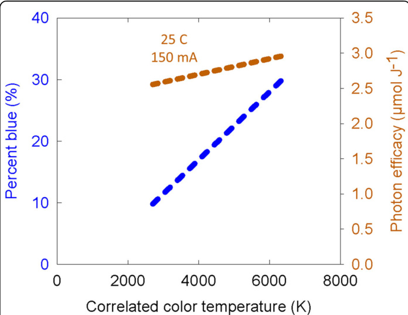
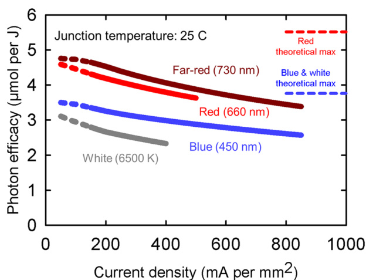
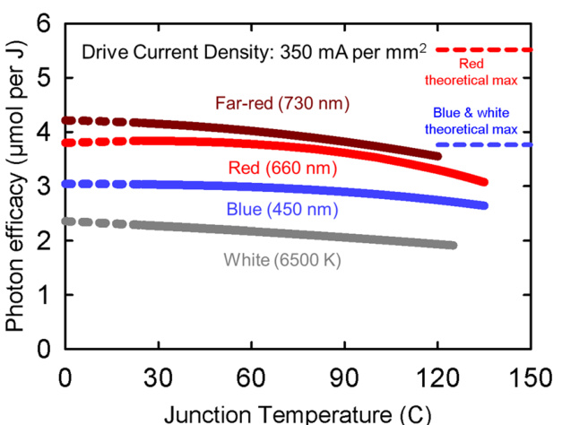
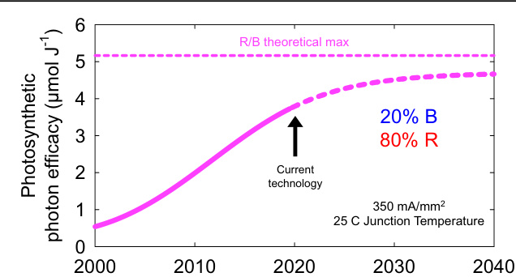
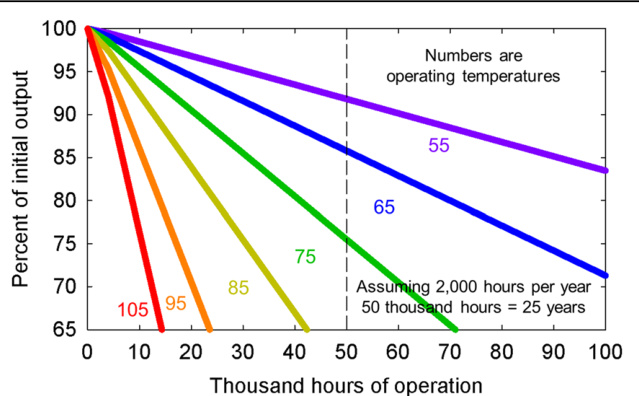
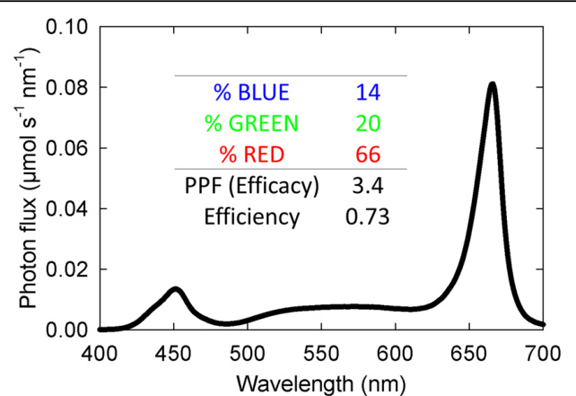

# From physics to fixtures to food: current and potential LED efficacy

# 从物理原理到照明设备再到食物：LED的当前效能与潜在效能

Paul Kusuma1, P. Morgan Pattison $\textstyle { \mathfrak { P } } ^ { 2 }$ 和 Bruce Bugbee1

# 概述

发光二极管(LED)实现了电能到光子转换的历史性突破，但这种转换正接近物理极限。当所有输入能量都转化为光合光子的能量时，就达到了理论最大效率。蓝光LED效率可达93%，荧光粉转换"白光"LED为76%，红光LED为81%。这些进步为园艺照明开辟了新机遇。本文综述：(1)LED的基本物理原理和效率，(2)LED的当前效能，(3)光谱质量对作物产量的影响，(4)园艺照明设备的潜在效能。通过优化光谱对植物形态的影响(不同物种间存在差异)，可以提高光子到产量的转化率。相反，光谱对光合作用的影响在不同物种间非常相似，但传统的光合光子定义(400-700nm)可能需要修改。LED灯具的效能上限由LED封装效能乘以四个固有因素决定：电流衰减、热衰减、驱动器(电源)效率损失和光学损失。根据当前LED技术计算，白光+红光灯具的效能极限为3.4μmol/J，蓝光+红光灯具为4.1μmol/J。增加防水防潮的光学保护会使这些值降低约10%。我们还将讨论峰值效能与成本之间的权衡。

# 物理原理

"效率"适用于分子分母单位相同的比率，可以用百分比表示。LED效率描述的是光功率输出与电功率输入之比(瓦/瓦或%)。"效能"适用于单位不同的比率。在园艺照明中，效能指每瓦输入功率每秒输出的光子微摩尔数。由于1瓦等于1焦耳/秒，因此可简化为μmol/焦耳。光子能量与波长的关系由普朗克-爱因斯坦关系(通常简称为普朗克方程)表示：$\begin{array} { r } { ( E = \frac { h c } { \lambda } ) } \end{array}$，该方程表明能量与波长成反比。这个方程用于效率和效能之间的转换，并计算给定光谱下可能的最大光合光子效能。

将LED效率转换为效能后，我们得到了评估单位电功率输入下光子对植物影响的合适单位。这符合另一个物理定律——斯塔克-爱因斯坦定律，该定律指出每个被吸收的光子只能引起一个分子反应。这一定律也可以表述为一个光子激发一个电子。本文中，光子效能仅限于400-700nm的光子，远红光LED除外(包含至800nm的光子)。LED封装制造商通常以流明/瓦报告效能，这对人类照明是有意义的指标，但不适用于园艺照明，因为它是基于人眼对不同颜色反应的光子加权测量。

[本文中，LED指LED封装，即外壳内的LED芯片。外壳/封装实现了与灯具的机械和电气连接，提供热传导路径，影响光子分布，并包含白光LED的荧光粉层(见下文)。LED性能规格针对的是LED封装。LED灯具指集成到灯具中的LED封装。]

# LED的基本效率

LED(LED封装)的基本效率是以下三个子效率的乘积：

1. 电效率：发射光子能量(以电子伏特表示)与施加电压之比$\mathrm{ ( V _ { p h o t o n } / V _ { f } ) }$，受LED内部电阻影响。
2. 内量子效率(光子/电子)：电子到光子的转换效率，受非辐射复合途径影响，包括杂质和微观物理缺陷。
3. 光子提取效率：从LED半导体材料中逸出的光子与总生成光子之比，受内部反射和重吸收影响。LED行业中将这些提取光子的损失称为"封装损耗"，不同LED封装类型的损耗差异很大。

白光LED还会产生荧光粉转换损耗，这将在后文讨论。有关LED效率的更全面描述，参见参考文献1。过去10年，上述三个因素都取得了渐进式改进，使LED封装性能大幅提升。目前，远红光、红光、白光和蓝光LED的效率分别可达77%、81%、76%和93%(表1)。

# 白光LED

白光LED由蓝光LED涂覆发光材料(如荧光粉材料，通常为$\mathrm { Y } _ { 3 } \mathrm { A l } _ { 5 } \mathrm { O } _ { 1 2 } \mathrm { : C e }$)构成，这些材料能吸收蓝光光子并在更长波长发光。荧光粉转换白光LED设计为透射部分蓝光光子，其余转换为更长波长。通过改变荧光粉类型和用量可产生多种色调和颜色品质。图1显示了相关色温(CCT)与蓝光光子百分比$( 4 0 0 - 5 0 0 \mathrm { n m } )$的一般关系。这种关系基本遵循维恩位移定律，即随着CCT增加，峰值波长减小。因此，高CCT的白光LED含有更高比例的蓝光光子。除CCT外，电光源还通过其他指标进行评定/量化，包括显色指数(CRI)和TM-30(参见文献2)。CRI和TM-30的$\mathrm { R _ { f } }$指标均采用0-100分制描述颜色保真度。高颜色保真度有助于观察细微色差，这对人类观察者识别微小昆虫、营养失调和疾病很重要。适当的颜色保真度对机器视觉也必不可少。

色温与名称的常用对应关系为：暖白(2500-3500K)、中性白(3500-4500K)、冷白(4500-5500K)和日光(5500-7500K)。室内照明通常偏好较低CCT(2700-4000K)和较高CRI(大于80)，以提供类似白炽灯的光质3。

表1 部分常见LED在$\yen 100 m A$每$\mathbf { m } \mathbf { m } ^ { 2 }$(接近最佳效能)和$2 5 \circ c$结温下的效率与效能

| LED类型 | 峰值波长或相关色温 | 效率(W/W) | 光子效能(μmol/J) |
|---------|-------------------|----------|-----------------|
| 蓝光    | 450nm             | 0.93     | 3.5             |
| 绿光    | 530nm             | 0.42     | 1.9             |
| 红光    | 660nm             | 0.81     | 4.5             |
| 远红光  | 730nm             | 0.77     | 4.7             |
| 冷白光  | 6500K             | 0.76     | 2.9             |
| 暖白光  | 2700K             | 0.69     | 2.6             |

数据来源于公司网站(见下文)。从效率到光子效能的转换取决于光谱分布

  
图1 色温与蓝光光子百分比(左轴)的一般关系，以及色温对光子效能的影响(右轴)。具体数值因制造商而异。本图中的光子效能数据是在$25^\circ C$结温和$150\mathsf{mA}$驱动电流下测得，若改变这些参数，效能值将发生变化(见下文)。

荧光粉涂层密度增加和红光荧光粉材料用量增加会降低效率。含约$30\%$蓝光光子的$6500\mathrm{K}$ LED(日光)的光子输出可达非荧光粉转换蓝光LED的$95\%$，而含$10\%$蓝光光子的暖白光LED该值会降至$80\%$。此外，随着白光LED光输出增加，荧光粉效率会下降，这是由于荧光粉转换过程中的转换损耗、能量损耗和光学损耗所致。

  
图2 $25^\circ C$结温下驱动电流对光子效能的影响。图中虚线表示低驱动电流下测试数据不足。然而LED灯具中会使用低驱动电流(如$65\mathsf{mA}$)。根据普朗克方程$\mathrm{E}=$hc/波长)，蓝光光子理论最大效能低于红光光子。中心波长450nm的蓝光光子可提供$3.76\mu\mathrm{mol J}^{-1}$，而660nm红光光子可提供$5.52\mu\mathrm{mol J}^{-1}$。这更多是光子本身的特性而非制造它们的LED的特性。

  
图3 结温对光子效能的影响。注意较高驱动电流会提高结温。图中虚线表示低于$25^\circ C$的温度(即低于环境温度)，将温度降至环境以下需要消耗能量。

# 电流衰减

LED设计用于特定电流范围内工作。适中的驱动电流密度可实现更高效率，但电流过低时效率会下降。LED损耗机制通常与电流密度相关。因此在给定电流下，增大LED芯片尺寸可通过降低电流密度来提高效能。遗憾的是芯片面积通常保密，制造商仅报告总驱动电流下的LED规格而非电流密度。

图2-3数据来自Lumileds(荷兰阿姆斯特丹)(Wouter Soer私人通信)4、Osram(德国慕尼黑)5-7和Samsung(韩国首尔)8。这些公司提供$\mu\mathrm{mol J}^{-1}$单位的LED效能数据。其他制造商包括Nichia(日本阿南)9、Cree(美国北卡罗来纳州)10、Epistar(中国台湾新竹)11等。随着技术进步，请查阅公司官网获取最新LED封装效能信息，并应用下文原则计算潜在灯具效能。图2显示典型LED效能随驱动电流密度下降的现象，称为"电流衰减"。对于蓝光LED，衰减由俄歇复合引起12,13；对于含蓝光LED和荧光粉转换层的白光LED，衰减源于蓝光LED的俄歇效应和高光通量密度下的荧光粉转换效率下降14；红光和远红光LED的衰减则由于有源区电子限制不足导致的载流子泄漏15。一般而言降低驱动电流可提高效能，但极低电流下Shockley-Read-Hall缺陷损耗将占主导16。LED制造商持续在提升峰值效率和减少电流衰减两方面改进。红光(中心$660\mathrm{nm}$)和蓝光(中心$450\mathrm{nm}$)LED的理论最大效能线基于$100\%$功率效率假设(1W电能输入=1W光子输出)，再通过普朗克方程转换为光子数。若荧光粉转换效率达$100\%$，白光LED效率将与蓝光LED相当。实际荧光粉转换效率介于$80-95\%$，取决于荧光粉用量、材料、温度和光子通量密度。使用直接发射(非荧光粉转换)绿光LED$(550\mathrm{nm})$与红蓝LED混合的"白光"灯具理论最大效能约$4.6\mu\mathrm{mol J}^{-1}$，但目前直接发射绿光LED效率较低(称为"绿光缺口"17)，导致效能仅约$1.9\mu\mathrm{mol J}^{-1}$18。

# 热衰减

结温指二极管实际工作温度。LED效能报告有两种温度标准：$25^\circ C$和$85^\circ C$。当温度从25升至$85^\circ C$时，效能下降约$10\%$(热衰减)。红光LED的热衰减通常比蓝光LED更严重。

  
图4 蓝光与红光LED按$20/80\%$比例组合的历史、当前及预测封装效能(两者加权平均值)。该图将LED性能限制于特定电流和温度条件，实际当前技术点可能高于图示值。

# 效能预测

图4展示了LED效能历史增长及未来预测的时间线(参见文献19)。图中包含对当前LED技术效能的估算，表明LED效能正接近实用最大值。理论最大值假设$100\%$效率但难以实现，因此预计效能将在理论值$90\%$处趋于平稳。

# 园艺应用LED

园艺LED灯具通常组合使用红光$(峰值\approx660\mathrm{nm})$、蓝光$(峰值\approx450\mathrm{nm})$、白光和/或远红光$(峰值\approx730\mathrm{nm})$LED。其他峰值波长的LED效率效能较低且较不常见。灯具制造商根据特定应用需求及对最佳实践和市场趋势的判断来选择这些LED的配比。

# 园艺LED灯具发展史

Morrow论述了LED对园艺照明的意义并回顾了该技术的早期应用20。首批用于植物生长的LED产生的是红光21，随后很快开发出高输出蓝光LED22(关于这项诺贝尔奖获奖发现的歷史意义，参见文献23)。在蓝光LED普及前，早期研究通过蓝光荧光灯具补充LED红光来证明蓝光光子对植物生长的价值24,25。

首批商用园艺LED灯具采用蓝光+红光组合。这些产生品红色光谱的灯具比白光或白光+红光灯具具有更高效能。由于与叶绿素吸收光谱(在光合有效辐射PAR$400-700\mathrm{nm}$范围的蓝光和红光区有吸收峰)高度匹配，许多人认为蓝光+红光灯具能比全光谱灯具增强光合作用。尽管绿光光子对光合作用有效的认知早已存在26,27，早期LED制造商仍推广这种观点。由于在人类照明中的广泛应用，白光LED封装成本现已降至红光LED的约$20\%$，这促使某些园艺灯具中白光LED占比超过$60\%$。

# 光谱对植物形态和光合作用的影响

光子激发电子，因此光生物学由光子数量而非能量或流明驱动。具有生物活性的光子必须具有足够高的能量来激发色素光感受器，存在多种光感受器对波长具有加权函数，这些函数通过生物物理学或经验方法得出。流明就是应用于光子通量和光谱分布的一种加权函数，用于人类视觉功能。

光谱质量对植物形态的影响在不同波长间具有协同效应，与光强相互作用，并因物种28而异，可能在植物生命周期中变化。然而某些原理适用于所有物种。在单一光源照明中，光谱对植物生长发育的影响远大于温室补光（电光源仅占植物光照需求的小部分）。

植物生物学中，光谱传统上分为以下几大类：

紫外光子进一步分为三大类：UV-C（100-280nm）、UV-B（280-315/320nm）和UV-A（315/320-400nm）。UV-C与UV-B的分界波长（280nm）由到达地球表面的最短太阳辐射波长决定。UV-B与UV-A的分界波长（315或320nm）通常由阳光对人类皮肤晒伤（315nm）或皮肤癌（320nm）的影响决定。关于UV-B与UV-A的过渡波长尚无统一标准，两种分界均被使用。幸运的是，UV-C光子因对生物体极具破坏性而被大气层完全阻挡。UV-B光子也有破坏性，但可能产生有益效应如增加次生代谢物产量29。UV-A光子破坏性小于UV-B，根据物种和互作环境因素，可能对植物生长产生促进或抑制效应30。

在25°C和350mA条件下，UV-B和UV-C LED效率仅约3%31，但这些光子少量即可产生显著生物学效应。在25°C和700mA条件下，UV-A LED效率随波长从370nm增至395nm从50%升至60%32。峰值402-408nm的紫光LED效率约65%，其15-30%光子波长低于400nm。效率将随电流密度降低而提高。

根据McCree26,27研究，光合有效辐射（PAR）仅包含400-700nm波长的光子。但McCree研究显示在低于约425nm波长处，不同物种光合效率存在显著差异。某些物种（如萝卜）在375-500nm区间光合效率相同。350-400nm光子可能参与光合作用，但大部分通常被非光合色素吸收。

蓝光光子（400-500nm）几乎对所有物种28,33-35都能降低株高和抑制叶片扩展。由于被非活性色素（如花青素）吸收，蓝光光子光合效率比最常见红光LED（660nm）低约20%26,27。但蓝光诱导的叶面积减少（降低光子捕获）对整体生长的影响可能大于其光合速率的降低28。园艺LED灯具通常使用5-30%蓝光来抑制过度茎伸长和降低株高，这对可控环境生长通常有益。

绿光光子（500-600nm）改善人类色彩感知。遗憾的是单色直接发射（非荧光粉转换）绿光LED效率低下。因此白光（荧光粉转换蓝光）LED被用于提供对人类视觉重要的绿光光子，同时还能提供蓝光和红光光子。绿光光子光合效率比最常见红光LED（660nm）低达10%26,27，但比蓝光或红光光子能更深穿透植物冠层36。

绿光对植物形态的影响通常远小于蓝光或远红光。拟南芥研究表明绿光可逆转蓝光效应（如下胚轴伸长抑制）37,38或诱导避荫反应（如茎伸长增加、分枝减少）39,40。有研究认为绿光诱导的避荫反应也存在于粮食作物和其他经济作物28,35,41，但其他多项研究显示影响甚微28,33,41-45。

红光光子（600-700nm）易被叶片吸收，光合效率高，且LED可高效产生，因此广泛用于园艺灯具。经典理论认为红光与远红光通过拮抗作用抑制或诱导避荫症状（如茎伸长、叶片上卷和/或分枝减少）46,47。但叶绿素对红光的高吸收意味着红光对避荫反应的影响可能被高估48。用红光替代绿光对植物形态影响甚微43,45，但在完全缺乏红光和绿光（单一蓝光LED）条件下生长的植物会快速伸长28,33,49。

远红光光子（700-800nm）对植物形态有强大影响，且LED可高效产生，是园艺照明的有前景的补充。我们与多个实验室正致力于量化远红光对植物形态的影响。在某些物种（特别是生菜）中，远红光有益地增加叶片扩展，但在许多其他物种中显著增加茎伸长35,50，这可能不利。

尽管PAR的经典定义，最新研究表明远红光光子（700-750nm）与较短波长光子存在光合协同效应51,52。因此这些光子在光合作用中的角色正被重新评估。远红光使用需谨慎，特别在单一光源环境中，因其可能诱导与避荫相关的茎伸长。

# LED灯具技术

# 决定灯具效能的四大因素

灯具效能的上限由LED选择和工作条件决定。不同颜色的LED具有不同效能，且不同制造商及同制造商内部的LED质量也存在差异。除了所选LED的效能外，灯具效能还取决于以下四个附加因素53：

1. LED驱动电流  
2. LED结温  
3. 驱动器效率  
4. 灯具中的光学损耗

# 1. 驱动电流

驱动电流对LED效能的影响前文已讨论。由于在高驱动电流和低驱动电流下存在不同类型的效率降低，效率可在相对较低的驱动电流下（小于$100\mathrm{mA}$）达到最大值。灯具制造商针对特定应用寻求协同优化灯具尺寸、成本、输出和效能。虽然低驱动电流会提高灯具效能，但每个LED的输出会相对较低，这会增加灯具的成本和复杂性。

# 2. LED结温

灯具中LED的结温取决于驱动电流、环境温度和灯具的散热（热管理），但通常在$85^\circ C^{53}$左右。更好的热管理可能会增加灯具成本，但也能提高LED的效能和寿命（图5）。

  
图5 基于温度的LED长期衰减示例。LED在较低温度下工作时衰减较慢。LED的具体衰减率取决于颜色、电流工作状态、封装类型和LED品质以及温度。图中颜色代表温度而非LED颜色

[LED会随时间和电流密度而衰减。L70是一个指标，表示灯具输出为原始输出$70\%$的时间（园艺产品有时称为Q70）。LED灯具的典型L70为$50,000\mathrm{h}$。随着LED和灯具老化，效能会下降；高结温会加剧这个问题。不同制造商的灯具老化速率差异很大。大多数制造商基于标准LED封装测试——IES LM-80（可外推为灯具流明维持率）来表征其灯具寿命（L70、L90、Q70或Q90）。基于LED衰减的灯具流明维持率预测不能超过LED测试时长的六倍，因此对于$60,000\mathrm{h}$的衰减寿命声明，LED必须经过$10,000\mathrm{h}$的测试。许多声称延长寿命的灯具超出了基于LED测试允许的六倍外推。基于LED衰减的灯具寿命也不包括灯具中的光学损耗机制和高温导致的LED加速老化。此外，典型的寿命声明不考虑LED驱动器的灾难性故障，后者通常在LED达到L70之前就已失效。]

3. LED驱动器（也称为电源）用于将交流电转换为直流电并提供稳压和稳流。LED驱动器的效率范围为85%至$95\%$。当提供调光、颜色控制和/或通信功能时，LED驱动器的效率可能较低。

4. 当LED安装在灯具中时会发生光学损耗。灯具侧面会阻挡低角度光子。保护性透明罩（如玻璃）可透射高达$92\%$的光子，因此将输出降低$8\%$，但这种保护可以显著延长灯具寿命。无保护LED的灯具可能具有$99\%$的光学效率，但在恶劣的生长环境（如高湿度）中寿命可能较短。

光学罩还可以扩散光子，这会降低效率，但可以实现更均匀的颜色混合和改善光子对植物冠层的穿透54-56。

光子必须照射到叶片才能被吸收，这是灯具设计中的重要考虑因素。早期的LED灯具将光子输出集中在小区域上，这有利于精确的光子定位，但会导致分布不均匀。LED封装和灯具设计已转向不太集中的光子分布，但只要光子离开灯具，这不会影响我们对光学效能的分析57。

# 潜在灯具效能

使用以下接近最大值的参数，我们现在计算使用现有技术可实现的灯具效能：

1. 最小化驱动电流以实现报告LED效能的$104\%$（从$100\mathrm{mA}\mathrm{mm}^{-2}$降至$50\mathrm{mA}\mathrm{mm}^{-2}$）。  
2. 通过充分散热（如水冷）最小化温升，以实现报告LED效能的$95\%$（在$25^\circ\mathrm{C}$下）。  
3. LED驱动器效率为$95\%$。  
4. 灯具中使用无保护LED以实现$99\%$的光学效率。

所得灯具效能将是报告LED效能的$1.04×0.95×0.95×0.99=93\%$。如果LED在比报告规格更低的驱动电流和温度下工作（此处为$100\mathrm{mA}\mathrm{mm}^{-2}$和$25^\circ\mathrm{C}$），前两个因素可以超过$100\%$。降低驱动电流比降低温度容易得多。

因此，使用效能分别为4.5和$3.5\mu\mathrm{mol}\mathrm{J}^{-1}$的红光和蓝光LED（表1），含有$90\%$红光和$10\%$蓝光光子（即B10:R90的光子通量分布，典型的品红色灯具）的园艺灯具可能实现$4.1\mu\mathrm{mol}\mathrm{J}^{-1}$的效能。

使用效能为$2.9\mu\mathrm{mol}\mathrm{J}^{-1}$（表1）的全白光LED构建的灯具将产生$2.7\mu\mathrm{mol}\mathrm{J}^{-1}$的灯具效能。

如果使用最佳LED，在最佳条件下，含有大致相等比例红光和白光LED的广谱灯具可实现3.4的效能（图6）。远红光光子引起的叶片扩展增加意味着，对于生菜和其他叶菜类作物，添加高达$30\%$的远红光LED可能具有成本效益35。

  
图6 一种建议的高效能灯具配置。Y轴假设输入功率为1瓦特

# 典型灯具效能

使用更典型的参数时：

1. 驱动电流达到报告LED效能的$90\%$  
2. 温度管理达到报告LED效能的$90\%$（在$25^\circ C$下）  
3. LED驱动器效率为$90\%$  
4. 灯具中受保护的LED达到$92\%$的光学效率

最终灯具效能将是报告LED效能的$0.90×0.90×0.90×0.90=67\%$。2014年，最佳LED灯具的效能为$1.7\mu\mathrm{mol}\mathrm{J}^{-1}$（参考文献57）。

如今，白光+红光灯具的效能已达到2.5至$2.8\mu\mathrm{mol}\mathrm{J}^{-1}$，蓝光+红光灯具达到$3\mu\mathrm{mol}\mathrm{J}^{-1}$（表2）。

经认证的测试实验室会对灯具进行全面测试以表征其性能。这是上述所有因素的综合衡量。灯具制造商应始终能够提供来自经认证的第三方测试实验室的灯具测试结果。

Design Lighting Consortium (DLC)维护着一个符合其列名要求的园艺照明产品清单58。DLC要求产品的最低效能为$1.9\mu\mathrm{mol}\mathrm{J}^{-1}$，并满足光子通量维持率、驱动器寿命、保修和安全要求。

表2 独立测试的LED灯具和HPS灯具的最高效能值示例

| 颜色 | 效能(μmol J-1) | 参考文献 |
|------|---------------|----------|
| 蓝/红 | 2.55 | Johnson等64 |
| 蓝/红 | 2.64 | Radetsky65 |
| 白/红 | 2.59 | Radetsky65 |
| 蓝/红 | 3.0 | DLC58 |
| 白/红 | 2.78 | DLC58 |
| 白/红 | 2.61 | DLC58 |
| 3000K | 2.13 | TÜV SÜD America (2019) |
| 5000K | 2.43 | TÜV SÜD America (2019) |
| 1000W双端HPS | 1.72 | Radetsky65 |

TÜV SÜD America是经认证的测试实验室

# 其他考虑因素

除效能外，灯具选择还需考虑以下因素：

1. 单位光子输出量($\mathrm{光子}\cdot\mathrm{s}^{-1}$)的初始成本。高压钠灯(HPS)灯具(1kW)每千瓦成本为200-350美元(每美元5-9μmol·s⁻¹)。LED灯具每千瓦成本为1000-3000美元(每美元0.5-1.5μmol·s⁻¹)。按光子通量计算，LED初始成本是HPS的3-18倍。虽然两种技术成本都在下降，但LED成本下降更快。尽管初始成本较高，LED比HPS更节能。根据使用时长和电价，纯LED照明3-5年、补光应用5-8年节省的电费即可抵消初始成本差异57。
2. 光谱质量对植物形态和光子捕获的影响35,59。
3. 足够的绿光光子形成"白光"，便于人员观察及识别病虫害和营养失调60。
4. 灯具可靠性，包括LED的环境防护。
5. 灯具工作温度，影响LED和系统寿命。
6. 光子输出的均匀性和分布。早期LED灯具光束角较窄，新型号分布更广。大功率HPS需比LED安装更高才能实现均匀光照。
7. 温室应用中灯具尺寸对遮光的影响。

由于LED可快速开关，有人研究通过高频闪烁(10-10000Hz)促进植物生长。但大量研究表明，这种方法无法提高光合量子效率61,62。植物似乎会整合光强进行光合作用。不过最新证据表明，较长时间周期(分钟到小时)的LED开关可改变植物形态(下胚轴长度)和颜色(花青素合成)63。

# 总结

在接近最优条件(100mA·mm⁻²，结温25°C)下，蓝光LED效率达93%，荧光粉转换"白光"LED为76%，红光LED为81%。结温和驱动电流密度都会影响LED光子效能，通常高效LED灯具采用低驱动电流。但低电流会减少单LED光子输出，需要更多LED来实现高输出，从而增加成本。广谱光有助于诊断植物病害，但对光合作用和生长未必有益。在特定生长阶段选择特定光谱可优化植物形态发育。本文计算表明，当前白光+红光LED灯具效能可达3.4μmol·J⁻¹，蓝光+红光组合可达4.1μmol·J⁻¹，显著高于典型的2-3μmol·J⁻¹。

虽然灯具效能最关键，但光子传输的时间、角度、光谱和强度也影响系统效果。高效照明还需配合最佳温度、湿度、营养、植物水势、CO₂浓度、根系供氧和遗传因素。NASA和USDA正资助大学研究优化这些因素，提升可控环境电照经济性：https://cubes.space/; https://www.hortlamp.org/index.html。

# 致谢

本研究得到犹他农业试验站(犹他州立大学，期刊论文编号9260)、USDA-NIFA-SCRI项目(2018-51181-28365，LAMP计划)、NASA-CUBES项目(NNX17AJ31G)以及能源部能效与可再生能源建筑技术办公室照明研发计划(#DEFE0025912)支持。本报告由美国政府机构资助完成，但美国政府及其雇员不对报告内容作任何明示或默示担保，也不承担任何法律责任。报告中提及的任何商品、工艺或服务，不代表美国政府认可或推荐。作者观点不代表美国政府立场。感谢David Llewellyn、Wouter Soer、Royal Heins、Jeannie Sikora、Patrick Friesen、Erik Runkle和Jeffery Tsao的宝贵意见。

# 利益冲突声明

作者声明无利益冲突。

收稿日期：2019年9月30日  
修回日期：2020年3月5日  
录用日期：2020年3月9日  
在线发布日期：2020年3月30日

# 参考文献

1. Tsao, J. Y., Coltrin, M. E., Crawford, M. H. & Simmons, J. A. 固态照明：综合人因、技术与经济视角. Proc. IEEE 98, 1162–1179 (2010). 
2. 北美照明工程学会. IES TM-30-15. 光源显色性评估方法. (纽约: IESNA, 2015).   
3. Pust, P., Schmidt, P. J. & Schnick, W. 照明革命. Nat. Mater. 14, 454–458 (2015).   
4. LUXEON 2835系列产品数据手册 DS216. https://www.lumileds.com/ uploads/603/DS216-luxeon-2835-line-datasheet-pdf (Lumileds Holding B.V., 2019).   
5. OSLON Square GH CSSRM3.24产品数据手册 Osram Opto Semiconductors GmbH https://dammedia.osram.info/media/resource/hires/osramdam-7718278/GHCSSRM3.24_EN.pdf (2019).   
6. OSLON SSL 150 GF CSHPM2.24产品数据手册 Osram Opto Semiconductors GmbH https://dammedia.osram.info/media/resource/hires/osramdam-9119319/GFCSHPM2.24_EN.pdf (2019). 
7. OSLON Square GD CSSRM2.14产品数据手册. Osram Opto Semiconductors GmbH https://dammedia.osram.info/media/resource/hires/osramdam-5658482/GDCSSRM2.14_EN.pdf (2019).   
8. 中功率LED系列3030 LM301H CRI80产品数据手册. 三星 https://cdn.samsung.com/led/file/resource/2018/11/ Data_Sheet_LM301H_CRI80_Rev.1.2.pdf (2019).   
9. Nichia官网. Nichia Corporation http://www.nichia.co.jp/en/product/led. html (2019).   
10. Cree官网. Cree, Inc. https://www.cree.com/led-components/products (2019).   
11. Epistar官网. Epistar Corporation https://www.epistar.com/EpistarEn/ ProdInfoApp?id=10 (2019).   
12. Iveland, J., Martinelli, L., Peretti, J., Speck, J. S. & Weisbuch, C. 电注入下半导体发光二极管俄歇电子的直接测量：效率下降主导机制的识别. Phys. Rev. Lett. 110, 177406 (2013).   
13. Shen, . InGaN中俄歇复合的光致发光测量. Appl. Phys. Lett. 91, 141101 (2007).   
14. Shchekin, O. 高亮度光源的LED技术考量. DOE SSL研发研讨会. https://www.energy.gov/sites/prod/files/2017/02/f34/ shchekin_ nsiderations_longbeach2017.pdf (2017).   
15. Krames, M. R. 等. 固态照明用大功率发光二极管的现状与未来. J. Disp. Technol. 3, 160–175 (2007).   
16. Kuritzky, L. H., Weisbuch, C. & Speck, J. S. 实现100%电光转换效率的III族氮化物LED前景. Opt. Express 26, 16600–16608 (2018).   
17. Pattison, P. M., Tsao, J. Y. & Krames, M. R. LED技术现状与方向：园艺照明机遇. Acta Hortic. 1134, 413–426 (2016).   
18. OSLON Square GT QSSPA1.13产品数据手册. Osram Opto Semiconductors GmbH https://dammedia.osram.info/media/resource/hires/osramdam-9945204/GTQSSPA1.13_EN.pdf (2019).   
19. 美国能源部SSL项目. 固态照明2017年建议研究主题补充：技术与市场背景 https://energy.gov/sites/prod/ files/2017/09/f37/ssl_supplement_suggested-topics_sep2017_0.pdf (2017).   
20. Morrow, R. C. 园艺中的LED照明. HortScience 43, 1947–1950 (2008).   
21. Bula, R. J. 等. 作为植物辐射源的发光二极管. HortScience 26, 203–205 (1991).   
22. Nakamura, S., Mukai, T. & Senoh, M. 烛光级高亮度InGaN/AIGaN双异质结蓝光发光二极管. Appl. Phys. Lett. 64, 1687–1689 (1994).   
23. Tsao, J. Y., Han, J., Haitz, R. H. & Pattison, P. M. 蓝光LED诺贝尔奖：历史背景、当前科学认知与人类福祉. Ann. Phys. 527, A53–A61 (2015).   
24. Goins, G. D., Yorio, N. C., Sanwo, M. M. & Brown, C. S. 红光LED下小麦的光形态建成、光合作用与种子产量：有无蓝光补充的比较. J. Exp. Bot. 48, 1407–1413 (1997).   
25. Yorio, N. C., Goins, G. D., Kagie, H. R., Wheeler, R. M. & Sager, J. C. 蓝光补充对红光LED下菠菜、萝卜和生菜生长的改善. HortScience 36, 380–383 (2001).   
26. McCree, K. J. 作物光合作用的作用光谱、吸收率与量子产量. Agric. Meteorol. 9, 191–216 (1971).   
27. McCree, K. J. 光合有效辐射现行定义与叶片光合数据的验证. Agric. Meteorol. 10, 443–453 (1972).   
28. Snowden, M. C., Cope, K. R. & Bugbee, B. 七种植物对蓝绿光的敏感性：与光子通量的相互作用. PLoS ONE 11, e0163121 (2016).   
29. Dou, H., Niu, G. & Gu, M. 采收前UV-B辐射与光合光子通量密度互作对罗勒(Ocimum basilicum)光合作用、生长及次生代谢物积累的影响. Agronomy 9, 434 (2019).   
30. Verdaguer, D., Jansen, M. A., Llorens, L., Morales, L. O. & Neugart, S. UV-A辐射对高等植物的影响：探索已知的未知领域. Plant Sci. 255, 72–81 (2017).   
31. NICHIA NCSU334A(T)产品数据手册. Nichia Corporation https://www. nichia.co.jp/specification/products/led/NCSU334A-E.pdf (2019).   
32. NICHIA NVSU119CT产品数据手册. Nichia Corporation https://www. nichia.co.jp/specification/products/led/NVSU119C-E.pdf (2019).   
33. Hernández, R. & Kubota, C. 不同蓝红光量子通量比LED下黄瓜幼苗的生理响应. Environ. Exp. Bot. 121, 66–74 (2016).   
34. Wang, J., Lu, W., Tong, Y. & Yang, Q. 红蓝光比例对莴苣(Lactuca sativa L.)叶片形态、光合性能、叶绿素荧光及气孔发育的影响. Front. Plant. Sci. 7, 1–10 (2016).   
35. Meng, Q., Kelly, N. & Runkle, E. S. 绿光或远红光替代蓝光诱导莴苣和羽衣甘蓝的避荫反应并促进生长. Environ. Exp. Bot. 162, 383–391 (2019).   
36. Brodersen, C. R. & Vogelmann, T. C. 光方向变化是否影响叶片吸收特性？ Funct. Plant Biol. 37, 403–412 (2010).   
37. Bouly, J. P. 等. 隐花色素蓝光光感受器通过黄素氧化还原态互变激活. J. Biol. Chem. 282, 9383–9391 (2007).   
38. Sellaro, R. 等. 拟南芥中作为蓝绿光比例传感器的隐花色素. Plant Physiol. 154, 401–409 (2010).   
39. Zhang, T., Maruhnich, S. A. & Folta, K. M. 绿光诱导避荫反应症状. Plant Physiol. 157, 1528–1536 (2011).   
40. Wang, Y., Zhang, T. & Folta, K. M. 绿光增强远红光诱导的避荫反应. Plant Growth Regul. 77, 147–155 (2015).   
41. Park, Y. & Runkle, E. S. LED光谱对植物生长、视觉颜色品质及光合光子效率的影响：白光与蓝红组合光比较. PLoS ONE 13, e0202386 (2018).   
42. Li, Q. & Kubota, C. 补光光质对嫩叶莴苣生长及植物化学物质的影响. Environ. Exp. Bot. 67, 59–64 (2009).   
43. Son, K. & Oh, M. 红绿蓝LED对两个莴苣品种生长、光合及抗氧化参数的影响. Hortic. Environ. Biotechnol. 56, 639–653 (2015).   
44. Chen, X., Xue, X., Guo, W., Wang, L. & Qiao, X. 白光与LED补光混合照射对莴苣生长及营养特性的影响. Sci. Hortic. 200, 111–118 (2016).   
45. Kang, W. H., Park, J. S., Park, K. S. & Son, E. S. 红蓝绿LED不同配比对莴苣叶片光合速率、生长及形态的影响. Hortic. Environ. Biotechnol. 57, 573–579 (2016).   
46. Smith, H. 光敏色素与植物光信号感知——新兴的综合认识. Nature 407, 585–591 (2000).   
47. Casal, J. J. 避荫反应. Arabidopsis Book 10, e0157 (2012).   
48. Morgan, D. C. & Smith, H. 光下生长的藜(Chenopodium album L.)中光敏色素光平衡与发育的关系. Planta 142, 187–193 (1978).   
49. Kong, Y., Stasiak, M., Dixon, M. A. & Zheng, Y. 低光敏色素活性相关的蓝光可促进四种花坛植物的伸长生长：与红光的比较. Environ. Exp. Bot. 155, 345–359 (2018).   
50. Park, Y. & Runkle, E. S. 远红光通过增加叶片扩展和整株净同化促进幼苗生长. Environ. Exp. Bot. 136, 41–49 (2017).   
51. Zhen, S. & van Iersel, M. W. 远红光对高效光化学和光合作用的必要性. J. Plant Physiol. 209, 115–122 (2017).   
52. Zhen, S. & Bugbee, B. 远红光光子与传统光合光子的等效效率：重新定义光合有效辐射的意义. Plant Cell Environ. 1–14 https://doi.org/10.1111/pce.13730 (2020).   
53. 美国能源部SSL项目. 固态照明研发计划 https://www.energy.gov/ sites/prod/files/2015/06/f22/ssl_rd-plan_may2015_0.pdf (2015).   
54. Sinclair, T. R., Shiraiwa, T. & Hammer, G. L. 漫射辐射增加对作物光能利用效率的影响. Crop Sci. 32, 1281–1284 (1992).   
55. Tubiello, F., Volk, T. & Bugbee, B. 受控环境下漫射光与小麦光能利用效率. Life Support Biosphere Sci. 4, 77–85 (1997).   
56. Zhen, S. & Bugbee, B. 漫射光与冠层光合作用. 受控环境论文12. Digital commons, https://digitalcommons.usu.edu/ cpl_env/12/ (2019).   
57. Nelson, J. & Bugbee, B. 温室照明的经济分析：LED与高强度气体放电灯的比较. PLoS ONE 9, e99010 (2014).   
58. 设计照明联盟. 园艺照明产品搜索 https:// www.designlights.org/horticultural-lighting/search/ (2019).   
59. Bugbee, B. 面向植物生长发育的最佳光谱质量：光能捕获的重要性. Acta Hortic. 1134, 1–12 (2016).   
60. Pattison, M., Tsao, J., Brainard, G. & Bugbee, B. 用于光子生理与食物的LED. Nature 563, 493–500 (2018).   
61. Sager, J. C. & Giger, W. Jr 间歇光与连续光相对光合效率已发表数据的重新评估. Agric. Meteorol. 22, 289–302 (1980).   
62. Tennessen, D. J., Bula, R. J. & Sharkey, T. D. 连续与脉冲LED光照下的光合效率. Photosynth. Res. 44, 261–269 (1995).   
63. Song, S., Kusuma, P., Carvalho, S. D., Li, Y. & Folta, K. M. 密闭受控环境中利用脉冲光调控幼苗性状. Environ. Exp. Bot. 166, 103803 (2019).   
64. Johnson, J., Kusuma, P. & Bugbee, B. 两种HORTILED灯具的效能. Controlled environments. Paper 11. https://digitalcommons.usu.edu/cpl_env/ 11 (2017).   
65. Radetsky, L. C. LED与HID园艺照明灯具测试报告. http://www. lrc.rpi.edu/programs/energy/pdf/HorticulturalLightingReport-Final.pdf (2018).

# References

1. Tsao, J. Y., Coltrin, M. E., Crawford, M. H. & Simmons, J. A. Solid-state lighting: an integrated human factors, technology and economic perspective. Proc. IEEE 98, 1162–1179 (2010). 
2. Illuminating Engineering Society on North America. IES TM-30-15. Method for evaluating light source color rendition. (New York: IESNA, 2015).   
3. Pust, P., Schmidt, P. J. & Schnick, W. A revolution in lighting. Nat. Mater. 14, 454–458 (2015).   
4. LUXEON 2835 line product datasheet DS216. https://www.lumileds.com/ uploads/603/DS216-luxeon-2835-line-datasheet-pdf (Lumileds Holding B.V., 2019).   
5. OSLON Square GH CSSRM3.24 product datasheet Osram Opto Semiconductors GmbH https://dammedia.osram.info/media/resource/hires/osramdam-7718278/GHCSSRM3.24_EN.pdf (2019).   
6. OSLON SSL 150 GF CSHPM2.24 product datasheet Osram Opto Semiconductors GmbH https://dammedia.osram.info/media/resource/hires/osramdam-9119319/GFCSHPM2.24_EN.pdf (2019). 7. OSLON Square GD CSSRM2.14 product datasheet. Osram Opto Semiconductors GmbH https://dammedia.osram.info/media/resource/hires/osramdam-5658482/GDCSSRM2.14_EN.pdf (2019).   
8. Middle power LED series 3030 LM301H CRI80 product datasheet. Samsung https://cdn.samsung.com/led/file/resource/2018/11/ Data_Sheet_LM301H_CRI80_Rev.1.2.pdf (2019).   
9. Nichia website. Nichia Corporation http://www.nichia.co.jp/en/product/led. html (2019).   
10. Cree website. Cree, Inc. https://www.cree.com/led-components/products (2019).   
11. Epistar website. Epistar Corporation https://www.epistar.com/EpistarEn/ ProdInfoApp?id=10 (2019).   
12. Iveland, J., Martinelli, L., Peretti, J., Speck, J. S. & Weisbuch, C. Direct measurement of Auger electrons emitted from a semiconductor light-emitting diode under electrical injection: identification of the dominant mechanism for efficiency droop. Phys. Rev. Lett. 110, 177406 (2013).   
13. Shen, . Auger recombination in InGaN measured by photouminesc Appl. Phys. Lett. 91, 141101 (2007).   
14. Shchekin, O. LED technology considerations for high luminance sources. DOE SSL R&D Workshop. https://www.energy.gov/sites/prod/files/2017/02/f34/ shchekin_ nsiderations_longbeach2017.pdf (2017).   
15. Krames, M. R. et al. Status and future of high-power light-emitting diodes for solid-state lighting. J. Disp. Technol. 3, 160–175 (2007).   
16. Kuritzky, L. H., Weisbuch, C. & Speck, J. S. Prospects for $1 0 0 \%$ wall-plug efficient III-nitride LEDs. Opt. Express 26, 16600–16608 (2018).   
17. Pattison, P. M., Tsao, J. Y. & Krames, M. R. Light-emitting diode technology status and directions: opportunities for horticultural lighting. Acta Hortic. 1134, 413–426 (2016).   
18. OSLON Square GT QSSPA1.13 product datasheet. Osram Opto Semiconductors GmbH https://dammedia.osram.info/media/resource/hires/osramdam-9945204/GTQSSPA1.13_EN.pdf (2019).   
19. US DOE SSL Program. Solid-state lighting 2017 suggested research topics supplement: technology and market context https://energy.gov/sites/prod/ files/2017/09/f37/ssl_supplement_suggested-topics_sep2017_0.pdf (2017).   
20. Morrow, R. C. LED lighting in horticulture. HortScience 43, 1947–1950 (2008).   
21. Bula, R. J. et al. Light-emitting diodes as a radiation source for plants. HortScience 26, 203–205 (1991).   
22. Nakamura, S., Mukai, T. & Senoh, M. Candela-class high-brightness InGaN/ AIGaN double-heterostructure blue-light-emitting diodes. Appl. Phys. Lett. 64, 1687–1689 (1994).   
23. Tsao, J. Y., Han, J., Haitz, R. H. & Pattison, P. M. The blue LED Nobel prize: historical context, current scientific understanding, human benefit. Ann. Phys. 527, A53–A61 (2015).   
24. Goins, G. D., Yorio, N. C., Sanwo, M. M. & Brown, C. S. Photomorphogenesis, photosynthesis, and seed yield of wheat plants grown under red lightemitting diodes (LEDs) with and without supplemental blue lighting. J. Exp. Bot. 48, 1407–1413 (1997).   
25. Yorio, N. C., Goins, G. D., Kagie, H. R., Wheeler, R. M. & Sager, J. C. Improving spinach, radish, and lettuce growth under red light-emitting diodes (LEDs) with blue light supplementation. HortScience 36, 380–383 (2001).   
26. McCree, K. J. The action spectrum, absorptance and quantum yield of photosynthesis in crop plants. Agric. Meteorol. 9, 191–216 (1971).   
27. McCree, K. J. Test of current definitions of photosynthetically active radiation against leaf photosynthesis data. Agric. Meteorol. 10, 443–453 (1972).   
28. Snowden, M. C., Cope, K. R. & Bugbee, B. Sensitivity of seven diverse species to blue and green light: interactions with photon flux. PLoS ONE 11, e0163121 (2016).   
29. Dou, H., Niu, G. & Gu, M. Pre-harvest UV-B radiation and photosynthetic photon flux density interactively affect plant photosynthesis, growth, and secondary metabolites accumulation in basil (Ocimum basilicum) plants. Agronomy 9, 434 (2019).   
30. Verdaguer, D., Jansen, M. A., Llorens, L., Morales, L. O. & Neugart, S. UV-A radiation effects on higher plants: exploring the known unknown. Plant Sci. 255, 72–81 (2017).   
31. NICHIA NCSU334A(T) product datasheet. Nichia Corporation https://www. nichia.co.jp/specification/products/led/NCSU334A-E.pdf (2019).   
32. NICHIA NVSU119CT product datasheet. Nichia Corporation https://www. nichia.co.jp/specification/products/led/NVSU119C-E.pdf (2019).   
33. Hernández, R. & Kubota, C. Physiological responses of cucumber seedlings under different blue and red photon flux ratios using LEDs. Environ. Exp. Bot. 121, 66–74 (2016).   
34. Wang, J., Lu, W., Tong, Y. & Yang, Q. Leaf morphology, photosynthetic performance, chlorophyll fluorescence, stomatal development of lettuce (Lactuca sativa L.) exposed to different ratios of red light to blue light. Front. Plant. Sci. 7, 1–10 (2016).   
35. Meng, Q., Kelly, N. & Runkle, E. S. Substituting green or far-red radiation for blue radiation induces shade avoidance and promotes growth in lettuce and kale. Environ. Exp. Bot. 162, 383–391 (2019).   
36. Brodersen, C. R. & Vogelmann, T. C. Do changes in light direction affect absorption profiles in leaves? Funct. Plant Biol. 37, 403–412 (2010).   
37. Bouly, J. P. et al. Cryptochrome blue light photoreceptors are activated through interconversion of flavin redox states. J. Biol. Chem. 282, 9383–9391 (2007).   
38. Sellaro, R. et al. Cryptochrome as a sensor of the blue/green ratio of natural radiation in Arabidopsis. Plant Physiol. 154, 401–409 (2010).   
39. Zhang, T., Maruhnich, S. A. & Folta, K. M. Green light induces shade avoidance symptoms. Plant Physiol. 157, 1528–1536 (2011).   
40. Wang, Y., Zhang, T. & Folta, K. M. Green light augments far-red-light-induced shade response. Plant Growth Regul. 77, 147–155 (2015).   
41. Park, Y. & Runkle, E. S. Spectral effects of light-emitting diodes on plant growth, visual color quality, and photosynthetic photon efficacy: white versus blue plus red radiation. PLoS ONE 13, e0202386 (2018).   
42. Li, Q. & Kubota, C. Effects of supplemental light quality on growth and phytochemicals of baby leaf lettuce. Environ. Exp. Bot. 67, 59–64 (2009).   
43. Son, K. & Oh, M. Growth, photosynthetic and antioxidant parameters of two lettuce cultivars as affected by red, green, and blue light-emitting diodes. Hortic. Environ. Biotechnol. 56, 639–653 (2015).   
44. Chen, X., Xue, X., Guo, W., Wang, L. & Qiao, X. Growth and nutritional properties of lettuce affected by mixed irradiation of white and supplemental light provided by light-emitting diode. Sci. Hortic. 200, 111–118 (2016).   
45. Kang, W. H., Park, J. S., Park, K. S. & Son, E. S. Leaf photosynthetic rate, growth, and morphology of lettuce under different fractions of red, blue, and green light from light-emitting diodes (LEDs). Hortic. Environ. Biotechnol. 57, 573–579 (2016).   
46. Smith, H. Phytochromes and light signal perception by plants—an emerging synthesis. Nature 407, 585–591 (2000).   
47. Casal, J. J. Shade avoidance. Arabidopsis Book 10, e0157 (2012).   
48. Morgan, D. C. & Smith, H. The relationship between phytochromephotoequilibrium and development in light grown Chenopodium album L. Planta 142, 187–193 (1978).   
49. Kong, Y., Stasiak, M., Dixon, M. A. & Zheng, Y. Blue light associated with low phytochrome activity can promote elongation growth as shade-avoidance response: a comparison with red light in four bedding plant species. Environ. Exp. Bot. 155, 345–359 (2018).   
50. Park, Y. & Runkle, E. S. Far-red radiation promotes growth of seedlings by increasing leaf expansion and whole-plant net assimilation. Environ. Exp. Bot. 136, 41–49 (2017).   
51. Zhen, S. & van Iersel, M. W. Far-red light is needed for efficient photochemistry and photosynthesis. J. Plant Physiol. 209, 115–122 (2017).   
52. Zhen, S. & Bugbee, B. Far-red photons have equivalent efficiency to traditional photosynthetic photons: implications for re-defining photosynthetically active radiation. Plant Cell Environ. 1–14 https://doi.org/10.1111/pce.13730 (2020).   
53. US DOE SSL Program. Solid-state lighting R&D plan https://www.energy.gov/ sites/prod/files/2015/06/f22/ssl_rd-plan_may2015_0.pdf (2015).   
54. Sinclair, T. R., Shiraiwa, T. & Hammer, G. L. Variation in crop radiation-use efficiency with increased diffuse radiation. Crop Sci. 32, 1281–1284 (1992).   
55. Tubiello, F., Volk, T. & Bugbee, B. Diffuse light and wheat radiation-use efficiency in a controlled environment. Life Support Biosphere Sci. 4, 77–85 (1997).   
56. Zhen, S. & Bugbee, B. Diffuse Light and Canopy Photosynthesis. Controlled Environments Paper 12. Digital commons, https://digitalcommons.usu.edu/ cpl_env/12/ (2019).   
57. Nelson, J. & Bugbee, B. Economic analysis of greenhouse lighting: light emitting diodes vs. high intensity discharge fixtures. PLoS ONE 9, e99010 (2014).   
58. Design Lighting Consortium. Horticultural lighting product search https:// www.designlights.org/horticultural-lighting/search/ (2019).   
59. Bugbee, B. Toward an optimal spectral quality for plant growth and development: the importance of radiation capture. Acta Hortic. 1134, 1–12 (2016).   
60. Pattison, M., Tsao, J., Brainard, G. & Bugbee, B. LEDs for photons physiology and food. Nature 563, 493–500 (2018).   
61. Sager, J. C. & Giger, W. Jr Re-evaluation of published data on the relative photosynthetic efficiency of intermittent and continuous light. Agric. Meteorol. 22, 289–302 (1980).   
62. Tennessen, D. J., Bula, R. J. & Sharkey, T. D. Efficiency of photosynthesis in continuous and pulsed light emitting diode irradiation. Photosynth. Res. 44, 261–269 (1995).   
63. Song, S., Kusuma, P., Carvalho, S. D., Li, Y. & Folta, K. M. Manipulation of seedling traits with pulsed light in closed controlled environments. Environ. Exp. Bot. 166, 103803 (2019).   
64. Johnson, J., Kusuma, P. & Bugbee, B. Efficacy of two HORTILED fixtures. Controlled environments. Paper 11. https://digitalcommons.usu.edu/cpl_env/ 11 (2017).   
65. Radetsky, L. C. LED and HID horticultural luminaire testing report. http://www. lrc.rpi.edu/programs/energy/pdf/HorticulturalLightingReport-Final.pdf (2018).