# Quantitative Information on Dutch greenhouse horticulture 2019

# 荷兰温室园艺定量信息 2019

蔬菜、切花、盆栽和花坛植物的关键数据 第26版英文版

M.G.M. Raaphorst1 (主编), J. Benninga2 和 B.A. Eveleens1 1. 瓦赫宁根大学及研究中心, 温室园艺事业部, 2. 瓦赫宁根经济研究所

# 摘要

第26版《荷兰温室园艺定量信息》是由瓦赫宁根大学及研究中心温室园艺事业部定期编辑出版的荷兰语报告。本第26版特别制作了英文翻译版。新增章节包含了将本报告中的经济计算应用于荷兰以外情况时需考虑的特殊因素。

本版本包含设备和主要作物的参考价格，以及收入、支出和营业利润的计算。各时期的成本价格计算基于营业利润设为零的前提。为保持良好经营，销售价格应高于此。这种平均成本计算为种植者提供了辅助产品销售的工具。对于平均经济成本价格，我们计算了生产成本和固定成本分摊。这些成本被分配到相应的生产周期中。对于蔬菜和切花，按每四周的生产周期计算成本；对于盆栽和花坛植物，则按每1000株的生产计算成本价格。

关于作物的环境影响，我们计算了每种栽培方式的碳足迹，按每公斤产品、每件产品或每平方米温室面积计量。

# 报告信息

机密报告 WPR-898   
项目编号: 3242145900

# 免责声明

$\circledcirc$ 2019 瓦赫宁根, Stichting Wageningen Research, Wageningen Plant Research, 温室园艺事业部, 邮政信箱 20, 2665 MV Bleiswijk, 荷兰; 电话 +31 (0)317 48 56 06; www.wur.eu/plantresearch.

商会注册号: 09098104 (Arnhem) 增值税号: NL 8065.11.618.B01

Stichting Wageningen Research 版权所有。未经 Stichting Wageningen Research 事先书面同意，不得以任何形式或任何方式（电子、机械、影印、录音或其他）复制、存储于自动化数据库或传播本出版物的任何部分。Stichting Wageningen Research 不对使用本出版物数据造成的任何不利后果负责。

# 地址

# 瓦赫宁根大学及研究中心, 温室园艺事业部

Violierenweg1，2665 MV Bleiswijk   
邮政信箱 20,2665 ZG Bleiswijk   
荷兰   
$+ 3 1$ (0) 317 - 48 5606   
glastuinbouw@wur.nl   
www.wur@glastuinbouw.nl   
www.wur.eu/greenhousehorticulture

# 引言

这是自1983年首版以来，《荷兰温室园艺定量信息》(KWIN 2019)第26版的特别英文版。

1983年，KWIN就秉持"数字说明一切"的宗旨，成为荷兰园艺成本和生产结构的比较标准。园艺产品市场已全球化，生产者和买家数量大幅减少，市场从供应商主导转变为需求主导。温室园艺领域的这些变化需要关于生产、生产资料和产品价格的最新信息。

了解企业细节与买家需求、总供应和成本价格的关系，是现代园艺企业家的重要要求。KWIN通过提供和记录这些可靠数据来满足这一需求。

由于栽培和投资计划需要基于可靠的技术和经济数据，过去一年我们投入大量精力更新信息。我们修订了生产资料和成本价格计算方法，并新增了作为环境影响指标的${ \mathsf { C O } } _ { 2 }$足迹。

本报告信息主要帮助企业家或顾问制定温室园艺企业的商业计划。同时，这些信息对直接或间接参与温室园艺的供应商、会计师、银行和学校等也很重要。

由于全球对KWIN近期版本兴趣浓厚，我们决定出版英文版。特别增加了关于将荷兰情况转换为国外情况时需注意要点的章节。

数据由瓦赫宁根大学及研究中心温室园艺事业部和瓦赫宁根经济研究所的员工收集处理。最终编辑为M.G.M. Raaphorst，瓦赫宁根大学及研究中心温室园艺事业部。

温室园艺定量信息的更新离不开供应商、园艺企业家和顾问的合作。我们感谢所有人的支持。

如有改进KWIN的意见和建议，我们期待您的反馈。

J.C. Bakker 事业部经理

2019年8月

# 目录

引言 3

摘要 9

# 如何将荷兰温室作物信息转换为本地情况 11

1.1 外部气候 11   
1.2 位置与生产设备 12   
1.3 员工知识水平与教育 12   
1.4 市场 12

# 荷兰园艺产业信息 15

2.1 种植面积、企业数量及规模 15

2.1.1 种植面积、企业数量 15   
2.1.2 企业数量与苗圃规模 17   
2.1.3 面积与作物 20   
2.1.4 面积、苗圃规模与地区 23   
2.2 欧洲观赏园艺面积 24   
2.3 欧洲温室蔬菜面积与产量 25   
2.3.1 番茄 25   
2.3.2 甜椒 28   
2.3.3 黄瓜 29   
2.3.4 草莓 30   
2.3.5 生菜 32

# 生产资料与设备信息 35

3.1 土地 35   
3.2 能源 38   
3.2.1 温室园艺使用情况 38   
3.2.2 天然气与电力 40   
3.2.3 向国家电网供电 43   
3.2.4 油价发展 48   
3.3 地热能 48   
3.3.1 地热生产 48   
3.3.2 地热能成本 49   
3.4 ${ \mathsf { C O } } _ { 2 }$ 需求与成本 51   
3.4.1 作物的${ \mathsf { C O } } _ { 2 }$需求 51   
3.4.2 ${ \mathsf { C O } } _ { 2 }$行业体系与欧盟排放交易体系 53   
3.4.3 温室园艺节能系统 53   
3.4.4 成本计算与${ \mathsf { C O } } _ { 2 }$排放交易价格发展 53   
3.5 光照 54   
3.6 水 56   
3.6.1 作物需水量 56   
3.6.2 水质 58   
3.6.3 水成本 62   
3.7 生产设备 64   
3.8 生产设备总支出与年度成本 86   
3.9 一般成本与工时 88

91

4.1 收入与成本价格 91

# 成本、收入与苗圃利润计算信息 93

5.1 引言 93   
5.2 生产 93   
5.3 价格水平 94   
5.4 直接成本 94   
5.4.1 定义 94   
5.4.2 假设 94   
5.4.3 植物材料 94   
5.4.4 基质 94   
5.4.5 能源消耗 94   
5.4.6 ${ \mathsf { C O } } _ { 2 }$采购 95   
5.4.7 作物保护 95   
5.4.8 水 95   
5.4.9 其他材料 96   
5.4.10 分包商 96   
5.4.11 作物残渣处理 96   
5.4.12 运输成本 96   
5.4.13 箱盒与包装 96   
5.4.14 销售成本 96   
5.4.15 投资利息 96   
5.4.16 多年生作物 96   
5.4.17 劳动力 97   
5.4.18 水 97   
5.5 天然气与电力价格 97   
5.6 劳动力规划与成本 97

5.7 净收入、资产负债表、盈利能力与回报 98

5.8 ${ \mathsf { C O } } _ { 2 }$碳足迹 100

# 盆栽植物收入、利润与回报计算的补充信息 101

6.1 空间利用类型 101   
6.1.1 技术空间利用 101   
6.1.2 组织空间利用 101   
6.2 运营资产负债表的使用 102   
6.3 成本类别信息 102   
6.4 盆栽植物工作标准信息 105

蔬菜资产负债表与成本价格计算 107

切花资产负债表与成本价格计算 147

盆栽植物资产负债表与成本价格计算 215

花坛植物资产负债表与成本价格计算 259

11.1 法语翻译 276   
11.2 西班牙语翻译 278   
11.3 德语翻译 280

12

# 文献与资料来源

283

# 早期荷兰版温室园艺定量信息(KWIN) 285

# 摘要

《温室园艺定量信息》是一份定期发布的报告，提供有关生产水平、生产成本和生产资料的当前信息。报告包含经济数据、包含产量和作物生产成本的资产负债表预算，以及不同的种植计划和投资计划。

本书信息主要旨在帮助种植者和顾问为温室园艺企业提供商业建议。  
此外，这些信息对于直接或间接参与温室行业的供应商、会计师、银行和学校也很重要。

2019年第26版与往年相比有所修改。本版内容包括：

• 荷兰园艺产业面积、公司数量和规模信息，以及主要作物信息和欧洲国家估算  
• 欧洲几种重要作物的生产水平估算  
• 生产资料投资成本，包括地热能成本  
• 主要温室蔬菜、切花以及盆栽和花坛植物的资产负债表预算、成本和企业利润  
• 按时期划分的电力和${ \mathsf { C O } } _ { 2 }$可用性分析  
• 每种作物的${ \mathsf { C O } } _ { 2 }$碳足迹以及不同生产资料对此足迹的影响

# 1 如何将荷兰温室作物信息转化为当地情况

本报告包含荷兰温室园艺产业的信息。作物种植的当地情况对作物生产结果有很大影响。第3章包含了本报告中关于企业利润计算假设的大量信息。以下段落重点介绍了将本报告使用的数据和计算转化为其他国家当地情况时需要考虑的一些因素，包括：

• 气候  
• 位置与生产设备  
• 员工知识水平和教育程度  
• 市场情况

# 1.1 外部气候

温度、太阳辐射、风速、湿度和日照时长在很大程度上决定了产量。本报告描述的作物生长在北纬51至53度北海沿岸的温带海洋性气候中。下表显示了荷兰南荷兰省布莱斯韦克(Bleiswijk)的相关数据。

表1 荷兰布莱斯韦克地区平均外部温度、风速、辐射总量(2004-2013)和日照时长(KNMI数据)

| 月份(Month) | 温度(°C) | 风速(m/s) | 辐射量(J/cm²) | 日照时长(小时) |
|------------|---------|----------|--------------|--------------|
| 1月(January) | 4.1 | 4.6 | 7978 | 8:28 |
| 2月(February) | 3.8 | 3.9 | 12255 | 10:03 |
| 3月(March) | 6.2 | 4.1 | 28435 | 12:00 |
| 4月(April) | 10.2 | 3.4 | 46093 | 14:01 |
| 5月(May) | 13.0 | 3.7 | 56370 | 15:48 |
| 6月(June) | 15.7 | 3.4 | 58950 | 16:43 |
| 7月(July) | 18.0 | 3.3 | 57894 | 16:13 |
| 8月(August) | 17.8 | 3.2 | 47506 | 14:37 |
| 9月(September) | 15.5 | 3.4 | 33277 | 12:39 |
| 10月(October) | 12.1 | 3.6 | 19795 | 10:39 |
| 11月(November) | 8.0 | 3.97 | 8517 | 8:51 |
| 12月(December) | 4.6 | 4.2 | 6088 | 7:54 |
| 全年(Year) | 10.8 | 3.7 | 383158 | 12:20 |

气候决定了作物的种植周期长度、收获时间以及产量和品质。由于温室的透明特性，这些外部气候因素会影响作物生长，技术设施只能部分缓解这种影响。在成本方面，气候会影响加热和冷却的能源消耗、人工光照以及作物蒸发量，进而影响作物的水分消耗。

# 1.2 地理位置与生产设备

温室建设地点的特性会影响其建造成本。需要考虑的因素包括：

• 土壤类型：荷兰主要为黏土、沙土或泥炭土  
• 坡度和平整度：荷兰坡度通常小于$0.5\%$  
• 土壤稳定性：荷兰泥炭土需用桩基支撑  
• 地表和地下水流情况  
• 基础设施可达性：荷兰企业通常位于铺装道路旁，直接连接天然气、电力和供水网络，主要温室区还连接${ \mathsf { C O } } _ { 2 }$管网  
• 温室地表形状：荷兰多为矩形，长宽比在1至1.5之间

外部气候决定了温室建设类型，涉及供暖、制冷、加湿与除湿、人工光照、隔热或遮阳等系统的容量配置。

此外，温室设计还需考虑冰雹、积雪、风暴和地震风险。在荷兰，仅冰雹和风暴是实际风险。

温室综合体的建造成本还取决于：  
• 到销售点的运输距离（荷兰单程通常小于$250~\mathsf{km}$）  
• 施工现场的可达性  
• 是否有熟练的温室建造人员

# 1.3 员工知识水平与教育

温室园艺是一个知识密集型行业，在多个领域持续发展。所需知识包括：

对企业家而言：  
- 销售、市场和消费者需求  
- 种植规划  
- 劳动组织  
- 生产资料采购  

对专业管理人员：  
- 种植技术  
- 温室气候控制  
- 植物生理学  
- 作物保护  
- 施肥管理  
- 劳动规划  

对生产员工：  
- 种植技术  
- 种植操作  
- 作物和产品质量  
- 植物病害  

缺乏专业知识会导致种植问题，从而无法实现优质和足量生产。

# 1.4 市场

在荷兰，大部分温室园艺产品通过拍卖或拍卖中介销售。买家包括连锁超市和批发商，这两方负责将产品进一步分销至本地零售点。温室产品通常在园艺企业处被提货，或直接配送至分销中心。

荷兰拥有庞大的温室园艺产品贸易商网络，负责整个欧洲市场的营销。荷兰温室蔬菜的主要市场是西北欧地区，距离温室产区$750~\mathsf{km}$范围内，可在采收后24-48小时内完成供应，供应链非常高效。而温室花卉和盆栽植物的市场范围则覆盖了欧洲更广泛的区域。

# 2 荷兰园艺产业信息

## 2.1 种植面积、企业数量及规模

### 2.1.1 种植面积与企业数量

温室种植面积发展情况如表2和图1所示。

表2 玻璃温室园艺面积(单位：公顷)。数据来源：CBS农业统计2019年1月1日

| 年份 | 总计(Total) | 蔬菜(Vegetables) | 切花(Cut flowers) | 盆栽植物(Pot plants) | 花坛植物(Bedding plants) | 水果(Fruit) | 树木和灌木(Trees and shrubs) | 其他(Other) |
|------|------------|----------------|------------------|----------------------|----------------------|------------|----------------------|------------|
|      |            |                |                  | 开花(flowering)      | 观叶(foliage)        |            |                      |            |
|1975|7,907|4,683|2,558|340||112|117|40|57|
|1980|8,760|4,658|2,983|282|272|147|56|65|297|
|1985|8,973|4,559|3,221|301|385|170|39|95|203|
|1990|9,773|4,453|3,733|425|558|218|32|143|211|
|1995|10,158|4,405|3,832|561|550|345|34|197|234|
|2000|10,526|4,200|3,727|680|581|497|30|369|442|
|2004|10,486|4,359|3,401|767|573|543|40|395|409|
|2005|10,540|4,445|3,250|788|589|550|46|433|439|
|2006|10,381|4,548|3,093|838|548|489|49|403|413|
|2007|10,374|4,571|3,003|845|551|486|61|416|440|
|2008|10,166|4,647|2,809|941|489|459|66|405|349|
|2009|10,324|4,826|2,690|953|511|475|61|432|377|
|2010|10,307|4,986|2,442|878|504|430|55|492|519|
|2011|10,249|4,988|2,428|872|493|426|61|495|485|
|2012|9,962|4,865|2,308|867|485|447|56|486|448|
|2013|9,817|4,886|2,139|868|436|445|53|483|508|
|2014|9,488|4,833|2,042|882|410|406|47|470|398|
|2015|9,207|4,755|1,877|914|420|370|64|473|335|
|2016|9,279|4,916|1,860|936|392|310|86|459|289|
|2017|9,080|4,992|1,692|950|370|310|95|401|279|
|2018*|9,001|4,975|1,643|952|380|314|138|377|223|

\* 估算值

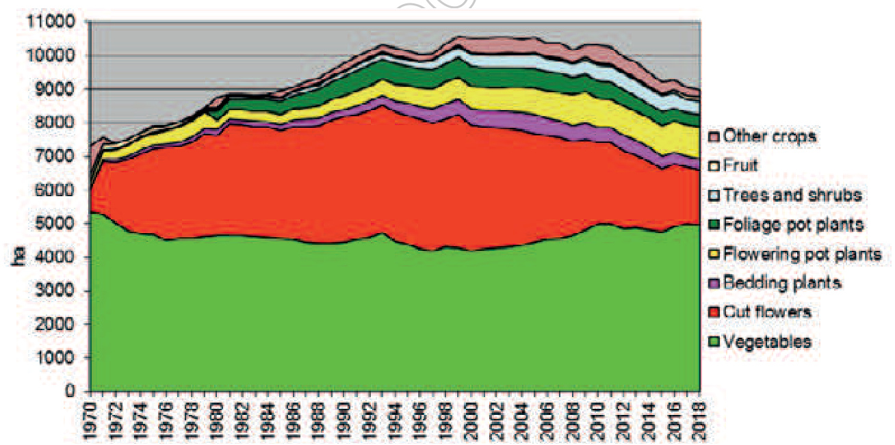  
图1 温室面积在不同作物类别中的分布情况

表3和图2展示了以设施园艺(蔬菜和观赏植物)为主营业务的企业数量发展情况。

表3 2018年设施园艺企业数量(数据来源：CBS农业统计2019年1月1日)

| 年份(Year) | 总计(Total) | 蔬菜(Vegetables) | 观赏植物(Ornamentals) |
|------------|------------|----------------|------------------|
|1975|6,492|7,851|
|1980|15,772|6,309|7,864|
|1985|14,986|5,987|8,012|
|1990|14,413|5,652|8,004|
|1995|13,044|4,686|7,399|
|1996|12,548|4,411|7,177|
|2000|11,071|3,433|6,575|
|2003|9,458|2,825|5,597|
|2004|8,991|2,652|5,347|
|2005|8,602|2,547|5,071|
|2006|8,020|2,400|4,714|
|2007|7,399|2,209|4,316|
|2008|6,779|2,022|4,004|
|2009|6,249|1,874|3,654|
|2010|5,782|1,766|3,247|
|2011|5,462|1,694|3,024|
|2012|5,099|1,593|2,791|
|2013|4,796|1,523|2,610|
|2014|4,415|1,442|2,358|
|2015|4.126|1.385|2.166|
|2016|3.820|1.327|1.985|
|2017|3.476|1.261|1.761|
|2018*|3.193|1.182|1.601|

\* 估算值

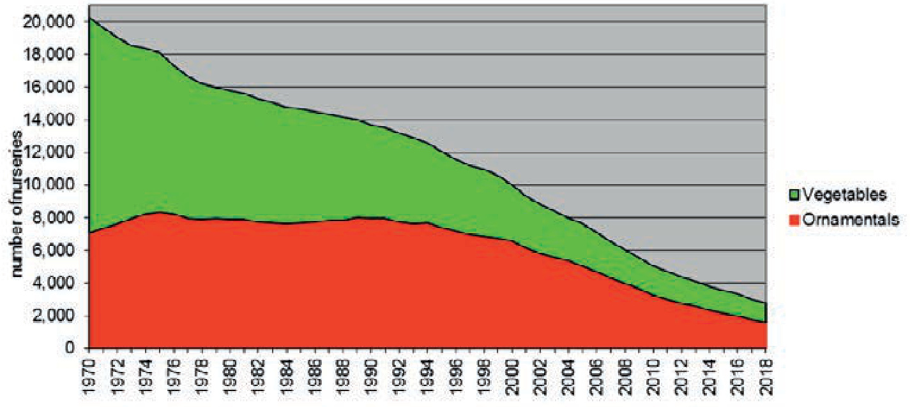  
图2 蔬菜和观赏植物设施园艺企业数量发展情况

# 2.1.2 企业数量与苗圃规模

表4和图3展示了苗圃规模的发展情况。这里指的是每个地点的规模，但通常一个企业可能拥有一个或多个地点。

表4 苗圃规模发展情况（单位：公顷）；2018年（数据来源：CBS农业统计2019年1月1日）

| 年份(Year) | 总计(total) | 0.01-0.25公顷 | 0.25-0.75公顷 | 0.75-1.5公顷 | 1-2公顷(1-2ha) | 1.5-3公顷(1.5-3ha) | 2-3公顷(2-3ha) | 3公顷(3ha) | 3-5公顷(3-5ha) | >5公顷(>5ha) |
|------------|------------|--------------|--------------|-------------|---------------|------------------|--------------|-----------|--------------|------------|
| 1970 | 7.236 | 1.000 | 3.587 | 1.225 |  | 1.242 | 170 | 108 |  |  |
| 1975 | 7.907 | 782 | 3.213 | 1.462 |  | 2.024 | 305 | 121 |  |  |
| 1980 | 8.760 | 623 | 2.620 | 1.651 |  | 2.758 | 699 | 409 |  |  |
| 1985 | 8.973 | 585 | 2.313 | 1.626 |  | 3.044 | 826 | 579 |  |  |
| 1990 | 9.773 | 528 | 2.076 | 1.568 |  | 3.491 | 1.107 | 1.002 |  |  |
| 1995 | 10.158 | 398 | 1.754 | 1.363 |  | 3.684 | 1.450 | 1.509 |  |  |
| 2000 | 10.521 | 330 | 1.368 |  | 2.902 |  | 3.292 |  | 1.512 | 1.117 |
| 2005 | 10.540 | 270 | 953 |  | 1.957 | 3.080 |  |  | 1.901 | 2.378 |
| 2006 | 10.381 | 246 | 874 |  | 1.841 |  | 2.827 |  | 1.870 |  |
| 2007 | 10.374 | 223 | 781 |  | 1.661 |  | 2.654 |  | 1.982 | 2.722 |
| 2008 | 10.165 | 195 | 742 |  | 1.452 |  |  |  |  |  |
| 2009 | 10.324 | 175 | 676 |  |  |  | 2.458 |  | 1.892 | 3.425 |
| 2010 | 10.307 | 159 | 624 |  | 1.276 |  | 2.359 |  | 1.909 | 3.929 |
| 2011 | 10.249 | 149 | 572 |  | 1.152 |  | 2.201 |  | 1.919 | 4.252 |
| 2012 | 9.962 | 141 | 521 |  | 1.066 |  | 2.086 |  | 1.863 | 4.514 |
| 2013 | 9.817 | 125 | 493 |  | 986 |  | 1.908 |  | 1.849 | 4.556 |
| 2014 | 9.488 | 113 | 450 |  | 930 |  | 1.816 |  | 1.786 | 4.666 |
| 2015 | 9.207 | 107 | 404 |  | 856 |  | 1.659 |  | 1.675 | 4.735 |
| 2016 | 9.279 | 89 | 370 |  | 802 |  | 1.527 |  | 1.496 | 4.853 |
| 2017 | 9.080 | 76 | 316 |  | 743 |  | 1.417 |  | 1.417 | 5.085 |
| 2018* | 9.001 | 61 | 280 |  | 641 |  | 1.343 |  | 1.375 | 5.300 |

\* 估算值

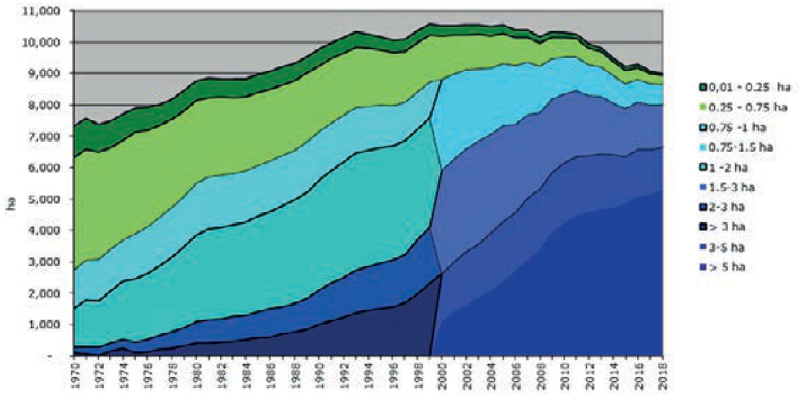  
图3 按苗圃规模分类的温室总面积发展情况（单位：公顷）（数据来源：CBS农业统计2019年1月1日，瓦赫宁根大学及研究中心温室园艺业务部门改编）

表5 以温室园艺为主业的苗圃数量及其规模分布发展情况（数据来源：CBS农业统计2019年1月1日）

| 年份(Year) | 总计(total) | 0.01-0.25公顷 | 0.25-0.75公顷 | 0.75-1.5公顷 | 1-2公顷(1-2ha) | 1.5-3公顷(1.5-3ha) | 2-3公顷(2-3ha) | 3公顷(3ha) | 3-5公顷(3-5ha) | >5公顷(>5ha) |
|------------|------------|--------------|--------------|-------------|---------------|------------------|--------------|-----------|--------------|------------|
| 1970 | 19,503 | 9,155 | 7,853 | 1,433 |  | 968 | 72 | 22 |  |  |
| 1975 | 17,571 | 7,240 | 6,871 | 1,711 |  | 1,557 | 129 | 63 |  |  |
| 1980 | 15,772 | 5,833 | 5,476 | 1,932 |  | 2,102 | 296 | 133 |  |  |
| 1985 | 14,986 | 5,473 | 4,788 | 1,903 |  | 2,313 | 350 | 159 |  |  |
| 1990 | 14,413 | 4,945 | 4,282 | 1,834 |  | 2,637 | 469 | 246 |  |  |
| 1995 | 13,044 | 4,109 | 3,651 | 1,594 |  | 2,745 | 621 | 324 |  |  |
| 2000 | 11,070 | 3,200 | 2,884 |  | 2,788 | 1,635 |  |  | 413 | 150 |
| 2005 | 8,602 | 2,470 | 1,983 |  | 1,858 | 1,494 |  |  | 508 | 289 |
| 2006 | 8,020 | 2,271 | 1,830 |  | 1,733 | 1,364 |  |  | 500 | 322 |
| 2007 | 7,410 | 2,034 | 1,650 |  | 1,566 | 1,278 |  |  | 523 | 359 |
| 2008 | 6,785 | 1,771 | 1,564 |  | 1,382 | 1,179 |  |  | 499 | 390 |
| 2009 | 6,249 | 1,561 | 1,425 |  | 1,209 | 1,122 |  |  | 502 | 430 |
| 2010 | 5,782 | 1,380 | 1,311 |  | 1,086 | 1,044 |  |  | 507 | 454 |
| 2011 | 5,462 | 1,285 | 1,199 |  | 1,009 |  | 993 |  | 492 | 484 |
| 2012 | 5,099 | 1,204 | 1,090 |  | 930 |  | 910 |  | 487 | 478 |
| 2013 | 4,796 | 1,073 | 1,030 |  | 876 |  | 865 |  | 469 | 483 |
| 2014 | 4,415 | 964 | 938 |  | 803 |  | 791 |  | 442 | 477 |
| 2015 | 4,126 | 907 | 847 |  | 763 |  | 731 |  | 397 | 481 |
| 2016 | 3,820 | 733 | 771 |  | 702 |  | 721 |  | 393 | 500 |
| 2017 | 3,476 | 631 | 659 |  | 648 |  | 673 |  | 373 | 492 |
| 2018* | 3,193 | 503 | 588 |  | 601 |  | 642 |  | 362 | 497 |

\* 估算值

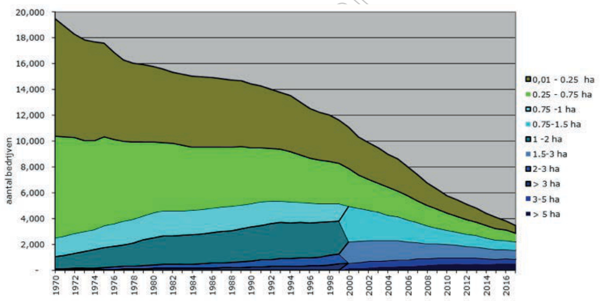  
图4 苗圃数量及其规模分布发展情况（数据来源：CBS农业统计2019年1月1日，瓦赫宁根大学及研究中心温室园艺业务部门改编）

图5展示了面积发展情况，图6展示了1990-2018年间特定规模苗圃的数量发展情况（数据来源：CBS农业统计2019年1月1日，瓦赫宁根大学及研究中心温室园艺业务部门改编）

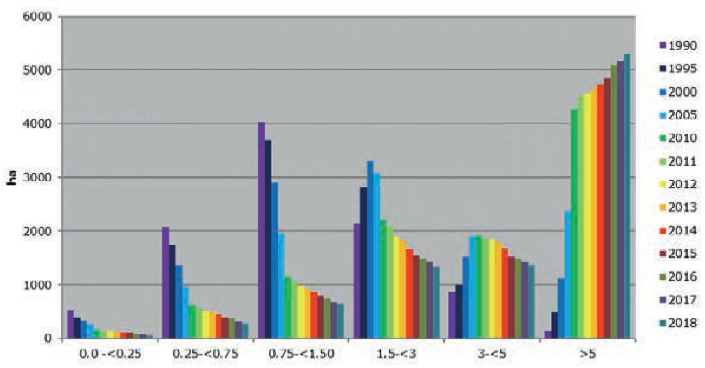  
图5 按苗圃规模分类的温室总面积发展情况（单位：公顷）（数据来源：CBS农业统计2019年1月1日，瓦赫宁根大学及研究中心温室园艺业务部门改编）

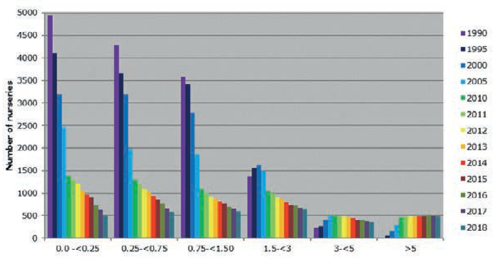  
图6 按规模分类的温室总数发展情况（数据来源：CBS农业统计2019年10月1日，瓦赫宁根大学及研究中心温室园艺业务部门改编）

表6和图7显示了主要温室蔬菜作物的面积发展情况。

表6 若干温室蔬菜作物的面积（单位：公顷）（数据来源：CBS农业统计，2019年3月1日）

| 年份 | 番茄(Tomato) | 甜椒(Paprika) | 黄瓜(Cucumber) | 茄子(Eggplant) | 生菜(Lettuce) | 菊苣(Endive) | 西葫芦(Courgette) | 菠菜(Spinach) | 芹菜(Celery) | 萝卜(Radish) | 豆类(Beans) | 樱桃番茄(Cherry) | 其他蔬菜(Other vegetables) | 蔬菜总计(Total vegetables) |
|------|-------------|--------------|---------------|---------------|--------------|-------------|------------------|--------------|-------------|-------------|------------|-----------------|--------------------------|----------------------|
|1985-1990|2,039||| |703|139| |303| | |1| |1,028|227|
|1995|1,603||| |748|91| |696| | | | |934|260|
| |1,220|455|628|51|808|122| |996| | | |89|775|178|
|2000|1,133|376|936|84|663|110|53|1,155|297|220|626|76|715|296|
|2005|1,396|386|1,007|88|631|161|66|1,236|312|200|605|90|537|328|
|2006|1,481|413|1,034|98|638|177|68|1,214|288|210|579|96|528|351|
|2007|1,545|422|1,078|100|617|194|71|1,187|301|204|546|97|498|369|
|2008|1,600|481|1,047|100|626|211|58|1,331|299|188|710|95| |377|
|2009|1,628|418|1,149|109|664|210|58|1,403|314|204|742|104|467|411|
|2010|1,676|419|1,172|111|656|234|42|1,357|327|168|748|101|487|394|
|2011|1,702|382|1,192|117|622|245|43|1,313|337|170|695|105|415|411|
|2012-2013|1,691|398|1,256|114|615|251|40|1,244|303|165|663|104|429|434|
|2014|1,780|372|1,259|149|598|271|42|1,163|286|150|608|103|408|467|
|2015|1,758|366|1,260|133|545|282|54|1,163|257|133|633|106|397|450|
|2016|1,705|357|1,218|129|554|286|50|1,317|323|129|719|111|407|486|
|2017**|1,739|337|966|437|580|325|70|1,319|301|133|735|103|354|502|
| | |364|933|491|563|319|67|1,312|300|136|697|92|359|475|
|2018*|1,787| | | | | | | | | | | | | |

\* 估算值$^{**}$自2017年起，蔓生樱桃番茄记录为"樱桃番茄(cherry)"而非"蔓生番茄(on the vine)"

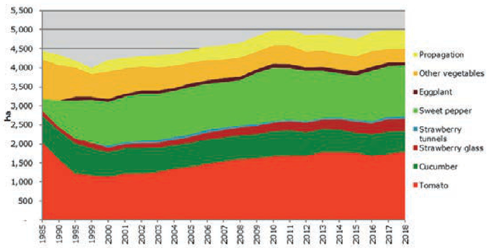  
图7 按作物分类的温室蔬菜面积发展情况（单位：公顷）（数据来源：CBS农业统计，2019年3月1日，瓦赫宁根大学及研究中心温室园艺业务部门改编）

表7和图8显示了若干重要切花作物的发展情况。

表7 温室切花作物面积（单位：公顷）（数据来源：CBS农业统计，2019年3月1日）

| 年份 | 玫瑰(Rose) | 百合(Lily) | 菊花(Chrysanthemum) | 郁金香(Tulip) | 非洲菊(Gerbera) | 兰花(Orchid) | 康乃馨(Carnation) | 小苍兰(Freesia) | 洋桔梗(Lisianthus) | 银莲花(Anemone) | 其他切花(Other cut flowers) | 切花总计(Total cut flowers) |
|------|-----------|-----------|----------------|--------------|----------------|-------------|----------------|----------------|------------------|----------------|------------------------|---------------------|
|1985|758|518|320|267|149||189||358||513|133|
|1990|894|766|308|185|205|102|189|61|233|-|627|158|
|1995|918|771|276|194|211|117|207|72|191|-|681|163|
|2000|932|774|221|253|276|119|212|90|86|79|637|196|
|2005|780|598|167|212|255|83|214|95|31|50|763|164|
|2006|754|597|152|205|232|77|210|111|32|42|683|154|
|2007|652|566|155|206|220|93|240|120|32|40|678|162|
|2008|583|523|129|208|222|79|206|78|18|41|721|144|
|2009|532|493|116|217|221|68|209|95|21|40|678|166|
|2010|499|504|110|181|195|66|274|86|19|40|467|145|
|2011|459|510|103|179|201|64|265|84|19|47|497|132|
|2012|407|504|103|170|196|65|213|77|16|45|510|101|
|2013|384|479|97|169|189|54|212|65|15|40|434|118|
|2014|311|475|85|176|171|50|195|58|15|39|466|117|
|2015|283|391|74|161|167|40|168|47|14|38|494|119|
|2016|257|383|78|188|138|38|161|41|11|33|532|133|
|2017|228|334|66|167|136|39|131|46|11|33|344|126|
|2018*|225|369|61|158|114|34|106|40|9|28|498|121|

\* 估算值

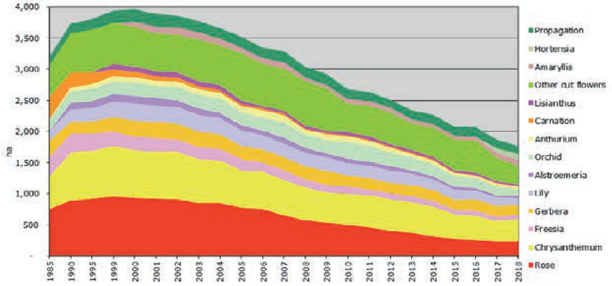  
图8 按作物分类的温室切花面积发展情况（单位：公顷）（数据来源：CBS农业统计，2019年3月1日，瓦赫宁根大学及研究中心温室园艺业务部门改编）

表8和图9显示了温室盆栽植物和花坛植物的面积发展情况。

表8 温室花坛植物、观叶盆栽和观花盆栽的面积（单位：公顷）（数据来源：CBS农业统计，2019年3月1日）

| 年份 | 花坛植物(Bedding plants) | 观叶盆栽(Pot plants, foliage) | 观花盆栽(Pot plants, flowering) | 其他观赏植物(Other ornamentals) | 花坛和盆栽植物总计(Total bedding and pot plants) |
|------|-------------------------|-----------------------------|-----------------------------|-----------------------------|---------------------------------|
| 1985 | 170 | 385 | 301 | 198 | 1,054 |
| 1990 | 285 | 618 | 465 | 201 | 1,569 |
| 1995 | 549 | 560 | 231 | 1,685 |
| 2000 | 581 | 680 | 155 | 1,913 |
| 2005 | 589 | 788 | 168 | 2,095 |
| 2006 | 548 | 838 | 167 | 2,042 |
| 2007 | 551 | 845 | 162 | 2,045 |
| 2008 | 486 | 489 | 941 | 122 | 2,012 |
| 2009 | 459 | 511 | 953 | 144 | 2,083 |
| 2010 | 430 | 504 | 878 | 291 | 2,104 |
| 2011 | 426 | 493 | 872 | 259 | 2,051 |
| 2012 | 447 | 485 | 867 | 254 | 2,053 |
| 2013 | 445 | 436 | 868 | 296 | 2,046 |
| 2014 | 406 | 410 | 882 | 196 | 1,894 |
| 2015 | 369 | 420 | 914 | 132 | 1,834 |
| 2016 | 332 | 392 | 936 | 97 | 1,756 |
| 2017 | 312 | 367 | 950 | 101 | 1,729 |
| 2018* | 314 | 380 | 952 | 87 | 1,732 |

\* 估算值

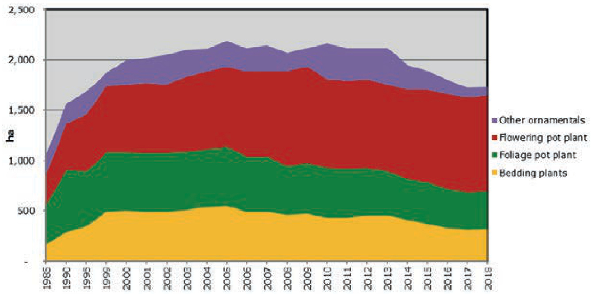  
图9 按组别划分的温室盆栽和花坛植物面积发展情况（单位：公顷）（数据来源：CBS农业统计，2019年3月1日，瓦赫宁根大学及研究中心温室园艺业务部门改编）

表9和图10显示了荷兰12个省份的温室保护面积发展情况。

表9 温室面积区域分布发展情况（单位：公顷）（数据来源：CBS农业统计，2019年3月1日）

| 年份 | 格罗宁根(Groningen) | 弗里斯兰(Friesland) | 德伦特(Drenthe) | 上艾瑟尔(Overijssel) | 弗莱福兰(Flevoland) | 海尔德兰(Gelderland) | 乌得勒支(Utrecht) | 北荷兰(Noord-Holland) | 南荷兰(Zuid-Holland) | 泽兰(Zeeland) | 北布拉班特(Noord-Brabant) | 林堡(Limburg) |
|------|---------------------|---------------------|-----------------|-----------------------|---------------------|----------------------|------------------|-----------------------|-----------------------|---------------|--------------------------|--------------|
| 1976 | 258 | 30 | 600 | 808 | 5.064 | 1.149 |
| 1980 | 279 | 51 | 657 | 897 | 5.528 | 65 | 1.282 |
| 1985 | 284 | 51 | 687 | 945 | 5.610 | 68 | 1.324 |
| 1991 | 375 | 83 | 800 | 1.018 | 6.088 | 73 | 1.552 |
| 1995 | 417 | 104 | 836 | 1.015 | 6.050 | 67 | 919 | 745 |
| 2000 | 74 | 70 | 267 | 102 | 167 | 690 | 192 | 1.051 | 5.900 | 93 | 1.108 | 806 |
| 2005 | 68 | 113 | 239 | 126 | 193 | 731 | 142 | 984 | 5.615 | 160 | 1.306 | 864 |
| 2006 | 61 | 122 | 227 | 132 | 197 | 731 | 139 | 980 | 5.428 | 170 | 1.279 | 914 |
| 2007 | 62 | 135 | 222 | 144 | 195 | 753 | 148 | 917 | 5.337 | 174 | 1.371 | 917 |
| 2008 | 63 | 117 | 231 | 126 | 192 | 701 | 144 | 932 | 5.186 | 170 | 1.369 | 933 |
| 2009 | 66 | 122 | 199 | 137 | 181 | 699 | 137 | 969 | 5.268 | 173 | 1.430 | 944 |
| 2010 | 61 | 139 | 194 | 138 | 183 | 666 | 131 | 918 | 5.297 | 203 | 1.451 | 927 |
| 2011 | 55 | 139 | 187 | 140 | 181 | 670 | 132 | 881 | 5.324 | 207 | 1.415 | 920 |
| 2012 | 53 | 145 | 164 | 141 | 169 | 617 | 134 | 920 | 5.171 | 200 | 1.356 | 893 |
| 2013 | 56 | 143 | 154 | 135 | 167 | 614 | 133 | 956 | 4.992 | 181 | 1.373 | 914 |
| 2014 | 63 | 135 | 136 | 136 | 160 | 606 | 122 | 922 | 4.830 | 156 | 1.366 | 855 |
| 2015 | 64 | 132 | 147 | 121 | 199 | 560 | 108 | 900 | 4.786 | 154 | 1.271 | 763 |
| 2016 | 60 | 132 | 150 | 117 | 276 | 520 | 96 | 926 | 4.672 | 166 | 1.339 | 825 |
| 2017 | 55 | 148 | 150 | 134 | 300 | 453 | 87 | 872 | 4.535 | 167 | 1.341 | 839 |
| 2018* | 53 | 136 | 149 | 131 | 319 | 495 | 86 | 857 | 4.404 | 233 | 1.317 | 820 |

\* 估算值

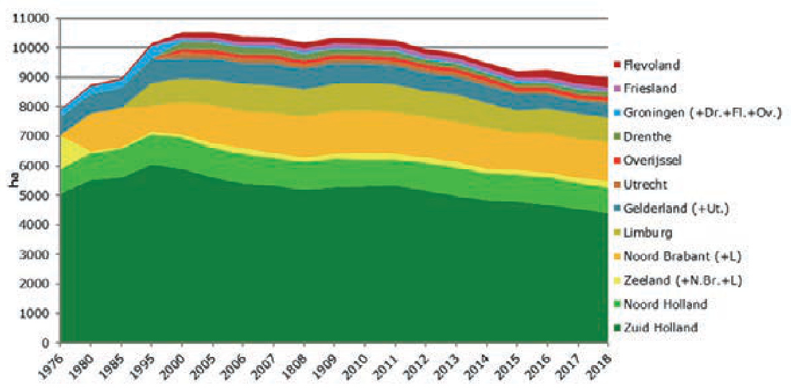  
图10 荷兰温室面积发展情况（单位：公顷）（数据来源：CBS农业统计，2019年3月1日，瓦赫宁根大学及研究中心温室园艺业务部门改编）

# 2.2 欧洲观赏园艺面积

欧盟统计局(Eurostat)记录了欧洲各国各类作物的种植面积。自2015年起，观赏作物不再区分保护地和露天种植。由于露天园艺面积远大于温室面积，荷兰的观赏园艺面积比表1（保护地园艺）中显示的面积大得多。无数据可用时用"："表示。

表10 欧洲各国观赏园艺(包括露天和保护地)面积(千公顷)(数据来源: Eurostat 花卉和观赏植物(不包括苗圃), 2019-03-01)

| 国家/地区 | 2010 | 2011 | 2012 | 2013 | 2014 | 2015 | 2016 | 2017 |
|----------|------|------|------|------|------|------|------|------|
| 比利时(Belgium) | 5.0 | 4.9 | 5.3 | 5.2 | 5.1 | 5.4 | 5.3 | 5.4 |
| 保加利亚(Bulgaria) | 0.0 | 2.0 | 0.0 | 0.0 | 0.0 | ： | ： | ： |
| 捷克(Czechia) | 1.3 | 0.6 | 0.7 | 0.3 | 0.3 | 0.3 | 0.3 | 0.2 |
| 丹麦(Denmark) | 1.9 | 1.9 | 1.9 | 0.3 | 0.3 | 0.3 | 0.3 | 0.4 |
| 德国(Germany) | 8.4 | 8.4 | 7.6 | 7.7 | 7.3 | 7.5 | 7.3 | 6.9 |
| 爱沙尼亚(Estonia) | 0.0 | 0.0 | 0.0 | ： | 0.0 | 0.0 | 0.0 | 0.0 |
| 爱尔兰(Ireland) | 0.1 | 0.1 | 0.2 | 0.2 | 0.2 | 0.2 | 0.2 | 0.2 |
| 希腊(Greece) | 0.4 | 0.4 | 0.4 | 0.4 | 0.4 | 0.4 | 0.4 | 0.4 |
| 西班牙(Spain) | 6.7 | 6.5 | 7.0 | 7.0 | 7.1 | 6.3 | 6.4 | 6.2 |
| 法国(France) | 8.1 | 8.5 | 9.1 | 9.0 | 8.8 | 8.8 | 8.9 | 9.0 |
| 克罗地亚(Croatia) | 0.3 | 0.4 | 0.3 | 0.3 | 0.3 | 0.3 | 0.3 | 0.3 |
| 意大利(Italy) | ： | ： | ： | ： | 9.4 | 8.9 | 8.8 | ： |
| 塞浦路斯(Cyprus) | 0.1 | 0.1 | 0.1 | 0.2 | 0.2 | 0.2 | 0.1 | 0.1 |
| 拉脱维亚(Latvia) | 0.1 | 0.1 | 0.1 | 0.1 | 0.0 | 0.1 | 0.1 | 0.1 |
| 立陶宛(Lithuania) | 0.1 | 0.1 | 0.1 | 0.1 | 0.1 | 0.1 | 0.2 | 0.2 |
| 卢森堡(Luxembourg) | 0.0 | 0.0 | 0.0 | 0.0 | 0.0 | 0.0 | 0.0 | 0.0 |
| 匈牙利(Hungary) | 0.5 | 0.6 | 0.7 | 0.5 | 0.6 | 0.6 | 0.5 | 0.5 |
| 马耳他(Malta) | 0.1 | 0.1 | 0.1 | 0.0 | 0.0 | 0.0 | 0.0 | 0.0 |
| 荷兰(Netherlands) | 26.2 | 27.1 | 26.2 | 26.2 | 26.3 | 27.6 | 32.6 | 33.4 |
| 奥地利(Austria) | 0.4 | 0.4 | 0.4 | 0.4 | 0.4 | 0.4 | 0.4 | 0.4 |
| 波兰(Poland) | 3.8 | 3.3 | 3.3 | 3.4 | 3.5 | 3.5 | 4.9 | 5.5 |
| 葡萄牙(Portugal) | 2.8 | 3.1 | 3.5 | 3.9 | 3.7 | 3.6 | 3.5 | 3.5 |
| 罗马尼亚(Romania) | 0.2 | 0.3 | 0.4 | 0.5 | 0.4 | 0.4 | 0.5 | 0.3 |
| 斯洛文尼亚(Slovenia) | 0.1 | 0.1 | 0.1 | 0.1 | 0.1 | 0.1 | 0.1 | ： |
| 斯洛伐克(Slovakia) | 0.2 | 0.2 | 03 | 0.2 | 0.1 | 0.2 | 0.1 | 0.1 |
| 芬兰(Finland) | ： | 0.0 | 0.0 | ： | ： | 0.0 | 0.0 | 0.0 |
| 瑞典(Sweden) | 0.4 | 0.2 | 0.2 | 0.2 | 0.2 | 0.2 | 0.2 | 0.2 |
| 英国(United Kingdom) | 6.0 | 5.0 | 6.0 | 6.0 | 6.0 | 7.0 | 6.0 | 8.0 |
| 冰岛(Iceland) |  | 0.0 | 0.0 | 0.0 | 0.0 | 0.0 | ： | 0.0 |
| 挪威(Norway) |  | 0.0 | ： | ： | ： | ： | ： | ： |
| 瑞士(Switzerland) | 0.5 | 0.5 | 0.5 | 0.5 | 0.5 | 0.5 | 0.5 | 0.5 |
| 黑山(Montenegro) | 0.0 | 0.0 | 0.0 | 0.0 | 0.0 | 0.0 | 0.0 | 0.0 |
| 北马其顿(North Macedonia) | 0.1 | 0.1 | 0.1 | 0.1 | 0.1 | 0.1 | 0.1 | 0.1 |
| 阿尔巴尼亚(Albania) | ： | ： | ： | ： | ： | 0.0 | 5.1 | ： |
| 塞尔维亚(Serbia) | 0.4 | 0.4 | 0.4 | 0.4 | 0.3 | 0.5 | 0.5 | 1.1 |
| 土耳其(Turkey) | ： | ： | 5.0 | ： | 5.0 | 5.0 | 5.0 | ： |
| 波黑(Bosnia and Herzegovina) | ： | ： | ： | ： | ： | ： | 0.1 | 0.2 |
| 科索沃(Kosov0) | 0.0 | 0.0 | ： | ： | 0.0 | 0.0 | 0.0 | 0.0 |
| 总计(Total) | 74 | 75 | 80 | 73 | 87 | 88 | 99 | 83 |

| | 2010 | 2011 | 2012 | 2013 | 2014 | 2015 | 2016 | 2017 |
|----------------|------|------|------|------|------|------|------|------|
| 有数据的国家(Countries with data) | 31 | 34 | 33 | 30 | 34 | 35 | 35 | 32 |
| 荷兰占比(Share NL) | 35.4% | 35.9% | 32.8% | 35.9% | 30.3% | 31.3% | 33.1% | 40.2% |

# 2.3 欧洲温室蔬菜种植面积与产量

欧盟统计局(Eurostat)收集了欧洲各国保护地蔬菜生产的面积数据。这些统计数据包括塑料温室和玻璃温室。所展示的数据是目前可获得的最佳数据，但仍不完整。

# 2.3.1 番茄

下一页展示了鲜食番茄的总面积和产量汇总，以及保护地番茄作物的面积和产量数据。

表11 欧洲国家新鲜食用番茄总面积(千公顷)和产量(千吨)(数据来源: Eurostat: 新鲜食用番茄, 2019-03-01)

| 国家/地区 | 2013面积(千公顷) | 2014面积(千公顷) | 2015面积(千公顷) | 2016面积(千公顷) | 2017面积(千公顷) | 2013产量(千吨) | 2014产量(千吨) | 2015产量(千吨) | 2016产量(千吨) | 2017产量(千吨) |
|----------|----------------|----------------|----------------|----------------|----------------|---------------|---------------|---------------|---------------|---------------|
| 比利时(Belgium) | 0.52 | 0.51 | 0.51 | 0.51 | 0.52 | 249.8 | 249.3 | 253.1 | 259.5 | 256.0 |
| 保加利亚(Bulgaria) | 2.82 | 2.80 | 2.55 | 3.80 | 3.41 | 80.5 | 88.4 | 89.2 | 126.0 | 98.4 |
| 捷克(Czechia) | 0.31 | 0.28 | 0.20 | 0.34 | 0.24 | 8.3 | 8.5 | 5.6 | 14.4 | 4.8 |
| 丹麦(Denmark) | 0.04 | 0.04 | 0.03 | 0.03 | 0.04 | 12.5 | 12.8 | 10.6 | 10.9 | 10.9 |
| 德国(Germany) | 0.33 | 0.33 | 0.33 | 0.34 | 0.37 | 69.3 | 84.5 | 80.9 | 85.3 | 96.6 |
| 爱沙尼亚(Estonia) | 0.00 | 0.00 | 0.00 | 0.01 | 0.00 | 1.4 | 0.8 | 0.9 | 0.4 | 0.1 |
| 爱尔兰(Ireland) | 0.01 | 0.01 | 0.01 | 0.01 | 0.01 | 4.7 | 4.3 | 4.4 | 4.0 | 3.8 |
| 希腊(Greece) | 12.04 | 12.00 | 9.31 | 8.86 | 8.59 | 692.0 | 664.7 | 578.4 | 564.8 | 540.3 |
| 西班牙(Spain) | 6.37 | 5.92 | 25.30 | 27.65 | 26.23 | 235.6 | 209.0 | 2056.6 | 2392.0 | 2162.1 |
| 法国(France) | - | 3.38 | 3.27 | 3.41 | 4.78 | 608.1 | 609.3 | 617.7 | 654.0 | 593.7 |
| 克罗地亚(Croatia) | 0.30 | 0.14 | 0.17 | 0.20 | 0.15 | 18.5 | 12.0 | 26.4 | 17.7 | 20.4 |
| 意大利(Italy) | 19.38 | 18.42 | 25.51 | 18.19 | 17.13 | 567.2 | 490.2 | 1044.6 | 532.1 | 498.2 |
| 塞浦路斯(Cyprus) | 0.21 | 0.21 | 0.27 | 0.22 | 0.27 | 13.3 | 16.6 | 16.1 | 13.4 | 17.5 |
| 拉脱维亚(Latvia) | 0.00 | 0.00 | 0.00 | 0.00 | 0.00 | 6.4 | 4.9 | 6.1 | 5.8 | 5.1 |
| 立陶宛(Lithuania) | 0.59 | 0.54 | 0.49 | 0.57 | 0.55 | 11.8 | 11.9 | 7.7 | 11.4 | 11.8 |
| 卢森堡(Luxembourg) | 0.00 | 0.00 | 0.00 | 0.00 | 0.00 | 0.1 | 0.1 | 0.1 | 0.0 | 0.0 |
| 匈牙利(Hungary) | - | 1.02 | 1.20 | ： | - | - | 83.7 | 130.0 | ： | ： |
| 马耳他(Malta) | 0.00 | 0.00 | 0.00 | 0.00 | 0.00 | 5.1 | 4.9 | 4.1 | 4.5 | 3.7 |
| 荷兰(Netherlands) | 1.77 | 1.78 | 1.76 | 1.78 | 1.79 | 855.0 | 900.0 | 890.0 | 890.0 | 910.0 |
| 奥地利(Austria) | 0.18 | 0.19 | 0.19 | 0.18 | 0.18 | 53.3 | 57.3 | 55.7 | 55.1 | 54.3 |
| 波兰(Poland) | 4.90 | 8.60 | 8.70 | 7.39 | 7.53 | 615.4 | 655.9 | 655.6 | 706.1 | 739.8 |
| 葡萄牙(Portugal) | 1.63 | 1.25 | 1.45 | 1.38 | 1.32 | 97.3 | 89.2 | 96.6 | 95.5 | 97.2 |
| 罗马尼亚(Romania) | 28.07 | 24.43 | 24.84 | 22.71 | 22.21 | 509.2 | 473.9 | 468.8 | 425.6 | 435.1 |
| 斯洛文尼亚(Slovenia) | 0.00 | 0.23 | 0.19 | 0.21 | 0.20 | 0.0 | 6.6 | 8.7 | 8.7 | 8.4 |
| 斯洛伐克(Slovakia) | 0.15 | 0.27 | 0.25 | 0.28 | 0.27 | 4.7 | 13.1 | 12.2 | 9.9 | 10.9 |
| 芬兰(Finland) | 0.12 | 0.11 | 0.11 | 0.11 | 0.11 | 38.3 | 39.9 | 38.9 | 40.6 | 39.4 |
| 瑞典(Sweden) | 0.04 | 0.04 | 0.04 | 0.04 | 0.04 | 15.1 | 14.6 | 14.8 | 14.6 | 14.5 |
| 英国(United Kingdom) | 0.00 | ： | - | - | V | ：0.0 | ： | ： | ： | - |
| 冰岛(Iceland) | 0.00 | 0.00 | 0.00 | 0.00 | - | 1.6 | 1.5 | 0.0 | 0.0 | - |
| 挪威(Norway) | - | 0.00 | - | 0.04 | 0.03 | - | ： | ： | 11.1 | 10.6 |
| 瑞士(Switzerland) | - | 0.19 | 0.19 | 0.18 | 0.18 | - | 45.7 | 45.7 | 45.7 | 46.5 |
| 黑山(Montenegro) | 0.07 | 0.07 | 0.00 | 0.00 | 0.00 | 2.8 | 2.2 | 2.7 | 3.2 | 3.3 |
| 北马其顿(North Macedonia) | - | A | - | ： | - | - | ： | ： | ： | - |
| 阿尔巴尼亚(Albania) | | | 7 | ： | 4.80 | | ： | ： | ： | 142.8 |
| 塞尔维亚(Serbia) | 8.72 | 9.16 | 8.87 | 10.07 | 0.00 | 174.5 | 127.6 | 147.0 | 160.5 | 0.0 ： |
| 土耳其(Turkey) | | | | ： | | | ： | ： | ： | |
| 波黑(Bosnia and Herzegovina) 科索沃(Kosovo) | 0.00 | ? 0.00 |

表12 欧洲国家温室番茄种植面积(千公顷)和产量(千吨)(数据来源: Eurostat: 玻璃或高架覆盖下的新鲜食用番茄, 2019-03-01)

| 国家/地区 | 2013面积(千公顷) | 2014面积(千公顷) | 2015面积(千公顷) | 2016面积(千公顷) | 2017面积(千公顷) | 2013产量(千吨) | 2014产量(千吨) | 2015产量(千吨) | 2016产量(千吨) | 2017产量(千吨) |
|----------|----------------|----------------|----------------|----------------|----------------|---------------|---------------|---------------|---------------|---------------|
| 比利时(Belgium) | 0.52 | 0.51 | 0.51 | 0.51 | 0.52 | 249.8 | 249.3 | 253.1 | 259.5 | 256.0 |
| 保加利亚(Bulgaria) | 0.60 | 0.56 | 0.59 | 0.58 | 0.64 | 40.6 | 40.0 | 50.1 | 49.0 | 56.2 |
| 捷克(Czechia) | 0.00 | 0.00 | 0.00 | 0.00 | 0.00 | 0.0 | 0.0 | 0.0 | 0.0 | 0.0 |
| 丹麦(Denmark) | 0.04 | 0.04 | 0.03 | 0.03 | 0.04 | 12.5 | 12.8 | 10.6 | 10.9 | 10.9 |
| 德国(Germany) | 0.33 | 0.33 | 0.33 | 0.34 | 0.37 | 69.3 | 84.5 | 80.9 | 85.3 | 96.6 |
| 爱沙尼亚(Estonia) | 0.00 | 0.00 | 0.00 | 0.00 | 0.00 | 1.4 | 0.9 | 0.4 | 0.1 | 0.1 |
| 爱尔兰(Ireland) | 0.01 | 0.01 | 0.01 | 0.01 | 0.01 | 4.7 | 4.3 | 4.4 | 4.0 | 3.8 |
| 希腊(Greece) | 2.98 | 3.06 | 2.82 | 2.59 | 2.67 | 365.1 | 384.2 | 340.8 | 321.7 | 309.7 |
| 西班牙(Spain) | 19.72 | 21.13 | 19.41 | 19.98 | 18.95 | ： | ： | 1835.3 | 2027.9 | 1827.1 |
| 法国(France) | 2.11 | 2.07 | 2.03 | 2.21 | 2.09 | 567.0 | 580.1 | 589.3 | 625.2 | 560.4 |
| 克罗地亚(Croatia) | 0.14 | 0.05 | 0.13 | 0.10 | 0.09 | 14.1 | 10.4 | 25.2 | 13.7 | 19.2 |
| 意大利(Italy) | 6.91 | 7.15 | 7.44 | 7.16 | 7.08 | 432.5 | 498.6 | 516.3 | 447.1 | 442.6 |
| 塞浦路斯(Cyprus) | 0.03 | 0.04 | 0.13 | 0.12 | 0.15 | 6.2 | 7.7 | 7.9 | 8.0 | 10.5 |
| 拉脱维亚(Latvia) | 0.00 | 0.00 | 0.00 | 0.00 | 0.00 | 6.4 | 4.9 | 6.1 | 5.8 | 5.1 |
| 立陶宛(Lithuania) | 0.29 | 0.28 | 0.27 | 0.28 | 0.29 | 10.0 | 10.5 | 6.6 | 8.3 | 9.2 |
| 卢森堡(Luxembourg) | 0.00 | 0.00 | 0.00 | 0.00 | 0.00 | 0.1 | 0.1 | 0.1 | 0.0 | 0.0 |
| 匈牙利(Hungary) | 0.40 | 0.42 | 0.20 | ： | ： | ： | ： | ： | ： | ： |
| 马耳他(Malta) | ： | ： | 0.00 | 0.00 | 0.00 | 0.0 | 0.0 | 0.0 | 0.0 | 0.0 |
| 荷兰(Netherlands) | 1.77 | 1.78 | 1.76 | 1.78 | 1.79 | 855.0 | 900.0 | 890.0 | 0.0 | 910.0 |
| 奥地利(Austria) | 0.18 | 0.18 | 0.18 | 0.17 | 0.17 | 53.1 | 57.0 | 55.4 | 54.8 | 53.9 |
| 波兰(Poland) | 2.20 | 3.10 | 3.10 | 3.25 | 3.23 | ： | 538.7 | 553.2 | 606.6 | 643.5 |
| 葡萄牙(Portugal) | 1.17 | 0.93 | 0.98 | 0.96 | 1.00 | 26.3 | 26.9 | 29.6 | 24.9 | 27.8 |
| 罗马尼亚(Romania) | 1.47 | 1.62 | 1.65 | 1.73 | 1.66 | 60.2 | 75.9 | 79.4 | 98.5 | 76.6 |
| 斯洛文尼亚(Slovenia) | 0.00 | 0.00 | 0.00 | 0.00 | 0.00 | 0.0 | 0.0 | 0.0 | 0.0 | 0.0 |
| 斯洛伐克(Slovakia) | 0.01 | 0.02 | 0.02 | 0.02 | 0.04 | 0.4 | 9.0 | 8.7 | 6.2 | 8.0 |
| 芬兰(Finland) | 0.12 | 0.11 | 0.11 | 0.11 | 0.11 | 38.3 | 39.9 | 38.9 | 40.6 | 39.4 |
| 瑞典(Sweden) | 0.04 | 0.04 | 0.04 | 0.04 | 0.04 | 15.1 | 14.6 | 14.8 | 14.6 | 14.5 |
| 英国(United Kingdom) | 0.00 | ： | ： | ： | ： | 0.0 | ： | ： | ： | ： |
| 冰岛(Iceland) | 0.00 | 0.00 | 0.01 | 0.01 | 0.01 | ： | ： | 1.4 | 1.3 | 1.3 |
| 挪威(Norway) | 0.04 | 0.04 | 0.03 | 0.04 | 0.03 | ： | ： | ： | ： | ： |
| 瑞士(Switzerland) | ： | 0.18 | 0.18 | 0.18 | 0.17 | ： | 44.5 | 44.5 | ： | ： |
| 黑山(Montenegro) | ： | ： | 0.00 | 0.00 | 0.00 | ： | ： | 0.0 | 0.0 | 0.0 |
| 北马其顿(North Macedonia) | ： | ： | ： | ： | ： | ： | ： | ： | ： | ： |
| 阿尔巴尼亚(Albania) | ： | 1.11 | 1.19 | 1.50 | 1.60 | ： | 90.3 | 103.2 | 133.1 | 144.0 |
| 塞尔维亚(Serbia) | 0.00 | 0.00 | 0.00 | 1.50 | 1.84 | 0.0 | 0.0 | 0.0 | 45.9 | 54.6 |
| 土耳其(Turkey) | 24.00 | 23.00 | 25.00 | 26.00 | 28.00 | 3118.0 | 3203.0 | 3315.0 | 3522.0 | 3796.0 |
| 波黑(Bosnia and Herzegovina) |  | ： | ： | 0.30 | 0.20 | ： | ： | ： | 5.0 | 1.2 |
| 科索沃(Kosovo) | 0.00 | 0.00 | ： | ： | ： | 0.0 | 0.0 | ： |  |  |
| 总计(Total) | 65 | 68 | 68 | 72 | 73 | 5946 | 6888 | 8860 | 9310 | 9378 |
| 有数据国家(Countries with data) | 32 | 33 |  |  |  |  |  |  |  |  |

表13 欧洲国家温室甜椒种植面积(千公顷)和产量(千吨)(数据来源: Eurostat: 玻璃或高架覆盖下的红辣椒, 2019-03-01)

| 国家/地区 | 2013面积(千公顷) | 2014面积(千公顷) | 2015面积(千公顷) | 2016面积(千公顷) | 2017面积(千公顷) | 2013产量(千吨) | 2014产量(千吨) | 2015产量(千吨) | 2016产量(千吨) | 2017产量(千吨) |
|----------|----------------|----------------|----------------|----------------|----------------|---------------|---------------|---------------|---------------|---------------|
| 比利时(Belgium) | 0.08 | 0.09 | 0.09 | 0.10 | 0.10 | 22.7 | 25.2 | 25.5 | 27.1 | 27.6 |
| 保加利亚(Bulgaria) | 0.10 | 0.09 | 0.08 | 0.09 | 0.08 | 4.2 | 2.9 | 2.8 | 3.9 | 2.2 |
| 捷克(Czechia) | 0.00 | 0.00 | 0.00 | 0.00 | 0.00 | 0.0 | 0.0 | 0.0 | 0.0 | 0.0 |
| 丹麦(Denmark) | 0.00 | 0.00 | 0.00 | 0.00 | 0.00 | 0.0 | 0.0 | 0.0 | 0.0 | 0.0 |
| 德国(Germany) | 0.06 | 0.07 | 0.07 | 0.08 | 0.09 | 7.5 | 8.4 | 7.5 | 9.4 | 12.3 |
| 爱沙尼亚(Estonia) | 0.00 | 0.00 | 0.00 | 0.00 | 0.00 | 0.0 | 0.0 | 0.0 | 0.0 | 0.0 |
| 爱尔兰(Ireland) | 0.00 | 0.00 | 0.00 | 0.00 | 0.00 | 0.0 | 0.0 | 0.0 | 0.0 | 0.0 |
| 希腊(Greece) | 1.02 | 1.10 | 0.95 | 0.83 | 1.05 | 93.2 | 93.8 | 88.5 | 77.4 | 95.1 |
| 西班牙(Spain) | 11.59 | 12.85 | 12.42 | 12.64 | 13.53 | ： | ： | 898.3 | 942.9 | 1003.4 |
| 法国(France) | ： | ： | ： | 0.00 | 0.00 | ： | ： | ： | 0.0 | 0.0 |
| 克罗地亚(Croatia) | 0.07 | 0.13 | 0.07 | 0.09 | 0.12 | 2.9 | 5.6 | 2.9 | 4.1 | 4.3 |
| 意大利(Italy) | 2.57 | 2.35 | 2.44 | 2.37 | 2.03 | 101.0 | 94.5 | 96.6 | 97.5 | 76.9 |
| 塞浦路斯(Cyprus) | 0.00 | 0.00 | 0.00 | 0.00 | 0.00 | 0.0 | 0.0 | 0.0 | 0.0 | 0.0 |
| 拉脱维亚(Latvia) | 0.00 | 0.00 | 0.00 | 0.00 | 0.00 | 0.0 | 0.0 | 0.0 | 0.0 | 0.0 |
| 立陶宛(Lithuania) | 0.00 | 0.00 | 0.00 | 0.00 | 0.00 | 0.0 | 0.0 | 0.0 | 0.0 | 0.0 |
| 卢森堡(Luxembourg) | 0.00 | 0.00 | 0.00 | 0.00 | 0.00 | 0.0 | 0.0 | 0.0 | 0.0 | 0.0 |
| 匈牙利(Hungary) | ： | ： | ： | ： | ： | ： | ： | ： | ： | ： |
| 马耳他(Malta) | ： | 0.00 | 0.00 | 0.00 | 0.00 | 0.0 | 0.0 | 0.0 | 0.0 | 0.0 |
| 荷兰(Netherlands) | 1.24 | 1.20 | 1.20 | 1.32 | 1.32 | 325.0 | 340.0 | 345.0 | 365.0 | 370.0 |
| 奥地利(Austria) | 0.13 | 0.13 | 0.12 | 0.11 | 0.12 | 17.2 | 17.3 | 14.5 | 13.3 | 14.7 |
| 波兰(Poland) | 1.10 | 1.70 | 1.70 | 1.83 | 1.91 | ： | 107.5 | 129.5 | 125.6 | 129.6 |
| 葡萄牙(Portugal) | 0.07 | 0.07 | 0.05 | 0.06 | 0.06 | 3.0 | 3.5 | 3.0 | 2.0 | 2.8 |
| 罗马尼亚(Romania) | 0.31 | 0.47 | 0.47 | 0.49 | 0.47 | 7.1 | 12.9 | 14.4 | 14.9 | 16.7 |
| 斯洛文尼亚(Slovenia) | 0.00 | 0.00 | 0.00 | 0.00 | 0.00 | 0.0 | 0.0 | 0.0 | 0.0 | 0.0 |
| 斯洛伐克(Slovakia) | 0.01 | 0.00 | 0.01 | 0.02 | 0.01 | 0.3 | 0.2 | 0.1 | 0.5 | 0.7 |
| 芬兰(Finland) | 0.01 | 0.01 | 0.01 | 0.01 | 0.01 | 0.6 | 0.5 | 0.5 | 0.6 | 1.0 |
| 瑞典(Sweden) | 0.00 | 0.00 | 0.00 | 0.00 | 0.00 | 0.0 | 0.0 | 0.0 | 0.0 | 0.0 |
| 英国(United Kingdom) | 0.00 | 0.10 | 0.09 | 0.10 | 0.10 | 0.0 | 23.7 | 23.1 | 23.0 | 20.6 |
| 冰岛(Iceland) | 0.01 | 0.01 | 0.01 | 0.01 | 0.01 | ： | ： | ： | 0.2 | 0.2 |
| 挪威(Norway) | ： | 0.00 |  | 0.00 | 0.00 | ： | ： | ： | ： | 0.0 |
| 瑞士(Switzerland) | ： | 0.02 | 0.02 | 0.02 | 0.02 | ： | 1.0 | 1.0 |  | ： |
| 黑山(Montenegro) | ： |  | 0.00 | 0.00 | 0.00 | ： | ： | 0.5 | 0.7 | 0.6 |
| 北马其顿(North Macedonia) | ： |  | ： | ： | ： | ： | ： | ： | ： | ： |
| 阿尔巴尼亚(Albania) |  | 0.16 | 0.23 | 0.30 | 0.30 | ： | 10.4 | 16.8 | 16.8 | 19.9 |
| 塞尔维亚(Serbia) | 0.00 | 0.00 | 0.00 | 1.50 | 1.72 | 0.0 | 0.0 | 37.2 | 42.5 |
| 土耳其(Turkey) | | ： | 7.00 | 7.00 | 7.00 | ： | ： | 542.0 | 579.0 | 636.0 |
| 波黑(Bosnia and Herzegovina) | | ： | ： | 0.24 | 0.14 | ： | ： | ： | 5.1 | 0.7 |
| 科索沃(Kosovo) | 0.00 | 0.00 | ： | ： | ： | 0.0 | 0.0 | ： | ： | ： |
| 总计(Total) | 18 | 21 | 27 | 29 | 30 | 585 | 747 | 2212 | 2346 | 2478 |
| 有数据国家/荷兰占比(Countries with data Share NL) | 28 6.8% | 32 5.8% | 32 35 4.4% | 35 4.5% | 4.4% 55.6% | 26 29 45.5% |

表14 欧洲国家温室黄瓜种植面积(千公顷)和产量(千吨)(数据来源: Eurostat: Cucumbers under glass or high accessible cover, 2019-03-01)

| 国家/地区 | 2013面积(千公顷) | 2014面积(千公顷) | 2015面积(千公顷) | 2016面积(千公顷) | 2017面积(千公顷) | 2013产量(千吨) | 2014产量(千吨) | 2015产量(千吨) | 2016产量(千吨) | 2017产量(千吨) |
|----------|----------------|----------------|----------------|----------------|----------------|---------------|---------------|---------------|---------------|---------------|
| 比利时(Belgium) | 0.04 | 0.04 | 0.04 | 0.06 | 0.06 | 17.4 | 17.6 | 16.9 | 23.6 | 25.5 |
| 保加利亚(Bulgaria) | 0.40 | 0.38 | 0.41 | 0.48 | 0.38 | 40.8 | 44.5 | 41.6 | 57.0 | 38.0 |
| 捷克(Czechia) | 0.00 | 0.00 | 0.00 | 0.00 | 0.00 | 0.0 | 0.0 | 0.0 | 0.0 | 0.0 |
| 丹麦(Denmark) | 0.05 | 0.05 | 0.05 | 0.05 | 0.05 | 19.2 | ： | 19.5 | 20.0 | 20.0 |
| 德国(Germany) | 0.21 | 0.21 | 0.19 | 0.20 | 0.22 | 50.5 | 52.3 | 42.8 | 46.6 | 58.6 |
| 爱沙尼亚(Estonia) | 0.00 | 0.00 | 0.00 | 0.01 | 0.01 | 3.6 | 3.6 | 5.4 | 4.0 | 3.8 |
| 爱尔兰(Ireland) | 0.01 | 0.01 | 0.01 | 0.01 | 0.01 | 1.7 | 1.4 | 1.8 | 1.7 | 1.7 |
| 希腊(Greece) | 1.07 | 1.42 | 1.19 | 1.22 | 1.25 | 132.0 | 155.1 | 115.4 | 107.6 | 107.1 |
| 西班牙(Spain) | 8.10 | 8.16 | 7.44 | 6.68 | 6.75 | ： | ： | 685.2 | 608.8 | 614.5 |
| 法国(France) | 0.49 | 0.54 | 0.53 | 0.51 | 0.56 | 113.2 | 115.7 | 121.1 | 120.5 | 127.9 |
| 克罗地亚(Croatia) | 0.04 | 0.04 | 0.04 | 0.05 | 0.05 | 4.9 | 4.2 | 3.8 | 4.7 | 7.4 |
| 意大利(Italy) | 0.62 | 0.63 | 0.59 | 0.58 | 0.53 | 39.0 | ： | 34.7 | 37.8 | 33.5 |
| 塞浦路斯(Cyprus) | 0.13 | 0.13 | 0.15 | 0.16 | 0.19 | 9.3 | 9.8 | 6.2 | 9.6 | 10.2 |
| 拉脱维亚(Latvia) | 0.00 | 0.00 | 0.00 | 0.00 | 0.00 | 8.0 | 7.5 | 6.4 | 7.1 | 5.8 |
| 立陶宛(Lithuania) | 0.11 | 0.13 | 0.12 | 0.12 | 0.13 | 11.3 | 12.0 | 10.1 | 9.1 | 12.2 |
| 卢森堡(Luxembourg) | 0.00 | 0.00 | 0.00 | 0.00 | 0.00 | 0.0 | 0.1 | 0.1 | 0.0 | 0.0 |
| 匈牙利(Hungary) | 0.10 | 0.10 | 0.10 | ： |  |  |  | ： | ： | ： |
| 马耳他(Malta) |  | ： | 0.00 | 0.00 | 0.00 | 0.0 | 0.0 | 0.0 | 0.0 | 0.0 |
| 荷兰(Netherlands) | ： 0.62 | 0.60 | 0.55 | 0.54 | 0.58 | 400.0 | 440.0 | 405.0 | 370.0 | 400.0 |
| 奥地利(Austria) | 0.14 | 0.15 | 0.15 | 0.16 | 0.16 | 31.0 | 32.2 | 29.6 | 34.4 | 34.7 |
| 波兰(Poland) | 1.20 | 1.70 | 1.60 | 1.63 | 1.72 | ： | 265.1 | 266.7 | 276.9 | 294.6 |
| 葡萄牙(Portugal) | 0.14 | 0.16 | 0.19 | 0.10 | 0.10 | 6.3 | 10.9 | 9.6 | 6.4 | 5.6 |
| 罗马尼亚(Romania) | 1.12 | 1.24 | 1.23 | 1.22 | 1.16 | 33.7 | 44.6 | 57.0 | 53.0 | 57.5 |
| 斯洛文尼亚(Slovenia) | 0.00 | 0.00 | 0.00 | 0.00 | 0.00 | 0.0 | 0.0 | 0.0 | 0.0 | 0.0 |
| 斯洛伐克(Slovakia) | 0.01 | 0.01 | 0.01 | 0.02 | 0.02 | 1.5 | 1.7 | 1.6 | 2.7 | 3.2 |
| 芬兰(Finland) | 0.10 | 0.96 | 0.09 | 0.08 | 0.08 | 35.9 | 38.4 | 40.5 | 39.1 | 42.8 |
| 瑞典(Sweden) | 0.08 | 0.08 | 0.09 | 0.09 | 0.08 | 27.9 | 28.2 | 28.0 | 32.6 | 30.6 |
| 英国(United Kingdom) | 0.00 | 0.10 | 0.00 | 0.10 | 0.10 | 0.0 | 56.5 | 0.0 | 53.0 | 52.7 |
| 冰岛(Iceland) | 0.00 | 0.00 | 0.01 | 0.00 | 0.01 | ： | ： | ： | 0.0 | 1.9 |
| 挪威(Norway) | 0.02 | 0.02 | 0.02 | 0.02 | 0.03 | ： |  | ： |  | 15.4 |
| 瑞士(Switzerland) | ： | 0.08 | 0.08 | 0.08 | 0.08 | ： | 14.5 | 14.0 |  |  |
| 黑山(Montenegro) | ： |  | 0.00 | 0.00 | 0.00 | ： | ： | 0.0 | 0.0 | 0.0 |
| 北马其顿(North Macedonia) | ： |  | ： | ： |  | ： | ： | ： | ： |  |
| 阿尔巴尼亚(Albania) |  | 0.37 | 0.39 | 0.50 | 0.60 | ： | 31.5 | 36.8 | 44.5 | 62.7 |
| 塞尔维亚(Serbia) | 0.00 | 0.00 | 0.00 | 0.58 | 0.63 | 0.0 | 0.0 | 0.0 | 14.6 | 16.1 |
| 土耳其(Turkey) | 7.00 | 8.00 | 8.00 | 5.00 | 8.00 | 985.0 | 1081.0 | 1066.0 | 752.0 | 1098.0 |
| 波黑(Bosnia and Herzegovina) |  | ： |  |  |  |  |  |  |  |  |

# 2.3.4 草莓

表15汇总了草莓的总种植面积和产量，表16则展示了玻璃和塑料温室中的种植面积和产量。

表15 欧洲国家草莓的种植面积(千公顷)和产量(千吨)(数据来源: Eurostat: Strawberries, 2019-03-01)

| 国家/地区 | 2013面积(千公顷) | 2014面积(千公顷) | 2015面积(千公顷) | 2016面积(千公顷) | 2017面积(千公顷) | 2013产量(千吨) | 2014产量(千吨) | 2015产量(千吨) | 2016产量(千吨) | 2017产量(千吨) |
|----------|----------------|----------------|----------------|----------------|----------------|---------------|---------------|---------------|---------------|---------------|
| 比利时(Belgium) | 1.63 | 1.70 | 1.80 | 1.90 | 1.98 | 35.9 | 39.3 | 48.0 | 45.0 | 47.5 |
| 保加利亚(Bulgaria) | 0.60 | 0.67 | 0.76 | 0.68 | 0.66 | 3.8 | 4.2 | 5.2 | 5.4 | 5.4 |
| 捷克(Czechia) | 0.50 | 0.62 | 0.58 | 0.71 | 0.69 | 2.2 | 3.5 | 3.4 | 2.8 | 2.8 |
| 丹麦(Denmark) | 1.03 | 1.08 | 1.09 | 1.17 | 1.16 | 6.2 | 7.5 | 6.5 | 7.9 | 6.7 |
| 德国(Germany) | 15.58 | 15.35 | 14.72 | 14.30 | 14.16 | 149.7 | 168.8 | 172.6 | 143.2 | 135.3 |
| 爱沙尼亚(Estonia) | 0.50 | 0.40 | 0.50 | 0.44 | 0.53 | 1.2 | 1.1 | 1.0 | 1.1 | 1.1 |
| 爱尔兰(Ireland) | 0.23 | 0.19 | 0.19 | 0.19 | 0.19 | 7.9 | 6.8 | 6.9 | 6.4 | 6.6 |
| 希腊(Greece) | 1.30 | 1.35 | 1.28 | 1.49 | 1.47 | 46.9 | 50.9 | 61.0 | 58.9 | 58.9 |
| 西班牙(Spain) | 7.97 | 7.79 | 7.21 | 6.87 | 6.82 | 312.5 | 291.9 | 397.4 | 377.6 | 360.4 |
| 法国(France) | 3.24 | 3.26 | 3.29 | 3.34 | 3.37 | 55.7 | 58.8 | 56.9 | 60.4 | 57.3 |
| 克罗地亚(Croatia) | 0.29 | 0.31 | 0.29 | 0.37 | 0.37 | 3.9 | 3.2 | 2.4 | 3.3 | 3.2 |
| 意大利(Italy) | 5.52 | 5.69 | 5.60 | 4.88 | 4.85 | 147.2 | 135.3 | 143.2 | 131.4 | 125.3 |
| 塞浦路斯(Cyprus) | 0.05 | 0.06 | 0.05 | 0.04 | 0.04 | 1.5 | 1.4 | 1.5 | 1.0 | 1.0 |
| 拉脱维亚(Latvia) | 0.40 | 0.40 | 0.40 | 0.50 | 0.50 | 1.1 | 0.9 | 1.4 | 1.1 | 1.4 |
| 立陶宛(Lithuania) | 0.97 | 1.00 | 1.01 | 0.78 | 0.84 | 2.9 | 3.2 | 3.2 | 2.7 | 2.1 |
| 卢森堡(Luxembourg) | 0.00 | 0.00 | 0.00 | 0.01 | 0.01 | 0.0 | 0.0 | 0.0 | 0.0 | 0.0 |
| 匈牙利(Hungary) | 0.79 | 0.66 | 0.74 | 0.77 | 0.74 | 6.4 | 5.1 | 5.3 | 5.9 | 5.2 |
| 马耳他(Malta) | 0.00 | 0.00 | 0.00 | 0.00 | 0.00 | 0.7 | 0.9 | 0.8 | 0.8 | 0.9 |
| 荷兰(Netherlands) | 1.77 | 1.81 | 1.77 | 1.72 | 1.69 | 51.0 | 54.0 | 57.7 | 57.5 | 66.1 |
| 奥地利(Austria) | 1.29 | 1.13 | 1.14 | 1.14 | 1.14 | 15.0 | 14.5 | 13.4 | 9.8 | 11.6 |
| 波兰(Poland) | 40.20 | 52.90 | 52.30 | 50.78 | 49.84 | 165.9 | 213.7 | 214.6 | 207.6 | 189.1 |
| 葡萄牙(Portugal) | 0.44 | 0.58 | 0.32 | 0.39 | 0.31 | 12.8 | 14.8 | 9.7 | 10.8 | 9.4 |
| 罗马尼亚(Romania) | 2.36 | 2.40 | 2.56 | 2.72 | 3.25 | 23.1 | 21.8 | 21.5 | 22.9 | 27.0 |
| 斯洛文尼亚(Slovenia) | 0.00 | 0.09 | 0.11 | 0.11 | 0.11 | 0.0 | 1.6 | 2.0 | 1.9 | 1.7 |
| 斯洛伐克(Slovakia) | 0.57 | 0.20 | 0.36 | 0.17 | 0.12 | 2.8 | 1.0 | 1.4 | 0.8 | 0.6 |
| 芬兰(Finland) | 3.08 | 2.92 | 3.01 | 6.30 | 6.89 | 13.3 | 12.9 | 14.5 | 12.0 | 12.0 |
| 瑞典(Sweden) | 1.88 | 1.94 | 1.99 | 2.01 | 1.97 | 14.1 | 16.0 | 17.1 | 15.3 | 15.7 |
| 英国(United Kingdom) | 5.00 | 5.00 | 4.50 | 5.00 | 4.70 | 94.0 | 104.0 | 115.5 | 118.0 | 108.8 |
| 冰岛(Iceland) | 0.00 | 0.00 | 0.00 | 0.00 | 0.00 | 0.0 | 0.0 | 0.0 | 0.0 | 0.0 |
| 挪威(Norway) | 1.57 | 1.68 | 1.60 | 1.53 | 1.54 | 6.4 | 8.3 | 11.2 | 8.7 | 8.5 |
| 瑞士(Switzerland) 黑山(Montenegro) |  | 0.50 | 0.50 | 0.52 | 0.52 | ： | 7.3 | 0.0 | 7.3 | 7.4 | 5.9 |
| 北马其顿(North Macedonia) | 0.00 | 0.00 | 0.00 | 0.00 | 0.00 | 0.0 | 0.0 | 4.5 | 0.0 | 0.0 |
|  | 0.78 | 0.83 | 0.84 | 0.82 | 0.81 | 3.6 | 4.8 | 4.5 | 5.2 |  |
| 阿尔巴尼亚(Albania) 塞尔维亚(Serbia) |  | ： | 0.00 | ： | 0.10 | ： | ： |  | 5.1 |  |
| 土耳其(Turkey) | 4.93 | 4.98 | 5.08 | 5.81 | 7.05 | 28.9 | 23.3 | 26.0 | 22.9 | 30.1 |
| 波黑(Bosnia and Herzegovina) | 14.00 | 13.00 | 14.00 | 15.00 | 15.00 | 372.0 | 376.0 | 376.0 | 415.0 | 400.0 |
| 科索沃(Kosovo) | 1.17 | 1.21 | 1.26 | 1.33 | 1.34 | 9.2 | 8.5 | 9.3 | 10.2 | 9.8 |
|  | 0.10 | 0.20 | 0.20 | 0.20 | 0.20 | 0.4 | 1.4 | 1.4 | 1.3 | 1.3 |
| 有数据国家总计(Total Countries with data) | 120 | 36 | 132 | 37 | 131 | 38 | 134 | 37 | 135 | 38 | 1598 | 1667 | 36 | 1820 | 37 | 1782 | 37 | 1729 | 38 |
| 荷兰占比(Share NL) | 1.5% | 1.4% | 1.4% |

30 | Report WPR 898 Quantitative Information on Dutch greenhouse horticulture 2019

表16 欧洲国家玻璃和塑料温室中草莓的种植面积(千公顷)和产量(千吨)(数据来源: Eurostat: 玻璃或高架覆盖下的草莓, 2019-03-01)

| 国家/地区 | 2013面积(千公顷) | 2014面积(千公顷) | 2015面积(千公顷) | 2016面积(千公顷) | 2017面积(千公顷) | 2013产量(千吨) | 2014产量(千吨) | 2015产量(千吨) | 2016产量(千吨) | 2017产量(千吨) |
|----------|----------------|----------------|----------------|----------------|----------------|---------------|---------------|---------------|---------------|---------------|
| 比利时(Belgium) | ： | ： | 0.56 | 0.59 | 0.65 | ： | ： | ： | ： | ： |
| 保加利亚(Bulgaria) | 0.00 | 0.00 | 0.00 | 0.01 | 0.00 | 0.1 | 0.0 | 0.0 | 0.1 | 0.0 |
| 捷克(Czechia) | 0.00 | 0.00 | 0.00 | 0.00 | 0.00 | 0.0 | 0.0 | 0.0 | 0.0 | 0.0 |
| 丹麦(Denmark) | ： | ： | 0.00 | 0.00 | 0.00 | ： | ： | 0.0 | 0.0 | 0.0 |
| 德国(Germany) | 0.47 | 0.61 | 0.73 | 0.96 | 1.24 | 6.9 | 9.7 | 12.1 | 13.8 | 19.6 |
| 爱沙尼亚(Estonia) | 0.00 | 0.00 | 0.00 | 0.00 | 0.00 | 0.0 | 0.0 | 0.0 | 0.0 | 0.0 |
| 爱尔兰(Ireland) | 0.21 | 0.17 | 0.17 | 0.17 | 0.17 | 7.8 | 6.6 | 6.8 | 6.3 | 6.5 |
| 希腊(Greece) | 1.26 | 1.21 | 1.13 | 1.31 | 1.31 | 45.9 | 49.2 | 58.8 | 56.8 | 56.8 |
| 西班牙(Spain) | 7.76 | 7.58 | 7.06 | 6.65 | 6.63 | ： | ： | 394.4 | 373.9 | 356.9 |
| 法国(France) | 1.66 | 1.68 | 1.77 | 1.85 | 1.85 | 38.5 | 40.0 | 40.1 | 41.1 | 39.3 |
| 克罗地亚(Croatia) | 0.00 | 0.01 | 0.07 | 0.15 | 0.05 | 0.0 | 0.2 | 0.9 | 1.7 | 0.7 |
| 意大利(Italy) | 3.18 | 3.09 | 3.23 | 2.97 | 2.90 | 107.1 | 97.9 | ： | 97.0 | 92.4 |
| 塞浦路斯(Cyprus) | 0.00 | 0.00 | 0.00 | 0.00 | 0.00 | 0.0 | 0.0 | 0.0 | 0.0 | 0.0 |
| 拉脱维亚(Latvia) | 0.00 | 0.00 | 0.00 | 0.00 | 0.00 | 0.0 | 0.0 | 0.0 | 0.0 | 0.0 |
| 立陶宛(Lithuania) | 0.00 | 0.00 | 0.00 | 0.00 | 0.01 | 0.0 | 0.0 | 0.0 | 0.0 | 0.0 |
| 卢森堡(Luxembourg) | 0.00 | 0.00 | 0.00 | 0.00 | 0.00 | 0.0 | 0.0 | 0.0 | 0.0 | 0.0 |
| 匈牙利(Hungary) | ： | ： | 0.10 | ： | ： | ： | ： | ： | ： | ： |
| 马耳他(Malta) | ： | ： | 0.00 | 0.00 | 0.00 | 0.0 | 0.0 | 0.0 | 0.0 | 0.0 |
| 荷兰(Netherlands) | 0.34 | 0.35 | 0.36 | 0.36 | 0.40 | 27.0 | 29.0 | 28.6 | 28.8 | 41.5 |
| 奥地利(Austria) | 0.00 | 0.00 | 0.00 | 0.00 | 0.00 | 0.0 | 0.0 | 0.0 | 0.0 | 0.0 |
| 波兰(Poland) | 0.40 | 0.20 | 0.20 | 0.18 | 0.20 | ： | 11.2 | 9.8 | 10.6 | 11.2 |
| 葡萄牙(Portugal) | 0.08 | 0.08 | 0.07 | 0.09 | 0.13 | 2.8 | 2.1 | 2.7 | 3.0 | 3.9 |
| 罗马尼亚(Romania) | 0.00 | 0.00 | 0.00 | 0.01 | 0.01 | 0.0 | 0.0 | 0.0 | 0.0 | 0.0 |
| 斯洛文尼亚(Slovenia) | 0.00 | 0.00 | 0.00 | 0.00 | 0.00 | 0.0 | 0.0 | 0.0 | 0.0 | 0.0 |
| 斯洛伐克(Slovakia) | 0.00 | 0.00 | 0.00 | 0.00 | 0.00 | 0.0 | 0.0 | 0.0 | 0.0 | 0.0 |
| 芬兰(Finland) | 0.03 | 0.00 | 0.00 | 0.00 | 0.00 | 0.1 | 0.1 | 0.1 | 0.1 | 0.1 |
| 瑞典(Sweden) | 0.04 | 0.05 | 0.05 | 0.05 | 0.09 | 0.7 | 0.8 | 0.8 | 0.8 | 1.0 |
| 英国(United Kingdom) | 0.00 | 0.20 | 4.46 | 0.20 | 0.10 | 0.0 | ： | 115.5 | 19.0 | 18.9 |
| 冰岛(Iceland) | 0.00 | 0.00 | 0.00 | 0.00 | 0.00 | 0.0 | ： | 0.0 | 0.0 | 0.0 |
| 挪威(Norway) | ： | 0.00 | 0.00 | 0.00 | 1.54 | ： | ： | ： | ： | ： |
| 瑞士(Switzerland) | ： | 0.15 | 0.15 | 0.16 | 0.18 | ： | ： | ： | ： | ： |
| 黑山(Montenegro) | 0.00 | 0.00 | 0.00 | 0.00 | 0.00 | 0.0 | 0.0 | 0.0 | 0.0 | 0.0 |
| 北马其顿(North Macedonia) | ： | ： | ： | ： | ： | ： | ： | ： | ： | ： |
| 阿尔巴尼亚(Albania) | ： | ： | ： | ： | 0.06 | ： | ： | ： | ： | 4.0 |
| 塞尔维亚(Serbia) | 0.00 | 0.00 | 0.00 | 0.39 | 0.50 | 0.0 | 0.0 | 0.0 | 3.3 | 4.3 |
| 土耳其(Turkey) | 3.00 | 3.00 | 3.00 ： | 3.00 | 3.00 | 120.0 ： | 128.0 ： | 137.0 ： | 138.0 ： | 115.0 ： |
| 波黑和科索沃(Bosnia and Herzegovina Kosovo) | 0.00 | 0.00 |

# 2.3.5 生菜

表17汇总了生菜的总种植面积和产量，表18则展示了玻璃和塑料温室中的生菜种植面积和产量。

表17 欧洲国家生菜总种植面积(千公顷)和产量(千吨)(数据来源: Eurostat: Lettuces, 2019-03-01)

| 国家/地区 | 2013面积(千公顷) | 2014面积(千公顷) | 2015面积(千公顷) | 2016面积(千公顷) | 2017面积(千公顷) | 2013产量(千吨) | 2014产量(千吨) | 2015产量(千吨) | 2016产量(千吨) | 2017产量(千吨) |
|----------|----------------|----------------|----------------|----------------|----------------|---------------|---------------|---------------|---------------|---------------|
| 比利时(Belgium) | 1.25 | 1.25 | 1.33 | 1.29 | 1.28 | 53.7 | 52.7 | 52.6 | 53.4 | 53.4 |
| 保加利亚(Bulgaria) | 0.60 | 0.29 | 0.18 | 0.12 | 0.29 | 7.6 | 5.5 | 2.4 | 5.2 | 5.2 |
| 捷克(Czechia) | 0.17 | 0.18 | 0.14 | 0.15 | 0.59 | 1.8 | 2.2 | 1.9 | 22.1 | 22.1 |
| 丹麦(Denmark) | 0.83 | 0.67 | 0.61 | 0.42 | 0.56 | 10.5 | 10.2 | 9.2 | 14.9 | 23.6 |
| 德国(Germany) | 6.43 | 6.70 | 6.56 | 6.50 | 7.09 | 219.1 | 214.6 | 215.7 | 206.8 | 226.5 |
| 爱沙尼亚(Estonia) | 0.00 | 0.00 | 0.00 | 0.00 | 0.00 | 0.0 | 0.0 | 0.0 | 0.0 | 0.0 |
| 爱尔兰(Ireland) | 0.30 | 0.30 | 0.30 | 0.31 | 0.26 | 7.3 | 7.9 | 7.4 | 7.6 | 6.2 |
| 希腊(Greece) | 4.85 | 4.76 | 3.67 | 3.56 | 3.29 | 95.0 | 62.0 | 70.1 | 68.6 | 64.3 |
| 西班牙(Spain) | 33.67 | 33.87 | 34.31 | 35.65 | 34.51 | 904.3 | 902.9 | 927.4 | 929.9 | 976.1 |
| 法国(France) | 9.12 | 8.96 | 8.84 | 8.86 | 8.60 | 253.9 | 238.0 | 229.1 | 228.4 | 218.9 |
| 克罗地亚(Croatia) | 0.20 | 0.10 | 0.20 | 0.28 | 0.20 | 4.0 | 1.8 | 4.5 | 4.6 | 3.9 |
| 意大利(Italy) | 20.73 | 19.78 | 18.58 | 15.67 | 15.66 | 483.5 | 484.9 | 438.0 | 322.2 | 326.7 |
| 塞浦路斯(Cyprus) | 0.08 | 0.08 | 0.15 | 0.28 | 0.27 | 1.8 | 2.0 | 3.8 | 8.0 | 5.4 |
| 拉脱维亚(Latvia) | 0.00 | 0.00 | 0.00 | 0.00 | 0.00 | 0.1 | 0.1 | 0.3 | 0.6 | 0.0 |
| 立陶宛(Lithuania) | 0.22 | 0.22 | 0.24 | 0.27 | 0.24 | 2.8 | 2.1 | 2.5 | 2.7 | 2.1 |
| 卢森堡(Luxembourg) | 0.01 | 0.01 | 0.01 | 0.02 | 0.02 | 0.2 | 0.3 | 0.3 | 0.3 | 0.2 |
| 匈牙利(Hungary) | 0.56 | 0.31 | 0.37 | 0.31 | 0.33 | 13.7 | 12.3 | 12.1 | 12.1 | 7.2 |
| 马耳他(Malta) | 0.00 | 0.00 | 0.00 | 0.00 | 0.00 | 4.6 | 4.2 | 4.1 | 3.8 | 3.3 |
| 荷兰(Netherlands) | 3.43 | 3.51 | 3.48 | 3.52 | 3.45 | 90.0 | 89.0 | 119.5 | 118.0 | 107.3 |
| 奥地利(Austria) | 1.41 | 1.41 | 1.32 | 1.45 | 1.39 | 43.7 | 39.8 | 34.6 | 43.7 | 41.7 |
| 波兰(Poland) | 1.30 | 1.70 | 1.80 | 2.31 | 2.78 | 29.8 | 34.8 | 33.4 | 40.8 | 43.2 |
| 葡萄牙(Portugal) | 2.75 | 2.42 | 2.15 | 2.18 | 2.28 | 57.7 | 63.3 | 56.9 | 52.0 | 56.4 |
| 罗马尼亚(Romania) | 0.14 | 0.15 | 0.16 | 0.15 | 0.14 | 1.9 | 2.2 | 2.3 | 2.4 | 2.4 |
| 斯洛文尼亚(Slovenia) | 0.64 | 0.67 | 0.73 | 0.75 | 0.74 | 8.5 | 10.5 | 11.9 | 12.2 | 10.6 |
| 斯洛伐克(Slovakia) | 0.02 | 0.20 | 0.04 | 0.02 | 0.02 | 0.2 | 0.2 | 0.6 | 0.3 | 0.3 |
| 芬兰(Finland) | 0.63 | 0.65 | 0.65 | 0.70 | 0.59 | 16.1 | 16.5 | 15.7 | 15.1 | 14.1 |
| 瑞典(Sweden) | 1.65 | 1.85 | 1.71 | 1.63 | 1.70 | 34.4 | 37.8 | 32.2 | 32.7 | 30.8 |
| 英国(United Kingdom) | 6.00 | 6.00 | 6.43 | 4.70 | 4.80 | 126.0 | 124.0 | 160.1 | 106.5 | 112.3 |
| 冰岛(Iceland) | 0.02 | 0.02 | 0.00 | 0.00 | 0.00 | 0.3 | 0.3 | 0.0 | 0.0 | 0.0 |
| 挪威(Norway) | 0.81 | 0.73 | 0.70 | 0.79 | 1.03 | 12.4 | 12.6 | 14.6 | 20.0 | 30.9 |
| 瑞士(Switzerland) | 2.15 | 2.15 | 2.13 | 2.20 | 2.20 | 6.1 | 6.1 | 6.7 | 6.7 | 6.7 |
| 黑山(Montenegro) | 0.00 | 0.00 | 0.00 | 0.00 | 0.00 | 0.5 | 5.2 | 5.2 | 5.2 | 5.2 |
| 瑞士/黑山(Switzerland Montenegro) | | 2.15/ | 2.15 | 2.13 | 2.20 | ： | 6.1 0.5 | 6.1 5.2 | 6.7 |
| 北马其顿(North Macedonia) | 0.00 | 0.00 | 0.00 | 0.00 | 0.00 | 0.4 | 0.0 | 0.0 | 0.0 |
| | | ： | ： | ： | ： | ： | ： | ： | |
| 阿尔巴尼亚(Albania) | | 1.01 | 1.10 | 1.30 | 1.30 | ： | 11.8 14.0 0.0 | 17.4 | 17.2 |
| 塞尔维亚/土耳其(Serbia Turkey) | 0.00 | 0.00 | 0.00 | 0.00 | 0.00 | 0.0 | 0.0 | 0.0 | 0.0 |
| | 21.00 | 22.00 | 21.00 | 22.00 | 22.00 | 437.0 | 469.0 447.0 | 478.0 | 490.0 |
| 波黑(Bosnia and Herzegovina) | 0.91 | 0.83 | 0.92 | 0.92 | 0.92 | 7.2 | 6.1 | 6.6 6.4 | 5.7 |
| 科索沃(Kosovo) | 0.10 | 0.02 | 0.05 | ： | ： | 0.6 | 0.3 | 0.7 | |
| 总计(Total) | 120 | 123 | 120 | 118 36 | 119 2930 | 2928 | 2943 37 37 | 2818 36 | 2914 36 |
| 有数据国家/荷兰占比(Countries with data Share NL) | 35 2.9% | 37 2.9% | 37 2.9% |

32 | Report WPR 898 Quantitative Information on Dutch greenhouse horticulture 2019

表18 欧洲各国玻璃/塑料温室生菜种植面积(千公顷)与产量(千吨)(数据来源：欧盟统计局Eurostat-玻璃或高架覆盖设施下生菜种植数据) 截止日期：2019-03-01

| 国家/地区 | 2013面积(千公顷) | 2014面积(千公顷) | 2015面积(千公顷) | 2016面积(千公顷) | 2017面积(千公顷) | 2013产量(千吨) | 2014产量(千吨) | 2015产量(千吨) | 2016产量(千吨) | 2017产量(千吨) |
|----------|----------------|----------------|----------------|----------------|----------------|---------------|---------------|---------------|---------------|---------------|
| 比利时(Belgium) | 0.97 | 0.95 | 1.01 | 1.00 | 1.00 | 43.9 | 42.5 | 43.4 | 42.4 | 43.5 |
| 保加利亚(Bulgaria) | 0.20 | 0.18 | 0.10 | 0.10 | 0.18 | 3.2 | 3.8 | 1.7 | 1.9 | 3.0 |
| 捷克(Czechia) | 0.00 | 0.00 | 0.00 | 0.00 | 0.00 | 0.0 | 0.0 | 0.0 | 0.0 | 0.0 |
| 丹麦(Denmark) | 0.01 | 0.01 | 0.00 | 0.00 | 0.00 | 1.1 | 1.1 | 0.5 | 0.5 | 0.5 |
| 德国(Germany) | 0.09 | 0.08 | 0.07 | 0.06 | 0.07 | 3.5 | 3.1 | 2.8 | 2.5 | 2.7 |
| 爱沙尼亚(Estonia) | 0.00 | 0.00 | 0.00 | 0.00 | 0.00 | 0.0 | 0.0 | 0.0 | 0.0 | 0.0 |
| 爱尔兰(Ireland) | 0.11 | 0.12 | 0.12 | 0.12 | 0.12 | 4.0 | 4.4 | 4.4 | 4.6 | 4.0 |
| 希腊(Greece) | 0.65 | 0.62 | 0.65 | 0.49 | 0.52 | 13.3 | 8.8 | 12.8 | 11.3 | 12.0 |
| 西班牙(Spain) | 0.88 | 0.98 | 1.04 | 1.05 | 0.95 | ： | ： | 27.6 | 28.9 | 27.0 |
| 法国(France) |  | 2.62 | 2.39 | 2.39 | 2.32 | ： | 69.5 | 61.8 | 61.6 | 59.1 |
| 克罗地亚(Croatia) | 0.04 | 0.01 | 0.04 | 0.01 | 0.01 | 0.9 | 0.2 | 1.5 | 0.3 | 0.2 |
| 意大利(Italy) | 4.14 | 4.27 | 3.84 | 4.55 | 4.52 | 139.3 | 146.9 | 124.4 | 153.1 | 146.8 |
| 塞浦路斯(Cyprus) | 0.00 | 0.00 | 0.00 | 0.00 | 0.00 | 0.0 | 0.0 | 0.0 | 0.0 | 0.0 |
| 拉脱维亚(Latvia) | 0.00 | 0.00 | 0.00 | 0.00 | 0.00 | 0.1 | 0.1 | 0.2 | 0.5 | 0.0 |
| 立陶宛(Lithuania) | 0.10 | 0.09 | 0.13 | 0.09 | 0.09 | 1.9 | 1.2 | 1.5 | 1.1 | 1.0 |
| 卢森堡(Luxembourg) | 0.00 | 0.00 | 0.00 | 0.00 | 0.00 | 0.0 | 0.0 | 0.0 | 0.0 | 0.0 |
| 匈牙利(Hungary) |  | ： | 0.10 | ： | ： | ： | ： | ： | ： | ： |
| 马耳他(Malta) |  | ： | 0.00 | 0.00 | 0.00 | 0.0 | 0.0 | 0.0 | 0.0 | 0.0 |
| 荷兰(Netherlands) | 0.38 | 0.38 | 0.35 | 0.35 | 0.05 | 10.0 | 10.0 | 9.5 | 9.5 | 1.5 |
| 奥地利(Austria) | 0.09 | 0.10 | 0.09 | 0.06 | 0.06 | 2.7 | 3.0 | 2.8 | 2.1 | 2.1 |
| 波兰(Poland) | 0.20 | 0.40 | 0.40 | 0.35 | 0.38 | 0.0 | 16.8 | 16.0 | 16.0 | 16.4 |
| 葡萄牙(Portugal) | 1.15 | 0.98 | 0.96 | 0.90 | 1.10 | 26.3 | 26.9 | 29.6 | 24.9 | 27.8 |
| 罗马尼亚(Romania) | 0.06 | 0.07 | 0.06 | 0.07 | 0.07 | 1.3 | 1.5 | 1.4 | 1.5 | 1.8 |
| 斯洛文尼亚(Slovenia) | 0.00 | 0.00 | 0.00 | 0.00 | 0.00 | 0.0 | 0.0 | 0.0 | 0.0 | 0.0 |
| 斯洛伐克(Slovakia) | ： | 0.00 | 0.00 | 0.00 | 0.00 | ： | 0.0 | 0.0 | 0.0 | 0.0 |
| 芬兰(Finland) | 0.28 | 0.32 | 0.29 | 0.37 | 0.27 | 10.9 | 12.4 | 11.4 | 11.4 | 10.9 |
| 瑞典(Sweden) | 0.07 | 0.07 | 0.06 | 0.05 | 0.05 | 3.0 | 2.6 | 2.4 | 2.7 | 2.5 |
| 英国(United Kingdom) | 0.00 | 0.30 | 0.35 | 0.30 | 0.40 | 0.0 | 11.8 | 38.0 | 14.0 | 13.5 |
| 冰岛(Iceland) | 0.02 | 0.02 | 0.00 | 0.00 | 0.00 | ： | ： | 0.0 | 0.0 | 0.0 |
| 挪威(Norway) | 0.01 | 0.01 | 0.01 | 0.01 | 0.01 | ： |  | ： | 2.5 | ： |
| 瑞士(Switzerland) |  | 0.14 | 0.14 | 0.15 | 0.16 | ： | ： | ： | ： |  |
| 黑山(Montenegro) |  | ： | 0.00 | 0.00 | 0.00 | ： | ： | 0.0 | 0.0 | 0.0 |
| 北马其顿(North Macedonia) |  |  |  | ： |  | ： | ： | ： | ： | ： |
| 阿尔巴尼亚(Albania) |  | 0.05 | 0.07 | 0.40 | 0.10 | ： | 1.0 | 0.6 | 2.1 | 2.3 |
| 塞尔维亚(Serbia) | 0.00 | 0.00 | 0.00 | 0.00 | 0.00 | 0.0 | 0.0 | 0.0 | 0.0 | 0.0 |
| 土耳其(Turkey) | 1.00 | 3.00 | 3.00 | 3.00 | 3.00 | 21.0 | 84.0 | 68.0 | 82.0 0.7 | 88.0 0.3 |
| 波黑和科索沃(Bosnia and Herzegovina Kosovo) |  |  |

# 3 生产设备相关信息

# 3.1 土地

# 温室专用土地价值评估

园艺用地的价值差异很大。除了地区差异(主要取决于温室种植的集中程度)外，价值还受以下因素影响：

• 交通便利性；  
• 地块状况；  
• 土壤质量；  
• 种植历史。

地块状况是一个重要方面。土壤价值最高的最优地块可以实现最低的生产成本。地块大小和形状决定了生产成本水平。地块大小和形状取决于潜在种植园的需求。根据当前理念，一个理想的种植园温室最小宽度应为200米，长宽比不应超过1.2。在新开发区和改造区，一次性建造的温室面积至少为4公顷。这些新规划为温室用途或改造区域的土地通常交通便利，能满足大部分要求。这意味着这些土地的销售价格可以作为土地估值的参考标准，前提是该价格主要由土地购置成本和常规安装成本决定。

表19中的数据展示了荷兰各地区符合最优条件土地的价格参考。排水系统的价值未包含在内。对于非最优地块的估值，需要考虑多个因素，包括投资差异、劳动力需求差异、无作物硬质路面差异以及能源差异等。

2007-2013年间，土地市场出现崩盘。由于产品价格低迷导致利润微薄，土地几乎无人问津(图11)，温室建设项目面积急剧下降(图12)。2013年后价格有所回升。

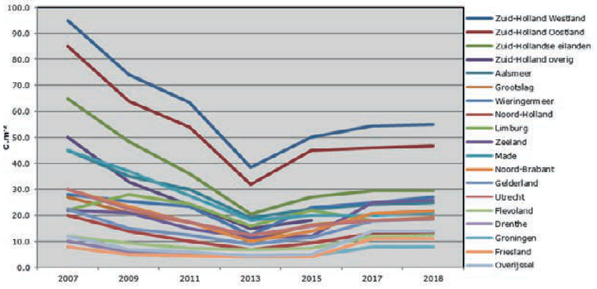  
图11 2004-2015年荷兰各地区宽度超过160米地块的土地价格(€/m²)(2015年前数据来源：Wageningen University & Research LEI，2017年起数据来源：Westmaas Makelaardij)

表19 2007-2018年荷兰各地区温室园艺用地价格（地块宽度至少160米），单位：€/m²（2015年前数据来源：瓦赫宁根大学与研究机构LEI，2017年起数据来源：Westmaas房地产经纪公司）

| 地区 | 2007 | 2009 | 2011 | 2013 | 2015 | 2017 | 2018 |
|------|------|------|------|------|------|------|------|
| 南荷兰省-西兰地区（Zuid-Holland Westland） | 95.0 | 74.0 | 63.5 | 38.5 | 50.0 | 54.5 | 55.0 |
| 南荷兰省-东部地区（Zuid-Holland Oostland） | 85.0 | 64.0 | 54.0 | 32.0 | 45.0 | 46.0 | 46.8 |
| 南荷兰省岛屿区（Zuid-Hollandse eilanden） | 65.0 | 48.5 | 36.0 | 20.5 | 27.0 | 29.5 | 29.5 |
| 南荷兰省其他地区（Zuid-Holland overig） | 50.0 | 33.0 | 24.0 | 15.0 | 18.0 | - | - |
| 阿尔斯梅尔（Aalsmeer） | 45.0 | 35.0 | 30.0 | 19.0 | 22.5 | 24.2 | 25.0 |
| 格罗茨拉格（Grootslag） | 27.0 | 21.0 | 17.5 | 10.5 | 16.5 | 18.0 | 19.0 |
| 维林厄梅尔（Wieringermeer） | 28.0 | 25.5 | 23.5 | 12.5 | 23.0 | 25.0 | 27.0 |
| 北荷兰省（Noord-Holland） | 20.0 | 14.0 | 10.0 | 7.0 | 9.5 | 13.3 | 13.5 |
| 林堡省（Limburg） | 22.0 | 28.0 | 24.5 | 16.0 | 22.0 | 18.0 | 18.5 |
| 泽兰省（Zeeland） | 22.0 | 21.0 | 15.0 | 11.5 | 12.0 | 25.0 | 25.9 |
| 马德*（Made） | 45.0 | 37.0 | 27.5 | 18.0 | 20.0 | 20.0 | 21.0 |
| 北布拉班特省（Noord-Brabant） | 30.0 | 23.5 | 17.5 | 10.0 | 14.0 | 20.8 | 21.8 |
| 海尔德兰省（Gelderland） | 22.5 | 15.0 | 12.5 | 9.0 | 11.5 | 17.9 | 18.5 |
| 乌得勒支省（Utrecht） | 30.0 | 22.5 | 17.5 | 12.5 | 16.0 | 18.0 | 18.5 |
| 弗莱福兰省（Flevoland） | 12.0 | 9.5 | 7.5 | 7.0 | 7.5 | 12.0 | 12.5 |
| 德伦特省（Drenthe） | 10.0 | 6.0 | 5.0 | 4.0 | 4.5 | 8.0 | 8.0 |
| 格罗宁根省（Groningen） | 8.0 | 5.0 | 4.5 | 4.5 | 4.5 | 8.0 | 8.0 |
| 弗里斯兰省（Friesland） | 8.0 | 5.0 | 4.5 | 4.0 | 4.0 | 11.0 | 11.0 |
| 上艾瑟尔省（Overijssel） | 12.0 | 7.0 | 6.0 | 4.5 | 5.0 | 14.0 | 14.0 |

\* 马德地区包含热水管网连接 - ∂·∂=∂ 表示无数据

图12展示了基于CBS数据至2017年的新建温室面积趋势。2017-2019年间每年新建温室面积估计为200公顷（数据来源：温室供应商平台AVAG）。此外，每个建设项目的温室面积在2007年前呈现逐步增长，而在2007-2014年间有所下降（图13）。

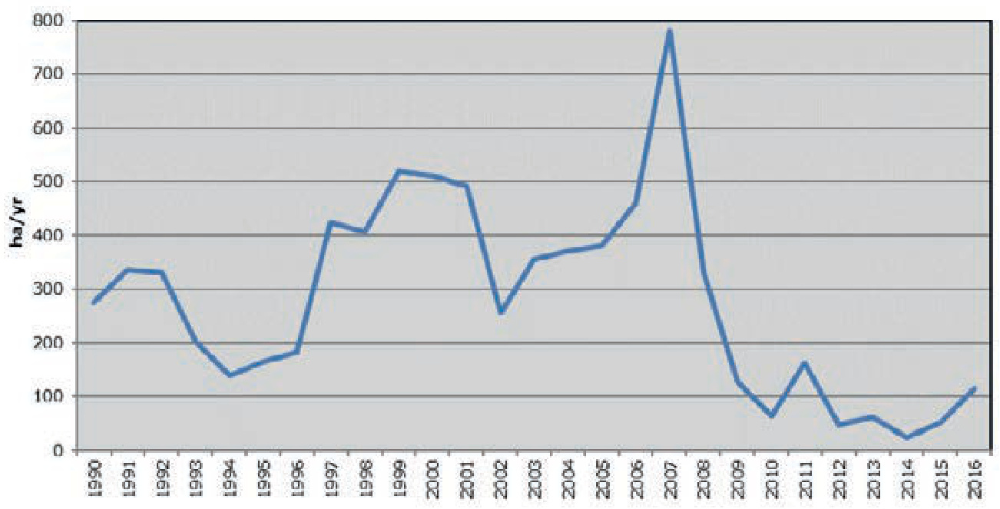  
图12 基于建设许可申请数据的新建温室总面积发展情况（公顷/年）。（数据来源：CBS aanvragen bouwvergunningen；统计截至2017年）

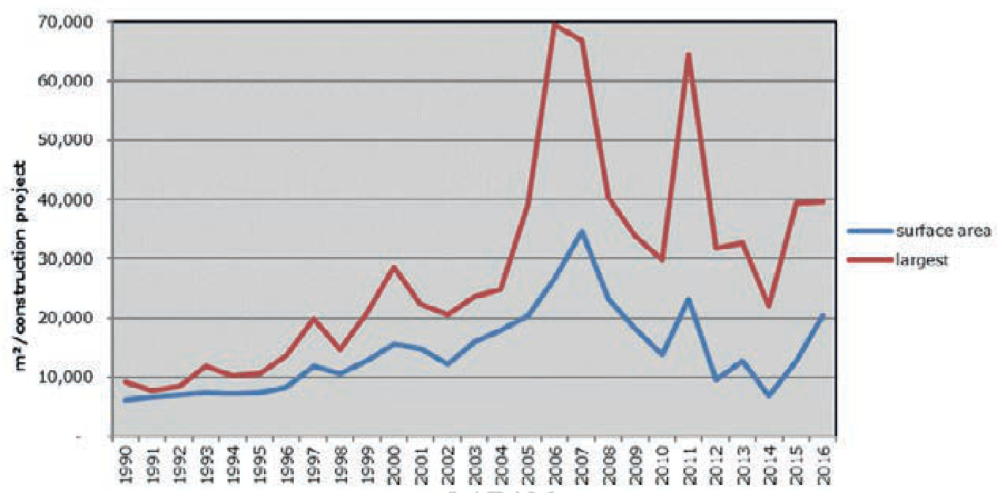  
图13 基于建设许可申请数据的单个温室项目面积发展情况（平方米/项目）。（数据来源：CBS aanvragen bouwvergunningen；统计截至2017年）

以檐沟高度为指标的新建温室容积率平均保持在约$6 ~ \mathsf { m } ^ { 3 } / \mathsf { m } ^ { 2 }$（图14）。

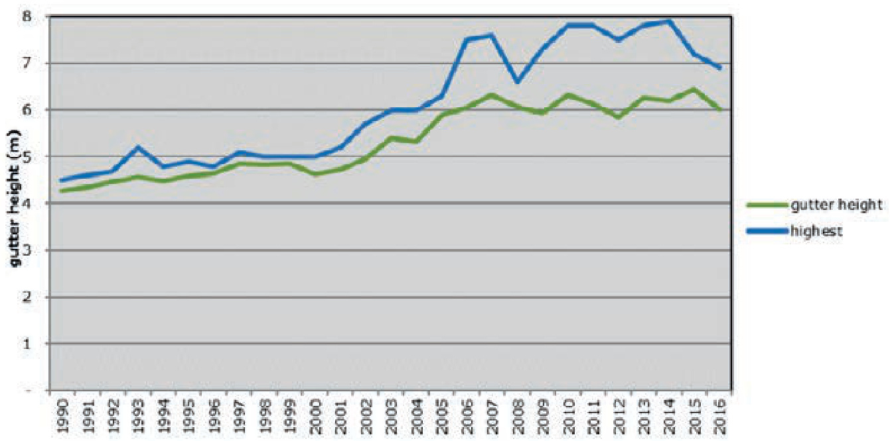  
图14 基于建设许可申请数据、以檐沟高度（米）为指标的新建温室项目容积发展情况。（数据来源：CBS aanvragen bouwvergunningen；统计截至2017年）

# 3.2 能源

# 3.2.1 温室园艺能源使用

图15显示了1990-2017年期间温室园艺用于供暖的天然气总量和净电力消耗总量（包括回输国家电网的部分）。图16显示了温室园艺每平方米的能源使用值。

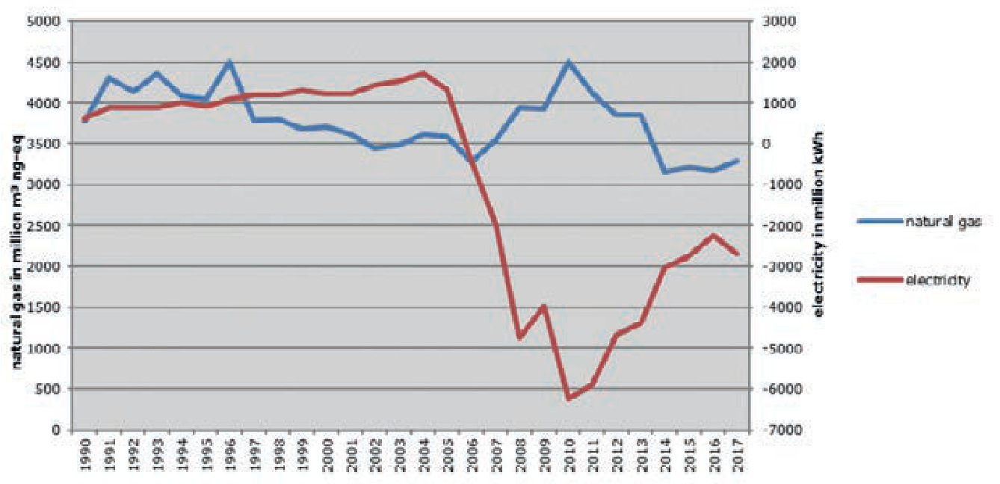  
图15 温室园艺中用于供暖的天然气（百万立方米天然气当量）和净电力使用（百万千瓦时）的发展（来源：改编自Van der Velden和Smit，2018年）。

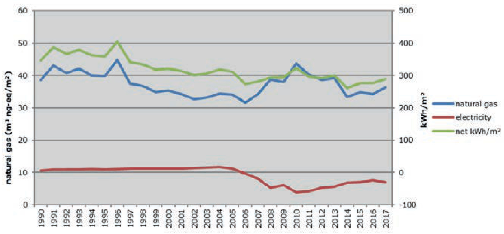  
图16 温室园艺中用于供暖的天然气（百万立方米天然气当量/平方米）和净电力使用（百万千瓦时/平方米）的发展（来源：改编自Van der Velden和Smit，2018年）。

表20 2017年荷兰农业按能源载体分类的能源使用量（PJ）

| | 总使用量 | 能源使用与生产平衡 | 能源转换总使用量 | 能源生产来源 | 最终使用量 |
|---|---|---|---|---|---|
| 总能源载体 | 159.7 | 11.1 | 92.6 | 81.5 | 148.6 |
| 石油材料及产品总量 | 18.2 | | | | 18.2 |
| 天然气(Natural gas) | 127.4 | 83.9 | | 0.1 | 43.5 |
| 可再生能源总量(Total renewable energy) | 14.5 | 79 | 7.9 | | 6.6 |
| 地热能(Geothermal heat) | 3 | V | | | 3 |
| 环境能源(Environmental energy) | 0.3 | V | | | 0.3 |
| 太阳能(Solar power) | 1.1 | 1.1 | 1.1 | | |
| 风能(Wind power) | 1.5 | 1.5 | 1.5 | | |
| 生物质总量(Total biomass) | 8.5 | 5.3 | 5.3 | | 3.3 |
| 电力(Electricity) | 41 | -37.7 | 0.7 | 38.4 | 33.6 |
| 热能(Heat) | 3.7 | -43 | | 43 | 46.7 |

表21 各种燃料的能源含量、最低热值及与天然气相当量的换算系数

| | 单位 | 兆焦/单位 | 千瓦时/单位 | 单位/(m³天然气当量) | m³天然气当量/单位 |
|---|---|---|---|---|---|
| 天然气(Natural gas) | m3 | 31.65 | 8.8 | 1.00 | 1.00 |
| 燃料油(Fuel oil) | kg | 40 | 11.1 | 0.79 | 1.26 |
| 柴油(Gas oil) | 升 | 36 | 10.0 | 0.88 | 1.14 |
| 煤（无烟煤）(Coal anthracite) | kg | 29 | 8.1 | 1.09 | 0.92 |
| 煤（褐煤）(Coal lignite) | kg | 21 | 5.8 | 1.51 | 0.66 |
| 木材(Wood) | kg | 16 | 4.4 | 1.98 | 0.51 |

# 3.2.2 天然气与电力

根据欧盟内部协议，自2004年7月1日起，电力和天然气市场已完全自由化。此后，所有客户均可自由选择能源供应商。基础设施的管制费用直接或间接向终端用户收取。

年采购量超过$170,000\mathrm{m}^{3}$天然气的客户称为计量客户。他们应安装可记录小时流量的燃气表。年消费量低于$170,000\mathrm{m}^{3}$的客户称为档案客户，按实际用气量计费。

许多供应商按照Gasunie Trade & Supply (GuTS)的天然气销售系统为计量客户供气。价格包含以下组成部分：

• 天然气  
• 灵活性（容量）  
• 国家运输  
• 区域运输  
• 其他费用  

天然气商品价格和服务费用可自由协商。运输价格由荷兰消费者与市场管理局(ACM)监管，可在www.acm.nl查询。税费（能源税和增值税）由政府设定。

# 3.2.2.1 商品

商品指天然气本身。每立方米天然气折算为标准立方米，包含废气中冷凝热在内的热值为35.17兆焦。荷兰天然气价格主要在虚拟交易平台Title Transfer Facility(TTF)确定。

# 3.2.2.2 灵活性

灵活性成本（通常称为容量费用）是指特定可用容量$(m^{3}/h)$的成本。合同容量分为基础容量和附加容量。基础容量为年用气量$(m^{3})$除以8760（年小时数），描述完全平稳的用气情况。附加容量是随时可用的额外容量（工作容量-基础容量）。该附加容量采用€/$m^{3}$/小时的弹性费率。超出合同容量将产生罚款。

# 3.2.2.3 国家运输(National Transport)

国家运输涉及通过天然气联合运输服务(Gas Union Transport Services, GTS)基础设施输送天然气。采用"入口-出口"系统，成本取决于天然气进入国家运输服务管道和进入区域网络(GOS)的位置。区域网络距离格罗宁根气田越远，成本越高。费用基于合同容量，超出合同运输量可能导致罚款。

# 3.2.2.4 区域运输(Regional Transport)

区域运输包括从GOS到终端用户的运输。同样会收取与容量相关的费用。此外，通常每年还会收取固定的区域运输费用。区域运输成本直接向终端用户收取。在大多数区域电网中，超出合同运输量会导致1-4倍常规区域运输费率的罚款。

# 3.2.2.5 其他费用和折扣(Other expenses and discounts)

其他费用可能涉及供应商(利润、费用)，以及连接和计量成本。更多信息请见www.agroenergy.nl。

# 3.2.2.6 税收(Taxes)

# 园艺用天然气能源税(Energy tax natural gas for horticulture)

每立方米天然气价格因各种政府税收、增值税和能源税而增加。要获得园艺用天然气能源税减免需要特殊许可。该许可可从经济事务和农业部获得，电力公司通常可协助申请。该许可还允许园艺用途天然气适用6%的低增值税率，而非19%的标准税率。只要管理不变，该许可持续有效。除能源税外，还有可持续能源储存费(ODE)。能源税和可持续能源费率见表25和图17。天然气能源税见表22。

表22 温室园艺天然气能源税税率和ODE(€ct/m³)2017-2019年

| 等级(Level) | 消费量范围 | 园艺能源税税率(€ct/m³) | | | 园艺ODE(€ct/m³) | 普通能源税税率(€ct/m³) | | |
|------------|------------|------------|------------|------------|----------------|------------|------------|------------|
| | | 2019 | 2018 | 2017 | 2019 | 2019 | 2018 | 2017 |
| 0 | - 170,000 m³ | 4.71 | 4.18 | 4.05 | 0.84 | 29.31 | 26.00 | 25.24 |
| 170,000 | - 1,000,000 m³ | 2.47 | 2.44 | 2.35 | 0.61 | 6.54 | 6.46 | 6.22 |
| 1,000,000 | - 10,000,000 m³ | 2.38 | 2.36 | 2.26 | 0.59 | 2.38 | 2.36 | 2.27 |
| | > 10,000,000 m³ | 1.28 | 1.27 | 1.21 | 0.31 | 1.28 | 1.27 | 1.22 |

来源: http://www.belastingdienst.nl/wps/wcm/connect/bldcontentnl/belastingdienst/zakelijk/overige_belastingen/belastingen_op_ milieugrondslag/tarieven_milieubelastingen/tabellen_tarieven_milieubelastingen

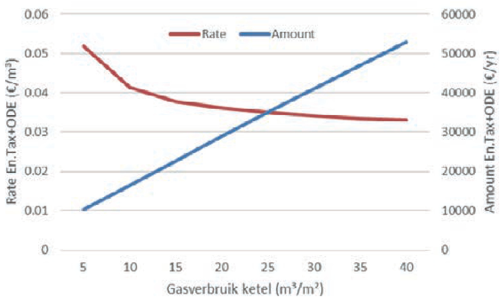  
图17 2019年保护地园艺(4公顷苗圃)不同天然气消费水平(总量和€/m³)的能源税(EB)和可持续能源储存费(ODE)

# 园艺用电能源税(Energy Tax)

园艺用电的能源税(Energy Tax)和可持续能源附加费(ODE)如表22和图19所示。

表23 园艺用电能源税(Energy Tax)和可持续能源附加费(ODE)如表23和图18所示

| 等级(Level) |  | 园艺能源税(ET Horticulture) |  |  | 园艺可持续能源附加费(ODE Horticulture) |
|------------|----------------|------------|------------|------------|----------------|
|  |  | 2019 | 2018 | 2017 |  |
| 0 | - 10,000 千瓦时(kWh) | 9.863 | 10.458 | 10.130 | 2019 1.89 |
| 10,000 | - 50,000 千瓦时(kWh) | 5.337 | 5.274 | 4.901 | 2.78 |
| 50,000 | - 10,000,000 千瓦时(kWh) | 1.421 | 1.404 | 1.305 | 0.74 |
| > 10,000,000 千瓦时(kWh) 企业(companies) |  | 0.058 | 0.057 | 0.057 | 0.03 |

来源: http://www.belastingdienst.nl/wps/wcm/connect/bldcontentnl/belastingdienst/zakelijk/overige_belastingen/belastingen_op_ milieugrondslag/tarieven_milieubelastingen/tabellen_tarieven_milieubelastingen

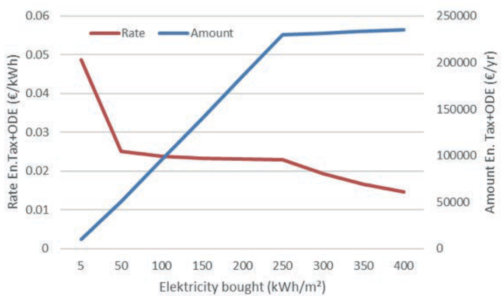  
图18 2019年(温室)园艺用电能源税(Energy Tax)和可持续能源附加费(ODE)，针对4公顷苗圃不同用电水平(总量和€/m³)

# 3.2.2.7 年用气量<17万立方米的客户

对于年用气量低于17万立方米的终端用户，虽然同样收取上述费用，但不测量小时容量。灵活性和国家运输成本将按每立方米天然气统一费率收取。荷兰十个地区的价格从每立方米0.11欧元到0.13欧元不等。区域运输成本通常取决于容量，不仅包括已使用的容量，还包括燃气表的流量容量。此外，不同网络的成本也有所不同。

# 3.2.2.8 TTF天然气期货市场

自2007年起，荷兰天然气所有权转移设施(TTF)期货市场的天然气交付合约已向园艺企业开放。在这个市场中，天然气价格不与国际油价挂钩，而是基于西北欧地区的天然气供需关系。近期价格形成情况见下页。

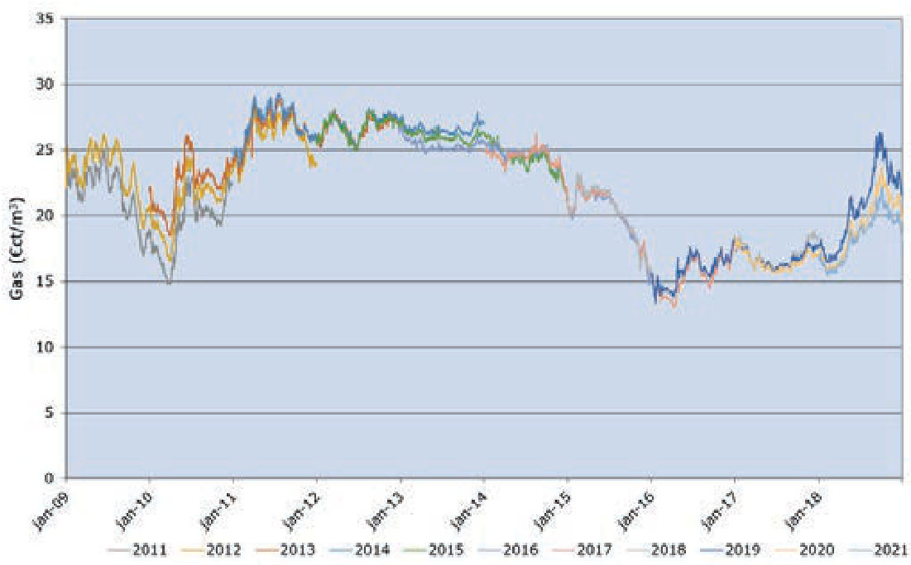  
图19 TTF天然气价格走势(${\overline{{TTF}}}$，由Alfa accountants编辑)

在TTF市场上，不仅可以买入，还可以卖出天然气量。通过这种方式，种植者可以像电力买卖一样优化其采购策略。除了期货市场交易外，还可以在现货市场购买。能源公司已接受这种情况，现在提供特殊合约。图19显示了TTF上天然气价格的发展。

# 3.2.3 向国家电网供电

自电力供应自由化以来，也可以将电力回输至国家电网。使用热电联产(CHP)机组可以同时产生热能和电能。这些电力可用于企业内部(如同化照明)，也可输送至公共电网。通过精心设计，可以充分利用热能和电能。如果CHP连接烟气净化器，还可以利用烟气中的${ \mathsf{CO}_2 }$用于温室。通过适当配置，能源效率几乎可以达到$100\%$。使用蓄热器可以储存夜间所需的热量，而${ \mathsf{CO}_2 }$仅在白天需要。

电力市场适用不同的价格区间：

• 基荷：最低供电量  
• 峰荷：- 2013年前：周一至周五7:00-23:00，每周80小时 - 2014年起：周一至周五8:00-20:00，每周60小时  
• 低谷时段：剩余时间

高峰时段的价格最高。

在实际应用中，未将CHP用于照明的苗圃通常在白天运行CHP。不需要立即使用的热量储存在蓄热器中，${ \mathsf{CO}_2 }$被输送到温室，最后将电力出售给公共电网。

向国家电网供电有多种合约类型：

- 长期固定协议  
- 通过不同交易商/市场供电的短期协议。图20至23显示了电力价格的发展。图20基于短期市场，图21至23基于长期固定价格。长期市场区分基荷和峰荷价格。

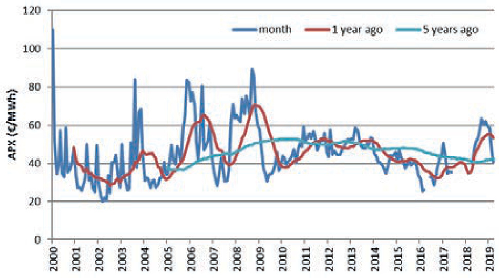  
图20 APX日前基荷电价走势，按月、年和5年前平均值(编辑自：www.apxgroup.com)

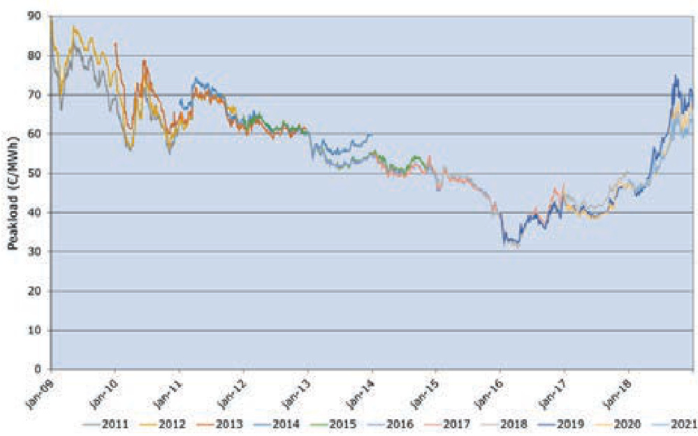  
图21 APX场外峰荷电价走势(Endex，由Alfa accountants编辑)

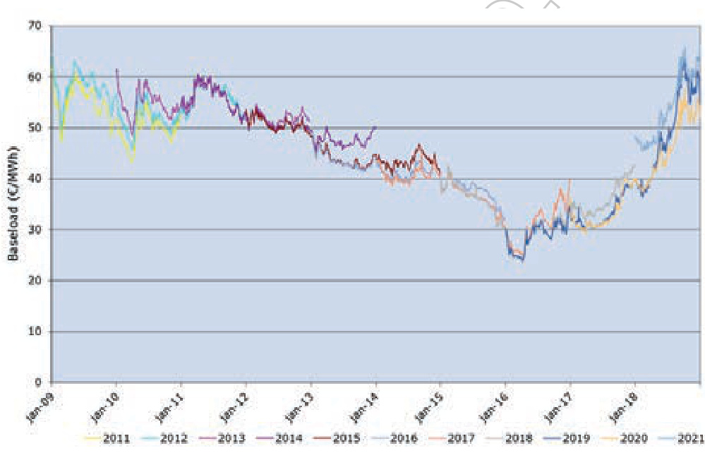  
图22 APX场外基荷电价走势(Endex，由Alfa accountants编辑)

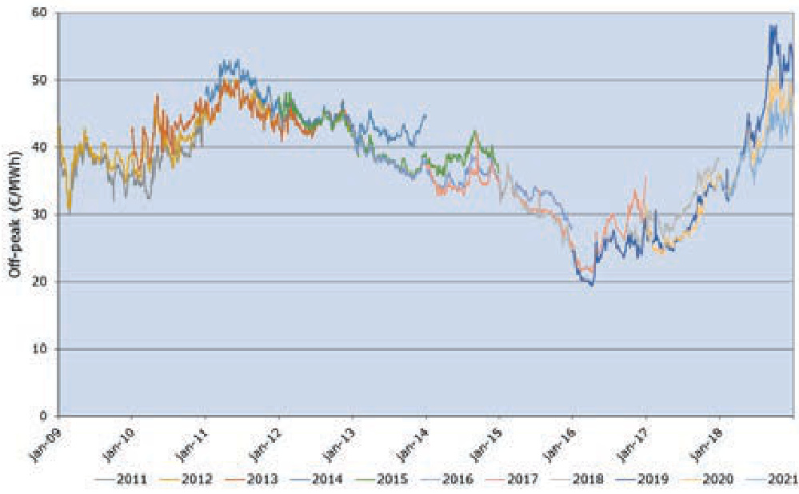  
图23 计算得出的低谷(低需求)电价走势(Endex，由Alfa accountants编辑)

签订电力合约时，必须同时确定并包含所需的天然气量。生产1兆瓦时电力，CHP需要$270-310\ m^3$天然气。

如果能够利用CHP产生的全部热量，输送电力的可变成本价格等于电热价差(图24)。如果无法利用CHP产生的热量，则每兆瓦时的价值必须高于天然气价格$*_{\mathsf{m}^3}$加上CHP的维护成本。低谷电价通常低于此值。

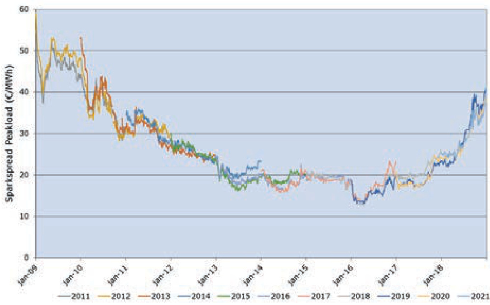  
图24 基于天然气价格和峰荷电价的电热价差走势(TTF和Endex，由Alfa accountants编辑)

1   

| 项目 | 单位(unit) | 无照明无热电联产(No lighting, no CHP) |  | 无照明有热电联产(No lighting with CHP) | 照明和热电联产(Lighting and CHP) |
|---|---|---|---|---|---|
| V区面积(Area V) | 平方米(m²) | 40000 | 40000 | 40000 |  |
| 电力使用(Electricity use) | 千瓦时/年(kWh/yr) | 400 | 400 | 6.000 |  |
| 热能使用(Heat use) | 兆焦/年(MJ/yr) | 950 | 950 | 950 |  |
| 燃气锅炉(Gas Boiler) | 立方米/年(m3/yr) | 1200000 | 200000 | 200000 |  |
| 热电联产燃气(Gas CHP) | 立方米/年(m3/yr) | 0 | 2000000 | 2000000 |  |
| 每小时产能(Capacity per hour) | 立方米/年(m3/yp) | 500 | 600 |  | 500 |
| 电力采购(Electricity bought) | 兆瓦时/年(MWh/yr) | 400 | 200 |  | 3.000 |
| 热电联产电力(CHP production electricity) | 兆瓦时/年(MWh/yr) | 0 | 7050 |  | 7050 |
| 国家电网供电(Electricity supply to national grid) | 兆瓦时/年(MWh/yr) | 0 | -6.850 |  | -4.050 |
| 合同容量(Contractual capacity) | 千瓦/年(kW/yr) | ? 130 | 70 |  | 4000 |
| 月度容量(Monthly capacity) | 千瓦/月(kW/mnth) | 125 | -1710 |  | 2300 |
| 燃气组件(Components gas) | 单位(unit) | 数量(amount) | 单价(rate) | 数量单价(amount rate) | 数量(amount) |
| 燃气(Gas) | €/立方米(€/m³) | 单价 € 240.000 | €0,2000 | € 440.000 €0,2000 | € 440.000 |
| 能源税(Energy Tax) | €/立方米(€/m3) | €0,2000 | €0,0518 | €10.354 €0,0518 | €10.354 |
| 可变成本(Flexible costs) | €/立方米(€/m3) | €0,0341 €40.932 | €1.404 €0,0012 | €2.574 €0,0012 | € 2.574 |
| 国家运输(National transport) | €/(年·立方米/小时)(€/(yr.m3/h)) | €0,0012 €17,58 | €8.792 €17,58 | €10.550 €17,58 | €8.792 |
| 手续费(Handling fee) | €/立方米(€/m3) | €0,0006 | €768 €0,0006 | €1.408 €0,0006 | €1.408 |
| 基础设施处理(Handling infra.) | €/月(€/mnth) | €375,00 €4.500 | €375,00 | €4.500 €375,00 | €4.500 |
| 借记费率(Debit tariff) |  | 1% € 2.911 | 1% | €4.635 | 1% €4.617 |
| 区域运输(Regional transport) | €/(年·立方米/小时)(€/(yr.m3/h)) | € 24,93 €12.466 | €24,93 | €14.959 € 24,93 | €12.466 |
| 区域固定成本(Regional fixed costs) | €/月(€/mnth) | € 540,00 €6.480 | €540,00 | €6.480 | € 540,00 €6.480 |
| 其他(区域燃气管网)(Others regional gas grid) | €/月(€/mnth) | €55,00 | €660 €55,00 | €660 | €55,00 €660 |
| 燃气总计(Total gas) | €/年(€/yr) | €318.912 |  | € 496.119 | €491.850 |
| 每立方米(Per m3) | €/立方米(€/m3) | €0,266 |  | €0,226 | €0,224 |
| 每平方米(Perm²) | €/平方米(€/m²) |  | €7,97 | €12,40 | €12,30 |

| 项目 | 单位(unit) | 无照明无热电联产(No lighting, no CHP) |  | 无照明有热电联产(No lighting with CHP) |  | 照明和热电联产(Lighting and CHP) |  |
|---|---|---|---|---|---|---|---|
|  |  | 单价(rate) | 金额(amount) | 单价(rate) | 金额(amount) | 单价(rate) | 金额(amount) |
| 电力销售(Electricity sold) | €/兆瓦时(MWh) | €48.00 | €19,200 | €48.00 | €9,600 | €48.00 | €144,000 |
| 电力采购(Electricity bought) | €/兆瓦时(MWh) | €56.00 | €- | €56.00 | €-383,600 | €56.00 | €-226,800 |
| 能源税(Energy Tax) | €/兆瓦时(MWh) | €29.96 | €11,986 | €38.32 | €7,664 | €4.72 | €14,147 |
| 采购手续费(Handling fee purchase) | €/兆瓦时(MWh) | €0.10 | €40 | €0.10 | €20 | €0.10 | €300 |
| 销售手续费(Handling fee sales) | €/兆瓦时(MWh) | €0.10 | €- | €0.10 | €685 | €0.10 | €405 |
| 固定电力手续费(Handling fee electricity fixed) | €/月(mnd) | €375.00 | €4,500 | €375.00 | €4,500 | €375.00 | €4,500 |
| 借记费率(Debit tariff) |  | 1% | €237 | 1% | €-3,688 | 1% | €-776 |
| 运输成本V(Transport costs V) | €/兆瓦时(MWh) | €9.50 | €3,800 | €9.50 | €1,900 | €9.50 | €28,500 |
| 年度合同容量(Contract yearly capacity) | €/(千瓦·年)(kw.yr) | €11.74 | €1,527 | €19.61 | €1,7 | €19.61 | €78,432 |
| 月度容量(Monthly capacity) | €/(千瓦·月)(kW.mnth) | €1.46 | €183 | €1.66 | €-2,831 | €1.66 | €3,808 |
| 固定成本(Fixed costs) | €/月(mnth) | €48.04 | €577 | €48.04 | €577 | €48.04 | €577 |
| 其他(区域电网等)(Others regional grid etc.) | €/月(mnth) | €1,055.16 | €12,662 | €1,055.16 | €12,662 | €1,055.16 | €12,662 |
| 电力总计(Total electricity) | €/年(yr) |  | €54,711 |  | €-351,140 |  | €59,755 |
| 每平方米(Per m²) | €/平方米(m²) |  | €1.37 |  | €-8.78 |  | €1.49 |
| 燃气和电力每平方米(Gas en elektra per m²) | €/平方米(m²) |  | €9.34 |  | €3.62 |  | €13.79 |

# 3.2.4 油价发展

油价仍然是影响天然气价格发展的重要因素。图25显示了布伦特原油每桶价格以美元(US$)和欧元(€)计价的发展情况。

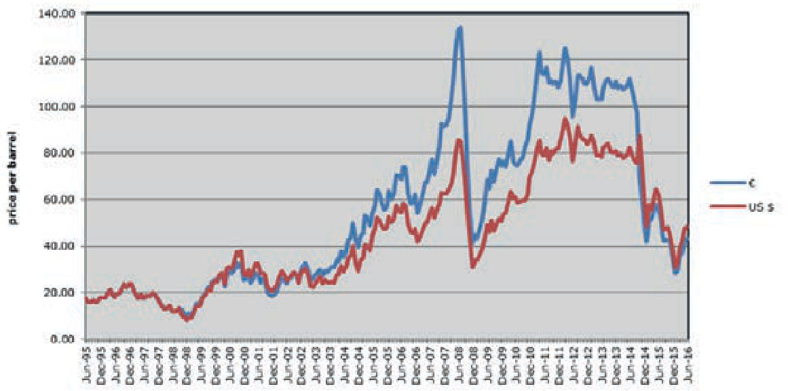  
图25 布伦特原油每桶价格走势(原油(石油)，布伦特轻质混合油38 API 英国离岸价，每桶价格)

# 3.3 地热能

# 3.3.1 地热生产

2016年初，荷兰温室中有超过十处地热资源被用作热源。2014年这些地热井生产了3750万立方米天然气当量的热量，2016年生产了5550万立方米天然气当量的热量(冷却温度为35℃)。图26展示了2013年至2019年地热生产的发展情况。

  
图26 温室园艺地热生产发展情况，假设平均冷却温差(dT)为35%(来源：http://nlog.nl/nl/geothermalEnergy/geothermalEnergy.html 日期：2019-01-01)

# 3.3.2 地热能成本

从初步规划到实际生产通常需要3-5年时间，这是一个涉及许多新经验的过程。这些包括钻井和地热源运营的经验已在2013年12月荷兰国家项目"Kas als Energiebron"（温室作为能源）中发布的《温室地热开发路线图》中公布。

表25 地热双井投资成本估算

| 项目 | 最小值-最大值(€) |
|---|---|
| 地质调查快速扫描(Geological investigation quick scan) | 10,000-20,000 |
| 全面地质调查(Geological investigation comprehensive) | 25,000-250,000 |
| 可行性研究(Feasibility study) | 20,000-100,000 |
| 研究许可(Research permit) | 30,000-70,000 |
| 许可和健康安全法规(Permits and health and safety legislation) | 70,000-120,000 |
| 钻井场地建设(Construction drilling site) | 150,000-300,000 |
| 钻井(Drilling): |  |
| 第1公里深度(1st km depth) | 1,000,000 |
| 第2公里深度(2nd km depth) | 2,000,000-5,000,000 |
| 第3公里深度(3rd km depth) | 5,000,000-7,000,000 |
| 钻井管理(Drill management) | 200,000-450,000 |
| 热交换器等(Heat exchangers etc.) | 500,000-1,500,000 |
| 输送管道100米(Transport pipes 100 m) | 15,000-30,000 |
| 伴生气收集(Capture incidental gases) | 待定 |
| 伴生油收集(Capture incidental oil) | 待定 |
| 钻井建设能源(Energy for construction) | 200,000 |
| 土壤移除和清理(Soil removal and cleaning) | 100,000-150,000 |
| 建筑工程全险(Construction all risks insurance) | 200,000-500,000 |
| 地热项目风险SEI担保系统(SEI guarantee system) | 300,000-500,000 |
| 初始启动和激励成本(Initial start costs) | 100,000-250,000 |
| 荷兰环境许可(Dutch Environmental permit) | 50,000 |
| 2公里钻井总成本(Total 2km depth) | 6,970,000-11,490,000 |
| 3公里钻井总成本(Total 3 km depth) | 11,970,000-18,490,000 |

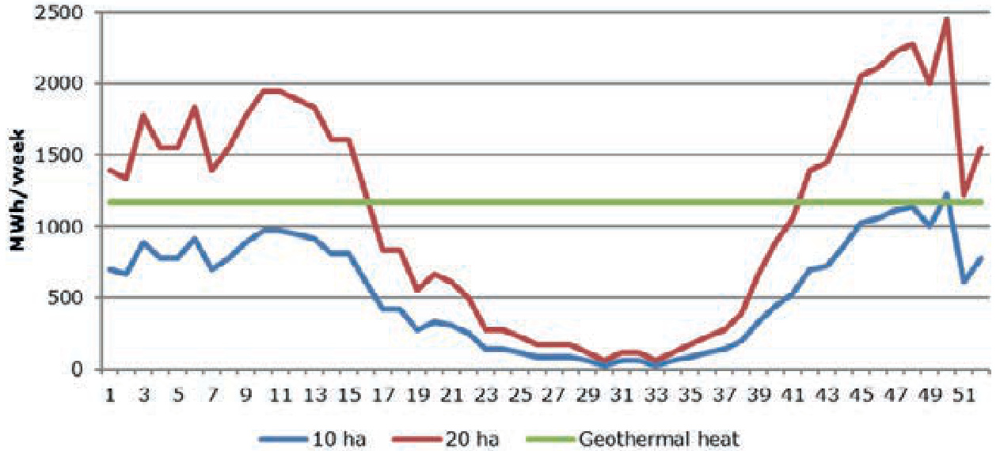  
图27 10公顷和20公顷温室的热量需求示例，热需求为31m³天然气/(m²·年)，地热源产能为6.94MW(兆瓦时/周)

在《温室地热开发路线图》中展示了最小和最大投资成本的估算(表25)。同时也对运营成本进行了估算，如表26所示。运营成本取决于地热源的产能、温室表面积和需要加热的温室热需求。如图27所示，更大的表面积能更好地利用地热能。夏季地热源常会产生过多热量。10公顷温室使用4,000满负荷小时，20公顷温室使用6,000小时。

表26 地热源标准及地热循环系统(双井)开发成本估算

|  |  |  |  |
|---|---|---|---|
| **地热源标准** |  |  |  |
| 井流量(Debit of well) | m/h | 160 | 160 |
| 源温度(Temperature source) | ℃ | 77 | 77 |
| 注入温度(Temperature injection) | ℃ | 37 | 37 |
| 温差(Temperature difference) | ℃ | 40 | 40 |
| 比质量(Specific mass) | kg/l | 1.1 | 1.1 |
| 比热(Specific heat) | J/(kg.K) | 3.55 | 3.55 |
| 热容量(Heat capacity) | MW | 6.94 | 6.94 |
| 最大运行时间(Running hours) | h | 6,000 | 4,000 |
| 年供热量(Heat supplied) | MWh | 41,653 | 27,769 |
| 年供热量(Heat supplied) | GJ | 149,952 | 99,968 |
| 天然气能量当量(Energy capacity natural gas) | MJ | 31.6 | 31.6 |
| 天然气当量热量(Heat in natural gas equivalents) | m³ gas/yr | 4,745,316 | 3,163,544 |
| 电力消耗(Electricity used) | MWh/yr | 3,000 | 2,000 |
| 能效比(COP) | MWh/MWh | 13.9 | 13.9 |

| **经济标准** |  |  |  |
| 含运输的电力成本(Electrical costs incl. transport) | €/kWh | €0.08 |  |
| 折旧期(Depreciation period) |  |  | €0.08 |
| 利率(Interest) | yr | 12 | 12 |
|  | % | 2 | 2 |
| 投资(Investment) | € | €9,500,000 | €9,500,000 |
| 荷兰可持续能源激励费(SDE) | €/GJ | €4.90 | €4.90 |

| **年成本** | **€/yr** |  |  |
| 年金(Annuities) |  | €898,316 | €898,316 |
| 管理与维护(Management and maintenance) | €/yr | €250,000 | €250,000 |
| 井用电(Electricity use well) | €/yr | €240,000 | €160,000 |
| 额外CO2成本(Cost of extra CO2) | €/yr | pm | pm |
| 伴生气收集(Capture incidental oil and gas) | €/yr | pm | pm |
| 总成本(Total costs) | €/yr | €1,388,16 | €1,308,316 |
| SDE收益(Yield SDE) | €/yr | €734,765 | €489,843 |
| SDE后净成本(Net costs after SDE) | €/yr | €653,551 | €818,473 |
| 天然气当量价格(Price per natural gas equivalent) | €/m3ng-eq | €0.14 | €0.26 |

荷兰"可持续能源生产激励计划"(Stimulering Duurzame Energieproductie, SDE+补贴计划)每年开放申请，每年的条件和可用金额都有所不同。

更多关于地热能的信息可访问：
• http://geothermie.nl/   
• http://www.rvo.nl/subsidies-regelingen/stimulering-duurzame-energieproductie-sde   
• www.energiek2020.nl

# 3.4 二氧化碳(CO₂)需求与成本

# 3.4.1 作物的二氧化碳(CO₂)需求

作物在光合作用过程中吸收CO₂并将其转化为有机物。光合作用需要光照和水分。通常，光照越强，植物产生的有机物越多。温室空气中的CO₂含量也是如此，CO₂浓度越高，产量越高。但随着光照和CO₂水平的增加，增产比例会逐渐减小。

图28显示了在不同光照强度和CO₂浓度下的相对产量（重量百分比）。以室外空气水平为100%（2019年：约415ppm）。图29展示了成熟作物在不同辐射强度和CO₂浓度下的CO₂吸收量。

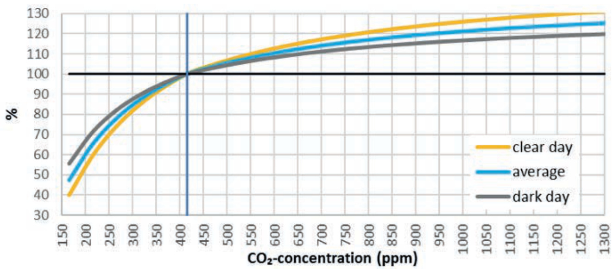  
图28 与室外CO₂水平(415ppm)相比，作物相对产量与CO₂浓度的关系，显示晴天、平均日和阴天三种光照条件下的情况（Nederhoff, 1994）

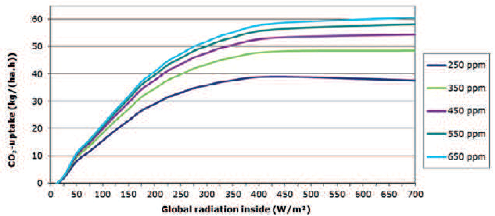  
图29 不同CO₂浓度下，作物每小时每公顷的CO₂吸收量（kg）

表27 三种CO₂施用策略下作物的CO₂吸收量和效率  

| | 低(laag) | 中(midden) | 高(hoog) |
|---------|---------|---------|---------|
| CO₂ kg/(m²·年) | 25.6 | 61.5 | 97.1 |
| 效率(Efficiency) | 51% | 22% | 14% |

来源：Vermeulen (2010)

温室中CO₂浓度高于室外环境水平会提高产量，但同时也会因通风导致额外的CO₂损失。CO₂效率（作物吸收量除以可用CO₂增量）随着CO₂浓度的升高而降低。表27显示了以下三种CO₂施用策略下的作物吸收量和效率：

• 低：仅在需要供热时施用  
• 中：同样条件下，但增加50ppm剂量  
• 高：同样条件下，但增加100ppm剂量  

图30展示了高低两种CO₂施用策略下，作物全年的CO₂吸收和施用情况及其效率。

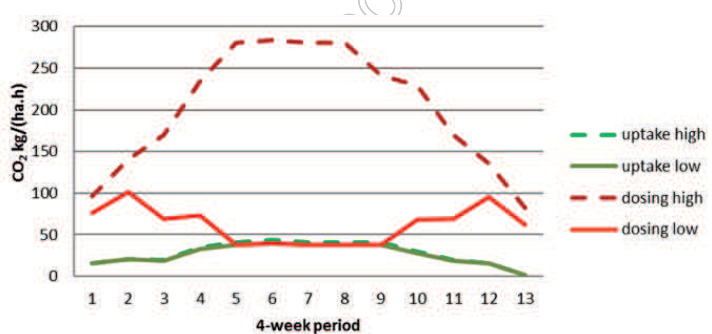  
图30 两种CO₂施用策略（低和高）下作物全年CO₂吸收和施用情况

# 3.4.2 ${ \mathsf { C O } } _ { 2 }$ 行业体系与欧盟排放交易系统(EU-ETS)

为减少${ \mathsf { C O } } _ { 2 }$气体排放，欧盟建立了欧洲${ \mathsf { C O } } _ { 2 }$交易系统(EU ETS)。EU ETS要求装机容量超过$2 0 ~ \mathsf { M W }$的企业参与。对于无需参与的企业(装机容量小于20 MW)，则适用${ \mathsf { C O } } _ { 2 }$行业体系。

${ \mathsf { C O } } _ { 2 }$行业体系由园艺产品委员会、LTO Glaskracht Netherlands与经济事务部、财政部及基础设施与环境部合作开发，于2011年生效。自2015年起，该体系由经济事务部负责实施。

${ \mathsf { C O } } _ { 2 }$行业体系确保实现2012年${ \mathsf { C O } } _ { 2 }$协议中行业与政府商定的目标水平。${ \mathsf { C O } } _ { 2 }$目标以绝对量(百万吨)表示，该目标逐年降低并纳入${ \mathsf { C O } } _ { 2 }$协议直至2020年。在${ \mathsf { C O } } _ { 2 }$行业体系中，每年计算${ \mathsf { C O } } _ { 2 }$目标的实现情况。若超出目标，则通过调整$\mathsf { m } ^ { 3 }$天然气价格将成本分摊给各企业。政府可利用行业体系收益进行${ \mathsf { C O } } _ { 2 }$排放交易以达到目标水平。

更多信息：
http://www.rvo.nl/onderwerpen/agrarisch-ondernemen/agrarische-administratie-en-registratie/co2-regelingvoor-de-glastuinbouw.

# 3.4.3 温室园艺节能系统(EBG)

园艺行业与政府认为有必要开发一个系统，在实现全行业${ \mathsf { C O } } _ { 2 }$目标保障和抵消的同时，也能将${ \mathsf { C O } } _ { 2 }$排放量具体落实到各企业。这一承诺载于2013年荷兰国家能源协议，并高度依赖维持对行业适用的天然气减税政策的政治和社会支持。由此产生了由LTO Glaskracht Netherlands开发的温室园艺节能系统(EBG)。

该节能系统跟踪各企业的天然气使用发展情况。每家企业都有一个基于2012和2013年天然气消耗量确定的基准水平(现行标准)。从2016年起，该企业标准每年降低$2 \%$并与实际用气量比较。若年度比较显示超出企业标准，则对使用的$\mathsf { m } ^ { 3 }$天然气成本进行结算。节能系统的计算规则会针对企业面积、2013年已实现的节能效果以及2012年后企业的重大能源相关变化进行调整。

更多信息：https://www.glastuinbouwnederland.nl/.

# 3.4.4 二氧化碳排放交易成本计算与价格走势

燃烧1立方米天然气会释放$1.78 \mathrm{~kg~CO}_2$。排放交易计划以吨为单位计算${ \mathsf{CO} }_2$排放量。燃烧$562.8~\mathsf{m}^3$天然气会释放1吨${ \mathsf{CO} }_2$。如果1吨${ \mathsf{CO} }_2$排放成本为7.50欧元，则相当于每$\mathsf{m}^3$天然气成本0.01335欧元；当${ \mathsf{CO} }_2$价格为每吨2.50欧元时，则相当于每$\mathsf{m}^3$天然气成本0.00445欧元。

计算公式如下：

KCO = PCO * 1.78 (€ / m3天然气) 1000   
$\mathsf{KCO}_2 =$ 每$\mathsf{m}^3$天然气的CO2排放成本 (€/$\mathsf{m}^3$天然气)   
${ \mathsf{PCO} }_2 =$ ${ \mathsf{CO} }_2$排放价格补偿 (€/吨${ \mathsf{CO} }_2$)

目前，温室园艺业已分配了无补偿的${ \mathsf{CO} }_2$排放配额。如果超出或未达到配额，将根据需要购买或出售${ \mathsf{CO} }_2$排放权。上述价格需根据超出或未达到的百分比进行调整，以计算成本或收益。该政策旨在降低无成本覆盖的配额。温室园艺业的免费配额将逐年减少。2011年和2012年，温室园艺业的年度${ \mathsf{CO} }_2$排放量设定为530万吨。

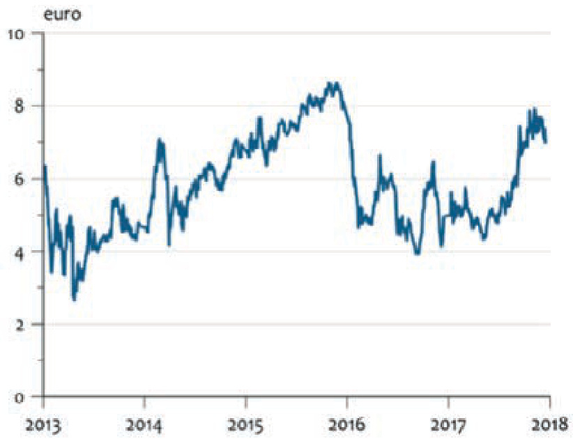  
图31 二氧化碳排放权价格走势

${ \mathsf{CO} }_2$排放价格走势如图30所示。根据欧洲协议，2013至2020年间大型用户的免费排放比例将逐年减少。预计在此期间${ \mathsf{CO} }_2$排放价格将上涨至每吨20-40欧元。然而截至2016年中，价格仍维持在每吨6-7欧元之间。

# 3.5 光照

光照是同化作用的驱动力。能量粒子、光子或光量子的辐射能从光源传递到接收体。太阳是温室中主要的光源。此外，冬季因光照不足会影响某些作物的产量和品质，会使用同化补光。为此通常使用高压钠灯(high-pressure sodium lamps)。目前也正在测试使用LED灯(LED lamps)。

测量光量有多种关键指标。光是一种能量形式，以能量单位计量。对于同化补光而言，光强和持续时间都很重要，两者共同决定辐射总量(表28)。

光由不同波长的振荡组成。光的效果取决于其用途。人眼对波长的敏感度与绿色植物不同(图32)。对于人类而言，光量以流明(lumens)计量，即人眼每秒可感知的固定光子数(4.09×10¹⁸光子/秒)。光强以勒克斯(lux)计量(1 lux = 1 lm/m²)。

表28 能量与光照的重要参数

| | 单位(Unit) | 功率(Power) | 密度/强度(Density/Intensity) | 单位面积时间总和(Time sum per m²) |
|---|---|---|---|---|
| 能量(Energy) | 焦耳(J) 瓦时(Wh) 1 Wh = 3.6 kJ | 瓦特(W) 1 W=1 J/s | W/m² | kWh/m² |
| 辐射(Radiation) | 焦耳(J) 瓦时(Wh) 1 Wh = 3.6 kJ | 瓦特(W) | W/m² | MJ/m² |
| 人眼感光性(Light sensitivity eye) | | 流明(Lumen) | 勒克斯(lux = lm/m²) | |
| 植物感光性(Light sensitivity plant) | | μmol/s | W/m² | |
| PAR或PPF | | | μmol/(m²·s) | |
| PPFD | | | | mol/m² |

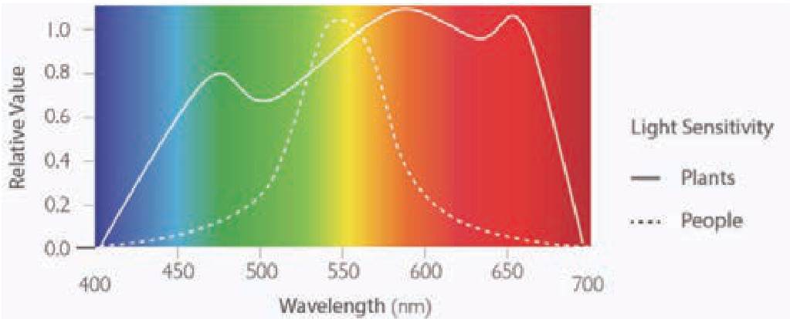  
图32 绿色植物与人眼对不同波长光的敏感度(图片来自PL Light Systems)

440-700nm光谱范围内的光子数量对植物尤为重要。这部分光的能量称为光合有效辐射(PAR, Photo Active Radiation)。PAR中的光粒子(光子)流称为光合光子通量(PPF, Photosynthetic photon flux)，以μmol/s计量。到达每平方米的光子流量称为光合光子通量密度(PPFD, Photosynthetic photon flux density)。

评估适用灯具时有两个重要效率指标：对植物而言是μmol/(W·s)=μmol/J，对人眼而言是lm/W或lux/W。表29显示了不同光源的PAR占比、PPF大小和lux值，这些数据可用于计算特定光源产生的光量。

表29 不同光源的PAR值、PPF值和流明值

| 计算单位 | 辐射→PAR a 瓦特/瓦特 | 辐射→PPF b μmol/j | 辐射→lux c 流明/瓦特 |
|---------|----------------|------------|------------|
| 平均日光(Daylightaverage) | 0.45 | 2.07 | 116 |
| 阴天日光(Daylight cloudy) | 0.46 - 0.53 | 1.93 - 2.23 | 108 - 125 |
| 晴天日光(Daylight sun) | 0.40 - 0.45 | 1.84 - 1.07 | 103 - 118 |
| 夏季日光(Light summer day) | 0.36 | 1.66 | 91 |
| 晴朗蓝天(Clear blue sky) | 0.57 | 2.39 | 124 |
| 灯泡(Light bulb) | 0.064 - 0.076 | 0.33- 0.39 | 16-19 |
| 高压钠灯(SON-T) | 0.35 | 1.72 | 142 |
| 农业高压钠灯(SON-T Agro) | 0.39 | 1.91 | 161 |
| 增强高压钠灯(SON-T Plus) | 0.39 | 1.95 | 166 |
| LED灯(HPI_T LED) | 0.36 | 1.62 | 134 |
| | | 1.90-2.30 | |

a 辐射(W/m²)转换为PAR(W/m²)，每瓦特辐射的PAR瓦特值  
b 辐射(W/m²)转换为PPF(μmol/(s·m²))，每焦耳辐射的PPF微摩尔值  
c 辐射(W/m²)转换为lux(流明/m²)，每瓦特辐射的流明值  

PPF总量以mol/m²为单位测量。计算方法是将每平方米的PPF值乘以时间(秒)。例如8小时光照，平均200W/m²的计算方法如下：

时间(秒) × 辐射(W/m²) × PPF计算因子(μmol/(W·s)) = PPF总量(mol/m²)  
8 × 3600 × 200 × 2.07 × 10⁻⁶ = 11.9 (mol/m²)

# 3.6 水分

水分是植物最重要的元素之一。良好的灌溉对植物生长和产量至关重要。因此需要了解并应用决定作物吸收、作物对水质要求以及如何优化这些点的因素。

# 3.6.1 作物需水量

作物水分吸收取决于多种因素。约10%的水分用于生长，其余通过植物蒸腾作用散失。表30列出了影响植物蒸腾作用的主要因素。太阳辐射和加热管道温度是影响植物蒸腾最重要的两个因素。不同作物间存在显著差异。

表30 影响作物蒸腾的直接和间接因素

| 直接因素 | 间接因素 |
|---------|----------|
| 辐射(Radiation) | 温室通风(Ventilation greenhouse) |
| 加热管道温度(Temperature heating pipes) | 室外温度(Outside temperature) |
| 空气流动(Airmovement) | 室外湿度(Outside humidity) |
| 温室温度(Greenhouse temperature) | 叶面积(Leaf area) |
| 温室内空气湿度(Humidity greenhouse air) | 基质含水量(Moisture content substrate) |
| 叶片温度(Leaf temperature) | |
| 二氧化碳浓度(CO2 concentration) | |

作物可按用水量分为四个等级(表31)。

表31 四种用水等级(升/(平方米·年))及对应作物

| 低用水量 <550 | 中等用水量 550-750 | 高用水量 750-950 | 极高用水量 950-1100 |
|---------|------------|----------|------------|
| 茴香(Fennel) 苤蓝(KohIrabi) 甜菜(Beet) 胡萝卜(Carrot) 欧芹(Parsley) | 菊苣(Endive) 芦笋(Asparagus) 西兰花(Broccoli) 豌豆(Peas) 韭葱(Leek) | 萝卜(Radish) 生菜(Lettuce) 夏季花卉(Summer flowers) | 茄子(Aubergine) 甜瓜(Melon) |
| 芹菜(Celery) 菠菜(Spinach) 白甘蓝(White Cabbage) 野苣(Lambs lettuce) | | | 孤挺花(Amaryllis) 小黄瓜(Gherkin) 玫瑰(Rose) 黄瓜(Cucumber) |
| 香草(Herbs) 花椰菜(Cauliflower) 春葱(Spring onion) | | | |
| 甜椒(Paprika/Pepper) 红花菜豆(Runner bean) | | | |
| 大黄(Rhubarb) 银莲花(Anemone) 大戟(Euphorbia) | 大白菜(Chinese cabbage) 西葫芦(Courgette) 其他蔬菜(Other vegetables) 浆果(Soft fruit) 根芹菜(Celeriac) 小白菜(Bok Choy) | 康乃馨(Carnation) 布瓦迪亚(Bouvardia) 非洲菊(Gerbera) 剑兰(Gladiolus) 满天星(Gypsophila) 地栽百合(Lily in soil) 其他观赏植物(Other ornamentals) 郁金香(Tulip) | 青豆(Green bean) 番茄(Tomato) 紫菀(Aster) 菊花(Chrysanthemum) 地栽鸢尾(Iris soil) 母菊(Matricaria) |

作物需水量的计算和规划很复杂。瓦赫宁根大学与研究中心的温室园艺业务部门开发了蒸发模型。

表32显示了鹿特丹气象站过去10年各月的平均日辐射量、月降雨量和最大日降雨量(2002-2011年)。

表32 鹿特丹气象站数据：各月平均日辐射量、月降雨量和最大日降雨量

| 月份 | 平均日辐射量 J/(cm²·天) | 月降雨量 mm/月 | 最大日降雨量 mm/天 |
|-----|----------------|------------|------------|
| 2月 | 441 | 71 | 22 |
| 3月 | 922 | 54 | 20 |
| 4月 | 1550 | 35 | 34 |
| 5月 | 1777 | 63 | 33 |
| 6月 | 1988 | 58 | 25 |
| 7月 | 1805 | 94 | 75 |
| 8月 | 1478 | 120 | 48 |
| 9月 | 1094 | 69 | 34 |
| 10月 | 640 | 76 | 30 |
| 11月 | 284 | 83 | 33 |
| 12月 | 180 | 83 | 33 |
| 年平均 | 1036 | 877 | |
| 最高值 | 1120 | 994 | |
| 最低值 | 1003 | 605 | |

# 3.6.2 水质

本章参考了Voogt, W. (2008)和Sonneveld, C.与Voogt, W. (2009)的研究。

# 3.6.2.1 必要分析

在种植作物前了解灌溉水的化学成分很重要。不同类型水的重要检测指标如下：

雨水：电导率(EC)、钠(Na)、氯(Cl)、锌(Zn)  
自来水：电导率(EC)、钠(Na)、氯(Cl)、钙(Ca)、镁(Mg)、硫酸根(SO₄)、碳酸氢根(HCO₃)  
泉水/地下水：电导率(EC)、pH值、钠(Na)、氯(Cl)、铵(NH₄)、钾(K)、钙(Ca)、镁(Mg)、硝酸根(NO₃)、硫酸根(SO₄)、碳酸氢根(HCO₃)、总铁(Fe-tot.)、锰(Mn)、锌(Zn)、硼(B)、铜(Cu)、硅(Si)和甲烷(CH₄)  
淡化水：电导率(EC)、碳酸氢根(HCO₃)、硼(B)  
地表水：电导率(EC)、pH值、钠(Na)、氯(Cl)、铵(NH₄)、钾(K)、钙(Ca)、镁(Mg)、硝酸根(NO₃)、硫酸根(SO₄)、碳酸氢根(HCO₃)、总铁(Fe-tot.)、锰(Mn)、锌(Zn)、硼(B)、铜(Cu)

根据水质数据可以计算营养液配方(Sonneveld和Voogt, 2009)。

表33 温室园艺灌溉水电导率(EC)、钠(Na)和氯(Cl)分类标准*

| 质量等级 | 电导率(EC) mS/cm | 钠(Na) mmol/l | 氯(Cl) mmol/l |
|---------|----------------|----------------|----------------|
| 1.1 | <0.5 | <0.2 | <0.2 |
| 1.2 | <0.5 | 0.2-0.5 | 0.2-0.5 |
| 1.3 | <0.5 | 0.5-1.0 | 0.5-1.0 |
| 2.1 | <0.5 | <1.0 | <1.0 |
| 2.2 | <0.5 | 1.0-2.0 | 1.0-2.0 |
| 2.3 | <0.5 | 2.1-3.5 | 2.1-3.5 |
| 3.1 | 0.5-1.0 | <1.5 | <1.5 |
| 3.2 | 0.5-1.0 | 1.5-3.0 | 1.5-3.0 |
| 3.3 | 0.5-1.0 | 3.0-4.5 | 3.0-4.5 |
| 4.1 | 1.0-1.5 | <1.5 | <1.5 |
| 4.2 | 1.0-1.5 | 1.5-3.0 | 1.5-3.0 |
| 4.3 | 1.0-1.5 | 3.0-4.5 | 3.0-4.5 |

*若钠(Na)和氯(Cl)浓度不一致，则以两者中较高值对应的等级为准

# 3.6.2.2 电导率(EC)、钠(Na)和氯(Cl)

在基质栽培中，灌溉水应仅含有有限浓度的钠(Na)和氯(Cl)。由于根系体积有限，容易发生积累并很快超过限值。对于排水循环利用的基质栽培（荷兰强制要求），适用更严格的标准，这些标准基于作物吸收水平。对于土壤栽培，由于土壤具有更高的缓冲能力，允许的浓度可以更高。电导率(EC)值只是水质的大致指标，因为其他离子也会影响EC值。例如营养元素(1、钙(Ca)、镁(Mg))的水平不应过高，但EC值是所有存在离子的综合结果。已为不同作物和营养管理系统制定了标准。表34展示了灌溉水质量等级的整体分类。

表34 灌溉水质量主类和子类分类

| 子类 | 主类1 循环排水基质栽培(Substrate with recirculation drain water) | 主类2 自由排水基质栽培(<20%排水)(Substrate with free drainage) | 主类3 自由排水基质栽培(>20%排水)(Substrate with free drainage) | 主类4 土壤栽培(Soil crops) |
|------|--------------------------------|--------------------------------|--------------------------------|----------------------|
| 1    | 适合所有作物 | 适合所有作物 | 适合所有作物 | 适合所有作物 |
| 2    | 适合盐敏感作物 | 适合盐敏感作物 | 适合盐敏感作物 | 适合盐敏感作物 |
| 3    | 适合耐盐作物或高钠吸收能力作物 | 适合耐盐作物 | 适合耐盐作物，无滴灌的土壤作物 | 适合耐盐作物，无滴灌的土壤作物 |

# 3.6.2.3 盐敏感作物

作物的盐敏感性由产量损失程度和/或植物对盐的特殊反应决定。不同作物的敏感性差异很大，可能表现为对总盐浓度或渗透压的整体敏感性，也可能针对特定离子。产品特性也起重要作用，例如观赏植物由于高盐含量会快速影响与花朵或叶片大小相关的观赏价值，因此耐受限度较低。高盐还可能导致特定植物部位出现灼伤或脱水等特殊症状。

盐敏感性分类与作物对钠(Na)和氯(Cl)的吸收能力无关。例如玫瑰(Rose)对盐中度敏感，但几乎不吸收任何钠离子。

表35 作物耐盐性分类

|  | 高度敏感 | 敏感 | 耐盐 |
|---|---|---|---|
| 蔬菜类 | 菜豆(Bean) | 黄瓜(Cucumber) | 番茄(Tomato) |
|  | 草莓(Strawberry) | 甜椒(Sweet pepper) | 菠菜(Spinach) |
|  |  | 茄子(Aubergine) | 苦苣(Endive) |
|  |  | 甜瓜(Melon) | 萝卜(Radish) |
|  |  | 生菜(Lettuce) | 野苣(Lambs lettuce) |
| 花卉类 | 红掌(Anthurium) | 非洲菊(Gerbera) | 康乃馨(Carnation) |
|  | 大花蕙兰(Cymbidium) | 朱顶红(Hippeastrum) | 大戟(Euphorbia fulgens) |
|  |  | 六出花(Alstroemeria) | 满天星(Gypsophila) |
|  |  | 玫瑰(Rose) | 小苍兰(Freesia) |
|  |  |  | 银莲花(Anemone) |
|  |  |  | 郁金香(Tulip) |
|  |  | 菊花(Chrysanthemum) |  |
|  |  | 波瓦第木(Bouvardia) |  |

# 3.6.2.4 钙(Ca)、镁(Mg)、硫酸盐(SO4)和碳酸氢盐(HCO3)

钙(Ca)、镁(Mg)和${ \mathsf { S O } } _ { 4 }$是作物所需的营养元素。然而，当它们在灌溉水中的含量超过作物需求或吸收浓度时，会在基质或土壤中积累。此外，过高的钙和镁含量会与(重)碳酸盐形成沉淀，而钙还能与硫酸盐形成沉淀，从而带来潜在问题。因此，只有当钙、镁和SO4含量超过特定限值时才会产生危害。表36展示了整体评估结果。在制定肥料配方时，必须考虑这些元素的含量水平。

对于基质栽培作物，营养液配方需要根据所用灌溉水的化学组成进行调整。这主要涉及对钙(Ca)、$\mathsf { M } \mathsf { g }$和${ \mathsf { S O } } _ { 4 }$的调整，某些情况下也可能需要调整钾(K)或${ \mathsf N } { \mathsf O } _ { 3 }$的含量。这些调整是必要的，否则这些离子可能在根际环境中积累，导致离子平衡改变，从而阻碍某些元素的吸收。因此营养液必须根据水中存在的钙、镁和$S { \mathsf { O } } ^ { 4 }$进行校正，并可选地对钾或${ \mathsf N } { \mathsf O } _ { 3 }$进行调整。此外，灌溉水中各元素的含量不应高于所栽培作物建议标准营养液中的浓度。通常这些限值是基于最敏感作物(即对钙、镁和${ \mathsf { S O } } _ { 4 }$需求最低的作物)的临界值确定的。

根际碳酸氢盐(HCO3)的积累会导致pH值升高。可以通过在营养液中添加与HCO3等量的酸来避免这种情况。当HCO3含量> $> 5 \mathsf { m m o l } / | \mathsf { H C O } _ { 3 } \$时，由于需要大量硝酸进行中和，这种水从经济角度考虑已不适用。当含量$> 8$ mmol/l时，除非在缓冲罐中进行预酸化处理，否则技术上无法获得稳定的栽培环境。当含量> $1 0 \mathrm { \ m m o l / l }$时，这种水完全不适用，因为需要添加的酸性离子( ${ \mathsf { N O } } _ { 3 }$和${ \sf H } _ { 2 } { \sf P } { \sf O } _ { 4 }$ )已超出营养液的适宜范围。

# 3.6.2.5 微量元素

某些类型的水中锰(Mn)、锌(Zn)、硼(B)或铜(Cu)的浓度过高，当用于根系体积有限的作物时，会导致过量积累。这会限制其他元素的吸收并产生毒性风险。从镀锌钢温室收集的雨水中可能含有过量的锌(Zn)。

此外，泉水/地下水可能含有过多的锰(Mn)、锌(Zn)或硼(B)。通常灌溉水中的浓度不应高于建议标准营养液的水平。对于有排水系统的栽培，这些水平可以略高。表36显示了最佳最大值。

表36 四种栽培介质灌溉水中钙(Ca)、镁(Mg)、硫酸盐(SO4)(mmol/l)和微量元素(µmol/l)的通用上限值。具体作物的限值可参考各作物标准营养液配方。

| 元素 | 循环排水基质栽培(Substrate with recirculation drain water) | 自由排水基质栽培(<20%排水)(Substrate free drainage) | 自由排水基质栽培(>20%排水)(Substrate free drainage) | 土壤栽培(In soil in ground) |
|------|------------------------------------------------|------------------------------------------------|------------------------------------------------|--------------------------|
| 钙(Ca) | <2 | 2-3 | 3-5 | 6 |
| 镁(Mg) | <0.5 | 0.5-0.75 | 0.75-1.5 | 2 |
| 硫酸盐(SO4) | <0.75 | 0.75-1.5 | 1.5-3 | 5 |
| 铁(Fe)* | - | - | - | - |
| 滴灌(Drip irrigation) | <5 | <5 | <5 | <5 |
| 低位喷灌(Overhead irrigation low) | <10 | <10 | <10 | <200 |
| 高位喷灌(Overhead irrigation high) | 不适用(n.v.t.) | 不适用(n.v.t.) | 不适用(n.v.t.) | <50 |
| 锰(Mn) | <10 | <15 | <15 | <50 |
| 锌(Zn) | <4 | <7 | <10 | <50 |
| 硼(B) | <10 | <20 | <50 | <100 |
| 铜(Cu) | <0.5 | <0.7 | <1.0 | <5 |
| 钼(Mo) | <1 | <1 | <1 | 未知(unknown) |

*总铁含量

# 3.6.2.6 铁(Fe)

铁通常存在于泉水/地下水中，几乎总是以${ \mathsf { F e } } 2 +$形式存在，接触空气后会氧化为$\mathsf { F e } 3 +$。这会导致氧化铁沉淀，可能堵塞灌溉系统。若将含铁水用于滴灌系统，必须进行除铁处理，使水中铁含量降至$5 \mu \mathrm { m o l }$/升。若水中含有有机物，总铁含量可允许$1 0 \mathbin { \dot { \mathrm { ~ a ~ } } } 2 0 \mathbin { \mu \mathrm { m o l } / \mu }$。对于采用喷灌的作物，铁含量最高可达$1 0 0 \ \mu \mathrm { m o l }$/升。

# 3.6.2.7 硅(Si)和甲烷(CH4)

若作物需要补充硅，建议检测泉水/地下水中的硅含量。草莓栽培用水硅含量不得超过0.5 mmol/l。对白化果实敏感的品种(取决于苗圃)，硅含量应低于0.2 mmol/l。若含硅水储存在池塘中可能导致硅藻生长，此时硅含量必须低于0.1 mmol/l。

泉水/地下水常含甲烷，反渗透脱盐处理不能充分去除CH4，因此甲烷细菌可能在净化水中大量繁殖，导致滴头系统严重堵塞。为防止滴头堵塞，甲烷含量应低于0.1 mg/l。

# 3.6.2.8 氟化物(F)

氟化物会对球茎类作物(特别是小苍兰和百合)造成伤害。水中氟化物浓度限值为25 µmol/l。其他作物的预防性限值为50 µmol/l。

# 3.6.3 用水成本

在地表水或浅层地下水水质不足的地区，通常需要建造雨水收集池。法律规定最小蓄水池容量为$5 0 0 m ^ { 3 } / \hslash \sf a$，但该容量无法满足全部用水需求。因此除蓄水池外还需确保其他水源，可选方案包括：深层泉水/地下水、反渗透处理水和自来水净化。

表37显示了雨水可满足作物需水量的百分比。表32显示了年降雨量差异，不同地区也存在差异。这意味着雨水供给量会随年份和地区变化，因此通常需要补充水源。

表37 不同蓄水池(Reservoir)容量和作物需水量下雨水供给比例估算(基于荷兰气象局KNMI 2002-2011年鹿特丹测量点平均降雨量)

| 蓄水池容量(m³/ha) 作物需水量(升/平方米·年) | 500 | 1,000 | 1,500 | 2,000 | 2,500 | 3,000 |
|--------------------------------------------|-----|-------|-------|-------|-------|-------|
| 750 | 70% | 80% | 85% | 90% | 95% | 95% |
| 800 | 70% | 75% | 80% | 85% | 90% | 90% |
| 850 | 65% | 75% | 80% | 85% | 85% | 85% |
| 900 | 65% | 70% | 75% | 80% | 80% | 80% |
| 950 | 60% | 65% | 70% | 75% | 75% | 75% |

蓄水池所需表面积取决于容量、形状、深度以及墙体高度和宽度。深度取决于地下水位。表38展示了蓄水池所需面积。由于始终存在泄漏风险，假定蓄水池被分隔为最大5,000立方米的隔间。

表38 不同容量和深度的雨水蓄水池(Reservoir)所需面积(m²)估算

| 蓄水池深度(m) | 容量1,000m³ | 2,000m³ | 3,000m³ | 4,000m³ | 5,000m³ | 10,000m³ | 15,000m³ |
|---------------|------------|---------|---------|---------|---------|----------|----------|
| 1.5 | 900 | 1,650 | 2,400 | - | - | - | - |
| 2 | 700 | 1,250 | 1,850 | 2,350 | 2,950 | 5,700 | 8,550 |
| 2.5 | 500 | 950 | 1,400 | 1,900 | 2,350 | 4,650 | 6,950 |
| 3 | - | - | - | 1,550 | 1,900 | 3,900 | 5,800 |
| 3.5 | - | - | - | - | 1,600 | 3,400 | 5,150 |

筒仓(Silos)因无宽墙而具有不同表面积。高度由水压和筒仓埋地深度决定。净表面积如下表所示。

表39 不同尺寸和高度雨水筒仓(rainwater silos)的净表面积估算

| 容量(m³) | 高度(m) | 直径(m) | 表面积(m²) |
|---------|--------|--------|-----------|
| 25 | 3.0 | 3.3 | 8 |
| 25 | 3.5 | 3.0 | 7 |
| 25 | 4.0 | 2.8 | 6 |
| 50 | 3.0 | 4.6 | 17 |
| 50 | 3.5 | 4.3 | 14 |
| 50 | 4.0 | 4.0 | 13 |
| 125 | 4.0 | 6.3 | 31 |
| 125 | 4.5 | 5.9 | 28 |
| 125 | 5.0 | 5.6 | 25 |
| 250 | 4.0 | 8.9 | 63 |
| 250 | 4.5 | 8.4 | 56 |
| 250 | 5.0 | 8.0 | 50 |
| 500 | 4.0 | 12.6 | 125 |
| 500 | 4.5 | 11.9 | 111 |
| 500 | 5.0 | 11.3 | 100 |
| 1000 | 4.0 | 17.8 | 250 |
| 1000 | 4.5 | 16.8 | 222 |
| 1000 | 5.0 | 16.0 | 200 |

成本计算需考虑以下要点：
• 需水量
• 水质
• 雨水可用性及其对需求量的覆盖程度
• 排水系统
• 建造蓄水池导致的生产面积损失

下表展示了一个4公顷苗圃(nursery)的水成本计算示例，该苗圃用水需求为900升/平方米。计算了每公顷使用3000立方米蓄水池(reservoir)时的水成本，其中80%需求由雨水满足，剩余20%使用自来水。计算时分别考虑了蓄水池占用温室位置导致的利润损失和不考虑该损失两种情况。

表40 4公顷苗圃不同尺寸雨水收集池的水成本计算示例

| 4公顷用水需求 需求覆盖率 | 36000m³ 70% 4000m³ | 36000m³ 75% 8000m³ | 36000m³ 80% 12000m³ |
|-------------------------|-------------------|-------------------|-------------------|
| 收集池尺寸 | | | |
| 投资: | | €35.000 | |
| 收集池(Reservoir) 土地(Land) | €20.000 | €105.000 | €45.000 €180.000 |
| | €57.000 | €140.000 | |
| | €77.000 | | €225.000 |
| 年度成本: | | | |
| 利息、维护、折旧(Interest,maintenance,depreciation) | €3.500 | €6.125 | €7.875 |
| 土地利息(Interest land) | €1.140 | €2.100 | €3.600 |
| 自来水€1/m3(Mainswater) | €10.800 | €9.000 | €7.200 |
| 年度总成本(Total annual cost) | €15.440 | €17.225 | €18.675 |
| 不含利润损失的水成本(Cost water per m³ without loss of profit) | €0,43 | €0,48 | €0,52 |
| 温室面积减少导致的利润损失(Loss of profit due to less greenhouse area 0,50 €/m²) | €950 | €1.750 | €3.000 |
| 含利润损失的水成本(Cost water per m³ with loss of profit) | €0,46 | €0,53 | €0,60 |

每家企业的这些投资会因地理位置和业务结构而异。因此建议在前述示例中使用您企业特定的数据。

# 3.7 生产设备

本节描述了温室行业最常见生产设备的重置价值（也称重置价格）。新价值基于2015年12月的价格水平，并参考温室建造商、安装商、制造商、顾问和供应商的估算。所有新价值均不含增值税，并尽可能适用于4公顷（200米×200米）的苗圃规模。补贴未计入考量，因为这些补贴完全取决于个体情况。折旧按重置价值（重置成本）的固定百分比计算，不考虑残值。基于这些标准，已计算出相应的折旧率并用于表格中。表41还包含了各种生产设备的维护费率。同样重要但未提及的是利率，设定为每年2%。对于生产设备的利息成本，该百分比按设备使用寿命期间的平均价值计算。

表41 温室园艺生产设备的新投资价值、折旧率和维护成本

| 重置价值(€) | 从(€) | 到(€) | 单位 | 折旧率 | 维护费 |
|------------|------|------|-----|-------|-------|
| 农场设备项目(2018年12月价格水平)(Farm equipment items price level 12-2018) | | | | | |
| 温室和建筑物(Greenhouses and buildings) | | | | | |
| 文洛温室(Venlo Greenhouses) | | 42.00 | /m² | 7% | 0.5% |
| 标准文洛温室(Standard Venlo greenhouse) | 37.00 | | | | |
| - 40,000平方米(200×200米) | | | | | |
| - 8.00米格构梁(2个4米屋顶段) | | | | | |
| - 6.50米檐槽高度 | | | | | |
| - 5.00米分区尺寸 | | | | | |
| - 涂层铝制檐槽 | | | | | |
| - 1.25米屋顶玻璃 | | | | | |
| - 固定混凝土基础 | | | | | |
| - 铝制屋顶 | | | | | |
| - 单层玻璃侧墙 | | | | | |
| - 半自动屋顶框架轨道通风带2扇半尺寸通风窗 | | | | | |
| - 西欧安全玻璃90%+ | | | | | |
| - 雨水排放 | | | | | |
| - 冷凝水排放 | | | | | |
| 标准文洛温室(相同但9.6米格构梁)(Standard Venlo greenhouse, the same but - 9,60 m lattice girder) | 39.00 | 44.00 | /m² | 7% | 0.5% |
| 标准文洛温室(相同但12米格构梁)(Standard Venlo greenhouse, the same but - 12 m lattice girder) | 40.00 | 45.00 | /m² | 7% | 0.5% |
| 额外价格：0.5公顷标准文洛温室(Extra price: Standard Venlo greenhouse 0.5 ha) | 7.00 | 8.00 | /m² | 7% | 0.5% |
| 额外价格：1公顷标准文洛温室(Extra price: Standard Venlo greenhouse 1 ha) | 3.00 | 4.00 | /m² | 7% | 0.5% |
| 额外价格：2公顷标准文洛温室(Extra price:Standard Venlo greenhouse 2 ha) | 0.75 | 1.00 | /m² | 7% | 0.5% |
| 额外价格：10公顷标准文洛温室(Extra price: Standard Venlo greenhouse 10 ha) | 0.00 | -1.00 | /m² | 7% | 0.5% |
| 额外价格：20公顷标准文洛温室(Extra price: Standard Venlo greenhouse 20 ha) | 0.00 | -1.50 | /m² | 7% | 0.5% |
| 额外价格：檐槽高度7米(标准6.5米)(Extra price: Standard Venlo greenhouse with gutter height of 7 m) | 2.00 | 2.50 | /m² | 7% | 0.5% |
| 额外价格：檐槽高度增加25厘米(Extra price for an extra gutter height of 25 cm) | 0.95 | 1.00 | /m² | 7% | 0.5% |
| 额外价格：分区尺寸4.5米(标准5米)(Extra price: Standard Venlo greenhouse with a section size of 4,5 m) | 0.50 | | /m² | 7% | 0.5% |
| 额外价格：粉末涂层钢结构(不含檐槽)(Extra price: powder coated steel construction) | 1.50 | | /m² | 15% | 1% |
| 额外价格：6.40/8.00米格构梁(Extra price: 6,40/8,00 m lattice girder) | 1.00 | | /m² | 7% | 0.5% |
| - 3扇半尺寸通风窗 | 0.00 | 0.25 | /m² | 7% | 0.5% |
| 通风窗防虫网(含网、安装和更换)：现有文洛温室(Insect netting in ventilation windows:consisting Venlo greenhouse) | | | | | |
| 1扇窗 | 90.00 | 110.00 | /vent | 20% | 2% |
| 2扇窗 | 95.00 | 115.00 | /vent | 20% | 2% |
| 3扇窗 | 100.00 | 125.00 | /vent | 20% | 2% |
| 通风窗防虫网(含网、安装和更换)：新文洛温室(Insect netting in ventilation windows:new Venlo greenhouse) | 6.00 | 7.50 | /m² | 20% | 2% |
| 大跨度温室(Wide span greenhouses) | 48.00 | 52.00 | /m² | 7% | 0.5% |
| 大跨度温室-40,000平方米(Wide span greenhouse - 40.000 m²) | | | | | |

- 5.00米分区尺寸 - 1.125米屋顶玻璃 - 固定混凝土基础 - 铝制屋顶和侧墙 - 镀锌钢结构

| 项目 | 从(€) | 到(€) | 单位 | 折旧率 | 维护费 |
|------|------|------|-----|-------|-------|
| AI顶部通风-1.40米窗高 | | | | | |
| 大跨度温室(相同但)(Wide span greenhouse,the same but) | 46.00 | 49.00 | /m² | 7% | 0.5% |
| - 半自动单侧屋顶通风 | 20.00 | 22.50 | /m² | 7% | 0.5% |
| 额外价格：屋顶双层聚碳酸酯板(Extra price: double polycarbonate panes in roof) | 9.00 | 10.00 | /m²侧边 | 7% | 0.5% |
| 额外价格：侧墙2x单层玻璃(Extra price: 2x single glass in side wall) | 4.00 | 4.50 | 温室墙/m² | 20% | 2% |
| 通风窗防虫网(含网、安装和更换)：新大跨度温室双侧通风(Insect netting in ventilation windows (incl. netting, assembling and chancing's):new Wide span greenhouse 2 side ventilation) | 2.50 | 3.00 | 温室面积/m² | 20% | 2% |
| 通风窗防虫网(含网、安装和更换)：新大跨度温室单侧通风(Insect neting in ventilation windows (incl. netting, assembling and chancing's): new Wide span greenhouse 1 side ventilation) | 2.50 | 3.00 | 面积 | 20% | 2% |
| 所有温室防虫网(Insect netting) | 2.00 | 4.00 | /m² | 20% | 2% |
| 额外价格基础桩：(Extra price foundation pile:) | | | 网 | | |
| 3米 | 0.25 | | /m²温室 | 7% | 0.5% |
| 6米 | 0.50 | | 面积/m²温室 | 7% | 0.5% |
| 9米 | 1.00 | | /m²温室面积 | 7% | 0.5% |
| 12米 | 2.00 | | /m²温室面积 | 7% | 0.5% |
| 温室基础隔热板(Insulation board greenhouse base) | 9.50 | 13.00 | /个 | 7% | 0.5% |
| 玻璃(Glass) | | | | | |
| 4mm浮法玻璃LT89%+未钢化(Floated glass 4mm LT89%+ un-tempered) | 5.50 | 6.50 | /m²玻璃 | 7% | 0.5% |
| 额外价格4mm钢化浮法玻璃LT89+%(Extra price tempered glass float 4mm LT89+%) | 7.00/3.00 | 8.00/6.00 | /m²玻璃 | 7% | 0.5% |
| 4mm钢化漫射玻璃(或低雾度/中雾度/高雾度)带双面防反射处理(Tempered diffuse (or Low Haze or Medium Haze or High Haze) 4mm with 2-sided Anti-Reflex treatment) | 4.50/13.50 | 5.50/18.00 | /m²玻璃 | 7% | 0.5% |
| (注：基于花纹玻璃)(PS = On the basis of figured glass) | | | | | |
| 塑料温室/隧道(Plastic greenhouses, tunnel) | | | | | |
| 可拆卸通道式塑料温室隧道(Removable walk through plastic greenhouse tunnel) | 8.00 | 9.00 | /m² | 15% | 2.0% |
| - 6.00米宽 | | | | | |
| - 2.60/3.00米高 | | | | | |
| - 32毫米弓形管 | | | | | |
| - 螺旋锚基础 | | | | | |
| - 含顶部管和前侧支撑管 | | | | | |
| - 不含薄膜 | | | | | |

| 重置价值(€) | 从(€) | 到(€) | 单位 | 折旧率 | 维护费 |
|------------|------|------|-----|-------|-------|
| 农场设备项目(2018年12月价格水平)(Farm equipment items price level12-2018) | | | | | |
| 圆形侧壁塑料温室隧道(Plastic greenhouse tunnel with round side wall) | 15.00 | 16.00 | /m² | 15% | 2.0% |
| - 9.30米宽 | | | | | |
| - 3.70米高 | | | | | |
| - 60毫米弓形管 | | | | | |
| - 十字板基础 | | | | | |
| - 侧壁通风 | | | | | |
| - 不含薄膜 | 25.00 | | | | 2.0% |
| 垂直侧壁塑料温室隧道(Plastic greenhouse tunnel with vertical side wall) | | 30.00 | /m² | 15% | |
| - 6.40/8.00/9.60/10.00米宽 | | | | | |
| - 3.40/3.70/3.90/4.90米高 | | | | | |
| - 60毫米弓形管 | | | | | |
| - 混凝土桩基础 | | | | | |
| - 侧壁通风(顶部通风可选) | | | | | |
| - 不含薄膜 | | | | | |
| 薄膜(Foils) | 1.60 | | /m² | 30% | 5% |
| 遮阳设施(Shadow halls) | | | | | |
| 镀锌钢结构遮阳棚(完整组装)(Shadow hall, galvanized steel construction, complete assembled) | 8.50 | 10.00 | /m² | 15% | 2% |
| 遮阳-遮光网(Shadow - light screening netting) | 2.00 | 4.50 | /m² | 30% | 5% |
| 地面工程(Groundwork) | | | | | |
| 平整(沙/粘土/泥炭)<20厘米高差(Levelling,sand,clay or peat < 20 cm difference) | 0.20 | | /m² | 16.7% | |
| 平整(沙/粘土/泥炭)20-40厘米高差(Levelling,sand,clay or peat 20 - 40 cm difference) | 1.00 | 2.00 | /m² | 16.7% | |
| 轮廓成型(Profiling) | 0.15 | | /m² | 25% | |
| 铣削平整(Milling for levelling) | 0.15 | | /m² | 16.7% | |
| 压路平整(Rollers for levelling) | 0.05 | | /m² | 16.7% | |
| 地面、通道和场地(Floors, paths and farmyard) | | | | | |
| 地面找平(Equalisation ground) | 1.00 | | /m² | | |
| 混凝土抛光(Concrete polishing) | 4.00 | | /m² | | |
| 砂补充(Sand supplementation) | 25.00 | | /m³ | | |
| 10厘米砂补充(Sand supplementation 10 cm) | 2.50 | | /m² | | |
| 混凝土通道(2.5米宽,10厘米高,含钢筋网,找平和抛光)(Concrete path 2,5 m broad,10 cm high,incl. iron netting,equalisation and concrete polishing) | 25.00 | 30.00 | /m² | 7% | 1% |
| 混凝土地面(15厘米高,含钢筋网,保温,找平,抛光,塑料和排水)(Concrete floor,15 cm high,incl. concrete netting, insulation,equalisation,concrete polishing, plastics and drainage) | 36.00 | 40.00 | /m² | 7% | 1% |
| 混凝土地暖(通道)(每3.2米12根管)(Concrete floor heating (path) (12 tubes per 3,20 m)) | 4.25 | 5.00 | /m² | 7% | 1% |
| 潮汐系统混凝土地面(10厘米厚,含薄膜,钢筋网,垫块,B25混凝土,环境等级5c或5d,抛光,地暖)(Concrete floor,10 cm thick,ebb/flow system with foil,concrete netting,spacers,B25 concrete quality, environmental class 5 c or 5 d, polished,floor heating) | 24.00 | 27.00 | /m² | 7% | 1% |
| 斜坡排水地面(循环系统)(Floor with slope towards drain (recirculating)) | 7.00 | 8.00 | /m² | 7% | 1% |
| 熔岩地面+/-5厘米(循环系统)(Lava floor +/- 5 cm (recirculating)) | 10.00 | 11.50 | /m² | 7% | 1% |
| 熔岩地面(循环系统,叉车可通行)(Lava floor (recirculating and accessible by forklift truck)) | 11.00 | 12.50 | /m² | 7% | 1% |
| 潮汐系统熔岩/玄武岩地面(含分隔条)(Ebb and flow floor with lava/basalt including divider bars) | 14.00 | 16.00 | /m² | 7% | 1% |
| 遗产地面潮汐系统(不含水)(Erfgoedfloor with ebb and flow excluding water) | 18.00 | 25.00 | /m² | 7% | 1% |

| 重置价值(€) | 从(€) | 到(€) | 单位 | 折旧率 | 维护费 |
|------------|------|------|-----|-------|-------|
| 农场设备项目(2018年12月价格水平)(Farm equipment items price level 12-2018) | | | | | |
| 沥青场地(Asphalt yard) | 20.00 | 23.50 | /m² | 7% | 0.5% |
| 铺路(Paving) | 22.00 | 25.00 | /m² | 7% | 0.5% |
| 排水系统(Drainage) | | | | | |
| 塑料管道直接排水至沟渠(每3.2米一根软管)(Direct watering to ditch with plastic tubes and one hose each 3.20 m) | 1.00 | | /m² | 7% | 1% |
| 封闭系统(含集水坑、塑料排水管每3.2或4米一根、含集水坑和电动泵)(Closed system,with storage pit dewatering plastic tubes and one tube each 3.20 or 4 m,include storage pit and motor pump) | 1.25 | | /m² | 7% | 1% |
| 排水管(Ø6cm单层聚丙烯-450，不含排水槽填充)(Drainage (O6 cm single polypropylene-450,excl.drain slot fill)) | 2.00 | | /m | 7% | 1% |
| 排水沟垫层(聚苯乙烯颗粒)(Drain gutter padding (styromull grains)) | 0.85 | | /m | 7% | 1% |
| 主排水管(聚丙烯-450，Q12cm，含三通)(Main drain,polypropylene-450,Q12 cm (incl. T-pieces)) | 5.00 | | /m | 7% | 1% |
| 混凝土集水坑(含安装)(Concrete storage pit (incl. installation)) | 1,200 | 1,400 | /套 | 7% | 1% |

| 建筑(Buildings) |
| 标准温室棚(Standard greenhouse shed): - 12.80米×16.00米分区 - 4.50米檐沟高度 - 10厘米混凝土地面 - 1.55米半石墙 - 1.20米墙面玻璃 - 板桩墙 - 绝缘纤维水泥波纹板屋顶 |
| 100-300平方米 | 400-550欧元/平方米 |
| 300-500平方米 | 375-500欧元/平方米 |
| >500平方米 | 350-450欧元/平方米 |
| 装卸站和码头棚(Docking station and dock shelter) | 60,000-100,000欧元 | 7% |
| 温室棚(Greenhouse shed): - 钢结构 - 绝缘纤维水泥波纹板墙 - 绝缘纤维水泥波纹板屋顶 |
| <200平方米 | 200-240欧元/平方米 | 7% |
| >200平方米 | 180-220欧元/平方米 | 7% |
| 锅炉房(Boiler house): - 1.50米半石墙其余部分玻璃 - 绝缘纤维水泥波纹板屋顶 |
| <200平方米 | 225-250欧元/平方米 |
| 200-400平方米 | 215-240欧元/平方米 |
| >400平方米 | 200-220欧元/平方米 | 7% |
| 内部额外价格(Extra price interior):(淋浴间、卫生间、餐厅和办公室) | 450-650欧元/平方米 | 7% | 0.5% |
| 锅炉房内墙额外价格(Extra price internal wall in boiler house) | 100-120欧元/平方米墙 | 4% | 0.5% |
| -1.50米半石墙其余部分玻璃 | 90-110欧元/桩 | 4% | 0.5% |
| 额外价格:保温(Extra price:insulation) | 25-28欧元/平方米 | 4% | 0.5% |
| 额外价格:地暖(Extra price:floor heating) | 5-7欧元/平方米 | 4% | 0.5% |
| 额外价格:空心墙替代半石墙(Extra price: cavity wall instead of half stone wall) | 90-100欧元/平方米 | 4% | 0.5% |

| | 重置价值(€)(Replacementvalue) | | | | |
|---|---|---|---|---|---|
| | | | 单位(Unit) | 折旧率(Depre- ciation) | 维护费(Mainte- nance) |
| 农场设备项目(2018年12月价格水平)(Farmequipmentitems price level12-2018) 冷藏室(Cold store rooms) | 从(from) | 到(to) | | | |
| 棚内冷藏室安装(不含冷却单元，含保温)(Cold store installation in shed) 30平方米地面，3500毫米高度，100毫米面板 | | | | | |
| 固定冷藏室冷却单元(压缩机带蒸发单元，含安装和电气连接)(Cooling unit for fixed cold rooms) 储藏温度+2°C至+10°C | | | | | |
| 1.5千瓦(1,5 kW) | 5,500 | 6,000 | | 8% | 5% |
| 4千瓦(4 kW) | 7,250 | 7,750 | | 8% | 5% |
| 10千瓦(10kW) | 11,500 | 12,250 | | 8% | 5% |
| 可拆卸冷藏室(150毫米聚苯乙烯硬质泡沫PS20保温，含冷却器和蒸发器)(Demountable cold store) 棚内安装，储藏温度+2°C至+10°C，冷却单元温度-5°C至+40°C | | | | | |
| 60立方米(60 m³) | 17,000 | 18,000 | | 8% | 2.5% |
| 100立方米(100 m³) | 25,500 | 26,500 | | 8% | 2.5% |
| 200立方米(200m³) | 40,000 | 42,000 | | 8% | 2.5% |
| 300立方米(300m³) | 58,000 | 60,000 | | 8% | 2.5% |
| 滑动门-2200*2400毫米(宽*高)手动操作(Sliding doors) | 2,900 | 3,100 | 每套(/each) | 8% | 2.5% |
| 旋转门-950*2200毫米(Revolving door) | 800 | 900 | 每套(/each) | 8% | 2.5% |
| 维护合同(含强制CFC控制)(Maintenance contract) | 125 | 160 | 每年(/year) | | |

# 加热设备(HEATING INSTALLATION)

| 公用设施(Utilities) | 从(€) | 到(€) | 折旧率 | 维护费(€) |
|---------------------|------|------|-------|----------|
| **燃气连接(Gas connection)**（含计量表和外壳，维护费为连接费和表租） | | | | |
| < 100 Nm³/h | 15,800 | 22,800 | 7% | 250 |
| 100-160 Nm³/h | 15,700 | 23,100 | 7% | 250 |
| 160-250 Nm³/h | 18,700 | 24,700 | 7% | 600 |
| 250-650 Nm³/h | 21,000 | 24,700 | 7% | 600 |
| 650-1600 Nm³/h | 22,000 | 28,900 | 7% | 600 |
| **电力连接(Electricity connection)** | | | | |
| >3×80A至3×125A | | 4,300 | 7% | 70 |
| >3×125A至175 kVA | | 4,800 | 7% | 70 |
| >175 kVA至630 kVA | 7,000 | 34,500 | 7% | 640 |
| >630 kVA至1.000 kVA | 15,000 | 38,000 | 7% | 640 |
| >1.000 kVA至1.750 kVA | 22,500 | 48,000 | 7% | 640 |
| >1.750 kVA至3.000 kVA | 70,000 | 195,000 | 7% | 1,500 |
| >3.000 kVA至10.000 kVA | 170,000 | 266,000 | 7% | 7,500 |
| 4000 kVA变压器含外壳(Transformer 4000 kVA incl. housing) | 175,000 | 225,000 | 7% | 0.5% |
| **锅炉(Boilers)**（含燃烧器、烟囱、冷凝器电气、5个混合组、绝缘） | | | | |
| 1.16 MW | 53,000 | 63,000 | 7% | 1% |
| 1.74 MW | 58,000 | 69,000 | 7% | 1% |
| 2.32 MW | 71,000 | 84,000 | 7% | 1% |
| 3.48 MW | 83,000 | 97,000 | 7% | 1% |
| 4.64 MW | 91,000 | 107,000 | 7% | 1% |
| 5.80 MW | 100,000 | 120,000 | 7% | 1% |
| 9.28 MW | 129,000 | 154,000 | 7% | 1% |
| 额外混合组费用(Extra price for additional mix group department) | 2,250 | 2,500 | 7% | 1% |

| 农场设备项目(2018年12月价格水平)(Farm equipment items price level 12-2018) | 从(€) | 到(€) | 单位 | 折旧率 | 维护率 |
|---------------------------------|------|------|------|-------|-------|
| 压力膨胀容器(氮气)5立方米(Pressure expansion vessel (nitrogen) to 5 m3) | 1,500 | 1,700 | | 7% | 1% |
| 膨胀机(Expansion machine) | 12,000 | | | 7% | |
| 锅炉石(Boilers stones) | 800 | 18,000 | | 20% | 1% |
| 空气格栅(Air grilles) | 800 | | | 5% | 0.5% |

| 农场设备项目(2018年12月价格水平)(Farm equipment items price level 12-2018) | 从(€) | 到(€) | 单位 | 折旧率 | 维护率 |
|---------------------------------|------|------|------|-------|-------|
| 11 锅炉石(Boilers stones) | 2,000 800 | 10,000 | | 20% | 1% |
| 空气格栅(Air grilles) | 800 | | | 5% | 0.5% |
| 冷凝器和减速器(Condensers and retarders) | | | | | |
| 单冷凝器(Single condenser)(钢制带管或铝翅片，含温度计、排水盘、连接，不含混合组)(steel with pipes or aluminium fins,including thermometers,drain pan,connection,excl.mix group)锅炉容量: | | | | | |
| 2.32 MW | 12,500 | 13,500 | | 14% | 1% |
| 4.64 MW | 18,000 | 20,000 | | 14% | 1% |
| 9.28 MW | 23,500 | 26,500 | | 14% | 1% |
| 组合冷凝器(Combi condenser)(钢制带管或铝翅片，含温度计、排水盘、连接，不含混合组)(steel with pipes or aluminium fins,including thermometers,drain pan,connection,excl.mix group)锅炉容量: | | | | | |
| 1.16 MW | 10,500 | 12,500 | | 14% | 1% |
| 1.74 MW | 12,500 | 14,500 | | 14% | 1% |
| 2.32 MW | 14,000 | 17,500 | | 14% | 1% |
| 3.48 MW | 16,500 | 19,000 | | 14% | 1% |
| 4.64 MW | 20,500 | 24,000 | | 14% | 1% |
| 5.80 MW | 21,000 | 24,500 | | 14% | 1% |
| 6.96 MW | 21,500 | 25,000 | | 14% | 1% |
| 8.12 MW | 23,500 | 27,000 | | 14% | 1% |
| 9.28 MW | 25,000 | 28,500 | | 14% | 1% |
| 减速器(Retarder)锅炉容量: | | | | | |
| 2.32 MW | 700 | 850 | /锅炉 | 7% | 0.5% |
| 4.64 MW | 850 | 1,050 | /锅炉 | 7% | 0.5% |
| 9.28 MW | 1,250 | 1,450 | /锅炉 | 7% | 0.5% |
| 热电联产设备(总计)(Cogeneration plant (total)) | | | | | |
| 热电联产设备(Cogeneration plant): | | | | | |
| 0.50 MWe | 341k | 368k | | 60000小时 | 11.50€/MWh |
| 0.75 MWe | 368k | 410k | 60000小时 | 60000小时 | 10.50€/MWh |
| 1.0 MWe | 394k | 441k | 60000小时 | | 9.25€/MWh |
| 1.5 MWe | 536k | 588k | | | 7.30€/MWh |
| 2.0 MWe | 683k | 746k | 60000小时 | | 7.10€/MWh |
| 3.0 MWe | 1,050k | 1,210k | 60000小时 | | 6.95€/MWh |
| 4.0 MWe 热电联产烟气净化器(Flue gas cleaners at CHP power)(不含尿素维护)(maintenance without ureum) | 1,420k | 1,730k | 60000小时 | | 6.65€/MWh |
| 0.50 MWe | 89k 95k | 116k 121k | 10% 10% | | 2.00€/h 2.50€/h |
| 1.0 MWe | 100k | 137k | 10% | | 3.25€/h |
| 1.5 MWe | 121k | 163k | 10% | | 3.30€/h |
| 2.0 MWe | 137k | 179k | 10% | | 3.75€/h |
| 3.0 MWe | 152k | 189k | 10% | | 5.50€/h |
| 4.0 MWe | 210k | 263k | 10% | | 6.25€/h |
| COdiNOx烟气分析仪(COdiNOx flue gas analyser) | 16,000 | 20,000 | 10% | | 5% |
| 应急发电机(燃油)(Emergency powergenerator gasoil) | 15,500 | 17,500 | 5% | | 5% |

# 热泵(Heat Pump)

热泵(含声学和控制技术)制冷量(kW)

| 农场设备项目(2018年12月价格水平)(Farm equipment items price level 12-2018) | 从(€) | 到(€) | 单位 | 折旧率 | 维护率 |
|----------------------------------------------------------------------------|------|------|------|-------|-------|
| 1,200 | 131k | 255k | /台 | 7% | 1.5% |
| 1,500 | 163k | 296k | /台 | 7% | 1.5% |
| 2,500 | 236k | 459k | /台 | 7% | 1.5% |
| 3,000 | 268k | 571k | /台 | 7% | 1.5% |
| 4,500 | 357k | 745k | /台 | 7% | 1.5% |
| 6,000 | 420k | 734k | /台 | 7% | 1.5% |
| 7,500 | 468k | 816k | /台 | 7% | 1.5% |
| 木柴炉(Wood Stove) | | | | | |
| 生物质焚烧设备(完整安装和存储筒仓)(Biomass incineration plant) | | | | | |
| 0.5 MWth | 150k | 175k | | 10% | 10% |
| 1 MWth | 280k | 315k | | 10% | 10% |
| 地热(Geothermal) | | | | | |
| 启动成本(许可、钻井管理、钻井场地、自评估)(Start-up costs) | 555k | 1,360k | | 4% | |
| 双井钻井，(拆)装钻井设备 第1公里(Doublet drilling) | | | | | 5.0% |
| 第2公里(2nd km) | 1,000k | 2,000k | | 4% | 5.0% |
| 第3公里(3rd km) | 4,000k | 5,000k | | 4% | 5.0% |
| | 5,000k | 7,000k | | 4% 10% | 10.0% |
| 安装(热交换器、泵、管道、排水和冲洗，电力和油气分离，火炬)(Installation) | 915k | 2,130k | | | |
| SEI检测风险保险(SEI detection risk insurance) | 300k | 500k | | 4% | |
| 汽车保险(Car-insurance) | 200k | 500k | | 4% | |
| 水井/含水层(Well/aquifer) | | | | | |
| 水井/含水层容量(Well/aquifer capacity) | | | | | |
| 120 m³/h | 117k | 130k | /台 | 7% | 10,000 |
| 160 m³/h | 280k | 310k | /台 | 7% | |
| 200 m³/h | 380k | 420k | /台 | 7% | 11,200 |
| 400 m³/h | 665k | 740k | /台 | 7% | 17,600 |
| 600 m³/h | 950k | 1,060k | /台 | 7% | 24,000 |
| 800 m³/h | 1,240k | 1,380k | /台 | 7% | 30,400 |
| 1000 m³/h | 1,500k | 1,700k | /台 | 7% | 36,800 |
| 风力发电机，轮毂高度70m，叶片直径80m，2MW，1600MWh(Windmill) | 1,750k | 3,000k | | 7% | 11€/MWh |
| 轮毂高度80m，叶片直径90m，3MW，2100MWh | 2,250k | 4,500k | | 7% | 11€/MWh |
| 轮毂高度90m，叶片直径140m，5.5MW，5500MWh | 3,500k | 8,300k | | 7% | 11€/MWh |
| 太阳能板(Solar Panels) | | | | | |
| 1000 m² 155 peakW/m²,124 MWh | 120k | 200k | | 4% | 0.01 |
| 储热(Heat Storage) | | | | | |
| 储热罐(含连接、调节、膨胀扩展、混凝土和绝缘)(Heat storage tank) | | | | | |

| | 替换价值(€) | | | |
|-|------------|-|-|-|
| | 从 | 到 | 折旧率 | 维护率 |
| 农场设备项目(2018年12月价格水平)(Farm equipment items price level 12-2018) | | | | |
| 350立方米容量(350 m³ capacity) | 87,600 | 95,000 | 7% | 2% |
| 500立方米容量(500 m³ capacity) | 97,900 | 104,000 | 7% | 2% |
| 1000立方米容量(1.000 m³ capacity) | 185,400 | 200,000 | 7% | 2% |
| 4500立方米容量(4,500 m³ capacity) | 350,000 | 400,000 | 7% | 2% |

# 温室加热系统

| 项目 | 从(€) | 到(€) | 单位 | 折旧率 | 维护率 |
|------|------|------|------|-------|-------|
| **次管和主管(焊接和施工，管道固定在钢条或地面上)(Secondary and main pipes,welding and construction,tubes fixed to steel bars or on the floor)** | | | | | |
| 2×51mm/4米跨度(2 × 51 mm/4 m span) | 4.20 | 4.75 | /m² | 7% | 0.5% |
| 3×51mm/4米跨度(3 × 51 mm/4 m span) | 4.50 | 5.40 | /m² | 7% | 0.5% |
| 4×51mm/4米跨度(4 × 51 mm/4 m span) | 5.30 | 6.10 | /m² | 7% | 0.5% |
| 5×51mm/4米跨度(5 × 51 mm/4 m span) | 5.60 | 6.70 | /m² | 7% | 0.5% |
| 6×51mm/4米跨度(6 x 51 mm/4 m span) | 6.05 | 7.10 | /m² | 7% | 0.5% |
| **次管和主管(焊接和施工，管道固定在温室顶部)(Secondary and main pipes,welding and construction,tubes fixed at the top of the greenhouse)** | | | | | |
| 2×51mm/4米跨度(2 × 51 mm/4 m span) | 4.50 | 5.50 | /m² | 7% | 0.5% |
| 3×51mm/4米跨度(3 x 51 mm/4 m span) | 5.60 | 6.50 | /m² | 7% | 0.5% |
| 4×51mm/4米跨度(4 × 51 mm/4 m span) | 6.15 | 7.35 | /m² | 7% | 0.5% |
| 5×51mm/4米跨度(5 × 51 mm/4 m span) | 6.70 | 7.95 | /m² | 7% | 0.5% |
| 6×51mm/4米跨度(6 × 51 mm/4 m span) | 7.30 | 8.70 | /m² | 7% | 0.5% |
| 作物管道加热装置(2×28mm/4米)(Heating in crop pipe installation: (forcas) 2 x 28 mm/4 m) | 3.80 | 4.55 | /m² | 7% | 0.5% |
| 作物管道加热装置(2×32mm/4米)(Heating in crop pipe installation: 2 x 32 mm/4 m) | 2.25 | 2.70 | /m² | 7% | 0.5% |
| 提升加热:作物管道简单钢丝系统(Lifting heating: simple wire system for heating pipe in crop) | 2.25 | 2.75 | /m² | 7% | 0.5% |
| 带钢丝-滑轮-轴和电机的提升加热(不含管道工程)(Lifting heating with wire-pulley-axle and motors, tubes fixed on cross bars (excl. plumbing)) | 5.60 | 6.70 | /m² | 7% | 0.5% |
| 15厘米高管轨支撑(Tube-rail support clicked 15 cm high) | 2.50 | 3.00 | /个 | 7% | 0.5% |
| **地下绝缘热传输管道(城市供热系统)(Insulated heat transmission pipes under the ground (City heating system))** | | | | | |
| 89mm | 34.50 | 48.00 | /m | 7% | 0.5% |
| 114mm | 43.00 | 58.00 | /m | 7% | 0.5% |
| 140mm | 51.00 | 69.00 | /m | 7% | 0.5% |
| 168mm | 60.50 | 83.00 | /m | 7% | 0.5% |
| 219mm | 94.50 | 125.00 | /m | 7% | 0.5% |
| 273mm | 105.00 | 140.00 | /m | 7% | 0.5% |
| **从锅炉房到温室的传输管道(含绝缘、铝板和悬挂管道)(Transmission pipes from the boiler house to greenhouse,incl. insulation,aluminium plate and pipes hung)** | | | | | |
| 114mm | 25.00 | 33.50 | /m | 7% | 0.5% |
| 140mm | 31.50 | 37.50 | /m | 7% | 0.5% |
| 168mm | 40.50 | 41.50 | /m | 7% | 0.5% |
| 219mm | 42.00 | 50.50 | /m | 7% | 0.5% |
| 273mm | 58.00 | 66.50 | /m | 7% | 0.5% |
| **DUw管道** | | | | | |
| 90mm | 10.50 | 13.00 | /m | 7% | 0.5% |
| 110mm | 14.50 | 17.00 | /m | 7% | 0.5% |
| 125mm | 17.00 | 20.00 | /m | 7% | 0.5% |
| 160mm | 23.00 | 27.50 | /m | 7% | 0.5% |
| 200mm | 37.00 | 41.00 | /m | 7% | 0.5% |
| **混凝土地板加热(含集管和安装)(Concrete floor heating, incl.manifolds and installation)** | 4.00 | 4.75 | /m² | 7% | 0.5% |
| **地下加热25mm聚乙烯管(含供应和回水管、铜接头、阀门、人工，不含额外混合组)(Undersoil heating 25 mm @ polyethylene: incl.supply and return pipe,copper couplings,valves,labour, excl. extra mix group)** | 3.40 | 3.85 | /m² | 12% | 1% |

|  | 替换价值(€) | | | | |
|-|------------|-|-|-|-|
| | 从 | 到 | 单位 | 折旧率 | 维护率 |
| 农场设备项目(2018年12月价格水平)(Farm equipment items price level 12-2018) | | | | | |
| 2×/0.80米跨度(2 × /0,80 m span) | 4.00 | 4.50 | /m² | 12% | 1% |
| 3×/0.80米跨度(3 × /0,80 m span) | 4.60 | 5.05 | /m² | 12% | 1% |
| 额外混合组成本(Additional cost extra mix group) | 2,900 | 3,150 | /组 | 7% | 1% |
| 供水加热(Heating of water supply) | 0.11 | 0.11 | /m² | 12% | 2% |
| 生长垫加热(聚乙烯软管)(Growing mat heating (polyethylene hoses)) | 1.45 | 1.70 | /m² | 12% | 2% |

# CO₂设备

| 设备项目 | 从(€) | 到(€) | 单位 | 折旧率 | 维护率 |
|---------|------|------|------|-------|-------|
| 锅炉CO₂供给系统(含控制箱、电动控制阀、风机和安全设备)(CO2dosing from the boiler) | | | | | 
| 2公顷以下 | 6,350 | 7,800 | /套 | 10% | 5% |
| 2-4公顷 | 7,550 | 9,600 | /套 | 10% | 5% |
| 4-6公顷 | 9,950 | 10,800 | /套 | 10% | 5% |
| 6-8公顷 | 11,650 | 14,500 | /套 | 10% | 5% |
| 8-10公顷 | 13,000 | 21,500 | /套 | 10% | 5% |
| 纯CO₂储罐(含CO₂罐租赁、控制面板和温室管道)(Pure CO2 tank) | | | | | 
| 3000升 | 210 | 260 | /月 | | |
| 6000升 | 270 | 330 | /月 | | |
| 9000升 | 330 | 400 | /月 | | |
| 16000升 | 450 | 550 | /月 | | |
| 纯CO₂价格(不含储罐租赁)(Price of pure CO2) | 0.055 | 0.10 | /kg | | |
| 温室内管道(Piping in the greenhouse) | 0.45 | 0.70 | /m² | 10% | 5% |
| 温室内带开口的硬质PVC分配管道(Divide pipes of rigid PVC in the greenhouse with air openings) | 0.90 | 1.10 | /m² | 10% | 5% |
| 完整安装的CO检测器(CO detector, complete installed) | 1,900 | 2,200 | /个 | 10% | 5% |
| CO₂多路复用器(10个分区测量和设置)(CO2-multiplexer) | 4,000 | 4,250 | /套 | 10% | 5% |

# 二氧化碳和热风鼓风机(CO₂ and hot air blowers)

| 设备项目 | 从(€) | 到(€) | 单位 | 折旧率 | 维护率 |
|---------|------|------|------|-------|-------|
| 燃气二氧化碳和热风鼓风机6m³/h(CO₂ and hot air blowers gas fuelled 6m³/h) | 1,800 | 2,000 | /个 | 15% | 2.5% |
| 低氮氧化物燃气二氧化碳和热风鼓风机13m³/h(CO₂ and hot air blowers gas fuelled LowNox 13m³/h) | 1,900 | 2,150 | /个 | 15% | 2.5% |
| 燃油二氧化碳和热风鼓风机4.2L/h(CO₂ and hot air blowers oil fuelled 4.2L/h) | 3,050 | 3,300 | /个 | 15% | 2.5% |
| 蒸汽装置(Steam installations) | 1,900 | 2,150 | /个 | 15% | 2.5% |
| 蒸汽阀(蒸汽圆顶、挡板、锅炉给水泵、锅炉保护装置、自动溢流、观察窗)(Steam valves) | 5,400 | 5,700 | /个 | 10% | 5% |
| 蒸汽锅炉150万大卡/h(Steam boiler 1.5 million kcal/h) | 53,000 | 58,000 | /个 | 10% | 5% |
| 水处理离子交换器(Ion exchanger for water treatment) | 1,600 | 1,800 | /个 | 10% | 25% |
| 水处理加药装置(Dosing unit for water treatment) | 650 | 725 | /个 | 10% | 5% |
| PVC蒸汽布0.25mm(Steam sheets pvc 0.25mm) | 1.50 | 2.00 | /m² | 25% | 10% |
| 轻质蒸汽布0.15mm(Steam sheets lightweight 0.15mm) | 1.00 | 1.35 | /m² | 50% | 20% |
| 蒸汽网(含固定销)(Steam nets incl. pens) | 0.80 | 0.90 | /m² | 15% | 5% |
| 蒸汽链(Steam chains) | 4.00 | 4.55 | /个 | 10% | 2% |
| 蒸汽沙袋(Steam sand bags) | 1.00 | 1.50 | /个 | 10% | 2% |
| 6米长蒸汽软管(含蒸汽分配器和软管配件)(Steam hose 6m long) | 280 | 305 | /个 | 15% | 10% |
| 蒸汽管道(含阀门)(Steam pipe incl. valve) | 26 | 32 | /m | 10% | 5% |
| 温度传感器(长型)(Temperature sensor long) | 100 | 115 | /个 | 15% | 1% |
| 完全安装(completely installed) | 1.70 | 2.30 | /m² | - | - |
| 蒸汽排水(Steam drainage) | - | - | - | 10% | 5% |

|  | 替换价值(€) | | | |
|-|------------|-|-|-|
| | 从 | 到 | 单位 | 折旧率 | 维护率 |
| 农场设备项目(2018年12月价格水平)(Farm equipment items price level 12-2018) | | | | | 
| 排气系统：风扇(Exhaust system: fan) | 1,400 | 1,700 | /个 | 13% | 5% |
| 排气系统：集气坑(塑料)(Exhaust system:pit (plastic)) | 600 | 1,200 | /个 | | |
| 潜水泵(Submersible pump) | 360 | 470 | /个 | 7% | 5% |
| 蒸汽布卷起系统(最多10米宽)(Roll-up system for steam sheets (up to 10 wide)) | 8,500 | 10,000 | /个 | 7% | 5% |

| 农业设备项目2018年12月价格水平(Farm equipment items price level 12-2018) | 重置价值(€) | 单位(Unit) | 折旧率(Depreciation) | 维护费(Maintenance) |
|------|----------|----------|------|--------|--------|
| 潜水泵(Submersible pump) | 360-470 | /个 | 7% | 5% |
| 蒸汽布卷起系统(Roll-up system for steam sheets) | 8,500-10,000 | /个 | 7% | 5% |
| **气候控制设备(CLIMATE CONTROL EQUIPMENT)** | | | | 
| 计算机(Computers) | | | | 
| 计算机(小型标准计算机)(Computer: small standard computer) | 7,200-8,200 | | 15% | 8% |
| 复合系统彩色图形控制(Ditto for composite system with graphic colours) | 15,500-18,000 | | 15% | 8% |
| 每增加一个部门的额外费用(Extra price for each additional department) | 3,100-4,000 | | 15% | 8% |
| 通用过程计算机(Universal process computer) | 28,300-36,100 | | 15% | 8% |
| 每增加一个部门的额外费用(Extra price for each additional department) | 3,900-4,600 | | 15% | 8% |
| 能源优化软件模块(Additional cost software module energy optimization) | 3,600-4,100 | | 20% | |
| 供水优化软件模块(Additional cost software module optimization water supply) | 3,700-4,300 | | 20% | |
| 测量盒(干湿球)(Measuring box (dry bulb & wet bulb)) | 350-450 | /个 | 15% | 5% |
| PAR传感器(PAR sensor) | 400-600 | /个 | 20% | 8% |
| 红外相机(IR camera) | 2,200-2,900 | /个 | 20% | 5% |
| 点式红外传感器(Pointed IR sensor) | 400-600 | /个 | 20% | 8% |
| 无线传感器网格(Wireless sensor grid) | 6,500-9,000 | /套 | 20% | 5% |
| 幕布(Screens) | | | | 
| 侧墙幕布(Side wall screen) | 3.55-5.25 | /平方米 | 20% | 5% |
| 完整安装的侧墙幕布(Side wall screen completely installed) | 9.20-14.50 | /平方米 | 14% | 5% |
| 顶部遮阳幕布(Top screen for sun Radiation reduction) | 2.30-2.55 | /平方米 | 20% | 5% |
| 顶部遮光幕布(Top screen for light emission reduction) | 3.55-4.35 | /平方米 | 20% | 5% |
| 顶部节能/遮阳幕布(Top screen for energy saving/sun radiation reduction) | 1.65-1.80 | /平方米 | 20% | 5% |
| 幕布薄膜(Screen foil) | 0.17-0.22 | /平方米 | 100% | |
| 顶部幕布安装(Top screen installation) | 3.35-3.55 | /平方米 | 14% | 5% |
| 宽跨度温室卷起幕布(Roll-up screen in deck wide span greenhouse) | 20-23 | /平方米 | 14% | 5% |
| 透明气泡膜(Noppenfolie transparant) | 0.80-1.20 | /平方米 | 20% | 5% |
| 照明(Lighting) | | | | 
| 光周期照明(Photoperiodic lighting) | 1.5-1.9 | /平方米 | 25000小时 | 1.0% |
| 植物照射灯具(Plant irradiation luminaire) | 110-140 | /个 | 15% | 1.0% |
| 钠灯600W(Plant irradiation Sodium HD 600 W) | 12-20 | /个 | 10000小时 | 1.0% |
| 钠灯1000W(Plant irradiation Sodium HD 1000 W) | 40-45 | /个 | 10000小时 | 1.0% |
| LED顶光(Plant irradiation LED top light) | 0.50-0.55 | /(umol·s) | 35000小时 | 0.5% |
| LED间光(Plant irradiation LED inter light) | 0.80-0.85 | /(umol·s) | | 0.5% |
| 植物照射电缆系统(Plant irradiation: cabling) | 125-150 | /个 | 10% | 1.0% |
| 多层栽培LED灯泡(Led bulb light multi-storey culture) | 0.85-1.50 | /(umol·s) | 35000小时 | 0.5% |
| 土壤冷却(Soil cooling) | | | | 
| 电动水冷机组(Electric power unit: water cooled) | 31,000-34,000 | /个 | 8% | 5% |
| 电动风冷机组(Electric power unit:air-cooled) | 35,000-38,500 | /个 | 8% | 5% |

|  | 替换价值(€) | | | |
|-|------------|-|-|-|
| | 从 | 到 | 单位 | 折旧率 | 维护率 |
| 农场设备项目(2018年12月价格水平)(Farm equipment items price level12-2018) | | | | | 
| 管道和阀门，过滤器不含软管(Pipes and valves, filters excl. incl.hoses) | 2.00 | 2.25 | /平方米 | 15% | 1% |
| 25毫米聚乙烯软管10/3.20米跨度(25 mm polyethylene hoses 10/3,20 m span) | 1.50 | 1.65 | /平方米 | 15% | 1% |
| 加湿装置(Humidification installations) | | | | | 
| 雾化系统(完整)(Fog installation (compl.)) | 2.50 | 3.00 | /平方米 | 10% | 5% |
| 高压雾化系统(High pressure fog installation) | 4.50 | 5.00 | /平方米 | 10% | 5% |
| 除湿(Dehumidification) | | | | | 
| 主动通风系统，风扇，计量管，软管(Active ventilation system,fans,dosing tubes,hoses) | 7.00 | 12.00 | /平方米 | 10% | 5% |
| 侧墙控制5(m³/(m².h))含风扇，加热，软管和控制(control from side wall 5 (m³/(m².h)) incl. fans,heating,hoses en control) | | | | | 
| 通过幕布12(m3/(m².h))含安装(through screen 12 (m3/(m².h)) incl. installation) | 5.00 | 8.00 | /平方米 | 10% | 5% |
| 干燥空气(DG12)装置(Dry Gair (DG12) installation) | 25,000 | 27,000 | /个 | 12.5% | 5% |
| 通风(Ventilation) | | | | | 
| 悬挂风扇(Fan hanging) | 300 | 400 | /个 | 12.5% | 1% |
| 壁扇(Wall Fan) | 450 | 500 | /个 | 12.5% | 1% |
| 基质、栽培系统和排水(SUBSTRATES,CROPPING SYSTEMS AND DRAINAGE) | | | | | 
| 番茄基质(Substrates Tomato) | 0.70 | 0.90 | /平方米 | 10% | 1% |
| 甜椒基质(Sweet pepper) | 0.80 | 0.90 | /平方米 | 10% | 1% |
| 黄瓜基质(Cucumber) | 0.60 | 1.10 | /平方米 | | | 
| 覆膜岩棉1年使用(Rockwool foiled 1 year use) | | 0.80 | /平方米 | 10% | 1% |
| 岩棉颗粒(Rockwool granulate) | 85 | 110 | /立方米 | 100% | | 
| | 0.65 | 0.75 | /千克 | 100% | | 
| 种植块(Grow cube) | | 100 | /立方米 | 100% | | 
| 德国泥炭(Peat (German)) | 18 | 24 | /立方米 | 100% | | 
| 波罗的海泥炭(Peat (Baltic)) | 17 | 24 | /立方米 | 100% | | 
| 混合盆栽土(Potting soil (mix)) | 26 | 36 | /立方米 | 100% | | 
| 袋装粘土矿物(Clay minerals in bags) | 100 | 120 | /立方米 | 100% | | 
| 袋装粘土矿物(立方米)(Clay minerals (m³ bags)) | 40 | 80 | /立方米 | 100% | 5% |
| 袋装粘土颗粒(Clay pellets in bags) | 100 | 120 | /立方米 | 10% | 5% |
| 袋装粘土颗粒(立方米)(Clay pellets (m³ bags)) | 40 | 60 | /立方米 | 10% | | 
| 火山岩(Lava) | 25 | 35 | /立方米 | 10% | 5% |
| 沙子(Sand) | 14 | 20 | /立方米 | 10% | | 
| 水洗浮石砂(Pumice stone sand washed) | 35 | 40 | /立方米 | 10% | 5% |
| 德国浮石(Pumice Stone (Germany)) | 53 | 63 | /立方米 | 10% | 5% |
| 多酚/绿洲(Polyphenol/oasis) | 34 | 37 | /立方米 | 100% | 5% |
| 珍珠岩(Perlite) | 40 | 70 | /立方米 | 20% | 5% |

| 农业设备项目2018年12月价格水平(Farm equipment items price level 12-2018) | 重置价值(€) | 单位(Unit) | 折旧率(Depreciation) | 维护费(Maintenance) |
|------|----------|----------|------|--------|--------|
| 水槽塑料:2x1米/3.20米(Gutter plastics:2x1m per 3,20 m) | 0.14-0.16 | /平方米 | 100% |  |
| 黑色塑料:0.1毫米宽60厘米(Black plastic; 0.1 mm and 60 cm wide) | 0.60-0.80 | /平方米 | 20% |  |
| NFT塑料(NFT-plastic) | 0.22-0.25 | /平方米 | 100% |  |
| 排水塑料(Drainage plastic) | 0.25-0.35 | /平方米 | 17% | 1% |
| P17无纺布覆盖松散基质床(P17 nonwoven cloth to cover loose substrate in bed) | 0.13-0.18 | /平方米 | 100% |  |
| 地布/防根布(Ground sheet/anti rooting sheet) | 0.48-0.76 | /平方米 | 15% | 1% |
| 灌溉层(Irrigation layer) | 0.70-1.40 | /平方米 | 15% | 1% |
| 槽塑料(Trough plastic) | 0.25-0.30 | /平方米 | 100% |  |
| 基质容器层(Substrate container layer) | 0.05-0.07 | /个 | 100% |  |
| 槽/水槽(Troughs/Gutters) |  |  |  |  |
| 涂层钢20厘米蔬菜栽培(Coated steel 20 cm vegetable culture) | 5.40-5.95 | /米 | 12.5% | 1% |
| 涂层钢24厘米蔬菜栽培(Coated steel 24 cm vegetable culture) | 5.95-6.50 | /米 | 12.5% | 1% |
| 水槽支架(Brackets for troughs) | 0.84-1.10 | /米 | 12.5% | 1% |
| 水槽加悬挂每平方米温室(蔬菜)(Trough plus suspension per m² greenhouse (vegetables)) | 4.55-7.55 | /平方米 | 12.5% | 1% |
| 水槽提升系统(Lifting system troughs) | 5.40-6.50 | /平方米 | 12.5% | 1% |
| 涂层钢(切花栽培)(Coated steel (cut flowers culture)) | 2.75-3.80 | /米 | 12.5% | 1% |
| 支撑设备安装(Support equipment installed) | 8.65-13.00 | /个 | 12.5% | 1% |
| 总水槽加支撑每平方米温室(切花)(Total troughs plus support per m² greenhouse (cut flowers)) | 5.40-7.55 | /平方米 | 12.5% | 1% |
| 聚丙烯20厘米宽(Polypropylene;20 cm wide) | 1.10-1.30 | /米 | 25% | 5% |
| 铝型材15-20厘米宽(Aluminium; profiled 15-20 cm wide) | 3.80-5.40 | /米 | 12.5% |  |
| 基质容器聚丙烯(Substrate container Polypropylene) |  |  |  |  |
| 133x15厘米 | 3.00-3.45 | /个 | 12.5% |  |
| 133x20厘米 | 3.35-3.95 | /个 | 12.5% |  |
| 基质容器聚乙烯100x15厘米(Substrate container Polyethylene:100x15 cm) | 1.80-2.10 | /个 | 25% | 5% |
| 滚动容器(Roll Containers) |  |  |  |  |
| 滚动容器不含自动输送系统(Roll containers excl. automatic conveyor system) | 37-53 | /平方米 | 10% | 3% |
| 滚动容器全自动输送系统(Roll containers with fully automated conveyor system) | 74-125 | /平方米 | 10% | 3% |
| 滚动容器额外价格:潮汐系统(Extra price roll containers:ebb/flow system) | 14-16 | /平方米 | 10% | 3% |
| 滚动容器额外价格:加热软管(Extra price roll containers: heating hoses) | 6-8 | /平方米 | 10% |  |
| 移动栽培系统蝴蝶兰(Mobile cultivation systems Phalaenopsis) |  |  |  |  |
| 长寿花(Kalanchoé) | 100 | /平方米 | 12.5% | 3% |
| 生菜水槽系统(Lettuce gutter system) | 110 | /平方米 | 12.5% | 3% |
| 生菜漂浮系统(Lettuce floating system) | 65 | /平方米 | 12.5% | 3% |
| 生菜容器系统带水槽(Lettuce container system with gutters) | 30-75 | /平方米 | 12.5% |  |
| PVC排水隧道(PVC drain tunnel) | 2.05-2.45 | /平方米 | 17% |  |
| PVC排水槽16厘米宽4排/3.20米(PVC drain gutter 16 cm wide,4 row/3,20m) | 1.00-1.30 | /平方米 | 17% |  |
| PVC排水槽22厘米宽2排/3.20米(PVC drain gutter 22 cm wide,2 row/3,20m) | 0.61-0.77 | /平方米 | 17% |  |
| PP排水槽16厘米宽4排/3.20米(PP-drain gutter 16 cm wide,4 row/3,20m) | 0.72-0.87 | /平方米 | 17% |  |

| | 替换价值(€) | | | |
|-|------------|-|-|-|
| | 从 | 到 | 单位 | 折旧率 | 维护率 |
| 农场设备项目(2018年12月价格水平) | | | | | 
| 22厘米宽，2排/3.20米(22 cm wide,2 row/3,20m) | 0.36 | 0.46 | /平方米 | 17% | 
| 瓷砖；混凝土75x20x5厘米(Tile；concrete 75x20x5 cm) | 2.05 | 2.65 | /个 | 13% | 
| 聚苯乙烯(Polystyrene) | | | | | 
| 2槽/3.20米(2 gutter/3.20m) | 0.72 | 1.00 | /平方米 | 25% | 
| 4槽/3.20米(4 gutter/3.20m) | 1.60 | 1.95 | /平方米 | 25% | 
| 3槽/6.40米(3 gutter/6,40m) | 2.75 | 3.45 | /平方米 | 17% | 
| 6槽/6.40米(6 gutter/6,40m) | 3.65 | 4.60 | /平方米 | 20% | 
| 槽内板(Plate in gutter) | | | | | 
| 100x15x3-2.5厘米 | 0.21 | 0.26 | /个 | 33% | 1% |
| 100x20x3-2.5厘米 | 0.26 | 0.36 | /个 | 33% | 1% |
| 耐蒸汽聚苯乙烯(Caril)(Steam resistant polystyrene (Caril)) | | | | | 
| 1槽/排:2排/3.20米(1 gutter/row:2 row/3,20m) | 1.95 | 2.45 | /平方米 | 20% | 2% |
| 1槽/排:4排/3.20米(1 gutter/row:4 row/3,20m) | 3.90 | 4.80 | /平方米 | 20% | 2% |
| 聚乙烯桌(非洲菊用)(Polyethylene table (Gerbera)) | 2.50 | 3.05 | /平方米 | 25% | 5% |
| 排水管25毫米(Drain tube 25 mm) | 0.16 | 0.21 | /米 | 17% | 
| 主动排水虹吸管系统(Active drain siphon pipe system) | 0.82 | 1.85 | /平方米 | 25% | 5% |
| 管道系统:封闭式(Piping system:closed) | 0.77 | 0.97 | /平方米 | 15% | 5% |
| 碗(草莓用)(Bowl (Strawberry)) | 0.26 | 0.31 | /个 | 20% | 
| 排水:NFT系统(Drain water Drain:NFT) | 0.21 | 0.26 | /平方米 | 17% | 
| 排水:瓷砖系统(Drainwater Drain:Tile) | 0.21 | 0.26 | /平方米 | 17% | 
| 排水:V型系统(Drain water drain:V-system) | 0.10 | 0.16 | /平方米 | 17% | 
| 排水:其他系统(Drain water drain:other systems) | 0.16 | 0.21 | /平方米 | 17% | 

# 水肥系统(WATER AND FERTILIZER installations)

## 配肥系统(Dosing installations):

| 规格 | 最低价(€) | 最高价(€) | 单位 | 折旧率 | 维护费 |
|------|----------|----------|------|--------|--------|
| 配肥单元(含过滤器、混合罐、A/B罐、计量泵和阀门、EC+pH控制)(Dosing unit incl. filters,mixing tank, A/B tanks,dosing pump and valves,EC + pH control) | | | | | |
| 1公顷:10-15 m³/h | 15,000 | 16,500 | | 15% | 5% |
| 2公顷:20-25 m³/h | 19,000 | 22,500 | | 15% | 5% |
| 4公顷:40-50 m³/h | 29,500 | 31,000 | | 15% | 5% |
| 10公顷:100-150 m³/h | 47,500 | 59,500 | /m² | 15% | 5% |
| 供排水管道(Supply and drainage pipes) | 0.57 | 0.67 | | 15% | 5% |
| 混合罐(不含A/B罐):液体肥料储罐+混合罐中肥料计量设备(Mixing tank without A and B tanks: liquid fertilizer storage tanks + dosing equipment for fertilizer in mixing tank) | 19,500 | 24,500 | | 15% | 2% |
| A/B罐额外价格(Extra price injection from A/B tanks, compared to mixing tank) | 5,300 | 5,650 | | 15% | 5% |
| 液体肥料储罐直接注入混合室单元(含基质计算机、缓冲罐)(Direct injection unit in a mixing chamber from liquid fertilizer storage tanks,including substrate computer,buffer tanks) | 41,000 | 43,500 | | 15% | 5% |
| 计量设备:肥料从储仓通过简单方式进入压力管道(含泵+EC测量)(Dosing Equipment;fertilizers are from the storage bin on simple way brought in the pressure line (incl. pump + EC-measurement)) | 2,700 | 2,850 | | 10% | 2% |
| 砖砌缓冲罐滴盘(含塑料)(Drip tray for buffer tanks made of bricks incl. plastic) | 1,050 | 1,150 | | 10% | 1% |
| 30平方米滴盘塑料(含保温毯)(30 m² Plastic for drip tray (incl. insulation blanket)) | 10.10 | 12 | /m² | 10% | |
| 升计数器(不含脉冲头)(Litre counter (excl. pulse top)) | 105 | 410 | | 25% | 1% |
| 升计数器(含脉冲头)(Litre counter (incl. pulse top)) | 155 | 620 | | | 5% |
| 可连接电脑的升计数器(Litre counter, connectable to computer) | 620 | 1,150 | | 25% | 5% |
| 安全套装:洗眼瓶、面罩、化学防护服、靴子和手套(Safety set: eye wash bottle, face screen,chemical overalls,boots and gloves) | 105 | 115 | | 25% | 5% |

# 水：供应、储存和处理

| 农场设备项目(2018年12月价格水平) | 替换价值(€) 从 | 替换价值(€) 到 | 单位 | 折旧率 | 维护率 |
|--------------------------------|---------------|---------------|------|--------|--------|
| 湿度传感器(Moisture sensor substrate) | 465 | 980 | | 25% | 5% |
| 便携式EC和pH计(Portable EC and pH-meters) | 775 | 800 | | 25% | 5% |
| 供水系统(Water Supply System) | | | | | |
| 番茄滴灌系统(Tomato:Drip irrigation system) | 1.20 | 1.30 | /平方米 | 15% | 5% |
| 辣椒滴灌系统(Peppers:ditto) | 1.30 | 1.40 | /平方米 | 15% | 5% |
| 黄瓜滴灌系统(Cucumber: ditto) | 1.10 | 1.15 | /平方米 | 15% | 5% |
| 玫瑰/六出花滴灌系统(Rose,Alstroemeria:ditto) | 1.20 | 1.30 | /平方米 | 15% | 5% |
| 非洲菊/红掌滴灌系统(Gerbera,Anthurium:ditto) | 1.50 | 1.65 | /平方米 | 15% | 5% |
| 康乃馨/红掌/六出花/小苍兰滴灌系统(Carnation,Anthurium,Alstroemeria,Freesia:ditto) | 1.85 | 2.00 | /平方米 | 15% | 5% |
| 菊花滴灌系统(Chrysanthemum:ditto) | 2.70 | 3.05 | /平方米 | 15% | 5% |
| 营养液膜技术(NFT) | 1.85 | 2.05 | /平方米 | 15% | 5% |
| 潮汐灌溉(Ebb/flow) | 3.80 | 4.20 | /平方米 | 15% | 5% |
| 根部灌溉(Root Watering) | 3.80 | 4.20 | /平方米 | 15% | 5% |
| 雨水管道(Rain pipe) | 2.10 | 2.40 | /平方米 | 15% | 5% |
| 喷灌系统(Irrigation System Sprinkling) | 3.05 | 3.30 | /平方米 | 7% | 5% |
| 分区喷嘴额外价格(Extra price sector nozzles) | 0.67 | 0.77 | /平方米 | 7% | 5% |
| 28个水龙头的定时雨机(Rainmachine for28 taps timer) | 1,300 | 1,450 | | 10% | 5% |
| 浓度控制+储罐(Concentration control + tanks) | 1,700 | 2,050 | | 10% | 10% |
| 电气部分(Electric part) | 2,750 | 3,250 | | 7% | 5% |

# 供水系统(Water Supply)

## 水井(Welling)

| 规格 | 最低价(€) | 最高价(€) | 单位 | 折旧率 | 维护费 |
|------|----------|----------|------|--------|--------|
| 125-160毫米 | 55.00 | 60.00 | /米 | 5%-7% | 1% |
| 160-200毫米 | 65.00 | 70.00 | /米 | 5%-7% | 1% |
| 200-250毫米 | 90.00 | 100.00 | /米 | 5%-7% | 1% |

## 井泵(Well pump)(电动连接)

| 功率 | 最低价(€) | 最高价(€) | 单位 | 折旧率 | 维护费 |
|------|----------|----------|------|--------|--------|
| 5.5千瓦 | 1,800 | 2,000 | /台 | 7% | 5% |
| 7.5千瓦 | 3,400 | 3,900 | /台 | 7% | 5% |

## 泵的吸水管和压力管(Suction and pressure pipes to pump)

| 规格 | 最低价(€) | 最高价(€) | 单位 | 折旧率 | 维护费 |
|------|----------|----------|------|--------|--------|
| 标准 | 5.80 | 7.50 | /米 | 7% | 2% |

## 储水系统(Wateropslag)

### 水池(Water basin)(含挖掘、防水膜和堤坝覆层)

| 容量/面积 | 最低价(€) | 最高价(€) | 单位 | 折旧率 | 维护费 |
|-----------|----------|----------|------|--------|--------|
| 500立方米/500平方米 | 7,500 | 9,000 | /套 | 10% | 5% |
| 1000立方米/850平方米 | 10,000 | 13,000 | /套 | 10% | 5% |
| 2000立方米/1350平方米 | 13,000 | 15,500 | /套 | 10% | 5% |
| 3000立方米/2000平方米 | 15,500 | 18,000 | /套 | 10% | 5% |
| 4000立方米/2500平方米 | 20,000 | 24,000 | /套 | 10% | 5% |
| 8400立方米/4050平方米 | 30,000 | 35,000 | /套 | 10% | 5% |
| 17000立方米/8100平方米 | 45,000 | 55,000 | /套 | 10% | 5% |

### 水箱(Watertanks)(含挖掘)

| 农场设备项目 2018年12月价格水平 | 替换价值(€) 从 | 替换价值(€) 到 | 单位 | 折旧率 | 维护率 |
|--------------------------------|---------------|---------------|------|--------|--------|
| 10立方米(10 m³) | 1,100 | 1,850 | 10% | 2% |
| 25立方米(25 m³) | 1,800 | 2,400 | 10% | 2% |
| 50立方米(50 m³) | 2,700 | 3,450 | 10% | 2% |
| 70立方米(70 m3) | 3,200 | 4,150 | 10% | 2% |
| 100立方米(100 m3) | 3,750 | 4,700 | 10% | 2% |
| 200立方米(200 m³) | 6,950 | 7,800 | 10% | 2% |
| 500立方米(500 m3) | 10,500 | 13,500 | 10% | 2% |
| 800立方米(800 m3) | 14,000 | 18,000 | 10% | 2% |
| 1000立方米(1000m3) | 17,000 | 21,000 | 10% | 2% |
| 1375立方米(1375 m3) | 21,500 | 26,000 | 10% | 2% |
| 1700立方米(1700 m3) | 23,000 | 29,000 | 10% | 2% |
| 地面或地下混凝土蓄水池(Concrete water reservoir beneath or in the ground) | 83 | 105 | 15% | 5% |
| 地下储水系统1公顷(Underground water storage 1 ha) | 44,500 | 49,500 | 15% | 5% |
| 地下储水系统2公顷(Underground water storage 2 ha) | 47,000 | 57,000 | 15% | 5% |
| 地下储水系统10公顷(Underground water storage 10 ha) | 78,000 | 88,500 | 15% | 5% |

# 消毒和过滤设备

| 农场设备项目 2018年12月价格水平 | 最低(€) | 最高(€) | 单位 | 折旧率 | 维护费 |
|--------------------------------|--------|--------|------|--------|--------|
| **排水加热消毒(含锅炉和储罐，日处理量50%)(Disinfection by drain water heating incl. boiler and storage tanks (50% of daily capacity))** | | | | | |
| 1.5立方米/小时(1,5 m³/h) | 21,000 | 26,000 | | 15% | 5% |
| 2.5立方米/小时(2,5 m³/h) | 25,000 | 31,500 | | 15% | 5% |
| 5立方米/小时(5 m³/h) | 31,500 | 39,500 | | 15% | 5% |
| 10立方米/小时(10 m³/h) | 47,000 | 57,500 | | 15% | 5% |
| **低压UV消毒(不含储罐和砂滤)(Low pressure UV disinfection (excl. silos and sand filter))** 10立方米/小时(10 m³/h) | 20,000 | 46,000 | | 15% | 5% |
| **高压UV消毒(不含储罐和砂滤)(High pressure UV disinfection (excl. silos and sand filter))** 10立方米/小时(10m³/h) | 26,000 | 36,500 | | 15% | 5% |
| **砂滤(Sand filter)** 22立方米/小时(22 m³/h) | 1,450 | 1,750 | | 10% | 10% |
| **带式过滤器(Band filter)** 10立方米/小时(10 m³/h) | 6,250 | 8,350 | | 10% | 10% |
| **生物砂滤设备(Biological sand filter installation)** | 19,000 | 23,000 | | 10% | 5% |
| **臭氧消毒(不含储罐和砂滤)(Disinfection with ozone (excl. silos and sand filter))** 10立方米/小时(10 m³/h) | 21,000 | 47,000 | | 10% | 5% |
| **无排放布过滤排水(Emission free cloth filtering of drainage water)** 30立方米/小时(30 m³/h) | 8,850 | 10,500 | | 10% | 1% |
| **除铁设备(Deferrization installations)** | | 1.05 | | | |
| **封闭式除铁系统(不含压缩机)(Closed deferrization system (excl. compressor))** | 0.82 | | /平方米 | 15% | 5% |
| 6-8立方米/小时(6-8 m3/h) | 12,000 | 13,000 | | 12% | 5% |
| 10-12立方米/小时(10-12 m³/h) | 16,000 | 19,500 | | 12% | 5% |
| 0-12立方米/小时(0-12 m³/h) | 15,500 | 19,000 | | 12% | 5% |

# 反渗透设备(Reverse osmosis installations)

| 反渗透设备(电导率5ms/cm)(Osmosis inst. to 5 mS/cm) 含高压泵和连接件，不含水源或钻井、回灌源和曝气脱气塔 | 最低(€) | 最高(€) | 单位 | 折旧率 | 维护费 |
|--------------------------------|--------|--------|------|--------|--------|
| 50立方米/天(50 m³/day) | 24,500 | 29,500 | | 10% | 2% |
| 100立方米/天(100 m³/day) | 28,500 | 39,000 | | 10% | 2% |
| 200立方米/天(200 m³/day) | 40,500 | 48,000 | | 10% | 2% |
| 500立方米/天(500 m³/day) | 71,500 | 72,500 | | 10% | 2% |

| 反渗透设备(电导率10ms/cm)(Osmosis inst. to 10 mS/cm) 含高压泵和连接件，不含水源或钻井、回灌源和曝气脱气塔 | 最低(€) | 最高(€) | 单位 | 折旧率 | 维护费 |
|--------------------------------|--------|--------|------|--------|--------|
| 50立方米/天(50 m³/day) | 27,500 | 34,500 | | 10% | 2% |

| 农场设备项目 2018年12月价格水平 | 替换价值(€) 从 | 替换价值(€) 到 | 单位 | 折旧率 | 维护率 |
|--------------------------------|---------------|---------------|------|--------|--------|
| 100立方米/天(Farm equipment items price level 12-2018 100 m3/day) | 34,500 | 43,000 | 10% | 2% |
| 200立方米/天(200m3/day) | 45,000 | 51,000 | 10% | 2% |
| 500立方米/天(500m3/day) | 73,500 | 88,000 | 10% | 2% |

| 农业设备项目 2018年12月价格水平 | 最低(€) | 最高(€) | 单位 | 折旧率 | 维护费 |
|--------------------------------|--------|--------|------|--------|--------|
| **植保设备(CROP PROTECTION EQUIPMENT)** | | | | | |
| 固定高压喷雾设备(含2300升水箱、注射单元、回流管、泵桥、泵(37升/分钟,55巴)、100米固定环形管、4个出口)(Fixed high pressure spray unit) | 5,000 | 6,500 | 10% | 5% |
| 喷雾设备流量/液位安全装置(Flow/level security for spray unit) | 2,750 | 3,150 | 10% | 5% |
| 移动式压力喷雾设备(含600升容器和泵(37升/分钟,55巴))(Mobile pressure spray unit) | 4,000 | 5,200 | 10% | 5% |
| 移动式压力喷雾设备(含1000升容器和泵(37升/分钟,55巴))(Mobile pressure spray unit) | 4,800 | 6,000 | 10% | 5% |
| 手持式压力喷雾设备软管卷盘(Hand-held hose-reel for pressure spray unit) | 300 | 600 | 10% | 5% |
| 电动结构软管卷盘(放射式)(Electric construction hose-reel) | 4,000 | 6,000 | 10% | 5% |
| 弹簧式压力喷雾设备软管卷盘(Spring loaded hose-reel) | 1,250 | 4,000 | 10% | 5% |
| 放射控制单卷盘软管卷盘(Radiographic controlled hose-reel with 1 reel) | 4,000 | 6,000 | 10% | 5% |
| 放射控制双卷盘软管卷盘(Radiographic controlled hose-reel with 2 reels) | 4,500 | 7,500 | 10% | 5% |
| 喷雾杆(Spray stick) | 38.00 | 45.00 | 10% | 5% |
| 喷雾枪和喷嘴(Spray pistol and nozzle) | 110.00 | 140.00 | 10% | 5% |
| 固定喷雾管0.75英寸Ω(Fixed spray pipe 0,75" Ω) | 7.00 | 8.50 | /米 | 10% | 1% |
| 固定喷雾管1.0英寸Ω(Fixed spray pipe 1,0" Ω) | 10.25 | 17.50 | /米 | 10% | 1% |
| 镀锌固定喷雾管0.75英寸(Fixed spray pipe galvanized O,75") | 10.00 | 12.25 | /米 | 10% | 1% |
| 镀锌固定喷雾管1.0英寸(Fixed spray pipe galvanized 1,0") | 14.00 | 17.50 | /米 | 10% | 1% |
| 高压喷雾管3/8英寸80巴(High pressure spray tube 3/8 inch 80 bar) | 4.50 | 11.00 | /米 | 10% | 1% |
| 高压喷雾管1/2英寸80巴(High pressure spray tube 1/2 inch 80 bar) | 6.50 | 12.00 | /米 | 10% | 1% |
| 带钢卷的吸压管1 1/4英寸(Suction and pressure tube with steel coil 1 1/4 inch) | 10.00 | 12.50 | /米 | 10% | 1% |
| 带钢卷的吸压管40毫米(Suction and pressure tube with steel coil 40 mm) | 11.00 | 14.00 | /米 | 10% | 1% |
| 喷雾塔(含10-12个喷头)(Spray mast) | 710 | 900 | 10% | 5% |
| 电动管道轨道车带喷雾塔(10-12喷头)和卷盘(Electric pipe-rail trolley with spray mast) | 6,500 | 8,500 | 10% | 5% |
| 单轨自动喷雾设备(不含管道)(Automatic spray unit on monorail) | 20,000 | 25,000 | 10% | 5% |
| 手动单轨运输车(Monorail transport trolley handheld) | 3,600 | 4,500 | 10% | 5% |
| 自动单轨运输车(Monorail transport trolley automatic) | 15,000 | 34,000 | 10% | 5% |
| 单轨喷雾臂6.40米单喷头(Spray boom monorail section of 6.40 m single cap) | 1,800 | 2,250 | 10% | 5% |
| 单轨喷雾臂8米单喷头(Spray boom monorail section of 8 m single cap) | 2,150 | 2,700 | 10% | 5% |
| 单轨喷雾臂12.80米单喷头(Spray boom monorail section of 12.80 m single cap) | 2,600 | 3,350 | 10% | 5% |
| U型喷雾臂(U boom) | 950 | 1,150 | 10% | 5% |
| 直型6.40米喷雾臂(Straight 6,40 m boom) | 1,200 | 1,600 | 10% | 5% |
| 喷雾臂附加配件(滑轮、绳索等)(Additional costs spray boom) | 0.15 | 0.20 | /平方米 | 10% | 1% |
| 滑轮(Pulley) | 2.30 | 2.90 | /个 | 10% | 1% |
| 线缆(Wire) | 0.20 | 0.25 | /米 | 10% | 1% |
| 作物上方喷雾机器人(Spray robot: above the crop) | 55,000 | 72,000 | 10% | 5% |
| 作物间喷雾机器人(Spray robot: between the crop) | 12,000 | 31,000 | 10% | 5% |
| 轨道管道喷雾机器人16喷头(不含管道)(Spray robot on rail-pipe 16 nozzles) | 11,000 | 14,000 | 10% | 5% |

| 农场设备项目 2018年12月价格水平 | 替换价值(€) 从 | 替换价值(€) 到 | 单位 | 折旧率 | 维护率 |
|--------------------------------|---------------|---------------|------|--------|--------|
| 喷雾机器人推车(含卷轴不含管道)(Trolley for spray robot incl reel excl tube) | 12,000 | 15,000 | 10% | 5% |
| 6.40米笼式喷雾喷嘴(不含移动图表)(Cage spray nozzle for 6.40 m) | 26,000 | 32,000 | 10% | 5% |
| 手动雾化喷雾器推车(Trolley for fog sprayer, hand) | 3,500 | 4,300 | 10% | 5% |
| 电动雾化喷雾器推车(Trolley for fog sprayer, electric) | 15,000 | 19,000 | 10% | 5% |
| 自动雾化喷雾器推车(Trolley for fog sprayer, automatic) | 33,000 | 41,000 | 10% | 5% |
| **其他植保产品设备** | | | | |
| 单LVM(Single LVM) | 3,100 | 5,450 | 10% | 5% |
| 双LVM(Double LVM) | 4,950 | 6,000 | 10% | 5% |
| LVM固定单元(LVM Fixed unit per piece) | 2,700 | 3,200 | 10% | 5% |
| LVM固定悬挂单元(LVM Fixed suspension unit per piece) | 3,700 | 4,400 | 10% | 5% |
| 1公顷固定LVM安装(4米檐高)(Fixed LVM installation for 1 ha) | 11,350 | 20,000 | /ha | 10% | 5% |
| 冷雾单元(Colfog unit) | 2,300 | 6,250 | 15% | 5% |
| 背负式粉末喷雾单元(Back motor powder spray unit) | 4,550 | 9,000 | 15% | 5% |
| 背负式粉末喷雾运输单元(Back motor powder spray unit transport unit) | 500 | 1,100 | 10% | 5% |
| 硫磺炮(Sulphur cannon) | 1,300 | 1,450 | 10% | 5% |
| 硫磺蒸发罐(Sulphur evaporation pots) | 110 | 10% | 5% |
| 农药柜(180x90x45 cm)(Pesticide cabinet) | 50 | 820 | 10% | 1% |
| 全面罩(含充电箱)(Full face mask) | 100 | 150 | 5% |
| 箱体清洁机(Cleaner for boxes) | 600 | 800 | 17% | 5% |
| **工具和机械** | | | | |
| **土壤准备工具** | | | | |
| 无轮旋耕机(4.5 kW)(Tiller without wheels) | 1,150 | 1,400 | 10% | 5% |
| 单轮旋耕机(4.5 kW)(Tiller one wheels) | 3,300 | 4,000 | 10% | 5% |
| 双轮旋耕机80厘米(4.5 kW)(Tiller two wheels 80 cm) | 2,700 | 3,200 | 10% | 5% |
| 双轮旋耕机80厘米(6.6 kW)(Tiller two wheels 80 cm) | 5,850 | 7,200 | 10% | 5% |
| 四轮拖拉机9吨/15 kW(4-wheeled tractors) | 14,400 | 17,500 | 10% | 5% |
| 四轮拖拉机15吨/30 kW(4-wheeled tractors) | 20,100 | 23,500 | 10% | 5% |
| 四轮拖拉机>39 kW(4-wheeled tractors) | 23,200 | 28,500 | 10% | 5% |
| **盆栽土处理机械** | | | | |
| 土壤混合机10 m³/h(Soil mixing machine) | 5,150 | 9,000 | 10% | 5% |
| 土壤混合机25 m³/h(Soil mixing machine) | 11,350 | 13,500 | 10% | 5% |
| 原料进料机(直线型)(Raw feed machine) | 4,450 | 5,400 | 10% | 5% |
| 土壤仓(25 m³含2个提升机)(Soil bunker) | 20,100 | 22,300 | 10% | 5% |
| 盆栽压制单元(移动式)(Pot pressing unit) | 4,350 | 8,300 | 10% | 5% |
| 全自动盆栽压制单元(Fully automatic pot pressing unit) | 20,600 | 24,500 | 10% | 5% |
| 托盘填装机(Filling machine for tray plates) | 10,800 | 13,000 | 10% | 5% |
| 盆栽填装机(Pots filling machine) | 13,200 | 27,000 | 10% | 5% |
| 盆栽和换盆机(Potting and repot machines) | 8,350 | 27,000 | 10% | 5% |
| 机械播种附件(Appendage sowing equipment mechanical) | 1,400 | 2,100 | 10% | 5% |
| 气动播种附件(Appendage sowing equipment pneumatic) | 4,200 | 5,500 | 10% | 5% |

| 农业设备项目 2018年12月价格水平 | 最低(€) | 最高(€) | 单位 | 折旧率 | 维护费 |
|--------------------------------|--------|--------|------|--------|--------|
| **播种和种植机械** | | | | | |
| 花卉种子离心播种机 | 4,200 | 5,100 | 10% | 5% |
| 全自动穴盘播种机 | 10,300 | 12,500 | 10% | 5% |
| 气动精密播种机 | 27,800 | 32,500 | 10% | 5% |
| 种植机 | 2,900 | 9,200 | 10% | 5% |
| 压缩盆种植机 | 5,250 | 11,000 | 10% | 5% |
| 小苍兰种植机(含软管牵引器)(Freesia) | 15,450 | 19,200 | 10% | 5% |
| **采收机械** | | | | | |
| 小苍兰球茎采收机(Freesia) | 10,300 | 13,500 | 10% | 5% |
| 小苍兰植株拔取机(Freesia) | 9,250 | 11,000 | 10% | 5% |
| **分级和包装机械** | | | | | |
| 黄瓜(Cucumber):电子分级1线 | 50,000 | 125,000 | 10% | 5% |
| 黄瓜(Cucumber):长度测量摄像头1线 | 13,400 | 14,000 | 10% | 5% |
| 黄瓜(Cucumber):封口收缩包装机1线 | 49,000 | 65,000 | 10% | 5% |
| 甜椒(Peppers):电子重量分级2-3线 | 60,000 | 100,000 | 10% | 5% |
| 甜椒(Peppers):电脑控制重量和大小分级4线 | 120,000 | 275,000 | 10% | 5% |
| 甜椒(Peppers):内部质量检测4线 | 120,000 | 130,000 | 10% | 5% |
| 番茄(Tomato):电脑控制大小/颜色/重量分级2-3-4线 | 84,450 | 250,000 | 10% | 5% |
| 茄子(Eggplant):电子分级1线 | 51,500 | 120,000 | 10% | 5% |
| 茄子(Eggplant):全自动电子分级1线 | 185,400 | 230,000 | 10% | 5% |
| 自动托盘机 | 51,500 | 300,000 | 10% | 5% |
| 萝卜(Radish):清洗机 | 6,700 | 6,500 | 10% | 5% |
| 萝卜(Radish):采收捆扎机9行 | 151,950 | 185,000 | 10% | 4% |
| 萝卜(Radish):采收捆扎机14行 | 195,700 | 240,000 | 10% | 3% |
| 康乃馨(Carnation)分级带 | 12,900 | 50,000 | 10% | 5% |
| 玫瑰(Roses):分级捆扎机(电脑控制按长度/直径单独分选) | 257,500 | 600,000 | 15% | 5% |
| 玫瑰(Roses):自动包装机 | | | | |
| 玫瑰(Roses):分级机产品登记系统 | 58,700 | 80,000 | 10% | 5% |
| 玫瑰(Roses):从温室运输系统 | 7,850 | 8,000 | 10% | 5% |
| 菊花(Chrysanthemums)采收线 | 453,200 | 700,000 | 20% | 5% |
| 菊花(Chrysanthemums)花束捆扎线+传送带 | 23,200 | 40,000 | 10% | 5% |
| 菊花(Chrysanthemums)切割机 | | | | |
| 花卉处理机(含铝盘/捆扎/切割) | 7,750 | 9,000 | 10% | 5% |
| 花卉处理机(含铝盘/捆扎/切割/自动包装) | 12,350 | 18,200 | 10% | 5% |
| 包装机:手动 | 41,200 | 51,000 | 10% | 5% |
| 包装机:半自动 | 1,150 | 1,300 | 10% | 5% |
| 包装机:全自动 | 3,100 | 3,700 | 10% | 5% |
| 弹性/捆扎机 | 12,350 | 15,000 | 10% | 5% |
| 去叶机 | 2,600 | 4,000 | 10% | 5% |
| 桶装填机 | 1,150 | 1,300 | 10% | 5% |
| 玫瑰振动分选机(Roses) | 1,950 | 2,300 | 10% | 5% |

| 农场设备项目 2018年12月价格水平 | 替换价值(€) 从 | 替换价值(€) 到 | 单位 | 折旧率 | 维护率 |
|--------------------------------|---------------|---------------|------|--------|--------|
| 洗盆机：半自动(Pot washing machine:semi-automatic) | 1,250 | 1,500 | 10% | 5% |
| 洗盆机：自动(Pot washing machine: automatic) | 3,100 | 3,750 | 10% | 5% |
| 温室清洁(Greenhouse cleaning) | | | | |
| 高压清洗机：带卷盘和泵 17升/分钟,200巴(High pressure washer: complete with winding reel and pump 17 I/min,200 bar) | 2,450 | 2,750 | 10% | 5% |
| 高压清洗机：带卷盘和泵 36升/分钟,125巴(High pressure washer: complete with winding reel and pump 36 l/min,125 bar) | 2,600 | 3,050 | 10% | 5% |
| 高压清洗机：带水加热 150巴约150°C(High pressure washer:with water heating 15O bar ca. 150 °C) | 3,950 | 57,000 | 10% | 5% |
| 机械温室地面清洁机：手动(含管道、卷盘、泵)(Mechanical greenhouse deck cleaner: (incl. tubes, reel,pump)manual) | 40,000 | 55,000 | 10% | 5% |
| 机械温室地面清洁机：半自动(含管道、卷盘、泵)(Mechanical greenhouse deck cleaner: (incl. tubes, reel,pump)semi-automatic) | 60,000 | 80,000 | 10% | 5% |
| 机械温室地面清洁机：自动(含管道、卷盘、泵)(Mechanical greenhouse deck cleaner: (incl. tubes, reel,pump)automatic) | 60,000 | 110,000 | 10% | 5% |
| 内部运输(Internal transport) | | | | |
| 加热管道轨道推车：电动(Heating pipe rail trolley, electric) | | | | |
| 加热管道轨道推车：手动(Heating pipe rail trolley,manual) | 1,700 | 3,000 | 10% | 5% |
| 加热管道轨道采收推车(Heating pipe rail harvest trolley) | 220 | 600 | 10% | 5% |
| 带液压升降机的加热管道轨道推车(Heating pipe rail trolley with hydraulic lifter) | 250 | 950 | 10% | |
| 带电机的加热管道轨道采叶推车(Heating pipe rail leaf picking trolley with motor) | 4,750 | 9,900 | 10% | 5% |
| 运输推车(Transport trolley) | 2,500 | 3,200 | | 5% |
| 单轨推车(Mono-rail trolley) | 150 | 180 | 10% | |
| 跨作物推车(Over crop trolley) | 250 | 310 | 15% | 5% |
| 电动运输推车(Transport trolley electric) | 600 | 745 | 10% | 5% |
| 电动堆高机(Electric stacker) | 7,500 | 11,500 | | 5% |
| 叉车(Lift truck) | 4750 | 6,100 | 10% | 5% |
| 电动提升装置(Electric hoisting installation) | 14,000 | 40,000 | 10% | 5% |
| 番茄和甜椒：采收容器(Tomato and peppers:harvest container) | 2,000 | 4,000 | 10% | 5% |
| 番茄和甜椒：半自动容器倾卸装置(Tomato and peppers: container tipping semi-automatic) | 450-1,100 | 1,900-7,500 | 10% | 5% |
| 番茄和甜椒：自动容器倾卸装置(Tomato and peppers: container tipping automatic) | 14,800 | 29,000 | 10% | 5% |
| 藤本番茄：加热管道轨道推车上的滚动地板(Vine tomato: rolling floor on heating pipe-rail trolley) | 300 | 550 | 10% | 5% |
| 藤本番茄：主加热管道轨道推车(Vine tomato:main heating pipe-rail trolley) | 400 | 500 | 10% | 5% |
| 藤本番茄：单侧拆卸器(Vine tomato: detacker one side) | 6,500 | 8,100 | 10% | 5% |
| 黄瓜：剪切轨道和倾卸装置(Cucumber: shear course and tipper) | 13,600 | 27,200 | 10% | 5% |
| 黄瓜：带卷板的采收容器(Cucumber: harvest container with roll sheet) | 750 | 900 | 10% | 5% |
| 黄瓜：采收容器倾卸装置(Cucumber: tipper for harvest container) | 2,400 | 3,050 | 10% | 5% |
| 黄瓜：箱子提升装置(Cucumber: lift for boxes) | 72,000 | 90,000 | 10% | 5% |
| 甜椒：底部卸料器(Sweet pepper: Bottom dischargers) | 700 | 950 | 10% | 5% |
| 托盘升降机：手动(Pallet lifter: manual) | 300 | 700 | 10% | 5% |
| 托盘升降机：电动(Pallet lifter:electric) | 1,800 | 3,950 | 10% | 5% |
| 滚筒输送机：无驱动，PVC滚筒，12.5厘米中心距(Roller conveyors: without drive, PVC rolls,12.5 cm Centre to Centre,excl.support 3x0,4 m) | 155 | 195 | /米 | 10% | 5% |
| 滚筒输送机：无驱动，PVC滚筒，10厘米中心距(Roller conveyors: without drive, PVC rolls,10 cm Centre to Centre, excl. support 3x0,4 m) | 190 | 240 | /米 | 10% | 5% |
| 滚筒输送机：支架(Roller conveyors: supports) | 60 | 70 | /个 | 10% | 5% |

| | 重置价值(€) | | | | |
|:---|:---:|:---:|:---:|:---:|:---:|
| | 最低 | 最高 | 单位 | 折旧率 | 维护费 |
| 2018年12月价格水平的农业设备 盆栽植物(Potted plants):传送带(不含驱动)6x0.1米 | 1,000 | 1,200 | /个 | 15% | 5% |
| 盆栽植物(Potted plants):带电机传送带(0.5马力)6x0.1米 | 1,500 | 2,400 | /个 | 15% | 5% |
| 采收架 | 100 | 200 | | 10% | |
| 电动拖拉机 | 10,000 | 12,000 | | 10% | 5% |
| 手推车 | 1,500 | 2,000 | | 10% | 5% |
| 简易工具包 | 1,900 | 2,710 | | 10% | 5% |
| 电池充电器 | 200 | 700 | | 10% | 5% |
| 推车 | 1,500 | 2,000 | | 10% | 5% |
| 简易工具包 | 1,500 | 1,700 | | 10% | 5% |
| 电池充电器 | 200 | 600 | | 10% | 5% |
| 外部运输 | | | | | |
| 轿车或小型货车 | 22,650 | 60,000 | | 20% | 5% |
| 拖车 | 1,300 | 5,000 | | 15% | 5% |
| 铝制封闭拖车 | 5,000 | 7,500 | | 15% | 5% |
| 卡车 | 25,000 | 80,000 | | 15% | 5% |
| 其他设备 | | | | | |
| 企业登记电脑(不含软件) | 1,000 | 2,000 | | 20% | 8% |
| 软件 | 3,200 | 4,700 | | 30% | 8% |
| 路径记录设备 | 8,000 | 15,000 | | 15% | 8% |
| 花卉网卷机(220V,卷宽2米) | 1,150 | 1,300 | /个 | 10% | 5% |
| 花卉网(9孔) | 0.14 | 0.29 | /米 | 100% | |
| 镀锌花卉网(9孔) | 0.93 | 1.45 | /米 | 33% | 5% |
| 清扫机 | 950 | 4,000 | /个 | 10% | 5% |
| 花架 | 2.37 | 13.65 | /个 | 10% | 5% |
| 张力计(70厘米长) | 100 | 140 | /个 | 20% | 10% |
| 其他设备 | | | | | |
| 塑料花盆 | | | | | |
| 8.5厘米 | | 20 | /1000 | | |
| 9厘米 | | 23 | /1000 | | |
| 10厘米 | | 24 | | | |
| 10.5厘米 | | 25 | /1000 | | |
| 11厘米 | | 30 | /1000 | | |
| 12厘米 | | 36 | /1000 | | |
| 13厘米 | 33 | 42 | /1000 | | |
| 14厘米 | 48 | 60 | /1000 | | |
| 塑料容器 | | | | | |
| 11厘米 | 50 | 80 | /1000 | | |
| 12厘米 | 60 | 105 | /1000 | | |
| 13厘米 | 70 | 120 | /1000 | | |
| 14厘米 | 80 | 140 | /1000 | | |
| 15厘米 | 100 | 160 | /1000 | | |
| | 130 | 170 | /1000 | | |
| | 122 | 190 | /1000 | | |

| 农场设备项目 2018年12月价格水平 | 替换价值(€) 从 | 替换价值(€) 到 | 单位 | 折旧率 | 维护率 |
|--------------------------------|---------------|---------------|------|--------|--------|
| 21厘米 | 175 | 210 | /1000 | | |
| 24厘米 | 275 | 310 | /1000 | | |
| 27厘米 | 320 | 405 | /1000 | | |
| 托盘 | | | | | |
| 苗床托盘24厘米 | 280 | 600 | /1000 | | |
| 底托 | 160 | 200 | /1000 | | |
| 支撑材料 | | | | | |
| 苔藓棒 | | | | | |
| 50厘米 | 270 | 325 | /1000 | | |
| 80厘米 | 310 | 480 | /1000 | | |
| 100厘米 | 410 | 590 | /1000 | | |
| 竹子和Tonkin棒 | | | | | |
| 40厘米 | 9 | 11 | /1000 | | |
| 50厘米 | 16 | 18 | /1000 | | |
| 60厘米 | 25 | 35 | /1000 | | |
| 90厘米 | 90 | 120 | /1000 | | |
| 120厘米 | 130 | 230 | /1000 | | |
| 150厘米 | 200 | 300 | /1000 | | |
| 180厘米 (12-24毫米) | 260 | 950 | /1000 | | |

# 3.8 生产设备总支出与年度成本

表42显示了多种温室类型的年度利息、折旧和维护总成本。这些计算基于建设总支出或原始成本(不含土地)。对于温室类型和成本计算，采用以下基本假设：

# 类型1 蔬菜温室(管道加热，岩棉基质，循环系统)

温室：Venlo型跨度$8 \mathsf { m }$，节能幕  
工棚和锅炉房，餐厅和洗涤设施  
加热系统$5 \times 5 1 ~ \mathsf { m m }$每$4 ~ \mathsf { m }$，作物下方管道，组合冷凝器  
中央${ \mathsf { C O } } _ { 2 }$系统，热缓冲罐，排水消毒  
排水沟。所有必要设备

类型2 蔬菜温室(管道加热，土壤栽培，循环系统)

温室：Venlo型跨度$8 \mathrm { ~ m ~ }$，节能幕  
工棚和锅炉房，餐厅和洗涤设施  
加热系统$3 \times 5 1 ~ \mathsf { m m }$每$4 ~ \mathsf { m }$，作物下方管道，组合冷凝器  
中央${ \mathsf { C O } } _ { 2 }$系统，热水储存罐  
排水沟。所有必要设备

类型3 花卉温室(管道加热，岩棉基质，循环系统)

温室：Venlo型跨度$8 \mathrm { ~ m ~ }$，节能幕  
工棚和锅炉房，餐厅和洗涤设施  
加热系统$5 \times 5 1 ~ \mathsf { m m }$每$4 ~ \mathsf { m }$，作物下方管道，组合冷凝器  
中央${ \mathsf { C O } } _ { 2 }$系统，热缓冲罐  
排水沟。所有必要设备

类型4 花卉温室(管道加热，土壤栽培，循环系统)

温室：Venlo型跨度$8 \mathrm { ~ m ~ }$，节能幕  
工棚和锅炉房，餐厅和洗涤设施  
加热系统$5 \times 5 1 ~ \mathsf { m m }$每$4 m$，作物下方管道，组合冷凝器  
中央${ \mathsf { C O } } _ { 2 }$系统，热缓冲罐，排水消毒  
排水沟。所有必要设备

类型5 盆栽植物温室(移动栽培床，潮汐灌溉系统，循环系统)

温室：大跨度$^ { 9 , 6 0 \mathrm { ~ m ~ } }$，节能幕  
工棚和锅炉房，餐厅和洗涤设施  
加热系统，组合冷凝器，热缓冲罐，中央CO2系统，盆栽机  
带潮汐灌溉的移动栽培床。包括运输系统在内的所有必要设备

类型6 盆栽植物温室(混凝土地面，潮汐灌溉系统，循环系统)

温室：大跨度${ \mathfrak { s } } , 6 0 ~ { \mathfrak { m } } ,$，节能幕  
工棚和锅炉房，餐厅和洗涤设施  
加热系统，组合冷凝器，热缓冲罐，中央${ \mathsf { C O } } _ { 2 }$系统，盆栽机  
带潮汐灌溉的移动栽培床。包括运输系统在内的所有必要设备

类型7 热电联产(CHP)额外成本  
热电联产系统，发电能力0.5 MW/ha，年运行3000小时

类型8 同化照明  
安装容量SON T: 55 W/m² = 6.000 lux  
照明时间: 3.000小时/年

类型9 除湿系统，环境控制温室  
安装容量5 m³空气/$( \mathsf { m } ^ { 2 } . \mathsf { h } )$  
主动通风系统，通风口，管道剂量系统和控制系统

86 | Report WPR 898 Quantitative Information on Dutch greenhouse horticulture 2019

表42 6种温室类型、热电联产、同化照明和除湿系统的总支出与年度成本(不含土地)

| 温室面积(m²) | 10,000 | 15,000 | 20,000 | 40,000 | 100,000 |
|--------------|--------|--------|--------|--------|---------|
| **温室类型** | | | | | |
| 1. 蔬菜(Vegetables),管道加热,双层节能幕,岩棉栽培,循环系统 | | | | | |
| 投资(欧元) | 1,347,900 | 1,801,400 | 2,286,600 | 4,124,400 | 9,445,000 |
| 折旧(欧元) | 125,500 | 167,000 | 212,400 | 383,600 | 876,700 |
| 利息成本(2%)(欧元) | 14,800 | 19,800 | 25,200 | 45,400 | 103,900 |
| 维护成本(欧元) | 33,600 | 42,600 | 54,400 | 94,600 | 208,400 |
| 年度总成本(欧元) | 173,900 | 229,400 | 292,000 | 523,600 | 1,189,000 |
| 每平方米成本(欧元) | 17.40 | 15.30 | 14.60 | 13.10 | 11.90 |
| 2. 蔬菜(Vegetables),轻型管道加热,土壤栽培 | | | | | |
| 投资(欧元) | 1,022,200 | 1,362,400 | 1,713,800 | 3,121,500 | 7,010,800 |
| 折旧(欧元) | 87,200 | 114,900 | 144,200 | 262,500 | 584,200 |
| 利息成本(2%)(欧元) | 11,200 | 15,000 | 18,900 | 34,300 | 77,100 |
| 维护成本(欧元) | 23,100 | 28,400 | 35,400 | 63,300 | 133,700 |
| 年度总成本(欧元) | 121,500 | 158,300 | 198,500 | 360,100 | 795,000 |
| 每平方米成本(欧元) | 12.20 | 10.60 | 9.90 | 9.00 | 8.00 |
| 3. 切花(Cut flowers),管道加热,双层节能幕,岩棉栽培,循环系统,不含同化照明 | | | | | |
| 投资(欧元) | 1,376,700 | 1,820,900 | 2,261,500 | 4,135,500 | 9,432,200 |
| 折旧(欧元) | 128,200 | 168,800 | 209,600 | 384,100 | 874,000 |
| 利息成本(2%)(欧元) | 15,100 | 20,000 | 24,900 | 45,500 | 103,800 |
| 维护成本(欧元) | 34,200 | 42,300 | 51,400 | 91,700 | 202,200 |
| 年度总成本(欧元) | 177,500 | 231,100 | 285,900 | 521,300 | 1,180,000 |
| 每平方米成本(欧元) | 17.80 | 15.40 | 14.30 | 13.00 | 11.80 |
| 4. 切花(Cut flowers),轻型管道加热,土壤栽培,循环系统,不含同化照明 | | | | | |
| 投资(欧元) | 1,026,800 | 1,406,500 | 1,745,400 | 3,027,100 | 6,753,000 |
| 折旧(欧元) | 84,700 | 117,700 | 146,000 | 253,200 | 557,700 |
| 利息成本(2%)(欧元) | 11,300 | 15,500 | 19,200 | 33,300 | 74,300 |
| 维护成本(欧元) | 20,800 | 28,800 | 35,200 | 59,100 | 122,000 |
| 年度总成本(欧元) | 116,800 | 162,000 | 200,400 | 345,600 | 754,000 |
| 每平方米成本(欧元) | 11.70 | 10.80 | 10.00 | 8.60 | 7.50 |
| 5. 盆栽植物(Pot plants),滚动容器,潮汐灌溉,循环系统 | | | | | |
| 投资(欧元) | 2,475,500 | 3,532,000 | 4,575,300 | 8,761,600 | 21,080,100 |
| 折旧(欧元) | 226,600 | 325,600 | 422,700 | 811,900 | 1,954,900 |
| 利息成本(2%)(欧元) | 27,200 | 38,900 | 50,300 | 96,400 | 231,900 |
| 维护成本(欧元) | 59,100 | 82,800 | 107,000 | 202,700 | 480,600 |
| 年度总成本(欧元) | 312,900 | 447,300 | 580,000 | 1,111,000 | 2,667,400 |
| 每平方米成本(欧元) | 31.30 | 29.80 | 29.00 | 27.80 | 26.70 |
| 6. 盆栽植物(Pot plants),混凝土地面,潮汐灌溉,循环系统 | | | | | |
| 投资(欧元) | 1,477,400 | 2,035,000 | 2,579,300 | 4,769,500 | 11,099,900 |
| 折旧(欧元) | 119,600 | 165,100 | 208,700 | 383,900 | 884,900 |
| 利息成本(2%)(欧元) | 16,300 | 22,400 | 28,400 | 52,500 | 122,100 |
| 维护成本(欧元) | 31,800 | 41,800 | 52,400 | 93,400 | 207,200 |
| 年度总成本(欧元) | 167,700 | 229,300 | 289,500 | 529,800 | 1,214,200 |
| 每平方米成本(欧元) | 16.80 | 15.30 | 14.50 | 13.20 | 12.10 |

| 温室面积(m²) | 10,000 | 15,000 | 20,000 | 40,000 | 100,000 |
|--------------|--------|--------|--------|--------|---------|
| **温室类型** | | | | | |
| 7. 热电联产(CHP),0.5兆瓦/公顷,3000小时/年 | | | | | |
| 投资(欧元) | 341,000 | 368,000 | 394,000 | 683,000 | 1,707,500 |
| 折旧(欧元) | 17,050 | 18,400 | 19,700 | 34,150 | 85,375 |
| 利息成本(2%)(欧元) | 4,000 | 4,300 | 7,500 | 18,800 | |
| 维护成本(欧元) | 3,800 | 26,250 | 29,750 | 49,000 | 122,500 |
| 年度总成本(欧元) | 17,500 | 48,650 | 53,750 | 90,650 | 226,675 |
| 每平方米成本(欧元) | 3.80 | 3.20 | 2.70 | 2.30 | 2.30 |
| **8. 同化照明(HPS):55瓦/平方米=100μmol/(s·m²),3000小时/年** | | | | | |
| 投资(欧元) | 144,700 | 217,100 | 289,500 | 578,900 | 1,447,400 |
| 折旧(欧元) | 17,400 | 26,100 | 34,700 | 69,500 | 173,700 |
| 利息成本(2%)(欧元) | 1,600 | 2,400 | 3,200 | 6,400 | 15,900 |
| 维护成本(欧元) | 1,400 | 2,200 | 2,900 | 5,800 | 14,500 |
| 年度总成本(欧元) | 20,400 | 30,700 | 40,800 | 81,700 | 204,100 |
| 每平方米成本(欧元) | 2.00 | 2.00 | 2.00 | 2.00 | 2.00 |
| **9. 除湿系统:5立方米空气/(平方米·小时)** | | | | | |
| 投资(欧元) | 95,000 | 105,000 | 140,000 | 280,000 | 700,000 |
| 折旧(欧元) | 9,500 | 10,500 | 14,000 | 28,000 | 70,000 |
| 利息成本(2%)(欧元) | 1,000 | 1,200 | 1,500 | 3,100 | 7,700 |
| 维护成本(欧元) | 4,800 | 5,300 | 7,000 | 14,000 | 35,000 |
| 年度总成本(欧元) | 15,300 | 17,000 | 22,500 | 45,100 | 112,700 |
| 每平方米成本(欧元) | 1.50 | 1.10 | 1.10 | 1.10 | 1.10 |

# 3.9 常规成本与工时

在下一章计算成本、收入和利润平衡时，需要用到常规成本。这些常规成本包括通信、行政管理、信息、用水和保险等方面的支出。

不同温室企业之间存在差异。特定类型温室的成本应视为参考标准。常规成本细分为多个项目，以便根据具体情况调整。

表43 不同类型和规模温室企业的常规成本（单位：欧元/平方米）(数据来源：Bedrijveninformatienet, 瓦赫宁根大学及研究中心LEI)

| 企业类型 | 行政管理 | 通信 | 咨询/农会 | 环境与卫生服务 | 用水 | 保险 | 其他 | 合计 |
|---------|---------|------|-----------|---------------|------|------|------|------|
| **蔬菜(Vegetables)** | | | | | | | | |
| <2公顷 | 0.56 | 0.17 | 0.54 | 0.27 | 0.81 | 0.04 | 0.14 | 2.52 |
| 2-4公顷 | 0.43 | 0.11 | 0.42 | 0.31 | 0.64 | 0.02 | 0.09 | 2.00 |
| >4公顷 | 0.24 | 0.08 | 0.49 | 0.32 | 0.65 | 0.02 | 0.12 | 1.92 |
| 总计 | 0.31 | 0.09 | 0.49 | 0.31 | 0.66 | 0.02 | 0.12 | 2.00 |
| **切花(Cut flowers)** | | | | | | | | |
| <2公顷 | 0.70 | 0.24 | 0.66 | 0.17 | 1.06 | 0.05 | 0.12 | 3.01 |
| 2-4公顷 | 0.54 | 0.35 | 0.68 | 0.15 | 1.01 | 0.07 | 0.23 | 3.03 |
| >4公顷 | 0.33 | 0.21 | 0.47 | 0.16 | 0.88 | 0.03 | 0.21 | 2.29 |
| 总计 | 0.49 | 0.26 | 0.58 | 0.16 | 0.96 | 0.05 | 0.19 | 2.69 |
| **盆栽与花坛植物(Pot plants and bedding)** | | | | | | | | |
| <2公顷 | 0.94 | 0.48 | 0.60 | 0.13 | 1.01 | 0.04 | 0.26 | 3.46 |
| 2-4公顷 | 0.52 | 0.44 | 0.40 | 0.21 | 1.12 | 0.04 | 0.34 | 3.06 |
| >4公顷 | 0.47 | 0.36 | 0.47 | 0.25 | 1.03 | 0.01 | 0.44 | 3.04 |
| 总计 | 0.60 | 0.41 | 0.48 | 0.21 | 1.05 | 0.03 | 0.37 | 3.14 |
| **温室园艺总计(Greenhouse Horticulture)** | | | | | | | | |
| <2公顷 | 0.72 | 0.28 | 0.61 | 0.19 | 0.97 | 0.04 | 0.17 | 2.98 |
| 2-4公顷 | 0.49 | 0.29 | 0.50 | 0.22 | 0.91 | 0.04 | 0.21 | 2.66 |
| >4公顷 | 0.30 | 0.15 | 0.48 | 0.27 | 0.75 | 0.02 | 0.19 | 2.17 |
| 总计 | 0.42 | 0.21 | 0.51 | 0.25 | 0.83 | 0.03 | 0.19 | 2.43 |

在下一章的成本、收入和利润核算中，仅显示作物生产所需的人工工时。除此之外，维护、会议、行政管理、人力资源管理、采购和销售等工作也需要额外工时。这些人工成本已包含在运营的常规成本中。

表44 不同规模和类型温室企业的常规工时   

| 企业规模(m²) | 10.000 | 15.000 | 20.000 | 40.000 | 100.000 |
|--------------|--------|--------|--------|--------|---------|
| 土壤栽培作物(flowers and vegetables) | 1.100 | 1.250 | 1.400 | 2.000 | 3.800 |
| 基质栽培作物(flowers and vegetables) | 1.200 | 1.400 | 1.600 | 2.400 | 4.800 |
| 移动栽培床盆栽植物(Pot plants mobile benches) | 1.900 | 2.400 | 2.900 | 4.900 | 10.900 |
| 混凝土地面盆栽植物(Pot plants concrete floor) | 1.800 | 2.250 | 2.700 | 4.500 | 9.900 |

# 4 市场、价格与收入

荷兰园艺产品市场正在发生变化，营销组织不再提供有关价格和营业额等敏感信息。   
这标志着与之前所有KWIN版本的趋势逆转。现在已无法利用这些信息计算长期年度平均值。

# 4.1 收入与成本价格

在KWIN之前的版本中，收入和成本价格是基于过去五年四周拍卖价格与生产数据的加权平均值。由于无法收集这些数据，自2012版起，温室园艺KWIN已改变收入与成本价格的计算方法。

自2012年起，成本价格采用新的计算方式。将种植成本分摊到不同生产周期，其基本原则是经营结果约为零，经营效率约为100%。对于健康的持续经营，需要100%至110%的经营效率。实际上，市场价格往往会在运营成本上下波动。

启动成本、肥料、作物保护和企业设备成本均摊到整个生产周期。能源、废弃物处理和劳动力成本则根据产品生长期按周期分摊。

对于全年种植的作物，基于当年运营成本每四周计算一次成本。   
此外，还会通过单独的分周期成本计算给出年度平均成本价格。

对于盆栽和花坛植物，成本价格按每1,000株计算。该计算采用100%空间利用率。实际生产中空间利用率通常在80%至90%之间，因此需要相应调整成本价格。

# 5 成本、收入与苗圃利润的计算说明

# 5.1 引言

本章描述了用于编制温室蔬菜、切花以及盆栽与花坛植物的直接与间接成本、收入及苗圃利润的一般假设。这些计算的摘要还包含了适用于特定生产方法的具体情况，并在相应计算中予以说明。

本书提供了大量作物的经营收支平衡表。这里"作物"指的是在特定时间以相同方式开始种植的、由相同栽培品种或物种组成的统一幼苗、插条或植物群体。对于每种作物，我们可以计算多个种植周期，从而得出多个经营收支平衡表。

本书呈现的成本、收入与利润平衡表基于现代化管理良好企业的平均条件数据。这意味着特定年份的影响或关于成本价格/收入的特定经营措施不会影响本书展示的计算结果。计算结果总是需要根据苗圃的具体条件（如收入、成本和劳动力）进行调整。

温室蔬菜和切花作物的成本与收入平衡表按毛面积$m^{2}$计算，基于$4\%$未种植作物的表面积。这一方法用于成本价格和收入的计算。

为便于计算，本书将一年划分为13个四周周期。每隔几年会出现53周年份的情况未予考虑。

# 5.2 生产

以公斤、件或束为单位的产量水平每年都会变化。通常我们注意到这些数值每年都在增长。本计算采用的产量水平对应于2016-2017年管理良好的现代化苗圃。

园艺企业之间存在巨大差异，最高产量约为最低产量的两倍。温室设备老旧或布局不佳的苗圃通常产量较低。因此需要根据具体苗圃情况调整成本与收入平衡表及产量水平。这一原则适用于所有数据，但需谨慎使用。   
最可靠的始终是您自己的数据和对自己业务的准确评估。   
本出版物中的数据是规范性指导，必须根据实际情况进行调整，才能获得最准确的预测。

# 温室蔬菜

蔬菜产量基于过去3年的平均产量。计算时以高于行业平均水平的苗圃产量作为基准。

# 温室花卉

观赏园艺的产量同样基于过去3年的平均产量。计算时以高于行业平均水平的苗圃产量作为基准。对于某些观赏植物，还计算了非生产阶段的收支平衡，考虑了一到两年的作物发育期。

# 5.3 价格水平

直接成本的价格基于2018年12月的价格水平。

# 5.4 直接成本

# 5.4.1 定义

直接成本是指与相应作物生产直接相关的成本，随种植面积而变化。

# 5.4.2 假设

对于直接成本，我们采用当前最常用的收支平衡编制方法。此外，经营收支平衡表中还包含若干注释/假设。盈利能力的编制基于以下段落描述的类别。

# 5.4.3 植物材料

温室蔬菜的植物材料成本基于育苗商价格并包含折扣。

# 5.4.4 基质

一年生作物的基质成本已计入计算。若基质用于多季作物或多年使用，则成本正式归入可持续生产资料。但对于多年生作物，基质成本与植物材料一样计入首个种植年度的经营成本。

# 5.4.5 能源消耗

计算天然气价格时，了解影响天然气使用的因素十分重要。以下因素会影响天然气消耗量：

• 外部气候、温度、辐射和风力  
• 苗圃在荷兰的地理位置  
• 温室形状  
• 苗圃规模  
• 与其他建筑物或温室的相对位置  
• 温室内温度制度，包括相对湿度设定值  
• 作物的蒸腾作用  
• 最低管道温度的使用  
• 二氧化碳施用剂量  
• 节能措施（遮阳网、蓄热装置）

经营收支平衡表中的能源使用（天然气和电力消耗）计算基于各作物平衡表下包含的大部分假设。这些假设基于以下条件：

• 2015-2017年荷兰Bleiswijk地区的平均室外气候条件，200×200米（4公顷）单层半保护温室  
• 假设中显示了平均加热温度（℃）和湿度设定值（%RH）。当温室中有作物时，这些数值全年适用。需要冷期的作物（草莓、康乃馨、绣球花）除外  
• 每种作物使用单独的湿度亏缺值，这决定了湿度水平对加热制度的影响  
• 节能幕布可降低热需求。信息中包含最多2层幕布的隔热值。此外，冬季数周内使用的固定塑料薄膜节能措施（如黄瓜种植）也计入计算  
• "新一代种植"概念不再使用管道最低热量水平，因此不再纳入计算。夏季加热用于产生二氧化碳  
• 照明：对于SON-T和LED灯，显示了电功率和每年使用小时数。电力需求根据这些数值计算，因此热需求略有降低  
• 使用温室或土壤冷却的苗圃，其电力成本与相应周数的外部气候相关  
• 不需要用于照明、温室或土壤冷却的电力称为企业用电，即水泵、通风、棚内照明和冷却单元所需的电力。年度企业用电按全年计算，但仅用于有作物生长的周数  
• 热电联产(CHP)通过燃烧天然气产生电力、热量，有时还包括二氧化碳。在使用照明或利用CHP产生二氧化碳的作物中，CHP运行时间比无照明作物更长。由于对热量、光照和二氧化碳的需求不同步，可能出现在特定时段电力既有需求又向电网供电的情况

蒸汽灭菌用天然气按说明分摊到各周。一年生作物的蒸汽灭菌用气量计入年度天然气消耗。生长期较长的作物则计入第一年。

# 5.4.6 二氧化碳采购

对于二氧化碳施肥，假设中说明了达到设定点每小时每公顷所需的二氧化碳量。如果热电联产或蒸汽锅炉产生的废气足够，则无需额外购买。如果热电联产不适合生产二氧化碳，则不能使用。如果二氧化碳采购合同容量小于需求，差额通过锅炉或热电联产加热天然气补充。产生的热量储存在蓄水箱（100立方米/公顷）中供夜间使用。

# 5.4.7 作物保护

作物保护成本基于病虫害防治的平均情况，保持预防与治理的平衡。虽然生物防治被证明是良好替代方案，但经营平衡计算中仍采用常规方法。番茄（所有类型）和茄子使用熊蜂授粉，草莓使用蜜蜂授粉。

# 5.4.8 水

所有作物的灌溉标准均采用循环系统。

# 5.4.9 其他材料

"其他材料"项目包括临时节能幕布和包装材料等成本。对于蔬菜，包含温室塑料地膜、绑绳、夹子和白色反光塑料的成本。临时节能幕布成本仅计入主要作物。观赏植物中使用的地面塑料和通道材料则计入生产设备成本。

# 5.4.10 外包服务

外包服务包括温室清洁、土壤耕作、温室玻璃涂层的施涂与清除、平整土地、清除旧作物、种植、播种等工作。

# 5.4.11 作物残渣处理

温室蔬菜的计算中包含塑料和作物残渣的收集处理成本，包括堆肥、处置和运输费用。

# 5.4.12 运输成本

当产品通过运输公司运往拍卖市场时计入运输成本。若由种植者自行运输，则成本计入生产设备费用。

# 5.4.13 箱盒与包装

包含板条箱、盒子、拍卖推车的租赁费用，以及一次性包装、标签等成本。计算基于拍卖规格要求，观赏植物的标准可能因不同拍卖市场而异。

# 5.4.14 销售成本

蔬菜的税费为市场税。拍卖成本按拍卖行处理产品所收取价格的百分比计算。

# 5.4.15 投资利息

作物初期和生长期间的投资利息可能相当可观。计算中按收入的1%估算利息金额。

# 5.4.16 多年生作物

部分多年生作物(Alstroemeria、Anthurium、Bouvardia、Cymbidium、Gerbera、Hippeastrum、Hydrangea和rose)首年成本远高于收入，形成负平衡。这些额外成本计入首年较低产量，导致首年成本价较高。为更真实计算成本价，需参考平均年份数据。针对这些作物类型，已计算平均年份值，生长周期长的作物则取若干年份的平均值。

# 5.4.17 劳动力

若临时工承担大量工作(如番茄采摘、草莓收获、插条种植)，劳动力成本会随生产工作变化。这些成本本应计入直接成本，但实际计算中未包含。

# 5.4.18 水

水费未计入收支平衡。水源不同(泉水、水库、地表水和/或自来水)会导致成本差异显著，表37提供了参考数据。

# 5.5 天然气和电力价格

直接成本基于2018年12月价格水平。使用不含能源税的天然气价格0.20€/m³，该价格基于2018年1-12月TTF均价对2019-2020年的预测。蒸汽锅炉用气需加征能源税(见2.2.2.6节)，税额取决于锅炉天然气采购量。所有计算均显示与"运行小时产能"相关的天然气产能和固定成本。热电联产(CHP)或锅炉实际运行时间越少，单位m³小时产能成本越高，幅度在60-90€/m³/小时/公顷之间。

电力价格波动较大，主要取决于用电时段。高峰时段电价高于基础负荷时段。采用48€/MWh的基础电价，基于2018年1-12月基础负荷价格对2019-2020年的预测(见图22)。另需加征能源税、附加费和输配电费，合计30-60€/MWh，具体取决于购电量。计算示例见3.2.3.1节。

# 5.6 劳动力规划与成本

运营平衡表中尽可能计入计算劳动力成本。计算依据商业环境下各类工作的作业研究数据，即由具备正常专业知识和速度的人员完成工作，研究已包含午餐、咖啡休息和正常中断时间。当工作人员专业知识有限、工作条件不同或速度异常(如假期学生工、病假、斋月等)时，需调整计算值。这些差异可能导致苗圃间20%左右的成本波动。

计算劳动力成本会随作物周期、种植技术、收获价格和种植密度调整。仅包含与作物直接相关的工作：种植准备、定植、岩棉定位、作物护理、授粉、采收、分级、植保、清理和蒸汽消毒。产品运输、学习小组和常规检查等计入常规工时。蔬菜和切花的劳动力成本按4周周期显示。

所有工时(包括外包和薪资工)均采用18€/小时的统一费率。

# 5.7 净收入、收支平衡、盈利能力和投资回报

本段将解释报告中使用的几个经济术语。企业的净收入是指收入与所有直接成本、劳动力成本、生产设备成本和一般成本总和之间的差额。盈利能力是指收入覆盖成本的程度。投资回报率则是企业净利润除以投资额。

以一个40,000平方米的番茄种植温室为例，下方展示了净收入和投资回报的计算示例。该计算基于包含所有成本和总收入的运营收支平衡表。每公顷作物所需的照料和采收工时数已包含在内。此类温室的一般成本和常规工时数可参考表43和表44。相应类型温室的生产设备、热电联产(CHP)和照明成本(包括投资、折旧和维护)可从表42中获取。

表45 计算收支平衡、企业净利润和盈利能力的示例

| 面积:40000平方米 | 单位: | 价格: | 收入: | 整个企业 |
|-----------------|------|------|------|---------|
|                 | (kg/m²) | (€/m²) | (€/m²) | €/企业 |
| 总收入(A) | 93.3 | €0.88 | €82.10 | €3,284,160 |
| 直接成本: | | | | |
| 种植材料(Plant material) | 1.3 | €2.20 | €2.75 | €110,000 |
| 生根介质(Rooting media) | 0.011 | €50.00 | €0.57 | €22,880 |
| 燃气(CHP)(m³) | 51.8 | €0.20 | €10.36 | €414,330 |
| 燃气锅炉和/或土壤蒸汽(m³) | 1.1 | €0.26 | €0.27 | €10,834 |
| 燃气(容量和运输)(m³/h) | 135 | €0.01 | €0.88 | €35,038 |
| 外购电力(kWh) | 211 | €0.08 | €17.92 | €716,605 |
| 售出电力(kWh) | 23 | €-0.06 | €-1.30 | €-51,992 |
| 购买CO₂ | 13.1 | €0.08 | €1.05 | €42,070 |
| 作物保护(Crop protection) | | | €1.10 | €44,000 |
| 肥料(Fertilizer) | | | €0.90 | €36,000 |
| 其他材料(Other materials) | | | €0.65 | €26,000 |
| 承包商(Contractors) | | | €2.00 | €80,000 |
| 植物销毁成本(Destruction cost of plants etc.) | 5.0 | €0.10 | €0.50 | €20,000 |
| 产品运输成本(Transport costs products) | 93 | €0.01 | €0.93 | €37,301 |
| 箱子或包装(Boxes or packaging) | 93 | €0.01 | €0.84 | €33,571 |
| 销售成本(Sales costs) | 85 | €0.03 | €2.56 | €102,379 |
| 投资价值利息(Interest on invested value) | 85 | €0.01 | €0.85 | €34,126 |
| 总直接成本(B) | | | €42.83 | €1,713,145 |
| 收支平衡(A-B) | | | €39.28 | €1,571,015 |
| 作物劳动力成本(Costs crop labour)(C) | 0.832 | €18.00 | €14.97 | €598,956 |
| 土地计算利息(Calculated interest land) | 70 | 2% | €1.40 | €56,000 |
| 投资计算利息(Calculated interest investments) | 169 | 1% | €1.86 | €74,307 |
| 折旧和维护(Deprecation and maintenance) | 169 | 12% | €20.67 | €826,640 |
| 生产设备成本:(D)(C) | 239 | | €23.92 | €956,947 |
| 常规工时(General hours) | 2400 | €26.00 | €1.56 | €62,400 |
| 常规成本(General costs) | | | €2.03 | €81,200 |
| 总常规成本:(E) | | | €3.59 | €143,600 |
| 总成本:(T=B+C+D+E) | | | €85.32 | €3,412,648 |
| 企业净利润:(A-T) | | | €-3.21 | €-128,488 |
| 利润率:((A-T)/A) | | | -3.9% | -442.400 |
| 盈利能力:(A/(B+C+D+E)) | | | -1.3% | 80% |

# 5.8 ${ \mathsf { C O } } _ { 2 }$ 碳足迹

评估产品生产可持续性的衡量工具之一是碳足迹。碳足迹值可以反映产品对地球温室气体形成及全球变暖的贡献程度。从生产开始到产品交付的每个环节所需的能源量（包括原材料和相关污染）都会被计算，并与所谓的${ \mathsf { C O } } _ { 2 }$当量进行比较。${ \mathsf { C O } } _ { 2 }$当量是衡量大气中隔热层形成的单位，其基准值为1${ \mathsf { k g } } { \mathsf { C O } } _ { 2 }$的影响。

本版KWIN使用园艺产品委员会开发的计算工具，对作物以下阶段的${ \mathsf { C O } } _ { 2 }$碳足迹进行了更详细的计算。${ \mathsf { C O } } _ { 2 }$碳足迹按$m ^ { 2 }$和$\mathsf { k g , }$件、茎或植株计算，具体取决于交易单位。

${ \mathsf { C O } } _ { 2 }$碳足迹计算假设：

• 植物和繁殖材料标准化为作物其余部分${ \mathsf { C O } } _ { 2 }$碳足迹的$10 \%$  
• 热电联产(CHP)使用的天然气包含甲烷泄漏  
• ${ \mathsf { C O } } _ { 2 }$碳足迹中的电力采用荷兰平均消费值  
• 从专业公司购买的纯${ \mathsf { C O } } _ { 2 }$不计入碳足迹  
• 回输电网的电力包含发电厂避免的排放  
• 配送中心运输成本：$1 0 0 ~ { \ k m }$往返，每次运输30吨产品，装载率$5 0 \%$  
• 苗圃设备碳足迹：依据WUR在Euphoros项目中的清单(Vermeulen, 2009)

# 6 盆栽植物收入、利润和回报计算的补充信息

与温室蔬菜和切花不同，盆栽植物的运营收支不以每平方米欧元表示，因为植物在生长期所需的空间不固定。因此盆栽植物的成本和收入以每1000株欧元表示。若将温室面积纳入计算，则更具意义。1000株植物的空间需求取决于生长期、种植密度和实际空间利用率。空间使用以周平方米(weekm²)表示。当实际空间利用率和种植密度较低且生长期较长时，所需空间量较大。已知总空间需求后，可计算净周平方米。

净周平方米成本计算可显示每周平方米可用于劳动力和其它成本的资金。当种植区完全利用时，周平方米成本最优，这意味着技术和组织空间利用率(见第5.1节)达到$1 0 0 \%$。通常无法实现$1 0 0 \%$利用率，这意味着每1000株植物的燃气消耗会因需要更多总面积来种植1000株植物而增加，且该区域需要加热。

将周平方米成本乘以空间利用率再乘以52，可得出每$m ^ { 2 }$成本。该成本需覆盖劳动力、利息和一般成本。

此计算基础是给出在最大空间利用率下，每年每$m ^ { 2 }$可收获的植物数量指示。将周平方米乘以52再除以1000，得到植物数量。将该数字与实际空间利用率相乘，可得出每$m ^ { 2 }$实际植物数量。

# 6.1 空间利用率类型

# 6.1.1 技术空间利用率

技术空间利用率是衡量可用于作物的净温室面积与总温室面积之比，以百分比表示。计算公式为：

净面积 × 100% 总面积

技术空间利用率在65%至90%之间变化。

# 6.1.2 组织空间利用率

组织空间利用率反映净空间的使用情况，取决于作物规划所需的总面积。由于难以在收获和清洁期间立即用另一种作物填补任何区域，因此几乎不可能持续$1 0 0 \%$利用净空间。当该利用率低于$1 0 0 \%$时，称为空间资源闲置。这是净空间最大利用与组织空间利用率之间的差值。

组织空间利用率公式为：

可用空间(周平方米)

大多数苗圃的空间资源闲置水平至少为$10 \%$；此时组织空间利用率为$90 \%$。本书假设技术和组织空间利用率为$100 \%$，空间资源闲置设为零。

# 6.2 运营收支平衡表的应用

盆栽和花坛植物的运营收支基于第6.1节描述的苗圃情况。这些计算可用于了解概况，但用户需根据具体苗圃情况和数值调整数据。上盆日期、盆器尺寸、栽培方法、市场类型和温度水平的选择会影响成本和收入，从而影响净收入。

示例：

- 上盆日期：影响能源使用 - 影响生长期(及周平方米数) - 影响产品价格  
- 盆器尺寸：影响空间利用率 - 影响生长期 - 影响运输成本 - 影响所需栽培基质量  
- 栽培方法：影响能源使用 - 影响空间利用率 - 影响生长期 - 影响产品价格  
- 营销类型：影响产品价格 - 影响运输成本  
- 温度水平：影响能源使用 - 影响生长期

盆栽植物种植者旨在为其苗圃制定最优生产计划，即在劳动力配置、空间需求、栽培操作、业务收入和成本方面最优的计划。因此建议不要仅基于净收入选择作物，因为这无法反映作物的空间利用率和劳动力需求。

# 6.3 成本类别说明

# 燃气消耗

每年每平方米净面积的燃气消耗量(单位：m³)取决于作物生长阶段的温度水平，适用于标准苗圃场景。通过每1000株可销售植物的空间利用率，可计算出对应的燃气消耗量。此处采用100%技术空间利用率和100%组织空间利用率(参见第6.1节)。

# 示例：

作物(x)：每1000株可销售植物的空间利用率：1087净周平方米  
每1000株可销售植物的燃气消耗量：41m³ × 1087 ÷ 52 = 857m³

燃气消耗量取决于温室温度水平和植株高度。表46展示了不同温度水平下，四种株高范围对应的年燃气消耗量(m³/m²)。

表46 不同温度水平下盆栽植物的燃气消耗参考值

| 白天温度 | 夜间温度 | 株高<25cm | 株高26-60cm | 株高61-90cm | 株高91-120cm |
|---------|---------|----------|------------|------------|------------|
| 8       | 8       | 5.2      | 5.5        | 6.4        | 6.4        |
| 10      | 10      | 8.7      | 9.3        | 9.9        | 10.8       |
| 12      | 12      | 13.0     | 13.9       | 14.8       | 16.0       |
| 14      | 14      | 18.1     | 19.2       | 20.5       | 22.1       |
| 16      | 16      | 23.8     | 25.4       | 27.0       | 29.1       |
| 18      | 18      | 30.0     | 31.9       | 33.9       | 36.5       |
| 20      | 20      | 35.2     | 37.5       | 40.0       | 43.0       |
| 22      | 22      | 39.9     | 42.6       | 45.5       | 49.0       |

# 施肥与植保

本类别包含肥料、植保药剂和植物生长调节剂的成本(外部遮阳成本不包含在内)。成本以欧元/平方米/年表示，通过1000株可销售植物的空间利用率，采用与燃气成本相同的计算方法得出每1000株成本。

示例：  
作物(x)：  
每年每平方米成本：0.68  
每1000株可销售植物的空间利用率：104净周平方米  
每1000株可销售植物成本：(0.68×104)÷52=1.36

# 花盆/容器、支撑材料与栽培基质

花盆成本基于最终产品的盆器尺寸。对于使用两种盆器尺寸的作物（例如使用穴盘苗的情况），较小的花盆会被重复使用，其成本不计入总成本。花盆容量乘以数量即为所需栽培基质的量。某些植物需要额外的支撑材料（如支撑杆或苔藓柱）。表47展示了不同花盆尺寸及其容量。

栽培基质的成本取决于混合配方，选择依据植物类型和灌溉系统。由于无法列举所有可能的基质配方，KWIN采用盆栽和花坛植物的平均高品质混合基质。盆栽植物的基质均价为28-45欧元/立方米，花坛植物为32-40欧元/立方米，价格主要取决于基质质量和需求量。

表47 花盆尺寸与对应容量

| 花盆类型 | 尺寸 | 容量(ml) |
|---------|------|---------|
| 普通塑料盆(Normal plastic pot) | 8.5厘米 | 220 |
|  | 9厘米 | 295 |
|  | 10厘米 | 360 |
|  | 10.5厘米 | 430 |
|  | 11厘米 | 480 |
|  | 12厘米 | 630 |
|  | 13厘米 | 840 |
|  | 14厘米 | 1040 |
| 塑料容器盆(Plastic container pot) | 11厘米 | 640 |
|  | 12厘米 | 880 |
|  | 13厘米 | 1050 |
|  | 14厘米 | 1380 |
|  | 15厘米 | 1850 |
|  | 17厘米 | 2800 |
|  | 19厘米 | 3800 |
|  | 21厘米 | 5000 |
|  | 24厘米 | 7500 |
|  | 27厘米 | 10000 |

# 运输

每单位包装容器中的植株数量决定了总包装成本。花盆尺寸在19厘米及以下的采用托盘包装，更大的花盆则单独放置在推车上。这些大型植株的包装成本在成本表中以"p.m."值表示。

表48 花盆尺寸与每托盘植株数量的关系

| 花盆尺寸 | 每托盘数量 | 1000株所需托盘数 |
|---------|-----------|----------------|
| 5-8厘米 | 20 | 50 |
| 9-10厘米 | 15 | 70 | 
| 11-12厘米 | 10 | 100 |
| 13-17厘米 | 6 | 167 |
| 19厘米 | 5 | 200 |
| 21厘米及以上 | 单独装推车 | - |

推车运输成本会因装载量、到配送中心的距离以及是否使用运输公司而有所不同。种植者自行运输时，成本计入生产设备费用，而一般费用和运输时间则计入劳动力成本。

# 投资利息

在作物种植初期和生长期间，需要在植物材料、基质、肥料和植保药剂等方面进行大量投资。这些投资会产生相应的利息成本，即所谓的投资利息。为了更精确计算这一数值，需要确定各项成本的发生时间，并计算从成本发生到植物售出期间的利息。

由于这类计算非常耗时，因此在成本、收入和利润平衡表中，通常采用收入的1%作为投资利息的近似值。实践证明这是一种合适的方法。

# 6.4 盆栽植物工作标准信息

盆栽植物栽培的工作标准源自IMAG（瓦赫宁根前研究中心）对盆栽苗圃工作的调查研究结果（NOTA P2000-23）。

工作标准分为三个主要操作环节：上盆、植株间距调整和商品化处理。每个环节都包含若干具体操作步骤，研究人员对这些步骤进行了识别和记录。每个操作所需时间以每100盆所需分钟数进行测量记录。这些数据适用于10-11厘米的花盆尺寸，对于更大的花盆，需要考虑额外的花盆尺寸影响成本。

为帮助应用这些工作标准，文中提供了示例计算。此外还附有解释计算中所涉及操作的说明列表。

# 操作说明列表

套袋处理：  
换盆操作：  

种植操作：  

花盆放置：  
花盆填土：  
花盆拾取：  

将植株装入锥形聚乙烯袋或类似材料的包装袋中。  
将植株从原盆中取出并移栽至更大花盆的过程，包括准备工作和材料往返上盆区的运输，但不包括植株从温室移出的过程。  
将带根系的植物材料放入花盆，包括处理植株运输时使用的包装材料。  
将花盆放置在上盆机的填土传送带上。  
向花盆中填充栽培基质，包括压实土壤和制作种植孔。  
手工将一个或多个花盆放入包装容器中。  
- 选择性拾取：仅拾取特定状态（采收阶段或大小）的花盆。  
- 非选择性拾取：拾取所有花盆。  
将无根系的植物材料（如插穗）种植入盆，包括从运输包装中取出插穗的过程。  
检查使用中的机械设备。  
移动花盆，包括运输工具的往返。  
托盘的抬起和重新放置。

插穗种植：  

设备控制：  
运输操作：  
托盘移动：

表49 盆栽植物栽培各项操作的标准时间（单位：厘分钟cmin）

| 操作项目 | 上盆操作 | 间距调整 | 商品化处理 |
|---------|---------|---------|-----------|
| 拾取花盆 | 3.5/盆 | 3.5/盆 | 3.5/盆 |
| 选择性采收 | - | - | 5/盆 |
| 花盆搬运方式： |  |  |  |
| · 叉车搬运 | 20/次 | 10/次 | 20/次 |
| · 托盘搬运 | 20/次 | 10/次 | 20/次 |
| 插穗种植： |  |  |  |
| · 松散无序插穗 | 4.25/株 | - | - |
| · 有序排列插穗 | 3.75/株 | - | - |
| · 穴盘苗 | 3.75/株 | - | - |
| 套袋处理 | - | - | 4/株 |
| 脆弱/难处理植株套袋 | - | - | 6/株 |
| 额外人工成本 | - | - | 1.7/人 |
| 运输 | 4/米 | 4/米 | 4/米 |
| 花盆尺寸影响系数 | 0.85×容量(升) | 0.85×容量(升) | 0.85×容量(升) |
| 固定值 | 1.3/盆 | 1.6/盆 | 7.7/盆 |

表50展示了如何运用这些工作标准来计算特定苗圃的工作标准示例。

本案例中，17厘米花盆（2.45升）的榕树(Ficus)栽培在混凝土地面上。花盆通过上盆机填土，每个花盆种植2株穴盘苗。花盆人工放入托盘（8盆/托盘），这些托盘被放置在推车上（25托盘/车）。满载推车被推行50米至指定区域后，托盘从推车卸下并将花盆放置在地面上。

表50 盆栽植物栽培中上述操作的工作标准计算示例（单位：厘分钟cmin）

| 操作步骤 | 时间(分钟/100盆) |
|---------|-----------------|
| 1. 种植插穗(Planting plugs)，2插穗/次 | 3.75 |
| 2. 花盆放入托盘(Pots into trays) | 3.5 |
| 3. 托盘放入推车(Trays on trolley)，8盆/托盘 | 2.5 |
| 4. 运输至温室(Transport to greenhouse)，50米×4厘分钟/200盆 | 1.0 |
| 5. 托盘放置地面(Trays onto floor)，8盆/托盘 | 2.5 |
| 6. 花盆从托盘移至地面(Pots from tray to floor) | 3.5 |
| 7. 常数因子(Constant factor) | 1.3 |
| 10厘米花盆标准时间(Normal time 10 cm pot) | 18.05 |
| 花盆尺寸影响额外时间(Extra for influence pot size)(2.45升×0.85) | 2.0825 |
| 17厘米花盆工作标准(Work standard 17 cm pot) | 37.6 |

计算得出该苗圃17厘米花盆的盆栽工作标准为每100盆38分钟。

| 作物 | 代码 |
|------|------|
| 茄子(Aubergine) | G1 |
| 结球生菜(220g)全年种植(Butterhead lettuce (220g) year round) | G2 |
| 结球生菜(400g)全年种植(Butterhead lettuce (400g) year round) | G3 G4 |
| 水培补光结球生菜(Butterhead lettuce hydroponic with lighting) | - |
| 黄瓜w1 w23 w32(Cucumber w1 w23 w32) | G5 G6 |
| 黄瓜w51 w20 w31固定遮阳(Cucumber w51 w20 w31 immobile screen) | - |
| 黄瓜w51 w20 w31补光(Cucumber w51 w20 w31 lighting) | - |
| 黄瓜高架栽培(Cucumber, high wire) | G7 G8 |
| 黄瓜w1 w23 w32固定遮阳(Cucumber,w1 w23 w32 immobile screen) | G9 |
| 菊苣w35(Endive w35) | G10 |
| 菊苣w39(Endive w39) | G11 |
| 萝卜(捆扎,机械收获)(Radish (bunches, machine harvested)) | G12 |
| 萝卜(块茎,机械收获)(Radish (tuber, machine harvested)) | G13 |
| 日中性草莓全年种植(Strawberry, day neutral, year round) | G14 |
| 艾尔桑塔草莓秋季种植(Strawberry, Elsanta,autumn) | G15 |
| 长采收期草莓(Strawberry, Sonsation long harvest) | G16 |
| 马林百年草莓3次采收(Strawberry, Malling Centenary 3 harvests) | G17 |
| 索纳塔/长采收期草莓春季种植(Strawberry, Sonata/Sonsation,spring) | G18 |
| 索纳塔/长采收期草莓w42高压钠灯(Strawberry, Sonata/Sonsation,w42,HPS) | G19 |
| 索纳塔/长采收期草莓w49 LED(Strawberry, Sonata/Sonsation,w49,LED) | G20 |
| 甜椒绿红w3(Sweet pepper green & red w3) | G21 |
| 甜椒绿w1(Sweet pepper green w1) | G22 |
| 甜椒橙w48(Sweet pepper orange w48) | G23 |
| 甜椒橙w51(Sweet pepper orange w51) | G24 |
| 甜椒尖红w51(Sweet pepper pointed red w51) | G25 |
| 甜椒红w48(Sweet pepper red w48) | G26 |
| 甜椒红w51(Sweet pepper red w51) | G27 |
| 甜椒黄w48(Sweet pepper yellow w48) | G28 |
| 樱桃番茄单果w49(Tomato cherry individual w49) | G29 |
| 鸡尾酒串番茄w40补光(Tomato cocktail vine w40 with lighting) | G30 |
| 单果番茄w51(Tomato individual w51) | G31 |
| 串番茄(100-120g)w51(Tomato vine (100-120g) w51) | G32 |
| 串番茄(150-190g)w42补光(Tomato vine (150-190g) w42 with lighting) | G33 |
| 串番茄(150-190g)w51(Tomato vine (150-190g) w51) | G34 |
| 串番茄(150-190g)w51锅炉CO₂(Tomato vine (150-190g) w51 COz from boiler) | G35 |
| 串番茄(150-190g)w51无热电联产(Tomato vine (150-190g) w51 without CHP) | G36 |
| 串番茄(50-80g)w51(Tomato vine (50-80g) w51) | G37 |
| 牛排番茄w49(Tomato beef w49) | G38 |
| 绿西葫芦w3和w32(Zucchini (green) w3 and w32) | G39 |

每平方米总成本及所需收入估算（不含增值税）

## 蔬菜GI类作物

### 茄子(Aubergine)栽培

| 项目 | 种植年份 | 持续时间(年) | 起始周数 | 结束周数 | 作物周期(周) | 温室使用周数 |
|------|---------|------------|---------|---------|------------|------------|
|  | 1 | 1 | 50 | 46 | 49 | 52 |

### 生产成本
| 4周周期 | 天然气(m³) | 电力(kWh) | CO₂(kg) | 作物工时(h/ha) | 收入(€) | 产量(kg) | 成本价(€/kg) |
|---------|------------|-----------|---------|---------------|---------|----------|--------------|
| 1 | 7.8 | -16.0 | - | 60 | - | - | - |
| 2 | 7.8 | -16.0 | - | 200 | 2.61 | 0.9 | 2.96 |
| 3 | 5.6 | -15.4 | - | 332 | 4.86 | 2.7 | 1.79 |
| 4 | 3.6 | -12.5 | - | 492 | 4.40 | 5.0 | 0.89 |
| 5 | 2.6 | -8.8 | 1.3 | 656 | 4.62 | 7.2 | 0.64 |
| 6 | 2.3 | -7.6 | 3.0 | 732 | 4.72 | 8.3 | 0.57 |
| 7 | 2.6 | -8.8 | - | 744 | 4.62 | 8.5 | 0.55 |
| 8 | 2.5 | -8.6 | 2.8 | 713 | 4.39 | 8.0 | 0.55 |
| 9 | 2.0 | -6.5 | - | 619 | 4.29 | 6.7 | 0.64 |
| 10 | 2.7 | - | - | 515 | 4.31 | 5.3 | 0.81 |
| 11 | 4.4 | -15.3 | - | 304 | 2.28 | 3.8 | 1.15 |
| 12 | 3.0 | -12.0 | - | 476 | - | 1.4 | 1.61 |
| **总计(A)** | 52.5 | -145 | 12.6 | 6211 | 45.41 | 57.8 | 0.786 |

### 直接成本
| 项目 | 数量 | 成本价 | 成本(€) | CO₂排放(kg/m²) | CO₂排放(kg/kg) |
|------|------|-------|--------|---------------|---------------|
| 植物材料1(Plant material 1) | 1.7 | 1.650 | 2.81 | 3.65 | 0.063 |
| 植物材料2或授权(Plant material 2 or licence) | - | - | - | - | - |
| 植物材料3(Plant material 3) | - | - | - | - | - |
| 生根介质(Rooting media)(m³) | 0.011 | 50.000 | 0.57 | 0.56 | 0.010 |
| 燃气热电联产(Gas CHP)(m³) | 41.7 | 0.200 | 8.35 | 94.34 | 1.633 |
| 燃气锅炉/土壤蒸汽(Gas boiler and/or soil steaming)(m³) | 10.8 | 0.241 | 2.59 | 20.12 | 0.348 |
| 电力采购(Electricity purchased)(kWh) | 138 | 0.007 | 0.91 | - | - |
| 电力销售(Electricity sold)(kWh) | 9 | 0.093 | 0.88 | 6.03 | 0.104 |
| CO₂采购(Purchase of CO2) | 154 | -0.056 | -8.63 | -87.86 | -1.520 |
| 植保(Crop protection) | - | - | 0.60 | 0.01 | 0.0001 |
| 施肥(Fertilization) | - | - | 1.10 | 2.62 | 0.045 |
| 其他材料(Other materials) | - | - | 0.70 | - | - |
| 承包商(Contractors) | - | - | 0.40 | - | - |
| 植物销毁成本(Destruction cost of plants etc.)(kg) | 6.0 | 0.1000 | 0.60 | 0.02 | 0.000 |
| 产品运输成本(Transport costs product)(kg) | 58 | 0.0100 | 0.58 | 0.47 | 0.008 |
| 包装箱(Boxes and packaging) | 58 | 0.0100 | 0.58 | 0.24 | 0.004 |
| 销售成本(Sales costs) | 45 | 0.0150 | 0.68 | - | - |
| 作物价值利息(Interest on crop value) | 45 | 0.0100 | 0.45 | - | - |
| **总计(B)** | - | - | 14.17 | - | - |
| **差额(A - B)** | - | - | 31.24 | - | - |

### 其他成本
| 项目 | 数量 | 成本价 | 成本(€) | CO₂排放(kg/m²) | CO₂排放(kg/kg) |
|------|------|-------|--------|---------------|---------------|
| 人工成本(Labour costs) | 0.62 | 18.00 | 11.18 | - | - |
| 农场设备年成本(Annual costs farm equipment incl. land) | 100% | 16.51 | 16.51 | 5.19 | 0.090 |
| 一般成本(General costs) | 100% | 3.56 | 3.56 | - | - |

### 备注
- 公司规模(Company size): 40000 m²
- 热电联产电力(Electric power CHP): 50 We/m²
- 保温幕1(Insulation screen 1): 40%

每平方米总成本及所需收入估算（不含增值税）

#### 结球生菜（Butterhead lettuce (220g) year round）栽培

| 项目 | 种植年份 | 持续时间(年) | 起始周数 | 结束周数 | 作物周期(周) | 温室使用周数 |
|------|---------|------------|---------|---------|------------|------------|
|  | 1 | 1 | 1 | 52 | 52 | 52 |

#### 生产成本
| 4周周期 | 天然气(m³) | 电力(kWh) | CO₂(kg) | 作物工时(h/ha) | 收入(€) | 产量(kg) | 成本价(€/kg) |
|---------|------------|-----------|---------|---------------|---------|----------|--------------|
| 1 | 1.6 | 0.3 | - | 302 | 2.87 | 5.2 | 0.55 |
| 2 | 1.8 | 0.3 | - | 324 | 2.95 | 5.8 | 0.51 |
| 3 | 0.8 | 0.3 | - | 444 | 3.18 | 8.8 | 0.36 |
| 4 | - | 0.3 | - | 684 | 3.64 | 14.8 | 0.25 |
| 5 | 0.0 | 0.3 | - | 760 | 3.61 | 16.7 | 0.22 |
| 6 | - | 0.3 | - | 715 | 3.30 | 15.5 | 0.21 |
| 7 | - | 0.3 | - | 678 | 3.11 | 14.6 | 0.21 |
| 8 | 2.1 | 0.3 | - | 662 | 3.22 | 14.2 | 0.23 |
| 9 | 2.9 | 0.3 | - | 587 | 3.32 | 12.3 | 0.27 |
| 10 | - | 0.3 | - | 553 | 3.27 | 11.5 | 0.28 |
| 11 | - | 0.3 | - | 482 | 3.18 | 9.7 | 0.33 |
| 12 | 0.6 | 0.3 | - | 418 | 3.14 | 8.1 | 0.39 |
| 13 | 0.8 | 0.3 | - | 366 | 3.07 | 6.8 | 0.45 |
| **总计(A)** | 10.6 | 4 | - | 6974 | 41.85 | 144.0 | 0.291 |

#### 直接成本
| 项目 | 数量 | 成本价 | 成本(€) | CO₂排放(kg/m²) | CO₂排放(kg/kg) |
|------|------|-------|--------|---------------|---------------|
| 植物材料1（Plant material 1） | 151.2 | 0.033 | 4.91 | 2.48 | 0.017 |
| 植物材料2或授权（Plant material 2 or licence） | 151.2 | - | - | - | - |
| 植物材料3（Plant material 3） | 151.2 | - | - | - | - |
| 生根介质（Rooting media）(m³) | 0.009 | - | - | 0.43 | 0.003 |
| 燃气热电联产（Gas CHP）(m³) | - | 0.200 | - | - | - |
| 燃气锅炉/土壤蒸汽（Gas boiler and/or soil steaming）(m³) | 10.6 | 0.241 | 2.55 | 19.85 | 0.138 |
| 燃气(容量+运输)（Gas (cap. + transp.)）(m³/(h.ha)) | 55 | 0.009 | 0.50 | - | - |
| 电力采购（Electricity purchased）(kWh) | 4 | 0.105 | 0.42 | 2.56 | 0.018 |
| 电力销售（Electricity sold）(kWh) | - | -0.056 | - | - | - |
| CO₂采购（Purchase of CO2） | - | 0.080 | - | - | - |
| 植保（Crop protection） | - | - | 0.40 | 0.06 | 0.0004 |
| 施肥（Fertilization） | - | - | 0.50 | 1.00 | 0.007 |
| 其他材料（Other materials） | - | - | - | - | - |
| 承包商（Contractors） | - | - | 1.30 | - | - |
| 植物销毁成本（Destruction cost of plants etc.）(kg) | 1.0 | 0.0400 | 0.04 | 0.00 | 0.000 |
| 产品运输成本（Transport costs product）(kg) | 32 | 0.0100 | 0.32 | 0.26 | 0.002 |
| 冷藏成本（Cooling costs stored harvest）(kg) | 32 | 0.0100 | 0.32 | - | - |
| 包装箱（Boxes and packaging） | 144 | 0.0050 | 0.72 | 0.60 | 0.004 |
| 销售成本（Sales costs） | 42 | 0.0500 | 2.09 | - | - |
| 作物价值利息（Interest on crop value） | 42 | 0.0100 | 0.42 | - | - |
| **总计(B)** | - | - | 14.49 | - | - |
| **差额(A-B)** | - | - | 27.36 | - | - |

#### 其他成本
| 项目 | 数量 | 成本价 | 成本(€) | CO₂排放(kg/m²) | CO₂排放(kg/kg) |
|------|------|-------|--------|---------------|---------------|
| 人工成本（Labour costs） | 0.70 | 18.00 | 12.55 | - | - |
| 农场设备年成本（Annual costs farm equipment incl. land） | 100% | 11.50 | 11.50 | 3.14 | 0.022 |
| 一般成本（General costs） | 100% | 3.30 | 3.30 | - | - |
| **备注** | - | - | - | 30 | 0.211 |

#### 公司信息
| 项目 | 数值 |
|------|------|
| 公司规模（Company size） | 40000m² |
| HPS照明（HPS lighting） | We/m² = |
| LED照明（LED lighting） | We/m² = |
| 热电联产电力（Electric power CHP） | We/m² |
| 冷却电力（Electric power cooling） | We/m² |
| 保温幕1（Insulation screen 1） | - |
| 保温幕2（Insulation screen 2） | - |
| 固定保温幕（Insulation immobile screen） | - |
| 土壤蒸汽用气（Gas for soil steaming） | 5m³ |

每平方米总成本及所需收入估算（不含增值税）

#### 结球生菜（Butterhead lettuce (400g) year round）栽培

| 项目 | 种植年份 | 持续时间(年) | 起始周数 | 结束周数 | 作物周期(周) | 温室使用周数 |
|------|---------|------------|---------|---------|------------|------------|
|  | 1 | 1 | 1 | 52 | 52 | 52 |

#### 生产成本
| 4周周期 | 天然气(m³) | 电力(kWh) | CO₂(kg) | 作物工时(h/ha) | 收入(€) | 产量(个) | 成本价(€/个) |
|---------|------------|-----------|---------|---------------|---------|----------|--------------|
| 1 | 1.6 | 0.3 | - | 255 | 2.69 | 3.4 | 0.80 |
| 2 | 1.8 | 0.3 | - | 264 | 2.72 | 3.6 | 0.76 |
| 3 | 0.8 | 0.3 | - | 339 | 2.80 | 5.1 | 0.55 |
| 4 | - | 0.3 | - | 499 | 3.01 | 8.3 | 0.37 |
| 5 | 0.0 | 0.3 | - | 556 | 2.96 | 9.4 | 0.31 |
| 6 | - | 0.3 | - | 531 | 2.72 | 8.9 | 0.31 |
| 7 | - | 0.3 | - | 508 | 2.57 | 8.4 | 0.31 |
| 8 | 2.1 | 0.3 | - | 496 | 2.66 | 8.2 | 0.32 |
| 9 | 2.9 | 0.3 | - | 439 | 2.79 | 7.1 | 0.40 |
| 10 | - | 0.3 | - | 408 | 2.78 | 6.4 | 0.43 |
| 11 | - | 0.3 | - | 357 | 2.76 | 5.4 | 0.51 |
| 12 | 0.6 | 0.3 | - | 315 | 2.78 | 4.6 | 0.61 |
| 13 | 0.8 | 0.3 | - | 281 | 2.77 | 3.9 | 0.71 |
| **总计(A)** | 10.6 | 4 | - | 5250 | 36.02 | 82.6 | 0.436 |

#### 直接成本
| 项目 | 数量 | 成本价 | 成本(€) | CO₂排放(kg/m²) | CO₂排放(kg/个) |
|------|------|-------|--------|---------------|---------------|
| 植物材料1（Plant material 1） | 86.7 | 0.033 | 2.82 | 2.46 | 0.030 |
| 植物材料2或授权（Plant material 2 or licence） | 86.7 | - | - | - | - |
| 植物材料3（Plant material 3） | 86.7 | - | - | - | - |
| 生根介质（Rooting media）(m³) | 0.011 | - | - | 0.51 | 0.006 |
| 燃气热电联产（Gas CHP）(m³) | - | 0.200 | - | - | - |
| 燃气锅炉/土壤蒸汽（Gas boiler and/or soil steaming）(m³) | 10.6 | 0.241 | 2.55 | 19.85 | 0.240 |
| 燃气(容量+运输)（Gas (cap. + transp.)）(m³/(h.ha)) | 55 | 0.009 | 0.50 | - | - |
| 电力采购（Electricity purchased）(kWh) | 4 | 0.105 | 0.42 | 2.56 | 0.031 |
| 电力销售（Electricity sold）(kWh) | - | -0.056 | - | - | - |
| CO₂采购（Purchase of CO2） | - | 0.080 | - | - | - |
| 植保（Crop protection） | - | - | 0.40 | 0.06 | 0.0007 |
| 施肥（Fertilization） | - | - | 0.50 | 1.00 | 0.012 |
| 其他材料（Other materials） | - | - | - | - | - |
| 承包商（Contractors） | - | - | 1.30 | - | - |
| 植物销毁成本（Destruction cost of plants etc.）(kg) | 1.0 | 0.0400 | 0.04 | 0.00 | 0.000 |
| 产品运输成本（Transport costs product）(kg) | 33 | 0.0100 | 0.33 | 0.27 | 0.003 |
| 冷藏成本（Cooling costs stored harvest）(kg) | 33 | 0.0100 | 0.33 | - | - |
| 包装箱（Boxes and packaging） | 83 | 0.0050 | 0.41 | 0.34 | 0.004 |
| 销售成本（Sales costs） | 36 | 0.0500 | 1.80 | - | - |
| 作物价值利息（Interest on crop value） | 36 | 0.0100 | 0.36 | - | - |
| **总计(B)** | - | - | 11.77 | - | - |
| **余额(A-B)** | - | - | 24.25 | - | - |
| 人工成本（Labour costs） | 0.52 | 18.00 | 9.45 | - | - |
| 农场设备年成本（Annual costs farm equipment incl. land） | 100% | 11.50 | 11.50 | 3.14 | 0.038 |
| 一般成本（General costs） | 100% | 3.30 | 3.30 | - | - |
| **备注** | - | - | - | 30 | 0.366 |
| 公司规模（Company size） | 40000m² | - | - | - | h/yr |
| HPS照明（HPS lighting） | We/m²= | - | - | - | - |
| LED照明（LED lighting） | We/m²= | - | - | - | - |
| 热电联产电力（Electric power CHP） | We/m² | - | 135 m³/(h.ha) | - | - |
| 冷却电力（Electric power cooling） | We/m2 | - | - | - | - |
| 保温幕1（Insulation screen 1） | - | - | from week | to week | - |
| 保温幕2（Insulation screen 2） | - | - | - | - | - |

每平方米总成本及所需收入估算（不含增值税）

#### 水培结球生菜（Butterhead lettuce hydroponic with lighting）栽培

| 项目 | 种植年份 | 持续时间(年) | 起始周数 | 结束周数 | 作物周期(周) | 温室使用周数 |
|------|---------|------------|---------|---------|------------|------------|
|  |  |  |  | 52 | 52 | 52 |

#### 生产成本
| 4周周期 | 天然气(m³) | 电力(kWh) | CO₂(kg) | 作物工时(h/ha) | 收入(€) | 产量(个) | 成本价(€/个) |
|---------|------------|-----------|---------|---------------|---------|----------|--------------|
| 1 | 1.2 | 10.1 | - | 372 | 9.15 | 12.3 | 0.74 |
| 2 | 1.3 | 10.1 | - | 407 | 8.96 | 18.8 | 0.65 |
| 3 | 0.7 | 8.2 | 0.7 | 533 | 8.40 | 13.7 | 0.45 |
| 4 | 0.0 | 2.3 | 2.1 | 710 | 7.49 | 18.0 | 0.29 |
| 5 | 0.1 | 0.9 | 2.0 | 706 | 6.30 | 15.9 | 0.25 |
| 6 | - | 0.9 | 2.2 | 643 | 5.64 | 13.8 | - |
| 7 | - | 0.9 | 2.2 | 614 | 5.39 | 12.4 | - |
| 8 | - | 0.9 | 2.2 | 605 | 5.31 | - | - |
| 9 | - | 2.7 | 2.2 | 531 | 5.64 | - | - |
| 10 | - | 5.9 | 2.2 | 513 | 6.49 | - | - |
| 11 | - | 9.8 | 2.1 | 461 | 7.62 | - | - |
| 12 | 0.6 | 10.1 | 0.5 | 410 | 8.52 | - | - |
| 13 | 0.8 | 10.1 | 0.1 | 374 | 9.02 | - | - |
| **总计(A)** | 4.7 | 73 | 18.7 | 6881 | 93.93 | 241.8 | 0.388 |

#### 直接成本
| 项目 | 数量 | 成本价 | 成本(€) | CO₂排放(kg/m²) | CO₂排放(kg/个) |
|------|------|-------|--------|---------------|---------------|
| 植物材料1（Plant material 1） | - | 0.033 | 8.09 | 5.81 | - |
| 植物材料2或授权（Plant material 2 or licence） | - | - | - | - | 0.024 |
| 植物材料3（Plant material 3） | - | - | - | - | - |
| 生根介质（Rooting media）(m³) | - | - | 0.43 | 0.43 | 0.002 |
| 燃气热电联产（Gas CHP）(m³) | - | 0.200 | 8.74 | 8.74 | - |
| 燃气锅炉/土壤蒸汽（Gas boiler and/or soil steaming）(m³) | - | 0.253 | 1.18 | 1.18 | 0.036 |
| 燃气(容量+运输)（Gas (cap. + transp.)）(m³/(h.ha)) | - | 0.011 | 0.41 | 0.41 | - |
| 电力采购（Electricity purchased）(kWh) | - | 0.086 | 6.24 | 6.24 | 0.193 |
| 电力销售（Electricity sold）(kWh) | - | -0.056 | - | - | - |
| CO₂采购（Purchase of CO2） | - | 0.080 | 1.50 | 1.50 | - |
| 植保（Crop protection） | - | - | 0.30 | 0.30 | 0.0002 |
| 施肥（Fertilization） | - | - | 0.40 | 0.40 | 0.003 |
| 其他材料（Other materials） | - | - | - | - | - |
| 承包商（Contractors） | - | - | 0.80 | 0.80 | - |
| 植物销毁成本（Destruction cost of plants etc.）(kg) | - | 0.0400 | 0.08 | 0.08 | 0.000 |
| 产品运输成本（Transport costs product）(kg) | - | 0.0100 | 0.53 | 0.53 | - |
| 冷藏成本（Cooling costs stored harvest）(kg) | - | 0.0100 | 0.53 | 0.53 | - |
| 包装箱（Boxes and packaging） | - | 0.0050 | 1.21 | 1.21 | - |
| 销售成本（Sales costs） | - | 0.0500 | 4.70 | 4.70 | 1.01 |
| 作物价值利息（Interest on crop value） | - | 0.0100 | 0.94 | 0.94 | - |
| **总计(B)** | - | - | 26.91 | 26.91 | - |
| **收支平衡(A - B)** | - | - | 67.01 | 67.01 | - |
| 劳动力成本（Labour costs） | - | 18.00 | 12.38 | - | - |
| 农场设备年成本（Annual costs farm equipment incl. land） | - | 51.07 | 51.07 | 3.56 | - |
| 一般成本（General costs） | - | 3.56 | 68.00 | - | - |
| 备注（Remarks） | - | - | - | - | 0.281 |
| 公司规模（Company size） | - | - | - | - | h/yr |
| 高压钠灯照明（HPS lighting） | 87 umol/(m2.sec) | - | - | - | - |
| LED照明（LED lighting） | - | - | - | - | 2000 |

#### 黄瓜(Cucumber) w1 w23 w32栽培

| 项目 | 数值 |
|------|------|
| 种植年份 | 1 |
| 持续时间(年) | 1 |
| 起始周数 | 1,23,32 |
| 结束周数 | 22,32,49 |
| 作物周期(周) | 22,10,18 |
| 温室使用周数 | 52 |

#### 生产成本
| 4周周期 | 天然气(m³) | 电力(kWh) | CO₂(kg) | 作物工时(h/ha) | 收入(€) | 产量(个) | 成本价(€/个) |
|---------|------------|-----------|---------|---------------|---------|----------|--------------|
| 1 | 7.5 | -16.0 | - | 425 | - | - | - |
| 2 | 7.4 | -16.0 | - | 351 | 2.56 | 4.5 | 0.57 |
| 3 | 5.4 | -15.5 | - | 569 | 5.27 | 14.0 | 0.38 |
| 4 | 3.6 | -12.7 | - | 755 | 5.65 | 22.1 | 0.26 |
| 5 | 2.7 | -9.2 | 0.3 | 881 | 5.98 | 27.6 | 0.22 |
| 6 | 1.5 | -4.9 | 1.3 | 771 | 2.87 | 14.5 | 0.20 |
| 7 | 1.6 | -5.0 | 3.0 | 608 | 3.40 | 15.7 | 0.22 |
| 8 | 1.5 | -4.9 | 2.8 | 1226 | 6.30 | 29.3 | 0.21 |
| 9 | 1.4 | -4.3 | 1.4 | 603 | 3.73 | 17.9 | 0.21 |
| 10 | 3.0 | -10.3 | - | 869 | 6.04 | 27.1 | 0.22 |
| 11 | 4.5 | -15.6 | - | 654 | 4.79 | 17.7 | 0.27 |
| 12 | 6.5 | -16.0 | - | 408 | 4.97 | 9.5 | 0.52 |
| 13 | 1.6 | -4.0 | - | 140 | 1.31 | 1.5 | 0.85 |
| **总计(A)** | 48.3 | -135 | 8.8 | 8263 | 52.84 | 201.3 | 0.262 |

#### 直接成本
| 项目 | 数量 | 成本价 | 成本(€) | CO₂排放(kg/m²) | CO₂排放(kg/个) |
|------|------|-------|--------|---------------|---------------|
| 植物材料1 | 1.5 | 1.500 | 2.25 | 3.51 | 0.017 |
| 植物材料2或授权 | 1.5 | 1.080 | 1.62 | - | - |
| 植物材料3 | 1.5 | 1.08 | 1.62 | - | - |
| 生根介质(m³) | 0.011 | 50.000 | 0.57 | 0.56 | 0.003 |
| 燃气热电联产(m³) | 39.0 | 0.200 | 7.80 | 88.14 | 0.438 |
| 燃气锅炉/土壤蒸汽(m³) | 9.3 | 0.242 | 2.25 | 17.36 | 0.086 |
| 燃气(容量+运输)(m³/(h.ha)) | 135 | 0.007 | 0.92 | - | - |
| 电力采购(kWh) | 9 | 0.093 | 0.88 | 6.03 | 0.030 |
| 电力销售(kWh) | 144 | -0.056 | -8.06 | -82.09 | -0.408 |
| CO₂采购 | 8.8 | 0.080 | 0.71 | - | - |
| 植保 | - | - | 1.06 | 0.02 | 0.0001 |
| 施肥 | - | - | 1.12 | 3.51 | 0.017 |
| 其他材料 | - | - | 0.30 | - | - |
| 承包商 | - | - | 0.20 | - | - |
| 植物销毁成本(kg) | 4.0 | 0.1000 | 0.40 | 0.02 | - |
| 产品运输成本(kg) | 87 | 0.0100 | 0.87 | 0.70 | 0.003 |
| 冷藏成本(kg) | 87 | 0.0010 | 0.09 | - | - |
| 箱子和包装 | 201 | 0.0050 | 1.01 | 0.84 | - |
| 销售成本 | 53 | 0.0150 | 0.79 | - | 0.004 |
| 作物价值利息 | 53 | 0.0100 | 0.53 | - | - |
| **总计(B)** | - | - | 16.91 | - | - |
| **余额(A-B)** | - | - | 35.93 | - | - |
| 劳动力成本 | 0.83 | 18.00 | 14.87 | - | - |
| 农场设备年成本(含土地) | 100% | 17.50 | 17.50 | 5.94 | 0.029 |
| 一般成本 | 100% | 3.56 | 3.56 | - | - |
| 备注 | - | - | - | 45 | 0.221 |
| 公司规模 | 40000 m² | - | - | - | - |
| HPS照明 | We/m² = | - | - | - | - |
| LED照明 | 50 We/m² | - | - | - | - |

每平方米总成本及所需收入估算（不含增值税）

#### 黄瓜(Cucumber) w51 w20 w31 固定遮阳网栽培（Cucumber w51 w20 w31 immobile screen）

| 项目 | 数值 |
|------|------|
| 种植年份 | 1 |
| 持续时间(年) | 1 |
| 起始周数 | 51,20,31 |
| 结束周数 | 19,30,45 |
| 作物周期(周) | 21,11,15 |
| 温室使用周数 | 52 |

#### 生产成本
| 4周周期 | 天然气(m³) | 电力(kWh) | CO₂(kg) | 作物工时(h/ha) | 收入(€) | 产量(个) | 成本价(€/个) |
|---------|------------|-----------|---------|---------------|---------|----------|--------------|
| 1 | 6.6 | -16.0 | - | 135 | - | - | - |
| 2 | 6.4 | -16.0 | - | 394 | 5.56 | 6.3 | 0.88 |
| 3 | 5.8 | -16.0 | - | 537 | 5.22 | 12.5 | 0.42 |
| 4 | 4.2 | -14.8 | - | 741 | 6.00 | 21.4 | 0.28 |
| 5 | 3.1 | -10.7 | - | 1133 | 4.92 | 20.2 | 0.24 |
| 6 | 1.7 | -5.4 | 1.9 | 439 | 1.94 | 8.3 | 0.23 |
| 7 | 1.6 | -5.2 | 2.9 | 992 | 7.41 | 32.4 | 0.23 |
| 8 | 1.2 | -3.6 | 1.5 | 1009 | 3.48 | 14.8 | 0.24 |
| 9 | 1.5 | -4.8 | 1.9 | 529 | 3.27 | 12.2 | 0.27 |
| 10 | 3.4 | -11.8 | - | 792 | 6.18 | 23.7 | 0.26 |
| 11 | 5.0 | -16.0 | - | 659 | 5.33 | 17.9 | 0.30 |
| 12 | 1.7 | -4.0 | - | 236 | 1.38 | - | 0.43 |
| 13 | 3.2 | -8.0 | - | 387 | - | 3.2 | - |
| **总计(A)** | 45.4 | -132 | 8.2 | 7983 | 50.69 | 173.0 | 0.293 |

#### 直接成本
| 项目 | 数量 | 成本价 | 成本(€) | CO₂排放(kg/m²) | CO₂排放(kg/个) |
|------|------|-------|--------|---------------|---------------|
| 植物材料1 | 1.5 | 1.550 | 2.33 | 3.05 | 0.018 |
| 植物材料2或授权 | 1.5 | 1.100 | 1.65 | - | - |
| 植物材料3 | 1.5 | 1.10 | 1.65 | - | - |
| 生根介质(m³) | 0.014 | 50.000 | 0.72 | 0.70 | 0.004 |
| 燃气热电联产(m³) | 38.3 | 0.200 | 7.66 | 86.56 | 0.500 |
| 燃气锅炉/土壤蒸汽(m³) | 7.1 | 0.246 | 1.74 | 13.23 | 0.076 |
| 燃气(容量+运输)(m³/(h.ha)) | 135 | 0.007 | 0.95 | - | - |
| 电力采购(kWh) | 9 | 0.094 | 0.85 | 5.78 | 0.033 |
| 电力销售(kWh) | 141 | -0.056 | -7.92 | -80.61 | -0.466 |
| CO₂采购 | 8.2 | 0.080 | 0.66 | - | - |
| 植保 | - | - | 1.06 | 0.02 | 0.0001 |
| 施肥 | - | - | 1.12 | 3.51 | 0.020 |
| 其他材料 | - | - | 0.30 | - | - |
| 承包商 | - | - | 0.20 | - | - |
| 植物销毁成本(kg) | 4.0 | 0.1000 | 0.40 | 0.02 | 0.000 |
| 产品运输成本(kg) | 74 | 0.0100 | 0.74 | 0.60 | 0.003 |
| 冷藏成本(kg) | 74 | 0.0010 | 0.07 | - | - |
| 包装箱 | 173 | 0.0050 | 0.86 | 0.72 | 0.004 |
| 销售成本 | 51 | 0.0150 | 0.76 | - | - |
| 作物价值利息 | 51 | 0.0100 | 0.51 | - | - |
| **总计(B)** | - | - | 16.30 | - | - |
| **收支平衡(A - B)** | - | - | 34.39 | - | - |

#### 其他成本
| 项目 | 数值 |
|------|------|
| 人工成本 | 14.37 |
| 农场设备年成本(含土地) | 16.46 |
| 一般成本 | 3.56 |
| 备注 | 39 |
| 公司规模 | 40000 m² |
| 高压钠灯照明 | - |
| LED照明 | - |
| 热电联产电力 | 50 We/m² |
| 制冷电力 | - |
| 保温幕1 | 40% |
| 保温幕2 | - |
| 固定遮阳网 | 35% |
| 土壤蒸汽用气量 | - |
| 一般用电量 | 10 kWh |
| CO₂剂量 | 150 kg/(h.ha) |

#### 黄瓜(Cucumber) w51 w20 w31 补光栽培（Cucumber w51 w20 w31 lighting）

| 项目 | 数值 |
|------|------|
| 种植年份 | 1 |
| 持续时间(年) | 1 |
| 起始周数 | 51,20,31 |
| 结束周数 | 19,30,45 |
| 作物周期(周) | 21,11,15 |
| 温室使用周数 | 52 |

#### 生产成本
| 4周周期 | 天然气(m³) | 电力(kWh) | CO₂(kg) | 作物工时(h/ha) | 收入(€) | 产量(个) | 成本价(€/个) |
|---------|------------|-----------|---------|---------------|---------|----------|--------------|
| 1 | 7.3 | 11.9 | - | 402 | 4.74 | 11.7 | 0.41 |
| 2 | 7.4 | 11.9 | - | 818 | 9.60 | 24.8 | 0.39 |
| 3 | 6.8 | 11.9 | - | 891 | 9.57 | 28.0 | 0.34 |
| 4 | 5.3 | 9.4 | - | 950 | 9.40 | 30.5 | 0.31 |
| 5 | 2.5 | 4.8 | 0.5 | 1206 | 6.57 | 23.4 | 0.28 |
| 6 | 1.5 | 1.8 | 2.5 | 449 | 2.17 | 8.7 | 0.25 |
| 7 | 1.6 | -4.8 | 3.1 | 1025 | 8.12 | 33.8 | 0.24 |
| 8 | 2.2 | 1.2 | 1.7 | 1020 | 3.78 | 15.3 | 0.25 |
| 9 | 5.7 | 10.0 | - | 576 | 4.61 | 14.2 | 0.32 |
| 10 | 6.8 | 11.9 | - | 938 | 9.58 | 30.0 | 0.32 |
| 11 | 6.8 | 11.9 | - | 875 | 9.29 | 27.3 | 0.34 |
| 12 | 1.7 | 3.0 | - | 300 | 2.27 | 6.0 | 0.38 |
| 13 | 3.5 | 5.9 | - | 387 | - | - | - |
| **总计(A)** | 59.1 | 90 | 7.8 | 9837 | 79.73 | 253.7 | 0.314 |

#### 直接成本
| 项目 | 数量 | 成本价 | 成本(€) | CO₂排放(kg/m²) | CO₂排放(kg/个) |
|------|------|-------|--------|---------------|---------------|
| 植物材料1 | 1.5 | 1.550 | 2.33 | 19.79 | 0.078 |
| 植物材料2或授权 | 1.5 | 1.100 | 1.65 | - | - |
| 生根介质(m³) | 0.014 | 50.000 | 0.72 | 0.70 | - |
| 燃气热电联产(m³) | 58.0 | 0.200 | 11.60 | 131.12 | 0.003 |
| 燃气锅炉/土壤蒸汽(m³) | 1.1 | 0.255 | 0.28 | 2.08 | 0.517 |
| 燃气(容量+运输)(m³/(h.ha)) | 135 | 0.006 | 0.83 | - | 0.008 |
| 电力采购(kWh) | 99 | 0.085 | 8.47 | 63.61 | - |
| 电力销售(kWh) | 9 | -0.056 | -0.50 | -5.07 | 0.251 |
| CO₂采购 | 7.8 | 0.080 | 0.62 | - | -0.020 |
| 植保 | - | - | 1.06 | 0.02 | - |
| 施肥 | - | - | 1.12 | - | 0.0001 |
| 其他材料 | - | - | 0.30 | 3.51 | 0.014 |
| 承包商 | - | - | - | - | - |
| 植物销毁成本(kg) | 4.0 | 0.1000 | 0.40 | 0.02 | - |
| 产品运输成本(kg) | 109 | 0.0100 | 1.09 | 0.88 | 0.003 |
| 冷藏成本(kg) | 109 | 0.0010 | 0.11 | - | - |
| 包装箱 | 254 | 0.0050 | 1.27 | 1.06 | 0.004 |
| 销售成本 | 80 | 0.0150 | 1.20 | - | - |
| 作物价值利息 | 80 | 0.0100 | 0.80 | - | - |
| **总计(B)** | - | - | 35.20 | - | - |
| **收支平衡(A-B)** | - | - | 44.53 | - | - |
| 人工成本 | 0.98 | 18.00 | 17.71 | - | - |
| 农场设备年成本(含土地) | 100% | 23.26 | 23.26 | 6.23 | 0.025 |
| 一般成本 | 100% | 3.56 | 3.56 | 224 | - |

每平方米总成本及所需收入估算（不含增值税）

#### 黄瓜(Cucumber) 高架栽培（high wire）

| 项目 | 数值 |
|------|------|
| 种植年份 | 1 |
| 持续时间(年) | 1 |
| 起始周数 | 3,26 |
| 结束周数 | 25,46 |
| 作物周期(周) | 23,21 |
| 温室使用周数 | 52 |

#### 生产成本
| 4周周期 | 天然气(m³) | 电力(kWh) | CO₂(kg) | 作物工时(h/ha) | 收入(€) | 产量(个) | 成本价(€/个) |
|---------|------------|-----------|---------|---------------|---------|----------|--------------|
| 1 | 3.5 | -8.0 | - | 356 | - | - | - |
| 2 | 7.4 | -16.0 | - | 731 | 1.46 | 2.5 | 0.58 |
| 3-4 | 5.4 | -15.5 | - | 1022 | 6.29 | 15.2 | 0.41 |
| 5 | 3.6 | -12.7 | 0.3 | 1226 | 6.81 | 24.1 | 0.28 |
| 6 | 2.7 | -9.2 | - | 1326 | 7.01 | - | - |
| 7 | 1.5 | -4.9 | 2.6 | 1131 | 6.51 | 28.5 | 0.25 |
| 8 | 1.3 | -4.1 | 1.5 | 877 | 1.52 | 6.9 | 0.23 |
| 9 | 1.5 | -4.9 | 2.8 | 1192 | 5.65 | 22.6 | 0.22 |
| 10 | 1.5 | -4.6 | 2.0 | 1333 | 7.09 | 28.8 | 0.25 |
| 11 | 3.0 | -10.3 | - | 1175 | 6.45 | 25.1 | 0.26 |
| 12 | 4.5 | -15.6 | - | 1010 | 5.66 | 19.0 | 0.30 |
| 13 | 2.9 | -8.0 | - | 285 | 2.52 | 6.5 | 0.39 |
| **总计(A)** | 10.9 | 3 | 2.8 | 5969 | 31.16 | 7.4 | 4.203 |

#### 直接成本
| 项目 | 数量 | 成本价 | 成本(€) | CO₂排放(kg/m²) | CO₂排放(kg/个) |
|------|------|-------|--------|---------------|---------------|
| 植物材料1 | 1.5 | 1.550 | 2.33 | - | - |
| 植物材料2或授权 | 2.0 | 1.100 | 2.20 | 2.69 | 0.013 |
| 生根介质(m³) | 0.011 | 50.000 | 0.57 | 0.56 | 0.003 |
| 燃气热电联产(m³) | 33.2 | 0.200 | 6.63 | 74.94 | 0.361 |
| 燃气锅炉/土壤蒸汽(m³) | 5.7 | 0.249 | 1.43 | 10.70 | 0.052 |
| 燃气(容量+运输)(m³/(h.ha)) | 135 | 0.008 | 1.02 | - | - |
| 电力采购(kWh) | 8 | 0.094 | 0.80 | - | - |
| 电力销售(kWh) | 122 | -0.056 | -6.86 | -69.79 | -0.336 |
| CO₂采购 | 9.3 | 0.080 | 0.75 | - | - |
| 植保 | - | - | 1.06 | 0.02 | 0.0001 |
| 施肥 | - | - | 1.12 | 3.51 | 0.017 |
| 其他材料 | - | - | 0.30 | - | - |
| 承包商 | - | - | 0.20 | - | - |
| 植物销毁成本(kg) | 4.0 | 0.1000 | 0.40 | 0.02 | 0.000 |
| 产品运输成本(kg) | 85 | 0.0100 | 0.85 | 0.69 | 0.003 |
| 冷藏成本(kg) | 85 | 0.0010 | 0.09 | - | - |
| 包装箱 | 207 | 0.0050 | 1.04 | 0.86 | 0.004 |
| 销售成本 | 57 | 0.0150 | 0.85 | - | - |
| 作物价值利息 | 57 | 0.0100 | 0.57 | - | - |
| **总计(B)** | - | - | 15.34 | - | - |
| **结余(A-B)** | - | - | 41.63 | - | - |

#### 其他成本
| 项目 | 数量 | 成本价 | 成本(€) |
|------|------|-------|--------|
| 人工成本 | 1.17 | 18.00 | 20.99 |
| 农场设备年成本(含土地) | 100% | 17.08 | 17.08 |
| 一般成本 | 100% | 3.56 | 3.56 |
| **CO₂排放总量** | - | - | 36 kg/m² (0.171 kg/个) |

#### 备注
- 公司规模: 40,000平方米
- HPS照明: 未使用
- LED照明: 未使用

每平方米总成本及所需收入估算（不含增值税）

#### 黄瓜(Cucumber) w1 w23 w32 固定遮阳网种植（Cucumber,w1 w23 w32 immobile screen）

| 项目 | 数值 |
|------|------|
| 种植年份 | 1 |
| 持续时间(年) | 1 |
| 起始周数 | 1,23 |
| 结束周数 | 22,32 |
| 作物周期(周) | 22,10 |
| 温室使用周数 | 52 |

#### 生产成本
| 4周周期 | 天然气(m³) | 电力(kWh) | CO₂(kg) | 作物工时(h/ha) | 收入(€) | 产量(个) | 成本价(€/个) |
|---------|------------|-----------|---------|---------------|---------|----------|--------------|
| 1 | 6.6 | -16.0 | - | 425 | - | - | - |
| 2 | 6.4 | -16.0 | - | 337 | 2.39 | 3.9 | 0.62 |
| 3 | 5.2 | -16.0 | - | 540 | 4.79 | 12.7 | 0.38 |
| 4 | 4.2 | -14.8 | - | 743 | 5.42 | 21.5 | 0.25 |
| 5 | 3.1 | -10.7 | 0.1 | 879 | 5.88 | 27.5 | 0.21 |
| 6 | 1.7 | -5.4 | 1.2 | 772 | 2.83 | 14.5 | 0.20 |
| 7 | 1.6 | -5.2 | 2.9 | 608 | 3.36 | 15.7 | 0.21 |
| 8 | 1.5 | -4.9 | 2.8 | 1226 | 6.23 | 29.3 | 0.21 |
| 9 | 1.4 | -4.5 | 1.3 | 602 | 3.71 | 17.9 | 0.21 |
| 10 | 3.4 | -11.8 | - | 869 | 5.97 | 27.0 | 0.22 |
| 11 | 5.0 | -16.0 | - | 654 | 4.76 | 17.7 | 0.27 |
| 12 | 7.5 | -16.0 | - | 408 | 4.98 | 9.5 | 0.53 |
| 13 | 1.9 | -4.0 | - | 140 | 1.31 | 1.5 | 0.85 |
| **总计(A)** | 49.6 | -141 | 8.3 | 8204 | 51.64 | 198.8 | 0.260 |

#### 直接成本
| 项目 | 数量 | 成本价 | 成本(€) | CO₂排放(kg/m²) | CO₂排放(kg/个) |
|------|------|-------|--------|---------------|---------------|
| 植物材料1 | 1.5 | 1.500 | 2.25 | 3.44 | 0.017 |
| 植物材料2或授权 | 1.5 | 1.080 | 1.62 | - | - |
| 植物材料3 | 1.5 | 1.08 | 1.62 | - | - |
| 生根介质(m³) | 0.011 | 50.000 | 0.57 | 0.56 | 0.003 |
| 燃气热电联产(m³) | 40.8 | 0.200 | 8.17 | 92.30 | - |
| 燃气锅炉/土壤蒸汽(m³) | 8.8 | 0.243 | 2.13 | 16.39 | 0.464 |
| 燃气(容量+运输)(m³/(h.ha)) | 135 | 0.007 | 0.90 | - | 0.082 |
| 电力采购(kWh) | 9 | 0.093 | 0.88 | 6.03 | - |
| 电力销售(kWh) | 151 | -0.056 | -8.45 | -85.96 | 0.030 |
| CO₂采购 | 8.3 | 0.080 | 0.67 | - | -0.432 |
| 植保 | - | - | 1.06 | 0.02 | - |
| 施肥 | - | - | 1.12 | 3.51 | 0.0001 |
| 其他材料 | - | - | 0.30 | - | 0.018 |
| 承包商 | - | - | 0.20 | - | - |
| 植物销毁成本(kg) | 4.0 | 0.1000 | 0.40 | 0.02 | 0.000 |
| 产品运输成本(kg) | 85 | 0.0100 | 0.85 | 0.69 | 0.003 |
| 储存收获冷却成本(kg) | 85 | 0.0010 | 0.09 | - | - |
| 箱子和包装 | 199 | 0.0050 | 0.99 | 0.83 | 0.004 |
| 销售成本 | 52 | 0.0150 | 0.77 | - | - |
| 作物价值利息 | 52 | 0.0100 | 0.52 | - | - |
| **总计(B)** | - | - | 16.67 | - | - |
| **收支平衡(A-B)** | - | - | 34.97 | - | - |

#### 其他成本
| 项目 | 成本(€) | 占比 |
|------|--------|------|
| 劳动力成本 | 14.77 | 100% |
| 农场设备年成本(含土地) | 18.00 | 100% |
| 一般成本 | 16.64 | - |

每平方米总成本及所需收入估算（不含增值税）  

#### 蔬菜类 G10  
##### 菊苣(Endive) w35  

| 项目 | 数值 |
|------|------|
| 种植年份 | 1 |
| 持续时间(年) | 1 |
| 起始周数 | 35 |
| 结束周数 | 48 |
| 作物周期(周) | 14 |
| 温室使用周数 | 13 |

#### 生产成本  
| 4周周期 | 天然气(m³) | 电力(kWh) | CO₂(kg) | 作物工时(h/ha) | 收入(€) | 产量(kg) | 成本价(€/kg) |
|---------|------------|-----------|---------|---------------|---------|----------|--------------|
| 1-2 | - | - | - | - | - | - | - |
| 3-7 | - | - | - | - | - | - | - |
| 8 | - | 0.3 | - | 175 | - | - | - |
| 9-10 | - | 0.5 | - | 51 | - | - | - |
| 11-12 | 0.3 | 0.5 | - | 51 | - | - | - |
| 13 | - | - | - | 250 | 6.10 | 4.0 | 1.52 |
| **总计(A)** | 0.3 | 2 | - | 578 | 6.10 | 4.0 | 1.523 |

#### 直接成本  
| 项目 | 数量 | 成本价 | 成本(€) | CO₂排放(kg/m²) | CO₂排放(kg/kg) |
|------|------|-------|--------|---------------|---------------|
| 植物材料1 | 11.0 | 0.035 | 0.39 | 0.19 | 0.047 |
| 燃气锅炉/土壤蒸汽(m³) | 0.3 | 0.255 | 0.08 | 0.56 | 0.139 |
| 电力采购(kWh) | 2 | 0.129 | 0.24 | 1.21 | 0.301 |
| 植保 | - | - | 0.10 | 0.00 | 0.0003 |
| 施肥 | - | - | 0.15 | 0.04 | 0.010 |
| 运输包装等 | 4 | 0.0120 | 0.05 | 0.03 | 0.008 |
| **总计(B)** | - | - | 1.42 | - | - |
| **收支平衡(A-B)** | - | - | 4.68 | - | - |

#### 其他成本  
| 项目 | 成本(€) | CO₂排放(kg/m²) |
|------|--------|---------------|
| 劳动力成本 | 1.04 | - |
| 农场设备年成本 | 2.82 | 0.78 |
| 一般成本 | 0.83 | - |
| **总计** | 4.68 | 0.708 |

**备注**  
- 公司规模: 40000 m²
- 工时/年: 6 h/yr

每平方米总成本及所需收入估算（不含增值税） 
 
#### 蔬菜类 G11  
##### 菊苣(Endive) w39  

| 项目 | 数值 |
|------|------|
| 种植年份 | 1 |
| 持续时间(年) | 1 |
| 起始周数 | 39 |
| 结束周数 | 4 |
| 作物周期(周) | 18 |
| 温室使用周数 | 18 |

#### 生产成本  
| 4周周期 | 天然气(m³) | 电力(kWh) | CO₂(kg) | 作物工时(h/ha) | 收入(€) | 产量(kg) | 成本价(€/kg) |
|---------|------------|-----------|---------|---------------|---------|----------|--------------|
| 1 | 0.8 | 0.5 | - | 52 | - | - | - |
| 2 | - | - | - | 221 | 8.58 | 3.5 | 2.42 |
| 3-4 | - | - | - | - | - | - | - |
| 5-9 | - | - | - | - | - | - | - |
| 10 | - | 0.3 | - | 176 | - | - | - |
| 11 | 0.3 | 0.5 | - | 52 | - | - | - |
| 12-13 | 0.3 | 0.5 | - | 52 | - | - | - |
| **总计(A)** | 1.4 | 2 | - | 603 | 8.58 | 3.5 | 2.423 |

#### 直接成本  
| 项目 | 数量 | 成本价 | 成本(€) | CO₂排放(kg/m²) | CO₂排放(kg/kg) |
|------|------|-------|--------|---------------|---------------|
| 植物材料1 | 11.0 | 0.035 | 0.39 | 0.43 | 0.121 |
| 燃气锅炉/土壤蒸汽(m³) | 1.4 | 0.255 | 0.36 | 2.61 | 0.737 |
| 电力采购(kWh) | 2 | 0.105 | 0.21 | 1.55 | 0.438 |
| 植保 | - | - | 0.14 | 0.00 | 0.0007 |
| 施肥 | - | - | 0.21 | 0.07 | 0.020 |
| 运输包装等 | 4 | 0.0120 | 0.04 | 0.03 | 0.008 |
| **总计(B)** | - | - | 2.55 | - | - |
| **收支平衡(A-B)** | - | - | 6.03 | - | - |

#### 其他成本  
| 项目 | 成本(€) | CO₂排放(kg/m²) |
|------|--------|---------------|
| 劳动力成本 | 1.09 | 0.307 |
| 农场设备年成本 | 3.80 | - |
| 一般成本 | 1.14 | - |
| **总计** | 6.03 | 1.639 |

**备注**  
- 公司规模: 40000 m²
- 工时/年: 6 h/yr

每平方米总成本及所需收入估算（不含增值税）

### 萝卜（束装，机械收获）(Radish bunches,machine harvested)
| 项目 | 数值 |
|------|------|
| 种植年份 | 1 |
| 持续时间(年) | 1 |
| 起始周数 | 1 |
| 结束周数 | 52 |
| 作物周期(周) | 52 |
| 温室使用周数 | 52 |

#### 生产成本
| 4周周期 | 天然气(m³) | 电力(kWh) | CO₂(kg) | 作物工时(h/ha) | 收入(€) | 产量(个) | 成本价(€/个) |
|---------|------------|-----------|---------|---------------|---------|----------|--------------|
| 1 | 1.7 | 0.3 | - | 170 | 2.42 | 3.7 | 0.65 |
| 2 | 2.0 | 0.3 | - | 204 | 2.64 | 5.1 | 0.52 |
| 3 | 0.9 | 0.3 | - | 298 | 2.97 | 8.8 | 0.34 |
| 4 | - | 0.3 | - | 421 | 3.21 | 13.8 | 0.23 |
| 5 | 0.0 | 0.3 | - | 481 | 3.21 | 16.2 | 0.20 |
| 6 | - | 0.3 | - | 444 | 2.85 | 14.7 | 0.19 |
| 7 | - | 0.3 | - | 404 | 2.54 | 13.1 | 0.19 |
| 8 | - | 0.3 | - | 351 | 2.33 | 11.0 | 0.21 |
| 9 | - | 0.3 | - | 315 | 2.38 | 9.5 | 0.25 |
| 10 | - | 0.3 | - | 315 | 2.53 | 9.5 | 0.27 |
| 11 | - | 0.3 | - | 289 | 2.60 | 8.5 | 0.31 |
| 12 | 0.7 | 0.3 | - | 253 | 2.60 | 7.0 | 0.37 |
| 13 | 0.9 | 0.3 | - | 215 | 2.58 | 5.5 | 0.47 |
| **总计(A)** | 6.2 | 4 | - | 4160 | 34.86 | 126.4 | 0.276 |

#### 直接成本
| 项目 | 数量 | 成本价 | 成本(€) | CO₂排放(kg/m²) | CO₂排放(kg/个) |
|------|------|-------|--------|---------------|---------------|
| 植物材料1 | 2780.5 | 0.001 | 3.06 | 1.59 | 0.013 |
| 燃气锅炉/土壤蒸汽(m³) | 6.2 | 0.248 | 1.55 | 11.67 | 0.092 |
| 燃气(容量+运输) | 57 | 0.012 | 0.70 | - | - |
| 电力采购(kWh) | 4 | 0.105 | 0.42 | 2.56 | 0.020 |
| 植保 | - | - | 0.20 | 0.05 | 0.0004 |
| 施肥 | - | - | 0.30 | 0.96 | 0.008 |
| 其他材料 | - | - | 0.05 | - | - |
| 承包商 | - | - | 3.00 | - | - |
| 运输包装等 | 126 | 0.0050 | 0.63 | 0.53 | 0.004 |
| **总计(B)** | - | - | 12.57 | - | - |
| **收支平衡(A-B)** | - | - | 22.29 | - | - |

#### 其他成本
| 项目 | 成本(€) | CO₂排放(kg/m²) |
|------|--------|---------------|
| 劳动力成本 | 7.49 | - |
| 农场设备年成本 | 11.50 | 3.14 |
| 一般成本 | 3.30 | - |

每平方米总成本及所需收入估算（不含增值税）

### 萝卜（块茎，机械收获）(Radish tuber,machine harvested)
| 项目 | 数值 |
|------|------|
| 种植年份 | 1 |
| 持续时间(年) | 1 |
| 起始周数 | 1 |
| 结束周数 | 52 |
| 作物周期(周) | 52 |
| 温室使用周数 | 52 |

#### 生产成本
| 4周周期 | 天然气(m³) | 电力(kWh) | CO₂(kg) | 作物工时(h/ha) | 收入(€) | 产量(kg) | 成本价(€/kg) |
|---------|------------|-----------|---------|---------------|---------|----------|--------------|
| 1 | 1.7 | 0.3 | - | 136 | 2.31 | 0.5 | 4.47 |
| 2 | 2.0 | 0.3 | - | 160 | 2.50 | 0.7 | 3.46 |
| 3 | 0.9 | 0.3 | - | 234 | 2.80 | 1.4 | 2.04 |
| 4 | - | 0.3 | - | 347 | 3.09 | 2.4 | 1.31 |
| 5 | 0.0 | 0.3 | - | 414 | 3.17 | 2.9 | 1.08 |
| 6 | - | 0.3 | - | 391 | 2.86 | 2.7 | 1.04 |
| 7 | - | 0.3 | - | 368 | 2.62 | 2.5 | 1.03 |
| 8 | - | 0.3 | - | 311 | 2.33 | 2.0 | 1.14 |
| 9 | - | 0.3 | - | 262 | 2.29 | 1.6 | 1.41 |
| 10 | - | 0.3 | - | 252 | 2.38 | 1.5 | 1.55 |
| 11 | - | 0.3 | - | 222 | 2.40 | 1.3 | 1.90 |
| 12 | 0.7 | 0.3 | - | 190 | 2.39 | 1.0 | 2.41 |
| 13 | 0.9 | 0.3 | - | 164 | 2.40 | 0.8 | 3.17 |
| **总计(A)** | 6.2 | 4 | - | 3451 | 33.55 | 21.4 | 1.568 |

#### 直接成本
| 项目 | 数量 | 成本价 | 成本(€) | CO₂排放(kg/m²) | CO₂排放(kg/个) |
|------|------|-------|--------|---------------|---------------|
| 植物材料1 | 2800.0 | 0.001 | 3.08 | 1.56 | 0.073 |
| 燃气锅炉/土壤蒸汽(m³) | - | - | - | 1.55 | 0.546 |
| 燃气(容量+运输) | - | - | - | 0.70 | 0.120 |
| 植保 | - | - | - | 0.20 | 0.0023 |
| 施肥 | - | - | - | 0.30 | 0.045 |
| 其他材料 | - | - | - | 0.05 | - |
| 承包商 | - | - | 3.00 | - | - |
| 运输包装等 | - | - | 2.89 | 0.35 | - |
| **总计(B)** | - | - | 12.53 | - | - |
| **收支平衡(A-B)** | - | - | 21.02 | - | - |

#### 其他成本
| 项目 | 成本(€) | CO₂排放(kg/m²) |
|------|--------|---------------|
| 劳动力成本 | 6.21 | - |
| 农场设备年成本 | 11.50 | 3.14 |
| 一般成本 | - | 0.949 |

#### 生产参数
| 参数 | 数值 |
|------|------|
| 公司规模 | - |
| HPS照明 | - |
| LED照明 | - |
| 热电联产 | - |
| 平均加热温度 | - |
| 最大相对湿度 | - |

### 全年中性日草莓(Strawberry day neutral,year round)生产成本估算

| 周期 | 天然气(m³) | 电力(kWh) | CO₂(kg) | 作物工时(h/ha) | 收入(€) | 产量(kg) | 成本价(€/kg) |
|------|------------|-----------|---------|---------------|---------|----------|--------------|
| 1 | 3.6 | 0.5 | - | 322 | - | - | - |
| 2 | 3.6 | 0.5 | - | 248 | - | - | - |
| 3 | 2.0 | 0.5 | - | 535 | 2.40 | 0.5 | 4.50 |
| 4 | - | - | 0.4 | 1525 | 8.97 | 2.4 | - |
| 5 | 1.1/0.9 | 0.5 | 2.4/1.2 | 924 | 4.26 | 1.3 | 3.79/3.40 |
| 6 | 1.3 | 0.5 | 2.3 | 1299 | 6.29 | - | - |
| 7 | 0.8 | 0.5 | 1.5 | 895 | 3.95 | 1.9 | 3.23 |
| 8 | - | 0.5 | 3.0 | 1419 | 7.29 | 1.2 | 3.30 |
| 9 | 1.7 | 0.5 | 2.9 | 1185 | 6.81 | 2.2 | 3.36/3.92 |
| 10 | 1.6/1.1 | 0.5 | 2.5 | 938 | 6.35 | 1.7/1.3 | 4.97 |
| 11 | 1.1 | 0.5 | - | 761 | 6.06 | 0.8 | - |
| 12 | - | - | - | - | - | - | 7.46 |
| 总计(A) | 18.7 | - | - | 10049 | 52.37 | - | - |

#### 直接成本明细
| 项目 | 数量 | 成本价 | 成本(€) | CO₂成本(kg/m²) | CO₂成本(kg/kg) |
|------|------|-------|--------|---------------|---------------|
| 植物材料1 | 9.0 | 0.420 | 3.78 | 4.05 | 0.305 |
| 生根介质(m³) | 0.016 | 43.000 | 0.69 | 0.78 | 0.059 |
| 燃气热电联产(m³) | 18.7 | 0.200 | 4.43 | - | - |
| 燃气(容量+运输)(m³/(h.ha)) | 75 | 0.008 | 0.61 | 35.03 | 2.636 |
| 电力采购(kWh) | 6 | 0.099 | 0.58 | 3.79 | 0.285 |
| CO₂采购 | 16.2 | 0.080 | 1.29 | - | - |
| 植保 | - | - | 1.50 | 0.01 | 0.0006 |
| 施肥 | - | - | 0.45 | 0.70 | 0.053 |
| 其他材料 | - | - | 0.50 | - | - |
| 植物销毁(kg) | 1.0 | 0.0520 | 0.05 | 0.00 | 0.000 |
| 运输成本(kg) | 13 | 0.0120 | 0.16 | 0.11 | 0.008 |
| 包装 | 13 | 0.1000 | 1.33 | 0.07 | 0.005 |
| 销售成本 | 52 | 0.0300 | 1.57 | - | - |
| **总计(B)** | - | - | 17.47 | - | - |
| **收支平衡(A-B)** | - | - | 34.90 | - | - |

#### 其他成本
| 项目 | 比例 | 成本(€) | CO₂成本(kg/m²) |
|------|------|--------|---------------|
| 劳动力成本 | 100% | 18.09 | 5.12 |
| 农场设备年成本 | 100% | 13.25 | - |
| 一般成本 | 100% | 3.56 | - |

#### 备注
- 公司规模: 40000m²
- HPS照明: We/m² = 
- LED照明: We/m² = 
- 热电联产电力: We/m²

### 每平方米总成本及所需收入估算（不含增值税）  
**蔬菜 G15**  
**草莓(Strawberry) Elsanta,秋季（Strawberry Elsanta,autumn）**  

#### 4周周期数据  
| 周期 | 天然气(m³) | 电力(kWh) | CO₂(kg) | 作物劳动(h/ha) | 营业额(€) | 产量(kg) | 成本价(€/kg) |  
|------|------------|-----------|---------|---------------|-----------|----------|--------------|  
| 1-2  | 0.9        | 0.5       | 1.7     | 337           | -         | -        | -            |  
| 3    | 0.8        | 0.5       | 1.9     | 561           | 2.41      | 0.6      | 4.20         |  
| 4    | 1.1        | 0.5       | -       | 1228          | 8.62      | 1.9      | 4.48         |  
| 5    | 2.6        | 0.5       | -       | 972           | 7.28      | 1.4      | 5.17         |  
| 6    | 3.2        | 0.5       | -       | 847           | 6.15      | -        | 5.95         |  
| 总计(A) | 8.7     | 3         | 3.6     | 3945          | 24.47     | 4.9      | 4.953        |  

#### 直接成本明细  
| 项目 | 数量 | 成本价 | 成本(€) | CO₂成本(kg/m²) | CO₂成本(kg/kg) |  
|------|------|-------|--------|---------------|---------------|  
| 植物材料1 | 10.0 | 0.450 | 4.50   | 1.87          | 0.379         |  
| 生根介质(m³) | 0.006 | 43.000 | 0.28 | - | - |  
| 燃气热电联产(m³) | 8.7 | 0.243 | 2.12 | 16.32 | 3.304 |  
| 燃气(容量+运输)(m³/(h.ha)) | 59 | 0.011 | 0.62 | - | - |  
| 电力采购(kWh) | 3 | 0.115 | 0.31 | 1.72 | 0.349 |  
| CO₂采购 | 3.6 | 0.080 | 0.29 | - | - |  
| 植保 | - | - | 0.61 | 0.00 | 0.0006 |  
| 施肥 | - | - | 0.18 | 0.28 | 0.057 |  
| 其他材料 | - | - | 0.12 | - | - |  
| 植物销毁(kg) | 0.4 | 0.0520 | 0.02 | 0.00 | 0.000 |  
| 运输成本(kg) | 5 | 0.0120 | 0.06 | 0.04 | 0.008 |  
| 包装 | 5 | 0.1000 | 0.73 | 0.02 | 0.005 |  
| 销售成本 | 24 | 0.0300 | 0.24 | - | - |  
| **总计(B)** | - | - | 10.58 | - | - |  
| **收支平衡(A-B)** | - | - | 13.89 | - | - |  

#### 其他成本  
| 项目 | 比例 | 成本(€) | CO₂成本(kg/m²) |  
|------|------|--------|---------------|  
| 劳动力成本 | 40% | 5.35 | 2.07 |  
| 农场设备年成本 | 40% | 1.44 | 0.418 |  

#### 备注  
- 公司规模: 40000m²  
- 平均加热温度: 14.5℃  
- 最大相对湿度: 88%  
- 产品单位: 1000 g/kg  
- CO₂补充方式: 锅炉  

每平方米总面积的成本与所需收入估算（不含增值税）

### 草莓长收期品种(Sonsation long harvest)生产数据

| 项目 | 种植年份 | 持续时间(年) | 周数-开始 | 周数-结束 | 种植周期 | 温室使用周数 |
|------|---------|-------------|----------|----------|---------|------------|
|      | 1       | 1           | 31       | 24       | 46      | 52         |

### 4周周期数据

| 周期 | 天然气(m³) | 电力(kWh) | CO₂(kg) | 作物劳动(h/ha) | 营业额(€) | 产量(kg) | 成本价(€/kg) |
|------|------------|-----------|---------|---------------|-----------|----------|--------------|
| 1    | 2.3        | 0.5       | -       | 258           | -         | -        | -            |
| 2    | 3.6        | 0.5       | -       | 258           | -         | -        | -            |
| 3    | 2.0        | 0.5       | 0.4     | 1328          | 2.34      | 0.6      | 3.81         |
| 4-5  | 1.1        | 0.5       | 2.4     | 1935          | 14.39     | 3.8      | 3.77-3.78    |
| 6    | 1.5-0.1    | 0.5       | 2.7     | 1800          | 13.25     | 3.5      | 3.71         |
| 7    | -          | -         | -       | 730           | 3.46      | 0.9      | -            |
| 8    | -          | 0.3       | -       | 259           | -         | -        | -            |
| 9    | 0.8        | 0.5       | 1.4     | 188           | -         | -        | -            |
| 10   | 1.1        | 0.5       | 2.5     | 937           | 5.98      | 1.5      | 3.88         |
| 11   | 1.1        | 0.5       | 0.2     | 1276          | 8.83      | 2.3      | 3.82         |
| 12   | 2.6        | 0.5       | -       | 638           | 3.40      | 0.9      | 3.93         |
| 13总计(A) | 16.9    | 6         | 9.6     | 9667          | 51.64     | 13.6     | 3.802        |

### 直接成本明细

| 项目 | 数量 | 成本价 | 成本(€) | CO₂成本(kg/m²) | CO₂成本(kg/kg) |
|------|------|-------|--------|---------------|---------------|
| 植物材料1 | 10.0 | 0.500 | 5.00   | 3.73          | 0.274         |
| 生根介质(m³) | 0.016 | 43.000 | 0.69 | 0.78 | 0.057 |
| 燃气热电联产(m³) | 16.9 | 0.237 | 4.01 | 31.64 | 2.329 |
| 燃气(容量+运输)(m³/(h.ha)) | 62 | 0.008 | 0.48 | - | - |
| 电力采购(kWh) | 6 | 0.098 | 0.61 | 3.96 | 0.292 |
| CO₂采购 | 9.6 | 0.080 | 0.77 | - | - |
| 植保 | - | - | 1.50 | 0.01 | 0.0006 |
| 施肥 | - | - | 0.45 | 0.70 | 0.052 |
| 其他材料 | - | - | 0.30 | - | - |
| 植物销毁(kg) | 1.0 | 0.0520 | 0.05 | 0.00 | 0.000 |
| 运输成本(kg) | 14 | 0.0120 | 0.16 | 0.11 | 0.008 |
| 包装 | 14 | 0.1000 | 1.36 | 0.07 | 0.005 |
| 销售成本 | 52 | 0.0300 | 1.55 | - | - |
| 作物价值利息 | 52 | 0.0100 | 0.52 | - | - |
| **总计(B)** | - | - | 17.43 | - | - |
| **收支平衡(A-B)** | - | - | 34.21 | - | - |

### 其他成本
| 项目 | 数量 | 成本价 | 成本(€) | CO₂成本(kg/m²) | CO₂成本(kg/kg) |
|------|------|-------|--------|---------------|---------------|
| 劳动力成本 | 0.97 | 18.00 | 17.40 | - | - |
| 农场设备年成本(含土地) | 100% | 13.25 | 13.25 | 5.12 | 0.377 |
| 一般成本 | 100% | 3.56 | 3.56 | 46 | 3.395 |

### 备注
- 公司规模：40000m²
- HPS照明：We/m²=
- LED照明：We/m²=
- 热电联产电力：We/m²=
- 制冷电力：We/m²
- 隔热幕1：40%
- 隔热幕2：-
- 固定隔热幕：m³
- 土壤蒸汽处理用气：-
- 一般用电：-

# 每平方米总成本及所需收入估算（不含增值税）

## 草莓三季采收（Strawberry, Malling Centenary 3 harvests）

| 作物年份 | 持续时间(年) | 开始周 | 结束周 | 作物周期(周) | 温室使用周数 |
|----------|--------------|--------|--------|--------------|--------------|
| 1        | 1            | -      | -      | -            | -            |

### 4周周期数据

| 周期 | 天然气(m³) | 电力(kWh) | CO₂(kg) | 作物劳动(h/ha) | 营业额(€) | 产量(kg) | 成本价(€/kg) |
|------|------------|-----------|---------|---------------|-----------|----------|--------------|
| 1    | 1.2        | 0.5       | -       | 276           | -         | -        | -            |
| 2    | 1.7        | 0.5       | -       | 276           | -         | -        | -            |
| 3    | 2.0        | 0.5       | 0.4     | 865           | 1.61      | 0.4      | 3.74         |
| 4    | 1.1        | 0.5       | 2.4     | 2034          | 14.59     | 4.0      | 3.65         |
| 5    | 1.5        | 0.5       | 2.7     | 843           | 4.82      | 1.3      | 3.74         |
| 6    | 1.7        | 0.5       | 3.0     | 588           | 2.68      | 0.7      | 3.77         |
| 7    | 1.3        | 0.5       | 2.3     | 1671          | 11.85     | 3.2      | -            |
| 8    | -          | 0.4       | -       | 467           | 1.34      | 0.4      | 3.65/3.59    |
| 9    | -          | 0.5       | -       | 336           | -         | -        | -            |
| 10   | 1.1        | 0.5       | 2.5     | 136           | -         | -        | -            |
| 11   | 1.1        | 0.5       | 0.2     | 1196          | 8.64      | 2.4      | 3.59         |
| 12   | 2.6        | 0.5       | -       | 1007          | 7.10      | 2.0      | 3.59         |
| 13总计(A) | 2.5    | 0.5       | -       | 136           | 52.61     | -        | -            |
| 直接成本 | 17.8    | 7         | 13.4    | 9833          | -         | 14.4     | 3.645        |

### 直接成本明细

| 项目 | 数量 | 成本价 | 成本(€) | CO₂成本(kg/m²) | CO₂成本(kg/kg) |
|------|------|-------|--------|---------------|---------------|
| 植物材料1 | 10.0 | 0.500 | 5.00   | 3.94          | 0.273         |
| 生根介质(m³) | 0.016 | 43.000 | 0.69 | 0.78 | 0.054 |
| 燃气热电联产(m³) | 17.8 | 0.237 | 4.22 | 33.33 | 2.309 |
| 燃气(容量+运输)(m³/(h.ha)) | 59 | 0.007 | 0.43 | - | - |
| 电力采购(kWh) | 7 | 0.097 | 0.66 | 4.39 | 0.304 |
| CO₂采购 | 13.4 | 0.080 | 1.07 | - | - |
| 植保 | - | - | 1.50 | 0.01 | 0.0005 |
| 施肥 | - | - | 0.45 | 0.70 | 0.049 |
| 其他材料 | - | - | 0.30 | - | - |
| 植物销毁(kg) | 1.0 | 0.0520 | 0.05 | 0.00 | 0.000 |
| 运输成本(kg) | 14 | 0.0120 | 0.17 | 0.12 | 0.008 |
| 包装 | 14 | 0.1000 | 1.44 | 0.07 | 0.005 |
| 销售成本 | 53 | 0.0300 | 1.58 | - | - |
| 作物价值利息 | 53 | 0.0100 | 0.53 | - | - |
| **总计(B)** | - | - | 18.10 | - | - |
| **收支平衡(A-B)** | - | - | 34.51 | - | - |

### 其他成本
- 劳动成本: 0.98h @18.00€ = 17.70€
- 农场设备年成本(含土地): 100% @13.25€ = 13.25€
- 一般成本: 100% @3.56€ = 3.56€
- 备注: 公司规模40000 m²

每平方米总成本及所需收入估算（不含增值税）

### 草莓春季种植（Strawberry, onata/onsation,sring）

| 种植年份 | 持续时间(年) | 周数-种植开始 | 周数-种植结束 | 种植周期(周) | 温室使用周数 |
|---------|------------|-------------|-------------|------------|------------|
| 1       | 1          | 1           | 20          | 20         | 22         |

| 4周周期 | 天然气(m³) | 电力(kWh) | CO₂(kg) | 作物劳动(h/ha) | 营业额(€) | 产量(kg) | 成本价(€/kg) |
|--------|-----------|----------|--------|--------------|---------|---------|------------|
| 1      | 3.6       | 0.5      |        | 258          |         |         |            |
| 2      | 3.6       | 0.5      |        | 449          |         |         |            |
| 3      | 2.0       | 0.5      | 0.4    | 1700         | 6.14    | 1.4     | 4.29       |
| 4      | 1.1       | 0.5      | 2.4    | 2302         | 15.62   | 3.7     | 4.21       |
| 5      | 0.7       | 0.5      |        | 1260         | 9.40    | 2.3     | 4.13       |
| 总计(A) | 10.9     | 3        | 2.8    | 5969         | 31.16   | 7.4     | 4.203      |

### 直接成本

| 项目 | 数量 | 成本价 | 成本(€) | CO₂成本(kg/m²) | CO₂成本(kg/kg) |
|------|------|-------|--------|---------------|---------------|
| 植物材料1 | 12.0 | 0.500 | 6.00   | 2.29          | 0.309         |
| 生根介质(m³) | 0.007 | 43.000 | 0.29 | 0.33 | 0.044 |
| 燃气热电联产(m³) | 10.9 | 0.240 | 2.62 | 20.42 | 2.754 |
| 燃气(容量+运输)(m³/(h.ha)) | 75 | 0.011 | 0.80 | - | - |
| 电力采购(kWh) | 3 | 0.115 | 0.31 | 1.72 | 0.232 |
| CO₂采购 | 2.8 | 0.080 | 0.22 | - | - |
| 植保 | - | - | 0.63 | 0.00 | 0.0004 |
| 施肥 | - | - | 0.19 | 0.30 | 0.040 |
| 其他材料 | - | - | 0.13 | - | - |
| 植物销毁(kg) | 0.4 | 0.0520 | 0.02 | 0.00 | 0.000 |
| 运输成本(kg) | 7 | 0.0120 | 0.09 | 0.06 | 0.008 |
| 包装 | 7 | 0.1000 | 0.74 | 0.04 | 0.005 |
| 销售成本 | 31 | 0.0300 | 0.93 | - | - |
| 作物价值利息 | 31 | 0.0100 | 0.31 | - | - |
| **总计(B)** | - | - | 13.30 | - | - |
| **收支平衡(A-B)** | - | - | 17.86 | - | - |

### 其他成本
- 劳动成本: 0.60h @18.00€ = 10.74€
- 农场设备年成本(含土地): 42% @13.25€ = 5.61€
- 一般成本: 42% @3.56€ = 1.51€
- 备注: 公司规模40000 m²

每平方米总成本及所需收入估算（不含增值税）

## 草莓长采收期（Strawberry,oata/osation,4,）

| 作物年份 | 持续时间(年) | 周数 开始周 | 结束周 | 作物周期(周) | 温室使用周数 |
|---------|------------|-----------|-------|------------|------------|
| 1       | 1          | 42        | 8     | 19         | 20         |

### 4周周期数据

| 周期 | 天然气(m³) | 电力(kWh) | CO2(kg) | 作物劳动(h/ha) | 营业额(€) | 产量(kg) | 成本价(€/kg) |
|------|-----------|----------|--------|--------------|---------|---------|------------|
| 1-2  | 4.3-4.6   | 27.6-8.1 |        | 2142         | 19.86   | 3.4     | 5.91       |
| 3-4  |           |          |        | 795          | 7.11    | 1.2     | 5.82       |
| 5    |           |          |        |              |         |         |            |
| 6-7  |           |          |        |              |         |         |            |
| 8    |           |          |        |              |         |         |            |
| 9-10 |           |          |        |              |         |         |            |
| 11   | 1.1       | -0.7     |        | 244          |         |         |            |
| 12-13| 3.1-4.2   | 19.9-29.4|        | 517-1859     | 1.25-15.05| 0.2-2.6 | 5.82       |
| 总计(A) | 17.4    | 84       |        | 5557         | 43.27   | 7.4     | 5.864      |

### 直接成本

| 项目 | 数量 | 成本价 | 成本(€) | CO2成本(kg/m²) | CO2成本(kg/kg) |
|------|------|-------|--------|---------------|---------------|
| 植物材料1 | 12.0 | 0.500 | 6.00   | 9.44          | 1.279         |
| 生根介质(m³) | 0.006 | 43.000 | 0.26 | 0.30 | 0.041 |
| 燃气热电联产(m³) | 16.6 | 0.200 | 3.32 | 37.53 | 5.087 |
| 燃气锅炉/土壤蒸汽(m³) | 0.8 | 0.255 | 0.19 | 1.41 | 0.192 |
| 燃气(容量+运输)(m³/(h.ha)) | 95 | 0.009 | 0.90 | - | - |
| 电力采购(kWh) | 96 | 0.085 | 8.15 | 61.17 | 8.290 |
| 电力销售(kWh) | 11 | -0.056 | -0.63 | -6.41 | -0.868 |
| 植保 | - | - | 0.58 | 0.00 | 0.0004 |
| 施肥 | - | - | 0.17 | 0.27 | 0.037 |
| 其他材料 | - | - | 0.12 | - | - |
| 植物销毁(kg) | 0.4 | 0.0520 | 0.02 | 0.00 | 0.000 |
| 运输成本(kg) | 7 | 0.0120 | 0.09 | 0.06 | 0.008 |
| 包装 | 7 | 0.1000 | 0.74 | 0.04 | 0.005 |
| 销售成本 | 43 | 0.0300 | 1.30 | - | - |
| 作物价值利息 | 43 | 0.0100 | 0.43 | - | - |
| **总计(B)** | - | - | 21.64 | - | - |
| **收支平衡(A-B)** | - | - | 21.63 | - | - |

### 其他成本
- 劳动成本: 0.56h @18.00€ = 10.00€
- 农场设备年成本(含土地): 38% @26.67€ = 10.26€
- 一般成本: 38% @3.56€ = 1.37€
- 备注: 公司规模40000 m²
- HPS照明: 100 We/m² = 180 umol/(m².s)
- 热电联产电力: 35 We/m²
- 平均加热温度: 14.5℃
- 最大相对湿度: 88%

不含增值税的每平方米总成本及所需收入估算

蔬菜类

## 草莓(Sonata/Sonsation,w49)

| 种植年份 | 持续时间(年) | 周数(种植开始) | 种植结束 | 持续周数 | 温室使用周数 |
|---------|------------|--------------|---------|---------|------------|
| 1       | 1          | 48           | 14      | 19      | 20         |

### 4周周期数据

| 周期 | 天然气(m³) | 电力(kWh) | CO2(kg) | 作物劳动(h/ha) | 营业额(€) | 产量(kg) | 成本价(€/kg) |
|------|-----------|----------|--------|--------------|---------|---------|------------|
| 1    | 5.0       | 11.7     |        | 1210         | 3.84    | 0.6     | 5.95       |
| 2    | 4.9       | 9.6      |        | 2108         | 18.25   | 3.1     | 5.81       |
| 3    | 3.4/1.1   | -6.4/-3.8|        | 1524/513     | 18.09   | 3.1     | 5.76       |
| 4/5  |           |          |        |              | 3.68    | 0.6     | 5.71       |
| 6-11 |           |          |        |              |         |         |            |
| 12   | 1.2/4.7   | 2.9/11.7 |        | 215/358      |         |         |            |
| 13总计(A) | 20.3   | 26       |        | 5927         | 43.86   | 7.6     | 5.793      |

### 直接成本

| 项目 | 数量 | 成本价 | 成本(€) | CO2成本(kg/m²) | CO2成本(kg/kg) |
|------|------|-------|--------|---------------|---------------|
| 植物材料1 | 12.0 | 0.500 | 6.00   | 6.28          | 0.830         |
| 生根介质(m³) | 0.006 | 43.000 | 0.26 | 0.30 | 0.040 |
| 燃气热电联产(m³) | 17.3 | 0.200 | 3.46 | 39.14 | 5.170 |
| 燃气锅炉/土壤蒸汽(m³) | 3.0 | 0.255 | 0.76 | 5.55 | 0.733 |
| 燃气(容量+运输)(m³/(h.ha)) | 97 | 0.009 | 0.85 | - | - |
| 电力采购(kWh) | 39 | 0.087 | 3.37 | 24.91 | 3.291 |
| 电力销售(kWh) | 13 | -0.056 | -0.73 | -7.43 | -0.981 |
| 植保 | - | - | 0.58 | 0.00 | 0.0004 |
| 施肥 | - | - | 0.17 | 0.27 | 0.036 |
| 其他材料 | - | - | 0.12 | - | - |
| 植物销毁(kg) | 0.4 | 0.0520 | 0.02 | 0.00 | 0.000 |
| 运输成本(kg) | 8 | 0.0120 | 0.09 | 0.06 | 0.008 |
| 包装 | 8 | 0.1000 | 0.76 | 0.04 | 0.005 |
| 销售成本 | 44 | 0.0300 | 1.32 | - | - |
| 作物价值利息 | 44 | 0.0100 | 0.44 | - | - |
| **总计(B)** | - | - | 17.47 | - | - |
| **收支平衡(A-B)** | - | - | 26.40 | - | - |

### 其他成本
- 劳动成本: 0.59h @18.00€ = 10.67€
- 农场设备年成本(含土地): 38% @37.33€ = 14.36€
- 一般成本: 38% @3.56€ = 1.37€
- CO2总成本: 71kg @9.394€/kg

### 备注
- 公司规模: 40000 m²
- HPS照明: We/m² = 
- LED照明: We/m² = 
- 热电联产电力: 60 We/m² = 174 μmol/(m².sec) @1500
- 冷却电力: 35 We/m² @95 m³/(h.ha) @1827
- 隔热屏1/2: 40%

每平方米总成本及所需收入估算（不含增值税）

## 甜椒（Sweet pepper green & red w3）
| | 种植年份 | 持续时间(年) | 周数-开始 | 周数-结束 | 种植周期 | 温室使用周数 |
|--|--|--|--|--|--|--|
| | 1 | 1 | 3 | 49 | 47 | 52 |

| 4周周期 | 天然气(m³) | 电力(kWh) | CO2(kg) | 作物工时(h/ha) | 营业额(€) | 产量(kg) | 成本价(€/kg) |
|--|--|--|--|--|--|--|--|
| 1 | 2.7 | -8.0 | | 668 | | | |
| 2 | 5.7 | -16.0 | | 36 | | | |
| 3 | 4.1 | -13.8 | | 192 | | | |
| 4 | 2.6 | -8.7 | | 390 | 2.60 | 1.8 | 1.46 |
| 5 | 2.0 | -6.7 | 1.9 | 617 | 5.40 | 4.5 | 1.19 |
| 6 | 2.3 | -7.9 | 3.0 | 679 | 5.47 | 5.3 | 1.03 |
| 7 | 2.6 | -9.0 | 3.0 | 696 | 5.38 | 5.5 | 0.98 |
| 8 | 2.6 | -8.7 | 2.8 | 680 | 5.18 | 5.3 | 0.98 |
| 9 | 2.1 | -6.8 | 2.5 | 626 | 4.81 | 4.6 | 1.04 |
| 10 | 2.0 | -6.7 | | 384 | 2.19 | 1.7 | 1.28 |
| 11 | 3.2 | -11.1 | | 384 | 5.14 | 3.0 | 1.74 |
| 12 | 5.1 | -15.9 | | 199 | 5.58 | 2.0 | 2.82 |
| 13 总计(A) | 38.4 | -123 | 13.2 | 5891 | 43.24 | 34.0 | 1.270 |

**直接成本**  
- 植物材料1: 2.3单位 @1.100€ = 2.48€  
- 生根介质: 0.011m³ @50.000€ = 0.57€  
- 燃气热电联产: 35.9m³ @0.200€ = 7.18€  
- 燃气锅炉/土壤蒸汽: 2.5m³ @0.255€ = 0.64€  
- 燃气(容量+运输): 135m³/(h.ha) @0.008€ = 1.03€  
- 电力采购: 9kWh @0.094€ = 0.85€  
- 电力销售: 133kWh @-0.056€ = -7.42€  
- CO2采购: 13.2kg @0.080€ = 1.06€  
- 植保: 0.45€  
- 施肥: 0.80€  
- 其他材料: 0.25€  
- 承包商: 1.50€  
- 植物销毁: 5.5kg @0.1000€ = 0.55€  
- 运输: 34kg @0.0120€ = 0.41€  
- 冷藏储存: 34kg  
- 包装: 34单位 @0.0050€ = 0.17€  
- 销售成本: 43单位 @0.0200€ = 0.86€  
- 作物价值利息: 43单位 @0.0100€ = 0.43€  

**总计(B)**: 11.80€  
**收支平衡(A-B)**: 31.44€  

**备注**:  
- 公司规模: 40000 m²  
- HPS照明: We/m² =  
- LED照明: We/m² =  
- 电力热电联产: 50 We/m²  
- 电力制冷: We/m²  

每平方米总成本及所需收入估算（不含增值税）

| 甜椒（Sweet pepper green w1） |  | 种植年份1 | 持续时间(年)1 | 种植开始1 | 种植结束48 | 种植时长48 | 温室使用52 |
| 4周周期 | 天然气(m³) | 电力(kWh) | CO₂(kg) | 作物劳动(h/ha) | 营业额(€) | 产量(kg) | 成本价(€/kg) |
| 1 | 5.9 | -16.0 |  | 685 |  |  |  |
| 2 | 5.7 | -16.0 |  | 87 |  |  |  |
| 3 | 4.1 | -13.8 |  | 243 |  |  |  |
| 4 | 2.6 | -8.7 |  | 501 | 4.95 | 3.1 | 1.58 |
| 5 | 2.0 | -6.7 | 1.9 | 610 | 5.19 | 4.5 | 1.17 |
| 6 | 2.3 | -7.9 | 3.0 | 665 | 5.23 | 5.1 | 1.02 |
| 7 | 2.6 | -9.0 | 3.0 | 681 | 5.15 | 5.3 | 0.97 |
| 8 | 2.6 | -8.7 | 2.8 | 667 | 4.99 | 5.1 | 0.97 |
| 9 | 2.1 | -6.8 | 2.5 | 615 | 4.67 | 4.5 | 1.03 |
| 10 | 2.0 | -6.7 | 0.3 | 555 | 4.39 | 3.8 | 1.16 |
| 11 | 3.2 | -11.1 |  | 299 | 4.49 | 2.6 | 1.75 |
| 12-13 | 5.1 | -15.9 |  | 463 | 4.83 | 1.6 | 3.12 |
| 总计(A) | 40.2 | -127 | 13.5 | 6070 | 43.88 | 35.6 | 1.233 |

**直接成本**  
- 植物材料1: 2.3单位 @1.100€ = 2.48€  
- 生根介质: 0.011m³ @50.000€ = 0.57€  
- 燃气热电联产: 37.0m³ @0.200€ = 7.41€  
- 燃气锅炉/土壤蒸汽: 3.2m³ @0.255€ = 0.82€  
- 燃气(容量+运输): 135m³/(h.ha) @0.007€ = 1.00€  
- 电力采购: 9kWh @0.093€ = 0.86€  
- 电力销售: 137kWh @-0.056€ = -7.66€  
- CO2采购: 13.5kg @0.080€ = 1.08€  
- 植保: 0.45€  
- 施肥: 0.80€  
- 其他材料: 0.25€  
- 承包商: 1.50€  
- 植物销毁: 5.5kg @0.1000€ = 0.55€  
- 运输: 36kg @0.0120€ = 0.43€  
- 冷藏储存: 36kg  
- 包装: 36单位 @0.0050€ = 0.18€  
- 销售成本: 44单位 @0.0200€ = 0.88€  
- 作物价值利息: 44单位 @0.0100€ = 0.44€  

**总计(B)**: 12.03€  
**收支平衡(A-B)**: 31.84€  

**备注**:  
- 公司规模: 40000 m²  
- HPS照明: We/m² =  
- LED照明: We/m² =  
- 电力热电联产: 50 We/m²  
- 电力制冷: We/m²  

每平方米总成本及所需收入估算（不含增值税）

Pegeta

|  |  |  | 周数 |  |  |  | 周数 |
|---|---|---|---|---|---|---|---|
| 甜椒（Sweet pepper orange w48） |  | 种植年份1 | 持续时间(年)1 | 种植开始48 | 种植结束45 | 种植时长50 | 温室使用52 |
| 4周周期 | 天然气(m³) | 电力(kWh) | CO₂(kg) | 作物劳动(h/ha) | 营业额(€) | 产量(kg) | 成本价(€/kg) |
| 1 | 5.9 | -16.0 |  | 137 |  |  |  |
| 2 | 5.7 | -16.0 |  | 241 |  |  |  |
| 3-4 | 4.1 | -13.8 |  | 280 | 1.23 | 0.5 | 2.39 |
| 5 | 2.0 | -6.7 | 1.9 | 531 | 5.39 | 3.8 | 1.41 |
| 6 | 2.3 | -7.9 | 3.0 | 573 | 5.44 | 4.4 | 1.24 |
| 7-8 | 2.6 | -8.7 | 2.8 | 577 | 5.21 | 4.4 | 1.17 |
| 9 | 2.1 | -6.8 | 2.5 | 540 | 4.91 | 4.0 | 1.24 |
| 10 | 2.0 | -6.7 | 0.3 | 390 | 4.46 | 3.3 | 1.33 |
| 11 | 3.2 | -11.1 |  | 211 | 4.73 | 2.3 | 2.01 |
| 12 | 2.6 | -7.9 |  | 999 | 1.32 | 0.4 | 3.05 |
| 13 | 5.7 | -16.0 |  | 34 |  |  |  |
| 总计(A) | 43.4 | -136 | 13.5 | 5554 | 43.21 | 30.6 | 1.410 |

**直接成本**  
- 植物材料1: 2.3单位 @1.100€ = 2.48€  
- 生根介质: 0.011m³ @50.000€ = 0.57€  
- 燃气热电联产: 39.3m³ @0.200€ = 7.86€  
- 燃气锅炉/土壤蒸汽: 4.0m³ @0.255€ = 1.03€  
- 燃气(容量+运输): 135m³/(h.ha) @0.007€ = 0.97€  
- 电力采购: 10kWh @0.093€ = 0.90€  
- 电力销售: 145kWh @-0.056€ = -8.13€  
- CO2采购: 13.5kg @0.080€ = 1.08€  
- 植保: 0.45€  
- 施肥: 0.80€  
- 其他材料: 0.25€  
- 承包商: 1.50€  
- 植物销毁: 5.5kg @0.1000€ = 0.55€  
- 运输: 31kg @0.0120€ = 0.37€  
- 冷藏储存: 31kg  
- 包装: 31单位 @0.0050€ = 0.15€  
- 销售成本: 43单位 @0.0200€ = 0.86€  
- 作物价值利息: 43单位 @0.0100€ = 0.43€  

**总计(B)**: 12.13€  
**收支平衡(A-B)**: 31.08€  

**备注**:  
- 公司规模HPS照明: 40000 m²  
- LED照明: We/m² =  
- 电力热电联产: 50 We/m²  
- 电力制冷: We/m²  
- 隔热屏1: 40%  
- 隔热屏2: 35%

每平方米总面积的成本与所需收入估算（不含增值税）

TAT vegetables

| **甜椒(orange w51)(Sweet pepper orange w51)** | 种植年份 | 持续时间(年) | 周数 种植开始 | 种植结束 | 种植时长 | 温室使用周数 |
|------------------------------------------|---------|--------------|---------------|----------|----------|--------------|
|                                          | 1       | 1            | 51            | 48       | 50       | 52           |

| 4周周期 | 天然气(m³) | 电力(kWh) | CO₂(kg) | 作物劳动(h/ha) | 营业额(€) | 产量(kg) | 成本价(€/kg) |
|---------|------------|-----------|---------|----------------|-----------|----------|--------------|
| 1       | 5.9        | -16.0     |         | 34             |           |          |              |
| 2       | 5.7        | -16.0     |         | 189            |           |          |              |
| 3       | 4.1        | -13.8     |         | 241            |           |          |              |
| 4       | 2.6        | -8.7      |         | 446            | 4.82      | 2.7      | 1.78         |
| 5       | 2.0        | -6.7      | 1.9     | 528            | 5.09      | 3.8      | 1.34         |
| 6       | 2.3        | -7.9      | 3.0     | 572            | 5.15      | 4.4      | 1.18         |
| 7       | 2.6        | -9.0      | 3.0     | 586            | 5.08      | 4.6      | 1.11         |
| 8       | 2.6        | -8.7      | 2.8     | 577            | 4.92      | 4.4      | 1.11         |
| 9       | 2.1        | -6.8      | 2.5     | 539            | 4.63      | 3.9      | 1.17         |
| 10      | 2.0        | -6.7      | 0.3     | 493            | 4.36      | 3.3      | 1.31         |
| 11      | 3.2        | -11.1     |         | 262            | 4.42      | 2.3      | 1.90         |
| 12      | 5.1        | -15.9     |         | 443            | 4.71      | 1.5      | 3.24         |
| 13      | 2.8        | -8.0      | 13.5    | 667            | 43.18     |          |              |
| 总计(A) | 43.0       | -136      |         | 5577           |           | 30.9     | 1.395        |

**直接成本**  
- 植物材料1: 2.3单位 @1.100€ = 2.48€  
- 生根介质: 0.011m³ @50.000€ = 0.57€  
- 燃气热电联产: 39.3m³ @0.200€ = 7.86€  
- 燃气锅炉/土壤蒸汽: 3.7m³ @0.255€ = 0.96€  
- 燃气(容量+运输): 135m³/(h.ha) @0.007€ = 0.97€  
- 电力采购: 10kWh @0.093€ = 0.90€  
- 电力销售: 145kWh @-0.056€ = -8.13€  
- CO2采购: 13.5kg @0.080€ = 1.08€  
- 植保: 0.45€  
- 施肥: 0.80€  
- 其他材料: 0.25€  
- 承包商: 1.50€  
- 植物销毁: 5.5kg @0.1000€ = 0.55€  
- 运输: 31kg @0.0120€ = 0.37€  
- 冷藏储存: 31kg  
- 包装: 31单位 @0.0050€ = 0.15€  
- 销售成本: 43单位 @0.0200€ = 0.86€  
- 作物价值利息: 43单位 @0.0100€ = 0.43€  

**总计(B)**: 12.06€  
**收支平衡(A-B)**: 31.12€  

**备注**:  
公司规模: 40000 m²  
热电联产电力: 50 We/m²  
燃气消耗: 135 m³/(h.ha)  
绝缘幕1: 40%  
绝缘幕2: 35%

每平方米总成本及所需收入估算（不含增值税）

| 尖椒红(Sweet pepper pointed red) w51 | 周数 | 周数 |
|--------------------------------------|------|------|
| 种植年份 | 持续时间(年) | 种植开始 | 种植结束 | 种植持续时间 | 温室使用周数 |
| 1 | 1 | 51 | 49 | 51 | 52 |

| 4周周期 | 天然气(m³) | 电力(kWh) | CO₂(kg) | 作物劳动(h/ha) | 营业额(€) | 产量(kg) | 成本价(€/kg) |
|---------|------------|-----------|---------|----------------|-----------|----------|--------------|
| 1 | 5.9 | -16.0 | | 33 | | | |
| 2 | 5.7 | -16.0 | | 223 | | | |
| 3 | 4.1 | -13.8 | | 287 | | | |
| 4 | 2.6 | -8.7 | | 519 | 4.88 | 1.7 | 2.80 |
| 5 | 2.0 | -6.7 | 1.9 | 615 | 5.19 | 2.5 | 2.11 |
| 6 | 2.3 | -7.9 | 3.0 | 668 | 5.28 | 2.9 | 1.84 |
| 7 | 2.6 | -9.0 | 3.0 | 688 | 5.24 | 3.0 | 1.74 |
| 8 | 2.6 | -8.7 | 2.8 | 681 | 5.10 | 3.0 | 1.73 |
| 9 | 2.1 | -6.8 | 2.5 | 640 | 4.80 | 2.6 | 1.81 |
| 10 | 2.0 | -6.7 | 0.3 | 587 | 4.52 | 2.3 | 2.00 |
| 11 | 3.2 | -11.1 | | 372 | 4.56 | 1.6 | 2.87 |
| 12 | 5.1 | -15.9 | | 166 | 4.58 | 1.0 | 4.59 |
| 13 总计(A) | 44.3 | -140 | 13.5 | 6480 | 45.36 | 20.7 | 2.190 |

**直接成本**  
- 植物材料1: 2.8单位 @1.100€ = 3.03€  
- 生根介质: 0.011m³ @50.000€ = 0.57€  
- 燃气热电联产: 40.4m³ @0.200€ = 8.09€  
- 燃气锅炉/土壤蒸汽: 3.9m³ @0.255€ = 1.00€  
- 燃气(容量+运输): 135m³/(h.ha) @0.007€ = 0.96€  
- 电力采购: 10kWh @0.093€ = 0.91€  
- 电力销售: 149kWh @-0.056€ = -8.36€  
- CO2采购: 13.5kg @0.080€ = 1.08€  
- 植保: 0.45€  
- 施肥: 0.80€  
- 其他材料: 0.25€  
- 承包商: 1.50€  
- 植物销毁: 5.5kg @0.1000€ = 0.55€  
- 运输: 21kg @0.0120€ = 0.25€  
- 冷藏储存: 21kg @0.0050€ = 0.10€  
- 包装: 45单位 @0.0050€ = 0.91€  
- 销售成本: 45单位 @0.0200€ = 0.45€  

**总计(B)**: 12.53€  
**收支平衡(A-B)**: 32.83€  
**备注**:  
公司规模: 40000 m²  

每平方米总面积的成本与所需收入估算（不含增值税）

**红甜椒(Sweet pepper red) w48**  
**种植年份**: 1年  
**持续时间**: 1年  
**开始周**: 第48周  
**结束周**: 第45周  
**种植持续时间**: 50周  
**温室使用周数**: 52周  

| 4周周期 | 天然气(m³) | 电力(kWh) | CO₂(kg) | 作物劳动(h/ha) | 营业额(€) | 产量(kg) | 成本价(€/kg) |
|---------|------------|-----------|---------|----------------|-----------|----------|--------------|
| 1 | 5.9 | -16.0 | | 137 | | | |
| 2 | 5.7 | -16.0 | | 241 | | | |
| 3 | 4.1 | -13.8 | | 281 | 1.24 | 0.5 | 2.38 |
| 4 | 2.6 | -8.7 | | 454 | 5.17 | 2.8 | 1.84 |
| 5 | 2.0 | -6.7 | 1.9 | 531 | 5.41 | 3.8 | 1.41 |
| 6 | 2.3 | -7.9 | 3.0 | 572 | 5.44 | 4.4 | 1.24 |
| 7 | 2.6 | -9.0 | 3.0 | 584 | 5.36 | 4.5 | 1.18 |
| 8 | 2.6 | -8.7 | 2.8 | 573 | 5.20 | 4.4 | 1.18 |
| 9 | 2.1 | -6.8 | 2.5 | 536 | 4.90 | 3.9 | 1.26 |
| 10 | 2.0 | -6.7 | 0.3 | 386 | 4.44 | 3.3 | 1.35 |
| 11 | 3.2 | -11.1 | | 207 | 4.71 | 2.3 | 2.05 |
| 12 | 2.6 | -7.9 | | 999 | 1.31 | 0.4 | 3.11 |
| 13 | 5.7 | -16.0 | | 34 | 43.17 | | |
| 总计(A) | 43.4 | -136 | 13.5 | 5534 | | 30.4 | 1.422 |

**直接成本**  
- 植物材料1: 2.3单位 @1.100€ = 2.48€  
- 生根介质: 0.011m³ @50.000€ = 0.57€  
- 燃气热电联产: 39.3m³ @0.200€ = 7.86€  
- 燃气锅炉/土壤蒸汽: 4.0m³ @0.255€ = 1.03€  
- 燃气(容量+运输): 135m³/(h.ha) @0.007€ = 0.97€  
- 电力采购: 10kWh @0.093€ = 0.90€  
- 电力销售: 145kWh @-0.056€ = -8.13€  
- CO2采购: 13.5kg @0.080€ = 1.08€  
- 植保: 0.45€  
- 施肥: 0.80€  
- 其他材料: 0.25€  
- 承包商: 1.50€  
- 植物销毁: 5.5kg @0.1000€ = 0.55€  
- 运输: 30kg @0.0120€ = 0.36€  
- 冷藏储存: 30kg @0.0050€ = 0.15€  
- 包装: 30/43单位 @0.0050€ = 0.86€  
- 销售成本: 43单位 @0.0200€ = 0.43€  

**总计(B)**: 12.12€  
**收支平衡(A-B)**: 31.05€  
**备注**:  
- 公司规模: 40000 m²  
- HPS照明: 110 We/m²  
- LED照明: 50 We/m²  
- 热电联产电力: 135 m³/(h.ha)  
- 保温幕1: 40%  
- 保温幕2: 35%

不含增值税的总平方米成本及所需收入估算

**红甜椒(Sweet pepper red) w51**  
**种植年份**: 1年  
**持续时间**: 1年  
**开始周**: 第51周  
**结束周**: 第49周  
**种植持续时间**: 51周  
**温室使用周数**: 52周  

| 4周周期 | 天然气(m³) | 电力(kWh) | CO₂(kg) | 作物劳动(h/ha) | 营业额(€) | 产量(kg) | 成本价(€/kg) |
|---------|------------|-----------|---------|----------------|-----------|----------|--------------|
| 1 | 5.9 | -16.0 | | 34 | | | |
| 2 | 5.7 | -16.0 | | 189 | | | |
| 3 | 4.1 | -13.8 | | 241 | | | |
| 4 | 2.6 | -8.7 | | 450 | 4.83 | 2.8 | 1.75 |
| 5 | 2.0 | -6.7 | 1.9 | 533 | 5.10 | 3.9 | 1.32 |
| 6 | 2.3 | -7.9 | 3.0 | 578 | 5.16 | 4.5 | 1.16 |
| 7 | 2.6 | -9.0 | 3.0 | 593 | 5.10 | 4.7 | 1.09 |
| 8 | 2.6 | -8.7 | 2.8 | 583 | 4.94 | 4.5 | 1.09 |
| 9 | 2.1 | -6.8 | 2.5 | 545 | 4.64 | 4.0 | 1.15 |
| 10 | 2.0 | -6.7 | 0.3 | 498 | 4.37 | 3.4 | 1.29 |
| 11 | 3.2 | -11.1 | | 265 | 4.43 | 2.4 | 1.87 |
| 12 | 5.1 | -15.9 | | 445 | 4.71 | 1.5 | 3.19 |
| 13 总计(A) | 2.8/43.0 | -8.0/-136 | 13.5 | 667/5621 | 43.27 | 31.5 | 1.373 |

**直接成本**  
- 植物材料1: 2.3单位 @1.100€ = 2.48€  
- 生根介质: 0.011m³ @50.000€ = 0.57€  
- 燃气热电联产: 39.3m³ @0.200€ = 7.86€  
- 燃气锅炉/土壤蒸汽: 3.7m³ @0.255€ = 0.96€  
- 燃气(容量+运输): 135m³/(h.ha) @0.007€ = 0.97€  
- 电力采购: 10kWh @0.093€ = 0.90€  
- 电力销售: 145kWh @-0.056€ = -8.13€  
- CO2采购: 13.5kg @0.080€ = 1.08€  
- 植保: 0.45€  
- 施肥: 0.80€  
- 其他材料: 0.25€  
- 承包商: 1.50€  
- 植物销毁: 5.5kg @0.1000€ = 0.55€  
- 运输: 32kg @0.0120€ = 0.38€  
- 包装: 32单位 @0.0050€ = 0.16€  
- 销售成本: 43单位 @0.0200€ = 0.87€  

**总计(B)**: 12.07€  
**收支平衡(A-B)**: 31.20€  
**备注**:  
- 公司规模: 40000 m²  
- HPS照明: 110 We/m²  
- LED照明: 50 We/m²  
- 热电联产电力: 135 m³/(h.ha)  
- 冷却电力: 2903 h/yr  
- 隔热屏1: 40%  
- 隔热屏2: 35%

每平方米总成本及所需收入估算（不含增值税） 

**黄甜椒(Sweet pepper yellow) w48**  
**种植年份**: 1年  
**持续时间**: 1年  
**开始周**: 第48周  
**结束周**: 第45周  
**种植持续时间**: 50周  
**温室使用周数**: 52周  

| 4周周期 | 天然气(m³) | 电力(kWh) | CO₂(kg) | 作物劳动(h/ha) | 营业额(€) | 产量(kg) | 成本价(€/kg) |
|---------|------------|-----------|---------|----------------|-----------|----------|--------------|
| 1 | 5.9 | -16.0 | | 137 | | | |
| 2 | 5.7 | -16.0 | | 241 | 1.37 | | |
| 3 | 4.1 | -13.8 | | 292 | 5.56 | 0.7/3.4 | 2.05 |
| 4 | 2.6/2.0 | -8.7 | 1.9 | 499/571 | | | 1.63 |
| 5 | | -6.7/-7.9 | 3.0 | 5.59/599 | 4.4 | | 1.28 |
| 6 | 2.3 | -9.0 | 3.0 | 5.48 | 4.7 | | 1.16 |
| 7 | 2.6 | | | 601/5.32 | 4.8 | | 1.12 |
| 8 | 2.6 | -8.7 | 2.8 | 581/5.12 | 4.5 | | 1.14 |
| 9 | 2.1 | -6.8 | 2.5 | 535/4.78 | 3.9 | | 1.23 |
| 10 | 2.0 | -6.7 | 0.3 | 380 | 4.32/3.2 | | 1.35 |
| 11 | 3.2 | -11.1 | | 198 | 4.59/2.2 | | 2.11 |
| 12 | 2.6 | -7.9 | | 996 | 1.31/0.4 | | 3.35 |
| 13 总计(A) | 5.7/43.4 | -16.0/-136 | 13.5 | 34/5663/43.44 | 32.1 | | 1.354 |

**直接成本**  
- 植物材料1: 2.3单位 @1.100€ = 2.48€  
- 生根介质: 0.011m³ @50.000€ = 0.57€  
- 燃气热电联产: 39.3m³ @0.200€ = 7.86€  
- 燃气锅炉/土壤蒸汽: 4.0m³ @0.255€ = 1.03€  
- 燃气(容量+运输): 135m³/(h.ha) @0.007€ = 0.97€  
- 电力采购: 10kWh @0.093€ = 0.90€  
- 电力销售: 145kWh @-0.056€ = -8.13€  
- CO2采购: 13.5kg @0.080€ = 1.08€  
- 植保: 0.45€  
- 施肥: 0.01€  
- 其他材料: 0.80€  
- 承包商: 0.25€  
- 植物销毁: 5.5kg @0.1000€ = 0.55€  
- 运输: 32kg @0.0120€ = 0.38€  
- 包装: 32单位 @0.0050€ = 0.16€  
- 销售成本: 43单位 @0.0200€ = 0.87€  

**总计(B)**: 12.16€  
**收支平衡(A-B)**: 31.28€  
**备注**:  
- 公司规模: 40000 m²  
- HPS照明: 110 We/m²  
- 平均加热温度: 135 m³/(h.ha)  
- CO2剂量: 150 kg/(h.ha)  

每平方米总成本及所需收入估算（不含增值税）

**樱桃番茄(Tomato cherry individual) w49**  
**种植年份**: 1年  
**持续时间**: 1年  
**开始周**: 第49周  
**结束周**: 第46周  
**种植持续时间**: 50周  
**温室使用周数**: 52周  

| 4周周期 | 天然气(m³) | 电力(kWh) | CO₂(kg) | 作物劳动(h/ha) | 营业额(€) | 产量(kg) | 成本价(€/kg) |
|---------|------------|-----------|---------|----------------|-----------|----------|--------------|
| 1 | 7.9 | -16.0 | | 1.38 | | | |
| 2 | 7.9 | -16.0 | | 5.87 | 0.2/1.3 | 5.77/4.48 |
| 3 | 5.7 | -15.4 | | 798 | | | |
| 4 | 3.6 | -12.6 | | 996 | 6.12 | 2.73/2.00 |
| 5 | 2.6 | -8.8 | 0.6 | 1239 | 6.76 | 1.75 |
| 6 | 1.5 | -4.7 | 3.0 | 1400 | 7.21 | |
| 7 | 1.6 | -5.2 | 3.0 | 1478 | 7.32 | 1.63/1.65 |
| 8 | 1.6 | -5.0 | 2.8 | 1459 | 7.27 | |
| 9 | 1.3 | -4.0 | 2.5 | 1325 | 6.99 | |
| 10 | 2.7 | -9.2 | | 1204 | 6.62 | |
| 11 | 4.4 | -15.3 | | 952 | 6.05 | |
| 12 | 3.0 | -8.0 | | 524 | 2.63 | |
| 13 总计(A) | 51.1 | -136 | 12.0 | 12609 | 64.23 | 30.7 | 2.091 |

**直接成本**  
- 植物材料1: 1.3单位 @3.000€ = 3.75€  
- 生根介质: 0.011m³ @50.000€ = 0.57€  
- 燃气热电联产: 39.5m³ @0.200€ = 7.90€  
- 燃气(容量+运输): 140m³/(h.ha) @0.007€ = 0.93€  
- 电力采购: 146kWh  
- 电力销售: -136kWh  
- CO2采购: 12.0kg  
- 植保: 2.80€  
- 施肥: 0.01€  
- 其他材料: 0.02€  
- 承包商: 0.25€  
- 植物销毁: 5.0kg @0.1000€ = 0.50€  
- 运输: 31kg @0.0100€ = 0.31€  
- 包装: 31单位 @0.1300€ = 4.03€  

**总计(B)**: 21.63€  
**收支平衡(A-B)**: 42.60€  
**备注**:  
- 公司规模: 40000 m²  
- HPS照明: 110 We/m²  
- 平均加热温度: 140 m³/(h.ha)  
- CO2剂量: 150 kg/(h.ha)  
- 最大相对湿度: 87%  
- 产品单位: 1000 g/kg  

每平方米总成本及所需收入估算（不含增值税）

**鸡尾酒番茄(Tomato cocktail vine) w40带照明**  
**种植年份**: 1年  
**持续时间**: 1年  
**开始周**: 第40周  
**结束周**: 第37周  
**种植持续时间**: 50周  
**温室使用周数**: 52周  

| 4周周期 | 天然气(m³) | 电力(kWh) | CO₂(kg) | 作物劳动(h/ha) | 营业额(€) | 产量(kg) | 成本价(€/kg) |
|---------|------------|-----------|---------|----------------|-----------|----------|--------------|
| 1 | 7.1 | 28.1 | | 705 | 10.03 | 3.7 | 2.69 |
| 2 | 7.4 | 18.6 | | 702 | 9.98 | 3.7 | 2.73 |
| 3 | 5.1 | -3.5 | | 961 | 9.77 | 3.5 | 2.77 |
| 4 | 3.6 | -12.6 | | 968 | 8.44 | 3.6 | 2.32 |
| 5 | 2.6 | -8.8 | 0.6 | 1003 | 7.68 | 4.2 | 1.84 |
| 6 | 1.5 | -4.7 | 3.0 | 1023 | 7.20 | 4.5 | 1.60 |
| 7 | 1.6 | -5.2 | 3.0 | 1028 | 6.76 | 4.6 | 1.48 |
| 8 | 1.6 | -5.0 | 2.8 | 1012 | 6.59 | 4.3 | 1.52 |
| 9 | 1.3 | -4.0 | 2.5 | 612 | 5.96 | 3.6 | 1.64 |
| 10 | 0.9 | -0.3 | 0.4 | 913 | 1.38 | 0.8 | 1.68 |
| 11 | 3.4 | 16.0 | | 243 | | | |
| 12 | 6.2 | 24.9 | | 466 | | | |
| 13 总计(A) | 49.2 | 74 | 12.3 | 10013 | 83.03 | 40.4 | 2.056 |

**直接成本**  
- 植物材料1: 1.3单位 @2.800€ = 3.50€  
- 生根介质: 0.011m³ @50.000€ = 0.57€  
- 燃气热电联产: 47.6m³ @0.200€ = 9.53€  
- 燃气(容量+运输): 135m³/(h.ha) @0.007€ = 0.91€  
- 电力采购: 141kWh  
- 电力销售: -67kWh  
- CO2采购: 12.3kg  
- 植保: 1.10€  
- 施肥: 0.90€  
- 其他材料: 0.65€  
- 承包商: 2.00€  
- 植物销毁: 5.0kg @0.1000€ = 0.50€  
- 运输: 40kg @0.0100€ = 0.40€  
- 包装: 40单位 @0.1200€ = 4.85€  

**总计(B)**: 37.83€  
**收支平衡(A-B)**: 45.20€  
**备注**:  
- 公司规模: 40000 m²  
- HPS照明: 110 We/m²  
- 平均加热温度: 135 m³/(h.ha)  

每平方米总成本及所需收入估算（不含增值税）

**单株番茄(Tomato individual) w51**  
**种植年份**: 1年  
**持续时间**: 1年  
**开始周**: 第51周  
**结束周**: 第48周  
**种植持续时间**: 50周  
**温室使用周数**: 52周  

| 4周周期 | 天然气(m³) | 电力(kWh) | CO₂(kg) | 作物劳动(h/ha) | 营业额(€) | 产量(kg) | 成本价(€/kg) |
|---------|------------|-----------|---------|----------------|-----------|----------|--------------|
| 1 | 7.9 | -16.0 | | 245 | | | |
| 2 | 7.9 | -16.0 | | 382 | | 2.3 | |
| 3 | 5.7 | -15.4 | | 559 | 4.05 | 1.74 |
| 4 | 3.6 | -12.6 | | 568 | 5.30 | |
| 5 | 2.6 | -8.8 | 0.6 | 663 | 5.47 | |
| 6 | 1.5 | -4.7 | 3.0 | 726 | 5.61 | 0.63 |
| 7 | 1.6 | -5.2 | 3.0 | 756 | 5.55 | 0.57 |
| 8 | 1.6 | -5.0 | 2.8 | 748 | 5.51 | 0.58 |
| 9 | 1.3 | -4.0 | 2.5 | 695 | 5.44 | 0.67 |
| 10 | 2.7 | -9.2 | | 647 | 5.27 | |
| 11 | 4.4 | -15.3 | | 589 | 5.13 | |
| 12 | 6.8 | -16.0 | | 565 | 4.57 | |
| 13 总计(A) | 51.1 | -136 | 12.0 | 7701 | 51.90 | 0.77 |

**直接成本**  
- 植物材料1: 3.75€  
- 植物材料2/许可: 0.011单位 @50.000€ = 0.57€  
- 生根介质: 39.5m³ @0.200€ = 7.90€  
- 燃气热电联产: 11.6m³ @0.240€ = 2.79€  
- 燃气(容量+运输): 140m³/(h.ha) @0.007€ = 0.93€  
- 电力采购: 0.90€  
- 电力销售: -146kWh  
- CO2采购: 12.0kg  
- 植保: 1.10€  
- 施肥: 0.90€  
- 其他材料: 0.65€  
- 承包商: 2.00€  
- 植物销毁: 0.50€  
- 运输: 0.74€  
- 包装: 0.54€  

**总计(B)**: 18.13€  
**收支平衡(A-B)**: 33.77€  
**备注**:  
- 公司规模: 40000 m²  
- HPS照明: 50 We/m²  
- 平均加热温度: 18℃  
- 最大相对湿度: 87%  
- CO2剂量: 150 kg/(h.ha)  

每平方米总成本及所需收入估算（不含增值税）

**番茄藤(100-120g)(Tomato vine) w51**  
**种植年份**: 1年  
**持续时间**: 1年  
**开始周**: 第49周  
**结束周**: 第47周  
**种植持续时间**: 51周  
**温室使用周数**: 52周  

| 4周周期 | 天然气(m³) | 电力(kWh) | CO₂(kg) | 作物劳动(h/ha) | 营业额(€) | 产量(kg) | 成本价(€/kg) |
|---------|------------|-----------|---------|----------------|-----------|----------|--------------|
| 1 | 7.9 | -16.0 | | 356 | | | |
| 2 | 7.9 | -16.0 | | 572 | 5.34 | 2.6 | |
| 3 | 5.7 | -15.4 | | | | 4.3 | 2.06 |
| 4 | 3.6 | -12.6 | | 627 | 5.22 | 1.20 |
| 5 | 2.6 | -8.8 | 0.6 | 694 | 5.39 | 0.83 |
| 6 | 1.5 | -4.7 | 3.0 | 749 | 5.61 | 0.68 |
| 7 | 1.6 | -5.2 | 3.0 | 785 | 5.71 | 0.61 |
| 8 | 1.6 | -5.0 | 2.8 | 790 | 5.77 | |
| 9 | 1.3 | -4.0 | 2.5 | 749 | 5.69 | |
| 10 | 2.7 | -9.2 | | 708 | 5.47 | |
| 11 | 4.4 | -15.3 | | | 5.31 | |
| 12 | 4.9 | -12.0 | | | | 0.97-1.03 |
| 13 | 7.4 | -16.0 | | 569 | 3.27 | |

**总计(A)**  
**直接成本**  
- 植物材料1: 1.3单位 @3.000€ = 3.75€  
- 植物材料2/许可: 0.011单位 @50.000€ = 0.57€  
- 生根介质: 40.7m³ @0.200€ = 8.13€  
- 燃气热电联产: 12.3m³ @0.239€ = 2.94€  
- 燃气(容量+运输): 140m³/(h.ha) @0.007€ = 0.92€  
- 电力采购: 10kWh @0.093€ = 0.91€  
- 电力销售: -85.58kWh  
- CO2采购: 3.07kg  
- 植保: 0.01€  
- 施肥: 0.02€  
- 其他材料: 0.52€  
- 承包商: 1.29€  
- 植物销毁: 1.58kg  
- 运输: 0.53€  
- 包装: 18.32单位  

**总计(B)**: 50.00€  
**收支平衡(A-B)**: 5.19€  
**备注**:  
- 公司规模:  
- HPS照明:  
- LED照明:  
- 热电联产电力: 50W/m²  
- 冷却电力:  
- 隔热屏1: 40%  
- 平均加热温度: 18℃  
- 最大相对湿度: 87%  
- 产品单位: 1000g/kg  

每平方米总成本及所需收入估算（不含增值税）

**番茄藤(150-190g)(Tomato vine) w42（带照明）**  
**种植年份**: 1年  
**持续时间**: 1年  
**开始周**: 第42周  
**结束周**: 第39周  
**种植持续时间**: 50周  
**温室使用周数**: 52周  

| 4周周期 | 天然气(m³) | 电力(kWh) | CO₂(kg) | 作物劳动(h/ha) | 营业额(€) | 产量(kg) | 成本价(€/kg) |
|---------|------------|-----------|---------|----------------|-----------|----------|--------------|
| 1 | 7.3 | 31.0 | | 744 | 10.60 | 8.2 | 1.29 |
| 2 | 7.2 | 30.8 | | 792 | 10.43 | 8.2 | 1.27 |
| 3 | 5.3 | 23.2 | | 805 | 10.21 | 8.7 | 1.17 |
| 4 | 2.4 | 10.3 | 0.3 | 722 | 9.44 | 9.3 | 1.02 |
| 5 | 1.9 | -3.0 | 1.7 | 733 | 8.35 | 9.7 | 0.86 |
| 6 | 1.5 | -4.7 | 3.0 | 738 | 7.33 | 9.9 | 0.74 |
| 7 | 1.6 | -5.2 | 3.0 | 742 | 6.59 | 10.1 | 0.65 |
| 8 | 1.7 | -3.4 | 3.0 | 733 | 6.27 | 9.7 | 0.64 |
| 9 | 2.5 | 11.9 | 2.1 | 710 | 6.49 | 8.8 | 0.74 |
| 10 | 2.8 | 13.1 | | 469 | 4.57 | 6.2 | 0.73 |
| 11 | 4.8 | 22.0 | | 564 | | | |
| 12 | 6.9 | 31.0 | | 356 | | | |
| 13 | 7.0 | 31.0 | | 210 | 5.01 | 4.3 | 1.17 |
| 总计(A) | 52.9 | 188 | 13.1 | 8319 | 85.28 | 93.3 | 0.915 |

**直接成本**  
- 植物材料1: 1.3单位 @2.200€ = 2.75€  
- 植物材料2/许可: 0.011单位 @50.000€ = 0.57€  
- 生根介质: 51.8m³ @0.200€ = 10.36€  
- 燃气热电联产: 1.1m³ @0.255€ = 0.27€  
- 燃气(容量+运输): 135m³/(h.ha) @0.006€ = 0.88€  
- 电力采购: 211kWh @0.085€ = 17.92€  
- 电力销售: 23kWh @-0.056€ = -1.30€  
- CO2采购: 13.1kg @0.080€ = 1.05€  
- 植保: 1.10€  
- 施肥: 0.90€  
- 其他材料: 0.65€  
- 承包商: 2.00€  
- 植物销毁: 5.0kg @0.1000€ = 0.50€  
- 运输: 93kg @0.0100€ = 0.93€  
- 包装: 93单位 @0.0090€ = 0.84€  
- 销售成本: 85单位 @0.0300€ = 2.56€  
- 作物价值利息: 85单位 @0.0100€ = 0.85€  

**总计(B)**: 42.83€  
**收支平衡(A-B)**: 42.46€  

**劳动力成本**: 0.83h @18.00€ = 14.97€  
**农场设备年成本（含土地）**: 23.92€  
**一般成本**: 3.56€  
**备注**: 公司规模40000m²

每平方米总成本与所需收入估算（不含增值税）

**番茄藤(150-190g)(Tomato vine) w51**  
**种植年份**: 1年  
**持续时间**: 1年  
**开始周**: 第51周  
**结束周**: 第48周  
**种植持续时间**: 50周  
**温室使用周数**: 52周  

| 4周周期 | 天然气(m³) | 电力(kWh) | CO₂(kg) | 作物劳动(h/ha) | 营业额(€) | 产量(kg) | 成本价(€/kg) |
|---------|------------|-----------|---------|----------------|-----------|----------|--------------|
| 1 | 7.9 | -16.0 | | 321 | | | |
| 2 | 7.9 | -16.0 | | 453 | | | |
| 3 | 5.7 | -15.4 | | 631 | 2.79 | 1.7 | 1.62 |
| 4 | 3.6 | -12.6 | | 616 | 5.48 | 5.0 | 1.09 |
| 5 | 2.6 | -8.8 | 0.6 | 676 | 5.60 | 7.5 | 0.75 |
| 6 | 1.5 | -4.7 | 3.0 | 725 | 5.79 | 9.4 | 0.61 |
| 7 | 1.6 | -5.2 | 3.0 | 757 | 5.85 | 10.7 | 0.55 |
| 8 | 1.6 | -5.0 | 2.8 | 761 | 5.89 | 10.9 | 0.54 |
| 9 | 1.3 | -4.0 | 2.5 | 724 | 5.79 | 9.4 | 0.62 |
| 10 | 2.7 | -9.2 | | 687 | 5.56 | 7.9 | 0.70 |
| 11 | 4.4 | -15.3 | | 646 | 5.40 | 6.2 | 0.87 |
| 12 | 6.8 | -16.0 | | 553 | 4.65 | 4.7 | 1.00 |
| 13 总计(A) | 51.1 | -136 | 12.0 | 8111 | 52.79 | 73.4 | 0.720 |

**直接成本**  
- 植物材料1: 1.3单位 @3.000€ = 3.75€  
- 植物材料2/许可: 0.011单位 @50.000€ = 0.57€  
- 生根介质: 39.5m³ @0.200€ = 7.90€  
- 燃气热电联产: 11.6m³ @0.240€ = 2.79€  
- 燃气(容量+运输): 140m³/(h.ha) @0.007€ = 0.93€  
- 电力采购: 10kWh @0.093€ = 0.90€  
- 电力销售: 146kWh @-0.056€ = -8.17€  
- CO2采购: 12.0kg @0.080€ = 0.96€  
- 植保: 1.10€  
- 施肥: 0.90€  
- 其他材料: 0.65€  
- 承包商: 2.00€  
- 植物销毁: 5.0kg @0.1000€ = 0.50€  
- 运输: 73kg @0.0100€ = 0.73€  
- 包装: 73单位 @0.0090€ = 0.66€  
- 销售成本: 53单位 @0.0300€ = 1.58€  
- 作物价值利息: 53单位 @0.0100€ = 0.53€  

**总计(B)**: 18.28€  
**收支平衡(A-B)**: 34.50€  

**劳动力成本**: 0.81h @18.00€ = 14.60€  
**农场设备年成本(含土地)**: 100% @16.34€ = 16.34€  
**一般成本**: 100% @3.56€ = 3.56€  

**备注**  
- 公司规模: 40000m²  
- HPS照明: 50W/m²  
- 热电联产电力: 135m³/(h.ha)  
- 冷却电力: 2919h/yr  

**蔬菜G35**

**番茄藤(150-190g)(Tomato vine) w51 锅炉CO₂**  
**种植年份**: 1年  
**持续时间**: 1年  
**开始周**: 第51周  
**结束周**: 第48周  
**种植持续时间**: 50周  
**温室使用周数**: 52周  

| 4周周期 | 天然气(m³) | 电力(kWh) | CO₂(kg) | 作物劳动(h/ha) | 营业额(€) | 产量(kg) | 成本价(€/kg) |
|---------|------------|-----------|---------|----------------|-----------|----------|--------------|
| 1 | 5.6 | 0.8 | | 321 | | | |
| 2 | 5.6 | 0.8 | | 453 | | | |
| 3 | 3.5 | 0.8 | | 631 | 2.91 | 1.7 | 1.68 |
| 4 | 1.9 | 0.8 | | 616 | 5.77 | 5.0 | 1.15 |
| 5 | 2.4 | 0.8 | | 676 | 5.97 | 7.5 | 0.80 |
| 6 | 3.1 | 0.8 | | 725 | 6.27 | 9.4 | 0.67 |
| 7 | 3.3 | 0.8 | | 757 | 6.42 | 10.7 | 0.60 |
| 8 | 3.1 | 0.8 | | 761 | 6.45 | 10.9 | 0.59 |
| 9 | 2.7 | 0.8 | | 724 | 6.18 | 9.4 | 0.66 |
| 10 | 1.6 | 0.8 | | 687 | 5.77 | 7.9 | |
| 11 | 2.2 | 0.8 | | 646 | 5.48 | 6.2 | 0.73 |
| 12 | 4.5 | 0.8 | | 553 | 4.67 | 4.7 | 0.88 |
| 13 | 2.5 | 0.4 | | 560 | | | 1.00 |
| **总计(A)** | 42.1 | 10 | | 8111 | 55.89 | 73.4 | 0.762 |

**直接成本**  
- 植物材料1: 1.3单位 @3.000€ = 3.75€  
- 植物材料2/许可: 0.011单位 @50.000€ = 0.57€  
- 生根介质: 40.7m³ @0.200€ = 8.13€  
- 燃气热电联产: 42.1m³ @0.233€ = 9.81€  
- 燃气(容量+运输): 106m³/(h.ha) @0.006€ = 0.68€  
- 电力采购: 10kWh @0.093€ = 0.90€  
- 植保: 1.10€  
- 施肥: 0.90€  
- 其他材料: 0.65€  
- 承包商: 2.00€  
- 植物销毁: 5.0kg @0.1000€ = 0.50€  
- 运输: 73kg @0.0100€ = 0.73€  
- 包装: 73单位 @0.0090€ = 0.66€  
- 销售成本: 56单位 @0.0300€ = 1.68€  
- 作物价值利息: 56单位 @0.0100€ = 0.56€  

**总计(B)**: 24.48€  
**收支平衡(A-B)**: 31.41€  

**劳动力成本**: 0.81h @18.00€ = 14.60€  
**农场设备年成本(含土地)**: 100% @13.25€ = 13.25€  
**一般成本**: 100% @3.56€ = 3.56€  

**备注**  
- 公司规模: 40000 m²  
- HPS照明: We/m² =  
- LED照明: We/m² =  
- 热电联产电力: We/m²  
- 制冷电力: We/m²  
- 隔热屏1: 40%  
- 隔热屏2:  
- 土壤蒸汽燃气: m³  

每平方米总面积的成本与所需收入估算（不含增值税）

Vegetables G36

**番茄藤(150-190g)(Tomato vine) w51 无热电联产**  
**种植年份**: 1年  
**持续时间**: 1年  
**开始周**: 第51周  
**结束周**: 第48周  
**种植持续时间**: 50周  
**温室使用周数**: 52周  

| 4周周期 | 天然气(m³) | 电力(kWh) | CO₂(kg) | 作物劳动(h/ha) | 营业额(€) | 产量(kg) | 成本价(€/kg) |
|---------|------------|-----------|---------|----------------|-----------|----------|--------------|
| 1 | 5.6 | 0.8 | | 321 | | | |
| 2 | 5.6 | 0.8 | | 453 | | | |
| 3 | 5.6 | 0.8 | | 631 | 2.93 | | |
| 4 | 3.5 | 0.8 | 0.1 | 616 | 5.85 | 1.7 | 1.70 |
| 5 | 1.8 | 0.8 | 1.9 | 676 | 6.03 | 5.0 | 1.16 |
| 6 | 1.4 | 0.8 | 3.0 | 725 | 6.22 | 7.5-9.4 | 0.81 |
| 7 | 1.5-1.6 | 0.8 | 3.0 | 757 | 6.28 | 10.7 | 0.66 |
| 8 | 1.6 | 0.8 | 2.8 | 761 | 6.26 | 10.9 | 0.59 |
| 9 | 1.3 | 0.8 | 2.5 | 724 | 5.99 | 9.4 | 0.58 |
| 10 | 1.3 | 0.8 | 0.5 | 687 | 5.64 | 7.9 | 0.64-0.71 |
| 11 | 2.2 | 0.8 | | 646 | 5.43 | 6.2 | 0.87 |
| 12 | 4.5 | 0.8 | | 553 | 4.66 | 4.7 | 1.00 |
| 13 | 2.5 | 0.4 | | 560 | 55.28 | | |
| **总计(A)** | 34.4 | 10 | 13.9 | 8111 | 55.28 | 73.4 | 0.753 |

**直接成本**  
- 植物材料1: 1.3单位 @3.000€ = 3.75€  
- 植物材料2/许可: 0.011单位 @50.000€ = 0.57€  
- 生根介质: 40.7m³ @0.200€ = 8.13€  
- 燃气热电联产: 12.3m³ @0.239€ = 2.94€  
- 电力采购: 10kWh @0.093€ = 0.91€  
- 电力销售: 150kWh @-0.056€ = -8.41€  
- CO₂采购: 12.0kg @0.080€ = 0.96€  
- 植保: 1.10€  
- 施肥: 0.90€  
- 其他材料: 0.65€  
- 承包商: 2.00€  
- 植物销毁: 5.0kg @0.1000€ = 0.50€  
- 运输: 53kg @0.0100€ = 0.53€  
- 包装: 53单位 @0.0120€ = 0.63€  
- 销售成本: 55单位 @0.0300€ = 1.66€  

**总计(B)**: 18.30€  
**收支平衡(A-B)**: 37.04€  

**其他信息**  
- 公司规模: 40000m²  
- 热电联产电力: 135m³/(h·ha)  
- LED照明: 50We/m²  

每平方米总面积的成本与所需收入估算（不含增值税）

**番茄藤(50-80g)(Tomato vine) w51**  
**种植年份**: 1年  
**持续时间**: 1年  
**开始周**: 第49周  
**结束周**: 第47周  
**种植持续时间**: 51周  
**温室使用周数**: 52周  

| 4周周期 | 天然气(m³) | 电力(kWh) | CO₂(kg) | 作物劳动(h/ha) | 营业额(€) | 产量(kg) | 成本价(€/kg) |
|---------|------------|-----------|---------|----------------|-----------|----------|--------------|
| 1 | 7.9 | -16.0 | | 398 | | | |
| 2 | 7.9 | -16.0 | | 417 | 1.33 | 0.4 | 3.28 |
| 3 | 5.7 | -15.4 | | 693 | 5.54 | 2.2 | 2.51 |
| 4 | 3.6 | -12.6 | | 768 | 5.44 | 3.8 | 1.44 |
| 5 | 2.6 | -8.8 | 0.6 | 859 | 5.66 | 5.7 | 0.99 |
| 6 | 1.5 | -4.7 | 3.0 | 920 | 5.83 | 7.0 | 0.84 |
| 7 | 1.6 | -5.2 | 3.0 | 949 | 5.81 | 7.6 | 0.77 |
| 8-9 | 1.3 | -4.0 | 2.5 | 891 | 5.73 | 6.4 | 0.90 |
| 10-11 | 4.4 | -15.3 | | 791 | 5.43 | 4.3 | 1.28 |
| 12 | 4.9 | -12.0 | | 431 | 3.24 | 2.4 | 1.32 |
| 13 | 7.4 | -16.0 | | 569 | | | |
| 总计(A) | 53.0 | -140 | 12.0 | 9473 | 55.33 | 52.6 | 1.052 |

**直接成本**  
- 植物材料1: 1.3单位 @3.000€ = 3.75€  
- 植物材料2/许可: 0.011单位 @50.000€ = 0.57€  
- 生根介质: 40.7m³ @0.200€ = 8.13€  
- 燃气CHP: 12.3m³ @0.239€ = 2.94€  
- 电力采购: 10kWh @0.093€ = 0.91€  
- 电力销售: 150kWh @-0.056€ = -8.41€  
- CO₂采购: 12.0kg @0.080€ = 0.96€  
- 植保: 1.10€  
- 施肥: 0.90€  
- 其他材料: 0.65€  
- 承包商: 2.00€  
- 植物销毁: 5.0kg @0.1000€ = 0.50€  
- 运输: 53kg @0.0100€ = 0.53€  
- 包装: 53单位 @0.0120€ = 0.63€  
- 销售成本: 55单位 @0.0300€ = 1.66€  

**总计(B)**: 18.30€  
**收支平衡(A-B)**: 37.04€  

**其他信息**  
- 公司规模: 40000m²  
- 热电联产电力: 135m³/(h·ha)  
- LED照明: 50We/m²  

# 牛肉番茄(Tomato beef) w49

**种植年份**: 1年  
**持续时间**: 1年  
**开始周**: 第49周  
**结束周**: 第46周  
**种植持续时间**: 50周  
**温室使用周数**: 52周  

| 4周周期 | 天然气(m³) | 电力(kWh) | CO₂(kg) | 作物劳动(h/ha) | 营业额(€) | 产量(kg) | 成本价(€/kg) |
|---------|------------|-----------|---------|----------------|-----------|----------|--------------|
| 1 | 7.9 | -16.0 | | 330 | | | |
| 2 | 7.9 | -16.0 | | 394 | | | |
| 3 | 5.7 | -15.4 | | 595 | 5.39 | 2.8 | 1.93 |
| 4 | 3.6 | -12.6 | | 583 | 5.28 | 4.7 | 1.13 |
| 5 | 2.6 | -8.8/-4.7 | 0.6 | 672 | 5.46 | 7.0 | 0.78 |
| 6 | 1.5 | -5.2 | 3.0 | 746 | 5.69 | 8.9 | 0.64 |
| 7 | 1.6 | | 3.0 | 794 | 5.79 | 10.1 | 0.57 |
| 8 | 1.6 | -5.0/-4.0 | 2.8 | 801 | 5.85 | 10.3 | 0.57 |
| 9 | 1.3 | -9.2 | 2.5 | 746 | 5.74 | 8.9 | 0.65 |
| 10 | 2.7 | -15.3 | | 692 | 5.50 | 7.5 | 0.74 |
| 11 | 4.4 | -8.0 | | 535 | 5.15 | 5.9 | 0.87 |
| 12 | 3.0/7.4 | -16.0 | | 402/569 | 2.29 | 2.4 | 0.96 |
| 总计(A) | 51.1 | -136 | 12.0 | 7858 | 52.12 | 68.3 | 0.763 |

**直接成本**  
- 植物材料1: 1.3单位 @3.000€ = 3.75€  
- 植物材料2/许可: 0.011单位 @50.000€ = 0.57€  
- 生根介质: 39.5m³ @0.200€ = 7.90€  
- 燃气CHP: 11.5m³ @0.240€ = 2.77€  
- 电力采购: 10kWh @0.093€ = 0.90€  
- 电力销售: 146kWh @-0.056€ = -8.17€  
- CO₂采购: 12.0kg @0.080€ = 0.96€  
- 植保: 1.10€  
- 施肥: 0.90€  
- 其他材料: 0.65€  
- 承包商: 2.00€  
- 植物销毁: 5.0kg @0.1000€ = 0.50€  
- 运输: 68kg @0.0100€ = 0.68€  
- 包装: 52单位 @0.0080€ = 0.55€  
- 销售成本: 52单位 @0.0300€ = 1.56€  

**总计(B)**: 18.07€  
**收支平衡(A-B)**: 34.05€  

**其他信息**  
- 公司规模: 40000m²  
- 热电联产电力: 135m³/(h·ha)  
- LED照明: 50We/m²  

每平方米总面积的成本与所需收入估算（不含增值税）

# 西葫芦(绿色)(Zuchini green) w3和w32

**种植年份**: 1年  
**持续时间**: 1年  
**开始周**: 第3周/第32周  
**结束周**: 第30周/第48周  
**种植持续时间**: 28周/17周  
**温室使用周数**: 52周  

| 4周周期 | 天然气(m³) | 电力(kWh) | CO₂(kg) | 作物劳动(h/ha) | 营业额(€) | 产量(kg) | 成本价(€/kg) |
|---------|------------|-----------|---------|----------------|-----------|----------|--------------|
| 1 | 2.1 | 0.4 | | 265 | | | |
| 2 | 4.7 | 0.8 | | 131 | | | |
| 3 | 2.9 | 0.8 | | 736 | 5.53 | 8.1 | 0.68 |
| 4 | 1.5 | 0.8 | | 1079 | 5.91 | 12.6 | 0.47 |
| 5 | 1.7 | 0.8 | | 1366 | 6.46 | 16.5 | 0.39 |
| 6 | 2.1 | 0.8 | | 1423 | 6.54 | 17.2 | 0.38 |
| 7 | 2.2 | 0.8 | | 1363 | 6.33 | 16.4 | 0.38 |
| 8 | 1.1 | 0.6 | | 980 | 3.09 | 7.8 | 0.40 |
| 9 | 1.3 | 0.8 | | 1313 | | | |
| 10-11 | 1.1 | 0.8 | | 1021 | 6.41 | 15.8 | 0.41 |
| 12 | 1.8 | 0.8 | | 842 | 5.11 | 11.9 | 0.48 |
| 总计(A) | 26.1 | 9 | | 10651 | 51.02 | 114.4 | 0.446 |

**直接成本**  
- 植物材料1: 1.3单位 @1.250€ = 1.63€  
- 植物材料2/许可: 1.3单位 @0.700€ = 0.91€  
- 燃气CHP: 0.010m³ @50.000€ = 0.50€  
- 锅炉/土壤蒸汽: 26.1m³ @0.235€ = 6.13€  
- 电力采购: 9kWh @0.094€ = 0.81€  
- 植保: 1.00€  
- 施肥: 0.70€  
- 运输: 39kg @0.0100€ = 0.39€  
- 包装: 114单位 @0.0025€ = 0.29€  

**总计(B)**: 15.04€  
**收支平衡(A-B)**: 35.98€  

**其他信息**  
- 公司规模: 40000m²  
- LED照明: 174μmol/(m²·s)  
- 热电联产电力: 95m³/(h·ha)  
- CO₂剂量: 100kg/(h·ha)  

# 8 切花平衡与成本价格计算

| 作物代码 |
|---|
| 六出花Dancing Queen（Alstroemeria Dancing Queen）B1 |
| 六出花Noize（Alstroemeria Noize）B2 |
| 六出花Rome（Alstroemeria Rome）B3 |
| 六出花Virginia（Alstroemeria Virginia）B4 |
| 红掌（Anthurium Andreanum）B5 |
| 重瓣布瓦尔花（Bouvardia double flowered）B6 |
| 单瓣布瓦尔花（Bouvardia single flowered）B7 |
| 大花康乃馨未摘心（Carnation large flowering unpinched）B8 |
| 独头菊（Chrysanthemum disbudded）B9 |
| 圣蒂尼菊（Chrysanthemum santini）B10 |
| 多头菊（Chrysanthemum spray）B11 |
| 大花蕙兰6年（Cymbidium large flowering 6 years）B12 |
| 小花蕙兰6年（Cymbidium small flowering 6 years）B13 |
| 全年小苍兰（Freesia year round）B14 |
| 大花非洲菊3年（Gerbera large flowering 3 years）B15 |
| 迷你非洲菊3年（Gerbera mini 3 years）B16 |
| 向日葵Sunrich Orange（Helianthus Sunrich Orange）B17 |
| 朱顶红（Hippeastrum）B18 |
| 绣球花（Hydrangea）B19 |
| 亚洲百合/LA百合全年（Lily asiatic and LA year round）B20 |
| 东方百合（Lily oriental）B21 |
| 洋桔梗全年（Lisianthus year round）B22 |
| 洋甘菊（Matricaria）B23 |
| 玫瑰Avalanche（Rose Avalanche）B24 |
| 玫瑰Red Naomi（Rose Red Naomi）B25 |
| 一枝黄花Tara（Solidago Tara）B26 |

# 六出花(Alstroemeria Dancing Queen)

**种植年份平均**: 5年  
**开始周**: 12周  
**结束周**: 9周  
**种植持续时间**: 50周  
**温室使用周数**: 52周  

| 4周周期 | 天然气(m³) | 电力(kWh) | CO₂(kg) | 作物劳动(h/ha) | 营业额(€) | 产量(支) | 成本价(€/支) |
|---------|------------|-----------|---------|----------------|-----------|----------|--------------|
| 1 | 4.0 | 26.8 | 1.0 | 656 | 8.70 | 24.1 | 0.37 |
| 2 | 4.1 | 26.8 | 0.6 | 702 | 8.85 | 26.1 | 0.35 |
| 3 | 3.9 | 17.1 | 2.1 | 805 | 7.41 | 27.9 | 0.30 |
| 4 | 2.1 | 0.7 | 2.4 | 768 | 7.76 | 28.7 | 0.22 |
| 5 | 2.1 | -1.4 | 2.2 | 950 | 7.16 | 37.0 | 0.21 |
| 6 | 1.5 | 3.5 | 2.4 | 1047 | 7.20 | 41.4 | 0.19 |
| 7 | 1.4 | 4.0 | 2.4 | 1133 | 7.37 | 45.2 | 0.17 |
| 8 | 1.3 | 4.1 | 2.3 | 1033 | 7.06 | 40.8 | 0.18 |
| 9 | 2.5 | 4.4 | 2.5 | 912 | 6.71 | 32.1 | 0.22 |
| 10 | 3.9 | 12.9 | 2.5 | 881 | 7.08 | 30.8 | 0.24 |
| 11 | 3.8 | 28.2 | 2.5 | 870 | 8.13 | 30.3 | 0.28 |
| 12 | 3.5 | 27.3 | 1.6 | 794 | 8.51 | 26.9 | 0.32 |
| 13总计(A) | 37.7 | 181 | 26 | 11222 | 100.43 | 415.1 | 0.242 |

**直接成本** | **数量** | **成本价** | **成本** | **CO₂当量(kg/m²)** | **CO₂当量(kg/支)**
---|---|---|---|---|---
种植材料1 | 0.9 | 3.800 | 3.42 | 19.91 | 0.050
种植材料2或授权 | 4.5 | 0.850 | 3.83 | - | -
热电联产天然气(m³) | 26.0 | 0.200 | 5.20 | 58.81 | 0.148
锅炉/土壤消毒用气(m³) | 11.6 | 0.240 | 2.79 | 21.76 | 0.057
天然气(上限+运输)(m³/(h.ha)) | 88 | 0.006 | 0.55 | - | -
电力采购(kWh) | 190 | 0.085 | 16.09 | 121.35 | 0.305
电力销售(kWh) | 8.2 | -0.056 | -0.46 | -4.68 | -0.011
CO₂采购 | 25.7 | 0.080 | 2.06 | - | -
作物保护 | - | - | 2.00 | 0.02 | 0.0001
施肥 | - | - | 0.60 | 1.60 | 0.004
承包商 | - | - | 0.75 | - | -
植物销毁成本(kg) | 0.8 | 0.1000 | 0.08 | 0.00 | 0.000
产品运输成本(kg) | 27 | 0.2000 | 5.40 | 0.22 | 0.001
包装箱 | 415 | 0.0060 | 2.49 | - | -
销售成本 | 99 | 0.0450 | 4.45 | - | -
作物价值利息 | 99 | 0.0100 | 0.99 | - | -
总计(B) | - | - | 50.23 | - | -
结余(A-B) | - | - | 48.65 | - | -

**劳动力成本** | **年成本(含土地)** | **一般成本** | **备注**
---|---|---|---
1.12 100% | 18.00 24.12 | 20.20 24.12 | 4.31 | 0.011
100% | 4.33 | 4.33 | - | -
- | - | - | 223 | 0.563

**公司规模**: h/yr  
**HPS照明**: 55 We/m² = 99 umol/(m2.sec) | 2800  
**LED照明**: 25 We/m² = 73 μmol/(m2.sec) | 3500  
**热电联产电力**: 25 We/m² | 68 m³/(h.ha) | 3844  
**制冷电力**: 7 We/m2 | - | 4000  
**保温幕1** | **保温幕2**: 40%

## 每平方米总面积的成本与所需收入估算（不含增值税）

**作物名称**：丽娜跳舞皇后（lenaDancngQueen）  
**种植年份**：1年  
**种植周期**：5年  
**起始周**：12周  
**结束周**：9周  
**种植持续时间**：50周  
**温室使用周数**：52周  

| 4周周期 | 天然气(m³) | 电力(kWh) | CO₂(kg) | 作物劳动(h/ha) | 营业额(€) | 产量(支) | 成本价(€/支) |
|---------|------------|-----------|---------|----------------|-----------|----------|--------------|
| 1 | 4.1 | 26.8 | 0.6 | 656-702 | 8.70 | 24.1 | 0.37 |
| 2 | 3.9 | 17.1 | 2.1 | 805 | 8.85 | 26.1 | 0.35 |
| 3 | - | 0.7 | 2.4 | 768 | 7.41 | 27.9 | 0.30 |
| 4 | 2.1 | - | - | - | 7.76 | 28.7 | 0.22 |
| 5 | 2.1 | -1.4 | 2.2 | 950 | 7.16 | 37.0 | 0.21 |
| 6 | 1.5 | 3.5 | 2.4 | 1047 | 7.20 | 41.4 | 0.19 |
| 7 | 1.4 | 4.0 | - | 1133 | 7.37 | 45.2 | 0.17 |
| 8 | 1.3 | 4.1 | 2.3 | 1033 | 7.06 | 40.8 | 0.18 |
| 9 | 2.5 | 4.4 | 2.5 | 912 | 6.71 | 32.1 | 0.22 |
| 10 | 3.9 | 12.9 | 2.5 | 881 | 7.08 | 30.8 | 0.24 |
| 11 | 3.8 | 28.2 | 2.5 | 870 | 8.13 | 30.3 | 0.28 |
| 12 | 3.5 | 27.3 | 1.6 | 794 | 8.51 | 26.9 | 0.32 |
| 13总计(A) | 37.7 | 181 | 26 | 11222 | 100.43 | 415.1 | 0.242 |

**直接成本** | **数量** | **成本价** | **成本** | **CO₂当量(kg/m²)** | **CO₂当量(kg/支)**
---|---|---|---|---|---
种植材料1 | 0.9 | 3.800 | 3.42 | 19.91 | 0.050
种植材料2或授权 | 4.5 | 0.850 | 3.83 | - | -
热电联产天然气(m³) | 26.0 | 0.200 | 5.20 | 58.81 | 0.148
锅炉/土壤消毒用气(m³) | 11.6 | 0.240 | 2.79 | 21.76 | 0.057
天然气(上限+运输)(m³/(h.ha)) | 88 | 0.006 | 0.55 | - | -
电力采购(kWh) | 190 | 0.085 | 16.09 | 121.35 | 0.305
电力销售(kWh) | 8.2 | -0.056 | -0.46 | -4.68 | -0.011
CO₂采购 | 25.7 | 0.080 | 2.06 | - | -
作物保护 | - | - | 2.00 | 0.02 | 0.0001
施肥 | - | - | 0.60 | 1.60 | 0.004
承包商 | - | - | 0.75 | - | -
植物销毁成本(kg) | 0.8 | 0.1000 | 0.08 | 0.00 | 0.000
产品运输成本(kg) | 27 | 0.2000 | 5.40 | 0.22 | 0.001
包装箱 | 415 | 0.0060 | 2.49 | - | -
销售成本 | 99 | 0.0450 | 4.45 | - | -
作物价值利息 | 99 | 0.0100 | 0.99 | - | -
总计(B) | - | - | 50.23 | - | -
结余(A-B) | - | - | 48.65 | - | -

**劳动力成本** | **年成本(含土地)** | **一般成本** | **备注**
---|---|---|---
1.12 | 18.00 | 4.33 | 
100% | 24.12 | - | 4.31
- | 20.20 | 24.12 | 0.011

**公司规模** | **HPS照明** | **LED照明** | **热电联产电力** | **制冷电力** | **保温幕1**
---|---|---|---|---|---
- | 55 W/m²=99 μmol/(m².s) 2800h/yr | 25 W/m²=73 μmol/(m².s) 3500h/yr | 25 W/m² 68 m³/(h.ha) 3844h/yr | 7 W/m² 4000h/yr | 40%

| | **舞后（Dancing Queen）** | 种植年份3 | 周期(年)5 | | | |
|---|---|---|---|---|---|---|
| | 天然气(m³) | 电力(kWh) | 二氧化碳(kg) | 作物工时(h/ha) | 营业额(€) | 产量(支) 成本价(€/支) |
| 4周周期 | | | | | | |
| 1 | 4.0 | 26.8 | 1.0 | 695 | 8.43 | 25.9 0.33 |
| 2 | 4.1 | 26.8 | 0.6 | 742 | 8.51 | 28.0 0.30 |
| 3 | 3.4 | 18.7 | 2.3 | 873 | 8.59 | 33.8 0.25 |
| 4 | 2.1 | 0.0 | 2.4 | 929 | 7.76 | 36.3 0.21 |
| 5 | 2.1 | -1.4 | 2.2 | 1046 | 7.05 | 41.6 0.17 |
| 6 | 1.5 | 3.5 | 2.4 | 1135 | 6.93 | 45.5 0.15 |
| 7 | 1.4 | 4.0 | 2.4 | 1210 | 6.94 | 48.8 0.14 |
| 8 | 1.3 | 4.1 | 2.3 | 1096 | 6.58 | 43.8 0.15 |
| 9 | 2.4 | 4.1 | 2.5 | 955 | 6.25 | 34.1 0.18 |
| 10 | 3.8 | 12.1 | 2.5 | 918 | 6.56 | 32.5 0.20 |
| 11 | 3.8 | 28.0 | 2.5 | 909 | 7.63 | 32.1 0.24 |
| 12 | 3.5 | 27.3 | 1.6 | 832 | 8.08 | 28.7 0.28 |
| 13 | 3.7 | 27.0 | 1.2 | 705 | 8.09 | 25.5 0.32 |
| 总计(A) | 36.9 | 181 | 26 | 12045 | 97.40 | 456.7 0.213 |

**直接成本** | **数量** | **成本价** | **成本** | **CO₂当量(kg/m²)** | **CO₂当量(kg/支)**
---|---|---|---|---|---
种植材料1 | 0.8 | 3.800 | 3.04 | 19.77 | 0.043
种植材料2或授权 | 4.5 | 0.850 | 3.83 | | 
热电联产天然气(m³) | 26.1 | 0.200 | 5.23 | 59.07 | 0.129
锅炉/土壤消毒用气(m³) | 10.8 | 0.240 | 2.60 | 20.22 | 0.044
天然气(上限+运输)(m³/(h.ha)) | 81 | 0.006 | 0.48 | | 
电力采购(kWh) | 190 | 0.085 | 16.10 | 121.43 | 0.266
电力销售(kWh) | 8.6 | -0.056 | -0.48 | -4.93 | -0.011
CO₂采购 | 25.9 | 0.080 | 2.07 | | 
作物保护 | | | 2.00 | 0.02 | 0.0000
施肥 | | | 0.60 | 1.60 | 0.004
承包商 | 0.5 | | 0.75 | | 
植物销毁成本(kg) | 0.1 | 0.1000 | 0.05 | 0.00 | 0.000
产品运输成本(kg) | 30 | 0.2000 | 5.94 | 0.24 | 0.001
包装箱 | 457 | 0.0060 | 2.74 | | 
销售成本 | 97 | 0.0450 | 4.38 | | 
作物价值利息 | 97 | 0.0100 | 0.97 | | 
总计(B) | | | 47.26 | | 
结余(A-B) | | | 50.14 | | 

**劳动力成本** | **年成本(含土地)** | **一般成本** | **备注**
---|---|---|---
1.20 | 18.00 | 21.68 | 
100% | 24.13 | 24.13 | 4.31
4.33 | 4.33 | 222 | 0.486

**公司规模** | **HPS照明** | **LED照明** | **热电联产电力** | **制冷电力** | **保温幕1**
---|---|---|---|---|---
40000 m² | 55 W/m²=99 μmol/(m².s) 2800h/yr | 25 W/m²=73 μmol/(m².s) 3500h/yr | 25 W/m² 68 m³/(h.ha) 3860h/yr | 7 W/m² 4000h/yr | 40%
**平均加热温度** | **最大相对湿度** | **CO₂剂量** | **CO₂采购** | **热电联产CO₂**
16℃ | 90% | 120 kg/(h.ha) | 60 kg/(h.ha) | 

|  | **舞后（Dancing Queen）** | 种植年份 5 | 周期(年) 5 |

| 4周周期 | 天然气(m³) | 电力(kWh) | CO₂(kg) | 作物劳动(h/ha) | 营业额(€) | 产量(支) | 成本价(€/支) |
|---|---|---|---|---|---|---|---|
| 1 | 4.0 | 26.8 | 1.0 | 723 | 8.47 | 25.6 | 0.33 |
| 2 | 4.1 | 26.8 | 0.6 | 773 | 8.56 | 27.6 | 0.31 |
| 3 | 3.4 | 18.7 | 2.3 | 912 | 8.66 | 33.5 | 0.26 |
| 4 | 2.1 | 0.0 | 2.4 | 972 | 7.84 | 36.0 | 0.22 |
| 5 | 2.1 | -1.4 | 2.2 | 1025 | 7.43 | 39.2 | 0.21 |
| 6 | 1.5 | 3.5 | 2.4 | 1129 | 7.50 | 43.8 | 0.18 |
| 7 | 1.4 | 4.0 | 2.4 | 1215 | 7.67 | 47.7 | 0.17 |
| 8 | 1.3 | 4.1 | 2.3 | 1125 | 7.39 | 43.7 | 0.18 |
| 9 | 2.5 | 4.4 | 2.5 | 998 | 7.02 | 34.8 | 0.21 |
| 10 | 3.9 | 12.9 | 2.5 | 959 | 7.35 | 33.1 | 0.23 |
| 11 | 3.8 | 28.2 | 2.5 | 946 | 8.40 | 32.5 | 0.26 |
| 12 | 3.5 | 27.3 | 1.6 | 868 | 8.77 | 29.0 | 0.31 |
| 13 | 3.7 | 27.0 | 1.2 | 742 | 8.71 | 25.9 | 0.34 |
| 总计(A) | 37.7 | 181 | 26 | 12212 | 104.00 | 444.0 | 0.234 |

**直接成本** | **数量** | **成本价** | **成本** | **CO₂当量(kg/m²)** | **CO₂当量(kg/支)**
---|---|---|---|---|---
种植材料1 | 0.8 | 3.800 | 3.04 | 19.92 | 0.047
种植材料2或授权 | 4.0 | 0.850 | 3.40 | | 
热电联产天然气(m³) | 26.0 | 0.200 | 5.20 | 58.81 | 0.138
锅炉/土壤消毒用气(m³) | 11.6 | 0.240 | 2.79 | 21.76 | 0.053
天然气(上限+运输)(m³/(h.ha)) | 88 | 0.006 | 0.55 | | 
电力采购(kWh) | 190 | 0.085 | 16.09 | 121.35 | 0.285
电力销售(kWh) | 8.2 | -0.056 | -0.46 | -4.68 | -0.011
CO₂采购 | 25.7 | 0.080 | 2.06 | | 
作物保护 | | | 2.00 | 0.02 | 0.0001
施肥 | | | 0.60 | 1.60 | 0.004
承包商 | | | 0.75 | | 
植物销毁成本(kg) | 0.8 | 0.1000 | 0.08 | 0.00 | 0.000
产品运输成本(kg) | 38 | 0.2000 | 7.55 | 0.30 | 0.001
冷藏储存成本(kg) | 38 | | | | 
包装箱 | 444 | 0.0060 | 2.66 | | 
销售成本 | 102 | 0.0450 | 4.61 | | 
作物价值利息 | 102 | 0.0100 | 1.02 | | 
总计(B) | | | 51.95 | | 
结余(A-B) | | | 50.43 | | 

**劳动力成本** | **年成本(含土地)** | **一般成本** | **备注**
---|---|---|---
1.22 | 18.00 | 21.98 | 0.010
100% | 24.12 | 24.12 | 4.31
4.33 | 4.33 | 223 | 0.527

**公司规模** | **HPS照明** | **LED照明** | **热电联产电力** | **制冷电力** | **保温幕1**
---|---|---|---|---|---
55 W/m²=99 μmol/(m²·sec) | 25 W/m²=73 μmol/(m²·sec) | 25 W/m² | 7 W/m² | 40%
68 m³/(h·ha) | 2800 h/yr | 3500 h/yr | 3844 h/yr | 4000 h/yr

| **六出花噪音(Alstroemeria Noize)** | 平均 | 持续时间(年)5 | 作物开始12 | 作物结束9 |
| 4周周期 | 天然气(m³) | 电力(kWh) | CO₂(kg) | 作物劳动(h/ha) | 营业额(€) | 产量(支) | 成本价(€/支) |
| 1 | 4.0 | 26.8 | 1.0 | 725 | 8.93 | 26.0 | 0.35 |
| 2 | 4.1 | 26.8 | 0.6 | 772 | 9.09 | 28.1 | 0.33 |
| 3 | 3.9 | 17.1 | 2.1 | 870 | 7.66 | 29.7 | 0.29 |
| 4 | 2.1 | 0.7 | 2.4 | 838 | 8.09 | 30.6 | 0.21 |
| 5 | 2.1 | -1.4 | 2.2 | 1025 | 7.43 | 39.2 | 0.21 |
| 6 | 1.5 | 3.5 | 2.4 | 1129 | 7.50 | 43.8 | 0.18 |
| 7 | 1.4 | 4.0 | 2.4 | 1215 | 7.67 | 47.7 | 0.17 |
| 8 | 1.3 | 4.1 | 2.3 | 1125 | 7.39 | 43.7 | 0.18 |
| 9 | 2.5 | 4.4 | 2.5 | 998 | 7.02 | 34.8 | 0.21 |
| 10 | 3.9 | 12.9 | 2.5 | 959 | 7.35 | 33.1 | 0.23 |
| 11 | 3.8 | 28.2 | 2.5 | 946 | 8.40 | 32.5 | 0.26 |
| 12 | 3.5 | 27.3 | 1.6 | 868 | 8.77 | 29.0 | 0.31 |
| 13 | 3.7 | 27.0 | 1.2 | 742 | 8.71 | 25.9 | 0.34 |
| 总计(A) | 37.7 | 181 | 26 | 12212 | 104.00 | 444.0 | 0.234 |

**直接成本** | **数量** | **成本价** | **成本** | **CO₂当量(kg/m²)** | **CO₂当量(kg/支)**
---|---|---|---|---|---
种植材料1 | 0.8 | 3.800 | 3.04 | 19.92 | 0.047
种植材料2或授权 | 4.0 | 0.850 | 3.40 | | 
热电联产天然气(m³) | 26.0 | 0.200 | 5.20 | 58.81 | 0.138
锅炉/土壤消毒用气(m³) | 11.6 | 0.240 | 2.79 | 21.76 | 0.053
天然气(上限+运输)(m³/(h.ha)) | 88 | 0.006 | 0.55 | | 
电力采购(kWh) | 190 | 0.085 | 16.09 | 121.35 | 0.285
电力销售(kWh) | 8.2 | -0.056 | -0.46 | -4.68 | -0.011
CO₂采购 | 25.7 | 0.080 | 2.06 | | 
作物保护 | | | 2.00 | 0.02 | 0.0001
施肥 | | | 0.60 | 1.60 | 0.004
承包商 | | | 0.75 | | 
植物销毁成本(kg) | 0.8 | 0.1000 | 0.08 | 0.00 | 0.000
产品运输成本(kg) | 38 | 0.2000 | 7.55 | 0.30 | 0.001
冷藏储存成本(kg) | 38 | | | | 
包装箱 | 444 | 0.0060 | 2.66 | | 
销售成本 | 102 | 0.0450 | 4.61 | | 
作物价值利息 | 102 | 0.0100 | 1.02 | | 
总计(B) | | | 51.95 | | 
结余(A-B) | | | 50.43 | | 

**劳动力成本** | **年成本(含土地)** | **一般成本** | **备注**
---|---|---|---
1.22 | 18.00 | 21.98 | 0.010
100% | 24.12 | 24.12 | 4.31
4.33 | 4.33 | 223 | 0.527

**公司规模** | **HPS照明** | **LED照明** | **热电联产电力** | **制冷电力** | **保温幕1**
---|---|---|---|---|---
55 W/m²=99 μmol/(m²·sec) | 25 W/m²=73 μmol/(m²·sec) | 25 W/m² | 7 W/m² | 40%
68 m³/(h·ha) | 2800 h/yr | 3500 h/yr | 3844 h/yr | 4000 h/yr

## 每平方米总成本及所需收入估算（不含增值税）

| | | 种植年份 1 | 持续时间(年) 5 | 种植开始周 12 | 种植结束周 9 | 种植周期 50 | 温室使用周 52 |
|---|---|---|---|---|---|---|---|
| | 天然气 | 电力 | CO₂ | 作物劳动 | 营业额 | 产量 | 成本价 |
| 4周周期 | (m³) | (kWh) | (kg) | (h/ha) | (€) | (支) | (€/支) |
| 1 | 4.0 | 26.8 | 1.0 | 548 | 9.89 | 19.6 | 0.51 |
| 2 | 4.1 | 26.8 | 0.6 | 593 | 10.30 | 21.7 | 0.47 |
| 3 | 5.8 | 10.9 | 1.2 | 547 | 2.73 | 6.2 | 0.44 |
| 4 | 2.2 | 3.2 | 2.5 | 134 | | | |
| 5 | 2.1 | -1.4 | 2.2 | 591 | 7.56 | 21.6 | 0.35 |
| 6 | 1.5 | 3.5 | 2.4 | 732 | 8.28 | 28.2 | 0.29 |
| 7 | 1.4 | 4.0 | 2.4 | 861 | 9.08 | 34.3 | 0.26 |
| 8 | 1.3 | 4.1 | 2.3 | 835 | 9.02 | 33.1 | 0.27 |
| 9 | 3.1 | 5.2 | 2.5 | 797 | 8.67 | 27.7 | 0.31 |
| 10 | 4.2 | 16.1 | 2.5 | 788 | 9.26 | 27.3 | 0.34 |
| 11 | 3.8 | 29.0 | 2.5 | 765 | 10.23 | 26.3 | 0.39 |
| 12 | 3.5 | 27.3 | 1.6 | 697 | 10.33 | 23.0 | |
| 13 | 3.7 | 27.0 | 1.2 | 587 | 10.11 | 20.5 | 0.45 |
| 总计(A) | 40.5 | 183 | 25 | 8475 | 105.45 | 289.5 | 0.49 0.364 |

**直接成本** | **数量** | **成本价** | **成本** | **CO₂当量(kg/m²)** | **CO₂当量(kg/支)**
---|---|---|---|---|---
种植材料1 | 4.0 | 3.800 | 15.20 | 20.49 | 0.071
种植材料2或授权 | 4.0 | 0.850 | 3.40 | | 
种植材料3 | | | | | 
生根介质(m³) | | | | | 
热电联产天然气(m³) | 25.6 | 0.200 | 5.11 | 57.79 | 0.200
锅炉/土壤消毒用气(m³) | 14.9 | 0.238 | 3.55 | 27.91 | 0.096
天然气(上限+运输)(m³/(h.ha)) | 119 | 0.007 | 0.82 | | 
电力采购(kWh) | 189 | 0.085 | 16.05 | 121.04 | 0.418
电力销售(kWh) | 6.5 | -0.056 | -0.36 | -3.71 | -0.013
CO₂采购 | 24.9 | 0.080 | 1.99 | | 
作物保护 | | | 2.00 | 0.02 | 0.0001
施肥 | | | 0.60 | 1.60 | 0.006
其他材料 | | | | | 
承包商 | | | 0.75 | | 
植物销毁成本(kg) | 2.0 | 0.1000 | 0.20 | 0.01 | 0.000
产品运输成本(kg) | 25 | 0.2000 | 4.92 | 0.20 | 0.001
冷藏储存成本(kg) | 25 | | | | 
包装箱 | 289 | 0.0060 | 1.74 | | 
销售成本 | 105 | 0.0450 | 4.75 | | 
作物价值利息 | 105 | 0.0100 | 1.05 | | 
总计(B) | | | 61.77 | | 
结余(A-B) | | | 43.68 | | 

**劳动力成本** | **年成本(含土地)** | **一般成本** | **备注**
---|---|---|---
0.85 | 18.00 | 15.26 | 公司规模:40000 m²
100% | 24.09 | 4.33 | HPS照明:55 We/m²=99 μmol/(m².s) 2800h/yr
 | 4.31 | | LED照明:25 We/m²=73 μmol/(m².s) 3500h/yr
 | 230 | | 热电联产电力:25 We/m² 68 m³/(h.ha) 3777h/yr
 | 0.015 | | 制冷电力:7 We/m² 4000h/yr
 | 0.793 | | 保温幕1:40%

| 周期 | 天然气(m³) | 电力(kWh) | CO₂(kg) | 作物劳动(h/ha) | 营业额(€) | 产量(支) | 成本价(€/支) |
|---|---|---|---|---|---|---|---|
| 1-2 | 4.0 | 26.8 | 1.0 | 764 | 8.70 | 28.1 | 0.39 |
| 3 | 3.4 | 18.7 | 2.3 | 948 | 8.89 | 36.0 | 0.25 |
| 4 | 2.1 | 0.0 | 2.4 | 1010 | 8.09 | 38.8 | 0.21 |
| 5 | 2.1 | -1.4 | 2.2 | 1130 | 7.40 | 44.1 | 0.17 |
| 6 | 1.5 | 3.5 | 2.4 | 1223 | 7.30 | 48.3 | 0.15 |
| 7 | 1.4 | 4.0 | 2.4 | 1297 | 7.31 | 51.5 | 0.14 |
| 8 | 1.3 | 4.1 | 2.3 | 1193 | 6.99 | 46.9 | 0.15 |
| 9 | 2.4 | 4.1 | 2.5 | 1045 | 6.61 | 37.0 | 0.18 |
| 10 | 3.8 | 12.1 | 2.5 | 999 | 6.88 | 34.9 | 0.20 |
| 11 | 3.8 | 28.0 | 2.5 | 989 | 7.95 | 34.5 | 0.23 |
| 12 | 3.5 | 27.3 | 1.6 | 909 | 8.39 | 30.9 | 0.27 |
| 13 | 3.7 | 27.0 | 1.2 | 779 | 8.37 | 27.6 | 0.30 |
| 总计(A) | 36.9 | 181 | 26 | 13101 | 101.67 | 488.6 | 0.208 |

**直接成本** | **数量** | **成本价** | **成本** | **CO₂当量(kg/m²)** | **CO₂当量(kg/支)**
---|---|---|---|---|---
种植材料1 |  | 3.800 |  | 19.78 | 0.040
种植材料2或授权 | 4.0 | 0.850 | 3.40 |  | 
种植材料3 |  |  |  |  | 
生根介质(m³) |  |  |  |  | 
热电联产天然气(m³) | 26.1 | 0.200 | 5.23 | 59.07 | 0.121
锅炉/土壤消毒用气(m³) | 10.8 | 0.240 | 2.60 | 20.22 | 0.041
天然气(上限+运输)(m³/(h.ha)) | 81 | 0.006 | 0.48 |  | 
电力采购(kWh) | 190 | 0.085 | 16.10 | 121.43 | 0.249
电力销售(kWh) | 8.6 | -0.056 | -0.48 | -4.93 | -0.010
CO₂采购 | 25.9 | 0.080 | 2.07 |  | 
作物保护 |  |  | 2.00 | 0.02 | 0.0000
施肥 |  |  | 0.60 | 1.60 | 0.003
其他材料 |  |  |  |  | 
承包商 |  |  | 0.75 |  | 
植物销毁成本(kg) | 0.5 | 0.1000 | 0.05 | 0.00 | 0.000
产品运输成本(kg) | 42 | 0.2000 | 8.31 | 0.33 | 0.001
冷藏储存成本(kg) | 42 |  |  |  | 
包装箱 | 489 | 0.0060 | 2.93 |  | 
销售成本 | 102 | 0.0450 | 4.58 |  | 
作物价值利息 | 102 | 0.0100 | 1.02 |  | 
总计(B) |  |  | 49.63 |  | 
结余(A-B) |  |  | 52.04 |  | 

**劳动力成本** | **年成本(含土地)** | **一般成本** | **备注**
---|---|---|---
1.31 | 24.13 | 4.33 | 公司规模:40000 m²
18.00 |  |  | HPS照明:55 We/m²=99 μmol/(m².s) 2800h/yr
23.58 | 4.31 |  | LED照明:25 We/m²=73 μmol/(m².s) 3500h/yr
 | 0.009 |  | 热电联产电力:25 We/m² 68 m³/(h.ha) 3860h/yr
 | 222 |  | 制冷电力:7 We/m² 4000h/yr
 | 0.454 |  | 保温幕1:40%

| 4周周期 | 天然气(m³) | 电力(kWh) | CO₂(kg) | 作物劳动(h/ha) | 营业额(€) | 产量(支) | 成本价(€/支) |
|---------|------------|-----------|---------|----------------|-----------|----------|--------------|
| 1 | 4.0 | 26.8 | 1.0 | 799 | 8.75 | 27.6 | 0.32 |
| 2 | 4.1 | 26.8 | 0.6 | 849 | 8.85 | 29.7 | 0.30 |
| 3 | 3.4 | 18.7 | 2.3 | 991 | 8.97 | 35.7 | 0.25 |
| 4 | 2.1 | 0.0 | 2.4 | 1057 | 8.17 | 38.5 | 0.21 |
| 5 | 2.1 | -1.4 | 2.2 | 1186 | 7.50 | 43.9 | 0.17 |
| 6 | 1.5 | 3.5 | 2.4 | 1287 | 7.42 | 48.1 | 0.15 |
| 7 | 1.4 | 4.0 | 2.4 | 1368 | 7.46 | 51.5 | 0.14 |
| 8 | 1.3 | 4.1 | 2.3 | 1254 | 7.10 | 46.7 | 0.15 |
| 9 | 2.4 | 4.1 | 2.5 | 1090 | 6.68 | 36.7 | 0.18 |
| 10 | 3.8 | 12.1 | 2.5 | 1042 | 6.95 | 34.6 | 0.20 |
| 11 | 3.8 | 28.0 | 2.5 | 1030 | 8.01 | 34.2 | 0.23 |
| 12 | 3.5 | 27.3 | 1.6 | 945 | 8.44 | 30.6 | 0.28 |
| 13 | 3.7 | 27.0 | 1.2 | 810 | 8.42 | 27.3 | 0.31 |
| 总计(A) | 36.9 | 181 | 26 | 13708 | 102.74 | 485.1 | 0.212 |

**直接成本** | **数量** | **成本价** | **成本** | **CO₂当量(kg/m²)** | **CO₂当量(kg/支)**
---|---|---|---|---|---
种植材料1 |  | 3.800 |  | 19.78 | 0.041
种植材料2或授权 | 4.0 | 0.850 | 3.40 |  | 
生根介质(m³) |  |  |  |  | 
热电联产天然气(m³) | 26.1 | 0.200 | 5.23 | 59.07 | 0.122
锅炉/土壤消毒用气(m³) | 10.8 | 0.240 | 2.60 | 20.22 | 0.042
天然气(上限+运输)(m³/(h.ha)) | 81 | 0.006 | 0.48 |  | 
电力采购(kWh) | 190 | 0.085 | 16.10 | 121.43 | 0.250
电力销售(kWh) | 8.6 | -0.056 | -0.48 | -4.93 | -0.010
CO₂采购 | 25.9 | 0.080 | 2.07 |  | 
作物保护 |  |  | 2.00 | 0.02 | 0.0000
施肥 |  |  | 0.60 | 1.60 | 0.003
其他材料 |  |  |  |  | 
承包商 |  |  | 0.75 |  | 
植物销毁成本(kg) | 0.5 | 0.1000 | 0.05 | 0.00 | 0.000
产品运输成本(kg) | 41 | 0.2000 | 8.25 | 0.33 | 0.001
冷藏储存成本(kg) | 41 |  |  |  | 
包装箱 | 485 | 0.0060 | 2.91 |  | 
销售成本 | 103 | 0.0450 | 4.62 |  | 
作物价值利息 | 103 | 0.0100 | 1.03 |  | 
总计(B) |  |  | 49.61 |  | 
结余(A-B) | 1.37 | 18.00 | 53.13 |  | 

**劳动力成本** | **年成本(含土地)** | **一般成本** | **备注**
---|---|---|---
24.67 | 24.13 | 4.33 | 公司规模:40000 m²
 | 4.31 |  | HPS照明:55 We/m²=99 μmol/(m².s) 2800h/yr
 | 0.009 |  | LED照明:25 We/m²=73 μmol/(m².s) 3500h/yr
 | 222 |  | 热电联产电力:25 We/m² 68 m³/(h.ha) 3860h/yr
 | 0.457 |  | 制冷电力:7 We/m² 4000h/yr
 |  |  | 保温幕1:40%

| 估算 | | | | | 切花 | | |
|---|---|---|---|---|---|---|---|
| **六出花罗马(Alstroemeria Rome)** | | 种植年份 | 持续时间(年) | 周数 种植开始 | 种植结束 | | |
| | | 平均 | 5 | 12 | 9 | | |
| | 天然气 | 电力 | CO2 | 作物劳动 | 营业额 | 产量 | 成本价 |
| 4周周期 | (m3) | (kWh) | (kg) | (h/ha) | (€) | (支) | (€/支) |
| | 4.0 | 26.8 | 1.0 | 505 | 8.28 | | |
| 1 | | 26.8 | 0.6 | 537 | | 17.1 | 0.50 |
| 2 | 4.1 | | | | 8.39 | 18.6 | 0.46 |
| 3 | 3.9 | 17.1 | 2.1 | 626 | 6.92 | 19.8 | 0.40 |
| 4 | 2.1 | 0.7 | 2.4 | 585 | 7.14 | 20.5 | 0.28 |
| 5 | 2.1 | -1.4 | 2.2 | 720 | 6.56 | 26.6 | 0.27 |
| 6 | 1.5 | 3.5 4.0 | 2.4 | 793 | 6.53 | 29.9 | 0.23 |
| 7 | 1.4 | 4.1 | 2.4 | 857 789 | 6.65 | 32.7 | 0.21 |
| 8 | 1.3 | 4.4 | 2.3 2.5 | 718 | 6.42 | 29.7 | 0.23 |
| 9 | 2.5 | 12.9 | 2.5 | 692 | 6.20 6.57 | 23.3 | 0.27 |
| 10 | 3.9 | 28.2 | 2.5 | 681 | 7.62 | 22.1 | 0.30 |
| 11 | 3.8 | | 1.6 | 626 | 8.05 | 21.6 | 0.36 |
| 12 | 3.5 | 27.3 | 1.2 | 522 | 8.06 | 19.2 | 0.43 |
| 13 总计(A) | 3.7 37.7 | 27.0 181 | 26 | 8650 | 93.38 | 17.1 298.3 | 0.48 |
| | | | | | | | 0.313 |
| 直接成本 | | | 数量 | 成本价 | 成本 | CO2当量(kg/m²) | CO2当量(kg/支) |
| 种植材料1 | | | 0.9 | 3.800 | 3.42 | 19.90 | 0.070 |
| 种植材料2或授权 | | | 4.5 | 0.850 | 3.83 | | |
| 种植材料3 | | | | | | | |
| 生根介质(m3) 热电联产天然气(m³) | | | 26.0 | 0.200 | 5.20 | | |
| | 锅炉/土壤消毒用气(m³) | | 11.6 | 0.240 | 2.79 | 58.81 21.76 | 0.205 |
| 天然气(上限+运输)(m³/(h.ha)) | | | 88 | 0.006 | 0.55 | | 0.079 |
| 电力采购(kWh) | | | 190 | 0.085 | 16.09 | | |
| 电力销售(kWh) | | | 8.2 | -0.056 | | 121.35 | 0.424 |
| CO2采购 | | | 25.7 | 0.080 | -0.46 2.06 | -4.68 | -0.016 |
| 作物保护 | | | | | 2.00 | 0.02 | 0.0001 |
| 施肥 | | | | | 0.60 | 1.60 | 0.006 |
| 其他材料 | | | | | | | |
| 承包商 | | | | | 0.75 | | |
| 植物销毁成本(kg) | | | 0.8 | 0.1000 | 0.08 | 0.00 | 0.000 |
| 产品运输成本(kg) | | | 21 | 0.2000 | 4.18 | 0.17 | 0.001 |
| 冷藏储存成本(kg) | | | 21 | | | | |
| 包装箱 | | | 298 | 0.0060 | 1.79 | | |
| 销售成本 | | | 92 | 0.0450 | 4.14 | | |
| 作物价值利息 | | | 92 | 0.0100 | 0.92 | | |
| 总计(B) 结余(A-B) | | | | | 47.93 | | |
| 劳动力成本 | | | 0.87 | 18.00 | 44.02 15.57 | | |
| 农场设备年成本(含土地) | | | 100% | 24.12 | 24.12 | 4.31 | 0.015 |
| 一般成本 | | | 100% | 4.33 | 4.33 | | |
| | | | | | | 223 | 0.783 |
| 备注 | | | | | | | |
| 公司规模 | | | | | | | h/yr |
| HPS照明 | | | 55 We/m² = | | | 99 μmol/(m2.sec) | 2800 |
| LED照明 热电联产电力 | | | 25 We/m² = 25 We/m² | | 68 m³/(h.ha) | 73 umol/(m2.sec) | 3500 3844 |

## 不含增值税的总平方米成本及所需收入估算

| **六出花罗马(Alstroemeria Rome)** | | | 周数 | | 周数 | | |
|---|---|---|---|---|---|---|---|
| | | 种植年份1 | 持续时间(年)5 | 种植开始12 | 种植结束9 | 种植周期50 | 温室使用52 |
| | 天然气 | 电力 | CO2 | 作物劳动 | 营业额 | 产量 | 成本价 |
| 4周周期 | (m³) | (kWh) | (kg) | (h/ha) | (€) | (支) | (€/支) |
| 1 | 4.0 | 26.8 | 1.0 | 388 | 9.49 | 12.9 | 0.73 |
| 2 | 4.1 | 26.8 | 0.6 | 419 | 9.88 | 14.4 | 0.69 |
| 3 | 5.8 | 10.9 | 1.2 | 494 | 2.61 | 4.1 | 0.64 |
| 4 | 2.2 | 3.2 | 2.5 | 114 | | | |
| 5 | 2.1 | -1.4 | 2.2 | 439 | 7.38 | 15.3 | 0.48 |
| 6 | 1.5 | 3.5 | 2.4 | 527 | 7.92 | 19.5 | 0.41 |
| 7 | 1.4 | 4.0 | 2.4 | 615 | 8.63 | 23.6 | 0.37 |
| 8 | 1.3 | 4.1 | 2.3 | 591 | 8.52 | 22.5 | 0.38 |
| 9 | 3.1 | 5.2 | 2.5 | 584 | 8.20 | 18.6 | 0.44 |
| 10 | 4.2 | 16.1 | 2.5 | 577 | 8.78 | 18.3 | 0.48 |
| 11 | 3.8 | 29.0 | 2.5 | 560 | 9.75 | 17.5 | 0.56 |
| 12 | 3.5 | 27.3 | 1.6 | 512 | 9.88 | 15.3 | 0.65 |
| 13 | 3.7 | 27.0 | 1.2 | 419 | 9.70 | 13.5 | 0.72 |
| 总计(A) | 40.5 | 183 | 25 | 6239 | 100.74 | 195.6 | 0.515 |

| 直接成本 | | | 数量 | 成本价 | 成本 | CO2当量(kg/m²) | CO2当量(kg/支) |
|---|---|---|---|---|---|---|---|
| 种植材料1 | | | 4.5 | 3.800 | 17.10 | 20.48 | 0.105 |
| 种植材料2或授权 | | | 4.5 | 0.850 | 3.83 | | |
| 基质(m³) | | | | | | | |
| 热电联产天然气(m³) | | | 25.6 | 0.200 | 5.11 | 57.79 | 0.296 |
| 锅炉/土壤消毒用气(m³) | | | 14.9 | 0.238 | 3.55 | 27.91 | 0.143 |
| 天然气(上限+运输)(m³/(h.ha)) | | | 119 | 0.007 | 0.82 | | |
| 电力采购(kWh) | | | 189 | 0.085 | 16.05 | 121.04 | 0.619 |
| 电力销售(kWh) | | | 6.5 | -0.056 | -0.36 | -3.71 | -0.019 |
| CO2采购 | | | 24.9 | 0.080 | 1.99 | | |
| 作物保护 | | | | | 2.00 | 0.02 | 0.0001 |
| 施肥 | | | | | 0.60 | 1.60 | |
| 其他材料 | | | | | | | 0.008 |
| 承包商 | | | | | 0.75 | | |
| 植物销毁成本(kg) | | | 2.0 | 0.1000 | 0.20 | 0.01 | 0.000 |
| 产品运输成本(kg) | | | 14 | 0.2000 | 2.74 | 0.11 | 0.001 |
| 冷藏储存成本(kg) | | | 14 | | | | |
| 包装箱 | | | 196 | 0.0060 | 1.17 | | |
| 销售成本 | | | 101 | 0.0450 | 4.53 | | |
| 作物价值利息 | | | 101 | 0.0100 | 1.01 | | |
| 总计(B) | | | | | 61.09 | | |
| 结余(A-B) | | | | | 39.65 | | |

| 劳动力成本 | | | 0.62 | 18.00 | 11.23 | 4.31 | 0.022 |
| 农场设备年成本(含土地) | | | 100% | 24.09 | 24.09 | | |
| 一般成本 | | | 100% | 4.33 | 4.33 | 230 | 1.174 |

**备注**  
公司规模: 40000 m²  
HPS照明: 55 We/m² = 99 μmol/(m².秒), 2800 h/yr  
LED照明: 25 We/m² = 73 μmol/(m².秒), 3500 h  
热电联产电力: 25 We/m² = 68 m³/(h.ha), 3777 h

# 六出花罗马(Alstroemeria Rome)

| | | 种植年份3 | 持续时间(年)5 | | | | |
|---|---|---|---|---|---|---|---|
| | 天然气 | 电力 | CO2 | 作物劳动 | 营业额 | 产量 | 成本价 |
| 4周周期 | (m3) | (kWh) | (kg) | (h/ha) | (€) | (支) | (€/支) |
| 1 | 4.0 | 26.8 | 1.0 | 533 | 7.98 | 18.5 | 0.43 |
| 2 | 4.1 | 26.8 | 0.6 | 565 | 8.03 | 19.9 | 0.40 |
| 3 | 3.4 | 18.7 | 2.3 | 657 | 8.00 | 24.0 | 0.33 |
| 4 | 2.1 | 0.0 | 2.4 | 700 | 7.14 | 25.9 | 0.28 |
| 5 | 2.1 | -1.4 | 2.2 | 787 | 6.35 | 29.8 | 0.21 |
| 6 | 1.5 | 3.5 | 2.4 | 855 | 6.17 | 32.8 | 0.19 |
| 7 | 1.4 | 4.0 | 2.4 | 912 | 6.15 | 35.4 | 0.17 |
| 8 | 1.3 | 4.1 | 2.3 | 834 | 5.89 | 31.9 | 0.18 |
| 9 | 2.4 | 4.1 | 2.5 | 750 | 5.70 | 24.8 | 0.23 |
| 10 | 3.8 | 12.1 | 2.5 | 718 | 6.02 | 23.4 | 0.26 |
| 11 | 3.8 | 28.0 | 2.5 | 709 | 7.09 | 23.0 | 0.31 |
| 12 | 3.5 | 27.3 | 1.6 | 653 | 7.60 | 20.5 | 0.37 |
| 13 | 3.7 | 27.0 | 1.2 | 546 | 7.65 | 18.2 | 0.42 |
| 总计(A) | 36.9 | 181 | 26 | 9220 | 89.77 | 327.9 | 0.274 |

| 直接成本 | | | 数量 | 成本价 | | CO2当量(kg/m²) | CO2当量(kg/支) |
|---|---|---|---|---|---|---|---|
| 种植材料1 | | | 4.5 | 3.800 | 17.10 | 19.76 | 0.060 |
| 种植材料2或授权 | | | | 0.850 | 3.83 | | |
| 热电联产天然气(m³) | | | 26.1 | 0.200 | 5.23 | 59.07 | 0.180 |
| 锅炉/土壤消毒用气(m³) | | | 10.8 | 0.240 | 2.60 | 20.22 | 0.062 |
| 电力采购(kWh) | | | 190 | 0.085 | 16.10 | 121.43 | 0.370 |
| 电力销售(kWh) | | | 8.6 | -0.056 | -0.48 | -4.93 | -0.015 |
| CO2采购 | | | 25.9 | 0.080 | 2.07 | | |
| 作物保护 | | | | | 2.00 | 0.02 | 0.0001 |
| 施肥 | | | | | 0.60 | 1.60 | 0.005 |
| 承包商 | | | | | 0.75 | | |
| 植物销毁成本(kg) | | | 0.5 | 0.1000 | 0.05 | 0.00 | 0.000 |
| 产品运输成本(kg) | | | 23 | 0.2000 | 4.59 | 0.19 | 0.001 |
| 包装箱 | | | 328 | 0.0060 | 1.97 | | |
| 销售成本 | | | 90 | 0.0450 | 4.04 | | |
| 作物价值利息 | | | 90 | 0.0100 | 0.90 | | |
| 总计(B) | | | | | 44.72 | | |
| 结余(A-B) | | | | | 45.05 | | |

| 劳动力成本 | | | 0.92 | 18.00 | 16.60 | 4.31 | |
| 农场设备年成本(含土地) | | | 100% | 24.13 | 24.13 | | 0.013 |
| 一般成本 | | | 100% | 4.33 | 4.33 | 222 | 0.676 |

**备注**  
公司规模: 40000 m²  
HPS照明: 55 We/m² = 99 μmol/(m².秒), 2800 h/yr  
LED照明: 25 We/m² = 73 μmol/(m².秒), 3500 h  
热电联产电力: 25 We/m², 68 m³/(h.ha), 3860 h  
冷却电力: 7 We/m², 4000 h  
保温幕1: 40%

| 作物 | 种植年份 | 种植周期(年) | 4周周期 | 天然气(m³) | 电力(kWh) | CO₂(kg) | 作物劳动(h/ha) | 营业额(€) | 产量(支) | 成本价(€/支) |
|------|----------|--------------|---------|------------|-----------|---------|----------------|-----------|----------|--------------|
| **六出花罗马(Alstroemeria Rome)** | 5 | 5 | 1 | 4.0 | 26.8 | 1.0 | 554 | 8.01 | 18.2 | 0.44 |
|  |  |  | 2 | 4.1 | 26.8 | 0.6 | 589 | 8.06 | 19.7 | 0.41 |
|  |  |  | 3 | 3.4 | 18.7 | 2.3 | 687 | 8.05 | 23.8 | 0.34 |
|  |  |  | 4 | 2.1 | 0.0 | 2.4 | 732 | 7.19 | 25.7 | 0.28 |
|  |  |  | 5 | 2.1 | -1.4 | 2.2 | 826 | 6.42 | 29.7 | 0.22 |
|  |  |  | 6 | 1.5 | 3.5 | 2.4 | 899 | 6.26 | 32.7 | 0.19 |
|  |  |  | 7 | 1.4 | 4.0 | 2.4 | 963 | 6.26 | 35.4 | 0.18 |
|  |  |  | 8 | 1.3 | 4.1 | 2.3 | 877 | 5.98 | 31.8 | 0.19 |
|  |  |  | 9 | 2.4 | 4.1 | 2.5 | 780 | 5.75 | 24.6 | 0.23 |
|  |  |  | 10 | 3.8 | 12.1 | 2.5 | 747 | 6.07 | 23.2 | 0.26 |
|  |  |  | 11 | 3.8 | 28.0 | 2.5 | 737 | 7.13 | 22.8 | 0.31 |
|  |  |  | 12 | 3.5 | 27.3 | 1.6 | 677 | 7.63 | 20.2 | 0.38 |
|  |  |  | 13 | 3.7 | 27.0 | 1.2 | 567 | 7.68 | 18.0 | 0.43 |
| 总计(A) |  |  |  | 36.9 | 181 | 26 | 9638 | 90.52 | 325.7 | 0.278 |

| 直接成本 | 数量 | 成本价 | 成本(€) | CO₂当量(kg/m²) | CO₂当量(kg/支) |
|---------|------|--------|---------|----------------|----------------|
| 种植材料1 | 4.5 | 3.800 | 17.10 | 19.76 | 0.061 |
| 种植材料2或授权 |  | 0.850 | 3.83 |  |  |
| 热电联产天然气(m³) | 26.1 | 0.200 | 5.23 | 59.07 | 0.181 |
| 锅炉/土壤消毒用气(m³) | 10.8 | 0.240 | 2.60 | 20.22 | 0.062 |
| 电力采购(kWh) | 190 | 0.085 | 16.10 | 121.43 | 0.373 |
| 电力销售(kWh) | 8.6 | -0.056 | -0.48 | -4.93 | -0.015 |
| CO₂采购 | 25.9 | 0.080 | 2.07 |  |  |
| 作物保护 |  |  | 2.00 | 0.02 | 0.0001 |
| 施肥 |  |  | 0.60 | 1.60 | 0.005 |
| 承包商 |  |  | 0.75 |  |  |
| 植物销毁成本(kg) | 0.5 | 0.1000 | 0.05 | 0.00 | 0.000 |
| 产品运输成本(kg) | 23 | 0.2000 | 4.56 | 0.18 | 0.001 |
| 包装箱 | 326 | 0.0060 | 1.95 |  |  |
| 销售成本 | 91 | 0.0450 | 4.07 |  |  |
| 作物价值利息 | 91 | 0.0100 | 0.91 |  |  |
| 总计(B) |  |  | 44.72 |  |  |
| 结余(A-B) |  |  | 45.81 |  |  |

| 劳动力成本 | 0.96 | 18.00 | 17.35 |  |  |
| 农场设备年成本(含土地) | 100% | 24.13 | 24.13 | 4.31 | 0.013 |
| 一般成本 | 100% | 4.33 | 4.33 | 222 | 0.681 |

**备注**  
公司规模: 40,000 m²  
HPS照明: 55 We/m² = 99 μmol/(m².秒), 2800 h/yr  
LED照明: 25 We/m² = 73 μmol/(m².秒), 3500 h  
热电联产电力: 25 We/m², 68 m³/(h.ha), 3860 h  
冷却电力: 7 We/m², 4000 h  
保温幕1: 40%  

| **六出花弗吉尼亚(Alstroemeria Virginia)** | 周数 |
|--------------------------------------|------|
| 种植年份 平均 | 持续时间(年) 5 | 种植开始 5 12 | 种植结束 9 |
| 天然气(m³) | 电力(kWh) | CO2(kg) | 作物劳动(h/ha) | 营业额(€) | 产量(个) | 成本价(€/个) |
| 4周周期 | | | | | | |
| 1 | 4.0 | 26.8 | 1.0 | 711 | 8.82 | 26.1 | 0.35 |
| 2 | 4.1 | 26.8 | 0.6 | 850 | 9.36 | 32.2 | 0.30 |
| 3 | 3.9 | 17.1 | 2.1 | 1016 | 8.10 | 36.4 | 0.25 |
| 4 | 2.1 | 0.7 | 2.4 | 991 | 8.64 | 37.7 | 0.18 |
| 5 | 2.1 | -1.4 | 2.2 | 1226 | 8.10 | 48.3 | 0.18 |
| 6 | 1.5 | 3.5 | 2.4 | 1287 | 7.98 | 51.0 | 0.17 |
| 7 | 1.4 | 4.0 | 2.4 | 1290 | 7.79 | 51.2 | 0.16 |
| 8 | 1.3 | 4.1 | 2.3 | 1045 | 6.90 | 40.6 | 0.18 |
| 9 | 2.5 | 4.4 | 2.5 | 848 | 6.27 | 28.8 | 0.22 |
| 10 | 3.9 | 12.9 | 2.5 | 790 | 6.53 | 26.3 | 0.25 |
| 11 | 3.8 | 28.2 | 2.5 | 768 | 7.54 | 25.3 | 0.31 |
| 12 | 3.5 | 27.3 | 1.6 | 698 | 7.97 | 22.3 | 0.37 |
| 13 | 3.7 | 27.0 | 1.2 | 635 | 8.20 | 22.0 | 0.38 |
| 总计(A) | 37.7 | 181 | 26 | 12156 | 102.20 | 447.9 | 0.228 |

| 直接成本 | 数量 | 成本价 | 成本(€) | CO₂当量(kg/m²) | CO₂当量(kg/个) |
|---------|------|--------|---------|----------------|----------------|
| 种植材料1 | 0.8 | 3.800 | 3.04 | 19.94 | 0.047 |
| 种植材料2或授权 | 4.0 | 0.850 | 3.40 | | |
| 热电联产天然气(m³) | 26.0 | 0.200 | 5.20 | | |
| 锅炉/土壤消毒用气(m³) | 11.6 | 0.240 | 2.79 | 58.81 | 0.138 |
| 电力采购(kWh) | 190 | 0.085 | 16.09 | 121.35 | 0.285 |
| 电力销售(kWh) | 8.2 | -0.056 | -0.46 | -4.68 | |
| CO₂采购 | 25.7 | 0.080 | 2.06 | | |
| 作物保护 | | | 2.00 | | |
| 施肥 | | | 0.60 | 0.02 | 0.0001 |
| 其他材料 | | | | 1.60 | 0.004 |
| 承包商 | | | 0.75 | | |
| 植物销毁成本(kg) | 0.8 | 0.1000 | 0.08 | | |
| 产品运输成本(kg) | 29 | 0.2000 | 5.82 | 0.23 | 0.001 |
| 包装箱 | 448 | 0.0060 | 2.69 | 0.28 | 0.001 |
| 销售成本 | 100 | 0.0450 | 4.52 | | |
| 作物价值利息 | 100 | 0.0100 | 1.00 | | |
| 总计(B) | | | 50.14 | | |
| 结余(A-B) | | | 52.06 | | |

| 劳动力成本 | 1.22 | 18.00 | 21.88 | | |
| 农场设备年成本(含土地) | 100% | 24.12 | 24.12 | 4.31 | 0.010 |
| 一般成本 | 100% | 4.33 | 4.33 | 224 | 0.528 |

**备注**  
公司规模: 40,000 m²  
HPS照明: 55 We/m² = 99 μmol/(m².秒), 2800 h/yr  
LED照明: 25 We/m² = 73 μmol/(m².秒), 3500 h  
热电联产电力: 25 We/m², 68 m³/(h.ha), 3844 h  
冷却电力: 7 We/m², 4000 h  
隔热幕1: 40%  
CO₂剂量: 120 kg/(h.ha)  
平均加热温度: 16℃

# 每平方米总成本及所需收入估算（不含增值税）

| **六出花弗吉尼亚(Alstroemeria Virginia)** | 种植年份 | 持续时间(年)1 | 周数 种植开始5 | 种植结束12 | 周数9 | 种植周期50 | 温室使用52 |
|----------------------------------------|----------|---------------|----------------|------------|-------|------------|------------|
| 4周周期 | 天然气(m³) | 电力(kWh) | CO2(kg) | 作物劳动(h/ha) | 营业额(€) | 产量(个) | 成本价(€/个) |
| 1 | 4.0 | 26.8 | 1.0 | 533 | 9.95 | 20.1 | 0.49 |
| 2 | 4.1 | 26.8 | 0.6 | 640 | 10.88 | 25.2 | 0.43 |
| 3 | 5.8 | 10.9 | 1.2 | 562 | 2.95 | 7.5 | 0.39 |
| 4 | 2.2 | 3.2 | 2.5 | 106 | | | |
| 5 | 2.1 | -1.4 | 2.2 | 668 | 8.38 | 26.5 | 0.32 |
| 6 | 1.5 | 3.5 | 2.4 | 791 | 8.94 | 32.3 | 0.28 |
| 7 | 1.4 | 4.0 | 2.4 | 872 | 9.33 | 36.1 | 0.26 |
| 8 | 1.3 | 4.1 | 2.3 | 747 | 8.47 | 30.2 | 0.28 |
| 9 | 3.1 | 5.2 | 2.5 | 665 | 7.76 | 22.8 | 0.34 |
| 10 | 4.2 | 16.1 | 2.5 | 641 | 8.21 | 21.7 | 0.38 |
| 11 | 3.8 | 29.0 | 2.5 | 614 | 9.16 | 20.4 | 0.45 |
| 12 | 3.5 | 27.3 | 1.6 | 556 | 9.33 | 17.7 | 0.53 |
| 13 | 3.7 | 27.0 | 1.2 | 494 | 9.52 | 17.4 | 0.55 |
| 总计(A) | 40.5 | 183 | 25 | 7890 | 102.88 | 278.0 | 0.370 |

| 直接成本 | 数量 | 成本价 | 成本(€) | CO₂当量(kg/m²) | CO₂当量(kg/个) |
|---------|------|--------|---------|----------------|----------------|
| 种植材料1 | 4.0 | 3.800 | 15.20 | 20.50 | 0.074 |
| 种植材料2或授权 | 4.0 | 0.850 | 3.40 | | |
| 热电联产天然气(m³) | 25.6 | 0.200 | 5.11 | | |
| 锅炉/土壤消毒用气(m³) | 14.9 | 0.238 | 3.55 | 57.79 27.91 | 0.208 |
| 电力采购(kWh) | 189 | 0.085 | 16.05 | 121.04 | |
| 电力销售(kWh) | 6.5 | -0.056 | -0.36 | -3.71 | -0.013 |
| CO₂采购 | 24.9 | 0.080 | 1.99 | | |
| 作物保护 | | | 2.00 | | |
| 施肥 | | | | 0.02 | 0.0001 |
| 其他材料 | | | 0.60 | 1.60 | 0.006 |
| 承包商 | | | 0.75 | | |
| 植物销毁成本(kg) | 2.0 | 0.1000 | 0.20 | 0.01 | 0.000 |
| 产品运输成本(kg) | 18 | 0.2000 | 3.61 | 0.15 | 0.001 |
| 包装箱 | 278 | 0.0060 | 1.67 | 0.17 | 0.001 |
| 销售成本 | 103 | 0.0450 | 4.63 | | |
| 作物价值利息 | 103 | 0.0100 | 1.03 | | |
| 总计(B) | | | 60.25 | | |
| 结余(A-B) | | | 42.62 | | |

| 劳动力成本 | 0.79 | 18.00 | 14.20 | | |
| 农场设备年成本(含土地) | 100% | 24.09 | 24.09 | 4.31 | 0.016 |
| 一般成本 | 100% | 4.33 | 4.33 | 230 | 0.827 |

**备注**  
公司规模: 40,000 m²  
HPS照明: 55 We/m² = 99 μmol/(m².s), 2800 h/yr  
LED照明: 25 We/m² = 73 μmol/(m².s), 3500 h  
热电联产电力: 25 We/m²  
冷却电力: 7 We/m², 68 m³/(h.ha), 3777-4000 h  
保温幕1: 40%  

# 六出花弗吉尼亚(Alstroemeria Virginia)

| 种植年份 | 持续时间(年) | 生产量 |
|---------|-------------|-------|
| 电力 | CO2 | 作物人工 | 营业额 |
| 天然气 | 4周周期 | (m³) | (kWh) | (kg) | (h/ha) | (€) | (个) |
| 4.0 | 26.8 | 1.0 | 751 | 8.54 | 27.9 |
| 4.1 | 26.8 | 0.6 | 898 | 8.98 | 34.4 |
| 3.4 | 18.7 | 2.3 | 1122 | 9.38 | 44.2 |
| 2.1 | 0.0 | 2.4 | 1204 | 8.63 | 47.7 |
| 2.1 | -1.4 | 2.2 | 1354 | 8.02 |  |
| 1.5 | 3.5 | 2.4 | 1398 | 7.72 |  |
| 1.4 | 4.0 | 2.4 | 1380 | 7.39 | 6.49 |
| 1.3 | 4.1 | 2.3 | 1110 |  |  |
| 2.4 | 4.1 | 2.5 | 888 | 5.90 | 6.11 |
| 3.8 | 12.1 | 2.5 | 822 |  |  |
| 3.8 | 28.0 | 2.5 | 801 | 7.14 | 7.63 |
| 3.5 | 27.3 | 1.6 | 730 |  |  |
| 3.7 | 27.0 | 1.2 | 667 | 7.87 | 13125 |
| 总计(A) | 36.9 | 181 | 26 | 99.80 |

| 直接成本 | 数量 | 成本价 | 成本(€) | CO₂当量(kg/m²) | CO₂当量(kg/个) |
|---------|------|--------|---------|----------------|----------------|
| 种植材料1 |  | 3.800 |  | 19.80 | 0.040 |
| 种植材料2或授权 | 4.0 | 0.850 | 3.40 |  |  |
| 热电联产天然气(m³) | 26.1 | 0.200 | 5.23 | 59.07 | 0.119 |
| 锅炉/土壤消毒用气(m³) | 10.8 | 0.240 | 2.60 | 20.22 | 0.041 |
| 电力采购(kWh) | 190 | 0.085 | 16.10 | 121.43 | 0.245 |
| 电力销售(kWh) | 8.6 | -0.056 | -0.48 | -4.93 | -0.010 |
| CO₂采购 | 25.9 | 0.080 | 2.07 |  |  |
| 作物保护 |  |  | 2.00 | 0.02 | 0.0000 |
| 施肥 |  |  | 0.60 | 1.60 | 0.003 |
| 承包商 |  |  | 0.75 |  |  |
| 植物销毁成本(kg) | 0.5 | 0.1000 | 0.05 | 0.00 | 0.000 |
| 产品运输成本(kg) | 32 | 0.2000 | 6.45 | 0.26 | 0.001 |
| 包装箱 | 496 | 0.0060 | 2.98 | 0.31 | 0.001 |
| 销售成本 | 100 | 0.0450 | 4.49 |  |  |
| 作物价值利息 | 100 | 0.0100 | 1.00 |  |  |
| 总计(B) |  |  | 47.72 |  |  |
| 结余(A-B) |  |  | 52.08 |  |  |

| 劳动力成本 | 1.31 | 18.00 | 23.62 |  |  |
| 农场设备年成本(含土地) | 100% | 24.13 | 24.13 | 4.31 | 0.009 |
| 一般成本 | 100% | 4.33 | 4.33 | 222 | 0.447 |

**备注**  
公司规模: 40,000 m²  
HPS照明: 55 We/m² = 99 μmol/(m².s), 2800 h/yr  
LED照明: 25 We/m² = 73 μmol/(m².s), 3500 h  
热电联产电力: 25 We/m², 3860 h  
冷却电力: 7 We/m², 4000 h  
保温幕1: 40%覆盖率

| 4周周期 | 天然气(m³) | 电力(kWh) | CO2(kg) | 作物劳动(h/ha) | 营业额(€) | 产量(个) | 成本价(€/个) |
|--------|------------|-----------|---------|----------------|-----------|----------|--------------|
| 1 | 4.0 | 26.8 | 1.0 | 793 | 8.61 | 27.5 | 0.31 |
| 2 | 4.1 | 26.8 | 0.6 | 950 | 9.07 | 33.9 | 0.27 |
| 3 | 3.4 | 18.7 | 2.3 | 1193 | 9.50 | 43.8 | 0.22 |
| 4 | 2.1 | 0.0 | 2.4 | 1280 | 8.77 | 47.3 | 0.19 |
| 5 | 2.1 | -1.4 | 2.2 | 1446 | 8.20 | 54.1 | 0.15 |
| 6 | 1.5 | 3.5 | 2.4 | 1497 | 7.92 | 56.2 | 0.14 |
| 7 | 1.4 | 4.0 | 2.4 | 1483 | 7.60 | 55.6 | 0.14 |
| 8 | 1.3 | 4.1 | 2.3 | 1187 | 6.64 | 43.6 | 0.15 |
| 9 | 2.4 | 4.1 | 2.5 | 939 | 5.99 | 30.4 | 0.20 |
| 10 | 3.8 | 12.1 | 2.5 | 868 | 6.19 | 27.5 | 0.22 |
| 11 | 3.8 | 28.0 | 2.5 | 845 | 7.21 | 26.6 | 0.27 |
| 12 | 3.5 | 27.3 | 1.6 | 767 | 7.69 | 23.4 | 0.33 |
| 13 | 3.7 | 27.0 | 1.2 | 703 | 7.92 | 23.1 | 0.34 |
| 总计(A) | 36.9 | 181 | | | | | 0.205 |

| 直接成本 | 数量 | 成本价 | 成本(€) | CO₂当量(kg/m²) | CO₂当量(kg/个) |
|---------|------|--------|---------|----------------|----------------|
| 种植材料1 | | 3.800 | | 19.80 | 0.040 |
| 种植材料2或授权 | 4.0 | 0.850 | 3.40 | | |
| 热电联产天然气(m³) | 26.1 | 0.200 | 5.23 | 59.07 | 0.120 |
| 锅炉/土壤消毒用气(m³) | 10.8 | 0.240 | 2.60 | 20.22 | 0.041 |
| 电力采购(kWh) | 190 | 0.085 | 16.10 | 121.43 | 0.246 |
| 电力销售(kWh) | 8.6 | -0.056 | -0.48 | -4.93 | -0.010 |
| CO₂采购 | 25.9 | 0.080 | 2.07 | | |
| 作物保护 | | | 2.00 | 0.02 | 0.0000 |
| 施肥 | | | 0.60 | 1.60 | 0.003 |
| 承包商 | | | 0.75 | | |
| 植物销毁成本(kg) | 0.5 | 0.1000 | 0.05 | 0.00 | 0.000 |
| 产品运输成本(kg) | 32 | 0.2000 | 6.41 | 0.26 | 0.001 |
| 包装箱 | 493 | 0.0060 | 2.96 | 0.31 | 0.001 |
| 销售成本 | 101 | 0.0450 | 4.56 | | |
| 作物价值利息 | 101 | 0.0100 | 1.01 | | |
| 总计(B) | | | 47.74 | | |
| 结余(A-B) | | | 53.57 | | |

| 劳动力成本 | 1.40 | 18.00 | 25.11 | | |
| 农场设备年成本(含土地) | 100% | 24.13 | 24.13 | 4.31 | 0.009 |
| 一般成本 | 100% | 4.33 | 4.33 | 222 | 0.450 |

**备注**  
公司规模: 40,000 m²  
HPS照明: 55 We/m² = 99 umol/(m².s), 2800 h/yr  
LED照明: 25 We/m² = 73 umol/(m².s), 3500 h  
冷却电力: 25 We/m², 3860 h  
保温幕1: 7 We/m², 4000 h  
保温幕2: 40%覆盖率

### 红掌(Anthurium Andreanum)成本估算

| 项目 | 种植年份(平均) | 持续时间(年) | 周数(种植开始7周) | 种植结束16周 |
|------|---------------|-------------|------------------|-------------|
|      |               |             | 18               |             |

| 4周周期 | 天然气(m³) | 电力(kWh) | CO₂(kg) | 作物劳动(h/ha) | 营业额(€) | 产量(个) | 成本价(€/个) |
|--------|------------|----------|---------|---------------|----------|---------|-------------|
| 1      | 3.8        | 0.8      | 416     | 3.81          | 3.3      | 1.14    |
| 2      | 3.8        | 0.8      | 415     | 3.84          | 3.3      | 1.16    |
| 3      | 2.2        | 0.8      | 494     | 4.06          | 4.0      | 1.00    |
| 4      | 1.1        | 0.8      | 721     | 4.47          | 5.5      | 0.80    |
| 5      | 0.7        | 0.7      | 771     | 4.39          | 6.0      | 0.63    |
| 6      | 0.6        | 0.8      | 857     | 4.67          | 6.9      | 0.58    |
| 7      | 0.7        | 0.8      | 916     | 4.82          | 7.4      | 0.56    |
| 8      | 0.6        | 0.8      | 1016    | 4.90          | 8.4      | 0.61    |
| 9      | 0.5        | 0.8      | 1070    | 5.53          | 8.9      | 0.61    |
| 10     | 0.5        | 0.8      | 1010    | 5.31          | 8.4      | 0.63    |
| 11     | 1.3        | 0.8      | 907     | 5.00          | 7.4      | 0.67    |
| 12     | 2.8        | 0.8      | 784     | 4.65          | 6.3      | 0.74    |
| 13     | 3.4        | 0.8      | 10041   | 666           | 4.37     | 5.2     | 0.84    |
| 总计(A)| 22.0       | 10       |         |               |          | 80.9    | 0.739     |

| 直接成本 | 数量 | 成本价 | 成本(€) | CO₂当量(kg/m²) | CO₂当量(kg/个) |
|---------|------|--------|---------|----------------|----------------|
| 种植材料1 | 14.0 | 0.364  | 5.10    | 4.86           | 0.061          |
| 生根介质(m³) | 0.003 | 50.000 | 0.14    | 0.14           | 0.002          |
| 热电联产天然气(m³) | 22.0 | 0.236  | 5.18    | 41.13          | 0.513          |
| 锅炉/土壤消毒用气(m³) | 78   | 0.008  | 0.59    |                |                |
| 电力采购(kWh) | 10   | 0.093  | 0.93    | 6.38           | 0.080          |
| 电力销售(kWh) |      | -0.056 |         |                |                |
| CO₂采购 |      | 0.080  |         |                |                |
| 作物保护 |      |        | 0.40    | 0.00           | 0.0001         |
| 施肥 |      |        | 0.30    | 0.55           | 0.007          |
| 其他材料 |      |        | 0.30    |                |                |
| 承包商 |      |        | 0.35    |                |                |
| 植物销毁成本(kg) | 3.3  | 0.1000 | 0.33    | 0.01           | 0.000          |
| 产品运输成本(kg) | 2    | 0.6000 | 1.07    | 0.01           | 0.000          |
| 包装箱 | 81   | 0.0500 | 4.04    | 0.34           | 0.004          |
| 销售成本 | 58   | 0.0450 | 2.60    |                |                |
| 作物价值利息 | 58   | 0.0100 | 0.58    |                |                |
| 总计(B) |      |        | 21.91   |                |                |
| 结余(A-B) |      |        | 35.91   |                |                |

| 劳动力成本 | 1.00 | 18.00 | 18.07 |                |                |
| 农场设备年成本(含土地) | 100% | 13.25 | 13.25 | 5.12           | 0.064          |
| 一般成本 | 100% | 4.59  | 4.59  | 59             | 0.730          |

**备注**  
公司规模:  
HPS照明:We/m²= μmol/(m2.sec) h/yr  
LED照明:We/m²= umol/(m2.sec)  
热电联产电力:We/m² m³/(h.ha)  
冷却电力:We/m²  
保温幕1:40%  
CO₂剂量:30 kg/(h.ha)  
平均加热温度:18℃  
最大相对湿度:95%

## 不含增值税的每平方米总成本及所需收入估算

| **红掌(Anthurium Andreanum)** | 种植年份 | 持续时间(年)7 | 起始周18 | 结束周16 | 种植周期51周 | 温室使用52周 |
|--------------------------|---------|--------------|---------|---------|------------|------------|
| **4周周期** | **天然气(m³)** | **电力(kWh)** | **CO₂(kg)** | **作物工时(h/ha)** | **营业额(€)** | **产量(个)** | **成本价(€/个)** |
| 12 | 3.8 | 0.8 |  | 560 | 6.44 | 4.8 | 1.36 |
|  | 3.8 | 0.8 |  | 524 | 6.24 | 4.4 | 1.41 |
| 3 | 2.2 | 0.8 |  | 578 | 6.54 | 4.9 | 1.33 |
| 4 | 1.1 | 0.8 |  | 1170 | 7.41 | 6.3 | 1.18 |
| 5 | 0.4 | 0.6 |  | 495 |  |  |  |
| 6 | 0.6 | 0.8 |  | 105 |  |  |  |
| 7 | 0.7 | 0.8 |  | 105 |  |  |  |
| 8 | 0.6 | 0.8 |  | 654 | 5.12 | 5.2 | 0.98 |
| 9 | 0.5 | 0.8 |  | 1171 | 10.02 | 10.1 | 0.99 |
| 10 | 0.5 | 0.8 |  | 1094 | 9.49 | 9.4 | 1.01 |
| 11 | 1.3 | 0.8 |  | 973 | 7.83 | 8.2 | 1.06 |
| 12 | 2.8 | 0.8 |  | 834 |  | 6.9 |  |
| 13 | 3.4 | 0.8 |  | 704 | 7.04 | 5.7 | 1.24 |
| **总计(A)** | 21.7 | 10 |  | 8966 | 74.83 | 65.9 | 1.135 |

| **直接成本** | **数量** | **成本价** | **成本(€)** | **CO₂当量(kg/m²)** | **CO₂当量(kg/个)** |
|------------|---------|-----------|------------|-------------------|-------------------|
| 种植材料1 | 14.0 | 1.650 | 23.10 | 4.87 | 0.074 |
| 生根介质(m³) | 0.020 | 50.000 | 1.00 | 0.97 | 0.015 |
| 热电联产天然气(m³) | 21.7 | 0.236 | 5.12 | 40.60 | 0.616 |
| 锅炉/土壤消毒用气(m³) | 78 | 0.008 | 0.60 |  |  |
| 电力采购(kWh) | 10 | 0.093 | 0.91 | 6.28 | 0.095 |
| 电力销售(kWh) |  | -0.056 |  |  |  |
| CO₂采购 |  | 0.080 |  |  |  |
| 作物保护 |  |  | 0.40 | 0.00 | 0.0001 |
| 施肥 |  |  | 0.30 | 0.55 | 0.008 |
| 其他材料 |  |  | 0.30 |  |  |
| 承包商 |  |  | 0.35 |  |  |
| 植物销毁成本(kg) | 5.0 | 0.1000 | 0.50 | 0.02 | 0.000 |
| 产品运输成本(kg) | 1 | 0.6000 | 0.87 | 0.01 | 0.000 |
| 包装箱 | 66 | 0.0500 | 3.30 | 0.27 | 0.004 |
| 销售成本 | 75 | 0.0450 | 3.37 |  |  |
| 作物价值利息 | 75 | 0.0100 | 0.75 |  |  |
| **总计(B)** |  |  | 40.85 |  |  |
| **结余(A-B)** |  |  | 33.98 |  |  |

| **劳动力成本** | 0.90 | 18.00 | 16.14 |  |  |
| **农场设备年成本(含土地)** | 100% | 13.25 | 13.25 | 5.12 | 0.078 |
| **一般成本** | 100% | 4.59 | 4.59 | 59 | 0.890 |

**备注**  
公司规模:40000 m²  
HPS照明:We/m²= h/yr  
LED照明:We/m²=  
热电联产电力:We/m²  
制冷电力:We/m²  
保温幕1:40%  
固定保温幕:m³

# 红掌(Anthurium Andreanum)

| 种植年份4 | 持续时间(年)7 | 
|-----------|---------------|
| 4周周期 | 天然气(m³) | 电力(kWh) | CO₂(kg) | 作物劳动(h/ha) | 营业额(€) | 产量(个) | 成本价(€/个) |
| 1 | 3.8 | 0.8 |  | 399 | 3.39 | 3.1 | 1.08 |
| 2 | 3.8 | 0.8 |  | 404 | 3.46 | 3.2 | 1.09 |
| 3 | 2.2 | 0.8 |  | 490 | 3.67 | 4.0 | 0.92 |
| 4 | 1.1 | 0.8 |  | 659 | 4.02 | 5.5 | 0.73 |
| 5 | 0.8 | 0.8 |  | 834 | 4.43 | 7.1 | 0.62 |
| 6 | 0.6 | 0.8 |  | 1002 | 4.72 | 8.3 | 0.57 |
| 7 | 0.7 | 0.8 |  | 1072 | 4.88 | 8.9 | 0.55 |
| 8 | 0.6 | 0.8 |  | 1098 | 4.91 | 9.2 | 0.54 |
| 9 | 0.5 | 0.8 |  | 1075 | 4.84 | 8.9 | 0.54 |
| 10 | 0.5 | 0.8 |  | 1016 | 4.67 | 8.4 | 0.56 |
| 11 | 1.3 | 0.8 |  | 913 | 4.43 | 7.5 | 0.59 |
| 12 | 2.8 | 0.8 |  | 790 | 4.16 | 6.3 | 0.66 |
| 13 | 3.4 | 0.8 |  | 672 | 3.95 | 5.2 | 0.76 |
| 总计(A) | 22.0 | 10 |  | 10423 | 55.52 | 85.6 | 0.649 |
| 直接成本 | 数量 | 成本价 | 成本(€) | CO₂当量(kg/m²) | CO₂当量(kg/个) |
| 种植材料1 | 14.0 | 0.150 | 2.10 | 4.86 | 0.057 |
| 生根介质(m³) | 0.200 | 50.000 |  |  |  |
| 热电联产天然气(m³) | 22.0 | 0.236 | 5.19 | 41.22 | 0.482 |
| 锅炉/土壤消毒用气(m³) | 78 | 0.008 | 0.59 |  |  |
| 电力采购(kWh) | 10 | 0.093 | 0.93 | 6.40 | 0.075 |
| 电力销售(kWh) |  | -0.056 |  |  |  |
| CO₂采购 |  | 0.080 |  |  |  |
| 作物保护 |  |  | 0.40 | 0.00 | 0.0001 |
| 施肥 |  |  | 0.30 | 0.55 | 0.006 |
| 其他材料 |  |  | 0.30 |  |  |
| 承包商 |  |  | 0.35 |  |  |
| 植物销毁成本(kg) | 3.0 | 0.1000 | 0.30 | 0.01 | 0.000 |
| 产品运输成本(kg) | 2 | 0.6000 | 1.13 | 0.02 | 0.000 |
| 包装箱 | 86 | 0.0500 | 4.28 | 0.36 | 0.004 |
| 销售成本 | 56 | 0.0450 | 2.50 |  |  |
| 作物价值利息 | 56 | 0.0100 | 0.56 |  |  |
| 总计(B) |  |  | 18.92 |  |  |
| 结余(A-B) |  |  | 36.60 |  |  |
| 劳动力成本 | 1.04 | 18.00 | 18.76 | 5.12 | 0.060 |
| 农场设备年成本(含土地) | 100% | 13.25 | 13.25 | 59 | 0.684 |
| 备注 | 公司规模:40000 m² | 平均加热温度:18℃ | 最大相对湿度:95% | 平均产品重量:22 g/kg |

| **红掌(Anthurium Andreanum)** | 种植年份 | 持续时间(年)7 |
|--------------------------|---------|--------------|
| 天然气(m³) | 电力(kWh) | CO₂(kg) 作物工时(h/ha) | 营业额(€) | 产量(个) | 成本价(€/个) |
| 1 | 3.8 | 0.8 | 372 | 3.31 | 2.8 | 1.18 |
| 2 | 3.8 | 0.8 | 377 | 3.39 | 2.8 | 1.19 |
| 3 | 2.2 | 0.8 | 456 | 3.57 | 3.5 | 1.01 |
| 4 | 1.1 | 0.8 | 612 | 3.89 | 4.9 | 0.79 |
| 5 | 0.8 | 0.8 | 772 | 4.27 | 6.4 | 0.67 |
| 6 | 0.6 | 0.8 | 931 | 4.53 | 7.4 | 0.61 |
| 7 | 0.7 | 0.8 | 995 | 4.67 | 8.0 | 0.59 |
| 8 | 0.6 | 0.8 | 1020 | 4.70 | 8.2 | 0.57 |
| 9 | 0.5 | 0.8 | 998 | 4.63 | 8.0 | 0.58 |
| 10 | 0.5 | 0.8 | 944 | 4.47 | 7.5 | 0.59 |
| 11 | 1.3 | 0.8 | 849 | 4.25 | 6.7 | 0.64 |
| 12 | 2.8 | 0.8 | 736 | 4.02 | 5.7 | 0.71 |
| 13 | 3.4 | 0.8 | 627 | 3.83 | 4.7 | 0.82 |
| 总计(A) | 22.0 | 10 | 9690 | 53.53 | 76.6 | 0.699 |
| 直接成本 | 数量 | 成本价 | 成本(€) | CO₂当量(kg/m²) | CO₂当量(kg/个) |
| 种植材料1 | 14.0 | 0.150 | 2.10 | 4.85 | 0.063 |
| 生根介质(m³) | 0.200 | 50.000 |  |  |  |
| 热电联产天然气(m³) | 22.0 | 0.236 | 5.19 | 41.22 | 0.538 |
| 锅炉/土壤消毒用气(m³) | 78 | 0.008 | 0.59 |  |  |
| 电力采购(kWh) | 10 | 0.093 | 0.93 | 6.40 | 0.084 |
| 电力销售(kWh) |  | -0.056 |  |  |  |
| CO₂采购 |  | 0.080 |  |  |  |
| 作物保护 |  |  | 0.40 | 0.00 | 0.0001 |
| 施肥 |  |  | 0.30 | 0.55 | 0.007 |
| 其他材料 |  |  | 0.30 |  |  |
| 植物销毁成本(kg) | 3.0 | 0.1000 | 0.30 | 0.01 | 0.000 |
| 产品运输成本(kg) | 2 | 0.6000 | 1.01 | 0.01 | 0.000 |
| 包装箱 | 77 | 0.0500 | 3.83 | 0.32 | 0.004 |
| 销售成本 | 54 | 0.0450 | 2.41 |  |  |
| 作物价值利息 | 54 | 0.0100 | 0.54 |  |  |
| 总计(B) |  |  | 18.25 |  |  |
| 结余(A-B) |  |  | 35.28 |  |  |
| 劳动力成本 | 0.97 | 18.00 | 17.44 | 5.12 | 0.067 |
| 农场设备年成本(含土地) | 100% | 4.59 | 4.59 | 58 |  |
| 备注 | 公司规模:40000 m² | 平均加热温度:18℃ | 最大相对湿度:95% | 平均产品重量:22 g/kg |

# 重瓣布瓦尔花(Bouvardia double flowered)

| 种植年份 | 平均 | 持续时间(年) 4 | 周数 种植开始 2 | 种植结束 52 |
|----------|------|----------------|-----------------|-------------|
| 4周周期 | 天然气(m³) | 电力(kWh) | CO₂(kg) | 作物劳动(h/ha) | 营业额(€) 产量(个) | 成本价(€/个) |
| 1 | 5.6 | 14.9 | 634 | 6.32 | 15.0 | 0.31 |
| 2 | 6.1 | 14.0 |  | 657 6.49 | 15.4 | 0.32 |
| 3 | 4.4 | -3.6 |  | 709 | 6.34 15.9 | 0.30 |
| 4 | 3.2 | -11.1 |  | 947 | 6.45 22.3 | 0.29 |
| 5 | 2.3 | -7.7 |  | 1046 | 6.28 25.0 | 0.25 |
| 6 | 1.1 | -3.2 |  | 1102 | 6.12 26.5 | 0.23 |
| 7 | 1.1 | -3.2 |  | 1114 | 5.91 26.8 | 0.22 |
| 8 | 1.0 | -3.1 |  | 1093 | 5.67 26.2 | 0.22 |
| 9 | 0.9 | -2.4 |  | 1025 | 5.42 24.4 | 0.22 |
| 10 | 1.8 | -4.1 |  | 929 | 5.16 21.9 | 0.24 |
| 11 | 2.7 | 10.3 |  | 854 | 5.22 19.8 | 0.26 |
| 12 | 5.0 | 15.7 |  | 804 | 5.74 19.4 | 0.30 |
| 13 | 5.6 | 15.9 |  | 810 | 6.23 19.1 | 0.33 |
| 总计(A) | 40.9 | 32 |  | 11724 | 77.33 277.7 | 0.278 |

| 直接成本 | 数量 | 成本价 |  | CO₂当量(kg/m²) | CO₂当量(kg/个) |
|----------|------|--------|--|----------------|----------------|
| 种植材料1 | 20.0 | 0.200 | 4.00 | 11.57 | 0.042 |
| 种植材料2或授权 |  |  |  |  |  |
| 生根介质(m³) | 0.010 | 50.000 | 0.50 | 0.49 | 0.002 |
| 热电联产天然气(m³) | 33.9 | 0.200 | 6.77 | 76.54 | 0.279 |
| 锅炉/土壤消毒用气(m³) | 7.0 |  | 1.72 | 13.09 | 0.047 |
| 天然气(容量+运输)(m³/(h·ha)) | 109 | 0.007 | 0.72 |  |  |
| 电力采购(kWh) | 84 | 0.085 | 7.15 | 53.58 | 0.196 |
| 电力销售(kWh) | 51.3 | -0.056 | -2.87 | -29.23 | -0.106 |
| CO₂采购 |  | 0.080 |  |  |  |
| 作物保护 |  |  | 0.75 | 0.00 | 0.0000 |
| 施肥 |  |  | 0.70 | 0.43 | 0.002 |
| 其他材料 |  |  | 0.20 |  |  |
| 植物销毁成本(kg) | 2.0 | 0.1000 | 0.20 | 0.01 | 0.000 |
| 产品运输成本(kg) | 7 | 0.4000 | 2.78 | 0.06 | 0.000 |
| 冷藏储存成本(kg) | 7 |  |  |  |  |
| 包装箱 | 278 | 0.0035 | 0.97 | 0.69 | 0.003 |
| 销售成本 | 73 | 0.0450 | 3.26 |  |  |
| 作物价值利息 | 73 | 0.0100 | 0.73 |  |  |
| 总计(B) |  |  | 27.58 |  |  |
| 结余(A-B) |  |  | 44.97 | 21.10 |  |
| 劳动力成本 | 1.17 | 19.27 | 19.27 | 5.40 | 0.020 |
| 农场设备年成本(含土地) | 100% | 4.59 | 4.59 |  |  |
| 一般成本 |  |  |  | 133 | 0.484 |
| 公司规模 |  |  |  |  | h/yr |
| HPS照明 | 60 W/m² = |  |  | 108 μmol/(m²·sec) | 2500 |
| LED照明 | W/m² = |  |  | μmol/(m²·sec) |  |
| 热电联产电力 | 30 W/m² |  |  | 81 m³/(h·ha) | 4168 |
| 冷却电力 | W/m² |  |  |  |  |
| 保温幕1 | 40% |  |  |  |  |
| 平均加热温度 | 19℃ |  |  |  |  |
| 最大相对湿度 | 90% |  |  |  |  |
| 平均产品重量 | 25 g/kg |  |  |  |  |

## 每平方米总成本及所需收入估算（不含增值税）

| **重瓣布瓦尔花(Bouvardia double flowered)** | 种植年份1 | 周数4 | 持续时间(年)2 | 种植开始52 | 种植结束51 | 温室使用52 |
|-----------------------------------------|----------|-------|--------------|------------|------------|------------|
| 天然气(m³) | 电力(kWh) | CO2(kg) | 作物工时(h/ha) | 营业额(€) | 产量(个) | 成本价(€/个) |
| 1 | 4.2 | 11.9 |  | 138 |  |  |  |
| 2 | 6.1 | 15.0 |  | 83 |  |  |  |
| 3 | 4.0 | 0.7 |  | 117 |  |  |  |
| 4 | 3.2 | -11.1 |  | 882 | 8.47 | 20.9 | 0.41 |
| 5 | 2.3 | -7.7 |  | 996 | 8.50 | 24.0 | 0.35 |
| 6 | 1.1 | -3.2 |  | 1061 | 8.46 | 25.8 | 0.33 |
| 7 | 1.1 | -3.2 |  | 1079 | 8.27 | 26.3 | 0.31 |
| 8 | 1.0 | -3.1 |  | 1062 | 7.97 | 25.8 | 0.31 |
| 9 | 0.9 | -2.4 |  | 998 | 7.61 | 24.1 | 0.32 |
| 10 | 1.6 | -1.9 |  | 909 | 7.20 | 21.6 | 0.33 |
| 11 | 3.0 | 11.9 |  | 845 | 7.22 | 19.9 | 0.36 |
| 12 | 5.0 | 15.9 |  | 794 | 7.72 | 19.4 | 0.40 |
| 13 | 5.6 | 15.9 |  | 947 | 8.18 | 19.0 | 0.43 |
| 总计(A) | 39.0 | 39 |  | 9911 | 79.61 | 226.7 | 0.351 |

| 直接成本 | 数量 | 成本价 |  | CO₂当量(kg/m²) | CO₂当量(kg/个) |
|----------|------|--------|--|----------------|----------------|
| 种植材料1 | 20.0 | 0.650 | 13.00 | 11.67 | 0.051 |
| 种植材料2或授权 |  |  |  |  |  |
| 种植材料3 |  |  |  |  |  |
| 生根介质(m³) | 0.040 | 50.000 | 2.00 | 1.94 | 0.009 |
| 热电联产天然气(m³) | 32.8 | 0.200 | 6.55 | 74.04 | 0.327 |
| 锅炉/土壤消毒用气(m³) | 6.3 | 0.248 | 1.55 | 11.71 | 0.052 |
| 天然气(容量+运输)(m³/(h·ha)) | 99 | 0.006 | 0.63 |  |  |
| 电力采购(kWh) | 85 | 0.085 | 7.24 | 54.23 | 0.239 |
| 电力销售(kWh) | 46.0 | -0.056 | -2.58 | -26.25 | -0.116 |
| CO₂采购 |  | 0.080 |  |  |  |
| 作物保护 |  |  | 0.75 | 0.00 | 0.0000 |
| 施肥 |  |  | 0.70 | 0.43 | 0.002 |
| 其他材料 |  |  | 0.20 |  |  |
| 承包商 |  |  |  |  |  |
| 植物销毁成本(kg) | 5.0 | 0.1000 | 0.50 | 0.02 | 0.000 |
| 产品运输成本(kg) | 6 | 0.4000 | 2.27 | 0.05 | 0.000 |
| 冷藏储存成本(kg) | 6 |  |  |  |  |
| 包装箱 | 227 | 0.0035 | 0.79 | 0.57 | 0.003 |
| 销售成本 | 80 | 0.0450 | 3.58 |  |  |
| 作物价值利息 | 80 | 0.0100 | 0.80 |  |  |
| 总计(B) |  |  |  |  |  |
| 结余(A-B) |  |  | 37.98 41.63 |  |  |
| 劳动力成本 | 0.99 | 18.00 | 17.84 |  |  |
| 农场设备年成本(含土地) | 100% | 19.20 | 19.20 | 5.40 | 0.024 |
| 一般成本 | 100% | 4.59 | 4.59 |  |  |
| 备注 |  |  |  | 134 | 0.590 |
| 公司规模 | 40000 m² |  |  |  | h/yr |
| HPS照明 | 60 W/m² = |  | 108 | μmol/(m²·s) | 2500 |
| LED照明 |  |  |  |  |  |
| 热电联产电力 | 30 W/m² | W/m² = |  |  |  |
| 制冷电力 | W/m² |  |  | 81 m³/(h·ha) | 4032 |
| 保温幕1 | 40% |  |  |  |  |

| | |种植年份(Anthurium Andreanum) 4年 |4 | | | | |
| |天然气(m³) |电力(kWh) |二氧化碳(kg) |作物工时(h/ha) |营业额(€) |产量(个) |成本价(€/个) |
|4周周期 | | | | | | | |
|12- |6.1 |15.9 | |794 |6.30 |19.7 |0.32 |
| |6.1 |13.6 | |843 |6.48 |20.1 |0.32 |
|3 |4.5 |-5.0 | |901 |6.32 |20.8 |0.30 |
|4 |3.2 |-11.1 | |962 |5.76 |22.4 |0.26 |
|5 |2.3 |-7.7 | |1056 |5.51 |24.9 |0.22 |
|6 |1.1 |-3.2 | |1108 |5.32 |26.3 |0.20 |
|7 |1.1 |-3.2 | |1118 |5.10 |26.5 |0.19 |
|8 |1.0 |-3.1 | |1096 |4.88 |25.9 |0.19 |
|9 |0.9 |-2.4 | |1027 |4.67 |24.1 |0.19 |
|10 |1.9 |-4.9 | |930 |4.46 |21.6 |0.21 |
|11 |2.6 |9.8 | |851 |4.54 |19.5 |0.23 |
|12 |5.0 |15.6 | |801 |5.06 |19.0 |0.27 |
|13 |5.6 |15.9 | |760 12246 |5.56 69.96 |18.8 289.6 |0.30 0.242 |
|总计(A) |41.5 |30 | | | | | |
|直接成本 种植材料1 | | |数量20.0 |成本价0.050 |1.00 |CO₂当量(kg/m²)11.53 |CO₂当量(kg/个)0.040 |
|种植材料2或授权 | | | | | | | |
|种植材料3 | | | | | | | |
|生根介质(m³) | | | |50.000 | | | |
|热电联产天然气(m³) | | |34.2 |0.200 |6.85 |77.37 |0.267 |
|锅炉/土壤消毒用气(m³) | | |7.2 |0.245 |1.78 |13.56 |0.047 |
|天然气(容量+运输)(m³/(h·ha)) | | |112 |0.007 |0.75 | | |
|电力采购(kWh) | | |83 |0.085 |7.12 |53.36 |0.184 |
|电力销售(kWh) | | |53.0 |-0.056 |-2.97 |-30.23 |-0.104 |
|CO₂采购 | | | |0.080 | | | |
|作物保护 | | | | |0.75 |0.00 |0.0000 |
|施肥 | | | | |0.70 |0.43 |0.001 |
|其他材料 | | | | |0.20 | | |
|承包商 | | | | | | | |
|植物销毁成本(kg) | | |1.0 |0.1000 |0.10 |0.00 |0.000 |
|产品运输成本(kg) | | |7 |0.4000 |2.90 |0.06 |0.000 |
|冷藏储存成本(kg) | | |7 | | | | |
|包装箱 | | |290 |0.0035 |1.01 |0.72 |0.003 |
|销售成本 | | |70 |0.0450 |3.15 | | |
|作物价值利息 | | |70 |0.0100 |0.70 | | |
|总计(B) | | | | |24.03 | | |
|结余(A-B) | | | | |45.93 | | |
|劳动力成本 | | |1.22 100% |18.00 |22.04 | |0.019 |
|农场设备年成本(含土地) | | |100% |19.30 4.59 |19.30 4.59 |5.40 | |
|一般成本 | | | | | |132 |0.457 |
|备注 公司规模 | | |40000 m² | | | |h/yr |
|HPS照明 | | |60 W/m² = | |108 |μmol/(m²·s) |2500 |
|LED照明 | | | |W/m² = | | | |
|热电联产电力 | | |30 W/m² | | |81 m³/(h·ha) |4214 |
|制冷电力 | | |W/m² | | | | |
|保温幕1 | | |40% | | | | |
|保温幕2 | | | | | | | |
|固定保温幕 土壤消毒用气 | | |m³ | | | | |

### 每平方米总成本及所需收入估算（不含增值税）|切花|B7
|**单花布瓦尔迪亚(Bouvardia single flowered)**|种植年份|种植周期(年)|周数|种植开始/结束|
|---|---|---|---|---|
|||平均|4|2|52|
||天然气|电力|CO₂|作物劳动|营业额|产量|成本价|
|4周周期|(m³)|(kWh)|(kg)|(h/ha)|(€)|(个)|(€/个)|
|1|5.6|14.9||646|6.37|16.3|0.29|
|2|6.1|14.0||670|6.55|16.7|0.29|
|3|4.4|-3.6||722|6.39|17.2|0.28|
|4|3.2|-11.1||965|6.58|24.2|0.27|
|5|2.3|-7.7||1067|6.43|27.1|0.24|
|6|1.1|-3.2||1124|6.28|28.8|0.22|
|7|1.1|-3.2||1136|6.08|29.1|0.21|
|8|1.0|-3.1||1114|5.83|28.5|0.21|
|9|0.9|-2.4||1045|5.57|26.5|0.21|
|10|1.8|-4.1||947|5.30|23.7|0.22|
|11|2.7|10.3||870|5.34|21.5|0.25|
|12|5.0|15.7||820|5.86-6.35|21.0|0.28|
|13|5.6-40.9|15.9-32||826-11952|78.95|20.7-301.5|0.31-0.262|
|总计(A)||||数量|成本价|||
|直接成本-种植材料1|||20.0|0.238|4.75|CO₂当量(kg/m²)11.57|CO₂当量(kg/个)0.039|
|种植材料2或授权|||||||
|种植材料3|||0.010|50.000|0.50|0.49||
|生根介质(m³)|||33.9|0.200|6.77|76.54|0.002|
|热电联产天然气(m³)|||7.0|0.246|1.72|13.09|0.257|
|锅炉/土壤消毒用气(m³)|||109|0.007|0.72||0.044|
|电力采购(kWh)|||84|0.085|7.15|53.58|0.180|
|电力销售(kWh)|||51.3|-0.056|-2.87|-29.23|-0.098|
|CO₂采购|||0.080||||
|作物保护||||0.75|0.00|0.0000||
|施肥||||0.70|0.43|0.001||
|其他材料||||0.20|||
|承包商||||||||
|植物销毁成本(kg)|||2.0|0.1000|0.20|0.01|0.000|
|产品运输成本(kg)|||8|0.4000|3.01|0.06|0.000|
|冷藏储存成本(kg)|||8|||||
|包装箱|||301|0.0035|1.06|0.75|0.003|
|销售成本|||74|0.0450|3.34|||
|作物价值利息|||74|0.0100|0.74|||
|总计(B)|||||28.74|||
|结余(A-B)|||||45.38|||
|劳动力成本|||1.20|18.00|21.51|||
|农场设备年成本(含土地)|100%|19.27|19.27|5.40|0.018||
|一般成本|100%|4.59|4.59|133|0.446||
|备注-公司规模|||||||
|HPS照明|60 W/m²=|||108 μmol/(m²·sec)|h/yr||
|LED照明|W/m²=|||μmol/(m²·sec)|2500||
|热电联产电力|30 W/m²|81 m³/(h·ha)|4168||||
|制冷电力|W/m²||||||
|保温幕1|40%||||||
|保温幕2|||||||

## 每平方米总成本及所需收入估算（不含增值税）

### 单花波瓦花（Bouvardia single flowered）
| 种植年份 | 持续时间(年) | 周数 | 种植开始 | 种植结束 | 种植周期 | 温室使用 |
|---------|------------|------|---------|---------|---------|---------|
| 1       | 5          | 52   | 4       | 2       | 51      | 52      |

#### 4周周期数据
| 周期 | 天然气(m³) | 电力(kWh) | CO₂(kg) | 作物工时(h/ha) | 营业额(€) | 产量(个) | 成本价(€/个) |
|------|------------|-----------|---------|----------------|-----------|----------|--------------|
| 1    | 4.2        | 11.9      |         | 138            |           |          |              |
| 2    | 6.1        | 15.0      |         | 83             |           |          |              |
| 3    | 4.0        | 0.7       |         | 117            |           |          |              |
| 4    | 3.2        | -11.1     |         | 899            | 8.82      | 22.7     | 0.39         |
| 5    | 2.3        | -7.7      |         | 1015           | 8.91      | 26.0     | 0.34         |
| 6    | 1.1        | -3.2      |         | 1082           | 8.90      | 28.0     | 0.32         |
| 7    | 1.1        | -3.2      |         | 1100           | 8.71      | 28.5     | 0.31         |
| 8    | 1.0        | -3.1      |         | 1083           | 8.41      | 28.0     | 0.30         |
| 9    | 0.9        | -2.4      |         | 1017           | 8.01      | 26.1     | 0.31         |
| 10   | 1.6        | -1.9      |         | 926            | 7.56      | 23.5     | 0.32         |
| 11   | 3.0        | 11.9      |         | 861            | 7.55      | 21.6     | 0.35         |
| 12-13| 5.0-5.6    | 15.9      |         | 810-962        | 8.05-8.50 | 21.1-20.7| 0.38-0.41    |
| 总计(A)| 39.0     | 39        |         | 10094          | 83.42     | 246.1    | 0.339        |

### 直接成本
| 项目 | 数量 | 成本价 | 金额 | CO₂当量(kg/m²) | CO₂当量(kg/个) |
|------|------|--------|------|----------------|----------------|
| 种植材料1 | 20.0 | 0.800 | 16.00 | 11.68 | 0.047 |
| 种植材料2或授权 | | | | | |
| 种植材料3 | | | | | |
| 生根介质(m³) | 0.040 | 50.000 | 2.00 | 1.94 | 0.008 |
| 热电联产天然气(m³) | 32.8 | 0.200 | 6.55 | 74.04 | 0.301 |
| 锅炉/土壤消毒用气(m³) | 6.3 | 0.248 | 1.55 | 11.71 | 0.048 |
| 电力采购(kWh) | 99 | 0.085 | 7.24 | 54.23 | 0.220 |
| 电力销售(kWh) | 46.0 | -0.056 | -2.58 | -26.25 | -0.107 |
| CO₂采购 | | 0.080 | | | |
| 作物保护 | | | 0.75 | 0.00 | 0.0000 |
| 施肥 | | | 0.70 | 0.43 | 0.002 |
| 其他材料 | | | 0.20 | | |
| 承包商 | | | | | |
| 植物销毁成本(kg) | 5.0 | 0.1000 | 0.50 | 0.02 | 0.000 |
| 产品运输成本(kg) | 6 | 0.4000 | 2.46 | 0.05 | 0.000 |
| 冷藏储存成本(kg) | 6 | | | | |
| 包装箱 | 246 | 0.0035 | 0.86 | 0.62 | 0.003 |
| 销售成本 | 83 | 0.0450 | 3.75 | | |
| 作物价值利息 | 83 | 0.0100 | 0.83 | | |
| 总计(B) | | | 41.45 | | |
| 结余(A-B) | | | 41.96 | | |

### 其他成本
| 项目 | 数量 | 成本价 | 金额 | CO₂当量(kg/m²) | CO₂当量(kg/个) |
|------|------|--------|------|----------------|----------------|
| 人工成本 | 1.01 | 18.00 | 18.17 | | |
| 农场设备年成本(含土地) | 100% | 19.20 | 19.20 | 5.40 | 0.022 |
| 一般成本 | 100% | 4.59 | 4.59 | 134 | 0.544 |

### 备注
- 公司规模：40000 m²
- HPS照明：60 W/m² = 108 μmol/(m²·s)
- 热电联产电力：30 W/m²
- 绝缘幕1：40%

### 作物数据表（Anthurium Andreanum）
| 种植年份 | 持续时间(年) 4 | 
|----------|----------------|
| 4周周期 | 天然气(m³) | 电力(kWh) | CO₂(kg) | 作物工时(h/ha) | 营业额(€) | 产量(个) | 成本价(€/个) |
| 1 | 6.1 | 15.9 |  | 810 | 6.36 | 21.4 | 0.30 |
|  | 6.1 | 13.6 |  | 860 | 6.53 | 21.9 | 0.30 |
| 2-3 | 4.5 | -5.0 |  | 918 | 6.38 | 22.6 | 0.28 |
| 4 | 3.2 | -11.1 |  | 981 | 5.82 | 24.3 | 0.24 |
| 5 | 2.3 | -7.7 |  | 1077 | 5.58 | 27.0 | 0.21 |
| 6 | 1.1 | -3.2 |  | 1130 | 5.39 | 28.5 | 0.19 |
| 7 | 1.1 | -3.2 |  | 1140 | 5.18 | 28.8 | 0.18 |
| 8 | 1.0 | -3.1 |  | 1117 | 4.95 | 28.2 | 0.18 |
| 9 | 0.9 | -2.4 |  | 1047 | 4.74 | 26.2 | 0.18 |
| 10 | 1.9 | -4.9 |  | 948 | 4.52 | 23.4 | 0.19 |
| 11 | 2.6 | 9.8 |  | 868 | 4.59 | 21.1 | 0.22 |
| 12 | 5.0 | 15.6 |  | 817 | 5.12 | 20.7 | 0.25 |
| 13 | 5.6 | 15.9 |  | 775 | 5.61 | 20.4 | 0.27 |
| 总计(A) | 41.5 | 30 |  | 12488 | 70.78 | 314.4 | 0.225 |

### 直接成本
| 项目 | 数量 | 成本价 | 金额 | CO₂当量(kg/m²) | CO₂当量(kg/个) |
|------|------|--------|------|----------------|----------------|
| 种植材料1 | 20.0 | 0.050 | 1.00 | 11.53 | 0.037 |
| 种植材料2或授权 |  |  |  |  |  |
| 种植材料3 |  |  |  |  |  |
| 基质(m³) |  | 50.000 |  |  |  |
| 热电联产天然气(m³) | 34.2 | 0.200 | 6.85 | 77.37 | 0.246 |
| 锅炉/土壤消毒用气(m³) | 7.2 | 0.245 | 1.78 | 13.56 | 0.043 |
| 天然气(容量+运输)(m³/(h.ha)) | 112 | 0.007 | 0.75 |  |  |
| 电力采购(kWh) | 83 | 0.085 | 7.12 | 53.36 | 0.170 |
| 电力销售(kWh) | 53.0 | -0.056 | -2.97 | -30.23 | -0.096 |
| CO₂采购 |  | 0.080 |  |  |  |
| 作物保护 |  |  | 0.75 | 0.00 | 0.0000 |
| 施肥 |  |  | 0.70 | 0.43 | 0.001 |
| 其他材料 |  |  | 0.20 |  |  |
| 承包商 | 1.0 | 0.1000 |  |  |  |
| 植物销毁成本(kg) | 8 | 0.4000 | 0.10 | 0.00 | 0.000 |
| 产品运输成本(kg) | 8 |  | 3.14 | 0.06 | 0.000 |
| 冷藏储存成本(kg) | 8 |  |  |  |  |
| 包装箱 | 314 | 0.0035 | 1.10 | 0.79 | 0.003 |
| 销售成本 | 71 | 0.0450 | 3.18 |  |  |
| 作物价值利息 | 71 | 0.0100 | 0.71 |  |  |
| 总计(B) |  |  | 24.41 |  |  |
| 结余(A-B) |  |  | 46.37 |  |  |

### 其他成本
| 项目 | 数量 | 成本价 | 金额 | CO₂当量(kg/m²) | CO₂当量(kg/个) |
|------|------|--------|------|----------------|----------------|
| 人工成本 | 1.25 | 18.00 | 22.48 |  |  |
| 农场设备年成本(含土地) | 100% | 19.30 | 19.30 | 5.40 | 0.017 |
| 一般成本 | 100% | 4.59 | 4.59 |  | 0.421 |

### 备注
- 公司规模：40000 m²
- HPS照明：60 We/m²
- LED照明：108 umol/(m².s)
- 热电联产电力：30 We/m²
- 冷却电力：81 m³/(h.ha)
- 保温幕1：40%
- CO₂剂量：50 kg/(h.ha)

### 不含增值税的总平方米成本及所需收入估算

| 4周周期 | 天然气(m³) | 电力(kWh) | CO₂(kg) | 作物工时(h/ha) | 收入(€) | 产量(个) | 成本价(€/个) |
|---------|------------|-----------|---------|----------------|---------|----------|--------------|
| 1       | 1.1        | 0.8       |         | 232            |         |          |              |
| 2       | 1.2        | 0.8       |         | 232            |         |          |              |
| 3       | 1.9        | 0.8       |         | 232            |         |          |              |
| 4       | 0.9        | 0.8       |         | 439            | 1.45    | 6.1      | 0.24         |
| 5       | 0.5        | 0.8       |         | 1312           | 6.72    | 32.0     | 0.21         |
| 6       | 0.0        | 0.8       |         | 1637           | 7.84    | 41.6     | 0.19         |
| 7       |            | 0.8       |         | 1701           | 8.28    | 46.4     | 0.18         |
| 8       |            | 0.8       |         | 1607           | 8.05    | 46.4     | 0.17         |
| 9       |            | 0.8       |         | 1494           | 7.55    | 43.1     | 0.18         |
| 10      | 0.3        | 0.8       |         | 1325           | 6.97    | 38.1     | 0.18         |
| 11      | 1.0        | 0.8       |         | 1109           | 6.38    | 31.7     | 0.20         |
| 12      | 1.5        | 0.6       |         | 979            | 2.88    | 13.2     | 0.23         |
| 13 总计 | 0.9        | 0.8       |         | 40             |         |          |              |
|         | 9.3        | 10        |         | 12339          | 56.13   | 298.6    | 0.188        |

### 直接成本
| 项目 | 数量 | 成本价 | 金额 | CO₂当量(kg/m²) | CO₂当量(kg/个) |
|------|------|--------|------|----------------|----------------|
| 种植材料1 | 10.8 | 0.350 | 3.76 | 2.58 | 0.009 |
| 种植材料2或授权 | | | | | |
| 种植材料3 | | | | | |
| 基质(m³) | 0.001 | | | 0.03 | 0.000 |
| 热电联产天然气(m³) | | 0.200 | | | |
| 锅炉/土壤消毒用气(m³) | 9.3 | 0.242 | 2.24 | 17.34 | 0.058 |
| 天然气(容量+运输)(m³/(h.ha)) | 42 | 0.009 | 0.36 | | |
| 电力采购(kWh) | 10 | 0.093 | 0.91 | 6.28 | 0.021 |
| 电力销售(kWh) | | -0.056 | | | |
| CO₂采购 | | 0.080 | | | |
| 作物保护 | | | 1.30 | 0.03 | 0.0001 |
| 施肥 | | | 1.10 | 1.32 | 0.004 |
| 其他材料 | | | 0.75 | | |
| 承包商 | | | 1.00 | | |
| 植物销毁成本(kg) | 1.3 | 0.1000 | 0.13 | 0.01 | 0.000 |
| 产品运输成本(kg) | 9 | 0.1500 | 1.34 | 0.07 | 0.000 |
| 冷藏储存成本(kg) | 9 | | | | |
| 包装箱 | 299 | 0.0030 | 0.90 | 0.75 | 0.003 |
| 销售成本 | 56 | 0.0450 | 2.53 | | |
| 作物价值利息 | 56 | 0.0100 | 0.56 | | |
| 总计(B) | | | 16.88 | | |
| 结余(A-B) | | | 39.24 | | |

### 其他成本
| 项目 | 数量 | 成本价 | 金额 | CO₂当量(kg/m²) | CO₂当量(kg/个) |
|------|------|--------|------|----------------|----------------|
| 人工成本 | 1.23 | 18.00 | 22.21 | | |
| 农场设备年成本(含土地) | 100% | 12.70 | 12.70 | 4.05 | 0.014 |
| 一般成本 | 100% | 4.33 | 4.33 | | |

### 备注
- 公司规模: 
- HPS照明: We/m² = μmol/(m².sec)
- 热电联产电力: We/m² = μmol/(m².sec)
- 制冷电力: We/m²
- 保温幕1: We/m²
- 保温幕2: 40%
- 固定保温幕: 
- 土壤消毒用气: 3 m³
- 一般用电: 10 kWh 15℃
- CO₂投加: 120 kg/(h.ha)

## 不含增值税的每平方米总成本及所需收入估算

### 单头菊(Chrysanthemum disbudded)生产数据
| 4周周期 | 天然气(m³) | 电力(kWh) | CO₂(kg) | 人工(h/ha) | 收入(€) | 产量(个) | 成本价(€/个) |
|---------|------------|-----------|---------|------------|---------|----------|--------------|
| 1       | 6.3        | 10.2      |         | 794        | 8.43    | 16.4     | 0.51         |
| 2       | 6.2        | 9.7       |         | 806        | 8.13    | 16.6     | 0.49         |
| 3       | 4.6        | 3.7       |         | 848        | 7.85    | 17.6     | 0.44         |
| 4       | 3.4        | -5.2      |         | 904        | 7.33    | 19.0     | 0.39         |
| 5       | 3.3        | -9.5      | 0.2     | 930        | 6.75    | 19.6     | 0.34         |
| 6       | 3.1        | -4.7      | 0.1     | 918        | 6.42    | 19.3     | 0.33         |
| 7       | 2.5        | -2.6      | 1.0     | 869        | 6.09    | 18.1     | 0.34         |
| 8       | 1.9        | -4.5      | 2.1     | 887        | 6.04    | 18.6     | 0.33         |
| 9       | 1.9        | 1.3       | 2.1     | 886        | 6.04    | 18.6     | 0.33         |
| 10      | 2.3        | 5.8       | 0.5     | 868        | 6.19    | 18.1     | 0.34         |
| 11      | 3.8        | 8.7       |         | 847        | 6.51    | 17.6     | 0.37         |
| 12      | 5.3        | 10.2      |         | 832        | 6.90    | 17.3     | 0.40         |
| 13      | 5.9        | 10.2      | 5.9     | 812        | 7.21    | 16.8     | 0.43         |
| 总计    | 50.4       | 33        | 5.9     | 11202      | 89.88   | 233.7    | 0.385        |

### 直接成本
| 项目 | 数量 | 成本价 | 金额 | CO₂当量(kg/m²) | CO₂当量(kg/个) |
|------|------|--------|------|----------------|----------------|
| 种植材料1 | 247.7 | 0.048 | 11.89 | 13.68 | 0.059 |
| 种植材料2或授权 | 247.7 | 0.013 | 3.22 | | |
| 基质(m³) | 0.018 | | 0.89 | 0.89 | 0.004 |
| 热电联产天然气(m³) | 39.3 | 0.200 | 7.86 | 88.80 | 0.380 |
| 锅炉/土壤消毒用气(m³) | 11.1 | 0.240 | 2.67 | 20.77 | 0.089 |
| 电力采购(kWh) | 127 | 0.006 | 0.82 | | |
| 电力销售(kWh) | 73 | -0.056 | -2.22 | 46.61 | 0.200 |
| CO₂采购 | 5.9 | 0.080 | 0.47 | | -0.097 |
| 作物保护 | | | 3.75 | 0.10 | |
| 施肥 | | | 0.90 | 1.90 | 0.0004 |
| 产品运输(kg) | 16 | 0.1000 | 1.64 | 0.13 | 0.001 |
| 包装箱 | 234 | 0.0080 | 1.87 | 0.15 | 0.001 |
| 销售成本 | 90 | 0.0450 | 4.04 | | |
| 总计 | | | 45.22 | | |

### 其他成本
| 项目 | 数量 | 成本价 | 金额 | CO₂当量(kg/m²) | CO₂当量(kg/个) |
|------|------|--------|------|----------------|----------------|
| 人工成本 | 1.12 | 18.00 | 20.16 | 4.42 | |
| 农场设备年成本 | 100% | 20.73 | 20.73 | | 0.019 |
| 一般成本 | 100% | 4.33 | 4.33 | 155 | 0.663 |

### 备注
- 公司规模: 40000 m²
- HPS照明: 75 We/m² = 135 μmol/(m².s)
- 热电联产电力: 47 We/m²

## 不含增值税的每平方米总成本及所需收入估算

### 菊花（Chrysanthemum santini）
| 4周周期 | 天然气(m³) | 电力(kWh) | CO2(kg) | 作物人工(h/ha) | 营业额(€) | 产量(个) | 成本价(€/个) |
|---------|------------|-----------|---------|----------------|-----------|----------|--------------|
| 1       | 6.3        | 10.2      |         | 620            | 9.89      | 38.6     | 0.26         |
| 2       | 6.2        | 9.7       |         | 628            | 9.38      | 39.2     | 0.24         |
| 3       | 4.6        | 3.7       |         | 651            | 9.00      | 41.1     | 0.22         |
| 4       | 3.4        | -5.2      |         | 675            | 8.37      | 43.0     | 0.19         |
| 5       | 3.3        | -9.5      | 0.2     | 684            | 7.81      | 43.8     | 0.18         |
| 6       | 3.1        | -4.7      | 0.1     | 664            | 7.51      | 42.1     | 0.18         |
| 7       | 2.5        | -2.6      | 1.0     | 617            | 7.08      | 38.3     | 0.18         |
| 8       | 1.9        | -4.5      | 2.1     | 638            | 7.17      | 40.0     | 0.18         |
| 9       | 1.9        | 1.3       | 2.1     | 647            | 7.31      | 40.7     | 0.18         |
| 10      | 2.3        | 5.8       | 0.5     | 649            | 7.63      | 40.9     | 0.19         |
| 11      | 3.8        | 8.7       |         | 647            | 8.09      | 40.7     | 0.20         |
| 12      | 5.3        | 10.2      |         | 648            | 8.59      | 40.8     | 0.21         |
| 13      | 5.9        | 10.2      |         | 637            | 8.86      | 39.9     | 0.22         |
| 总计    | 50.4       | 33        | 5.9     | 8405           | 106.70    | 529.0    | 0.202        |

### 直接成本
| 项目 | 数量 | 成本价 | 金额 | CO₂当量(kg/m²) | CO₂当量(kg/个) |
|------|------|--------|------|----------------|----------------|
| 种植材料1 | 539.6 | 0.048 | 25.90 | 13.76 | 0.026 |
| 种植材料2或授权 | 539.6 | 0.013 | 7.01 | | |
| 基质(m³) | 0.032 | | 7.86 | 1.55 | 0.003 |
| 热电联产天然气(m³) | 39.3 | 0.200 | | 88.80 | 0.168 |
| 锅炉/土壤消毒用气(m³) | 11.1 | 0.240 | 2.67 | 20.77 | 0.039 |
| 电力采购(kWh) | 127 | 0.006 | 0.82 | | |
| 电力销售(kWh) | 73 | -0.056 | -2.22 | 46.61 | 0.088 |
| CO₂采购 | 5.9 | 0.080 | 0.47 | | |
| 作物保护 | | | 3.75 | 0.10 | 0.0002 |
| 施肥 | | | 0.90 | 1.90 | 0.004 |
| 产品运输(kg) | 24 | 0.1000 | 2.38 | 0.19 | 0.000 |
| 包装箱 | 529 | 0.0080 | 4.23 | 0.26 | 0.001 |
| 销售成本 | 107 | 0.0450 | 4.80 | | |
| 总计 | | | 66.51 | | |

### 其他成本
| 项目 | 数量 | 成本价 | 金额 | CO₂当量(kg/m²) | CO₂当量(kg/个) |
|------|------|--------|------|----------------|----------------|
| 人工成本 | 0.84 | 18.00 | 15.13 | 4.42 | |
| 农场设备年成本 | 100% | 20.73 | 20.73 | | 0.008 |
| 一般成本 | 100% | 4.33 | 4.33 | 156 | 0.295 |

### 备注
- 公司规模: 40000 m²
- HPS照明: 75 We/m² = 135 μmol/(m².s)
- 热电联产电力: 47 We/m²

## 不含增值税的每平方米总成本及所需收入估算

## 菊花(Chrysanthemum spray)生产成本估算

### 基础数据
| 种植年份 | 持续时间(年) | 周数(开始) | 周数(结束) | 周数总计 | 温室使用周数 |
|----------|--------------|------------|------------|----------|--------------|
| 1        | 1            | 1          | 52         | 52       | 52           |

### 4周周期数据
| 周期 | 天然气(m³) | 电力(kWh) | CO₂(kg) | 人工(h/ha) | 收入(€) | 产量(个) | 成本价(€/个) |
|------|------------|-----------|---------|------------|---------|----------|--------------|
| 1    | 6.3        | 10.2      |         | 355        | 7.84    | 19.7     | 0.40         |
| 2    | 4.6        | 3.7       |         | 388        | 7.25    | 22.1     | 0.33         |
| 3    | 3.4        | -5.2      |         | 412        | 6.68    | 24.0     | 0.28         |
| 4    | 3.3        | -9.5      | 0.2     | 429        | 6.18    | 25.4     | 0.24         |
| 5    | 3.1        | -4.7      | 0.1     | 429        | 5.94    | 25.3     | 0.23         |
| 6    | 2.5        | -2.6      | 1.0     | 414        | 5.72    | 24.1     | 0.24         |
| 7    | 1.9        | -4.5      | 2.1     | 415        | 5.62    | 24.2     | 0.23         |
| 8    | 1.9        | 1.3       | 2.1     | 407        | 5.54    | 23.6     | 0.23         |
| 9    | 2.3        | 5.8       | 0.5     | 398        | 5.69    | 22.9     | 0.25         |
| 10   |            | 8.7       |         | 383        | 5.96    | 21.8     |              |
| 11   | 3.8        | 10.2      |         | 369        | 6.29    |          | 0.27         |
| 12   | 5.3/5.9    | 10.2      |         | 357        | 6.59    | 19.7/20.6| 0.31/0.33    |
| 总计 | 50.4       | 33        | 5.9     | 5122       | 82.86   | 293.7    | 0.282        |

### 直接成本
| 项目 | 数量 | 成本价 | 金额 | CO₂当量(kg/m²) | CO₂当量(kg/个) |
|------|------|--------|------|----------------|----------------|
| 种植材料1 | 301.1 | 0.013 | 3.91 | 13.68 | 0.047 |
| 热电联产天然气 | 0.018 | 0.200 | 0.87 | 0.003 | |
| 锅炉/土壤消毒用气 | 39.3/11.1 | 0.240 | 7.86/88.80 | 0.302 | |
| 电力采购 | 127 | 0.086 | 0.82 | | |
| 电力销售 | 73 | -0.056 | -2.22 | 46.61 | 0.159 |
| CO₂采购 | 5.9 | 0.080 | 0.47 | | |
| 作物保护 | | | 3.75 | 0.10 | 0.0004 |
| 其他材料 | | | 1.90 | 0.006 | |
| 产品运输 | 22 | 0.1000 | 2.20 | 0.18 | 0.001 |
| 包装箱 | 294 | 0.0080 | 2.35 | 0.18 | 0.001 |
| 销售成本 | 83 | 0.0450 | 3.73 | | |
| 总计 | | | 48.59 | | |

### 其他成本
| 项目 | 数量 | 成本价 | 金额 | CO₂当量(kg/m²) | CO₂当量(kg/个) |
|------|------|--------|------|----------------|----------------|
| 人工成本 | 0.51 | 18.00 | 9.22 | | |
| 农场设备年成本 | 100% | 20.73 | 20.73 | 4.42 | 0.015 |
| 一般成本 | 100% | 4.33 | 4.33 | 155 | 0.528 |

### 备注
- 公司规模: 40000 m²
- HPS照明: 75 W/m² = 135 μmol/(m²·s)
- 热电联产电力: 47 W/m²
- 平均加热温度: 18℃
- 最大相对湿度: 88%

| 4周周期 | 天然气(m³) | 电力(kWh) | CO₂(kg) | 作物工时(h/ha) | 营业额(€) | 产量(个) | 成本价(€/个) |
|---------|------------|-----------|---------|----------------|-----------|----------|--------------|
| 1 | 3.0 | 0.6 | | 963 | 6.51 | 1.9 | 3.47 |
| 2 | 3.0 | 0.6 | | 963 | 6.51 | 1.9 | 3.47 |
| 3 | 1.7 | 0.6 | | 895 | 5.93 | 1.7 | 3.49 |
| 4 | 0.8 | 0.6 | | 764 | 4.83 | 1.4 | 3.52 |
| 5 | 0.5 | 0.6 | | 579 | 3.26 | 0.9 | 3.60 |
| 6 | | 0.6 | | 396 | 1.43 | 0.4 | 3.95 |
| 7 | | 0.6 | | 128 | | | |
| 8 | | 0.6 | | 115 | | | |
| 9 | | 0.6 | | 115 | | | |
| 10 | 0.2 | 0.6 | | 115 | | | |
| 11 | 0.9 | 0.6 | | 475 | 3.26 | | 3.60 |
| 12 | 2.2 | 0.6 | | 660 | | 0.9 | |
| 13 | 2.7 | 0.6 | | 791 | 4.83 5.93 | 1.4 1.7 | 3.52 3.49 |
| 总计(A) | 15.0 | 8 | | 6958 | 42.48 | 12.3 | 3.441 |

### 直接成本
| 项目 | 数量 | 成本价 | 金额 | CO₂当量(kg/m²) | CO₂当量(kg/个) |
|------|------|--------|------|----------------|----------------|
| 种植材料1 | 0.3 | 16.000 | 4.00 | 3.39 | 0.277 |
| 种植材料2或授权 | | | | | |
| 生根介质(m³) | 0.008 | 10.000 | | | 0.035 |
| 热电联产天然气(m³) | 15.0 | 0.200 | 0.08 | 0.36 | |
| 锅炉/土壤消毒用气(m³) | 66 | 0.238 | 3.56 | 28.03 | 2.284 |
| 电力采购(kWh) | 8 | 0.095 | 0.56 | | |
| 电力销售(kWh) | | -0.056 | 0.76 | 5.10 | 0.416 |
| CO₂采购 | | 0.080 | | | |
| 作物保护 | | | 0.25 | | |
| 施肥 | | | 0.25 | 0.28 | 0.023 |
| 其他材料 | | | 0.20 | | |
| 承包商 | | | 0.30 | | |
| 植物销毁成本(kg) | 0.8 | 0.1000 | 0.08 | 0.00 | 0.000 |
| 产品运输成本(kg) | 3 | 0.1800 | 0.50 | 0.02 | 0.002 |
| 包装箱 | 12 | 0.0050 | 0.06 | 0.06 | 0.005 |
| 销售成本 | 42 | 0.0450 | 1.91 | | |
| 作物价值利息 | 42 | 0.0100 | 0.42 | | |
| 总计(B) | | | 12.93 | | |
| 结余(A-B) | | | 29.55 | | |

### 其他成本
| 项目 | 数量 | 成本价 | 金额 | CO₂当量(kg/m²) | CO₂当量(kg/个) |
|------|------|--------|------|----------------|----------------|
| 人工成本 | 0.70 | 18.00 | 12.52 | | |
| 农场设备年成本(含土地) | 100% | 12.70 | 12.70 | 4.05 | 0.330 |
| 一般成本 | 100% | 4.33 | 4.33 | 41 | 3.373 |

## 不含增值税的每平方米总成本及所需收入估算

### 大花蕙兰(Cymbidium large flowering) 6年种植周期
|  | 种植年份1 | 持续时间(年)6 | 周数开始26 | 周数结束24 | 种植周期51周 | 温室使用52周 |
|---|---|---|---|---|---|---|
| 4周周期 | 天然气(m³) | 电力(kWh) | CO₂(kg) | 作物人工(h/ha) | 收入(€) | 产量(个) | 成本价(€/个) |
| 1 | 3.0 | | | | 9.53 | | |
| 2 | | 0.6 | | 746 | | 1.6 | 5.91 |
| 3 | 1.7 | 0.6 | | 696 | 8.67 | 1.5 | 5.92 |
| 4 | 0.8 | 0.6 | | 601 | 7.03 | 1.2 | 5.96 |
| 5 | 0.5 | 0.6 | | 466 | 4.70 | 0.8 | 6.04 |
| 6 | | 0.6 | | 509 | 2.00 | 0.3 | 6.41 |
| 7 | | 0.5 | | 175 | | | |
| 8 | | 0.6 | | 100 | | | |
| 9 | | 0.6 | | 100 | | | |
| 10 | 0.2 | 0.6 | | 100 | | | |
| 11 | 0.9 | 0.6 | | 362 | 4.70 | 0.8 | 6.04 |
| 12 | 2.2 | 0.6 | | 497 | 7.03 | 1.2 | 5.96 |
| 13 | 2.7 | 0.6 | | 592 | 8.67 | 1.5 | 5.92 |
| 总计(A) | 15.0 | 8 | | 5690 | 61.86 | 10.4 | 5.959 |

### 直接成本
| 项目 | 数量 | 成本价 | 金额 | CO₂当量(kg/m²) | CO₂当量(kg/个) |
|------|------|--------|------|----------------|----------------|
| 种植材料1 | 1.5 | 16.000 | 24.00 | 3.56 | 0.343 |
| 种植材料2或授权 | | | | | |
| 生根介质(m³) | 0.045 | 10.000 | 0.45 | 2.19 | 0.211 |
| 热电联产天然气(m³) | 15.0 | 0.200 | | | |
| 锅炉/土壤消毒用气(m³) | 66 | 0.238 | 3.56 | 28.03 | 2.700 |
| 电力采购(kWh) | 8 | 0.095 | 0.56 | | |
| 电力销售(kWh) | | -0.056 | 0.75 | 5.02 | 0.484 |
| CO₂采购 | | 0.080 | | | |
| 作物保护 | | | 0.25 | | |
| 施肥 | | | 0.25 | 0.28 | 0.027 |
| 其他材料 | | | 0.20 | | |
| 承包商 | | | 0.30 | | |
| 植物销毁成本(kg) | 4.0 | 0.1000 | 0.40 | 0.02 | 0.002 |
| 产品运输成本(kg) | 2 | 0.1800 | 0.42 | 0.02 | 0.002 |
| 包装箱 | 10 | 0.0050 | 0.05 | 0.05 | 0.005 |
| 销售成本 | 62 | 0.0450 | 2.78 | | |
| 作物价值利息 | 62 | 0.0100 | 0.62 | | |
| 总计(B) | | | 34.59 | | |
| 结余(A-B) | | | 27.27 | | |

### 其他成本
| 项目 | 数量 | 成本价 | 金额 | CO₂当量(kg/m²) | CO₂当量(kg/个) |
|------|------|--------|------|----------------|----------------|
| 人工成本 | 0.57 | 18.00 | 10.24 | | |
| 农场设备年成本(含土地) | 100% | 12.70 | 12.70 | 4.05 | 0.390 |
| 一般成本 | 100% | 4.33 | 4.33 | | |
| 备注 | | | | 43 | 4.164 |
| 公司规模 | 40000 m² | | | | h/yr |
| HPS照明 | We/m²= | | | | |
| LED照明 | We/m²= | | | | |
| 热电联产电力 | We/m² | | | | |
| 冷却电力 | We/m² | | | | |
| 隔热幕1 | 40% | | | | |
| 隔热幕2 | | | | | |
| 固定隔热幕 | m³ | | | | |

| 种植年份 | 3 | 持续时间(年) | 6 | | | | |
|----------|---|---|---|---|---|---|---|
| | 天然气(m³) | 电力(kWh) | CO₂(kg) | 作物人工(h/ha) | 营业额(€) | 产量(个) | 成本价(€/个) |
| 4周周期 | | | | | | | |
| 1 | 3.0 | 0.6 | | 967 | 5.82 | 2.0 | 2.92 |
| 2 | 3.0 | 0.6 | | 967 | 5.82 | 2.0 | 2.92 |
| 3 | 1.7 | 0.6 | | 898 | 5.31 | 1.8 | 2.93 |
| 4 | 0.8 | 0.6 | | 766 | 4.32 | 1.5 | 2.96 |
| 5 | 0.5 | 0.6 | | 579 | 2.92 | 1.0 | 3.03 |
| 6 | | 0.6 | | 362 | 1.30 | 0.4 | 3.37 |
| 7 | | 0.6 | | 112 | | | |
| 8 | | 0.6 | | 112 | | | |
| 9 | | 0.6 | | 112 | | | |
| 10 | 0.2 | 0.6 | | 112 | | | |
| 11 | 0.9 | 0.6 | | 475 | 2.92 | 1.0 | 3.03 |
| 12 | 2.2 | 0.6 | | 662 | 4.32 | 1.5 | 2.96 |
| 13 | 2.7 | 0.6 | | 794 | 5.31 | 1.8 | 2.93 |
| 总计(A) | 15.0 | 8 | | 6919 | 38.05 | 12.8 | 2.962 |

### 直接成本
| 项目 | 数量 | 成本价 | 金额 | CO₂当量(kg/m²) | CO₂当量(kg/个) |
|------|------|--------|------|----------------|----------------|
| 种植材料1 | | 16.000 | | 3.35 | 0.261 |
| 种植材料2或授权 | | | | | |
| 生根介质(m³) | | 10.000 | | | |
| 热电联产天然气(m³) | 15.0 | 0.200 | | | |
| 锅炉/土壤消毒用气(m³) | 66 | 0.238 | 3.56 | 28.03 | 2.181 |
| 电力采购(kWh) | 8 | 0.095 | 0.76 | 5.12 | 0.398 |
| 电力销售(kWh) | | -0.056 | | | |
| CO₂采购 | | 0.080 | | | |
| 作物保护 | | | 0.25 | 0.01 | 0.0008 |
| 施肥 | | | 0.25 | 0.28 | 0.022 |
| 其他材料 | | | 0.20 | | |
| 承包商 | | | 0.30 | | |
| 植物销毁成本(kg) | 0.1 | 0.1000 | 0.01 | 0.00 | |
| 产品运输成本(kg) | 3 | 0.1800 | 0.52 | 0.02 | 0.002 |
| 包装箱 | 13 | 0.0050 | 0.06 | 0.06 | 0.005 |
| 销售成本 | 38 | 0.0450 | 1.71 | | |
| 作物价值利息 | 38 | 0.0100 | 0.38 | | |
| 总计(B) | | | 8.57 | | |
| 结余(A-B) | | | 29.48 | | |

### 其他成本
| 项目 | 数量 | 成本价 | 金额 | CO₂当量(kg/m²) | CO₂当量(kg/个) |
|------|------|--------|------|----------------|----------------|
| 人工成本 | 0.69 | 18.00 | 12.45 | | |
| 农场设备年成本(含土地) | 100% | 12.70 | 12.70 | 4.05 | 0.315 |
| 一般成本 | 100% | 4.33 | 4.33 | | |
| 备注 | | | | 41 | 3.186 |
| 公司规模 | 40000 m² | | | | h/yr |
| HPS照明 | We/m² = | | | | |
| LED照明 | We/m² = | | | | |
| 热电联产电力 | We/m² | | | | |
| 制冷电力 | We/m² | | | | |
| 保温幕1 | 40% | | | | |
| 土壤消毒用气 | m³ 8 kWh | | | | |

| 种植年份 | 持续时间(年) | 4周周期 | 天然气(m³) | 电力(kWh) | CO₂(kg) | 作物工时(h/ha) | 营业额(€) | 产量(个) | 成本价(€/个) |
|---------|------------|--------|-----------|----------|--------|--------------|---------|--------|------------|
| 6 | 6 | 1 | 3.0 | 0.6 | | 1083 | 6.06 | 1.9 | 3.12 |
| | | 2 | 3.0 | 0.6 | | 1083 | 6.06 | 1.9 | 3.12 |
| | | 3 | 1.7 | 0.6 | | 1005 | 5.53 | 1.8 | 3.13 |
| | | 4 | 0.8 | 0.6 | | 856 | 4.51 | 1.4 | 3.17 |
| | | 5 | 0.5 | 0.6 | | 645 | 3.06 | 0.9 | 3.26 |
| | | 6 | | 0.6 | | 398 | 1.37 | 0.4 | 3.65 |
| | | 7 | | 0.6 | | 130 | | | |
| | | 8 | | 0.6 | | 130 | | | |
| | | 9 | | 0.6 | | 130 | | | |
| | | 10 | 0.2 | 0.6 | | 130 | | | |
| | | 11 | 0.9 | 0.6 | | 540 | 3.06 | 0.9 | 3.26 |
| | | 12 | 2.2 | 0.6 | | 752 | 4.51 | 1.4 | 3.17 |
| | | 13 | 2.7 | 0.6 | | 901 | 5.53 | 1.8 | 3.13 |
| 总计(A) | | | 15.0 | 8 | | 7784 | 39.68 | 12.5 | 3.171 |

### 直接成本
| 项目 | 数量 | 成本价 | 金额 | CO₂当量(kg/m²) | CO₂当量(kg/个) |
|------|------|--------|------|----------------|----------------|
| 种植材料1 | | 16.000 | | 3.35 | 0.268 |
| 种植材料2或授权 | | | | | |
| 生根介质(m³) | | 10.000 | | | |
| 热电联产天然气(m³) | 15.0 | 0.238 | 3.56 | 28.03 | 2.240 |
| 锅炉/土壤消毒用气(m³/(h.ha)) | 66 | 0.008 | 0.56 | | |
| 外购电力(kWh) | 8 | 0.095 | 0.76 | 5.12 | 0.409 |
| 售出电力(kWh) | | -0.056 | | | |
| CO₂采购 | | 0.080 | | | |
| 作物保护 | | | 0.25 | 0.01 | 0.0008 |
| 施肥 | | | 0.25 | 0.28 | 0.023 |
| 其他材料 | | | 0.20 | | |
| 承包商 | | | 0.30 | | |
| 植物销毁成本(kg) | 0.1 | 0.1000 | 0.01 | 0.00 | 0.000 |
| 产品运输成本(kg) | 3 | 0.1800 | 0.51 | 0.02 | 0.002 |
| 包装箱 | 13 40 | 0.0050 | 0.06 1.79 | 0.06 | 0.005 |
| 销售成本 | 40 | 0.0450 | 0.40 | | |
| 作物价值利息 | | 0.0100 | 8.64 | | |
| 总计(B) | | | 31.04 | | |
| 结余(A-B) | | | 8.64 | | |

### 其他成本
| 项目 | 数量 | 成本价 | 金额 | CO₂当量(kg/m²) | CO₂当量(kg/个) |
|------|------|--------|------|----------------|----------------|
| 人工成本 | 0.78 | 18.00 | 14.01 | | |
| 农场设备年成本(含土地) | 100% | 12.70 | 12.70 | 4.05 | 0.324 |
| 一般成本 | 100% | 4.33 | 4.33 | | |
| 备注: 公司规模 | 40000 m² | | | 41 | 3.271 |
| HPS照明 | We/m² = | | | | h/yr |
| LED照明 | We/m² = | | | | |
| 热电联产电力 | We/m² | | | | |
| 制冷电力 | We/m2 | | | | |
| 保温幕1 | 40% | | | | |
| 土壤消毒用气 | m³ | | | | kg/(h.ha) |

### 小花香兰(Cymbidium small flowering 6 years) | 种植年份 | 持续时间(年)平均 | 周数种植开始6 26 | 种植结束24

| 4周周期 | 天然气(m³) | 电力(kWh) | CO₂(kg) | 作物人工(h/ha) | 营业额(€) | 产量(个) | 成本价(€/个) |
|---------|------------|-----------|---------|----------------|-----------|----------|--------------|
| 1 | 3.0 | 0.6 | 1287 | 7.06 | 4.3 | 1.66 |
| 2 | 3.0 | 0.6 | 1260 | 6.88 | 4.2 | 1.66 |
| 3 | 1.7 | 0.6 | 1122 | 6.00 | 3.6 | 1.67 |
| 4 | 0.8 | 0.6 | 891 | 4.54 | 2.7 | 1.69 |
| 5 | 0.5 | 0.6 | 592 | 2.64 | 1.5 | 1.74 |
| 6 | | 0.6 | 308 | 0.51 | 0.3 | 2.00 |
| 7 | | 0.6 | 118 | | | |
| 8 | | 0.6 | 105 | | | |
| 9 | | 0.6 | | 105 | | |
| 10 | 0.2 | 0.6 | | 105 | | |
| 11 | 0.9 | 0.6 | | 643 | 3.62 2.1 | 1.71 |
| 12 | 2.2 | 0.6 | | 911 1101 | 5.33 3.2 | 1.68 1.66 |
| 13 总计(A) | 2.7 15.0 | 0.6 8 | | 8547 | 6.54 43.12 | 4.0 26.0 1.658 |

### 直接成本
| 项目 | 数量 | 成本价 | 金额 | CO₂当量(kg/m²) | CO₂当量(kg/个) |
|------|------|--------|------|----------------|----------------|
| 种植材料1 | 0.5 | 3.500 | 1.75 | 3.41 | 0.132 |
| 种植材料2或授权 | | | | | |
| 生根介质(m³) | 0.010 | 10.000 | 0.10 | 0.49 | 0.022 |
| 热电联产天然气(m³) | 15.0 | 0.238 | 3.56 | 28.03 | 1.084 |
| 外购电力(kWh) | 8 | 0.095 | 0.76 | 5.10 | 0.197 |
| 作物保护 | | | 0.25 | 0.01 | 0.0004 |
| 施肥 | | | 0.25 | 0.28 | 0.011 |
| 其他材料 | | | 0.20 | | |
| 承包商 | | | 0.30 | | |
| 植物销毁成本(kg) | 0.8 | 0.1000 | 0.08 | 0.00 | 0.000 |
| 产品运输成本(kg) | 3 | 0.1400 | 0.44 | 0.03 | 0.001 |
| 包装箱 | 26 | 0.0035 | 0.09 | 0.13 | 0.005 |
| 销售成本 | 43 | 0.0450 | 1.94 | | |
| 作物价值利息 | 43 | 0.0100 | 0.43 | | |
| 总计(B) | | | 10.70 | | |
| 结余(A-B) | | | 32.42 | | |

### 其他成本
| 项目 | 数量 | 成本价 | 金额 | CO₂当量(kg/m²) | CO₂当量(kg/个) |
|------|------|--------|------|----------------|----------------|
| 人工成本 | 0.85 | 18.00 | 15.39 | 4.05 | 0.157 |
| 农场设备年成本(含土地) | 100% | 12.70 | 12.70 | | |
| 一般成本 | 100% | 4.33 | 4.33 | 42 | 1.610 |
| 备注: 公司规模 | | | | | |
| HPS照明 | | | | | h/yr |
| LED照明 | | | We/m² = | | μmol/(m2.sec) |
| 热电联产电力 | | | We/m² = | | umol/(m2.sec) |
| 制冷电力 | | | We/m² | | m³/(h.ha) |
| 保温幕1 | 40% | | | | |
| 平均加热温度 | 15℃ | | | | |
| 最大相对湿度 | 90% | | | | |
| 平均产品重量 | 120 g/kg | | | | |

## 不含增值税的每平方米总成本及所需收入估算

### 小花香兰(Cymbidium smallflowering)6年种植周期

| 4周周期 | 天然气(m³) | 电力(kWh) | CO₂(kg) | 作物人工(h/ha) | 营业额(€) | 产量(个) | 成本价(€/个) |
|---------|------------|-----------|---------|----------------|-----------|----------|--------------|
| 1 | 3.0 | 0.6 | | 1066 | 8.36 | 3.6 | 2.31 |
| 2 | 3.0 | 0.6 | | 1045 | 8.16 | 3.5 | 2.31 |
| 3 | 1.7 | 0.6 | | 934 | 7.11 | 3.1 | 2.32 |
| 4 | 0.8 | 0.6 | | 749 | 5.36 | 2.3 | 2.34 |
| 5 | 0.5 | 0.6 | | 510 | 3.09 | 1.3 | 2.41 |
| 6 | | 0.6 | | 456 | 0.59 | 0.2 | 2.69 |
| 7 | | 0.5 | | 175 | | | |
| 8 | | 0.6 | | 100 | | | |
| 9 | | 0.6 | | 100 | | | |
| 10 | 0.2 | 0.6 | | 100 | | | |
| 11 | 0.9 | 0.6 | | 530 | 4.27 | 1.8 | 2.36 |
| 12 | 2.2 | 0.6 | | 745 | 6.30 | 2.7 | 2.33 |
| 13 | 2.7 | 0.6 | | 897 | 7.74 | 3.3 | 2.31 |
| 总计(A) | 15.0 | 8 | | 7408 | 50.98 | 21.9 | 2.331 |

### 直接成本
| 项目 | 数量 | 成本价 | 金额 | CO₂当量(kg/m²) | CO₂当量(kg/个) |
|------|------|--------|------|----------------|----------------|
| 种植材料1 | 3.0 | 3.500 | 10.50 | 3.64 | 0.166 |
| 种植材料2或授权 | | | | | |
| 生根介质(m³) | 0.060 | 10.000 | 0.60 | 2.92 | 0.133 |
| 热电联产天然气(m³) | 15.0 | 0.238 | 3.56 | 28.03 | 1.282 |
| 外购电力(kWh) | 8 | 0.095 | 0.75 | 5.02 | 0.230 |
| 作物保护 | | 0.080 | 0.25 | 0.01 | 0.0005 |
| 施肥 | | | 0.25 | 0.28 | 0.013 |
| 其他材料 | | | 0.20 | | |
| 承包商 | | | 0.30 | | |
| 植物销毁成本(kg) | 4.0 | 0.1000 | 0.40 | 0.02 | 0.001 |
| 产品运输成本(kg) | 3 | 0.1400 | 0.37 | 0.02 | 0.001 |
| 包装箱 | 22 | 0.0035 | 0.08 | 0.11 | 0.005 |
| 销售成本 | 51 | 0.0450 | 2.29 | | |
| 作物价值利息 | 51 | 0.0100 | 0.51 | | |
| 总计(B) | | | 20.62 | | |
| 结余(A-B) | | | 30.36 | | |

### 其他成本
| 项目 | 数量 | 成本价 | 金额 | CO₂当量(kg/m²) | CO₂当量(kg/个) |
|------|------|--------|------|----------------|----------------|
| 人工成本 | 0.74 | 18.00 | 13.33 | 4.05 | 0.185 |
| 农场设备年成本(含土地) | 100% | 12.70 | 12.70 | | |
| 一般成本 | 100% | 4.33 | 4.33 | 44 | 2.017 |
| 备注: 公司规模 | 40000 m² | | | | |
| HPS照明 | We/m² = | | | | |
| LED照明 | We/m² = | | | | |

| 种植年份 | 3 | 种植周期(年) | 6 | | | | |
|----------|---|---|---|---|---|---|---|
| | 天然气(m³) | 电力(kWh) | CO2(kg) | 作物人工(h/ha) | 营业额(€) | 产量(个) | 成本价(€/个) |
| 4周周期 | | | | | | | |
| 1 | 3.0 | 0.6 | | 1318 | 6.77 | 4.5 | 1.51 |
| 2 | 3.0 | 0.6 | | 1290 | 6.60 | 4.4 | 1.51 |
| 3 | 1.7 | 0.6 | | 1147 | 5.76 | 3.8 | 1.52 |
| 4 | 0.8 | 0.6 | | 910 | 4.35 | 2.8 | 1.54 |
| 5 | 0.5 | 0.6 | | 602 | 2.53 | 1.6 | 1.59 |
| 6 | | 0.6 | | 275 | 0.50 | 0.3 | 1.83 |
| 7 | | 0.6 | | 104 | | | |
| 8 | | 0.6 | | 104 | | | |
| 9 | | 0.6 | | 104 | | | |
| 10 | 0.2 | 0.6 | | 104 | | | |
| 11 | 0.9 | 0.6 | | 657 | 3.47 | 2.2 | 1.55 |
| 12 | 2.2 | 0.6 | | 934 | 5.11 | 3.4 | 1.53 |
| 13 | 2.7 | 0.6 | | 1130 | 6.27 | 4.1 | 1.51 |
| 总计(A) | 15.0 | 8 | | 8680 | 41.37 | 27.1 | 1.529 |

### 直接成本
| 项目 | 数量 | 成本价 | 金额 | CO₂当量(kg/m²) | CO₂当量(kg/个) |
|------|------|--------|------|----------------|----------------|
| 种植材料1 | | 3.500 | | 3.36 | 0.124 |
| 种植材料2或授权 | | | | | |
| 生根介质(m³) | | 10.000 | | | |
| 热电联产天然气(m³) | 15.0 | 0.238 | 3.56 | 28.03 | 1.036 |
| 外购电力(kWh) | 8 | 0.095 | 0.76 | 5.12 | 0.189 |
| 作物保护 | | | 0.25 | 0.01 | 0.0004 |
| 施肥 | | | 0.25 | 0.28 | 0.011 |
| 其他材料 | | | 0.20 | | |
| 承包商 | | | 0.30 | | |
| 植物销毁成本(kg) | 0.1 | 0.1000 | 0.01 | 0.00 | 0.000 |
| 产品运输成本(kg) | 3 | 0.1400 | 0.45 | 0.03 | 0.001 |
| 包装箱 | 27 | 0.0035 | 0.09 | 0.14 | 0.005 |
| 销售成本 | 41 | 0.0450 | 1.86 | | |
| 作物价值利息 | 41 | 0.0100 | 0.41 | | |
| 总计(B) | | | 8.71 | | |
| 结余(A-B) | | | 32.65 | | |

### 其他成本
| 项目 | 数量 | 成本价 | 金额 | CO₂当量(kg/m²) | CO₂当量(kg/个) |
|------|------|--------|------|----------------|----------------|
| 人工成本 | 0.87 | 18.00 | 15.62 | 4.05 | 0.150 |
| 农场设备年成本(含土地) | 100% | 12.70 | 12.70 | | |
| 一般成本 | 100% | 4.33 | 4.33 | 41 | 1.515 |
| 备注: 公司规模 | 40000 m² | | | | |
| HPS照明 | We/m² = | | | | |
| LED照明 | We/m² = | | | | |

| 种植年份 | 持续时间(年) 6 | 6 |
|----------|----------------|----|
| 4周周期 | 天然气(m³) | 电力(kWh) | CO₂(kg) | 作物人工(h/ha) | 营业额(€) | 产量(个) | 成本价(€/个) |
| 1 | 3.0 | 0.6 | | 1357 | 6.85 | 4.4 | 1.57 |
| 2 | 3.0 | 0.6 | | 1328 | 6.68 | 4.3 | 1.57 |
| 3 | 1.7 | 0.6 | | 1182 | 5.83 | 3.7 | 1.58 |
| 4 | 0.8 | 0.6 | | 937 | 4.41 | 2.8 | 1.60 |
| 5 | 0.5 | 0.6 | | 620 | 2.57 | 1.5 | 1.66 |
| 6 | | 0.6 | | 283 | 0.51 | 0.3 | 1.92 |
| 7 | | 0.6 | | 110 | | | |
| 8 | | 0.6 | | 110 | | | |
| 9 | | 0.6 | | 110 | | | |
| 10-11 | 0.9 | 0.6 | | 680 | 3.52 | 2.2 | 1.62 |
| 12 | 2.2 | 0.6 | | 965 | 5.18 | 3.3 | 1.59 |
| 13 | 2.7 | 0.6 | | 1167 | 6.35 | 4.0 | 1.57 |
| 总计(A) | 15.0 | 8 | | 8960 | 41.89 | 26.4 | 1.589 |

### 直接成本
| 项目 | 数量 | 成本价 | 金额 | CO₂当量(kg/m²) | CO₂当量(kg/个) |
|------|------|--------|------|----------------|----------------|
| 种植材料1 | | 3.500 | | 3.36 | 0.127 |
| 种植材料2或授权 | | | | | |
| 生根介质(m³) | | 10.000 | | | |
| 热电联产天然气(m³) | 15.0 | 0.238 | 3.56 | 28.03 | 1.063 |
| 外购电力(kWh) | 8 | 0.095 | 0.76 | 5.12 | 0.194 |
| 作物保护 | | | 0.25 | 0.01 | 0.0004 |
| 施肥 | | | 0.25 | 0.28 | 0.011 |
| 其他材料 | | | 0.20 | | |
| 承包商 | | | 0.30 | | |
| 植物销毁成本(kg) | 0.1 | 0.1000 | 0.01 | 0.00 | 0.000 |
| 产品运输成本(kg) | 3 | 0.1400 | 0.44 | 0.03 | 0.001 |
| 包装箱 | 26 | 0.0035 | 0.09 | 0.13 | 0.005 |
| 销售成本 | 42 | 0.0450 | 1.88 | | |
| 作物价值利息 | 42 | 0.0100 | 0.42 | | |
| 总计(B) | | | 8.73 | | |
| 结余(A-B) | | | 33.16 | | |

### 其他成本
| 项目 | 数量 | 成本价 | 金额 | CO₂当量(kg/m²) | CO₂当量(kg/个) |
|------|------|--------|------|----------------|----------------|
| 人工成本 | 0.90 | 18.00 | 16.13 | 4.05 | 0.154 |
| 农场设备年成本(含土地) | 100% | 12.70 | 12.70 | | |
| 一般成本 | 100% | 4.33 | 4.33 | | |
| 备注: 公司规模 | 40000 m² | | | 41 | 1.556 |
| HPS照明 | We/m² = | | | | |
| LED照明 | We/m² = | | | | |

## 每平方米总成本及所需收入估算（不含增值税）

### 小苍兰全年种植(Freesia year round)

| 作物周期 | 天然气(m³) | 电力(kWh) | CO₂(kg) | 作物工时(h/ha) | 营业额(€) | 产量(个) | 成本价(€/个) |
|----------|------------|-----------|---------|----------------|-----------|----------|--------------|
| 1 | 1.6 | 17.6 | | 707 | 10.07 | 22.3 | 0.45 |
| 2 | 1.7 | 14.9 | | 796 | 6.83 | 26.1 | 0.26 |
| 3-4 | 1.2 | 3.9 | 0.3 | 905 | 5.90 | 30.8 | 0.19 |
| 5 | 0.8 | 0.8 | 1.4 | 1143 | 5.92 | 41.1 | 0.14 |
| 6 | 1.0 | 1.2 | 1.5 | 1234 | 6.11 | 45.0 | 0.14 |
| 7 | 1.0 | 2.4 | 1.8 | 1105 | 5.70 | 39.4 | 0.14 |
| 8 | 1.0 | 3.1 | 1.8 | 1008 | 5.37 | 35.2 | 0.15 |
| 9 | 0.9 | 3.7 | 1.7 | 904 | 5.09 | 30.8 | 0.17 |
| 10 | 0.8 | 3.3 | 1.5 | 855 | 4.99 | 28.7 | 0.17 |
| 11 | 0.8 | 2.0 | 1.4 | 831 | 4.87 | 27.7 | 0.18 |
| 12 | 0.8 | 9.0 | 1.8 | 738 | 4.99 | 23.6 | 0.21 |
| 13 | 1.1 | 16.3 | 0.3 | 674 | 5.52 | 20.9 | 0.26 |
| 总计(A) | 14.0 | 96 | 13.5 | 11543 | 77.13 | 391.1 | 0.197 |

### 直接成本
| 项目 | 数量 | 成本价 | 金额 | CO₂当量(kg/m²) | CO₂当量(kg/个) |
|------|------|--------|------|----------------|----------------|
| 种植材料1 | 140.8 | 0.075 | 10.56 | 9.16 | 0.023 |
| 种植材料2或授权 | 140.8 | 0.006 | 0.84 | | |
| 生根介质(m³) | 0.025 | 20.000 | 0.50 | | |
| 热电联产天然气(m³) | 14.0 | 0.238 | 3.34 | 26.20 | 0.067 |
| 外购电力(kWh) | 96 | 0.085 | 8.16 | 61.27 | 0.157 |
| CO₂采购 | 13.5 | 0.080 | 1.08 | | |
| 作物保护 | | | 0.60 | 0.01 | 0.0000 |
| 施肥 | | | 0.50 | 2.62 | 0.007 |
| 其他材料 | | | 0.60 | | |
| 承包商 | | | 1.10 | | |
| 植物销毁成本(kg) | 4.0 | 0.1000 | 0.40 | 0.02 | |
| 产品运输成本(kg) | 6 | 0.2000 | 1.17 | 0.05 | 0.000 |
| 包装箱 | 391 | 0.0030 | 1.17 | 0.20 | 0.001 |
| 销售成本 | | | 3.47 | | |
| 作物价值利息 | 77 | 0.0100 | 0.77 | | |
| 总计(B) | | | 34.59 | | |
| 结余(A-B) | | | 42.54 | | |

### 其他成本
| 项目 | 数量 | 成本价 | 金额 | CO₂当量(kg/m²) | CO₂当量(kg/个) |
|------|------|--------|------|----------------|----------------|
| 人工成本 | 1.15 | 18.00 | 20.78 | | |
| 农场设备年成本(含土地) | 100% | 17.43 | 17.43 | 4.08 | 0.010 |
| 一般成本 | 100% | 4.33 | 4.33 | | |
| 备注: 公司规模 | 40000 m² | | | 105 | 0.268 |
| HPS照明 | 50 We/m² | | 90 umol/(m2.s) | 1500 h/yr | |

# 非洲菊大花型3年种植(Gerbera large flowering 3 years)

## 生产周期
| 种植年份 | 持续时间(年) | 周数(开始) | 周数(结束) |
|----------|--------------|------------|------------|
| 平均     | 3            | 30         | 28         |

## 4周周期数据
| 周期 | 天然气(m³) | 电力(kWh) | CO₂(kg) | 作物工时(h/ha) | 营业额(€) | 产量(个) | 成本价(€/个) |
|------|------------|-----------|---------|----------------|-----------|----------|--------------|
| 1    | 5.4        | 13.4      |         | 589            | 7.01      | 20.2     | 0.35         |
| 2    | 5.3        | 11.0      |         | 637            | 7.18      | 22.2     | 0.32         |
| 3    | 3.9        | 2.4       |         | 760            | 7.12      | 27.3     | 0.26         |
| 4    | 3.1        | -8.8      |         | 924            | 6.89      | 34.1     | 0.20         |
| 5    | 2.5        | -8.4      | 0.7     | 1070           | 6.95      | 40.1     | 0.17         |
| 6    | 1.5        | -4.7      | 2.8     | 1086           | 6.80      | 40.8     | 0.17         |
| 7    | 1.5        | -4.9      | 2.8     | 1142           | 6.71      | 40.3     | 0.17         |
| 8    | 1.4        | -4.6      | 2.6     | 1002           | 5.96      | 26.9     | 0.15         |
| 9    | 1.5        | -2.5      | 2.8     | 882            | 6.06      | 32.3     | 0.20         |
| 10   | 1.9        | 2.8       | 1.0     | 874            | 6.15      | 32.0     | 0.20         |
| 11   | 2.8        | 8.5       |         | 822            | 6.53      | 29.9     | 0.22         |
| 12   | 4.4        | 12.0      |         | 716            | 6.75      | 25.5     | 0.27         |
| 13   | 5.0        | 13.4      |         | 627            | 6.91      | 21.8     | 0.32         |
| 总计(A) | 40.4    | 30        | 13      | 11132          | 87.01     | 393.4    | 0.221        |

## 直接成本
| 项目 | 数量 | 成本价 | 金额 | CO₂当量(kg/m²) | CO₂当量(kg/个) |
|------|------|--------|------|----------------|----------------|
| 种植材料1 | 2.0 | 1.800 | 3.60 | 11.43 | 0.029 |
| 种植材料2或授权 | 6.0 | 0.230 | 1.38 | | |
| 生根介质(m³) | 0.013 | 90.000 | 1.20 | 0.65 | 0.002 |
| 热电联产天然气(m³) | 33.2 | 0.200 | 6.64 | 75.06 | 0.193 |
| 锅炉/土壤消毒天然气(m³) | 7.2 | 0.245 | 1.77 | 13.46 | 0.035 |
| 天然气(上限+运输)(m³/(h.ha)) | 102 | 0.006 | 0.65 | | |
| 外购电力(kWh) | 81 | 0.085 | 6.93 | 51.88 | 0.133 |
| 售出电力(kWh) | 51.5 | -0.056 | -2.88 | -29.36 | -0.075 |
| CO₂采购 | 12.6 | 0.080 | 1.01 | | |
| 作物保护 | | | 2.50 | 0.03 | 0.0001 |
| 施肥 | | | 1.10 | 2.25 | 0.006 |
| 其他材料 | | | 0.50 | | |
| 承包商 | | | 1.00 | | |
| 植物销毁成本(kg) | 2.3 | 0.1000 | 0.23 | 0.01 | 0.000 |
| 产品运输成本(kg) | 14 | 0.2000 | 2.75 | 0.11 | 0.000 |
| 包装箱 | 393 | 0.0150 | 5.90 | 0.25 | 0.001 |
| 销售成本 | 85 | 0.0450 | 3.83 | | |
| 作物价值利息 | 85 | 0.0100 | 0.85 | | |
| 总计(B) | | | 38.95 | | |
| 结余(A-B) | | | 46.07 | | |

## 其他成本
| 项目 | 数量 | 成本价 | 金额 | CO₂当量(kg/m²) | CO₂当量(kg/个) |
|------|------|--------|------|----------------|----------------|
| 劳动力成本 | 1.11 | 18.00 | 20.04 | | |
| 农场设备年成本(含土地) | 100% | 21.44 | 21.44 | 6.22 | 0.016 |
| 一般成本 | 100% | 4.59 | 4.59 | 132 | 0.340 |

## 备注
公司规模  
HPS照明: 75 We/m² = 135 umol/(m².sec), 1900 h/yr  
LED照明: We/m² = umol/(m².sec)  
热电联产电力: 37.5 We/m², 102 m³/(h.ha), 3270  
制冷电力: We/m² 40%  
保温幕1: 15%

## 每平方米总成本及所需收入估算（不含增值税）

### 大花非洲菊(Gerbera large flowering)3年种植数据
| 周期 | 天然气(m³) | 电力(kWh) | CO₂(kg) | 作物工时(h/ha) | 营业额(€) | 产量(个) | 成本价(€/个) |
|------|------------|-----------|---------|----------------|-----------|----------|--------------|
| 1-2  | 5.4-5.3    | 13.4-11.0 |         | 558-600        | 7.65-7.91 | 19.5-21.3 | 0.39-0.37    |
| 3    | 3.9        | 2.4       |         | 714            | 7.99      | 26.2     | 0.31         |
| 4    | 3.1        | -8.8      |         | 866            | 7.96      | 32.6     | 0.24         |
| 5    | 2.5        | -8.4      | 0.7     | 1001           | 8.19      | 38.4     | 0.21         |
| 6    | 1.5        | -4.7      | 2.8     | 1016           | 8.07      | 39.0     | 0.21         |
| 7    | 1.5        | -4.9      | 2.8     | 1206           | 8.03      | 38.6     | 0.21         |
| 8-9  | 1.5-1.2    | -3.7      | 2.1-2.8 | 825-651        | 6.81      | 23.5     |              |
| 10   | 1.9        |           | 1.0     | 707            | 6.78      | 25.9     | 0.29         |
| 11-12| 2.8-4.4    | 8.5-12.1  |         | 732-660        | 7.34-7.55 | 26.9     | 0.26-0.27    |
| 13   | 5.0        | 13.4      |         | 585            | 7.63      | 23.9-20.7 | 0.37         |
| 总计(A) | 40.1    | 30        | 12      | 10119          | 91.93     | 336.6    | 0.273        |

### 直接成本
| 项目 | 数量 | 成本价 | 金额 | CO₂当量(kg/m²) | CO₂当量(kg/个) |
|------|------|--------|------|----------------|----------------|
| 种植材料1 | 6.0 | 1.800 | 10.80 | 11.54 | 0.034 |
| 种植材料2或授权 | 6.0 | 0.230 | 1.38 | | |
| 生根介质(m³) | 0.040 | 90.000 | 3.60 | 1.94 | 0.006 |
| 热电联产天然气(m³) | 33.0 | 0.200 | 6.59 | 74.47 | 0.221 |
| 锅炉/土壤消毒天然气(m³) | 7.2 | 0.245 | 1.77 | 13.46 | 0.040 |
| 天然气(上限+运输)(m³/(h.ha)) | 102 | 0.006 | 0.65 | | |
| 外购电力(kWh) | 81 | 0.085 | 6.91 | 51.79 | 0.154 |
| 售出电力(kWh) | 50.6 | -0.056 | -2.83 | -28.82 | -0.086 |
| CO₂采购 | 12.1 | 0.080 | 0.97 | | |
| 作物保护 | | | 2.50 | 0.03 | 0.0001 |
| 施肥 | | | 1.10 | 2.25 | 0.007 |
| 其他材料 | | | 0.50 | | |
| 承包商 | | | 1.00 | | |
| 植物销毁成本(kg) | 3.0 | 0.1000 | 0.30 | 0.01 | 0.000 |
| 产品运输成本(kg) | 12 | 0.2000 | 2.36 | 0.10 | 0.000 |
| 包装箱 | 337 | 0.0150 | 5.05 | 0.21 | 0.001 |
| 销售成本 | 92 | 0.0450 | 4.14 | | |
| 作物价值利息 | 92 | 0.0100 | 0.92 | | |
| 总计(B) | | | 47.70 | | |
| 结余(A-B) | | | 44.23 | | |

### 其他成本
| 项目 | 数量 | 成本价 | 金额 | CO₂当量(kg/m²) | CO₂当量(kg/个) |
|------|------|--------|------|----------------|----------------|
| 劳动力成本 | 1.01 | 18.00 | 18.21 | | |
| 农场设备年成本(含土地) | 100% | 21.43 | 21.43 | 6.22 | 0.018 |
| 一般成本 | 100% | 4.59 | 4.59 | | |
| 备注 | | | | 133 | 0.396 |

### 公司信息
- 公司规模：40000 m²
- HPS照明：75 We/m² = 135 umol/(m2.s)，1900 h/yr
- 热电联产电力：37.5 We/m²
- 天然气用量：102 m³/(h.ha)，3245
- 隔热幕1：40%
- 隔热幕2：15%
- 平均加热温度：17℃
- CO₂剂量：采购CO₂：100 kg/(h.ha)，200 kg/(h.ha)

### 菊花多头菊(Chrysanthemum spray)第3年种植数据

| 4周周期 | 天然气(m³) | 电力(kWh) | CO₂(kg) | 作物劳动(h/ha) | 营业额(€) | 产量(个) | 成本价(€/个) |
|---------|------------|-----------|---------|----------------|-----------|----------|--------------|
| 1       | 5.4        | 13.4      |         | 615            | 6.71      | 20.7     | 0.32         |
| 2       | 5.3        | 11.0      |         | 666            | 6.84      | 22.8     | 0.30         |
| 3       | 3.9        | 2.4       |         | 797            | 6.71      | 28.0     | 0.24         |
| 4       | 3.1        | -8.7      |         | 970            | 6.39      | 35.0     | 0.18         |
| 5       | 2.5        | -8.4      | 0.7     | 1124           | 6.36      | 41.2     | 0.15         |
| 6       | 1.5        | -4.7      | 2.8     | 1141           | 6.21      | 41.9     | 0.15         |
| 7       | 1.5        | -4.9      | 2.8     | 1129           | 6.10      | 41.4     | 0.15         |
| 8       | 1.6        | -5.0      | 2.8     | 1110           | 6.00      | 40.6     | 0.15         |
| 9       | 1.5        | -2.5      | 2.8     | 1016           | 5.72      | 36.8     | 0.16         |
| 10      | 1.9        | 2.8       | 1.0     | 975            | 5.87      | 35.2     | 0.17         |
| 11      | 2.8        | 8.5       |         | 883            | 6.15      | 31.5     | 0.20         |
| 12      | 4.4        | 12.0      |         | 757            | 6.38      | 26.4     | 0.24         |
| 13      | 5.0        | 13.4      | 13      | 659 11841      | 6.57 82.01| 22.5 424.0| 0.29         |
| 总计(A) | 40.5       | 29        |         |                |           |          | 0.193        |

### 直接成本
| 项目 | 数量 | 成本价 | 金额 | CO₂当量(kg/m²) | CO₂当量(kg/个) |
|------|------|--------|------|----------------|----------------|
| 种植材料1 | 2.0 | 1.800 | 3.60 | 11.38 | 0.027 |
| 种植材料2或授权 | 6.0 | 0.230 | 1.38 | | |
| 生根介质(m³) | 0.013 | 90.000 | 1.20 | | |
| 热电联产天然气(m³) | 33.3 | 0.200 | 6.67 | 75.35 | |
| 锅炉/土壤消毒天然气(m³) | 7.2 | 0.245 | 1.77 | 13.46 | 0.178 |
| 天然气(上限+运输)(m³/(h.ha)) | 102 | 0.006 | 0.65 | | 0.032 |
| 外购电力(kWh) | 81 | 0.085 | 6.93 | 51.93 | |
| 售出电力(kWh) | 52.0 | -0.056 | -2.91 | -29.62 | 0.122 |
| CO₂采购 | 12.8 | 0.080 | 1.02 | | -0.070 |
| 作物保护 | | | 2.50 | 0.03 | 0.0001 |
| 施肥 | | | 1.10 | 2.25 | 0.005 |
| 其他材料 | | | 0.50 | | |
| 承包商 | | | 1.00 | | |
| 植物销毁成本(kg) | 2.0 | 0.1000 | 0.20 | 0.01 | 0.000 |
| 产品运输成本(kg) | 15 | 0.2000 | 3.00 | 0.12 | 0.000 |
| 储存收获冷却成本(kg) | 15 | 0.2000 | 3.00 | 0.12 | 0.000 |
| 包装箱 | 424 | 0.0150 | 6.36 | 0.27 | |
| 销售成本 | 82 | 0.0450 | 3.69 | | 0.001 |
| 作物价值利息 | 82 | 0.0100 | 0.82 | | |
| 总计(B) | | | 34.65 | | |
| 结余(A-B) | | | 47.36 | | |

### 其他成本
| 项目 | 数量 | 成本价 | 金额 | CO₂当量(kg/m²) | CO₂当量(kg/个) |
|------|------|--------|------|----------------|----------------|
| 劳动力成本 | 1.18 | 18.00 | 21.31 | | |
| 农场设备年成本(含土地) | 100% | 21.45 | 21.45 | 6.22 | 0.015 |
| 一般成本 | 100% | 4.59 | 4.59 | | |

### 备注
- 公司规模: 40000 m²
- HPS照明: 75 We/m² = 135 umol/(m2.s) 1900
- 热电联产电力: 37.5 We/m²
- 天然气用量: 102 m³/(h.ha) 3283
- 保温幕1: 40%
- 保温幕2: 15%

## 不含增值税的每平方米总成本及所需收入估算

### 迷你非洲菊(Gerbera mini)3年种植周期

| 4周周期 | 天然气(m³) | 电力(kWh) | CO₂(kg) | 作物工时(h/ha) | 营业额(€) | 产量(个) | 成本价(€/个) |
|---------|------------|-----------|---------|----------------|-----------|----------|--------------|
| 1 | 5.4 | 13.4 | | 685 | 7.30 | 37.5 | 0.19 |
| 2 | 5.3 | 11.0 | | 741 | 7.49 | 41.1 | 0.18 |
| 3 | 3.9 | 2.4 | | 886 | 7.49 | 50.5 | 0.15 |
| 4 | 3.1 | -8.8 | | 1077 | 7.34 | 62.7 | 0.12 |
| 5 | 2.5 | -8.4 | 0.7 | 1245 | 7.46 | 73.5 | 0.10 |
| 6 | 1.5 | -4.7 | 2.8 | 1261 | 7.31 | 74.6 | 0.10 |
| 7 | 1.5 | -4.9 | 2.8 | 1312 | 7.21 | 73.5 | 0.10 |
| 8 | 1.4 | -4.6 | 2.6 | 1120 | 6.47 | 49.3 | 0.09 |
| 9 | 1.5 | -2.5 | 2.8 | 1010 | 6.39 | 58.2 | 0.12 |
| 10 | 1.9 | 2.8 | 1.0 | 1014 | 6.55 | 58.5 | 0.12 |
| 11 | 2.8 | 8.5 | | 959 | 6.93 | 55.1 | 0.13 |
| 12 | 4.4 | 12.0 | | 836 | 7.11 | 47.2 | 0.15 |
| 13 总计(A) | 40.4 | 30 | 13 | 12875 | 92.28 | 722.3 | 0.128 |

### 直接成本
| 项目 | 数量 | 成本价 | 金额 | CO₂当量(kg/m²) | CO₂当量(kg/个) |
|------|------|--------|------|----------------|----------------|
| 种植材料1 | 2.0 | 1.800 | 3.60 | 11.46 | 0.016 |
| 种植材料2或授权 | 6.0 | 0.230 | 1.38 | | |
| 生根介质(m³) | 0.013 | 90.000 | 1.20 | 0.65 | 0.001 |
| 热电联产天然气(m³) | 33.2 | 0.200 | 6.64 | 75.06 | 0.105 |
| 锅炉/土壤消毒天然气(m³) | 7.2 | 0.245 | 1.77 | 13.46 | 0.019 |
| 天然气(上限+运输)(m³/(h.ha)) | 102 | 0.006 | 0.65 | | |
| 外购电力(kWh) | 81 | 0.085 | 6.93 | 51.88 | 0.073 |
| 售出电力(kWh) | 51.5 | -0.056 | -2.88 | -29.36 | -0.041 |
| CO₂采购 | 12.6 | 0.080 | 1.01 | | |
| 作物保护 | | | 2.50 | 0.03 | 0.0000 |
| 施肥 | | | 1.10 | 2.25 | 0.003 |
| 其他材料 | | | | | |
| 承包商 | | | 0.50 | | |
| 植物销毁成本(kg) | 2.3 | | 0.50 | | |
| 产品运输成本(kg) | 18 | 0.1000 | 0.23 | 0.01 | 0.000 |
| 储存收获冷却成本(kg) | 18 | 0.2000 | 3.61 | 0.15 | 0.000 |
| 包装箱 | 722 | 0.0100 | 7.22 | 0.45 | 0.001 |
| 销售成本 | 90 | 0.0450 | 4.06 | | |
| 作物价值利息 | 90 | 0.0100 | 0.90 | | |
| 总计(B) | | | 40.91 | | |
| 结余(A-B) | | | 49.21 | | |

### 其他成本
| 项目 | 数量 | 成本价 | 金额 | CO₂当量(kg/m²) | CO₂当量(kg/个) |
|------|------|--------|------|----------------|----------------|
| 劳动力成本 | 1.29 | 18.00 | 23.17 | | |
| 农场设备年成本(含土地) | 100% | 21.44 | 21.44 | 6.22 | 0.009 |
| 一般成本 | 100% | 4.59 | 4.59 | | |
| 备注 | | | | 132 | 0.185 |
| 公司规模 | | | | | h/yr |
| HPS照明 | 75 W/m² = | | | 135 μmol/(m²·sec) | 1900 |
| LED照明 | W/m² = | | | μmol/(m²·sec) | |
| 热电联产电力 | 37.5 W/m² | | 102 m³/(h.ha) | | 3270 |
| 冷却电力 | W/m² | | | | |
| 隔热屏1 | 40% | | | | |

## 不含增值税的每平方米总成本及所需收入估算

### 迷你非洲菊(Gerbera mini)3年种植周期

| 4周周期 | 天然气(m³) | 电力(kWh) | CO₂(kg) | 作物工时(h/ha) | 营业额(€) | 产量(个) | 成本价(€/个) |
|---------|------------|-----------|---------|----------------|-----------|----------|--------------|
| 1 | 5.4 | 13.4 | | 647 | 7.93 | 36.2 | 0.22 |
| 2-3 | 5.3 | 11.0 | | 696 | 8.21 | 39.5 | 0.21 |
|  | 3.9 | 2.4 | | 830 | 8.35 | 48.3 | 0.17 |
| 4 | 3.1 | -8.8 | | 1007 | 8.39 | 60.0 | 0.14 |
| 5 | 2.5 | -8.4 | 0.7 | 1163 | 8.67 | 70.3 | 0.12 |
| 6 | 1.5 | -4.7 | 2.8 | 1179 | 8.55 | 71.4 | 0.12 |
| 7 | 1.5 | -4.9 | 2.8 | 1364 | 8.49 | 70.4 | 0.12 |
| 8 | 1.2 | -3.7 | 2.1 | 825 | | | |
| 9 | 1.5 | -2.5 | 2.8 | 702 | 6.84 | 39.8 | 0.17 |
| 10 | 1.9 | 2.8 | 1.0 | 804 | 7.04 | 46.6 | 0.15 |
| 11 | 2.8 | 8.5 | | 847 | 7.69 | 49.4 | 0.16 |
| 12-13 | 4.4-5.0 | 12.1-13.4 | | 767-680 | 7.88-7.93 | 44.1-38.4 | 0.18-0.21 |
| 总计(A) | 40.1 | 30 | 12 | 11511 | 95.97 | 614.5 | 0.156 |

### 直接成本
| 项目 | 数量 | 成本价 | 金额 | CO₂当量(kg/m²) | CO₂当量(kg/个) |
|------|------|--------|------|----------------|----------------|
| 种植材料1 | 6.0 | 1.800 | 10.80 | 11.56 | 0.019 |
| 种植材料2或授权 | 6.0 | 0.230 | 1.38 | | |
| 生根介质(m³) | 0.040 | 90.000 | 3.60 | 1.94 | 0.003 |
| 热电联产天然气(m³) | 33.0 | 0.200 | 6.59 | 74.47 | 0.121 |
| 锅炉/土壤消毒天然气(m³) | 7.2 | 0.245 | 1.77 | 13.46 | 0.022 |
| 天然气(上限+运输)(m³/(h.ha)) | 102 | 0.006 | 0.65 | | |
| 外购电力(kWh) | 81 | 0.085 | 6.91 | 51.79 | 0.084 |
| 售出电力(kWh) | 50.6 | -0.056 | -2.83 | -28.82 | -0.047 |
| CO₂采购 | 12.1 | 0.080 | 0.97 | | |
| 作物保护 | | | 2.50 | 0.03 | 0.0000 |
| 施肥 | | | 1.10 | 2.25 | 0.004 |
| 其他材料 | | | 0.50 | | |
| 承包商 | | | 0.50 | | |
| 植物销毁成本(kg) | 3.0 | 0.1000 | 0.30 | 0.01 | 0.000 |
| 产品运输成本(kg) | 15 | 0.2000 | 3.07 | 0.12 | 0.000 |
| 储存收获冷却成本(kg) | 15 | | | | |
| 包装箱 | 615 | 0.0100 | 6.15 | 0.38 | 0.001 |
| 销售成本 | 96 | 0.0450 | 4.32 | | |
| 作物价值利息 | 96 | 0.0100 | 0.96 | | |
| 总计(B) | | | 49.24 | | |
| 结余(A-B) | | | 46.74 | | |

### 其他成本
| 项目 | 数量 | 成本价 | 金额 | CO₂当量(kg/m²) | CO₂当量(kg/个) |
|------|------|--------|------|----------------|----------------|
| 劳动力成本 | 1.15 | 18.00 | 20.72 | | |
| 农场设备年成本(含土地) | 100% | 21.43 | 21.43 | 6.22 | 0.010 |
| 一般成本 | 100% | 4.59 | 4.59 | 133 | 0.217 |

### 备注
- 公司规模：40000 m²
- HPS照明：75 We/m² = 135 h/yr
- LED照明：1900 μmol/(m².s)
- 热电联产电力：37.5 We/m²
- 热电联产天然气：102 m³/(h.ha) = 3245

### 迷你非洲菊(Gerbera mini)3年种植数据

| 种植年份 | 持续时间(年) | 4周周期 | 天然气(m³) | 电力(kWh) | CO₂(kg) | 作物劳动(h/ha) | 营业额(€) | 产量(个) | 成本价(€/个) |
|----------|--------------|---------|------------|-----------|---------|----------------|-----------|----------|--------------|
| 3 | 3 | 1 | 5.4 | 13.4 | | 715 | 7.01 | 38.4 | 0.18 |
|  |  | 2 | 5.3 | 11.0 | | 776 | 7.16 | 42.2 | 0.17 |
|  |  | 3 | 3.9 | 2.4 | | 930 | 7.10 | 51.8 | 0.14 |
|  |  | 4 | 3.1 | -8.7 | | 1131 | 6.86 | 64.4 | 0.11 |
|  |  | 5 | 2.5 | -8.4 | 0.7 | 1308 | 6.90 | 75.4 | 0.09 |
|  |  | 6 | 1.5 | -4.7 | 2.8 | 1326 | 6.75 | 76.5 | 0.09 |
|  |  | 7 | 1.5 | -4.9 | 2.8 | 1309 | 6.61 | 75.5 | 0.09 |
|  |  | 8 | 1.6 | -5.0 | 2.8 | 1290 | 6.52 | 74.3 | 0.09 |
|  |  | 9 | 1.5 | -2.5 | 2.8 | 1185 | 6.21 | 67.8 | 0.09 |
|  |  | 10 | 1.9 | 8.5 | | 1033 | 6.59 | 58.3 | 0.11 |
|  |  | 11 | 2.8 | 12.0 | | 885 | 6.76 | 49.0 | 0.14 |
|  |  | 12 | 5.0 | 13.4 | | 769 | 6.89 | 41.8 | 0.17 |
| 总计(A) |  |  | 40.5 | 29 | 13 | 13797 | 87.71 | 780.2 | 0.112 |

### 直接成本
| 项目 | 数量 | 成本价 | 金额 | CO₂当量(kg/m²) | CO₂当量(kg/个) |
|------|------|--------|------|----------------|----------------|
| 种植材料1 | 1.800 | 0.230 | 11.40 | 0.015 |
| 种植材料2或授权 | 6.0 | 1.38 |
| 生根介质(m³) | 90.000 |
| 热电联产天然气(m³) | 33.3 | 0.200 | 6.67 | 75.35 | 0.097 |
| 锅炉/土壤消毒天然气(m³) | 7.2 | 0.245 | 1.77 | 13.46 | 0.017 |
| 天然气(上限+运输)(m³/(h.ha)) | 102 | 0.006 | 0.65 |
| 外购电力(kWh) | 81 | 0.085 | 6.93 | 51.93 | 0.067 |
| 售出电力(kWh) | 52.0 | -0.056 | -2.91 | -29.62 | -0.038 |
| CO₂采购 | 12.8 | 0.080 | 1.02 |
| 作物保护 | 2.50 | 0.03 | 0.0000 |
| 施肥 | 1.10 | 2.25 | 0.003 |
| 其他材料 | 0.50 |
| 承包商 | 0.50 |
| 植物销毁成本(kg) | 2.0 | 0.1000 | 0.20 | 0.01 | 0.000 |
| 产品运输成本(kg) | 20 | 0.2000 | 3.90 | 0.16 | 0.000 |
| 储存收获冷却成本(kg) | 20 |
| 包装箱 | 780 | 0.0100 | 7.80 | 0.49 | 0.001 |
| 销售成本 | 88 | 0.0450 | 3.95 |
| 作物价值利息 | 88 | 0.0100 | 0.88 |
| 总计(B) | 36.84 |
| 结余(A-B) | 50.88 |

### 其他成本
| 项目 | 数量 | 成本价 | 金额 | CO₂当量(kg/m²) | CO₂当量(kg/个) |
|------|------|--------|------|----------------|----------------|
| 劳动力成本 | 1.38 | 18.00 | 24.83 | 6.22 |
| 农场设备年成本(含土地) | 100% | 21.45 | 21.45 | 0.008 |
| 一般成本 | 100% | 4.59 | 4.59 | 132 | 0.169 |

### 公司信息
- 公司规模: 40000 m²
- HPS照明: 75 We/m² = 135 μmol/(m2.s) 1900 h/yr
- LED照明: 
- 热电联产电力: 37.5 We/m² 102 m³/(h.ha) 3283
- 冷却电力: We/m2
- 隔热屏1: 40%
- 隔热屏2: 15%
- 固定隔热屏: m3

## 不含增值税的总平方米成本及所需收入估算

| **向日葵Sunrich Orange(Helianthus)** | 周数 | 周数 |
|----------------------------------|------|------|
| 4周周期 | 天然气(m³) 电力(kWh) | CO₂(kg) | 作物工时(h/ha) | 营业额 | 产量(个) | 成本价(€/个) |
| 6 | 0.4 | | 225 | | | |
| 7 | | 0.8 | 50 | | | |
| 8 | | 0.8 | 50 | | | |
| 9 | | | 808 | 10.56 | | |
| 10-11 | | | | | 16.1 | 0.65 |
| 总计(A) | | 3 | 1183 | 10.56 | 16.1 | 0.654 |

### 直接成本
| 项目 | 数量 | 成本价 | 金额 | CO₂当量(kg/m²) | CO₂当量(kg/个) |
|------|------|--------|------|----------------|----------------|
| 种植材料1 | 24.2 | 0.025 | 0.61 | 0.22 | 0.014 |
| 热电联产天然气(m³) | | 0.200 | | | |
| 锅炉/土壤消毒天然气(m³) | | 0.200 | | | |
| 外购电力(kWh) | 3 | -0.056 | 0.31 | 1.72 | 0.107 |
| CO₂采购 | | 0.080 | | | |
| 作物保护 | | | 0.25 | 0.01 | 0.0005 |
| 施肥 | | | 0.23 | 0.43 | 0.027 |
| 植物销毁成本(kg) | 0.0 | 0.1000 | 0.00 | 0.00 | 0.000 |
| 产品运输成本(kg) | 2 | 0.0700 | 0.17 | 0.02 | 0.001 |
| 包装箱 | 16 | 0.0050 | 0.08 | 0.04 | 0.003 |
| 销售成本 | 11 | 0.0550 | 0.58 | | |
| 作物价值利息 | | 0.0100 | 2.34 | | |
| 总计(B) | | | 2.34 | | |
| 结余(A-B) | | | 8.22 | | |

### 其他成本
| 项目 | 数量 | 成本价 | 金额 | CO₂当量(kg/m²) | CO₂当量(kg/个) |
|------|------|--------|------|----------------|----------------|
| 劳动力成本 | 0.12 | 18.00 | 2.13 | | |
| 农场设备年成本(含土地) | 38% | 11.50 | 4.42 | 1.27 | 0.079 |
| 一般成本 | 38% | 4.33 | 1.67 | | |
| 备注 | | | | 4 | 0.230 |

### 公司信息
- 公司规模: 40000 m²
- 平均加热温度: 13℃
- 最大相对湿度: 90%
- 平均产品重量: 150 g/kg

## 每平方米总成本及所需收入估算（不含增值税）

### 朱顶红(Hippeastrum)
| 种植年份 | 持续时间(年) 平均 | 周数 4 | 种植开始 30 | 种植结束 13 |
|----------|------------------|--------|-------------|-------------|

| 4周周期 | 天然气(m³) | 电力(kWh) | CO₂(kg) | 作物劳动(h/ha) | 营业额(€) | 产量(个) | 成本价(€/个) |
|---------|------------|----------|---------|----------------|-----------|----------|--------------|
| 1       | 3.3        | 2.2      |         | 767            | 10.68     | 10.8     | 1.00         |
| 2       | 3.3        | 2.2      |         | 533            | 7.20      | 7.3      | 1.00         |
| 3       | 1.9        | 2.2      |         | 191            | 2.09      | 2.1      | 1.00         |
| 4       | 0.7        | 1.8      |         | 41             |           |          |              |
| 5       | 0.4        | 1.6      |         | 45             |           |          |              |
| 6       | 0.2        | 1.6      |         | 68             |           |          |              |
| 7       | 0.2        | 1.6      |         | 68             |           |          |              |
| 8       | 0.2        | 2.0      |         | 84             |           |          |              |
| 9       | 0.2        | 2.2      |         | 90             | 1.06      |          |              |
| 10      | 0.5        | 2.2      |         | 161            | 6.02      | 1.1      | 1.00         |
| 11      | 1.2        | 2.2      |         | 494            | 10.03     | 6.1      | 1.00         |
| 12      | 2.4        | 2.2      |         | 734 833        | 11.65     | 10.1     | 1.00         |
| 13 总计(A) | 2.9 17.3 | 2.2 26   |         | 4108           | 48.74     | 11.7 49.1 | 1.00 0.993   |

### 直接成本
| 项目 | 数量 | 成本价 | 金额 | CO₂当量(kg/m²) | CO₂当量(kg/个) |
|------|------|--------|------|----------------|----------------|
| 种植材料1 | 27.0 | 0.425 | 11.48 | 4.97 | 0.101 |
| 热电联产天然气(m³) | | 0.200 | | | |
| 锅炉/土壤消毒天然气(m³) | 17.3 | 0.237 | 4.09 | 32.27 | 0.661 |
| 天然气(容量+运输)(m³/(h.ha)) | 70 | 0.008 0.088 | 0.57 | | |
| 外购电力(kWh) | 26 | -0.056 | 2.27 | 16.54 | 0.336 |
| CO₂采购 | | 0.080 | | | |
| 作物保护 | | | 0.65 | 0.01 | 0.0003 |
| 施肥 | | | 0.80 | 0.73 | 0.015 |
| 其他材料 | | | 0.50 | | |
| 植物销毁成本(kg) | 2 | 0.1000 | 0.06 0.49 | 0.00 | 0.000 |
| 产品运输成本(kg) | 2 | 0.2000 | | 0.02 | 0.000 |
| 包装箱 | 49 | 0.0050 | 0.25 | | |
| 销售成本 | 49 | 0.0550 | 2.68 | 0.12 | 0.003 |
| 作物价值利息 | 49 | 0.0100 | 0.49 | | |
| 总计(B) | | | 24.32 | | |
| 结余(A-B) | | | 24.42 | | |

### 其他成本
| 项目 | 数量 | 成本价 | 金额 | CO₂当量(kg/m²) | CO₂当量(kg/个) |
|------|------|--------|------|----------------|----------------|
| 劳动力成本 | 0.41 | 18.00 | 7.39 | | |
| 农场设备年成本(含土地) | 100% | 12.70 | 12.70 | 4.05 | 0.083 |
| 一般成本 | 100% | 4.33 | 4.33 | | |
| 备注 | | | | 59 | 1.199 |

### 公司规模
- HPS照明: h/yr
- 照明功率: We/m² = μmol/(m2.sec)
- LED照明: We/m² = μmol/(m2.sec)
- 热电联产电力: We/m²
- 制冷电力: We/m² m³/(h.ha)

### 其他参数
- 保温幕1: 40%
- 保温幕2: 
- 固定保温幕: 
- 土壤消毒用气: 1.25 m³
- 一般用电: 28 kWh
- CO₂剂量: kg/(h.ha)

# 每平方米总成本及所需收入估算（不含增值税）

## 朱顶红(Hippeastrum)生产数据

| 种植年份 | 持续时间(年) | 起始周数 | 结束周数 | 种植周期(周) | 温室使用(周) |
|----------|--------------|----------|----------|--------------|--------------|
| 1        | 4            | 30       | 13       | 36           | 52           |

### 4周周期数据
| 周期 | 天然气(m³) | 电力(kWh) | CO₂(kg) | 作物劳动(h/ha) | 营业额(€) | 产量(个) | 成本价(€/个) |
|------|------------|-----------|---------|----------------|-----------|----------|--------------|
| 1    | 3.3        | 2.2       |         | 720            | 10.99     | 10.0     | 1.09         |
| 2    | 3.3        | 2.2       |         | 502            | 7.40      | 6.8      | 1.09         |
| 3    | 1.9        | 2.2       |         | 181            | 2.15      | 2.0      | 1.09         |
| 4    | 0.2        | 0.5       |         | 13             |           |          |              |
| 5    | 0.2        |           |         |                |           |          |              |
| 6    | 0.8        |           |         |                |           |          |              |
| 7    | 0.8        |           |         |                |           |          |              |
| 8    | 0.8        | 1.6       |         | 68             |           |          |              |
| 9    | 0.8        | 2.2       |         | 90             |           |          |              |
| 10   | 1.1        | 2.2       |         | 157            | 1.09      | 1.0      | 1.09         |
| 11   | 1.8        | 2.2       |         | 468            | 6.19      | 5.7      | 1.09         |
| 12   | 2.4        | 2.2       |         | 689            | 10.32     | 9.4      | 1.09         |
| 13   | 2.9        | 2.2       |         | 781            | 11.99     | 11.0     | 1.09         |
| 总计(A) | 20.1    | 19        |         | 3668           | 50.13     | 45.9     | 1.093        |

## 直接成本
| 项目 | 数量 | 成本价 | 金额 | CO₂当量(kg/m²) | CO₂当量(kg/个) |
|------|------|--------|------|----------------|----------------|
| 种植材料1 | 27.0 | 0.500 | 13.50 | 5.10 | 0.111 |
| 热电联产天然气(m³) | | 0.200 | | | |
| 锅炉/土壤消毒天然气(m³) | 20.1 | 0.236 | 4.75 | 37.67 | 0.821 |
| 天然气(容量+运输)(m³/(h.ha)) | 70 | 0.008 | 0.53 | | |
| 外购电力(kWh) | 19 | 0.089 | 1.72 | 12.41 | 0.271 |
| 售出电力(kWh) | | -0.056 | | | |
| CO₂采购 | | 0.080 | | | |
| 作物保护 | | | 0.65 | 0.01 | 0.0003 |
| 施肥 | | | 0.80 | 0.73 | 0.016 |
| 其他材料 | | | 0.50 | | |
| 植物销毁成本(kg) | 1.0 | 0.1000 | 0.10 | 0.00 | 0.000 |
| 产品运输成本(kg) | 2 | 0.2000 | 0.46 | 0.02 | 0.000 |
| 包装箱 | 46 | 0.0050 | 0.23 | 0.11 | 0.003 |
| 销售成本 | 50 | 0.0550 | 2.76 | | |
| 作物价值利息 | 50 | 0.0100 | 0.50 | | |
| 总计(B) | | | 26.50 | | |
| 结余(A-B) | | | 23.63 | | |

## 其他成本
| 项目 | 数量 | 成本价 | 金额 | CO₂当量(kg/m²) | CO₂当量(kg/个) |
|------|------|--------|------|----------------|----------------|
| 劳动成本 | 0.37 | 18.00 | 6.60 | | |
| 农场设备年成本(含土地) | 100% | 12.70 | 12.70 | 4.05 | 0.088 |
| 一般成本 | 100% | 4.33 | 4.33 | | |
| 备注 | | | | 60 | 1.311 |

## 公司信息
| 项目 | 数值 |
|------|------|
| 公司规模 | 40000 m² |
| HPS照明 | We/m² = |
| LED照明 | We/m² = |
| 热电联产电力 | We/m² |
| 制冷电力 | We/m² |
| 隔热屏1 | 40% |

# 朱顶红(Hippeastrum)

| 4周周期 | 天然气(m³) | 电力(kWh) | CO₂(kg) | 作物劳动(h/ha) | 营业额(€) | 产量(个) | 成本价(€/个) |
|---------|------------|-----------|---------|----------------|-----------|----------|--------------|
| 1 | 3.3 | 2.2 | | 762 | 10.53 | 10.7 | 0.99 |
| 2 | 3.3 | 2.2 | | 530 | 7.10 | 7.2 | 0.99 |
| 3 | 1.9 | 2.2 | | 190 | 2.07 | 2.1 | 0.99 |
| 4 | 0.8 | 2.2 | | 50 | | | |
| 5 | 0.5 | 2.2 | | 60 | | | |
| 6 | 0.0 | 2.2 | | 90 | | | |
| 7 | | 2.2 | | 90 | | | |
| 8 | | 2.2 | | 90 | | | |
| 9 | | 2.2 | | 90 | | | |
| 10 | 0.3 | 2.2 | | 161 | 1.05 | 1.1 | 0.99 |
| 11 | 1.0 | 2.2 | | 491 | 5.94 | 6.0 | 0.99 |
| 12 | 2.4 | 2.2 | | 729 | 9.89 | 10.0 | 0.99 |
| 13 | 2.9 | 2.2 | | 827 | 11.50 | 11.7 | 0.99 |
| 总计(A) | 16.3 | 28 | | 4160 | 48.08 | 48.7 | 0.986 |

## 直接成本
| 项目 | 数量 | 成本价 | 金额 | CO₂当量(kg/m²) | CO₂当量(kg/个) |
|------|------|--------|------|----------------|----------------|
| 种植材料1 | 27.0 | 0.400 | 10.80 | 4.93 | 0.101 |
| 热电联产天然气(m³) | | 0.200 | | | |
| 锅炉/土壤消毒天然气(m³) | 16.3 | 0.237 | 3.87 | 30.48 | 0.625 |
| 天然气(容量+运输)(m³/(h.ha)) | 70 | 0.008 | 0.59 | | |
| 外购电力(kWh) | 28 | 0.087 | 2.45 | 17.92 | 0.368 |
| 售出电力(kWh) | | -0.056 | | | |
| CO₂采购 | | 0.080 | | | |
| 作物保护 | | | 0.65 | 0.01 | 0.0003 |
| 施肥 | | | 0.80 | 0.73 | 0.015 |
| 其他材料 | | | 0.50 | | |
| 植物销毁成本(kg) | 0.5 | 0.1000 | 0.05 | 0.00 | 0.000 |
| 产品运输成本(kg) | 2 | 0.2000 | 0.49 | 0.02 | 0.000 |
| 包装箱 | 49 | 0.0050 | 0.24 | 0.12 | 0.003 |
| 销售成本 | 48 | 0.0550 | 2.64 | | |
| 作物价值利息 | 48 | 0.0100 | 0.48 | | |
| 总计(B) | | | 23.56 | | |
| 结余(A-B) | | | 24.52 | | |

## 其他成本
| 项目 | 数量 | 成本价 | 金额 | CO₂当量(kg/m²) | CO₂当量(kg/个) |
|------|------|--------|------|----------------|----------------|
| 劳动成本 | 0.42 | 18.00 | 7.49 | | |
| 农场设备年成本(含土地) | 100% | 12.70 | 12.70 | 4.05 | 0.083 |
| 一般成本 | 100% | 4.33 | 4.33 | | |
| 备注 | | | | 58 | 1.195 |

## 公司信息
| 项目 | 数值 |
|------|------|
| 公司规模 | 40000 m² |
| 高压钠灯照明 | We/m² = |
| LED照明 | We/m² = |
| 热电联产电力 | We/m² |
| 制冷电力 | We/m² |
| 保温幕1 | 40% |

### 不含增值税的每平方米总成本及所需收入估算

| 4周周期 | 天然气(m³) | 电力(kWh) | CO₂(kg) | 作物劳动(h/ha) | 营业额(€) | 产量(个) | 成本价(€/个) |
|---------|------------|-----------|---------|----------------|-----------|----------|--------------|
| 1 | 0.3 | 0.5 | | 240 | | | |
| 2 | 0.2 | 0.5 | | 240 | | | |
| 3 | 0.9 | 0.5 | | 240 | | | |
| 4 | 0.1 | 0.5 | | 240 | | | |
| 5 | 0.2 | 0.5 | | 258 | 0.25 | 0.1 | 1.71 |
| 6 | | 0.5 | | 486 | 3.42 | 2.0 | 1.71 |
| 7 | | 0.5 | | 723 | 6.70 | 3.9 | 1.71 |
| 8 | | 0.5 | | 860 | 8.60 | 5.0 | 1.71 |
| 9 | | 0.5 | | 877 | 8.82 | 5.2 | 1.71 |
| 10 | | 0.5 | | 769 | 7.33 | 4.3 | 1.71 |
| 11 | | 0.5 | | 585 | 4.32 | 2.5 | 1.71 |
| 12 | 1.0 | 0.4 | | 334 | 0.75 | 0.4 | 1.71 |
| 13 | | 0.5 | | 240 | | | |
| 总计(A) | 2.5 | 6 | | 6092 | 40.17 | 23.5 | 1.71 |

### 直接成本
| 项目 | 数量 | 成本价 | 金额 | CO₂当量(kg/m²) | CO₂当量(kg/个) |
|------|------|--------|------|----------------|----------------|
| 种植材料1 | 0.5 | 2.500 | 1.25 | 0.94 | 0.040 |
| 种植材料2或授权 | 3.0 | 1.000 | 3.00 | | |
| 生根介质(m³) | 0.006 | 25.000 | 0.15 | 0.29 | 0.013 |
| 热电联产天然气(m³) | | 0.200 | | | |
| 锅炉/土壤消毒天然气(m³) | 2.5 | 0.255 | 0.65 | 4.75 | 0.203 |
| 天然气(容量+运输)(m³/(h.ha)) | 38 | 0.016 | 0.58 | | |
| 外购电力(kWh) | 6 | 0.098 | 0.59 | 3.83 | 0.163 |
| 售出电力(kWh) | | -0.056 | | | |
| CO₂采购 | | 0.080 | | | |
| 作物保护 | | | 0.60 | 0.02 | 0.0009 |
| 施肥 | | | 0.50 | 0.45 | 0.019 |
| 其他材料 | | | 0.25 | | |
| 植物销毁成本(kg) | 0.9 | 0.1000 | 0.09 | 0.00 | 0.000 |
| 产品运输成本(kg) | 1 | 1.0000 | 1.17 | 0.01 | 0.000 |
| 包装箱 | 23 | 0.0050 | 0.12 | 0.02 | 0.001 |
| 销售成本 | 40 | 0.1000 | 4.02 | | |
| 作物价值利息 | 40 | 0.0100 | 0.40 | | |
| 总计(B) | | | 13.37 | | |
| 结余(A-B) | | | 26.80 | | |

### 其他成本
| 项目 | 数量 | 成本价 | 金额 | CO₂当量(kg/m²) | CO₂当量(kg/个) |
|------|------|--------|------|----------------|----------------|
| 劳动成本 | 0.61 | 18.00 | 10.97 | | |
| 农场设备年成本(含土地) | 100% | 11.50 | 11.50 | 3.14 | 0.134 |
| 一般成本 | 100% | 4.33 | 4.33 | | |
| 备注 | | | | 13 | 0.574 |

### 技术参数
| 项目 | 参数 |
|------|------|
| 公司规模HPS照明 | h/yr |
| 照明功率 | umol/(m².sec) |
| LED照明功率 | umol/(m².sec) |
| 冷却电力 | m³/(h.ha) |
| 隔热屏1 | |
| 隔热屏2 | |
| 固定隔热屏 | |
| 土壤消毒用气 | m³ |

## 每平方米总成本及所需收入估算（不含增值税）

### 绣球花（Hydrangea）
| 种植年份 | 持续时间(年) | 周数-种植开始 | 周数-种植结束 | 种植周期(周) | 温室使用(周) |
|----------|--------------|----------------|----------------|--------------|--------------|
| 1        | 6            | 46             | 44             | 51           | 52           |

#### 4周周期数据
| 周期 | 天然气(m³) | 电力(kWh) | CO₂(kg) | 人工(h/ha) | 收入(€) | 产量(株) | 成本价(€/株) |
|------|------------|-----------|---------|------------|---------|----------|--------------|
| 1    | 0.3        | 0.5       |         | 240        |         |          |              |
| 2    | 0.2        | 0.5       |         | 240        |         |          |              |
| 3    | 0.9        | 0.5       |         | 240        |         |          |              |
| 4    | 0.1        | 0.5       |         | 240        |         |          |              |
| 5    | 0.2        | 0.5       |         | 257        | 0.30    | 0.1      | 2.09         |
| 6    |            | 0.5       |         | 473        | 4.14    | 2.0      | 2.09         |
| 7    |            | 0.5       |         | 696        | 8.11    | 3.9      | 2.09         |
| 8    |            | 0.5       |         | 826        | 10.41   | 5.0      | 2.09         |
| 9    |            | 0.5       |         | 841        | 10.68   | 5.1      | 2.09         |
| 10   |            | 0.5       |         | 739        | 8.87    | 4.2      | 2.09         |
| 11   |            | 0.5       |         | 734        | 5.23    | 2.5      |              |
| 12   | 0.8        | 0.3       |         | 531        | 0.90    | 0.4      | 2.09         |
| 13   |            | 0.5       |         | 240        |         |          |              |
| 总计(A) | 2.4     | 6         |         | 6297       | 48.64   | 23.3     | 2.09         |

### 直接成本
| 项目 | 数量 | 成本价 | 金额 | CO₂当量(kg/m²) | CO₂当量(kg/株) |
|------|------|--------|------|----------------|----------------|
| 种植材料1 | 3.0 | 2.500 | 7.50 | 1.04 | 0.045 |
| 种植材料2或授权 | 3.0 | 1.000 | 3.00 | | |
| 生根介质(m³) | 0.036 | 25.000 | 0.90 | 1.75 | 0.075 |
| 热电联产天然气(m³) | | 0.200 | | | |
| 锅炉/土壤消毒天然气(m³) | 2.4 | 0.255 | 0.60 | 4.40 | 0.189 |
| 天然气(容量+运输)(m³/(h.ha)) | 38 | 0.016 | 0.61 | | |
| 外购电力(kWh) | 6 | 0.099 | 0.58 | 3.77 | 0.162 |
| 售出电力(kWh) | | -0.056 | | | |
| CO₂采购 | | 0.080 | | | |
| 作物保护 | | | 0.60 | 0.02 | 0.0009 |
| 施肥 | | | 0.50 | 0.45 | 0.019 |
| 其他材料 | | | 0.25 | | |
| 植物销毁成本(kg) | 3.0 | 0.1000 | 0.30 | 0.01 | 0.001 |
| 产品运输成本(kg) | 1 | 1.0000 | 1.16 | 0.01 | 0.000 |
| 包装箱 | 23 | 0.0050 | 0.12 | 0.02 | 0.001 |
| 销售成本 | 49 | 0.1000 | 4.86 | | |
| 作物价值利息 | 49 | 0.0100 | 0.49 | | |
| 总计(B) | | | 21.47 | | |
| 结余(A-B) | | | 27.17 | | |

### 其他成本
| 项目 | 数量 | 成本价 | 金额 | CO₂当量(kg/m²) | CO₂当量(kg/株) |
|------|------|--------|------|----------------|----------------|
| 人工成本 | 0.63 | 18.00 | 11.33 | | |
| 农场设备年成本(含土地) | 100% | 11.50 | 11.50 | 3.14 | 0.135 |
| 一般成本 | 100% | 4.33 | 4.33 | 15 | 0.628 |

### 备注
公司规模：40000 m²  
HPS照明：h/yr  
LED照明：We/m² =  
热电联产电力：We/m² =  
冷却电力：We/m²  
保温幕1：  
保温幕2：

### 绣球花(Hydrangea)
| 种植年份 | 持续时间(年) | 3 | 6 |
|----------|--------------|---|---|
| 天然气 | 电力 | CO2 作物劳动 营业额 |
| 4周周期(m³) | (kWh) (kg) | (h/ha) |
| 1 0.3 2- 0.2 | 0.5 240 0.5 240 |
| 3 0.9 0.1 | 0.5 240 |
| 4 | 0.5 240 0.1 |
| 5 | 0.5 258 0.24 3.26 |
| 6 7 | 0.5 484 0.5 719 |
| 8 | 0.5 855 |
| 9 | 0.5 871 |
| 10 | 0.5 765 |
| 11 | 0.5 549 |
| 12 | 1.0 0.5 293 |
| 13 总计(A) | 0.5 240 6 5996 38.37 |

### 直接成本
| 项目 | 数量 | 成本价 | 金额 | CO₂当量(kg/m²) |
|------|------|--------|------|----------------|
| 种植材料1 | | 2.500 | | 0.92 |
| 种植材料2或授权 | 3.0 | 1.000 | 3.00 | |
| 种植材料3生根介质(m³) | | 25.000 | | |
| 热电联产天然气(m³) | | 0.200 | | |
| 锅炉/土壤消毒天然气(m³) | 2.6 | 0.255 | 0.66 | 4.82 |
| 天然气(容量+运输)(m³/(h.ha)) | 38 | 0.015 | 0.58 | |
| 外购电力(kWh) | 6 | 0.098 | 0.59 | 3.84 |
| 售出电力(kWh) | | -0.056 | | |
| CO₂采购 | | 0.080 | | |
| 作物保护 | | | 0.60 | |
| 施肥 | | | 0.50 | |
| 其他材料 | | | 0.25 | |
| 承包商 | | | | |
| 植物销毁成本(kg) | 0.5 | 0.1000 | 0.05 | |
| 产品运输成本(kg) | 1 | 1.0000 | 1.18 | |
| 冷藏储存成本(kg) | 1 24 | | 0.12 | |
| 包装箱 | 38 | 0.0050 | 3.84 | |
| 销售成本 | 38 | 0.0100 | 0.38 | |
| 作物价值利息 | | | 11.74 | |
| 总计(B) | | | | |
| 结余(A-B) | 26.63 | 0.60 | 18.00 | 10.79 |

### 其他成本
| 项目 | 数量 | 成本价 | 金额 |
|------|------|--------|------|
| 人工成本 | 100% | 11.50 | 11.50 |
| 农场设备年成本(含土地) | 100% | 4.33 | 4.33 |

### 备注
公司规模: 40000 m²  
HPS照明: We/m² =  
LED照明: We/m² =  
热电联产电力: We/m²  
制冷电力: We/m²  
保温幕1:  
保温幕2:  
固定保温幕:  
土壤消毒用气量(m³):  
常规用电: 6 kWh  
CO2添加:  
平均加热温度: 10℃  
CO2采购:  
热电联产CO2:  
最大相对湿度: 90%  
平均产品重量: 50 g/kg  
额外CO2:

### 绣球花(Hydrangea)
| 种植年份 | 6 | 持续时间(年) | 6 |
|----------|---|---|--|
| 4周周期 | 天然气(m³) | 电力(kWh) | CO₂(kg) | 作物人工(h/ha) | 营业额(€) | 产量(pc.) | 成本价(€/pc.) |
| 1 | 0.3 | 0.5 | | 240 | | | |
| 2- | 0.2 | 0.5 | | 240 | | | |
| 3 | 0.9 | 0.5 | | 240 | | | |
| 4 | 0.1 | 0.5 | | 240 | | | |
| | 0.2 | 0.5 | | 259 | 0.24 | 0.1 | 1.65 |
| 56- | | 0.5 | | 499 | 3.29 | 2.0 | 1.65 |
| 7 | | 0.5 | | 747 | 6.45 | 3.9 | 1.65 |
| 8 | | 0.5 | | 891 | 8.28 | 5.0 | 1.65 |
| 9 | | 0.5 | | 908 | 8.50 | 5.2 | 1.65 |
| 10 | | 0.5 | | 795 | 7.06 | 4.3 | 1.65 |
| 11 | | 0.5 | | 567 | 4.16 | 2.5 | 1.65 |
| 12 | 1.0 | 0.5 | | 297 | 0.72 | 0.4 | 1.65 |
| 13 | | 0.5 | | 240 | | | |
| 总计(A) | 2.6 | 6 | | 6161 | 38.70 | 23.5 | 1.647 |

### 直接成本
| 项目 | 数量 | 成本价 | 金额 | CO₂当量(kg/m²) | CO₂当量(kg/件) |
|------|------|--------|------|----------------|----------------|
| 种植材料1 | | 2.500 | | 0.92 | |
| 种植材料2或授权 | 3.0 | 1.000 | 3.00 | | 0.039 |
| 种植材料3生根介质(m³) | | 25.000 | | | |
| 热电联产天然气(m³) | | 0.200 | | | |
| 锅炉/土壤消毒天然气(m³) | 2.6 | 0.255 | 0.66 | 4.82 | 0.205 |
| 天然气(容量+运输)(m³/(h.ha)) | 38 | 0.015 | 0.58 | | |
| 外购电力(kWh) | 6 | 0.098 | 0.59 | 3.84 | 0.163 |
| 售出电力(kWh) | | -0.056 | | | |
| CO₂采购 | | 0.080 | | | |
| 作物保护 | | | 0.60 | 0.02 | 0.0009 |
| 施肥 | | | 0.50 | 0.45 | 0.019 |
| 其他材料 | | | 0.25 | | |
| 承包商 | | | | | |
| 植物销毁成本(kg) | 0.5 | 0.1000 | 0.05 | 0.00 | 0.000 |
| 产品运输成本(kg) | 1 | 1.0000 | 1.18 | 0.01 | 0.000 |
| 冷藏储存成本(kg) | 1 24 | | 0.12 | | |
| 包装箱 | 39 | 0.0050 | 3.87 | 0.02 | 0.001 |
| 销售成本 | 39 | 0.1000 | 0.39 | | |
| 作物价值利息总计(B) | | | 11.78 | | |
| 结余(A-B) | 0.62 | 18.00 | 26.93 11.09 | | |

### 其他成本
| 项目 | 数量 | 成本价 | 金额 | CO₂当量(kg/m²) | CO₂当量(kg/件) |
|------|------|--------|------|----------------|----------------|
| 人工成本 | 100% | 11.50 | 11.50 | 3.14 | 0.133 |
| 农场设备年成本(含土地) | 100% | 4.33 | 4.33 | | |
| 备注 | | | | 13 | 0.563 |

### 公司信息
公司规模：40000 m²  
HPS照明：We/m² =  
LED照明：We/m² =  
热电联产电力：We/m²  
冷却电力：We/m2  
保温幕1  
保温幕2  
固定保温幕  
土壤消毒用气：m3  
常规用电：6 kWh 10℃  
CO₂投加：CO₂采购：kg/(h.ha)

## 每平方米总成本及所需收入估算（不含增值税）

### 百合(Lily asiatic and LA)全年种植

| 4周周期 | 天然气(m³) | 电力(kWh) | CO₂(kg) | 作物人工(h/ha) | 营业额(€) | 产量(件) | 成本价(€/件) |
|---------|------------|-----------|---------|----------------|-----------|----------|--------------|
| 1-2 | 2.6 | 25.7 | | 442 | 7.52 | 11.7 | 0.64 |
| 3 | 1.3 | 10.1 | | 549 | 8.20 | 14.9 | 0.55 |
| 4 | 0.9 | 0.5 | | 608 | 7.70 | 16.7 | 0.46 |
| 5 | 0.6 | 0.5 | | 670 | 7.48 | 18.6 | 0.40 |
| 6 | 0.0 | 0.5 | | 705 | 7.28 | 19.7 | |
| 7 | | 0.5 | | 722 | 7.13 | 20.2 | 0.37 |
| 8-9 | | 0.5 | | 719 | 6.93 | 20.1 | 0.35 |
| 10 | 0.3 | 2.0 | | 634 | 6.18 | 17.5 | 0.34 |
| 11 | 0.3 | 21.1 | | 582 | 6.29 | 15.9 | 0.35/0.39 |
| 12 | 1.6 | 25.7 | | 455 | 6.71 | 12.1 | 0.48/0.56 |
| 13 总计(A) | 2.2 | 12.4 | 139 | 7762 | 92.51 | 213.4 | 0.434 |

### 直接成本
| 项目 | 数量 | 成本价 | 金额 | CO₂当量(kg/m²) | CO₂当量(kg/件) |
|------|------|--------|------|----------------|----------------|
| 种植材料1 | 219.8 | 0.130 | 28.57 | 11.30 | 0.053 |
| 热电联产天然气(m³) | | 0.200 | | | |
| 锅炉/土壤消毒天然气(m³) | 12.4 | 0.239 | 2.97 | 23.21 | 0.109 |
| 天然气(容量+运输)(m³/(h.ha)) | 61 | 0.009 | 0.55 | | |
| 外购电力(kWh) | 139 | 0.085 | 11.79 | 88.73 | 0.416 |
| 售出电力(kWh) | | -0.056 | | | |
| CO₂采购 | | 0.080 | | | |
| 作物保护 | | | 0.50 | 0.02 | 0.0001 |
| 其他材料 | | | 0.40 | 0.65 | 0.003 |
| 承包商 | | | 0.30/0.70 | | |
| 产品运输成本(kg) | 21 | 0.1000 | 2.13 | 0.17 | 0.001 |
| 包装箱 | 213 | 0.0060 | 1.28 | 0.18 | 0.001 |
| 销售成本 | 93 | 0.0350 | 3.24 | | |
| 利息成本 | 93 | 0.0100 | 0.93 | | |
| 总计(B) | | | 58.77 | | |
| 结余(A-B) | | | 33.74 | | |

### 其他成本
| 项目 | 数量 | 成本价 | 金额 | CO₂当量(kg/m²) | CO₂当量(kg/件) |
|------|------|--------|------|----------------|----------------|
| 人工成本 | 0.78 | 18.00 | 13.97 | | |
| 农场设备年成本(含土地) | 100% | 15.44 | 15.44 | 4.23 | 0.020 |
| 一般成本 | 100% | 4.33 | 4.33 | 128 | 0.602 |

### 备注
公司规模：40000 m²  
HPS照明：45 We/m² = 81 umol/(m2.s) 年运行3000小时

## 每平方米总成本及所需收入估算（不含增值税）

### 百合(Lily oriental)
| 周期 | 天然气(m³) | 电力(kWh) | CO₂(kg) | 人工(h/ha) | 收入(€) | 产量(件) | 成本价(€/件) |
|------|------------|-----------|---------|------------|---------|----------|--------------|
| 1 | 3.0 | 20.6 | | 357 | 6.30 | 7.1 | 0.88 |
| 2 | 3.0 | 20.6 | | 381 | 6.69 | 7.7 | 0.87 |
| 3 | 1.5 | 8.2 | | 442 | 7.06 | 9.2 | 0.77 |
| 4 | 0.9 | 0.5 | | 500 | 6.88 | 10.6 | 0.65 |
| 5 | 1.0 | 0.5 | | 550 | 6.75 | 11.8 | 0.57 |
| 6 | 0.8 | 0.5 | | 582 | 6.65 | 12.5 | |
| 7 | 0.8 | 0.5 | | 601 | 6.57 | 13.0 | 0.53/0.51 |
| 8 | 0.6 | 0.5 | | 604 | 6.42 | 13.0 | |
| 9 | | 0.5 | | 586 | 6.13 | 12.6 | 0.49/0.49 |
| 10 | 0.3 | 2.0 | | 547 | 5.75 | 11.7 | 0.49 |
| 11 | 0.6 | 16.2 | | 482 | 5.60 | 10.1 | 0.55 |
| 12 | 1.9 | 20.6 | | 420 | 5.68 | 8.6 | 0.66 |
| 13 | 2.5 | 20.6 | | 376 | 5.82 | 7.6 | 0.77 |
| 总计(A) | 16.8 | 112 | | 6430 | 82.30 | 135.6 | 0.607 |

### 直接成本
| 项目 | 数量 | 成本价 | 金额 | CO₂当量(kg/m²) | CO₂当量(kg/件) |
|------|------|--------|------|----------------|----------------|
| 种植材料1 | 142.4 | 0.200 | 28.47 | 10.38 | 0.077 |
| 热电联产天然气(m³) | 35.000 | | | | |
| 锅炉/土壤消毒天然气(m³) | 16.8 | 0.200 | 3.99 | | |
| 天然气(容量+运输)(m³/(h.ha)) | 66 | 0.237/0.008 | 0.53 | 31.49 | 0.232 |
| 外购电力(kWh) | 112 | 0.085 | 9.50 | | |
| 售出电力(kWh) | | -0.056 | | 71.41 | 0.527 |
| CO₂采购 | | 0.080 | 0.50 | | |
| 作物保护 | | | 0.40 | 0.02 | 0.0001 |
| 其他材料 | | | | 0.65 | 0.005 |
| 承包商 | | | 0.30/0.70 | | |
| 产品运输成本(kg) | 18 | 0.1000 | 1.76 | 0.01 | 0.000 |
| 冷藏储存成本(kg) | 18 | 0.1000 | | 0.14 | 0.001 |
| 包装箱 | 136 | 0.0070 | 0.95 | | |
| 销售成本 | 82 | 0.0350 | 2.88 | 0.11 | 0.001 |
| 利息成本 | 82 | 0.0100 | 0.82 | | |
| 总计(B) | | | 50.96 | | |
| 结余(A-B) | | | 31.34 | | |

### 其他成本
| 项目 | 数量 | 成本价 | 金额 | CO₂当量(kg/m²) | CO₂当量(kg/件) |
|------|------|--------|------|----------------|----------------|
| 人工成本 | 0.64 | 18.00 | 11.57 | | |
| 农场设备年成本(含土地) | 100% | 15.44 | 15.44 | 4.23 | 0.031 |
| 一般成本 | 100% | 4.33 | 4.33 | 118 | 0.874 |

### 备注
公司规模：40000 m²  
HPS照明：45 We/m² = 81 umol/(m2.s) 2400 h/yr  
LED照明：We/m² = We/m²  
热电联产电力：We/m²  
制冷电力：We/m²  
保温幕1：40%

## 每平方米总成本及所需收入估算（不含增值税）

| **洋桔梗(Lisianthus)全年种植** | | | | | | | |
|----------------------------|------------|------------|----------------|----------|--------------|------------|------------|
| | 种植年份 | 持续时间(年) | 周数 种植开始 | 种植结束 | 周数 | 种植周期 | 温室使用 |
| | | 1 | 1 | 1 | 52 | 52 | 52 |
| 4周周期 | 天然气(m³) | 电力(kWh) | CO₂(kg) | 人工(h/ha) | 营业额(€) | 产量(件) | 成本价(€/件) |
| 1 | 10.3 | 62.4 | | 817 | 16.02 | 34.4 | 0.47 |
| 2 | 10.3 | 62.4 | | 827 | 16.17 | 35.0 | 0.46 |
| 3 | 8.7 | 56.4 | | 852 | 16.26 15.57 | 36.4 | 0.45 |
| 4 | 6.2 | 37.0 | | 865 | | 37.1 | 0.42 |
| 5 | 4.5 | 23.4 | 0.8 | 869 | 14.45 | 37.4 | 0.39 |
| 6 | 3.7 | 17.4 | 2.8 | 862 | 13.32 12.30 | 36.9 | 0.36 |
| 7 | 3.0 | 6.7 19.3 | 1.9 | 853 | | 36.4 | 0.34 |
| 8 | 4.0 | 38.6 | | 843 | 11.75 12.30 | 35.9 | 0.33 |
| 9 | 6.3 | 49.4 | | 843 | 13.23 | 35.9 | 0.34 |
| 10 | 7.7 | 61.6 | | 849 | 14.37 | 36.2 | 0.37 |
| 11 | 9.2 | 62.4 | | 857 | 15.13 | 36.7 | 0.39 |
| 12 13 | 9.7 9.8 | 62.4 | | 851 837 | 15.51 | 36.3 35.5 | 0.42 0.44 |
| 总计(A) | 93.3 | 559 | 5.5 | 11025 | 186.39 | 470.1 | 0.396 |

## 直接成本
| 项目 | 数量 | 成本价 | 金额 | CO₂当量(kg/m²) | CO₂当量(kg/件) |
|------|------|--------|------|----------------|----------------|
| 种植材料1 | 517.2 | 0.090 | 46.54 | 56.43 | 0.120 |
| 种植材料2或授权 | 517.2 | - | - | - | - |
| 生根介质(m³) | 0.031 | - | - | 1.50 | 0.003 |
| 热电联产天然气(m³) | 68.3 | 0.200 | 13.67 | 154.45 | 0.329 |
| 锅炉/土壤消毒天然气(m³) | 25.0 | 0.235 | 5.87 | 46.69 | 0.099 |
| 天然气(容量+运输)(m³/(h.ha)) | 175 | 0.006 | 0.97 | - | - |
| 外购电力(kWh) | 561 | 0.073 | 41.00 | 359.14 | 0.764 |
| 售出电力(kWh) | 2 | -0.056 | -0.10 | -1.04 | -0.002 |
| CO₂采购 | 5.5 | 0.080 | 0.44 | - | - |
| 作物保护 | - | - | 2.00 | 0.03 | 0.0001 |
| 施肥 | - | - | 1.90 | 2.79 | 0.006 |
| 植物销毁成本(kg) | 2.0 | 0.1000 | 0.20 | 0.01 | 0.000 |
| 产品运输成本(kg) | 28 | 0.1900 | 5.36 | 0.23 | 0.000 |
| 包装箱 | 470 | 0.0088 | 4.14 | 0.47 | 0.001 |
| 销售成本 | 186 | 0.0520 | 9.69 | - | - |
| 利息成本 | 186 | 0.0100 | 1.86 | - | - |
| 总计(B) | - | - | 134.60 | - | - |
| 结余(A-B) | - | - | 51.79 | - | - |

## 其他成本
| 项目 | 数量 | 成本价 | 金额 | CO₂当量(kg/m²) | CO₂当量(kg/件) |
|------|------|--------|------|----------------|----------------|
| 人工成本 | 1.10 | 18.00 | 19.85 | - | - |
| 农场设备年成本(含土地) | 100% | 27.62 | 27.62 | 4.77 | 0.010 |
| 一般成本 | 100% | 4.33 | 4.33 | 625 | 1.330 |

备注 公司规模: 40000 m²  
高压钠灯照明: 160 We/m² = 288 μmol/(m².s) 年使用5000小时  
LED照明: -  
热电联产电力: 50 We/m² 135 m³/(h.ha) 5047  
制冷电力: 40% We/m²

# 不含增值税的总平方米成本与所需收入估算

## 洋甘菊(Matricaria)种植数据

| 4周周期 | 天然气(m³) | 电力(kWh) | CO2(kg) | 作物人工(h/ha) | 营业额(€) | 产量(件) | 成本价(€/件) |
|---------|------------|-----------|---------|----------------|-----------|----------|--------------|
| 1 | 4.2 | 0.6 | 373 | 4.60 | 12.2 | 0.38 |
| 2 | 4.2 | 0.6 | 374 | 4.58 | 12.3 | 0.37 |
| 3 | 2.0 | 0.6 | 442 | 4.74 | 17.1 | 0.28 |
| 4 | 0.7 | 0.6 | 596 | 5.14 | 28.0 | 0.18 |
| 5 | 0.9 | 0.6 | 525 | 4.50 | 29.6 | 0.15 |
| 6 | 1.8 | 0.4 | 468 | 3.85 | 25.6 | 0.15 |
| 7 | 1.7 | 0.4 | 318 | 2.20 | 15.0 | 0.15 |
| 8 | 0.4 | 0.5 | 397 | 2.97 | 20.6 | 0.14 |
| 9 | 0.0 | 0.6 | 497 | 3.48 | 22.7 | 0.15 |
| 10 | 0.3 | 0.6 | 467 | 3.39 | 18.9 | 0.18 |
| 11 | 0.7 | 0.6 | 425 | 3.55 | 15.9 | 0.22 |
| 12 | 3.1 | 0.6 | 393 | 3.77 | 13.6 | 0.28 |
| 13 | 3.8 | 0.6 | 364 | 3.95 | 11.6 | 0.34 |
| 总计(A) | 23.7 | 7 | 5639 | 50.71 | 243.0 | 0.209 |

## 直接成本
| 项目 | 数量 | 成本价 | 金额 | CO₂当量(kg/m²) | CO₂当量(kg/件) |
|------|------|--------|------|----------------|----------------|
| 种植材料1 | 255.1 | 0.033 | 8.50 | 5.12 | 0.021 |
| 种植材料2或授权 | 255.1 | - | - | - | - |
| 生根介质(m³) | 0.002 | - | - | - | - |
| 热电联产天然气(m³) | 23.7 | 0.235 | 5.58 | 44.33 | 0.182 |
| 锅炉/土壤消毒天然气(m³) | - | 0.200 | - | 0.10 | 0.000 |
| 天然气(容量+运输)(m³/(h.ha)) | 84 | 0.008 | 0.64 | - | - |
| 外购电力(kWh) | 7 | 0.096 | 0.69 | 4.61 | 0.019 |
| 售出电力(kWh) | - | -0.056 | - | - | - |
| CO₂采购 | - | 0.080 | - | - | - |
| 作物保护 | - | - | 1.20 | 0.10 | 0.0004 |
| 施肥 | - | - | 0.85 | 1.90 | 0.008 |
| 植物销毁成本(kg) | 0.1 | 0.1000 | 0.31 | - | - |
| 产品运输成本(kg) | 8 | 0.1000 | 0.75 | 0.06 | 0.000 |
| 包装箱 | 243 | 0.0080 | 1.94 | 0.12 | 0.001 |
| 销售成本 | 51 | 0.0450 | 2.28 | - | - |
| 利息成本 | 51 | 0.0100 | 0.51 | - | - |
| 总计(B) | - | - | 23.26 | - | - |
| 结余(A-B) | - | - | 27.45 | - | - |

## 其他成本
| 项目 | 数量 | 成本价 | 金额 | CO₂当量(kg/m²) | CO₂当量(kg/件) |
|------|------|--------|------|----------------|----------------|
| 人工成本 | 0.56 | 18.00 | 10.15 | - | - |
| 农场设备年成本(含土地) | 100% | 12.97 | 12.97 | 4.05 | 0.017 |
| 一般成本 | 100% | 4.33 | 4.33 | 60 | 0.249 |

## 备注
- 公司规模: 40000 m²
- HPS照明: 1.3 We/m² = 4 umol/(m2.sec) 1700 h/yr
- 平均加热温度: 13.5℃
- 最大相对湿度: 84%

## 每平方米总成本及所需收入估算(不含增值税) | 切花 | B24
### 玫瑰(Rose Avalanche)
| 种植年份 | 平均 | 持续时间(年)8 | 种植开始9 | 种植结束7 |  |  |  |
|-|-|-|-|-|-|-|-|
| 4周周期 | 天然气(m³) | 电力(kWh) | CO₂(kg) | 作物工时(h/ha) | 营业额(€) | 产量(件) | 成本价(€/件) |
| 1 | 8.3 | 47.0 |  | 1601 | 13.21 | 27.1 | 0.49 |
| 2 | 8.1 | 45.5 |  | 1724 | 12.90 | 27.1 | 0.48 |
| 3 | 7.7 | 43.4 |  | 1697 | 13.27 | 26.5 | 0.44 |
| 4 | 4.0 | 23.0 | 1.1 | 1655 | 11.57 | 28.0 |  |
|  | 2.1 | 5.3 | 4.9 | 1703 | 10.81 | 29.0 | 0.47 |
| 5 | 2.5 | -6.7 | 4.8 | 1682 | 9.37 | 28.6 | 0.40/0.34 |
| 6/7 | 2.2 | -7.2 | 4.0 | 1690 | 8.58 | 28.7 | 0.30 |
| 8 | 2.7 | -2.2 | 4.8 | 1683 | 8.27 | 28.6 | 0.29 |
| 9 | 4.3 | 24.7 | 3.4 | 1694 | 9.20 | 28.8 | 0.32 |
| 10 | 6.4 | 36.5 | 0.1 | 1737 | 10.60 | 29.6 | 0.36 |
| 11 | 8.3 | 47.0 |  | 1770 | 12.11 | 30.2 | 0.40 |
| 12 | 8.3 | 47.0 |  | 1720 | 12.78 | 29.3 | 0.44 |
| 13 | 8.3 | 47.0 |  | 1649 | 12.95 | 28.0 | 0.46 |
| 总计(A) | 73.4 | 350 | 23 | 22006 | 145.62 | 369.6 | 0.394 |

## 直接成本
| 项目 | 数量 | 成本价 | 金额 | CO₂当量(kg/m²) | CO₂当量(kg/件) |
|-|-|-|-|-|-|
| 种植材料1 | 0.9 | 1.000 | 0.88 | 39.49 | 0.108 |
| 种植材料2或授权 | 7.0 | 1.100 | 7.70 |  |  |
| 生根介质(m³) | 0.003 | 100.000 | 0.25 | 0.12 | 0.000 |
| 热电联产天然气(m³) | 73.4 | 0.200 | 14.67 | 165.79 | 0.455 |
| 锅炉/土壤消毒天然气(m³) | 0.0 | 0.255 | 0.00 | 0.02 | 0.000 |
| 天然气(容量+运输)(m³/(h.ha)) | 135 | 0.005 | 0.74 |  |  |
| 外购电力(kWh) | 377 | 0.078 | 29.25 | 241.03 | 0.661 |
| 售出电力(kWh) | 26.4 | -0.056 | -1.48 | -15.07 | -0.041 |
| CO₂采购 | 23.0 | 0.080 | 1.84 |  |  |
| 作物保护 |  |  | 4.00 | 0.18 | 0.0005 |
| 施肥 |  |  | 1.40 | 2.33 | 0.006 |
| 植物销毁成本(kg) | 3.6 | 0.1000 | 0.36 | 0.01 | 0.000 |
| 产品运输成本(kg) | 18 | 0.1900 | 3.51 | 0.15 | 0.000 |
| 储存冷却成本(kg) | 18 | 0.0010 | 0.02 |  |  |
| 包装箱 | 370 | 0.0030 | 1.11 | 0.37 | 0.001 |
| 销售成本 | 144 | 0.0450 | 6.48 |  |  |
| 利息成本 | 144 | 0.0100 | 1.44 |  |  |
| 总计(B) |  |  | 72.16 |  |  |
| 结余(A-B) |  |  | 71.80 |  |  |

## 其他成本
| 项目 | 数量 | 成本价 | 金额 | CO₂当量(kg/m²) | CO₂当量(kg/件) |
|-|-|-|-|-|-|
| 人工成本 | 2.20 | 18.00 | 39.61 |  |  |
| 农场设备年成本(含土地) | 100% | 27.60 | 27.60 | 6.44 | 0.018 |
| 一般成本 | 100% | 4.59 | 4.59 | 441 | 1.209 |

## 备注
| 公司规模 | 高压钠灯照明 | LED照明 | 热电联产电力 | 冷却电力 | 保温幕1 |
|-|-|-|-|-|-|
|  | 125W/m²=225μmol/(m²·s) 5000小时/年 |  | 50W/m² 135m³/(h·ha) 5417 | 40W/m² | 40% |

# 每平方米总成本及所需收入估算（不含增值税）

## 玫瑰(Rose Avalanche)生产数据
| 4周周期 | 天然气(m³) | 电力(kWh) | CO₂(kg) | 作物工时(h/ha) | 收入(€) | 产量(件) | 成本价(€/件) |
|-|-|-|-|-|-|-|-|
| 1 | 8.3 | 47.0 |  | 1560 | 15.37 | 26.8 | 0.57 |
| 2 | 6.3 | 35.2 |  | 2193 | 12.02 | 20.5 | 0.59 |
| 3 | 7.8 | 44.2 |  | 1124 |  |  |  |
| 4 | 4.4 | 25.0 | 0.8 | 452 | 5.79 | 6.1 | 0.95 |
| 5 | 2.3 | 8.7 | 4.7 | 925 | 11.03 | 15.0 | 0.74 |
| 6 | 2.8 | -3.9 | 5.6 | 1092 | 10.21 | 18.1 | 0.56 |
| 7 | 2.2 | -7.2 | 4.0 | 1253 | 9.81 | 21.1 |  |
| 8 | 2.9 | -0.1 | 5.2 | 1393 | 9.97 | 23.7 | 0.47 |
| 9 | 4.7 | 26.7 | 2.7 | 1534 | 11.47 | 26.3 | 0.42/0.44 |
| 10 | 6.8 | 38.2 |  | 1644 | 13.19 | 28.4 | 0.47 |
| 11 | 8.3 | 47.0 |  | 1698 | 14.77 | 29.4 | 0.50 |
| 12 | 8.3 | 47.0 |  | 1657 | 15.33 | 28.6 |  |
| 13 | 8.3 | 47.0 |  | 1592 | 15.39 | 27.4 | 0.54/0.56 |
| 总计(A) | 73.4 | 355 | 23 | 18115 | 144.35 | 271.4 | 0.532 |

## 直接成本
| 项目 | 数量 | 成本价 | 金额 | CO₂当量(kg/m²) | CO₂当量(kg/件) |
|-|-|-|-|-|-|
| 种植材料1 | 7.0 | 1.000 | 7.00 | 39.85 | 0.147 |
| 种植材料2或授权 | 7.0 | 1.100 | 7.70 |  |  |
| 种植材料3 |  |  | 2.00 |  |  |
| 生根介质(m³) | 0.020 | 100.000 | 14.68 | 0.97 | 0.004 |
| 热电联产天然气(m³) | 73.4 | 0.200 | 14.68 | 165.85 | 0.611 |
| 锅炉/土壤消毒天然气(m³) | 0.0 | 0.255 | 0.00 | 0.02 | 0.000 |
| 天然气(容量+运输)(m³/(h.ha)) | 135 | 0.005 | 0.74 |  |  |
| 外购电力(kWh) | 379 | 0.078 | 29.42 | 242.77 | 0.894 |
| 售出电力(kWh) | 24.6 | -0.056 | -1.38 | -14.04 | -0.052 |
| CO₂采购 | 23.0 | 0.080 | 1.84 |  |  |
| 作物保护 |  |  | 4.00 | 0.18 | 0.0007 |
| 施肥 |  |  | 1.40 | 2.33 | 0.009 |
| 其他材料 |  |  |  |  |  |
| 承包商 | 8.0 |  | 0.80 |  |  |
| 植物销毁成本(kg) | 14 | 0.1000 | 2.58 | 0.03 | 0.000 |
| 产品运输成本(kg) | 14 | 0.1900 | 0.01 | 0.11 | 0.000 |
| 储存冷却成本(kg) |  | 0.0010 |  |  |  |
| 包装箱 | 271 | 0.0030 | 0.81 | 0.27 | 0.001 |
| 销售成本 | 144 | 0.0450 | 6.50 |  |  |
| 利息成本 | 144 | 0.0100 | 1.44 |  |  |
| 总计(B) |  |  | 79.55 |  |  |
| 结余(A-B) |  |  | 64.79 |  |  |

## 其他成本
| 项目 | 数量 | 成本价 | 金额 | CO₂当量(kg/m²) | CO₂当量(kg/件) |
|-|-|-|-|-|-|
| 人工成本 | 1.81 | 18.00 | 32.61 |  |  |
| 农场设备年成本(含土地) | 100% | 27.60 | 27.60 | 6.44 | 0.024 |
| 一般成本 | 100% | 4.59 | 4.59 |  |  |
| 备注 |  |  |  | 445 | 1.639 |

## 公司信息
- 公司规模: 40000 m²
- HPS照明: 125 We/m² = 225 umol/(m2.s)
- LED照明: 
- 热电联产电力: 50 We/m²
- 制冷电力: 
- 隔热屏1: 40%

# 玫瑰(Rose Avalanche)

| 种植年份 | 持续时间(年) | 4 | 8 |
|-|-|-|-|

| 4周周期 | 天然气(m³) | 电力(kWh) | CO₂(kg) | 作物劳动(h/ha) | 营业额(€) | 产量(件) | 成本价(€/件) |
|-|-|-|-|-|-|-|-|
| 1 | 8.3 | 47.0 |  | 1604 | 12.90 | 27.2 | 0.47 |
| 2 | 8.3 | 47.0 |  | 1654 | 13.03 | 28.1 | 0.46 |
| 3 | 7.7 | 43.2 |  | 1775 | 13.27 | 30.4 | 0.44 |
| 4 | 4.0 | 22.7 | 1.1 | 1823 | 12.39 | 31.3 | 0.40 |
| 5 | 2.1 | 4.8 | 4.9 | 1811 | 10.77 | 31.0 | 0.35 |
| 6 | 2.5 | -7.1 | 4.6 | 1763 | 9.25 | 30.2 | 0.31 |
| 7 | 2.2 | -7.2 | 4.0 | 1750 | 8.40 | 29.9 | 0.28 |
| 8 | 2.6 | -2.5 | 4.7 | 1721 | 8.02 | 29.4 | 0.27 |
| 9 | 4.3 | 24.4 | 3.5 | 1714 | 8.87 | 29.3 | 0.30 |
| 10 | 6.4 | 36.2 | 0.1 | 1748 | 10.22 | 29.9 | 0.34 |
| 11 | 8.3 | 47.0 |  | 1777 | 11.73 | 30.4 | 0.39 |
| 12 | 8.3 | 47.0 |  | 1726 | 12.41 | 29.5 | 0.42 |
| 13 | 8.3 | 47.0 |  | 1655 | 12.60 | 28.2 | 0.45 |
| 总计(A) | 73.4 | 350 | 23 | 22521 | 143.84 | 384.8 | 0.374 |

## 直接成本
| 项目 | 数量 | 成本价 | 金额 | CO₂当量(kg/m²) | CO₂当量(kg/件) |
|-|-|-|-|-|-|
| 种植材料1 | 7.0 | 1.100 | 7.70 | 39.44 | 0.103 |
| 生根介质(m³) |  | 100.000 |  |  |  |
| 热电联产天然气(m³) | 73.4 | 0.200 | 14.67 | 165.78 | 0.431 |
| 锅炉/土壤消毒天然气(m³) | 0.0 | 0.255 | 0.00 | 0.02 | 0.000 |
| 天然气(容量+运输)(m³/(h.ha)) | 135 | 0.005 | 0.74 |  |  |
| 外购电力(kWh) | 376 | 0.078 | 29.22 | 240.78 | 0.626 |
| 售出电力(kWh) | 26.7 | -0.056 | -1.50 | -15.22 | -0.040 |
| CO₂采购 | 22.9 | 0.080 | 1.84 |  |  |
| 作物保护 |  |  | 4.00 | 0.18 | 0.0005 |
| 施肥 |  |  | 1.40 | 2.33 | 0.006 |
| 植物销毁成本(kg) | 3.0 | 0.1000 | 0.30 | 0.01 | 0.000 |
| 产品运输成本(kg) | 19 | 0.1900 | 3.66 | 0.16 | 0.000 |
| 储存冷却成本(kg) | 19 | 0.0010 | 0.02 | 0.38 |  |
| 包装箱 | 385 | 0.0030 | 1.15 |  | 0.001 |
| 销售成本 | 144 | 0.0450 | 6.47 |  |  |
| 利息成本 | 144 | 0.0100 | 1.44 |  |  |
| 总计(B) |  |  | 71.12 |  |  |
| 结余(A-B) |  |  | 72.72 |  |  |

## 其他成本
| 项目 | 数量 | 成本价 | 金额 | CO₂当量(kg/m²) | CO₂当量(kg/件) |
|-|-|-|-|-|-|
| 人工成本 | 2.25 | 18.00 | 40.54 |  |  |
| 农场设备年成本(含土地) | 100% | 27.60 | 27.60 | 6.44 | 0.017 |
| 一般成本 | 100% | 4.59 | 4.59 | 440 | 1.144 |

## 备注
公司规模: 40000 m²  
HPS照明: 125 We/m² = 225 umol/(m².s) 5000 h/yr  
LED照明: 50 We/m²  
热电联产电力: 135 m³/(h.ha) 5417  

# 玫瑰雪崩(Rose Avalanche)

| 种植年份 | 持续时间(年) | 8 | 8 |
|-|-|-|-|
| 4周周期 | 天然气(m³) | 电力(kWh) | CO₂(kg) | 作物工时(h/ha) | 营业额(€) | 产量(件) | 成本价(€/件) |
|-|-|-|-|-|-|-|-|
| 1 | 8.3 | 47.0 |  | 1621 | 12.93 | 27.0 |  |
| 2 | 8.3 | 47.0 |  | 1672 | 13.06 | 27.9 | 0.48 |
| 3 | 7.7 | 43.2 |  | 1795 | 13.30 | 30.1 | 0.47 0.44 |
| 4 | 4.0 | 22.7 | 1.1 | 1843 | 12.42 | 31.0 |  |
| 5 | 4.0 | 4.8 | 4.9 | 1831 | 10.81 | 30.8 | 0.40 |
| 6 | 2.1 |  | 4.6 | 1782 | 9.28 |  | 0.35 |
| 7 | 2.5 | -7.1 | 4.0 |  | 8.43 | 29.9 29.7 | 0.31 |
| 8 | 2.2 | -7.2 | 4.7 | 1769 1740 | 8.06 | 29.2 | 0.28 |
| 9 | 2.6 | -2.5 |  |  | 8.90 |  | 0.28 |
| 10 | 4.3 | 24.4 | 3.5 | 1733 |  | 29.0 | 0.31 |
| 11 | 6.4 | 36.2 | 0.1 | 1767 | 10.25 | 29.6 | 0.35 |
| 12 | 8.3 | 47.0 |  | 1797 | 11.76 12.44 | 30.2 | 0.39 |
| 13 | 8.3 | 47.0 |  | 1745 1673 | 12.63 | 29.3 | 0.43 |
| 总计(A) | 73.4 | 350 | 23 | 22766 | 144.27 | 381.7 | 0.378 |

### 直接成本
| 项目 | 数量 | 成本价 | 金额 | CO₂当量(kg/m²) | CO₂当量(kg/件) |
|-|-|-|-|-|-|
| 种植材料1 | 1.0 | 1.000 | 1.00 | 39.44 | 0.103 |
| 种植材料2或授权 | 7.0 | 1.100 | 7.70 |  |  |
| 生根介质(m³) |  | 100.000 |  |  |  |
| 热电联产天然气(m³) | 73.4 | 0.200 | 14.67 | 165.78 | 0.434 |
| 锅炉/土壤消毒天然气(m³) | 0.0 | 0.255 | 0.00 | 0.02 | 0.000 |
| 天然气(容量+运输)(m³/(h.ha)) | 135 | 0.005 | 0.74 |  |  |
| 外购电力(kWh) | 376 | 0.078 | 29.22 | 240.78 | 0.631 |
| 售出电力(kWh) | 26.7 | -0.056 | -1.50 | -15.22 | -0.040 |
| CO₂采购 | 22.9 | 0.080 | 1.84 |  |  |
| 作物保护 |  |  | 4.00 | 0.18 | 0.0005 |
| 施肥 |  |  | 1.40 | 2.33 | 0.006 |
| 植物销毁成本(kg) | 3.0 | 0.1000 | 0.30 | 0.01 | 0.000 |
| 产品运输成本(kg) | 19 | 0.1900 | 3.63 | 0.15 | 0.000 |
| 储存冷却成本(kg) | 19 | 0.0010 | 0.02 | 0.38 |  |
| 包装箱 | 382 | 0.0030 | 1.15 |  | 0.001 |
| 销售成本 | 144 | 0.0450 | 6.49 |  |  |
| 利息成本 | 144 | 0.0100 | 1.44 |  |  |
| 总计(B) |  |  | 71.11 |  |  |
| 结余(A-B) |  |  | 73.17 |  |  |

### 其他成本
| 项目 | 数量 | 成本价 | 金额 | CO₂当量(kg/m²) | CO₂当量(kg/件) |
|-|-|-|-|-|-|
| 人工成本 | 2.28 | 18.00 | 40.98 |  |  |
| 农场设备年成本(含土地) | 100% | 27.60 | 27.60 | 6.44 | 0.017 |
| 一般成本 | 100% | 4.59 | 4.59 | 440 | 1.153 |

### 备注
| 项目 | 数值 |
|-|-|
| 公司规模 | 40000 m² |
| HPS照明 | 125 We/m² = 225 umol/(m².s) |
| 年照明时长 | 5000 h/yr |
| LED照明 | 50 We/m² |
| 热电联产电力 | 135 m³/(h.ha) = 5417 |

# 不含增值税的总平方米成本与所需收入估算 | 切花

## 红娜奥米玫瑰(Rose Red Naomi)
| 种植年份 | 持续时间(年) | 周数(种植开始) | 周数(种植结束) | 种植周数 | 温室使用周数 |
|-|-|-|-|-|-|
| 平均 | 8 | 9 | 7 |  |

### 资源消耗与产出
| 4周周期 | 天然气(m³) | 电力(kWh) | CO₂(kg) | 作物工时(h/ha) | 营业额(€) | 产量(件) | 成本价(€/件) |
|-|-|-|-|-|-|-|-|
| 1 | 7.8 | 48.4 |  | 1408 | 12.83 | 21.2 | 0.62 |
| 2 | 7.3 | 46.9 |  | 1531 | 12.83 | 21.2 | 0.61 |
| 3 | 6.1 | 38.9 |  | 1486 | 12.88 | 20.4 | 0.55 |
| 4 | 3.1 | 20.0 | 1.5 | 1406 | 10.69 | 21.2 | 0.57 |
| 5 | 1.9 | 4.2 | 4.4 | 1485 | 10.46 | 22.5 | 0.49 |
| 6 | 2.3 | -6.2 | 4.4 | 1483 | 9.20 | 22.4 | 0.42 |
| 7 | 2.2 | -7.2 | 4.0 | 1498 | 8.50 | 22.7 | 0.38 |
| 8 | 2.5 | -2.6 | 4.5 | 1493 | 8.23 | 22.6 | 0.37 |
| 9 | 3.3 | 21.4 | 4.0 | 1484 | 8.95 | 22.5 | 0.40 |
| 10 | 4.9 | 31.6 | 0.6 | 1496 | 10.04 | 22.7 | 0.44 |
| 11 | 7.1 | 45.2 |  | 1513 | 11.40 | 23.0 | 0.50 |
| 12 | 7.6 | 48.4 |  | 1495 | 12.39 | 22.7 | 0.55 |
| 13 | 7.6 | 48.4 |  | 1445 | 12.74 | 21.8 | 0.58 |
| 总计(A) | 63.6 | 337 | 23 | 19223 | 141.45 | 286.9 | 0.493 |

### 直接成本
| 项目 | 数量 | 成本价 | 金额 | CO₂当量成本(kg/m²) | CO₂当量(kg/件) |
|-|-|-|-|-|-|
| 种植材料1 | 1.0 | 1.000 | 1.00 | 36.44 | 0.129 |
| 种植材料2或授权 | 8.0 | 1.250 | 10.00 |  |  |
| 生根介质(m³) | 0.003 | 100.000 | 0.25 | 0.12 | 0.001 |
| 热电联产天然气(m³) | 63.4 | 0.200 | 12.68 | 143.31 | 0.506 |
| 锅炉/土壤消毒天然气(m³) | 0.2 | 0.255 | 0.05 | 0.36 | 0.001 |
| 天然气(容量+运输)(m³/(h.ha)) | 135 | 0.006 | 0.80 |  |  |
| 外购电力(kWh) | 363 | 0.078 | 28.41 | 232.64 | 0.822 |
| 售出电力(kWh) | 26.2 | -0.056 | -1.47 | -14.93 | -0.053 |
| CO₂采购 | 23.5 | 0.080 | 1.88 |  |  |
| 作物保护 |  |  | 4.50 | 0.18 | 0.0006 |
| 施肥 |  |  | 1.60 | 2.33 | 0.008 |
| 植物销毁成本(kg) | 4.8 | 0.1000 | 0.48 | 0.02 | 0.000 |
| 产品运输成本(kg) | 17 | 0.1900 | 3.27 | 0.14 | 0.000 |
| 储存冷却成本(kg) | 17 | 0.0010 | 0.02 |  |  |
| 包装箱 | 287 | 0.0070 | 2.01 | 0.29 | 0.001 |
| 销售成本 | 140 | 0.0450 | 6.29 |  |  |
| 利息成本 | 140 | 0.0100 | 1.40 |  |  |
| 总计(B) |  |  | 73.17 |  |  |
| 结余(A-B) |  |  | 66.67 |  |  |

### 其他成本
| 项目 | 数量 | 成本价 | 金额 | CO₂当量(kg/m²) | CO₂当量(kg/件) |
|-|-|-|-|-|-|
| 人工成本 | 1.92 | 18.00 | 34.60 |  |  |
| 农场设备年成本(含土地) | 100% | 27.48 | 27.48 | 6.48 | 0.023 |
| 一般成本 | 100% | 4.59 | 4.59 | 407 | 1.439 |

### 备注
- 公司规模：135 W/m² = 243 μmol/(m²·sec)
- 年照明时间：4100小时
- CHP电力：50 W/m²
- 天然气容量：135 m³/(h·ha) = 4683
- 保温幕1：40%
- 保温幕2：10%
- CO₂剂量：200 kg/(h·ha)
- 一般电力：10 kWh
- 平均加热温度：18℃

## 每平方米总成本及所需收入估算（不含增值税）

| **玫瑰红娜奥米(Rose Red Naomi)** | | 周数 | | | 周数统计 | |
|-|-|-|-|-|-|-|
| | | 种植年份 | 持续时间(年) | 种植开始 | 种植结束 | 种植周期 | 温室使用 |
| | | 1 | 8 | 9 | 7 | 51 | 52 |
| | 天然气 | 电力 | CO₂ | 作物人工 | 营业额 | 产量 | 成本价 |
| 4周周期 | (m³) | (kWh) | (kg) | (h/ha) | (€) | (件) | (€/件) |
| 1 | 7.8 | 48.4 | | 1373 | 15.56 | 21.0 | 0.74 |
| 2 | 5.7 | 36.3 | | 2050 | 12.17 | 16.1 | 0.76 |
| 3 | 6.3 | 40.3 | | 1124 | | | |
| 4 | 3.4 | 21.8 | 1.1 | 286 | 3.04 | 2.7 | 1.11 |
| 5 | 1.9 | 7.5 | 4.4 | 861 | 11.46 | 12.4 | 0.92 |
| 6 | 2.5 | -3.4 | 5.0 | 992 | 10.53 | 14.6 | 0.72 |
| 7 | 2.2 | -7.2 | 4.0 | 1127 | 10.12 | 16.9 | 0.60 |
| 8 | 2.6 | -0.6 | 4.8 | 1244 | 10.25 | 18.8 | 0.54 |
| 9 | 3.6 | 23.3 | 3.6 | 1346 | 11.49 | 20.6 | 0.56 |
| 10 | 5.2 | 33.1 | 0.4 | 1417 | 12.86 | 21.7 | 0.59 |
| 11 | 7.2 | 46.1 | | 1458 | 14.34 | 22.4 | 0.64 |
| 12 | 7.6 | 48.4 | | 1444 | 15.25 | 22.2 | 0.69 |
| 13 | 7.6 | 48.4 | | 1397 | 15.47 | 21.4 | 0.72 |
| 总计(A) | 63.5 | 342 | 23 | 16118 | 142.52 | 210.9 | 0.676 |

| 直接成本 | 数量 | 成本价 | 金额 | CO₂当量成本(kg/m²) | CO₂当量(kg/件) |
|-|-|-|-|-|-|
| 种植材料1 | 8.0 | 1.000 | 8.00 | 36.80 | 0.175 |
| 种植材料2或授权 | 8.0 | 1.250 | 10.00 | | |
| 种植材料3 | | | | | |
| 生根介质(m³) | 0.020 | 100.000 | 2.00 | 0.97 | 0.005 |
| 热电联产天然气(m³) | 63.3 | 0.200 | 12.66 | 143.05 | 0.678 |
| 锅炉/土壤消毒天然气(m³) | 0.2 | 0.255 | 0.05 | 0.36 | 0.002 |
| 天然气(容量+运输)(m³/(h.ha)) | 135 | 0.006 | 0.80 | | |
| 外购电力(kWh) | 366 | 0.078 | 28.59 | 234.43 | 1.112 |
| 售出电力(kWh) | 24.0 | -0.056 | -1.35 | -13.70 | -0.065 |
| CO₂采购 | 23.3 | 0.080 | 1.86 | | |
| 作物保护 | | | 4.50 | 0.18 | 0.0009 |
| 施肥 | | | 1.60 | 2.33 | |
| 其他材料 | | | | | 0.011 |
| 植物销毁成本(kg) | 10.0 | 0.1000 | 1.00 | 0.04 | 0.000 |
| 产品运输成本(kg) | 13 | 0.1900 | 2.40 | 0.10 | 0.000 |
| 储存冷却成本(kg) | 13 | 0.0010 | 0.01 | | |
| 包装箱 | 211 | 0.0070 | 1.48 | 0.21 | 0.001 |
| 销售成本 | 143 | 0.0450 | 6.41 | | |
| 利息成本 | 143 | 0.0100 | 1.43 | | |
| 总计(B) | | | 81.45 | | |
| 结余(A-B) | | | 61.08 | | |
| 人工成本 | 1.61 | 18.00 | 29.01 | | |
| 农场设备年成本(含土地) | 100% | 27.47 | 27.47 | 6.48 | 0.031 |
| 一般成本 | 100% | 4.59 | 4.59 | 411 | 1.950 |
| 备注 | 40000 m² | | | | |
| HPS照明 | 135 We/m² | | 243 | umol/(m2.s) | 4100 h/yr |
| LED照明 | | | | | |
| 热电联产电力 | 50 We/m² | | 135 m³/(h.ha) | | 4675 |

| **红娜奥米玫瑰(Rose Red Naomi)** | 种植年份4 | 种植周期(年)8 | | | | | |
|-|-|-|-|-|-|-|-|
| | 天然气(m³) | 电力(kWh) | CO2(kg) | 作物工时(h/ha) | 营业额(€) | 产量(件) | 成本价(€/件) |
| 4周周期 | | | | | | | |
| 1 | 7.8 | 48.4 | | 1410 | 12.79 | 21.3 | 0.60 |
| 2 | 7.6 | 48.4 | | 1454 | 12.92 | 22.0 | 0.59 |
| 3 | 6.0 | 38.7 | | 1535 | 12.88 | 23.4 | 0.55 |
| 4 | 3.0 | 19.7 | 1.5 | 1564 | 11.77 | 23.9 | 0.49 |
| 5 | 1.9 | 3.8 | 4.4 | 1572 | 10.32 | 24.0 | 0.43 |
| 6 | 2.3 | -6.6 | 4.4 | 1550 | 9.01 | 23.6 | 0.38 |
| 7 | 2.2 | -7.2 | 4.0 | 1548 | 8.27 | 23.6 | 0.35 |
| 8 | 2.5 | -2.9 | 4.5 | 1526 | 7.93 | 23.2 | 0.34 |
| 9 | 3.3 | 21.2 | 4.1 | 1501 | 8.58 | 22.8 | 0.38 |
| 10 | 4.9 | 31.4 | 0.6 | 1505 | 9.63 | 22.9 | 0.42 |
| 11 | 7.1 | 45.1 | | 1518 | 10.98 | 23.1 | 0.48 |
| 12 | 7.6 | 48.4 | | 1499 | 11.98 | 22.8 | 0.53 |
| 13 | 7.6 | 48.4 | | 1449 | 12.35 | 22.0 | 0.56 |
| 总计(A) | 63.6 | 337 | 23 | 19631 | 139.41 | 298.6 | 0.467 |

| 直接成本 | 数量 | 成本价 | 金额 | CO₂当量成本(kg/m²) | CO₂当量(kg/件) |
|-|-|-|-|-|-|
| 种植材料1 | 8.0 | 1.000 | 10.00 | 36.39 | 0.122 |
| 种植材料2或授权 | 100.000 | | | | |
| 种植材料3 | | | | | |
| 生根介质(m³) | | | | | |
| 热电联产天然气(m³) | 63.4 | 0.200 | 12.69 | 143.35 | 0.480 |
| 锅炉/土壤消毒天然气(m³) | 0.2 | 0.255 | 0.05 | 0.36 | 0.001 |
| 天然气(容量+运输)(m³/(h.ha)) | 135 | 0.006 | 0.80 | | |
| 外购电力(kWh) | 363 | 0.078 | 28.39 | 232.38 | 0.778 |
| 售出电力(kWh) | 26.5 | -0.056 | -1.48 | -15.11 | -0.051 |
| CO₂采购 | 23.5 | 0.080 | 1.88 | | |
| 作物保护 | | | 4.50 | 0.18 | |
| 施肥 | | | 1.60 | 2.33 | 0.008 |
| 其他材料 | | | | | |
| 承包商 | 4.0 | 0.1000 | 0.40 | 0.02 | 0.000 |
| 植物销毁成本(kg) | 18 | 0.1900 | 3.40 | 0.14 | 0.000 |
| 产品运输成本(kg) | 18 | 0.0010 | 0.02 | | |
| 储存冷却成本(kg) | 299 | 0.0070 | 2.09 | 0.30 | 0.001 |
| 包装箱 | 139 | 0.0450 | 6.27 | | |
| 销售成本 | 139 | 0.0100 | 1.39 | | |
| 总计(B) | | | 72.00 | | |
| 结余(A-B) | | | 67.41 | | |
| 人工成本 | 1.96 | 18.00 | 35.34 | | |
| 农场设备年成本(含土地) | 100% | 27.48 | 27.48 | 6.48 | 0.022 |
| 一般成本 | 100% | 4.59 | 4.59 | 407 | 1.362 |
| 备注 | 40000 m² | | | | h/yr |
| HPS照明 | 135 We/m² | | 243 | umol/(m2.s) | 4100 |
| LED照明 | | | | | |
| 热电联产电力 | 50 We/m² | 135 m³/(h.ha) | | | |
| 冷却电力 | We/m2 | | | | 4684 |
| 隔热屏1 | 40% | | | | |
| 隔热屏2 | 10% | | | | |
| 固定隔热屏 | | | | | |
| 土壤消毒用气 | m3 | | | | |
| 常规用电 | 10 kWh 18℃ | CO2投加:200 kg/(h.ha) | CO2采购:100 kg/(h.ha) | | |

| **红娜欧米玫瑰(RoseRedNaomi)** | 种植年份8 | 持续时间(年)8 | | | | | |
|-|-|-|-|-|-|-|-|
| | 天然气 | 电力 | CO₂ | 作物人工 | 营业额 | 产量 | 成本价 |
| 4周周期 | (m³) | (kWh) | (kg) | (h/ha) | (€) | (件) | (€/件) |
| 1 | 7.8 | 48.4 | | 1425 | 12.82 | 21.2 | 0.61 |
| 2 | 7.6 | 48.4 | | 1470 | 12.95 | 21.9 | 0.59 |
| 3 | 6.0 | 38.7 | | 1551 | 12.90 | 23.2 | 0.56 |
| 4 | 3.0 | 19.7 | 1.5 | 1581 | 11.80 | 23.7 | 0.50 |
| 5 | 1.9 | 3.8 | 4.4 | 1589 | 10.35 | 23.8 | 0.43 |
| 6 | 2.3 | -6.6 | 4.4 | 1567 | 9.04 | 23.4 | 0.39 |
| 7 | 2.2 | -7.2 | 4.0 | 1565 | 8.30 | 23.4 | 0.35 |
| 8 | 2.5 | -2.9 | 4.5 | 1542 | 7.96 | 23.1 | 0.35 |
| 9 | 3.3 | 21.2 | 4.1 | 1517 | 8.61 | 22.6 | 0.38 |
| 10 | 4.9 | 31.4 | 0.6 | 1521 | 9.66 | 22.7 | 0.43 |
| 11 | 7.1 | 45.1 | | 1535 | 11.01 | 22.9 | 0.48 |
| 12 | 7.6 | 48.4 | | 1515 | 12.01 | 22.6 | 0.53 |
| 13 | 7.6 | 48.4 | | 1464 | 12.37 | 21.8 | 0.57 |
| 总计(A) | 63.6 | 337 | 23 | 19842 | 139.76 | 296.3 | 0.472 |

| 直接成本 | 数量 | 成本价 | 金额 | CO₂当量成本(kg/m²) | CO₂当量(kg/件) |
|-|-|-|-|-|-|
| 种植材料1 | 8.0 | 1.250 | 10.00 | 36.39 | 0.123 |
| 种植材料2或授权 | 100.000 | | | | |
| 种植材料3 | | | | | |
| 生根介质(m³) | | | | | |
| 热电联产天然气(m³) | 63.4 | 0.200 | 12.69 | 143.35 | 0.484 |
| 锅炉/土壤消毒天然气(m³) | 0.2 | 0.255 | 0.05 | 0.36 | 0.001 |
| 天然气(容量+运输)(m³/(h.ha)) | 135 | 0.006 | 0.80 | | |
| 外购电力(kWh) | 363 | 0.078 | 28.39 | 232.38 | 0.784 |
| 售出电力(kWh) | 26.5 | -0.056 | -1.48 | -15.11 | -0.051 |
| CO₂采购 | 23.5 | 0.080 | 1.88 | | |
| 作物保护 | | | 4.50 | 0.18 | |
| 施肥 | | | 1.60 | | 0.0006 |
| 其他材料 | | | | 2.33 | 0.008 |
| 承包商 | 4.0 | 0.1000 | 0.40 | | |
| 植物销毁成本(kg) | 18 | 0.1900 | 3.38 | 0.02 | 0.000 |
| 产品运输成本(kg) | 18 | 0.0010 | 0.02 | 0.14 | 0.000 |
| 储存冷却成本(kg) | 296 | 0.0070 | 2.07 | 0.30 | 0.001 |
| 包装箱 | 140 | 0.0450 | 6.29 | | |
| 销售成本 | 140 | 0.0100 | 1.40 | | |
| 总计(B) | | | 71.97 | | |
| 结余(A-B) | | | 67.79 | | |
| 人工成本 | 1.98 | 18.00 | 35.72 | | |
| 农场设备年成本(含土地) | 100% | 27.48 | 27.48 | 6.48 | 0.022 |
| 一般成本 | 100% | 4.59 | 4.59 | | |
| 备注 | | | | 407 | 1.373 |
| 公司规模 | 40000 m² | | | | |
| HPS照明 | 135 We/m² | | | | h/yr |
| LED照明 | | We/m²=243 | umol/(m².s) | 4100 | |
| 热电联产电力 | 50 We/m² | | 135 m³/(h.ha) | 4684 | |
| 冷却电力 | We/m² | | | | |
| 保温幕1 | 40% | | | | |
| 保温幕2 | 10% | | | | |
| 固定保温幕 | | | | | |
| 土壤消毒用气 | m³ 10 kWh | | 200 kg/(h.ha) | | |

## 不含增值税的每平方米总成本及所需收入估算

| | 种植年份 | 持续时间(年) 1 | 开始周数 19 | 结束周数 38 | 种植周期 20 | 温室使用 20 |
|-|-|-|-|-|-|-|
| | 天然气 | 电力 | 人工 CO² | | 收入(€) | 成本价 |
| 4周周期 1 | (m³) (kWh) | (kg) | (h/ha) | | (件) | (€/件) |
| 2 | | | | | | |
| 3 | | | | | | |
| 4 | | | | 425 | | |
| 5 | 0.2 | | | | | |
| 6 | 0.5 | | | 50 50 | | |
| 7 8 | 0.5 0.5 | | | | | |
| 9 | 0.5 | | | 50 50 | | |
| 10 | 0.2 | | | 2593 | 19.35 | 65.0 |
| 11 | | | | | | |
| 12 | | | | | | |
| 13 总计 (A) | 2 | | 3218 | 19.35 | | 65.0 0.298 |

| 直接成本 | 数量 | 成本价 | 金额 | CO₂当量成本(kg/m²) | CO₂当量(kg/件) |
|-|-|-|-|-|-|
| 种植材料1 | 16.0 | 0.200 | 3.20 | 0.19 | 0.003 |
| 种植材料2或授权 | 16.0 | 0.050 | 0.80 | | |
| 种植材料3 | | | | | |
| 生根介质(m³) | 0.004 | | | 0.18 | 0.003 |
| 热电联产天然气(m³) | | 0.200 | | | |
| 锅炉/土壤消毒天然气(m³) | | 0.200 | | | |
| 天然气(容量+运输)(m³/(h.ha)) | | | | | |
| 外购电力(kWh) | 2 | 0.121 | 0.28 | 1.48 | 0.023 |
| 售出电力(kWh) | | -0.056 | | | |
| CO₂采购 | | 0.080 | | | |
| 作物保护 | | | 0.19 | 0.01 | 0.0001 |
| 施肥 | | | 0.23 | 0.17 | 0.003 |
| 其他材料 | | | | | |
| 承包商 | | | | | |
| 植物销毁成本(kg) | 0.4 | 0.1000 | 0.04 | 0.00 | 0.000 |
| 产品运输成本(kg) | 3 | 0.4000 | 1.17 | 0.02 | 0.000 |
| 储存冷却成本(kg) | 3 | | | | |
| 包装箱 | 65 | 0.0045 | 0.29 | 0.07 | 0.001 |
| 销售成本 | 19 | 0.0500 | 0.97 | | |
| 作物价值利息 | 19 | 0.0100 | 0.19 | | |
| 总计 (B) | | | 7.36 | | |
| 结余 (A - B) | | | 11.98 | | |
| 人工成本 | 0.32 | 18.00 | 5.79 | | |
| 农场设备年成本(含土地) | 38% | 11.50 | 4.42 | 1.21 | 0.019 |
| 一般成本 | 38% | 4.59 | 1.77 | | |
| | | | | 3 | 0.051 |

**备注**  
公司规模: 40000 m²  
HPS照明: We/m² =  
LED照明: We/m² =  
热电联产电力: We/m²  
冷却电力: We/m²  
保温幕1:  
保温幕2:  
固定保温幕:  
土壤消毒用气: m³  
一般用电: 6 kWh  
CO₂投加: kg/(h.ha)  
CO₂采购: kg/(h.ha)  
平均加热温度: 12℃  
最大相对湿度: 90%  
热电联产CO₂:  
额外CO₂:  
平均产品重量: 100 g/kg

# 9 盆栽植物收支与成本价计算

| 作物 |
|------|
| 红掌(Anthurium) |
| 丽格海棠(Begonia elatior) P2 |
| 观赏凤梨-擎天凤梨(Bromelia Guzmania) P3 |
| 观赏凤梨-莺歌凤梨(Bromelia Vriesea) P4 |
| 竹芋(Calathea) P5 |
| 袖珍椰(Chamaedorea) P6 |
| 散尾葵(Chrysalidocarpus lutescens) P7 |
| 菊花9厘米盆(Chrysanthemum 9 cm) P8 |
| 菊花12厘米盆(Chrysanthemum 12 cm) P9 |
| 菊花23厘米盆(Chrysanthemum 23 cm) P10 |
| 菊花17厘米球型盆(Chrysanthemum bol 17 cm) P11 |
| 金冠柏(Cupressus Goldcrest) P12 |
| 仙客来10.5厘米盆(Cyclamen 10,5 cm) P13 |
| 仙客来12厘米盆(Cyclamen 12 cm) P14 |
| 仙客来大花组13厘米盆(Cyclamen large flowering group 13 cm) P15 |
| 花叶万年青小叶型(Dieffenbachia small leaved) P16 |
| 龙血树-红边竹蕉13厘米盆(Dracaena marginata 13 cm) P17 |
| 龙血树-其他分枝型27厘米盆(Dracaena other branched 27 cm) P18 |
| 龙血树-其他类型17厘米盆(Dracaena other types 17 cm) P19 |
| 一品红分枝型(Euphorbia pulcherrima) P20 |
| 垂叶榕60厘米高(Ficus benjamina 60 cm) P21 |
| 垂叶榕90厘米高(Ficus benjamina 90 cm) P22 |
| 垂叶榕120厘米高(Ficus benjamina 120 cm) P23 |
| 垂叶榕150厘米高(Ficus benjamina 150 cm) P24 |
| 绣球花早熟型(Hydrangea early) P25 |
| 绣球花常规型(Hydrangea normal) P26 |
| 重瓣长寿花(Kalanchoé double-flowered) P27 |
| 蝴蝶兰5厘米盆带热电联产(Phalaenopsis 5 cm with CHP) P28 |
| 蝴蝶兰9厘米盆带热电联产(Phalaenopsis 9 cm with CHP) P29 |
| 蝴蝶兰12厘米盆带热电联产(Phalaenopsis 12 cm with CHP) P30 |
| 玫瑰(Rosa) P31 |
| 非洲紫罗兰(Saintpaulia) P32 |
| 鹅掌柴(Schefflera) P33 |
| 白掌9厘米盆(Spathiphyllum 9 cm) P34 |
| 白掌12厘米盆(Spathiphyllum 12 cm) P35 |
| 白掌17厘米盆(Spathiphyllum 17 cm) P36 |
| 白掌21厘米盆(Spathiphyllum 21 cm) P37 |
| 丝兰11厘米盆单杆50厘米高(Yucca 11 cm 1 stem) P38 |
| 丝兰17厘米盆双杆80厘米高(Yucca 17 cm 2 stems) P39 |
| 丝兰21厘米盆三杆100厘米高(Yucca 21 cm 3 stems) P40 |
| 金钱树14厘米盆(Zamioculcas zamiofolia 14 cm) P41 |
| 金钱树17厘米盆(Zamioculcas zamiofolia 17 cm) P42 |

| **红掌(Anthurium)移动苗床** | | | | 最后周数 | 种植周期全年 | |
|:-|:-|:-|:-|:-|:-|:-|
| | | | 第一周1 | 52 | | |
| 种植阶段 | 花盆尺寸(cm) | 植株数 | 植株数/m² | 净面积m² | 周数 | 周净面积m² |
| 第一阶段 | 17 | 1020 | 34 | 30.0 | 10 | 300 |
| 间距调整 | | 1010 | 21 | 48.1 | 10 | 481 |
| 最后阶段 | | 1000 | 11 | 90.9 | 19 | 1727 |
| 总计(C) | | | | | 39 | 2508 |
| | 产量 | 数量 | 成本价 | 营业额 | 种植人工 | |
| | 植株/年/m² | | (€) | (€) | 小时/1000株 | |
| 总计(A) | 20.7 | 1000 | 4.54 | 4541 | 35 | |

**每周净平方米收支平衡与营业额**（100%空间利用率）  
收支平衡(A-B)/C: 0.81  
营业额(AC): 1.81  

| 直接成本 | /年·m² | /1000株 | 成本价 | 费用 | kg CO₂当量/株 kg CO₂当量/年·m² |  
|---------|--------|--------|-------|------|-------------------------------|  
| 种苗 | 21 | 1020 | 1.30 | 1326.00 | 1.050 | 21.771 |  
| 花盆 | 21 | 1020 | 0.12 | 117.40 | 5.933 | 123.001 |  
| 一次性基质 | 0.06 | 2.70 | 40.00 | 108.04 | 1.233 | 25.563 |  
| 支撑材料 | | | | | | |  
| 热电联产燃气(m³) | | | 0.200 | | | |  
| 锅炉燃气(m³) | 32 | 1555 | 0.234 | 363.64 | 2.908 | 60.297 |  
| 燃气(容量+运输)(m³/(h.ha)) | 94 | 4528 | 0.007 | 31.23 | | |  
| 电力采购(kWh) | 10 | 482 | 0.093 | 44.74 | 0.309 | 6.400 |  
| 电力销售(kWh) | | | -0.056 | | | |  
| CO₂采购 | | | 0.08 | | | |  
| 植保 | | 48.24 | 1.500 | 72.35 | 0.001 | 0.021 |  
| 施肥 | | 48.24 | 0.300 | 14.47 | 0.045 | 0.932 |  
| 其他材料 | | | | | | |  
| 销毁成本(kg) | 0.1 | 4.82 | 0.100 | 0.48 | 0.000 | 0.000 |  
| 产品运输成本 | | 1000 | 0.093 | 92.59 | | |  
| 包装租赁 | | 1000 | 0.003 | 2.80 | 0.068 | 1.413 |  
| 包装 | | 1000 | 0.070 | 70.00 | 0.004 | 0.085 |  
| 销售成本 | | 1000 | | | | |  
| 拍卖成本 | | 4541 | 0.050 | 227.03 | | |  
| 作物价值利息 | | 4541 | 0.010 | 45.41 | | |  
| 直接种植总成本(B) | | | | 2516 | | |  
| 每1000株销售收益(A-B) | | | | 2024 | | |  
| 人工成本(D) | | 35.00 | 18.00 | 630.00 | | |  
| 农场设备年成本(含土地)(E) | | 48.24 | 22.73 | 1096.27 | 0.334 | 6.921 |  
| 一般成本(F) | | 48.24 | 6.18 | 298.09 | | |  
| 总成本(B+D+E+F=A) | | | | 4541 | 11.89 | 246.40 |  

**备注**  
公司规模: 40000m²  
高压钠灯照明: 瓦/m²= | μmol/(m².sec) | 小时/年  
LED照明: 瓦/m²= | μmol/(m².sec)  
热电联产电力: 瓦/m² | m³/(h.ha)  
制冷电力: 瓦/m² | kWh/m²  
保温幕1: 35% 15%  
保温幕2:  
固定保温幕:  
包装租赁价格: 0.0167 m³  
每包装单位植株数: 6 kWh  
常规用电: 10°℃  
CO₂补充: 55 kg/(h.ha)  
CO₂采购: kg/(h.ha)  
平均加热温度: 19.5 %  
最大相对湿度: 85 g/kg  
附加CO₂: 锅炉  

**丽格海棠(Begoniaelatior)移动栽培床生产数据**

| 栽培阶段 | 盆径(cm) | 株数 | 株数/m² | 净面积(m²) | 周数 | 周净面积(m²) |
|---------|---------|------|--------|-----------|------|------------|
| 第一阶段 | 13      | 1030 | 50     | 20.6      | 3    | 62         |
| 间距调整 |         | 1020 | 25     | 40.8      | 4    | 163        |
| 最终阶段 |         | 1000 | 17     | 58.8      | 4    | 235        |
| 总计(C) |         |      |        |           | 11   | 460        |

| 生产指标        | 单位         | 数值   | 成本价(€) | 营业额(€) | 人工(h/1000株) |
|---------------|-------------|-------|----------|----------|--------------|
| 年产量(株/m²) | 113.0       | 1000  | 1.07     | 1071     | 10           |

| 直接成本 | /年·m² | /1000株 | 成本价(€) | 费用(€) | kg CO₂当量/株 kg CO₂当量/年·m² |  |
|---------|--------|--------|----------|--------|-------------------------------|--|
| 种苗 | 116 | 1030 | 0.32 | 329.60 | 1.046 | 118.222 |
| 花盆 | 116 | 1030 | 0.07 | 67.49 | 9.204 | 1039.823 |
| 一次性基质 | 0.14 | 1.21 | 40.00 | 48.31 | 0.551 | 62.291 |
| 支撑材料 |  |  |  |  |  |  |
| 热电联产燃气(m³) |  |  | 0.200 |  |  |  |
| 锅炉燃气(m³) | 35 | 306 | 0.234 | 71.41 | 0.572 | 64.595 |
| 燃气(容量+运输)(m³/(h.ha)) | 100 | 883 | 0.007 | 6.07 |  |  |
| 电力采购(kWh) | 10 | 89 | 0.093 | 8.21 | 0.057 | 6.400 |
| 电力销售(kWh) |  |  | -0.056 |  |  |  |
| CO₂采购 |  |  | 0.08 |  |  |  |
| 植保 |  | 8.85 | 1.500 | 13.28 | 0.000 | 0.021 |
| 施肥 |  | 8.85 | 0.300 | 2.66 | 0.008 | 0.932 |
| 其他材料 |  |  |  |  |  |  |
| 销毁成本(kg) | 0.1 | 0.89 | 0.100 | 0.09 | 0.000 | 0.000 |
| 产品运输成本 |  | 1000 | 0.017 | 16.67 |  |  |
| 包装租赁 |  | 1000 | 0.003 | 2.80 | 0.068 | 7.701 |
| 包装 |  | 1000 | 0.004 | 4.00 | 0.004 | 0.462 |
| 销售成本 |  | 1000 |  |  |  |  |
| 拍卖成本 |  | 1071 | 0.050 | 53.54 |  |  |
| 作物价值利息 |  | 1071 | 0.010 | 10.71 |  |  |
| 直接种植总成本(B) |  |  |  | 635 |  |  |
| 每1000株销售收益(A - B) |  |  |  | 436 |  |  |
| 人工成本(D) |  | 10.00 | 18.00 | 180.00 |  |  |
| 农场设备年成本(含土地)(E) |  | 8.85 | 22.73 | 201.18 | 0.061 | 6.921 |
| 一般成本(F) |  | 8.85 | 6.18 | 54.70 |  |  |
| 总成本(B+D+E+F=A) |  |  |  | 1071 | 11.57 | 1307.37 |

**备注**  
公司规模: 40000m²  
高压钠灯照明: We/m² =  
LED照明: We/m² = μmol/(m².sec) μmol/(m².sec)  
热电联产电力: We/m² m³/(h.ha)  
制冷电力: We/m²  
保温幕1: 35%  
保温幕2: 15%  
固定保温幕:  
包装租赁价格: 0.0167 m³  
6 kWh  
每包装单位株数: 10℃  
CO₂投加: 采购CO₂: 55 kg/(h.ha)  
常规用电: kg/(h.ha)  
平均加热温度: 19 %  
补充CO₂: 锅炉  
最大相对湿度: 85 g/kg  

**每周净平方米的收支与周转率(100%空间利用率)**  
收支(A-B)/C: 0.95  
周转率(A/C): 2.33

# 凤梨（Bromelia Guzmania）移动栽培床

| 生长阶段 | 盆径(cm) | 植株数 | 植株数/m² | 净面积(m²) | 周数 | 净周数m² |
|---------|---------|-------|----------|-----------|------|---------|
| 初期阶段 | 9 | 1030 | 125 | 8.2 | 24 | 198 |
| | | 1010 | 92 | 11.0 | 6 | 66 |
| 定植阶段 | | 1000 | 47 | 21.3 | 10 | 213 |
| 总计(C) | | | | | 40 | 476 |

| 产量 | 数量 | 成本价(€) | 收益(€) | 人工(h/1000株) |
|------|------|----------|--------|--------------|
| 年产量(株/m²) | 1000 | 0.94 | 943 | 10 |
| 总计(A) | 109.2 | | | |

**每周净平方米的收支与周转率(100%空间利用率)**  
收支(A-B)/C: 0.93  
周转率(A/C): 1.98  

| 直接成本 | /年·m² | /1000株 | 成本价(€) | 费用(€) | kg CO₂当量/株 kg CO₂当量/年·m² |  |
|---------|--------|--------|----------|--------|-------------------------------|--|
| 种苗 | 112 | 1030 | 0.21 | 220.42 | 0.951 | 103.758 |
| 花盆 | 112 | 1030 | 0.03 | 31.18 | 8.593 | 937.913 |
| 一次性基质 | 0.07 | 0.60 | 40.00 | 24.05 | 0.274 | 29.956 |
| 支撑材料 |  |  |  |  |  |  |
| 热电联产燃气(m³) |  |  | 0.200 |  |  |  |
| 锅炉燃气(m³) | 31 | 281 | 0.234 | 65.86 | 0.526 | 57.450 |
| 燃气(容量+运输)(m³/(h.ha)) | 91 | 833 | 0.007 | 5.79 |  |  |
| 电力采购(kWh) | 10 | 92 | 0.093 |  | 0.059 | 6.400 |
| 电力销售(kWh) |  |  | -0.056 |  |  |  |
| CO₂采购 |  |  | 0.08 |  |  |  |
| 植保 |  | 9.16 | 1.500 | 13.74 | 0.000 | 0.021 |
| 施肥 |  | 9.16 | 0.300 | 2.75 | 0.009 | 0.932 |
| 其他材料 |  |  |  |  |  |  |
| 销毁成本(kg) | 0.1 | 0.92 | 0.100 | 0.09 | 0.000 | 0.000 |
| 产品运输成本 |  | 1000 | 0.042 | 41.67 |  |  |
| 包装租赁 |  | 1000 | 0.001 | 1.00 | 0.041 | 4.464 |
| 包装 |  | 1000 | 0.027 | 27.00 | 0.004 | 0.446 |
| 销售成本 |  | 1000 |  |  |  |  |
| 拍卖成本 |  | 943 | 0.050 | 47.17 |  |  |
| 作物价值利息 |  | 943 | 0.010 | 9.43 |  |  |
| 直接种植总成本(B) |  |  |  | 499 |  |  |
| 每1000株销售收益(A - B) |  |  |  | 445 |  |  |
| 人工成本(D) |  | 10.00 | 18.00 | 180.00 |  |  |
| 农场设备年成本(含土地)(E) |  | 9.16 | 22.73 | 208.22 | 0.063 | 6.921 |
| 一般成本(F) |  | 9.16 | 6.18 | 56.62 |  |  |
| 总成本(B+D+E+F=A) |  |  |  | 943 | 10.52 | 1148.26 |

**备注**  
公司规模: 40000m²  
HPS照明: We/m² = μmol/(m².sec)  
LED照明: We/m² = μmol/(m².sec)  
制冷电力: We/m² = m³/(h.ha)  
保温幕1: 35%  
保温幕2: 15%  
固定保温幕  
包装租赁价格: 0.01 m³  
10 kWh  
CO₂剂量: 55 kg/(h.ha)  
一般用电: 10°℃  
CO₂采购: kg/(h.ha)  
平均加热温度: 20.5% 90 g/kg  
最大相对湿度:  
附加CO₂: 锅炉

**凤梨科植物(Bromelia Vriesea)移动式栽培床**
  
第一周:1 | 最后周:52 | 栽培周期:全年

| 作物阶段 | 盆径(cm) | 株数 | 株数/m² | 净面积(m²) | 周数 | 净周面积(m²) |
|---------|---------|------|--------|-----------|------|------------|
| 初始阶段 | 12 | 1030 | 73 | 14.1 | 34 | 480 |
| 间距阶段 |  | 1010 | 49 | 20.6 | 10 | 206 |
| 最终阶段 |  | 1000 | 33 | 30.3 | 16 | 485 |
| 总计(C) |  |  |  |  | 60 | 1171 |

| 生产指标 | 单位 | 数值 | 成本价(€) | 营业额(€) | 人工(h/1000株) |
|---------|------|------|----------|----------|--------------|
| 年产量(株/m²) | 株 | 44.4 | 2.06 | 2055 | 10 |

**每周净平方米的收支与周转率(100%空间利用率)**  
收支(A-B)/C: 0.71  
周转率(A/C): 1.76  

| 直接成本 | /年·m² | /1000株 | 成本价(€) | 费用(€) | kg CO₂当量/株 kg CO₂当量/年·m² |  |
|---------|--------|--------|----------|--------|-------------------------------|--|
| 种苗 | 46 | 1030 | 0.50 | 515.00 | 2.722 | 120.911 |
| 花盆 | 46 | 1030 | 0.06 | 57.05 | 23.932 | 1062.996 |
| 一次性基质 | 0.04 | 0.95 | 40.00 | 38.00 | 0.434 | 19.263 |
| 支撑材料 |  |  |  |  |  |  |
| 热电联产燃气(m³) |  |  | 0.200 | 310.24 |  |  |
| 锅炉燃气(m³) | 59 | 1338 | 0.232 | 30.34 | 2.501 | 111.100 |
| 燃气(容量+运输)(m³/(h.ha)) | 188 | 4224 | 0.007 | 39.89 | 0.288 |  |
| 电力采购(kWh) | 20 | 450 | 0.089 |  |  | 12.800 |
| 电力销售(kWh) |  |  | -0.056 |  |  |  |
| CO₂采购 |  |  | 0.08 |  |  |  |
| 植保 |  | 22.51 | 1.500 | 33.77 | 0.000 | 0.021 |
| 施肥 |  | 22.51 | 0.300 | 6.75 | 0.021 | 0.932 |
| 其他材料 |  |  |  |  |  |  |
| 销毁成本(kg) | 0.1 | 2.25 | 0.100 | 0.23 | 0.000 | 0.000 |
| 产品运输成本 |  | 1000 | 0.042 | 41.67 |  |  |
| 包装租赁 |  | 1000 | 0.001 | 1.00 | 0.041 | 1.817 |
| 包装 |  | 1000 | 0.027 | 27.00 | 0.004 | 0.182 |
| 销售成本 |  | 1000 |  |  |  |  |
| 拍卖成本 |  | 2055 | 0.050 | 102.75 |  |  |
| 作物价值利息 |  | 2055 | 0.010 | 20.55 |  |  |
| 直接种植总成本(B) |  |  |  | 1224 |  |  |
| 每1000株销售收益(A - B) |  |  |  | 831 |  |  |
| 人工成本(D) |  | 18.00 | 18.00 | 180.00 |  |  |
| 农场设备年成本(含土地)(E) |  | 22.73 | 22.73 | 511.68 | 0.156 | 6.921 |
| 一般成本(F) |  | 6.18 | 6.18 | 139.13 |  |  |
| 总成本(B+D+E+F=A) |  |  |  | 2055 | 30.10 | 1336.94 |

**备注**  
| 公司规模 | 40000m² |  |  |  |  |  |
| HPS照明 | We/m² = | μmol/(m².sec) |  |  |  | h/yr |
| LED照明 | We/m² = | μmol/(m².sec) |  |  |  |  |
| 热电联产电力 | We/m² | m³/(h.ha) |  |  |  |  |
| 制冷电力 | We/m² | kWh/m² |  |  |  |  |
| 保温幕1 | 35% |  |  |  |  |  |
| 保温幕2 | 15% |  |  |  |  |  |
| 固定保温幕 |  |  |  |  |  |  |
| 包装租赁价格 | 0.01 m³ |  |  |  |  |  |
| 10 kWh |  |  |  |  |  |  |
| 每包装单位株数 |  |  |  |  |  |  |
| 一般用电 | 10°℃ |  |  |  |  |  |
| 平均加热温度 | 20% |  |  |  |  |  |
| 最大相对湿度 | 90 g/kg |  |  |  |  | 附加CO₂:锅炉 |

| **Calathea移动栽培床** | 结束周 | 种植周期全年 |  |
| --- | --- | --- | --- |
|  |  |  | 起始周1 | 52 |  |  |
| 种植阶段 | 盆径(cm) | 植株数 | 植株数/m² | 净面积m² | 周数 | 净周面积m² |
| 初期阶段 | 19 | 1050 | 27 | 38.9 | 14 | 544 |
| 间距调整 |  | 1000 | 10 | 100.0 | 24 | 2400 |
| 最终阶段 |  | 1000 |  |  | 38 | 2944 |
| 总计(C) |  |  |  |  |  |  |
|  | 产量 | 数量 | 成本价(€) | 收益(€) | 人工工时(h/1000株) |  |
|  | 年产量/m² |  |  |  |  |  |
| 总计(A) | 17.7 | 1000 | 3.84 | 3836 | 10 |  |

**每周净平方米的收支与周转率(100%空间利用率)**  
收支(A-B)/C: 0.62  
周转率(A/C): 1.30  

| 直接成本 | /年·m² | /1000株 | 成本价(€) | 费用(€) | kg CO₂当量/株 kg CO₂当量/年·m² |  |
|---------|--------|--------|----------|--------|-------------------------------|--|
| 种苗 | 19 | 1050 | 0.75 | 787.50 | 0.881 | 15.555 |
| 花盆 | 19 | 1050 | 0.15 | 152.65 | 3.774 | 66.650 |
| 一次性基质 | 0.07 | 3.77 | 40.00 | 150.84 | 1.721 | 30.401 |
| 支撑材料 |  |  |  |  |  |  |
| 热电联产燃气(m³) |  |  | 0.200 |  |  |  |
| 锅炉燃气(m³) | 27 | 1503 | 0.235 | 352.67 | 2.810 | 49.628 |
| 燃气(容量+运输)(m³/(h.ha)) | 74 | 4179 | 0.007 | 28.16 |  |  |
| 电力采购(kWh) | 10 | 566 | 0.093 | 52.53 | 0.362 | 6.400 |
| 电力销售(kWh) |  |  | -0.056 |  |  |  |
| CO₂采购 |  |  | 0.08 |  |  |  |
| 植保 |  | 56.62 | 1.500 | 84.94 | 0.001 | 0.021 |
| 施肥 |  | 56.62 | 0.300 | 16.99 | 0.053 | 0.932 |
| 其他材料 |  |  |  |  |  |  |
| 销毁成本(kg) | 0.5 | 28.31 | 0.100 | 2.83 | 0.000 | 0.000 |
| 产品运输成本 |  | 1000 | 0.133 | 133.33 |  |  |
| 包装租赁 |  | 1000 | 0.004 | 4.00 | 0.082 | 1.445 |
| 包装 |  | 1000 | 0.023 | 22.50 | 0.004 | 0.072 |
| 销售成本 |  | 1000 |  |  |  |  |
| 拍卖成本 |  | 3836 | 0.050 | 191.80 |  |  |
| 作物价值利息 |  | 3836 | 0.010 | 38.36 |  |  |
| 直接种植总成本(B) |  |  |  | 2019 |  |  |
| 每1000株销售收益(A - B) |  |  |  | 1817 |  |  |
| 人工成本(D) |  | 10.00 | 18.00 | 180.00 |  |  |
| 农场设备年成本(含土地)(E) |  | 56.62 | 22.73 | 1286.93 | 0.392 | 6.921 |
| 一般成本(F) |  | 56.62 | 6.18 | 349.94 |  |  |
| 总成本(B+D+E+F=A) |  |  |  | 3836 | 10.08 | 178.03 |

**备注**  
| 公司规模 | 40000m² |  |  |  |  |  |
| HPS照明 | We/m² = | μmol/(m².sec) |  |  |  | h/yr |
| LED照明 | We/m² = | μmol/(m².sec) |  |  |  |  |
| 热电联产电力 | We/m2 | m³/(h.ha) |  |  |  |  |
| 制冷电力 | We/m² | kWh/m² |  |  |  |  |
| 保温幕1 | 35% |  |  |  |  |  |
| 保温幕2 | 35% |  |  |  |  |  |
| 固定保温幕 |  |  |  |  |  |  |
| 包装租赁价格 | 0.02 m³ |  |  |  |  |  |
| 每包装单位株数 | 5 kWh |  |  | CO₂投加: | 55 kg/(h.ha) |  |
| 常规用电 | 10℃ |  |  | CO₂采购: | kg/(h.ha) |  |
| 平均加热温度 | 20% |  |  |  |  |  |
| 最大相对湿度 | 85 g/kg |  |  | 附加CO₂:锅炉 |  |  |

| 作物阶段 | 盆径(cm) | 植株数 | 植株数/m² | 净面积m² | 周数 | 净周面积m² |
|---------|---------|-------|----------|---------|-----|-----------|
| **袖珍椰(Chamaedorea)移动栽培床** |  |  | 起始周1 | 结束周52 | 全年周期 |  |
| 第一阶段 | 13 | 1020 | 57 | 17.9 | 11 | 197 |
| 间距调整 |  | 1010 | 35 | 28.9 | 25 | 721 |
| 最终阶段 |  | 1000 |  |  |  |  |
| 总计(C) |  |  |  |  | 36 | 918 |
|  | 产量 | 株数 | 成本价(€) | 营业额(€) | 人工(h/1000株) |  |
|  | 年产量/m² |  |  |  |  |  |
| 总计(A) | 56.6 | 1000 | 1.43 | 1426 | 8 |  |

**每周净平方米的收支与周转率(100%空间利用率)**  
收支(A-B)/C: 0.71  
周转率(A/C): 1.55  

| 直接成本 | /年·m² | /1000株 | 成本价(€) | 费用(€) | kg CO₂当量/株 kg CO₂当量/年·m² |  |
|---------|--------|--------|----------|--------|-------------------------------|--|
| 种苗 | 58 | 1020 | 0.20 | 204.00 | 0.847 | 47.976 |
| 花盆 | 58 | 1020 | 0.07 | 66.83 | 6.585 | 372.923 |
| 一次性基质 | 0.07 | 1.21 | 40.00 | 48.31 | 0.551 | 31.224 |
| 支撑材料 |  |  |  |  |  |  |
| 热电联产燃气(m³) |  |  | 0.200 |  |  |  |
| 锅炉燃气(m³) | 34 | 606 | 0.234 | 141.53 | 1.133 | 64.167 |
| 燃气(容量+运输)(m³/(h.ha)) | 99 | 1747 | 0.007 | 11.98 | 0.113 |  |
| 电力采购(kWh) | 10 | 177 | 0.093 | 16.38 |  | 6.400 |
| 电力销售(kWh) |  |  | -0.056 |  |  |  |
| CO₂采购 |  |  | 0.08 |  |  |  |
| 植保 |  | 17.66 | 1.500 | 26.49 | 0.000 | 0.021 |
| 施肥 |  | 17.66 | 0.300 | 5.30 | 0.016 | 0.932 |
| 其他材料 |  |  |  |  |  |  |
| 销毁成本(kg) | 0.5 | 8.83 | 0.100 | 0.88 | 0.000 | 0.000 |
| 产品运输成本 |  | 1000 | 0.139 | 138.89 |  |  |
| 包装租赁 |  | 1000 | 0.003 | 2.80 | 0.068 | 3.860 |
| 包装 |  | 1000 | 0.023 | 23.00 | 0.004 | 0.232 |
| 销售成本 |  | 1000 |  |  |  |  |
| 拍卖成本 |  | 1426 | 0.050 | 71.32 |  |  |
| 作物价值利息 |  | 1426 | 0.010 | 14.26 |  |  |
| 直接种植总成本(B) |  |  |  | 772 |  |  |
| 每1000株销售收益(A - B) |  |  |  | 654 |  |  |
| 人工成本(D) |  | 8.00 | 18.00 | 144.00 |  |  |
| 农场设备年成本(含土地)(E) |  | 17.66 | 22.73 | 401.35 | 0.122 | 6.921 |
| 一般成本(F) |  | 17.66 | 6.18 | 109.13 |  |  |
| 总成本(B+D+E+F=A) |  |  |  | 1426 | 9.44 | 534.66 |

**备注**  
| 公司规模 | 40000m² |  |  |  |  |  |
| HPS照明 | We/m² = | μmol/(m².sec) |  |  |  | h/yr |
| LED照明 | We/m² = | μmol/(m².sec) |  |  |  |  |
| 热电联产电力 | We/m² | m³/(h.ha) |  |  |  |  |
| 制冷电力 | We/m² kWh/m² |  |  |  |  |  |
| 保温幕1 | 35% |  |  |  |  |  |
| 保温幕2 | 15% |  |  |  |  |  |
| 固定保温幕 |  |  |  |  |  |  |
| 包装租赁价格 | 0.0167 m³ |  |  |  |  |  |
| 每包装单位株数 | 6 kWh |  |  |  |  |  |
| 常规用电 |  |  |  |  |  |  |
| 平均加热温度 |  |  |  |  |  |  |
| 最大相对湿度 | 20.5% |  |  |  |  |  |
|  | 85 g/kg |  |  |  |  |  |

| **散尾葵(Areca) 在移动苗床上** |  |  | 第一周1 | 最后周52 | 种植周期全年 |  |
| 种植阶段 | 盆径(cm) | 株数 | 株数/m² | 净面积m² | 周数 | 净周面积m² |
| 初期阶段 | 13 | 1030 | 57 | 18.1 | 12 | 217 |
| 间距调整 |  | 1020 | 40 | 25.5 | 12 | 306 |
| 最终阶段 总计(C) |  | 1000 |  |  | 24 | 523 |
|  | 产量 | 数量 | 成本价(€) | 营业额(€) | 人工时数/1000株 |  |
|  | 年产量/m² |  |  |  |  |  |
| 总计(A) | 99.5 | 1000 | 1.16 | 1156 | 8 |  |

**每周净平方米平衡与周转率**（空间利用率100%）  
收益(A-B)/C: 0.83  
周转率(A/C): 2.21  

| 直接成本 | /年·m² | /1000株 | 成本价(€) | 费用(€) | kg CO₂当量/株 kg CO₂当量/年·m² |  |
|---------|--------|--------|----------|--------|-------------------------------|--|
| 种苗 | 102 | 1030 | 0.30 | 309.00 | 0.848 | 84.305 |
| 花盆 | 102 | 1030 | 0.07 | 67.49 | 7.134 | 709.503 |
| 一次性基质 | 0.12 | 1.21 | 40.00 | 48.31 | 0.551 | 54.839 |
| 支撑材料 |  |  |  |  |  |  |
| 热电联产燃气(m³) |  |  | 0.200 |  |  |  |
| 锅炉燃气(m³) | 34 | 345 | 0.234 | 80.58 | 0.645 | 64.167 |
| 燃气(容量+运输)(m³/(h.ha)) | 99 | 994 | 0.007 | 6.82 |  |  |
| 电力采购(kWh) | 10 | 101 | 0.093 | 9.33 | 0.064 | 6.400 |
| 电力销售(kWh) |  |  | -0.056 |  |  |  |
| CO₂采购 |  |  | 0.08 |  |  |  |
| 植保 |  | 10.05 | 1.300 | 13.07 | 0.000 | 0.021 |
| 施肥 |  | 10.05 | 0.300 | 3.02 | 0.009 | 0.932 |
| 其他材料 |  |  |  |  |  |  |
| 销毁成本(kg) | 0.5 | 5.03 | 0.100 | 0.50 | 0.000 | 0.000 |
| 产品运输成本 |  | 1000 | 0.111 | 111.11 |  |  |
| 包装租赁 |  | 1000 | 0.003 | 2.80 | 0.068 | 6.780 |
| 包装 |  | 1000 |  |  | 0.004 | 0.407 |
| 销售成本 |  | 1000 |  |  |  |  |
| 拍卖成本 |  | 1156 | 0.050 | 57.80 |  |  |
| 作物价值利息 |  | 1156 | 0.010 | 11.56 |  |  |
| 直接种植总成本(B) |  |  |  | 721 |  |  |
| 每1000株销售收益(A - B) |  |  |  | 435 |  |  |
| 人工成本(D) |  | 8.00 | 18.00 | 144.00 |  |  |
| 农场设备年成本(含土地)(E) |  | 10.05 | 22.73 | 228.52 | 0.070 | 6.921 |
| 一般成本(F) |  | 10.05 | 6.18 | 62.14 |  |  |
| 总成本(B+D+E+F=A) |  |  |  | 1156 | 9.39 | 934.27 |

**备注**  
| 公司规模 | 40000m² |  |  |  |  |  |
| HPS照明 | We/m² = | μmol/(m².sec) |  |  |  |  |
| LED照明 | We/m² = | μmol/(m².sec) |  |  |  |  |
| 热电联产电力 | We/m² | m³/(h.ha) kWh/m² |  |  |  |  |
| 制冷电力 | We/m² 35% |  |  |  |  |  |
| 保温幕1 | 35% |  |  |  |  |  |
| 保温幕2 | 15% |  |  |  |  |  |
| 固定保温幕 |  |  |  |  |  |  |
| 包装租赁价格 | 0.0167 m³ |  |  |  |  |  |
| 每包装单位株数 |  | 6 kWh | CO₂投加: | 55 kg/(h.ha) |  |  |
|  |  | 10°℃ | CO₂采购: | kg/(h.ha) |  |  |
| 常规用电 |  | 20.5 % |  |  |  |  |
| 平均加热温度最大相对湿度 |  | 85 g/kg | 附加CO₂:锅炉 |  |  |  |

| **菊花9厘米 在移动苗床上** |  |  | 第一周1 | 最后周52 | 种植周期全年 |  |
| 种植阶段 | 盆尺寸(cm) | 株数 | 株数/m² | 净面积m² | 周数 | 净周面积m² |
| 第一阶段 | 9 | 1020 | 110 | 9.3 18.2 | 3 | 28 |
| 间距调整 |  | 1000 | 55 |  | 6 | 109 |
| 最后阶段 |  | 1000 |  |  | 9 | 137 |
| 总计(C) |  |  |  | 销售额 | 种植人工 |  |
|  | 生产量 株/年m² | 数量 | 成本价(€) | (€) | 小时/1000株 |  |
|  |  |  | 0.35 | 349 | 4 |  |
| 总计(A) | 379.8 | 1000 |  |  |  |  |

**每周净平方米平衡与周转率**（空间利用率100%）  
收益(A-B)/C: 1.08  
周转率(A/C): 2.55  

| 直接成本 | /年·m² | /1000株 | 成本价(€) | 费用(€) | kg CO₂当量/株 kg CO₂当量/年·m² |  |
|---------|--------|--------|----------|--------|-------------------------------|--|
| 种苗 | 387 | 1020 | 0.04 | 35.70 | 10.152 | 3855.868 |
| 花盆 | 387 | 1020 | 0.03 | 30.88 | 101.038 | 38375.816 |
| 一次性基质 | 0.23 | 0.60 | 40.00 | 24.05 | 0.274 | 104.236 |
| 支撑材料 |  |  |  |  |  |  |
| 热电联产燃气(m³) |  | 84 | 0.200 | 19.55 | 0.156 | 59.368 |
| 锅炉燃气(m³) | 32 |  | 0.234 |  |  |  |
| 燃气(容量+运输)(m³/(h.ha)) | 90 | 237 | 0.007 | 1.61 |  |  |
| 电力采购(kWh) | 10 | 26 | 0.093 | 2.44 | 0.017 | 6.400 |
| 电力销售(kWh) |  |  | -0.056 |  |  |  |
| CO₂采购 |  |  | 0.08 | 3.42 | 0.000 |  |
| 植保 |  | 2.63 | 1.300 | 2.10 | 0.002 | 0.021 |
| 施肥 |  | 2.63 | 0.800 |  |  | 0.932 |
| 其他材料 | 0.1 | 0.26 |  | 0.03 | 0.000 |  |
| 销毁成本(kg) |  |  | 0.100 | 27.78 |  | 0.000 |
| 产品运输成本 |  | 1000 | 0.028 | 0.40 |  |  |
| 包装租赁 |  | 1000 | 0.000 | 32.00 | 0.027 | 10.356 |
| 包装 |  | 1000 | 0.032 |  | 0.004 | 1.553 |
| 销售成本 |  | 1000 |  |  |  |  |
| 拍卖成本 |  | 349 | 0.050 | 17.45 |  |  |
| 作物价值利息 |  | 349 | 0.010 | 3.49 |  |  |
| 直接种植总成本(B) |  |  |  | 201 |  |  |
| 每1000株销售收益(A - B) |  |  |  | 148 |  |  |
| 人工成本(D) |  | 4.00 | 18.00 | 72.00 |  |  |
| 农场设备年成本(含土地)(E) |  | 2.63 | 22.73 | 59.84 | 0.018 | 6.921 |
| 一般成本(F) |  | 2.63 | 6.18 | 16.27 |  |  |
| 总成本(B+D+E+F=A) |  |  |  | 349 | 111.69 | 42421.47 |

**备注**  
| 公司规模 | 40000m² |  |  |  |  |  |
| HPS照明 | We/m² = | μmol/(m².sec) |  |  |  |  |
| LED照明 | We/m² = | μmol/(m².sec) |  |  |  |  |
| 热电联产电力 | We/m² | m³/(h.ha) kWh/m² |  |  |  |  |
| 制冷电力 | We/m² 35% |  |  |  |  |  |
| 保温幕1 |  |  |  |  |  |  |
| 保温幕2 15% |  |  |  |  |  |  |
| 固定保温幕 |  |  |  |  |  |  |
| 包装租赁价格 | 0.0067 m³ |  |  |  |  |  |
| 每包装单位株数 | 15 kWh | CO₂加注: CO₂采购: | 90 kg/(h.ha) |  |  |  |
| 常规用电 | 10°℃ |  |  |  |  |  |
| 平均加热温度 | 18.5 % |  |  |  |  |  |
| 最大相对湿度 | 88 g/kg | 锅炉附加CO₂: |  |  |  |  |

| **菊花12厘米 在移动苗床上** |  |  | 第一周1 | 最后周52 | 种植周期全年 |  |
| 种植阶段 | 盆尺寸(cm) | 株数 | 株数/m² | 净面积m² | 周数 | 净周面积m² |
| 第一阶段 | 12 | 1020 | 57 | 17.9 | 3 | 54 |
| 间距调整 |  | 1000 | 24 | 41.7 | 6 | 250 |
| 最后阶段 |  | 1000 |  |  |  |  |
| 总计(C) |  |  |  |  | 9 | 304 |
|  | 产量 | 件数 | 成本价(€) | 营业额(€)654 | 人工时/1000株 |  |
|  | 年产量/m² |  |  |  |  |  |
| 总计(A) | 171.2 | 1000 | 0.65 |  | 6 |  |

**每周每平方米净收益与周转率**（100%空间利用率）  
收益(A-B)/C: 0.91  
周转率(A/C): 2.15  

| 直接成本 | /年·m² | /1000株 | 成本价(€) | 费用(€) | kg CO₂当量/株 kg CO₂当量/年·m² |  |
|---------|--------|--------|----------|--------|-------------------------------|--|
| 种苗 | 524 | 3060 | 0.04 | 107.10 | 18.569 | 3179.552 |
| 花盆 | 175 | 1020 | 0.06 | 56.49 | 184.820 | 31646.840 |
| 一次性基质 | 0.16 | 0.95 | 40.00 | 38.00 | 0.434 | 74.260 |
| 支撑材料 |  |  |  |  |  |  |
| 热电联产燃气(m³) |  |  | 0.200 | 43.36 | 0.347 |  |
| 锅炉燃气(m³) | 32 | 185 | 0.234 | 3.58 |  | 59.368 |
| 燃气(容量+运输)(m³/(h.ha)) | 90 | 526 | 0.007 | 5.42 | 0.037 |  |
| 电力采购(kWh) | 10 | 58 | 0.093 |  |  | 6.400 |
| 电力销售(kWh) |  |  | -0.056 |  |  |  |
| CO₂采购 |  |  | 0.08 |  |  |  |
| 植保 |  | 5.84 | 1.300 | 7.59 | 0.000 | 0.021 |
| 施肥 |  | 5.84 | 0.800 | 4.67 | 0.005 | 0.932 |
| 其他材料 |  |  |  |  |  |  |
| 销毁成本(kg) | 0.1 | 0.58 | 0.100 | 0.06 | 0.000 | 0.000 |
| 产品运输成本 |  | 1000 | 0.039 | 39.06 |  |  |
| 包装租赁 |  | 1000 | 0.001 | 1.00 | 0.041 | 7.003 |
| 包装 |  | 1000 | 0.032 | 32.00 | 0.004 | 0.700 |
| 销售成本 |  | 1000 |  |  |  |  |
| 拍卖成本 |  | 654 | 0.050 | 32.72 |  |  |
| 作物价值利息 |  | 654 | 0.010 | 6.54 |  |  |
| 直接种植总成本(B) |  |  |  | 378 |  |  |
| 每1000株销售收益(A - B) |  |  |  | 277 |  |  |
| 人工成本(D) |  | 6.00 | 18.00 | 108.00 |  |  |
| 农场设备年成本(含土地)(E) |  | 5.84 | 22.73 | 132.73 | 0.040 | 6.921 |
| 一般成本(F) |  | 5.84 | 6.18 | 36.09 |  |  |
| 总成本(B+D+E+F=A) |  |  |  | 654 | 204.30 | 34982.00 |

**备注**  
| 公司规模 | 40000m² |  |  |  |  |  |
| HPS照明 | We/m² = | μmol/(m².sec) | h/yr |  |  |  |
| LED照明 | We/m² = | μmol/(m².sec) |  |  |  |  |
| 热电联产电力 | We/m² | m³/(h.ha) kWh/m² |  |  |  |  |
| 制冷电力 | We/m² |  |  |  |  |  |
| 保温幕1 | 35% |  |  |  |  |  |
| 保温幕2 | 15% |  |  |  |  |  |
| 固定保温幕 |  |  |  |  |  |  |
| 包装租赁价格 | 0.01 m³ |  |  |  |  |  |
| CO₂剂量 |  |  |  |  |  | 90 kg/(h.ha) |
| 每包装单位株数 | 10 kWh |  |  |  |  |  |
| 常规用电 | 10℃ |  |  |  |  | kg/(h.ha) |
| 平均加热温度 | 18.5 % |  |  |  |  |  |
| 最大相对湿度 | 88 g/kg | 附加CO₂:锅炉 |  |  |  |  |

### 菊花23厘米(移动栽培床)

| 作物阶段 | 盆径(cm) | 植株数 | 植株数/m² | 净面积(m²) | 周数 | 净周面积(m²) |
|---------|---------|-------|----------|-----------|------|------------|
| 初期阶段 | 23 | 1020 | 16 | 63.8 | 3 | 191 |
| 间距调整 |  | 1000 | 9 | 111.1 | 6 | 667 |
| 最终阶段 |  | 1000 |  |  |  |  |
| **总计(C)** |  |  |  |  | **9** | **858** |

| 生产指标 | 单位 | 数值 | 成本价(€) | 营业额(€) | 人工(h/1000株) |
|---------|------|-----|----------|----------|--------------|
| 年产量(株/m²) | 1000株 | 60.6 | 1.83 | 1830 | 8 |

| 直接成本 | /年·m² | /1000株 | 成本价(€) | 费用(€) | kg CO₂当量/株 kg CO₂当量/年·m² |  |
|---------|--------|--------|----------|--------|-------------------------------|--|
| 种苗 | 433 | 7140 | 0.04 | 249.90 | 13.038 | 790.246 |
| 花盆 | 62 | 1020 | 0.22 | 221.49 | 126.083 | 7642.145 |
| 一次性基质 | 0.41 | 6.69 | 40.00 | 267.57 | 3.054 | 185.085 |
| 支撑材料 |  |  |  |  |  |  |
| 热电联产燃气(m³) |  |  | 0.200 | 122.50 |  |  |
| 锅炉燃气(m³) | 32 | 524 | 0.234 |  | 0.979 | 59.368 |
| 燃气(容量+运输)(m³/(h.ha)) | 90 | 1485 | 0.007 | 10.11 |  |  |
| 电力采购(kWh) | 10 | 165 | 0.093 | 15.30 | 0.106 | 6.400 |
| 电力销售(kWh) |  |  | -0.056 |  |  |  |
| CO₂采购 |  |  | 0.08 |  |  |  |
| 植保 |  | 16.50 | 1.300 | 21.45 | 0.000 | 0.021 |
| 施肥 |  | 16.50 | 0.800 | 13.20 | 0.015 | 0.932 |
| 其他材料 |  |  |  |  |  |  |
| 销毁成本(kg) | 0.1 | 1.65 | 0.100 | 0.17 | 0.000 | 0.000 |
| 产品运输成本 |  | 1000 | 0.167 | 166.67 |  |  |
| 包装租赁 |  | 1000 | 0.011 | 11.10 | 0.136 | 8.263 |
| 包装 |  | 1000 |  |  | 0.004 | 0.248 |
| 销售成本 |  | 1000 |  |  |  |  |
| 拍卖成本 |  | 1830 | 0.050 | 91.51 |  |  |
| 作物价值利息 |  | 1830 | 0.010 | 18.30 |  |  |
| 直接种植总成本(B) |  |  |  | 1209 |  |  |
| 每1000株销售收益(A - B) |  |  |  | 621 |  |  |
| 人工成本(D) |  | 8.00 | 18.00 | 144.00 |  |  |
| 农场设备年成本(含土地)(E) |  | 16.50 | 22.73 | 374.97 | 0.114 | 6.921 |
| 一般成本(F) |  | 16.50 | 6.18 | 101.96 |  |  |
| 总成本(B+D+E+F=A) |  |  |  | 1830 | 143.53 | 8699.63 |

**备注**  
| 公司规模 | 40000m² |  |  |  |  |  |
| HPS照明 | We/m² = | μmol/(m².sec) | h/yr |  |  |  |
| LED照明 | We/m² = | μmol/(m².sec) |  |  |  |  |
| 热电联产电力 | We/m² | m³/(h.ha) kWh/m² |  |  |  |  |
| 制冷电力 | We/m² |  |  |  |  |  |
| 保温幕1 | 35% |  |  |  |  |  |
| 保温幕2 | 15% |  |  |  |  |  |
| 固定保温幕 |  |  |  |  |  |  |
| 包装租赁价格 | 0.0333m³ |  |  | CO₂投加: | 90 kg/(h.ha) |  |
| 每包装单位植物数 | 3 kWh |  |  |  |  |  |
| 平均温度 | 10℃ |  |  |  |  |  |
| 一般用电 |  |  |  | CO₂采购: | kg/(h.ha) |  |
| 平均加热温度 | 18.5 % |  |  |  |  |  |
| 最大相对湿度 |  | 88 g/kg | 附加CO₂:锅炉 |  |  |  |

**每周每平方米净收益与周转率**（100%空间利用率下）  
**净收益** (A-B)/C: 0.72  
**周转率** (A/C): 2.13

| **菊花17cm盆（移动栽培床）** | | | 起始周1 | 结束周34 | 生产周期12周 | |
|-------------------------|------------|--------|---------|---------|-------------|------------|
| 生长阶段 | 盆径(cm) | 株数 | 株数/m² | 净面积m² | 周数 | 周净面积m² |
| 初期阶段 | 17 | 1100 | 25 | 44.0 | 5 | 220 |
| 中期阶段 |  | 1080 | 6 | 196.4 | 7 | 1375 |
| 末期阶段 |  | 1000 |  |  |  |  |
| **总计(C)** |  |  |  |  | 12 | 1595 |
|  | 产量 | 数量 | 成本价(€) | 营业额(€) | 人工(h/1000株) |  |
|  | 年产量/m² |  |  |  |  |  |
| **总计(A)** | 32.6 | 1000 | 2.36 | 2357 | 20 |  |

**每周净平方米收支平衡与周转率**（100%空间利用率）  
**收支平衡(A-B)/C**: 0.78  
**周转率(A/C)**: 1.48  

| 直接成本 | /年·m² | /1000株 | 成本价(€) | 费用(€) | kg CO₂当量/株 kg CO₂当量/年·m² |  |
|---------|--------|--------|----------|--------|-------------------------------|--|
| 种苗 | 36 | 1100 | 0.16 | 176.00 | 0.342 | 11.149 |
| 花盆 | 36 | 1100 | 0.12 | 126.61 | 0.934 | 30.466 |
| 一次性基质 | 0.09 | 2.70 | 40.00 | 108.04 | 1.233 | 40.211 |
| 支撑材料 |  |  |  |  |  |  |
| 热电联产燃气(m³) |  |  | 0.200 |  |  |  |
| 锅炉燃气(m³) | 18 | 547 | 0.237 | 129.35 | 1.022 | 33.328 |
| 燃气(容量+运输)(m³/(h.ha)) | 21 | 639 | 0.004 | 2.79 |  |  |
| 电力采购(kWh) | 10 | 307 | 0.093 | 28.45 | 0.196 | 6.400 |
| 电力销售(kWh) |  |  | -0.056 |  |  |  |
| CO₂采购 |  |  | 0.08 |  |  |  |
| 植保 |  | 30.66 | 1.300 | 39.86 | 0.001 | 0.021 |
| 施肥 |  | 30.66 | 0.800 | 24.53 | 0.029 | 0.932 |
| 其他材料 |  |  |  |  |  |  |
| 销毁成本(kg) | 0.1 | 3.07 | 0.100 | 0.31 | 0.000 | 0.000 |
| 产品运输成本 |  | 1000 | 0.333 | 333.33 |  |  |
| 包装租赁 |  | 1000 |  |  |  |  |
| 包装 |  | 1000 |  |  | 0.004 | 0.133 |
| 销售成本 |  | 1000 |  |  |  |  |
| 拍卖成本 |  | 2357 | 0.050 | 117.86 |  |  |
| 作物价值利息 |  | 2357 | 0.010 | 23.57 |  |  |
| 直接种植总成本(B) |  |  |  | 1111 |  |  |
| 每1000株销售收益(A - B) |  |  |  | 1246 |  |  |
| 人工成本(D) |  | 20.00 | 18.00 | 360.00 |  |  |
| 农场设备年成本(含土地)(E) |  | 30.66 | 22.73 | 696.93 | 0.212 | 6.921 |
| 一般成本(F) |  | 30.66 | 6.18 | 189.51 |  |  |
| 总成本(B+D+E+F=A) |  |  |  | 2357 | 3.97 | 129.56 |

**备注**  
- 公司规模: 40000m²  
- HPS照明: We/m² = μmol/(m².sec) h/yr  
- LED照明: We/m² = μmol/(m².sec) m³/(h.ha)  
- 热电联产电力: We/m²  
- 制冷电力: We/m² kWh/m²  
- 保温幕1: 35%  
- 保温幕2: 15%  
- 固定保温幕:  
- 包装租赁价格: m3 90 kg/(h.ha)  
- 每包装单位株数: kWh CO₂投加:  
- 常规用电: 10°℃  
- 平均加热温度: 18.5 %  
- 最大相对湿度: 88 g/kg  
- 添加CO₂: 锅炉

# 金冠柏(15厘米盆) 移动式栽培床

| 作物阶段 | 盆径(cm) | 株数 | 株数/m² | 净面积(m²) | 周数 | 净周面积(m²) |
|---------|---------|------|--------|-----------|------|------------|
| 第一阶段 | 15 | 1020 | 40 | 25.5 | 20 | 510 |
| 间距调整 |  | 1000 | 25 | 40.0 | 22 | 880 |
| 最终阶段 |  | 1000 |  |  |  |  |
| 总计(C) |  |  |  |  | 42 | 1390 |

| 生产指标 | 单位 | 数值 | 成本价(€) | 营业额(€) | 人工(h/1000株) |
|---------|------|------|----------|----------|--------------|
| 年产量(株/m²) |  | 37.4 | 1.69 | 1694 | 8 |

**每周净平方米收支平衡与周转率**（100%空间利用率）  
**收支平衡(A-B)/C**: 0.61  
**周转率(A/C)**: 1.22  

| 直接成本 | /年·m² | /1000株 | 成本价(€) | 费用(€) | kg CO₂当量/株 kg CO₂当量/年·m² |  |
|---------|--------|--------|----------|--------|-------------------------------|--|
| 种苗 | 38 | 1020 | 0.30 | 306.00 | 0.361 | 13.520 |
| 花盆 | 38 | 1020 | 0.09 | 90.26 | 2.186 | 81.783 |
| 一次性基质 | 0.07 | 1.86 | 40.00 | 74.22 | 0.847 | 31.688 |
| 支撑材料 |  |  |  |  |  |  |
| 热电联产燃气(m³) |  | 167 | 0.200 | 41.32 | 0.312 |  |
| 锅炉燃气(m³) | 6 |  | 0.248 | 18.60 |  | 11.675 |
| 燃气(容量+运输)(m³/(h.ha)) | 57 | 1523 | 0.012 | 24.80 | 0.171 |  |
| 电力采购(kWh) | 10 | 267 | 0.093 |  |  | 6.400 |
| 电力销售(kWh) |  |  | -0.056 |  |  |  |
| CO₂采购 |  |  | 0.08 |  |  |  |
| 植保 |  | 26.73 | 1.300 | 34.75 | 0.001 | 0.021 |
| 施肥 |  | 26.73 | 0.300 | 8.02 | 0.025 | 0.932 |
| 其他材料 |  |  |  | 0.27 |  |  |
| 销毁成本(kg) | 0.1 | 2.67 | 0.100 | 138.89 | 0.000 | 0.000 |
| 产品运输成本 |  | 1000 | 0.139 |  |  |  |
| 包装租赁 |  | 1000 | 0.003 | 2.80 | 0.068 | 2.550 |
| 包装 |  | 1000 |  |  | 0.004 | 0.153 |
| 销售成本 |  | 1000 |  | 84.72 |  |  |
| 拍卖成本 |  | 1694 | 0.050 | 16.94 |  |  |
| 作物价值利息 |  | 1694 | 0.010 | 842 |  |  |
| 直接种植总成本(B) |  |  |  | 853 |  |  |
| 每1000株销售收益(A - B) |  |  |  |  |  |  |
| 人工成本(D) |  | 8.00 | 18.00 | 144.00 | 0.141 | 5.259 |
| 农场设备年成本(含土地)(E) |  | 26.73 | 20.34 | 543.62 |  |  |
| 一般成本(F) |  | 26.73 | 6.18 | 165.20 |  |  |
| 总成本(B+D+E+F=A) |  |  |  | 1694 | 4.12 | 153.98 |

**备注**  
- 公司规模: 40000m²  
- HPS照明: We/m² = μmol/(m².sec) h/yr  
- LED照明: We/m² = μmol/(m².sec)  
- 热电联产电力: We/m² m³/(h.ha)  
- 制冷电力: We/m² kWh/m²  
- 保温幕1  
- 保温幕2  
- 固定保温幕 0.0167 m³  
- 包装租赁价格  
- 每包装单位株数  
- 常规用电  
- 平均加热温度: 8%  
- 最大相对湿度: 90 g/kg  

# 仙客来(10.5厘米盆) 移动式栽培床

| 作物阶段 | 盆径(cm) | 株数 | 株数/m² | 净面积(m²) | 周数 | 净周面积(m²周) |
|---------|---------|------|--------|-----------|------|--------------|
| 第一阶段 | 10.5 | 1030 | 90 | 11.4 | 6 | 69 |
| 间距调整 |  | 1010 | 30 | 33.7 | 10 | 337 |
| 最后阶段 |  | 1000 |  |  |  |  |
| 总计(C) |  |  |  |  | 16 | 405 |

| 生产指标 | 年产量(株/m²) | 数量 | 成本价(€) | 营业额(€) | 人工(h/1000株) |
|---------|--------------|------|----------|----------|--------------|
| 总计(A) | 128.3 | 1000 | 0.75 | 751 | 6 |

**每周净平方米收支平衡与周转率**（100%空间利用率）  
**收支平衡(A-B)/C**: 0.82  
**周转率(A/C)**: 1.85  

| 直接成本 | /年·m² | /1000株 | 成本价(€) | 费用(€) | kg CO₂当量/株 kg CO₂当量/年·m² |  |
|---------|--------|--------|----------|--------|-------------------------------|--|
| 种苗 | 132 | 1030 | 0.21 | 216.30 | 1.264 | 162.145 |
| 花盆 | 132 | 1030 | 0.04 | 43.10 | 11.870 | 1522.750 |
| 一次性基质 | 0.12 | 0.95 | 40.00 | 38.19 | 0.436 | 55.909 |
| 支撑材料 |  |  |  |  |  |  |
| 热电联产燃气(m³) |  |  | 0.200 |  |  |  |
| 锅炉燃气(m³) | 16 | 124 | 0.237 | 29.35 | 0.231 | 29.662 |
| 燃气(容量+运输)(m³/(h.ha)) | 67 | 523 | 0.008 | 4.35 |  |  |
| 电力采购(kWh) | 10 | 78 | 0.093 | 7.23 | 0.050 | 6.400 |
| 电力销售(kWh) |  |  | -0.056 |  |  |  |
| CO₂采购 |  |  | 0.08 |  |  |  |
| 植保 |  | 7.79 | 0.500 | 3.90 | 0.000 | 0.021 |
| 施肥 |  | 7.79 | 0.500 | 3.90 | 0.007 | 0.932 |
| 其他材料 |  |  |  | 0.08 |  |  |
| 销毁成本(kg) | 0.1 | 0.78 | 0.100 |  | 0.000 | 0.000 |
| 产品运输成本 |  | 1000 | 0.021 | 20.83 |  |  |
| 包装租赁 |  | 1000 | 0.001 | 1.00 | 0.041 | 5.247 |
| 包装 |  | 1000 | 0.004 | 4.00 | 0.004 | 0.525 |
| 销售成本 |  | 1000 |  |  |  |  |
| 拍卖成本 |  | 751 | 0.050 | 37.53 |  |  |
| 作物价值利息 |  | 751 | 0.010 | 7.51 |  |  |
| 直接种植总成本(B) |  |  |  | 417 |  |  |
| 每1000株销售收益(A - B) |  |  |  | 333 |  |  |
| 人工成本(D) |  | 6.00 | 18.00 | 108.00 |  |  |
| 农场设备年成本(含土地)(E) |  | 7.79 | 22.73 | 177.16 | 0.054 | 6.921 |
| 一般成本(F) |  | 7.79 | 6.18 | 48.17 |  |  |
| 总成本(B+D+E+F=A) |  |  |  | 751 | 13.96 | 1790.51 |

**备注**  
- 公司规模: 40000m²  
- HPS照明: We/m² = μmol/(m².sec) h/yr  
- LED照明: We/m² = μmol/(m².sec)  
- 热电联产电力: We/m² m³/(h.ha)  
- 制冷电力: We/m²  
- 保温幕1: 35%  
- 保温幕2: 15%  
- 固定保温幕:  
- 包装租赁价格: 0.01 m³  
- 每包装单位株数: 10 kWh  
- CO₂投加量: kg/(h.ha)  
- 一般用电: 10°℃  
- CO₂采购量: kg/(h.ha)  
- 平均加热温度: 15%  
- 最大相对湿度: 90 g/kg  

| **仙客来12cm移动栽培床** |  |  | 起始周1 | 结束周52 | 栽培周期全年 |  |
|---------|-----------|-------|----------|---------|------|-----------|
| **栽培阶段** | **盆径(cm)** | **株数** | **株数/m²** | **净面积m²** | **周数** | **净周面积m²** |
| 初期阶段 | 12 | 1030 | 70 | 14.7 | 8 | 118 |
| 间距调整 |  | 1010 | 30 | 33.7 | 4 | 135 |
| 最终阶段 |  | 1000 | 18 | 55.6 | 6 | 333 |
| **总计(C)** |  |  |  |  | 18 | 586 |
|  | **生产** | **数量** | **成本价(€)** | **营业额(€)** | **人工(h/1000株)** |  |
|  | **年产量(株/m²)** |  |  |  |  |  |
| **总计(A)** | 88.8 | 1000 | 1.01 | 1007 | 8 |  |

| 直接成本 | /年·m² | /1000株 | 成本价(€) | 费用(€) | kg CO₂当量/株 kg CO₂当量/年·m² |  |
|---------|--------|--------|----------|--------|-------------------------------|--|
| 种苗 | 91 | 1030 | 0.24 | 242.05 | 0.659 | 58.509 |
| 花盆 | 91 | 1030 | 0.06 | 57.05 | 5.684 | 504.671 |
| 一次性基质 | 0.08 | 0.95 | 40.00 | 38.00 | 0.434 | 38.503 |
| 支撑材料 |  |  |  |  |  |  |
| 热电联产燃气(m³) |  | 179 | 0.200 0.237 | 42.42 | 0.334 | 29.662 |
| 锅炉燃气(m³) | 16 |  |  | 6.28 |  |  |
| 燃气(容量+运输)(m³/(h.ha)) | 67 | 756 | 0.008 | 10.45 | 0.072 | 6.400 |
| 电力采购(kWh) | 10 | 113 | 0.093 |  |  |  |
| 电力销售(kWh) |  |  | -0.056 |  |  |  |
| CO₂采购 |  |  | 0.08 | 5.63 |  |  |
| 植保 |  | 11.26 | 0.500 | 5.63 | 0.000 | 0.021 |
| 施肥 |  | 11.26 | 0.500 |  | 0.010 | 0.932 |
| 销毁成本(kg) | 0.1 | 1.13 | 0.100 | 0.11 | 0.000 | 0.000 |
| 产品运输成本 |  | 1000 | 0.063 | 62.50 |  |  |
| 包装租赁 |  | 1000 | 0.002 | 1.80 | 0.051 |  |
| 包装 |  | 1000 | 0.005 | 4.60 | 0.004 | 4.539 |
| 销售成本 |  | 1000 |  |  |  | 0.363 |
| 拍卖成本 |  | 1000 | 0.050 | 50.33 |  |  |
| 作物价值利息 |  | 1007 | 0.010 | 10.07 |  |  |
| 直接种植总成本(B) |  |  |  | 537 |  |  |
| 每1000株销售收益(A - B) |  |  |  | 470 |  |  |
| 人工成本(D) |  | 8.00 | 18.00 | 144.00 | 0.078 | 6.921 |
| 农场设备年成本(含土地)(E) |  | 11.26 | 22.73 | 256.00 |  |  |
| 一般成本(F) |  | 11.26 | 6.18 | 69.61 |  |  |
| 总成本(B+D+E+F=A) |  |  |  | 1007 | 7.33 | 650.52 |

**备注**  
- 公司规模: 40000m²  
- HPS照明: We/m² = μmol/(m².sec) h/yr  
- LED照明: We/m² = μmol/(m².sec)  
- 热电联产电力: We/m² m³/(h.ha)  
- 制冷电力: We/m²  
- 保温幕1: 35%  
- 保温幕2: 15%  
- 固定保温幕:  
- 包装租赁价格: 0.014 m³  
- 每包装单位株数:  
- 一般电力: 10°℃  
- 平均加热温度: 15%  
- 最大相对湿度: 90 g/kg  

**每周每平方米净收益(100%空间利用率)**  
平衡(A-B)/C: 0.80  
周转率(A/C): 1.72

| **仙客来大花组13cm移动栽培床** |  |  | 结束周52 | 栽培周期全年 |  |  |
|---------|-----------|-------|----------|---------|------|-----------|
| 栽培阶段 | 盆径(cm) | 株数 | 株数/m² | 净面积m² | 周数 | 周净面积m² |
| 初期 | 13 | 1030 | 57 | 18.1 | 7 | 126 |
| 间距调整 |  | 1020 | 26 | 39.2 | 5 | 196 |
| 终期 |  | 1000 | 13 | 76.9 | 7/19 | 538/861 |
| 总计(C) |  |  |  |  |  |  |
|  | 产量 | 数量 | 成本价(€) | 营业额(€)1352 | 人工(小时/千株) |  |
|  | 年产量(株/m²) |  |  |  |  |  |
| 总计(A) | 60.4 | 1000 | 1.35 |  | 10 |  |

| 直接成本 | /年·m² | /1000株 | 成本价(€) | 费用(€) | kg CO₂当量/株 kg CO₂当量/年·m² |  |
|---------|--------|--------|----------|--------|-------------------------------|--|
| 种苗 | 62 | 1030 | 0.28 | 288.40 | 0.393 | 23.710 |
| 花盆 | 62 | 1030 | 0.07 | 67.49 | 2.630 | 158.816 |
| 一次性基质 | 0.07 | 1.21 | 40.00 | 48.31 | 0.551 | 33.297 |
| 支撑材料 |  |  |  |  |  |  |
| 热电联产燃气(m³) |  | 287 | 0.200 0.237 | 68.05 | 0.537 | 32.448 |
| 锅炉燃气(m³) | 17 |  | 0.007 | 4.94 |  |  |
| 燃气(容量+运输)(m³/(h.ha)) | 46 | 755 | 0.093 | 15.36 | 0.106 | 6.400 |
| 电力采购(kWh) | 10 | 166 |  |  |  |  |
| 电力销售(kWh) |  |  | -0.056 |  |  |  |
| CO₂采购 |  |  | 0.08 | 8.28 |  |  |
| 植保 |  | 16.56 | 0.500 | 8.28 | 0.000 | 0.021 |
| 施肥 |  | 16.56 | 0.500 |  | 0.015 | 0.932 |
| 销毁成本(kg) | 0.1 | 1.66 | 0.100 | 0.17 | 0.000 | 0.000 |
| 产品运输成本 |  | 1000 | 0.083 | 83.33 |  |  |
| 包装租赁 |  | 1000 | 0.014 | 14.00 | 0.082 | 4.940 |
| 包装 |  | 1000 | 0.006 | 6.00 | 0.004 | 0.247 |
| 销售成本 |  | 1000 |  |  |  |  |
| 拍卖成本 |  | 1000 | 0.050 | 67.62 |  |  |
| 作物价值利息 |  | 1352 | 0.010 | 13.52 |  |  |
| 直接种植总成本(B) |  |  |  | 694 |  |  |
| 每1000株销售收益(A - B) |  |  |  | 659 |  |  |
| 人工成本(D) |  | 10.00 | 18.00 | 180.00 | 0.115 | 6.921 |
| 农场设备年成本(含土地)(E) |  | 16.56 | 22.73 | 376.36 |  |  |
| 一般成本(F) |  | 16.56 | 6.18 | 102.34 |  |  |
| 总成本(B+D+E+F=A) |  |  |  | 1352 | 4.43 | 267.73 |

**备注**  
- 公司规模: 40000m²  
- HPS照明: We/m² = μmol/(m².sec) h/yr  
- LED照明: We/m² = μmol/(m².sec)  
- 热电联产电力: We/m² m³/(h.ha)  
- 制冷电力: We/m²  
- 保温幕1: 35%  
- 保温幕2: 15%  
- 固定保温幕:  
- 包装租赁价格: 0.07 m³  
- 每包装单位株数: 5 kWh  
- 一般用电: 10°℃  
- 平均加热温度: 15%  
- 最大相对湿度: 90 g/kg  

**每周每平方米净收益(100%空间利用率)**  
平衡(A-B)/C: 0.76  
周转率(A/C): 1.57

| **花叶万年青(小叶品种) 移动栽培床** |  |  | 起始周1 | 结束周52 | 栽培周期全年 |  |
|---------|-----------|-------|----------|---------|------|-----------|
| 作物阶段 | 盆尺寸(cm) | 植株数 | 植株数/m² | 净面积m² | 周数 | 净周面积m² |
| 初始阶段 | 13 | 1050 | 57 | 18.4 | 8 | 147 |
| 间距调整 |  | 1030 | 30 | 34.3 | 14 | 481 |
| 最终阶段 |  | 1000 |  |  |  |  |
| 总计(C) |  |  |  |  | 22 | 628 |
| 生产指标 | 年产量(株/m²) | 数量 | 成本价(€) | 营业额(€) | 人工(h/1000株) |  |
|  | 82.8 | 1000 | 1.27 | 1272 | 8 |  |

**每周每平方米净收益(100%空间利用率)**  
平衡(A-B)/C: 0.79  
周转率(A/C): 2.03

| 直接成本 | /年·m² | /1000株 | 成本价(€) | 费用(€) | kg CO₂当量/株 kg CO₂当量/年·m² | 
|---------|--------|--------|----------|--------|-------------------------------|
| 种苗 | 87 | 1050 | 0.29 | 299.25 | 0.918 | 76.012 |
| 花盆 | 87 | 1050 | 0.07 | 68.80 | 7.639 | 632.458 |
| 一次性基质 | 0.10 | 1.21 | 40.00 | 48.31 | 0.551 | 45.654 |
| 支撑材料 |  |  |  |  |  |  |
| 热电联产燃气(m³) |  | 444 | 0.200 0.233 | 103.49 | 0.829 |  |
| 锅炉燃气(m³) | 37 |  |  | 8.66 |  | 68.677 |
| 燃气(容量+运输)(m³/(h.ha)) | 105 | 1268 | 0.007 | 11.20 | 0.077 |  |
| 电力采购(kWh) | 10 | 121 | 0.093 |  |  | 6.400 |
| 电力销售(kWh) |  |  | -0.056 |  |  |  |
| CO₂采购 |  |  | 0.08 |  |  |  |
| 植保 |  | 12.08 | 1.500 | 18.12 | 0.000 | 0.021 |
| 施肥 |  | 12.08 | 0.300 | 3.62 | 0.011 | 0.932 |
| 其他材料 |  |  |  | 0.12 |  |  |
| 销毁成本(kg) | 0.1 | 1.21 | 0.100 |  | 0.000 | 0.000 |
| 产品运输成本 |  | 1000 | 0.093 | 92.59 |  |  |
| 包装租赁 |  | 1000 | 0.003 | 2.80 | 0.068 | 5.644 |
| 包装 |  | 1000 | 0.045 | 45.40 | 0.004 | 0.339 |
| 销售成本 |  | 1000 |  |  |  |  |
| 拍卖成本 |  | 1272 | 0.050 | 63.59 |  |  |
| 作物价值利息 |  | 1272 | 0.010 | 12.72 |  |  |
| 直接种植总成本(B) |  |  |  | 779 |  |  |
| 每1000株销售收益(A - B) |  |  |  | 493 |  |  |
| 人工成本(D) |  | 8.00 | 18.00 | 144.00 |  |  |
| 农场设备年成本(含土地)(E) |  | 12.08 | 22.73 | 274.50 | 0.084 | 6.921 |
| 一般成本(F) 总成本(B+D+E+F=A) |  | 12.08 | 6.18 | 74.64 |  |  |
|  |  |  |  | 1272 | 10.18 | 843.06 |

**备注**  
- 公司规模: 40000m²  
- HPS照明: We/m² = μmol/(m².sec) h/yr  
- LED照明: We/m² = μmol/(m².sec)  
- 热电联产电力: We/m² m³/(h.ha)  
- 制冷电力: We/m²  
- 保温幕1: 35%  
- 保温幕2: 15%  
- 固定保温幕:  
- 包装租赁价格: 0.0167 m³  
- 6 kWh CO₂剂量: 55 kg/(h.ha)  
- 每包装单位株数:  
- 常规电力: 10℃  
- 平均加热温度: 20%  
- 最大相对湿度: 85 g/kg  
- 附加CO₂: 锅炉

| **龙血树13cm(混凝土地面栽培)** |  |  | 起始周1 | 结束周52 | 种植周期全年 |  |
|---------|-----------|-------|----------|---------|------|-----------|
| 作物阶段 | 盆尺寸(cm) | 植株数 | 植株数/m² | 净面积m² | 周数 | 净周面积m² |
| 第一阶段 | 13 | 1030 | 57 | 18.1 | 6 | 108 |
| 间距阶段 |  | 1010 | 40 | 25.3 | 6 | 152 |
| 最终阶段 |  | 1000 |  |  |  |  |
| **总计(C)** |  |  |  |  | 12 | 260 |
|  | 产量 | 件数 | 成本价(€) | 营业额(€) | 作物工时(h/1000株) |  |
|  | 株数/年m² |  |  |  |  |  |
| **总计(A)** | 200.1 | 1000 | 0.96 | 964 | 8 |  |

**每周每平方米净收益(100%空间利用率)**  
平衡(A-B)/C: 0.99  
周转率(A/C): 3.71

| 直接成本 | /年·m² | /1000株 | 成本价(€) | 费用(€) | kg CO₂当量/株 kg CO₂当量/年·m² | 
|---------|--------|--------|----------|--------|-------------------------------|
| 种苗 | 206 | 1030 | 0.42 | 432.60 | 2.986 | 597.309 |
| 花盆 | 206 | 1030 | 0.07 | 67.49 | 28.866 | 5774.857 |
| 一次性基质 | 0.24 | 1.21 | 40.00 | 48.31 | 0.551 | 110.311 |
| 支撑材料 |  |  |  |  |  |  |
| 热电联产燃气(m³) |  | 177 | 0.200 0.233 | 41.25 | 0.330 | 66.108 |
| 锅炉燃气(m³) | 35 |  |  | 3.47 |  |  |
| 燃气(容量+运输)(m³/(h.ha)) | 101 | 507 | 0.007 | 4.64 | 0.032 | 6.400 |
| 电力采购(kWh) | 10 | 50 | 0.093 |  |  |  |
| 电力销售(kWh) |  |  | -0.056 |  |  |  |
| CO₂采购 |  |  | 0.08 | 7.50 |  |  |
| 植保 |  | 5.00 | 1.500 | 1.50 | 0.000 | 0.021 |
| 施肥 |  | 5.00 | 0.300 |  | 0.005 | 0.932 |
| 其他材料 | 0.5 |  |  | 0.25 |  |  |
| 销毁成本(kg) |  | 2.50 | 0.100 |  | 0.000 | 0.000 |
| 产品运输成本 |  | 1000 | 0.028 | 27.78 2.80 |  |  |
| 包装租赁 |  | 1000 | 0.003 |  | 0.068 | 13.637 |
| 包装 |  | 1000 | 0.010 | 10.00 | 0.004 | 0.818 |
| 销售成本 |  | 1000 |  |  |  |  |
| 拍卖成本 |  | 964 | 0.050 | 48.18 |  |  |
| 作物价值利息 |  | 964 | 0.010 | 9.64 |  |  |
| 直接种植总成本(B) |  |  |  | 705 |  |  |
| 每1000株销售收益(A - B) |  |  |  | 258 |  |  |
| 人工成本(D) |  | 8.00 | 18.00 | 144.00 |  |  |
| 农场设备年成本(含土地)(E) |  | 5.00 | 16.66 | 83.27 | 0.054 | 10.791 |
| 一般成本(F) 总成本(B+D+E+F=A) |  | 5.00 | 6.18 | 30.89 |  |  |
|  |  |  |  | 964 | 32.90 | 6581.19 |

**备注**  
- 公司规模: 40000m²  
- HPS照明: We/m² = μmol/(m².sec) h/yr  
- LED照明: We/m² = μmol/(m².sec)  
- 热电联产电力: We/m² m³/(h.ha)  
- 制冷电力: We/m² kWh/m²  
- 保温幕1: 35%  
- 保温幕2: 15%  
- 固定保温幕:  
- 包装租赁价格: 0.0167 m³  
- 6 kWh CO₂剂量: 55 kg/(h.ha)  
- 每包装单位株数: 10°℃  
- 采购CO₂: kg/(h.ha)  
- 一般用电:  
- 平均加热温度: 21 %  
- 最大相对湿度: 85 g/kg  
- 附加CO₂: 锅炉

## 其他类型龙血树(27cm盆) 混凝土地面栽培

| 种植阶段 | 盆尺寸(cm) | 株数 | 株数/m² | 净面积(m²) | 周数 | 净周面积(m²) |
|---------|-----------|------|--------|-----------|------|------------|
| 第一阶段 | 27 | 1050 | 5 | 105.0 | 10 | 1050 |
| 间距调整 |  | 1030→1000 |  | 206.0 | 10 | 2060 |
| 最终阶段总计(C) |  |  |  |  | 20 | 3110 |

| 生产指标 | 年产量(株/m²) | 数量 | 成本价(€) | 营业额(€) | 人工(h/1000株) |
|---------|--------------|------|----------|----------|--------------|
| 总计(A) | 16.7 | 1000 | 6.14 | 6144 | 14 |

**每周每平方米净收益(100%空间利用率)**  
平衡(A-B)/C: 0.52  
周转率(A/C): 1.98

| 直接成本 | /年·m² | /1000株 | 成本价(€) | 费用(€) | kg CO₂当量/株 kg CO₂当量/年·m² | 
|---------|--------|--------|----------|--------|-------------------------------|
| 种苗 | 18 | 1050 | 2.25 | 2362.50 | 1.816 | 30.359 |
| 花盆 | 18 | 1050 | 0.30 | 319.28 | 8.412 | 140.645 |
| 一次性基质 | 0.18 | 10.82 | 40.00 | 432.85 | 4.940 | 82.597 |
| 支撑材料 |  |  |  |  |  |  |
| 热电联产燃气(m³) |  |  | 0.200 |  |  |  |
| 锅炉燃气(m³) | 39 | 2332 | 0.233 | 543.67 | 4.362 | 72.925 |
| 燃气(容量+运输)(m³/(h.ha)) | 110 | 6589 | 0.007 | 44.76 |  |  |
| 电力采购(kWh) | 10 | 598 | 0.093 | 55.48 | 0.383 | 6.400 |
| 电力销售(kWh) |  |  | -0.056 |  |  |  |
| CO₂采购 |  |  | 0.08 |  |  |  |
| 植保 |  | 59.81 | 1.500 | 89.71 | 0.001 | 0.021 |
| 施肥 |  | 59.81 | 0.300 | 17.94 | 0.056 | 0.932 |
| 其他材料 |  |  |  |  |  |  |
| 销毁成本(kg) | 0.5 | 29.91 | 0.100 | 2.99 | 0.000 | 0.000 |
| 产品运输成本 |  | 1000 | 0.278 | 277.78 |  |  |
| 包装租赁 |  | 1000 |  |  |  |  |
| 包装 |  | 1000 | 0.010 | 10.00 | 0.004 | 0.068 |
| 销售成本 |  | 1000 |  |  |  |  |
| 拍卖成本 |  | 6144 | 0.050 | 307.18 |  |  |
| 作物价值利息 |  | 6144 | 0.010 | 61.44 |  |  |
| 直接种植总成本(B) |  |  |  | 4526 |  |  |
| 每1000株销售收益(A - B) |  |  |  | 1618 |  |  |
| 人工成本(D) |  | 14.00 | 18.00 | 252.00 |  |  |
| 农场设备年成本(含土地)(E) |  | 59.81 | 16.66 | 996.32 | 0.645 | 10.791 |
| 一般成本(F) 总成本(B+D+E+F=A) |  | 59.81 | 6.18 | 369.61 |  |  |
|  |  |  |  | 6144 | 20.62 | 344.74 |

**备注**  
- 公司规模: 40000m²  
- HPS照明: We/m² = μmol/(m².sec) h/yr  
- LED照明: We/m² = μmol/(m².sec)  
- 热电联产电力: We/m² m³/(h.ha)  
- 制冷电力: We/m² kWh/m²  
- 保温幕1: 35%  
- 保温幕2: 15%  
- 固定保温幕 | 包装租赁价格 m3 | 每包装单位株数 kWh  
- 常规用电: 10℃  
- 平均加热温度: 21%  
- 最大相对湿度: 85 g/kg  
- 附加CO₂: 锅炉

## 其他类型龙血树(17cm盆) 混凝土地面栽培

| 作物阶段 | 花盆尺寸(cm) | 株数 | 株数/m² | 净面积(m²) | 周数 | 净周面积(m²) |
|---------|------------|------|--------|-----------|------|------------|
| 第一阶段 | 17 | 1050 | 30 | 35.0 | 6 | 210 |
| 间距调整 |  | 1030 | 18 | 57.2 | 6 | 343 |
| 最后阶段 |  | 1000 |  |  | 12 | 553 |
| 总计(C) |  |  |  |  |  |  |

| 生产指标 | 年产量(株/m²) | 数量 | 成本价(€) | 营业额(€) | 人工(小时/1000株) |
|---------|-------------|------|----------|----------|-----------------|
| 总计(A) | 94.0 | 1000 | 1.71 | 1708 | 10 |

**每周每平方米净收益(100%空间利用率)**  
平衡(A-B)/C: 0.76  
周转率(A/C): 3.09

| 直接成本 | /年·m² | /1000株 | 成本价(€) | 费用(€) | kg CO₂当量/株 kg CO₂当量/年·m² |  |
|---------|--------|--------|----------|--------|-------------------------------|---|
| 种苗 | 99 | 1050 | 0.68 | 714.00 | 1.057 | 99.343 |
| 花盆 | 99 | 1050 | 0.12 | 120.85 | 8.412 | 790.490 |
| 一次性基质 | 0.25 | 2.70 | 40.00 | 108.04 | 1.233 | 115.876 |
| 支撑材料 |  |  |  |  |  |  |
| 热电联产燃气(m³) |  |  | 0.200 |  |  |  |
| 锅炉燃气(m³) | 39 | 415 | 0.233 | 96.73 | 0.776 | 72.925 |
| 燃气(容量+运输)(m³/(h.ha)) | 110 | 1172 | 0.007 | 7.96 |  |  |
| 电力采购(kWh) | 10 | 106 | 0.093 | 9.87 | 0.068 | 6.400 |
| 电力销售(kWh) |  |  | -0.056 |  |  |  |
| CO₂采购 |  |  | 0.08 |  |  |  |
| 植保 |  | 10.64 | 1.500 | 15.96 | 0.000 | 0.021 |
| 施肥 |  | 10.64 | 0.300 | 3.19 | 0.010 | 0.932 |
| 其他材料 |  |  |  |  |  |  |
| 销毁成本(kg) | 0.5 | 5.32 | 0.100 | 0.53 | 0.000 | 0.000 |
| 产品运输成本 |  | 1000 | 0.093 | 92.59 |  |  |
| 包装租赁 |  | 1000 | 0.003 | 2.80 | 0.068 | 6.406 |
| 包装 |  | 1000 | 0.010 | 10.00 | 0.004 | 0.384 |
| 销售成本 |  | 1000 |  |  |  |  |
| 拍卖成本 |  | 1708 | 0.050 | 85.40 |  |  |
| 作物价值利息 |  | 1708 | 0.010 | 17.08 |  |  |
| 直接种植总成本(B) |  |  |  | 1285 |  |  |
| 每1000株销售收益(A - B) |  |  |  | 423 |  |  |
| 人工成本(D) |  | 10.00 | 18.00 | 180.00 |  |  |
| 农场设备年成本(含土地)(E) |  | 10.64 | 16.66 | 177.27 | 0.115 | 10.791 |
| 一般成本(F) 总成本(B+D+E+F=A) |  | 10.64 | 6.18 | 65.76 |  |  |
|  |  |  |  | 1708 | 11.74 | 1103.57 |

**备注**  
- 公司规模: 40000m²  
- HPS照明: We/m² = μmol/(m².sec) h/yr  
- LED照明: We/m² = μmol/(m².sec)  
- 热电联产电力: We/m² m³/(h.ha)  
- 制冷电力: We/m2 kWh/m²  
- 保温幕1: 35%  
- 保温幕2: 15%  
- 固定保温幕: 0.0167 m³  
- 包装租赁价格: CO₂剂量: 55 kg/(h.ha)  
- 每包装单位株数: 6 kWh  
- 常规用电: 10°℃ 购买CO₂: kg/(h.ha)  
- 平均加热温度: 21% 85 g/kg 附加CO₂: 锅炉

## 一品红(分枝型) 混凝土地面栽培

| 栽培阶段 | 盆径(cm) | 株数 | 株数/m² | 净面积m² | 周数 | 净周面积m² |
|---------|---------|------|--------|---------|------|-----------|
| 初期阶段 | 10.5 | 1020 | 55 | 18.5 | 4 | 74 |
| 间距调整 |  | 1015 | 25 | 40.6 | 4 | 162 |
| 最终阶段 |  | 1000 | 10 | 100.0 | 9 | 900 |
| 总计(C) |  |  |  |  | 17 | 1137 |

| 生产指标 | 数量 | 单价(€) | 营业额(€) | 人工(h/1000株) |
|---------|------|--------|----------|--------------|
| 年产量(株/m²) | 45.8 | 1.38 | 1378 | 9 |

**每周每平方米净收益(100%空间利用率)**  
平衡(A-B)/C: 0.58  
周转率(A/C): 1.21

| 直接成本 | /年·m² | /1000株 | 成本价(€) | 费用(€) | kg CO₂当量/株 kg CO₂当量/年·m² |  |
|---------|--------|--------|----------|--------|-------------------------------|---|
| 种苗 | 47 | 1020 | 0.30 | 306.00 | 0.362 | 16.545 |
| 花盆 | 47 | 1020 | 0.04 | 42.68 | 2.096 | 95.915 |
| 一次性基质 | 0.04 | 0.95 | 40.00 | 38.19 | 0.436 | 19.938 |
| 支撑材料 |  |  |  |  |  |  |
| 热电联产燃气(m³) |  |  | 0.200 | 107.32 |  |  |
| 锅炉燃气(m³) | 21 | 455 | 0.236 |  | 0.851 | 38.935 |
| 燃气(容量+运输)(m³/(h.ha)) | 56 | 1220 | 0.007 | 8.07 |  |  |
| 电力采购(kWh) | 10 | 219 | 0.093 | 20.28 | 0.140 | 6.400 |
| 电力销售(kWh) |  |  | -0.056 |  |  |  |
| CO₂采购 |  |  | 0.08 |  |  |  |
| 植保 |  | 21.86 | 1.500 | 32.79 | 0.000 | 0.021 |
| 施肥 |  | 21.86 | 0.300 | 6.56 | 0.020 | 0.932 |
| 其他材料 |  |  |  |  |  |  |
| 销毁成本(kg) | 0.1 | 2.19 | 0.100 | 0.22 | 0.000 | 0.000 |
| 产品运输成本 |  | 1000 | 0.028 | 27.78 |  |  |
| 包装租赁 |  | 1000 | 0.003 | 2.80 | 0.068 | 3.119 |
| 包装 |  | 1000 | 0.041 | 41.00 | 0.004 | 0.187 |
| 销售成本 |  | 1000 |  |  |  |  |
| 拍卖成本 |  | 1378 | 0.050 | 68.88 |  |  |
| 作物价值利息 |  | 1378 | 0.010 | 13.78 |  |  |
| 直接种植总成本(B) |  |  |  | 716 |  |  |
| 每1000株销售收益(A - B) |  |  |  | 661 |  |  |
| 人工成本(D) |  | 9.00 | 18.00 | 162.00 |  |  |
| 农场设备年成本(含土地)(E) |  | 21.86 | 16.66 | 364.11 | 0.236 | 10.791 |
| 一般成本(F) 总成本(B+D+E+F=A) |  | 21.86 | 6.18 | 135.08 |  |  |
|  |  |  |  | 1378 | 4.21 | 192.78 |

**备注**  
- 公司规模: 40000m²  
- HPS照明: We/m² = μmol/(m².sec) h/yr  
- LED照明: We/m² = μmol/(m².sec)  
- 热电联产电力: We/m² m³/(h.ha)  
- 制冷电力: We/m²  
- 隔热幕1: 35% kWh/m²  
- 隔热幕2: 15%  
- 固定隔热幕  
- 包装租赁价格: 0.0167 m³ 6 kWh  
- CO₂剂量: 采购CO₂: 55 kg/(h.ha) kg/(h.ha)  
- 常规电力: 10℃  
- 平均加热温度: 18℃ 最大相对湿度: 90 g/kg  
- 附加CO₂: 锅炉

### 垂叶榕 60厘米高 混凝土地面栽培

| 种植阶段 | 盆径(cm) | 植株数 | 植株数/m² | 净面积(m²) | 周数 | 净周面积(m²) |
|----------|----------|--------|-----------|------------|------|-------------|
| 第一阶段 | 13 | 1010 | 57/22 | 17.7/45.5 | 8 | 106/364 |
| 间距调整 |  | 1000 |  |  |  |  |
| 最终阶段 总计(C) |  |  |  |  | 14 | 470 |

| 生产指标 |  | 数值 | 成本价(€) | 营业额(€) | 人工(h/1000株) |
|----------|----------|------|-----------|------------|--------------|
| 年产量(株/m²) | 110.6 | 1000 | 1.05 | 1054 | 7 |

**每周每平方米净收益(100%空间利用率)**  
平衡(A-B)/C: 0.71  
周转率(A/C): 2.24

| 直接成本 | /年·m² | /1000株 | 成本价(€) | 费用(€) | kg CO₂当量/株 kg CO₂当量/年·m² |  |
|---------|--------|--------|----------|--------|-------------------------------|---|
| 种苗 | 112 | 1010 | 0.30 | 303.00 | 0.950 | 105.113 |
| 花盆 | 112 | 1010 | 0.07 | 66.18 | 8.325 | 921.207 |
| 一次性基质 | 0.13 | 1.21 | 40.00 | 48.31 | 0.551 | 61.011 |
| 支撑材料 |  |  |  |  |  |  |
| 热电联产燃气(m³) |  |  | 0.200 |  |  |  |
| 锅炉燃气(m³) | 29 | 259 | 0.234 | 60.65 | 0.484 | 53.561 |
| 燃气(容量+运输)(m³/(h.ha)) | 93 | 840 | 0.007 | 6.12 |  |  |
| 电力采购(kWh) | 10 | 90 | 0.093 | 8.38 | 0.058 | 6.400 |
| 电力销售(kWh) |  |  | -0.056 |  |  |  |
| CO₂采购 |  |  | 0.08 |  |  |  |
| 植保 |  | 9.04 | 1.500 | 13.56 | 0.000 | 0.021 |
| 施肥 |  | 9.04 | 0.300 | 2.71 | 0.008 | 0.932 |
| 其他材料 | 0.1 | 0.90 | 0.100 | 0.09 | 0.000 | 0.000 |
| 产品运输成本 |  | 1000 | 0.139 | 138.89 |  |  |
| 包装租赁 |  | 1000 |  |  | 0.068 | 7.543 |
| 包装 |  | 1000 | 0.010 | 10.00 | 0.004 | 0.453 |
| 销售成本 |  | 1000 |  |  |  |  |
| 拍卖成本 |  | 1054 | 0.050 | 52.68 |  |  |
| 作物价值利息 |  | 1054 | 0.010 | 10.54 |  |  |
| 直接种植总成本(B) |  |  |  | 721 |  |  |
| 每1000株销售收益(A - B) |  |  |  | 332 |  |  |
| 人工成本(D) |  | 7.00 | 18.00 | 126.00 |  |  |
| 农场设备年成本(含土地)(E) |  | 9.04 | 16.66 | 150.55 | 0.098 | 10.791 |
| 一般成本(F) 总成本(B+D+E+F=A) |  | 9.04 | 6.18 | 55.85 |  |  |
|  |  |  |  | 1054 | 10.55 | 1167.03 |

**备注**  
- 公司规模: 40000m²  
- HPS照明: We/m² = h/yr μmol/(m².sec)  
- LED照明: We/m² = μmol/(m².sec)  
- 热电联产电力: We/m2 m³/(h.ha)  
- 制冷电力: We/m² kWh/m²  
- 保温幕1: 35%  
- 保温幕2: 15%  
- 固定保温幕 |  
- 包装租赁价格: m3  
- 每包装单位株数: 6 kWh kg/(h.ha)  
- 常规用电: 10°℃ kg/(h.ha)  
- 平均加热温度: 20% 90 g/kg  

### 垂叶榕 90厘米高 混凝土地面栽培

| 种植阶段 | 盆径(cm) | 植株数 | 植株数/m² | 净面积(m²) | 周数 | 净周面积(m²) |
|---------|---------|-------|----------|-----------|-----|------------|
| 初期阶段 | 17 | 1020 | 33 | 30.9 | 8 | 247 |
| 间距调整 |  | 1010 | 18 | 56.1 | 12 | 673 |
| 最终阶段 |  | 1000 |  |  |  |  |
| **总计(C)** |  |  |  |  | **20** | **921** |

| 生产指标 | 数量 | 单价(€) | 收入(€) | 人工(小时/1000株) |
|--------|-----|--------|-------|----------------|
| 年产量(株/m²) | 1000 | 1.66 | 1663 | 12 |
| **总计(A)** | **56.5** |  |  |  |  |

**每周每平方米净收益(100%空间利用率)**  
平衡(A-B)/C: 0.67  
周转率(A/C): 1.81

| 直接成本 | /年·m² | /1000株 | 成本价(€) | 费用(€) | kg CO₂当量/株 kg CO₂当量/年·m² |  |
|---------|--------|--------|----------|--------|-------------------------------|---|
| 种苗 | 58 | 1020 | 0.30 | 306.00 | 0.822 | 46.428 |
| 花盆 | 58 | 1020 | 0.12 | 117.40 | 5.822 | 328.871 |
| 一次性基质 | 0.15 | 2.70 | 40.00 | 108.04 | 1.233 | 69.647 |
| 支撑材料 |  |  |  |  |  |  |
| 热电联产燃气(m³) |  |  | 0.200 |  |  |  |
| 锅炉燃气(m³) | 29 | 507 | 0.234 | 118.82 | 0.948 | 53.561 |
| 燃气(容量+运输)(m³/(h.ha)) | 93 | 1646 | 0.007 | 11.99 |  |  |
| 电力采购(kWh) | 10 | 177 | 0.093 | 16.42 | 0.113 | 6.400 |
| 电力销售(kWh) |  |  | -0.056 |  |  |  |
| CO₂采购 |  |  | 0.08 |  |  |  |
| 植保 |  | 17.70 | 1.500 | 26.56 | 0.000 | 0.021 |
| 施肥 |  | 17.70 | 0.300 | 5.31 | 0.016 | 0.932 |
| 其他材料 | 0.1 |  |  | 0.18 |  |  |
| 植株销毁成本(kg) |  | 1.77 | 0.100 |  | 0.000 | 0.000 |
| 产品运输成本 |  | 1000 | 0.222 | 222.22 |  |  |
| 包装租赁 |  | 1000 |  |  | 0.082 | 4.620 |
| 包装 |  | 1000 | 0.010 | 10.00 | 0.004 | 0.231 |
| 销售成本 |  | 1000 |  |  |  |  |
| 拍卖成本 |  | 1663 | 0.050 | 83.15 |  |  |
| 作物价值利息 |  | 1663 | 0.010 | 16.63 |  |  |
| 直接种植总成本(B) |  |  |  | 1043 |  |  |
| 每1000株销售收益(A - B) |  |  |  | 620 |  |  |
| 人工成本(D) |  | 12.00 | 18.00 | 216.00 |  |  |
| 农场设备年成本(含土地)(E) |  | 17.70 | 16.66 | 294.92 | 0.191 | 10.791 |
| 一般成本(F) 总成本(B+D+E+F=A) |  | 17.70 | 6.18 | 109.41 |  |  |
|  |  |  |  | 1663 | 9.23 | 521.50 |

**备注**  
- 公司规模: 40000m²  
- HPS照明: We/m² = μmol/(m².sec) h/yr  
- LED照明: We/m² = μmol/(m².sec)  
- 热电联产电力: We/m² m³/(h.ha)  
- 制冷电力: We/m² kWh/m²  
- 保温幕1: 35%  
- 保温幕2: 15%  
- 固定保温幕:  
- 包装租赁价格:  
- 每包装单位株数: 5 kWh  
- CO₂补充: kg/(h.ha)  
- 一般用电: 10°℃  
- CO₂采购: kg/(h.ha)  
- 平均加热温度: 20%  
- 最大相对湿度: 90 g/kg

### 垂叶榕120厘米高(混凝土地面栽培)

| 种植阶段 | 花盆尺寸(cm) | 植株数 | 植株数/m² | 净面积m² | 周数 | 净周面积m² |
|---------|-------------|-------|----------|---------|-----|-----------|
| 第一阶段 | 21 | 1020 | 21 | 48.6 | 7 | 340 |
| 间距调整 |  | 1010 | 12 | 84.2 | 10 | 842 |
| 最终阶段 |  | 1000 | 7 | 142.9 | 12 | 1714 |
| 总计(C) |  |  |  |  | 29 | 2896 |

|  | 生产 | 数量 | 成本价(€) | 营业额(€) | 作物人工(h/1000株) |  |
|--|-----|-----|----------|----------|------------------|--|
|  | 年产量(株/m²) |  |  | 3539 | 16 |  |
| 总计(A) | 18.0 | 1000 | 3.54 |  |  |  |

**每周每平方米净收益(100%空间利用率)**  
平衡(A-B)/C: 0.54  
周转率(A/C): 1.22

| 直接成本 | /年·m² | /1000株 | 成本价(€) | 费用(€) | kg CO₂当量/株 kg CO₂当量/年·m² |  |
|---------|--------|--------|----------|--------|-------------------------------|---|
| 种苗 | 18 | 1020 | 0.30 | 306.00 | 1.154 | 20.727 |
| 花盆 | 18 | 1020 | 0.18 | 182.97 | 5.822 | 104.546 |
| 一次性基质 | 0.09 | 5.09 | 40.00 | 203.66 | 2.324 | 41.735 |
| 支撑材料 |  |  |  |  |  |  |
| 热电联产燃气(m³) |  |  | 0.200 |  |  |  |
| 锅炉燃气(m³) | 29 | 1595 | 0.234 | 373.77 | 2.983 | 53.561 |
| 燃气(容量+运输)(m³/(h.ha)) | 93 | 5179 | 0.007 | 37.72 |  |  |
| 电力采购(kWh) | 10 | 557 | 0.093 | 51.66 | 0.356 | 6.400 |
| 电力销售(kWh) |  |  | -0.056 |  |  |  |
| CO₂采购 |  |  | 0.08 |  |  |  |
| 植保 |  | 55.69 | 1.500 | 83.54 | 0.001 | 0.021 |
| 施肥 |  | 55.69 | 0.300 | 16.71 | 0.052 | 0.932 |
| 其他材料 |  |  |  | 0.56 |  |  |
| 植株销毁成本(kg) | 0.1 | 5.57 | 0.100 |  | 0.000 | 0.000 |
| 产品运输成本 |  | 1000 | 0.500 | 500.00 |  |  |
| 包装租赁 |  | 1000 |  |  |  |  |
| 包装 |  | 1000 | 0.010 | 10.00 | 0.004 | 0.073 |
| 销售成本 |  | 1000 |  |  |  |  |
| 拍卖成本 |  | 3539 | 0.050 | 176.94 |  |  |
| 作物价值利息 |  | 3539 | 0.010 | 35.39 |  |  |
| 直接种植总成本(B) |  |  |  | 1979 |  |  |
| 每1000株销售收益(A - B) |  |  |  | 1560 |  |  |
| 人工成本(D) |  | 16.00 | 18.00 | 288.00 |  |  |
| 农场设备年成本(含土地)(E) |  | 55.69 | 16.66 | 927.74 | 0.601 | 10.791 |
| 一般成本(F) 总成本(B+D+E+F=A) |  | 55.69 | 6.18 | 344.17 |  |  |
|  |  |  |  | 3539 | 13.30 | 238.79 |

**备注**  
- 公司规模: 40000m²  
- HPS照明: We/m² = μmol/(m².sec) h/yr  
- LED照明: We/m² = μmol/(m².sec)  
- 热电联产电力: We/m² m³/(h.ha)  
- 制冷电力: We/m2 kWh/m²  
- 保温幕1: 35%  
- 保温幕2: 15%  
- 固定保温幕:  
- 包装租赁价格: m3  
- 每包装单位植株数:  
- 常规用电: 10℃ kWh CO₂补充: 购买CO₂: kg/(h.ha) kg/(h.ha)  
- 平均加热温度: 20 %  
- 最大相对湿度: 90 g/kg

### 垂叶榕150厘米高(混凝土地面栽培)

| 种植阶段 | 盆径(cm) | 株数 | 株数/m² | 净面积(m²) | 周数 | 周面积(m²) |
|---------|---------|------|--------|-----------|------|-----------|
| 初期阶段 | 24 | 1020 | 16 | 63.8 | 8 | 510 |
| 间距调整 | - | 1010 | 6 | 168.3 | 10 | 1683 |
| 最终阶段 | - | 1000 | 3 | 400.0 | 12 | 4800 |
| **总计(C)** | - | - | - | - | 30 | 6993 |

| 生产指标 | 年产量(株/m²) | 件数 | 成本价(€) | 营业额(€) | 人工(h/1000株) |
|---------|--------------|------|----------|----------|--------------|
| **总计(A)** | 7.4 | 1000 | 6.46 | 6460 | 20 |

**备注**  
- 结束周: 52周  
- 种植周期: 全年循环  
- 起始周: 第1周

**每周每平方米净收益(100%空间利用率)**  
平衡(A-B)/C: 0.49  
周转率(A/C): 0.92

| 直接成本 | /年·m² | /1000株 | 成本价(€) | 费用(€) | kg CO₂当量/株 kg CO₂当量/年·m² |  |
|---------|--------|--------|----------|--------|-------------------------------|---|
| 种苗 | 8 | 1020 | 0.30 | 306.00 | 1.749 | 13.003 |
| 花盆 | 8 | 1020 | 0.24 | 242.19 | 5.822 | 43.293 |
| 一次性基质 | 0.06 | 7.60 | 40.00 | 304.01 | 3.469 | 25.798 |
| 支撑材料 |  |  |  |  |  |  |
| 热电联产燃气(m³) |  |  | 0.200 |  |  |  |
| 锅炉燃气(m³) | 29 | 3852 | 0.234 | 902.59 | 7.203 | 53.561 |
| 燃气(容量+运输)(m³/(h.ha)) | 93 | 12507 | 0.007 | 91.08 |  |  |
| 电力采购(kWh) | 10 | 1345 | 0.093 | 124.76 | 0.861 | 6.400 |
| 电力销售(kWh) |  |  | -0.056 |  |  |  |
| CO₂采购 |  |  | 0.08 |  |  |  |
| 植保 |  | 134.49 | 1.500 | 201.73 | 0.003 | 0.021 |
| 施肥 |  | 134.49 | 0.300 | 40.35 | 0.125 | 0.932 |
| 其他材料 |  |  |  |  |  |  |
| 植株销毁成本(kg) | 0.1 | 13.45 | 0.100 | 1.34 | 0.000 | 0.000 |
| 产品运输成本 |  | 1000 | 0.417 | 416.67 |  |  |
| 包装租赁 |  | 1000 |  |  |  |  |
| 包装 |  | 1000 | 0.010 | 10.00 | 0.004 | 0.030 |
| 销售成本 |  | 1000 |  |  |  |  |
| 拍卖成本 |  | 6460 | 0.050 | 322.99 |  |  |
| 作物价值利息 |  | 6460 | 0.010 | 64.60 |  |  |
| 直接种植总成本(B) |  |  |  | 3028 |  |  |
| 每1000株销售收益(A - B) |  |  |  | 3432 |  |  |
| 人工成本(D) |  | 20.00 | 18.00 | 360.00 |  |  |
| 农场设备年成本(含土地)(E) |  | 134.49 | 16.66 | 2240.38 | 1.451 | 10.791 |
| 一般成本(F) 总成本(B+D+E+F=A) |  | 134.49 | 6.18 | 831.13 |  |  |
|  |  |  |  | 6460 | 20.69 | 153.83 |

**备注**  
- 公司规模: 40000m²  
- HPS照明: We/m² = μmol/(m².sec) h/yr  
- LED照明: We/m² = μmol/(m².sec)  
- 热电联产电力: We/m² m³/(h.ha)  
- 制冷电力: We/m² kWh/m²  
- 保温幕1: 35%  
- 保温幕2: 15%  
- 固定保温幕  
- 包装租赁价格 m3  
- kWh  
- 每包装单位植株数  
- 常规用电  
- 平均加热温度  
- 20% 最大相对湿度 90 g/kg

| 作物阶段 | 盆尺寸(cm) | 植株数 | 植株数/m² | 净面积m² | 周数 | 净周面积m² |
|---------|-----------|-------|----------|---------|------|-----------|
| **绣球花(促成栽培) 早期 混凝土地面** |  |  |  | **起始周:52** | **结束周:11** | **周期:11周** |
| 第一阶段 | 14 | 1050 | 24 | 43.8 | 3 | 131 |
| 间距调整 |  | 1040 | 12 | 86.7 | 3 | 260 |
| 最后阶段 |  | 1000 | 7 | 142.9 | 5 | 714 |
| **总计(C)** |  |  |  |  | **11** | **1106** |
|  | **生产情况** | **数量** | **成本价(€)** | **营业额(€)** | **人工工时/1000株** |  |
| 年产量/m² | 47.0 | 1000 | 4.01 | 4010 | 35 |  |

**每周每平方米净收益(100%空间利用率)**  
平衡(A-B)/C: 1.04  
周转率(A/C): 3.63

| 直接成本 | /年·m² | /1000株 | 成本价(€) | 费用(€) | kg CO₂当量/株 kg CO₂当量/年·m² |  |
|---------|--------|--------|----------|--------|-------------------------------|---|
| 种苗 | 49 | 1050 | 1.70 | 1785.00 | 1.863 | 87.629 |
| 花盆 | 49 | 1050 | 0.08 | 80.39 | 14.121 | 664.213 |
| 一次性基质 | 0.07 | 1.51 | 40.00 | 60.34 | 0.689 | 32.392 |
| 支撑材料 |  |  |  |  |  |  |
| 热电联产燃气(m³) |  |  | 0.200 | 222.12 | 1.785 |  |
| 锅炉燃气(m³) | 45 | 955 | 0.233 | 8.32 |  | 83.974 |
| 燃气(容量+运输)(m³/(h.ha)) | 75 | 1593 | 0.005 | 257.95 | 1.942 |  |
| 电力采购(kWh) | 143 | 3035 | 0.085 |  |  | 91.359 |
| 电力销售(kWh) |  |  | -0.056 |  |  |  |
| CO₂采购 |  |  | 0.08 |  |  |  |
| 植保 |  | 21.26 | 2.000 | 42.52 | 0.000 | 0.021 |
| 施肥 |  | 21.26 | 0.500 | 10.63 | 0.020 | 0.932 |
| 其他材料 |  |  |  | 2.13 | 0.000 |  |
| 植株销毁成本(kg) | 1.0 | 21.26 | 0.100 | 111.11 |  | 0.000 |
| 产品运输成本 |  | 1000 | 0.111 | 2.80 |  |  |
| 包装租赁 |  | 1000 | 0.003 | 32.00 | 0.068 0.004 | 3.206 |
| 包装 |  | 1000 | 0.032 |  |  | 0.192 |
| 销售成本 |  | 1000 |  | 200.51 |  |  |
| 拍卖成本 |  | 4010 | 0.050 |  |  |  |
| 作物价值利息 |  | 4010 | 0.010 | 40.10 |  |  |
| 直接种植总成本(B) |  |  |  | 2856 |  |  |
| 每1000株销售收益(A - B) |  |  |  | 1154 |  |  |
| 人工成本(D) |  | 35.00 | 18.00 | 630.00 |  |  |
| 农场设备年成本(含土地)(E) |  | 21.26 | 18.48 | 392.96 | 0.232 | 10.912 |
| 一般成本(F) 总成本(B+D+E+F=A) |  | 21.26 | 6.18 | 131.39 |  |  |
|  |  |  |  | 4010 | 20.73 | 974.83 |

**备注**  
- 公司规模: 40000m²  
- HPS照明: 30 We/m² = 54 μmol/(m².sec) h/yr 1155  
- LED照明: We/m² = μmol/(m².sec)  
- 热电联产电力: We/m² m³/(h.ha) kWh/m²  
- 制冷电力: We/m2  
- 保温幕1: 35%  
- 保温幕2: 15%  
- 固定保温幕: 0.0167 m³  
- 每包装单位植株数: 6 kWh  
- CO₂添加: kg/(h.ha)  
- 一般用电: 10°℃  
- CO₂采购: kg/(h.ha)  
- 平均加热温度: 18%  
- 最大相对湿度: 90 g/kg

# 绣球花(促成栽培)常规种植

| 种植阶段 | 盆径(cm) | 株数 | 株数/m² | 净面积m² | 周数 | 净周面积m² |
|---------|---------|------|--------|---------|------|-----------|
| 初期阶段 | 14 | 1050 | 24 | 43.8 | 2 | 88 |
| 间距调整 |  | 1040 | 12 | 86.7 | 3 | 260 |
|  |  | 1000 | 7 | 142.9 | 3 | 429 |
| 最终阶段总计(C) |  |  |  |  | 8 | 776 |

| 生产指标 | 年产量(株/m²) | 数量 | 成本价(€) | 营业额(€) | 人工(h/1000株) |
|---------|--------------|------|----------|----------|--------------|
| 总计(A) | 67.0 | 1000 | 3.34 | 3337 | 35 |

**种植信息**  
- 种植方式: 混凝土地面种植  
- 起始周: 14周  
- 结束周: 22周  
- 种植周期: 8周

**每周每平方米净收益(100%空间利用率)**  
平衡(A-B)/C: 1.25  
周转率(A/C): 4.30

| 直接成本 | /年·m² | /1000株 | 成本价(€) | 费用(€) | kg CO₂当量/株 kg CO₂当量/年·m² |  |
|---------|--------|--------|----------|--------|-------------------------------|---|
| 种苗 | 70 | 1050 | 1.70 | 1785.00 | 0.461 | 30.902 |
| 花盆 | 70 | 1050 | 0.08 | 80.39 | 3.430 | 229.835 |
| 一次性基质 | 0.10 | 1.51 | 40.00 | 60.34 | 0.689 | 46.144 |
| 支撑材料 |  |  |  |  |  |  |
| 热电联产燃气(m³) |  |  | 0.200 |  |  |  |
| 锅炉燃气(m³) | 11 | 166 | 0.240 | 39.97 | 0.311 | 20.850 |
| 燃气(容量+运输)(m³/(h.ha)) | 23 | 337 | 0.006 | 1.94 |  |  |
| 电力采购(kWh) | 10 | 149 | 0.093 | 13.84 | 0.096 | 6.400 |
| 电力销售(kWh) |  |  | -0.056 |  |  |  |
| CO₂采购 |  |  | 0.08 |  |  |  |
| 植保 |  | 14.92 | 2.000 | 29.85 | 0.000 | 0.021 |
| 施肥 |  | 14.92 | 0.500 | 7.46 | 0.014 | 0.932 |
| 其他材料 |  |  |  |  |  |  |
| 植株销毁成本(kg) | 1.0 | 14.92 | 0.100 | 1.49 | 0.000 | 0.000 |
| 产品运输成本 |  | 1000 | 0.111 | 111.11 |  |  |
| 包装租赁 |  | 1000 | 0.003 | 2.80 | 0.068 | 4.567 |
| 包装 |  | 1000 | 0.032 | 32.00 | 0.004 | 0.274 |
| 销售成本 |  | 1000 |  |  |  |  |
| 拍卖成本 |  | 3337 | 0.050 | 166.86 |  |  |
| 作物价值利息 |  | 3337 | 0.010 | 33.37 |  |  |
| 直接种植总成本(B) |  |  |  | 2366 |  |  |
| 每1000株销售收益(A - B) |  |  |  | 971 |  |  |
| 人工成本(D) |  | 35.00 | 18.00 | 630.00 |  |  |
| 农场设备年成本(含土地)(E) |  | 14.92 | 16.66 | 248.62 | 0.161 | 10.791 |
| 一般成本(F) |  | 14.92 | 6.18 | 92.23 |  |  |
| 总成本(B+D+E+F=A) |  |  |  | 3337 | 5.23 | 350.72 |

**备注**  
公司规模: 40000m²  
HPS照明: We/m² = μmol/(m².sec) h/yr  
LED照明: We/m² = μmol/(m².sec)  
热电联产电力: We/m² m³/(h.ha)  
制冷电力: We/m² kWh/m²  
保温幕1: 35%  
保温幕2: 15%  
固定保温幕  
包装租赁价格: 0.0167 m³  
每包装单位株数: 6 kWh  
CO₂剂量: kg/(h.ha)  
一般用电: 10°℃  
CO₂采购: kg/(h.ha)  
平均加热温度: 18%  
最大相对湿度: 90 g/kg

# 重瓣长寿花 移动栽培床

| 栽培阶段 | 盆径(cm) | 株数 | 株数/m² | 净面积(m²) | 周数 | 净周面积(m²) |
|---------|---------|------|--------|-----------|------|------------|
| 第一阶段 | 10.5 | 1050 | 90 | 11.7 | 4 | 47 |
| 间距调整 | - | 1000 | 48 | 20.8 | 11 | 229 |
| 最终阶段 | - | 1000 | - | - | - | - |
| 总计(C) | - | - | - | - | 15 | 276 |

| 生产指标 | 数量 | 成本价(€) | 营业额(€) | 人工(h/1000株) |
|---------|------|----------|----------|--------------|
| 年产量(株/m²) | 1000 | 0.66 | 658 | 6 |
| 总计(A) | 188.5 | - | - | - |

**每周每平方米净收益(100%空间利用率)**  
平衡(A-B)/C: 0.99  
周转率(A/C): 2.39

| 直接成本 | /年·m² | /1000株 | 成本价(€) | 费用(€) | kg CO₂当量/株 kg CO₂当量/年·m² |  |
|---------|--------|--------|----------|--------|-------------------------------|---|
| 种苗 | 198 | 1050 | 0.42 | 432.60 | 2.986 | 597.309 |
| 花盆 | 198 | 1050 | 0.07 | 67.49 | 28.866 | 5774.857 |
| 一次性基质 | 0.18 | 0.95 | 40.00 | 48.31 | 0.551 | 110.311 |
| 支撑材料 |  |  |  |  |  |  |
| 热电联产燃气(m³) |  |  | 0.200 | 41.25 | 0.330 |  |
| 锅炉燃气(m³) | 28 | 148 | 0.233 | 3.47 |  | 66.108 |
| 燃气(容量+运输)(m³/(h.ha)) | 85 | 449 | 0.007 | 4.64 | 0.032 |  |
| 电力采购(kWh) | 87 | 463 | 0.093 |  |  | 6.400 |
| 电力销售(kWh) |  |  | -0.056 |  |  |  |
| CO₂采购 |  |  | 0.08 |  |  |  |
| 植保 |  | 5.30 | 1.500 | 7.50 | 0.000 | 0.021 |
| 施肥 |  | 5.30 | 0.300 | 1.50 | 0.005 | 0.932 |
| 其他材料 |  |  |  |  |  |  |
| 植株销毁成本(kg) | 0.1 | 0.53 | 0.100 | 0.25 | 0.000 | 0.000 |
| 产品运输成本 |  | 1000 | 0.028 | 27.78 |  |  |
| 包装租赁 |  | 1000 | 0.003 | 2.80 10.00 | 0.068 | 13.637 |
| 包装 |  | 1000 | 0.010 |  | 0.004 | 0.818 |
| 销售成本 |  | 1000 |  |  |  |  |
| 拍卖成本 |  | 658 | 0.050 | 48.18 9.64 |  |  |
| 作物价值利息 |  | 658 | 0.010 |  |  |  |
| 直接种植总成本(B) |  |  |  | 705 |  |  |
| 每1000株销售收益(A - B) |  |  |  | 258 |  |  |
| 人工成本(D) |  | 6.00 | 18.00 | 144.00 |  |  |
| 农场设备年成本(含土地)(E) |  | 5.30 | 16.66 | 83.27 | 0.054 | 10.791 |
| 一般成本(F) |  | 5.30 | 6.18 | 30.89 |  |  |
| 总成本(B+D+E+F=A) |  |  |  | 964 | 32.90 | 6581.19 |
| **备注** |  |  |  |  |  |  |
| 公司规模 | 40000m² |  |  |  |  |  |
| HPS照明 | 40 We/m² = 72 μmol/(m².sec) | 年小时数: 1917 |  |  |  |  |
| LED照明 | We/m² = μmol/(m².sec) |  |  |  |  |  |
| 热电联产电力 | We/m² m³/(h.ha) |  |  |  |  |  |
| 制冷电力 | We/m² kWh/m² |  |  |  |  |  |
| 保温幕1 | 35% |  |  |  |  |  |
| 保温幕2 | 15% |  |  |  |  |  |
| 固定保温幕 |  |  |  |  |  |  |
| 包装租赁价格 |  |  |  |  |  |  |
| 每包装单位株数 | 15 kWh | CO₂剂量: 30 kg/(h.ha) |  |  |  |  |
| 常规用电 | 10°℃ | CO₂采购: kg/(h.ha) |  |  |  |  |
| 平均加热温度 | 20% |  |  |  |  |  |
| 最大相对湿度 | 90 g/kg | 附加CO₂: 锅炉 |  |  |  |  |

# 蝴蝶兰(5cm盆) 带热电联产 移动栽培床

| 作物阶段 | 盆径(cm) | 株数 | 株数/m² | 净面积(m²) | 周数 | 净周面积(m²) |
|---------|---------|------|--------|-----------|------|------------|
| 初期阶段 | 5.5 | 1040 | 300 | 3.5 | 19 | 66 |
| 间距调整 |  | 1010 | 240 | 4.2 | 12 | 51 |
| 最终阶段 |  | 1000 | 150 | 6.7 | 10 | 67 |
| 总计(C) |  |  |  |  | 41 | 183 |

| 生产指标 | 数量 | 单位 | 成本价(€) | 营业额(€) | 人工(h/1000株) |
|---------|------|------|----------|----------|--------------|
| 年产量(株/m²) | 284.1 | 1000株 | 2.64 | 2639 | 25 |

**每周每平方米净收益(100%空间利用率)**  
平衡(A-B)/C: 3.50  
周转率(A/C): 14.42

| 直接成本 | /年·m² | /1000株 | 成本价(€) | 费用(€) | kg CO₂当量/株 kg CO₂当量/年·m² |  |
|---------|--------|--------|----------|--------|-------------------------------|---|
| 种苗 | 295 | 1040 | 1.50 | 1560.00 | 26.882 | 7637.129 |
| 花盆 | 295 | 1040 | 0.01 | 11.19 | 268.145 | 76180.199 |
| 一次性基质 | 0.04 | 0.14 | 80.00 | 10.98 | 0.063 | 17.794 |
| 支撑材料 |  |  |  |  |  |  |
| 热电联产燃气(m³) | 57.3 | 202 | 0.200 | 40.37 | 0.456 | 129.599 |
| 锅炉燃气(m³) | 26 | 91 | 0.235 | 21.35 | 0.170 | 48.311 |
| 燃气(容量+运输)(m³/(h.ha)) | 171 | 602 | 0.006 | 3.49 |  |  |
| 电力采购(kWh) | 82 | 289 | 0.085 | 24.67 | 0.185 | 52.501 |
| 电力销售(kWh) | 114 | 402 | -0.056 | -22.49 | -0.229 | -65.035 |
| CO₂采购 |  |  | 0.08 |  |  |  |
| 植保 |  | 3.52 | 1.500 | 5.28 | 0.000 | 0.021 |
| 施肥 |  | 3.52 | 0.300 | 1.06 | 0.003 | 0.932 |
| 其他材料 | 625 | 2200 | 0.027 | 59.40 |  |  |
| 植株销毁成本(kg) | 0.1 | 0.35 | 0.100 | 0.04 | 0.000 | 0.000 |
| 产品运输成本 |  | 1000 | 0.056 | 55.56 |  |  |
| 包装租赁 |  | 1000 | 0.000 | 0.30 | 0.020 | 5.810 |
| 包装 |  | 1000 | 0.070 | 70.00 | 0.004 | 1.162 |
| 销售成本 |  | 1000 |  |  |  |  |
| 拍卖成本 |  | 2639 | 0.050 | 131.97 |  |  |
| 作物价值利息 |  | 2639 | 0.010 | 26.39 |  |  |
| 直接种植总成本(B) |  |  |  | 2000 |  |  |
| 每1000株销售收益(A - B) |  |  |  | 640 |  |  |
| 人工成本(D) |  | 25.00 | 18.00 | 450.00 |  |  |
| 农场设备年成本(含土地)(E) |  | 3.52 | 47.76 | 168.11 | 0.025 | 7.122 |
| 一般成本(F) |  | 3.52 | 6.18 | 21.75 |  |  |
| 总成本(B+D+E+F=A) |  |  |  | 2639 | 295.72 | 84015.54 |
| **备注** |  |  |  |  |  |  |
| 公司规模 | 40000 m² |  |  |  |  |  |
| HPS照明 | 50 We/m² = 90 μmol/(m².sec) | 年小时数: 2000 |  |  |  |  |
| LED照明 | We/m² = | μmol/(m².sec) | 2000 |  |  |  |
| 热电联产电力 | 50 We/m² | 135 m³/(h.ha) |  |  |  |  |
| 制冷电力 | 18 We/m² | 72 kWh/m² |  |  |  |  |
| 保温幕1 | 35% |  |  |  |  |  |
| 保温幕2 | 15% |  |  |  |  |  |
| 固定保温幕 |  |  |  |  |  |  |
| CO₂补充: |  |  |  |  |  |  |
| 包装租赁价格 | 0.005m³ |  |  |  |  |  |
| 每包装植株数 | 20 kWh 10℃ |  |  |  |  |  |
| 常规用电 |  |  |  |  |  |  |
| 平均加热温度 | 70 g/kg |  |  |  |  |  |
| 最大相对湿度 | 24% |  |  |  |  |  |
| 额外CO₂:锅炉 | kg/(h.ha) |  |  |  |  |  |

# 蝴蝶兰(9cm盆，带热电联产，移动栽培床)

| 作物阶段 | 盆尺寸(cm) | 植株数 | 植株数/m² | 净面积(m²) | 周数 | 净周面积(m²) |
|---------|-----------|-------|----------|-----------|------|------------|
| 第一阶段 | 9 | 1040 | 100 | 10.4 | 19 | 198 |
|  |  | 1010 | 80 | 12.6 | 12 | 152 |
| 间距调整 |  | 1000 | 50 | 20.0 | 10 | 200 |
| 最终阶段总计(C) |  |  |  |  | 41 | 549 |

| 生产 | 数量 | 成本价格(€) | 营业额(€) | 种植人工(h/1000株) |  |
|-----|------|------------|----------|------------------|--|
| 年产量(株/m²) | 1000 | 3.81 | 3815 | 25 |  |

**每周每平方米净收益(100%空间利用率)**  
平衡(A-B)/C: 1.86  
周转率(A/C): 6.95

| 直接成本 | /年·m² | /1000株 | 成本价(€) | 费用(€) | kg CO₂当量/株 kg CO₂当量/年·m² |  |
|---------|--------|--------|----------|--------|-------------------------------|---|
| 种苗 | 98 | 1040 | 2.00 | 2080.00 | 3.186 | 301.678 |
| 花盆 | 98 | 1040 | 0.03 | 31.48 | 29.794 | 2821.489 |
| 一次性基质 | 0.06 | 0.60 | 80.00 | 48.09 | 0.274 | 25.990 |
| 支撑材料 |  |  |  |  |  |  |
| 热电联产燃气(m³) | 57.3 | 606 | 0.200 | 121.11 | 1.369 | 129.599 |
| 锅炉燃气(m³) | 26 | 273 | 0.235 | 64.06 | 0.510 | 48.311 |
| 燃气(容量+运输)(m³/(h.ha)) | 171 | 1805 | 0.006 | 10.46 |  |  |
| 电力采购(kWh) | 82 | 866 | 0.085 | 74.00 | 0.554 | 52.501 |
| 电力销售(kWh) | 114 | 1205 | -0.056 | -67.47 | -0.687 | -65.035 |
| CO₂采购 |  |  | 0.08 |  |  |  |
| 植保 |  | 10.56 | 1.500 | 15.84 | 0.000 | 0.021 |
| 施肥 |  | 10.56 | 0.300 | 3.17 | 0.010 | 0.932 |
| 其他材料 | 208 | 2200 | 0.027 | 59.40 |  |  |
| 植株销毁成本(kg) | 0.1 | 1.06 | 0.100 | 0.11 | 0.000 | 0.000 |
| 产品运输成本 |  | 1000 | 0.056 | 55.56 |  |  |
| 包装租赁 |  | 1000 | 0.000 | 0.40 | 0.027 | 2.582 |
| 包装 |  | 1000 | 0.070 | 70.00 | 0.004 | 0.387 |
| 销售成本 |  | 1000 |  |  |  |  |
| 拍卖成本 |  | 3815 | 0.050 | 190.73 |  |  |
| 作物价值利息 |  | 3815 | 0.010 | 38.15 |  |  |
| 直接种植总成本(B) |  |  |  | 2795 |  |  |
| 每1000株销售收益(A - B) |  |  |  | 1020 |  |  |
| 人工成本(D) |  | 25.00 | 18.00 | 450.00 |  |  |
| 农场设备年成本(含土地)(E) |  | 10.56 | 47.76 | 504.32 | 0.075 | 7.122 |
| 一般成本(F) |  | 10.56 | 6.18 | 65.26 |  |  |
| 总成本(B+D+E+F=A) |  |  |  | 3815 | 35.12 | 3325.58 |
| **备注** |  |  |  |  |  |  |
| 公司规模 | 40000 m² |  |  |  |  |  |
| HPS照明 | 50 We/m² = 90 μmol/(m².sec) | 年小时数: 2000 |  |  |  |  |
| LED照明 | We/m² = | μmol/(m².sec) | 2000 |  |  |  |
| 热电联产电力 | 50 We/m² | 135 m³/(h.ha) | 4235 |  |  |  |
| 制冷电力 | 18 We/m² | 72 kWh/m² | 4000 |  |  |  |
| 保温幕1 | 35% |  |  |  |  |  |
| 保温幕2 | 15% |  |  |  |  |  |
| 固定保温幕 |  |  |  |  |  |  |
| 包装租赁价格 | 0.0067 m³ |  |  |  |  |  |
| 每包装单位植株数 | 15 kWh | CO₂剂量: | 30 kg/(h.ha) |  |  |  |
| 常规用电 | 10°C |  | CO₂采购: | kg/(h.ha) |  |  |
| 平均加热温度 | 24 % |  |  |  |  |  |
| 最大相对湿度 | 70 g/kg |  | 附加CO₂:锅炉 |  |  |  |

# 蝴蝶兰(12cm盆，带热电联产，移动栽培床)

| 作物阶段 | 盆尺寸(cm) | 植株数 | 植株数/m² | 净面积m² | 周数 | 净周面积m² |
|---------|-----------|--------|-----------|----------|------|------------|
| 第一阶段 | 12 | 1040 | 75 | 13.9 | 19 | 263 |
| 间距调整 |  | 1010 | 55 | 18.4 | 12 | 220 |
| 最后阶段 |  | 1000 | 35 | 28.6 | 10 | 286 |
| 总计(C) |  |  |  |  | 41 | 770 |

| 生产指标 | 数量 | 成本价(€) | 营业额(€) | 种植人工(h/1000株) |
|---------|------|-----------|-----------|-------------------|
| 年产量(株/m²) | 1000 | 5.07 | 5066 | 25 |
| 总计(A) | 67.6 |  |  |  |

**每周每平方米净收益(100%空间利用率)**  
平衡(A-B)/C: 1.65  
周转率(A/C): 6.58

| 直接成本 | /年·m² | /1000株 | 成本价(€) | 费用(€) | kg CO₂当量/株 kg CO₂当量/年·m² |  |
|---------|--------|--------|----------|--------|-------------------------------|---|
| 种苗 | 70 | 1040 | 2.75 | 2860.00 | 2.303 | 155.615 |
| 花盆 | 70 | 1040 | 0.06 | 57.60 | 20.062 | 1355.637 |
| 一次性基质 | 0.06 | 0.95 | 80.00 | 76.00 | 0.434 | 29.305 |
| 支撑材料 |  |  |  |  |  |  |
| 热电联产燃气(m³) | 57.3 | 849 | 0.200 | 169.73 | 1.918 | 129.599 |
| 锅炉燃气(m³) | 26 | 382 | 0.235 | 89.78 | 0.715 | 48.311 |
| 燃气(容量+运输)(m³/(h.ha)) | 171 | 2530 | 0.006 | 14.66 |  |  |
| 电力采购(kWh) | 82 | 1214 | 0.085 | 103.71 | 0.777 | 52.501 |
| 电力销售(kWh) | 114 | 1689 | -0.056 | -94.56 | -0.962 | -65.035 |
| CO₂采购 |  |  | 0.08 |  |  |  |
| 植保 |  | 14.80 | 1.500 | 22.20 | 0.000 | 0.021 |
| 施肥 |  | 14.80 | 0.300 | 4.44 | 0.014 | 0.932 |
| 其他材料 | 149 | 2200 | 0.027 | 59.40 |  |  |
| 植株销毁成本(kg) | 0.1 | 1.48 | 0.100 | 0.15 | 0.000 | 0.000 |
| 产品运输成本 |  | 1000 | 0.056 | 55.56 |  |  |
| 包装租赁 |  | 1000 | 0.003 | 2.80 | 0.068 | 4.606 |
| 包装 |  | 1000 | 0.070 | 70.00 | 0.004 | 0.276 |
| 销售成本 |  | 1000 |  |  |  |  |
| 拍卖成本 |  | 5066 | 0.050 | 253.31 |  |  |
| 作物价值利息 |  | 5066 | 0.010 | 50.66 |  |  |
| 直接种植总成本(B) |  |  |  | 3795 |  |  |
| 每1000株销售收益(A - B) |  |  |  | 1271 |  |  |
| 人工成本(D) |  | 25.00 | 18.00 | 450.00 |  |  |
| 农场设备年成本(含土地)(E) |  | 14.80 | 49.28 | 729.33 | 0.105 | 7.122 |
| 一般成本(F) |  | 14.80 | 6.18 | 91.46 |  |  |
| 总成本(B+D+E+F=A) |  |  |  | 5066 | 25.44 | 1718.89 |
| **备注** |  |  |  |  |  |  |
| 公司规模 | 40000 m² |  |  |  |  |  |
| HPS照明 | 50 We/m² = 90 μmol/(m².sec) | 年小时数: 2000 |  |  |  |  |
| LED照明 | We/m² = μmol/(m².sec) |  |  |  |  |  |
| 热电联产电力 | 50 We/m² 135 m³/(h.ha) | 4235 |  |  |  |  |
| 制冷电力 | 18 We/m² 72 kWh/m² | 4000 |  |  |  |  |
| 保温幕1 | 35% |  |  |  |  |  |
| 保温幕2 | 15% |  |  |  |  |  |
| 固定保温幕 |  |  |  |  |  |  |
| 包装租赁价格 | 0.0167 m³ |  |  |  |  |  |
| 每包装单位植株数 | 6 kWh |  |  |  |  |  |
| 常规用电 |  |  |  |  |  |  |
| 平均加热温度 | 10°C |  |  |  |  |  |
| 最大相对湿度 | 24% |  |  |  |  |  |
| 锅炉CO₂添加量 | 70 g/kg |  |  |  |  |  |

# 玫瑰(移动栽培床)

| 栽培阶段 | 盆尺寸(cm) | 植株数 | 植株数/m² | 净面积m² | 周数 | 净周面积m²·周 |
|---------|-----------|-------|----------|---------|-----|-------------|
| 初期阶段 | 13 | 1060 | 57 | 18.6 | 4 | 74 |
| 间距调整 |  | 1010 | 23 | 43.9 | 8 | 351 |
| 最终阶段 |  | 1000 |  |  |  |  |
| 总计(C) |  |  |  |  | 12 | 426 |

| 生产指标 | 年产量(株/m²) | 数量 | 成本价(€) | 营业额(€) | 人工(h/1000株) |
|---------|--------------|-----|----------|----------|--------------|
| 总计(A) | 122.2 | 1000 | 1.05 | 1050 | 8 |

**备注**  
- 起始周: 第1周  
- 结束周: 第52周  
- 栽培周期: 全年栽培  

**每周每平方米净收益(100%空间利用率)**  
平衡(A-B)/C: 1.13  
周转率(A/C): 2.47

| 直接成本 | /年·m² | /1000株 | 成本价(€) | 费用(€) | kg CO₂当量/株 kg CO₂当量/年·m² |  |
|---------|--------|--------|----------|--------|-------------------------------|---|
| 种苗 | 129 | 1060 | 0.14 | 143.10 | 2.716 | 331.822 |
| 花盆 | 129 | 1060 | 0.07 | 69.46 | 24.903 | 3042.052 |
| 一次性基质 | 0.15 | 1.21 | 40.00 | 48.31 | 0.551 | 67.355 |
| 支撑材料 |  |  |  |  |  |  |
| 热电联产燃气(m³) | 52.3 | 428 | 0.200 | 85.59 | 0.967 | 118.146 |
| 锅炉燃气(m³) | 5 | 38 | 0.254 | 9.54 | 0.070 | 8.594 |
| 燃气(容量+运输)(m³/(h.ha)) | 135 | 1109 | 0.006 | 6.91 |  |  |
| 电力采购(kWh) | 189 | 1545 | 0.085 | 131.06 | 0.988 | 120.749 |
| 电力销售(kWh) | 88 | 720 | -0.056 | -40.31 | -0.410 | -50.121 |
| CO₂采购 |  |  | 0.08 |  |  |  |
| 植保 |  | 8.19 | 1.500 | 12.28 | 0.000 | 0.021 |
| 施肥 |  | 8.19 | 0.300 | 2.46 | 0.008 | 0.932 |
| 其他材料 |  |  |  |  |  |  |
| 植株销毁成本(kg) | 0.1 | 0.82 | 0.100 | 0.08 | 0.000 | 0.000 |
| 产品运输成本 |  | 1000 | 0.033 | 33.33 |  |  |
| 包装租赁 |  | 1000 | 0.004 | 4.00 | 0.082 | 9.992 |
| 包装 |  | 1000 |  |  | 0.004 | 0.500 |
| 销售成本 |  | 1000 |  |  |  |  |
| 拍卖成本 |  | 1050 | 0.050 | 52.48 |  |  |
| 作物价值利息 |  | 1050 | 0.010 | 10.50 |  |  |
| 直接种植总成本(B) |  |  |  | 569 |  |  |
| 每1000株销售收益(A - B) |  |  |  | 481 |  |  |
| 人工成本(D) |  | 8.00 | 18.00 | 144.00 |  |  |
| 农场设备年成本(含土地)(E) |  | 8.19 | 34.96 | 286.18 | 0.061 | 7.464 |
| 一般成本(F) |  | 8.19 | 6.18 | 50.59 |  |  |
| 总成本(B+D+E+F=A) |  |  |  | 1050 | 29.94 | 3657.51 |

**备注**  
公司规模: 40000m²  
HPS照明: 135 We/m² = 243 μmol/(m².sec) h/yr  
LED照明: We/m² = μmol/(m2.sec) 2190  
热电联产电力: 50 We/m² 135 m³/(h.ha) 3861  
制冷电力: We/m² kWh/m²  
保温幕1: 35%  
保温幕2: 15%  
固定保温幕:  
包装租赁价格: 0.02 m³  
每包装单位植株数: 5 kWh  
CO₂补充: 55 kg/(h.ha)  
常规用电平均加热温度: 10℃  
最大相对湿度: 19% 80 g/kg  
额外CO₂: 锅炉

| **非洲紫罗兰(移动栽培床)** |  |  | 第1周 | 第52周 | 全年周期 |  |
| 栽培阶段 | 盆径(cm) | 株数 | 株数/m² | 净面积m² | 周数 | 净周面积m² |
| 初期阶段 | 12 | 1030 | 75 | 13.7 | 5 | 69 |
| 间距调整 |  | 1010 | 35 | 28.9 | 8 | 231 |
| 最终阶段 |  | 1000 |  |  | 13 | 300 |
| 总计(C) |  |  |  |  |  |  |
|  | 产量 | 数量 | 成本价(€) | 营业额(€) | 人工(h/1000株) |  |
|  | 株数/年m² |  |  |  |  |  |
| 总计(A) | 173.6 | 1000 | 0.71 | 708 | 8 |  |

**每周每平方米净收益(100%空间利用率)**  
平衡(A-B)/C: 1.04  
周转率(A/C): 2.36

| 直接成本 | /年·m² | /1000株 | 成本价(€) | 费用(€) | kg CO₂当量/株 kg CO₂当量/年·m² |  |
|---------|--------|--------|----------|--------|-------------------------------|---|
| 种苗 | 179 | 1030 | 0.15 | 154.50 | 2.264 | 393.050 |
| 花盆 | 179 | 1030 | 0.06 | 57.05 | 21.737 | 3773.737 |
| 一次性基质 | 0.16 | 0.95 | 40.00 | 38.00 | 0.434 | 75.291 |
| 支撑材料 |  |  |  |  |  |  |
| 热电联产燃气(m³) |  |  | 0.200 |  |  |  |
| 锅炉燃气(m³) | 37 | 212 | 0.233 | 49.35 | 0.396 | 68.677 |
| 燃气(容量+运输)(m³/(h.ha)) | 105 | 605 | 0.007 | 4.13 |  |  |
| 电力采购(kWh) | 10 | 58 | 0.093 | 5.34 | 0.037 | 6.400 |
| 电力销售(kWh) |  |  | -0.056 |  |  |  |
| CO₂采购 |  |  | 0.08 |  |  |  |
| 植保 |  | 5.76 | 1.500 | 8.64 | 0.000 | 0.021 |
| 施肥 |  | 5.76 | 0.300 | 1.73 | 0.005 | 0.932 |
| 其他材料 |  |  |  |  |  |  |
| 植株销毁成本(kg) | 0.1 | 0.58 | 0.100 | 0.06 | 0.000 | 0.000 |
| 产品运输成本 |  | 1000 | 0.021 | 20.83 |  |  |
| 包装租赁 |  | 1000 | 0.000 | 0.40 | 0.027 | 4.734 |
| 包装 |  | 1000 | 0.015 | 15.00 | 0.004 | 0.710 |
| 销售成本 |  | 1000 |  |  |  |  |
| 拍卖成本 |  | 708 | 0.050 | 35.40 |  |  |
| 作物价值利息 |  | 708 | 0.010 | 7.08 |  |  |
| 直接种植总成本(B) |  |  |  | 398 |  |  |
| 每1000株销售收益(A - B) |  |  |  | 311 |  |  |
| 人工成本(D) |  | 1030 | 18.00 | 144.00 |  |  |
| 农场设备年成本(含土地)(E) |  | 5.76 | 1030 | 130.91 | 0.040 | 6.921 |
| 一般成本(F) 总成本(B+D+E+F=A) |  | 0.95 | 6.18 | 35.60 |  |  |
|  |  |  |  | 708 | 24.94 | 4330.47 |

**备注**  
公司规模: 40000m²  
HPS照明: We/m² = μmol/(m².sec) h/yr  
LED照明: 58 We/m² = μmol/(m².sec)  
热电联产电力: We/m² = μmol/(m².sec)  
制冷电力: We/m² m³/(h.ha)  
保温幕1: We/m² kWh/m²  
保温幕2: 5.76  
固定保温幕 |  
包装租赁价格: 0.58  
每包装单位植株数: 0.0067 m³  
1000 kWh CO₂剂量: 55 kg/(h.ha)  
一般用电: 1000℃ CO₂采购: kg/(h.ha)  
平均加热温度: 20%  
最大相对湿度: 85 g/kg 附加CO₂:锅炉

### 鹅掌柴(移动栽培床)

| 栽培阶段 | 盆径(cm) | 植株数 | 植株数/m² | 净面积m² | 周数 | 净周面积m² |
|---------|---------|-------|----------|---------|-----|-----------|
| 第一阶段 | 13 | 1030 | 57 | 18.1 | 7 | 126 |
| 间距调整 |  | 1015 | 30 | 33.8 | 9 | 305 |
| 最终阶段 |  | 1000 |  |  | 16 | 431 |
| 总计(C) |  |  |  |  |  |  |

| 生产指标 | 数量 | 单位 | 成本价(€) | 营业额(€) | 人工(h/1000株) |
|---------|-----|------|----------|----------|--------------|
| 年产量/m² | 120.7 | 1000株 | 1.05 | 1055 | 10 |

**每周每平方米净收益(100%空间利用率)**  
平衡(A-B)/C: 0.97  
周转率(A/C): 2.45

| 直接成本 | /年·m² | /1000株 | 成本价(€) | 费用(€) | kg CO₂当量/株 kg CO₂当量/年·m² |  |
|---------|--------|--------|----------|--------|-------------------------------|---|
| 种苗 | 124 | 1030 | 0.32 | 329.60 | 1.168 | 140.956 |
| 花盆 | 124 | 1030 | 0.07 | 67.49 | 10.498 | 1266.661 |
| 一次性基质 | 0.15 | 1.21 | 40.00 | 48.31 | 0.551 | 66.526 |
| 支撑材料 |  |  |  |  |  |  |
| 热电联产燃气(m³) |  |  | 0.200 |  |  |  |
| 锅炉燃气(m³) | 32 | 267 | 0.234 | 62.48 | 0.500 | 60.297 |
| 燃气(容量+运输)(m³/(h.ha)) | 94 | 778 | 0.007 | 5.37 |  |  |
| 电力采购(kWh) | 10 | 83 | 0.093 | 7.69 | 0.053 | 6.400 |
| 电力销售(kWh) |  |  | -0.056 |  |  |  |
| CO₂采购 |  |  | 0.08 | 12.43 |  |  |
| 植保 |  | 8.29 | 1.500 | 2.49 | 0.000 | 0.021 |
| 施肥 |  | 8.29 | 0.300 |  | 0.008 | 0.932 |
| 其他材料 |  |  |  | 0.08 |  |  |
| 植株销毁成本(kg) | 0.1 | 0.83 | 0.100 |  | 0.000 | 0.000 |
| 产品运输成本 |  | 1000 | 0.033 | 33.33 |  |  |
| 包装租赁 |  | 1000 | 0.003 | 2.80 | 0.068 | 8.224 |
| 包装 |  | 1000 |  |  | 0.004 | 0.493 |
| 销售成本 |  | 1000 |  |  |  |  |
| 拍卖成本 |  | 1055 | 0.050 | 52.75 |  |  |
| 作物价值利息 |  | 1055 | 0.010 | 10.55 |  |  |
| 直接种植总成本(B) |  |  |  | 635 |  |  |
| 每1000株销售收益(A - B) |  |  |  | 420 |  |  |
| 人工成本(D) |  | 10.00 | 18.00 | 180.00 |  |  |
| 农场设备年成本(含土地)(E) |  | 8.29 | 22.73 | 188.37 | 0.057 | 6.921 |
| 一般成本(F) 总成本(B+D+E+F=A) |  | 8.29 | 6.18 | 51.22 |  |  |
|  |  |  |  | 1055 | 12.91 | 1557.43 |

**备注**  
公司规模: 40000m²  
HPS照明: We/m² = μmol/(m².sec) h/yr  
LED照明: We/m² = μmol/(m².sec)  
热电联产电力: We/m² m³/(h.ha)  
制冷电力: We/m² kWh/m²  
保温幕1: 35%  
保温幕2: 15%  
固定保温幕  
包装租赁价格: 0.0167 m³  
每包装单位植株数: 6 kWh 10℃  
CO₂投加: 55 kg/(h.ha) CO₂采购: kg/(h.ha)  
常规用电  
平均加热温度: 19.5%  
最大相对湿度: 85 g/kg  
附加CO₂: 锅炉

| **白鹤芋9厘米 移动式栽培床** | | | 起始周1 | 结束周52 | 种植周期全年 | |
|:---|:---|:---|:---|:---|:---|:---|
| 种植阶段 | 盆径(cm) | 植株数 | 植株数/m² | 净面积m² | 周数 | 净周面积m² |
| 第一阶段 | 9 | 1030 | 100 | 10.3 | 8 | 82 |
| 间距调整 |  | 1015 | 50 | 20.3 | 12 | 244 |
| 最后阶段 |  | 1000 |  |  |  |  |
| 总计(C) |  |  |  |  | 20 | 326 |
|  | 生产 | 数量 | 成本价(€) | 营业额(€) | 人工(h/1000株) |  |
|  | 年产量/m² |  |  |  |  |  |
| 总计(A) | 159.5 | 1000 | 0.81 | 807 | 6 |  |

**每周每平方米净收益(100%空间利用率)**  
平衡(A-B)/C: 0.86  
周转率(A/C): 2.48

| 直接成本 | /年·m² | /1000株 | 成本价(€) | 费用(€) | kg CO₂当量/株 kg CO₂当量/年·m² |  |
|---------|--------|--------|----------|--------|-------------------------------|---|
| 种苗 | 164 | 1030 | 0.24 | 247.20 | 1.913 | 305.174 |
| 花盆 | 164 | 1030 | 0.03 | 31.18 | 18.350 | 2926.933 |
| 一次性基质 | 0.10 | 0.60 | 40.00 | 24.05 | 0.274 | 43.776 |
| 支撑材料 |  |  |  |  |  |  |
| 热电联产燃气(m³) |  |  | 0.200 | 53.72 | 0.431 | 68.677 |
| 锅炉燃气(m³) | 37 | 230 | 0.233 | 4.50 |  |  |
| 燃气(容量+运输)(m³/(h.ha)) | 105 | 658 | 0.007 | 5.82 | 0.040 |  |
| 电力采购(kWh) | 10 | 63 | 0.093 |  |  | 6.400 |
| 电力销售(kWh) |  |  | -0.056 |  |  |  |
| CO₂采购 |  |  | 0.08 |  |  |  |
| 植保 |  | 6.27 | 1.500 | 9.40 | 0.000 | 0.021 |
| 施肥 |  | 6.27 | 0.300 | 1.88 | 0.006 | 0.932 |
| 其他材料 |  |  |  |  |  |  |
| 植株销毁成本(kg) | 0.1 | 0.63 | 0.100 | 0.06 | 0.000 | 0.000 |
| 产品运输成本 |  | 1000 | 0.056 | 55.56 |  |  |
| 包装租赁 |  | 1000 | 0.000 | 0.40 | 0.027 | 4.349 |
| 包装 |  | 1000 | 0.045 | 45.00 | 0.004 | 0.652 |
| 销售成本 |  | 1000 |  |  |  |  |
| 拍卖成本 |  | 807 | 0.050 | 40.37 8.07 |  |  |
| 作物价值利息 直接种植总成本(B) |  | 807 | 0.010 | 527 |  |  |
| 每1000株销售收益(A - B) |  |  |  | 280 |  |  |
| 人工成本(D) |  | 5.50 | 18.00 | 99.00 |  |  |
| 农场设备年成本(含土地)(E) |  | 6.27 | 22.73 | 142.49 | 0.043 | 6.921 |
| 一般成本(F) 总成本(B+D+E+F=A) |  | 6.27 | 6.18 | 38.74 |  |  |
|  |  |  |  | 807 | 21.09 | 3363.84 |

**备注**  
公司规模: 40000m²  
HPS照明: We/m² = μmol/(m².sec) h/yr  
LED照明: We/m² = μmol/(m².sec)  
热电联产电力: We/m² m³/(h.ha)  
制冷电力: We/m² kWh/m²  
保温幕1: 35%  
保温幕2: 15%  
固定保温幕:  
包装租赁价格: 0.0067 m³  
每包装单位植株数: 15 kWh CO₂剂量: 55 kg/(h.ha)  
常规电力: 10°℃ 采购CO₂: kg/(h.ha)  
平均加热温度: 20%  
最大相对湿度: 85 g/kg 附加CO₂:锅炉

| **白鹤芋12厘米 移动式栽培床** | | | 起始周1 | 结束周52 | 种植周期全年 | |
|:---|:---|:---|:---|:---|:---|:---|
| 种植阶段 | 盆尺寸(cm) | 植株数 | 植株数/m² | 净面积m² | 周数 | 净周平方米 |
| 第一阶段 | 12 | 1050 | 64 | 16.4 | 11 | 180 |
| 间距调整 |  | 1030 | 45 | 22.9 | 5 | 114 |
| 最后阶段 |  | 1000 | 25 | 40.0 | 8 | 320 |
| 总计(C) |  |  |  |  | 24 | 615 |
| 生产 |  |  | 成本价(€) | 营业额(€) | 人工(h/1000株) |  |
| 年产量(株/m²) | 84.6 | 1000 | 1.17 | 1174 | 6 |  |

| 直接成本 | /年·m² | /1000株 | 成本价(€) | 费用(€) | kg CO₂当量/株 kg CO₂当量/年·m² |  |
|---------|--------|--------|----------|--------|-------------------------------|---|
| 种苗 | 89 | 1050 | 0.24 | 252.00 | 0.902 | 76.246 |
| 花盆 | 89 | 1050 | 0.06 | 58.16 | 7.639 | 645.954 |
| 一次性基质 | 0.08 | 0.95 | 40.00 | 38.00 | 0.434 | 36.674 |
| 支撑材料 |  |  |  |  |  |  |
| 热电联产燃气(m³) |  |  | 0.200 | 101.32 |  |  |
| 锅炉燃气(m³) | 37 | 434 | 0.233 | 8.48 | 0.812 | 68.677 |
| 燃气(容量+运输)(m³/(h.ha)) | 105 | 1242 | 0.007 | 10.97 | 0.076 |  |
| 电力采购(kWh) | 10 | 118 | 0.093 |  |  | 6.400 |
| 电力销售(kWh) |  |  | -0.056 |  |  |  |
| CO₂采购 |  |  | 0.08 |  |  |  |
| 植保 |  | 11.83 | 1.500 | 17.74 | 0.000 | 0.021 |
| 施肥 |  | 11.83 | 0.300 | 3.55 | 0.011 | 0.932 |
| 其他材料 |  |  |  | 0.12 |  |  |
| 植株销毁成本(kg) | 0.1 | 1.18 | 0.100 |  | 0.000 | 0.000 |
| 产品运输成本 |  | 1000 | 0.093 | 92.59 |  |  |
| 包装租赁 |  | 1000 | 0.001 | 1.00 70.00 | 0.041 | 3.459 |
| 包装 |  | 1000 | 0.070 |  | 0.004 | 0.346 |
| 销售成本 拍卖成本 |  | 1000 |  |  |  |  |
|  |  | 1174 | 0.050 | 58.71 |  |  |
| 作物价值利息 直接种植总成本(B) |  | 1174 | 0.010 | 11.74 |  |  |
| 每1000株销售收益(A - B) |  |  |  | 724 |  |  |
|  |  |  |  | 450 |  |  |
| 人工成本(D) |  | 6.00 | 18.00 | 108.00 |  |  |
| 农场设备年成本(含土地)(E) |  | 11.83 | 22.73 | 268.76 | 0.082 | 6.921 |
| 一般成本(F) 总成本(B+D+E+F=A) |  | 11.83 | 6.18 | 73.08 |  |  |
|  |  |  |  | 1174 | 10.00 | 845.63 |
| **备注** |  |  |  |  |  |  |
| 公司规模 | 40000m² |  |  |  |  |  |
| HPS照明 | We/m² = |  | μmol/(m².sec) | h/yr |  |  |
| LED照明 | We/m² = |  | μmol/(m².sec) |  |  |  |
| 热电联产电力 | We/m² |  | m³/(h.ha) |  |  |  |
| 制冷电力 | We/m² |  | kWh/m² |  |  |  |
| 保温幕1 | 35% |  |  |  |  |  |
| 保温幕2 | 15% |  |  |  |  |  |
| 固定保温幕 |  |  |  |  |  |  |
| 包装租赁价格 | 0.01 m³ CO₂剂量: |  |  |  |  |  |
| 每包装单位植株数 | 10 kWh |  |  |  |  |  |
|  | 10°C |  |  |  |  |  |
| 一般电力 |  |  |  |  |  |  |
| 平均加热温度 | 20% |  |  |  |  |  |
| 最大相对湿度 | 85 g/kg |  |  |  |  |  |

## 每净周平方米的收支平衡和营业额（100%空间利用率）
收支平衡 (A-B)/C: 0.73  
营业额 (A/C): 1.91

| **白鹤芋17厘米 移动式栽培床** | | | 起始周1 | 结束周52 | 种植周期全年 | |
|---------------------------|---|---|--------|---------|------------|---|
| 种植阶段 | 盆径(cm) | 株数 | 株数/m² | 净面积m² | 周数 | 净周m² |
| 第一阶段 | 17 | 1050 | 33 | 31.8 | 12 | 382 |
| 间距调整 | | 1030 | 16 | 64.4 | 12 | 773 |
| 最后阶段 | | 1000 | 11 | 90.9 | 6 | 545 |
| 总计(C) | | | | | 30 | 1700 |
| 生产 | 株数 | 单价(€) | 营业额(€) | 人工(h/1000株) | | |
| 年产量(株/m²) | 1000 | 2.69 | 2685 | 23 | | |
| 总计(A) | 30.6 | | | | | |

| 直接成本 | /年·m² | /1000株 | 成本价(€) | 费用(€) | kg CO₂当量/株 kg CO₂当量/年·m² |  |
|---------|--------|--------|----------|--------|-------------------------------|---|
| 种苗 | 32 | 1050 | 0.36 | 378.00 | 1.143 | 34.964 |
| 花盆 | 32 | 1050 | 0.12 | 120.85 | 7.639 | 233.682 |
| 一次性基质 | 0.08 | 2.70 | 40.00 | 108.04 | 1.233 | 37.721 |
| 支撑材料 |  |  |  |  |  |  |
| 热电联产燃气(m³) |  | 1200 | 0.200 | 280.08 | 2.245 |  |
| 锅炉燃气(m³) | 37 | 3432 | 0.233 | 23.45 |  | 68.677 |
| 燃气(容量+运输)(m³/(h.ha)) | 105 |  | 0.007 0.093 | 30.32 | 0.209 | 6.400 |
| 电力采购(kWh) | 10 | 327 |  |  |  |  |
| 电力销售(kWh) |  |  | -0.056 |  |  |  |
| CO₂采购 |  |  | 0.08 | 49.03 |  |  |
| 植保 |  | 32.69 | 1.500 | 9.81 | 0.001 | 0.021 |
| 施肥 |  | 32.69 | 0.300 |  | 0.030 | 0.932 |
| 其他材料 | 0.1 | 3.27 | 0.100 | 0.33 | 0.000 | 0.000 |
| 植株销毁成本(kg) |  |  |  | 92.59 |  |  |
| 产品运输成本 |  | 1000 | 0.093 | 2.80 |  |  |
| 包装租赁 |  | 1000 | 0.003 | 70.00 | 0.068 | 2.085 |
| 包装销售成本 |  | 1000 | 0.070 |  | 0.004 | 0.125 |
| 拍卖成本 |  | 1000 |  | 134.27 |  |  |
| 作物价值利息 |  | 2685 | 0.050 | 26.85 |  |  |
| 直接种植总成本(B) |  | 2685 | 0.010 | 1326 |  |  |
| 每1000株销售收益(A - B) |  |  |  | 1359 |  |  |
| 人工成本(D) |  | 23.00 | 18.00 | 414.00 |  |  |
| 农场设备年成本(含土地)(E) |  | 32.69 | 22.73 | 742.92 | 0.226 | 6.921 |
| 一般成本(F) 总成本(B+D+E+F=A) |  | 32.69 | 6.18 | 202.01 2685 | 12.80 | 391.53 |
| **备注** |  |  |  |  |  |  |
| 公司规模 | 40000m² |  |  |  |  |  |
| HPS照明 | We/m² = |  | μmol/(m².sec) | h/yr |  |  |
| LED照明 | We/m² = |  | μmol/(m².sec) |  |  |  |
| 热电联产电力 | We/m² |  | m³/(h.ha) |  |  |  |
| 制冷电力 | We/m² |  | kWh/m² |  |  |  |
| 保温幕1 | 35% |  |  |  |  |  |
| 保温幕2 | 15% |  |  |  |  |  |
| 固定保温幕 |  |  |  |  |  |  |
| 包装租赁价格 | 0.0167 m³ |  |  |  |  |  |
| 每包装单位株数 | 6 kWh |  | CO₂剂量: | 55 kg/(h.ha) |  |  |
| 常规用电 | 10℃ |  | CO₂采购: | kg/(h.ha) |  |  |
| 平均加热温度 | 20% |  |  |  |  |  |
| 最大相对湿度 |  | 85 g/kg | 附加CO₂:锅炉 |  |  |  |

## 每净周平方米的收支平衡和营业额（100%空间利用率）
收支平衡 (A-B)/C: 0.80  
营业额 (A/C): 1.58

| **白鹤芋21厘米 移动式栽培床** | | | 起始周1 | 结束周52 | 种植周期全年 | |
|---------------------------|---|---|--------|---------|------------|---|
| 种植阶段 | 盆径(cm) | 株数 | 株数/m² | 净面积m² | 周数 | 净周m² |
| 第一阶段 | 21 | 1050 | 20 | 52.5 | 16 | 840 |
| | | 1030 | 16 | 64.4 | 8 | 515 |
| 间距调整 | | 1000 | 11 | 90.9 | 6 | 545 |
| 最终阶段 总计(C) | | | | | 30 | 1900 |
| 生产情况 | | | 成本价(€) | 营业额(€) | 人工工时/千株 | |
| 年产量(株/m²) | 株数 | | | | | |
| 总计(A) | 27.4 | 1000 | 3.21 | 3214 | 23 | |

**每周每净平方米的收支与营业额**（100%空间利用率）  
收支(A-B)/C: 0.77  
营业额(A/C): 1.69  

| 直接成本 | /年·m² | /1000株 | 成本价(€) | 费用(€) | kg CO₂当量/株 kg CO₂当量/年·m² |  |
|---------|--------|--------|----------|--------|-------------------------------|---|
| 种苗 | 29 | 1050 | 0.48 | 504.00 | 1.285 | 35.154 |
| 花盆 | 29 | 1050 | 0.18 | 188.35 | 7.639 | 209.006 |
| 一次性基质 | 0.14 | 5.09 | 40.00 | 203.66 | 2.324 | 63.596 |
| 支撑材料 |  |  |  |  |  |  |
| 热电联产燃气(m³) |  |  | 0.200 | 313.15 | 2.510 |  |
| 锅炉燃气(m³) | 37 | 1342 | 0.233 | 26.22 |  | 68.677 |
| 燃气(容量+运输)(m³/(h.ha)) | 105 | 3837 | 0.007 | 33.90 | 0.234 | 6.400 |
| 电力采购(kWh) | 10 | 365 | 0.093 |  |  |  |
| 电力销售(kWh) |  |  | -0.056 |  |  |  |
| CO₂采购 |  |  | 0.08 | 54.82 |  |  |
| 植保 |  | 36.55 | 1.500 | 10.97 | 0.001 | 0.021 |
| 施肥 |  | 36.55 | 0.300 |  | 0.034 | 0.932 |
| 其他材料 | 0.1 |  | 0.100 | 0.37 | 0.000 |  |
| 植株销毁成本(kg) |  | 3.66 |  | 138.89 |  | 0.000 |
| 产品运输成本 |  | 1000 | 0.139 | 6.30 |  |  |
| 包装租赁 |  | 1000 | 0.006 | 70.00 | 0.102 | 2.798 |
| 包装销售成本 |  | 1000 | 0.070 |  | 0.004 | 0.112 |
| 拍卖成本 |  | 1000 |  | 160.70 |  |  |
| 作物价值利息 |  | 3214 | 0.050 | 32.14 |  |  |
| 直接种植总成本(B) |  | 3214 | 0.010 | 1743 |  |  |
| 每1000株销售收益(A-B) |  |  |  | 1470 |  |  |
| 人工成本(D) |  | 23.00 | 18.00 | 414.00 |  |  |
| 农场设备年成本(含土地)(E) |  | 36.55 | 22.73 | 830.63 | 0.253 | 6.921 |
| 一般成本(F) 总成本(B+D+E+F=A) |  | 36.55 | 6.18 | 225.86 3214 |  |  |
|  |  |  |  |  | 14.39 | 393.62 |
| **备注** |  |  |  |  |  |  |
| 公司规模 | 40000m² |  |  |  |  |  |
| HPS照明 | We/m² = |  | μmol/(m².sec) | h/yr |  |  |
| LED照明 | We/m² = |  | μmol/(m².sec) |  |  |  |
| 热电联产电力 | We/m² |  | m³/(h.ha) |  |  |  |
| 制冷电力 | We/m² | kWh/m² |  |  |  |  |
| 保温幕1 | 35% |  |  |  |  |  |
| 保温幕2 | 15% |  |  |  |  |  |
| 固定保温幕 |  |  |  |  |  |  |
| 包装租赁价格 | 0.025m³ |  |  |  |  |  |
|  | 4 kWh |  | CO₂剂量: | 55 kg/(h.ha) |  |  |
| 每包装单位株数 |  |  |  |  |  |  |
| 常规用电 | 10℃ |  | CO₂采购: | kg/(h.ha) |  |  |
| 平均加热温度 | 20% |  |  |  |  |  |
| 最大相对湿度 | 85 g/kg |  | 附加CO₂:锅炉 |  |  |  |

| 作物信息 |  |  | 起始周1 | 结束周52 | 种植周期全年 |  |
|---------|---|---|--------|---------|------------|---|
| **丝兰11cm单茎50cm高(混凝土地面栽培)** |  |  |  |  |  |  |
| 种植阶段 | 盆尺寸(cm) | 植株数 | 植株数/m² | 净面积m² | 周数 | 净周面积m² |
| 第一阶段 | 11 | 1030 | 85 | 12.1 | 10 | 121 |
| 间距调整 |  | 1010 | 40 | 25.3 | 15 | 379 |
| 最终阶段 |  | 1000 |  |  |  |  |
| 总计(C) |  |  |  |  | 25 | 500 |
|  | 生产指标 | 数量 | 成本价(€) | 营业额(€) | 人工工时/1000株 |  |
|  | 年产量/m² |  |  |  |  |  |
| 总计(A) | 104.0 | 1000 | 1.73 | 1735 | 5 |  |

**每周每净平方米的收支与营业额**（100%空间利用率）  
收支(A-B)/C: 0.62  
营业额(A/C): 3.47  

| 直接成本 | /年·m² | /1000株 | 成本价(€) | 费用(€) | kg CO₂当量/株 kg CO₂当量/年·m² |  |
|---------|--------|--------|----------|--------|-------------------------------|---|
| 种苗 | 107 | 1030 | 1.00 | 1030.00 | 0.902 | 93.796 |
| 花盆 | 107 | 1030 | 0.05 | 47.52 | 7.803 | 811.610 |
| 一次性基质 | 0.11 | 1.10 | 40.00 | 43.91 | 0.501 | 52.119 |
| 支撑材料 |  |  |  |  |  |  |
| 热电联产燃气(m³) |  |  | 0.200 | 71.37 | 0.571 |  |
| 锅炉燃气(m³) | 32 | 305 | 0.234 | 6.23 |  | 59.361 |
| 燃气(容量+运输)(m³/(h.ha)) | 93 | 898 | 0.007 | 8.92 | 0.062 |  |
| 电力采购(kWh) | 10 | 96 | 0.093 |  |  | 6.400 |
| 电力销售(kWh) |  |  | -0.056 |  |  |  |
| CO₂采购 |  |  | 0.08 |  |  |  |
| 植保 |  | 9.61 | 1.500 | 14.42 | 0.000 | 0.021 |
| 施肥 |  | 9.61 | 0.300 | 2.88 | 0.009 | 0.932 |
| 其他材料 |  |  |  | 0.48 |  |  |
| 植株销毁成本(kg) | 0.5 | 4.81 | 0.100 |  | 0.000 | 0.000 |
| 产品运输成本 |  | 1000 | 0.093 | 92.59 |  |  |
| 包装租赁 |  | 1000 | 0.003 | 2.80 | 0.068 | 7.090 |
| 包装 |  | 1000 |  |  | 0.004 | 0.425 |
| 销售成本 |  | 1000 |  |  |  |  |
| 拍卖成本 |  | 1735 | 0.050 | 86.74 |  |  |
| 作物价值利息 |  | 1735 | 0.010 | 17.35 |  |  |
| 直接种植总成本(B) |  |  |  | 1425 |  |  |
| 每1000株销售收益(A-B) |  |  |  | 310 |  |  |
| 人工成本(D) |  | 40000 | 18.00 | 90.00 |  |  |
| 农场设备年成本(含土地)(E) |  |  | 16.66 | 160.16 | 0.104 | 10.791 |
| 一般成本(F) 总成本(B+D+E+F=A) |  |  | 6.18 | 59.41 |  |  |
|  |  |  |  | 1735 | 10.02 | 1042.54 |
| **备注** |  |  |  |  |  |  |
| 公司规模 | 35%m² |  |  | μmol/(m².sec) |  |  |
| HPS照明 | 15% We/m² = |  |  |  |  |  |
| LED照明 | We/m² = |  | umol/(m².sec) |  |  |  |
| 热电联产电力 | 0.0167 We/m2 |  | m³/(h.ha) |  |  |  |
| 制冷电力 | 6We/m² |  | kWh/m² |  |  |  |
| 保温幕1 | 10 |  |  |  |  |  |
| 保温幕2 | 21 |  |  |  |  |  |
| 固定保温幕 | 90 |  |  |  |  |  |
| 包装租赁价格 | 0.025m³ |  | CO₂剂量: |  |  |  |
| 每包装单位株数 | 4 kWh |  | CO₂采购: | 55 kg/(h.ha) |  |  |
| 常规用电 | 10°℃ |  |  | kg/(h.ha) |  |  |
| 平均加热温度 | 20% |  |  |  |  |  |
| 最大相对湿度 | 85 g/kg |  | 锅炉补充CO₂: |  |  |  |

| 作物信息 |  |  | 起始周1 | 结束周52 | 种植周期全年 |  |
|---------|---|---|--------|---------|------------|---|
| **丝兰17cm 2茎 80cm高 混凝土地面栽培** |  |  |  |  |  |  |
| **种植阶段** | **盆径(cm)** | **植株数** | **株数/m²** | **净面积m²** | **周数** | **周净面积m²** |
| 第一阶段 | 17 | 1030 | 33 | 31.2 | 10 | 312 |
| 间距调整 |  | 1010 | 20 | 50.5 | 15 | 758 |
| 最终阶段 总计(C) |  | 1000 |  |  | 25 | 1070 |
| **生产数据** | **年产量/平方米** | **株数** | **成本价(€)** | **营业额(€)** | **人工工时/千株** |  |
| 总计(A) | 48.6 | 1000 | 4.53 | 4531 | 6 |  |

| 直接成本 | /年·m² | /1000株 | 成本价(€) | 费用(€) | kg CO₂当量/株 kg CO₂当量/年·m² |  |
|---------|--------|--------|----------|--------|-------------------------------|---|
| 种苗 | 50 | 1030 | 3.00 | 3090.00 | 0.861 | 41.864 |
| 花盆 | 50 | 1030 | 0.12 | 118.55 | 5.934 | 288.466 |
| 一次性基质 | 0.13 | 2.70 | 40.00 | 108.04 | 1.233 | 59.944 |
| 支撑材料 |  |  |  |  |  |  |
| 热电联产燃气(m³) |  |  | 0.200 |  |  |  |
| 锅炉燃气(m³) | 32 | 653 | 0.234 | 152.71 | 1.221 | 59.361 |
| 燃气(容量+运输)(m³/(h.ha)) | 93 | 1922 | 0.007 | 13.32 |  |  |
| 电力采购(kWh) | 10 | 206 | 0.093 | 19.08 | 0.132 | 6.400 |
| 电力销售(kWh) |  |  | -0.056 |  |  |  |
| CO₂采购 |  |  | 0.08 |  |  |  |
| 植保 |  | 20.57 | 1.500 | 30.85 | 0.000 | 0.021 |
| 施肥 |  | 20.57 | 0.300 | 6.17 | 0.019 | 0.932 |
| 其他材料 |  |  |  |  |  |  |
| 植株销毁成本(kg) | 0.5 | 10.29 | 0.100 | 1.03 | 0.000 | 0.000 |
| 产品运输成本 |  | 1000 | 0.139 | 138.89 |  |  |
| 包装租赁 |  | 1000 | 0.003 | 2.80 | 0.068 | 3.314 |
| 包装 |  | 1000 |  |  | 0.004 | 0.199 |
| 销售成本 |  | 1000 |  |  |  |  |
| 拍卖成本 |  | 4531 | 0.050 | 226.55 |  |  |
| 作物价值利息 |  | 4531 | 0.010 | 45.31 |  |  |
| 直接种植总成本(B) |  |  |  | 3953 |  |  |
| 每1000株销售收益(A-B) |  |  |  | 578 |  |  |
| 人工成本(D) |  | 6.00 | 18.00 | 108.00 |  |  |
| 农场设备年成本(含土地)(E) |  | 20.57 | 16.66 | 342.66 | 0.222 | 10.791 |
| 一般成本(F) 总成本(B+D+E+F=A) |  | 20.57 | 6.18 | 127.12 |  |  |
|  |  |  |  | 4531 | 9.69 | 471.29 |
| **备注** |  |  |  |  |  |  |
| 公司规模 | 40000m² |  |  |  |  |  |
| HPS照明 | We/m² = |  |  | μmol/(m².sec) |  |  |
| LED照明 |  |  | μmol/(m².sec) |  |  |  |
| 热电联产电力 制冷电力 | We/m² We/m² |  | m³/(h.ha) |  |  |  |
| 保温幕1 保温幕2 | 15% |  |  |  |  |  |
| 固定保温幕 |  |  |  |  |  |  |
| 包装租赁价格 | 0.0167 m³ |  |  |  |  |  |
| 每包装单位株数 |  |  | CO₂剂量: | 55 kg/(h.ha) |  |  |
| 常规用电 | 10℃ |  | CO₂采购: | kg/(h.ha) |  |  |
| 平均加热温度 | 21% |  |  |  |  |  |
| 最大相对湿度 |  | 90 g/kg | 锅炉补充CO₂: |  |  |  |

**每周每平方米净收益与周转率**（100%空间利用率下）  
**净收益** (A-B)/C: 0.54  
**周转率** (A/C): 4.24

| 作物信息 |  |  | 起始周1 | 结束周52 | 种植周期全年 |  |
|---------|---|---|--------|---------|------------|---|
| **丝兰21cm 3茎 100cm高 混凝土地面栽培** |  |  |  |  |  |  |
| **种植阶段** | **盆径(cm)** | **植株数** | **株数/m²** | **净面积m²** | **周数** | **周净面积m²** |
| 初期阶段 | 21 | 1030 | 18 | 57.2→84.2 | 10→15 | 572→1263 |
| 间距调整 |  | 1010→1000 |  |  |  |  |
| 最终阶段 总计(C) |  |  |  |  | 25 | 1835 |
| **生产数据** | **年产量株数/m²** | **件数** | **成本价(€)** | **营业额(€)** | **人工工时/千株** |  |
| 总计(A) | 28.3 | 1000 | 8.72 | 8719 | 7 |  |

**每周净平方米平衡与营业额**（100%空间利用率）  
平衡(A-B)/C: 0.51  
营业额(A/C): 4.75  

| 直接成本 | /年·m² | /1000株 | 成本价(€) | 费用(€) | kg CO₂当量/株 kg CO₂当量/年·m² |  |
|---------|--------|--------|----------|--------|-------------------------------|---|
| 种苗 | 29 | 1030 | 6.00 | 6180.00 | 1.062 | 30.088 |
| 花盆 | 29 | 1030 | 0.18 | 184.76 | 5.934 | 168.172 |
| 一次性基质 | 0.14 | 5.09 | 40.00 | 203.66 | 2.324 | 65.875 |
| 支撑材料 |  |  |  |  |  |  |
| 热电联产燃气(m³) |  |  | 0.200 |  |  |  |
| 锅炉燃气(m³) | 32 | 1120 | 0.234 | 261.94 | 2.094 | 59.361 |
| 燃气(容量+运输)(m³/(h.ha)) | 93 | 3296 | 0.007 | 22.85 |  |  |
| 电力采购(kWh) | 10 | 353 | 0.093 | 32.73 | 0.226 | 6.400 |
| 电力销售(kWh) |  |  | -0.056 |  |  |  |
| CO₂采购 |  |  | 0.08 |  |  |  |
| 植保 |  | 35.28 | 1.500 | 52.92 | 0.001 | 0.021 |
| 施肥 |  | 35.28 | 0.300 | 10.58 | 0.033 | 0.932 |
| 其他材料 |  |  |  |  |  |  |
| 植株销毁成本(kg) | 0.5 | 17.64 | 0.100 | 1.76 | 0.000 | 0.000 |
| 产品运输成本 |  | 1000 | 0.313 | 312.50 |  |  |
| 包装租赁 |  | 1000 |  |  |  |  |
| 包装 |  | 1000 |  |  | 0.004 | 0.116 |
| 销售成本 |  | 1000 |  |  |  |  |
| 拍卖成本 |  | 8719 | 0.050 | 435.93 87.19 |  |  |
| 作物价值利息 |  | 8719 | 0.010 |  |  |  |
| 直接种植总成本(B) |  |  |  | 7787 |  |  |
| 每1000株销售收益(A-B) |  |  |  | 932 |  |  |
| 人工成本(D) |  | 7.00 | 18.00 | 126.00 |  |  |
| 农场设备年成本(含土地)(E) |  | 35.28 | 16.66 | 587.77 | 0.381 | 10.791 |
| 一般成本(F) 总成本(B+D+E+F=A) |  | 35.28 | 6.18 | 218.05 |  |  |
|  |  |  |  | 8719 | 12.06 | 341.75 |

**备注**  
公司规模：40000m²  
高压钠灯照明：We/m²= μmol/(m².sec)  
LED照明：We/m² = μmol/(m².sec)  
热电联产电力：We/m² m³/(h.ha)  
制冷电力：35% We/m² kWh/m²  
保温幕1 保温幕2：35% 15%  
固定保温幕  
包装租赁价格：m3  
每包装单位植株数：kWh  
CO₂投加：55 kg/(h.ha)  
常规用电：10°℃  
CO₂采购：kg/(h.ha)  
平均加热温度：21 %  
最大相对湿度：90 g/kg  
附加CO₂：锅炉

# 金钱树14厘米 混凝土地面栽培

| 作物阶段 | 盆径(cm) | 植株数 | 植株数/m² | 净面积m² | 周数 | 净周数m² |
|---------|---------|-------|----------|---------|-----|---------|
| 第一阶段 | 穴盘   | 1165  | 160      | 7.3     | 8   | 58      |
| 间距调整 | 14      | 1050  | 45       | 23.3    | 44  | 1027    |
| 最终阶段 |         | 1000  |          |         | 52  | 1085    |

**总计(C)**

| 生产指标 | 年产量(株/m²) | 数量 | 成本价(€) | 营业额(€) | 人工(h/1000株) |
|---------|--------------|-----|----------|----------|---------------|
| 总计(A) | 47.9         | 1000 | 1.54     | 1542     | 8             |

| 直接成本 | /年·m² | /1000株 | 成本价(€) | 费用(€) | kg CO₂当量/株 kg CO₂当量/年·m² |  |
|---------|--------|--------|----------|--------|-------------------------------|---|
| 种苗 | 56 | 1165 | 0.24 | 279.60 | 0.877 | 42.031 |
| 花盆 | 56 | 1165 | 0.08 | 89.19 | 6.650 | 318.734 |
| 一次性基质 | 0.07 | 1.51 | 40.00 | 60.34 | 0.689 | 33.008 |
| 支撑材料 |  |  |  |  |  |  |
| 热电联产燃气(m³) |  |  | 0.200 |  |  |  |
| 锅炉燃气(m³) | 31 | 653 | 0.234 | 152.85 | 1.222 | 58.564 |
| 燃气(容量+运输)(m³/(h.ha)) | 93 | 1940 | 0.007 | 13.51 |  |  |
| 电力采购(kWh) | 10 | 209 | 0.093 | 19.35 | 0.134 | 6.400 |
| 电力销售(kWh) |  |  | -0.056 |  |  |  |
| CO₂采购 |  |  | 0.08 |  |  |  |
| 植保 |  | 20.86 | 1.500 | 31.30 | 0.000 | 0.021 |
| 施肥 |  | 20.86 | 0.300 | 6.26 | 0.019 | 0.932 |
| 其他材料 | 0.5 | 10.43 | 0.100 | 1.04 | 0.000 | 0.000 |
| 植株销毁成本(kg) |  |  |  | 104.17 |  |  |
| 产品运输成本 |  | 1000 | 0.104 |  |  |  |
| 包装租赁 |  | 1000 | 0.002 | 1.60 | 0.051 | 2.450 |
| 包装 |  | 1000 | 0.070 | 70.00 | 0.004 | 0.196 |
| 销售成本 |  | 1000 |  |  |  |  |
| 拍卖成本 |  | 1542 | 0.050 | 77.11 |  |  |
| 作物价值利息 |  | 1542 | 0.010 | 15.42 |  |  |
| 直接种植总成本(B) |  |  |  | 922 |  |  |
| 每1000株销售收益(A-B) |  |  |  | 621 |  |  |
| 人工成本(D) |  | 8.00 | 18.00 | 144.00 |  |  |
| 农场设备年成本(含土地)(E) |  | 20.86 | 16.66 | 347.56 | 0.225 | 10.791 |
| 一般成本(F) 总成本(B+D+E+F=A) |  | 20.86 | 6.18 | 128.94 |  |  |
|  |  |  |  | 1542 | 9.87 | 473.13 |

**备注**  
公司规模：40000m²  
高压钠灯照明：We/m² = μmol/(m²·sec) h/yr  
LED照明：We/m² = μmol/(m²·sec)  
热电联产电力：We/m² m³/(h.ha)  
制冷电力：35% We/m² kWh/m²  
保温幕1：15%  
保温幕2：  
固定保温幕：  
包装租赁价格：0.0125 m³  
每包装单位植株数：8 kWh  
CO₂投加：55 kg/(h.ha)  
一般用电：10℃  
CO₂采购：kg/(h.ha)  
平均加热温度：20%  
最大相对湿度：90 g/kg  
附加CO₂：锅炉

**每周每平方米净平衡与周转率**（100%空间利用率） 平衡(A-B)/C: 0.57 周转率(A/C): 1.42

# 金钱树17cm 混凝土地面栽培

| 种植阶段 | 盆径(cm) | 植株数 | 植株数/m² | 净面积m² | 周数 | 净周面积m² |
|---------|---------|-------|----------|---------|-----|-----------|
| 初始阶段 | 穴盘 | 1140 | 160 | 7.1 | 8 | 57 |
| 间距调整 | 17 | 1025 | 32 | 32.0 | 56 | 1794 |
| 最终阶段 总计(C) |  | 1000 |  |  | 64 | 1851 |

|  | 生产量 株/年m² | 数量 | 成本价(€) | 营业额(€) | 人工时数 h/1000株 |
|--|--------------|-----|----------|----------|----------------|
| 总计(A) | 28.1 | 1000 | 2.57 | 2573 | 10 |

每周每平方米净收益与周转率（100%空间利用率）  
收益 (A-B)/C: 0.54  
周转率 (A/C): 1.39

| 直接成本 | /年·m² | /1000株 | 成本价 | 费用 | kg CO₂当量/株 kg CO₂当量/年·m² |  |
|---------|--------|--------|-------|------|-------------------------------|---|
| 种苗 | 32 | 1140 | 0.27 | 307.80 | 3.516 | 98.784 |
| 花盆 | 32 | 1140 | 0.12 | 131.21 | 29.148 | 818.975 |
| 一次性基质 | 0.08 | 2.70 | 40.00 | 108.04 | 1.233 | 34.644 |
| 支撑材料 |  |  |  |  |  |  |
| 热电联产燃气(m³) |  | 2254 | 0.200 0.232 | 522.55 | 4.216 | 118.442 |
| 锅炉燃气(m³) | 63 |  |  | 49.91 |  |  |
| 燃气(容量+运输)(m³/(h.ha)) | 197 | 7005 | 0.007 | 63.06 | 0.456 | 12.800 |
| 电力采购(kWh) | 20 | 712 | 0.089 |  |  |  |
| 电力销售(kWh) |  |  | -0.056 |  |  |  |
| CO₂采购 |  |  | 0.08 | 53.39 | 0.001 |  |
| 植保 |  | 35.59 | 1.500 | 10.68 | 0.033 | 0.021 |
| 施肥 |  | 35.59 | 0.300 |  |  | 0.932 |
| 其他材料 | 0.5 | 17.80 | 0.100 | 1.78 | 0.000 | 0.000 |
| 植株销毁成本(kg) |  |  |  | 104.17 |  |  |
| 产品运输成本 |  | 1000 | 0.104 | 2.80 |  |  |
| 包装租赁 |  | 1000 | 0.003 | 70.00 | 0.068 | 1.915 |
| 包装 |  | 1000 | 0.070 |  | 0.004 | 0.115 |
| 销售成本 |  | 1000 |  |  |  |  |
| 拍卖成本 |  | 2573 | 0.050 | 128.63 |  |  |
| 作物价值利息 |  | 2573 | 0.010 | 25.73 |  |  |
| 直接种植总成本(B) |  |  |  | 1580 |  |  |
| 每1000株销售收益(A-B) |  |  |  | 993 |  |  |
| 人工成本(D) |  | 10.00 | 18.00 | 180.00 |  |  |
| 农场设备年成本(含土地)(E) |  | 35.59 | 16.66 | 592.90 | 0.384 | 10.791 |
| 一般成本(F) 总成本(B+D+E+F=A) |  | 35.59 | 6.18 | 219.95 |  |  |
|  |  |  |  | 2573 | 39.06 | 1097.42 |

**备注**  
公司规模：40000m²  
高压钠灯照明：We/m²= μmol/(m².sec) h/yr  
LED照明：We/m² = μmol/(m².sec)  
热电联产电力：We/m² m3/(h.ha)  
制冷电力：We/m2 kWh/m²  
保温幕1：35%  
保温幕2：15%  
固定保温幕：0.0167 m³  
包装租赁价格：  
每包装单位植株数：6 kWh  
CO₂剂量：55 kg/(h.ha)  
一般用电：10°℃  
CO₂采购：kg/(h.ha)  
平均加热温度：20%  
最大相对湿度：90 g/kg  
附加CO₂：锅炉

# 10 床栽植物平衡与成本价格计算

| 作物代码 |
|---|
| 苘麻 19厘米 PK1 |
| 异齿苘麻 19厘米 PK2 |
| 木茼蒿 19厘米 PK3 |
| 马利筋 19厘米 PK4 |
| 九重葛小灌木 19厘米 PK5 |
| 倒挂金钟 10.5厘米 PK6 |
| 倒挂金钟 19厘米 PK7 |
| 新几内亚凤仙花 PK8 |
| 蓝目菊(西班牙雏菊) PK9 |
| 三色堇 9厘米盆 PK10 |
| 三色堇 17厘米碗 PK11 |
| 天竺葵 PK12 |
| 矮牵牛(插条) PK13 |
| 欧洲报春 PK14 |

| 苘麻 19厘米 地栽 |  |  | 起始周27 | 结束周22 | 生长周期47 |  |
|---|---|---|---|---|---|---|
|  | 盆尺寸(cm) | 植株数 | 植株数/m² | 净面积m² | 周数 | 净周m² |
| 生长阶段 第一阶段 | 19 | 1050 | 25 | 42.0 | 15 | 630 |
|  |  | 1020 | 18 | 56.7 | 17 | 963 |
| 间距 |  | 1000 | 9 | 111.1 | 15 | 1667 |
| 最后阶段 总计(C) |  |  |  |  | 47 | 3260 |
|  |  |  |  | 营业额 |  |  |
|  | 年产量 植株数/m² | 数量 | 成本价(€) | (€) | 人工时数/1000株 |  |
| 总计(A) | 16.0 | 1000 | 3.52 | 3521 | 47 |  |

| 直接成本 | /年·m² | /1000株 | 成本价 | 费用 | kg CO₂当量/株 kg CO₂当量/年·m² |  |
|---------|--------|--------|-------|------|-------------------------------|---|
| 种苗 | 17 | 1050 | 0.23 | 241.50 | 0.754 | 12.030 |
| 花盆 | 17 | 1050 | 0.15 | 152.65 | 3.382 | 53.944 |
| 一次性基质 | 0.06 | 3.77 | 40.00 | 150.84 | 1.721 | 27.458 |
| 支撑材料 |  |  |  |  |  |  |
| 热电联产燃气(m³) |  |  | 0.200 |  |  |  |
| 锅炉燃气(m³) | 17 | 1083 | 0.237 | 256.57 | 2.026 | 32.310 |
| 燃气(容量+运输)(m³/(h.ha)) | 70 | 4380 | 0.008 | 35.59 |  |  |
| 电力采购(kWh) | 7 | 439 | 0.096 | 42.28 | 0.281 | 4.480 |
| 电力销售(kWh) |  |  | -0.056 |  |  |  |
| CO₂采购 |  |  | 0.08 |  |  |  |
| 植保 |  | 62.69 | 0.450 | 28.21 | 0.003 | 0.045 |
| 施肥 |  | 62.69 | 0.300 | 18.81 | 0.044 | 0.696 |
| 其他材料 |  |  |  |  |  |  |
| 植株销毁成本(kg) | 1.2 | 75.23 | 0.100 | 7.52 | 0.000 | 0.000 |
| 产品运输成本 |  | 1000 | 0.093 | 92.59 |  |  |
| 包装租赁 |  | 1000 | 0.004 | 4.00 | 0.082 | 1.305 |
| 包装 |  | 1000 | 0.250 | 250.00 | 0.004 | 0.065 |
| 销售成本 |  | 1000 |  |  |  |  |
| 拍卖成本 |  | 3521 | 0.050 | 176.07 |  |  |
| 作物价值利息 |  | 3521 | 0.010 | 35.21 |  |  |
| 总直接种植成本(B) |  |  |  | 1492 |  |  |
| 每1000株销售平衡(A-B) |  |  |  | 2030 |  |  |
| 人工成本(D) |  | 47.00 | 18.00 | 846.00 |  |  |
| 农场设备年成本(含土地)(E) |  | 62.69 | 12.70 | 796.19 | 0.259 | 4.125 |
| 一般成本(F) |  | 62.69 | 6.18 | 387.44 |  |  |
| 总成本(B+D+E+F=A) |  |  |  | 3521 | 8.55 | 136.46 |
| **备注** |  |  |  |  |  |  |
| 公司规模 | 40000m² |  |  |  |  |  |
| HPS补光 | We/m²= | μmol/(m².sec) |  |  |  |  |
| LED补光 | We/m²= | μmol/(m².sec) |  |  |  |  |
| 热电联产电力 | We/m² |  |  |  |  |  |
| 制冷电力 | We/m² |  |  |  |  |  |
| 绝缘幕1 | 35% |  |  |  |  |  |
| 绝缘幕2 |  |  |  |  |  |  |
| 固定绝缘幕 |  |  |  |  |  |  |
| 包装租赁价格 |  |  |  |  |  |  |
| 每包装单位植株数 |  |  |  |  |  |  |
| 常规用电 | 7℃ 14% |  |  |  |  |  |
| 平均加热温度 | 90 g/kg |  |  |  |  |  |
| 最大相对湿度 |  |  |  |  |  |  |

**每周净平方米平衡与营业额**（100%空间利用率）  
平衡(A-B)/C: 0.62  
营业额(A/C): 1.08

| 作物名称 |  |  | 起始周22 | 结束周17 | 生长周期47 |  |
|---------|---|---|---------|---------|----------|---|
|  | 盆径(cm) | 植株数 | 植株数/m² | 净面积m² |  | 周净面积m² |
| 种植阶段第一阶段 | 19 | 1050 | 25 | 42.0 | 周数15 | 630 |
|  |  | 1020 | 18 | 56.7 | 17 | 963 |
| 间距调整 |  | 1000 | 9 | 111.1 | 15 | 1667 |
| 最终阶段总计(C) |  |  |  |  | 47 | 3260 |
|  |  |  | 成本价 | 营业额(€) |  |  |
|  | 年产量16.0株/m² | 1000株 | 3.55 | 3548 | 人工时数47h/1000株 |  |
| 总计(A) |  |  |  |  |  |  |

| 直接成本 | /年·m² | /1000株 | 成本价 | 费用 | kg CO₂当量/株 kg CO₂当量/年·m² |  |
|---------|--------|--------|-------|------|-------------------------------|---|
| 种苗 | 17 | 1050 | 0.22 | 231.00 | 0.785 | 12.523 |
| 花盆 | 17 | 1050 | 0.15 | 152.65 | 3.382 | 53.944 |
| 一次性基质 | 0.06 | 3.77 | 40.00 | 150.84 | 1.721 | 27.458 |
| 支撑材料 |  |  |  |  |  |  |
| 热电联产燃气(m³) |  |  | 0.200 |  |  |  |
| 锅炉燃气(m³) | 20 | 1248 | 0.236 | 294.70 | 2.335 | 37.238 |
| 燃气(容量+运输)(m³/(h.ha)) | 70 | 4380 | 0.008 | 33.15 |  |  |
| 电力采购(kWh) | 7 | 439 | 0.096 | 42.28 | 0.281 | 4.480 |
| 电力销售(kWh) |  |  | -0.056 |  |  |  |
| CO₂采购 |  |  | 0.08 |  |  |  |
| 植保 |  | 62.69 | 0.450 | 28.21 | 0.003 | 0.045 |
| 施肥 |  | 62.69 | 0.300 | 18.81 | 0.044 | 0.696 |
| 其他材料 |  |  |  |  |  |  |
| 植株销毁成本(kg) | 1.2 | 75.23 | 0.100 | 7.52 | 0.000 | 0.000 |
| 产品运输成本 |  | 1000 | 0.093 | 92.59 |  |  |
| 包装租赁 |  | 1000 | 0.004 | 4.00 | 0.082 | 1.305 |
| 包装 |  | 1000 | 0.250 | 250.00 | 0.004 | 0.065 |
| 销售成本 |  | 1000 |  |  |  |  |
| 拍卖成本 |  | 3548 | 0.050 | 177.41 |  |  |
| 作物价值利息 |  | 3548 | 0.010 | 35.48 |  |  |
| 总直接种植成本(B) |  |  |  | 1519 |  |  |
| 每1000株销售平衡(A-B) |  |  |  | 2030 |  |  |
| 人工成本(D) |  | 47.00 | 18.00 | 846.00 |  |  |
| 农场设备年成本(含土地)(E) |  | 62.69 | 12.70 | 796.19 | 0.259 | 4.125 |
| 一般成本(F) |  | 62.69 | 6.18 | 387.44 |  |  |
| 总成本(B+D+E+F=A) |  |  |  | 3548 | 8.89 | 141.88 |

**备注**  
| 公司规模 | 40000m² | 小时/年 |
|----------|---------|--------|
| HPS补光 | We/m²= | μmol/(m².sec) |
| LED补光 | We/m²= | μmol/(m².sec) |
| 热电联产电力 | We/m² | m³/(h.ha) |
| 制冷电力 | We/m² | kWh/m² |
| 保温幕1 | 35% |  |
| 保温幕2 |  |  |
| 固定保温幕 | 0.02 m³ |  |
| 包装租赁价格 |  |  |
| 每包装植株数 | 5 kWh | CO₂补充: kg/(h.ha) |
|  |  | CO₂采购: kg/(h.ha) |
| 常规用电 | 7°℃ |  |
| 平均加热温度 | 14% |  |
| 最大相对湿度 | 90 g/kg |  |

**每周净平方米平衡与营业额**（100%空间利用率）  
平衡(A-B)/C: 0.62  
营业额(A/C): 1.09

| 作物：木茼蒿19cm 地面栽培 | | | 起始周33 | 结束周15 | 周期34周 | |
|---------------------------|---|---|---------|---------|---------|-|
| 种植阶段 | 盆径(cm) | 植株数 | 植株数/m² | 净面积m² | 周数 | 周净面积m² |
| 第一阶段 | 19 | 1050 | 25 | 42.0 | 15 | 630 |
| | | 1020 | 16 | 63.8 | 10 | 638 |
| 间距调整 | | 1000 | 9 | 111.1 | 9 | 1000 |
| 最终阶段总计(C) | | | | | 34 | 2268 |

| 产量 | 件数 | 成本价(€) | 营业额(€) | 人工时数/1000株 |
|------|------|-----------|-----------|----------------|
| 年产量22.9株/m² | 1000 | 2.68 | 2683 | 30 |

| 直接成本 | /年·m² | /1000株 | 成本价 | 费用 | kg CO₂当量/株 kg CO₂当量/年·m² |
|---------|--------|--------|-------|------|-------------------------------|
| 种苗 | 24 | 1050 | 0.16 | 168.00 | 0.742 | 17.025 |
| 花盆 | 24 | 1050 | 0.15 | 152.65 | 3.382 | 77.556 |
| 一次性基质 | 0.09 | 3.77 | 40.00 | 150.84 | 1.721 | 39.477 |
| 支撑材料 | | | | | | 
| 热电联产燃气(m³) | | | 0.200 | | | 
| 锅炉燃气(m³) | 25 | 1073 | 0.235 | 252.28 | 2.007 | 46.028 |
| 燃气(容量+运输)(m³/(h.ha)) | 70 | 3046 | 0.007 | 20.74 | | 
| 电力采购(kWh) | 7 | 305 | 0.096 | 29.41 | 0.195 | 4.480 |
| 电力销售(kWh) | | | -0.056 | | | 
| CO₂采购 | | | 0.08 | | | 
| 植保 | | 43.61 | 0.450 | 19.62 | 0.002 | 0.045 |
| 施肥 | | 43.61 | 0.300 | 13.08 | 0.030 | 0.696 |
| 其他材料 | | | | | | 
| 植株销毁成本(kg) | 1.2 | 52.33 | 0.100 | 5.23 | 0.000 | 0.000 |
| 产品运输成本 | | 1000 | 0.093 | 92.59 | | 
| 包装租赁 | | 1000 | 0.004 | 4.00 | 0.082 | 1.876 |
| 包装 | | 1000 | 0.250 | 250.00 | 0.004 | 0.094 |
| 销售成本 | | 1000 | | | | 
| 拍卖成本 | | 2683 | 0.050 | 134.13 | | 
| 作物价值利息 | | 2683 | 0.010 | 26.83 | | 
| 总直接种植成本(B) | | | | 1319 | | 
| 每1000株销售平衡(A-B) | | | | 1363 | | 
| 人工成本(D) | | 30.00 | 18.00 | 540.00 | | 
| 农场设备年成本(含土地)(E) | | 43.61 | 12.70 | 553.79 | 0.180 | 4.125 |
| 一般成本(F) | | 43.61 | 6.18 | 269.48 | | 
| 总成本(B+D+E+F=A) | | | | 2683 | 8.35 | 191.40 |

**备注**  
| 公司规模 | 40000m² | 小时/年 |
|----------|---------|--------|
| HPS补光 | We/m²= | μmol/(m².sec) |
| LED补光 | We/m²= | μmol/(m².sec) | 
| 热电联产电力 | We/m² | m³/(h.ha) | 
| 制冷电力 | | kWh/m² | 
| 保温幕1 | We/m² 35% | | 
| 包装租赁体积 | 0.02 m³ | | 
| 每包装植株数 | | 5 kWh | 
| CO₂补充： | kg/(h.ha) | | 
| 平均加热温度 | 7℃ | | 
| 最大相对湿度 | 14% | | 
| | 90 g/kg | | 

**每周净平方米平衡与周转**（100%空间利用率）  
平衡(A-B)/C: 0.60  
周转(A/C): 1.18

| 作物 | 起始周 | 结束周 | 种植周期 |
|------|--------|--------|----------|
| 马利筋19cm 地面种植 | 22周 | 17周 | 47周 |

| 种植阶段 | 盆径(cm) | 植株数 | 植株数/m² | 净面积m² | 周数 | 周净面积m² |
|---------|----------|--------|-----------|----------|------|------------|
| 第一阶段 | 19 | 1050 | 25 | 42.0 | 15 | 630 |
| | | 1020 | 18 | 56.7 | 17 | 963 |
| 间距调整 | | 1000 | 9 | 111.1 | 15 | 1667 |
| 最终阶段总计(C) | | | | | 47 | 3260 |

| 产量 | 件数 | 成本价(€) | 营业额(€) | 人工时数/1000株 |
|------|------|-----------|-----------|----------------|
| 年产量16.0株/m² | 1000 | 3.52 | 3518 | 47 |

| 直接成本 | /年·m² | /1000株 | 成本价 | 费用 | kg CO₂当量/株 kg CO₂当量/年·m² |
|---------|--------|--------|-------|------|-------------------------------|
| 种苗 | 17 | 1050 | 0.15 | 157.50 | 0.880 | 14.032 |
| 花盆 | 17 | 1050 | 0.15 | 152.65 | 3.979 | 63.466 |
| 一次性基质 | 0.06 | 3.77 | 40.00 | 150.84 | 1.721 | 27.458 |
| 支撑材料 | | | | | | 
| 热电联产燃气(m³) | | | 0.200 | | | 
| 锅炉燃气(m³) | 23 | 1435 | 0.235 | 337.79 | 2.684 | 42.807 |
| 燃气(容量+运输)(m³/(h.ha)) | 76 | 4750 | 0.007 | 34.93 | | 
| 电力采购(kWh) | 7 | 439 | 0.096 | 42.28 | 0.281 | 4.480 |
| 电力销售(kWh) | | | -0.056 | | | 
| CO₂采购 | | | 0.08 | | | 
| 植保 | | 62.69 | 0.450 | 28.21 | 0.003 | 0.045 |
| 施肥 | | 62.69 | 0.300 | 18.81 | 0.044 | 0.696 |
| 其他材料 | | | | | | 
| 植株销毁成本(kg) | 1.2 | 75.23 | 0.100 | 7.52 | 0.000 | 0.000 |
| 产品运输成本 | | 1000 | 0.093 | 92.59 | | 
| 包装租赁 | | 1000 | 0.004 | 4.00 | 0.082 | 1.305 |
| 包装 | | 1000 | 0.250 | 250.00 | 0.004 | 0.065 |
| 销售成本 | | 1000 | | | | 
| 拍卖成本 | | 3518 | 0.050 | 175.89 | | 
| 作物价值利息 | | 3518 | 0.010 | 35.18 | | 
| 总直接种植成本(B) | | | | 1488 | | 
| 每1000株销售平衡(A-B) | | | | 2030 | | 
| 人工成本(D) | | 47.00 | 18.00 | 846.00 | | 
| 农场设备年成本(含土地)(E) | | 62.69 | 12.70 | 796.19 | 0.259 | 4.125 |
| 一般成本(F) | | 62.69 | 6.18 | 387.44 | | 
| 总成本(B+D+E+F=A) | | | | 3518 | 9.94 | 158.48 |

**备注**  
公司规模: 40000m²  
HPS照明: We/m² = μmol/(m².sec)  
LED照明: We/m² = μmol/(m².sec)  
热电联产电力: We/m² m³/(h.ha)  
电力制冷: We/m² kWh/m²  
保温幕1: 35%  
保温幕2:  
固定保温幕: 0.02 m³  
包装租赁价格:  
每包装单位植株数:  
常规用电: 5 kWh 7℃ 15%  
平均加热温度: 90 g/kg  
最大相对湿度:  

**每周净平方米平衡与营业额**（100%空间利用率）  
平衡(A-B)/C: 0.62  
营业额(A/C): 1.08

| 品种 | 宝金花小灌木19cm 地面栽培 | | 起始周9 | 结束周14 | 种植周期57 | |
|------|--------------------------|-|--------|---------|-----------|-|
| 种植阶段 | 盆径(cm) | 植株数 | 植株数/m² | 净面积m² | 周数 | 周净面积m² |
| 第一阶段 | 穴盘 | 1050 | 50 | 21.0 | 15 | 315 |
| | 19 | | 25 | 40.8 | 30 | 1224 |
| 间距调整 | | 1020 | 10 | 100.0 | 12 | 1200 |
| 最终阶段总计(C) | | 1000 | | | 57 | 2739 |
| | 产量 | | | | | |
| 年产量株/年m² | 件数 | 成本价(€) | 营业额(€) | 人工时数/1000株 | |
| 总计(A) | 1000 | 2.89 | 2894 | 18 | |

| 直接成本 | /年·平方米 | /1000株 | 成本价 | 费用 | kg CO₂当量/株 kg CO₂当量/年·平方米 |
|---------|-----------|--------|-------|------|----------------------------------|
| 种苗 | 20 | 1050 | 0.35 | 367.50 | 1.331 | 25.263 |
| 花盆 | 20 | 1050 | 0.15 | 152.65 | 9.303 | 176.617 |
| 一次性基质 | 0.07 | 3.77 | 40.00 | 150.84 | 1.721 | 32.681 |
| 支撑材料 | | | | | | |
| 热电联产燃气(m³) | | | 0.200 | | | |
| 锅炉燃气(m³) | 20 | 1028 | 0.236 | 242.68 | 1.922 | 36.481 |
| 燃气(容量+运输)(m³/(h.ha)) | 116 | 6103 | 0.010 | 60.11 | | |
| 电力采购(kWh) | 7 | 369 | 0.096 | 35.52 | 0.236 | 4.480 |
| 电力销售(kWh) | | | -0.056 | | | |
| CO₂采购 | | | 0.08 | | | |
| 植保 | | 52.67 | 0.450 | 23.70 | 0.002 | 0.045 |
| 施肥 | | 52.67 | 0.300 | 15.80 | 0.037 | 0.696 |
| 其他材料 | | | | | | |
| 植株销毁成本(kg) | 1.2 | 63.20 | 0.100 | 6.32 | 0.000 | 0.000 |
| 产品运输成本 | | 1000 | 0.093 | 92.59 | | |
| 包装租赁 | | 1000 | 0.004 | 4.00 | 0.082 | 1.553 |
| 包装 | | 1000 | 0.250 | 250.00 | 0.004 | 0.078 |
| 销售成本 | | 1000 | | | | |
| 拍卖成本 | | 2894 | 0.050 | 144.69 | | |
| 作物价值利息 | | 2894 | 0.010 | 28.94 | | |
| 总直接种植成本(B) | | | | 1575 | | |
| 每1000株销售平衡(A-B) | | | | 1318 | | |
| 人工成本(D) | | 18.00 | 18.00 | 324.00 | | |
| 农场设备年成本(含土地)(E) | | 52.67 | 12.70 | 668.95 | 0.217 | 4.125 |
| 一般成本(F) | | 52.67 | 6.18 | 325.52 | | |
| 总成本(B+D+E+F=A) | | | | 2894 | 14.85 | 282.02 |

**备注**  
公司规模: 40000m²  
HPS照明: We/m² = μmol/(m².sec)  
LED照明: We/m² = μmol/(m².sec)  
热电联产电力: We/m² m³/(h.ha)  
制冷电力: We/m² kWh/m²  
保温幕1: 35%  
包装租赁: 0.02 m³  
每包装单位植株数: 5kWh  
CO₂补充: kg/(h.ha)  
平均加热温度: 7℃  
最大相对湿度: 15%  

**每周每平方米净平衡与周转**（空间利用率100%）  
平衡 (A-B)/C: 0.48  
周转 (A/C): 1.06

| 倒挂金钟 10.5厘米 地面栽培 | | | 起始周 21 | 结束周 14 | 种植周期 7 | |
|----------------------------|-|-|---------|---------|-----------|-|
| 种植阶段 | 盆径(cm) | 植株数 | 植株数/m² | 净面积m² | 周数 | 周净面积m² |
| 第一阶段 | 10.5 | 1030 | 90 | 11.4 | 4 10 | 46 |
| 间距调整 | | 1000 | 50 | 20.0 | | 200 |
| 最终阶段 | | 1000 | | | 14 | 246 |
| 总计(C) | | | 成本价 | 营业额 | 人工时数/1000株 | |
| | 年产量 株/年m² | 件数 | (€) | (€) | h/1000株 | |
| 总计(A) | 211.6 | 1000 | 0.55 | 548 | 8 | |

| 直接成本 | /年·平方米 | /1000株 | 成本价 | 费用 | kg CO₂当量/株 kg CO₂当量/年·平方米 |
|---------|-----------|--------|-------|------|----------------------------------|
| 种苗 | 218 | 1030 | 0.13 | 128.75 | 3.294 | 696.928 |
| 花盆 | 218 | 1030 | 0.04 | 43.10 | 32.283 | 6830.269 |
| 一次性基质 | 0.20 | 0.95 | 40.00 | 38.19 | 0.436 | 92.204 |
| 支撑材料 | | | | | | |
| 热电联产燃气(m³) | | | 0.200 | | | |
| 锅炉燃气(m³) | 17 | 81 | 0.237 | 19.20 | 0.152 | 32.066 |
| 燃气(容量+运输)(m³/(h.ha)) | 64 | 301 | 0.008 | 2.34 | | |
| 电力采购(kWh) | 7 | 33 | 0.096 | 3.19 | 0.021 | 4.480 |
| 电力销售(kWh) | | | -0.056 | | | |
| CO₂采购 | | | 0.08 | | | |
| 植保 | | 4.73 | 0.450 | 2.13 | 0.000 | 0.045 |
| 施肥 | | 4.73 | 0.300 | 1.42 | 0.003 | 0.696 |
| 其他材料 | | | | | | |
| 植株销毁成本(kg) | 1.2 | 5.68 | 0.100 | 0.57 | 0.000 | 0.000 |
| 产品运输成本 | | 1000 | 0.042 | 41.67 | | |
| 包装租赁 | | 1000 | 0.001 | 1.00 | 0.041 | 8.653 |
| 包装 | | 1000 | | | 0.004 | 0.865 |
| 销售成本 | | 1000 | | | | |
| 拍卖成本 | | 548 | 0.050 | 27.38 | | |
| 作物价值利息 | | 548 | 0.010 | 5.48 | | |
| 总直接种植成本(B) | | | | 314 | | |
| 每1000株销售平衡(A-B) | | | | 233 | | |
| 人工成本(D) | | 8.00 | 18.00 | 144.00 | | |
| 农场设备年成本(含土地)(E) | | 4.73 | 12.70 | 60.03 | 0.019 | 4.125 |
| 一般成本(F) | | 4.73 | 6.18 | 29.21 | | |
| 总成本(B+D+E+F=A) | | | | 548 | 36.25 | 7670.33 |

**备注**  
公司规模: 40000m²  
HPS照明: We/m² = We/m² = μmol/(m².sec) μmol/(m².sec)  
LED照明  
热电联产电力: We/m²  
制冷电力: We/m² m3/(h.ha) kWh/m²  
保温幕1  
保温幕2: 35%  
固定保温幕  
包装租赁价格: 0.01 m³ 10 kWh  
每包装单位植株数  
常规用电: 7°℃  
CO₂采购:  
平均加热温度: 15%  
最大相对湿度: 90 g/kg  
CO₂剂量: kg/(h.ha)

**每周每平方米净平衡与周转**（空间利用率100%）  
平衡 (A-B)/C: 0.95  
周转 (A/C): 2.23  

| 倒挂金钟19厘米 地面栽培 | | | 起始周33 | 结束周15 | 种植周期34 | |
|-------------------------|---|---|--------|--------|----------|---|
| **种植阶段** | **盆尺寸(cm)** | **植株数** | **株数/m²** | **净面积m²** | **周数** | **周净面积m²** |
| 第一阶段 | 育苗盘 | 1050 | 50 | 21.0 | 12 | 252 |
| | 19 | 1020 | 18 | 56.7 | 13 | 737 |
| 间距调整 | | 1000 | 9 | 111.1 | 9 | 1000 |
| 最终阶段 总计(C) | | | | | 34 | 1989 |
| | | | **成本价** | **营业额** | **人工时数** | |
| | **年产量 株数/m²** | **件数** | **(€)** | **(€)** | **小时/1000株** | |
| 总计(A) | 26.1 | 1000 | 3.20 | 3203 | 60 | |

**每周净平方米平衡与周转率**（空间利用率100%）  
平衡(A-B)/C: 0.91  
周转率(A/C): 1.61

| 直接成本 | /年·平方米 | /1000株 | 成本价 | 费用 | kg CO₂当量/株 kg CO₂当量/年·平方米 |
|---------|-----------|--------|-------|------|----------------------------------|
| 种苗 | 27 | 1050 | 0.18 | 189.00 | 0.877 | 22.937 |
| 花盆 | 27 | 1050 | 0.15 | 152.65 | 4.433 | 115.906 |
| 一次性基质 | 0.10 | 3.77 | 40.00 | 150.84 | 1.721 | 45.012 |
| 支撑材料 | | | | | | |
| **热电联产燃气(m³)** | | | | | | |
| 锅炉燃气(m³) | 33 | 1247 | 0.234 | 291.55 | 2.332 | 60.987 |
| 燃气(容量+运输)(m³/(h.ha)) | 80 | 3059 | 0.006 | 19.36 | | |
| 电力采购(kWh) | 7 | 268 | 0.096 | 25.79 | 0.171 | 4.480 |
| 电力销售(kWh) | | | -0.056 | | | |
| CO₂采购 | | | 0.08 | | | |
| 植保 | | 38.24 | 0.450 | 17.21 | 0.002 | 0.045 |
| 施肥 | | 38.24 | 0.300 | 11.47 | 0.027 | 0.696 |
| 其他材料 | | | | | | |
| 植株销毁成本(kg) | 1.2 | 45.89 | 0.100 | 4.59 | 0.000 | 0.000 |
| 产品运输成本 | | 1000 | 0.093 | 92.59 | | |
| 包装租赁 | | 1000 | 0.004 | 4.00 | 0.082 | 2.139 |
| 包装 | | 1000 | 0.250 | 250.00 | 0.004 | 0.107 |
| 销售成本 | | 1000 | | | | |
| 拍卖成本 | | 3203 | 0.050 | 160.16 | | |
| 作物价值利息 | | 3203 | 0.010 | 32.03 | | |
| **总直接种植成本(B)** | | | | 1401 | | |
| **每1000株销售平衡(A-B)** | | | | 1802 | | |
| 人工成本(D) | | 60.00 | 18.00 | 1080.00 | | |
| 农场设备年成本(含土地)(E) | | | 12.70 | | 0.158 | 4.125 |
| 一般成本(F) | | 38.24 | 6.18 | 236.35 | | |
| **总成本(B+D+E+F=A)** | | | | 3203 | 9.81 | 256.43 |

**备注**  
公司规模: 40000平方米  
HPS照明: 瓦/平方米 =  
LED照明: 瓦/平方米 =  
热电联产电力: 瓦/平方米 | m³/(h.ha) kWh/m²  
制冷电力: 瓦/平方米  
保温幕1: 35%  
保温幕2:  
固定保温幕:  
包装租赁价格: 0.02 m³  
每包装单位植株数: 5 kWh  
平均加热温度: 7℃  
最大相对湿度: 15%  
CO₂剂量: kg/(h.ha)  
CO₂采购: kg/(h.ha)  

### 凤仙花(Impatienshawkeri)地面种植

| 种植阶段 | 盆尺寸(cm) | 植株数 | 植株数/m² | 净面积m² | 周数 | 净周面积m² |
|---------|-----------|-------|----------|---------|-----|-----------|
| 第一阶段 | 12 | 1040 | 56 | 18.6 | 4 | 74 |
| 间距调整 | - | 1010 | 28 | 36.1 | 4 | 144 |
| 最终阶段 | - | 1000 | 17 | 58.8 | 3 | 176 |
| **总计(C)** | - | - | - | - | 11 | 395 |

| 生产指标 | 年产量(株/m²) | 数量 | 成本价(€) | 周转额(€) | 人工工时(小时/千株) |
|---------|--------------|-----|----------|----------|------------------|
| **总计(A)** | 131.6 | 1000 | 1.01 | 1006 | 5 |

| 直接成本 | /年·平方米 | /1000株 | 成本价 | 费用 | kg CO2当量/株 kg CO2当量/年·平方米 |
|---------|-----------|--------|-------|------|----------------------------------|
| 种苗 | 137 | 1040 | 0.21 | 213.20 | 1.395 | 183.614 |
| 花盆 | 137 | 1040 | 0.06 | 57.60 | 12.864 | 1693.262 |
| 一次性基质 | 0.13 | 0.95 | 40.00 | 38.00 | 0.434 | 57.086 |
| 支撑材料 | | | | | | |
| 热电联产燃气(m³) | | | 0.200 | | | |
| 锅炉燃气(m³) | 39 | 298 | 0.233 | 69.41 | 0.557 | 73.299 |
| 燃气(容量+运输)(m³/(h.ha)) | 84 | 635 | 0.006 | 3.75 | | |
| 电力采购(kWh) | 7 | 53 | 0.096 | 5.12 | 0.034 | 4.480 |
| 电力销售(kWh) | | | -0.056 | | | |
| CO2采购 | | | 0.08 | | | |
| 植保 | | 7.60 | 0.450 | 3.42 | 0.000 | 0.045 |
| 施肥 | | 7.60 | 0.300 | 2.28 | 0.005 | 0.696 |
| 其他材料 | | | | | | |
| 植株销毁成本(kg) | 1.2 | 9.12 | 0.100 | 0.91 | 0.000 | 0.000 |
| 产品运输成本 | | 1000 | 0.067 | 66.67 | | |
| 包装租赁 | | 1000 | 0.002 | 1.60 | 0.051 | 6.730 |
| 包装 | | 1000 | 0.250 | 250.00 | 0.004 | 0.538 |
| 销售成本 | | 1000 | | | | |
| 拍卖成本 | | 1006 | 0.050 | 50.29 | | |
| 作物价值利息 | | 1006 | 0.010 | 10.06 | | |
| 总直接种植成本(B) | | | | 772 | | |
| 每1000株销售平衡(A-B) | | | | 233 | | |
| 人工成本(D) | | 5.00 | 18.00 | 90.00 | | |
| 农场设备年成本(含土地)(E) | | 7.60 | 12.70 | 96.48 | 0.031 | 4.125 |
| 一般成本(F) | | 7.60 | 6.18 | 46.95 | | |
| 总成本(B+D+E+F=A) | | | | 1006 | 15.38 | 2023.88 |

**备注**  
公司规模: 40000平方米  
HPS照明: 瓦/平方米 =  
LED照明: 瓦/平方米 =  
热电联产电力: 瓦/平方米 | m3/(h.ha) kWh/m²  
制冷电力: 瓦/平方米  
保温幕1: 35%  
保温幕2:  
固定保温幕:  
0.0125 m³  
包装租赁价格:  
每包装单位株数: 8 kWh  
平均加热温度: 7°℃  
最大相对湿度: 18%  
CO2剂量: 90 g/kg  

**每周每平方米净平衡与周转率**（100%空间利用率）  
平衡 (A-B)/C: 0.59  
周转率 (A/C): 2.55

| 作物阶段 | 盆尺寸(cm) | 植株数 | 植株数/m² | 净面积m² | 周数 | 周净面积m² |
|---------|-----------|-------|----------|---------|-----|----------|
| 第一阶段 | 12 | 1030 | 68 | 15.1 | 6 | 91 |
| 间距阶段 | | 1020 | 36 | 28.3 | 8 | 227 |
| 最终阶段总计(C) | | 1000 | | | 14 | 318 |

| 生产指标 | 年产量/m² | 数量 | 成本价(€) | 周转额(€) | 人工时/1000株 |
|---------|----------|-----|----------|----------|-------------|
| 总计(A) | 163.8 | 1000 | 0.76 | 765 | 7 |

| 直接成本 | /年·平方米 | /1000株 | 成本价 | 费用 | kg CO2当量/株 kg CO2当量/年·平方米 |
|---------|-----------|--------|-------|------|----------------------------------|
| 种苗 | 169 | 1030 | 0.26 | 267.80 | 2.013 | 329.706 |
| 花盆 | 169 | 1030 | 0.06 | 57.05 | 19.339 | 3166.892 |
| 一次性基质 | 0.16 | 0.95 | 40.00 | 38.00 | 0.434 | 71.017 |
| 支撑材料 | | | | | | |
| 热电联产燃气(m³) | | | 0.200 | | | |
| 锅炉燃气(m³) | 24 | 147 | 0.235 | 34.47 | 0.274 | 44.888 |
| 燃气(容量+运输)(m³/(h.ha)) | 62 | 376 | 0.006 | 2.43 | | |
| 电力采购(kWh) | 7 | 43 | 0.096 | 4.12 | 0.027 | 4.480 |
| 电力销售(kWh) | | | -0.056 | | | |
| CO2采购 | | | 0.08 | | | |
| 植保 | | 6.11 | 0.450 | 2.75 | 0.000 | 0.045 |
| 施肥 | | 6.11 | 0.300 | 1.83 | 0.004 | 0.696 |
| 其他材料 | 164 | 1000 | | | | |
| 植株销毁成本(kg) | 1.2 | 7.33 | 0.100 | 0.73 | 0.000 | 0.000 |
| 产品运输成本 | | 1000 | 0.067 | 66.67 | | |
| 包装租赁 | | 1000 | 0.002 | 1.70 | 0.051 | 8.372 |
| 包装 | | 1000 | | | 0.004 | 0.670 |
| 销售成本 | | 1000 | | | | |
| 拍卖成本 | | 765 | 0.050 | 38.24 | | |
| 作物价值利息 | | 765 | 0.010 | 7.65 | | |
| 总直接种植成本(B) | | | | 523 | | |
| 每1000株销售平衡(A-B) | | | | 241 | | |
| 人工成本(D) | | 7.00 | 18.00 | 126.00 | | |
| 农场设备年成本(含土地)(E) | | 6.11 | 12.70 | 77.56 | 0.025 | 4.125 |
| 一般成本(F) | | 6.11 | 6.18 | 37.74 | | |
| 总成本(B+D+E+F=A) | | | | 765 | 22.17 | 3630.89 |

**备注**  
公司规模: 40000平方米  
HPS照明: 瓦/平方米 =  
LED照明: 瓦/平方米 =  
热电联产电力: 瓦/平方米 | m3/(h.ha) kWh/m²  
制冷电力: 瓦/平方米  
保温幕1: 35%  
保温幕2:  
固定保温幕:  
包装租赁价格: 0.0138m³  
每包装单位植株数: 8 kWh  
CO2补充: kg/(h.ha)  
常规用电: 7℃  
CO2采购: kg/(h.ha)  
平均加热温度: 15%  
最大相对湿度: 90 g/kg

**每周每平方米净平衡与周转率**（100%空间利用率）  
平衡 (A-B)/C: 0.76  
周转率 (A/C): 2.41  

| 三色堇 9厘米盆 地面栽培 | | | 起始周数 36 | 结束周数 4 | 种植周期 20 | |
|------------------------|------------|--------|------------|------------|------------|------------|
| 种植阶段 | 盆尺寸(cm) | 株数 | 株数/m² | 净面积m² | 周数 | 周净面积m² |
| 初期阶段 间距 | 9 | 1080 | 120 | 9.0 | 20 | 180 |
| 最终阶段 | | 1000 | | | | |
| 总计 (C) | | | | | 20 | 180 |
| | 年产量 株数/m² | 数量 | 成本价(€) | 营业额(€) | 每千株人工工时 | |
| 总计 (A) | 288.9 | 1000 | 0.30 | 305 | 4 | |

**每周净平方米的收支与营业额**（100%空间利用率）  
收支(A-B)/C: 0.76  
营业额(A/C): 1.69

| 直接成本 | /年·平方米 | /1000株 | 成本价 | 费用 | kg CO2当量/株 kg CO2当量/年·平方米 |
|---------|-----------|--------|-------|------|----------------------------------|
| 种苗 | 312 | 1080 | 0.04 | 43.20 | 6.975 | 2014.975 |
| 花盆 | 312 | 1080 | 0.03 | 32.69 | 69.387 | 20045.076 |
| 一次性基质 | 0.17 | 0.60 | 40.00 | 24.05 | 0.274 | 79.283 |
| 支撑材料 | | | | | | |
| 热电联产燃气(m³) | | | 0.200 | | | |
| 锅炉燃气(m³) | 6 | 21 | 0.248 | 5.16 | 0.039 | 11.221 |
| 燃气(容量+运输)(m³/(h.ha)) | 37 | 129 | 0.010 | 1.30 | | |
| 电力采购(kWh) | 7 | 24 | 0.096 | 2.33 | 0.016 | 4.480 |
| 电力销售(kWh) | | | -0.056 | | | |
| CO2采购 | | | 0.08 | | | |
| 植保 | | 3.46 | 0.450 | 1.56 | 0.000 | 0.045 |
| 施肥 | | 3.46 | 0.300 | 1.04 | 0.002 | 0.588 |
| 其他材料 | | | | | | |
| 植株销毁成本(kg) | 1.2 | 4.15 | 0.100 | 0.42 | 0.000 | 0.000 |
| 产品运输成本 | | 1000 | 0.037 | 37.04 | | |
| 包装租赁 | | 1000 | 0.000 | 0.40 | 0.027 | 7.877 |
| 包装 | | 1000 | | | 0.004 | 1.182 |
| 销售成本 | | 1000 | | | | |
| 拍卖成本 | | 305 | 0.050 | 15.24 | | |
| 作物价值利息 | | 305 | 0.010 | 3.05 | | |
| 总直接种植成本(B) | | | | 167 | | |
| 每1000株销售平衡(A-B) | | | | 137 | | |
| 人工成本(D) | | 4.00 | 18.00 | 72.00 | | |
| 农场设备年成本(含土地)(E) | | 3.46 | 12.70 | 43.96 | 0.014 | 3.956 |
| 一般成本(F) | | 3.46 | 6.18 | 21.39 | | |
| 总成本(B+D+E+F=A) | | | | 305 | 76.74 | 22168.68 |

**备注**  
公司规模: 40000平方米  
HPS照明: 瓦/平方米 =  
LED照明: 瓦/平方米 = μmol/(m²·秒)  
热电联产电力: 瓦/平方米 m³/(h·ha)  
制冷电力: 瓦/平方米 kWh/m²  
保温幕1: 35%  
保温幕2:  
固定保温幕:  
包装租赁价格: 0.0067 m³  
每包装单位株数: 15 kWh  
CO2剂量: kg/(h·ha)  
常规用电: 7℃  
CO2采购: kg/(h·ha)  
平均加热温度: 8%  
最大相对湿度: 90 g/kg

| 三色堇17cm盆(地栽) |  |  | 起始周36 | 结束周10 | 生长周期26 |  |
|------------------|------------|--------|----------|----------|------------|------------|
| 生长阶段 | 盆尺寸(cm) | 植株数 | 植株数/m² | 净面积m² | 周数 | 净周面积m² |
| 第一阶段 | 17 | 1020 | 34 | 30.0 | 6 | 180 |
|  |  | 1010 | 21 | 48.1 | 9 | 433 |
| 间距调整 |  | 1000 | 11 | 90.9 | 11 | 1000 |
| 最终阶段总计(C) |  |  |  |  | 26 | 1613 |
|  |  |  | 成本价(€) | 营业额(€) | 人工时/1000株 |  |
|  | 年产量(株/m²) | 数量 |  |  |  |  |
| 总计(A) | 32.2 | 1000 | 1.31 | 1311 | 7 |  |

**每周净平方米的收支与营业额**（100%空间利用率）  
收支(A-B)/C: 0.44  
营业额(A/C): 0.81

| 直接成本 | /年·平方米 | /1000株 | 成本价 | 费用 | kg CO2当量/株 kg CO2当量/年·平方米 |
|---------|-----------|--------|-------|------|----------------------------------|
| 种苗 | 33 | 1020 | 0.12 | 122.40 | 0.295 | 9.513 |
| 花盆 | 33 | 1020 | 0.12 | 117.40 | 0.936 | 30.166 |
| 一次性基质 | 0.09 | 2.70 | 40.00 | 108.04 | 1.233 | 39.754 |
| 支撑材料 | | | | | | |
| 热电联产燃气(m³) | | | 0.200 | | | |
| 锅炉燃气(m³) | 11 | 331 | 0.241 | 79.68 | 0.619 | 19.965 |
| 燃气(容量+运输)(m³/(h.ha)) | 37 | 1156 | 0.008 | 8.73 | | |
| 电力采购(kWh) | 7 | 217 | 0.096 | 20.92 | 0.139 | 4.480 |
| 电力销售(kWh) | | | -0.056 | | | |
| CO2采购 | | | 0.08 | | | |
| 植保 | | 31.02 | 0.450 | 13.96 | 0.001 | 0.045 |
| 施肥 | | 31.02 | 0.300 | 9.31 | 0.018 | 0.588 |
| 其他材料/植株销毁成本(kg) | 1.2 | 37.22 | 0.100 | 37.04 | 0.000 | 0.000 |
| 产品运输成本 | | 1000 | 0.037 | | | |
| 包装租赁 | | 1000 | | | 0.004 | 0.132 |
| 销售成本 | | 1000 | | | | |
| 拍卖成本 | | 1000 | 0.050 | 65.57 | | |
| 作物价值利息 | | 1311 | 0.010 | 13.11 | | |
| 总直接种植成本(B) | | | | 600 | | |
| 每1000株销售平衡(A-B) | | | | 712 | | |
| 人工成本(D) | | 7.00 | 18.00 | 126.00 | | |
| 农场设备年成本(含土地)(E) | | | | 393.91 | 0.123 | 3.956 |
| 一般成本(F) | | 31.02 | 12.70 | 191.68 | | |
| 总成本(B+D+E+F=A) | | 31.02 | 6.18 | 1311 | 3.37 | 108.60 |

**备注**  
公司规模: 40000平方米  
HPS照明: 瓦/平方米 =  
LED照明: 瓦/平方米 = μmol/(m²·秒)  
热电联产电力: 瓦/平方米 m³/(h·ha)  
制冷电力: 瓦/平方米 kWh/m²  
保温幕1: 35%  
保温幕2:  
固定保温幕:  
包装租赁价格: m³  
每包装单位植株数:  
通用电力:  
平均加热温度: 8℃ 90g/kg  
最大相对湿度:  
CO2剂量: 采购CO2: kg/(h·ha)

| 天竺葵(地栽) | | | 起始周 9 | 结束周 24 | 生长周期 15 | |
|--------------|------------|--------|----------|----------|-------------|------------|
| 种植阶段 | 盆径(cm) | 植株数 | 株数/m² | 净面积m² | 周数 | 周净面积m² |
| 第一阶段 | 10.5 | 1030 | 90 | 11.4 | 6 | 69 |
| 间距调整 | | 1005 | 35 | 28.7 | 9 | 258 |
| 最终阶段 | | 1000 | | | | |
| 总计(C) | | | | | 15 | 327 |
| 生产指标 | 年产量/㎡ | 数量 | 成本价(€) | 营业额(€) | 人工时/千株 | |
| | 年株数/㎡ | | | | | |
| 总计(A) | 159.0 | 1000 | 0.75 | 749 | 10 | |

| 直接成本 | /年·平方米 | /1000株 | 成本价 | 费用 | kg CO2当量/株 kg CO2当量/年·平方米 |
|---------|-----------|--------|-------|------|----------------------------------|
| 种苗 | 164 | 1030 | 0.23 | 236.90 | 1.889 | 300.244 |
| 花盆 | 164 | 1030 | 0.04 | 43.10 | 18.227 | 2897.630 |
| 一次性基质 | 0.15 | 0.95 | 40.00 | 38.19 | 0.436 | 69.281 |
| 支撑材料 | | | | | | |
| 热电联产燃气(m³) | | | 0.200 | | | |
| 锅炉燃气(m³) | 12 | 73 | 0.240 | 17.46 | 0.136 | 21.641 |
| 燃气(容量+运输)(m³/(h.ha)) | 48 | 303 | 0.008 | 2.50 | | |
| 电力采购(kWh) | 7 | 44 | 0.096 | 4.24 | 0.028 | 4.480 |
| 电力销售(kWh) | | | -0.056 | | | |
| CO2采购 | | | 0.08 | | | |
| 植保 | | 6.29 | 0.450 | 2.83 | 0.000 | 0.045 |
| 施肥 | | 6.29 | 0.300 | 1.89 | 0.004 | 0.588 |
| 其他材料 | | | | | | |
| 植株销毁成本(kg) | 1.2 | 7.55 | 0.100 | 0.75 | 0.000 | 0.000 |
| 产品运输成本 | | 1000 | 0.056 | 55.56 | | |
| 包装租赁 | | 1000 | 0.002 | 1.60 | 0.051 | 8.128 |
| 包装 | | 1000 | | | 0.004 | 0.650 |
| 销售成本 | | 1000 | | | | |
| 拍卖成本 | | 749 | 0.050 | 37.43 | | |
| 作物价值利息 | | 749 | 0.010 | 7.49 | | |
| 总直接种植成本(B) | | | | 450 | | |
| 每1000株销售平衡(A-B) | | | | 299 | | |
| 人工成本(D) | | 10.00 | 18.00 | 180.00 | | |
| 农场设备年成本(含土地)(E) | | 6.29 | 12.70 | 79.89 | 0.026 | 4.125 |
| 一般成本(F) | | 6.29 | 6.18 | 38.87 | | |
| 总成本(B+D+E+F=A) | | | | 749 | 20.80 | 3306.81 |
| 备注 | | | | | | |
| 公司规模 | 40000平方米 | | | | 小时/年 |
| HPS照明 | 瓦/平方米 = | | | | μmol/(m²·秒) |
| LED照明 | 瓦/平方米 = | | | μmol/(m²·秒) | |
| 热电联产电力 | 瓦/平方米 | | | m³/(h·ha) | |
| 制冷电力 | 瓦/平方米 | | | kWh/m² | |
| 保温幕1 | 35% | | | | |
| 保温幕2 | | | | | |
| 固定保温幕 | | | | | |
| 包装租赁价格 | | 0.0125 m³ | | | |
| 每包装单位植株数 | | 8 kWh | | CO2剂量: | kg/(h·ha) |
| 常规用电 | | 7℃ | | CO2采购: | kg/(h·ha) |
| 平均加热温度 | | 16% | | | |
| 最大相对湿度 | | 90 g/kg | | | |

**每周每平方米净平衡和周转率**（100%空间利用率）  
平衡(A-B)/C: 0.91  
周转率(A/C): 2.29

| 矮牵牛(扦插) 地栽 | | | 起始周 9 | 结束周 19 | 生长周期 10 | |
|----------------|------------|--------|----------|----------|-------------|------------|
| 生长阶段 | 盆径(cm) | 株数 | 株数/m² | 净面积m² | 周数 | 周平方米 |
| 第一阶段 | 10.5 | 1030 | 90 | 11.4 | 4 | 46 |
| 间距调整 | | 1005 | 40 | 25.1 | 6 | 151 |
| 最后阶段 | | 1000 | | | | |
| 总计(C) | | | | | 10 | 197 |
| | 生产 | 数量 | 成本价(€) | 营业额(€) | 人工(h/1000株) | |
| | 年平方米株数 | | | | | |
| 总计(A) | 264.6 | 1000 | 0.60 | 603 | 6 | |

**每周净平方米平衡与营业额**（100%空间利用率）  
平衡(A-B)/C: 0.91  
营业额(A/C): 3.07

| 直接成本 | /年·平方米 | /1000株 | 成本价 | 费用 | kg CO2当量/株 kg CO2当量/年·平方米 |
|---------|-----------|--------|-------|------|----------------------------------|
| 种苗 | 273 | 1030 | 0.23 | 233.81 | 5.105 | 1350.876 |
| 花盆 | 273 | 1030 | 0.04 | 43.10 | 50.491 | 13359.611 |
| 一次性基质 | 0.25 | 0.95 | 40.00 | 38.19 | 0.436 | 115.310 |
| 支撑材料 | | | | | | |
| 热电联产燃气(m³) | | | 0.200 | | | |
| 锅炉燃气(m³) | 11 | 41 | 0.240 | 9.93 | 0.077 | 20.431 |
| 燃气(容量+运输)(m³/(h.ha)) | 36 | 136 | 0.007 | 1.00 | | |
| 电力采购(kWh) | 7 | 26 | 0.096 | 2.55 | 0.017 | 4.480 |
| 电力销售(kWh) | | | -0.056 | | | |
| CO2采购 | | | 0.08 | | | |
| 植保 | | 3.78 | 0.450 | 1.70 | 0.000 | 0.045 |
| 施肥 | | 3.78 | 0.300 | 1.13 | 0.002 | 0.588 |
| 其他材料 | | | | | | |
| 植株销毁成本(kg) | 1.2 | 4.54 | 0.100 | 0.45 | 0.000 | 0.000 |
| 产品运输成本 | | 1000 | 0.056 | 55.56 | | |
| 包装租赁 | | 1000 | 0.000 | 0.40 | 0.027 | 7.215 |
| 包装 | | 1000 | | | 0.004 | 1.082 |
| 销售成本 | | 1000 | | | | |
| 拍卖成本 | | 603 | 0.050 | 30.17 | | |
| 作物价值利息 | | 603 | 0.010 | 6.03 | | |
| **总直接种植成本(B)** | | | | 424 | | |
| **每1000株销售平衡(A-B)** | | | | 179 | | |
| 人工成本(D) | | 6.00 | 18.00 | 108.00 | | |
| 农场设备年成本(含土地)(E) | | 3.78 | 12.70 | 48.00 | 0.016 | 4.125 |
| 一般成本(F) | | 3.78 | 6.18 | 23.36 | | |
| **总成本(B+D+E+F=A)** | | | | 603 | 56.18 | 14863.76 |

**备注**  
公司规模: 40000平方米  
HPS补光: 瓦/平方米=  
LED补光: 瓦/平方米= μmol/(m².秒)  
热电联产电力: 瓦/平方米  
制冷电力: 瓦/平方米 kWh/m²  
保温幕1 35%  
保温幕2  
固定保温幕  
包装租赁价格: 0.0067 m³  
15 kWh  
CO2剂量: kg/(h.ha)  
每包装单位植株数  
常规用电: 7℃  
CO2采购:  
平均加热温度: 13%  
最大相对湿度: 90 g/kg  

| 作物 | 盆尺寸(cm) | 植株数 | 植株数/m² | 净面积m² | 周数 | 净周m² |
|---|---|---|---|---|---|---|
| **报春花(地栽)** |  |  | 起始周39 | 结束周8 | 周期21 |  |
| **生长阶段** |  |  |  |  |  |  |
| 初期阶段 | 10.5 | 1080 | 90 | 12.0 | 10 | 120 |
|  |  | 1050 | 40 | 26.3 | 11 | 289 |
| 间距/最终阶段 |  | 1000 |  |  |  |  |
| **总计(C)** |  |  |  |  | 21 | 409 |
| **生产数据** |  |  |  |  |  |  |
|  | 年产量(株/m²) | 数量 | 成本价(€) | 营业额(€) | 人工(h/1000株) |  |
| **总计(A)** | 127.2 | 1000 | 0.61 | 612 | 8 |  |

| 直接成本 | /年·平方米 | /1000株 | 成本价 | 费用 | kg CO2当量/株 kg CO2当量/年·平方米 |
|---------|-----------|--------|-------|------|----------------------------------|
| 种苗 | 137 | 1080 | 0.10 | 108.00 | 1.413 | 179.711 |
| 花盆 | 137 | 1080 | 0.04 | 45.19 | 13.456 | 1711.796 |
| 一次性基质 | 0.12 | 0.95 | 40.00 | 38.19 | 0.436 | 55.441 |
| 支撑材料 | | | | | | |
| **热电联产燃气(m³)** | | | | | | |
| 锅炉燃气(m³) | 11 | 87 | 0.200 0.240 | 20.97 | 0.163 | 20.770 |
| 燃气(容量+运输)(m³/(h.ha)) | 37 | 293 | 0.007 | 2.17 | | |
| 电力采购(kWh) | 7 | 55 | 0.096 | 5.30 | 0.035 | 4.480 |
| 电力销售(kWh) | | | -0.056 | | | |
| CO2采购 | | | 0.08 | | | |
| 植保 | | 7.86 | 0.450 | 3.54 | 0.000 | 0.045 |
| 施肥 | | 7.86 | 0.300 | 2.36 | 0.005 | 0.588 |
| 其他材料 | | | | | | |
| 植株销毁成本(kg) | 1.2 | 9.43 | 0.100 | 0.94 | 0.000 | 0.000 |
| 产品运输成本 | | 1000 | 0.056 | 55.56 | | |
| 包装租赁 | | 1000 | 0.000 | 0.40 | 0.027 | 3.469 |
| 包装 | | 1000 | | | 0.004 | 0.520 |
| 销售成本 | | 1000 | | | | |
| 拍卖成本 | | 612 | 0.050 | 30.59 | | |
| 作物价值利息 | | 612 | 0.010 | 6.12 | | |
| **总直接种植成本(B)** | | | | 319 | | |
| **每1000株销售平衡(A-B)** | | | | 292 | | |
| 人工成本(D) | | 8.00 | 18.00 | 144.00 | | |
| 农场设备年成本(含土地)(E) | | 7.86 | 12.70 | 99.83 | 0.031 | 3.956 |
| 一般成本(F) | | 7.86 | 6.18 | 48.58 | | |
| **总成本(B+D+E+F=A)** | | | | 612 | 15.57 | 1980.78 |
| **备注** |
| 公司规模 | 40000平方米 | | | | 小时/年 |
| HPS补光 | 瓦/平方米= | | | | |
| LED补光 | 瓦/平方米= | | | μmol/(m²·秒) | μmol/(m²·秒) |
| 热电联产电力 | 瓦/平方米 | | | | m³/(h·ha) |
| 制冷电力 | 瓦/平方米 | | | | kWh/m² |
| 保温幕1 35% | | | | | |
| 保温幕2 | | | | | |
| 固定保温幕 | | | | | |
| 包装租赁价格 | 0.0067 m³ | | | | CO2剂量: kg/(h·ha) |
| 每包装单位株数 | 15 kWh | | | | CO2采购: kg/(h·ha) |
| 一般用电 | 7℃ | | | | |
| 平均加热温度 | 8% | | | | |
| 最大相对湿度 | 90 g/kg | | | | |

**每周净平方米平衡和周转率(100%空间利用率)**  
平衡(A-B)/C: 0.72  
周转率(A/C): 1.50

# 11 翻译

以下页面包含黄瓜(G6)和蝴蝶兰(P29)的收支平衡和成本价格计算的法语、德语和西班牙语翻译。

# 11.1 法语翻译

| 项目 | 数据 |
|------|------|
| **蔬菜G6** |  |
| 黄瓜s51 s20 s31固定遮阳 | 栽培年龄 | 周数 | 栽培时长 | 温室利用率 |
|  |  | 1 | 开始栽培1 51 | 结束栽培 | 52 |
|  |  |  | 19 | 21 |  |
|  |  |  | 30 |  |  |
|  | 20 |  | 11 |  |  |
|  | 天然气(m³) | 电力(kWh) | CO(kg) | 人工(h/ha) | 收入(€) | 产量(个) | 价格(€/个) |
| 时期 | 6.6 | -16.0 |  | 135 |  |  |  |
|  | 6.4 | -16.0 |  | 394 | 5.56 | 6.3 | 0.88 |
|  | 5.8 | -16.0 |  | 537 | 5.22 | 12.5 | 0.42 |
| 4 | 4.2 | -14.8 |  | 741 | 6.00 | 21.4 | 0.28 |
|  | 3.1 | -10.7 | 1.9 | 1133 | 4.92 | 20.2 | 0.24 |
| 567 | 1.7 | -5.4 |  | 439 | 1.94 | 8.3 | 0.23 |
|  | 1.6 | -5.2 | 2.9 | 992 | 7.41 | 32.4 | 0.23 |
| 8 | 1.2 | -3.6 | 1.5 1.9 | 1009 | 3.48 | 14.8 | 0.24 |
| 9 | 1.5 | -4.8 |  | 529 | 3.27 | 12.2 | 0.27 |
| 10 | 3.4 | -11.8 |  | 792 | 6.18 5.33 | 23.7 | 0.26 |
| 11 | 5.0 | -16.0 |  | 659 236 | 1.38 | 17.9 | 0.30 |
| 12 13 | 1.7 | -4.0 -8.0 |  | 387 |  | 3.2 | 0.43 |
| **总计(A)** | 3.2 45.4 | -132 | 8.2 | 7983 | 50.69 | 173.0 | 0.293 |

| 分摊成本 | 数量 | 价格 | 金额 | CO2排放(kg/m²) | CO2排放(kg/kg) |
|---------|------|------|------|----------------|----------------|
| 种苗1 | 1.5 | 1.550 | 2.33 |  |  |
| 种苗2或授权 | 1.5 | 1.100 | 1.65 | 3.05 | 0.018 |
| 种苗3 | 1.5 | 1.10 | 1.65 |  |  |
| 基质(m³) | 0.014 | 50.000 | 0.72 | 0.70 | 0.004 |
| 热电联产燃气(m³) | 38.3 | 0.200 | 7.66 | 86.56 |  |
| 锅炉燃气/蒸汽(m³) | 7.1 | 0.246 | 1.74 | 13.23 | 0.500 |
| 燃气(容量+运输)(m³/(h.ha)) | 135 | 0.007 | 0.95 |  | 0.076 |
| 电力采购(kWh) | 9 | 0.094 | 0.85 | 5.78 |  |
| 电力销售(kWh) | 141 | -0.056 | -7.92 | -80.61 | 0.033 |
| 液态CO2采购 | 8.2 | 0.080 | 0.66 |  | -0.466 |
| 植保 |  |  | 1.06 | 0.02 |  |
| 肥料 |  |  | 1.12 |  | 0.0001 |
|  |  |  |  | 3.51 | 0.020 |
| 其他材料 |  |  | 0.30 |  |  |
| 废弃物处理费(kg) | 4.0 | 0.1000 | 0.40 | 0.02 | 0.000 |
| 运输费用(kg) | 74 | 0.0100 | 0.74 | 0.60 | 0.003 |
| 收获冷却成本(kg) | 74 | 0.0010 | 0.07 |  |  |
| 包装运输材料 | 173 | 0.0050 | 0.86 | 0.72 | 0.004 |
| 销售费用 | 51 | 0.0150 | 0.76 |  |  |
| 作物价值利息 | 51 | 0.0100 | 0.51 |  |  |
| **总计(B)** |  |  | 16.30 |  |  |
| **余额(A-B)** |  |  | 34.39 |  |  |
| 人工成本 | 0.80 | 18.00 | 14.37 |  |  |
| 设备及土地成本 | 100% | 16.46 | 16.46 | 5.19 | 0.030 |
| 一般费用 | 100% | 3.56 | 3.56 |  |  |
| **备注** |  |  |  | 39 | 0.224 |
| 企业规模 | 40000m² |  |  |  | h/年 |
| HPS照明 | We/m² = |  |  |  |  |
| LED照明 | We/m² = |  |  |  |  |
| 热电联产电力 | 50 We/m² |  |  |  |  |

| 蝴蝶兰(9cm盆)带热电联产 移动栽培床 | 起始周1 | 结束周52 | 栽培周期全年 |
|------------------------------------|--------|---------|------------|
| 栽培阶段 | 直径(cm) | 植株数(株/m²) | 净面积(m²) | 周数 | 净周面积(m²) |
| 育苗期 | 9 | 1040 | 100 | 10.4 | 19 | 198 |
| 间距调整期 |  | 1010 | 80 | 12.6 | 12 | 152 |
| 最终阶段 |  | 1000 | 50 | 20.0 | 10 | 200 |
| 总计(C) |  |  |  |  | 41 | 549 |
| 生产指标 | 数量 | 价格(€) | 收入(€) | 人工(h/1000株) |  |
| 年产量(株/m²) |  |  |  |  |  |
| 总计(A) | 94.7 | 1000 | 3.81 | 3815 | 25 |  |

| 分摊成本 | /m²年 | /1000株 | 成本价 | 费用 | kg CO2eq/株 kg CO2eq/m²年 | |
|----------|-------|--------|--------|------|---------------------------|--|
| 种苗 | | 98 | 2.00 | 2080.00 | 3.186 | 301.678 |
| 花盆 | | 98 | 0.03 | 31.48 | 29.794 | 2821.489 |
| 一次性基质 | 0.06 | 0.60 | 80.00 | 48.09 | 0.274 | 25.990 |
| 支撑架 | | | | | | |
| 热电联产燃气(m³) | 57.3 | 606 | 0.200 | 121.11 | 1.369 | 129.599 |
| 锅炉燃气(m³) | 26 | 273 | 0.235 | 64.06 | 0.510 | 48.311 |
| 燃气(容量+运输)(m³/(h.ha)) | 171 | 1805 | 0.006 | 10.46 | | |
| 电力采购(kWh) | 82 | 866 | 0.085 | 74.00 | 0.554 | 52.501 |
| 电力销售(kWh) | 114 | 1205 | -0.056 | -67.47 | -0.687 | -65.035 |
| 液态CO2采购 | | | 0.08 | | | |
| 植保 | | 10.56 | 1.500 | 15.84 | 0.000 | 0.021 |
| 肥料 | | | 0.300 | 3.17 | 0.010 | 0.932 |
| 其他材料 | | 208 | 0.027 | 59.40 | | |
| 废弃物处理费(kg) | 0.1 | 1.06 | 0.100 | 0.11 | 0.000 | 0.000 |
| 运输费用 | | 1000 | 0.056 | 55.56 | | |
| 运输材料租赁费 | | 1000 | 0.000 | 0.40 | 0.027 | 2.582 |
| 包装 | | | 0.070 | 70.00 | 0.004 | 0.387 |
| 销售费用 | | | | | | |
| 拍卖销售费用 | | 3815 | 0.050 | 190.73 | | |
| 作物价值利息 | | 3815 | 0.010 | 38.15 | | |
| 种植总分摊成本(B) | | | | 2795 | | |
| 每1000株销售余额(A-B) | | | | 1020 | | |
| 人工成本(D) | | 25.00 | 18.00 | 450.00 | | |
| 设备及土地成本(E) | | 10.56 | 47.76 | 504.32 | 0.075 | 7.122 |
| 一般费用(F) | | 10.56 | 6.18 | 65.26 | | |
| 总成本(B+D+E+F=A) | | | | 3815 | 35.12 | 3325.58 |
| 备注 | | | | | | |
| 企业规模 | 40000m² | | | | | |
| HPS照明 | | 50 We/m² | | | | h/年 |
| LED照明 | | We/m² | | | 90 μmol/(m².sec) | 2000 |
| 热电联产电力 | | 50 We/m² | | | μmol/(m².sec) | |
| 制冷电力 | | 18 We/m² | | | 135 m³/(h.ha) | 4235 |
| 保温幕1 | 35% | | | 72 kWh/m² | | 4000 |
| 保温幕2 | | 15% | | | | |
| 固定保温幕 | | | | | | |
| 运输材料租赁价格 | | 0.0067 m³ | | | | |
| 每包装株数 | | 15 kWh | | CO2剂量 | 30 kg/(h.ha) | |
| 常规用电 | | 10°C | | 液态CO2采购: | kg/(h.ha) | |
| 平均加热温度 | | 24% | | 热电联产CO2剂量 | | |
| 最大相对湿度 | | 70 g/kg | | 额外CO2:热电联产 | | |

# 11.2 西班牙语翻译

费用预算(每平方米)，不含增值税

| 项目 | 种植年份 | 周期(年) | 开始种植 | 种子数量 | 结束种植 | 周期 | 投资利用率 |
|------|----------|----------|----------|----------|----------|------|------------|
| 黄瓜S51 S20 S31塑料顶棚(固定) | 1 | 1 | 19 | 51 20 | 30 | 21 | 52 |

| 周期(4周) | 天然气(m³) | 电力(kWh) | CO₂(kg) | 人工(小时/公顷) | 收入(€) | 产量 | 单价(€/单位) |
|-----------|------------|-----------|---------|----------------|---------|------|-------------|
| 12 | 6.4 | -16.0 | | | 6.3 | | |
| 3-4 | 5.8 | -16.0 -14.8 | | 741 | 5.22 | 12.5 | 0.42 0.28 |
| 5 | 3.1 | -10.7 -5.4 | 1.9 | 439 | 4.92 | 20.2 | 0.24 |
| 6 | 1.7 | -5.2 | 2.9 | | 1.94 | 8.3 | 0.23 |
| 7 | 1.6 | | 1.5 | 992 | 7.41 | 32.4 | 0.23 |
| 8 | 1.2 | -3.6 -4.8 | 1.9 | 1009 | 3.48 | 14.8 | 0.24 0.27 |
| 9 | 1.5 | | | 529 792 | 3.27 | 12.2 | |
| 10 | 3.4 | -11.8 -16.0 | | 659 | 6.18 | 23.7 | 0.26 |
| 11 | 5.0 | | | 236 | 5.33 | 17.9 | 0.30 |
| 12 | 1.7 | -4.0 | | 387 | 1.38 | 3.2 | 0.43 |
| 13 总计(A) | 3.2 45.4 | -8.0 -132 | 8.2 | 7983 | 50.69 | 173.0 | 0.293 |

| 分摊成本 | 数量 | 价格 | 成本 kgCO₂eq/m² | kgCO₂eq/单位 |
|----------|------|------|-----------------|--------------|
| 种苗1 种苗2或许可证 | 1.5 | 1.550 1.100 | 2.33 3.05 | 0.018 |
| 种苗3 | 1.5 | 1.10 | 1.65 | |
| 基质(m³) | | | 1.65 | |
| 热电联产燃气(m³) | 0.014 | 50.000 | 0.72 | 0.70 0.004 |
| 锅炉和蒸汽燃气(m³) | 38.3 | 0.200 | 7.66 86.56 | 0.500 |
| 燃气(容量+运输)(m³/(h.ha)) | 7.1 | 0.246 | 1.74 13.23 | 0.076 |
| 电力采购(kWh) | 135 | 0.007 | 0.95 | |
| 电力销售(kWh) | 9 | 0.094 | 0.85 5.78 | 0.033 |
| 液态CO₂ | 141 | -0.056 | -7.92 -80.61 | -0.466 |
| 病虫害防治 | 8.2 | 0.080 | 0.66 | |
| 肥料 | | | 1.06 0.02 | 0.0001 |
| 其他材料 | □ | | 1.12 3.51 | 0.020 |
| 人工/分包 | | | 0.30 | |
| 塑料回收 | 4.0 74 | 0.1000 0.0100 | 0.40 0.02 | 0.000 |
| 运输(每kg) 制冷(每kg产品) | 74 | 0.0010 | 0.74 0.60 | 0.003 |
| 包装和运输材料 | 173 0.0050 | | 0.07 | |
| 销售成本 | 51 | | 0.86 0.72 | 0.004 |
| 作物价值利息 | 0.0100 | | 0.51 | |
| 总计(B) | | 16.30 | | |
| 结余(A-B) | | 34.39 | | |

| 人工成本 | 0.80 | 18.00 | 14.37 | 5.19 | |
| 温室年成本(+土地) | 100% | | 16.46 | 16.46 | 0.030 |
| 一般费用 | 100% | | 3.56 | 3.56 | |
| 基本原则或假设 | | | | | 39 0.224 |
| 农场规模 | | 40000m² | | | 小时/年 |
| HPS照明 | | We/m² = | | | |
| LED照明 | | We/m² = | | | |
| 热电联产电力 | | 50 We/m² | | 135 m³/(h.ha) | 2828 |
| 制冷电力 | | We/m2 | | | |
| 保温幕1 | 40% | | | | |
| 保温幕2 | | | 从第...周 | 到第...周 | |
| 双层塑料顶(固定) | 35% | m³ | | 51 9 | |

| 蝴蝶兰9cm盆(热电联产)移动栽培台 | 花盆尺寸(cm) | 植株数(株/m²) | 起始周 | 结束周 | 栽培周期 | 全年 |
|---------------------------------|-------------|--------------|-------|-------|---------|------|
| 栽培阶段 育苗期 | 9 | 1040 | 100 | 净面积(m²)10.4 | 周数19 | 净周·m²198 |
| 间距调整期 |  | 1010 | 80 | 12.6 | 12 | 152 |
| 成品期 总计(C) |  | 1000 | 50 | 20.0 | 10 | 200 |
|  | 年产量(株/m²) | 数量 | 价格(€) | 收入 |  | 人工(小时/1000株) |
| 总计(A) | 94.7 | 1000 | 3.81 | 3815 |  | 25 |

每平方米每周净收支(100%空间利用率) 收支(A-B)/C:1.86 收入(A/C):6.95

| 直接成本 | /年·m² | 数量 | 价格 | 成本 | kg CO2eq/株 kg CO2eq/年·m² |  |
|----------|--------|------|------|------|-----------------------------|--|
| 种苗 | 98 | 98 | 2.00 | 2080.00 | 3.186 | 301.678 |
| 花盆 | 98 | 1040 | 0.03 | 31.48 | 29.794 | 2821.489 |
| 基质(年更换) | 0.06 | 0.60 | 80.00 | 48.09 | 0.274 | 25.990 |
| 支撑材料 |  |  |  |  |  |  |
| 热电联产燃气(m³) | 57.3 | 606 | 0.200 | 121.11 | 1.369 | 129.599 |
| 锅炉燃气(m³) | 26 | 273 | 0.235 | 64.06 | 0.510 | 48.311 |
| 燃气(容量+运输)(m³/(h·ha)) | 171 | 1805 | 0.006 | 10.46 |  |  |
| 电力采购(kWh) | 82 | 866 | 0.085 | 74.00 | 0.554 | 52.501 |
| 电力销售(kWh) | 114 | 1205 | -0.056 | -67.47 | -0.687 | -65.035 |
| 液态CO2 |  |  | 0.08 |  |  |  |
| 病虫害防治 |  | 10.56 | 1.500 | 15.84 | 0.000 | 0.021 |
| 肥料 |  |  | 0.300 | 3.17 | 0.010 | 0.932 |
| 其他材料 | 208 | 2200 | 0.027 | 59.40 |  |  |
| 塑料回收 | 0.1 | 1.06 | 0.100 | 0.11 | 0.000 | 0.000 |
| 运输 |  |  | 0.056 | 55.56 |  |  |
| 包装材料租赁 |  | 1000 | 0.000 | 0.40 | 0.027 | 2.582 |
| 包装材料 |  | 1000 | 0.070 | 70.00 | 0.004 | 0.387 |
| 销售成本 |  | 1000 |  |  |  |  |
| 拍卖费用 |  | 3815 | 0.050 | 190.73 |  |  |
| 作物价值利息 |  | 3815 | 0.010 | 38.15 |  |  |
| 总种植成本(B) |  |  |  | 2795 |  |  |
| 每1000株净收入(A-B) |  |  |  | 1020 |  |  |
| 人工(D) |  | 25.00 | 18.00 | 450.00 |  |  |
| 温室年成本(E) |  | 10.56 | 47.76 | 504.32 | 0.075 | 7.122 |
| 一般费用(F) |  | 10.56 | 6.18 | 65.26 |  |  |
| 总成本(B+D+E+F=A) |  |  |  | 3815 | 35.12 | 3325.58 |
| 基本假设 |  |  |  |  |  |  |
| 农场规模 |  | 40000m² |  |  |  |  |
| HPS照明 |  | 50 We/m² = |  |  |  | 年小时数 |
| LED照明 |  | We/m² = |  |  | 90 μmol/(m²·sec) | 2000 |
| 热电联产电力 |  | 50 We/m² |  |  | μmol/(m²·sec) 135 m³/(h·ha) |  |
| 制冷电力 |  | 18 We/m² |  |  |  | 4235 |
| 保温幕1 |  | 35% |  |  | 72 kWh/m² | 4000 |
| 保温幕2 |  |  |  |  |  |  |
| 双层塑料顶(固定) |  | 15% |  |  |  |  |
| 运输材料租金 |  |  |  |  |  |  |
| 每托盘株数 |  | 0.0067 m³ |  |  |  |  |
| 其他电力 |  | 15 kWh |  | CO2剂量: | 30 kg/(h·ha) |  |
| 平均加热温度 |  | 10°C 24% |  | 液态CO2: 热电联产CO2 |  | kg/(h·ha) |
| 最大相对湿度 |  | 70 g/kg |  |  | 额外CO2: 热电联产 |  |

# 11.3 德文翻译

每平方米总成本计算（不含增值税）

| 黄瓜 W51 W20 W31 塑料棚 |  |  | 周数 |  |  | 周数 |  |
|-------------------------|--|--|------|--|--|------|--|
| 种植年份 |  | 持续时间(年) | 种植开始 | 种植结束 | 栽培周期 | 温室使用 |
|  | 1 | 1 | 51 | 19 | 21 | 52 |
|  |  |  | 20 | 30 | 11 |  |
|  |  |  | 31 | 45 | 15 |  |
| 4周周期 | 天然气(m³) | 电力(kWh) | CO(kg) | 人工(h/ha) | 收入(€) | 产量(件) | 成本(€/件) |
| 12- | 66 | -16.0 |  | 13 |  |  |  |
|  |  | -16.0 |  |  | 5.56 | 6.3 | 0.88 |
| 3 | 5.8 | -14.8 |  | 537 | 5.22 | 12.5 | 0.42 |
| 4 | 4.2 3.1 | -10.7 |  | 741 1133 | 6.00 4.92 | 21.4 | 0.28 |
| 5 | 1.7 | -5.4 | 1.9 | 439 | 1.94 | 20.2 | 0.24 |
| 67 | 1.6 | -5.2 | 2.9 | 992 | 7.41 | 8.3 | 0.23 |
| 8 | 1.2 | -3.6 | 1.5 | 1009 | 3.48 | 32.4 | 0.23 |
| 9 | 1.5 | -4.8 | 1.9 | 529 | 3.27 | 14.8 12.2 | 0.24 |
| 10 | 3.4 | -11.8 |  | 792 | 6.18 | 23.7 | 0.27 |
| 11 | 5.0 | -16.0 |  | 659 | 5.33 | 17.9 | 0.26 |
| 12 | 1.7 | -4.0 |  | 236 | 1.38 | 3.2 | 0.30 0.43 |
| 13 | 3.2 | -8.0 |  | 387 |  |  |  |
| 总计(A) | 45.4 | -132 | 8.2 | 7983 | 50.69 | 173.0 | 0.293 |

| 直接成本 |  |  | 数量 | 价格 | 成本kgCO2eq/m² |  |  |
|----------|--|--|------|------|----------------|--|--|
| 植物材料1 |  |  | 1.5 | 1.550 | 2.33 | 3.05 | kgCO2eq/kg 0.018 |
| 植物材料2或授权 |  |  | 1.5 | 1.100 | 1.65 |  |  |
| 植物材料3 |  |  | 1.5 | 1.10 | 1.65 |  |  |
| 基质(m³) |  |  | 0.014 | 50.000 | 0.72 | 0.70 | 0.004 |
| 热电联产燃气(m³) |  |  | 38.3 | 0.200 | 7.66 | 86.56 | 0.500 |
| 锅炉燃气和蒸汽(m³) |  |  | 7.1 | 0.246 | 1.74 | 13.23 | 0.076 |
| 燃气(容量+运输)(m³/(h.ha)) |  |  | 135 | 0.007 | 0.95 |  |  |
| 电力采购(kWh) |  |  | 9 | 0.094 | 0.85 | 5.78 | 0.033 |
| 电力销售(kWh) |  |  | 141 | -0.056 | -7.92 | -80.61 | -0.466 |
| 液态CO2 |  |  | 8.2 | 0.080 | 0.66 |  |  |
| 植物保护 |  |  |  |  | 1.06 | 0.02 | 0.0001 |
| 施肥 |  |  |  |  | 1.12 | 3.51 | 0.020 |
| 其他材料 |  |  |  |  | 0.30 |  |  |
| 第三方工作 |  |  |  |  | 0.20 |  |  |
| 植物移除等 |  |  | 4.0 | 0.1000 | 0.40 | 0.02 | 0.000 |
| 运输成本(kg) |  |  | 74 | 0.0100 | 0.74 | 0.60 | 0.003 |
| 收获冷却成本(kg) |  |  | 74 | 0.0010 | 0.07 |  |  |
| 包装+容器 |  |  | 173 | 0.0050 | 0.86 | 0.72 | 0.004 |
| 营销成本 |  |  | 51 | 0.0150 | 0.76 |  |  |
| 流动资金利息 |  |  | 51 | 0.0100 | 0.51 |  |  |
| 总计(B) |  |  |  |  | 16.30 |  |  |
| 收支(A-B) |  |  |  |  | 34.39 |  |  |
| 人工成本 |  |  | 0.80 | 18.00 | 14.37 |  |  |
| 资本和土地成本 |  |  | 100% | 16.46 | 16.46 | 5.19 | 0.030 |
| 管理费用 |  |  | 100% | 3.56 | 3.56 |  |  |
| 假设条件 |  |  |  |  |  | 39 | 0.224 |
| 经营规模 |  |  | 40000m² |  |  |  |  |
| HS灯照明 |  |  | W/m² = W/m² = |  |  |  | h/yr |
| LED照明电力热电联产功率 |  |  |  |  |  |  |  |

# 蝴蝶兰9cm带热电联产 在移动栽培台上

| 栽培阶段 | 直径(cm) | 植株数 | 植株数/m² | 净面积m² | 周数 | 净周·m² |
|---------|---------|-------|----------|---------|-----|--------|
| 初期阶段 | 9 | 1040 | 100 | 10.4 | 19 | 198 |
| 间距调整 |  | 1010 | 80 | 12.6 | 12 | 152 |
| 最后阶段 |  | 1000 | 50 | 20.0 | 10 | 200 |
| **总计(C)** |  |  |  |  | 41 | 549 |

| 生产指标 | 数量 | 价格(€) | 收益(€) | 人工工时/1000株 |
|---------|-----|--------|--------|--------------|
| 植株数/年·m² | 1000 | 3.81 | 3815 | 25 |

# 每净周平方米的收支平衡（100%空间利用率）  
收支平衡 (A-B)/C: 1.86  
收益 (A/C): 6.95  

| 直接成本 | /年·m² | /1000株 | 价格 | 成本 | kg CO2当量/株 kg CO2当量/年·m² |  
|---------|--------|---------|------|------|---------------------------------|  
| 植物材料 | 98 | 1040 | 2.00 | 2080.00 | 3.186 | 301.678 |  
| 花盆 | 98 | 98 | 0.03 | 31.48 | 29.794 | 2821.489 |  
| 基质 | 0.06 | 0.06 | 80.00 | 48.09 | 0.274 | 25.990 |  
| 支撑杆 | | | | | | |  
| 热电联产燃气 (m³) | 57.3 | 57.3 | 0.200 | 121.11 | 1.369 | 129.599 |  
| 锅炉燃气 (m³) | 26 | 273 | 0.235 | 64.06 | 0.510 | 48.311 |  
| 燃气（容量+运输）(m³/(h·ha)) | 171 | 1805 | 0.006 | 10.46 | | |  
| 电力采购 (kWh) | 82 | 866 | 0.085 | 74.00 | 0.554 | 52.501 |  
| 电力销售 (kWh) | 114 | 1205 | -0.056 | -67.47 | -0.687 | -65.035 |  
| 液态CO2 | | | 0.08 | | | |  
| 植物保护 | | 10.56 | 1.500 | 15.84 | 0.000 | 0.021 |  
| 施肥 | | | 0.300 | 3.17 | 0.010 | 0.932 |  
| 其他材料 | 208 | 2200 | 0.027 | 59.40 | | |  
| 植物移除等 | 0.1 | 1.06 | 0.100 | 0.11 | 0.000 | 0.000 |  
| 运输成本 | | 1000 | 0.056 | 55.56 | | |  
| 容器费用 | | | 0.000 | 0.40 | 0.027 | 2.582 |  
| 包装 | | | 0.070 | 70.00 | 0.004 | 0.387 |  
| 营销成本 | | 1000 | | | | |  
| 费用 | | | 0.050 | 190.73 | | |  
| 流动资金利息 | | 3815 | 0.010 | 38.15 | | |  
| **总种植成本 (B)** | | | | 2795 | | |  
| **每1000株交付植物的收支（不含增值税）** | | | | 1020 | | |  
| 人工成本 (D) | | 25.00 | 18.00 | 450.00 | | |  
| 资本和土地成本 (E) | | 10.56 | 47.76 | 504.32 | 0.075 | 7.122 |  
| 管理费用 (F) | | 10.56 | 6.18 | 65.26 | | |  
| **总成本 (B+D+E+F=A)** | | | | 3815 | 35.12 | 3325.58 |  

**假设条件**  
- 经营规模: 40000m²  
- HS灯照明: 50 W/m² = 90 μmol/(m²·sec) 小时/年 2000  
- LED照明: W/m² = μmol/(m²·sec)  
- 热电联产电力: 50 W/m² 135 m³/(h·ha) 4235  
- 制冷电力: 18 W/m² 72 kWh/m² 4000  
- 幕布1隔离度: 35%  
- 幕布2隔离度: 15%  
- 薄膜幕隔离度:  
- 容器租金: m³  
- 每包装植物数: 15 kWh  
- 施肥CO2: 30 kg/(h·ha)  
- 运行电力: ℃  
- 液态CO2: kg/(h·ha)  
- 平均加热温度: 24%  
- 最大相对空气湿度: 70 g/kg  
- 热电联产额外CO2:  

# 12 Literature and sources

Bosch, Rik van den, Ben Flipse, Radboud Vorage. (2013年12月) 温室园艺地热开发步骤指南。Kas als Energiebron Hendrix, A.T.M. (2000)

基于工作记录的劳动标准 环境与农业技术研究所 备忘录P2000-23。Nederhoff, Elly M. (1994) ${ \mathsf { C O } } _ { 2 }$浓度对温室果蔬作物光合作用、蒸腾作用和生产的影响。瓦赫宁根大学博士论文。ISBN 90-5485-318-2 Sonneveld, C. 和 Voogt, W. (2009) 温室作物植物营养学。Springer出版社，431页 Velden, Nico van der, Pepijn Smit (2018) 2017年荷兰温室园艺能源监测报告，瓦赫宁根经济研究所，2018年11月 Vermeulen, P.C.M. (2010) 有机温室园艺中的${ \mathsf { C O } } _ { 2 }$施用：替代来源研究及常规园艺应用。瓦赫宁根大学及研究中心，温室园艺业务部，报告GTB-1085 Voogt, W. (2008) 温室园艺水质标准（修订版）。瓦赫宁根大学及研究中心报告，12页 Alfa会计师事务所 www.apxgroup.com AVAG企业信息网，瓦赫宁根大学及研究中心LEI www.belastingdienst.nl/wps/wcm/connect/bldcontentnl/belastingdienst/zakelijk/overige_belastingen/ belastingen_op_milieugrondslag/tarieven_milieubelastingen/tabellen_tarieven_milieubelastingen 荷兰统计局农业普查 2019年3月29日 荷兰统计局建筑许可申请 2016年4月4日 荷兰统计局农业能源消耗 2016年4月4日 Delphy咨询公司 欧盟统计局：玻璃或高架覆盖下作物 2019年3月1日 Floriconsult LEI土地价格 Pronk咨询公司 TTF Westmaas房地产

Bosch, Rik van den, Ben Flipse, Radboud Vorage. (December 2013) Stappenplan Winning Aardwarmte voor Glastuinbouw. Kas als Energiebron Hendrix, A.T.M. (2000)

Arbeidsnormen afgeleid uit arbeidsregistraties Instituut voor Milieu- en Agritechniek Nota P2000-23. Nederhoff, Elly M. (1994) Effects of ${ \mathsf { C O } } _ { 2 }$ concentration on photosynthesis, transpiration and production of greenhouse fruit vegatbale crops. Dissertation Wageningen. ISBN 90-5485-318-2 Sonneveld, C. and Voogt, W. (2009) Plant Nutrition of Greenhouse Crops. Springer, 431 p. Velden, Nico van der, Pepijn Smit (2018) Energiemonitor van de Nederlandse glastuinbouw 2017, Wageningen Economic Research, november 2018 Vermeulen, P.C.M. (2010) ${ \mathsf { C O } } _ { 2 }$ dosering in de biologische glastuinbouw Onderzoek naar alternatieve bronnen Toepassing in gangbare tuinbouw. Wageningen University & Research, Business Unit Glastuinbouw, Rapport GTB-1085 Voogt, W. (2008) Waterkwaliteitsnormen glastuinbouw, (herziene uitgave). Wageningen University & Research rapport, 12 pp Alfa accountants www.apxgroup.com AVAG Bedrijveninformatienet, Wageningen University & Research LEI www.belastingdienst.nl/wps/wcm/connect/bldcontentnl/belastingdienst/zakelijk/overige_belastingen/ belastingen_op_milieugrondslag/tarieven_milieubelastingen/tabellen_tarieven_milieubelastingen CBS Landbouwtelling d.d. 29-3-2019 CBS aanvragen bouwvergunningen d.d. 4-4-2016 CBS energie verbruik land- en tuinbouw d.d. 4-4-2016 Delphy advies Eurostat: Crops under glass or high accessible cover d.d. 1-3-2019 Floriconsult LEI grondprijzen Pronk consultancy TTF Westmaas Makelaardij

# 早期荷兰版温室园艺定量信息(KWIN):

1. 温室园艺定量信息, 蔬菜切花盆栽植物 1983–1984, Proefstation voor Tuinbouw onder Glas, Naaldwijk 和 Proefstation voor de Bloemisterij, Aalsmeer   
2. 温室园艺定量信息 蔬菜切花盆栽植物 1984–1985, Proefstation voor Tuinbouw onder Glas, Naaldwijk 和 Proefstation voor de Bloemisterij, Aalsmeer 温室园艺定量信息 蔬菜切花盆栽植物 1984-1985 第二修订版, Proefstation voor Tuinbouw onder Glas, Naaldwijk 和 Proefstation voor de Bloemisterij, Aalsmeer   
3. 温室园艺定量信息 蔬菜切花盆栽植物 1985–1986, Proefstation voor Tuinbouw onder Glas 和 Consulentschap in Algemene Dienst voor de Groenteteelt, Naaldwijk 和 Proefstation voor de Bloemisterij 和 Consulentschap in Algemene Dienst voor de Bloemisterij, Aalsmeer   
4. 温室园艺定量信息 蔬菜切花盆栽植物 1986-1987, Proefstation voor Tuinbouw onder Glas 和 Consulentschap in Algemene Dienst voor de Groenteteelt, Naaldwijk 和 Proefstation voor de Bloemisterij 和 Consulentschap in Algemene Dienst voor de Bloemisterij, Aalsmeer   
5. 温室园艺定量信息 蔬菜切花盆栽植物 1987-1988, Proefstation voor Tuinbouw onder Glas 和 Consulentschap in Algemene Dienst voor de Groenteteelt, Naaldwijk 和 Proefstation voor de Bloemisterij 和 Consulentschap in Algemene Dienst voor de Bloemisterij, Aalsmeer   
6. 温室园艺定量信息 蔬菜切花盆栽植物 1988-1989, Proefstation voor Tuinbouw onder Glas 和 Consulentschap in Algemene Dienst voor de Groenteteelt, Naaldwijk 和 Proefstation voor de Bloemisterij 和 Consulentschap in Algemene Dienst voor de Bloemisterij, Aalsmeer   
7. 温室园艺定量信息 蔬菜切花盆栽植物 1989-1990, Consulentschap in Algemene Dienst voor de Groenteteelt, Naaldwijk 和 Consulentschap in Algemene Dienst voor de Bloemisterij, Aalsmeer   
8. 温室园艺定量信息 蔬菜切花盆栽植物 1990-1991, Informatie en Kennis Centrum Glasgroente en bestuiving, Naaldwijk 和 Informatie en Kennis Centrum Bloemisterij, Aalsmeer   
9. 温室园艺定量信息 蔬菜切花盆栽植物 1991-1992, Informatie en Kennis Centrum Glasgroente en bestuiving, Naaldwijk 和 Informatie en Kennis Centrum Bloemisterij, Aalsmeer   
10. 温室园艺定量信息 蔬菜切花盆栽植物 1992-1993, Informatie en Kennis Centrum Glasgroente en bestuiving, Naaldwijk 和 Informatie en Kennis Centrum Bloemisterij, Aalsmeer   
11. 温室园艺定量信息 蔬菜切花盆栽植物 1993-1994, Informatie en Kennis Centrum Glasgroente en bestuiving, Naaldwijk 和 Informatie en Kennis Centrum Bloemisterij, Aalsmeer   
12. 温室园艺定量信息 蔬菜切花盆栽植物 1994-1995, Informatie en Kennis Centrum Glasgroente en bestuiving, Naaldwijk 和 Informatie en Kennis Centrum Bloemisterij, Aalsmeer   
13. 温室园艺定量信息 蔬菜切花盆栽植物 1995-1996, Informatie en Kennis Centrum Landbouw, afd. Glasgroente en Bloemisterij, Naaldwijk 和 Aalsmeer   
14. 温室园艺定量信息 蔬菜切花盆栽植物 1997-1998, Proefstation voor Bloemisterij en Glasgroente, Naaldwijk 和 Aalsmeer   
15. 温室园艺定量信息 蔬菜切花盆栽植物 1998-1999, Proefstation voor Bloemisterij en Glasgroente, Naaldwijk 和 Aalsmeer   
16. 温室园艺定量信息 蔬菜切花盆栽植物 1999-2000, Proefstation voor Bloemisterij en Glasgroente, Naaldwijk 和 Aalsmeer   
17. 温室园艺定量信息 蔬菜切花盆栽植物 2000-2001, Proefstation voor Bloemisterij en Glasgroente, Naaldwijk 和 Aalsmeer   
18. 温室园艺定量信息 蔬菜切花盆栽植物 2001-2002, PPO 510, Praktijkonderzoek Plant & omgeving, Sector Glastuinbouw, Naaldwijk 和 Aalsmeer   
19. 温室园艺定量信息 蔬菜切花盆栽植物 2003-2004, PPO 580, Praktijkonderzoek Plant & omgeving, Sector Glastuinbouw, Naaldwijk 和 Aalsmeer   
20. 温室园艺定量信息 蔬菜切花盆栽植物 2003-2004, PPO 580, Praktijkonderzoek Plant & omgeving, Businessunit Glastuinbouw, Naaldwijk 和 Aalsmeer   
21. 温室园艺定量信息 蔬菜切花盆栽植物 2008, Rapport 185, Wageningen University & Research, Businessunit Glastuinbouw, Bleiswijk   
22. 温室园艺定量信息 蔬菜切花盆栽植物 2010, Rapport GTB-1037, Wageningen University & Research, Businessunit Glastuinbouw, Bleiswijk   
23. 温室园艺定量信息 蔬菜切花盆栽植物 2012-2013, Rapport GTB5032, Wageningen University & Research, Businessunit Glastuinbouw, Bleiswijk   
24. 温室园艺定量信息 蔬菜切花盆栽植物 2014-2015, Rapport GTB5067, Wageningen University & Research, Businessunit Glastuinbouw, Bleiswijk   
25. 温室园艺定量信息 蔬菜切花盆栽植物 2016-2017, Rapport GTB5121, Wageningen University & Research, Business Unit Glastuinbouw, Bleiswijk (也有英文版发布)   

1. Kwantitatieve informatie voor de Glastuinbouw, Groenten Snijbloemen Potplanten 1983 – 1984, Proefstation voor Tuinbouw onder Glas, Naaldwijk en Proefstation voor de Bloemisterij, Aalsmeer   
2. Kwantitatieve informatie voor de glastuinbouw Groenten Snijbloemen Potplanten 1984 – 1985, Proefstation voor Tuinbouw onder Glas, Naaldwijk en Proefstation voor de Bloemisterij, Aalsmeer Kwantitatieve informatie voor de glastuinbouw Groenten Snijbloemen Potplanten 1984 - 1985 2de herziene druk, Proefstation voor Tuinbouw onder Glas, Naaldwijk en Proefstation voor de Bloemisterij, Aalsmeer   
3. Kwantitatieve informatie voor de glastuinbouw Groenten Snijbloemen Potplanten 1985 – 1986, Proefstation voor Tuinbouw onder Glas en Consulentschap in Algemene Dienst voor de Groenteteelt, Naaldwijk en Proefstation voor de Bloemisterij en Consulentschap in Algemene Dienst voor de Bloemisterij, Aalsmeer   
4. Kwantitatieve informatie voor de glastuinbouw Groenten Snijbloemen Potplanten 1986 - 1987, Proefstation voor Tuinbouw onder Glas en Consulentschap in Algemene Dienst voor de Groenteteelt, Naaldwijk en Proefstation voor de Bloemisterij en Consulentschap in Algemene Dienst voor de Bloemisterij, Aalsmeer   
5. Kwantitatieve informatie voor de glastuinbouw Groenten Snijbloemen Potplanten 1987 - 1988, Proefstation voor Tuinbouw onder Glas en Consulentschap in Algemene Dienst voor de Groenteteelt, Naaldwijk en Proefstation voor de Bloemisterij en Consulentschap in Algemene Dienst voor de Bloemisterij, Aalsmeer   
6. Kwantitatieve informatie voor de glastuinbouw Groenten Snijbloemen Potplanten 1988 - 1989, Proefstation voor Tuinbouw onder Glas en Consulentschap in Algemene Dienst voor de Groenteteelt, Naaldwijk en Proefstation voor de Bloemisterij en Consulentschap in Algemene Dienst voor de Bloemisterij, Aalsmeer   
7. Kwantitatieve informatie voor de glastuinbouw Groenten Snijbloemen Potplanten 1989 - 1990, Consulentschap in Algemene Dienst voor de Groenteteelt, Naaldwijk en Consulentschap in Algemene Dienst voor de Bloemisterij, Aalsmeer   
8. Kwantitatieve informatie voor de glastuinbouw Groenten Snijbloemen Potplanten 1990 - 1991, Informatie en Kennis Centrum Glasgroente en bestuiving, Naaldwijk en Informatie en Kennis Centrum Bloemisterij, Aalsmeer   
9. Kwantitatieve informatie voor de glastuinbouw Groenten Snijbloemen Potplanten 1991 - 1992, Informatie en Kennis Centrum Glasgroente en bestuiving, Naaldwijk en Informatie en Kennis Centrum Bloemisterij, Aalsmeer   
10. Kwantitatieve informatie voor de glastuinbouw Groenten Snijbloemen Potplanten 1992 - 1993, Informatie en Kennis Centrum Glasgroente en bestuiving, Naaldwijk en Informatie en Kennis Centrum Bloemisterij, Aalsmeer   
11. Kwantitatieve informatie voor de glastuinbouw Groenten Snijbloemen Potplanten 1993 - 1994, Informatie en Kennis Centrum Glasgroente en bestuiving, Naaldwijk en Informatie en Kennis Centrum Bloemisterij, Aalsmeer   
12. Kwantitatieve informatie voor de glastuinbouw Groenten Snijbloemen Potplanten 1994 - 1995, Informatie en Kennis Centrum Glasgroente en bestuiving, Naaldwijk en Informatie en Kennis Centrum Bloemisterij, Aalsmeer   
13. Kwantitatieve informatie voor de glastuinbouw Groenten Snijbloemen Potplanten 1995 - 1996, Informatie en Kennis Centrum Landbouw, afd. Glasgroente en Bloemisterij, Naaldwijk en Aalsmeer   
14. Kwantitatieve informatie voor de glastuinbouw Groenten Snijbloemen Potplanten 1997 - 1998, Proefstation voor Bloemisterij en Glasgroente, Naaldwijk en Aalsmeer   
15. Kwantitatieve informatie voor de glastuinbouw Groenten Snijbloemen Potplanten 1998 - 1999, Proefstation voor Bloemisterij en Glasgroente, Naaldwijk en Aalsmeer   
16. Kwantitatieve informatie voor de glastuinbouw Groenten Snijbloemen Potplanten 1999 - 2000, Proefstation voor Bloemisterij en Glasgroente, Naaldwijk en Aalsmeer   
17. Kwantitatieve informatie voor de glastuinbouw Groenten Snijbloemen Potplanten 2000 - 2001, Proefstation voor Bloemisterij en Glasgroente, Naaldwijk en Aalsmeer   
18. Kwantitatieve informatie voor de glastuinbouw Groenten Snijbloemen Potplanten 2001 - 2002, PPO 510, Praktijkonderzoek Plant & omgeving, Sector Glastuinbouw, Naaldwijk en Aalsmeer   
19. Kwantitatieve informatie voor de glastuinbouw Groenten Snijbloemen Potplanten 2003 - 2004, PPO 580, Praktijkonderzoek Plant & omgeving, Sector Glastuinbouw, Naaldwijk en Aalsmeer   
20. Kwantitatieve informatie voor de glastuinbouw Groenten Snijbloemen Potplanten 2003 - 2004, PPO 580, Praktijkonderzoek Plant & omgeving, Businessunit Glastuinbouw, Naaldwijk en Aalsmeer   
21. Kwantitatieve informatie voor de glastuinbouw Groenten Snijbloemen Potplanten 2008, Rapport 185, Wageningen University & Research, Businessunit Glastuinbouw, Bleiswijk   
22. Kwantitatieve informatie voor de glastuinbouw Groenten Snijbloemen Potplanten 2010, Rapport GTB-1037, Wageningen University & Research, Businessunit Glastuinbouw, Bleiswijk   
23. Kwantitatieve informatie voor de glastuinbouw Groenten Snijbloemen Potplanten 2012 -2013, Rapport GTB5032, Wageningen University & Research, Businessunit Glastuinbouw, Bleiswijk   
24. Kwantitatieve informatie voor de glastuinbouw Groenten Snijbloemen Potplanten 2014 -2015, Rapport GTB5067, Wageningen University & Research, Businessunit Glastuinbouw, Bleiswijk   
25. Kwantitatieve informatie voor de glastuinbouw Groenten Snijbloemen Potplanten 2016-2017, Rapport GTB5121, Wageningen University & Research, Business Unit Glastuinbouw, Bleiswijk (also released as English translation)   

Wageningen UR 温室园艺  
邮政信箱 20  
2665 ZG 布莱斯韦克  
紫罗兰路 1号  
2665 MV 布莱斯韦克  
荷兰  
$\intercal + 3 1$ (0)317 48 56 06  
$\textsf { F } + 3 1$ (0)10 522 51 93  
www.wageningenur.nl/glastuinbouw

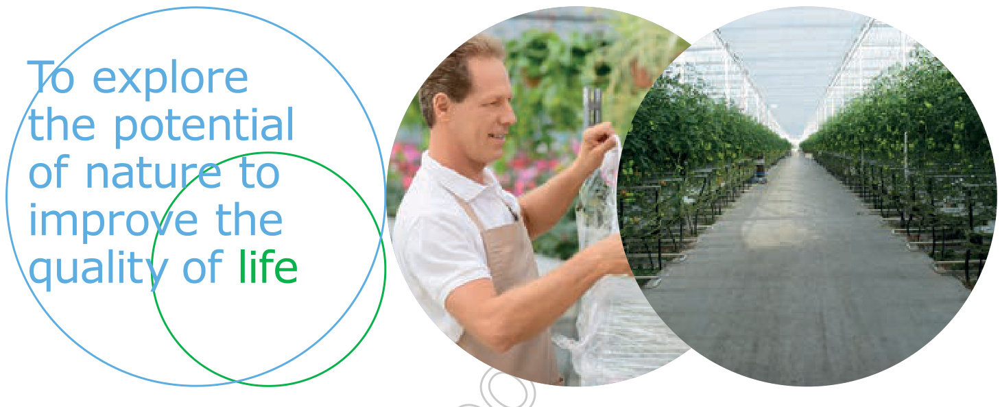

温室园艺报告 WPR-898

Wageningen UR 温室园艺致力于发起和推动创新，促进可持续的保护地园艺发展和提高生活质量。通过与初级生产者、供应部门、植物育种公司、科学界和政府合作开展应用研究来实现这一目标。

Wageningen UR（大学与研究中心）的使命是"探索自然的潜力以提高生活质量"。在Wageningen UR内部，DLO基金会的九个专业研究所与Wageningen大学联合起来，共同解决健康食品和生活环境领域最重要的问题。Wageningen UR在全球拥有约30个地点、6,000名员工和9,000名学生，是该领域的领先组织之一。对问题的整体解决方法和各学科之间的合作是独特的"Wageningen方法"的核心。