# Quantitative Information on Dutch greenhouse horticulture 2019

Key figures on vegetables – cut flowers – Pot and bedding plants crops 26th Edition in English

M.G.M. Raaphorst1 (Editor), J. Benninga2 and B.A. Eveleens1 1. Wageningen University & Research, Business Unit Glastuinbouw, 2. Wageningen Economic Research

# Abstract

The 26th edition ‘Quantitative Information on (NL) Greenhouse horticulture’ is a regularly appearing report edited by Wageningen University & Research Business Unit Greenhouse Horticulture, in Dutch. For this 26th edition, an English translation has been made. In an extra chapter, the special considerations that should be taken into account if the economic calculations in this report are made for a situation outside The Netherlands.

This version contains indicative prices for the equipment and for the main crops, a calculation of the revenue, expenses and operating profit. The cost prices per period are calculated considering an operating profit set to zero. For a sound management the sales price should be higher. This average cost price calculation gives the grower an extra tool to assist in selling the products. For the average economic cost price, a calculation is made of the cost of production and a share of the fixed costs. These costs are allocated to the production in the respective production period. For the vegetables and cut flowers, these costs are charged for each production period of four weeks. For the pot plants and bedding plants, the cost price is calculated for the production of 1000 plants.

For the environmental impact of the crops the carbon footprint of each cultivation, per kg per piece of production, or per $m ^ { 2 }$ greenhouse area is calculated.

# Reportinfo

Confidenial report WPR-898   
Projectnumber: 3242145900

# Disclaimer

$\circledcirc$ 2019 Wageningen, Stichting Wageningen Research, Wageningen Plant Research, Business Unit Greenhouse Horticulture, P.O. Box 20, 2665 MV Bleiswijk, The Netherlands; T +31 (0)317 48 56 06; www.wur.eu/plantresearch.

Chamber of Commerce no. 09098104 at Arnhem VAT no. NL 8065.11.618.B01

Stichting Wageningen Research. All rights reserved. No part of this publication may be reproduced, stored in an automated database, or transmitted, in any form or by any means, whether electronically, mechanically, through photocopying, recording or otherwise, without the prior written consent of the Stichting Wageningen Research. Stichting Wageningen Research is not liable for any adverse consequences resulting from the use of data from this publication.

# Address

# Wageningen University & Research, BU Greenhouse Horticulture

Violierenweg1，2665 MVBleiswijk   
P.O.Box 20,2665 ZG Bleiswijk   
The Netherlands   
$+ 3 1$ (0) 317 - 48 5606   
glastuinbouw@wur.nl   
www.wur@glastuinbouw.nl   
www.wur.eu/greenhousehorticulture

# Introduction

This is a special English-language edition of the twenty-sixth edition of the Quantitative Information on Dutch greenhouse horticulture (KWIN 2019) since the first edition in 1983.

In 1983, the KWIN already had the motto "the numbers tell the tale", and was a comparative standard for the cost and production structure in Dutch horticulture. The market for horticultural products has globalized and the number of producers and buyers has greatly reduced so changing the market from a suppliers market to a demand market. These changes in the greenhouse horticulture sector require up-to-date information on production, production means and prices of products.

Insight into company details in relation to the needs of the buyer, the total supply and the cost price is an important requirement for the modern entrepreneur in this branch. The KWIN contributes by producing and documenting this reliable data.

Because it is important to base cultivation and investment plans on reliable technical and economic data, a lot of effort was put into updating the information over the past year. The means of production, and the calculation of the cost price have been revised. Additionally the ${ \mathsf { C O } } _ { 2 }$ footprint as an indicator of the impact on the environment has been added.

The information included in this report is primarily intended to assist the entrepreneur or advisors in the preparation of business plans for greenhouse horticultural companies. In addition, the information is also important for those who are involved directly or indirectly in greenhouse horticulture, such as suppliers, accountants, banks and schools.

Since there has been a lot of interest from all over the world in the last editions of the KWIN, it was decided to publish an English version. A special chapter with points of interest for the conversion of the Dutch situation to the situation outside The Netherlands has been added as well.

Data was collected and processed by employees of Wageningen University & Research, Business Unit Greenhouse Horticulture and Wageningen Economic Research. The final editor was M.G.M. Raaphorst, Wageningen University & Research, Business Unit Greenhouse Horticulture.

The update of quantitative information for greenhouse horticulture is only possible with the cooperation of the suppliers, horticultural entrepreneurs and advisors. We thank all for their cooperation.

If you have comments and suggestions to improve the KWIN, we are looking forward to receiving them.

J.C. Bakker Business Unit manager

August 2019

# Table of content

Introduction 3

Summary 9

# How to covert the Dutch greenhouse crop information to the local situation 11

1.1 Outside climate 11   
1.2 Location and production equipment 12   
1.3 Knowledge level and education of staff 12   
1.4 Market 12

# Information on the Dutch horticultural sector 15

2.1 Acreage, number of companies and size of companies 15

2.1.1 Acreage, number of companies 15   
2.1.2 Number of companies and size of nurseries 17   
2.1.3 Area and crop 20   
2.1.4 Area, nursery size and region 23   
2.2 Area ornamental horticulture in Europe 24   
2.3 Area and production of greenhouse vegetables in Europe 25   
2.3.1 Tomato 25   
2.3.2 Sweet pepper 28   
2.3.3 Cucumber 29   
2.3.4 Strawberry 30   
2.3.5 Lettuce 32

# Information on means of production and equipment 35

3.1 Land 35   
3.2 Energy 38   
3.2.1 Use by greenhouse horticulture 38   
3.2.2 Gas and electricity 40   
3.2.3 Electricity delivery to the national grid 43   
3.2.4 Development of the oil price 48   
3.3 Geothermal energy 48   
3.3.1 Geothermal heat production 48   
3.3.2 Cost of geothermal energy 49   
3.4 ${ \mathsf { C O } } _ { 2 }$ requirement and costs 51   
3.4.1 ${ \mathsf { C O } } _ { 2 }$ -requirement of the crop 51   
3.4.2 ${ \mathsf { C O } } _ { 2 }$ -sector system and EU-ETS 53   
3.4.3 Energy Saving System Greenhouse Horticulture 53   
3.4.4 Calculation of costs and development of ${ \mathsf { C O } } _ { 2 }$ emission trading price 53   
3.5 Light 54   
3.6 Water 56   
3.6.1 Water requirement crop 56   
3.6.2 Water quality 58   
3.6.3 Cost of water 62   
3.7 Production equipment 64   
3.8 Total expenditure and annual costs of production equipment 86   
3.9 General costs and hours 88

91

4.1 Income and cost price 91

# Information on the calculation of costs, income and nursery profits 93

5.1 Introduction 93   
5.2 Production 93   
5.3 Price level 94   
5.4 Direct costs 94   
5.4.1 Definition 94   
5.4.2 Assumptions 94   
5.4.3 Plant material 94   
5.4.4 Substrate 94   
5.4.5 Energy consumption 94   
5.4.6 ${ \mathsf { C O } } _ { 2 }$ - purchase 95   
5.4.7 Crop protection 95   
5.4.8 Water 95   
5.4.9 Other materials 96   
5.4.10 Subcontractors 96   
5.4.11 Disposal crop residue 96   
5.4.12 Transport costs 96   
5.4.13 Boxes and Packaging 96   
5.4.14 Sales costs 96   
5.4.15 Interest on investment 96   
5.4.16 Perennial crops 96   
5.4.17 Labour 97   
5.4.18 Water 97   
5.5 Gas and electricity prices 97   
5.6 Labour planning and costs 97

5.7 Net income, balance, profitability and return 98

5.8 ${ \mathsf { C O } } _ { 2 }$ Carbon Footprint 100

# Additional information on the calculation of income, profit and return for pot plants 101

6.1 Types of space utilization 101   
6.1.1 Technical space utilization 101   
6.1.2 Organisational space utilization 101   
6.2 Use of the operational balance 102   
6.3 Information on categories of costs 102   
6.4 Information on working standards pot plants 105

Balances and cost price calculations vegetables 107

Balances and cost price calculations cut flowers 147

Balances and cost price calculations pot plants 215

Balances and cost price calculations bedding plants 259

11.1 La traduction Française 276   
11.2 Traduccion Española 278   
11.3 Deutsche Übersetzung 280

12

# Literature and sources

283

# Earlier Dutch editions Kwantitatieve Informatie voor de Glastuinbouw (KWIN) 285

# Summary

‘Quantitative information on greenhouse horticulture’ is a regularly appearing report with current information on production levels, production costs and means of production. Economic figures, balance budgets containing the yields and crop production costs can be found as well as different cultivation plans and investment plans.

The information in this book is primarily intended to assist growers and advisors in business advice for greenhouse horticultural companies.   
In addition, the information can also be important for suppliers, accountants, banks and schools involved directly or indirectly in the greenhouse industry.

The 26th version 2019 is a modified version compared to previous years. This edition includes:

• Information on area, the number of companies and company size in the horticultural sector and information on main crops in The Netherlands and an estimate for European countries.   
• Estimation of the production levels of several important crops in Europe.   
• Investment costs of production means, including the costs of geothermal energy.   
• Balance budgets, costs and company profits of main greenhouse vegetables, cut flowers and pot and bedding plants.   
• Breakdown of the electricity and ${ \mathsf { C O } } _ { 2 }$ availability per period.   
• ${ \mathsf { C O } } _ { 2 }$ footprint per crop and the influence of different means of production on this footprint.

# 1 How to covert the Dutch greenhouse crop information to the local situation

This report includes information on the Dutch greenhouse horticultural sector. The local situation in which the crop is cultivated has a great influence on the production results of the crops. Chapter 3 contains much information on the assumptions on the firm profit calculations in this report. The following paragraphs highlight a number of considerations to be taken into account when converting the data and calculations used in this report to the local situation in other countries. These points are:

• Climate.   
• Location & production equipment.   
• Knowledge level and education of staff.   
• Market situation.

# 1.1 Outside climate

Temperature, solar radiation, wind, humidity and day length determine the production largely. The crops described in this report are grown in a temperate sea climate along the North Sea around the 51st to 53rd latitude. The table below shows an overview of this data in Bleiswijk, South Holland, The Netherlands

Table 1 Average outside temperature, wind speed, radiation sum(2004-2013) and day length Bleiswijk in The Netherlands (KNMI).   

<html><body><table><tr><td></td><td>Temperature (°)</td><td>Wind speed (m/s)</td><td>Radiation (J/cm²)</td><td>Day length (hours)</td></tr><tr><td>January</td><td>4.1</td><td>4.6</td><td>7978</td><td>8:28</td></tr><tr><td>February</td><td>3.8</td><td>3.9</td><td>12255</td><td>10:03</td></tr><tr><td>March</td><td>6.2</td><td>4.1</td><td>28435</td><td>12:00</td></tr><tr><td>April</td><td>10.2</td><td>3.4</td><td>46093</td><td>14:01</td></tr><tr><td>May</td><td>13.0</td><td>3.7</td><td>56370</td><td>15:48</td></tr><tr><td>June</td><td>15.7</td><td>3.4</td><td>58950</td><td>16:43</td></tr><tr><td>July</td><td>18.0</td><td>3.3</td><td>57894</td><td>16:13</td></tr><tr><td>August</td><td>17.8</td><td>3.2</td><td>47506</td><td>14:37</td></tr><tr><td>September</td><td>15.5</td><td>3.4</td><td>33277</td><td>12:39</td></tr><tr><td>October</td><td>12.1</td><td>3.6 M 1</td><td>19795</td><td>10:39</td></tr><tr><td>November</td><td>8.0</td><td>3.97</td><td>8517</td><td>8:51</td></tr><tr><td>December</td><td>4.6</td><td>4.2</td><td>6088</td><td>7:54</td></tr><tr><td>Year</td><td>10.8</td><td>3.7</td><td>383158</td><td>12:20</td></tr></table></body></html>

The climate determines the length of the cultivation period, harvest time and the quantity and quality of production. These outdoor climate effects affect the crop because of the transparent nature of the greenhouses and this is only partially remedied with technical facilities. On the costs side, the climate has an effect on the energy consumption for heating and cooling, artificial light and on the evaporation of the crop and therefore also the water consumption of the crop.

# 1.2 Location and production equipment

The characteristics of the location in which a greenhouse is built, affects the construction cost of the greenhouse. Points of consideration:

• Soil type; this is clay, sand or peat in The Netherlands.   
• Slope and flatness; in The Netherlands $< 0 . 5 \%$ slope.   
• Stability soil; in The Netherlands on peat soil supported with piles.   
• Water streams on and under the soil.   
• Accessibility to services; in The Netherlands firms are located on a paved road and have direct connection to natural gas, electricity and water grids and in the main greenhouse areas a connection to a ${ \mathsf { C O } } _ { 2 }$ grid.   
• Shape of the greenhouse surface; in The Netherlands rectangular with a length width ratio between 1 and 1.5.

The outside climate determines what type of greenhouse to build in relation to capacity of the heating, cooling, humidification and dehumidification, artificial light, insulation or shading from the sun.

In addition the design of the greenhouse with respect to hail, snow, storm and the risk of earthquakes, should be taken into account. In The Netherlands, only hail and storm are real risks.

The construction costs of a greenhouse complex are further defined by:   
• The transport distance to the point of sale, in The Netherlands $< 2 5 0 ~ \mathsf { k m }$ one way. • The access to the construction site.   
• The presence of skilled greenhouse builders.

# 1.3 Knowledge level and education of staff

Greenhouse horticulture is a knowledge intensive sector, which continues to develop in many areas. This includes for example knowledge of:

For the entrepreneur: - Sales, market and consumer demand.   
- Cultivation planning.   
- Labour organization.   
- Purchase of production means. For the professional manager: - Cultivation techniques.   
- Greenhouse climate control.   
- Plant physiology.   
- Crop protection.   
- Fertilization.   
- Labour planning.

• For the production employee: - Cultivation technique. - Cultivation handlings. - Crop and product quality. - Plant diseases.

A lack of professional knowledge leads to problems in growing and therefore a good quality and correct quantities can be no longer realized.

# 1.4 Market

In The Netherlands, a large part of greenhouse horticultural production is sold through the auction or via mediation by the auction. The buyers include supermarket chains and wholesalers. These two parties take care of the further distribution to the local outlets. The greenhouse products are picked up at the greenhouse horticultural company or delivered to a distribution centre.

The Netherlands has a large network of traders in greenhouse horticultural products, which takes care of the marketing throughout Europe. The main market for Dutch greenhouse vegetables is North West Europe within $7 5 0 ~ \mathsf { k m }$ of the greenhouse areas and this area can be supplied within 24-48 hours after harvest. The supply chain is short. The greenhouse flower and pot plant market includes a larger part of Europe.

# 2 Information on the Dutch horticultural sector

2.1 Acreage, number of companies and size of companies

2.1.1 Acreage, number of companies

The development of the greenhouse cultivation area is shown in Table 2 and Figure 1.

Table 2 Area of horticulture under glass in hectares. Source: CBS Landbouwtelling d.d. 01-01-2019.   

<html><body><table><tr><td rowspan="2"></td><td rowspan="2">Total</td><td rowspan="2">Vegetables</td><td rowspan="2">Cut flowers</td><td colspan="2">Pot plants</td><td rowspan="2">Bedding plants</td><td rowspan="2">Fruit</td><td rowspan="2">Treesand shrubs</td><td rowspan="2">Other</td></tr><tr><td>flowering</td><td>foliage</td></tr><tr><td>1975</td><td>7,907</td><td>4,683</td><td>2,558</td><td>340</td><td></td><td>112</td><td>117</td><td>40</td><td>57</td></tr><tr><td>1980</td><td>8,760</td><td>4,658</td><td>2,983</td><td>282</td><td>272</td><td>147</td><td>56</td><td>65</td><td>297</td></tr><tr><td>1985</td><td>8,973</td><td>4,559</td><td>3,221</td><td>301</td><td>385</td><td>170</td><td>39</td><td>95</td><td>203</td></tr><tr><td>1990</td><td>9,773</td><td>4,453</td><td>3,733</td><td>425</td><td>558</td><td>218</td><td>32</td><td>143</td><td>211</td></tr><tr><td>1995</td><td>10,158</td><td>4,405</td><td>3,832</td><td>561</td><td>550</td><td>345</td><td>34</td><td>197</td><td>234</td></tr><tr><td>2000</td><td>10,526</td><td>4,200</td><td>3,727</td><td>680</td><td>581</td><td>497</td><td>30</td><td>369</td><td>442</td></tr><tr><td>2004</td><td>10,486</td><td>4,359</td><td>3,401</td><td>767</td><td>573</td><td>543</td><td>40</td><td>395</td><td>409</td></tr><tr><td>2005</td><td>10,540</td><td>4,445</td><td>3,250</td><td>788</td><td>589</td><td>550</td><td>46</td><td>433</td><td>439</td></tr><tr><td>2006</td><td>10,381</td><td>4,548</td><td>3,093</td><td>838</td><td>548</td><td>489</td><td>49</td><td>403</td><td>413</td></tr><tr><td>2007</td><td>10,374</td><td>4,571</td><td>3,003</td><td>845</td><td>551</td><td>486</td><td>61</td><td>416</td><td>440</td></tr><tr><td>2008</td><td>10,166</td><td>4,647</td><td>2,809</td><td>941</td><td>489</td><td>459</td><td>66</td><td>405</td><td>349</td></tr><tr><td>2009</td><td>10,324</td><td>4,826</td><td>2,690</td><td>953</td><td>511</td><td>475</td><td>61</td><td>432</td><td>377</td></tr><tr><td>2010</td><td>10,307</td><td>4,986</td><td>2,442</td><td>878</td><td>504</td><td>430</td><td>55</td><td>492</td><td>519</td></tr><tr><td>2011</td><td>10,249</td><td>4,988</td><td>2,428</td><td>872</td><td>493</td><td>426</td><td>61</td><td>495</td><td>485</td></tr><tr><td>2012</td><td>9,962</td><td>4,865</td><td>2,308</td><td>867</td><td>485</td><td>447</td><td>56</td><td>486</td><td>448</td></tr><tr><td>2013</td><td>9,817</td><td>4,886</td><td>2,139</td><td>868</td><td>436</td><td>445</td><td>53</td><td>483</td><td>508</td></tr><tr><td>2014</td><td>9,488</td><td>4,833</td><td>2,042</td><td>882</td><td>410</td><td>406</td><td>47</td><td>470</td><td>398</td></tr><tr><td>2015</td><td>9,207</td><td>4,755</td><td>1,877</td><td>914</td><td>420</td><td>370</td><td>64</td><td>473</td><td>335</td></tr><tr><td>2016</td><td>9,279</td><td>4,916</td><td>1,860</td><td>936</td><td>392</td><td>310</td><td>86</td><td>459</td><td>289</td></tr><tr><td>2017</td><td>9,080</td><td>4,992</td><td>1,692</td><td>950</td><td>370</td><td>310</td><td>95</td><td>401</td><td>279</td></tr><tr><td>2018*</td><td>9,001</td><td>4,975</td><td>1,643</td><td>952</td><td>380</td><td>314</td><td>138</td><td>377</td><td>223</td></tr></table></body></html>

\* Estimation

  
Figure 1 Distribution greenhouse area over the groups of crops.

The development of the number of companies with protected horticulture (vegetables and ornamentals) as main activity is shown in Table 3 and Figure 2.

Table 3 Number of companies protected horticulture 2018 (Source: CBS Landbouwtelling d.d. 01-01-2019).   

<html><body><table><tr><td>Total</td><td>Vegetables</td><td>Ornamentals</td></tr><tr><td>1975</td><td>6,492</td><td>7,851</td></tr><tr><td>1980 15,772</td><td>6,309</td><td>7,864</td></tr><tr><td>1985 14,986</td><td>5,987</td><td>8,012</td></tr><tr><td>1990 14,413</td><td>5,652</td><td>8,004</td></tr><tr><td>1995 13,044</td><td>4,686</td><td>7,399</td></tr><tr><td>1996 12,548</td><td>4,411</td><td>7,177</td></tr><tr><td>2000 11,071</td><td>3,433</td><td>6,575</td></tr><tr><td>2003 9,458</td><td>2,825</td><td>5,597</td></tr><tr><td>2004 8,991</td><td>2,652</td><td>5,347</td></tr><tr><td>2005 8,602</td><td>2,547</td><td>5,071</td></tr><tr><td>2006 8,020</td><td>2,400</td><td>4,714</td></tr><tr><td>2007 7,399</td><td>2,209</td><td>4,316</td></tr><tr><td>2008 6,779</td><td>2,022</td><td>4,004</td></tr><tr><td>2009 6,249</td><td>1,874</td><td>3,654</td></tr><tr><td>2010 5,782</td><td>1,766</td><td>3,247</td></tr><tr><td>2011 5,462</td><td>1,694</td><td>3,024</td></tr><tr><td>2012 5,099</td><td>1,593</td><td>2,791</td></tr><tr><td>2013 4,796</td><td>1,523</td><td>2,610</td></tr><tr><td>2014 4,415</td><td>1,442</td><td>2,358</td></tr><tr><td>2015 4.126</td><td>1.385</td><td>2.166</td></tr><tr><td>2016</td><td>3.820 1.327</td><td>1.985</td></tr><tr><td>2017</td><td>1.261</td><td>1.761</td></tr><tr><td>3.476 2018* 3.193</td><td>1.182</td><td>1.601</td></tr></table></body></html>

\* Estimation

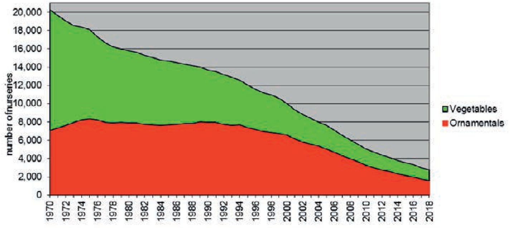  
Figure 2 Development of the number of of companies with vegetables and ornamental horticulture under glass.

# 2.1.2 Number of companies and size of nurseries

Table 4 and Figure 3 show the development in the size of the nurseries. This is the size of each location, but is often the case that one or more locations belong to one company.

Table 4 Development in the size of the nurseries in hectares; 2018 (Source: CBS Landbouwtelling d.d.01-01-2019).   

<html><body><table><tr><td colspan="2" rowspan="3"></td><td colspan="9">Size nursery in ha</td></tr><tr><td>0.01-</td><td colspan="6"></td><td></td><td></td><td></td></tr><tr><td>Year</td><td></td><td>0.01 - 0.75</td><td>0.75- 1</td><td>0.75 - 1.5</td><td>1-2</td><td>1.5 - 3</td><td>2-3</td><td>3</td><td>3-5</td><td></td></tr><tr><td>1970</td><td>total 7.236</td><td>0.25 1.000</td><td>3.587</td><td>1.225</td><td></td><td>1.242</td><td>170</td><td>108</td><td></td><td>>5</td></tr><tr><td>1975</td><td>7.907</td><td>782</td><td>3.213</td><td>1.462</td><td></td><td>2.024</td><td>305</td><td>121</td><td></td><td></td></tr><tr><td>1980</td><td>8.760</td><td>623</td><td>2.620</td><td>1.651</td><td></td><td>2.758</td><td>699</td><td>409</td><td></td><td></td></tr><tr><td>1985</td><td>8.973</td><td>585</td><td>2.313</td><td>1.626</td><td></td><td>3.044</td><td>826</td><td>579</td><td></td><td></td></tr><tr><td>1990</td><td>9.773</td><td>528</td><td>2.076</td><td>1.568</td><td></td><td>3.491</td><td>1.107</td><td>1.002</td><td></td><td></td></tr><tr><td>1995</td><td>10.158</td><td>398</td><td>1.754</td><td>1.363</td><td></td><td>3.684</td><td>1.450</td><td>1.509</td><td></td><td></td></tr><tr><td>2000</td><td>10.521</td><td>330</td><td>1.368</td><td></td><td>2.902</td><td></td><td>3.292</td><td></td><td>1.512</td><td>1.117</td></tr><tr><td>2005</td><td>10.540</td><td>270</td><td>953</td><td></td><td>1.957</td><td>3.080</td><td></td><td></td><td>1.901</td><td>2.378</td></tr><tr><td>2006</td><td>10.381</td><td>246</td><td>874</td><td></td><td>1.841</td><td></td><td>2.827</td><td></td><td>1.870</td><td></td></tr><tr><td>2007</td><td>10.374</td><td>223</td><td>781</td><td></td><td>1.661</td><td></td><td>2.654</td><td></td><td>1.982</td><td>2.722 3.072</td></tr><tr><td>2008</td><td>10.165</td><td>195</td><td>742</td><td></td><td>1.452</td><td></td><td></td><td></td><td></td><td></td></tr><tr><td>2009</td><td>10.324</td><td>175</td><td>676</td><td></td><td></td><td></td><td>2.458</td><td></td><td>1.892</td><td>3.425</td></tr><tr><td>2010</td><td>10.307</td><td>159</td><td>624</td><td></td><td>1.276</td><td></td><td>2.359</td><td></td><td>1.909</td><td>3.929</td></tr><tr><td>2011</td><td>10.249</td><td>149</td><td>572</td><td></td><td>1.152</td><td></td><td>2.201</td><td></td><td>1.919</td><td>4.252</td></tr><tr><td>2012</td><td>9.962</td><td>141</td><td>521</td><td></td><td>1.066</td><td></td><td>2.086</td><td></td><td>1.863</td><td>4.514</td></tr><tr><td>2013</td><td>9.817</td><td>125</td><td>493</td><td></td><td>986</td><td></td><td>1.908</td><td></td><td>1.849</td><td>4.556</td></tr><tr><td>2014</td><td>9.488</td><td>113</td><td>450</td><td></td><td>930</td><td></td><td>1.816</td><td></td><td>1.786</td><td>4.666</td></tr><tr><td>2015</td><td>9.207</td><td>107</td><td>404</td><td></td><td>856</td><td></td><td>1.659</td><td></td><td>1.675 1.516</td><td>4.735</td></tr><tr><td>2016</td><td>9.279</td><td>89</td><td>370</td><td></td><td>802</td><td></td><td>1.527 1.496</td><td></td><td>1.496</td><td>4.853</td></tr><tr><td>2017</td><td>9.080</td><td>76</td><td>316</td><td></td><td>743 689</td><td></td><td>1.417</td><td></td><td>1.417</td><td>5.085 5.165</td></tr><tr><td></td><td></td><td></td><td></td><td></td><td></td><td></td><td></td><td></td><td></td><td></td></tr><tr><td>2018*</td><td>9.001</td><td>61</td><td>280</td><td></td><td>641</td><td></td><td>1.343</td><td></td><td>1.375</td><td>5.300</td></tr></table></body></html>

\* Estimation

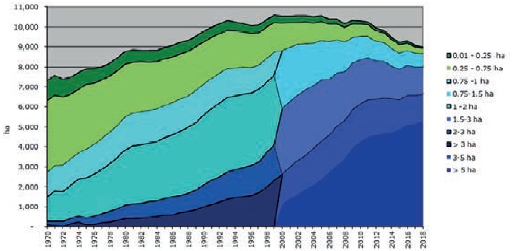  
Figure 3 Development of the total area of protected horticulture with the size of the nursery in hectares (ha). (Source: CBS landbouwtelling d.d. 01-01-2019, adapted Wageningen University & Research, Business Unit Greenhouse Horticulture).

Table 5 Development of the number of nurseries with protected horticulture as main activity and their distribution in the size of the nursery. Source: CBS Landbouwtelling d.d. 01-01-2019.   

<html><body><table><tr><td rowspan="2"></td><td rowspan="2"></td><td colspan="8">Size nursery in ha</td></tr><tr><td>0.01 -</td><td>0.01-</td><td></td><td>0.75 -</td><td></td><td></td><td></td><td></td><td></td></tr><tr><td>Year</td><td>total</td><td>0.25</td><td>0.75</td><td>0.75 -1</td><td>1.5</td><td>1-2 1.5 - 3</td><td>2-3</td><td>3</td><td>3-5</td><td>>5</td></tr><tr><td>1970</td><td>19.503</td><td>9.155</td><td>7.853</td><td>1.433</td><td></td><td>968</td><td>72</td><td>22</td><td></td><td></td></tr><tr><td>1975</td><td>17.571</td><td>7.240</td><td>6.871</td><td>1.711</td><td></td><td>1.557</td><td>129</td><td>63</td><td></td><td></td></tr><tr><td>1980</td><td>15.772</td><td>5.833</td><td>5.476</td><td>1.932</td><td></td><td>2.102</td><td>296</td><td>133</td><td></td><td></td></tr><tr><td>1985</td><td>14.986</td><td>5.473</td><td>4.788</td><td>1.903</td><td></td><td>2.313</td><td>350</td><td>159</td><td></td><td></td></tr><tr><td>1990</td><td>14.413</td><td>4.945</td><td>4.282</td><td>1.834</td><td></td><td>2.637</td><td>469</td><td>246</td><td></td><td></td></tr><tr><td>1995</td><td>13.044</td><td>4.109</td><td>3.651</td><td>1.594</td><td></td><td>2.745</td><td>621</td><td>324</td><td></td><td></td></tr><tr><td>2000</td><td>11.070</td><td>3.200</td><td>2.884</td><td></td><td>2.788</td><td>1.635</td><td></td><td></td><td>413</td><td>150</td></tr><tr><td>2005</td><td>8.602</td><td>2.470</td><td>1.983</td><td></td><td>1.858</td><td>1.494</td><td></td><td></td><td>508</td><td>289</td></tr><tr><td>2006</td><td>8.020</td><td>2.271</td><td>1.830</td><td></td><td>1.733</td><td>1.364</td><td></td><td></td><td>500</td><td>322</td></tr><tr><td>2007</td><td>7.410</td><td>2.034</td><td>1.650</td><td></td><td>1.566</td><td>1.278</td><td></td><td></td><td>523</td><td>359</td></tr><tr><td>2008</td><td>6.785</td><td>1.771</td><td>1.564</td><td></td><td>1.382</td><td>1.179</td><td></td><td></td><td>499</td><td>390</td></tr><tr><td>2009</td><td>6.249</td><td>1.561</td><td>1.425</td><td></td><td>1.209</td><td>1.122</td><td></td><td></td><td>502</td><td>430</td></tr><tr><td>2010</td><td>5.782</td><td>1.380</td><td>1.311</td><td></td><td>1.086</td><td>1.044</td><td></td><td></td><td>507</td><td>454</td></tr><tr><td>2011</td><td>5.462</td><td>1.285</td><td>1.199</td><td></td><td>1.009</td><td></td><td>993</td><td></td><td>492</td><td>484</td></tr><tr><td>2012</td><td>5.099</td><td>1.204</td><td>1.090</td><td></td><td>930</td><td></td><td>910</td><td></td><td>487</td><td>478</td></tr><tr><td>2013</td><td>4.796</td><td>1.073</td><td>1.030</td><td></td><td>876</td><td></td><td>865</td><td></td><td>469</td><td>483</td></tr><tr><td>2014</td><td>4.415</td><td>964</td><td>938</td><td></td><td>803</td><td></td><td>791</td><td></td><td>442</td><td>477</td></tr><tr><td>2015</td><td>4.126</td><td>907</td><td>847</td><td></td><td>763</td><td></td><td>731</td><td></td><td>397</td><td>481</td></tr><tr><td>2016</td><td>3.820</td><td>733</td><td>771</td><td></td><td>702</td><td></td><td>721</td><td></td><td>393</td><td>500</td></tr><tr><td>2017</td><td>3.476</td><td>631</td><td>659</td><td></td><td>648</td><td></td><td>673</td><td></td><td>373</td><td>492</td></tr><tr><td>2018*</td><td>3.193</td><td>503</td><td>588</td><td></td><td>601</td><td></td><td>642</td><td></td><td>362</td><td>497</td></tr></table></body></html>

\* Estimation

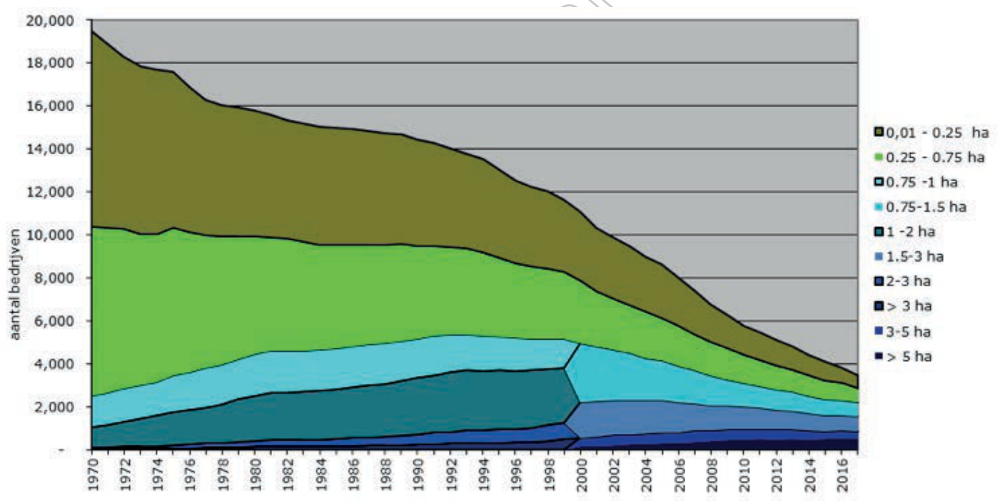  
Figure 4 Development of the number of nurseries and their distribution in size (Source: CBS landbouwtelling d.d. 01-01-2019, adapted Wageningen University & Research, Business unit Greenhouse Horticulture).

Figure 5 shows the development of the area and Figure 6 shows the number of nurseries of a certain size in the period 1990 – 2018. Source: CBS Landbouwtelling d.d. 01-01-2019, adapted Wageningen University & Research, Business Unit Greenhouse Horticulture).

  
Figure 5 Development of the total greenhouse area classed in size of nursery in hectares (ha) (Source: CBS landbouwtelling d.d. 01-01-2019, adapted Wageningen University & Research, Business Unit Greenhouse Horticulture).

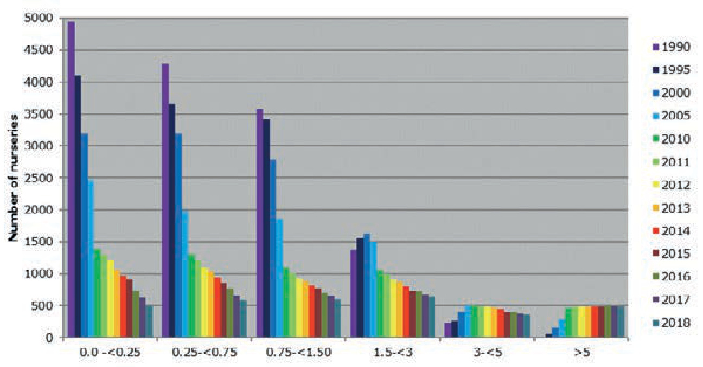  
Figure 6 Development of the total number of greenhouses classed in size of nursery (Source: CBS landbouwtelling d.d. 01-10-2019 , adapted Wageningen University & Research, Business Unit Greenhouse Horticulture).

Table 6 and Figure 7 show the development of the area of the most important vegetable crops under glass.

Table 6 Area in hectares of a number of vegetable crops. (Source: CBS Landbouwtelling d.d. 01-03-2019).   

<html><body><table><tr><td>year</td><td></td><td></td><td></td><td></td><td></td><td></td><td></td><td></td><td></td><td></td><td></td><td></td><td></td><td></td></tr><tr><td>1985 1990</td><td>2.039</td><td></td><td></td><td></td><td>703</td><td>139</td><td></td><td>303</td><td></td><td></td><td>1</td><td></td><td>1.028</td><td>227</td></tr><tr><td>1995</td><td>1.603</td><td></td><td></td><td></td><td>748</td><td>91</td><td></td><td>696</td><td></td><td></td><td></td><td></td><td>934</td><td>260</td></tr><tr><td></td><td>1.220</td><td>455</td><td>628</td><td>51</td><td>808</td><td>122</td><td></td><td>996</td><td></td><td></td><td></td><td>89</td><td>775</td><td>178</td></tr><tr><td>2000</td><td>1.133</td><td>376</td><td>936</td><td>84</td><td>663</td><td>110</td><td>53</td><td>1.155</td><td>297</td><td>220</td><td>626</td><td>76</td><td>715</td><td>296</td></tr><tr><td>2005</td><td>1.396</td><td>386</td><td>1.007</td><td>88</td><td>631</td><td>161</td><td>66</td><td>1.236</td><td>312</td><td>200</td><td>605</td><td>90 90</td><td>537</td><td>328</td></tr><tr><td>2006</td><td>1.481</td><td>413</td><td>1.034</td><td>98</td><td>638</td><td>177</td><td>68</td><td>1.214</td><td>288</td><td>210</td><td>579</td><td>96</td><td>528 491</td><td>351</td></tr><tr><td>2007</td><td>1.545</td><td>422</td><td>1.078</td><td>100</td><td>617 622</td><td>194</td><td>71</td><td>1.187 1.184</td><td>301</td><td>204</td><td>546</td><td>97</td><td>498</td><td>369</td></tr><tr><td>2008</td><td>1.600</td><td>481</td><td>1.047</td><td>100</td><td>626</td><td>211</td><td>58</td><td>1.331</td><td>299</td><td>188</td><td>710</td><td>95</td><td></td><td>377</td></tr><tr><td>2009</td><td>1.628</td><td>418</td><td>1.149</td><td>109</td><td>664</td><td>210 206</td><td>58 49</td><td>1.403</td><td>314</td><td>204</td><td>742</td><td>104</td><td>467 491</td><td>411</td></tr><tr><td>2010</td><td>1.676</td><td>419</td><td>1.172</td><td>111</td><td>656</td><td>234</td><td>42</td><td>1.357</td><td>327</td><td>168</td><td>748</td><td>101</td><td>487</td><td>394</td></tr><tr><td>2011</td><td>1.702</td><td>382</td><td>1.192</td><td>117</td><td>622</td><td>245</td><td>43</td><td>1.313</td><td>337</td><td>170</td><td>695</td><td>105</td><td>415</td><td>411</td></tr><tr><td>2012 2013</td><td>1.691 1.768</td><td>398</td><td>1.256</td><td>114</td><td>615</td><td>251</td><td>40</td><td>1.244</td><td>303</td><td>165</td><td>663</td><td>104</td><td>429</td><td>431 434</td></tr><tr><td>2014</td><td>1.780</td><td>372</td><td>1.259</td><td>149</td><td>598</td><td>271</td><td>42</td><td>1.163</td><td>286</td><td>150</td><td>608</td><td>103</td><td>408</td><td>467</td></tr><tr><td>2015</td><td>1.758</td><td>366</td><td>1.260</td><td>133</td><td>545</td><td>282</td><td>54</td><td>1.163</td><td>257</td><td>133</td><td>633</td><td>106</td><td>397</td><td>450</td></tr><tr><td>2016</td><td>1.705</td><td>357</td><td>1.218</td><td>129</td><td>554</td><td>286</td><td>50</td><td>1.317</td><td>323</td><td>129</td><td>719</td><td>111</td><td>407</td><td>486</td></tr><tr><td>2017**</td><td>1.739</td><td>337</td><td>966</td><td>437</td><td>580</td><td>325</td><td>70</td><td>1.319</td><td>301</td><td>133</td><td>735</td><td>103</td><td>354</td><td>502</td></tr><tr><td></td><td></td><td>364</td><td>933</td><td>491</td><td>563</td><td>319</td><td>67</td><td>1.312</td><td>300</td><td>136</td><td>697</td><td>92</td><td>359</td><td>475</td></tr><tr><td>2018*</td><td>1.787</td><td></td><td></td><td></td><td></td><td></td><td></td><td></td><td></td><td></td><td></td><td></td><td></td><td></td></tr></table></body></html>

\* Estimation $^ { * * }$ Since 2017 cherry tomatoes on the vine are recorded as “cherry” instead of as “on the vine”

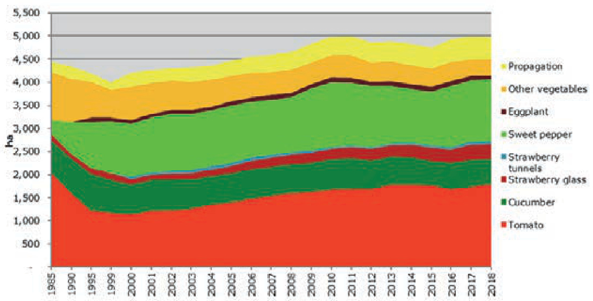  
Figure 7 Development of the area of greenhouse vegetables shown per crop in hectares (ha) (Source: CBS landbouwtelling d.d. 01-03-2019, adapted Wageningen University & Research, Business unit Greenhouse Horticulture).

Table 7 and Figure 8 show the development of a number of important cut flower crops.

Table 7 Area in hectares of a number of cut flower crops under glass. (Source: CBS landbouwtelling, d.d. 01-03-2019).   

<html><body><table><tr><td>year</td><td></td><td></td><td></td><td></td><td></td><td></td><td></td><td></td><td></td><td></td><td></td><td></td></tr><tr><td>1985</td><td>758</td><td>518</td><td>320</td><td>267</td><td>149</td><td></td><td>189</td><td></td><td>358</td><td></td><td>513</td><td>133</td></tr><tr><td>1990</td><td>894</td><td>766</td><td>308</td><td>185</td><td>205</td><td>102</td><td>189</td><td>61</td><td>233</td><td>-</td><td>627</td><td>158</td></tr><tr><td>1995</td><td>918</td><td>771</td><td>276</td><td>194</td><td>211</td><td>117</td><td>207</td><td>72</td><td>191</td><td>-</td><td>681</td><td>163</td></tr><tr><td>2000</td><td>932</td><td>774</td><td>221</td><td>253</td><td>276</td><td>119</td><td>212</td><td>90</td><td>86</td><td>79</td><td>637</td><td>196</td></tr><tr><td>2005</td><td>780</td><td>598</td><td>167</td><td>212</td><td>255</td><td>83</td><td>214</td><td>95</td><td>31</td><td>50</td><td>763</td><td>164</td></tr><tr><td>2006</td><td>754</td><td>597</td><td>152</td><td>205</td><td>232</td><td>77</td><td>210</td><td>111</td><td>32</td><td>42</td><td>683</td><td>154</td></tr><tr><td>2007</td><td>652</td><td>566</td><td>155</td><td>206</td><td>220</td><td>93</td><td>240</td><td>120</td><td>32</td><td>40</td><td>678</td><td>162</td></tr><tr><td>2008</td><td>583</td><td>523</td><td>129</td><td>208</td><td>222</td><td>79</td><td>206</td><td>78</td><td>18</td><td>41</td><td>721</td><td>144</td></tr><tr><td>2009</td><td>532</td><td>493</td><td>116</td><td>217</td><td>221</td><td>68</td><td>209</td><td>95</td><td>21</td><td>40</td><td>678</td><td>166</td></tr><tr><td>2010</td><td>499</td><td>504</td><td>110</td><td>181</td><td>195</td><td>66</td><td>274</td><td>86</td><td>19</td><td>40</td><td>467</td><td>145</td></tr><tr><td>2011</td><td>459</td><td>510</td><td>103</td><td>179</td><td>201</td><td>64</td><td>265</td><td>84</td><td>19</td><td>47</td><td>497</td><td>132</td></tr><tr><td>2012</td><td>407</td><td>504</td><td>103</td><td>170</td><td>196</td><td>65</td><td>213</td><td>77</td><td>16</td><td>45</td><td>510</td><td>101</td></tr><tr><td>2013</td><td>384</td><td>479</td><td>97</td><td>169</td><td>189</td><td>54</td><td>212</td><td>65</td><td>15</td><td>40</td><td>434</td><td>118</td></tr><tr><td>2014</td><td>311</td><td>475</td><td>85</td><td>176</td><td>171</td><td>50</td><td>195</td><td>58</td><td>15</td><td>39</td><td>466</td><td>117</td></tr><tr><td>2015</td><td>283</td><td>391</td><td>74</td><td>161</td><td>167</td><td>40</td><td>168</td><td>47</td><td>14</td><td>38</td><td>494</td><td>119</td></tr><tr><td>2016</td><td>257</td><td>383</td><td>78</td><td>188</td><td>138</td><td>38</td><td>161</td><td>41</td><td>11</td><td>33</td><td>532</td><td>133</td></tr><tr><td>2017</td><td>228</td><td>334</td><td>66</td><td>167</td><td>136</td><td>39</td><td>131</td><td>46</td><td>11</td><td>33</td><td>344</td><td>126</td></tr><tr><td>2018*</td><td>225</td><td>369</td><td>61</td><td>158</td><td>114</td><td>34</td><td>106</td><td>40</td><td>9</td><td>28</td><td>498</td><td>121</td></tr></table></body></html>

\* Estimation

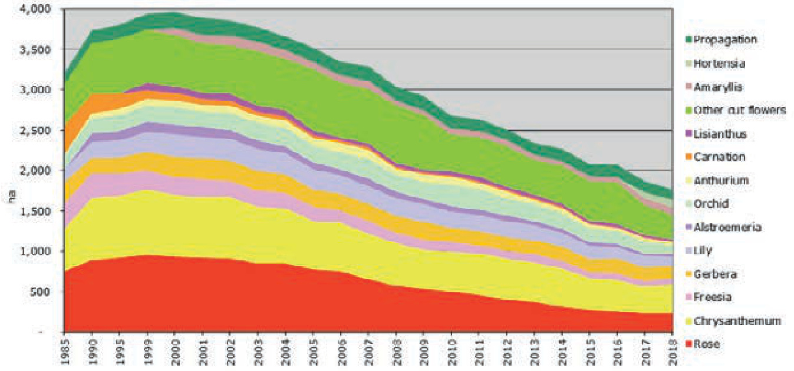  
Figure 8 Development of the area of cut flowers under glass shown per crop in hectares (ha)(Source: CBS landbouwtelling d.d. 01-03-2019, adapted Wageningen University & Research, Business Unit Greenhouse Horticulture).

Table 8 and Figure 9 show the development of area of pot plants and bedding plants under glass.

Table 8 Area in hectares of bedding plants, pot plants: foliage and flowering under glass (Source: CBS landbouwtelling d.d. 01-03-2019).   

<html><body><table><tr><td></td><td>Pot plants, foliage.</td><td>Pot plants, flowering</td><td>Other ornamentals</td><td>Total bedding and pot plants</td></tr><tr><td>year 1985</td><td>Bedding plants 170 385</td><td>301</td><td>198</td><td>1.054</td></tr><tr><td>1990</td><td>285 618</td><td>465</td><td>201</td><td>1.569</td></tr><tr><td>1995</td><td>549</td><td>560</td><td>231</td><td>1.685</td></tr><tr><td>2000</td><td>581</td><td>680</td><td>155</td><td>1.913</td></tr><tr><td>2005</td><td>589</td><td>788</td><td>168</td><td>2.095</td></tr><tr><td>2006</td><td>548</td><td>838</td><td>167</td><td>2.042</td></tr><tr><td>2007</td><td>551</td><td>845</td><td>162</td><td>2.045</td></tr><tr><td>486 2008</td><td>489</td><td>941</td><td>122</td><td>2.012</td></tr><tr><td>459 2009 475</td><td>511</td><td>953</td><td>144</td><td>2.083</td></tr><tr><td>2010 430</td><td>504</td><td>878</td><td>291</td><td>2.104</td></tr><tr><td>2011 426</td><td>493</td><td>872</td><td>259</td><td>2.051</td></tr><tr><td>2012 447</td><td>485</td><td>867</td><td>254</td><td>2.053</td></tr><tr><td>2013 445</td><td>436</td><td>868</td><td>296</td><td>2.046</td></tr><tr><td>2014 406</td><td>410</td><td>882</td><td>196</td><td>1.894</td></tr><tr><td>2015 369</td><td>420</td><td>914</td><td>132</td><td>1.834</td></tr><tr><td>2016 332</td><td>392</td><td>936</td><td>97</td><td>1.756</td></tr><tr><td>2017 312</td><td>367</td><td>950</td><td>101</td><td>1.729</td></tr><tr><td>2018* 314</td><td>380</td><td>952</td><td>87</td><td>1.732</td></tr></table></body></html>

\* Estimation

  
Figure 9 Development of the area of bedding and pot plants under glass shown per group in hectares (ha) (Source: CBS landbouwtelling d.d. 01-03-2019, adapted Wageningen University & Research, Business Unit Greenhouse Horticulture).

Table 9 and Figure 10 shows the development of protected greenhouse area in the 12 provinces of The Netherlands.

Table 9 Development of regional distribution of the greenhouse area in hectares. (Source: CBS landbouwtelling d.d. 01-03-2019).   

<html><body><table><tr><td></td><td></td><td></td><td></td><td></td><td></td><td></td><td>pueljoh PJoon</td><td>pue)/oh p!nz</td><td></td><td></td><td></td></tr><tr><td>year 1976</td><td></td><td></td><td></td><td>258</td><td>30</td><td>600</td><td>808</td><td>5.064</td><td></td><td></td><td>1.149</td></tr><tr><td>1980</td><td></td><td></td><td></td><td>279</td><td>51</td><td>657</td><td>897</td><td>5.528</td><td>65</td><td></td><td>1.282</td></tr><tr><td>1985</td><td></td><td></td><td></td><td>284</td><td>51</td><td>687</td><td>945</td><td>5.610</td><td>68</td><td></td><td>1.324</td></tr><tr><td>1991</td><td></td><td></td><td>375</td><td></td><td>83</td><td>800</td><td>1.018</td><td>6.088</td><td>73</td><td></td><td>1.552</td></tr><tr><td>1995 2000</td><td></td><td></td><td>417</td><td>104</td><td></td><td>836</td><td>1.015</td><td>6.050</td><td>67</td><td>919</td><td>745</td></tr><tr><td colspan="2">74</td><td>70</td><td>267 102</td><td>167</td><td>690</td><td>192</td><td>1.051</td><td>5.900</td><td>93</td><td>1.108</td><td>806</td></tr><tr><td>2005</td><td>68</td><td>113</td><td>239</td><td>126</td><td>193</td><td>731 142</td><td>984</td><td>5.615</td><td>160</td><td>1.306</td><td>864</td></tr><tr><td>2006</td><td>61</td><td>122</td><td>227</td><td>132</td><td>197</td><td>731 139</td><td>980</td><td>5.428</td><td>170</td><td>1.279</td><td>914</td></tr><tr><td>2007</td><td>62</td><td>135</td><td>222</td><td>144</td><td>195</td><td>753 148</td><td>917</td><td>5.337</td><td>174</td><td>1.371</td><td>917</td></tr><tr><td>2008</td><td>63</td><td>117</td><td>231</td><td>126</td><td>192</td><td>701 144</td><td>932</td><td>5.186</td><td>170</td><td>1.369</td><td>933</td></tr><tr><td>2009</td><td>66</td><td>122</td><td>199</td><td>137</td><td>181</td><td>699 137</td><td>969</td><td>5.268</td><td>173</td><td>1.430</td><td>944</td></tr><tr><td>2010</td><td>61</td><td>139</td><td>194</td><td>138</td><td>183</td><td>666 131</td><td>918</td><td>5.297</td><td>203</td><td>1.451</td><td>927</td></tr><tr><td>2011</td><td>55</td><td>139</td><td>187</td><td>140</td><td>181</td><td>670 132</td><td>881</td><td>5.324</td><td>207</td><td>1.415</td><td>920</td></tr><tr><td>2012</td><td>53</td><td>145</td><td>164</td><td>141</td><td>169</td><td>617</td><td>134 920</td><td>5.171</td><td>200</td><td>1.356</td><td>893</td></tr><tr><td>2013</td><td>56</td><td>143</td><td>154</td><td>135</td><td>167</td><td>614</td><td>133 956</td><td>4.992</td><td>181</td><td>1.373</td><td>914</td></tr><tr><td>2014</td><td>63</td><td>135</td><td>136</td><td>136</td><td>160</td><td>606 122</td><td>922</td><td>4.830</td><td>156</td><td>1.366</td><td>855</td></tr><tr><td>2015</td><td>64</td><td>132</td><td>147</td><td>121</td><td>199</td><td>560</td><td>108</td><td>900 4.786</td><td>154</td><td>1.271</td><td>763</td></tr><tr><td>2016</td><td>60</td><td>132</td><td>150</td><td>117</td><td>276</td><td>520</td><td>96</td><td>926 4.672</td><td>166</td><td>1.339</td><td>825</td></tr><tr><td>2017</td><td>55</td><td>148</td><td>150</td><td>134</td><td>300</td><td>453</td><td>87</td><td>872 4.535</td><td>167</td><td>1.341</td><td>839</td></tr><tr><td>2018*</td><td>53</td><td>136</td><td>149</td><td>131</td><td>319</td><td>495</td><td>86 857</td><td>4.404</td><td>233</td><td>1.317</td><td>820</td></tr></table></body></html>

\* Estimation

  
Figure 10 Development of the greenhouse area in The Netherlands in hectares (ha) (Source: CBS landbouwtelling d.d. 01-03-2019, adapted Wageningen University & Research, Business Unit Greenhouse Horticulture).

# 2.2 Area ornamental horticulture in Europe

Eurostat registers the area under various crops for the European countries. Since 2015 for ornamental crops, no differentiation is made between protected and open field horticulture. As the area down to open field horticulture is much larger than the area under glass, the area for ornamental horticulture for The Netherlands is much larger than the area shown in Table 1 (protected horticulture). Where no data is available, this is shown with “:”.

Table 10 The area of ornamental horticulture, both open field as protected, for the European countries in 1000 ha (source: Eurostat Flowers and ornamental plants (excluding nurseries), d.d. 1-3-2019).   

<html><body><table><tr><td></td><td>2010</td><td>2011</td><td>2012</td><td>2013</td><td>2014</td><td>2015</td><td>2016</td><td>2017</td></tr><tr><td>Belgium</td><td>5.0</td><td>4.9</td><td>5.3</td><td>5.2</td><td>5.1</td><td>5.4</td><td>5.3</td><td>5.4</td></tr><tr><td>Bulgaria</td><td>0.0</td><td>2.0</td><td>0.0</td><td>0.0</td><td>0.0</td><td>：</td><td>：</td><td>：</td></tr><tr><td>Czechia</td><td>1.3</td><td>0.6</td><td>0.7</td><td>0.3</td><td>0.3</td><td>0.3</td><td>0.3</td><td>0.2</td></tr><tr><td>Denmark</td><td>1.9</td><td>1.9</td><td>1.9</td><td>0.3</td><td>0.3</td><td>0.3</td><td>0.3</td><td>0.4</td></tr><tr><td>Germany</td><td>8.4</td><td>8.4</td><td>7.6</td><td>7.7</td><td>7.3</td><td>7.5</td><td>7.3</td><td>6.9</td></tr><tr><td>Estonia</td><td>0.0</td><td>0.0</td><td>0.0</td><td>：</td><td>0.0</td><td>0.0</td><td>0.0</td><td>0.0</td></tr><tr><td>Ireland</td><td>0.1</td><td>0.1</td><td>0.2</td><td>0.2</td><td>0.2</td><td>0.2</td><td>0.2</td><td>0.2</td></tr><tr><td>Greece</td><td>0.4</td><td>0.4</td><td>0.4</td><td>0.4</td><td>0.4</td><td>0.4</td><td>0.4</td><td>0.4</td></tr><tr><td>Spain</td><td>6.7</td><td>6.5</td><td>7.0</td><td>7.0</td><td>7.1</td><td>6.3</td><td>6.4</td><td>6.2</td></tr><tr><td>France</td><td>8.1</td><td>8.5</td><td>9.1</td><td>9.0</td><td>8.8</td><td>8.8</td><td>8.9</td><td>9.0</td></tr><tr><td>Croatia</td><td>0.3</td><td>0.4</td><td>0.3</td><td>0.3</td><td>0.3</td><td>0.3</td><td>0.3</td><td>0.3</td></tr><tr><td>Italy</td><td>：</td><td>：</td><td>：</td><td>：</td><td>9.4</td><td>8.9</td><td>8.8</td><td>：</td></tr><tr><td>Cyprus</td><td>0.1</td><td>0.1</td><td>0.1</td><td>0.2</td><td>0.2</td><td>0.2</td><td>0.1</td><td>0.1</td></tr><tr><td>Latvia</td><td>0.1</td><td>0.1</td><td>0.1</td><td>0.1</td><td>0.0</td><td>0.1</td><td>0.1</td><td>0.1</td></tr><tr><td>Lithuania</td><td>0.1</td><td>0.1</td><td>0.1</td><td>0.1</td><td>0.1</td><td>0.1</td><td>0.2</td><td>0.2</td></tr><tr><td>Luxembourg</td><td>0.0</td><td>0.0</td><td>0.0</td><td>0.0</td><td>0.0</td><td>0.0</td><td>0.0</td><td>0.0</td></tr><tr><td>Hungary</td><td>0.5</td><td>0.6</td><td>0.7</td><td>0.5</td><td>0.6</td><td>0.6</td><td>0.5</td><td>0.5</td></tr><tr><td>Malta</td><td>0.1</td><td>0.1</td><td>0.1</td><td>0.0</td><td>0.0</td><td>0.0</td><td>0.0</td><td>0.0</td></tr><tr><td>Netherlands</td><td>26.2</td><td>27.1</td><td>26.2</td><td>26.2</td><td>26.3</td><td>27.6</td><td>32.6</td><td>33.4</td></tr><tr><td>Austria</td><td>0.4</td><td>0.4</td><td>0.4</td><td>0.4</td><td>0.4</td><td>0.4</td><td>0.4</td><td>0.4</td></tr><tr><td>Poland</td><td>3.8</td><td>3.3</td><td>3.3</td><td>3.4</td><td>3.5</td><td>3.5</td><td>4.9</td><td>5.5</td></tr><tr><td>Portugal</td><td>2.8</td><td>3.1</td><td>3.5</td><td>3.9</td><td>3.7</td><td>3.6</td><td>3.5</td><td>3.5</td></tr><tr><td>Romania</td><td>0.2</td><td>0.3</td><td>0.4</td><td>0.5</td><td>0.4</td><td>0.4</td><td>0.5</td><td>0.3</td></tr><tr><td>Slovenia</td><td>0.1</td><td>0.1</td><td>0.1</td><td>0.1</td><td>0.1</td><td>0.1</td><td>0.1</td><td>：</td></tr><tr><td>Slovakia</td><td>0.2</td><td>0.2</td><td>03</td><td>0.2</td><td>0.1</td><td>0.2</td><td>0.1</td><td>0.1</td></tr><tr><td>Finland</td><td>：</td><td>0.0</td><td>0.0</td><td>：</td><td>：</td><td>0.0</td><td>0.0</td><td>0.0</td></tr><tr><td>Sweden</td><td>0.4</td><td>0.2</td><td>0.2</td><td>0.2</td><td>0.2</td><td>0.2</td><td>0.2</td><td>0.2</td></tr><tr><td>United Kingdom</td><td>6.0</td><td>5.0</td><td>6.0</td><td>6.0</td><td>6.0</td><td>7.0</td><td>6.0</td><td>8.0</td></tr><tr><td>Iceland</td><td></td><td>0.0</td><td>0.0</td><td>0.0</td><td>0.0</td><td>0.0</td><td>：</td><td>0.0</td></tr><tr><td>Norway</td><td></td><td>0.0</td><td>：</td><td>：</td><td>：</td><td>：</td><td>：</td><td>：</td></tr><tr><td>Switzerland</td><td>0.5</td><td>0.5</td><td>0.5</td><td>0.5</td><td>0.5</td><td>0.5</td><td>0.5</td><td>0.5</td></tr><tr><td>Montenegro</td><td>0.0</td><td>0.0</td><td>0.0</td><td>0.0</td><td>0.0</td><td>0.0</td><td>0.0</td><td>0.0</td></tr><tr><td>North Macedonia</td><td>0.1</td><td>0.1</td><td>0.1</td><td>0.1</td><td>0.1</td><td>0.1</td><td>0.1</td><td>0.1</td></tr><tr><td>Albania</td><td>：</td><td>：</td><td>：</td><td>：</td><td>：</td><td>0.0</td><td>5.1</td><td>：</td></tr><tr><td>Serbia</td><td>0.4</td><td>0.4</td><td>0.4</td><td>0.4</td><td>0.3</td><td>0.5</td><td>0.5</td><td>1.1</td></tr><tr><td>Turkey</td><td>：</td><td>：</td><td>5.0</td><td>：</td><td>5.0</td><td>5.0</td><td>5.0</td><td>：</td></tr><tr><td>Bosnia and Herzegovina</td><td>：</td><td>：</td><td>：</td><td>：</td><td>：</td><td>：</td><td>0.1</td><td>0.2</td></tr><tr><td>Kosov0</td><td>0.0</td><td>0.0</td><td>：</td><td>：</td><td>0.0</td><td>0.0</td><td>0.0</td><td>0.0</td></tr><tr><td>Total</td><td>74</td><td>75</td><td>80</td><td>73</td><td>87</td><td>88</td><td>99</td><td>83</td></tr></table></body></html>

<html><body><table><tr><td></td><td>2010</td><td>2011</td><td>2012</td><td>2013</td><td>2014</td><td>2015</td><td>2016</td><td>2017</td></tr><tr><td>Countries with data</td><td>31</td><td>34</td><td>33</td><td>30</td><td>34</td><td>35</td><td>35</td><td>32</td></tr><tr><td>Share NL</td><td>35.4%</td><td>35.9%</td><td>32.8%</td><td>35.9%</td><td>30.3%</td><td>31.3%</td><td>33.1%</td><td>40.2%</td></tr></table></body></html>

# 2.3 Area and production of greenhouse vegetables in Europe

Eurostat collects information on the area of protected vegetable production in the European countries. These statistics include plastic greenhouses as well as greenhouses covered with glass. The data shown is the best available data but it remains incomplete.

# 2.3.1 Tomato

On the next page is a summary of the total area and tomato production for fresh consumption and the area and production for protected tomato crops.

Table 11 The total area (x1000 ha) and production $( x 1 0 0 0 t )$ tomatoes, for fresh consumption for the European countries (Source: Eurostat: Tomatoes for fresh consumption) d.d. 01-03-2019.   

<html><body><table><tr><td rowspan="2"></td><td colspan="5">area</td><td colspan="5">production</td></tr><tr><td>2013</td><td>2014</td><td>2015</td><td>2016</td><td>2017</td><td>2013</td><td>2014</td><td>2015</td><td>2016</td><td>2017</td></tr><tr><td>Belgium</td><td>0.52</td><td>0.51</td><td>0.51</td><td>0.51</td><td>0.52</td><td>249.8</td><td>249.3</td><td>253.1</td><td>259.5</td><td>256.0</td></tr><tr><td>Bulgaria</td><td>2.82</td><td>2.80</td><td>2.55</td><td>3.80</td><td>3.41</td><td>80.5</td><td>88.4</td><td>89.2</td><td>126.0</td><td>98.4</td></tr><tr><td>Czechia</td><td>0.31</td><td>0.28</td><td>0.20</td><td>0.34</td><td>0.24</td><td>8.3</td><td>8.5</td><td>5.6</td><td>14.4</td><td>4.8</td></tr><tr><td>Denmark</td><td>0.04</td><td>0.04</td><td>0.03</td><td>0.03</td><td>0.04</td><td>12.5</td><td>12.8</td><td>10.6</td><td>10.9</td><td>10.9</td></tr><tr><td>Germany</td><td>0.33</td><td>0.33</td><td>0.33</td><td>0.34</td><td>0.37</td><td>69.3</td><td>84.5</td><td>80.9</td><td>85.3</td><td>96.6</td></tr><tr><td>Estonia</td><td>0.00</td><td>0.00</td><td>0.00</td><td>0.01</td><td>0.00</td><td>1.4</td><td>0.8</td><td>0.9</td><td>0.4</td><td>0.1</td></tr><tr><td>Ireland</td><td>0.01</td><td>0.01</td><td>0.01</td><td>0.01</td><td>0.01</td><td>4.7</td><td>4.3</td><td>4.4</td><td>4.0</td><td>3.8</td></tr><tr><td>Greece</td><td>12.04</td><td>12.00</td><td>9.31</td><td>8.86</td><td>8.59</td><td>692.0</td><td>664.7</td><td>578.4</td><td>564.8</td><td>540.3</td></tr><tr><td>Spain</td><td>6.37</td><td>5.92</td><td>25.30</td><td>27.65</td><td>26.23</td><td>235.6</td><td>209.0</td><td>2056.6</td><td>2392.</td><td>2162.1</td></tr><tr><td>France</td><td></td><td>3.38</td><td>3.27</td><td>3.41</td><td>4.78</td><td>608.1</td><td>609.3</td><td>617.7</td><td>654.0</td><td>593.7</td></tr><tr><td>Croatia</td><td>0.30</td><td>0.14</td><td>0.17</td><td>0.20</td><td>0.15</td><td>18.5</td><td>12.0</td><td>26.4</td><td>17.7</td><td>20.4</td></tr><tr><td>Italy</td><td>19.38</td><td>18.42</td><td>25.51</td><td>18.19</td><td>17.13</td><td>567.2</td><td>490.2</td><td>1044.6</td><td>532.1</td><td>498.2</td></tr><tr><td>Cyprus</td><td>0.21</td><td>0.21</td><td>0.27</td><td>0.22</td><td>0.27</td><td>13.3</td><td>16.6</td><td>16.1</td><td>13.4</td><td>17.5</td></tr><tr><td>Latvia</td><td>0.00</td><td>0.00</td><td>0.00</td><td>0.00</td><td>0.00</td><td>6.4</td><td>4.9</td><td>6.1</td><td>5.8</td><td>5.1</td></tr><tr><td>Lithuania</td><td>0.59</td><td>0.54</td><td>0.49</td><td>0.57</td><td>0.55</td><td>11.8</td><td>11.9</td><td>7.7</td><td>11.4</td><td>11.8</td></tr><tr><td>Luxembourg</td><td>0.00</td><td>0.00</td><td>0.00</td><td>0.00</td><td>0.00</td><td>0.1</td><td>0.1</td><td>0.1</td><td>0.0</td><td>0.0</td></tr><tr><td>Hungary</td><td></td><td>1.02</td><td>1.20</td><td>：</td><td></td><td></td><td>83.7</td><td>130.0</td><td>：</td><td>：</td></tr><tr><td>Malta</td><td>0.00</td><td>0.00</td><td>0.00</td><td>0.00</td><td>0.00</td><td>5.1</td><td>4.9</td><td>4.1</td><td>4.5</td><td>3.7</td></tr><tr><td>Netherlands</td><td>1.77</td><td>1.78</td><td>1.76</td><td>1.78</td><td>1.79</td><td>855.0</td><td>900.0</td><td>890.0</td><td>890.0</td><td>910.0</td></tr><tr><td>Austria</td><td>0.18</td><td>0.19</td><td>0.19</td><td>0.18</td><td>0.18</td><td>53.3</td><td>57.3</td><td>55.7</td><td>55.1</td><td>54.3</td></tr><tr><td>Poland</td><td>4.90</td><td>8.60</td><td>8.70</td><td>7.39</td><td>7.53</td><td>615.4</td><td>655.9</td><td>655.6</td><td>706.1</td><td>739.8</td></tr><tr><td>Portugal</td><td>1.63</td><td>1.25</td><td>1.45</td><td>1.38</td><td>1.32</td><td>97.3</td><td>89.2</td><td>96.6</td><td>95.5</td><td>97.2</td></tr><tr><td>Romania</td><td>28.07</td><td>24.43</td><td>24.84</td><td>22.71</td><td>22.21</td><td>509.2</td><td>473.9</td><td>468.8</td><td>425.6</td><td>435.1</td></tr><tr><td>Slovenia</td><td>0.00</td><td>0.23</td><td>0.19</td><td>0.21</td><td>0.20</td><td>0.0</td><td>6.6</td><td>8.7</td><td>8.7</td><td>8.4</td></tr><tr><td>Slovakia</td><td>0.15</td><td>0.27</td><td>0.25</td><td>0.28</td><td>0.27</td><td>4.7</td><td>13.1</td><td>12.2</td><td>9.9</td><td>10.9</td></tr><tr><td>Finland</td><td>0.12</td><td>0.11</td><td>0.11</td><td>0.11</td><td>0.11</td><td>38.3</td><td>39.9</td><td>38.9</td><td>40.6</td><td>39.4</td></tr><tr><td>Sweden</td><td>0.04</td><td>0.04</td><td>0.04</td><td>0.04</td><td>0.04</td><td>15.1</td><td>14.6</td><td>14.8</td><td>14.6</td><td>14.5</td></tr><tr><td>United Kingdom</td><td>0.00</td><td>：</td><td></td><td></td><td>V</td><td>： 0.0</td><td>：</td><td>：</td><td>：</td><td></td></tr><tr><td>Iceland</td><td>0.00</td><td>0.00</td><td>0.00</td><td>0.00</td><td></td><td>1.6</td><td>1.5</td><td>0.0</td><td>0.0</td><td></td></tr><tr><td>Norway</td><td></td><td>0.00</td><td></td><td>0.04</td><td>0.03</td><td></td><td>：</td><td>：</td><td>11.1</td><td>10.6</td></tr><tr><td>Switzerland</td><td></td><td>0.19</td><td>0.19</td><td>0.18</td><td>0.18</td><td></td><td>45.7</td><td>45.7</td><td>45.7</td><td>46.5</td></tr><tr><td>Montenegro</td><td>0.07</td><td>0.07</td><td>0.00</td><td>0.00</td><td>0.00</td><td>2.8</td><td>2.2</td><td>2.7</td><td>3.2</td><td>3.3</td></tr><tr><td>North Macedonia</td><td></td><td>A</td><td></td><td>：</td><td></td><td></td><td>：</td><td>：</td><td>：</td><td></td></tr><tr><td>Albania</td><td></td><td></td><td>7</td><td>：</td><td>4.80</td><td></td><td>：</td><td>：</td><td>：</td><td>142.8</td></tr><tr><td>Serbia</td><td>8.72</td><td>9.16</td><td>8.87</td><td>10.07</td><td>0.00</td><td>174.5</td><td>127.6</td><td>147.0</td><td>160.5</td><td>0.0 ：</td></tr><tr><td>Turkey</td><td></td><td></td><td></td><td>：</td><td></td><td></td><td>：</td><td>：</td><td>：</td><td></td></tr><tr><td>Bosnia and Herzegovina Kosovo</td><td>0.00</td><td>? 0.00</td></table></body></html>

Table 12 The area $( x 1 0 0 0 h a )$ ) and production $( x 1 0 0 0 t )$ of tomatoes in glass or plastic greenhouses, for the European countries (Source: Eurostat: Tomatoes for fresh consumption under glass or high accessible cover) d.d. 01-03- 2019.   

<html><body><table><tr><td rowspan="2"></td><td colspan="4">area</td><td colspan="4">production</td><td></td></tr><tr><td>2013</td><td>2014</td><td>2015</td><td>2016</td><td>2017 2013</td><td>2014</td><td>2015</td><td>2016</td><td>2017</td></tr><tr><td>Belgium</td><td>0.52</td><td>0.51</td><td>0.51</td><td>0.51</td><td>0.52</td><td>249.8 249.3</td><td>253.1</td><td>259.5</td><td>256.0</td></tr><tr><td>Bulgaria</td><td>0.60</td><td>0.56</td><td>0.59</td><td>0.58</td><td>0.64</td><td>40.6</td><td>40.0 50.1</td><td>49.0</td><td>56.2</td></tr><tr><td>Czechia</td><td>0.00</td><td>0.00</td><td>0.00</td><td>0.00</td><td>0.00</td><td>0.0</td><td>0.0</td><td>0.0</td><td>0.0</td></tr><tr><td>Denmark</td><td>0.04</td><td>0.04</td><td>0.03</td><td>0.03</td><td>0.04</td><td>12.5 12.8</td><td>10.6</td><td>10.9</td><td>10.9</td></tr><tr><td>Germany</td><td>0.33</td><td>0.33</td><td>0.33</td><td>0.34</td><td>0.37</td><td>69.3 84.5</td><td>80.9</td><td>85.3</td><td>96.6</td></tr><tr><td>Estonia</td><td>0.00</td><td>0.00</td><td>0.00</td><td>0.00</td><td>0.00</td><td>1.4</td><td>0.9</td><td>0.4</td><td>0.1</td></tr><tr><td>Ireland</td><td>0.01</td><td>0.01</td><td>0.01</td><td>0.01</td><td>0.01</td><td>4.7 4.3</td><td>4.4</td><td>4.0</td><td>3.8</td></tr><tr><td>Greece</td><td>2.98</td><td>3.06</td><td>2.82</td><td>2.59</td><td>2.67</td><td>365.1 384.2</td><td>340.8</td><td>321.7</td><td>309.7</td></tr><tr><td>Spain</td><td>19.72</td><td>21.13</td><td>19.41</td><td>19.98</td><td>18.95</td><td>：</td><td>： 1835.3</td><td>2027.9</td><td>1827.1</td></tr><tr><td>France</td><td>2.11</td><td>2.07</td><td>2.03</td><td>2.21</td><td>2.09</td><td>567.0 580.1</td><td>589.3</td><td>625.2</td><td>560.4</td></tr><tr><td>Croatia</td><td>0.14</td><td>0.05</td><td>0.13</td><td>0.10</td><td>0.09</td><td>14.1</td><td>10.4 25.2</td><td>13.7</td><td>19.2</td></tr><tr><td>Italy</td><td>6.91</td><td>7.15</td><td>7.44</td><td>7.16</td><td>7.08</td><td>432.5 498.6</td><td>516.3</td><td>447.1</td><td>442.6</td></tr><tr><td>Cyprus</td><td>0.03</td><td>0.04</td><td>0.13</td><td>0.12</td><td>0.15</td><td>6.2</td><td>7.7 7.9</td><td>8.0</td><td>10.5</td></tr><tr><td>Latvia</td><td>0.00</td><td>0.00</td><td>0.00</td><td>0.00</td><td>0.00</td><td>6.4</td><td>4.9</td><td>6.1 5.8</td><td>5.1</td></tr><tr><td>Lithuania</td><td>0.29</td><td>0.28</td><td>0.27</td><td>0.28</td><td>0.29</td><td>10.0</td><td>10.5</td><td>6.6 8.3</td><td>9.2</td></tr><tr><td>Luxembourg</td><td>0.00</td><td>0.00</td><td>0.00</td><td>0.00</td><td>0.00</td><td>0.1</td><td>0.1</td><td>0.1 0.0</td><td>0.0</td></tr><tr><td>Hungary</td><td>0.40</td><td>0.42</td><td>0.20</td><td>：</td><td>：</td><td>：</td><td>：</td><td>：</td><td></td></tr><tr><td>Malta</td><td>：</td><td>：</td><td>0.00</td><td>0.00</td><td>0.00</td><td>0.0</td><td>0.0</td><td>0.0</td><td>0.0</td></tr><tr><td>Netherlands</td><td>1.77</td><td>1.78</td><td>1.76</td><td>1.78</td><td>1.79</td><td>855.0</td><td>900.0 890.0</td><td>0.0 890.0</td><td>910.0</td></tr><tr><td>Austria</td><td>0.18</td><td>0.18</td><td>0.18</td><td>0.17</td><td>0.17</td><td>53.1</td><td>57.0 55.4</td><td>54.8</td><td>53.9</td></tr><tr><td>Poland</td><td>2.20</td><td>3.10</td><td>3.10</td><td>3.25</td><td>3.23</td><td>： 538.7</td><td>553.2</td><td>606.6</td><td>643.5</td></tr><tr><td>Portugal</td><td>1.17</td><td>0.93</td><td>0.98</td><td>0.96</td><td>1.00</td><td>26.3</td><td>26.9 29.6</td><td>24.9</td><td>27.8</td></tr><tr><td>Romania</td><td>1.47</td><td>1.62</td><td>1.65</td><td>1.73</td><td>1.66</td><td>60.2</td><td>75.9 79.4</td><td>98.5</td><td>76.6</td></tr><tr><td>Slovenia</td><td>0.00</td><td>0.00</td><td>0.00</td><td>0.00</td><td>0.00</td><td>0.0</td><td>0.0</td><td>0.0 0.0</td><td>0.0</td></tr><tr><td>Slovakia</td><td>0.01</td><td>0.02</td><td>0.02</td><td>0.02</td><td>0.04</td><td>0.4</td><td>9.0</td><td>8.7 6.2</td><td>8.0</td></tr><tr><td>Finland</td><td>0.12</td><td>0.11</td><td>0.11</td><td>0.11</td><td>0.11</td><td>38.3 39.9</td><td>38.9</td><td>40.6</td><td>39.4</td></tr><tr><td>Sweden</td><td>0.04</td><td>0.04</td><td>0.04</td><td>0.04</td><td>0.04</td><td>15.1</td><td>14.6 14.8</td><td>14.6</td><td>14.5</td></tr><tr><td>United Kingdom</td><td>0.00</td><td>：</td><td>：</td><td></td><td>：</td><td>0.0</td><td>：</td><td>：</td><td></td></tr><tr><td>Iceland</td><td>0.00</td><td>0.00</td><td>0.01</td><td>0.01</td><td>0.01</td><td>：</td><td>：</td><td>1.4</td><td>1.3</td></tr><tr><td>Norway</td><td>0.04</td><td>0.04</td><td>0.03</td><td>0.04</td><td>0.03</td><td>：</td><td>：</td><td>： ：</td><td></td></tr><tr><td>Switzerland</td><td>：</td><td>0.18</td><td>0.18</td><td>0.18</td><td>0.17</td><td>：</td><td>44.5</td><td>44.5</td><td></td></tr><tr><td>Montenegro</td><td>：</td><td>：</td><td>0.00</td><td>0.00</td><td>0.00</td><td>：</td><td>：</td><td>0.0 0.0</td><td>0.0</td></tr><tr><td>North Macedonia</td><td>：</td><td></td><td></td><td>：</td><td>：</td><td>：</td><td>：</td><td>：</td><td></td></tr><tr><td>Albania</td><td>：</td><td>1.11</td><td>1.19</td><td>1.50</td><td>1.60</td><td>： 90.3</td><td>103.2</td><td>133.1</td><td>144.0</td></tr><tr><td>Serbia</td><td>0.00</td><td>0.00</td><td>0.00</td><td>1.50</td><td>1.84</td><td>0.0 0.0</td><td>0.0</td><td>45.9</td><td>54.6</td></tr><tr><td>Turkey</td><td>24.00</td><td>23.00</td><td>25.00</td><td>26.00</td><td>28.00</td><td>3118.0 3203.0</td><td>3315.0</td><td>3522.0</td><td>3796.0</td></tr><tr><td>Bosnia and Herzegovina</td><td></td><td>：</td><td>：</td><td>0.30</td><td>0.20</td><td>：</td><td>：</td><td>： 5.0</td><td>1.2</td></tr><tr><td>Kosovo</td><td>0.00</td><td>0.00</td><td>：</td><td>：</td><td>：</td><td>0.0</td><td>0.0</td><td>：</td><td></td></tr><tr><td>Total</td><td>65</td><td>68</td><td>68</td><td>72 73</td><td></td><td>5946 6888</td><td>8860</td><td>9310</td><td>9378</td></tr><tr><td>Countries with data</td><td>32 2.7%</td><td>33</td></table></body></html>

Table 13 De area $( x 1 0 0 0$ ha) and production $( x 1 0 0 0 t )$ of sweet pepper in glass and plastic greenhouses, for the European countries (Source: Eurostat: Red pepper, capsicum under glass or high accessible cover) d.d. 01-03-2019.   

<html><body><table><tr><td rowspan="2"></td><td colspan="4">area</td><td colspan="5">production</td></tr><tr><td>2013</td><td>2014</td><td>2015</td><td>2016</td><td>2017 2013</td><td>2014</td><td>2015</td><td>2016</td><td>2017</td></tr><tr><td>Belgium</td><td>0.08</td><td>0.09</td><td>0.09</td><td>0.10</td><td>0.10</td><td>22.7</td><td>25.2</td><td>25.5 27.1</td><td>27.6</td></tr><tr><td>Bulgaria</td><td>0.10</td><td>0.09</td><td>0.08</td><td>0.09</td><td>0.08</td><td>4.2 2.9</td><td>2.8</td><td>3.9</td><td>2.2</td></tr><tr><td>Czechia</td><td>0.00</td><td>0.00</td><td>0.00</td><td>0.00</td><td>0.00</td><td>0.0 0.0</td><td>0.0</td><td>0.0</td><td>0.0</td></tr><tr><td>Denmark</td><td>0.00</td><td>0.00</td><td>0.00</td><td>0.00</td><td>0.00</td><td>0.0 0.0</td><td>0.0</td><td>0.0</td><td>0.0</td></tr><tr><td>Germany</td><td>0.06</td><td>0.07</td><td>0.07</td><td>0.08</td><td>0.09</td><td>7.5 8.4</td><td>7.5</td><td>9.4</td><td>12.3</td></tr><tr><td>Estonia</td><td>0.00</td><td>0.00</td><td>0.00</td><td>0.00</td><td>0.00</td><td>0.0 0.0</td><td>0.0</td><td>0.0</td><td>0.0</td></tr><tr><td>Ireland</td><td>0.00</td><td>0.00</td><td>0.00</td><td>0.00</td><td>0.00</td><td>0.0 0.0</td><td>0.0</td><td>0.0</td><td>0.0</td></tr><tr><td>Greece</td><td>1.02</td><td>1.10</td><td>0.95</td><td>0.83</td><td>1.05</td><td>93.2 93.8</td><td>88.5</td><td>77.4</td><td>95.1</td></tr><tr><td>Spain</td><td>11.59</td><td>12.85</td><td>12.42</td><td>12.64</td><td>13.53</td><td>：</td><td>： 898.3</td><td>942.9</td><td>1003.4</td></tr><tr><td>France</td><td>：</td><td>：</td><td>：</td><td>0.00</td><td>0.00</td><td>：</td><td>：</td><td>： 0.0</td><td>0.0</td></tr><tr><td>Croatia</td><td>0.07</td><td>0.13</td><td>0.07</td><td>0.09</td><td>0.12</td><td>2.9 5.6</td><td>2.9</td><td>4.1</td><td>4.3</td></tr><tr><td>Italy</td><td>2.57</td><td>2.35</td><td>2.44</td><td>2.37</td><td>2.03</td><td>101.0 94.5</td><td>96.6</td><td>97.5</td><td>76.9</td></tr><tr><td>Cyprus</td><td>0.00</td><td>0.00</td><td>0.00</td><td>0.00</td><td>0.00</td><td>0.0 0.0</td><td>0.0</td><td>0.0</td><td>0.0</td></tr><tr><td>Latvia</td><td>0.00</td><td>0.00</td><td>0.00</td><td>0.00</td><td>0.00</td><td>0.0</td><td>0.0 0.0</td><td>0.0</td><td>0.0</td></tr><tr><td>Lithuania</td><td>0.00</td><td>0.00</td><td>0.00</td><td>0.00</td><td>0.00</td><td>0.0</td><td>0.0 0.0</td><td>0.0</td><td>0.0</td></tr><tr><td>Luxembourg</td><td>0.00</td><td>0.00</td><td>0.00</td><td>0.00</td><td>0.00</td><td>0.0</td><td>0.0 0.0</td><td>0.0</td><td>0.0</td></tr><tr><td>Hungary</td><td>：</td><td>：</td><td>：</td><td>：</td><td>：</td><td>：</td><td>：</td><td>：</td><td>： ：</td></tr><tr><td>Malta</td><td>：</td><td>0.00</td><td>0.00</td><td>0.00</td><td>0.00</td><td>0.0</td><td>0.0</td><td>0.0 0.0</td><td>0.0</td></tr><tr><td>Netherlands</td><td>1.24</td><td>1.20</td><td>1.20</td><td>1.32</td><td>1.32</td><td>325.0 340.0</td><td>345.0</td><td>365.0</td><td>370.0</td></tr><tr><td>Austria</td><td>0.13</td><td>0.13</td><td>0.12</td><td>0.11</td><td>0.12</td><td>17.2 17.3</td><td>14.5</td><td>13.3</td><td>14.7</td></tr><tr><td>Poland</td><td>1.10</td><td>1.70</td><td>1.70</td><td>1.83</td><td>1.91</td><td>： 107.5</td><td>129.5</td><td>125.6</td><td>129.6</td></tr><tr><td>Portugal</td><td>0.07</td><td>0.07</td><td>0.05</td><td>0.06</td><td>0.06</td><td>3.0 3.5</td><td>3.0</td><td>2.0</td><td>2.8</td></tr><tr><td>Romania</td><td>0.31</td><td>0.47</td><td>0.47</td><td>0.49</td><td>0.47</td><td>7.1 12.9</td><td>14.4</td><td>14.9</td><td>16.7</td></tr><tr><td>Slovenia</td><td>0.00</td><td>0.00</td><td>0.00</td><td>0.00</td><td>0.00</td><td>0.0 0.0</td><td>0.0</td><td>0.0</td><td>0.0</td></tr><tr><td>Slovakia</td><td>0.01</td><td>0.00</td><td>0.01</td><td>0.02</td><td>0.01</td><td>0.3 0.2</td><td>0.1</td><td>0.5</td><td>0.7</td></tr><tr><td>Finland</td><td>0.01</td><td>0.01</td><td>0.01</td><td>0.01</td><td>0.01</td><td>0.6 0.5</td><td>0.5</td><td>0.6</td><td>1.0</td></tr><tr><td>Sweden</td><td>0.00</td><td>0.00</td><td>0.00</td><td>0.00</td><td>0.00</td><td>0.0 0.0</td><td>0.0</td><td>0.0</td><td>0.0</td></tr><tr><td>United Kingdom</td><td>0.00</td><td>0.10</td><td>0.09</td><td>0.10</td><td>0.10</td><td>0.0 23.7</td><td>23.1</td><td>23.0</td><td>20.6</td></tr><tr><td>Iceland</td><td>0.01</td><td>0.01</td><td>0.01</td><td>0.01</td><td>0.01</td><td>：</td><td>：</td><td>： 0.2</td><td>0.2</td></tr><tr><td>Norway</td><td>：</td><td>0.00</td><td></td><td>0.00</td><td>0.00</td><td>：</td><td>：</td><td>：</td><td>： 0.0</td></tr><tr><td>Switzerland</td><td>：</td><td>0.02</td><td>0.02</td><td>0.02</td><td>0.02</td><td>： 1.0</td><td>1.0</td><td></td><td>： ：</td></tr><tr><td>Montenegro</td><td>：</td><td></td><td>0.00</td><td>0.00</td><td>0.00</td><td>：</td><td>： 0.5</td><td>0.7</td><td>0.6</td></tr><tr><td>North Macedonia</td><td>：</td><td></td><td>：</td><td>：</td><td>：</td><td>：</td><td>：</td><td>：</td><td>： ：</td></tr><tr><td>Albania</td><td></td><td>0.16</td><td>0.23</td><td>0.30</td><td>0.30</td><td>： 10.4</td><td>16.8</td><td>16.8</td><td>19.9</td></tr><tr><td>Serbia</td><td>0.00</td><td>0.00</td><td>0.00</td><td>1.50</td><td>1.72</td><td>0.0 0.0</td><td>0.0</td><td>37.2</td><td>42.5</td></tr><tr><td>Turkey</td><td></td><td>：</td><td>7.00</td><td>7.00</td><td>7.00</td><td>：</td><td>： 542.0</td><td>579.0</td><td>636.0</td></tr><tr><td>Bosnia and Herzegovina</td><td></td><td>：</td><td>：</td><td>0.24</td><td>0.14</td><td>：</td><td>：</td><td>： 5.1</td><td>0.7</td></tr><tr><td>Kosovo</td><td>0.00</td><td>0.00</td><td>：</td><td>：</td><td>：</td><td>0.0</td><td>0.0</td><td>：</td><td>： ：</td></tr><tr><td>Total</td><td>18</td><td>21</td><td>27 29</td><td>30</td><td>585</td><td>747</td><td>2212</td><td>2346</td><td>2478</td></tr><tr><td>Countries with data Share NL</td><td>28 6.8%</td><td>32 5.8%</td><td>32 35 4.4%</td><td>35 4.5%</td><td>4.4% 55.6%</td><td>26 29 45.5%</td></table></body></html>

Table 14 The area $( x 1 0 0 0 h a ,$ ) and production $( x 1 0 0 0 t )$ cucumbers in glass and plastic greenhouses, for the European countries (Source: Eurostat: Cucumbers under glass or high accessible cover) d.d. 01-03-2019.   

<html><body><table><tr><td rowspan="2"></td><td colspan="5">area</td><td colspan="5">production</td></tr><tr><td>2013</td><td>2014</td><td>2015</td><td>2016</td><td>2017</td><td>2013</td><td>2014</td><td>2015</td><td>2016</td><td>2017</td></tr><tr><td>Belgium</td><td>0.04</td><td>0.04</td><td>0.04</td><td>0.06</td><td>0.06</td><td>17.4</td><td>17.6</td><td>16.9</td><td>23.6</td><td>25.5</td></tr><tr><td>Bulgaria</td><td>0.40</td><td>0.38</td><td>0.41</td><td>0.48</td><td>0.38</td><td>40.8</td><td>44.5</td><td>41.6</td><td>57.0</td><td>38.0</td></tr><tr><td>Czechia</td><td>0.00</td><td>0.00</td><td>0.00</td><td>0.00</td><td>0.00</td><td>0.0</td><td>0.0</td><td>0.0</td><td>0.0</td><td>0.0</td></tr><tr><td>Denmark</td><td>0.05</td><td>0.05</td><td>0.05</td><td>0.05</td><td>0.05</td><td>19.2</td><td>：</td><td>19.5</td><td>20.0</td><td>20.0</td></tr><tr><td>Germany</td><td>0.21</td><td>0.21</td><td>0.19</td><td>0.20</td><td>0.22</td><td>50.5</td><td>52.3</td><td>42.8</td><td>46.6</td><td>58.6</td></tr><tr><td>Estonia</td><td>0.00</td><td>0.00</td><td>0.00</td><td>0.01</td><td>0.01</td><td>3.6</td><td>3.6</td><td>5.4</td><td>4.0</td><td>3.8</td></tr><tr><td>Ireland</td><td>0.01</td><td>0.01</td><td>0.01</td><td>0.01</td><td>0.01</td><td>1.7</td><td>1.4</td><td>1.8</td><td>1.7</td><td>1.7</td></tr><tr><td>Greece</td><td>1.07</td><td>1.42</td><td>1.19</td><td>1.22</td><td>1.25</td><td>132.0</td><td>155.1</td><td>115.4</td><td>107.6</td><td>107.1</td></tr><tr><td>Spain</td><td>8.10</td><td>8.16</td><td>7.44</td><td>6.68</td><td>6.75</td><td>：</td><td>：</td><td>685.2</td><td>608.8</td><td>614.5</td></tr><tr><td>France</td><td>0.49</td><td>0.54</td><td>0.53</td><td>0.51</td><td>0.56</td><td>113.2</td><td>115.7</td><td>121.1</td><td>120.5</td><td>127.9</td></tr><tr><td>Croatia</td><td>0.04</td><td>0.04</td><td>0.04</td><td>0.05</td><td>0.05</td><td>4.9</td><td>4.2</td><td>3.8</td><td>4.7</td><td>7.4</td></tr><tr><td>Italy</td><td>0.62</td><td>0.63</td><td>0.59</td><td>0.58</td><td>0.53</td><td>39.0</td><td>：</td><td>34.7</td><td>37.8</td><td>33.5</td></tr><tr><td>Cyprus</td><td>0.13</td><td>0.13</td><td>0.15</td><td>0.16</td><td>0.19</td><td>9.3</td><td>9.8</td><td>6.2</td><td>9.6</td><td>10.2</td></tr><tr><td>Latvia</td><td>0.00</td><td>0.00</td><td>0.00</td><td>0.00</td><td>0.00</td><td>8.0</td><td>7.5</td><td>6.4</td><td>7.1</td><td>5.8</td></tr><tr><td>Lithuania</td><td>0.11</td><td>0.13</td><td>0.12</td><td>0.12</td><td>0.13</td><td>11.3</td><td>12.0</td><td>10.1</td><td>9.1</td><td>12.2</td></tr><tr><td>Luxembourg</td><td>0.00</td><td>0.00</td><td>0.00</td><td>0.00</td><td>0.00</td><td>0.0</td><td>0.1</td><td>0.1</td><td>0.0</td><td>0.0</td></tr><tr><td>Hungary</td><td>0.10</td><td>0.10</td><td>0.10</td><td>：</td><td></td><td></td><td></td><td>：</td><td>：</td><td>：</td></tr><tr><td>Malta</td><td></td><td>：</td><td>0.00</td><td>0.00</td><td>0.00</td><td>0.0</td><td>0.0</td><td>0.0</td><td>0.0</td><td>0.0</td></tr><tr><td>Netherlands</td><td>： 0.62</td><td>0.60</td><td>0.55</td><td>0.54</td><td>0.58</td><td>400.0</td><td>440.0</td><td>405.0</td><td>370.0</td><td>400.0</td></tr><tr><td>Austria</td><td>0.14</td><td>0.15</td><td>0.15</td><td>0.16</td><td>0.16</td><td>31.0</td><td>32.2</td><td>29.6</td><td>34.4</td><td>34.7</td></tr><tr><td>Poland</td><td>1.20</td><td>1.70</td><td>1.60</td><td>1.63</td><td>1.72</td><td>：</td><td>265.1</td><td>266.7</td><td>276.9</td><td>294.6</td></tr><tr><td>Portugal</td><td>0.14</td><td>0.16</td><td>0.19</td><td>0.10</td><td>0.10</td><td>6.3</td><td>10.9</td><td>9.6</td><td>6.4</td><td>5.6</td></tr><tr><td>Romania</td><td>1.12</td><td>1.24</td><td>1.23</td><td>1.22</td><td>1.16</td><td>33.7</td><td>44.6</td><td>57.0</td><td>53.0</td><td>57.5</td></tr><tr><td>Slovenia</td><td>0.00</td><td>0.00</td><td>0.00</td><td>0.00</td><td>0.00</td><td>0.0</td><td>0.0</td><td>0.0</td><td>0.0</td><td>0.0</td></tr><tr><td>Slovakia</td><td>0.01</td><td>0.01</td><td>0.01</td><td>0.02</td><td>0.02</td><td>1.5</td><td>1.7</td><td>1.6</td><td>2.7</td><td>3.2</td></tr><tr><td>Finland</td><td>0.10</td><td>0.96</td><td>0.09</td><td>0.08</td><td>0.08</td><td>35.9</td><td>38.4</td><td>40.5</td><td>39.1</td><td>42.8</td></tr><tr><td>Sweden</td><td>0.08</td><td>0.08</td><td>0.09</td><td>0.09</td><td>0.08</td><td>27.9</td><td>28.2</td><td>28.0</td><td>32.6</td><td>30.6</td></tr><tr><td>United Kingdom</td><td>0.00</td><td>0.10</td><td>0.00</td><td>0.10</td><td>0.10</td><td>0.0</td><td>56.5</td><td>0.0</td><td>53.0</td><td>52.7</td></tr><tr><td>Iceland</td><td>0.00</td><td>0.00</td><td>0.01</td><td>0.00</td><td>0.01</td><td>：</td><td>：</td><td>：</td><td>0.0</td><td>1.9</td></tr><tr><td>Norway</td><td>0.02</td><td>0.02</td><td>0.02</td><td>0.02</td><td>0.03</td><td>：</td><td></td><td>：</td><td></td><td>15.4</td></tr><tr><td>Switzerland</td><td>：</td><td>0.08</td><td>0.08</td><td>0.08</td><td>0.08</td><td>：</td><td>14.5</td><td>14.0</td><td></td><td></td></tr><tr><td>Montenegro</td><td>：</td><td></td><td>0.00</td><td>0.00</td><td>0.00</td><td>：</td><td>：</td><td>0.0</td><td>0.0</td><td>0.0</td></tr><tr><td>North Macedonia</td><td>：</td><td></td><td>：</td><td>：</td><td></td><td>：</td><td>：</td><td>：</td><td>：</td><td></td></tr><tr><td>Albania</td><td></td><td>0.37</td><td>0.39</td><td>0.50</td><td>0.60</td><td>：</td><td>31.5</td><td>36.8</td><td>44.5</td><td>62.7</td></tr><tr><td>Serbia</td><td>0.00</td><td>0.00</td><td>0.00</td><td>0.58</td><td>0.63</td><td>0.0</td><td>0.0</td><td>0.0</td><td>14.6</td><td>16.1</td></tr><tr><td>Turkey</td><td>7.00</td><td>8.00</td><td>8.00</td><td>5.00</td><td>8.00</td><td>985.0</td><td>1081.0</td><td>1066.0</td><td>752.0 2.9</td><td>1098.0 0.6</td></tr><tr><td>Bosnia and Herzegovina Kosov0</td><td></td><td>：</td></table></body></html>

# 2.3.4 Strawberry

In Table 15 is a summary of the total area and production of strawberry and the area and in Table 16 the production under glass and plastic greenhouses.

Table 15 The area $( x 1 0 0 0 h a ,$ ) and production $( x 1 0 0 0 t )$ ) strawberries in glass and plastic greenhouses, for the European countries (Source: Eurostat: Strawberries) d.d. 01-03-2019.   

<html><body><table><tr><td rowspan="2"></td><td colspan="4">area</td><td colspan="5">production</td></tr><tr><td>2013</td><td>2014</td><td>2015</td><td>2016</td><td>2017 2013</td><td>2014</td><td>2015</td><td>2016</td><td>2017</td></tr><tr><td>Belgium</td><td>1.63</td><td>1.70</td><td>1.80</td><td>1.90</td><td>1.98</td><td>35.9</td><td>39.3 48.0</td><td>45.0</td><td>47.5</td></tr><tr><td>Bulgaria</td><td>0.60</td><td>0.67</td><td>0.76</td><td>0.68</td><td>0.66</td><td>3.8</td><td>4.2</td><td>5.2</td><td>5.4</td></tr><tr><td>Czechia</td><td>0.50</td><td>0.62</td><td>0.58</td><td>0.71</td><td>0.69</td><td>2.2</td><td>3.5</td><td>3.4</td><td>2.8</td></tr><tr><td>Denmark</td><td>1.03</td><td>1.08</td><td>1.09</td><td>1.17</td><td>1.16</td><td>6.2</td><td>7.5 6.5</td><td>7.9</td><td>6.7</td></tr><tr><td>Germany</td><td>15.58</td><td>15.35</td><td>14.72</td><td>14.30</td><td>14.16</td><td>149.7 168.8</td><td>172.6</td><td>143.2</td><td>135.3</td></tr><tr><td>Estonia</td><td>0.50</td><td>0.40</td><td>0.50</td><td>0.44</td><td>0.53</td><td>1.2</td><td>1.1</td><td>1.0</td><td>1.1</td></tr><tr><td>Ireland</td><td>0.23</td><td>0.19</td><td>0.19</td><td>0.19</td><td>0.19</td><td>7.9</td><td>6.8 6.9</td><td>6.4</td><td>6.6</td></tr><tr><td>Greece</td><td>1.30</td><td>1.35</td><td>1.28</td><td>1.49</td><td>1.47</td><td>46.9 50.9</td><td>61.0</td><td>58.9</td><td>58.9</td></tr><tr><td>Spain</td><td>7.97</td><td>7.79</td><td>7.21</td><td>6.87</td><td>6.82</td><td>312.5 291.9</td><td>397.4</td><td>377.6</td><td>360.4</td></tr><tr><td>France</td><td>3.24</td><td>3.26</td><td>3.29</td><td>3.34</td><td>3.37</td><td>55.7</td><td>58.8 56.9</td><td>60.4</td><td>57.3</td></tr><tr><td>Croatia</td><td>0.29</td><td>0.31</td><td>0.29</td><td>0.37</td><td>0.37</td><td>3.9</td><td>3.2 2.4</td><td>3.3</td><td>3.2</td></tr><tr><td>Italy</td><td>5.52</td><td>5.69</td><td>5.60</td><td>4.88</td><td>4.85</td><td>147.2 135.3</td><td>143.2</td><td>131.4</td><td>125.3</td></tr><tr><td>Cyprus</td><td>0.05</td><td>0.06</td><td>0.05</td><td>0.04</td><td>0.04</td><td>1.5</td><td>1.4 1.5</td><td>1.0</td><td>1.0</td></tr><tr><td>Latvia</td><td>0.40</td><td>0.40</td><td>0.40</td><td>0.50</td><td>0.50</td><td>1.1</td><td>0.9</td><td>1.4 1.1</td><td>1.4</td></tr><tr><td>Lithuania</td><td>0.97</td><td>1.00</td><td>1.01</td><td>0.78</td><td>0.84</td><td>2.9</td><td>3.2 3.2</td><td>2.7</td><td>2.1</td></tr><tr><td>Luxembourg</td><td>0.00</td><td>0.00</td><td>0.00</td><td>0.01</td><td>0.01</td><td>0.0</td><td>0.0 0.0</td><td>0.0</td><td>0.0</td></tr><tr><td>Hungary</td><td>0.79</td><td>0.66</td><td>0.74</td><td>0.77</td><td>0.74</td><td>6.4</td><td>5.1 5.3</td><td>5.9</td><td>5.2</td></tr><tr><td>Malta</td><td>0.00</td><td>0.00</td><td>0.00</td><td>0.00</td><td>0.00</td><td>0.7 0.9</td><td>0.8</td><td>0.8</td><td>0.9</td></tr><tr><td>Netherlands</td><td>1.77</td><td>1.81</td><td>1.77</td><td>1.72</td><td>1.69</td><td>51.0</td><td>54.0 57.7</td><td>57.5</td><td>66.1</td></tr><tr><td>Austria</td><td>1.29</td><td>1.13</td><td>1.14</td><td>1.14 ></td><td>1.14</td><td>15.0</td><td>14.5 13.4</td><td>9.8</td><td>11.6</td></tr><tr><td>Poland</td><td>40.20</td><td>52.90</td><td>52.30</td><td>50.78</td><td>49.84</td><td>165.9 213.7</td><td>214.6</td><td>207.6</td><td>189.1</td></tr><tr><td>Portugal</td><td>0.44</td><td>0.58</td><td>0.32</td><td>0.39</td><td>0.31</td><td>12.8 14.8</td><td>9.7</td><td>10.8</td><td>9.4</td></tr><tr><td>Romania</td><td>2.36</td><td>2.40</td><td>2.56</td><td>2.72</td><td>3.25</td><td>23.1 21.8</td><td>21.5</td><td>22.9</td><td>27.0</td></tr><tr><td>Slovenia</td><td>0.00</td><td>0.09</td><td>0.11</td><td>0.11</td><td>0.11</td><td>0.0 1.6</td><td>2.0</td><td>1.9</td><td>1.7</td></tr><tr><td>Slovakia</td><td>0.57</td><td>0.20</td><td>0.36</td><td>0.17</td><td>0.12</td><td>2.8</td><td>1.0 1.4</td><td>0.8</td><td>0.6</td></tr><tr><td>Finland</td><td>3.08</td><td>2.92</td><td>3.01</td><td>6.30</td><td>6.89</td><td>13.3 12.9</td><td>14.5</td><td>12.0</td><td>12.0</td></tr><tr><td>Sweden</td><td>1.88</td><td>1.94</td><td>1.99</td><td>2.01</td><td>1.97</td><td>14.1 16.0</td><td>17.1</td><td>15.3</td><td>15.7</td></tr><tr><td>United Kingdom</td><td>5.00</td><td>5.00</td><td>4.50</td><td>5.00</td><td>4.70</td><td>94.0 104.0</td><td>115.5</td><td>118.0</td><td>108.8</td></tr><tr><td>Iceland</td><td>0.00</td><td>0.00</td><td>0.00</td><td>0.00</td><td>0.00</td><td>0.0</td><td>0.0 0.0</td><td>0.0</td><td>0.0</td></tr><tr><td>Norway</td><td>1.57</td><td>1.68</td><td>1.60</td><td>1.53</td><td>1.54</td><td>6.4</td><td>8.3 11.2</td><td>8.7</td><td>8.5</td></tr><tr><td>Switzerland Montenegro</td><td></td><td>0.50</td><td>0.50</td><td>0.52</td><td>0.52</td><td>：</td><td>7.3 0.0</td><td>7.3 7.4</td><td>5.9</td></tr><tr><td>North Macedonia</td><td>0.00</td><td>0.00</td><td>0.00</td><td>0.00</td><td>0.00</td><td>0.0</td><td>0.0 4.5</td><td>0.0</td><td>0.0</td></tr><tr><td></td><td>0.78</td><td>0.83</td><td>0.84</td><td>0.82</td><td>0.81</td><td>3.6</td><td>4.8</td><td>4.5</td><td>5.2</td></tr><tr><td>Albania Serbia</td><td></td><td>：</td><td>0.00</td><td>：</td><td>0.10</td><td>：</td><td>：</td><td></td><td>5.1</td></tr><tr><td>Turkey</td><td>4.93</td><td>4.98</td><td>5.08</td><td>5.81</td><td>7.05 28.9</td><td>23.3</td><td>26.0</td><td>22.9</td><td>30.1</td></tr><tr><td>Bosnia and Herzegovina</td><td>14.00</td><td>13.00</td><td>14.00</td><td>15.00</td><td>15.00</td><td>372.0 376.0</td><td>376.0</td><td>415.0</td><td>400.0</td></tr><tr><td>Kosovo</td><td>1.17</td><td>1.21</td><td>1.26</td><td>1.33</td><td>1.34</td><td>9.2</td><td>8.5</td><td>9.3 10.2</td><td>9.8</td></tr><tr><td></td><td>0.10</td><td>0.20</td><td>0.20</td><td>0.20</td><td>0.20</td><td>0.4</td><td>1.4</td><td>1.4 1.3</td><td>1.3</td></tr><tr><td>Total Countries with data</td><td>120 36</td><td>132 37</td><td>131 38</td><td>134 37</td><td>135 38</td><td>1598 1667 36</td><td>1820 37</td><td>1782 37</td><td>1729 38</td></tr><tr><td>Share NL</td><td>1.5%</td><td>1.4%</td><td>1.4%</td></table></body></html>

30 | Report WPR 898 Quantitative Information on Dutch greenhouse horticulture 2019

Table 16 The area $( x 1 0 0 0 h a ,$ ) and production $( x 1 0 0 0 t )$ of strawberries in glass and plastic greenhouses, for the European countries (Source: Eurostat: Strawberries under glass or high accessible cover) d.d. 01-03-2019.   

<html><body><table><tr><td rowspan="2"></td><td colspan="4">area</td><td colspan="6">production</td></tr><tr><td>2013</td><td>2014</td><td>2015</td><td>2016</td><td>2017</td><td>2013</td><td>2014</td><td>2015</td><td>2016</td><td>2017</td></tr><tr><td>Belgium</td><td>：</td><td>：</td><td>0.56</td><td>0.59</td><td>0.65</td><td>：</td><td>：</td><td>：</td><td>：</td><td>：</td></tr><tr><td>Bulgaria</td><td>0.00</td><td>0.00</td><td>0.00</td><td>0.01</td><td>0.00</td><td>0.1</td><td>0.0</td><td>0.0</td><td>0.1</td><td>0.0</td></tr><tr><td>Czechia</td><td>0.00</td><td>0.00</td><td>0.00</td><td>0.00</td><td>0.00</td><td>0.0</td><td>0.0</td><td>0.0</td><td>0.0</td><td>0.0</td></tr><tr><td>Denmark</td><td>：</td><td>：</td><td>0.00</td><td>0.00</td><td>0.00</td><td>：</td><td>：</td><td>0.0</td><td>0.0</td><td>0.0</td></tr><tr><td>Germany</td><td>0.47</td><td>0.61</td><td>0.73</td><td>0.96</td><td>1.24</td><td>6.9</td><td>9.7</td><td>12.1</td><td>13.8</td><td>19.6</td></tr><tr><td>Estonia</td><td>0.00</td><td>0.00</td><td>0.00</td><td>0.00</td><td>0.00</td><td>0.0</td><td>0.0</td><td>0.0</td><td>0.0</td><td>0.0</td></tr><tr><td>Ireland</td><td>0.21</td><td>0.17</td><td>0.17</td><td>0.17</td><td>0.17</td><td>7.8</td><td>6.6</td><td>6.8</td><td>6.3</td><td>6.5</td></tr><tr><td>Greece</td><td>1.26</td><td>1.21</td><td>1.13</td><td>1.31</td><td>1.31</td><td>45.9</td><td>49.2</td><td>58.8</td><td>56.8</td><td>56.8</td></tr><tr><td>Spain</td><td>7.76</td><td>7.58</td><td>7.06</td><td>6.65</td><td>6.63</td><td>：</td><td>：</td><td>394.4</td><td>373.9</td><td>356.9</td></tr><tr><td>France</td><td>1.66</td><td>1.68</td><td>1.77</td><td>1.85</td><td>1.85</td><td>38.5</td><td>40.0</td><td>40.1</td><td>41.1</td><td>39.3</td></tr><tr><td>Croatia</td><td>0.00</td><td>0.01</td><td>0.07</td><td>0.15</td><td>0.05</td><td>0.0</td><td>0.2</td><td>0.9</td><td>1.7</td><td>0.7</td></tr><tr><td>Italy</td><td>3.18</td><td>3.09</td><td>3.23</td><td>2.97</td><td>2.90</td><td>107.1</td><td>97.9</td><td>：</td><td>97.0</td><td>92.4</td></tr><tr><td>Cyprus</td><td>0.00</td><td>0.00</td><td>0.00</td><td>0.00</td><td>0.00</td><td>0.0</td><td>0.0</td><td>0.0</td><td>0.0</td><td>0.0</td></tr><tr><td>Latvia</td><td>0.00</td><td>0.00</td><td>0.00</td><td>0.00</td><td>0.00</td><td>0.0</td><td>0.0</td><td>0.0</td><td>0.0</td><td>0.0</td></tr><tr><td>Lithuania</td><td>0.00</td><td>0.00</td><td>0.00</td><td>0.00</td><td>0.01</td><td>0.0</td><td>0.0</td><td>0.0</td><td>0.0</td><td>0.0</td></tr><tr><td>Luxembourg</td><td>0.00</td><td>0.00</td><td>0.00</td><td>0.00</td><td>0.00</td><td>0.0</td><td>0.0</td><td>0.0</td><td>0.0</td><td>0.0</td></tr><tr><td>Hungary</td><td>：</td><td>：</td><td>0.10</td><td>：</td><td>：</td><td>：</td><td>：</td><td>：</td><td>：</td><td>：</td></tr><tr><td>Malta</td><td>：</td><td>：</td><td>0.00</td><td>0.00</td><td>0.00</td><td>0.0</td><td>0.0</td><td>0.0</td><td>0.0</td><td>0.0</td></tr><tr><td>Netherlands</td><td>0.34</td><td>0.35</td><td>0.36</td><td>0.36</td><td>0.40</td><td>27.0</td><td>29.0</td><td>28.6</td><td>28.8</td><td>41.5</td></tr><tr><td>Austria</td><td>0.00</td><td>0.00</td><td>0.00</td><td>0.00</td><td>0.00</td><td>0.0</td><td>0.0</td><td>0.0</td><td>0.0</td><td>0.0</td></tr><tr><td>Poland</td><td>0.40</td><td>0.20</td><td>0.20</td><td>0.18</td><td>0.20</td><td>：</td><td>11.2</td><td>9.8</td><td>10.6</td><td>11.2</td></tr><tr><td>Portugal</td><td>0.08</td><td>0.08</td><td>0.07</td><td>0.09</td><td>0.13</td><td>2.8</td><td>2.1</td><td>2.7</td><td>3.0</td><td>3.9</td></tr><tr><td>Romania</td><td>0.00</td><td>0.00</td><td>0.00</td><td>0.01</td><td>0.01</td><td>0.0</td><td>0.0</td><td>0.0</td><td>0.0</td><td>0.0</td></tr><tr><td>Slovenia</td><td>0.00</td><td>0.00</td><td>0.00</td><td>0.00</td><td>0.00</td><td>0.0</td><td>0.0</td><td>0.0</td><td>0.0</td><td>0.0</td></tr><tr><td>Slovakia</td><td>0.00</td><td>0.00</td><td>0.00</td><td>0.00</td><td>0.00</td><td>0.0</td><td>0.0</td><td>0.0</td><td>0.0</td><td>0.0</td></tr><tr><td>Finland</td><td>0.03</td><td>0.00</td><td>0.00</td><td>0.00</td><td>0.00</td><td>0.1</td><td>0.1</td><td>0.1</td><td>0.1</td><td>0.1</td></tr><tr><td>Sweden</td><td>0.04</td><td>0.05</td><td>0.05</td><td>0.05</td><td>0.09</td><td>0.7</td><td>0.8</td><td>0.8</td><td>0.8</td><td>1.0</td></tr><tr><td>United Kingdom</td><td>0.00</td><td>0.20</td><td>4.46</td><td>0.20</td><td>0.10</td><td>0.0</td><td>：</td><td>115.5</td><td>19.0</td><td>18.9</td></tr><tr><td>Iceland</td><td>0.00</td><td>0.00</td><td>0.00</td><td>0.00</td><td>0.00</td><td>0.0</td><td>：</td><td>0.0</td><td>0.0</td><td>0.0</td></tr><tr><td>Norway</td><td>：</td><td>0.00</td><td>0.00</td><td>0.00</td><td>1.54</td><td>：</td><td>：</td><td>：</td><td>：</td><td>：</td></tr><tr><td>Switzerland</td><td>：</td><td>0.15</td><td>0.15</td><td>0.16</td><td>0.18</td><td>：</td><td>：</td><td>：</td><td>：</td><td>：</td></tr><tr><td>Montenegro</td><td>0.00</td><td>0.00</td><td>0.00</td><td>0.00</td><td>0.00</td><td>0.0</td><td>0.0</td><td>0.0</td><td>0.0</td><td>0.0</td></tr><tr><td>North Macedonia</td><td>： ：</td><td>：</td><td></td><td></td><td>：</td><td>：</td><td>：</td><td>：</td><td>：</td><td>：</td></tr><tr><td>Albania</td><td></td><td>?</td><td></td><td></td><td>0.06</td><td>：</td><td>：</td><td>：</td><td>：</td><td>4.0</td></tr><tr><td>Serbia</td><td>0.00</td><td>0.00</td><td>0.00</td><td>0.39</td><td>0.50</td><td>0.0</td><td>0.0</td><td>0.0</td><td>3.3</td><td>4.3</td></tr><tr><td>Turkey</td><td>3.00</td><td>3.00</td><td>3.00 ：</td><td>3.00</td><td>3.00</td><td>120.0 ：</td><td>128.0 ：</td><td>137.0 ：</td><td>138.0 ：</td><td>115.0 ：</td></tr><tr><td>Bosnia and Herzegovina Kosovo</td><td>0.00</td><td>0.00</td></table></body></html>

# 2.3.5 Lettuce

In Table 17 is a summary of the total area and production of lettuce and in Table 18 of the area and production under glass and plastic greenhouses.

Table 17 The total area $x 1 0 0 0$ ha) and production $( x 1 0 0 0 t )$ of lettuce, for European countries (Source: Eurostat: Lettuces) d.d. 01-03-2019.   

<html><body><table><tr><td rowspan="2"></td><td colspan="4">area</td><td colspan="5">production</td></tr><tr><td>2013</td><td>2014</td><td>2015</td><td>2016</td><td>2017 2013</td><td>2014</td><td>2015</td><td>2016</td><td>2017</td></tr><tr><td>Belgium</td><td>1.25</td><td>1.25</td><td>1.33</td><td>1.29</td><td>1.28</td><td>53.7</td><td>52.7</td><td>52.6</td><td>53.4</td></tr><tr><td>Bulgaria</td><td>0.60</td><td>0.29</td><td>0.18</td><td>0.12</td><td>0.29</td><td>7.6</td><td>5.5</td><td>2.4</td><td>5.2</td></tr><tr><td>Czechia</td><td>0.17</td><td>0.18</td><td>0.14</td><td>0.15</td><td>0.59</td><td>1.8</td><td>2.2</td><td>1.9</td><td>22.1</td></tr><tr><td>Denmark</td><td>0.83</td><td>0.67</td><td>0.61</td><td>0.42</td><td>0.56</td><td>10.5 10.2</td><td>9.2</td><td>14.9</td><td>23.6</td></tr><tr><td>Germany</td><td>6.43</td><td>6.70</td><td>6.56</td><td>6.50</td><td>7.09</td><td>219.1 214.6</td><td>215.7</td><td>206.8</td><td>226.5</td></tr><tr><td>Estonia</td><td>0.00</td><td>0.00</td><td>0.00</td><td>0.00</td><td>0.00</td><td>0.0</td><td>0.0 0.0</td><td>0.0</td><td>0.0</td></tr><tr><td>Ireland</td><td>0.30</td><td>0.30</td><td>0.30</td><td>0.31</td><td>0.26</td><td>7.3</td><td>7.9 7.4</td><td>7.6</td><td>6.2</td></tr><tr><td>Greece</td><td>4.85</td><td>4.76</td><td>3.67</td><td>3.56</td><td>3.29</td><td>95.0 62.0</td><td>70.1</td><td>68.6</td><td>64.3</td></tr><tr><td>Spain</td><td>33.67</td><td>33.87</td><td>34.31</td><td>35.65</td><td>34.51</td><td>904.3 902.9</td><td>927.4</td><td>929.9</td><td>976.1</td></tr><tr><td>France</td><td>9.12</td><td>8.96</td><td>8.84</td><td>8.86</td><td>8.60</td><td>253.9 238.0</td><td>229.1</td><td>228.4</td><td>218.9</td></tr><tr><td>Croatia</td><td>0.20</td><td>0.10</td><td>0.20</td><td>0.28</td><td>0.20</td><td>4.0</td><td>1.8 4.5</td><td>4.6</td><td>3.9</td></tr><tr><td>Italy</td><td>20.73</td><td>19.78</td><td>18.58</td><td>15.67</td><td>15.66 483.5</td><td>484.9</td><td>438.0</td><td>322.2</td><td>326.7</td></tr><tr><td>Cyprus</td><td>0.08</td><td>0.08</td><td>0.15</td><td>0.28</td><td>0.27</td><td>1.8 2.0</td><td>3.8</td><td>8.0</td><td>5.4</td></tr><tr><td>Latvia</td><td>0.00</td><td>0.00</td><td>0.00</td><td>0.00</td><td>0.00</td><td>0.1</td><td>0.1 0.3</td><td>0.6</td><td>0.0</td></tr><tr><td>Lithuania</td><td>0.22</td><td>0.22</td><td>0.24</td><td>0.27</td><td>0.24</td><td>2.8</td><td>2.1 2.5</td><td>2.7</td><td>2.1</td></tr><tr><td>Luxembourg</td><td>0.01</td><td>0.01</td><td>0.01</td><td>0.02</td><td>0.02</td><td>0.2</td><td>0.3 0.3</td><td>0.3</td><td>0.2</td></tr><tr><td>Hungary</td><td>0.56</td><td>0.31</td><td>0.37</td><td>0.31</td><td>0.33</td><td>13.7 12.3</td><td>12.1</td><td>12.1</td><td>7.2</td></tr><tr><td>Malta</td><td>0.00</td><td>0.00</td><td>0.00</td><td>0.00</td><td>0.00</td><td>4.6</td><td>4.2 4.1</td><td>3.8</td><td>3.3</td></tr><tr><td>Netherlands</td><td>3.43</td><td>3.51</td><td>3.48</td><td>3.52</td><td>3.45</td><td>90.0</td><td>89.0 119.5</td><td>118.0</td><td>107.3</td></tr><tr><td>Austria</td><td>1.41</td><td>1.41</td><td>1.32</td><td>1.45 ></td><td>1.39</td><td>43.7 39.8</td><td>34.6</td><td>43.7</td><td>41.7</td></tr><tr><td>Poland</td><td>1.30</td><td>1.70</td><td>1.80</td><td>2.31</td><td>2.78</td><td>29.8 34.8</td><td>33.4</td><td>40.8</td><td>43.2</td></tr><tr><td>Portugal</td><td>2.75</td><td>2.42</td><td>2.15</td><td>2.18</td><td>2.28</td><td>57.7</td><td>63.3 56.9</td><td>52.0</td><td>56.4</td></tr><tr><td>Romania</td><td>0.14</td><td>0.15</td><td>0.16</td><td>0.15</td><td>0.14</td><td>1.9</td><td>2.2</td><td>2.3</td><td>2.4</td></tr><tr><td>Slovenia</td><td>0.64</td><td>0.67</td><td>0.73</td><td>0.75 V</td><td>0.74</td><td>8.5 10.5</td><td>11.9</td><td>12.2</td><td>10.6</td></tr><tr><td>Slovakia</td><td>0.02</td><td>0.20</td><td>0.04</td><td>0.02</td><td>0.02</td><td>0.2</td><td>0.2</td><td>0.6 0.3</td><td>0.3</td></tr><tr><td>Finland</td><td>0.63</td><td>0.65</td><td>0.65</td><td>0.70</td><td>0.59</td><td>16.1</td><td>16.5 15.7</td><td>15.1</td><td>14.1</td></tr><tr><td>Sweden</td><td>1.65</td><td>1.85</td><td>1.71</td><td>1.63</td><td>1.70</td><td>34.4</td><td>37.8 32.2</td><td>32.7</td><td>30.8</td></tr><tr><td>United Kingdom</td><td>6.00</td><td>6.00</td><td>6.43</td><td>4.70</td><td>4.80</td><td>126.0 124.0</td><td>160.1</td><td>106.5</td><td>112.3</td></tr><tr><td>Iceland</td><td>0.02</td><td>0.02</td><td>0.00</td><td>0.00</td><td>0.00</td><td>0.3 0.3</td><td>0.0</td><td>0.0</td><td>0.0</td></tr><tr><td>Norway</td><td>0.81</td><td>0.73</td><td>0.70</td><td>0.79</td><td>1.03</td><td>12.4</td><td>12.6 14.6</td><td>20.0</td><td>30.9</td></tr><tr><td>Switzerland Montenegro</td><td></td><td>2.15/</td><td>2.15</td><td>2.13</td><td>2.20</td><td>：</td><td>6.1 0.5</td><td>6.1 5.2</td><td>6.7</td></tr><tr><td>North Macedonia</td><td>0.00</td><td>0.00</td><td>0.00</td><td>0.00</td><td>0.00</td><td>0.4</td><td>0.0</td><td>0.0</td><td>0.0</td></tr><tr><td></td><td></td><td>：</td><td>：</td><td>：</td><td>：</td><td>：</td><td>：</td><td>：</td><td></td></tr><tr><td>Albania</td><td></td><td>1.01</td><td>1.10</td><td>1.30</td><td>1.30</td><td>：</td><td>11.8 14.0 0.0</td><td>17.4</td><td>17.2</td></tr><tr><td>Serbia Turkey</td><td>0.00</td><td>0.00</td><td>0.00</td><td>0.00</td><td>0.00</td><td>0.0</td><td>0.0</td><td>0.0</td><td>0.0</td></tr><tr><td></td><td>21.00</td><td>22.00</td><td>21.00</td><td>22.00</td><td>22.00</td><td>437.0</td><td>469.0 447.0</td><td>478.0</td><td>490.0</td></tr><tr><td>Bosnia and Herzegovina</td><td>0.91</td><td>0.83</td><td>0.92</td><td>0.92</td><td>0.92</td><td>7.2</td><td>6.1</td><td>6.6 6.4</td><td>5.7</td></tr><tr><td>Kosovo</td><td>0.10</td><td>0.02</td><td>0.05</td><td>：</td><td>：</td><td>0.6</td><td>0.3</td><td>0.7</td><td></td></tr><tr><td>Total</td><td>120</td><td>123</td><td>120</td><td>118 36</td><td>119 2930</td><td>2928</td><td>2943 37 37</td><td>2818 36</td><td>2914 36</td></tr><tr><td>Countries with data Share NL</td><td>35 2.9%</td><td>37 2.9%</td><td>37 2.9%</td></table></body></html>

32 | Report WPR 898 Quantitative Information on Dutch greenhouse horticulture 2019

Table 18 The area (1000 ha) and production (1000 t) of lettuce in glass and plastic greenhouses, for the European countries (Source: Eurostat: Lettuces under glass or high accessible cover) d.d. 01-03-2019.   

<html><body><table><tr><td rowspan="2"></td><td colspan="5">area</td><td colspan="5">production</td></tr><tr><td>2013</td><td>2014</td><td>2015</td><td>2016</td><td>2017</td><td>2013</td><td>2014</td><td>2015</td><td>2016</td><td>2017</td></tr><tr><td>Belgium</td><td>0.97</td><td>0.95</td><td>1.01</td><td>1.00</td><td>1.00</td><td>43.9</td><td>42.5</td><td>43.4</td><td>42.4</td><td>43.5</td></tr><tr><td>Bulgaria</td><td>0.20</td><td>0.18</td><td>0.10</td><td>0.10</td><td>0.18</td><td>3.2</td><td>3.8</td><td>1.7</td><td>1.9</td><td>3.0</td></tr><tr><td>Czechia</td><td>0.00</td><td>0.00</td><td>0.00</td><td>0.00</td><td>0.00</td><td>0.0</td><td>0.0</td><td>0.0</td><td>0.0</td><td>0.0</td></tr><tr><td>Denmark</td><td>0.01</td><td>0.01</td><td>0.00</td><td>0.00</td><td>0.00</td><td>1.1</td><td>1.1</td><td>0.5</td><td>0.5</td><td>0.5</td></tr><tr><td>Germany</td><td>0.09</td><td>0.08</td><td>0.07</td><td>0.06</td><td>0.07</td><td>3.5</td><td>3.1</td><td>2.8</td><td>2.5</td><td>2.7</td></tr><tr><td>Estonia</td><td>0.00</td><td>0.00</td><td>0.00</td><td>0.00</td><td>0.00</td><td>0.0</td><td>0.0</td><td>0.0</td><td>0.0</td><td>0.0</td></tr><tr><td>Ireland</td><td>0.11</td><td>0.12</td><td>0.12</td><td>0.12</td><td>0.12</td><td>4.0</td><td>4.4</td><td>4.4</td><td>4.6</td><td>4.0</td></tr><tr><td>Greece</td><td>0.65</td><td>0.62</td><td>0.65</td><td>0.49</td><td>0.52</td><td>13.3</td><td>8.8</td><td>12.8</td><td>11.3</td><td>12.0</td></tr><tr><td>Spain</td><td>0.88</td><td>0.98</td><td>1.04</td><td>1.05</td><td>0.95</td><td>：</td><td>：</td><td>27.6</td><td>28.9</td><td>27.0</td></tr><tr><td>France</td><td></td><td>2.62</td><td>2.39</td><td>2.39</td><td>2.32</td><td>：</td><td>69.5</td><td>61.8</td><td>61.6</td><td>59.1</td></tr><tr><td>Croatia</td><td>0.04</td><td>0.01</td><td>0.04</td><td>0.01</td><td>0.01</td><td>0.9</td><td>0.2</td><td>1.5</td><td>0.3</td><td>0.2</td></tr><tr><td>Italy</td><td>4.14</td><td>4.27</td><td>3.84</td><td>4.55</td><td>4.52</td><td>139.3</td><td>146.9</td><td>124.4</td><td>153.1</td><td>146.8</td></tr><tr><td>Cyprus</td><td>0.00</td><td>0.00</td><td>0.00</td><td>0.00</td><td>0.00</td><td>0.0</td><td>0.0</td><td>0.0</td><td>0.0</td><td>0.0</td></tr><tr><td>Latvia</td><td>0.00</td><td>0.00</td><td>0.00</td><td>0.00</td><td>0.00</td><td>0.1</td><td>0.1</td><td>0.2</td><td>0.5</td><td>0.0</td></tr><tr><td>Lithuania</td><td>0.10</td><td>0.09</td><td>0.13</td><td>0.09</td><td>0.09</td><td>1.9</td><td>1.2</td><td>1.5</td><td>1.1</td><td>1.0</td></tr><tr><td>Luxembourg</td><td>0.00</td><td>0.00</td><td>0.00</td><td>0.00</td><td>0.00</td><td>0.0</td><td>0.0</td><td>0.0</td><td>0.0</td><td>0.0</td></tr><tr><td>Hungary</td><td></td><td>：</td><td>0.10</td><td>：</td><td>：</td><td>：</td><td>：</td><td>：</td><td>：</td><td>：</td></tr><tr><td>Malta</td><td></td><td>：</td><td>0.00</td><td>0.00</td><td>0.00</td><td>0.0</td><td>0.0</td><td>0.0</td><td>0.0</td><td>0.0</td></tr><tr><td>Netherlands</td><td>0.38</td><td>0.38</td><td>0.35</td><td>0.35</td><td>0.05</td><td>10.0</td><td>10.0</td><td>9.5</td><td>9.5</td><td>1.5</td></tr><tr><td>Austria</td><td>0.09</td><td>0.10</td><td>0.09</td><td>0.06</td><td>0.06</td><td>2.7</td><td>3.0</td><td>2.8</td><td>2.1</td><td>2.1</td></tr><tr><td>Poland</td><td>0.20</td><td>0.40</td><td>0.40</td><td>0.35</td><td>0.38</td><td>0.0</td><td>16.8</td><td>16.0</td><td>16.0</td><td>16.4</td></tr><tr><td>Portugal</td><td>1.15</td><td>0.98</td><td>0.96</td><td>0.90</td><td>1.10</td><td>26.3</td><td>26.9</td><td>29.6</td><td>24.9</td><td>27.8</td></tr><tr><td>Romania</td><td>0.06</td><td>0.07</td><td>0.06</td><td>0.07</td><td>0.07</td><td>1.3</td><td>1.5</td><td>1.4</td><td>1.5</td><td>1.8</td></tr><tr><td>Slovenia</td><td>0.00</td><td>0.00</td><td>0.00</td><td>0.00</td><td>0.00</td><td>0.0</td><td>0.0</td><td>0.0</td><td>0.0</td><td>0.0</td></tr><tr><td>Slovakia</td><td>：</td><td>0.00</td><td>0.00</td><td>0.00</td><td>0.00</td><td>：</td><td>0.0</td><td>0.0</td><td>0.0</td><td>0.0</td></tr><tr><td>Finland</td><td>0.28</td><td>0.32</td><td>0.29</td><td>0.37</td><td>0.27</td><td>10.9</td><td>12.4</td><td>11.4</td><td>11.4</td><td>10.9</td></tr><tr><td>Sweden</td><td>0.07</td><td>0.07</td><td>0.06</td><td>0.05</td><td>0.05</td><td>3.0</td><td>2.6</td><td>2.4</td><td>2.7</td><td>2.5</td></tr><tr><td>United Kingdom</td><td>0.00</td><td>0.30</td><td>0.35</td><td>0.30</td><td>0.40</td><td>0.0</td><td>11.8</td><td>38.0</td><td>14.0</td><td>13.5</td></tr><tr><td>Iceland</td><td>0.02</td><td>0.02</td><td>0.00</td><td>0.00</td><td>0.00</td><td>：</td><td>：</td><td>0.0</td><td>0.0</td><td>0.0</td></tr><tr><td>Norway</td><td>0.01</td><td>0.01</td><td>0.01</td><td>0.01</td><td>0.01</td><td>：</td><td></td><td>：</td><td>2.5</td><td>：</td></tr><tr><td>Switzerland</td><td></td><td>0.14</td><td>0.14</td><td>0.15</td><td>0.16</td><td>：</td><td>：</td><td>：</td><td>：</td><td></td></tr><tr><td>Montenegro</td><td></td><td>：</td><td>0.00</td><td>0.00</td><td>0.00</td><td>：</td><td>：</td><td>0.0</td><td>0.0</td><td>0.0</td></tr><tr><td>North Macedonia</td><td></td><td></td><td></td><td>：</td><td></td><td>：</td><td>：</td><td>：</td><td>：</td><td>：</td></tr><tr><td>Albania</td><td></td><td>0.05</td><td>0.07</td><td>0.40</td><td>0.10</td><td>：</td><td>1.0</td><td>0.6</td><td>2.1</td><td>2.3</td></tr><tr><td>Serbia</td><td>0.00</td><td>0.00</td><td>0.00</td><td>0.00</td><td>0.00</td><td>0.0</td><td>0.0</td><td>0.0</td><td>0.0</td><td>0.0</td></tr><tr><td>Turkey</td><td>1.00</td><td>3.00</td><td>3.00</td><td>3.00</td><td>3.00</td><td>21.0</td><td>84.0</td><td>68.0</td><td>82.0 0.7</td><td>88.0 0.3</td></tr><tr><td>Bosnia and Herzegovina Kosovo</td><td></td><td></td></table></body></html>

# 3 Information on means of production and equipment

# 3.1 Land

# Valuation of land designated for greenhouses

The value of land for horticulture varies considerably. In addition to regional differences (mainly dependent on the concentration of greenhouse cultivation), the value is also affected by the following:

• Accessibility;   
• Plot situation;   
• The quality;   
• Cultivation history.

An important aspect is the situation of the plot. The best plot containing soils with the highest value is where the lowest production cost is achieved. Plot size and the plot shape determine the level of production costs. Plot size and shape are determined by the demands of the potential nursery. According to the current ideas, an optimal nursery has a greenhouse width of minimal $2 0 0 ~ \mathsf { m }$ . The length to width ratio should not exceed 1.2. In new areas and reconstruction areas at least 4 ha greenhouse is built at once. The land will be easy to access and be able to meet most of the requirements in areas newly designated for greenhouses or in reconstruction areas. This means that the price for which this land is sold serves as a guideline for the valuation of land, assuming that the price has been established primarily by the acquisition cost of land and the normal installation costs.

The figures given in Table 19 are price indications in different areas of The Netherlands that meet the optimal requirements. The value of the drainage is not included. For the valuation of a less optimal plot, there are several factors to take into account, including differences in investment, in labour demand, in paths and other hardened surfaces without crops and in energy.

In the period 2007 - 2013, the market for land collapsed. Due to the poor product prices and hence low profits, land was hardly sold (Figure 11) and the hectares of construction projects declined sharply (Figure 12). After 2013, there was an improvement in price.

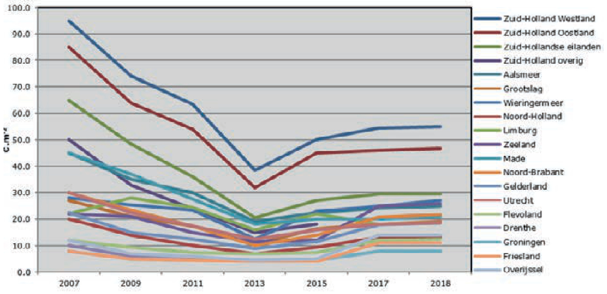  
Figure 11 Price of land in Dutch regions of plots wider than 160 meter $( \epsilon / m ^ { 2 } )$ during the period 2004 to 2015 (Source up to 2015: Wageningen University & Research LEI, source as from 2017 Westmaas Makelaardij).

Table 19 Price of land for greenhouse horticulture from 2007 - 2018 in different Dutch regions with a plot width of minimum $1 6 0 ~ m$ . Price $( \epsilon / m ^ { 2 } )$ (Source up to 2015: Wageningen University & Research LEI, source as from 2017 Westmaas Estate Agents).   

<html><body><table><tr><td></td><td>2007</td><td>2009</td><td>2011</td><td>2013</td><td>2015</td><td>2017</td><td>2018</td></tr><tr><td>Zuid-Holland Westland</td><td>95.0</td><td>74.0</td><td>63.5</td><td>38.5</td><td>50.0</td><td>54.5</td><td>55.0</td></tr><tr><td>Zuid-Holland Oostland</td><td>85.0</td><td>64.0</td><td>54.0</td><td>32.0</td><td>45.0</td><td>46.0</td><td>46.8</td></tr><tr><td>Zuid-Hollandse eilanden</td><td>65.0</td><td>48.5</td><td>36.0</td><td>20.5</td><td>27.0</td><td>29.5</td><td>29.5</td></tr><tr><td>Zuid-Holland overig</td><td>50.0</td><td>33.0</td><td>24.0</td><td>15.0</td><td>18.0</td><td>-</td><td>-</td></tr><tr><td>Aalsmeer</td><td>45.0</td><td>35.0</td><td>30.0</td><td>19.0</td><td>22.5</td><td>24.2</td><td>25.0</td></tr><tr><td>Grootslag</td><td>27.0</td><td>21.0</td><td>17.5</td><td>10.5</td><td>16.5</td><td>18.0</td><td>19.0</td></tr><tr><td>Wieringermeer</td><td>28.0</td><td>25.5</td><td>23.5</td><td>12.5</td><td>23.0</td><td>25.0</td><td>27.0</td></tr><tr><td>Noord-Holland</td><td>20.0</td><td>14.0</td><td>10.0</td><td>7.0</td><td>9.5</td><td>13.3</td><td>13.5</td></tr><tr><td>Limburg</td><td>22.0</td><td>28.0</td><td>24.5</td><td>16.0</td><td>22.0</td><td>18.0</td><td>18.5</td></tr><tr><td>Zeeland</td><td>22.0</td><td>21.0</td><td>15.0</td><td>11.5</td><td>12.0</td><td>25.0</td><td>25.9</td></tr><tr><td>Made*</td><td>45.0</td><td>37.0</td><td>27.5</td><td>18.0</td><td>20.0</td><td>20.0</td><td>21.0</td></tr><tr><td>Noord-Brabant</td><td>30.0</td><td>23.5</td><td>17.5</td><td>10.0</td><td>14.0</td><td>20.8</td><td>21.8</td></tr><tr><td>Gelderland</td><td>22.5</td><td>15.0</td><td>12.5</td><td>9.0</td><td>11.5</td><td>17.9</td><td>18.5</td></tr><tr><td>Utrecht</td><td>30.0</td><td>22.5</td><td>17.5</td><td>12.5</td><td>16.0</td><td>18.0</td><td>18.5</td></tr><tr><td>Flevoland</td><td>12.0</td><td>9.5</td><td>7.5</td><td>7.0</td><td>7.5</td><td>12.0</td><td>12.5</td></tr><tr><td>Drenthe</td><td>10.0</td><td>6.0</td><td>5.0</td><td>4.0</td><td>4.5</td><td>8.0</td><td>8.0</td></tr><tr><td>Groningen</td><td>8.0</td><td>5.0</td><td>4.5</td><td>4.5</td><td>4.5</td><td>8.0</td><td>8.0</td></tr><tr><td>Friesland</td><td>8.0</td><td>5.0</td><td>4.5</td><td>4.0</td><td>4.0</td><td>11.0</td><td>11.0</td></tr><tr><td>Overijssel</td><td>12.0</td><td>7.0</td><td>6.0</td><td>4.5</td><td>5.0</td><td>14.0</td><td>14.0</td></tr></table></body></html>

$*$ Made incl. connection to the heat water grid - $\mathbf { \partial } \cdot \mathbf { \partial } = \mathbf { \partial }$ no data available

Figure 12 shows the trend of in new greenhouse area based on data from the CBS up until 2017. The annual area of new greenhouses from 2017 – 2019 was estimated at 200 hectares (Source: platform for greenhouse suppliers (AVAG)). In addition, the area per building project showed a gradual increase until 2007 and decreased between 2007 and 2014 (Figure 13).

  
Figure 12 Development of the total new greenhouse area (ha/year) based on data from planning applications. (Source: CBS aanvragen bouwvergunningen; stopped in 2017).

  
Figure 13 Development of the area per greenhouse project based on data from planning applications. $( m ^ { 2 } /$ project) (Source: CBS aanvragen bouwvergunningen stopped in 2017).

The volume of the new greenhouses, as indicated by gutter height, remained on average around $6 ~ \mathsf { m } ^ { 3 } / \mathsf { m } ^ { 2 }$ .   
(Figure 14).

  
Figure 14 Development of the volume of the new greenhouse projects based on data from planning applications as indicated by gutter height (m). (Source: CBS aanvragen bouwvergunningen, stopped in 2017).

# 3.2 Energy

# 3.2.1

# Use by greenhouse horticulture

Figure 15 shows the total natural gas used for heating and the total net electricity consumption, including supply back to the national grid for the period 1990 – 2017 for greenhouse horticulture. Figure 16 shows the values for greenhouse horticulture per $m ^ { 2 }$ .

  
Figure 15 Development of natural gas use for heating (in million $m ^ { 3 }$ natural gas equivalents) and net electricity use (in million kWh) in greenhouse horticulture (Source: adapted from Van der Velden and Smit, 2018).

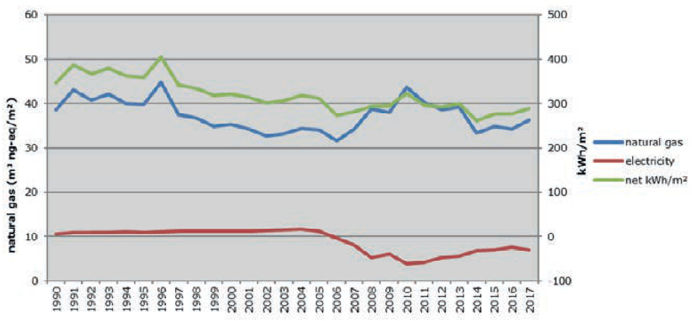  
Figure 16 Development of natural gas use for heating (in in million $m ^ { 3 }$ natural gas equivalents) and net electricity use (in million kWh/m²) in greenhouse horticulture (Source: adapted from Van der Velden and Smit, 2018) .

Table 20 Energy use (PJ) in Dutch agriculture in 2017 broken down into energy carrier.   

<html><body><table><tr><td></td><td>Total use</td><td>Balance use and production of energy</td><td>Total use of energy for conversion</td><td>energy production from</td><td>Final</td></tr><tr><td>Total energy carriers</td><td>159.7</td><td>11.1</td><td>92.6</td><td>81.5</td><td>148.6</td></tr><tr><td>Total petroleum material and products</td><td>18.2</td><td></td><td></td><td></td><td>18.2</td></tr><tr><td>Natural gas</td><td>127.4</td><td>83.9</td><td></td><td>0.1</td><td>43.5</td></tr><tr><td>Total renewable energy</td><td>14.5</td><td>79</td><td>7.9</td><td></td><td>6.6</td></tr><tr><td>Geothermal heat</td><td>3</td><td>V</td><td></td><td></td><td>3</td></tr><tr><td>Environmental energy</td><td>0.3</td><td>V</td><td></td><td></td><td>0.3</td></tr><tr><td>Solar power</td><td>1.1</td><td>1.1</td><td>1.1</td><td></td><td></td></tr><tr><td>Wind power</td><td>1.5</td><td>1.5</td><td>1.5</td><td></td><td></td></tr><tr><td>Total biomass</td><td>8.5</td><td>5.3</td><td>5.3</td><td></td><td>3.3</td></tr><tr><td>Electricity</td><td>41</td><td>-37.7</td><td>0.7</td><td>38.4</td><td>33.6</td></tr><tr><td>Heat</td><td>3.7</td><td>-43</td><td></td><td>43</td><td>46.7</td></tr></table></body></html>

Table 21 Energy content, lowest heating value of various fuels and conversion figures to comparable amounts of natural gas.   

<html><body><table><tr><td></td><td>unit</td><td>MJ/unit</td><td>kWh/unit</td><td>unit/(m³ ng.eq.)</td><td>m³ ng.eq/unit</td></tr><tr><td>Natural gas</td><td>m3</td><td>31.65</td><td>8.8</td><td>1.00</td><td>1.00</td></tr><tr><td>Fuel oil</td><td>kg</td><td>40</td><td>11.1</td><td>0.79</td><td>1.26</td></tr><tr><td>Gas oil</td><td>litre</td><td>36</td><td>10.0</td><td>0.88</td><td>1.14</td></tr><tr><td>Coal (anthracite)</td><td>kg</td><td>29</td><td>8.1</td><td>1.09</td><td>0.92</td></tr><tr><td>Coal (lignite)</td><td>kg</td><td>21</td><td>5.8</td><td>1.51</td><td>0.66</td></tr><tr><td>Wood</td><td>kg</td><td>16</td><td>4.4</td><td>1.98</td><td>0.51</td></tr></table></body></html>

# 3.2.2 Gas and electricity

As a result of agreements within the European Union, the market is fully liberalized for electricity and natural gas since July 1, 2004. Since then, all customers are free to choose their energy supplier. Regulated tariffs for the infrastructure are charged directly or indirectly to the end consumer

Customers who purchase more than $1 7 0 , 0 0 0 \mathrm { m } ^ { 3 }$ of gas per year are called metered customers. They should have a gas meter, which registers the hourly rate. Customers who consume less than $1 7 0 , 0 0 0 \mathrm { m } ^ { 3 }$ per year are called profile customers. They are charged by the volume of gas used.

Many suppliers offer metered customers a gas supply in accordance with the gas sales system of the Gasunie Trade & Supply (GuTS). The following components are included in the price:

• Gas.   
• Flexibility (capacity).   
• National transport.   
• Regional transport.   
• Other expenses.

De prijzen voor commodity en diensten zijn vrij onderhandelbaar. De prijs voor transport wordt gecontroleerd door de Autoriteit Consument en Markt (ACM) en kunt u vinden op www.acm.nl. De heffingen (Energiebelasting en BTW) worden vastgesteld door de overheid.

Other expenses and discounts for gas and services are freely negotiable. The price for transport is controlled by the Authority for Consumer and Market (ACM) and can be found at www.acm.nl. The taxes (energy tax and VAT) are set by the government.

# 3.2.2.1 Commodity

The word commodity means natural gas itself. Each cubic meter of natural gas is reduced to a normal-cubic meter with energy content of 35.17 MJ calorific value including the condensation heat in the exhaust gases. The price for a cubic meter of gas in the Netherlands is mostly set on the virtual trading point Title Transfer Facility (TTF).

# 3.2.2.2 Flexibility

The cost of flexibility, often called capacity charges, is the cost of a certain available capacity $( m ^ { 3 } / \hslash )$ . The contracted capacity is divided into a basic capacity and additional capacity. The basic capacity is the annual volume $( \mathsf { m } ^ { 3 } )$ divided by 8760 (hours per year) and describes a completely flat gas use. The additional capacity is the additional capacity available at any time (working capacity - the basic capacity). This additional capacity is a flexible tariff in € per $m ^ { 3 } .$ /hour. Fines are made for exceeding the contracted capacity.

# 3.2.2.3 National Transport

The national transport involves the transportation of gas through the infrastructure of Gas Union Transport Services (GTS). This is according to the 'entry-exit' system where the costs depend on where the gas goes into the pipes of the national transport service and where the gas goes into the regional network (GOS). Costs increase as the regional network is further afield from gas fields in Groningen. The charges are based on the contracted capacity. Exceeding the contracted transport can result in fines.

# 3.2.2.4 Regional Transport

The Regional Transport includes transportation from the GOS to the end consumer. Again, a capacity-related fee will be charged. In addition, a fixed amount is usually charged annually for regional transportation. The regional transport costs are charged directly to the end consumer. Exceedance of the contracted transport leads in most regional grids to fines of 1-4 times the regular regional transport tariff.

# 3.2.2.5 Other expenses and discounts

Other costs may involve the supplier (margins, fees), but also connection and metering costs. For further information, see www.agroenergy.nl.

# 3.2.2.6 Taxes

# Energy tax natural gas for horticulture

The gas price per cubic meter increases because of various government taxes, VAT, and Energy Tax. To qualify for a reduced Energy Tax for the use of natural gas in horticulture special permission is required. This is available from Ministry of Economic Affairs and Agriculture and power companies can often assist with application. Permission also allows a low $6 \%$ VAT rate on gas for horticultural purposes instead of the $1 9 \%$ VAT rate. One permit is continuously valid, as long as there are no changes in the management. On top of the Energy Tax, there is a tariff for the storage of sustainable energy (ODE). The Energy Tax and the Sustainable energy tariff is shown in Table 25 and Figure 17. The Energy Tax for natural gas is shown in Table 22 .

Table 22 Levels of Energy tax rates and ODE for natural gas in greenhouse horticulture (€ct/m³) 2017 to 2019.   

<html><body><table><tr><td colspan="9"></td></tr><tr><td colspan="2"></td><td colspan="3">Horticultural energy tax rate</td><td>Horticultural ODE</td><td colspan="3">General energy tax rate</td></tr><tr><td colspan="2">Level</td><td>2019</td><td>2018</td><td>2017</td><td>2019</td><td>2019</td><td>2018</td><td>2017</td></tr><tr><td>0</td><td>- 170.000 m3</td><td>4,71</td><td>4,18</td><td>4.05</td><td>0.84</td><td>29.31</td><td>26.00</td><td>25.24</td></tr><tr><td>170.000</td><td>- 1.000.000 m³</td><td>2,47</td><td>2,44</td><td>2,35</td><td>0.61</td><td>6.54</td><td>6.46</td><td>6.22</td></tr><tr><td>1.000.000</td><td>- 10.000.000 m3</td><td>2,38</td><td>2.36</td><td>2.26</td><td>0.59</td><td>2.38</td><td>2.36</td><td>2.27</td></tr><tr><td></td><td>> 10.000.000 m³</td><td>1,28</td><td>1,27</td><td>1,21</td><td>0.31</td><td>1.28</td><td>1,27</td><td>1,22</td></tr></table></body></html>

Source: http://www.belastingdienst.nl/wps/wcm/connect/bldcontentnl/belastingdienst/zakelijk/overige_belastingen/belastingen_op_ milieugrondslag/tarieven_milieubelastingen/tabellen_tarieven_milieubelastingen

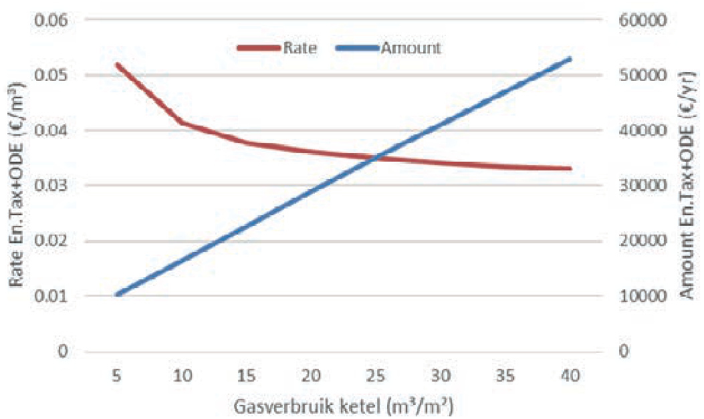  
Figure 17 Energy Tax and storage Sustainable Energy $( E B + O D E )$ in 2019 for natural gas in protected horticulture for a nursery of 4 ha for various gas consumption levels (total en $\epsilon / m ^ { 3 } .$ ).

# Energy Tax on electricity in horticulture

The Energy Tax and ODE for electricity in horticulture is shown in Table 22 en Figure 19.

Table 23 The Energy Tax and ODE for electricity in horticulture is shown in Table 23 and Figure 18   

<html><body><table><tr><td rowspan="2">Level</td><td rowspan="2"></td><td colspan="3">ET Horticulture</td><td rowspan="2">ODE Horticulture</td></tr><tr><td>2019</td><td>2018</td><td>2017</td></tr><tr><td>0</td><td>- 10.000 kWh</td><td>9.863</td><td>10.458</td><td>10,130</td><td>2019 1.89</td></tr><tr><td>10.000</td><td>- 50.000 kWh</td><td>5.337</td><td>5.274</td><td>4.901</td><td>2.78</td></tr><tr><td>50.000</td><td>- 10.000.000kWh</td><td>1.421</td><td>1.404</td><td>1.305</td><td>0.74</td></tr><tr><td>> 10.000.000 kWh companies</td><td></td><td>0.058</td><td>0.057</td><td>0.057</td><td>0.03</td></tr></table></body></html>

Source: http://www.belastingdienst.nl/wps/wcm/connect/bldcontentnl/belastingdienst/zakelijk/overige_belastingen/belastingen_op_ milieugrondslag/tarieven_milieubelastingen/tabellen_tarieven_milieubelastingen

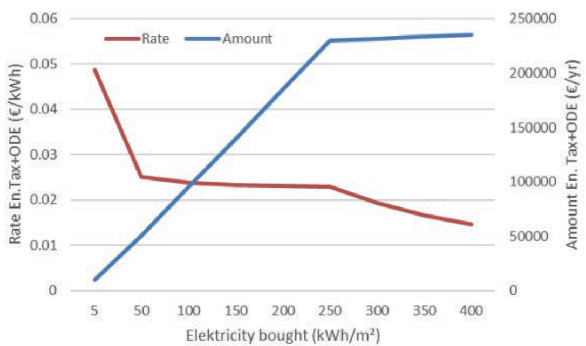  
Figure 18 Energy Tax 2019 and surcharge sustainable energy (ODE) for electricity in (greenhouse) horticulture for a nursery of 4 ha for various electricity consumption levels (total and $\epsilon / m ^ { 3 } ,$ ).

# 3.2.2.7 Profile customers (<170.000 m³/year)

For the end consumers using less than 170,000 cubic meters per year, the above costs are also charged, but the hour capacity is not measured. Costs for flexibility and national transport will be charged at a flat rate per $\mathsf { m } ^ { 3 }$ of gas. Prices from $\epsilon 0 . 1 1$ to € 0.13 per m³ apply for ten regions in The Netherlands. The costs of the regional transport are usually dependant on capacity, not only the capacity used, but also the flow capacity of the gas meter. In addition, the cost per network varies.

# 3.2.2.8 Gas futures TTF Gas market

Contracts for gas delivery via futures on the Dutch Title Transfer Facilities (TTF) gas market have been open for horticultural companies since 2007. In this market, the gas price is not fixed to the international oil price but it is based on supply and demand for gas in North West Europe. The recent price formation is shown on the next page.

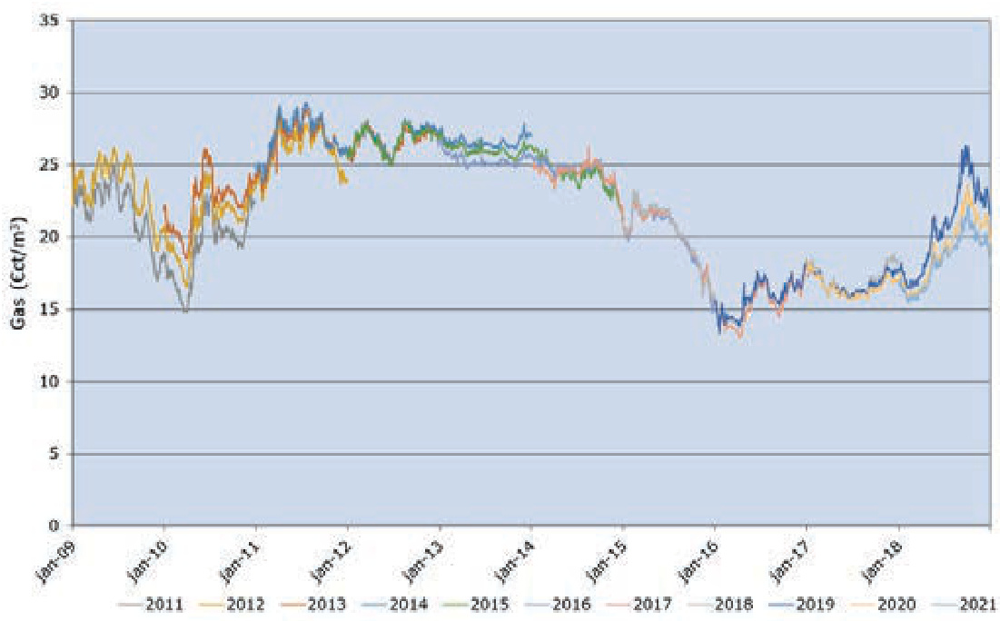  
Figure 19 Development of the TTF price for natural gas ( ${ \overline { { T T F } } } ,$ edited Alfa accountants).

On the TTF, it is not only possible to buy in, but also to sell gas volumes. In this way, as with the purchase and sale of electricity, a grower can optimize his purchasing position. In addition to trading on the futures market, it is also possible to buy on the daily market. The energy companies have embraced this situation and special contracts are now available. Figure 19 shows the development of the gas price on the TTF.

# 3.2.3 Electricity delivery to the national grid

Since the liberalization of the electricity supply, it is also possible to supply electricity back to the national electricity grid. Using a so-called heat and power (CHP) generator heat and electricity can be generated. This electricity can be used within the company, for example, for assimilation lights, but it can also be delivered to the public grid. Through careful dimensioning, both heat and electricity can be fully utilized. If the CHP is connected to a flue gas cleaner, ${ \mathsf { C O } } _ { 2 }$ from the flue gases can be used in the greenhouse. With proper alignment, an energy efficiency of almost $1 0 0 \%$ can be achieved. Use of a heat buffer renders it possible to store heat for the heat demand in the night. ${ \mathsf { C O } } _ { 2 }$ is only required during the day.

Various price zones apply to the electricity market:

• Base load: a minimum amount of delivered electricity.   
• Peak load: - To 2013: Monday / Friday from 7.00 to 23:00, 80 hours per week. - From 2014: Monday / Friday from 8.00 to 20:00, 60 hours per week.   
• Off-peak demand: remaining hours.

The price in the high demand-hours is the highest.

In practice on the nurseries where the CHP is not used for lighting, the CHP is run during the daytime. The heat not needed immediately is stored in the heat buffer. The ${ \mathsf { C O } } _ { 2 }$ is dosed into the greenhouse. Finally, the electricity is sold to the public grid.

There are many types of contract available for the supply of electricity to the national grid. In general:

- Fixed agreements for a longer period   
- Short-term agreements to supply through different traders/markets. The Figures 20 to 23 show the   
development of the electricity price. In Figure 20, this is based on the short-term market and in the Figures 21 to 23 it is based on fixed prices for the long term. For the long-term market, there is a differentiation between base load and peak load.

  
Figure 20 Development of the APX Day Ahead Base price for electricity, average per month, a year and 5 years ago. (edited from: www.apxgroup.com).

  
Figure 21 Development of the APX OTC Peak load price for electricity. (Endex, edited Alfa accountants).

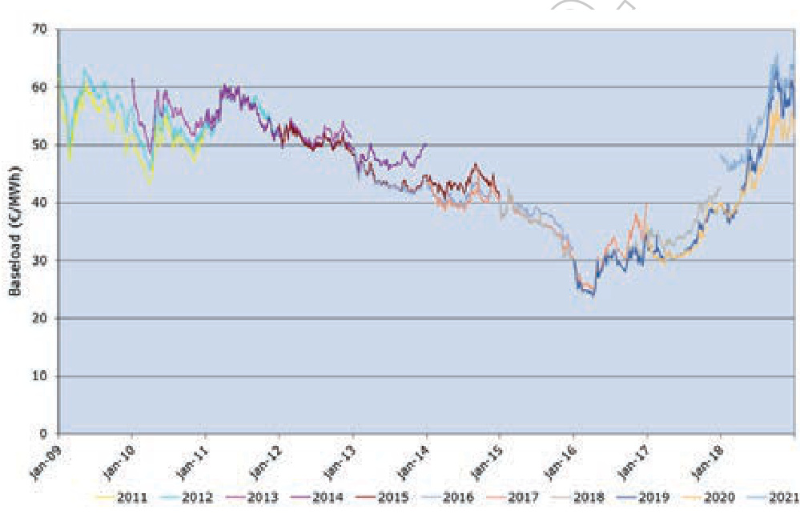  
Figure 22 Development of the APX OTC Base load price for electricity. (Endex, edited Alfa accountants).

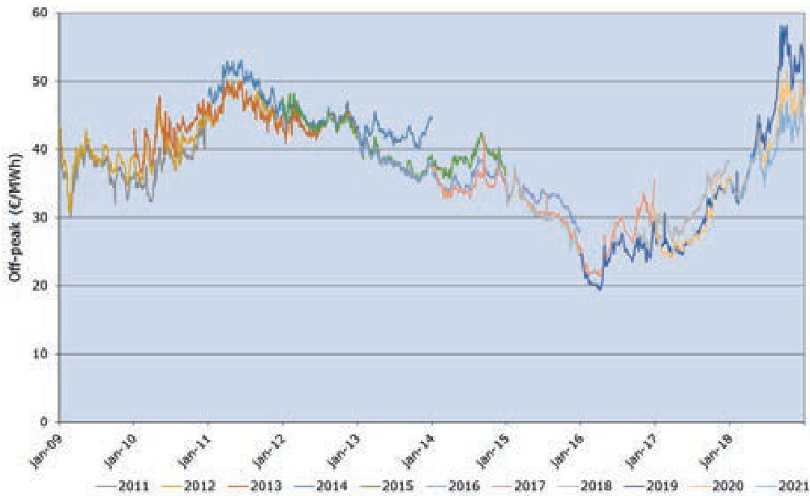  
Figure 23 Development of the calculated Off-peak price (low demand) for electricity. (Endex, edited Alfa accountants).

On agreement of an electricity contract, it is essential that the gas required is also fixed and included in the agreement. To produce 1 MWh of electricity, a CHP requires $2 7 0 - 3 1 0 \ m ^ { 3 }$ of natural gas.

If all the heat from the CHP can be used, the variable cost price of the electricity delivered is equal to the sparkspread (Figure 24). If the heat from the CHP cannot be used, the value for a MWh must be higher than the gas price $* _ { \mathsf { m } ^ { 3 } }$ gas plus the maintenance costs of the CHP. The Off-peak rate is usually below this value.

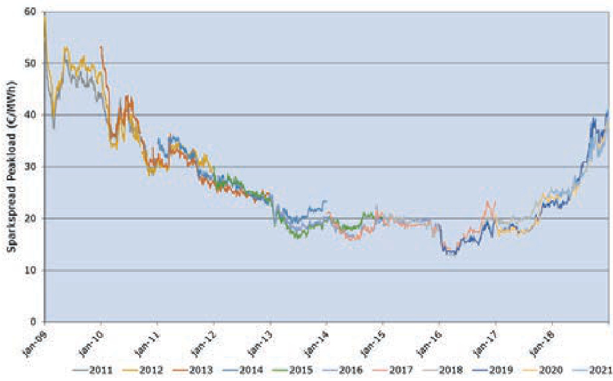  
Figure 24 Development of the Sparkspread based on the gas price and the peak load price for electricity. (TTF and Endex, edited by Alfa accountants).

1   

<html><body><table><tr><td></td><td></td><td>No lighting, no CHP</td><td></td><td> No lighting with CHP</td><td>Lighting and CHP</td></tr><tr><td>Area V</td><td>m²</td><td>40000</td><td>40000</td><td>40000</td><td></td></tr><tr><td>Electricity use</td><td>kWh/yr</td><td>400</td><td>400</td><td>6.000</td><td></td></tr><tr><td>Heat use</td><td>MJ/yr</td><td>950</td><td>950</td><td>950</td><td></td></tr><tr><td>Gas Boiler</td><td>m3/yr</td><td>1200000</td><td>200000</td><td>200000</td><td></td></tr><tr><td>Gas CHP</td><td>m3/yr</td><td>0</td><td>2000000</td><td>2000000</td><td></td></tr><tr><td>Capacity per hour</td><td>m3/yp</td><td>500</td><td>600</td><td></td><td>500</td></tr><tr><td>Electricity bought</td><td>MWh/yr</td><td>400</td><td>200</td><td></td><td>3.000</td></tr><tr><td>CHP production electricity</td><td>MWh/yr</td><td>0</td><td>7050</td><td></td><td>7050</td></tr><tr><td>Electricity supply to national grid</td><td>MWh/yr</td><td>0</td><td>-6.850</td><td></td><td>-4.050</td></tr><tr><td>Contractual capacity</td><td>kW/yr</td><td>? 130</td><td>70</td><td></td><td>4000</td></tr><tr><td>Monthly capacity</td><td> kW/mnth</td><td>125</td><td>-1710</td><td></td><td>2300</td></tr><tr><td></td><td></td><td></td><td></td><td></td><td></td></tr><tr><td>Components gas</td><td>unit</td><td>amount</td><td>rate</td><td>amount rate</td><td>amount</td></tr><tr><td>Gas</td><td>€/m³</td><td>rate € 240.000</td><td>€0,2000</td><td>€ 440.000 €0,2000</td><td>€ 440.000</td></tr><tr><td>Energy Tax</td><td>€/m3</td><td>€0,2000</td><td>€0,0518</td><td>€10.354 €0,0518</td><td>€10.354</td></tr><tr><td>Flexible costs</td><td>€/m3</td><td>€0,0341 €40.932</td><td>€1.404 €0,0012</td><td>€2.574 €0,0012</td><td>€ 2.574</td></tr><tr><td>National transport</td><td>€/(yr.m3/h)</td><td>€0,0012 €17,58</td><td>€8.792 €17,58</td><td>€10.550 €17,58</td><td>€8.792</td></tr><tr><td>Handling fee</td><td>€/m3</td><td>€0,0006</td><td>€768 €0,0006</td><td>€1.408 €0,0006</td><td>€1.408</td></tr><tr><td>Handling infra.</td><td>€/mnth</td><td>€375,00 €4.500</td><td>€375,00</td><td>€4.500 €375,00</td><td>€4.500</td></tr><tr><td>Debit tariff</td><td></td><td>1% € 2.911</td><td>1%</td><td>€4.635</td><td>1% €4.617</td></tr><tr><td>Regional transport</td><td>€/(yr.m3/h)</td><td>€ 24,93 €12.466</td><td>€24,93</td><td>€14.959 € 24,93</td><td>€12.466</td></tr><tr><td>Regional fixed costs</td><td>€/mnth</td><td>€ 540,00 €6.480</td><td>€540,00</td><td>€6.480</td><td>€ 540,00 €6.480</td></tr><tr><td>Others (regional gas grid)</td><td>€/mnth</td><td>€55,00</td><td>€660 €55,00</td><td>€660</td><td>€55,00 €660</td></tr><tr><td>Total gas</td><td>€/yr</td><td>€318.912</td><td></td><td>€ 496.119</td><td>€491.850</td></tr><tr><td>Per m3</td><td>€/m3</td><td>€0,266</td><td></td><td>€0,226</td><td>€0,224</td></tr><tr><td>Perm²</td><td>€/m²</td><td></td><td>€7,97</td><td>€12,40</td><td>€12,30</td></tr><tr><td></td><td></td><td></td><td></td><td></td><td></td></tr></table></body></html>

<html><body><table><tr><td colspan="4"> No lighting, no CHP</td><td colspan="2"> No lighting with CHP</td><td colspan="2"> Lighting and CHP</td></tr><tr><td>Components gas</td><td>unit</td><td>rate</td><td>amount</td><td>rate</td><td>amount</td><td>rate</td><td>amount</td></tr><tr><td>Electricity sold</td><td>€/MWh</td><td>€48.00</td><td>€19,200</td><td>€48.00</td><td>€9,600</td><td>€48.00</td><td>€ 144,000</td></tr><tr><td>Electricity bought</td><td>€/MWh</td><td>€56.00</td><td>€-</td><td>€56.00</td><td>€ -383,600</td><td>€56.00</td><td>€ -226,800</td></tr><tr><td>Energy Tax</td><td>€/MWh</td><td>€29.96</td><td>€ 11,986</td><td>€38.32</td><td>€7,664</td><td>€ 4.72</td><td>€ 14,147</td></tr><tr><td>Handling fee purchase</td><td>€/MWh</td><td>€0.10</td><td>€40</td><td>€0.10</td><td>€20</td><td>€0.10</td><td>€300</td></tr><tr><td>Handling fee sales</td><td>€/MWh</td><td>€0.10</td><td>€-</td><td>€0.10</td><td>€685</td><td>€0.10</td><td>€405</td></tr><tr><td>Handling fee electricity fixed</td><td>€/mnd</td><td>€375.00</td><td>€4,500</td><td>€375.00</td><td>€4,500</td><td>€375.00</td><td>€4,500</td></tr><tr><td>Debit tariff</td><td></td><td>1%</td><td>€237</td><td>1%</td><td>€ -3,688</td><td>1%</td><td>€-776</td></tr><tr><td>Transport costs V</td><td>€/MWh</td><td>€9.50</td><td>€3,800</td><td>€9.50</td><td>€1,900</td><td>€9.50</td><td>€ 28,500</td></tr><tr><td>Contract yearly capacity</td><td>€/(kw.yr)</td><td>€11.74</td><td>€1,527</td><td>€19.61</td><td>€ 1,7</td><td>€19.61</td><td>€78,432</td></tr><tr><td>Monthly capacity</td><td>€/(kW.mnth)</td><td>€1.46</td><td>€183</td><td>€1.66</td><td>€ -2,831</td><td>€1.66</td><td>€3,808</td></tr><tr><td>Fixed costs</td><td>€/mnth</td><td>€48.04</td><td>€577</td><td>€48.04</td><td>€577</td><td>€48.04</td><td>€577</td></tr><tr><td>Others (regional grid etc.)</td><td>€/mnth</td><td>€1,055.16</td><td>€12,662</td><td>€1,055.16</td><td>€12,662</td><td>€1,055.16</td><td>€12,662</td></tr><tr><td>Total electricity</td><td>€/yr</td><td></td><td>€ 54,711</td><td></td><td>-€ 351,140</td><td></td><td>€59,755</td></tr><tr><td>Per m²</td><td>€/m²</td><td></td><td>€1.37</td><td></td><td>-€ 8.78</td><td></td><td>€1.49</td></tr><tr><td>Gas en elektra per m²</td><td>€/m²</td><td></td><td>€9.34</td><td></td><td>€3.62</td><td></td><td>€13.79</td></tr></table></body></html>

# 3.2.4 Development of the oil price

The oil price is still an important factor in the development of natural gas prices. Figure 25 shows the development of the Brent oil price per barrel in $\mathsf { U S } \$ \$ \Phi$ and €.

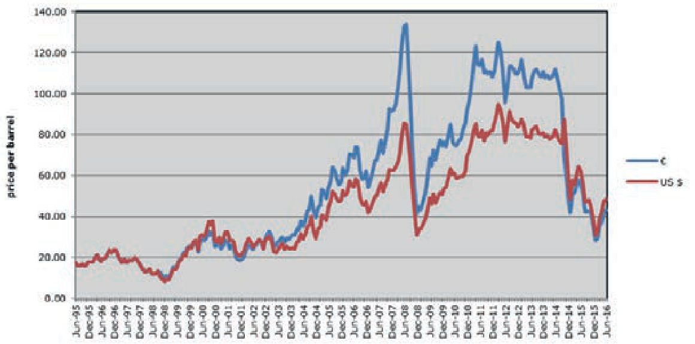  
Figure 25 Evolution of the Brent Crude Oil price per barrel (Crude Oil (petroleum), Dated Brent, light blend 38 API fob U.K., price per barrel).

# 3.3 Geothermal energy

# 3.3.1 Geothermal heat production

At the beginning of 2016, there were more than ten geothermal resources in use as a heat source in Dutch greenhouses. In 2014 these wells produced 37.5 million $\mathsf { m } ^ { 3 }$ nat. gas eq. heat and in 2016 55.5 million $\mathsf { m } ^ { 3 }$ natural gas equivalent of heat (cooling out of $3 5 ^ { \circ } \mathsf C$ ). Figure 26 shows the development of geothermal heat production for the years 2013 up to 2019.

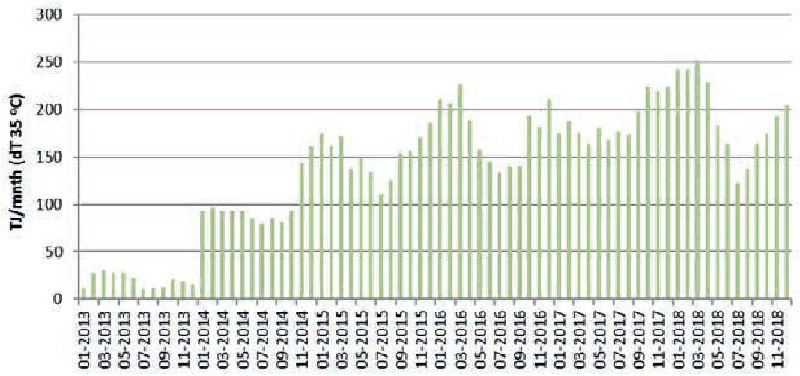  
Figure 26 Development of geothermal heat production in greenhouse horticulture, assuming an average cooling out (dT) of $3 5 \%$ . (Source: http://nlog.nl/nl/geothermalEnergy/geothermalEnergy.html d.d. 01-01-2019).

# 3.3.2 Cost of geothermal energy

The time needed from the first planning to actual production is often 3-5 years, and this is a process in which many new experiences are involved. These experiences including drilling and the operation of the geothermal sources have been published in "Roadmap for Winning Geothermal heat for Greenhouses" in December 2013 within the Dutch national project “Kas als Energiebron” (‘Greenhouse as Source of Energy’).

Table 25 Estimation of the costs of investment for a geothermal doublet.   

<html><body><table><tr><td></td><td>minimum maximum</td></tr><tr><td>Geological investigation quick scan</td><td>€10.000 €20.000</td></tr><tr><td>Geological investigation comprehensive</td><td>€ 25.000 € 250.000</td></tr><tr><td>Feasibility study</td><td>€20.000 €100.000</td></tr><tr><td>Research permit</td><td>€30.000 €70.000</td></tr><tr><td>Permitsand health and safety legislation</td><td>€70.000 €120.000</td></tr><tr><td>Construction drilling site</td><td>€ 150.000 €300.000</td></tr><tr><td>Drilling:</td><td></td></tr><tr><td>1st km depth €1.000.000</td><td></td></tr><tr><td>2nd km depth €4.000.000</td><td>€2.000.000 €5.000.000</td></tr><tr><td>3rd km depth</td><td>€5.000.000 €7.000.000</td></tr><tr><td>Drill management</td><td>€ 200.000 € 450.000</td></tr><tr><td>Heat exchangers etc.</td><td>€ 500.000 €1.500.000</td></tr><tr><td>Transport pipes 100 m</td><td>€15.000 €30.000</td></tr><tr><td>Capture incidental gases</td><td>pm pm</td></tr><tr><td>Capture incidental oil</td><td></td></tr><tr><td>Energy for the construction for drilling etc.</td><td>pm pm €200.000 €200.000</td></tr><tr><td>Soil removal and cleaning</td><td>€100.000 €150.000</td></tr><tr><td>Construction all risks insurance</td><td>€200.000 €500.000</td></tr><tr><td>SEI guarantee system for risks of geothermal projects</td><td>€300.000 €500.000</td></tr><tr><td>Initial start costs and stimulatory costs</td><td>€100.000 €250.000</td></tr><tr><td>Dutch Environmental permit</td><td>€50.000 €50.000</td></tr><tr><td>Total 2km drilling depth</td><td>€6.970.000 €11.490.000</td></tr><tr><td>Total 3 km drilling depth</td><td>€ 11.970.000 € 18.490.000</td></tr></table></body></html>

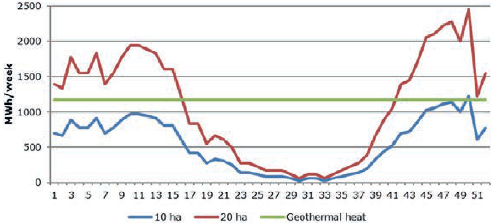  
Figure 27 Example of heat requirement for a 10 and 20 ha nursery with a heat demand of 31 $m ^ { 3 }$ gas/( $m ^ { 2 }$ . year) and the heat production of a geothermal source with a capacity of 6.94 MW (MWh/week).

In this publication ("Roadmap for Winning Geothermal Greenhouse") the estimation of minimum and maximum investment costs are shown in (Table 25). Estimation is also made of the exploitation costs and is shown in Table 26.

The operating costs depend on the heat capacity of the source, the surface area of the greenhouse and the heat demand of the greenhouse to be heated. This is shown in Figure 27. A larger surface area gives a better utilization of geothermal energy. During the summer, the geothermal source will often produce too much heat. For a nursery of 10 hectares 4,000 full-load hours are used and for 20 hectares 6000 hours.

Table 26 Criteria of the geothermal source and estimation of the exploitation costs for a geothermal circulation loop (doublet).   

<html><body><table><tr><td colspan="4"></td></tr><tr><td colspan="4">Criteria source:</td></tr><tr><td>Debit of well</td><td>m/h</td><td>160</td><td>160</td></tr><tr><td>Temperature source</td><td>℃</td><td>77</td><td>77</td></tr><tr><td>Temperature injection</td><td>℃</td><td>37</td><td>37</td></tr><tr><td>Temperature difference</td><td>℃</td><td>40</td><td>40</td></tr><tr><td>Specific mass</td><td>kg/l</td><td>1.1</td><td>1.1</td></tr><tr><td>Specific heat</td><td>J/(kg.K)</td><td>3.55</td><td>3.55</td></tr><tr><td>Heat capacity</td><td>MW</td><td>6.94</td><td>6.94</td></tr><tr><td>Running hours (max.)</td><td>h</td><td>6,000</td><td>4,000</td></tr><tr><td>Heat supplied per year</td><td>MWh</td><td>41,653</td><td>27,769</td></tr><tr><td>Heat supplied per year</td><td>GJ</td><td>149,952</td><td>99,968</td></tr><tr><td>Energy capacity natural gas (ng-eq; lower heat value)</td><td>MJ</td><td>31.6</td><td>31.6</td></tr><tr><td>Heat in natural gas equivalents</td><td>m³ gas/yr</td><td>4,745,316</td><td>3,163,544</td></tr><tr><td>Electricity used</td><td>MWh/yr</td><td>3,000</td><td>2,000</td></tr><tr><td>COP= energy production/energy input</td><td>MWh/MWh</td><td>13.9</td><td>13.9</td></tr><tr><td colspan="4"></td></tr><tr><td>Economic criteria: Electrical costs incl. transport</td><td>€/kWh</td><td>€0.08</td><td></td></tr><tr><td>Depreciation period</td><td></td><td></td><td>€0.08</td></tr><tr><td>Interest</td><td>yr</td><td>12</td><td>12</td></tr><tr><td></td><td>%</td><td>2</td><td>2</td></tr><tr><td>Investment</td><td>€</td><td>€9,500,000</td><td>€9,500,000</td></tr><tr><td>(SDE) Dutch stimulation sustainable energy fee</td><td>€/GJ</td><td>€4.90</td><td>€4.90</td></tr><tr><td colspan="4"></td></tr><tr><td>Annual costs:</td><td colspan="3">€/yr</td></tr><tr><td>Annuities</td><td></td><td>€898,316</td><td>€898,316</td></tr><tr><td>Management and maintenance</td><td>€/yr</td><td>€250,000</td><td>€250,000</td></tr><tr><td>Electricity use well</td><td>€/yr</td><td>€ 240,000</td><td>€160,000</td></tr><tr><td>Cost of extra CO2</td><td>€/yr</td><td>pm</td><td>pm</td></tr><tr><td>Capture incidental oil and gas</td><td>€/yr</td><td>pm</td><td>pm</td></tr><tr><td>Total costs</td><td>€/yr</td><td>€1,388,16</td><td>€1,308,316</td></tr><tr><td>Yield SDE</td><td>€/yr</td><td>€734,765</td><td>€489,843</td></tr><tr><td>Net costs after SDE</td><td>€/yr</td><td>€653,551</td><td>€818,473</td></tr><tr><td>Price per natural gas equivalent</td><td>€/m3ng-eq</td><td>€0.14</td><td>€0.26</td></tr><tr><td colspan="4"></td></tr></table></body></html>

The Dutch “Stimulering Duurzame Energieproductie” (Stimulation Sustainable Energy production $\mathsf { S D E + }$ subsidy scheme) has an annual application round. The conditions and the amount available vary each year.

More information on geothermal energy is available on the websites:

• http://geothermie.nl/   
• http://www.rvo.nl/subsidies-regelingen/stimulering-duurzame-energieproductie-sde   
• www.energiek2020.nl

# 3.4 ${ \mathsf { C O } } _ { 2 }$ requirement and costs

# 3.4.1 ${ \mathsf { C O } } _ { 2 }$ -requirement of the crop

A crop takes up ${ \mathsf { C O } } _ { 2 }$ during photosynthesis and converts it into organic matter. Light and water are necessary for the photosynthesis. In general, more light increases the production of organic matter by the plant. The same goes for the ${ \mathsf { C O } } _ { 2 }$ content in the (greenhouse) air. A higher ${ \mathsf { C O } } _ { 2 }$ level increases production. However, increase is proportionally less as the light and ${ \mathsf { C O } } _ { 2 }$ levels increase.

Figure 28 shows the relative production ( $\%$ weight) in relation to different daylight levels and ${ \mathsf { C O } } _ { 2 }$ levels. The outdoor air level has been set as $1 0 0 \%$ (in 2019: $\pm 4 1 5$ ppm). Figure 29 shows ${ \mathsf { C O } } _ { 2 }$ uptake of a fully-grown crop in relation to different ${ \mathsf { C O } } _ { 2 }$ levels at different radiation levels.

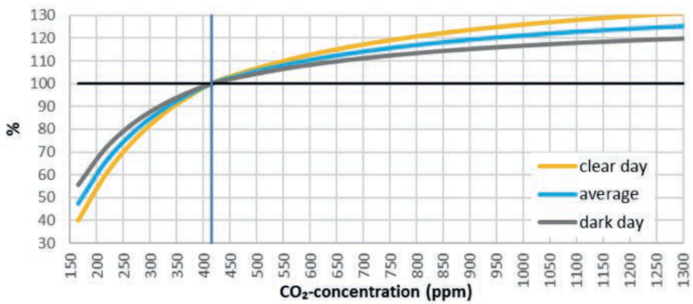  
Figure 28 Relative production in relation to CO concentration, compared to the outside $C O _ { 2 }$ level (415 ppm), at three daylight levels: a clear day, an average day and a dark day (Nederhoff, 1994).

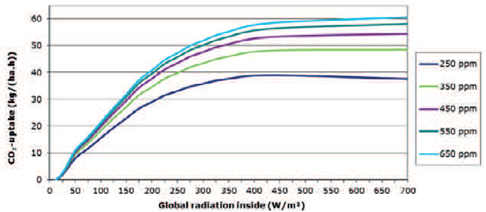  
Figure 29 $C O _ { 2 }$ uptake by the crop in relation to radiation at different $C O _ { 2 }$ concentrations, in kg per hour per ha.

Table 27 $C O _ { 2 }$ uptake by the crop and the efficiency of the three dosing strategies described above.   

<html><body><table><tr><td></td><td>laag</td><td>midden</td><td>hoog</td></tr><tr><td>CO2 kg/(m-2.year)</td><td>25,6</td><td>61,5</td><td>97,1</td></tr><tr><td>Efficiency</td><td>51%</td><td>22%</td><td>14%</td></tr></table></body></html>

Source: Vermeulen (2010)

${ \mathsf { C O } } _ { 2 }$ concentration in the greenhouse above the ambient level outside the greenhouse leads to an increase in production, but also to an extra loss of ${ \mathsf { C O } } _ { 2 }$ through ventilation. ${ \mathsf { C O } } _ { 2 }$ efficiency (crop uptake divided by available ${ \mathsf { C O } } _ { 2 } ^ { \mathsf { \Delta } }$ ) decreases as higher ${ \mathsf { C O } } _ { 2 }$ values are used. Table 27 shows the ${ \mathsf { C O } } _ { 2 }$ uptake by the crop and the efficiency for the following three ${ \mathsf { C O } } _ { 2 }$ strategies:

• Low: only dosing when there is heat demand.   
• Middle: the same, but 50 ppm higher dose.   
• High: ditto, but 100 ppm higher dose.

The course of the crop uptake and dosing and hence the efficiency of the high and low dosing strategy is shown in Figure 30.

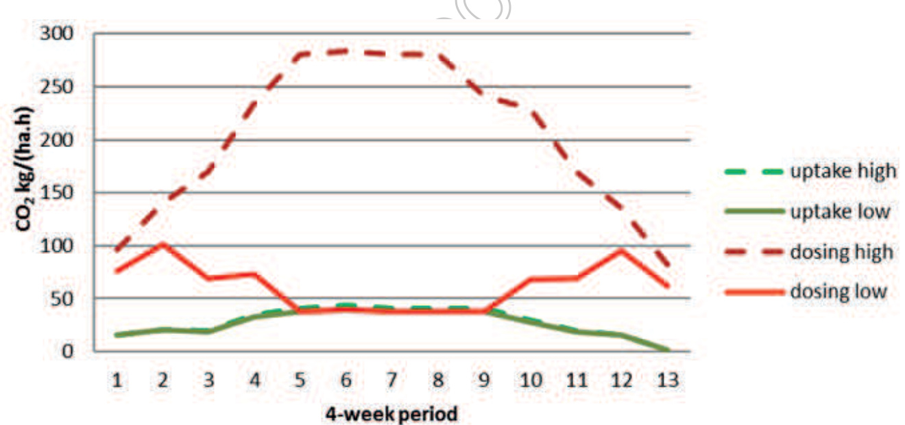  
Figure 30 Uptake of $C O _ { 2 }$ by the crop and $C O _ { 2 }$ dosage during the year for two $C O _ { 2 }$ dosing strategies: low and high.

# 3.4.2 ${ \mathsf { C O } } _ { 2 }$ -sector system and EU-ETS

To reduce the emission of ${ \mathsf { C O } } _ { 2 }$ gases, the EU has established the European ${ \mathsf { C O } } _ { 2 }$ trading system (EU ETS). The EU ETS requires companies with more than $2 0 ~ \mathsf { M W }$ of installed capacity to participate in EU ETS. For companies that do not need to participate (less than 20 MW installed capacity) the ${ \mathsf { C O } } _ { 2 }$ sector system is applicable.

The ${ \mathsf { C O } } _ { 2 }$ sector system was developed in collaboration between the Product Board for Horticulture, LTO Glaskracht Netherlands and the Ministries of Economic Affairs, Finance and I & M and came into force in 2011. Since 2015, the implementation is in the hands of the Ministry of Economic Affairs.

The ${ \mathsf { C O } } _ { 2 }$ sector system ensures the achievement of the ${ \mathsf { C O } } _ { 2 }$ target levels agreed between the industry and government in the ${ \mathsf { C O } } _ { 2 }$ covenant (2012). The ${ \mathsf { C O } } _ { 2 }$ objective is expressed as an absolute (Mton) amount of ${ \mathsf { C O } } _ { 2 }$ . This objective becomes lower annually and is included in the ${ \mathsf { C O } } _ { 2 }$ covenant up to and including 2020. In the ${ \mathsf { C O } } _ { 2 }$ sector system, the annual achievement of the ${ \mathsf { C O } } _ { 2 }$ objective is calculated. When it is exceeded, the costs of this are charged to the individual companies by offsetting the cost against the $\mathsf { m } ^ { 3 }$ gas price. With the proceeds of the sector system, the government can trade ${ \mathsf { C O } } _ { 2 }$ emission to match the ${ \mathsf { C O } } _ { 2 }$ target levels.

More information:

http://www.rvo.nl/onderwerpen/agrarisch-ondernemen/agrarische-administratie-en-registratie/co2-regelingvoor-de-glastuinbouw.

# 3.4.3 Energy Saving System Greenhouse Horticulture

The horticultural sector and the government have determined that it is desirable to develop a system that allows an individual translation of ${ \mathsf { C O } } _ { 2 }$ emissions to the companies to be realized, alongside a system for the whole sector for securing and offsetting the ${ \mathsf { C O } } _ { 2 }$ targets. This commitment is set out in the Dutch National Energy Accord (2013) and strongly depends on maintaining political and social support for the reduced tax on natural gas, which is applicable to the sector. This has resulted in the Energy Saving System Greenhouse Horticulture (EBG), which was developed by LTO Glaskracht Netherlands.

This energy saving system follows the development of gas per company. Each company has a reference level that is determined by gas consumption in 2012 and 2013 (present standard). From 2016, this company standard is reduced by $2 \%$ annually and compared with the actual gas consumption. If the annual comparison shows that the company standard is exceeded, a settlement follows on the cost of $\mathsf { m } ^ { 3 }$ gas used. The calculation rules in the energy saving system do correct for the area of the holding, demonstrably realised energy savings for 2013 and large energy-related changes in the company after 2012.

More information: https://www.glastuinbouwnederland.nl/.

3.4.4 Calculation of costs and development of ${ \mathsf { C O } } _ { 2 }$ emission trading price

$1 . 7 8 \mathrm { ~ k g ~ C O } _ { 2 }$ is released on burning 1 m³ of natural gas. The Emissions trading scheme calculates in tons of ${ \mathsf { C O } } _ { 2 }$ emissions. One tonne of ${ \mathsf { C O } } _ { 2 }$ is released on burning $5 6 2 . 8 ~ \mathsf { m } ^ { 3 }$ of natural gas. If a tonne of ${ \mathsf { C O } } _ { 2 }$ emission costs €7.50 the costs are equivalent to € 0.01335 per $\mathsf { m } ^ { 3 }$ of natural gas, and at a ${ \mathsf { C O } } _ { 2 }$ price of $\phantom { - } \epsilon 2 . 5 0$ per tonne it is € 0.00445 per $\mathsf { m } ^ { 3 }$ .

In a formula:

KCO = PCO \* 1.78 (€ / m3 natural gas) 1000   
$\mathsf { K C O } _ { 2 } =$ cost CO2 emission per $\mathsf { m } ^ { 3 }$ natural gas 4 $\cdot \epsilon / \mathsf { m } ^ { 3 }$ natural gas)   
${ \mathsf { P C O } } _ { 2 } =$ price compensation ${ \mathsf { C O } } _ { 2 }$ emission (€/tonne ${ \mathsf { C O } } _ { 2 }$ )

At present, the greenhouse horticulture has been allocated a quota of ${ \mathsf { C O } } _ { 2 }$ emissions, with no compensation. If this quota is exceeded or not reached then ${ \mathsf { C O } } _ { 2 }$ emissions will be purchased or sold as necessary. The prices mentioned above must be corrected for the percentage exceeding or not reached so as to calculate the costs or revenues. The policy has been implemented to lower the quota that is not covered by costs. The cost-free quota for greenhouse horticulture will decrease each year. The annual ${ \mathsf { C O } } _ { 2 }$ emission for greenhouse horticulture was set as 5.3 Mtonne in 2011 and 2012.

  
Figure 31 Development of the price of $C O _ { 2 }$ emission rights

The development of the price of ${ \mathsf { C O } } _ { 2 }$ emissions is shown in Figure 30. The European agreement is that the proportion of free emissions will be reduced annually for large users in the period 2013 to 2020. It is expected that the price of ${ \mathsf { C O } } _ { 2 }$ emissions will therefore increase during that period between € 20,- and € 40,- per tonne. However, by mid-2016 they are between $\in 6 , \bar { }$ and € 7,- per tonne.

# 3.5 Light

Light is the driving force behind the assimilation process. Radiation of energy particles, photons or light quanta energy is transferred from the source to the receiver. The sun is the main source for light in greenhouses. In addition, assimilation light is used for a number of crops in the winter season because the light level is not sufficient for a good quality or quantity of production. For this purpose, so-called high-pressure sodium lamps are often used. In addition, tests are now being done using LED lamps.

Various crucial figures are in circulation in order to measure the light quantity. Light is a form of energy and is measured in energy units. For assimilation lighting, the intensity and duration are important and together give the radiation sum (Table 28).

Light is comprised of oscillations of different wavelengths. The effect of light depends on the purpose for which it is used. The human eye is sensitive to other wavelengths than, for example, a green plant. (Figure 32) For the effect on humans, the amount of light is measured in lumens, a fixed number of photons $\phantom { + } 4 . 0 9 \times 1 0 1 8$ photons per second) that the eye can see. Light intensity is measured in lux ( $\mathrm { 1 \ l u x = 1 \ l m / m ^ { 2 } } .$ ).

Table 28 Important figures for energy and light.   

<html><body><table><tr><td></td><td>Unit</td><td>Power</td><td>Densityintensity</td><td>Time sum per m²</td></tr><tr><td rowspan="2">Energy</td><td rowspan="2">Joule (J) Watt hour (Wh) 1 Wh = 3,6 kJ</td><td>Watt (W)</td><td>W/m²</td><td rowspan="2">kWh/m²</td></tr><tr><td>1 W=1 J/s</td><td></td></tr><tr><td rowspan="2">Radiation</td><td>Joule (J) Watt hour (Wh)</td><td>Watt (W)</td><td>W/m2</td><td>/cm²</td></tr><tr><td>1 Wh = 3,6 kJ</td><td></td><td></td><td>MJ/m2</td></tr><tr><td>Light sensitivity eye</td><td></td><td>Lumen (Im)</td><td>lux = Im/m²</td><td></td></tr><tr><td>Light sensitivity plant</td><td></td><td>umol/s</td><td>W/m²</td><td></td></tr><tr><td>PAR or PPF</td><td></td><td></td><td>umol/(m².s)</td><td></td></tr><tr><td>PPFD</td><td></td><td></td><td></td><td>mol/m²</td></tr></table></body></html>

  
Figure 32 Light sensitivity of different golf lengths of light for a green plant and a human eye. (Figure from PL Light Systems).

The number of photons in the spectrum between 440 and $7 0 0 ~ \mathsf { n m }$ is especially important for the plant. The energy content of this part of the light is called the Photo Active Radiation (PAR). The stream of light particles, photons, in the PAR is called Photosynthetic photon flux (PPF). This is measured in the number of micromoles per sec. The portion of this flow that reaches a square meter is known as the Photosynthetic photon flux density (PPFD).

To assess which lamps are suitable, two indicators for the lamp efficiency are important, namely for the plant ${ \bf { \mu } } _ { \bf { { u m o l } } } / ( { \bf { W . s } } ) = { \bf { \mu } } _ { \bf { { u m o l } } / \bf { J } }$ and the human eye lm/W or per m² lux/W. Table 29 shows the share of PAR, how large the PPF is and the lux for various light sources. These data can be used in the calculation of the amount of light generated by a certain source.

Table 29 Amount of PAR and the amount of PPF and lumen of different light sources.   

<html><body><table><tr><td>Calculation Unit</td><td>Radiation → PAR a Watt/Watt</td><td>Radiation → PPF b μmol/j</td><td>Radiation → lux c Im/Watt</td></tr><tr><td>Daylightaverage</td><td>0.45</td><td>2.07</td><td>116</td></tr><tr><td>Daylight cloudy</td><td>0.46 - 0.53</td><td>1.93 - 2.23</td><td>108 - 125</td></tr><tr><td>Daylight sun</td><td>0.40 - 0.45</td><td>1.84 - 1.07</td><td>103 - 118</td></tr><tr><td>Light summer day</td><td>0.36</td><td>1.66</td><td>91</td></tr><tr><td>Clear blue sky</td><td>0.57</td><td>2.39</td><td>124</td></tr><tr><td></td><td></td><td></td><td></td></tr><tr><td>Light bulb</td><td>0.064 - 0.076</td><td>0.33- 0.39</td><td>16-19</td></tr><tr><td>SON-T</td><td>0.35</td><td>1.72</td><td>142</td></tr><tr><td>SON-T Agro</td><td>0.39</td><td>1.91</td><td>161</td></tr><tr><td>SON-T Plus</td><td>0.39</td><td>1.95</td><td>166</td></tr><tr><td>HPI_T LED</td><td>0.36</td><td>1.62</td><td>134</td></tr><tr><td colspan="2"></td><td colspan="2">1.90-2.30</td></tr></table></body></html>

a radiation (W/m²) to PAR (W/m²), WattPAR per WattRadiation b radiation $( \mathsf { W } / \mathsf { m } ^ { 2 } )$ to PPF $( \mu \mathrm { m } 0 | / ( \mathsf { s } . \mathsf { m } ^ { 2 } ) )$ , µmol PPF per Joule $\mathtt { R a d i a t i o n }$ c radiation (W/m²) to lux (lumen/m²), lumen per WattRadiation

The sum of the amount of PPF is measured in $\mathsf { m o l } / \mathsf { m } ^ { 2 }$ . This is calculated by multiplying the PPF per $m ^ { 2 }$ by the time in seconds. For example 8 hours light with an average of $2 0 0 ~ \mathsf { W } / \mathsf { m } ^ { 2 }$ is calculated by the following method:

Time (sec) $^ *$ radiation $( \mathsf { W } / \mathsf { m } ^ { 2 }$ ) \* calculation factor PPF (µmol/(W.s)) $\mathbf { \tau } = \mathbf { \tau }$ sum PPF $( | \mathsf { M m o l / m } ^ { 2 } )$ $8 * 3 6 0 0 * 2 0 0 * 2 . 0 7 * 1 0 - 6 = 1 1 , 9$ $( \mathsf { m o l } / \mathsf { m } ^ { 2 } )$

# 3.6 Water

Water is one of the most important elements of a plant. A good irrigation is essential for the development of a plant and production. It is therefore necessary that factors that determine the crop uptake, the crop requirements for water quality and how to optimize these points are known and can be applied.

# 3.6.1 Water requirement crop

The water uptake of the crop is dependent on many factors. Approximately $10 \%$ of the water is necessary for the growth and the rest evaporates from the plant. Table 30 shows the most important factors that influence the evaporation from the plant. The radiation from the sun and the temperature of the heating pipes are the most important factors that influence the evaporation from the plant. There are of course large differences between crops.

Table 30 Direct and indirect factors affecting evaporation of a crop.   

<html><body><table><tr><td>Direct</td><td>Indirect</td></tr><tr><td>Radiation</td><td>Ventilation greenhouse</td></tr><tr><td>Temperature heating pipes</td><td>Outside temperature</td></tr><tr><td>Airmovement</td><td>Outside humidity</td></tr><tr><td>Greenhouse temperature</td><td>Leaf area</td></tr><tr><td>Humidity greenhouse air</td><td>Moisture content substrate</td></tr><tr><td>Leaf temperature</td><td></td></tr><tr><td>CO2 concentration</td><td></td></tr></table></body></html>

Crops can be classed into four levels of water use (Table 31).

Table 31 Four water use classes $( I / ( m ^ { 2 } . y e a r ) ,$ ) and the crops.   

<html><body><table><tr><td>Low <550</td><td>Normal 550 - 750</td><td></td><td>High 750 -950 Aubergine</td><td>Very high 950 - 1100</td></tr><tr><td>Fennel KohIrabi Beet Carrot Parsley</td><td rowspan="5">Endive Asparagus Broccoli Peas Leek</td><td rowspan="5">Radish Lettuce Summer flowers</td><td rowspan="5">Melon</td><td>Amaryllis Gherkin Rose Cucumber</td></tr><tr><td>Celery Spinach White Cabbage Lambs lettuce</td></tr><tr><td>Herbs Cauliflower Spring onion</td></tr><tr><td>Paprika/Pepper Runner bean</td></tr><tr><td></td></tr><tr><td>Rhubarb Anemone Euphorbia</td><td>Chinese cabbage Courgette Other vegetables Soft fruit Celeriac Bok Choy</td><td>Carnation Bouvardia Gerbera Gladiolus Gypsophila Lily in soil Other ornamentals Tulip</td><td>Green bean Tomato Aster Chrysanthemum Iris soil Matricaria</td><td></td></tr></table></body></html>

Calculation and planning of the water requirement of a crop is complex. Wageningen University & Research, Business unit Greenhouse Horticulture has developed an evaporation model.

Table 32 shows the radiation during the year and how much rain has fallen per month in the past 10 years. The highest rainfall per day is also shown.

Table 32 Meteo point Rotterdam, per month: average radiation sum per day, rainfall sum per month and maximal rainfall per day (2002-2011).   

<html><body><table><tr><td>month</td><td>Averageradiation sum Rainfall J/(cm².day) mm/month</td><td></td><td>Max rainfall mm/day</td></tr><tr><td>2</td><td>441</td><td>71</td><td>22</td></tr><tr><td>3</td><td>922</td><td>54</td><td>20</td></tr><tr><td>4</td><td>1550</td><td>35</td><td>34</td></tr><tr><td>5</td><td>1777</td><td>63</td><td>33</td></tr><tr><td>6</td><td>1988</td><td>58</td><td>25</td></tr><tr><td>7</td><td>1805</td><td>94</td><td>75</td></tr><tr><td>8</td><td>1478</td><td>120</td><td>48</td></tr><tr><td>9</td><td>1094</td><td>69</td><td>34</td></tr><tr><td>10</td><td>640</td><td>76</td><td>30</td></tr><tr><td>11</td><td>284</td><td>83</td><td>33</td></tr><tr><td>12</td><td>180</td><td>83</td><td>33</td></tr><tr><td>Average per year</td><td>1036</td><td>877</td><td></td></tr><tr><td>Highest</td><td>1120</td><td>994</td><td></td></tr><tr><td>Lowest</td><td>1003</td><td>605</td><td></td></tr></table></body></html>

# 3.6.2 Water quality

For this chapter Voogt, W. (2008) and Sonneveld, C. and Voogt, W. (2009) were consulted.

# 3.6.2.1 Necessary analyses

It is important to know the chemical composition of the irrigation water before a crop is grown. The important aspects of different types of water are:

Rain water: EC, Na, Cl (Zn)   
Mains water: EC, Na, Cl, Ca, Mg, ${ \sf S O } _ { 4 ^ { \prime } }$ ${ \mathsf { H C O } } _ { 3 }$ .   
Springs/ground: EC, pH, Na, Cl, $\mathsf { N H } _ { 4 ^ { \prime } }$ K, Ca, Mg, ${ \mathsf { N O } } _ { 3 } ,$ ${ \sf S O } _ { 4 } ,$ ${ \mathsf { H C O } } _ { 3 } ,$ Fe-tot., Mn, Zn, B, Cu, Si en ${ \mathsf { C H } } _ { 4 }$ Desalinated water: EC, ${ \mathsf { H C O } } _ { 3 } ,$ B   
Surface water: EC, pH, Na, Cl, $\mathsf { N H } _ { 4 ^ { \prime } }$ K, Ca, Mg, ${ \mathsf { N O } } _ { 3 } ,$ SO4, HCO3, Fe-tot., Mn, Zn, B, Cu.

Based on the data of the water quality a nutrient solution schema can be calculated (Sonneveld and Voogt, 2009).

Table 33 Classification of the of EC, Na and Cl for value of the irrigation water for greenhouse horticulture\*.   

<html><body><table><tr><td>Quality class</td><td>EC mS/cm</td><td>Na mmol/l</td><td>Cl mmol/l</td></tr><tr><td>1.1</td><td><0.5</td><td><0.2</td><td><0.2</td></tr><tr><td>1.2</td><td><0.5</td><td>0.2- 0.5</td><td>0.2-0.5</td></tr><tr><td>1.3</td><td><0.5</td><td>0.5- 1.0</td><td>0.5 - 1.0</td></tr><tr><td>2.1</td><td><0.5</td><td><1.0</td><td><1.0</td></tr><tr><td>2.2</td><td><0.5</td><td>1.0 - 2.0</td><td>1.0 - 2.0</td></tr><tr><td>2.3</td><td><0.5</td><td>2.1 - 3.5</td><td>2.1 - 3.5</td></tr><tr><td>3.1</td><td>0.5 - 1.0</td><td><1.5</td><td><1.5</td></tr><tr><td>3.2</td><td>0.5 - 1.0</td><td>1.5 - 3.0</td><td>1.5-3.0</td></tr><tr><td>3.3</td><td>0.5 - 1.0</td><td>3.0 - 4.5</td><td>3.0 - 4.5</td></tr><tr><td>4.1</td><td>1.0 - 1.5</td><td><1.5</td><td><1.5</td></tr><tr><td>4.2</td><td>1.0 - 1.5</td><td>1.5 - 3.0</td><td>1.5 - 3.0</td></tr><tr><td>4.3</td><td>1.0 - 1.5</td><td>3.0 - 4.5</td><td>3.0 - 4.5</td></tr></table></body></html>

$*$ If Na and Cl are not in the same concentration then the highest value of one of these elements governs the classification.

# 3.6.2.2 EC, Na and Cl

For use in cultivation in substrate the irrigation water should only contain a limited concentration of Na and Cl. Due to the limited root volume, accumulation will occur and limits are soon exceeded. For substrate cultivation with recycling of drainage water (compulsory in The Netherlands) stricter standards apply and are based on the on the uptake levels of the crop. In crops in the ground, the levels may be higher because of the higher buffering capacity of the soil. The EC value is only a rough indication, of the quality because other ions also determine the EC value. For example, levels of nutritional elements $( 1 , \mathsf { C a } , \mathsf { M g } )$ should not be too high but the EC is a result of the ions present. Standards have been drawn up for different crops and crop nutritional management systems. An overall classification of the irrigation water into quality classes is shown in Table 34.

Table 34 Classification of the irrigation water into different quality main and sub classes.   

<html><body><table><tr><td rowspan="2">Sub class</td><td colspan="4">Main classes</td></tr><tr><td>Substrate with</td><td>2 Substrate with free</td><td>3 Substrate with free</td><td>4 Soil crops</td></tr><tr><td></td><td>recirculation drain water</td><td>drainage(<20% drain)</td><td>drainage (> 20 % drain) Soil crops</td><td></td></tr><tr><td>1 2</td><td>Suitable for all crops Suitable for salt sensitive crops</td><td>Suitable for all crops Suitable for salt sensitive crops</td><td>Suitable forall crops Suitable for salt sensitive crops</td><td>Suitable for all crops Suitable for salt sensitive crops</td></tr><tr><td></td><td>Suitable for salt</td><td>Suitable for salt</td><td>Suitable for salt</td><td>without drip irrigation Suitable for salt</td></tr><tr><td>3</td><td>tolerant crops or crops with a high Na uptakecapacity</td><td>tolerant crops</td><td>tolerant crops,soil crops without drip irrigation</td><td>tolerant crops,soil crops without drip irrigation</td></tr></table></body></html>

# 3.6.2.3 Salt intolerant crops

The salt sensitivity of a crop is determined by the both the degree of loss of production and/or by special plant reactions to salt. Crops vary greatly in sensitivity. This may relate to an overall sensitivity to the total salt concentration, or osmotic value, or it may be specific to certain ions. The nature of the product plays an important role, as in ornamentals the limit is reached earlier, because a high salt content can quickly adversely affect the decorative value often associated with flower or leaf size. It can also cause a specific effect such as scorching or desiccation in certain plant parts.

The salt sensitivity classification is separate from the Na and Cl uptake of a crop. For example a rose crop rose is moderately salt sensitive, but hardly takes up any Na.

Table 35 Crop classification of salt tolerance.   

<html><body><table><tr><td colspan="4">Crop Salt tolerance classes</td></tr><tr><td></td><td>Very sensitive</td><td>Sensitive</td><td>Tolerant</td></tr><tr><td>Vegetables</td><td>Bean</td><td>Cucumber</td><td>Tomato</td></tr><tr><td></td><td>Strawberry</td><td>Sweet pepper</td><td>Spinach</td></tr><tr><td colspan="2"></td><td>Aubergine</td><td>Endive</td></tr><tr><td colspan="2"></td><td>Melon</td><td>Radish</td></tr><tr><td colspan="2"></td><td>Lettuce</td><td>Lambs lettuce</td></tr><tr><td>Flowers</td><td>Anthurium</td><td>Gerbera</td><td>Carnation</td></tr><tr><td></td><td>Cymbidium</td><td>Hippeastrum</td><td>Euphorbia fulgens</td></tr><tr><td colspan="2"></td><td>Alstroemeria</td><td>Gypsophila</td></tr><tr><td colspan="2"></td><td>Rose</td><td>Freesia</td></tr><tr><td colspan="2"></td><td colspan="2">Anemone</td></tr><tr><td colspan="2"></td><td colspan="2">Tulip</td></tr><tr><td colspan="2"></td><td>Chrysanthemum</td><td></td></tr><tr><td colspan="2"></td><td>Bouvardia</td><td></td></tr></table></body></html>

# 3.6.2.4 Calcium, Magnesium, Sulphate and Bicarbonate

Ca, Mg and ${ \mathsf { S O } } _ { 4 }$ are crop nutrients. If, however, they occur in larger quantities in the irrigation water than the crop demand or uptake concentration there will be accumulation in the substrate or in the soil. In addition to this effect, too high Ca and Mg can cause a potential problem because they precipitate together with (bi)carbonate; while Ca can form a precipitate with sulphate. Ca, Mg and SO4 are therefore only harmful if the levels exceed certain limits. Table 36 shows an overall evaluation. When drawing up the fertilizer formula the levels of these elements must be taken into account.

In crops grown in substrate, it is necessary that the nutrient solutions are adapted to the chemical composition of the water to be used. This concerns mainly adjustments to Ca, $\mathsf { M } \mathsf { g }$ and ${ \mathsf { S O } } _ { 4 }$ . In some cases, it may also be necessary to adjust K or ${ \mathsf N } { \mathsf O } _ { 3 }$ . The adjustments are necessary because otherwise accumulation of these ions may occur in the root environment. The ion balance can shift so that the uptake of certain elements is hindered. The nutrient solution must therefore be corrected for the Ca, Mg and $S { \mathsf { O } } ^ { 4 }$ present in the water, and optionally for K or ${ \mathsf N } { \mathsf O } _ { 3 }$ . It further holds that the levels of elements may not be higher in the irrigation water than the concentrations in the advised standard nutrition solution for the crop being grown. In general, the limits are based on the most critical values, i.e. those crops which have the lowest Ca, Mg and ${ \mathsf { S O } } _ { 4 }$ requirements.

Accumulation of HCO in the root causes an increase in pH. This can be avoided by including an equivalent amount of acid in the nutrient solution for the HCO3 present. At values> $> 5 \mathsf { m m o l } / | \mathsf { H C O } _ { 3 } \$ it is true to say that due to the large amounts of nitric acid required this type water is unsuitable for economic reasons. At values $> 8$ mmol/l it is not technically possible to get a stable regime, unless it is pre-acidified in a buffer tank. At values> $1 0 \mathrm { \ m m o l / l }$ , the water is unsuitable because more acidic ions ( ${ \mathsf { N O } } _ { 3 }$ and ${ \sf H } _ { 2 } { \sf P } { \sf O } _ { 4 }$ ) must be added than are suitable for a nutrient solution.

# 3.6.2.5 Trace elements

In certain types of water, the concentrations of Mn, Zn, B, or Cu are so high that when used in crops with a limited root volume, excessive accumulation can take place. The uptake of other elements can then be restricted and the risk of toxic effects occurs. Rainwater collected from a galvanized steel greenhouse can contain too much zinc.

Further, springs/ground water can contain too much Mn, Zn or B. As a rule, the concentrations in the irrigation water must not be higher than the levels in the advised standard nutrient solution. For systems with drainage, these levels can be slightly higher. Table 36 shows the optimum maximum values.

Table 36 General maximum limits for Ca, Mg, SO4 (mmol/l) and trace elements (µmol/l) in irrigation water for four kinds of cultivation media. For specific limits per crop, the values can be found in the standard nutrient solution developed for each crop.   

<html><body><table><tr><td></td><td>Substrate with recirculation drain water</td><td>Substrate free drainage(< 20 %</td><td>Substrate free drainage (> 20 %</td><td>In soil in ground</td></tr><tr><td>Ca</td><td><2</td><td>drain) 2-3</td><td>drain) 3-5</td><td>6</td></tr><tr><td>Mg</td><td><0.5</td><td>0.5-0.75</td><td>0.75-1.5</td><td>2</td></tr><tr><td>S04</td><td><0.75</td><td>0.75-1.5</td><td>1.5-3</td><td>5</td></tr><tr><td>Fe)*</td><td></td><td></td><td></td><td></td></tr><tr><td>Drip irrigation</td><td><5</td><td><5</td><td><5</td><td><5</td></tr><tr><td>Overhead irrigation low</td><td><10</td><td><10</td><td><10</td><td><200</td></tr><tr><td>Overhead irrigation high</td><td>n.v.t.</td><td>n.v.t.</td><td>n.v.t.</td><td><50</td></tr><tr><td>Mn</td><td><10</td><td><15</td><td><15</td><td><50</td></tr><tr><td>Zn</td><td><4</td><td><7</td><td><10</td><td><50</td></tr><tr><td>B</td><td><10</td><td><20</td><td><50</td><td><100</td></tr><tr><td>Cu</td><td><0.5</td><td><0.7</td><td><1.0</td><td><5</td></tr><tr><td>Mo</td><td><1</td><td><1</td><td><1</td><td>unknown</td></tr></table></body></html>

\* total Fe-level

# 3.6.2.6 Iron

Iron is normally present in springs/ground water. This is nearly always ${ \mathsf { F e } } 2 +$ , which oxidises in contact with air to $\mathsf { F e } 3 +$ . This causes a precipitation of iron oxide, which can cause a blockage in the irrigation system. If the water with iron is to be used in dripper irrigation systems it must be de-ironized so that the water contains $5 \mu \mathrm { m o l }$ Fe per litre. If water contains organic matter the iron concentration can be (total) $1 0 \mathbin { \dot { \mathrm { ~ a ~ } } } 2 0 \mathbin { \mu \mathrm { m o l } / \mu }$ . If the crop receives overhead irrigation, the iron concentration can be up to $1 0 0 \ \mu \mathrm { m o l }$ per litre.

# 3.6.2.7 Silicium and Methane

If Si is recommended for crops, it is desirable to investigate springs/ground water for Si. For strawberry Si content must not exceed 0.5 mmol/l. In situations with great sensitivity to albino fruits (depends on nursery) Si should be less than 0.2 mmol/l. If Si-containing water is stored in ponds diatoms can grow. In that case, the Si content must be lower than 0.1 mmol/l.

Spring/ground water often contains methane and on desalination, CH4 is not sufficiently removed by reverse osmosis and therefore methane bacteria can multiply unrestrained in the purified water, which can cause troublesome blockages of the dripper system. In order to prevent clogging of drippers the methane content should be lower than 0,1 mg/l.

# 3.6.2.8 Fluoride

Fluoride damage occurs in bulbs and corm crops, especially in freesia and lily. The limit for fluoride concentration in water is 25 µmol/l. For other crops, a preventive limit of 50 is used.

# 3.6.3 Cost of water

In areas where the quality of the surface water or near surface ground water is not sufficient, use is often made of a reservoir to catch rainwater. Law requires a reservoir of at least $5 0 0 m ^ { 3 } / \hslash \sf a$ but $5 0 0 m ^ { 3 } / \hslash \sf a$ is not sufficient to supply the entire water demand. This means that in addition to this reservoir another source of water must be ensured. There are a number of alternatives, namely: spring or deeper ground water, reverse osmosis, and the purification of tap water.

Table 37 shows the percentage of the water requirement of a crop that can be supplied by rainwater. Table 32 shows the difference in rainfall per year but there are also differences within the country. This means that the supply from rainwater varies per year and per region. An additional water supply is therefore normally required.

Table 37 Estimation of the percentage water that can be supplied by rainwater uses different reservoir sizes and different water requirements. Rainfall is based on average rainfall KNMI (Dutch meteorological office measurement point Rotterdam 2002-2011).   

<html><body><table><tr><td>Reservoir size m³/ha Water use crop I/(m².year)</td><td>500</td><td>1.000</td><td>1.500</td><td>2.000</td><td>2.500</td><td>3.000</td></tr><tr><td>750</td><td>70%</td><td>80%</td><td>85%</td><td>90%</td><td>95%</td><td>95%</td></tr><tr><td>800</td><td>70%</td><td>75%</td><td>80%</td><td>85%</td><td>90%</td><td>90%</td></tr><tr><td>850</td><td>65%</td><td>75%</td><td>80%</td><td>85%</td><td>85%</td><td>85%</td></tr><tr><td>900</td><td>65%</td><td>70%</td><td>75%</td><td>80%</td><td>80%</td><td>80%</td></tr><tr><td>950</td><td>60%</td><td>65%</td><td>70%</td><td>75%</td><td>75%</td><td>75%</td></tr></table></body></html>

The surface area required for a reservoir depends on the desired capacity, shape, depth and the height and width of the walls. The depth depends on the water table. Table 38 shows the required area of a reservoir. As a risk of leakage is always present, it is assumed that the basins are divided into compartments of maximal $5 , 0 0 0 ~ \mathsf { m } ^ { 3 }$ .

Table 38 Estimation of the required area $( m ^ { 2 } )$ for rainwater reservoirs of various sizes and depths.   

<html><body><table><tr><td colspan="6">Reservoir capacity m3</td></tr><tr><td>Reservoir depth m</td><td>1.000</td><td>2.000</td><td>3.000</td><td>4.000</td><td>5.000</td><td>10.000</td><td>15.000</td></tr><tr><td></td><td>m²</td><td></td><td></td><td></td><td></td><td></td><td></td></tr><tr><td>1.5</td><td>900</td><td>1650</td><td>2400</td><td></td><td></td><td></td><td></td></tr><tr><td>2</td><td>700</td><td>1250</td><td>1850</td><td>2350</td><td>2950</td><td>5700</td><td>8550</td></tr><tr><td>2.5</td><td>500</td><td>950</td><td>1400</td><td>1900</td><td>2350</td><td>4650</td><td>6950</td></tr><tr><td>3</td><td></td><td></td><td></td><td>1550</td><td>1900</td><td>3900</td><td>5800</td></tr><tr><td>3,5</td><td></td><td></td><td></td><td></td><td>1600</td><td>3400</td><td>5150</td></tr></table></body></html>

Silos have a different surface area because there are no wide walls. The height is determined by the water pressure and by the extent to which the silo can be buried in the ground. The net surface area is shown in the following Table.

Table 39 Estimation of the net surface area for rainwater silos of various sizes and heights.   

<html><body><table><tr><td>capacity m³</td><td>height m</td><td>diameter m</td><td>Surface area m²</td></tr><tr><td>25</td><td>3.0</td><td>3.3</td><td>8</td></tr><tr><td>25</td><td>3.5</td><td>3.0</td><td>7</td></tr><tr><td>25</td><td>4.0</td><td>2.8</td><td>6</td></tr><tr><td>50</td><td>3.0</td><td>4.6</td><td>17</td></tr><tr><td>50</td><td>3.5</td><td>4.3</td><td>14</td></tr><tr><td>50</td><td>4.0</td><td>4.0</td><td>13</td></tr><tr><td>125</td><td>4.0</td><td>6.3</td><td>31</td></tr><tr><td>125</td><td>4.5</td><td>5.9</td><td>28</td></tr><tr><td>125</td><td>5.0</td><td>5.6</td><td>25</td></tr><tr><td>250</td><td>4.0</td><td>8.9</td><td>63</td></tr><tr><td>250</td><td>4.5</td><td>8.4</td><td>56</td></tr><tr><td>250</td><td>5.0</td><td>8.0</td><td>50</td></tr><tr><td>500</td><td>4.0</td><td>12.6</td><td>125</td></tr><tr><td>500</td><td>4.5</td><td>11.9</td><td>111</td></tr><tr><td>500</td><td>5.0</td><td>113</td><td>100</td></tr><tr><td>1000</td><td>4.0</td><td>17.8</td><td>250</td></tr><tr><td>1000</td><td>4.5</td><td>16.8</td><td>222</td></tr><tr><td>1000</td><td>5.0</td><td>16.0</td><td>200</td></tr></table></body></html>

The following points are important for the calculation of costs:

• The required amount of water.   
• The quality of the water.   
• The availability of rainwater and how much this covers the required amount.   
• Drain.   
• The area lost for production by placing a reservoir.

The following Table shows an example of a calculation for a nursery of 4 ha with a water demand of $9 0 0 ~ | / \mathsf { m } ^ { 2 }$ . A calculation is made of the cost of water when using reservoir of $3 , 0 0 0 ~ \mathsf { m } ^ { 3 }$ per ha. This covers $8 0 \%$ of the demand with rainwater. The remaining $20 \%$ will be from mains water. The calculation has been made with and without taking into account the loss of profit while no greenhouse can stand where the reservoir is located.

Table 40 Example of a calculation of the cost of water for a nursery of 4 ha with different sizes of rainwater reservoirs.   

<html><body><table><tr><td>Waterrequirement4ha Requirementcovered</td><td>36000m³ 70% 4000m³</td><td>36000m³ 75% 8000m³</td><td>36000m³ 80% 12000m³</td></tr><tr><td colspan="4">Reservoir size</td></tr><tr><td>Investment:</td><td></td><td>€35.000</td><td></td></tr><tr><td>Reservoir Land</td><td>€ 20.000</td><td>€105.000</td><td>€45.000 €180.000</td></tr><tr><td></td><td>€ 57.000</td><td>€140.000</td><td></td></tr><tr><td></td><td>€77.000</td><td></td><td>€ 225.000</td></tr><tr><td colspan="4">Annual costs:</td></tr><tr><td>Interest,maintenance,depreciation</td><td>€3.500</td><td>€6.125</td><td>€7.875</td></tr><tr><td>Interest land</td><td>€1.140</td><td>€2.100</td><td>€3.600</td></tr><tr><td>Mainswater€1/m3</td><td>€10.800</td><td>€9.000</td><td>€7.200</td></tr><tr><td>Total annual cost</td><td>€15.440</td><td>€17.225</td><td>€18.675</td></tr><tr><td>Cost water per m³ without loss of profit</td><td>€ 0,43</td><td>€0,48</td><td>€ 0,52</td></tr><tr><td>Loss of profit due to less greenhouse area 0,50 €/m²</td><td>€950</td><td>€1.750</td><td>€3.000</td></tr><tr><td>Cost water per m³ with loss of profit</td><td>€0,46</td><td>€0,53</td><td>€ 0,60</td></tr></table></body></html>

For each company these investments will vary, depending on location and business structure. Therefore, it is wise to use your own company-specific data in the previous example.

# 3.7 Production equipment

This section describes the replacement value, also called replacement price, given the most common production equipment in the greenhouse branch. The new value is determined by the price level of December 2015 and is based on estimates of greenhouse builders, installers, manufacturers, consultants and suppliers. All new values are exclusive VAT and as far as possible apply to a nursery size of 4 hectares $( 2 0 0 \mathsf { m } \times 2 0 0 \mathsf { m } )$ ). Subsidies are not taken into account, since these subsidies depend entirely on the individual circumstances. Depreciation is calculated according to a fixed percentage of the replacement value (replacement cost), without considering residual value. Based on these criteria, the corresponding depreciation rates have been calculated and used in the table. Table 41 also includes maintenance rates for the various means of production. Also important, but not mentioned, is the interest rate, which is set at $2 \%$ per year. For the interest costs on production equipment, this percentage is calculated over the average value during the lifetime of the equipment.

Table 41 New investment value, depreciation percentages and maintenance costs on production equipment of green  

<html><body><table><tr><td colspan="6">house horticulture.</td></tr><tr><td colspan="6">Replacement value (€)</td></tr><tr><td>Farm equipment items price level 12-2018</td><td>from</td><td>to</td><td>Unit</td><td>Depre- ciation</td><td>Mainte- nance</td></tr><tr><td>Greenhouses and buildings</td><td></td><td></td><td></td><td></td><td></td></tr><tr><td>Venlo Greenhouses</td><td></td><td>42.00</td><td>/m²</td><td>7%</td><td>0.5%</td></tr><tr><td>Standard Venlo greenhouse,</td><td>37.00</td><td></td><td></td><td></td><td></td></tr><tr><td>- 40.000 m² (200 × 200 m)</td><td></td><td></td><td></td><td></td><td></td></tr><tr><td>- 8,00 m lattice girder (2 roof sections of 4 m) - 6,50 m gutter height</td><td></td><td></td><td></td><td></td><td></td></tr><tr><td>- 5,00 m section size</td><td></td><td></td><td></td><td></td><td></td></tr><tr><td>- coated aluminium gutters,small,</td><td></td><td></td><td></td><td></td><td></td></tr><tr><td>- 1,25 m glass at the roof,</td><td></td><td></td><td></td><td></td><td></td></tr><tr><td>- a fixed concrete base,</td><td></td><td></td><td></td><td></td><td></td></tr><tr><td>- aluminium roof,</td><td></td><td></td><td></td><td></td><td></td></tr><tr><td>- single glass side wall,</td><td></td><td></td><td></td><td></td><td></td></tr><tr><td>- half automatic roof frame rail ventilation with</td><td></td><td></td><td></td><td></td><td></td></tr><tr><td>2-panes half size ventilation windows,</td><td></td><td></td><td></td><td></td><td></td></tr><tr><td>- West-European safety glass 90%+</td><td></td><td></td><td></td><td></td><td></td></tr><tr><td>- Rain water drain</td><td></td><td></td><td></td><td></td><td></td></tr><tr><td>- Condense drain</td><td></td><td></td><td></td><td></td><td></td></tr><tr><td>Standard Venlo greenhouse, the same but - 9,60 m lattice girder (2 roof section 4,8 m)</td><td>39.00</td><td>44.00</td><td>/m²</td><td>7%</td><td>0.5%</td></tr><tr><td>Standard Venlo greenhouse, the same but</td><td>40.00</td><td>45.00</td><td>/m²</td><td>7%</td><td>0.5%</td></tr><tr><td>- 12 m lattice girder (3 roof sections of 4 m)</td><td>7.00</td><td>8.00</td><td>/m²</td><td>7%</td><td>0.5%</td></tr><tr><td>Extra price: Standard Venlo greenhouse 0.5 ha Extra price: Standard Venlo greenhouse 1 ha</td><td>3.00</td><td>4.00</td><td>/m²</td><td>7%</td><td>0.5%</td></tr><tr><td>Extra price:Standard Venlo greenhouse 2 ha</td><td>0.75</td><td>1.00</td><td>/m²</td><td>7%</td><td>0.5%</td></tr><tr><td>Extra price: Standard Venlo greenhouse 10 ha</td><td>0.00</td><td>-1.00</td><td>/m²</td><td>7%</td><td>0.5%</td></tr><tr><td>Extra price: Standard Venlo greenhouse 20 ha</td><td>0.00</td><td>-1.50</td><td>/m²</td><td>7%</td><td>0.5%</td></tr><tr><td>Extra price: Standard Venlo greenhouse with gutter</td><td>2.00</td><td>2.50</td><td>/m²</td><td>7%</td><td>0.5%</td></tr><tr><td>height of 7 m instead of 6,5 m</td><td></td><td></td><td></td><td></td><td></td></tr><tr><td>Extra price for an extra gutter height of 25 cm Extra price: Standard Venlo greenhouse with a section</td><td>0.95 0.50</td><td>1.00</td><td>/m² /m²</td><td>7% 7%</td><td>0.5% 0.5%</td></tr><tr><td>size of 4,5 m instead of5 m</td><td></td><td></td><td></td><td></td><td></td></tr><tr><td>Extra price: powder coated steel construction (excl gutter)</td><td>1.50</td><td></td><td>/m²</td><td>15%</td><td>1%</td></tr><tr><td>Extra price: 6,40/ 8,00 m lattice girder</td><td>1.00</td><td></td><td>/m²</td><td>7%</td><td>0.5%</td></tr><tr><td>- 3-panes half size ventilation windows</td><td>0.00</td><td>0.25</td><td>/m²</td><td>7%</td><td>0.5%</td></tr><tr><td>Insect netting in ventilation windows (incl.neting,assembling and chancing's):consisting Venlo greenhouse</td><td></td><td></td><td></td><td></td><td></td></tr><tr><td>1 pane</td><td>90.00</td><td>110.00</td><td>/vent</td><td>20%</td><td>2%</td></tr><tr><td>2 panes</td><td>95.00</td><td>115.00</td><td>/vent</td><td>20%</td><td>2%</td></tr><tr><td>3 panes Insect netting in ventilation windows (incl. netting,</td><td>100.00 6.00</td><td>125.00 7.50</td><td>/vent /m² gh.</td><td>20% 20%</td><td>2% 2%</td></tr><tr><td>assembling and chancing's): new Venlo greenhouse</td><td></td><td></td><td>area</td><td></td><td></td></tr><tr><td>Wide span greenhouses</td><td>48.00</td><td>52.00</td><td>/m²</td><td>7%</td><td></td></tr><tr><td></td><td></td><td></td><td></td><td></td><td>0.5%</td></tr><tr><td>Wide span greenhouse - 40.000 m²</td><td></td><td></td><td></td><td></td><td></td></tr></table></body></html>

$\mathtt { - 5 , 0 0 \ m }$ section size - $\cdot 1 , 1 2 5 \mathrm { m }$ glass at the roof, - a fixed concrete base, - aluminium roof and side walls - galvanized steel construction,

<html><body><table><tr><td colspan="7">ai topventilation - 1,40 m window height</td></tr><tr><td>Wide span greenhouse,the same but</td><td>46.00</td><td>49.00</td><td></td><td>/m²</td><td>7%</td><td>0.5%</td></tr><tr><td>- half automatic 1 side roof top ventilation</td><td>20.00</td><td>22.50</td><td></td><td>/m2</td><td>7%</td><td>0.5%</td></tr><tr><td>Extra price: double polycarbonate panes in roof</td><td>9.00</td><td></td><td>10.00</td><td>/m² side</td><td>7%</td><td>0.5%</td></tr><tr><td>Extra price: 2x single glass in side wall</td><td>4.00</td><td></td><td>4.50</td><td>wall /m² gh.</td><td>20%</td><td>2%</td></tr><tr><td>Insect netting in ventilation windows (incl. netting, assembling and chancing's):new Wide span</td><td>2.50</td><td></td><td>3.00</td><td>area /m² gh.</td><td>20%</td><td>2%</td></tr><tr><td>greenhouse 2 side ventilation Insect neting in ventilation windows (incl. netting, assembling and chancing's): new Wide span</td><td>2.50</td><td></td><td>3.00</td><td>area</td><td>20%</td><td>2%</td></tr><tr><td>greenhouse 1 side ventilation All greenhouses</td><td></td><td></td><td></td><td></td><td></td><td></td></tr><tr><td>Insect netting</td><td>2.00</td><td>4.00</td><td></td><td>/m2</td><td>20%</td><td>2%</td></tr><tr><td>Extra price foundation pile:</td><td></td><td></td><td>netting</td><td></td><td></td><td></td></tr><tr><td>3m</td><td>0.25</td><td></td><td>/m² gh.</td><td></td><td>7%</td><td>0.5%</td></tr><tr><td>6m</td><td>0.50</td><td></td><td></td><td>area /m² gh.</td><td>7%</td><td>0.5%</td></tr><tr><td></td><td>1.00</td><td></td><td>/m² gh.</td><td>area</td><td>7%</td><td>0.5%</td></tr><tr><td>9m</td><td>2.00</td><td></td><td></td><td>area</td><td>7%</td><td>0.5%</td></tr><tr><td>12 m</td><td></td><td></td><td>/m² gh. area</td><td></td><td></td><td></td></tr><tr><td>Insulation board greenhouse base</td><td>9.50</td><td>13.00</td><td>/each</td><td></td><td>7%</td><td>0.5%</td></tr><tr><td>Glass</td><td></td><td></td><td></td><td></td><td></td><td></td></tr><tr><td>Floated glass 4mm LT89%+ un-tempered</td><td>5.50</td><td>6.50</td><td>/m² glass</td><td></td><td>7%</td><td>0.5%</td></tr><tr><td>Extra price tempered glass float 4mm LT89+%</td><td>7.00 3.00</td><td>8.00 6.00</td><td>/m² glass /m² glass</td><td></td><td>7% 7%</td><td>0.5% 0.5%</td></tr><tr><td>NEN2675 instead of un-tempered float 4mm LT89+%</td><td></td><td></td><td></td><td></td><td></td><td></td></tr><tr><td>Tempered diffuse (or Low Haze or Medium Haze or High Haze) 4mm with 2-sided Anti-Reflex treatment</td><td>4.50 13.50</td><td>5.50 18.00</td><td>/m² glass /m² glass</td><td></td><td>7% 7%</td><td>0.5% 0.5%</td></tr><tr><td>(PS = On the basis of figured glass)</td><td></td><td></td><td></td><td></td><td></td><td></td></tr><tr><td>Plastic greenhouses, tunnel Removable walk through plastic greenhouse tunnel</td><td></td><td></td><td></td><td></td><td></td><td></td></tr><tr><td>- 6,00 m broad;</td><td>8.00</td><td>9.00</td><td>/m²</td><td></td><td>15%</td><td>2.0%</td></tr><tr><td>- 2,60/ 3,00 m high</td><td></td><td></td><td></td><td></td><td></td><td></td></tr><tr><td>- 32 mm bow pipes</td><td></td><td></td><td></td><td></td><td></td><td></td></tr><tr><td></td><td></td><td></td><td></td><td></td><td></td><td></td></tr><tr><td>- foundation at screw anchors</td><td></td><td></td><td></td><td></td><td></td><td></td></tr><tr><td></td><td></td><td></td><td></td><td></td><td></td><td></td></tr><tr><td>- bows met top pipe & front side shore pipes</td><td></td><td></td><td></td><td></td><td></td><td></td></tr><tr><td></td><td></td><td></td><td></td><td></td><td></td><td></td></tr><tr><td>- excl. foils</td><td></td><td></td><td></td><td></td><td></td><td></td></tr></table></body></html>

<html><body><table><tr><td></td><td colspan="4"> Replacement value (€)</td><td></td></tr><tr><td>Farmeq iipment items price level12-2018</td><td>from</td><td>to</td><td>Unit</td><td>Depre- ciation</td><td>Mainte- nance</td></tr><tr><td>Plastic greenhouse tunnel with round side wall</td><td>15.00</td><td>16.00</td><td>/m²</td><td>15%</td><td>2.0%</td></tr><tr><td>- 9,30 m broad</td><td></td><td></td><td></td><td></td><td></td></tr><tr><td>- 3,70 m height</td><td></td><td></td><td></td><td></td><td></td></tr><tr><td>- 60 mm bow pipes</td><td></td><td></td><td></td><td></td><td></td></tr><tr><td>- foundation at cross plates</td><td></td><td></td><td></td><td></td><td></td></tr><tr><td>- side wall ventilation</td><td></td><td></td><td></td><td></td><td></td></tr><tr><td>- excl. foils</td><td>25.00</td><td></td><td></td><td></td><td>2.0%</td></tr><tr><td>Plastic greenhouse tunnel with vertical side wall - 6,40/ 8,00 / 9,60 / 10,00 m broad;</td><td></td><td>30.00</td><td>/m²</td><td>15%</td><td></td></tr><tr><td>- 3,40 / 3,70 / 3,90 / 4,90 m high</td><td></td><td></td><td></td><td></td><td></td></tr><tr><td>- 60 mm bow pipes</td><td></td><td></td><td></td><td></td><td></td></tr><tr><td>- foundation at concrete piles</td><td></td><td></td><td></td><td></td><td></td></tr><tr><td>- side wall ventilation (Top ventilation is an option) - excl. foils</td><td></td><td></td><td></td><td></td><td></td></tr><tr><td>Foils</td><td>1.60</td><td></td><td>/m²</td><td>30</td><td>5%</td></tr><tr><td></td><td></td><td></td><td></td><td></td><td></td></tr><tr><td>Shadow halls</td><td></td><td></td><td></td><td></td><td></td></tr><tr><td>Shadow hall, galvanized steel construction, complete assembled</td><td>8.50</td><td>10.00</td><td>/m²</td><td>15%</td><td>2%</td></tr><tr><td>Shadow - light screening netting</td><td>2.00</td><td>4.50</td><td>/m²</td><td>30%</td><td>5%</td></tr><tr><td>Groundwork</td><td></td><td></td><td></td><td></td><td></td></tr><tr><td>Levelling,sand,clay or peat < 20 cm difference</td><td>0.20</td><td></td><td>/m2</td><td>16.7%</td><td></td></tr><tr><td>Levelling,sand,clay or peat 20 - 40 cm difference</td><td>1.00</td><td>2.00</td><td>/m²</td><td>16.7%</td><td></td></tr><tr><td>Profiling</td><td>0.15</td><td></td><td>/m²</td><td>25%</td><td></td></tr><tr><td>Milling for levelling</td><td>0.15</td><td></td><td>/m²</td><td>16.7%</td><td></td></tr><tr><td>Rollers for levelling</td><td>0.05</td><td></td><td>/m²</td><td>16.7%</td><td></td></tr><tr><td>Floors, paths and farmyard</td><td></td><td></td><td></td><td></td><td></td></tr><tr><td>Equalisation ground</td><td>1.00</td><td></td><td>/m²</td><td></td><td></td></tr><tr><td>Concrete polishing</td><td>4.00</td><td></td><td>/m2</td><td></td><td></td></tr><tr><td>Sand supplementation</td><td>25.00</td><td></td><td>/m3</td><td></td><td></td></tr><tr><td>Sand supplementation 10 cm</td><td>2.50</td><td></td><td>/m²</td><td></td><td></td></tr><tr><td>Concrete path 2,5 m broad,10 cm high,incl. iron netting,equalisation and concrete polishing</td><td>25.00</td><td>30.00</td><td>/m²</td><td>7%</td><td>1%</td></tr><tr><td>Concrete floor,15 cm high,incl. concrete netting, insulation,equalisation,concrete polishing, plastics</td><td>36.00</td><td>40.00</td><td>/m²</td><td>7%</td><td>1%</td></tr><tr><td>and drainage Concrete floor heating (path) (12 tubes per 3,20 m) Concrete floor,10 cm thick,ebb/flow system with</td><td>4.25</td><td>5.00</td><td>/m²</td><td>7%</td><td>1%</td></tr><tr><td>foil,concrete netting,spacers,B25 concrete quality, environmental class 5 c or 5 d, polished,floor heating</td><td>24.00</td><td>27.00</td><td>/m²</td><td>7%</td><td>1%</td></tr><tr><td>incl. tubes and assembly (16 per 3.20 m or 20 per 4 m) excl. manifolds and PvC-tubes</td><td></td><td></td><td></td><td></td><td></td></tr><tr><td>Floor with slope towards drain (recirculating)</td><td>7.00</td><td>8.00</td><td>/m²</td><td>7%</td><td>1%</td></tr><tr><td>Lava floor +/- 5 cm (recirculating)</td><td>10.00</td><td>11.50</td><td>/m²</td><td>7%</td><td>1%</td></tr><tr><td>Lava floor (recirculating and accessible by forklift</td><td>11.00</td><td>12.50</td><td>/m2</td><td>7%</td><td>1%</td></tr><tr><td>truck) Ebb and flow floor with lava/basalt including divider</td><td></td><td></td><td></td><td></td><td></td></tr><tr><td></td><td>14.00</td><td>16.00</td><td>/m²</td><td>7%</td><td>1%</td></tr><tr><td>bars</td><td></td><td></td><td></td><td></td><td></td></tr><tr><td>Erfgoedfloor with ebb and flow excluding water</td><td>18.00</td><td>25.00</td><td>/m²</td><td>7%</td><td>1%</td></tr><tr><td></td><td></td><td></td><td></td><td></td><td></td></tr></table></body></html>

<html><body><table><tr><td></td><td colspan="6">Replacement value (€)</td></tr><tr><td></td><td></td><td></td><td></td><td>Depre-</td><td></td><td>Mainte-</td></tr><tr><td>Farm equipment items price level 12-2018 Asphalt yard</td><td>from 20.00</td><td>to 23.50</td><td>Unit /m²</td><td>ciation 7%</td><td></td><td>nance 0.5%</td></tr><tr><td>Paving</td><td>22.00</td><td>25.00</td><td>/m²</td><td></td><td>7%</td><td>0.5%</td></tr><tr><td>Drainage</td><td></td><td></td><td></td><td></td><td></td><td></td></tr><tr><td>Direct watering to ditch with plastic tubes and one hose each 3.20 m</td><td>1.00</td><td></td><td>/m²</td><td></td><td>7%</td><td>1%</td></tr><tr><td>Closed system,with storage pit dewatering plastic tubes and one tube each 3.20 or 4 m,include storage pit and motor pump</td><td>1.25</td><td></td><td>/m²</td><td></td><td>7%</td><td>1%</td></tr><tr><td>Drainage (O6 cm single polypropylene-450,excl.drain slot fill)</td><td>2.00</td><td></td><td>/m</td><td></td><td>7%</td><td>1%</td></tr><tr><td>Drain gutter padding (styromull grains)</td><td>0.85</td><td></td><td>/m</td><td></td><td>7%</td><td>1%</td></tr><tr><td>Main drain,polypropylene-450,Q12 cm (incl. T-pieces)</td><td>5.00</td><td></td><td>/m</td><td></td><td>7%</td><td>1%</td></tr><tr><td>Concrete storage pit (incl. installation)</td><td>1,200</td><td>1,400</td><td>/each</td><td></td><td>7%</td><td>1%</td></tr></table></body></html>

<html><body><table><tr><td>Buildings</td></tr><tr><td>Standard greenhouse shed, - 12,80 m x 16,00 m sections,</td></tr><tr><td>- 4,50 m gutter height,</td></tr><tr><td>- 10 cm concrete floor, - 1,55 m half stone wall,</td></tr><tr><td>- 1,20 m glass in the wall,</td></tr><tr><td>- sheet piling wall,</td></tr><tr><td>- insulated corrugated sheets fibre cement roof</td></tr><tr><td>100-300 m² 400 550 /m²</td></tr><tr><td>300-500 m² 375 500</td></tr><tr><td>> 500 m² 350 450 /m²</td></tr><tr><td>Docking station and dock shelter 60,000 100,000 7%</td></tr><tr><td>Greenhouse shed:</td></tr><tr><td>- steel construction, 200 240 /m² 7%</td></tr><tr><td>- insulated corrugated sheets fibre cement wall,</td></tr><tr><td>- insulated corrugated sheets fibre cement roof</td></tr><tr><td>< 200 m² 200 240 /m² 7%</td></tr><tr><td>> 200 m² 180 220 /m2 7%</td></tr><tr><td>Boiler house:</td></tr><tr><td>- 1,50 m half stone wall and the other part glass,</td></tr><tr><td>- insulated corrugated sheets fibre cement roof,</td></tr><tr><td>< 200 m² 225 250 /m²</td></tr><tr><td>200-400 m² 215 240 /m²</td></tr><tr><td>> 400 m² 200 220 /m² 7%</td></tr><tr><td>Extra price interior: (shower, wc,cantina and office) 450 650 /m² 7% 0.5%</td></tr><tr><td>perm²interior interior</td></tr><tr><td>Extra price internal wall in boiler house: 100 120 /m² wall 4% 0.5%</td></tr><tr><td>- 1,50 m half stone wall and the other part glass 90 110 /pile 4% 0.5%</td></tr><tr><td>Extra price:insulation 25 28 /m² 4% 0.5%</td></tr><tr><td>Extra price:floor heating 5 7 /m² 4% 0.5%</td></tr><tr><td>Extra price: cavity wall instead of half stone wall 90 100 /m2 4% 0.5%</td></tr></table></body></html>

<html><body><table><tr><td></td><td colspan="4">Replacementvalue (€)</td><td></td></tr><tr><td></td><td></td><td></td><td>Unit</td><td>Depre- ciation</td><td>Mainte-</td></tr><tr><td>Farmequipmentitems price level12-2018 Cold store rooms</td><td>from</td><td>to</td><td></td><td></td><td>nance</td></tr><tr><td colspan="6">Cold store installation in shed (excl.cooling unit and</td></tr><tr><td>incl.insulation) 30 m² floor,3500 mm height,100 mm panels</td><td></td><td></td><td></td><td></td><td></td></tr><tr><td colspan="6">Cooling unit for fixed cold rooms,compressor with evaporation unit,including mounting and electrical connection.Store room temperature +2°C to +10C</td></tr><tr><td>1,5 kW</td><td>5,500</td><td>6,000</td><td></td><td>8%</td><td>5%</td></tr><tr><td>4 kW</td><td>7,250</td><td>7,750</td><td></td><td>8%</td><td>5%</td></tr><tr><td>10kW</td><td>11,500</td><td>12,250</td><td></td><td>8%</td><td>5%</td></tr><tr><td colspan="6">Demountable cold store,insulation 150 mm polystyrene hard foam PS 20,complete with coolerand evaporator,</td></tr><tr><td colspan="6">built in the shed. Store room temperature +2°C to +10oC Cooling unit temperature -5°C to +40C</td></tr><tr><td>60 m³</td><td>17,000</td><td>18,000</td><td></td><td>8%</td><td>2.5%</td></tr><tr><td>100 m³</td><td>25,500</td><td>26,500</td><td></td><td>8%</td><td>2.5%</td></tr><tr><td>200m³</td><td>40,000</td><td>42,000</td><td></td><td>8%</td><td>2.5%</td></tr><tr><td>300m³</td><td>58,000</td><td>60,000</td><td></td><td>8%</td><td>2.5%</td></tr><tr><td>Sliding doors - 2.200*2.400 mm (b*h) manually operated</td><td>2,900</td><td>3,100</td><td>/each</td><td>8%</td><td>2.5%</td></tr><tr><td>Revolving door- 950*2.200 mm</td><td>800</td><td>900</td><td>/each</td><td>8%</td><td>2.5%</td></tr><tr><td>Maintenance contract incl.compulsory CFC control</td><td>125</td><td>160</td><td>/year</td><td></td><td></td></tr></table></body></html>

# HEATING INSTALLATION

<html><body><table><tr><td colspan="5">Utilities</td></tr><tr><td colspan="5">Gas connection,meter and enclosure (maintenance is connection tariff and meter rental):</td></tr><tr><td>< 100 Nm³/h</td><td>15,800</td><td>22,800</td><td>7%</td><td>250</td></tr><tr><td>100-160 Nm³/h</td><td>15,700</td><td>23,100</td><td>7%</td><td>250</td></tr><tr><td>160-250 Nm³/h</td><td>18,700</td><td>24,700</td><td>7%</td><td>600</td></tr><tr><td>250-650 Nm³/h</td><td>21,000</td><td>24,700</td><td>7%</td><td>600</td></tr><tr><td>650-1600 Nm3/h</td><td>22,000</td><td>28,900</td><td>7%</td><td>600</td></tr><tr><td colspan="5">Electricity connection:</td></tr><tr><td>>3×80At/m3×125A</td><td></td><td>4,300</td><td>7%</td><td>70</td></tr><tr><td>> 3 ×125A t/m 175 kVA</td><td></td><td>4,800</td><td>7%</td><td>70</td></tr><tr><td>> 175 kVA t/m 630 kVA</td><td>7,000</td><td>34,500</td><td>7%</td><td>640</td></tr><tr><td>> 630 kVA t/m 1.000 kVA</td><td>15,000</td><td>38,000</td><td>7%</td><td>640</td></tr><tr><td>> 1.000 kVA t/m 1.750 kVA</td><td>22,500</td><td>48,000</td><td>7%</td><td>640</td></tr><tr><td>> 1.750 kVA t/m 3.000kVA</td><td>70,000</td><td>195,000</td><td>7%</td><td>1500</td></tr><tr><td>> 3.000 kVA t/m 10.000 kVA</td><td>170,000</td><td>266,000</td><td>7%</td><td>7500</td></tr><tr><td>Transformer 40oo kVA incl. housing</td><td>175,000</td><td>225,000</td><td>7%</td><td>0.5%</td></tr><tr><td>Boilers</td><td></td><td></td><td></td><td></td></tr><tr><td colspan="5">Boiler,burner, chimney, condenserelectrics,5 mix groups,insulation:</td></tr><tr><td>1,16 MW</td><td>53,000</td><td>63,000</td><td>7%</td><td>1%</td></tr><tr><td>1,74 MW</td><td>58,000</td><td>69,000</td><td>7%</td><td>1%</td></tr><tr><td>2,32 MW</td><td>71,000</td><td>84,000</td><td>7%</td><td>1%</td></tr><tr><td>3,48 MW</td><td>83,000</td><td>97,000</td><td>7%</td><td>1%</td></tr><tr><td>4,64 MW</td><td>91,000</td><td>107,000</td><td>7%</td><td>1%</td></tr><tr><td>5,80 MW</td><td>100,000</td><td>120,000</td><td>7%</td><td>1%</td></tr><tr><td>9,28 MW</td><td></td><td></td><td></td><td>1%</td></tr><tr><td></td><td>129,000</td><td>154,000</td><td>7%</td><td></td></tr><tr><td>Extra price for additional mix group department</td><td>2,250</td><td>2,500</td><td>7%</td><td>1%</td></tr></table></body></html>

<html><body><table><tr><td></td><td colspan="2">Replacement value (€)</td><td colspan="2"></td></tr><tr><td></td><td></td><td></td><td>Depre-</td><td>Mainte-</td></tr><tr><td>Farm equipment items price level 12-2018 Pressure expansion vessel (nitrogen) to 5 m3</td><td>from 1,500</td><td>to 1,700</td><td>Unit ciation 7%</td><td>nance 1%</td></tr><tr><td>Expansionmachine</td><td>12,000</td><td></td><td>7%</td><td></td></tr><tr><td>Boilers stones</td><td>800</td><td>18,000</td><td>20%</td><td>1% 1%</td></tr><tr><td>Airgrilles</td><td>800</td><td></td><td>5%</td><td>0.5%</td></tr></table></body></html>

<html><body><table><tr><td>11 Boilers stones</td><td>2,000 800</td><td>10,000</td><td>20%</td><td>1%</td></tr><tr><td>Air grilles</td><td>800</td><td></td><td>5%</td><td>0.5%</td></tr><tr><td colspan="5"></td></tr><tr><td colspan="5">Condensers and retarders Single condenser(steel with pipes or aluminium fins,including thermometers,drain pan,connection,excl.mix</td></tr><tr><td>group)at boiler capacity: 2,32 MW</td><td>12,500</td><td>-13,500</td><td>14%</td><td>1%</td></tr><tr><td>4,64 MW</td><td>18,000</td><td>-20,000</td><td>14%</td><td>1%</td></tr><tr><td>9,28 MW</td><td>23,500</td><td>-26,500</td><td>14%</td><td>1%</td></tr><tr><td colspan="5">Combi condenser(steel with pipes or aluminium fins,including thermometers,drain pan,connection,excl. mix</td></tr><tr><td>group) at boiler capacity: 1,16 MW</td><td>10,500</td><td>-12,500</td><td>14%</td><td>1%</td></tr><tr><td>1,74 MW</td><td>12,500</td><td>-14,500</td><td>14%</td><td>1%</td></tr><tr><td>2,32 MW</td><td>14,000</td><td>-17,500</td><td>14%</td><td>1%</td></tr><tr><td>3,48 MW</td><td>16,500</td><td>-19,000</td><td>14%</td><td>1%</td></tr><tr><td>4,64 MW</td><td>20,500</td><td>-24,000</td><td>14%</td><td>1%</td></tr><tr><td>5,80 MW</td><td>21,000</td><td>-24,500</td><td>14%</td><td>1%</td></tr><tr><td>6,96 MW</td><td>21,500</td><td>-25,000</td><td>14%</td><td>1%</td></tr><tr><td>8,12 MW</td><td>23,500</td><td>-27,000</td><td>14%</td><td>1%</td></tr><tr><td>9,28 MW</td><td>25,000</td><td>-28,500</td><td>14%</td><td>1%</td></tr><tr><td colspan="5">Retarder:at boiler capacity:</td></tr><tr><td>2,32 MW</td><td>700</td><td>850</td><td>/boiler 7%</td><td>0.5%</td></tr><tr><td>4,64 MW</td><td>850</td><td>1,050</td><td>/boiler 7%</td><td>0.5%</td></tr><tr><td>9,28 MW</td><td>1,250</td><td>1,450</td><td>/boiler 7%</td><td>0.5%</td></tr><tr><td colspan="5">Cogeneration plant (total)</td></tr><tr><td>Cogeneration plant:</td><td></td><td></td><td></td><td></td></tr><tr><td>0,50 MWe</td><td>341k</td><td>368k</td><td></td><td>60000 h 11.50€/MWh</td></tr><tr><td>0,75 MWe</td><td>368k</td><td>410k</td><td>60000 h</td><td>60000 h 10.50€/MWh</td></tr><tr><td>1,0 MWe</td><td>394k</td><td>441k</td><td>60000 h</td><td>9,25€/MWh</td></tr><tr><td>1,5 MWe</td><td>536k</td><td>588k</td><td></td><td>7,30€/MWh</td></tr><tr><td>2,0 MWe</td><td>683k</td><td>746k</td><td>60000 h</td><td>7,10€/MWh</td></tr><tr><td>3,0 MWe</td><td>1,050k</td><td>1,210k</td><td>60000 h</td><td>6,95€/MWh</td></tr><tr><td>4,0 MWe Flue gas cleaners at CHP power: maintenance without ureum</td><td>1,420k</td><td>1,730k</td><td>60000 h</td><td>6,65€/MWh</td></tr><tr><td colspan="5">0,50 MWe</td></tr><tr><td>0,75 MWe uw@</td><td>89k 95k</td><td>116k 121k</td><td>10% 10%</td><td>2,00€/h 2,50€/h</td></tr><tr><td>1,0 MWe</td><td>100k</td><td>137k</td><td>10%</td><td>3,25€/h</td></tr><tr><td>1,5 MWe</td><td>121k</td><td>163k</td><td>10%</td><td>3,30€/h</td></tr><tr><td></td><td></td><td></td><td></td><td></td></tr><tr><td>2,0 MWe</td><td>137k</td><td>179k</td><td>10%</td><td>3,75€/h</td></tr><tr><td>3,0 MWe</td><td>152k</td><td>189k</td><td>10%</td><td>5,50€/h</td></tr><tr><td>4,0 MWe</td><td>210k</td><td>263k</td><td>10%</td><td>6,25€/h</td></tr><tr><td>COdiNOx flue gas analyser</td><td>16,000</td><td>20,000</td><td>10%</td><td>5%</td></tr><tr><td>Emergency powergenerator gasoil</td><td>15,500</td><td>17,500</td><td>5%</td><td>5%</td></tr></table></body></html>

# Heat Pump

Heat pump (including acoustics and control technology) cooling capacity (kW)

<html><body><table><tr><td colspan="6">Farm equipment items price level 12-2018</td></tr><tr><td>1,200</td><td>from 131k</td><td>to 255k</td><td>Unit /each</td><td>ciation 7%</td><td>nance 1.5%</td></tr><tr><td>1,500</td><td>163k</td><td>296k</td><td>/each</td><td>7%</td><td>1.5%</td></tr><tr><td>2,500</td><td>236k</td><td>459k</td><td>/each</td><td>7%</td><td>1.5%</td></tr><tr><td>3,000</td><td>268k</td><td>571k</td><td>/each</td><td>7%</td><td>1.5%</td></tr><tr><td>4,500</td><td>357k</td><td>745k</td><td>/each</td><td>7%</td><td>1.5%</td></tr><tr><td>6,000</td><td>420k</td><td>734k</td><td>/each</td><td>7%</td><td>1.5%</td></tr><tr><td>7,500</td><td>468k</td><td>816k</td><td>/each</td><td>7%</td><td>1.5%</td></tr><tr><td>Wood Stove</td><td></td><td></td><td></td><td></td><td></td></tr><tr><td>Biomass incineration plant (complete installation and storage silo)</td><td></td><td></td><td></td><td></td><td></td></tr><tr><td>0,5 MWth</td><td>150k</td><td>175k</td><td></td><td>10%</td><td>10%</td></tr><tr><td>1 MWth</td><td>280k</td><td>315k</td><td></td><td>10%</td><td>10%</td></tr><tr><td>Geothermal</td><td></td><td></td><td></td><td></td><td></td></tr><tr><td>Start-up costs (permits, drilling management, drilling site,self-assessment)</td><td>555k</td><td>1,360k</td><td></td><td>4%</td><td></td></tr><tr><td>Doublet drilling,(de-)mounting drill plant 1st km</td><td></td><td></td><td></td><td></td><td>5.0%</td></tr><tr><td>2nd km</td><td>1,000k</td><td>2,000k</td><td></td><td>4%</td><td>5.0%</td></tr><tr><td>3rd km</td><td>4,000k</td><td>5,000k</td><td></td><td>4%</td><td>5.0%</td></tr><tr><td></td><td>5,000k</td><td>7,000k</td><td></td><td>4% 10%</td><td>10.0%</td></tr><tr><td>Installation (heat exchanger, pumps, piping,drain and rinse，power and gas and oil separation, torch)</td><td>915k</td><td>2,130k</td><td></td><td></td><td></td></tr><tr><td>SEI detection risk insurance Car-insurance</td><td>300k</td><td>500k</td><td></td><td>4%</td><td></td></tr><tr><td></td><td>200k</td><td>500k</td><td></td><td>4%</td><td></td></tr><tr><td>Well/aquifer</td><td></td><td></td><td></td><td></td><td></td></tr><tr><td>Well/aquifer capacity</td><td></td><td></td><td></td><td></td><td></td></tr><tr><td>120 m³/h</td><td>117k</td><td>130k</td><td>/each</td><td>7%</td><td>10,000 10,000</td></tr><tr><td>160 m3/h</td><td>280k</td><td>310k</td><td>/each</td><td>7%</td><td></td></tr><tr><td>200 m3/h</td><td>380k</td><td>420k</td><td>/each</td><td>7%</td><td>11,200</td></tr><tr><td>400 m³/h</td><td>665k</td><td>740k</td><td>/each</td><td>7%</td><td>17,600</td></tr><tr><td>600 m³/h</td><td>950k</td><td>1,060k</td><td>/each</td><td>7%</td><td>24,000</td></tr><tr><td>800 m3/h</td><td>1,240k</td><td>1,380k</td><td>/each</td><td>7%</td><td>30,400</td></tr><tr><td>1000 m³/h</td><td>1,500k</td><td>1,700k</td><td>/each</td><td>7%</td><td>36,800</td></tr><tr><td>Windmill, hub height 70m,blade diameter 80m,2_MW,1600</td><td></td><td></td><td></td><td></td><td></td></tr><tr><td>MWh</td><td>1,750k</td><td>3,000k</td><td></td><td></td><td>7% 11€/MWh</td></tr><tr><td>hub height 80m,blade diameter 90m,3 MW, 2100 MWh</td><td>2,250k</td><td>4,500k</td><td></td><td></td><td>7% 11€/MWh</td></tr><tr><td>hub height 90m,blade diameter140m,5.5 MW, 5500 MWh</td><td>3,500k</td><td>8,300k</td><td></td><td></td><td>7% 11€/MWh</td></tr><tr><td>Solar Panels</td><td></td><td></td><td></td><td></td><td></td></tr><tr><td>1000 m² 155 peakW/m²,124 MWh</td><td>120k</td><td>200k</td><td></td><td>4%</td><td>0.01</td></tr><tr><td></td><td></td><td></td><td></td><td></td><td></td></tr><tr><td>Heat Storage</td><td></td><td></td><td></td><td></td><td></td></tr><tr><td></td><td></td><td></td><td></td><td></td><td></td></tr><tr><td>Heat storage tank: (incl. connection,regulation,expansion-extension,concrete and insulation)</td><td></td><td></td><td></td><td></td><td></td></tr><tr><td></td><td></td><td></td><td></td><td></td><td></td></tr><tr><td></td><td></td><td></td><td></td><td></td><td></td></tr><tr><td></td><td></td><td></td><td></td><td></td><td></td></tr><tr><td></td><td></td><td></td><td></td><td></td><td></td></tr><tr><td></td><td></td><td></td><td></td><td></td><td></td></tr><tr><td></td><td></td><td></td><td></td><td></td><td></td></tr><tr><td></td><td></td><td></td><td></td><td></td><td></td></tr><tr><td></td><td></td><td></td><td></td><td></td><td></td></tr><tr><td></td><td></td><td></td><td></td><td></td><td></td></tr><tr><td></td><td></td><td></td><td></td><td></td><td></td></tr><tr><td></td><td></td><td></td><td></td><td></td><td></td></tr><tr><td></td><td></td><td></td><td></td><td></td><td></td></tr><tr><td></td><td></td><td></td><td></td><td></td><td></td></tr><tr><td></td><td></td><td></td><td></td><td></td><td></td></tr><tr><td></td><td></td><td></td><td></td><td></td><td></td></tr><tr><td></td><td></td><td></td><td></td><td></td><td></td></tr><tr><td></td><td></td><td></td><td></td><td></td><td></td></tr><tr><td></td><td></td><td></td><td></td><td></td><td></td></tr><tr><td></td><td></td><td></td><td></td><td></td><td></td></tr><tr><td></td><td></td><td></td><td></td><td></td><td></td></tr><tr><td></td><td></td><td></td><td></td><td></td><td></td></tr><tr><td></td><td></td><td></td><td></td><td></td><td></td></tr><tr><td></td><td></td><td></td></table></body></html>

<html><body><table><tr><td></td><td colspan="2">Replacementvalue (€)</td><td></td><td></td></tr><tr><td></td><td></td><td></td><td>Depre-</td><td>Mainte-</td></tr><tr><td>Farm equipment items price level 12-2018 350 m³ capacity</td><td>from 87,600</td><td>to 95,000</td><td>ciation 7%</td><td>nance 2%</td></tr><tr><td>500 m³ capacity</td><td>97,900</td><td>104,000</td><td>7%</td><td>2%</td></tr><tr><td>1.000 m³ capacity</td><td>185,400</td><td>200,000</td><td>7%</td><td>2%</td></tr><tr><td>4,500 m³ capacity</td><td>350,000</td><td>400,000</td><td>7%</td><td>2%</td></tr></table></body></html>

# Heating systems in the greenhouse

<html><body><table><tr><td colspan="6">Secondary and main pipes,welding and construction,tubes fixed to steel bars or on the floor</td></tr><tr><td>2 × 51 mm/4 m span</td><td>4.20</td><td>4.75</td><td>/m2</td><td>7%</td><td>0.5%</td></tr><tr><td>3 × 51 mm/4 m span</td><td>4.50</td><td>5.40</td><td>/m2</td><td>7%</td><td>0.5%</td></tr><tr><td>4 × 51 mm/4 m span</td><td>5.30</td><td>6.10</td><td>/m²</td><td>7%</td><td>0.5%</td></tr><tr><td>5 × 51 mm/4 m span</td><td>5.60</td><td>6.70</td><td>/m²</td><td>7%</td><td>0.5%</td></tr><tr><td>6 x 51 mm/4 m span</td><td>6.05</td><td>7.10</td><td>/m²</td><td>7%</td><td>0.5%</td></tr><tr><td colspan="6">Secondary and main pipes,welding and construction,tubes fixed at the top of the greenhouse</td></tr><tr><td>2 × 51 mm/4 m span</td><td>4.50</td><td>5.50</td><td>/m²</td><td>7%</td><td>0.5%</td></tr><tr><td>3 x 51 mm/4 m span</td><td>5.60</td><td>6.50</td><td>/m2</td><td>7%</td><td>0.5%</td></tr><tr><td>4 × 51 mm/4 m span</td><td>6.15</td><td>7.35</td><td>/m2</td><td>7%</td><td>0.5%</td></tr><tr><td>5 × 51 mm/4 m span</td><td>6.70</td><td>7.95</td><td>/m2</td><td>7%</td><td>0.5%</td></tr><tr><td>6 × 51 mm/4 m span</td><td>7.30</td><td>8.70</td><td>/m²</td><td>7%</td><td>0.5%</td></tr><tr><td>Heating in crop pipe installation: (forcas) 2 x 28 mm/4 m</td><td>3.80</td><td>4.55</td><td>/m²</td><td>7%</td><td>0.5%</td></tr><tr><td>Heating in crop pipe installation: 2 x 32 mm/4 m</td><td>2.25</td><td>2.70</td><td>/m2</td><td>7%</td><td>0.5%</td></tr><tr><td>Lifting heating: simple wire system for heating pipe in crop</td><td>2.25</td><td>2.75</td><td>/m²</td><td>7%</td><td>0.5%</td></tr><tr><td>Lifting heating with wire-pulley-axle and motors, tubes fixed on cross bars (excl. plumbing) for</td><td>5.60</td><td>6.70</td><td>/m2</td><td>7%</td><td>0.5%</td></tr><tr><td>chrysanthemums Tube-rail support clicked 15 cm high</td><td>2.50</td><td>3.00</td><td>/each</td><td>7%</td><td>0.5%</td></tr><tr><td colspan="6">Insulated heat transmission pipes under the ground (City heating system)</td></tr><tr><td>89 mm</td><td>34.50</td><td>48.00</td><td>/m</td><td></td><td></td></tr><tr><td>@114 mm</td><td>43.00</td><td>58.00</td><td>/m</td><td>7%</td><td>0.5%</td></tr><tr><td>@ 140 mm</td><td>51.00</td><td>69.00</td><td>/m</td><td>7%</td><td>0.5%</td></tr><tr><td>α 168 mm</td><td>60.50</td><td>83.00</td><td>/m</td><td>7%</td><td>0.5%</td></tr><tr><td> 219 mm</td><td>94.50</td><td>125.00</td><td></td><td>7%</td><td>0.5%</td></tr><tr><td> 273 mm</td><td>105.00</td><td>140.00</td><td>/m</td><td>7%</td><td>0.5%</td></tr><tr><td>Transmission pipes from the boiler house to greenhouse,incl. insulation,aluminium plate and pipes hung</td><td></td><td></td><td>/m</td><td>7%</td><td>0.5%</td></tr><tr><td>89mm</td><td></td><td></td><td></td><td></td><td></td></tr><tr><td>@ 114 mm</td><td>25.00</td><td>33.50</td><td>/m</td><td>7%</td><td>0.5%</td></tr><tr><td>@ 140 mm</td><td>31.50</td><td>37.50</td><td>/m</td><td>7%</td><td>0.5%</td></tr><tr><td>@ 168 mm</td><td>40.50</td><td>41.50</td><td>/m</td><td>7%</td><td>0.5%</td></tr><tr><td> 219 mm</td><td>42.00</td><td>50.50</td><td>/m</td><td>7%</td><td>0.5%</td></tr><tr><td></td><td>58.00</td><td>66.50</td><td>/m</td><td>7%</td><td>0.5%</td></tr><tr><td colspan="6">DUw</td></tr><tr><td>0 90 mm @ 110 mm</td><td>10.50</td><td>13.00</td><td>/m</td><td>7%</td><td>0.5%</td></tr><tr><td> 125 mm</td><td>14.50</td><td>17.00</td><td>/m</td><td>7%</td><td>0.5%</td></tr><tr><td></td><td>17.00</td><td>20.00</td><td>/m</td><td>7%</td><td>0.5%</td></tr><tr><td>@160 mm</td><td>23.00</td><td>27.50</td><td>/m</td><td>7%</td><td>0.5%</td></tr><tr><td> 200 mm</td><td>37.00</td><td>41.00</td><td>/m /m2</td><td>7% 7%</td><td>0.5%</td></tr><tr><td colspan="6">Concrete floor heating, incl.manifolds and installation 4.00 4.75 1 tube per 0,20 m span</td></tr><tr><td colspan="6">Undersoil heating 25 mm @ polyethylene: incl.supply and return pipe,copper couplings,valves,labour, excl. extra mix group</td></tr><tr><td colspan="5">1 × /0,80 m span 3.40 3.85 /m²</td><td>12%</td></tr></table></body></html>

<html><body><table><tr><td></td><td colspan="2">Replacement value (€)</td><td></td><td></td><td></td></tr><tr><td></td><td></td><td></td><td></td><td>Depre-</td><td>Mainte-</td></tr><tr><td>Farm equipment items price level 12-2018 2 × /0,80 m span</td><td>from 4.00</td><td>to 4.50</td><td>Unit /m2</td><td>ciation 12%</td><td>nance 1%</td></tr><tr><td>3 × /0,80 m span</td><td>4.60</td><td>5.05</td><td>/m2</td><td>12%</td><td>1%</td></tr><tr><td>Additional cost extra mix group</td><td>2,900</td><td>3,150</td><td>/group</td><td>7%</td><td>1%</td></tr><tr><td>Heating of water supply</td><td>0.11</td><td>0.11</td><td>/m²</td><td>12%</td><td>2%</td></tr><tr><td>Growing mat heating (polyethylene hoses)</td><td>1.45</td><td>1.70</td><td>/m²</td><td>12%</td><td>2%</td></tr></table></body></html>

# $\mathbf { c o } _ { 2 }$ installations

<html><body><table><tr><td colspan="6">CO2dosing from the boiler: incl.control box,valve with electric control,fanand security equipment</td></tr><tr><td>tot2ha</td><td>6,350</td><td>7,800</td><td>/install.</td><td>10%</td><td>5%</td></tr><tr><td>2-4 ha</td><td>7,550</td><td>9,600</td><td>/install.</td><td>10%</td><td>5%</td></tr><tr><td>4-6 ha</td><td>9,950</td><td>10,800</td><td>/install.</td><td>10%</td><td>5%</td></tr><tr><td>6-8 ha</td><td>11,650</td><td>14,500</td><td>/install.</td><td>10%</td><td>5%</td></tr><tr><td>8-10 ha</td><td>13,000</td><td>21,500</td><td>/install.</td><td>10%</td><td>5%</td></tr><tr><td colspan="6">Pure CO~ tank: incl. rent of CO2 tank,control panel and pipes to greenhouse</td></tr><tr><td>3000l</td><td>210</td><td>260</td><td>/mnd</td><td></td><td></td></tr><tr><td>6000|</td><td>270</td><td>330</td><td>/mnd</td><td></td><td></td></tr><tr><td>9000|</td><td>330</td><td>400</td><td>/mnd</td><td></td><td></td></tr><tr><td>16000 |</td><td>450</td><td>550</td><td>/mnd</td><td></td><td></td></tr><tr><td>Price of pure CO_ (excl. tank rental)</td><td>0.055</td><td>0.10</td><td>/kg</td><td></td><td></td></tr><tr><td>Piping in the greenhouse</td><td>0.45</td><td>0.70</td><td>/m²</td><td>10%</td><td>5%</td></tr><tr><td>Divide pipes of rigid PVC in the greenhouse with air</td><td>0.90</td><td>1.10</td><td>/m²</td><td>10%</td><td>5%</td></tr><tr><td>openings,including mounting and digging CO detector, complete installed</td><td>1,900</td><td>2,200</td><td>/each</td><td>10%</td><td>5%</td></tr><tr><td>CO2-multiplexer: measuring and setting by section for 10 sections</td><td>4,000</td><td>4,250</td><td>/install.</td><td>10%</td><td>5%</td></tr></table></body></html>

# $\mathbf { c o } _ { 2 }$ and hot air blowers

${ \mathsf { C O } } _ { 2 }$ and hot air blowers gas fuelled $6 m ^ { 3 } / h$ 1,800 2,000 /stuk $1 5 \%$ 2.5%

<html><body><table><tr><td>13 m³/h COzand hot air blowers gas fuelled LowNox 13 m³/h</td><td>1,900 2,150 3,050 3,300 1,900</td><td>/stuk /stuk /stuk</td><td>15% 15%</td><td>2.5% 2.5%</td></tr><tr><td>CO2 and hot air blowers oil fuelled 4,2 I/h Steam installations</td><td>2,150</td><td></td><td>15%</td><td>2.5%</td></tr><tr><td>Steam valves (steam dome,splash plate,boiler charging pump,boiler protections,automatic overflow,</td><td>5,400 5,700</td><td></td><td>10%</td><td>5%</td></tr><tr><td>sight glass) Steam boiler1,5 million kcal/h</td><td>53,000 58,000</td><td></td><td>10%</td><td>5%</td></tr><tr><td>Ion exchanger for water treatment:</td><td>1,600</td><td>1,800 /each</td><td>10%</td><td>25%</td></tr><tr><td>Dosing unit for water treatment:</td><td>650</td><td>725 /each</td><td>10%</td><td>5%</td></tr><tr><td>Steam sheets pvc (0.25 mm)</td><td>1.50</td><td>2.00 /m²</td><td>25%</td><td>10%</td></tr><tr><td>Steam sheets lightweight (0.15 mm)</td><td>1.00</td><td>1.35</td><td>/m² 50%</td><td>20%</td></tr><tr><td>Steam nets (incl. pens)</td><td>0.80</td><td>0.90</td><td>/m² 15%</td><td>5%</td></tr><tr><td>Steam chains</td><td>4.00</td><td>4.55 /each</td><td>10%</td><td>2%</td></tr><tr><td>Steam sand bags</td><td>1.00</td><td>1.50 /each</td><td>10%</td><td>2%</td></tr><tr><td>Steam hose 6 m long (including steam divide and hose</td><td>280</td><td>305 /each</td><td>15%</td><td>10%</td></tr><tr><td>fittings) Steam pipe (incl. valve)</td><td>26</td><td>32</td><td>/m 10%</td><td>5%</td></tr><tr><td>Temperature sensor (long)</td><td>100</td><td>115</td><td>/each 15%</td><td>1%</td></tr><tr><td>completely installed</td><td>1.70</td><td>2.30</td><td>/m2</td><td></td></tr><tr><td>Steamdrainage,</td><td></td><td></td><td>10%</td><td>5%</td></tr></table></body></html>

<html><body><table><tr><td></td><td colspan="2">Replacement value (€)</td><td colspan="3"></td></tr><tr><td></td><td></td><td></td><td></td><td>Depre-</td><td>Mainte-</td></tr><tr><td>Farm equipment items price level 12-2018 Exhaust system: fan</td><td>from 1,400</td><td>to 1,700</td><td>Unit /each</td><td>ciation 13%</td><td>nance 5%</td></tr><tr><td>Exhaust system:pit (plastic)</td><td>600</td><td>1,200</td><td>/each</td><td></td><td></td></tr><tr><td>Submersible pump</td><td>360</td><td>470</td><td>/each</td><td>7% 7%</td><td>5%</td></tr><tr><td>Roll-up system for steam sheets (up to 10 wide)</td><td>8,500</td><td>10,000</td><td>/each</td><td>7%</td><td>5% 5%</td></tr></table></body></html>

<html><body><table><tr><td>Submersible pump</td><td>360</td><td>470</td><td>/each</td><td>7%</td><td>5%</td></tr><tr><td>Roll-up system for steam sheets (up to 10 wide)</td><td>8,500</td><td>10,000</td><td>/each</td><td>7%</td><td>5%</td></tr><tr><td>CLIMATE CONTROL EQUIPMENT</td><td></td><td></td><td></td><td></td><td></td></tr><tr><td>Computers</td><td></td><td></td><td></td><td></td><td></td></tr><tr><td>Computer: (small standard computer LCD screen and with fixed software computer) 2 sections</td><td>7,200</td><td>8,200</td><td></td><td>15%</td><td>8%</td></tr><tr><td>Ditto for composite system with graphic colours</td><td>15,500</td><td>18,000</td><td></td><td>15%</td><td>8%</td></tr><tr><td>control 2 sections Extra price for each additional department</td><td>3,100</td><td>4,000</td><td></td><td>15%</td><td>8%</td></tr><tr><td>Universal process computer: for control climate, heat,</td><td>28,300</td><td>36,100</td><td></td><td>15%</td><td>8%</td></tr><tr><td>heat storage, CO2 and water 4 sections Extra price for each additional department</td><td>3,900</td><td>4,600</td><td></td><td>15%</td><td>8%</td></tr><tr><td>Additional cost software module energy optimization</td><td>3,600</td><td>4,100</td><td></td><td>20%</td><td></td></tr><tr><td>Additional cost software module optimization water supply</td><td>3,700</td><td>4,300</td><td></td><td>20%</td><td></td></tr><tr><td>Measuring box (dry bulb & wet bulb)</td><td>350</td><td>450</td><td>/each</td><td>15%</td><td>5%</td></tr><tr><td>PAR sensor</td><td>400</td><td>600</td><td>/each</td><td>20%</td><td>8%</td></tr><tr><td>IR camera (installed)</td><td>2,200</td><td>2,900</td><td>/each</td><td>20%</td><td>5%</td></tr><tr><td>Pointed IR sensor</td><td>400</td><td>600</td><td>/each</td><td>20%</td><td>8%</td></tr><tr><td>Wireless sensor grid (15 sensors)</td><td>6,500</td><td>9,000</td><td>/set</td><td>20%</td><td>5%</td></tr><tr><td>Screens</td><td></td><td></td><td></td><td></td><td></td></tr><tr><td>Side wall screen</td><td>3.55</td><td></td><td>5.25 /m² screen</td><td>20%</td><td>5%</td></tr><tr><td>Side wall screen completely installed incl screen</td><td>9.20</td><td></td><td>14.50 /m² screen</td><td>14%</td><td>5%</td></tr><tr><td>Top screen for sun Radiation reduction</td><td>2.30</td><td></td><td>2.55 /m² screen</td><td>20%</td><td>5%</td></tr><tr><td>Top screen for light emission reduction</td><td>3.55</td><td></td><td>4.35 /m² screen</td><td>20%</td><td>5%</td></tr><tr><td>Top screen for energy saving /sun radiation reduction</td><td>1.65</td><td></td><td>1.80 /m² screen</td><td>20%</td><td>5%</td></tr><tr><td>Screen foil</td><td>0.17</td><td>0.22</td><td>/m² foil</td><td>100%</td><td></td></tr><tr><td>Top screen installation (excl. screen or foil)</td><td>3.35</td><td>3.55</td><td>/m²</td><td>14%</td><td>5%</td></tr><tr><td>Roll-up screen in deck wide span greenhouse (including screen and assembly)</td><td>20</td><td>23</td><td>/m²</td><td>14%</td><td>5%</td></tr><tr><td>Noppenfolie transparant</td><td>0.80</td><td>1.20</td><td>/m²</td><td>20%</td><td>5%</td></tr><tr><td>Lighting</td><td></td><td></td><td></td><td></td><td></td></tr><tr><td>Photoperiodic lighting:12 W LED flowering lamp incl.</td><td>1.5</td><td>1.9</td><td>/m²</td><td>25000 h</td><td>1.0%</td></tr><tr><td>line-and switch panel Plant irradiation luminaire excluding lamp</td><td>110</td><td>140</td><td>/stuk</td><td>15%</td><td>1.0%</td></tr><tr><td>Plant irradiation Sodium HD 600 W</td><td>12</td><td>20</td><td>/stuk</td><td>10000 h</td><td>1.0%</td></tr><tr><td>Plant irradiation Sodium HD 1000 W</td><td>40</td><td>45</td><td></td><td>/stuk 10000 h</td><td>1.0%</td></tr><tr><td>Plant irradiation LED top light</td><td>0.50</td><td>0.55</td><td>/(umol.s） 35000 h</td><td></td><td>0.5%</td></tr><tr><td>Plant irradiation LED inter light</td><td>0.80</td><td>0.85</td><td>/(umol.s)</td><td></td><td>0.5%</td></tr><tr><td>Plant irradiation: cabling,i.e. Cable Tray, cables and</td><td>125</td><td>150</td><td>/each</td><td>10%</td><td>1.0%</td></tr><tr><td>switch panel</td><td></td><td></td><td></td><td></td><td></td></tr><tr><td>Led bulb light multi-storey culture</td><td>0.85</td><td>1.50</td><td>/(umol.s)</td><td>35000 h</td><td>0.5%</td></tr><tr><td>Soil cooling</td><td></td><td></td><td></td><td></td><td></td></tr><tr><td>Electric power unit: water cooled 4.000 m2</td><td>31,000</td><td>34,000</td><td>/each</td><td>8%</td><td>5%</td></tr><tr><td>Electric power unit:air-cooled 4.000 m²</td><td>35,000</td><td>38,500</td><td>/each</td><td>8%</td><td>5%</td></tr></table></body></html>

<html><body><table><tr><td colspan="6"></td></tr><tr><td></td><td colspan="2">Replacement value (€)</td><td colspan="3"></td></tr><tr><td></td><td></td><td></td><td></td><td>Depre-</td><td>Mainte-</td></tr><tr><td>Farmequipment items price level12-2018</td><td>from</td><td>to</td><td>Unit</td><td>ciation</td><td>nance</td></tr><tr><td>Pipes and valves, filters excl. incl.hoses 25 mm polyethylene hoses 10/3,20 m span</td><td>2.00 1.50</td><td>2.25 1.65</td><td>/m2 /m²</td><td>15% 15%</td><td>1% 1%</td></tr><tr><td></td><td></td><td></td><td></td><td></td><td></td></tr><tr><td>Humidification installations Fog installation (compl.)</td><td>2.50</td><td>3.00</td><td>/m²</td><td>10%</td><td>5%</td></tr><tr><td>High pressure fog installation</td><td>4.50</td><td>5.00</td><td>/m²</td><td>10%</td><td>5%</td></tr><tr><td></td><td></td><td></td><td></td><td></td><td></td></tr><tr><td>Dehumidification Active ventilation system,fans,dosing tubes,hoses,</td><td></td><td></td><td></td><td></td><td></td></tr><tr><td>control from side wall 5 (m³/(m².h)) incl. fans,heating,</td><td>7.00</td><td>12.00</td><td>/m²</td><td>10%</td><td>5%</td></tr><tr><td>hoses en control</td><td></td><td></td><td></td><td></td><td></td></tr><tr><td>through screen 12 (m3/(m².h)) incl. installation Dry Gair (DG12) installation</td><td>5.00 25,000</td><td>8.00</td><td>/m²</td><td>10%</td><td>5% 5%</td></tr><tr><td></td><td></td><td>27,000</td><td>/each</td><td>12.5%</td><td></td></tr><tr><td>Ventilation</td><td></td><td></td><td></td><td></td><td></td></tr><tr><td>Fan hanging: Wall Fan:</td><td>300 450</td><td>400</td><td>/each</td><td>12.5% 12.5%</td><td>1% 1%</td></tr><tr><td></td><td></td><td>500</td><td>/each</td><td></td><td></td></tr><tr><td colspan="6">SUBSTRATES,CROPPING SYSTEMS AND DRAINAGE</td></tr><tr><td>Substrates Tomato</td><td></td><td></td><td></td><td></td><td></td></tr><tr><td>Sweet pepper</td><td>0.70 0.80</td><td>0.90</td><td>/m²</td><td>10% 10%</td><td>1% 1%</td></tr><tr><td>Cucumber</td><td>0.60</td><td>1.10</td><td>/m²</td><td></td><td></td></tr><tr><td>Rockwool foiled 1 year use</td><td></td><td>0.80</td><td>/m²</td><td>10%</td><td>1%</td></tr><tr><td>Rockwool granulate</td><td>85 0.65</td><td>110</td><td>/m3</td><td>100%</td><td></td></tr><tr><td></td><td>68</td><td>0.75</td><td>/kg</td><td>100%</td><td></td></tr><tr><td>Grow cube</td><td></td><td>100</td><td>/m3</td><td>100%</td><td></td></tr><tr><td>Peat (German)</td><td>18</td><td>24</td><td>/m3</td><td>100%</td><td></td></tr><tr><td>Peat (Baltic)</td><td>17</td><td>24</td><td>/m3</td><td>100%</td><td></td></tr><tr><td>Potting soil (mix) Clay minerals in bags</td><td>26</td><td>36</td><td>/m3</td><td>100%</td><td></td></tr><tr><td></td><td>100</td><td>120</td><td>/m3</td><td>100%</td><td></td></tr><tr><td>Clay minerals (m³ bags)</td><td>40</td><td>80</td><td>/m3</td><td>100%</td><td>5%</td></tr><tr><td>Clay pellets in bags</td><td>100</td><td>120</td><td>/m3</td><td>10%</td><td>5%</td></tr><tr><td>Clay pellets (m³ bags)</td><td>40</td><td>60</td><td>/m3</td><td>10%</td><td></td></tr><tr><td>Lava Sand</td><td>25</td><td>35</td><td>/m3</td><td>10%</td><td>5% 5%</td></tr><tr><td></td><td>14</td><td>20</td><td>/m3</td><td>10%</td><td></td></tr><tr><td>Pumice stone sand washed</td><td>35</td><td>40</td><td>/m3</td><td>10%</td><td>5%</td></tr><tr><td>Pumice Stone (Germany)</td><td>53</td><td>63</td><td>/m3</td><td>10%</td><td>5%</td></tr><tr><td>Polyphenol/oasis Perlite</td><td>34 40</td><td>37 70</td><td>/m3 /m3</td><td>100% 20%</td><td>5%</td></tr></table></body></html>

<html><body><table><tr><td></td><td></td><td></td><td></td><td></td><td></td></tr><tr><td></td><td> Replacement value (€)</td><td></td><td></td><td></td><td>Mainte-</td></tr><tr><td>Farm equipment items price level 12-2018</td><td>from</td><td>to</td><td>Unit</td><td>Depre- ciation</td><td>nance</td></tr><tr><td>Gutter plastics:2x1m per 3,20 m</td><td>0.14</td><td>0.16</td><td>/m²</td><td>100%</td><td></td></tr><tr><td>Black plastic; 0.1 mm and 60 cm wide</td><td>0.60</td><td>0.80</td><td>/m² sheet</td><td>20%</td><td></td></tr><tr><td>NFT-plastic</td><td>0.22</td><td>0.25</td><td>/m²</td><td>100%</td><td></td></tr><tr><td>Drainage plastic</td><td>0.25</td><td>0.35</td><td>/m² sheet</td><td>17%</td><td>1%</td></tr><tr><td>P17 nonwoven cloth to cover loose substrate in bed</td><td>0.13</td><td>0.18</td><td>/m² sheet</td><td>100%</td><td></td></tr><tr><td>Ground sheet/anti rooting sheet</td><td>0.48</td><td>0.76</td><td>/m² sheet</td><td>15%</td><td>1%</td></tr><tr><td>Irrigation layer</td><td>0.70</td><td>1.40</td><td>/m² sheet</td><td>15%</td><td>1%</td></tr><tr><td>Trough plastic</td><td>0.25</td><td>0.30</td><td>/m² sheet</td><td>100%</td><td></td></tr><tr><td>Substrate container layer</td><td>0.05</td><td>0.07</td><td>/each</td><td>100%</td><td></td></tr><tr><td>Troughs/Gutters</td><td></td><td></td><td></td><td></td><td></td></tr><tr><td>Coated steel 20 cm vegetable culture</td><td>5.40</td><td>5.95</td><td>/m</td><td>12.5%</td><td>1%</td></tr><tr><td>Coated steel 24 cm vegetable culture</td><td>5.95</td><td>6.50</td><td>/m</td><td>12.5%</td><td>1%</td></tr><tr><td>Brackets for troughs</td><td>0.84</td><td>1.10</td><td>/m</td><td>12.5%</td><td>1%</td></tr><tr><td>Trough plus suspension per m² greenhouse (vegetables)</td><td>4.55</td><td>7.55</td><td>/m²</td><td>12.5%</td><td>1%</td></tr><tr><td>Lifting system troughs</td><td>5.40</td><td>6.50</td><td>/m²</td><td>12.5%</td><td>1%</td></tr><tr><td>Coated steel (cut flowers culture)</td><td>2.75</td><td>3.80</td><td>/m</td><td>12.5%</td><td>1%</td></tr><tr><td>Support equipment installed</td><td>8.65</td><td>13.00</td><td>/each</td><td>12.5%</td><td>1%</td></tr><tr><td>Total troughs plus support per m² greenhouse (cut flowers)</td><td>5.40</td><td>7.55</td><td>/m²</td><td>12.5%</td><td>1%</td></tr><tr><td>Polypropylene;20 cm wide</td><td>1.10</td><td>1.30</td><td>/m</td><td>25%</td><td>5%</td></tr><tr><td>Aluminium; profiled 15-20 cm wide</td><td>3.80</td><td>5.40</td><td>/m</td><td>12.5%</td><td></td></tr><tr><td>Substrate container Polypropylene:</td><td></td><td></td><td></td><td></td><td></td></tr><tr><td>133x15 cm</td><td>3.00</td><td>3.45</td><td>/each</td><td>12.5%</td><td></td></tr><tr><td>133x20 cm</td><td>3.35</td><td>3.95</td><td>/each</td><td>12.5%</td><td></td></tr><tr><td>Substrate container Polyethylene:100x15 cm</td><td>1.80</td><td>2.10</td><td>/each</td><td>25%</td><td>5%</td></tr><tr><td>Roll Containers</td><td></td><td></td><td></td><td></td><td></td></tr><tr><td>Roll containers excl. automatic conveyor system</td><td>37</td><td>53</td><td>/m²</td><td>10%</td><td>3%</td></tr><tr><td>Roll containers with fully automated conveyor system</td><td>74</td><td>125</td><td>/m²</td><td>10%</td><td>3%</td></tr><tr><td>Extra price roll containers:ebb/flow system</td><td>14</td><td>16</td><td>/m² bench</td><td>10%</td><td>3%</td></tr><tr><td>Extra price roll containers: heating hoses (incl. connection) @kubo</td><td>6</td><td>8/m² bench</td><td></td><td>10%</td><td></td></tr><tr><td></td><td></td><td></td><td></td><td></td><td></td></tr><tr><td>Mobile cultivation systems Phalaenopsis</td><td></td><td></td><td></td><td></td><td></td></tr><tr><td>Kalanchoé</td><td></td><td>100 100</td><td>/m²</td><td>12.5% 12.5%</td><td>3%</td></tr><tr><td>Lettuce gutter system</td><td></td><td>110</td><td>/m²</td><td>12.5%</td><td>3% 3%</td></tr><tr><td>Lettuce floating system</td><td></td><td>65</td><td>/m²</td><td>12.5%</td><td>3%</td></tr><tr><td>Lettuce container system with gutters</td><td>30 55</td><td>75</td><td>/m² /m²</td><td>12.5%</td><td></td></tr><tr><td>V N</td><td></td><td></td><td></td><td></td><td></td></tr><tr><td>Drainage PVC drain tunnel u</td><td>2.05</td><td>2.45</td><td>/m²</td><td>17%</td><td></td></tr><tr><td>PVC drain gutter</td><td></td><td></td><td></td><td></td><td></td></tr><tr><td>16 cm wide,4 row/3,20m</td><td>1.00</td><td>1.30</td><td>/m²</td><td>17%</td><td></td></tr><tr><td>22 cm wide,2 row/3,20m</td><td>0.61</td><td>0.77</td><td>/m²</td><td>17%</td><td></td></tr><tr><td>PP-drain gutter</td><td></td><td></td><td></td><td></td><td></td></tr><tr><td>16 cm wide,4 row/3,20m</td><td>0.72</td><td>0.87</td><td>/m²</td><td>17%</td><td></td></tr></table></body></html>

<html><body><table><tr><td rowspan="2"></td><td colspan="2">Replacement value (€)</td><td rowspan="2"></td><td colspan="2"></td></tr><tr><td></td><td></td><td>Depre-</td><td>Mainte-</td></tr><tr><td>Farm equipment items price level 12-2018</td><td>from</td><td>to</td><td>Unit</td><td>ciation</td><td>nance</td></tr><tr><td>22 cm wide,2 row/3,20m</td><td>0.36</td><td>0.46</td><td>/m²</td><td>17%</td><td></td></tr><tr><td>Tile；concrete 75x20x5 cm</td><td>2.05</td><td>2.65</td><td>/each</td><td>13%</td><td></td></tr><tr><td>Polystyrene;</td><td></td><td></td><td></td><td></td><td></td></tr><tr><td>2 gutter/3.20m</td><td>0.72</td><td>1.00</td><td>/m²</td><td>25%</td><td></td></tr><tr><td>4 gutter/3.20m</td><td>1.60</td><td>1.95</td><td>/m2</td><td>25%</td><td></td></tr><tr><td>3 gutter/6,40m</td><td>2.75</td><td>3.45</td><td>/m²</td><td>17%</td><td></td></tr><tr><td>6 gutter/6,40m</td><td>3.65</td><td>4.60</td><td>/m²</td><td>20%</td><td></td></tr><tr><td>Plate in gutter</td><td></td><td></td><td></td><td></td><td></td></tr><tr><td>100x15x3-2,5 cm</td><td>0.21</td><td>0.26</td><td>/each</td><td>33%</td><td>1%</td></tr><tr><td>100x20x3-2,5 cm</td><td>0.26</td><td>0.36</td><td>/each</td><td>33%</td><td>1%</td></tr><tr><td>Steam resistant polystyrene (Caril)</td><td></td><td></td><td></td><td></td><td></td></tr><tr><td>1 gutter/row:2 row/3,20m</td><td>1.95</td><td>2.45</td><td>/m²</td><td>20%</td><td>2%</td></tr><tr><td>1 gutter/row:4 row/3,20m</td><td>3.90</td><td>4.80</td><td>/m²</td><td>20%</td><td>2%</td></tr><tr><td>Polyethylene table (Gerbera)</td><td>2.50</td><td>3.05</td><td>/m²</td><td>25%</td><td>5%</td></tr><tr><td>Drain tube 25 mm</td><td>0.16</td><td>0.21</td><td>/m</td><td>17%</td><td></td></tr><tr><td>Active drain siphon pipe system:</td><td>0.82</td><td>1.85</td><td>/m²</td><td>25%</td><td>5%</td></tr><tr><td>Piping system:closed</td><td>0.77</td><td>0.97</td><td>/m2</td><td>15%</td><td>5%</td></tr><tr><td>Bowl (Strawberry)</td><td>0.26</td><td>0.31</td><td>/each</td><td>20%</td><td></td></tr><tr><td>Drain water Drain:NFT</td><td>0.21</td><td>0.26</td><td>/m²</td><td>17%</td><td></td></tr><tr><td>Drainwater Drain:Tile</td><td>0.21</td><td>0.26</td><td>/m²</td><td>17%</td><td></td></tr><tr><td>Drain water drain:V-system</td><td>0.10</td><td>0.16</td><td>/m²</td><td>17%</td><td></td></tr><tr><td>Drain water drain:other systems</td><td>0.16</td><td>0.21</td><td>/m²</td><td>17%</td><td></td></tr></table></body></html>

# WATER AND FERTILIZER installations

# Dosing installations:

<html><body><table><tr><td colspan="6">Dosing unit incl. filters,mixing tank, A/B tanks,dosing pump and valves,EC + pH control)</td></tr><tr><td>1 ha:10-15 m³/h</td><td>15,000 16,500</td><td></td><td></td><td>15%</td><td>5%</td></tr><tr><td>2 ha:20-25 m³/h</td><td>19,000 22,500</td><td></td><td></td><td>15%</td><td>5%</td></tr><tr><td>4 ha: 40-50 m³/h</td><td>29,500</td><td>31,000</td><td></td><td>15%</td><td>5%</td></tr><tr><td>10 ha:100-150 m³/h</td><td>47,500</td><td>59,500</td><td>/m²</td><td>15%</td><td>5%</td></tr><tr><td>Supply and drainage pipes</td><td>0.57</td><td>0.67</td><td></td><td>15%</td><td>5%</td></tr><tr><td>Mixing tank without A and B tanks: liquid fertilizer storage tanks + dosing equipment for fertilizer in</td><td>19,500</td><td>24,500</td><td></td><td>15%</td><td>2%</td></tr><tr><td>mixing tank A and B tanks Extra price injection from A/B tanks, compared to mixing tank</td><td>5,300</td><td>5,650</td><td></td><td>15%</td><td>5%</td></tr><tr><td>Direct injection unit in a mixing chamber from liquid fertilizer storage tanks,including substrate computer,</td><td>41,000</td><td>43,500</td><td></td><td>15%</td><td>5%</td></tr><tr><td>buffer tanks (Without mixing tank and A and B tanks) Dosing Equipment;fertilizers are from the storage bin</td><td>2,700</td><td>2,850</td><td></td><td>10%</td><td>2%</td></tr><tr><td>on simple way brought in the pressure line (incl. pump + EC-measurement) Drip tray for buffer tanks made of bricks incl. plastic</td><td>1,050</td><td>1,150</td><td></td><td>10%</td><td>1%</td></tr><tr><td>30 m² Plastic for drip tray (incl. insulation blanket)</td><td>10.10</td><td>12</td><td>/m²</td><td>10%</td><td></td></tr><tr><td>Litre counter (excl. pulse top)</td><td>105</td><td>410</td><td></td><td>25%</td><td>1%</td></tr><tr><td>Litre counter (incl. pulse top)</td><td>155</td><td>620</td><td></td><td></td><td>5%</td></tr><tr><td>Litre counter, connectable to computer</td><td>620</td><td>1,150</td><td></td><td>25%</td><td>5%</td></tr><tr><td>Safety set: eye wash bottle, face screen,chemical</td><td>105</td><td>115</td><td></td><td>25%</td><td></td></tr><tr><td>overalls,boots and gloves</td><td></td><td></td><td></td><td></td><td>5%</td></tr></table></body></html>

WATER: SUPPLY STORAGE AND HANDLING   

<html><body><table><tr><td></td><td colspan="2">Replacement value (€)</td><td colspan="2"></td><td>Mainte-</td></tr><tr><td>Farm equipment items price level 12-2018</td><td>from</td><td>to</td><td>Unit</td><td>Depre- ciation</td><td>nance</td></tr><tr><td>Moisture sensor substrate</td><td>465</td><td>980</td><td></td><td>25%</td><td>5%</td></tr><tr><td>Portable EC and pH-meters (incl. case)</td><td>775</td><td>800</td><td></td><td>25%</td><td>5%</td></tr><tr><td>Water Supply System</td><td></td><td></td><td></td><td></td><td></td></tr><tr><td>Tomato:Drip irrigation system:fully assembled,excl.</td><td>1.20</td><td>1.30</td><td>/m²</td><td>15%</td><td>5%</td></tr><tr><td>substrate unit Peppers:ditto</td><td>1.30</td><td>1.40</td><td>/m2</td><td>15%</td><td>5%</td></tr><tr><td>Cucumber: ditto</td><td>1.10</td><td>1.15</td><td>/m2</td><td>15%</td><td>5%</td></tr><tr><td>Rose,Alstroemeria:ditto</td><td>1.20</td><td>1.30</td><td>/m2</td><td>15%</td><td>5%</td></tr><tr><td>Gerbera,Anthurium:ditto</td><td>1.50</td><td>1.65</td><td>/m²</td><td>15%</td><td>5%</td></tr><tr><td>Carnation,Anthurium,Alstroemeria,Freesia:ditto</td><td>1.85</td><td>2.00</td><td>/m²</td><td>15%</td><td>5%</td></tr><tr><td>Chrysanthemum:ditto</td><td>2.70</td><td>3.05</td><td>/m²</td><td>15%</td><td>5%</td></tr><tr><td>NFT</td><td>1.85</td><td>2.05</td><td>/m²</td><td>15%</td><td>5%</td></tr><tr><td>Ebb/flow</td><td>3.80</td><td>4.20</td><td>/m²</td><td>15%</td><td>5%</td></tr><tr><td>Root Watering</td><td>3.80</td><td>4.20</td><td>/m²</td><td>15%</td><td>5%</td></tr><tr><td>Rain pipe;4 str. per 6,40 m</td><td>2.10</td><td>2.40</td><td>/m²</td><td>15%</td><td>5%</td></tr><tr><td>Irrigation System Sprinkling incl.rain machine,electric taps,trunk lines and strands,motor pump,sedimentation basin,</td><td>3.05</td><td>3.30</td><td>/m²</td><td>7%</td><td>5%</td></tr><tr><td>installation and construction:(rotating nozzles on 1.5 m drilled) 1 line/3,20 m Extra price sector nozzles (ticker system)</td><td></td><td></td><td></td><td></td><td></td></tr><tr><td></td><td>0.67</td><td>0.77</td><td>/m²</td><td>7%</td><td>5%</td></tr><tr><td>Rainmachine for28 taps timer</td><td>1,300</td><td>1,450</td><td></td><td>10%</td><td>5%</td></tr><tr><td>Concentration control + tanks Electric part</td><td>1,700 2,750</td><td>2,050 3,250</td><td></td><td>10% 7%</td><td>10% 5%</td></tr></table></body></html>

<html><body><table><tr><td>Water Supply</td></tr><tr><td>Welling</td></tr><tr><td>125-160 mm 55.00 60.00 /m 5%-7% 160-200mm 65.00 70.00 /m 5%-7%</td></tr><tr><td>200-250mm 90.00 100.00 /m</td></tr><tr><td>5%-7% 1% Well pump (electric&connected)</td></tr><tr><td>5,5 kW 1,800 2,000 7% kub</td></tr><tr><td>5% 7,5 kW 3,400 3,900 7% 5%</td></tr><tr><td>Suction and pressure pipes to pump 5.80 7.50 /m 7% 2%</td></tr><tr><td></td></tr><tr><td>Wateropslag</td></tr><tr><td>Water basin (incl. digging,foil and embankment cladding)</td></tr><tr><td>500 m³,= 500 m² 7,500 9,000 10% 5% 1000 m³,= 850 m² 10,000 13,000 10% 5% JW</td></tr><tr><td>2000 m³,= 1350 m² 13,000 15,500 10% 5%</td></tr><tr><td>3000 m³，= 2000 m² 15,500 18,000 10% 5%</td></tr><tr><td>4000 m³，= 2500 m² 20,000 24,000 10% 5%</td></tr><tr><td>8400 m³，= 4050 m² 30,000 35,000 10% 5%</td></tr><tr><td>17000 m³,= 8100 m² 45,000 55,000 10% 5%</td></tr><tr><td>Watertanks(cc bler evt digging</td></tr><tr><td></td></tr></table></body></html>

<html><body><table><tr><td>Replacement value (€)</td><td colspan="3"></td><td></td></tr><tr><td></td><td></td><td></td><td>Depre-</td><td>Mainte-</td></tr><tr><td>Farm equipment items price level 12-2018 10 m³</td><td>from 1,100</td><td>to 1,850</td><td>Unit ciation 10%</td><td>nance 2%</td></tr><tr><td>25 m³</td><td>1,800</td><td>2,400</td><td>10%</td><td>2%</td></tr><tr><td>50 m³</td><td>2,700</td><td>3,450</td><td>10%</td><td>2%</td></tr><tr><td>70 m3</td><td>3,200</td><td>4,150</td><td>10%</td><td>2%</td></tr><tr><td>100 m3</td><td>3,750</td><td>4,700</td><td>10%</td><td>2%</td></tr><tr><td>200 m³</td><td>6,950</td><td>7,800</td><td>10%</td><td>2%</td></tr><tr><td>500 m3</td><td>10,500</td><td>13,500</td><td>10%</td><td>2%</td></tr><tr><td>800 m3</td><td>14,000</td><td>18,000</td><td>10%</td><td>2%</td></tr><tr><td>1000m3</td><td>17,000</td><td>21,000</td><td>10%</td><td>2%</td></tr><tr><td>1375 m3</td><td>21,500</td><td>26,000</td><td>10%</td><td>2%</td></tr><tr><td>1700 m3</td><td>23,000</td><td>29,000</td><td>10%</td><td>2%</td></tr><tr><td>Concrete water reservoir beneath or in the ground</td><td>83</td><td>105</td><td>15%</td><td>5%</td></tr><tr><td>Underground water storage 1 ha</td><td>44,500</td><td>49,500</td><td>15%</td><td>5%</td></tr><tr><td>Underground water storage 2 ha</td><td>47,000</td><td>57,000</td><td>15%</td><td>5%</td></tr><tr><td>Underground water storage 10 ha</td><td>78,000</td><td>88,500</td><td>15%</td><td>5%</td></tr></table></body></html>

# Disinfection and filter installation

<html><body><table><tr><td colspan="6">Disinfection by drain water heating incl. boiler and storage tanks (5o% of daily capacity),</td></tr><tr><td>1,5 m³/h</td><td>21,000</td><td>26,000</td><td>15%</td><td></td><td>5%</td></tr><tr><td>2,5 m³/h</td><td>25,000</td><td>31,500</td><td></td><td>15%</td><td>5%</td></tr><tr><td>5 m³/h</td><td>31,500</td><td>39,500</td><td></td><td>15%</td><td>5%</td></tr><tr><td>10 m³/h</td><td>47,000</td><td>57,500</td><td></td><td>15%</td><td>5%</td></tr><tr><td>Low pressure UV disinfection (excl. silos and sand filter)10 m³/h</td><td>20,000</td><td>46,000</td><td></td><td>15%</td><td>5%</td></tr><tr><td>High pressure UV disinfection (excl. silos and sand filter)10m³/h</td><td>26,000</td><td>36,500</td><td></td><td>15%</td><td>5%</td></tr><tr><td>Sand filter 22 m³/h</td><td>1,450</td><td>1,750</td><td></td><td>10%</td><td>10%</td></tr><tr><td>Band filter10 m³/h</td><td>6,250</td><td>8,350</td><td></td><td>10%</td><td>10%</td></tr><tr><td>Biological sand filter installation</td><td>19,000</td><td>23,000</td><td></td><td>10%</td><td>5%</td></tr><tr><td>Disinfection with ozone (excl. silos and sand filter) 10 m³/h</td><td>21,000</td><td>47,000</td><td></td><td>10%</td><td>5%</td></tr><tr><td>Emission free cloth filtering of drainage water 30 m³/h</td><td>8,850</td><td>10,500</td><td></td><td>10%</td><td>1%</td></tr><tr><td>Deferrization installations</td><td></td><td>1.05</td><td></td><td></td><td></td></tr><tr><td>Deferrization and storage water Closed deferrization system (excl. compressor): O</td><td>0.82</td><td></td><td>/m²</td><td>15%</td><td>5%</td></tr><tr><td>6-8 m3/h</td><td>12,000</td><td>13,000</td><td></td><td>12%</td><td>5%</td></tr><tr><td>10-12 m³/h</td><td>16,000</td><td>19,500</td><td></td><td>12%</td><td>5%</td></tr><tr><td>0-12 m³/h</td><td>15,500</td><td>19,000</td><td></td><td>12%</td><td>5%</td></tr></table></body></html>

# Reverse osmosis installations

Osmosis inst. to $5 . \mathsf { m s } / \mathsf { c m }$ , incl. high pressure pump and connections, excl. source or drilling, return source and   
aeration-degassing tower   
50 m³/day 24,500 29,500 ${ \begin{array} { r l r l r l } { { 1 } 0 \% } & { } & & { } & & { 2 \% } \\ { 1 0 \% } & { } & & { } & & { 2 \% } \\ { 1 0 \% } & { } & & { } & & { 2 \% } \\ { 1 0 \% } & { } & & { } & & { 2 \% } \\ { 1 0 \% } & { } & & { } & & { 2 \% } \end{array} }$   
100 m³/day 28,500 39,000   
200 m³/day 40,500 48,000   
500 m³/day 71,500 72,500   
Osmosis inst. to 10 mS/cm, incl. high pressure pump and connections, excl. source or wellbore, return source   
and aeration-degassing tower   
50 m³/day 27,500 34,500 $1 0 \% 2 \%$

<html><body><table><tr><td></td><td colspan="2">Replacementvalue (€)</td><td colspan="2"></td></tr><tr><td></td><td></td><td></td><td>Depre-</td><td>Mainte-</td></tr><tr><td>Farm equipment items price level 12-2018 100 m3/day</td><td>from 34,500</td><td>to</td><td>Unit ciation 10%</td><td>nance 2%</td></tr><tr><td>200m3/day</td><td>45,000</td><td>43,000</td><td>10%</td><td></td></tr><tr><td></td><td></td><td>51,000</td><td></td><td>2%</td></tr><tr><td>500m3/day</td><td>73,500</td><td>88,000</td><td>10%</td><td>2%</td></tr></table></body></html>

<html><body><table><tr><td colspan="5">CROP PROTECTION EQUIPMENT</td></tr><tr><td>Spray equipment Fixed high pressure spray unit (complete; tank of</td><td>5,000</td><td>6,500</td><td>10%</td><td>5%</td></tr><tr><td>2300 I,injection unit,return tube,pump bridge,pump (37 l/min,55 bar),100 m fixed ring pipe,4 outlets,</td><td></td><td></td><td></td><td></td></tr><tr><td>connector pump-induction loop Flow/level security for spray unit</td><td>2,750</td><td>3,150</td><td>10%</td><td>5%</td></tr><tr><td>Mobile pressure spray unit (incl. 6oo l container and</td><td>4,000</td><td>5,200</td><td>10%</td><td>5%</td></tr><tr><td>pump (37 I/min,55 bar) Mobile pressure spray unit (incl. 10oo lcontainer and</td><td>4,800</td><td>6,000</td><td>10%</td><td>5%</td></tr><tr><td>pump (37 I/min,55 bar) Hand-held hose-reel for pressure spray unit</td><td>300</td><td>600</td><td>10%</td><td>5%</td></tr><tr><td>Electric construction hose-reel (radiographic)</td><td>4,000</td><td>6,000</td><td>10%</td><td>5%</td></tr><tr><td>Spring loaded hose-reel for pressure spray unit</td><td>1,250</td><td>4,000</td><td>10%</td><td>5%</td></tr><tr><td>Radiographic controlled hose-reel with 1 reel</td><td>4,000</td><td>6,000</td><td>10%</td><td>5%</td></tr><tr><td>Radiographic controlled hose-reel with 2 reels</td><td>4,500</td><td>7,500</td><td>10%</td><td>5%</td></tr><tr><td>Spray stick</td><td>38.00</td><td>45.00</td><td>10%</td><td>5%</td></tr><tr><td>Spray pistol and nozzle</td><td>110.00</td><td>140.00</td><td>10%</td><td>5%</td></tr><tr><td>Fixed spray pipe 0,75" Ω</td><td>7.00</td><td>8.50</td><td>/m 10%</td><td>1%</td></tr><tr><td>Fixed spray pipe 1,0" Ω</td><td>10.25</td><td>17.50</td><td>/m 10%</td><td>1%</td></tr><tr><td>Fixed spray pipe galvanized O,75" @</td><td>10.00</td><td>12.25</td><td>/m 10%</td><td>1%</td></tr><tr><td>Fixed spray pipe galvanized 1,0" Q</td><td>14.00</td><td>17.50</td><td>/m 10%</td><td>1%</td></tr><tr><td>High pressure spray tube 3/8 inch 80 bar</td><td>4.50</td><td>11.00</td><td>/m 10%</td><td>1%</td></tr><tr><td>High pressure spray tube 1/2 inch 80 bar</td><td>6.50</td><td>12.00</td><td>/m 10%</td><td>1%</td></tr><tr><td>Suction and pressure tube with steel coil 1 1/4 inch</td><td>10.00</td><td>12.50</td><td>/m 10%</td><td>1%</td></tr><tr><td>Suction and pressure tube with steel coil 40 mm</td><td>11.00</td><td>14.00</td><td>/m 10%</td><td>1%</td></tr><tr><td>Spray mast (incl.10-12 crack caps)</td><td>710</td><td>900</td><td>10%</td><td>5%</td></tr><tr><td>Electric pipe-rail trolley with spray mast (10-12 crack caps)and reel</td><td>6,500</td><td>8,500</td><td>10%</td><td>5%</td></tr><tr><td>Automatic spray unit on monorail excl. tube</td><td>20,000</td><td>25,000</td><td>10%</td><td>5%</td></tr><tr><td>Monorail transport trolley for automatic spray unit (handheld)</td><td>3,600</td><td>4,500</td><td>10%</td><td>5%</td></tr><tr><td>Monorail transport trolley for automatic spray unit (automatic)</td><td>15,000</td><td>34,000</td><td>10%</td><td>5%</td></tr><tr><td>Spray boom monorail section of 6.40 m single cap</td><td>1,800</td><td>2,250</td><td>10%</td><td>5%</td></tr><tr><td>Spray boom monorail section of 8 m single cap</td><td>2,150</td><td>2,700</td><td>10%</td><td>5%</td></tr><tr><td>Spray boom monorail section of 12.80 m single cap</td><td>2,600</td><td>3,350</td><td>10%</td><td>5%</td></tr><tr><td>U boom</td><td>950</td><td>1,150</td><td>10%</td><td>5%</td></tr><tr><td>Straight 6,40 m boom</td><td>1,200</td><td>1,600</td><td>10%</td><td>5%</td></tr><tr><td>Additional costs spray boom for fitting pulleys,cord, etc.; cord per 3,20 m,3 pulleys per 100 m length of</td><td>0.15</td><td>0.20</td><td>/m² 10%</td><td>1%</td></tr><tr><td>greenhouse Pulley</td><td></td><td></td><td></td><td></td></tr><tr><td>Wire</td><td>2.30</td><td>2.90</td><td>/each 10% /m 10%</td><td>1%</td></tr><tr><td>Spray robot: above the crop</td><td>0.20</td><td>0.25</td><td>10%</td><td>1%</td></tr><tr><td></td><td>55,000</td><td>72,000 31,000</td><td>10%</td><td>5%</td></tr><tr><td>Spray robot: between the crop</td><td>12,000</td><td></td><td></td><td>5%</td></tr><tr><td>Spray robot on rail-pipe 16 nozzles excl. tube</td><td>11,000</td><td>14,000</td><td>10%</td><td>5%</td></tr></table></body></html>

<html><body><table><tr><td colspan="6"> Replacement value (€)</td></tr><tr><td></td><td></td><td></td><td></td><td>Depre-</td><td>Mainte-</td></tr><tr><td>Farm equipment items price level 12-2018 Trolley for spray robot incl reel excl tube</td><td>from 12,000</td><td>to 15,000</td><td>Unit</td><td>ciation 10%</td><td>nance 5%</td></tr><tr><td>Cage spray nozzle for 6.40 m (excl. move chart)</td><td>26,000</td><td>32,000</td><td></td><td>10%</td><td>5%</td></tr><tr><td>Trolley for fog sprayer, hand</td><td>3,500</td><td>4,300</td><td></td><td>10%</td><td>5%</td></tr><tr><td>Trolley for fog sprayer, electric</td><td>15,000</td><td>19,000</td><td></td><td>10%</td><td>5%</td></tr><tr><td> Trolley for fog sprayer, automatic</td><td>33,000</td><td>41,000</td><td></td><td>10%</td><td>5%</td></tr><tr><td>Other plant protection products equipment</td><td></td><td></td><td></td><td></td><td></td></tr><tr><td>Single LVM</td><td>3,100</td><td>5,450</td><td></td><td>10%</td><td>5%</td></tr><tr><td>Double LVM</td><td>4,950</td><td>6,000</td><td></td><td>10%</td><td>5%</td></tr><tr><td> LVM Fixed unit per piece</td><td>2,700</td><td>3,200</td><td></td><td>10%</td><td>5%</td></tr><tr><td>LVM Fixed suspension unit per piece</td><td>3,700</td><td>4,400</td><td></td><td>10%</td><td>5%</td></tr><tr><td>Fixed LVM installation for 1 ha in the square with 4 m gutter height,compl.with 3 LVM's,12 fans,100 m</td><td>11,350</td><td>20,000</td><td></td><td>/ha 10%</td><td>5%</td></tr><tr><td>cable,100 m tube,1 spool valve Fog unit</td><td></td><td></td><td></td><td></td><td>5%</td></tr><tr><td>Colfog unit</td><td>2,300</td><td>6,250</td><td></td><td>15%</td><td></td></tr><tr><td>Back motor powder spray unit</td><td>4,550 700</td><td>9,000</td><td></td><td>15% 10%</td><td>5% 5%</td></tr><tr><td> Back motor powder spray unit transport unit</td><td>500</td><td>1,100</td><td>600</td><td>10%</td><td>5%</td></tr><tr><td>Sulphur cannon</td><td>1,300</td><td>1,450</td><td></td><td>10%</td><td>5%</td></tr><tr><td>Sulphur evaporation pots</td><td></td><td></td><td>110</td><td>10%</td><td>5%</td></tr><tr><td>Pesticide cabinet(180x90x45 cm)</td><td>50</td><td></td><td>820</td><td>10%</td><td>1%</td></tr><tr><td></td><td>300</td><td></td><td></td><td>10%</td><td>5%</td></tr><tr><td>Full face mask,incl. battery charger in suitcase Pump for filtered air to full face mask</td><td>100</td><td></td><td>150</td><td></td><td>5%</td></tr><tr><td>Cleaner for boxes</td><td>600 200</td><td></td><td>800 300</td><td>17% 10%</td><td></td></tr><tr><td>IMPLEMENTS AND MACHINES</td><td></td><td></td><td></td><td></td><td></td></tr><tr><td>Implements for soil preparation</td><td></td><td></td><td></td><td></td><td></td></tr><tr><td>Tiller without wheels incl. tiller compartment 4,5 kW</td><td>1,150</td><td>1,400</td><td></td><td>10%</td><td>5%</td></tr><tr><td>Tiller one wheels incl. tiller compartment 4,5 kW</td><td>3,300</td><td>4,000</td><td></td><td>10%</td><td>5%</td></tr><tr><td>Tiller two wheels 80 cm 4,5 kW</td><td>2,700</td><td>3,200</td><td></td><td>10%</td><td>5%</td></tr><tr><td>Tiller two wheels 80 cm 6,6 kW</td><td>5,850</td><td>7,200</td><td></td><td>10%</td><td>5%</td></tr><tr><td>4-wheeled tractors:9 t/m 15 kW</td><td>14,400</td><td>17,500</td><td></td><td>10%</td><td>5% 5%</td></tr><tr><td>4-wheeled tractors:15 t/m 30 kW</td><td>20,100</td><td>23,500</td><td></td><td>10%</td><td></td></tr><tr><td>4-wheeled tractors: > 39 kW</td><td>23,200</td><td>28,500</td><td></td><td>10%</td><td>5%</td></tr><tr><td>Machines for the processing of potting soil</td><td></td><td></td><td></td><td></td><td></td></tr><tr><td>Soil mixing machine 10 m³/h</td><td>5,150</td><td>9,000</td><td></td><td>10%</td><td>5%</td></tr><tr><td>Soil mixing machine 25 m³/h</td><td>11,350</td><td>13,500</td><td></td><td>10%</td><td>5%</td></tr><tr><td>Raw feed machine (straight)</td><td>4,450</td><td>5,400</td><td></td><td>10%</td><td>5%</td></tr><tr><td>Soil bunker (contents 25 m3) incl. 2 elevators</td><td>20,100</td><td>22,300</td><td></td><td>10%</td><td>5%</td></tr><tr><td>Pot pressing unit (mobile and hand picking)</td><td>4,350</td><td>8,300</td><td></td><td>10%</td><td>5%</td></tr><tr><td>Fully automatic pot pressing unit</td><td>20,600</td><td>24,500</td><td></td><td>10%</td><td>5%</td></tr><tr><td>Filling machine for tray plates</td><td>10,800</td><td>13,000</td><td></td><td>10%</td><td>5%</td></tr><tr><td>Pots filling machine</td><td>13,200</td><td>27,000</td><td></td><td>10%</td><td>5%</td></tr><tr><td> Potting and repot machines</td><td>8,350</td><td>27,000</td><td></td><td>10%</td><td>5%</td></tr><tr><td> Appendage sowing equipment mechanical</td><td>1,400</td><td>2,100</td><td></td><td>10%</td><td>5%</td></tr><tr><td>Appendage sowing equipment pneumatic</td><td>4,200</td><td>5,500</td><td></td><td>10%</td><td>5%</td></tr></table></body></html>

<html><body><table><tr><td colspan="5"></td></tr><tr><td colspan="5">Replacement value (€)</td></tr><tr><td>Farm equipment items price level12-2018</td><td>from</td><td>to</td><td>Depre- Unit ciation</td><td>Mainte- nance</td></tr><tr><td>Sowing and planting machines</td><td></td><td></td><td></td><td></td></tr><tr><td>Centrifugal sower for flower seeds</td><td>4,200</td><td>5,100</td><td>10%</td><td>5%</td></tr><tr><td>Fully automatic tray sower</td><td>10,300</td><td>12,500</td><td>10%</td><td>5%</td></tr><tr><td>Pneumatic precision seeder</td><td>27,800</td><td>32,500</td><td>10%</td><td>5%</td></tr><tr><td>Planting machine</td><td>2,900</td><td>9,200</td><td>10%</td><td>5%</td></tr><tr><td>Pressed pots planting machine</td><td>5,250</td><td>11,000</td><td>10%</td><td>5%</td></tr><tr><td>Freesia-planting machine incl. hose puller</td><td>15,450</td><td>19,200</td><td>10%</td><td>5%</td></tr><tr><td>Harvesting machines</td><td></td><td></td><td></td><td></td></tr><tr><td>Freesia bulbs-harvesting machine</td><td>10,300</td><td>13,500</td><td>10%</td><td>5%</td></tr><tr><td>Freesia plant pull machine</td><td>9,250</td><td>11,000</td><td>10%</td><td>5%</td></tr><tr><td>Grading and packing machines</td><td></td><td></td><td></td><td></td></tr><tr><td>Cucumber: electronic grading 1 line</td><td>50,000</td><td>125,000</td><td>10%</td><td>5%</td></tr><tr><td>Cucumber: camera for length measurement 1 line</td><td>13,400</td><td>14,000</td><td>10%</td><td>5%</td></tr><tr><td>Cucumber:seal-and shrink plastic machine 1 line</td><td>49,000</td><td>65,000</td><td>10%</td><td>5%</td></tr><tr><td>Peppers: electronic weight grading 2-3 lines</td><td>60,000</td><td>100,000</td><td>10%</td><td>5%</td></tr><tr><td>Peppers: computer controlled grading on weight and size 4 lines</td><td>120,000</td><td>275,000</td><td>10%</td><td>5%</td></tr><tr><td>Peppers: internal quality measurement 4 lines</td><td>120,000</td><td>130,000</td><td>10%</td><td>5%</td></tr><tr><td>Tomato: computer controlled grading on size,colour and weight 2-3-4 lines</td><td>84,450</td><td>250,000</td><td>10%</td><td>5%</td></tr><tr><td>Eggplant: electronic grading 1 line</td><td>51,500</td><td>120,000</td><td>10%</td><td>5%</td></tr><tr><td>Eggplant: electronic grading automatic 1 line</td><td>185,400</td><td>230,000</td><td>10%</td><td>5%</td></tr><tr><td>Automatic pallet machine</td><td>51,500</td><td>300,000</td><td>10%</td><td>5%</td></tr><tr><td>Radish: washing machine</td><td>6,700</td><td>6,500</td><td>10%</td><td>5%</td></tr><tr><td>Radish:harvest and bunching machine 9 rows</td><td>151,950</td><td>185,000</td><td>10%</td><td>4%</td></tr><tr><td>Radish: harvest and bunching machine 14 rows</td><td>195,700</td><td>240,000</td><td>10%</td><td>3%</td></tr><tr><td>Carnation grading band</td><td>12,900</td><td>50,000</td><td>10%</td><td>5%</td></tr><tr><td>Roses: grading and bunching machine (computer controlled with individual sorting by length and</td><td>257,500</td><td>600,000</td><td>15%</td><td>5%</td></tr><tr><td>possibly on diameter) Roses: automatic packaging machine</td><td></td><td></td><td></td><td></td></tr><tr><td>Roses: product registration on grading machine</td><td>58,700</td><td>80,000</td><td>10%</td><td>5%</td></tr><tr><td>Roses: transport system from the greenhouse</td><td>7,850</td><td>8,000</td><td>10%</td><td>5%</td></tr><tr><td>Chrysanthemums harvest line</td><td>453,200 8,250</td><td>700,000</td><td>20% 10%</td><td>5% 5%</td></tr><tr><td>Chrysanthemums flower bunching line + transport</td><td>23,200</td><td>10,000 40,000</td><td>10%</td><td>5%</td></tr><tr><td>band Chrysanthemums cutting machine</td><td></td><td></td><td></td><td></td></tr><tr><td>Flower processing machine with alum.trays including</td><td>7,750 12,350</td><td>9,000 18,200</td><td>10% 10%</td><td>5% 5%</td></tr><tr><td>binding and cutting Flower processing machine with alum.trays including</td><td></td><td></td><td></td><td></td></tr><tr><td>binding and cutting and automatic packing Packing machine:manual</td><td>41,200</td><td>51,000</td><td>10%</td><td>5%</td></tr><tr><td>Packing machine: semi-automatic</td><td>1,150</td><td>1,300</td><td>10%</td><td>5%</td></tr><tr><td>Packing machine: automatic</td><td>3,100</td><td>3,700</td><td>10%</td><td>5%</td></tr><tr><td>Elastic/Binding machine</td><td>12,350</td><td>15,000</td><td>10%</td><td>5%</td></tr><tr><td></td><td>2,600</td><td>4,000</td><td>10%</td><td>5%</td></tr><tr><td>Deleafing machine</td><td>1,150</td><td>1,300</td><td>10%</td><td>5%</td></tr><tr><td>Bucket filling machine</td><td>2200</td><td>2500</td><td>10%</td><td>5%</td></tr><tr><td>Roses vibrating machine</td><td>1,950</td><td>2,300</td><td>10%</td><td>5%</td></tr></table></body></html>

<html><body><table><tr><td>Pot washing machine:semi-automatic</td><td>1,250</td><td>1,500</td><td>10%</td><td>5%</td></tr><tr><td>Pot washing machine: automatic</td><td>3,100</td><td>3,750</td><td>10%</td><td>5%</td></tr><tr><td>Greenhouse cleaning</td><td></td><td></td><td></td><td></td></tr><tr><td>High pressure washer: complete with winding reel and pump 17 I/min,200 bar</td><td>2,450</td><td>2,750</td><td>10%</td><td>5%</td></tr><tr><td>High pressure washer: complete with winding reel and pump 36 l/min,125 bar</td><td>2,600</td><td>3,050</td><td>10%</td><td>5%</td></tr><tr><td>High pressure washer:with water heating 15O bar ca. 150 °C</td><td>3,950</td><td>57,000</td><td>10%</td><td>5%</td></tr><tr><td>Mechanical greenhouse deck cleaner: (incl. tubes, reel,pump)manual</td><td>40,000</td><td>55,000</td><td>10%</td><td>5%</td></tr><tr><td>Mechanical greenhouse deck cleaner: (incl. tubes, reel,pump)semi-automatic</td><td>60,000</td><td>80,000</td><td>10%</td><td>5%</td></tr><tr><td>Mechanical greenhouse deck cleaner: (incl. tubes, reel,pump)automatic</td><td>60,000</td><td>110,000</td><td>10%</td><td>5%</td></tr><tr><td>Internal transport</td><td></td><td></td><td></td><td></td></tr><tr><td>Heating pipe rail trolley, electric</td><td></td><td></td><td></td><td></td></tr><tr><td>Heating pipe rail trolley,manual</td><td>1,700</td><td>3,000</td><td>10%</td><td>5%</td></tr><tr><td>Heating pipe rail harvest trolley</td><td>220</td><td>600</td><td>10% 10%</td><td>5% 5%</td></tr><tr><td>Heating pipe rail trolley with hydraulic lifter</td><td>250</td><td>950</td><td>10%</td><td></td></tr><tr><td>Heating pipe rail leaf picking trolley with motor</td><td>4,750</td><td>9,900</td><td>10%</td><td>5% 5%</td></tr><tr><td>Transport trolley</td><td>2,500</td><td>3,200</td><td></td><td>5%</td></tr><tr><td>Mono-rail trolley</td><td>150</td><td>180</td><td>10%</td><td></td></tr><tr><td>Over crop trolley</td><td>250</td><td>310</td><td>15%</td><td>5%</td></tr><tr><td>Transport trolley electric</td><td>600</td><td>745</td><td>10% 10%</td><td>5%</td></tr><tr><td>Electric stacker</td><td>7,500</td><td>11,500</td><td></td><td>5%</td></tr><tr><td>Lift truck</td><td>4750</td><td>6,100</td><td>10% 10%</td><td>5% 5%</td></tr><tr><td>Electric hoisting installation</td><td>14,000</td><td>40,000</td><td>10%</td><td>5%</td></tr><tr><td>Tomato and peppers:harvest container</td><td>2,000</td><td>4,000</td><td>10%</td><td>5%</td></tr><tr><td>Tomato and peppers: container tipping semi-automatic</td><td>450 1,100</td><td>1,900 7,500</td><td>10%</td><td>5%</td></tr><tr><td>Tomato and peppers: container tipping automatic</td><td>14,800</td><td>29,000</td><td>10%</td><td>5%</td></tr><tr><td>Vine tomato: rolling floor on heating pipe-rail trolley</td><td>300</td><td>550</td><td>10%</td><td>5%</td></tr><tr><td>Vine tomato:main heating pipe-rail trolley</td><td>400</td><td>500</td><td>10%</td><td>5%</td></tr><tr><td>Vine tomato: detacker one side</td><td>6,500</td><td>8,100</td><td>10%</td><td>5%</td></tr><tr><td>Cucumber: shear course and tipper</td><td>13,600</td><td>27,200</td><td>10%</td><td>5%</td></tr><tr><td>Cucumber: harvest container with roll sheet</td><td>750</td><td>900</td><td>10%</td><td>5%</td></tr><tr><td>Cucumber: tipper for harvest container</td><td>2,400</td><td>3,050</td><td>10%</td><td>5%</td></tr><tr><td>Cucumber: lift for boxes</td><td>72,000</td><td>90,000</td><td>10%</td><td>5%</td></tr><tr><td>Sweet pepper: Bottom dischargers</td><td>700</td><td>950</td><td>10%</td><td>5%</td></tr><tr><td>Pallet lifter: manual</td><td>300</td><td>700</td><td>10%</td><td>5%</td></tr><tr><td>Pallet lifter:electric</td><td>1,800</td><td>3,950</td><td>10%</td><td>5%</td></tr><tr><td>Roller conveyors: without drive, PVC rolls,12.5 cm</td><td>155</td><td>195</td><td>/m 10%</td><td>5%</td></tr><tr><td>Centre to Centre,excl.support 3x0,4 m Roller conveyors: without drive, PVC rolls,10 cm</td><td></td><td></td><td></td><td></td></tr><tr><td>Centre to Centre, excl. support 3x0,4 m</td><td>190</td><td>240</td><td>/m 10%</td><td>5%</td></tr><tr><td>Roller conveyors: supports</td><td>60</td><td>70</td><td>/stuk 10%</td><td>5%</td></tr></table></body></html>

<html><body><table><tr><td></td><td colspan="2">Replacement value (€)</td><td></td><td></td><td></td></tr><tr><td></td><td>from</td><td>to</td><td>Unit</td><td>Depre- ciation</td><td>Mainte- nance</td></tr><tr><td>Farm equipment items price level 12-2018 Potted plants:conveyor belts excl.drive 6x0.1 m</td><td>1,000</td><td>1,200</td><td>/stuk</td><td>15%</td><td>5%</td></tr><tr><td>Potted plants: conveyor belt with motor (0.5 HP)</td><td>1,500</td><td>2,400</td><td>/stuk</td><td>15%</td><td>5%</td></tr><tr><td>6x0.1 m Harvest racks</td><td>100</td><td>200</td><td></td><td>10%</td><td></td></tr><tr><td>Electric tractor</td><td>10,000</td><td>12,000</td><td></td><td>10%</td><td>5%</td></tr><tr><td>Push lorry</td><td>1,500</td><td>2,000</td><td></td><td>10%</td><td>5%</td></tr><tr><td>Easy kit</td><td>1,900</td><td>2,710</td><td></td><td>10%</td><td>5%</td></tr><tr><td>Battery charger</td><td>200</td><td>700</td><td></td><td>10%</td><td>5%</td></tr><tr><td>Duwwagen</td><td>1,500</td><td>2,000</td><td></td><td>10%</td><td>5%</td></tr><tr><td>Easykit</td><td>1,500</td><td>1,700</td><td></td><td>10%</td><td>5%</td></tr><tr><td>Acculader</td><td>200</td><td>600</td><td></td><td>10%</td><td>5%</td></tr><tr><td>External transport</td><td></td><td></td><td></td><td></td><td></td></tr><tr><td>Car or small van</td><td>22,650</td><td>60,000</td><td></td><td>20%</td><td>5%</td></tr><tr><td>Trailer</td><td>1,300</td><td>5,000</td><td></td><td>15%</td><td>5%</td></tr><tr><td>Trailer with closed aluminium construction</td><td>5,000</td><td>7,500</td><td></td><td>15%</td><td>5%</td></tr><tr><td>Truck</td><td>25,000</td><td>80,000</td><td></td><td>15%</td><td>5%</td></tr><tr><td>OTHER EQUIPMENT</td><td></td><td></td><td></td><td></td><td></td></tr><tr><td>Business registration computer p.c. Excl. software</td><td>1,000</td><td>2,000</td><td></td><td>20%</td><td>8%</td></tr><tr><td>Software</td><td>3,200</td><td>4,700</td><td></td><td>30%</td><td>8%</td></tr><tr><td>Path registration equipment</td><td>8,000</td><td>15,000</td><td></td><td>15%</td><td>8%</td></tr><tr><td>Flower netting roll-up machine,220 V, roll width 2 m</td><td>1,150</td><td>1,300</td><td>/stuk</td><td>10%</td><td>5%</td></tr><tr><td>Flower netting: 9 holes</td><td>0.14</td><td>0.29</td><td>/m</td><td>100%</td><td></td></tr><tr><td>Flower netting: 9 holes galvanized</td><td>0.93</td><td>1.45</td><td>/m</td><td>33%</td><td>5%</td></tr><tr><td>Sweeper</td><td>950</td><td>4,000</td><td>/stuk</td><td>10%</td><td>5%</td></tr><tr><td>Flower Racks</td><td>2.37</td><td>13.65</td><td>/stuk</td><td>10%</td><td>5%</td></tr><tr><td>Tensiometer (70 cm long)</td><td>100</td><td>140</td><td>/stuk</td><td>20%</td><td>10%</td></tr><tr><td>Other equipment</td><td></td><td></td><td></td><td></td><td></td></tr><tr><td>Pots Plastic pot</td><td></td><td></td><td></td><td></td><td></td></tr><tr><td>8,5 cm</td><td></td><td>20</td><td>/1000</td><td></td><td></td></tr><tr><td></td><td></td><td>23</td><td>/1000</td><td></td><td></td></tr><tr><td>9 cm</td><td></td><td>24</td><td></td><td></td><td></td></tr><tr><td>10 cm</td><td></td><td></td><td>/1000</td><td></td><td></td></tr><tr><td>10,5 cm</td><td></td><td>25</td><td>/1000</td><td></td><td></td></tr><tr><td>11 cm</td><td></td><td>30</td><td>/1000</td><td></td><td></td></tr><tr><td>12 cm</td><td></td><td>36</td><td>/1000</td><td></td><td></td></tr><tr><td>13 cm</td><td>33</td><td>42</td><td>/1000</td><td></td><td></td></tr><tr><td>14 cm</td><td>48</td><td>60</td><td>/1000</td><td></td><td></td></tr><tr><td>Plastic container edouw@kubo.</td><td></td><td></td><td></td><td></td><td></td></tr><tr><td>11 cm</td><td>50</td><td>80</td><td>/1000</td><td></td><td></td></tr><tr><td>12 cm</td><td>60</td><td>105</td><td>/1000</td><td></td><td></td></tr><tr><td></td><td>70</td><td>120</td><td>/1000</td><td></td><td></td></tr><tr><td>13 cm 14 cm</td><td>80</td><td>140</td><td>/1000</td><td></td><td></td></tr><tr><td>15 cm</td><td>100</td><td>160</td><td>/1000</td><td></td><td></td></tr><tr><td></td><td>130</td><td>170</td><td>/1000</td><td></td><td></td></tr><tr><td></td><td>122</td><td>190</td><td>/1000</td><td></td><td></td></tr></table></body></html>

<html><body><table><tr><td></td><td colspan="4">Replacement value (€)</td><td></td></tr><tr><td>Farm equipment items price level 12-2018</td><td>from</td><td>to</td><td>Unit</td><td>Depre- ciation</td><td>Mainte-</td></tr><tr><td>21 cm</td><td>175</td><td>210</td><td>/1000</td><td></td><td>nance</td></tr><tr><td>24 cm</td><td>275</td><td>310</td><td>/1000</td><td></td><td></td></tr><tr><td>27 cm</td><td>320</td><td>405</td><td>/1000</td><td></td><td></td></tr><tr><td>Trays</td><td></td><td></td><td></td><td></td><td></td></tr><tr><td>Bedding plant tray 24 cm</td><td>280</td><td>600</td><td>/1000</td><td></td><td></td></tr><tr><td>bottom tray</td><td>160</td><td>200</td><td>/1000</td><td></td><td></td></tr><tr><td>Support materials</td><td></td><td></td><td></td><td></td><td></td></tr><tr><td>Moss stick</td><td></td><td></td><td></td><td></td><td></td></tr><tr><td>50 cm</td><td>270</td><td>325</td><td>/1000</td><td></td><td></td></tr><tr><td>80 cm</td><td>310</td><td>480</td><td>/1000</td><td></td><td></td></tr><tr><td>100 cm</td><td>410</td><td>590</td><td>/1000</td><td></td><td></td></tr><tr><td>Bamboo and Tonkin sticks</td><td></td><td></td><td></td><td></td><td></td></tr><tr><td>40 cm</td><td>9</td><td>11</td><td>/1000</td><td></td><td></td></tr><tr><td>50 cm</td><td>16</td><td>18</td><td>/1000</td><td></td><td></td></tr><tr><td>60 cm</td><td>25</td><td>35</td><td>/1000</td><td></td><td></td></tr><tr><td>90 cm</td><td>90</td><td>120</td><td>/1000</td><td></td><td></td></tr><tr><td>120 cm</td><td>130</td><td>230</td><td>/1000</td><td></td><td></td></tr><tr><td>150 cm</td><td>200</td><td>300</td><td>/1000</td><td></td><td></td></tr><tr><td>180 cm (12-24 mm)</td><td>260</td><td>950</td><td>/1000</td><td></td><td></td></tr></table></body></html>

# 3.8 Total expenditure and annual costs of production equipment

Table 42 shows the total annual costs of interest, depreciation and maintenance for a number of nursery types. This is based on the total expenditure or original cost of the construction (excluding the land). For the types of nursery and the calculation of the costs, the following basic assumptions are made:

# Type 1 Greenhouse vegetable nursery with pipe heating, medium Rock wool with recirculation.

Greenhouse: Venlo span $8 \mathsf { m }$ , energy screen.   
Shed and boiler house, canteen and washing facilities.   
Heating $5 \times 5 1 ~ \mathsf { m m }$ per $4 ~ \mathsf { m }$ , pipes under crop, combicondensor.   
Central ${ \mathsf { C O } } _ { 2 }$ -installation, heat buffer tank, drain water disinfection.   
Gutters. All possible necessary equipment.

Type 2 Greenhouse vegetable nursery with pipe heating, medium soil crop with recirculation.

Greenhouse: Venlo span $8 \mathrm { ~ m ~ }$ , energy screen.   
Shed and boiler house, canteen and washing facilities.   
Heating $3 \times 5 1 ~ \mathsf { m m }$ per $4 ~ \mathsf { m }$ , pipes under crop, combicondensor.   
Central ${ \mathsf { C O } } _ { 2 }$ -installation, heat water storage tank.   
Gutters. All possible necessary equipment.

Type 3 Flower nursery with pipe heating, medium Rock wool with recirculation.

Greenhouse: Venlo span $8 \mathrm { ~ m ~ }$ , energy screen.   
Shed and boiler house, canteen and washing facilities.   
Heating $5 \times 5 1 ~ \mathsf { m m }$ per $4 ~ \mathsf { m }$ , pipes under crop, combicondensor.   
Central ${ \mathsf { C O } } _ { 2 }$ -installation, heat buffer tank.   
Gutters. All possible necessary equipment.

Type 4 Flower nursery with pipe heating, medium soil with recirculation.

Greenhouse: Venlo span $8 \mathrm { ~ m ~ }$ , energy screen.   
Shed and boiler house, canteen and washing facilities.   
Heating $5 \times 5 1 ~ \mathsf { m m }$ per $4 m$ , pipes under crop, combicondensor.   
Central ${ \mathsf { C O } } _ { 2 }$ -installation, heat buffer tank, drain water disinfection.   
Gutters. All possible necessary equipment.

Type 5 Pot plant nursery with mobile benches, ebb/flood system with recirculation.

Greenhouse: widespan $^ { 9 , 6 0 \mathrm { ~ m ~ } }$ , energy screen.   
Shed and boiler house, canteen and washing facilities.   
Heating, combicondensor, heat buffer tank, central CO2-installation, potting machine.   
Mobile benches with ebb/flood. All possible necessary equipment including transport system.

Type 6 Pot plant nursery with concrete floor, ebb/flood system with recirculation.

Greenhouse: widespan ${ \mathfrak { s } } , 6 0 ~ { \mathfrak { m } } ,$ energy screen.   
Shed and boiler house, canteen and washing facilities.   
Heating, combicondensor, heat buffer tank, central ${ \mathsf { C O } } _ { 2 }$ -installation, potting machine.   
Mobile benches with ebb/flood. All possible necessary equipment including transport system. Type 7 Extra costs for CHP.   
CHP with an electrical capacity of 0.5 MW per ha, 3000 operating hours per year.

Type 8 Assimilation lighting Installed capacity SON T: 55 W/m² = 6.000 lux Lighting: 3.000 hours/year

Type 9 Dehumidification, conditioned greenhouse   
Installed capacity 5 m³ air/ $( \mathsf { m } ^ { 2 } . \mathsf { h } )$   
Active ventilation system, vents, dosage system of pipes, tubes and control system.

86 | Report WPR 898 Quantitative Information on Dutch greenhouse horticulture 2019

Table 42 Total expenditure and annual costs for the 6 types of nurseries, CHP, assimilation lighting and dehumidification   

<html><body><table><tr><td>(excl. land).</td></tr><tr><td>Greenhouse surface (m2) 10.000 15.000 20.000</td></tr><tr><td>40.000 100.000 Greenhouse type 1. Vegetables, pipe heating, double energy screen, Rock wool, recirculation</td></tr><tr><td>Investment 1,347,900 1,801,400 2,286,600 4,124,400 9,445,000</td></tr><tr><td>Depreciation 125,500 167,000 212,400 383,600 876,700</td></tr><tr><td>Interest costs 2% 14,800 19,800 25,200 45,400 103,900</td></tr><tr><td>Maintenance costs 33,600 42,600 54,400 94,600 208,400</td></tr><tr><td>Total year costs 173,900 229,400 292,000 523,600 1,189,000 Perm2 17.40 15.30 14.60 13.10 11.90</td></tr><tr><td>2. Vegetables, light pipe heating, soil culture</td></tr><tr><td>Investment 1,022,200 1,362,400 1,713,800 3,121,500 7,010,800</td></tr><tr><td>Depreciation 87,200 114,900 144,200 262,500 584,200</td></tr><tr><td>Interest costs 2% 11,200 15,000 18,900 34,300 77,100</td></tr><tr><td>Maintenance costs 23,100 28,400 35,400 63,300 133,700</td></tr><tr><td>Total year costs 121,500 158,300 198,500 360,100 795,000</td></tr><tr><td>Per m² 12.20 10.60 9.90 9.00 8.00</td></tr><tr><td>3.Cut flowers,pipe heating,double energy screen, Rock wool, recirculation,excl.assimilation</td></tr><tr><td>lighting Investment 1,376,700 1,820,900 2,261,500 4,135,500 9,432,200</td></tr><tr><td>Depreciation 128,200 168,800 209,600 384,100 874,000</td></tr><tr><td>Interest costs 2% 15,100 20,000 24,900 45,500 103,800</td></tr><tr><td>Maintenance costs 34,200 91,700 202,200</td></tr><tr><td>42,300 51,400</td></tr><tr><td>Total year costs 177,500 231,100 285,900 521,300 1,180,000</td></tr><tr><td>Per m² 17.80 15.40 14.30 13.00 11.80</td></tr><tr><td>4. Cut flowers, light pipe heating, soil culture, recirculation, excl. assimilation lighting Investment 1,026,800 1,406,500 1,745,400 3,027,100 6,753,000</td></tr><tr><td>Depreciation 84,700 117,700 146,000 253,200 557,700</td></tr><tr><td>Interest costs 2% 11,300 15,500 19,200 33,300 74,300</td></tr><tr><td>Maintenance costs 20,800 28,800 35,200 59,100 122,000</td></tr><tr><td></td></tr><tr><td>Total year costs 116,800 162,000 200,400 345,600 754,000 Perm² 11.70 10.80 10.00 8.60 7.50</td></tr><tr><td>5. Pot plants, rollcontainers, ebband flood watering, recirculation</td></tr><tr><td>Investment 2,475,500 3,532,000 4,575,300 8,761,600 21,080,100</td></tr><tr><td>Depreciation 226,600 325,600 422,700 811,900 1,954,900</td></tr><tr><td>Interest costs 2% 27,200 38,900 50,300 96,400 231,900</td></tr><tr><td></td></tr><tr><td>Maintenance costs 59,100 82,800 107,000 202,700 480,600</td></tr><tr><td>Total year costs 312,900 447,300 580,000 1,111,000 2,667,400</td></tr><tr><td>Per m² 31.30 29.80 29.00 27.80 26.70 6. Pot plants, concrete floor, ebb and flood watering, recirculation</td></tr><tr><td>Investment 1,477,400 2,035,000 2,579,300 4,769,500 11,099,900</td></tr><tr><td></td></tr><tr><td>Depreciation 119,600 165,100 208,700 383,900 884,900</td></tr><tr><td>Interest costs2% 16,300 22,400 28,400 52,500 122,100</td></tr><tr><td></td></tr><tr><td>Maintenance costs 31,800 41,800 52,400 93,400 207,200 Total year costs 167,700 229,300 289,500 529,800 1,214,200 Perm2 16.80 15.30 14.50 13.20 12.10</td></tr></table></body></html>

<html><body><table><tr><td>Greenhousesurface (m2)</td><td>10.000</td><td>15.000</td><td>20.000</td><td>40.000</td><td>100.000</td></tr><tr><td colspan="6">Greenhouse type</td></tr><tr><td>7. CHP,0,5 mWel/ha,3000 h/year</td><td></td><td></td><td></td><td></td><td></td></tr><tr><td>Investment</td><td>341,000</td><td>368,000 18,400</td><td>394,000 19,700</td><td>683,000 34,150</td><td>1,707,500</td></tr><tr><td>Depreciation Interest costs 2%</td><td>17,050</td><td>4,000</td><td>4,300</td><td>7,500</td><td>85,375 18,800</td></tr><tr><td>Maintenance costs</td><td>3,800</td><td>26,250</td><td>29,750</td><td>49,000</td><td></td></tr><tr><td>Total year costs</td><td>17,500</td><td></td><td>53,750</td><td></td><td>122,500</td></tr><tr><td>Per m²</td><td>38,350 3.80</td><td>48,650 3.20</td><td>2.70</td><td>90,650 2.30</td><td>226,675 2.30</td></tr><tr><td colspan="6">8. Assimilation lighting HPS: 55 W.m² = 100 μmol/(s.m²),3000 h/year</td></tr><tr><td>Investment</td><td>144,700</td><td>217,100</td><td>289,500</td><td>578,900</td><td></td></tr><tr><td>Depreciation</td><td>17,400</td><td>26,100</td><td>34,700</td><td>69,500</td><td>1,447,400 173,700</td></tr><tr><td>Interest costs 2%</td><td>1,600</td><td>2,400</td><td>3,200</td><td>6,400</td><td>15,900</td></tr><tr><td>Maintenance costs</td><td>1,400</td><td>2,200</td><td>2,900</td><td>5,800</td><td>14,500</td></tr><tr><td>Total year costs</td><td>20,400</td><td>30,700</td><td>40,800</td><td>81,700</td><td>204,100</td></tr><tr><td>Per m²</td><td>2.00</td><td>2.00</td><td>2.00</td><td>2.00</td><td>2.00</td></tr><tr><td colspan="6">9.Dehumidification 5 m³ air/(m².h)</td></tr><tr><td>Investment</td><td>95,000</td><td>105,000</td><td>140,000</td><td>280,000</td><td>700,000</td></tr><tr><td>Depreciation</td><td>9,500</td><td>10,500</td><td>14,000</td><td>28,000</td><td>70,000</td></tr><tr><td>Interest costs 2%</td><td>1,000</td><td>1,200</td><td>1,500</td><td>3,100</td><td>7,700</td></tr><tr><td>Maintenance costs</td><td>4,800</td><td>5,300</td><td>7,000</td><td>14,000</td><td>35,000</td></tr><tr><td>Total year costs</td><td>15,300</td><td>17,000</td><td>22,500</td><td>45,100</td><td>112,700</td></tr><tr><td>Per m²</td><td>1.50</td><td>1.10</td><td>1.10</td><td>1.10</td><td>1.10</td></tr></table></body></html>

# 3.9 General costs and hours

In the next chapter, the balances of costs, income and profits are calculated and for this, the general costs are required. These general costs are related to among other things, communication, administration, information, water and insurance.

Differences do occur between nurseries. The costs for a certain type of nursery must be seen as a guideline. The general costs are split into a number of items so adjustment for a specific situation can be made.

Table 43 General costs for different types of nurseries and nursery size. (Source: Bedrijveninformatienet, Wageningen University & Research LEI).   

<html><body><table><tr><td></td><td>Admini- stration</td><td>Commu- nication</td><td>advises, farmers union</td><td>Environ- mental and hygiene services</td><td>Water</td><td>Insurance</td><td>Others</td><td>Total</td></tr><tr><td colspan="7">Vegetables</td><td></td><td></td><td></td></tr><tr><td><2 ha</td><td>0.56</td><td>0.17</td><td>0.54</td><td>0.27</td><td>0.81</td><td>0.04</td><td>0.14</td><td>2.52</td></tr><tr><td>2 -4 ha</td><td>0.43</td><td>0.11</td><td>0.42</td><td>0.31</td><td>0.64</td><td>0.02</td><td>0.09</td><td>2.00</td></tr><tr><td>>4ha</td><td>0.24</td><td>0.08</td><td>0.49</td><td>0.32</td><td>0.65</td><td>0.02</td><td>0.12</td><td>1.92</td></tr><tr><td>Totaal</td><td>0.31</td><td>0.09</td><td>0.49</td><td>0.31</td><td>0.66</td><td>0.02</td><td>0.12</td><td>2.00</td></tr><tr><td colspan="7">Cut flowers</td><td></td><td></td></tr><tr><td><2 ha</td><td>0.70</td><td>0.24</td><td>0.66</td><td>0.17</td><td>1.06</td><td>0.05</td><td>0.12</td><td>3.01</td></tr><tr><td>2 -4 ha</td><td>0.54</td><td>0.35</td><td>0.68</td><td>0.15</td><td>1.01</td><td>0.07</td><td>0.23</td><td>3.03</td></tr><tr><td>>4 ha</td><td>0.33</td><td>0.21</td><td>0.47</td><td>0.16</td><td>0.88</td><td>0.03</td><td>0.21</td><td>2.29</td></tr><tr><td>Totaal</td><td>0.49</td><td>0.26</td><td>0.58</td><td>0.16</td><td>0.96</td><td>0.05</td><td>0.19</td><td>2.69</td></tr><tr><td colspan="3">Pot plants and bedding</td><td></td><td></td><td></td><td></td><td></td><td></td></tr><tr><td><2ha</td><td>0.94</td><td>0.48</td><td>0.60</td><td>0.13</td><td>1.01</td><td>0.04</td><td>0.26</td><td>3.46</td></tr><tr><td>2-4ha</td><td>0.52</td><td>0.44</td><td>0.40</td><td>0.21</td><td>1.12</td><td>0.04</td><td>0.34</td><td>3.06</td></tr><tr><td>>4ha</td><td>0.47</td><td>0.36</td><td>0.47</td><td>0.25</td><td>1.03</td><td>0.01</td><td>0.44</td><td>3.04</td></tr><tr><td>Totaal</td><td>0.60</td><td>0.41</td><td>0.48</td><td>0.21</td><td>1.05</td><td>0.03</td><td>0.37</td><td>3.14</td></tr><tr><td colspan="3">Greenhouse Horticulture</td><td></td><td></td><td></td><td></td><td></td><td></td></tr><tr><td><2ha</td><td>0.72</td><td>0.28</td><td>0.61</td><td>0.19</td><td>0.97</td><td>0.04</td><td>0.17</td><td>2.98</td></tr><tr><td>2 -4 ha</td><td>0.49</td><td>0.29</td><td>0.50</td><td>0.22</td><td>0.91</td><td>0.04</td><td>0.21</td><td>2.66</td></tr><tr><td>>4ha</td><td>0.30</td><td>0.15</td><td>0.48</td><td>0.27</td><td>0.75</td><td>0.02</td><td>0.19</td><td>2.17</td></tr><tr><td>Totaal</td><td>0.42</td><td>0.21</td><td>0.51</td><td>0.25</td><td>0.83</td><td>0.03</td><td>0.19</td><td>2.43</td></tr></table></body></html>

In the balances of costs, income and profits in the following chapter only the labour required for the crop is shown. In addition to this work, labour is also required for maintenance, meetings, administration, and HRM, purchasing and sales, etc. These labour costs are included in the general cost of the operation.

Table 44 General hours for various types of nurseries and nursery siz   

<html><body><table><tr><td>Company size (m²)</td><td>10.000</td><td>15.000</td><td>20.000</td><td>40.000</td><td>100.000</td></tr><tr><td>Soil crops (flowers and vegetables)</td><td>1.100</td><td>1.250</td><td>1.400</td><td>2.000</td><td>3.800</td></tr><tr><td>Crops on substrate (flowers and vegetables)</td><td>1.200</td><td>1.400</td><td>1.600</td><td>2.400</td><td>4.800</td></tr><tr><td>Pot plants mobile benches</td><td>1.900</td><td>2.400</td><td>2.900</td><td>4.900</td><td>10.900</td></tr><tr><td>Pot plants concrete floor</td><td>1.800</td><td>2.250</td><td>2.700</td><td>4.500</td><td>9.900</td></tr></table></body></html>

# 4 Markets, prices and revenues

Markets for horticultural products are changing in The Netherlands and sensitive information on prices and turnover is no longer available from marketing organizations.   
This represents a trend reversal with all previous editions of the KWIN. It is now no longer possible to calculate a long yearly average using this information.

# 4.1 Income and cost price

In previous versions of the KWIN income and cost price was based on a weighted average of the 4-week auction price and production data from the past five years. Because it is not possible to collect this data, the KWIN for greenhouse horticulture has changed the calculation method of income and cost price since the 2012 version

From 2012, the cost price was calculated. For this, the cost of cultivation was spread over the production of the different periods, the principle being that the operating result is approximately zero and the operating efficiency is approximately $1 0 0 \%$ . For a healthy perpetual operation, an operating efficiency of 100 to $1 1 0 \%$ is required. In practice, the actual price tends to vary above and below the operating costs.

This distribution of start-up costs, fertilizer, crop protection and cost of business equipment are spread over the whole production. The costs for energy, disposal and labour are distributed over the production on a period based manner taking the growth period of the product into account.

With a year round crop, the cost is calculated every four weeks period based on the operating costs in that year.   
Additionally in a separate cost calculation per period an average cost price per year is given.

For pot plants and bedding plants, the cost price is calculated per 1,000 plants. This calculation uses $1 0 0 \%$ space utilization. In practice, the use of space is between 80 and $9 0 \%$ so in this case the cost price must be corrected.

# 5 Information on the calculation of costs, income and nursery profits

# 5.1 Introduction

This chapter describes the general assumptions that are used to compile the direct and indirect costs, income and nursery profits for greenhouse vegetables, cut flowers and pot and bedding plants. The summaries of these calculations also include specific circumstances that are applicable for a certain production method and these are mentioned by the corresponding calculation.

In this book the operating balances of a large number of crops are given. With the word crop, we mean a uniform group of seedlings, cuttings or plants of the same type of cultivar or species, which have been started as one crop at a certain time and grown in one manner. For each crop, we can calculate more than one cropping period and therefore more than one operating balance.

The balances of costs, income and profits presented in this book are based on data under average conditions from well-run modern companies. This means that a specific influence of a certain year and specific entrepreneurial measures with regard to cost price or income have no effect on the calculated balances shown in this book. The results of the calculated balances must always be adjusted for the specific conditions of a nursery such as income, costs and labour.

The cost and income balances for greenhouse vegetable and cut flower crops are calculated per brute $m ^ { 2 }$ , based on $4 \%$ surface area on which no crop is grown. This is used in the calculations of cost price and income.

The year has been split up into 13 periods of four weeks for the calculations in this book. The fact that every few years a year has 53 weeks is not taken into account.

# 5.2 Production

The production level in kg, items or bunches will vary each year. In general, we notice an increase in these values every year. The production level used in these calculations corresponds to that of a well-run modern nursery for 2016-2017.

There are large differences between companies in the horticultural branch and the highest yields are about twice the lowest yields. The production levels will often be lower on a nursery with old greenhouses and equipment or with an unfavourable positioning of the greenhouses within a site. The balance of costs and income will therefore have to be adjusted for a specific nursery and the production level will have to be adjusted. This generally applies to all data but it important that they are used with caution.   
Nothing is more reliable than your own data and an accurate assessment of your own business.   
The data shown in this publication are therefore normative guidelines, which must always be adjusted for the actual situation. Only then can the most accurate prognosis be expected.

# Greenhouse vegetables

The production of vegetables is based on the average production of the past 3 years. As starting point, the average production of a nursery with a production higher than the general average is used for the calculations.

# Greenhouse floristry

The production of ornamental horticulture is also based on the average production of the past 3 years. As starting point, the average production of a nursery with a production higher than the general average is used for the calculations. For some ornamentals, a balance has been made for the unproductive phase. This takes into account one or two years in which the crop develops into the productive phase.

# 5.3 Price level

The prices of the direct costs are based on the price levels of December 2018.

# 5.4 Direct costs

# 5.4.1 Definition

Direct costs are costs that are directly involved in the production of the corresponding crop. They vary with the area of the crop.

# 5.4.2 Assumptions

For the direct costs, we use the current most common methods of drawing up a balance. Additionally there are a number of comments/assumptions included in the operating balances. The compilation of the profitability is based on the categories as described in the following paragraphs.

# 5.4.3 Plant material

The cost of plant material for greenhouse vegetables are based on prices from the young plant propagators and include discounts.

# 5.4.4 Substrate

Costs of substrate are, in the case of annuals, included in the calculations. If the substrate is used for more than one crop or more than one year, then the costs fall officially under sustainable production resources. However, in the case of the perennial crops, the substrate costs are as the plant material included in the operating costs of the first cropping year.

# 5.4.5 Energy consumption

For the calculation of the price of gas, it is important the factors that affect gas use are known. The following factors affect gas consumption:

• Outside climate, temperature, radiation and wind.   
• Location of the nursery in The Netherlands.   
• The shape of the greenhouse.   
• Size of the nursery.   
• The location in relation to other buildings or greenhouses.   
• The temperature regime in the greenhouse, including set points for RH.   
• The transpiration of the crop.   
• Use of minimal pipe temperature.   
• ${ \mathsf { C O } } _ { 2 }$ -dosage.   
• Energy saving measures (screens, heat buffer).

Energy use (Gas and electricity consumption) in the operating balance is calculated based on the assumptions that are for the most part included under each balance for the crops. These assumptions are based on the following:

• An average outdoor climate in Bleiswijk, The Netherlands, from 2015 up to and including 2017 in a semi protected greenhouse of $2 0 0 \times 2 0 0 ~ \mathrm { m }$ (4 ha.) with single pane.   
• The average heating temperature $( ^ { \circ } \mathsf { C } )$ and the setpoint for the humidity $( \% R H )$ are shown in the assumptions. These values are used for the whole year when a crop is present in the greenhouse. An exception to this is made for crops requiring cold period (strawberry, carnation, Hydrangea).   
• A separate moisture deficit is used for each crop. This governs the influence of the humidity level on the heating regime.   
• Energy screens can reduce the heat demand. The insulation value of maximal 2 screens is included in the information. In addition fixed plastic film for energy saving for a few weeks in the winter (e.g. in cucumber) is also included in the calculation.   
• The concept “next generation growing” no longer uses a minimum heat level in the pipes so this is now not included in the calculations. Summer heating is used to create ${ \mathsf { C O } } _ { 2 }$ .   
• Lighting: For both SON-T and LED, the electrical power and number of hours the lamps are used per year are shown. The electricity demand is calculated using these values and the heat demand is therefore slightly lowered.   
• For nurseries where greenhouse or soil cooling is used, the electricity costs are related to the outside climate of the corresponding weeks.   
• The electricity not required for lighting, greenhouse of soil cooling is called the company electricity, i.e. electricity needed for pumps, ventilation, shed lighting and cool cells. This annual company electricity is calculated for a whole year but is only used for the weeks in which a crop is present.   
• The CHP burns gas to produce electricity, heat and in some cases ${ \mathsf { C O } } _ { 2 }$ . In crops under lighting or where the CHP is used to produce ${ \mathsf { C O } } _ { 2 ^ { \prime } }$ the number of CHP hours is higher than for crops without lighting. Because the demand for heat, light and ${ \mathsf { C O } } _ { 2 }$ is not synchronous it may mean that within a certain period electricity is both in demand and supplied to the grid.

Gas used for steam sterilization is divided over the weeks as stated. For an annual crop, the amount of gas required for steam sterilization is added to the annual gas consumption. For crops with a longer growth period, it is added to the first year.

# 5.4.6 ${ \mathsf { C O } } _ { 2 }$ - purchase

For ${ \mathsf { C O } } _ { 2 }$ fertilization the assumptions state the ${ \mathsf { C O } } _ { 2 }$ required per hectare per hour to reach the set point. If the CHP or the (steam)boiler produces sufficient flue gasses then $\scriptstyle { \overrightarrow { \mathbf { \Lambda } } } { \overrightarrow { \mathbf { \Lambda } } } { \overrightarrow { \mathbf { \Lambda } } } { \overrightarrow { \mathbf { \Lambda } } } { \overrightarrow { \mathbf { \Lambda } } } = { \overline { { \mathbf { \Lambda } } } } _ { 2 }$ needs to be purchased. If the CHP is not suitable for ${ \mathsf { C O } } _ { 2 }$ production then it cannot be used. If the contract capacity for ${ \mathsf { C O } } _ { 2 }$ purchase is smaller than the required ${ \mathsf { C O } } _ { 2 }$ demand, then the difference is delivered by heating gas in the boiler or via the CHP. The heat produced is then stored in a water buffer tank (100 m³/ha) and used during the night.

# 5.4.7 Crop protection

The cost of crop protection is based on an average situation for disease and pest control, where a balance exists between prevention and control. While biological control is proven a good alternative, it is used for the calculation of the operating balance. For tomatoes (all types) and aubergines, bumblebees are used for pollination. In strawberries bees are used for pollination.

# 5.4.8 Water

In all crops, the standard for irrigation is recirculating systems.

# 5.4.9 Other materials

The heading ‘other material’ includes among other things the cost of temporary energy screens and packaging. For vegetables, the costs of plastic floor covering in the greenhouse, twine, clips and white reflective plastic are included. Costs of temporary energy screens are only included in the main crops. For ornamentals, plastics used on the floor and for paths are included in the production equipment costs.

# 5.4.10 Subcontractors

Subcontractors are used for cleaning greenhouses, soil cultivation and digging, application and removal of greenhouse glass coatings, levelling, removal of old crops, planting, sowing, etc.

# 5.4.11 Disposal crop residue

For greenhouse vegetables, the cost of the collection and disposal of plastics and crop residues is used in the calculations. This also includes compost, disposal and transport costs.

# 5.4.12 Transport costs

Transport costs are included if the transport of products to the auction or market is done by transport companies.   
If the grower does transport the costs are included in production equipment costs.

# 5.4.13 Boxes and Packaging

This includes costs for hiring crates, boxes, auction trolleys and for single use packaging, labels, etc. The auction specifications are the basis for this calculation. For ornamental plants, these can differ for each auction.

# 5.4.14 Sales costs

The levies for the vegetables are the market levies. The auction costs are percentages of the price charged by the auction for handling the products.

# 5.4.15 Interest on investment

The interest on investment at the start of the crop and during crop growth can be considerable. In the calculations, these interest amounts are estimated as $1 \%$ of the income.

# 5.4.16 Perennial crops

In some perennial crops, the costs in the first year are much higher than the income and there is then a negative balance in the first year (Alstroemeria, Anthurium, Bouvardia, Cymbidium, Gerbera, Hippeastrum, Hydrangea and rose). These extra costs are added to the relatively low production of the first year, so that the cost price is higher for this first year. For a more realistic cost price calculation, one must look at an average year. For each of these types of crops, an average year has been calculated and for crops with long growth cycles, an average of a number of individual years is calculated.

# 5.4.17 Labour

If temporary staff carry out a considerable amount of the work, then the labour costs will vary in relation to the production work (tomato picking, harvesting of strawberries, planting of cuttings). These costs could fall under the direct costs. In the calculations however, the labour is not included in the direct costs.

# 5.4.18 Water

Water is not included in the balance. The cost of water can vary considerably depending on the source; a spring, reservoir, surface and/or mains water. An indication is given in Table 37.

# 5.5 Gas and electricity prices

The direct costs are based on the price level of December 2018. A gas price of $0 , 2 0 \in / \mathsf { m } ^ { 3 }$ exclusive energy tax is used. This gas price is based on the average TTF price in January 2018 – December 2018 for 2019 – 2020. For the gas for the (steam) boiler, the energy tax is added (paragraph 2.2.2.6) and this depends on the amount of natural gas that is purchased for the boiler. Additionally in every calculation, the gas capacity and fixed costs are shown with the respective costs that are linked to the $\cdot _ { s 0 }$ called’ operating hour’s capacity. The fewer hours the boiler of CHP is in operation compared to the operating hour’s capacity the higher the cost will be per $\mathsf { m } ^ { 3 }$ hour capacity. These costs can vary from $\epsilon 6 0$ ,- to € 90,- per $\mathsf { m } ^ { 3 }$ per hour per hectare.   
In general, the electricity price can vary considerably and it is mainly dependant on the time of day the electricity is used. The price is higher in the peak load period than in the base load period. An electricity cost price of € 48,- per MWh is used and this is based on the base load price of January 2018 – December 2018 for 2019 – 2020 (see Figure 22). On top of this the energy tax, fees and transport costs are added and this amounts to 30 to 60 €/MWh, depending on the amount of electricity that is purchased.   
Examples of calculations can be found in paragraph 3.2.3.1.

# 5.6 Labour planning and costs

If possible, calculated labour cost is included in the operating balance. The information used in these calculations has been gained from job studies of various types of work in a commercial setting. This means that people with normal expertise and normal speed do the work. Lunch and coffee breaks and normal interruptions were included in this study. The calculated labour cost must therefore be adjusted in the case of limited knowledge of the work, other conditions or speed of work (e.g. school children during holidays, illness, Ramadan, etc.). These differences can cause variations of more or less than $2 \widehat { 0 \% }$ between nurseries.

The calculated labour cost is adapted to changes in crop duration, crop growth technique, harvest price and plant density. Only the crop related work is included in these costs: preparation for planting, planting, positioning rock wool, crop care, pollination, harvest, grading, crop protection, tidying up and steaming. Other work such as transport to the market place, study clubs and general control are included in the general hours. For vegetables and cut flowers, the calculated labour cost is shown per period of 4 weeks.

For the labour cost a tariff of € 18,- is used for all hours, subcontracted or salaried.

# 5.7 Net income, balance, profitability and return

In this paragraph, a few economic terms as used in this report are explained. The net income of a company is the difference between the revenue and the sum of all the direct costs, labour costs, production equipment costs and general costs. The profitability is the degree to which the costs are covered by the revenue. The return on investment is the net company result divided by the investment.

For a tomato production nursery of $4 0 . 0 0 0 \mathrm { \ m } ^ { 2 }$ an example of net income and return has been calculated and is shown below. This is based on the operating balance containing all the costs and the gross income. The number of hours required to tend and harvest the crop is included per ha. The general costs and general hours for the type of nursery can be found in Table 43 and Table 44. The costs (investment, depreciation and maintenance) of the production equipment, CHP and lighting for the corresponding type of nursery can be taken from Table 42.

Table 45 An example of calculating balance, net firm profits and profitability.   

<html><body><table><tr><td>Area: 40000 m2</td><td>units:</td><td>Price:</td><td>Income:</td><td>Helebedrijf</td></tr><tr><td></td><td>(kg/m²)</td><td>(€/m2)</td><td>(€/m2)</td><td>€/firm</td></tr><tr><td>Total income (A)</td><td>93.3</td><td>€0.88</td><td>€82.10</td><td>€3284160</td></tr><tr><td>Direct costs:</td><td></td><td></td><td></td><td></td></tr><tr><td>Plant material</td><td>1.3</td><td>€ 2.20</td><td>€ 2.75</td><td>€ 110,000</td></tr><tr><td>Rooting media</td><td>0.011</td><td>€50.00</td><td>€0.57</td><td>€22,880</td></tr><tr><td>Gas (CHP) (m³)</td><td>51.8</td><td>€0.20</td><td>€10.36</td><td>€414,330</td></tr><tr><td>Gas boiler and/or soil steaming (m3)</td><td>1.1</td><td>€0.26</td><td>€0.27</td><td>€10,834</td></tr><tr><td>Gas (cap.and transp.) (m³/h)</td><td>135</td><td>€0.01</td><td>€0.88</td><td>€35,038</td></tr><tr><td>Electricity purchased (kWh)</td><td>211</td><td>€0.08</td><td>€ 17.92</td><td>€ 716,605</td></tr><tr><td>Electricity sold (kWh)</td><td>23</td><td>€ -0.06</td><td>€-1.30</td><td>€-51,992</td></tr><tr><td>Purchase of CO2</td><td>13.1</td><td>€0.08</td><td>€1.05</td><td>€42,070</td></tr><tr><td>Crop protection</td><td></td><td></td><td>€1.10</td><td>€44,000</td></tr><tr><td>Fertilizer</td><td></td><td></td><td>€0.90</td><td>€36,000</td></tr><tr><td>Other materials</td><td></td><td></td><td>€0.65</td><td>€26,000</td></tr><tr><td>Contractors</td><td></td><td></td><td>€2.00</td><td>€80,000</td></tr><tr><td>Destruction cost of plants etc.</td><td>5.0</td><td>€0.10</td><td>€0.50</td><td>€20,000</td></tr><tr><td>Transport costs products</td><td>93</td><td>€0.01</td><td>€0.93</td><td>€37,301</td></tr><tr><td>Boxes or packaging</td><td>93</td><td>€0.01</td><td>€0.84</td><td>€33,571</td></tr><tr><td>Sales costs</td><td>85</td><td>€0.03</td><td>€2.56</td><td>€102,379</td></tr><tr><td>Interest on invested value</td><td>85</td><td>€0.01</td><td>€0.85</td><td>€34,126</td></tr><tr><td>Total direct costs(B)</td><td></td><td></td><td>€ 42.83</td><td>€1,713,145</td></tr><tr><td>Balance (A-B)</td><td></td><td></td><td>€39.28</td><td>€1,571,015</td></tr><tr><td>Costs crop labour (C)</td><td>0.832</td><td>€18.00</td><td>€ 14.97</td><td>€ 598,956</td></tr><tr><td>Calculated interest land</td><td>70</td><td>2%</td><td>€1.40</td><td>€56,000</td></tr><tr><td>Calculated interest investments</td><td>169</td><td>1%</td><td>€1.86</td><td>€74,307</td></tr><tr><td>Deprecation and maintenance</td><td>169</td><td>12%</td><td>€20.67</td><td>€826,640</td></tr><tr><td>Costs production equipment: (D)(C)</td><td>239</td><td></td><td>€ 23.92</td><td>€956,947</td></tr><tr><td>General hours</td><td>2400</td><td>€26.00</td><td>€1.56</td><td>€62,400</td></tr><tr><td>General costs</td><td></td><td></td><td>€2.03</td><td>€81,200</td></tr><tr><td>Total general costs: (E)</td><td></td><td></td><td>€3.59</td><td>€ 143,600</td></tr><tr><td>Total costs:(T= B+C+D+E)</td><td></td><td></td><td>€85.32</td><td>€3,412,648</td></tr><tr><td>Net firm profits: (A-T)</td><td></td><td></td><td>€ -3.21</td><td>€ -128,488</td></tr><tr><td>Margin: ((A-T)/A)</td><td></td><td></td><td>-3.9%</td><td>- 442.400</td></tr><tr><td>Profitability: (A/(B+C+D+E)</td><td></td><td></td><td>-1.3%</td><td>80%</td></tr></table></body></html>

# 5.8 ${ \mathsf { C O } } _ { 2 }$ Carbon Footprint

One of the measuring instruments to assess how sustainable a product has been produced is the so-called Carbon Footprint. The Carbon Footprint value gives an idea to what extent a product contributes to the formation of greenhouse gases on earth and therefore to Global Warming. The amount of energy required for every step from the start, through production to the delivery of the product, is calculated and includes the raw materials and any pollution involved. This is all calculated and compared to the so-called ${ \mathsf { C O } } _ { 2 }$ equivalents. The ${ \mathsf { C O } } _ { 2 }$ equivalent is the unit for the formation of a heat-inclosing layer in the atmosphere and the unit is the effect of 1 ${ \mathsf { k g } } { \mathsf { C O } } _ { 2 }$ .

Using the calculation tool developed by the Product Board for Horticulture this version of the KWIN has calculated the ${ \mathsf { C O } } _ { 2 }$ Carbon Footprint in more detail for the following stages of the crop. The ${ \mathsf { C O } } _ { 2 }$ Carbon Footprint is calculated per $m ^ { 2 }$ and per $\mathsf { k g , }$ item, stem or plant, depending on which unit is traded.

Assumptions of the ${ \mathsf { C O } } _ { 2 }$ Carbon Footprint calculation:

• Plant and propagation material is standardized at $10 \%$ van de ${ \mathsf { C O } } _ { 2 }$ Carbon Footprint of the rest of the crop • Natural gas used in the CHP is inclusive methane leaks.   
• Electricity in the ${ \mathsf { C O } } _ { 2 }$ Carbon footprint is the Dutch average consumption.   
• Pure ${ \mathsf { C O } } _ { 2 }$ purchased from a specialized company is not included in the ${ \mathsf { C O } } _ { 2 }$ Footprint.   
• Electricity delivered back to the grid is inclusive the avoided emissions from power stations.   
• Transport costs to a distribution centre: $1 0 0 ~ { \ k m }$ return trip, 30 tonne product per trip and $5 0 \%$ load.   
• Footprint of nursery equipment: according to WUR inventory in Euphoros project. (Vermeulen, 2009).

# 6 Additional information on the calculation of income, profit and return for pot plants

In comparison to greenhouse vegetables and cut flowers, the operating balance for pot plants is not expressed in euros per square meter because the space required by the plants is not constant during the growing period. Therefore, cost and income for pot plants are expressed as euros per 1000 plants. This becomes even more meaningful if the greenhouse area is included in the calculation. The space requirement for 1000 pl. depends on the growing period, plant density and actual use of space. Use of space is expressed as weekm². The amount of space required is high if the actual space usage and the plant density are low and the growth period is long. If the total space requirement is known then the net weekm² can be calculated.

Calculation of the cost for the net weekm² shows how much money remains per weekm² for labour and other costs. The cost per weekm² is optimal if the growing area is completely used: this means that the technical and organizational space utilization (see section 5.1) are $1 0 0 \%$ . In general, a $1 0 0 \%$ usage is not realised. This means that the gas consumption per 1000 plants increases as more gross space is required to grow 1000 pl. and this area must be heated.

By multiplying the cost for the weekm² by the space utilization and then by 52 the cost per $m ^ { 2 }$ can be calculated.   
This cost must cover the labour, interest and general costs.

The basis of this calculation is that it gives an indication of the number of plants that can be harvested per year per $m ^ { 2 }$ at maximal space utilization. If the weekm² is multiplied by 52 and then divided by 1000, it gives the number of plants. By multiplying this number with the realised space utilization, the actual number of plants per $m ^ { 2 }$ can be found.

# 6.1 Types of space utilization

# 6.1.1 Technical space utilization

The technical space utilization is a measure of the ration between net greenhouse area that can be used for a crop and the gross greenhouse area. This ratio is written in %. The formula to calculate the technical space utilization is:

Net surface area x 100% Gross surface area

The technical space utilization varies between 65 to 90%.

# 6.1.2 Organisational space utilization

The organisational space utilization is how the net space is used. This is dependent on the total area required for the crop planning. It is more or less impossible to use the net area continuously for $1 0 0 \%$ of the time. This is because it is difficult to fill any area during harvest and cleaning immediately with another crop. If this space utilization is lower than $1 0 0 \% ,$ it is known as idle use of space resources. This is the difference between maximal use of the net space and the organisational space utilization.

The formula for the organisational space utilization is:

Available space (weekm²)

Most nurseries have idle use of space resource level of minimal $10 \%$ ; the organisational space utilization is then $90 \%$ . In this book, a technical and organisational space utilization of $100 \%$ is assumed. The idle use of space resources is set to zero.

# 6.2 Use of the operational balance

The pot and bedding plant operational balance is based on a nursery situation as described in paragraph 6.1. These calculations can be used to give an idea of the situation but the user must adjust the data for the specific nursery situation and values. The choice of potting date, pot size, culture method, market type and temperature level influence the cost and revenues and therefore the net income.

Example:

- potting date: - influences energy use - influences growth period (also number weekm²) - influences price of product   
- pot size: - influences space utilization - influences growth period - influences transport costs - influences the amount of potting soil required   
- culture method: - influences energy use - influences space utilization - influences growth period - influences price of product   
- marketing type - influences price of product - influences transport costs   
- temperature level - influences energy use - influences growth period

A pot plant grower aims for the optimal production plan for his nursery, a production plan optimal for the deployment of labour, space requirements, cultivation operations, revenues and costs for his business. It is therefore advisable to not only base the choice of crops on the net income because this says nothing about space utilization and labour requirements of a crop.

# 6.3 Information on categories of costs

# Gas consumption

Gas consumption in $\mathsf { m } ^ { 3 }$ per net.m² per year, is based on the temperature levels for the crop and crop stage and is applicable for the standard nursery as described. Using the space utilization per 1000 marketable plants the gas consumption per 1000 marketable plants can be calculated. Here we use a $1 0 0 \%$ technical and $1 0 0 \%$ organisational space utilization (see paragraph 6.1).

# Example:

Crop: x Space utilization for 1000 marketable plants: 1087 net weekm² Gas consumption per 1000 marketable plants: 41m3 x 1087 =857 m3 52

Gas consumption is dependent on temperature level in the greenhouse and the height of the plants. Table 46 shows a number of temperature levels and the corresponding gas consumption (in $\mathsf { m } ^ { 3 }$ per $m ^ { 2 }$ per year) at certain crop heights.

Table 46 Indication of gas consumption pot plants for plants of 4 plant heights at different temperature levels.   

<html><body><table><tr><td colspan="2">Temperature levels</td><td colspan="2">Gas consumption (m³/m²/yr)</td><td colspan="2"></td></tr><tr><td>Day</td><td>Night</td><td>Plant height: < 25 cm</td><td>26-60 cm</td><td>61 -90 cm</td><td>91-120 cm</td></tr><tr><td>8</td><td>8</td><td>5.2</td><td>5.5</td><td>6.4</td><td>6.4</td></tr><tr><td>10</td><td>10</td><td>8.7</td><td>9.3</td><td>9.9</td><td>10.8</td></tr><tr><td>12</td><td>12</td><td>13.0</td><td>13.9</td><td>14.8</td><td>16.0</td></tr><tr><td>14</td><td>14</td><td>18.1</td><td>19.2</td><td>20.5</td><td>22.1</td></tr><tr><td>16</td><td>16</td><td>23.8</td><td>25.4</td><td>27.0</td><td>29.1</td></tr><tr><td>18</td><td>18</td><td>30.0</td><td>31.9</td><td>33.9</td><td>36.5</td></tr><tr><td>20</td><td>20</td><td>35.2</td><td>37.5</td><td>40.0</td><td>43.0</td></tr><tr><td>22</td><td>22</td><td>39.9</td><td>42.6</td><td>45.5</td><td>49.0</td></tr></table></body></html>

# Fertilization and crop protection

This category includes the cost of fertilizers, crop protection agents and crop growth regulators. The cost of external shading is not included. The costs are shown in euros per $m ^ { 2 }$ per year. De cost per 1000 marketable plants is calculated in the same way as the cost of gas using the space utilization of 1000 marketable plants.

Example:   
Crop:   
Cost per $m ^ { 2 }$ per year:   
Space utilization for 1000 marketable plants:   
Cost per 1000 marketable plants: x   
0,68   
104 net weekm² $\frac { 0 , 6 8 \times 1 0 4 = 1 , 3 6 } { 5 2 }$

# Pots or containers, supporting material and potting soil

Cost of pots is based on the pot size of the final product. For crops where 2 pot sizes are used, for example if a tuft of plant material is used (in a plug) the smallest pot is re-used. Costs for these pots are not included in the costs. The pot capacity multiplied by the number of pots determines the amount of potting soil that is required. Additional material to support the plants is required for some plants (sticks or moss sticks). In Table 47 is an overview of the pot sizes and capacity of the pots.

The cost of potting soil depends on the composition of the mixture. The choice of the mixture is based on the type of plant and on the irrigation system used. It is impossible to give a summary of all the possible soil mixtures and the KWIN uses an average high quality potting soil mixture for pot and bedding plants. The average price for a potting soil mixture for pot plants is € 28,00 to € 45,00 per $\mathsf { m } ^ { 3 }$ . The average price for a potting soil mixture for bedding plants is € 32,00 to € 40,00 per m³. The price is depends very much on the quality of the mixture and the amount required.

Table 47 Pot sizes and the corresponding capacity.   

<html><body><table><tr><td>Pot type</td><td>Pot size</td><td>Capacity (ml)</td></tr><tr><td>Normal plastic pot</td><td>8,5cm</td><td>220</td></tr><tr><td></td><td>9 cm</td><td>295</td></tr><tr><td></td><td>10 cm</td><td>360</td></tr><tr><td></td><td>10,5 cm</td><td>430</td></tr><tr><td></td><td>11 cm</td><td>480</td></tr><tr><td></td><td>12 cm</td><td>630</td></tr><tr><td></td><td>13 cm</td><td>840</td></tr><tr><td></td><td>14 cm</td><td>1040</td></tr><tr><td>Plastic container pot</td><td>11 cm</td><td>640</td></tr><tr><td></td><td>12 cm</td><td>880</td></tr><tr><td></td><td>13 cm</td><td>1050</td></tr><tr><td></td><td>14 cm</td><td>1380</td></tr><tr><td></td><td>15 cm</td><td>1850</td></tr><tr><td></td><td>17 cm</td><td>2800</td></tr><tr><td></td><td>19 cm</td><td>3800</td></tr><tr><td></td><td>21 cm</td><td>5000</td></tr><tr><td></td><td></td><td></td></tr><tr><td></td><td>24 cm</td><td>7500</td></tr><tr><td></td><td>27 cm</td><td>10000</td></tr></table></body></html>

# Transport

The number of plants per unit of packaging determines the total packaging costs. Pot sizes up to and including $1 9 \mathsf { c m }$ are packed in trays. Larger pots are put separately on a trolley. The cost of packaging for these larger plants is included in the tables of costs as a p.m. value.

Table 48 Relationship between pot size and no. of plants per tray.   

<html><body><table><tr><td>Pot size Number per tray</td><td>No. of trays for 1000 pl.</td></tr><tr><td>5-8cm</td><td>20 50</td></tr><tr><td>9 -10 cm</td><td>15 70</td></tr><tr><td>11 -12 cm</td><td>10 100</td></tr><tr><td>13 t/m 17 cm</td><td>6 167</td></tr><tr><td>19 cm</td><td>5 200</td></tr><tr><td>From 21 cm Separate on trolley</td><td></td></tr></table></body></html>

The cost of transport for a trolley can vary depending on how full the trolley is packed, the distance to the distribution centre and whether a transport company is used.   
For transport by the grower, the costs are included in production equipment costs. The general costs and the time needed to drive are included in the labour costs.

# Interest on investment

At the start of the crop and during the growing period, there is a large investment in plant material, substrate, fertilizer, crop protection agents. Interest must be paid on this investment, the so-called interest on investment. To make this value more accurate a number of costs must be dated and the interest on these costs must be calculated up until the plant is sold.

This type of calculation is very time consuming so that in the cost, income and profit balance these costs are approached by using $1 \%$ of the income as the interest on investment. This has proven to be a suitable method.

# 6.4 Information on working standards pot plants

The work standards for pot plant culture come from the results of IMAG (former research centre in Wageningen) investigation into work on a pot plant nursery (NOTA P2000-23).

The work standards are divided into three main work operations, namely: potting, spacing of plants and preparation of marketable product. For each operation, there are a number of actions and these were identified. The time required for each of these actions was measured and noted as minutes per 100 pieces. This data applies for the pot sizes 10 -11 cm. For larger pots, one must take an additional cost into account, influence of pot size.

To help apply the work standards an example is given. Additionally there is a list to explain the operations identified for the calculations.

# Explanatory list

Sleeving: Re-potting:

Planting:

Pot placement: Pot filling: Pot picking up:

packing plants in a tapering bag of polyethylene or similar material.   
removal of a plant from one pot and re-potting into a larger pot, including the   
preparation and transport of material to and from the potting area, excluding the movement of the plants from the greenhouse.   
placing the rooted plant material in pots, including the handling of packaging material in which the plants arrived.   
placing pots on the filling belt of the potting machine.   
filling pots with potting soil, including pressure and making a hole for planting.   
placing one or more pots by hand into packaging.   
- selective: only picking certain pots (harvest stage or size).   
- non-selective: picking every pot.   
putting the unrooted plant material into pots, including removal of cuttings from the packaging in which they are delivered.   
checking the machines being used.   
moving the pots including the return of means of transport.   
lifting and subsequent re-placement of a tray.

Planting cuttings:

Machine control: Transport: Tray moving:

Table 49 Normal time in centiminute (cmin) for operations in pot plant culture.   

<html><body><table><tr><td rowspan="2">Actions</td><td colspan="3">Operation</td></tr><tr><td>Potting</td><td>Spacing</td><td>Marketable product</td></tr><tr><td>Picking up pot</td><td>3.5 per pot</td><td>3.5 per pot</td><td>3.5 per pot</td></tr><tr><td>Selective harvest</td><td></td><td></td><td>5 per pot</td></tr><tr><td>Moving pot with:</td><td></td><td></td><td></td></tr><tr><td>· Fork lift</td><td>20 per action</td><td>10 per action</td><td>20 per action</td></tr><tr><td>·Tray</td><td>20 per action</td><td>10 per action</td><td>20 per action</td></tr><tr><td>Planting cuttings:</td><td></td><td></td><td></td></tr><tr><td>· Loose unarranged</td><td>4.25 per cutting</td><td></td><td></td></tr><tr><td>·Arranged cuttings</td><td>3.75 per cutting</td><td></td><td></td></tr><tr><td>· Plug plants</td><td>3.75 per cutting</td><td></td><td></td></tr><tr><td>Pots sleeving</td><td></td><td></td><td>4 per plant</td></tr><tr><td>Sleeving fragile or difficult plants</td><td></td><td></td><td>6 per plant</td></tr><tr><td>Additional cost for no.workers</td><td></td><td></td><td>1.7 per person</td></tr><tr><td>Transport</td><td>4 per m</td><td>4 per m</td><td>4 per m</td></tr><tr><td>Influence pot size</td><td>0.85x capacity. (litre)</td><td>0.85× capacity (litre)</td><td>0.85 × capacity (litre)</td></tr><tr><td>Constant value</td><td>1.3 per pot</td><td>1.6 per pot</td><td>7.7 per pot</td></tr></table></body></html>

Table 50 shows an example of how these work standards can be used to calculate the work standard for a certain type of nursery.

In this example, Ficus in $1 7 \mathsf { c m }$ pots (2.45 litre) are grown on concrete floors. The pots are filled in a potting machine and two plugs are planted into each pot. The pots are put by hand in a tray (8 pots per tray) and these trays are placed on a trolley (25 trays). A full trolley is pushed $5 0 ~ \mathsf { m }$ to where the trays are removed from the trolley and the pots are placed onto the floor.

Table 50 Example for calculation of work standard in centiminute (cmin) for operations as explained above in the pot plant culture.   

<html><body><table><tr><td>Minutes/100</td></tr><tr><td>Actions for potting and placing in greenhouse:</td></tr><tr><td>plants</td></tr><tr><td>1. Planting plugs,2 plugs/action 3.75 2.</td></tr><tr><td>Pots into trays 3.5</td></tr><tr><td>3. Trays op trolley, 8 pots per tray,20/8 2.5</td></tr><tr><td>4. Transport to greenhouse, 50 m x 4 cmin/200 pots 1.0</td></tr><tr><td>5. Trays onto floor,8 pots per tray,20/8 2.5</td></tr><tr><td>6. Pots from tray to floor 3.5</td></tr><tr><td>7. Constant factor 1.3+</td></tr><tr><td>Normal time 10 cm pot 18.05</td></tr><tr><td>Extra for influence pot size(2.45 litre)2.45 × 0.85 2.0825×</td></tr><tr><td>Work standard 17 cm pot 37.6</td></tr></table></body></html>

The calculation results in a work standard for this nursery for potting of 38 minutes per 100 pots of pot size 17 cm.

<html><body><table><tr><td>Crop</td></tr><tr><td>Code Aubergine G1</td></tr><tr><td>Butterhead lettuce (220g) year round G2</td></tr><tr><td>Butterhead lettuce (4o0g) year round G3 G4</td></tr><tr><td>Butterhead lettuce hydroponic with lighting</td></tr><tr><td>Cucumber w1 w23 w32 G5 G6</td></tr><tr><td>Cucumber w51 w20 w31 immobile screen</td></tr><tr><td>Cucumber w51 w20 w31 lighting</td></tr><tr><td>G7 Cucumber, high wire G8</td></tr><tr><td>Cucumber,w1 w23 w32 immobile screen G9</td></tr><tr><td>Endive w35 G10</td></tr><tr><td>Endive w39 G11</td></tr><tr><td>Radish (bunches, machine harvested) G12</td></tr><tr><td>Radish (tuber, machine harvested) G13</td></tr><tr><td>Strawberry, day neutral, year round G14</td></tr><tr><td>Strawberry, Elsanta,autumn G15</td></tr><tr><td>Strawberry, Sonsation long harvest G16</td></tr><tr><td>Strawberry, Malling Centenary 3 harvests G17</td></tr><tr><td>Strawberry, Sonata/Sonsation,spring G18</td></tr><tr><td>Strawberry, Sonata/Sonsation,w42,HPS G19</td></tr><tr><td>Strawberry, Sonata/Sonsation,w49,LED G20</td></tr><tr><td>Sweet pepper green & red w3 G21</td></tr><tr><td>Sweet pepper green w1 G22</td></tr><tr><td>Sweet pepper orange w48 G23</td></tr><tr><td>Sweet pepper orange w51 G24</td></tr><tr><td>Sweet pepper pointed red w51 G25</td></tr><tr><td>Sweet pepper red w48 G26</td></tr><tr><td>Sweet pepper red w51 G27</td></tr><tr><td>Sweet pepper yellow w48 G28</td></tr><tr><td>Tomato cherry individual w49 G29</td></tr><tr><td>Tomato cocktail vine w40 with lighting G30 Tomato individual w51 G31</td></tr><tr><td>Tomato vine (100-120g) w51 G32</td></tr><tr><td>Tomato vine (150-190g) w42 with lighting G33</td></tr><tr><td></td></tr><tr><td>Tomato vine (150-190g) w51 G34</td></tr><tr><td>Tomato vine (150-190g) w51 COz from boiler G35</td></tr><tr><td>Tomato vine (150-190g) w51 without CHP G36</td></tr><tr><td>Tomato vine (50-80g) w51 G37</td></tr><tr><td>Tomato beef w49 G38</td></tr><tr><td>Zucchini (green) w3 and w32 G39</td></tr></table></body></html>

Estimates of costs and required revenues per gross $m ^ { 2 }$ excl VAT   

<html><body><table><tr><td colspan="5"></td><td colspan="3">vegetables GI</td></tr><tr><td>Aubergine</td><td></td><td>Cropp. year 1</td><td>Duration (yr) 1</td><td>Week numbers Crop start 50</td><td>Crop end 46</td><td>Cr. duration</td><td>Number of weeks GH use</td></tr><tr><td></td><td></td><td></td><td></td><td></td><td></td><td>49</td><td>52</td></tr><tr><td>4wk period</td><td>Nat. gas</td><td>Electricity</td><td>CO2</td><td>Crop labour</td><td>Turnover</td><td>Production</td><td>Cost price</td></tr><tr><td></td><td>(m3)</td><td>(kWh)</td><td>(kg)</td><td>(h/ha)</td><td>(€)</td><td>（kg)</td><td>(€/kg)</td></tr><tr><td>1</td><td>7.8</td><td>-16.0</td><td></td><td>60</td><td></td><td></td><td></td></tr><tr><td>2</td><td>7.8</td><td>-16.0</td><td></td><td>200</td><td>2.61</td><td>0.9</td><td>2.96</td></tr><tr><td>3</td><td>5.6</td><td>-15.4</td><td></td><td>332</td><td>4.86</td><td>2.7</td><td>1.79</td></tr><tr><td>4</td><td>3.6</td><td>-12.5</td><td></td><td>492</td><td>4.40</td><td>5.0</td><td>0.89</td></tr><tr><td>5</td><td>2.6</td><td>-8.8</td><td>1.3 3.0</td><td>656</td><td>4.62</td><td>7.2</td><td>0.64</td></tr><tr><td>6</td><td>2.3</td><td>-7.6</td><td>3.0</td><td>732</td><td>4.72</td><td>8.3</td><td>0.57</td></tr><tr><td>7</td><td>2.6</td><td>-8.8</td><td></td><td>744</td><td>4.62</td><td>8.5</td><td>0.55</td></tr><tr><td>8</td><td>2.5</td><td>-8.6</td><td>2.8 2.5</td><td>713</td><td>4.39</td><td>8.0</td><td>0.55</td></tr><tr><td>9</td><td>2.0</td><td>-6.5 -9.2</td><td></td><td>619</td><td>4.29</td><td>6.7</td><td>0.64</td></tr><tr><td>10</td><td>2.7</td><td></td><td></td><td>515</td><td>4.31 4.31</td><td>5.3</td><td>0.81</td></tr><tr><td>11</td><td>4.4</td><td>-15.3 -8.0</td><td></td><td>304 369</td><td>2.28</td><td>3.8</td><td>1.15</td></tr><tr><td>12</td><td>3.0 5.7</td><td>-12.0</td><td></td><td>476</td><td></td><td>1.4</td><td>1.61</td></tr><tr><td>13 TOTAL (A)</td><td>52.5</td><td>-145</td><td>12.6</td><td>6211</td><td>45.41</td><td>57.8</td><td>0.786</td></tr><tr><td>Direct costs</td><td></td><td></td><td>Quantity</td><td>Cost price</td><td>Costs|kgcO2eq/m²</td><td></td><td>kgcO2eq/kg</td></tr><tr><td>Plant material 1 Plant material 2 or licence</td><td></td><td></td><td>1.7</td><td>1.650</td><td>2.81</td><td>3.65</td><td>0.063</td></tr><tr><td>Plant material 3</td><td></td><td></td><td></td><td></td><td></td><td></td><td></td></tr><tr><td>Rooting media (m3)</td><td></td><td></td><td>0.011</td><td>50.000</td><td>0.57</td><td>0.56</td><td>0.010</td></tr><tr><td>Gas CHP (m³) Gas boiler and/or soil steaming (m³)</td><td></td><td></td><td>41.7</td><td>0.200</td><td>8.35</td><td>94.34</td><td>1.633</td></tr><tr><td>Gas (cap. + transp.) (m³/(h.ha))</td><td></td><td></td><td>10.8</td><td>0.241</td><td>2.59</td><td>20.12</td><td>0.348</td></tr><tr><td>Electricity purchased (kWh)</td><td></td><td></td><td>138</td><td>0.007</td><td>0.91</td><td></td><td></td></tr><tr><td>Electricity sold (kWh)</td><td></td><td></td><td>9</td><td>0.093</td><td>0.88</td><td>6.03</td><td>0.104</td></tr><tr><td>Purchase of CO2</td><td></td><td></td><td>154</td><td>-0.056</td><td>-8.63</td><td>-87.86</td><td>-1.520</td></tr><tr><td></td><td></td><td></td><td>12.6</td><td>0.080</td><td>1.01</td><td></td><td></td></tr><tr><td>Crop protection</td><td></td><td></td><td></td><td></td><td>0.60</td><td>0.01</td><td>0.0001</td></tr><tr><td>Fertilization</td><td></td><td></td><td></td><td></td><td>1.10</td><td>2.62</td><td>0.045</td></tr><tr><td>Other materials</td><td></td><td></td><td></td><td></td><td>0.70</td><td></td><td></td></tr><tr><td>Contractors</td><td></td><td></td><td></td><td></td><td>0.40</td><td></td><td></td></tr><tr><td>Destruction cost of plants etc. (kg)</td><td></td><td></td><td>6.0</td><td>0.1000</td><td>0.60</td><td>0.02</td><td>0.000</td></tr><tr><td>Transport costs product (kg)</td><td></td><td></td><td>58</td><td>0.0100</td><td>0.58</td><td>0.47</td><td>0.008</td></tr><tr><td>Cooling costs stored harvest (kg)</td><td></td><td></td><td>58</td><td></td><td></td><td></td><td></td></tr><tr><td>Boxes and packaging</td><td></td><td></td><td>58</td><td>0.0100</td><td>0.58</td><td>0.24</td><td>0.004</td></tr><tr><td>Sales costs</td><td></td><td></td><td>45</td><td>0.0150</td><td>0.68</td><td></td><td></td></tr><tr><td>Interest on crop value TOTAL (B)</td><td></td><td></td><td>45</td><td>0.0100</td><td>0.45</td><td></td><td></td></tr><tr><td>BALANCE (A - B)</td><td></td><td></td><td></td><td></td><td>14.17 31.24</td><td></td><td></td></tr><tr><td>Labour costs</td><td></td><td></td><td>0.62</td><td>18.00</td><td>11.18</td><td></td><td></td></tr><tr><td>Annual costs farm equipment incl. land</td><td></td><td></td><td>100%</td><td>16.51</td><td>16.51</td><td>5.19</td><td>0.090</td></tr><tr><td>General costs</td><td></td><td></td><td>100%</td><td>3.56</td><td>3.56</td><td></td><td></td></tr><tr><td>Remarks</td><td></td><td></td><td></td><td></td><td></td><td>45</td><td>0.785</td></tr><tr><td>Company size</td><td></td><td></td><td>40000 m²</td><td></td><td></td><td></td><td>h/yr</td></tr><tr><td>HPS lighting</td><td></td><td></td><td></td><td>We/m² =</td><td></td><td></td><td></td></tr><tr><td>LED lighting</td><td></td><td></td><td></td><td>We/m² =</td><td></td><td></td><td></td></tr><tr><td>Electric power CHP</td><td></td><td></td><td>50 We/m²</td><td></td><td>135 m³/(h.ha)</td><td></td><td>3083</td></tr><tr><td>Electric power cooling</td><td></td><td></td><td>We/m²</td><td></td><td></td><td></td><td></td></tr><tr><td>Insulation screen 1</td><td></td><td></td><td>40%</td><td></td><td></td><td></td><td></td></tr><tr><td>Insulation screen 2 Insulationimmobilescreen</td><td></td><td></td><td></td><td></td><td></td><td></td><td></td></tr><tr></table></body></html>

<html><body><table><tr><td colspan="5">Estimate grossm</td><td colspan="2">Vegetables</td></tr><tr><td>Butterhead lettuce (220g) year round</td><td></td><td></td><td>Week numbers</td><td></td><td></td><td>Number of weeks</td></tr><tr><td></td><td>Cropp. year</td><td>Duration (yr) 1</td><td>Crop start 1 1</td><td>Crop end 52</td><td>Cr. duration 52</td><td>GH use 52</td></tr><tr><td></td><td></td><td></td><td></td><td></td><td></td><td></td></tr><tr><td></td><td>Nat. gas</td><td>Electricity</td><td>CO2</td><td></td><td></td><td></td></tr><tr><td>4wk period</td><td>(m3)</td><td>(kWh)</td><td>Crop labour</td><td>Turnover</td><td>Production</td><td>Cost price</td></tr><tr><td></td><td>1.6</td><td>0.3</td><td>(kg) (h/ha) 302</td><td>(€) 2.87</td><td>(kg)</td><td>(€/kg)</td></tr><tr><td>1</td><td></td><td></td><td></td><td>2.95</td><td>5.2</td><td>0.55</td></tr><tr><td>2</td><td>1.8</td><td>0.3</td><td></td><td>324</td><td>5.8</td><td>0.51</td></tr><tr><td>3</td><td>0.8</td><td>0.3</td><td></td><td>444 3.18</td><td>8.8</td><td>0.36</td></tr><tr><td>4</td><td></td><td>0.3</td><td></td><td>684 3.64</td><td>14.8</td><td>0.25</td></tr><tr><td>5</td><td>0.0</td><td>0.3</td><td></td><td>760 3.61</td><td>16.7</td><td>0.22</td></tr><tr><td>6</td><td></td><td>0.3</td><td></td><td>715 3.30</td><td>15.5</td><td>0.21</td></tr><tr><td>7</td><td></td><td>0.3</td><td>678</td><td>3.11</td><td>14.6</td><td>0.21</td></tr><tr><td>8</td><td>2.1</td><td>0.3</td><td></td><td>662 3.22</td><td>14.2</td><td>0.23</td></tr><tr><td>9</td><td>2.9</td><td>0.3</td><td></td><td>587 3.32</td><td>12.3</td><td>0.27</td></tr><tr><td>10</td><td></td><td>0.3</td><td></td><td>553</td><td>3.27 11.5</td><td>0.28</td></tr><tr><td>11</td><td></td><td>0.3</td><td></td><td>482</td><td>3.18 9.7</td><td>0.33</td></tr><tr><td>12</td><td>0.6</td><td>0.3</td><td></td><td>418</td><td>3.14 8.1</td><td>0.39</td></tr><tr><td>13 TOTAL (A)</td><td>0.8</td><td>0.3</td><td></td><td>366</td><td>3.07 6.8</td><td>0.45</td></tr><tr><td></td><td>10.6</td><td>4</td><td></td><td>6974</td><td>41.85 144.0</td><td>0.291</td></tr><tr><td>Direct costs</td><td></td><td>Quantity</td><td>Cost price</td><td></td><td>Costs kgcO2eq/m²</td><td>kgcO2eq/pc.</td></tr><tr><td>Plant material 1</td><td></td><td>151.2</td><td>0.033</td><td>4.91</td><td>2.48</td><td>0.017</td></tr><tr><td>Plant material 2 or licence</td><td></td><td>151.2</td><td></td><td></td><td></td><td></td></tr><tr><td>Plant material 3</td><td></td><td>151.2</td><td></td><td></td><td></td><td></td></tr><tr><td>Rooting media (m³)</td><td></td><td>0.009</td><td></td><td></td><td>0.43</td><td>0.003</td></tr><tr><td>Gas CHP (m³)</td><td></td><td></td><td>0.200</td><td></td><td></td><td></td></tr><tr><td>Gas boiler and/or soil steaming (m³)</td><td></td><td>10.6</td><td>0.241</td><td>2.55</td><td>19.85</td><td>0.138</td></tr><tr><td>Gas (cap. + transp.) (m³/(h.ha))</td><td></td><td>55</td><td>0.009</td><td>0.50</td><td></td><td></td></tr><tr><td>Electricity purchased (kWh)</td><td></td><td>4</td><td>0.105</td><td>0.42</td><td>2.56</td><td>0.018</td></tr><tr><td>Electricity sold (kWh)</td><td></td><td></td><td>-0.056</td><td></td><td></td><td></td></tr><tr><td>Purchase of CO2</td><td></td><td></td><td>0.080</td><td></td><td></td><td></td></tr><tr><td>Crop protection</td><td></td><td></td><td></td><td>0.40</td><td>0.06</td><td>0.0004</td></tr><tr><td>Fertilization</td><td></td><td></td><td></td><td>0.50</td><td>1.00</td><td>0.007</td></tr><tr><td>Other materials</td><td></td><td></td><td></td><td></td><td></td><td></td></tr><tr><td>Contractors</td><td></td><td></td><td></td><td>1.30</td><td></td><td></td></tr><tr><td>Destruction cost of plants etc. (kg)</td><td></td><td>1.0</td><td>0.0400</td><td>0.04</td><td>0.00</td><td>0.000</td></tr><tr><td>Transport costs product (kg)</td><td></td><td>32</td><td>0.0100</td><td>0.32</td><td>0.26</td><td>0.002</td></tr><tr><td>Cooling costs stored harvest (kg)</td><td></td><td>32</td><td>0.0100</td><td>0.32</td><td></td><td></td></tr><tr><td>Boxes and packaging</td><td></td><td>144</td><td>0.0050</td><td>0.72</td><td>0.60</td><td>0.004</td></tr><tr><td>Sales costs</td><td></td><td>42</td><td>0.0500</td><td>2.09</td><td></td><td></td></tr><tr><td>Interest on crop value</td><td></td><td>42</td><td>0.0100</td><td>0.42</td><td></td><td></td></tr><tr><td>TOTAL (B)</td><td></td><td></td><td></td><td>14.49</td><td></td><td></td></tr><tr><td>BALANCE (A - B)</td><td></td><td></td><td></td><td>27.36</td><td></td><td></td></tr><tr><td>Labour costs</td><td></td><td>0.70</td><td>18.00</td><td>12.55</td><td></td><td></td></tr><tr><td>Annual costs farm equipment incl. land</td><td></td><td>100%</td><td>11.50</td><td>11.50</td><td>3.14</td><td>0.022</td></tr><tr><td>General costs</td><td></td><td>100%</td><td>3.30</td><td>3.30</td><td></td><td></td></tr><tr><td>Remarks</td><td></td><td></td><td></td><td></td><td>30</td><td>0.211</td></tr><tr><td>Company size</td><td></td><td>40000m²</td><td></td><td></td><td></td><td>h/yr</td></tr><tr><td>HPS lighting</td><td></td><td></td><td>We/m² =</td><td></td><td></td><td></td></tr><tr><td>LED lighting</td><td></td><td></td><td>We/m² =</td><td></td><td></td><td></td></tr><tr><td>Electric power CHP</td><td></td><td></td><td>We/m²</td><td></td><td></td><td></td></tr><tr><td>Electric power cooling</td><td></td><td></td><td>We/m²</td><td></td><td></td><td></td></tr><tr><td>Insulation screen 1</td><td></td><td></td><td></td><td></td><td></td><td></td></tr><tr><td>Insulation screen 2</td><td></td><td></td><td></td><td>from week</td><td>to week</td><td></td></tr><tr><td>Insulation immobile screen Gas for soil steaming</td><td></td><td>5m³</td><td></td></table></body></html>

<html><body><table><tr><td colspan="5">imate bergrossm exclVAT</td><td colspan="3">Vegetables</td></tr><tr><td>Butterhead lettuce (4o0g) year round</td><td></td><td>Cropp. year 1</td><td>Duration (yr) 1</td><td>Week numbers Crop start 1</td><td>Crop end 52</td><td>Cr. duration 52</td><td>Number of weeks GH use 52</td></tr><tr><td></td><td></td><td></td><td></td><td></td><td></td><td></td><td></td></tr><tr><td>4wk period</td><td>Nat. gas (m³)</td><td>Electricity</td><td>CO²</td><td>Crop labour</td><td>Turnover</td><td>Production</td><td>Cost price</td></tr><tr><td></td><td></td><td>(kWh)</td><td>(kg)</td><td>(h/ha)</td><td>(€)</td><td>(pc.)</td><td>(€/pc.)</td></tr><tr><td>1</td><td>1.6</td><td>0.3</td><td></td><td>255</td><td>2.69</td><td>3.4</td><td>0.80</td></tr><tr><td>2</td><td>1.8</td><td>0.3</td><td></td><td>264</td><td>2.72</td><td>3.6</td><td>0.76</td></tr><tr><td>3</td><td>0.8</td><td>0.3</td><td></td><td>339</td><td>2.80</td><td>5.1</td><td>0.55</td></tr><tr><td>4</td><td></td><td>0.3</td><td></td><td>499</td><td>3.01</td><td>8.3</td><td>0.37</td></tr><tr><td>5</td><td>0.0</td><td>0.3</td><td></td><td>556</td><td>2.96</td><td>9.4</td><td>0.31</td></tr><tr><td>6</td><td></td><td>0.3</td><td></td><td>531</td><td>2.72</td><td>8.9</td><td>0.31</td></tr><tr><td>7</td><td></td><td>0.3</td><td></td><td>508</td><td>2.57</td><td>8.4</td><td>0.31</td></tr><tr><td>8</td><td>2.1</td><td>0.3</td><td></td><td>496</td><td>2.66</td><td>8.2</td><td>0.32</td></tr><tr><td>9</td><td>2.9</td><td>0.3</td><td></td><td>439</td><td>2.79</td><td>7.1</td><td>0.40</td></tr><tr><td>10</td><td></td><td>0.3</td><td></td><td>408</td><td>2.78</td><td>6.4</td><td>0.43</td></tr><tr><td>11</td><td></td><td>0.3</td><td></td><td>357</td><td>2.76</td><td>5.4</td><td>0.51</td></tr><tr><td>12</td><td>0.6</td><td>0.3</td><td></td><td>315</td><td>2.78</td><td>4.6</td><td>0.61</td></tr><tr><td>13</td><td>0.8</td><td>0.3</td><td></td><td>281</td><td>2.77</td><td>3.9</td><td>0.71</td></tr><tr><td>TOTAL (A)</td><td>10.6</td><td>4</td><td></td><td>5250</td><td>36.02</td><td>82.6</td><td>0.436</td></tr><tr><td>Direct costs</td><td></td><td></td><td>Quantity 86.7</td><td>Cost price 0.033</td><td>2.82</td><td>CostskgcO2eq/m²</td><td>kgcO2eq/pc.</td></tr><tr><td>Plant material 1 Plant material 2 or licence</td><td></td><td></td><td>86.7</td><td></td><td></td><td>2.46</td><td>0.030</td></tr><tr><td>Plant material 3</td><td></td><td></td><td>86.7</td><td></td><td></td><td></td><td></td></tr><tr><td>Rooting media (m³)</td><td></td><td></td><td>0.011</td><td></td><td></td><td>0.51</td><td>0.006</td></tr><tr><td>Gas CHP (m³)</td><td></td><td></td><td></td><td>0.200</td><td></td><td></td><td></td></tr><tr><td>Gas boiler and/or soil steaming (m³)</td><td></td><td></td><td>10.6 55</td><td>0.241 0.009</td><td>2.55 0.50</td><td>19.85</td><td>0.240</td></tr><tr><td>Gas (cap. + transp.) (m³/(h.ha)) Electricity purchased (kWh)</td><td></td><td></td><td>4</td><td>0.105</td><td>0.42</td><td></td><td></td></tr><tr><td>Electricity sold (kWh)</td><td></td><td></td><td></td><td>-0.056</td><td></td><td>2.56</td><td>0.031</td></tr><tr><td>Purchase of CO2</td><td></td><td></td><td></td><td>0.080</td><td></td><td></td><td></td></tr><tr><td>Crop protection</td><td></td><td></td><td></td><td></td><td>0.40</td><td>0.06</td><td>0.0007</td></tr><tr><td>Fertilization</td><td></td><td></td><td></td><td></td><td>0.50</td><td>1.00</td><td>0.012</td></tr><tr><td>Other materials</td><td></td><td></td><td></td><td></td><td></td><td></td><td></td></tr><tr><td>Contractors</td><td></td><td></td><td></td><td></td><td>1.30</td><td></td><td></td></tr><tr><td>Destruction cost of plants etc. (kg)</td><td></td><td></td><td>1.0</td><td>0.0400</td><td>0.04</td><td>0.00</td><td>0.000</td></tr><tr><td>Transport costs product (kg)</td><td></td><td></td><td>33</td><td>0.0100</td><td>0.33</td><td>0.27</td><td>0.003</td></tr><tr><td>Cooling costs stored harvest (kg)</td><td></td><td></td><td>33</td><td>0.0100</td><td>0.33</td><td></td><td></td></tr><tr><td>Boxes and packaging</td><td></td><td></td><td>83</td><td>0.0050</td><td>0.41</td><td>0.34</td><td>0.004</td></tr><tr><td>Sales costs</td><td></td><td></td><td>36</td><td>0.0500</td><td>1.80</td><td></td><td></td></tr><tr><td>Interest on crop value</td><td></td><td></td><td>36</td><td>0.0100</td><td>0.36</td><td></td><td></td></tr><tr><td>TOTAL (B)</td><td></td><td></td><td></td><td></td><td>11.77</td><td></td><td></td></tr><tr><td>BALANCE (A - B)</td><td></td><td></td><td></td><td></td><td>24.25</td><td></td><td></td></tr><tr><td>Labour costs</td><td></td><td></td><td>0.52</td><td>18.00</td><td>9.45</td><td></td><td></td></tr><tr><td>Annual costs farm equipment incl. land</td><td></td><td></td><td>100%</td><td>11.50</td><td>11.50</td><td>3.14</td><td>0.038</td></tr><tr><td>General costs</td><td></td><td></td><td>100%</td><td>3.30</td><td>3.30</td><td></td><td></td></tr><tr><td>Remarks</td><td></td><td></td><td></td><td></td><td></td><td>30</td><td>0.366</td></tr><tr><td>Company size</td><td></td><td></td><td>40000m²</td><td></td><td></td><td></td><td>h/yr</td></tr><tr><td>HPS lighting</td><td></td><td></td><td>We/m² =</td><td></td><td></td><td></td><td></td></tr><tr><td>LED lighting</td><td></td><td></td><td>We/m² =</td><td></td><td></td><td></td><td></td></tr><tr><td>Electric power CHP</td><td></td><td></td><td>We/m²</td><td></td><td>135 m³/(h.ha)</td><td></td><td></td></tr><tr><td>Electric power cooling</td><td></td><td></td><td>We/m2</td><td></td><td></td><td></td><td></td></tr><tr><td>Insulation screen 1 Insulation screen 2</td><td></td><td></td><td></td><td></td><td>from week</td><td>to week</td><td></td></tr><tr></table></body></html>

Estimates of costs and required revenues per gross $m ^ { 2 }$ excl VAT   

<html><body><table><tr><td colspan="7"></td></tr><tr><td>Butterhead lettuce hydroponic with lighting</td><td>Cropp. year</td><td>Duration (yr)</td><td>Week numbers Crop start</td><td>Crop end</td><td>Cr. duration</td><td>Number of weeks</td></tr><tr><td></td><td></td><td></td><td></td><td>52</td><td>52</td><td>GH use 52</td></tr><tr><td></td><td></td><td></td><td></td><td></td><td></td><td></td></tr><tr><td></td><td>Nat. gas</td><td>Electricity</td><td>CO2</td><td>Crop labour (h/ha)</td><td>Turnover Production (€)</td><td>Cost price</td></tr><tr><td>4wk period</td><td>(m³)</td><td>(kWh)</td><td>(kg)</td><td>372</td><td>9.15</td><td>(€/pc.)</td></tr><tr><td>1</td><td>1.2</td><td>10.1</td><td></td><td></td><td>12.3 13.7</td><td>0.74</td></tr><tr><td>2</td><td>1.3</td><td>10.1</td><td></td><td>407</td><td>8.96 18.8</td><td>0.65</td></tr><tr><td>3</td><td>0.7</td><td>8.2</td><td>0.7</td><td>533</td><td>8.40</td><td>0.45</td></tr><tr><td>4</td><td>0.0</td><td>2.3</td><td>2.1</td><td>710</td><td>7.49</td><td>0.29 0.25</td></tr><tr><td>5</td><td>0.1</td><td>0.9</td><td>2.0</td><td>706</td><td>6.30</td><td></td></tr><tr><td>6</td><td></td><td>0.9</td><td>2.2</td><td>643</td><td>5.64</td><td></td></tr><tr><td>7</td><td></td><td>0.9</td><td>2.2</td><td>614</td><td>5.39</td><td></td></tr><tr><td>8</td><td></td><td>0.9</td><td>2.2</td><td>605</td><td>5.31</td><td></td></tr><tr><td>9</td><td></td><td>2.7</td><td>2.2</td><td>531</td><td>5.64</td><td></td></tr><tr><td>10</td><td></td><td>5.9</td><td>2.2</td><td>513</td><td>6.49</td><td></td></tr><tr><td>11</td><td></td><td>9.8</td><td>2.1</td><td>461</td><td>7.62</td><td>18.0 15.9</td></tr><tr><td>12</td><td>0.6</td><td>10.1</td><td>0.5</td><td>410</td><td>8.52</td><td>13.8</td></tr><tr><td>13</td><td>0.8</td><td>10.1</td><td>0.1</td><td>374</td><td>9.02</td><td>12.4</td></tr><tr><td>TOTAL (A)</td><td>4.7</td><td>73</td><td>18.7</td><td>6881</td><td>93.93</td><td>241.8</td></tr><tr><td>Direct costs</td><td></td><td></td><td>Quantity</td><td></td><td></td><td>0.388</td></tr><tr><td colspan="4"></td><td>Cost price</td><td>Costs kgcO2eq/m² 5.81</td><td>kgco2eq/pc.</td></tr><tr><td colspan="4">Plant material 1</td><td>0.033</td><td>8.09</td><td></td></tr><tr><td colspan="4">Plant material 2 or licence</td><td></td><td></td><td>0.024</td></tr><tr><td colspan="4">Plant material 3</td><td></td><td></td><td></td></tr><tr><td colspan="4">Rooting media (m³)</td><td></td><td>0.43</td><td>0.002</td></tr><tr><td colspan="4">Gas CHP (m³)</td><td>0.200</td><td>8.74</td><td></td></tr><tr><td colspan="4">Gas boiler and/or soil steaming (m³)</td><td>0.253</td><td>1.18</td><td>0.036</td></tr><tr><td colspan="4">Gas (cap. + transp.) (m³/(h.ha))</td><td>0.011</td><td>0.41</td><td></td></tr><tr><td colspan="4">Electricity purchased (kWh)</td><td>0.086</td><td>6.24 46.69</td><td>0.193</td></tr><tr><td colspan="4">Electricity sold (kWh)</td><td>-0.056</td><td></td><td></td></tr><tr><td colspan="4">Purchase of CO2</td><td>0.080</td><td>1.50</td><td></td></tr><tr><td colspan="4">Crop protection</td><td></td><td>0.30 0.04</td><td>0.0002</td></tr><tr><td colspan="4">Fertilization</td><td></td><td>0.40 0.80</td><td>0.003</td></tr><tr><td colspan="4">Other materials</td><td></td><td></td><td></td></tr><tr><td colspan="4">Contractors</td><td></td><td>0.80</td><td></td></tr><tr><td colspan="4">Destruction cost of plants etc. (kg)</td><td>0.0400</td><td>0.08 0.01</td><td>0.000</td></tr><tr><td colspan="4">Transport costs product (kg)</td><td>0.0100</td><td>0.53 0.43</td><td></td></tr><tr><td colspan="4">Cooling costs stored harvest (kg)</td><td>0.0100</td><td>0.53</td><td></td></tr><tr><td colspan="4">Boxes and packaging</td><td>0.0050</td><td>1.21</td><td></td></tr><tr><td colspan="4">Sales costs</td><td>0.0500</td><td>4.70</td><td>1.01</td></tr><tr><td colspan="4">Interest on crop value</td><td>0.0100</td><td>0.94</td><td></td></tr><tr><td colspan="4">TOTAL (B)</td><td>26.91</td><td></td><td></td></tr><tr><td colspan="4">BALANCE (A - B)</td><td></td><td>67.01</td><td></td></tr><tr><td colspan="4">Labour costs</td><td>18.00 12.38</td><td></td><td></td></tr><tr><td colspan="4">Annual costs farm equipment incl. land</td><td>51.07 51.07 3.56</td><td>3.88</td><td></td></tr><tr><td colspan="4">General costs</td><td>3.56</td><td>68</td><td></td></tr><tr><td colspan="4">Remarks</td><td></td><td></td><td>0.281</td></tr><tr><td colspan="4">Company size</td><td></td><td></td><td>h/yr</td></tr><tr><td colspan="4">HPSlighting</td><td>87 umol/(m2.sec)</td><td></td><td></td></tr><tr><td colspan="4">LED lighting</td><td></td><td></td><td>2000</td></tr><tr><td colspan="4">Electric power CHP</td><td></td><td></td><td></td></tr><tr><td colspan="4">Electric powercooling Insulation screen 1</td><td></td><td></td><td></td></tr><tr><td colspan="4">Insulation screen 2</td><td></td><td></td><td></td></tr><tr><td colspan="4">Insulationimmobilescreen</td><td></td><td></td><td></td></tr><tr><td colspan="4">Gas for soil steaming General electricity</td><td>cO2 dosing: Purchase of CO2:</td></table></body></html>

<html><body><table><tr><td colspan="2">Cucumber w1 w23 w32</td><td colspan="4">Week numbers</td><td colspan="2">Number of weeks</td></tr><tr><td></td><td></td><td>Cropp. year 1</td><td>Duration (yr) 1</td><td>Crop start 1</td><td>Crop end</td><td>Cr. duration</td><td>GH use</td></tr><tr><td></td><td></td><td></td><td></td><td>23</td><td>22</td><td>22</td><td>52</td></tr><tr><td></td><td></td><td></td><td></td><td>32</td><td>32 49</td><td>10</td><td></td></tr><tr><td></td><td>Nat. gas</td><td>Electricity</td><td>CO2</td><td>Crop labour</td><td>Turnover</td><td>18 Production</td><td>Cost price</td></tr><tr><td>4wk period</td><td>(m³)</td><td>(kWh)</td><td>(kg)</td><td>(h/ha)</td><td>(€)</td><td>(pc.)</td><td>(€/pc.)</td></tr><tr><td>1</td><td>7.5</td><td>-16.0</td><td></td><td>425</td><td></td><td></td><td></td></tr><tr><td>2</td><td>7.4</td><td>-16.0</td><td></td><td>351</td><td>2.56</td><td>4.5</td><td>0.57</td></tr><tr><td>3</td><td>5.4</td><td>-15.5</td><td></td><td>569</td><td>5.27</td><td>14.0</td><td>0.38</td></tr><tr><td>4</td><td>3.6</td><td>-12.7</td><td></td><td>755</td><td>5.65</td><td>22.1</td><td>0.26</td></tr><tr><td>5</td><td>2.7</td><td>-9.2</td><td>0.3</td><td>881</td><td>5.98</td><td>27.6</td><td>0.22</td></tr><tr><td>6</td><td>1.5</td><td>-4.9</td><td>1.3</td><td>771</td><td>2.87</td><td>14.5</td><td>0.20</td></tr><tr><td>7</td><td>1.6</td><td>-5.0</td><td>3.0</td><td>608</td><td>3.40</td><td>15.7</td><td>0.22</td></tr><tr><td>8</td><td>1.5</td><td>-4.9</td><td>2.8</td><td>1226</td><td>6.30</td><td>29.3</td><td>0.21</td></tr><tr><td>9</td><td>1.4</td><td>-4.3</td><td>1.4</td><td>603</td><td>3.73</td><td>17.9</td><td>0.21</td></tr><tr><td>10</td><td>3.0</td><td>-10.3</td><td></td><td>869</td><td>6.04</td><td>27.1</td><td>0.22</td></tr><tr><td>11</td><td>4.5</td><td>-15.6</td><td></td><td>654</td><td>4.79</td><td>17.7</td><td>0.27</td></tr><tr><td>12</td><td>6.5</td><td>-16.0</td><td></td><td>408</td><td>4.97</td><td>9.5</td><td>0.52</td></tr><tr><td>13</td><td>1.6</td><td>-4.0</td><td></td><td>140</td><td>1.31</td><td>1.5</td><td>0.85</td></tr><tr><td>TOTAL (A)</td><td>48.3</td><td>-135</td><td>8.8</td><td>8263</td><td>52.84</td><td>201.3</td><td>0.262</td></tr><tr><td>Direct costs</td><td></td><td></td><td>Quantity</td><td>Cost price</td><td>Costs kgcOeq/m²</td><td></td><td></td></tr><tr><td>Plant material 1</td><td></td><td></td><td>1.5</td><td>1.500</td><td>2.25</td><td>3.51</td><td>kgcO2eq/pc. 0.017</td></tr><tr><td>Plant material 2or licence</td><td></td><td></td><td>1.5</td><td>1.080</td><td>1.62</td><td></td><td></td></tr><tr><td>Plant material 3</td><td></td><td></td><td>1.5</td><td>1.08</td><td>1.62</td><td></td><td></td></tr><tr><td>Rooting media (m³)</td><td></td><td></td><td>0.011</td><td>50.000</td><td>0.57</td><td>0.56</td><td>0.003</td></tr><tr><td>Gas CHP (m³)</td><td></td><td></td><td>39.0</td><td>0.200</td><td>7.80</td><td>88.14</td><td>0.438</td></tr><tr><td>Gas boiler and/or soil steaming (m³)</td><td></td><td></td><td>9.3</td><td>0.242</td><td>2.25</td><td>17.36</td><td>0.086</td></tr><tr><td>Gas (cap.+ transp.) (m³/(h.ha))</td><td></td><td></td><td>135</td><td>0.007</td><td>0.92</td><td></td><td></td></tr><tr><td>Electricity purchased (kWh)</td><td></td><td></td><td>9</td><td>0.093</td><td>0.88</td><td>6.03</td><td>0.030</td></tr><tr><td>Electricity sold (kWh)</td><td></td><td></td><td>144</td><td>-0.056</td><td>-8.06</td><td>-82.09</td><td>-0.408</td></tr><tr><td>Purchase of CO2</td><td></td><td></td><td>8.8</td><td>0.080</td><td>0.71</td><td></td><td></td></tr><tr><td>Crop protection</td><td></td><td></td><td></td><td></td><td>1.06</td><td>0.02</td><td></td></tr><tr><td>Fertilization</td><td></td><td></td><td></td><td></td><td>1.12</td><td>3.51</td><td>0.0001</td></tr><tr><td>Other materials</td><td></td><td></td><td></td><td></td><td>0.30</td><td></td><td>0.017</td></tr><tr><td>Contractors</td><td></td><td></td><td></td><td></td><td>0.20</td><td></td><td></td></tr><tr><td>Destruction cost of plants etc. (kg)</td><td></td><td></td><td>4.0</td><td>0.1000</td><td>0.40</td><td>0.02</td><td></td></tr><tr><td>Transport costs product (kg)</td><td></td><td></td><td>87</td><td>0.0100</td><td>0.87</td><td>0.70</td><td>0.000</td></tr><tr><td>Cooling costs stored harvest (kg)</td><td></td><td></td><td>87</td><td>0.0010</td><td>0.09</td><td></td><td>0.003</td></tr><tr><td>Boxes and packaging</td><td></td><td></td><td>201</td><td>0.0050</td><td>1.01</td><td>0.84</td><td></td></tr><tr><td>Sales costs</td><td></td><td></td><td>53</td><td>0.0150</td><td>0.79</td><td></td><td>0.004</td></tr><tr><td>Interest on crop value</td><td></td><td></td><td>53</td><td>0.0100</td><td>0.53</td><td></td><td></td></tr><tr><td>TOTAL (B)</td><td></td><td></td><td></td><td></td><td>16.91</td><td></td><td></td></tr><tr><td>BALANCE (A - B)</td><td></td><td></td><td></td><td></td><td>35.93</td><td></td><td></td></tr><tr><td>Labour costs</td><td></td><td></td><td>0.83</td><td>18.00</td><td>14.87</td><td></td><td></td></tr><tr><td>Annual costs farm equipment incl. land</td><td></td><td></td><td>100%</td><td>17.50</td><td>17.50</td><td>5.94</td><td>0.029</td></tr><tr><td>General costs</td><td></td><td></td><td>100%</td><td>3.56</td><td>3.56</td><td></td><td></td></tr><tr><td>Remarks</td><td></td><td></td><td></td><td></td><td></td><td>45</td><td>0.221</td></tr><tr><td>Company size</td><td></td><td></td><td>40000 m²</td><td></td><td></td><td></td><td>h/yr</td></tr><tr><td>HPS lighting</td><td></td><td></td><td>We/m² =</td><td></td><td></td><td></td><td></td></tr><tr><td>LED lighting Electric power CHP</td><td></td><td></td><td>We/m² = 50 We/m²</td><td></td><td></td></table></body></html>

Estimates of costs and required revenues per gross $m ^ { 2 }$ excl VAT   

<html><body><table><tr><td colspan="6">Cucumber w51 w20 w31 immobile screen</td></tr><tr><td></td><td>Cropp. year</td><td>Duration (yr) 1</td><td>Week numbers Crop start</td><td>Crop end</td><td>Cr. duration</td><td>Number of weeks GH use</td></tr><tr><td></td><td></td><td>1</td><td></td><td>51</td><td>19</td><td>21</td></tr><tr><td></td><td></td><td></td><td>20</td><td>30</td><td>11</td><td>52</td></tr><tr><td></td><td></td><td>Electricity</td><td>CO2 Crop labour</td><td>31</td><td>45</td><td>15</td></tr><tr><td>4wk period</td><td>Nat. gas (m³)</td><td>(kWh)</td><td>(kg)</td><td>(h/ha)</td><td>Turnover Production (€)</td><td>Cost price</td></tr><tr><td>1</td><td>6.6</td><td>-16.0</td><td>135</td><td></td><td>(pc.)</td><td>(€/pc.)</td></tr><tr><td>2</td><td>6.4</td><td>-16.0</td><td>394</td><td>5.56</td><td>6.3</td><td>0.88</td></tr><tr><td>3</td><td>5.8</td><td>-16.0</td><td></td><td>537 5.22</td><td>12.5</td><td>0.42</td></tr><tr><td>4</td><td>4.2</td><td>-14.8</td><td></td><td>741</td><td>6.00 21.4</td><td>0.28</td></tr><tr><td>5</td><td>3.1</td><td>-10.7</td><td></td><td>1133</td><td>4.92 20.2</td><td>0.24</td></tr><tr><td>6</td><td>1.7</td><td>-5.4</td><td>1.9</td><td>439</td><td>1.94 8.3</td><td>0.23</td></tr><tr><td>7</td><td>1.6</td><td>-5.2</td><td>2.9</td><td>992</td><td>7.41 32.4</td><td>0.23</td></tr><tr><td>8</td><td>1.2</td><td>-3.6</td><td>1.5</td><td>1009</td><td>3.48 14.8</td><td>0.24</td></tr><tr><td>9</td><td>1.5</td><td>-4.8</td><td>1.9</td><td>529</td><td>3.27 12.2</td><td>0.27</td></tr><tr><td>10</td><td>3.4</td><td>-11.8</td><td></td><td>792</td><td>6.18 23.7</td><td>0.26</td></tr><tr><td>11</td><td>5.0</td><td>-16.0</td><td></td><td>659</td><td>5.33 17.9</td><td>0.30</td></tr><tr><td>12</td><td>1.7</td><td>-4.0</td><td></td><td>236</td><td>1.38</td><td>0.43</td></tr><tr><td>13</td><td>3.2</td><td>-8.0</td><td></td><td>387</td><td></td><td>3.2</td></tr><tr><td>TOTAL (A)</td><td>45.4</td><td>-132</td><td>8.2</td><td>7983</td><td>50.69</td><td>173.0 0.293</td></tr><tr><td>Direct costs</td><td></td><td></td><td>Quantity Cost price</td><td></td><td>CostskgcOeq/m²</td><td></td></tr><tr><td>Plant material 1</td><td></td><td></td><td>1.5 1.550</td><td>2.33</td><td>3.05</td><td>kgco2eq/pc. 0.018</td></tr><tr><td>Plant material 2 or licence</td><td></td><td></td><td>1.5</td><td>1.100 1.65</td><td></td><td></td></tr><tr><td>Plant material 3</td><td></td><td></td><td>1.5</td><td>1.10</td><td>1.65</td><td></td></tr><tr><td>Rooting media (m³)</td><td></td><td></td><td>0.014</td><td>50.000</td><td>0.72 0.70</td><td>0.004</td></tr><tr><td>Gas CHP (m³)</td><td></td><td></td><td>38.3</td><td>0.200</td><td>7.66 86.56</td><td>0.500</td></tr><tr><td>Gas boiler and/or soil steaming (m³)</td><td></td><td></td><td>7.1</td><td>0.246 1.74</td><td>13.23</td><td>0.076</td></tr><tr><td>Gas (cap. + transp.) (m³/(h.ha))</td><td></td><td></td><td>135</td><td>0.007 0.95</td><td></td><td></td></tr><tr><td>Electricity purchased (kWh)</td><td></td><td></td><td>9</td><td>0.094</td><td>0.85 5.78</td><td>0.033</td></tr><tr><td>Electricity sold (kWh)</td><td></td><td></td><td>141</td><td>-0.056</td><td>-7.92 -80.61</td><td>-0.466</td></tr><tr><td>Purchase of CO2</td><td></td><td></td><td>8.2</td><td>0.080</td><td>0.66</td><td></td></tr><tr><td>Crop protection</td><td></td><td></td><td></td><td></td><td>1.06 0.02</td><td>0.0001</td></tr><tr><td>Fertilization</td><td></td><td></td><td></td><td></td><td>1.12 3.51</td><td>0.020</td></tr><tr><td>Other materials</td><td></td><td></td><td></td><td></td><td>0.30</td><td></td></tr><tr><td>Contractors</td><td></td><td></td><td></td><td></td><td>0.20</td><td></td></tr><tr><td>Destruction cost of plants etc. (kg)</td><td></td><td></td><td>4.0</td><td>0.1000</td><td>0.40 0.02</td><td>0.000</td></tr><tr><td>Transport costs product (kg)</td><td></td><td></td><td>74</td><td>0.0100</td><td>0.74 0.60</td><td>0.003</td></tr><tr><td>Cooling costs stored harvest (kg)</td><td></td><td></td><td>74 0.0010</td><td>0.07</td><td></td><td></td></tr><tr><td>Boxes and packaging</td><td></td><td>173</td><td>0.0050</td><td>0.86</td><td>0.72</td><td>0.004</td></tr><tr><td>Sales costs</td><td></td><td>51</td><td>0.0150</td><td>0.76</td><td></td><td></td></tr><tr><td>Interest on crop value</td><td></td><td>51</td><td>0.0100</td><td>0.51</td><td></td><td></td></tr><tr><td>TOTAL (B)</td><td></td><td></td><td></td><td>16.30</td><td></td><td></td></tr><tr><td>BALANCE (A - B)</td><td></td><td></td><td></td><td>34.39</td><td></td><td></td></tr><tr><td>Labour costs</td><td></td><td>0.80</td><td>18.00</td><td>14.37</td><td></td><td></td></tr><tr><td>Annual costs farm equipment incl. land</td><td></td><td>100%</td><td>16.46</td><td>16.46</td><td>5.19</td><td>0.030</td></tr><tr><td>General costs</td><td></td><td>100%</td><td></td><td>3.56 3.56</td><td></td><td></td></tr><tr><td>Remarks</td><td></td><td></td><td></td><td></td><td>39</td><td>0.224</td></tr><tr><td>Company size</td><td></td><td></td><td>40000 m²</td><td></td><td></td><td>h/yr</td></tr><tr><td>HPS lighting</td><td></td><td></td><td>We/m² =</td><td></td><td></td><td></td></tr><tr><td>LED lighting</td><td></td><td></td><td>We/m² =</td><td></td><td></td><td></td></tr><tr><td>Electric power CHP</td><td></td><td></td><td>50 We/m2</td><td></td><td>135 m³/(h.ha)</td><td>2828</td></tr><tr><td>Electric power cooling</td><td></td><td></td><td>We/m²</td><td></td><td></td><td></td></tr><tr><td>Insulation screen 1</td><td></td><td>40%</td><td></td><td></td><td></td><td></td></tr><tr><td>Insulation screen 2</td><td></td><td></td><td></td><td>from week</td><td>to week</td><td></td></tr><tr><td>Insulation immobile screen</td><td></td><td>35%</td><td></td><td>51</td><td>9</td><td></td></tr><tr><td>Gas for soil steaming General electricity</td><td></td><td></td><td>m³ 10 kWh</td><td>cO2 dosing:</td><td></td><td>150 kg/(h.ha)</td></table></body></html>

<html><body><table><tr><td colspan="4"></td><td colspan="4"></td></tr><tr><td colspan="3">Cucumber w51 w20 w31 lighting</td><td colspan="2">Week numbers</td><td colspan="3">Number of weeks</td></tr><tr><td></td><td></td><td>Cropp. year 1</td><td>Duration (yr) 1</td><td>Crop start</td><td>Crop end 19</td><td>Cr. duration</td><td>GH use</td></tr><tr><td></td><td></td><td></td><td></td><td>51</td><td></td><td>21</td><td>52</td></tr><tr><td></td><td></td><td></td><td></td><td>20</td><td>30</td><td>11</td><td></td></tr><tr><td></td><td>Nat. gas</td><td>Electricity</td><td>CO²</td><td>31 Crop labour</td><td>45 Turnover</td><td>15 Production</td><td></td></tr><tr><td>4wk period</td><td>(m³)</td><td>(kWh)</td><td>(kg)</td><td>(h/ha)</td><td>(€)</td><td>(pc.)</td><td>Cost price</td></tr><tr><td>1</td><td>7.3</td><td>11.9</td><td></td><td>402</td><td>4.74</td><td>11.7</td><td>(€/pc.) 0.41</td></tr><tr><td>2</td><td>7.4</td><td>11.9</td><td></td><td>818</td><td>9.60</td><td>24.8</td><td>0.39</td></tr><tr><td>3</td><td>6.8</td><td>11.9</td><td></td><td>891</td><td>9.57</td><td>28.0</td><td>0.34</td></tr><tr><td>4</td><td>5.3</td><td>9.4</td><td></td><td>950</td><td>9.40</td><td>30.5</td><td>0.31</td></tr><tr><td>5</td><td>2.5</td><td>4.8</td><td>0.5</td><td>1206</td><td>6.57</td><td>23.4</td><td>0.28</td></tr><tr><td>6</td><td>1.5</td><td>1.8</td><td>2.5</td><td>449</td><td>2.17</td><td>8.7</td><td>0.25</td></tr><tr><td>7</td><td>1.6</td><td>-4.8</td><td>3.1</td><td>1025</td><td>8.12</td><td>33.8</td><td>0.24</td></tr><tr><td>8</td><td>2.2</td><td>1.2</td><td>1.7</td><td>1020</td><td>3.78</td><td>15.3</td><td>0.25</td></tr><tr><td>9</td><td>5.7</td><td>10.0</td><td></td><td>576</td><td>4.61</td><td>14.2</td><td>0.32</td></tr><tr><td>10</td><td>6.8</td><td>11.9</td><td></td><td>938</td><td>9.58</td><td>30.0</td><td>0.32</td></tr><tr><td>11</td><td>6.8</td><td>11.9</td><td></td><td>875</td><td>9.29</td><td>27.3</td><td>0.34</td></tr><tr><td>12</td><td>1.7</td><td>3.0</td><td></td><td>300</td><td>2.27</td><td>6.0</td><td>0.38</td></tr><tr><td>13</td><td>3.5</td><td>5.9</td><td></td><td>387</td><td></td><td></td><td></td></tr><tr><td>TOTAL (A)</td><td>59.1</td><td>90</td><td>7.8</td><td>9837</td><td>79.73</td><td>253.7</td><td>0.314</td></tr><tr><td colspan="2">Direct costs</td><td></td><td>Quantity</td><td>Cost price</td><td></td><td>CostskgcO2eq/m²</td><td>kgcO2eq/pc.</td></tr><tr><td colspan="2">Plant material 1</td><td></td><td>1.5 1.5</td><td>1.550</td><td>2.33 1.65</td><td>19.79</td><td>0.078</td></tr><tr><td colspan="2">Plant material 2 or licence</td><td></td><td>1.5</td><td>1.100 1.10</td><td>1.65</td><td></td><td></td></tr><tr><td colspan="2">Plant material 3 Rooting media (m³)</td><td></td><td>0.014</td><td>50.000</td><td>0.72</td><td>0.70</td><td></td></tr><tr><td colspan="2">Gas CHP (m³)</td><td></td><td>58.0</td><td>0.200</td><td>11.60</td><td>131.12</td><td>0.003</td></tr><tr><td colspan="2">Gas boiler and/or soil steaming (m³)</td><td></td><td>1.1</td><td>0.255</td><td>0.28</td><td>2.08</td><td>0.517</td></tr><tr><td colspan="2">Gas (cap. + transp.) (m³/(h.ha))</td><td></td><td>135</td><td>0.006</td><td>0.83</td><td></td><td>0.008</td></tr><tr><td colspan="2">Electricity purchased (kWh)</td><td></td><td>99</td><td>0.085</td><td>8.47</td><td>63.61</td><td></td></tr><tr><td colspan="2">Electricity sold (kWh)</td><td></td><td>9</td><td>-0.056</td><td>-0.50</td><td>-5.07</td><td>0.251</td></tr><tr><td colspan="2">Purchase of CO2</td><td></td><td>7.8</td><td>0.080</td><td>0.62</td><td></td><td>-0.020</td></tr><tr><td colspan="2">Crop protection</td><td></td><td></td><td></td><td>1.06</td><td>0.02</td><td></td></tr><tr><td colspan="2">Fertilization</td><td></td><td></td><td></td><td>1.12</td><td></td><td>0.0001</td></tr><tr><td colspan="2">Other materials</td><td></td><td></td><td></td><td>0.30</td><td>3.51</td><td>0.014</td></tr><tr><td colspan="8">Contractors</td></tr><tr><td colspan="2">Destruction cost of plants etc. (kg)</td><td></td><td>4.0</td><td>0.1000</td><td>0.40</td><td>0.02</td><td></td></tr><tr><td colspan="2">Transport costs product (kg)</td><td></td><td>109</td><td>0.0100</td><td>1.09</td><td>0.88</td><td>0.000 0.003</td></tr><tr><td colspan="2">Cooling costs stored harvest (kg)</td><td></td><td>109</td><td>0.0010</td><td>0.11</td><td></td><td></td></tr><tr><td colspan="2">Boxes and packaging</td><td></td><td>254</td><td>0.0050</td><td>1.27</td><td>1.06</td><td>0.004</td></tr><tr><td colspan="2">Sales costs</td><td></td><td>80</td><td>0.0150</td><td>1.20</td><td></td><td></td></tr><tr><td colspan="2">Interest on crop value</td><td></td><td>80</td><td>0.0100</td><td>0.80 35.20</td><td></td><td></td></tr><tr><td colspan="8">TOTAL (B)</td></tr><tr><td colspan="2">BALANCE (A - B)</td><td></td><td></td><td></td><td>44.53</td><td></td><td></td></tr><tr><td colspan="2">Labour costs</td><td></td><td>0.98</td><td>18.00</td><td>17.71</td><td></td><td></td></tr><tr><td colspan="2">Annual costs farm equipment incl. land</td><td></td><td>100%</td><td>23.26 3.56</td><td>23.26 3.56</td><td>6.23</td><td>0.025</td></tr><tr><td colspan="2">General costs</td><td></td><td>100%</td><td></td><td></td><td>224</td></table></body></html>

Estimates of costs and required revenues per gross $m ^ { 2 }$ excl VAT   

<html><body><table><tr><td colspan="4"></td><td colspan="4">vegetables Go</td></tr><tr><td>Cucumber, high wire</td><td>Cropp. year</td><td></td><td>Duration (yr)</td><td>Week numbers</td><td></td><td></td><td>Number of weeks</td></tr><tr><td></td><td></td><td></td><td></td><td>Crop start</td><td>Crop end</td><td>Cr. duration</td><td>GH use</td></tr><tr><td></td><td></td><td>1</td><td>1</td><td>3</td><td>25</td><td>23</td><td>52</td></tr><tr><td></td><td></td><td></td><td></td><td>26</td><td>46</td><td>21</td><td></td></tr><tr><td></td><td>Nat. gas</td><td>Electricity</td><td>CO2</td><td></td><td>Turnover</td><td></td><td></td></tr><tr><td>4wk period</td><td>(m3)</td><td>(kWh)</td><td>(kg)</td><td>Crop labour</td><td>(€)</td><td>Production</td><td>Cost price</td></tr><tr><td></td><td>3.5</td><td>-8.0</td><td></td><td>(h/ha) 356</td><td></td><td>(pc.)</td><td>(€/pc.)</td></tr><tr><td>1</td><td></td><td>-16.0</td><td></td><td></td><td>1.46</td><td></td><td></td></tr><tr><td>2</td><td>7.4</td><td></td><td></td><td>731</td><td></td><td>2.5</td><td>0.58</td></tr><tr><td>3 4</td><td>5.4</td><td>-15.5</td><td></td><td>1022</td><td>6.29</td><td>15.2</td><td>0.41</td></tr><tr><td></td><td>3.6 2.7</td><td>-12.7 -9.2</td><td>0.3</td><td>1226 1326</td><td>6.81 7.01</td><td>24.1</td><td>0.28</td></tr><tr><td>5</td><td>1.5</td><td>-4.9</td><td>2.6</td><td>1131</td><td>6.51</td><td>28.5</td><td>0.25</td></tr><tr><td>6</td><td>1.3</td><td>-4.1</td><td>1.5</td><td>877</td><td>1.52</td><td>28.1 6.9</td><td>0.23</td></tr><tr><td>7 8</td><td>1.5</td><td>-4.9</td><td>2.8</td><td>1192</td><td>5.65</td><td>22.6</td><td>0.22</td></tr><tr><td>9</td><td>1.5</td><td>-4.6</td><td>2.0</td><td>1333</td><td>7.09</td><td>28.8</td><td>0.25 0.25</td></tr><tr><td>10</td><td>3.0</td><td>-10.3</td><td></td><td>1175</td><td>6.45</td><td>25.1</td><td>0.26</td></tr><tr><td>11</td><td>4.5</td><td>-15.6</td><td></td><td>1010</td><td>5.66</td><td>19.0</td><td>0.30</td></tr><tr><td>12</td><td>2.9</td><td>-8.0</td><td></td><td>285</td><td>2.52</td><td>6.5</td><td>0.39</td></tr><tr><td>13</td><td></td><td></td><td>2.8</td><td></td><td></td><td></td><td></td></tr><tr><td>TOTAL (A)</td><td>10.9</td><td>3</td><td></td><td>5969</td><td>31.16</td><td>7.4</td><td>4.203</td></tr><tr><td>Direct costs Plant material 1</td><td></td><td></td><td>Quantity 1.5</td><td>Cost price 1.550</td><td>2.33</td><td>CostskgcO2eq/m²</td><td>kgcO2eq/pc.</td></tr><tr><td>Plant material 2 or licence</td><td></td><td></td><td>2.0</td><td>1.100</td><td>2.20</td><td>2.69</td><td>0.013</td></tr><tr><td>Plant material 3</td><td></td><td></td><td></td><td></td><td></td><td></td><td></td></tr><tr><td>Rooting media (m³)</td><td></td><td></td><td>0.011</td><td>50.000</td><td>0.57</td><td>0.56</td><td>0.003</td></tr><tr><td>Gas CHP (m³)</td><td></td><td></td><td>33.2</td><td>0.200</td><td>6.63</td><td>74.94</td><td>0.361</td></tr><tr><td>Gas boiler and/or soil steaming (m³)</td><td></td><td></td><td>5.7</td><td>0.249</td><td>1.43</td><td>10.70</td><td>0.052</td></tr><tr><td>Gas (cap.+ transp.) (m³/(h.ha))</td><td></td><td></td><td>135</td><td>0.008</td><td>1.02</td><td></td><td></td></tr><tr><td>Electricity purchased (kWh)</td><td></td><td></td><td>8</td><td>0.094</td><td>0.80</td><td></td><td></td></tr><tr><td>Electricity sold (kWh)</td><td></td><td></td><td>122</td><td></td><td>-6.86</td><td>5.42</td><td>0.026</td></tr><tr><td>Purchase of CO2</td><td></td><td></td><td>9.3</td><td>-0.056</td><td></td><td>-69.79</td><td>-0.336</td></tr><tr><td></td><td></td><td></td><td></td><td>0.080</td><td>0.75</td><td></td><td></td></tr><tr><td>Crop protection</td><td></td><td></td><td></td><td></td><td>1.06</td><td>0.02</td><td>0.0001</td></tr><tr><td>Fertilization</td><td></td><td></td><td></td><td></td><td>1.12</td><td>3.51</td><td>0.017</td></tr><tr><td>Other materials</td><td></td><td></td><td></td><td></td><td>0.30</td><td></td><td></td></tr><tr><td>Contractors</td><td></td><td></td><td></td><td></td><td>0.20</td><td></td><td></td></tr><tr><td>Destruction cost of plants etc. (kg)</td><td></td><td></td><td>4.0</td><td>0.1000</td><td>0.40</td><td>0.02</td><td>0.000</td></tr><tr><td>Transport costs product (kg)</td><td></td><td></td><td>85</td><td>0.0100</td><td>0.85</td><td>0.69</td><td>0.003</td></tr><tr><td>Cooling costs stored harvest (kg)</td><td></td><td></td><td>85</td><td>0.0010</td><td>0.09</td><td></td><td></td></tr><tr><td>Boxes and packaging</td><td></td><td></td><td>207</td><td>0.0050</td><td>1.04</td><td>0.86</td><td>0.004</td></tr><tr><td>Sales costs</td><td></td><td></td><td>57</td><td>0.0150</td><td>0.85</td><td></td><td></td></tr><tr><td>Interest on crop value</td><td></td><td></td><td>57</td><td>0.0100</td><td>0.57</td><td></td><td></td></tr><tr><td>TOTAL (B)</td><td></td><td></td><td></td><td></td><td>15.34</td><td></td><td></td></tr><tr><td>BALANCE (A - B)</td><td></td><td></td><td></td><td></td><td>41.63</td><td></td><td></td></tr><tr><td>Labour costs</td><td></td><td></td><td>1.17</td><td>18.00</td><td>20.99</td><td></td><td></td></tr><tr><td>Annual costs farm equipment incl. land General costs</td><td></td><td></td><td>100% 100%</td><td>17.08 3.56</td><td>17.08 3.56</td><td>5.94</td><td>0.029</td></tr><tr><td>Remarks</td><td></td><td></td><td></td><td></td><td></td><td>36</td><td>0.171</td></tr><tr><td>Company size</td><td></td><td></td><td>40000m²</td><td></td><td></td><td></td><td></td></tr><tr><td>HPS lighting</td><td></td><td></td><td>We/m²=</td><td></td><td></td><td></td><td>h/yr</td></tr><tr><td>LED lighting</td><td></td><td></td><td>We/m² =</td><td></td><td></td><td></td><td></td></tr><tr></table></body></html>

Estimates of costs and required revenues per gross $m ^ { 2 }$ excl VAT   

<html><body><table><tr><td colspan="4">Cucumber,w1 w23 w32 immobile screen</td><td colspan="2"></td><td colspan="2">Number of weeks</td></tr><tr><td colspan="3"></td><td colspan="2">Week numbers</td><td colspan="3"></td></tr><tr><td></td><td></td><td>Cropp. year 1</td><td>Duration (yr) 1</td><td>Crop start 1</td><td>Crop end 22</td><td>Cr. duration 22</td><td>GH use</td></tr><tr><td></td><td></td><td></td><td></td><td></td><td></td><td></td><td>52</td></tr><tr><td></td><td></td><td></td><td></td><td>23</td><td>32</td><td>10</td><td></td></tr><tr><td></td><td>Nat. gas</td><td>Electricity</td><td>CO2</td><td>32</td><td>49</td><td>18</td><td></td></tr><tr><td>4wk period</td><td>(m3)</td><td>(kWh)</td><td>(kg)</td><td>Crop labour (h/ha)</td><td>Turnover (€)</td><td>Production (pc.)</td><td>Cost price</td></tr><tr><td>1</td><td>6.6</td><td>-16.0</td><td></td><td>425</td><td></td><td></td><td>(€/pc.)</td></tr><tr><td>2</td><td>6.4</td><td>-16.0</td><td></td><td>337</td><td>2.39</td><td>3.9</td><td>0.62</td></tr><tr><td>3</td><td>5.2</td><td>-16.0</td><td></td><td>540</td><td>4.79</td><td>12.7</td><td>0.38</td></tr><tr><td>4</td><td>4.2</td><td>-14.8</td><td></td><td>743</td><td>5.42</td><td>21.5</td><td>0.25</td></tr><tr><td>5</td><td>3.1</td><td>-10.7</td><td>0.1</td><td>879</td><td>5.88</td><td>27.5</td><td>0.21</td></tr><tr><td>6</td><td>1.7</td><td>-5.4</td><td>1.2</td><td>772</td><td>2.83</td><td>14.5</td><td>0.20</td></tr><tr><td>7</td><td>1.6</td><td>-5.2</td><td>2.9</td><td>608</td><td>3.36</td><td>15.7</td><td>0.21</td></tr><tr><td>8</td><td>1.5</td><td>-4.9</td><td>2.8</td><td>1226</td><td>6.23</td><td>29.3</td><td>0.21</td></tr><tr><td>9</td><td>1.4</td><td>-4.5</td><td>1.3</td><td>602</td><td>3.71</td><td>17.9</td><td>0.21</td></tr><tr><td>10</td><td>3.4</td><td>-11.8</td><td></td><td>869</td><td>5.97</td><td>27.0</td><td>0.22</td></tr><tr><td>11</td><td>5.0</td><td>-16.0</td><td></td><td>654</td><td>4.76</td><td>17.7</td><td>0.27</td></tr><tr><td>12</td><td>7.5</td><td>-16.0</td><td></td><td>408</td><td>4.98</td><td>9.5</td><td>0.53</td></tr><tr><td>13</td><td>1.9</td><td>-4.0</td><td></td><td>140</td><td>1.31</td><td>1.5</td><td>0.85</td></tr><tr><td>TOTAL (A)</td><td>49.6</td><td>-141</td><td>8.3</td><td>8204</td><td>51.64</td><td>198.8</td><td>0.260</td></tr><tr><td colspan="8">Direct costs</td></tr><tr><td colspan="2"></td><td></td><td>Quantity 1.5</td><td>Cost price 1.500</td><td>2.25</td><td>CostskgcOeq/m² 3.44</td><td>kgcO2eq/pc. 0.017</td></tr><tr><td colspan="2">Plant material 1</td><td></td><td>1.5</td><td>1.080</td><td>1.62</td><td></td><td></td></tr><tr><td colspan="2">Plant material 2 or licence Plant material 3</td><td></td><td>1.5</td><td>1.08</td><td>1.62</td><td></td><td></td></tr><tr><td colspan="2">Rooting media (m³)</td><td></td><td>0.011</td><td>50.000</td><td>0.57</td><td>0.56</td><td>0.003</td></tr><tr><td colspan="2">Gas CHP (m³)</td><td></td><td>40.8</td><td>0.200</td><td>8.17</td><td>92.30</td><td></td></tr><tr><td colspan="2">Gas boiler and/or soil steaming (m3)</td><td></td><td>8.8</td><td>0.243</td><td>2.13</td><td>16.39</td><td>0.464</td></tr><tr><td colspan="2">Gas (cap.+ transp.) (m³/(h.ha))</td><td></td><td>135</td><td>0.007</td><td>0.90</td><td></td><td>0.082</td></tr><tr><td colspan="2">Electricity purchased (kWh)</td><td></td><td>9</td><td>0.093</td><td>0.88</td><td>6.03</td><td></td></tr><tr><td colspan="2">Electricity sold (kWh)</td><td></td><td>151</td><td>-0.056</td><td>-8.45</td><td>-85.96</td><td>0.030</td></tr><tr><td colspan="2">Purchase of CO2</td><td></td><td>8.3</td><td>0.080</td><td>0.67</td><td></td><td>-0.432</td></tr><tr><td colspan="2">Crop protection</td><td></td><td></td><td></td><td>1.06</td><td>0.02</td><td></td></tr><tr><td colspan="2">Fertilization</td><td></td><td></td><td></td><td>1.12</td><td>3.51</td><td>0.0001</td></tr><tr><td colspan="2">Other materials</td><td></td><td></td><td></td><td>0.30</td><td></td><td>0.018</td></tr><tr><td colspan="2">Contractors</td><td></td><td></td><td></td><td>0.20</td><td></td><td></td></tr><tr><td colspan="2">Destruction cost of plants etc. (kg)</td><td></td><td>4.0</td><td>0.1000</td><td>0.40</td><td>0.02</td><td>0.000</td></tr><tr><td colspan="2">Transport costs product (kg)</td><td></td><td>85</td><td>0.0100</td><td>0.85</td><td>0.69</td><td>0.003</td></tr><tr><td colspan="2">Cooling costs stored harvest (kg)</td><td></td><td>85</td><td>0.0010</td><td>0.09</td><td></td><td></td></tr><tr><td colspan="2">Boxes and packaging</td><td></td><td>199</td><td>0.0050</td><td>0.99</td><td>0.83</td><td>0.004</td></tr><tr><td colspan="2">Sales costs</td><td></td><td>52</td><td>0.0150</td><td>0.77</td><td></td><td></td></tr><tr><td colspan="2">Interest on crop value</td><td></td><td>52</td><td>0.0100</td><td>0.52</td><td></td><td></td></tr><tr><td colspan="8">TOTAL (B)</td></tr><tr><td colspan="2">BALANCE (A - B)</td><td></td><td></td><td></td><td>16.67 34.97</td><td></td><td></td></tr><tr><td colspan="2">Labour costs</td><td></td><td>0.82 100%</td><td>18.00 16.64</td><td>14.77</td><td></td><td></td></tr><tr><td colspan="2">Annual costs farm equipment incl. land General costs</td><td>100%</td></table></body></html>

<html><body><table><tr><td colspan="6">Estimates of costsand required revenues per gross m² excl VAT</td><td colspan="2">Vegetables</td><td>G10</td></tr><tr><td>Endive w35</td><td colspan="2"></td><td colspan="2">Week numbers Duration (yr)</td><td colspan="2"></td><td>Number of weeks</td></tr><tr><td></td><td></td><td>Cropp. year 1</td><td>1</td><td>Crop start 35</td><td>Crop end 48</td><td>Cr. duration 14</td><td>GH use 13</td></tr><tr><td></td><td>Nat. gas</td><td>Electricity</td><td></td><td></td><td></td><td></td><td></td></tr><tr><td>4wk period</td><td>(m3)</td><td>(kWh)</td><td>CO2 （kg)</td><td>Crop labour (h/ha)</td><td>Turnover (€)</td><td>Production (kg)</td><td>Cost price (€/kg)</td></tr><tr><td>1 2</td><td></td><td></td><td></td><td></td><td></td><td></td><td></td></tr><tr><td>3</td><td></td><td></td><td></td><td></td><td></td><td></td><td></td></tr><tr><td>4</td><td></td><td></td><td></td><td></td><td></td><td></td><td></td></tr><tr><td>5</td><td></td><td></td><td></td><td></td><td></td><td></td><td></td></tr><tr><td>6</td><td></td><td></td><td></td><td></td><td></td><td></td><td></td></tr><tr><td>7</td><td></td><td></td><td></td><td></td><td></td><td></td><td></td></tr><tr><td>8</td><td></td><td>0.3</td><td></td><td>175</td><td></td><td></td><td></td></tr><tr><td>9 10</td><td></td><td>0.5</td><td></td><td>51</td><td></td><td></td><td></td></tr><tr><td>11</td><td></td><td>0.5</td><td></td><td>51</td><td></td><td></td><td></td></tr><tr><td>12</td><td>0.3</td><td>0.5</td><td></td><td>51</td><td></td><td></td><td></td></tr><tr><td>13</td><td></td><td></td><td></td><td>250</td><td>6.10</td><td>4.0</td><td>1.52</td></tr><tr><td>TOTAL (A)</td><td>0.3</td><td>2</td><td></td><td>578</td><td>6.10</td><td>4.0</td><td>1.523</td></tr><tr><td>Direct costs Plant material 1</td><td></td><td></td><td>Quantity 11.0</td><td>Cost price</td><td>0.39</td><td>CostskgcOeq/m²</td><td>kgcO2eq/kg</td></tr><tr><td>Plant material 2 or licence</td><td></td><td></td><td></td><td>0.035</td><td></td><td>0.19</td><td>0.047</td></tr><tr><td>Plant material 3</td><td></td><td></td><td></td><td></td><td></td><td></td><td></td></tr><tr><td>Rooting media (m³)</td><td></td><td></td><td>0.000</td><td>0.200</td><td></td><td>0.01</td><td>0.002</td></tr><tr><td>Gas CHP (m³)</td><td>Gas boiler and/or soil steaming (m³)</td><td></td><td>0.3</td><td>0.255</td><td>0.08</td><td></td><td>0.139</td></tr><tr><td></td><td>Gas (cap. + transp.) (m³/(h.ha))</td><td></td><td>9</td><td>0.022</td><td>0.21</td><td>0.56</td><td></td></tr><tr><td>Electricity purchased (kWh)</td><td></td><td></td><td>2</td><td>0.129</td><td>0.24</td><td>1.21</td><td>0.301</td></tr><tr><td>Electricity sold (kWh)</td><td></td><td></td><td></td><td>-0.056</td><td></td><td></td><td></td></tr><tr><td>Purchase of CO2</td><td></td><td></td><td></td><td>0.080</td><td></td><td></td><td></td></tr><tr><td>Crop protection</td><td></td><td></td><td></td><td></td><td>0.10</td><td>0.00</td><td>0.0003</td></tr><tr><td>Fertilization</td><td></td><td></td><td></td><td></td><td>0.15</td><td>0.04</td><td>0.010</td></tr><tr><td>Other materials</td><td></td><td></td><td></td><td></td><td></td><td></td><td></td></tr><tr><td>Contractors</td><td></td><td></td><td></td><td></td><td>0.03</td><td></td><td></td></tr><tr><td>Destruction cost of plants etc. (kg)</td><td></td><td></td><td>0.3</td><td>0.0400</td><td>0.01</td><td>0.00</td><td>0.000</td></tr><tr><td>Transport costs product (kg)</td><td></td><td></td><td>4</td><td>0.0120</td><td>0.05</td><td>0.03</td><td>0.008</td></tr><tr><td>Cooling costs stored harvest (kg)</td><td></td><td></td><td>4</td><td></td><td></td><td></td><td></td></tr><tr><td>Boxes and packaging</td><td></td><td></td><td>4</td><td>0.0050</td><td>0.02</td><td>0.02</td><td>0.004</td></tr><tr><td>Sales costs</td><td></td><td></td><td>6</td><td>0.0150</td><td>0.09</td><td></td><td></td></tr><tr><td>Interest on crop value</td><td></td><td></td><td>6</td><td>0.0100</td><td>0.06</td><td></td><td></td></tr><tr><td>TOTAL (B)</td><td></td><td></td><td></td><td></td><td>1.42</td><td></td><td></td></tr><tr><td>BALANCE (A - B)</td><td></td><td></td><td></td><td></td><td>4.68</td><td></td><td></td></tr><tr><td>Labour costs</td><td></td><td></td><td>0.06</td><td>18.00</td><td>1.04</td><td></td><td></td></tr><tr><td>Annual costs farm equipment incl. land</td><td></td><td></td><td>25%</td><td>11.27</td><td>2.82</td><td>0.78</td><td>0.196</td></tr><tr><td>General costs</td><td></td><td></td><td>25%</td><td>3.30</td><td>0.83</td><td></td><td></td></tr><tr><td>Remarks</td><td></td><td></td><td></td><td></td><td></td><td>3</td><td>0.708</td></tr><tr><td>Company size</td><td></td><td></td><td>40000 m²</td><td></td><td></td><td></td><td>h/yr</td></tr><tr><td>HPS lighting</td><td></td><td></td><td></td><td>We/m² =</td><td></td><td></td><td></td></tr><tr><td>LED lighting</td><td></td><td></td><td></td><td>We/m² =</td><td></td><td></td><td></td></tr><tr><td>Electric power CHP</td><td></td><td></td><td></td><td>We/m²</td><td></td><td></td><td></td></tr><tr><td>Electric powercooling</td><td></td><td></td><td></td><td>We/m²</td><td></td><td></td><td></td></tr><tr><td>Insulation screen 1</td><td></td><td></td><td></td><td></td><td></td><td></td><td></td></tr><tr><td>Insulation screen 2 Insulation immobile screen</td><td></td><td></td><td></td><td></td><td></td><td></td><td></td></tr><tr></table></body></html>

<html><body><table><tr><td colspan="6">Estimates of costs and required revenues per gross m² excl VAT</td><td colspan="2">Vegetables</td><td>G11</td></tr><tr><td>Endive w39</td><td colspan="4">Cropp. year</td><td>Week numbers Crop start</td><td colspan="2">Crop end Cr. duration</td><td>Number of weeks</td></tr><tr><td></td><td colspan="2"></td><td colspan="2">Duration (yr)</td><td>39</td><td colspan="2">4</td><td>GH use 18</td></tr><tr><td></td><td></td><td></td><td></td><td></td><td></td><td></td><td></td><td></td></tr><tr><td>4wk period</td><td>Nat. gas (m3)</td><td>Electricity (kWh)</td><td>CO2 (kg)</td><td>Crop labour</td><td>(h/ha)</td><td>Turnover</td><td>Production</td><td>Cost price</td></tr><tr><td>1</td><td>0.8</td><td>0.5</td><td></td><td></td><td>52</td><td>(€)</td><td>（kg)</td><td>(€/kg)</td></tr><tr><td>2</td><td></td><td></td><td></td><td></td><td>221</td><td>8.58</td><td>3.5</td><td>2.42</td></tr><tr><td>3 4</td><td></td><td></td><td></td><td></td><td></td><td></td><td></td><td></td></tr><tr><td>5</td><td></td><td></td><td></td><td></td><td></td><td></td><td></td><td></td></tr><tr><td>6</td><td></td><td></td><td></td><td></td><td></td><td></td><td></td><td></td></tr><tr><td>7 8</td><td></td><td></td><td></td><td></td><td></td><td></td><td></td><td></td></tr><tr><td>9</td><td></td><td></td><td></td><td></td><td></td><td></td><td></td><td></td></tr><tr><td>10</td><td></td><td>0.3</td><td></td><td></td><td>176</td><td></td><td></td><td></td></tr><tr><td>11</td><td>0.3</td><td>0.5 0.5</td><td></td><td></td><td>52 52</td><td></td><td></td><td></td></tr><tr><td>12 13</td><td>0.3</td><td>0.5</td><td></td><td></td><td>52</td><td></td><td></td><td></td></tr><tr><td>TOTAL (A)</td><td>1.4</td><td>2</td><td></td><td></td><td>603</td><td>8.58</td><td>3.5</td><td>2.423</td></tr><tr><td>Direct costs</td><td></td><td></td><td>Quantity 11.0</td><td></td><td>Cost price</td><td></td><td>Costs kgcO2eq/m²</td><td>kgcO2eq/kg</td></tr><tr><td>Plant material 1 Plant material 2 or licence</td><td></td><td></td><td></td><td></td><td>0.035</td><td>0.39</td><td>0.43</td><td>0.121</td></tr><tr><td>Plant material 3 Rooting media (m³)</td><td></td><td></td><td>0.000</td><td></td><td></td><td></td><td></td><td></td></tr><tr><td>Gas CHP (m³)</td><td></td><td></td><td></td><td></td><td>0.200</td><td></td><td>0.01</td><td>0.003</td></tr><tr><td>Gas boiler and/or soil steaming (m³)</td><td></td><td></td><td>1.4 40</td><td></td><td>0.255</td><td>0.36</td><td>2.61</td><td>0.737</td></tr><tr><td>Gas (cap. + transp.) (m³/(h.ha))</td><td></td><td></td><td></td><td></td><td>0.022 0.119</td><td>0.85</td><td></td><td></td></tr><tr><td>Electricity purchased (kWh) Electricity sold (kWh)</td><td></td><td></td><td></td><td></td><td>-0.056</td><td>0.29</td><td>1.55</td><td>0.438</td></tr><tr><td>Purchase of CO2</td><td></td><td></td><td></td><td></td><td>0.080</td><td></td><td></td><td></td></tr><tr><td>Crop protection</td><td></td><td></td><td></td><td></td><td></td><td>0.14</td><td>0.00</td><td>0.0007</td></tr><tr><td>Fertilization</td><td></td><td></td><td></td><td></td><td></td><td>0.21</td><td>0.07</td><td>0.020</td></tr><tr><td>Other materials</td><td></td><td></td><td></td><td></td><td></td><td></td><td></td><td></td></tr><tr><td>Contractors</td><td></td><td></td><td></td><td></td><td></td><td>0.03</td><td></td><td></td></tr><tr><td>Destruction cost of plants etc. (kg)</td><td></td><td></td><td>0.3</td><td></td><td>0.0400</td><td>0.01</td><td>0.00</td><td>0.000</td></tr><tr><td>Transport costs product (kg)</td><td></td><td></td><td></td><td>4</td><td>0.0120</td><td>0.04</td><td>0.03</td><td>0.008</td></tr><tr><td>Cooling costsstored harvest (kg)</td><td></td><td></td><td></td><td>4</td><td></td><td></td><td></td><td></td></tr><tr><td>Boxes and packaging</td><td></td><td></td><td></td><td>4</td><td>0.0050</td><td>0.02</td><td>0.01</td><td>0.004</td></tr><tr><td>Sales costs</td><td></td><td></td><td></td><td>9 9</td><td>0.0150</td><td>0.13</td><td></td><td></td></tr><tr><td>Interest on crop value</td><td></td><td></td><td></td><td></td><td>0.0100</td><td>0.09</td><td></td><td></td></tr><tr><td>TOTAL (B)</td><td></td><td></td><td></td><td></td><td></td><td>2.55</td><td></td><td></td></tr><tr><td>BALANCE (A - B)</td><td></td><td></td><td></td><td></td><td></td><td>6.03</td><td></td><td></td></tr><tr><td>Labour costs</td><td></td><td></td><td>0.06 35%</td><td></td><td>18.00</td><td>1.09 3.80</td><td>1.09</td><td>0.307</td></tr><tr><td>Annual costs farm equipment incl. land General costs</td><td></td><td></td><td>35%</td><td></td><td>10.97 3.30</td><td>1.14</td><td></td><td></td></tr><tr><td></td><td></td><td></td><td></td><td></td><td></td><td></td><td>6</td><td>1.639</td></tr><tr><td>Remarks Company size</td><td></td><td></td><td>40000 m²</td><td></td><td></td><td></td><td></td><td>h/yr</td></tr><tr><td>HPS lighting</td><td></td><td></td><td></td><td>We/m² =</td><td></td><td></td><td></td><td></td></tr><tr><td>LED lighting</td><td></td><td></td><td></td><td>We/m² =</td><td></td><td></td><td></td><td></td></tr><tr><td>Electric power CHP</td><td></td><td></td><td></td><td>We/m²</td><td></td><td></td><td></td><td></td></tr><tr><td>Electric power cooling</td><td></td><td></td><td></td><td>We/m²</td><td></td><td></td><td></td><td></td></tr><tr><td>Insulation screen 1 Insulation screen 2</td><td></td><td></td><td></td><td></td></table></body></html>

Estimates of costs and required revenues per gross $m ^ { 2 }$ excl VAT   

<html><body><table><tr><td colspan="2">Radish (bunches, machine harvested)</td><td colspan="2">Week numbers</td><td colspan="3"></td></tr><tr><td></td><td>Cropp. year</td><td>Duration (yr) 1</td><td>Crop start 1</td><td>Crop end 1 52</td><td>Cr. duration 52</td><td>Number of weeks GH use</td></tr><tr><td></td><td></td><td></td><td></td><td></td><td></td><td>52</td></tr><tr><td></td><td>Nat. gas</td><td>Electricity</td><td>CO2 Crop labour</td><td>Turnover</td><td>Production</td><td>Cost price</td></tr><tr><td>4wk period</td><td>(m³)</td><td>(kWh) 0.3</td><td>（kg) (h/ha)</td><td>(€)</td><td>(pc.)</td><td>(€/pc.)</td></tr><tr><td>1</td><td>1.7</td><td></td><td>170</td><td>2.42</td><td>3.7</td><td>0.65</td></tr><tr><td>2</td><td>2.0</td><td>0.3</td><td>204</td><td>2.64</td><td>5.1</td><td>0.52</td></tr><tr><td>3</td><td>0.9</td><td>0.3</td><td>298</td><td>2.97</td><td>8.8</td><td>0.34</td></tr><tr><td>4</td><td></td><td>0.3</td><td>421</td><td>3.21</td><td>13.8</td><td>0.23</td></tr><tr><td>5</td><td>0.0</td><td>0.3</td><td>481</td><td>3.21</td><td>16.2</td><td>0.20</td></tr><tr><td>6</td><td></td><td>0.3</td><td>444</td><td>2.85</td><td>14.7</td><td>0.19</td></tr><tr><td>7</td><td></td><td>0.3</td><td>404</td><td>2.54</td><td>13.1</td><td>0.19</td></tr><tr><td>8</td><td></td><td>0.3</td><td>351</td><td>2.33</td><td>11.0</td><td>0.21</td></tr><tr><td>9</td><td></td><td>0.3</td><td>315</td><td>2.38</td><td>9.5</td><td>0.25</td></tr><tr><td>10</td><td></td><td>0.3</td><td></td><td>315 2.53</td><td>9.5</td><td>0.27</td></tr><tr><td>11</td><td></td><td>0.3</td><td></td><td>289 2.60</td><td>8.5</td><td>0.31</td></tr><tr><td>12</td><td>0.7</td><td>0.3</td><td></td><td>253 2.60</td><td>7.0</td><td>0.37</td></tr><tr><td>13</td><td>0.9</td><td>0.3</td><td></td><td>215 2.58 34.86</td><td>5.5</td><td>0.47</td></tr><tr><td>TOTAL (A)</td><td>6.2</td><td>4</td><td></td><td>4160</td><td>126.4</td><td>0.276</td></tr><tr><td>Direct costs</td><td></td><td></td><td>Quantity Cost price 2780.5</td><td></td><td>Costs kgcO2eq/m²</td><td>kgcO2eq/pc.</td></tr><tr><td>Plant material 1 Plant material 2 or licence</td><td></td><td>2780.5</td><td>0.001</td><td>3.06</td><td>1.59</td><td>0.013</td></tr><tr><td>Plant material 3</td><td></td><td>2780.5</td><td></td><td></td><td></td><td></td></tr><tr><td>Rooting media (m³)</td><td></td><td></td><td></td><td></td><td></td><td></td></tr><tr><td>Gas CHP (m³)</td><td></td><td></td><td>0.200</td><td></td><td></td><td></td></tr><tr><td>Gas boiler and/or soil steaming (m³)</td><td></td><td></td><td>6.2 0.248</td><td>1.55</td><td>11.67</td><td>0.092</td></tr><tr><td>Gas (cap. + transp.) (m³/(h.ha))</td><td></td><td>57</td><td>0.012</td><td>0.70</td><td></td><td></td></tr><tr><td>Electricity purchased (kWh)</td><td></td><td>4</td><td>0.105</td><td>0.42</td><td>2.56</td><td>0.020</td></tr><tr><td>Electricity sold (kWh)</td><td></td><td></td><td>-0.056</td><td></td><td></td><td></td></tr><tr><td>Purchase of CO2</td><td></td><td></td><td>0.080</td><td></td><td></td><td></td></tr><tr><td>Crop protection</td><td></td><td></td><td></td><td>0.20</td><td>0.05</td><td>0.0004</td></tr><tr><td>Fertilization</td><td></td><td></td><td></td><td>0.30</td><td>0.96</td><td>0.008</td></tr><tr><td>Other materials</td><td></td><td></td><td></td><td>0.05</td><td></td><td></td></tr><tr><td>Contractors</td><td></td><td></td><td></td><td>3.00</td><td></td><td></td></tr><tr><td>Destruction cost of plants etc. (kg)</td><td></td><td>0.5</td><td>0.0400</td><td>0.02</td><td>0.00</td><td>0.000</td></tr><tr><td>Transport costs product (kg)</td><td></td><td>21</td><td>0.0150</td><td>0.31</td><td>0.17</td><td>0.001</td></tr><tr><td>Cooling costs stored harvest (kg) Boxes and packaging</td><td></td><td>21</td><td>0.0115</td><td>0.24</td><td></td><td></td></tr><tr><td></td><td></td><td>126</td><td>0.0050</td><td>0.63</td><td>0.53</td><td>0.004</td></tr><tr><td>Sales costs Interest on crop value</td><td></td><td>35</td><td>0.0500</td><td>1.74</td><td></td><td></td></tr><tr><td></td><td></td><td>35</td><td>0.0100</td><td>0.35</td><td></td><td></td></tr><tr><td>TOTAL (B) BALANCE (A - B)</td><td></td><td></td><td></td><td>12.57 22.29</td><td></td><td></td></tr><tr><td>Labour costs</td><td></td><td>0.42</td><td>18.00</td><td>7.49</td><td></td><td></td></tr><tr><td>Annual costs farm equipment incl. land</td><td></td><td>100%</td><td>11.50</td><td>11.50</td><td>3.14</td><td>0.025</td></tr><tr><td>General costs</td><td></td><td>100%</td><td>3.30</td><td>3.30</td><td></td><td></td></tr><tr><td></td><td></td><td></td><td></td><td></td><td>21</td><td>0.164</td></tr><tr><td>Remarks Company size</td><td></td><td>40000 m²</td><td></td><td></td><td></td><td></td></tr><tr><td>HPS lighting</td><td></td><td></td><td></td><td></td><td></td><td>h/yr</td></tr><tr><td></td><td></td><td></td><td>We/m² =</td><td></td><td></td><td></td></tr><tr><td>LED lighting</td><td></td><td></td><td>We/m² =</td><td></td><td></td><td></td></tr><tr><td>Electric power CHP</td><td></td><td></td><td>We/m²</td><td></td><td></td><td></td></tr><tr><td>Electric power cooling Insulation screen 1</td><td></td><td></td><td>We/m²</td><td></td><td></td><td></td></tr><tr><td>Insulation screen 2</td><td></td><td></td><td></td><td>from week</td><td>to week</td><td></td></tr><tr><td>Insulation immobilescreen</td><td></td><td></td><td></td><td></td><td></td><td></td></tr><tr><td>Gas for soil steaming</td><td></td><td>2.5 m³</td><td></td><td></td><td></td><td></td></tr><tr><td>General electricity</td><td></td><td>4 kWh</td><td></td><td></td><td></td><td></td></tr><tr><td>Average heating temperature</td><td></td><td>8°℃</td><td>90%</td><td>cO2 dosing: Purchase of CO2:</td><td></td><td>kg/(h.ha) kg/(h.ha)</td></tr><tr></table></body></html>

Estimates of costs and required revenues per gross $m ^ { 2 }$ excl VAT   

<html><body><table><tr><td colspan="3">Radish (tuber,machine harvested)</td><td colspan="3">Week numbers Duration (yr) Crop start</td><td colspan="3">Number of weeks</td></tr><tr><td></td><td></td><td>1</td><td>1</td><td>1</td><td>Crop end 52</td><td>Cr. duration 52</td><td>GH use 52</td></tr><tr><td></td><td>Nat. gas</td><td>Electricity</td><td>CO2</td><td>Crop labour</td><td>Turnover</td><td>Production</td><td>Cost price</td></tr><tr><td>4wk period</td><td>(m3)</td><td>(kWh)</td><td>(kg)</td><td>(h/ha)</td><td>(€)</td><td>（kg)</td><td>(€/kg)</td></tr><tr><td>1</td><td>1.7</td><td>0.3</td><td></td><td>136</td><td>2.31</td><td>0.5</td><td>4.47</td></tr><tr><td>2</td><td>2.0</td><td>0.3</td><td></td><td>160</td><td>2.50</td><td>0.7</td><td>3.46</td></tr><tr><td>3</td><td>0.9</td><td>0.3</td><td></td><td>234</td><td>2.80</td><td>1.4</td><td>2.04</td></tr><tr><td>4</td><td></td><td>0.3</td><td></td><td>347</td><td>3.09</td><td>2.4</td><td>1.31</td></tr><tr><td>5</td><td>0.0</td><td>0.3</td><td></td><td>414</td><td>3.17</td><td>2.9</td><td>1.08</td></tr><tr><td>6</td><td></td><td>0.3</td><td></td><td>391</td><td>2.86</td><td>2.7</td><td>1.04</td></tr><tr><td>7</td><td></td><td>0.3</td><td></td><td>368</td><td>2.62</td><td>2.5</td><td>1.03</td></tr><tr><td>8</td><td></td><td>0.3</td><td></td><td>311</td><td>2.33</td><td>2.0</td><td>1.14</td></tr><tr><td>9</td><td></td><td>0.3</td><td></td><td>262</td><td>2.29</td><td>1.6</td><td>1.41</td></tr><tr><td>10</td><td></td><td>0.3</td><td></td><td>252</td><td>2.38</td><td>1.5</td><td>1.55</td></tr><tr><td>11</td><td></td><td>0.3</td><td></td><td>222</td><td>2.40</td><td>1.3</td><td>1.90</td></tr><tr><td>12</td><td>0.7</td><td>0.3</td><td></td><td>190</td><td>2.39</td><td>1.0</td><td>2.41</td></tr><tr><td>13</td><td>0.9</td><td>0.3</td><td></td><td>164</td><td>2.40</td><td>0.8</td><td>3.17</td></tr><tr><td>TOTAL (A)</td><td>6.2</td><td>4</td><td></td><td>3451</td><td>33.55</td><td>21.4</td><td>1.568</td></tr><tr><td colspan="6">Direct costs</td><td>CostskgcO2eq/m²</td><td>kgco2eq/pc.</td></tr><tr><td>Plant material 1</td><td></td><td></td><td>Quantity 2800.0</td><td>Cost price 0.001</td><td>3.08</td><td>1.56</td><td>0.073</td></tr><tr><td colspan="6">Plant material 2or licence Plant material 3</td><td></td><td></td></tr><tr><td colspan="6">Rooting media (m³) Gas CHP (m³)</td><td></td><td></td></tr><tr><td colspan="6">Gas boiler and/or soil steaming (m³)</td><td>1.55</td><td>0.546</td></tr><tr><td colspan="6">Gas (cap. + transp.) (m³/(h.ha))</td><td>0.70 0.42</td><td>0.120</td></tr><tr><td colspan="6">Electricity purchased (kWh) Electricity sold (kWh)</td><td></td><td></td></tr><tr><td colspan="6">Purchase of CO2</td><td></td><td></td></tr><tr><td colspan="6">Crop protection</td><td>0.20 0.05</td><td>0.0023</td></tr><tr><td colspan="6">Fertilization</td><td>0.30 0.96</td><td>0.045</td></tr><tr><td colspan="6">Other materials</td><td>0.05</td><td></td></tr><tr><td colspan="6">Contractors</td><td>3.00</td><td></td></tr><tr><td colspan="6">Destruction cost of plants etc. (kg)</td><td>0.02</td><td>0.00 0.000 0.008</td></tr><tr><td colspan="6">Transport costs product (kg)</td><td>0.32</td><td>0.17</td></tr><tr><td colspan="6">Cooling costs stored harvest (kg)</td><td>0.25</td><td></td></tr><tr><td colspan="6">Boxes and packaging</td><td>0.64</td><td>0.18</td></tr><tr><td colspan="6">Sales costs</td><td>1.68</td><td></td></tr><tr><td colspan="6"></td><td>0.34</td><td></td></tr><tr><td colspan="6">Interest on crop value</td><td></td><td></td></tr><tr><td colspan="6">TOTAL (B)</td><td>12.53 21.02</td><td></td></tr><tr><td colspan="6">BALANCE (A - B) Labour costs</td><td>6.21</td><td></td></tr><tr><td colspan="6">Annual costs farm equipment incl. land</td><td>11.50</td><td>3.14</td></tr><tr><td colspan="6">General costs</td><td></td><td>0.949</td></tr><tr><td colspan="6">Remarks</td><td>20</td><td>h/yr</td></tr><tr><td colspan="6">Company size HPS lighting</td><td></td><td></td></tr><tr><td colspan="6">LED lighting</td><td></td><td></td></tr><tr><td colspan="6">Electric power CHP</td><td></td><td></td></tr><tr><td colspan="6">Electric power cooling</td><td></td><td></td></tr><tr><td colspan="6">Insulation screen 1 Insulation screen 2</td><td>fromweek</td><td>to week</td></tr><tr><td colspan="6">Insulation immobile screen</td><td></td><td></td></tr><tr><td colspan="6">Gas for soil steaming</td><td></td><td></td></tr><tr><td colspan="6">General electricity</td><td>cO2 dosing:</td><td>kg/(h.ha)</td></tr><tr><td colspan="6">Average heating temperature</td><td>Purchase of CO2:</td><td>kg/(h.ha)</td></tr><tr><td colspan="6">Maximum RH</td><td></td><td></td></tr><tr><td colspan="6"></td><td></td><td></td></tr><tr><td colspan="6">Average product weight</td><td></td><td></td></tr><tr><td colspan="6"></td><td></td><td></td></tr><tr><td colspan="6"></td><td></td><td></td></tr><tr><td colspan="6"></td><td></td><td></td></tr></table></body></html>

<html><body><table><tr><td colspan="6">imat</td><td colspan="3">Vegetables</td></tr><tr><td>Strawberry day neutral,year round</td><td></td><td>Cropp. year</td><td>Duration (yr)</td><td>Week numbers Crop start</td><td>Crop end</td><td>Cr. duration</td><td>Number of weeks</td><td>GH use</td></tr><tr><td></td><td></td><td></td><td></td><td></td><td></td><td></td><td></td><td></td></tr><tr><td>4wk period</td><td>Nat. gas</td><td>Electricity</td><td>CO2</td><td>Crop labour</td><td></td><td>Turnover</td><td>Production</td><td>Cost price</td></tr><tr><td>1</td><td>(m3) 3.6</td><td>(kWh) 0.5</td><td>(kg)</td><td></td><td>(h/ha) 322</td><td>(€)</td><td>（kg)</td><td>(€/kg)</td></tr><tr><td>2</td><td>3.6</td><td>0.5</td><td></td><td></td><td>248</td><td></td><td></td><td></td></tr><tr><td>3</td><td>2.0</td><td>0.5</td><td></td><td></td><td>535</td><td>2.40</td><td>0.5</td><td>4.50</td></tr><tr><td>4</td><td></td><td></td><td></td><td>0.4</td><td>1525</td><td>8.97</td><td>2.4</td><td></td></tr><tr><td>5</td><td>1.1 0.9</td><td></td><td>0.5 0.5</td><td>2.4 1.2</td><td>924</td><td>4.26</td><td>1.3</td><td>3.79 3.40</td></tr><tr><td>6</td><td>1.3</td><td></td><td>0.5</td><td>2.3</td><td>1299</td><td>6.29</td><td></td><td></td></tr><tr><td>7</td><td>0.8</td><td></td><td>0.5</td><td>1.5</td><td>895</td><td>3.95</td><td>1.9</td><td>3.23</td></tr><tr><td>8</td><td></td><td>0.5</td><td></td><td>3.0</td><td>1419</td><td>7.29</td><td>1.2</td><td>3.30</td></tr><tr><td>9</td><td>1.7</td><td>0.5</td><td></td><td>2.9</td><td>1185</td><td>6.81</td><td>2.2</td><td>3.36 3.92</td></tr><tr><td>10</td><td>1.6 1.1</td><td>0.5</td><td></td><td>2.5</td><td>938</td><td>6.35</td><td>1.7 1.3</td><td>4.97</td></tr><tr><td>11</td><td>1.1</td><td></td><td>0.5</td><td></td><td>761</td><td>6.06</td><td>0.8</td><td></td></tr><tr><td>12</td><td></td><td></td><td></td><td></td><td></td><td></td><td></td><td>7.46</td></tr><tr><td>13 TOTAL (A)</td><td>18.7</td><td></td><td></td><td></td><td>10049</td><td>52.37</td><td></td><td></td></tr><tr><td>Direct costs</td><td></td><td></td><td>6</td><td>16.2</td><td></td><td></td><td>13.3</td><td>3.941</td></tr><tr><td>Plant material 1</td><td></td><td></td><td></td><td>Quantity 9.0</td><td>Cost price 0.420</td><td>3.78</td><td>Costs kgco2eq/m2 4.05</td><td>kgcO2eq/kg 0.305</td></tr><tr><td>Plant material 2 or licence Plant material 3</td><td></td><td></td><td></td><td></td><td></td><td></td><td></td><td></td></tr><tr><td>Rooting media (m³)</td><td></td><td></td><td></td><td>0.016</td><td>43.000</td><td>0.69</td><td>0.78</td><td>0.059</td></tr><tr><td>Gas CHP (m³) Gas boiler and/or soil steaming (m³)</td><td></td><td></td><td></td><td>18.7</td><td>0.200 0.236</td><td>4.43</td><td></td><td></td></tr><tr><td>Gas (cap. + transp.) (m³/(h.ha))</td><td></td><td></td><td></td><td>75</td><td>0.008</td><td>0.61</td><td>35.03</td><td>2.636</td></tr><tr><td>Electricity purchased (kWh)</td><td></td><td></td><td></td><td>6</td><td>0.099</td><td>0.58</td><td>3.79</td><td>0.285</td></tr><tr><td>Electricity sold (kWh)</td><td></td><td></td><td></td><td></td><td>-0.056</td><td></td><td></td><td></td></tr><tr><td>Purchase of CO2</td><td></td><td></td><td></td><td>16.2</td><td>0.080</td><td>1.29</td><td></td><td></td></tr><tr><td>Crop protection</td><td></td><td></td><td></td><td></td><td></td><td>1.50</td><td>0.01</td><td>0.0006</td></tr><tr><td>Fertilization</td><td></td><td></td><td></td><td></td><td></td><td>0.45</td><td>0.70</td><td>0.053</td></tr><tr><td>Other materials</td><td></td><td></td><td></td><td></td><td></td><td>0.50</td><td></td><td></td></tr><tr><td>Contractors</td><td></td><td></td><td></td><td></td><td></td><td></td><td></td><td></td></tr><tr><td>Destruction cost of plants etc. (kg)</td><td></td><td></td><td></td><td>1.0</td><td>0.0520</td><td>0.05</td><td>0.00</td><td>0.000</td></tr><tr><td>Transport costs product (kg)</td><td></td><td></td><td></td><td>13</td><td>0.0120</td><td>0.16</td><td>0.11</td><td>0.008</td></tr><tr><td>Cooling costs stored harvest (kg)</td><td></td><td></td><td>13</td><td></td><td></td><td></td><td></td><td></td></tr><tr><td>Boxes and packaging</td><td></td><td></td><td>13</td><td></td><td>0.1000</td><td>1.33</td><td>0.07</td><td>0.005</td></tr><tr><td>Sales costs</td><td></td><td></td><td>52</td><td></td><td>0.0300</td><td>1.57</td><td></td><td></td></tr><tr><td>Interest on crop value</td><td></td><td></td><td>52</td><td>0.0100</td><td></td><td>0.52</td><td></td><td></td></tr><tr><td>TOTAL (B)</td><td></td><td></td><td></td><td></td><td></td><td>17.47 34.90</td><td></td><td></td></tr><tr><td>BALANCE (A - B) Labour costs</td><td></td><td></td><td>1.00</td><td>18.00</td><td></td><td>18.09</td><td></td><td></td></tr><tr><td>Annual costs farm equipment incl. land</td><td></td><td></td><td>100%</td><td></td><td>13.25</td><td>13.25</td><td>5.12</td><td>0.385</td></tr><tr><td>General costs</td><td></td><td></td><td>100%</td><td></td><td>3.56</td><td>3.56</td><td></td><td></td></tr><tr><td>Remarks</td><td></td><td></td><td></td><td></td><td></td><td></td><td>50</td><td>3.737</td></tr><tr><td>Company size</td><td></td><td></td><td>40000m²</td><td></td><td></td><td></td><td></td><td>h/yr</td></tr><tr><td>HPS lighting</td><td></td><td></td><td></td><td>We/m² =</td><td></td><td></td><td></td><td></td></tr><tr><td>LED lighting</td><td></td><td></td><td></td><td>We/m² =</td><td></td><td></td><td></td><td></td></tr><tr><td>Electric power CHP</td><td></td><td></td><td></td><td>We/m² We/m²</td><td></td><td></td><td></td><td></td></tr><tr><td>Insulation screen 1 Electric power cooling</td><td></td><td></td></table></body></html>

<html><body><table><tr><td colspan="6">Estimates ofcostsand required revenues per grossm² excl VAT</td><td>Vegetables</td><td>G15</td></tr><tr><td>Strawberry Elsanta,autumn</td><td colspan="5">Cropp. year</td><td colspan="2">Number of weeks Cr. duration 20</td></tr><tr><td>4wk period</td><td>Nat. gas (m3)</td><td>Electricity</td><td>CO2</td><td>33 Crop labour</td><td>52 Turnover</td><td>Production</td><td>21 Cost price</td></tr><tr><td>1 2 3 4 5</td><td></td><td></td><td></td><td></td><td>(€)</td><td>(kg)</td><td>(€/kg)</td></tr><tr><td>7 8</td><td>0.9</td><td>0.5</td><td>1.7</td><td>337</td><td></td><td></td><td></td></tr><tr><td>10</td><td>0.8</td><td>0.5</td><td>1.9</td><td>561</td><td>2.41</td><td>0.6</td><td>4.20</td></tr><tr><td>11</td><td>1.1</td><td>0.5</td><td></td><td>1228</td><td>8.62</td><td>1.9</td><td>4.48</td></tr><tr><td>12</td><td>2.6</td><td>0.5</td><td></td><td>972</td><td>7.28</td><td>1.4</td><td>5.17</td></tr><tr><td>13</td><td>3.2</td><td>0.5</td><td></td><td>847</td><td>6.15</td><td></td><td>5.95</td></tr><tr><td>TOTAL (A)</td><td>8.7</td><td>3</td><td>3.6</td><td>3945</td><td>24.47</td><td>1.0</td><td></td></tr><tr><td></td><td></td><td></td><td></td><td></td><td></td><td>4.9</td><td>4.953</td></tr><tr><td>Direct costs</td><td></td><td></td><td>Quantity</td><td>Cost price</td><td></td><td>Costs kgcOeq/m²</td><td>kgcO2eq/kg</td></tr><tr><td>Plant material 1 Plant material 2 or licence</td><td></td><td></td><td>10.0</td><td>0.450</td><td>4.50</td><td>1.87</td><td>0.379</td></tr><tr><td>Plant material 3</td><td></td><td></td><td>0.006</td><td>43.000</td><td>0.28</td><td></td><td></td></tr><tr><td>Rooting media (m³) Gas CHP (m³)</td><td></td><td></td><td></td><td>0.200</td><td></td><td>0.31</td><td>0.064</td></tr><tr><td>Gas boiler and/or soil steaming (m³)</td><td></td><td></td><td>8.7</td><td>0.243</td><td>2.12</td><td>16.32</td><td>3.304</td></tr><tr><td>Gas (cap. + transp.) (m³/(h.ha))</td><td></td><td></td><td>59</td><td>0.011</td><td>0.62</td><td></td><td></td></tr><tr><td>Electricity purchased (kWh)</td><td></td><td></td><td>3</td><td>0.115</td><td>0.31</td><td>1.72</td><td>0.349</td></tr><tr><td>Electricity sold (kWh)</td><td></td><td></td><td></td><td>-0.056</td><td></td><td></td><td></td></tr><tr><td>Purchase of CO2</td><td></td><td></td><td>3.6</td><td>0.080</td><td>0.29</td><td></td><td></td></tr><tr><td>Crop protection</td><td></td><td></td><td></td><td></td><td>0.61</td><td>0.00</td><td>0.0006</td></tr><tr><td>Fertilization</td><td></td><td></td><td></td><td></td><td>0.18</td><td>0.28</td><td>0.057</td></tr><tr><td>Other materials</td><td></td><td></td><td></td><td></td><td>0.12</td><td></td><td></td></tr><tr><td>Contractors</td><td></td><td></td><td></td><td></td><td></td><td></td><td></td></tr><tr><td>Destruction cost of plants etc. (kg)</td><td></td><td></td><td>0.4</td><td>0.0520</td><td>0.02</td><td>0.00</td><td>0.000</td></tr><tr><td>Transport costs product (kg)</td><td></td><td></td><td>5</td><td>0.0120</td><td>0.06</td><td>0.04</td><td>0.008</td></tr><tr><td>Cooling costsstored harvest (kg)</td><td></td><td></td><td>5</td><td></td><td>0.49</td><td></td><td></td></tr><tr><td>Boxes and packaging</td><td></td><td></td><td>5</td><td>0.1000</td><td>0.73</td><td>0.02</td><td>0.005</td></tr><tr><td>Salescosts</td><td></td><td></td><td>24</td><td>0.0300</td><td>0.24</td><td></td><td></td></tr><tr><td>Interest on crop value</td><td></td><td></td><td>24</td><td>0.0100</td><td></td><td></td><td></td></tr><tr><td>TOTAL (B)</td><td></td><td></td><td></td><td></td><td>10.58</td><td></td><td></td></tr><tr><td>BALANCE (A - B)</td><td></td><td></td><td>0.39</td><td>18.00</td><td>13.89 7.10</td><td></td><td></td></tr><tr><td>Labour costs Annual costs farm equipment incl. land</td><td></td><td></td><td>40%</td><td>13.25</td><td>5.35</td><td>2.07</td><td></td></tr><tr><td>General costs</td><td></td><td></td><td>40%</td><td>3.56</td><td>1.44</td><td></td><td>0.418</td></tr><tr><td></td><td></td><td></td><td></td><td></td><td></td><td>23</td><td>4.585</td></tr><tr><td>Remarks</td><td></td><td></td><td></td><td></td><td></td><td></td><td></td></tr><tr><td>Company size HPS lighting</td><td></td><td></td><td>40000m²</td><td></td><td></td><td></td><td>h/yr</td></tr><tr><td>LED lighting</td><td></td><td></td><td>We/m² = We/m² =</td><td></td><td></td><td></td><td></td></tr><tr><td>Electric power CHP</td><td></td><td></td><td>We/m²</td><td></td><td></td><td></td><td></td></tr><tr><td>Electric power cooling</td><td></td><td></td><td>We/m²</td><td></td><td></td><td></td><td></td></tr><tr><td>Insulation screen 1</td><td></td><td></td><td>40%</td><td></td><td></td><td></td><td></td></tr><tr><td>Insulation screen 2</td><td></td><td></td><td></td><td></td><td></td><td></td><td></td></tr><tr><td>Insulation immobile screen</td><td></td><td></td><td></td><td></td><td></td><td></td><td></td></tr><tr><td>Gas for soil steaming</td><td></td><td></td><td>m3</td><td></td><td></td><td></td><td></td></tr><tr><td></td><td></td><td></td><td>7 kWh</td><td></td><td></td><td>140 kg/(h.ha)</td><td></td></tr><tr><td>General electricity</td><td></td><td></td><td></td><td></td><td>cO2 dosing:</td><td></td><td></td></tr><tr><td>Average heating temperature</td><td></td><td></td><td>14.5℃</td><td></td><td>Purchase of CO2:</td><td>70 kg/(h.ha)</td><td></td></tr><tr><td></td><td></td><td></td><td></td><td></td><td></td><td></td><td></td></tr><tr><td>Maximum RH</td><td></td><td></td><td>88%</td><td></td><td></td><td></td><td></td></tr><tr><td>Product unit</td><td></td><td></td><td>1000 g/kg</td><td></td><td>Add. CO2: boiler</td><td></td><td></td></table></body></html>

Estimates of costs and required revenues per gross $m ^ { 2 }$ excl VAT   

<html><body><table><tr><td colspan="7"></td></tr><tr><td></td><td>Strawberry Sonsation long harvest</td><td>Cropp. year</td><td>Duration (yr)</td><td>Week numbers Crop start</td><td>Crop end</td><td>Cr. duration</td><td>Number of weeks GH use</td></tr><tr><td></td><td></td><td></td><td>1</td><td>31</td><td>24</td><td>46</td><td>52</td></tr><tr><td></td><td>Nat. gas</td><td>Electricity</td><td>CO2</td><td>Crop labour</td><td>Turnover</td><td>Production</td><td>Cost price</td></tr><tr><td>4wk period</td><td>(m3)</td><td>(kWh)</td><td>(kg)</td><td>(h/ha)</td><td>(€)</td><td>(kg)</td><td>(€/kg)</td></tr><tr><td>1</td><td>2.3</td><td>0.5</td><td></td><td>258</td><td></td><td></td><td></td></tr><tr><td>2</td><td>3.6</td><td>0.5</td><td></td><td>258</td><td></td><td></td><td></td></tr><tr><td>3</td><td>2.0</td><td>0.5</td><td>0.4</td><td>1328</td><td>2.34</td><td>0.6</td><td>3.81</td></tr><tr><td>4 5</td><td>1.1</td><td>0.5</td><td>2.4</td><td>1935</td><td>14.39</td><td>3.8</td><td>3.77 3.78</td></tr><tr><td>6</td><td>1.5 0.1</td><td>0.5 0.5</td><td>2.7</td><td>1800</td><td>13.25</td><td>3.5</td><td>3.71</td></tr><tr><td>7</td><td></td><td></td><td></td><td>730</td><td>3.46</td><td>0.9</td><td></td></tr><tr><td>8</td><td></td><td>0.3</td><td></td><td>259</td><td></td><td></td><td></td></tr><tr><td>9</td><td>0.8</td><td>0.5</td><td>1.4</td><td>188</td><td></td><td></td><td></td></tr><tr><td>10</td><td>1.1</td><td>0.5</td><td>2.5</td><td>937</td><td>5.98</td><td>1.5</td><td>3.88</td></tr><tr><td>11</td><td>1.1</td><td>0.5</td><td>0.2</td><td>1276</td><td>8.83</td><td>2.3</td><td>3.82</td></tr><tr><td>12</td><td>2.6</td><td>0.5</td><td></td><td>638</td><td>3.40</td><td>0.9</td><td>3.93</td></tr><tr><td>13 TOTAL (A)</td><td>0.8 16.9</td><td>0.5</td><td></td><td>59</td><td>51.64</td><td></td><td></td></tr><tr><td></td><td></td><td>6</td><td>9.6</td><td>9667</td><td></td><td>13.6</td><td>3.802</td></tr><tr><td>Direct costs Plant material 1</td><td></td><td></td><td>Quantity 10.0</td><td>Cost price 0.500</td><td>5.00</td><td>CostskgcO2eq/m² 3.73</td><td>kgcO2eq/kg 0.274</td></tr><tr><td>Plant material 2 or licence Plant material 3</td><td></td><td></td><td></td><td></td><td></td><td></td><td></td></tr><tr><td>Rooting media (m³)</td><td></td><td></td><td>0.016</td><td>43.000</td><td>0.69</td><td>0.78</td><td>0.057</td></tr><tr><td>Gas CHP (m³) Gas boiler and/or soil steaming (m³)</td><td></td><td></td><td>16.9</td><td>0.200 0.237</td><td>4.01</td><td></td><td></td></tr><tr><td>Gas (cap. + transp.) (m³/(h.ha))</td><td></td><td></td><td>62</td><td>0.008</td><td>0.48</td><td>31.64</td><td>2.329</td></tr><tr><td>Electricity purchased (kWh)</td><td></td><td></td><td>6</td><td>0.098</td><td>0.61</td><td>3.96</td><td>0.292</td></tr><tr><td>Electricity sold (kWh)</td><td></td><td></td><td></td><td>-0.056</td><td></td><td></td><td></td></tr><tr><td>Purchase of CO2</td><td></td><td></td><td>9.6</td><td>0.080</td><td>0.77</td><td></td><td></td></tr><tr><td>Crop protection</td><td></td><td></td><td></td><td></td><td>1.50</td><td>0.01</td><td>0.0006</td></tr><tr><td>Fertilization</td><td></td><td></td><td></td><td></td><td>0.45</td><td>0.70</td><td>0.052</td></tr><tr><td>Other materials</td><td></td><td></td><td></td><td></td><td>0.30</td><td></td><td></td></tr><tr><td>Contractors</td><td></td><td></td><td></td><td></td><td></td><td></td><td></td></tr><tr><td>Destruction cost of plants etc. (kg)</td><td></td><td></td><td>1.0</td><td>0.0520</td><td>0.05</td><td>0.00</td><td>0.000</td></tr><tr><td>Transport costs product (kg)</td><td></td><td></td><td>14</td><td>0.0120</td><td>0.16</td><td>0.11</td><td>0.008</td></tr><tr><td>Cooling costs stored harvest (kg)</td><td></td><td></td><td>14</td><td></td><td></td><td></td><td></td></tr><tr><td>Boxes and packaging</td><td></td><td></td><td>14</td><td>0.1000</td><td>1.36</td><td>0.07</td><td>0.005</td></tr><tr><td>Sales costs</td><td></td><td></td><td>52</td><td>0.0300</td><td>1.55</td><td></td><td></td></tr><tr><td>Interest on crop value</td><td></td><td></td><td>52</td><td>0.0100</td><td>0.52</td><td></td><td></td></tr><tr><td>TOTAL (B)</td><td></td><td></td><td></td><td></td><td>17.43</td><td></td><td></td></tr><tr><td>BALANCE (A - B)</td><td></td><td></td><td></td><td></td><td>34.21</td><td></td><td></td></tr><tr><td>Labour costs</td><td></td><td></td><td>0.97</td><td>18.00</td><td>17.40</td><td></td><td></td></tr><tr><td>Annual costs farm equipment incl. land General costs</td><td></td><td></td><td>100% 100%</td><td>13.25</td><td>13.25</td><td>5.12</td><td>0.377</td></tr><tr><td></td><td></td><td></td><td></td><td>3.56</td><td>3.56</td><td>46</td><td>3.395</td></tr><tr><td>Remarks</td><td></td><td></td><td></td><td></td><td></td><td></td><td></td></tr><tr><td>Company size</td><td></td><td></td><td>40000m²</td><td></td><td></td><td></td><td>u/yr</td></tr><tr><td>HPS lighting LED lighting</td><td></td><td></td><td>We/m² =</td><td></td><td></td><td></td><td></td></tr><tr><td>Electric power CHP</td><td></td><td></td><td>We/m² =</td><td></td><td></td><td></td><td></td></tr><tr><td>Electric power cooling</td><td></td><td></td><td>We/m²</td><td></td><td></td><td></td><td></td></tr><tr><td>Insulation screen 1</td><td></td><td></td><td>We/m²</td><td></td><td></td><td></td><td></td></tr><tr><td></td><td></td><td></td><td>40%</td><td></td><td></td><td></td><td></td></tr><tr><td>Insulation screen 2 Insulation immobile screen</td><td></td><td></td><td></td><td></td><td></td><td></td><td></td></tr><tr><td></td><td></td><td></td><td>m³</td><td></td><td></td><td></td><td></td></tr><tr><td>Gas for soil steaming General electricity</td></table></body></html>

Estimates of costs and required revenues per gross $m ^ { 2 }$ excl VAT   

<html><body><table><tr><td colspan="7"></td></tr><tr><td>Strawberry, Malling Centenary3 harvests</td><td></td><td>Cropp. year</td><td>Week numbers Duration (yr)</td><td>Crop start</td><td>Crop end</td><td>Number of weeks Cr. duration</td><td>GH use</td></tr><tr><td></td><td></td><td></td><td></td><td></td><td></td><td></td><td></td></tr><tr><td>4wk period</td><td>Nat. gas (m³)</td><td>Electricity (kWh)</td><td>CO2</td><td>Crop labour</td><td>Turnover</td><td>Production</td><td>Cost price</td></tr><tr><td>1</td><td>1.2</td><td>0.5</td><td>(kg)</td><td>(h/ha) 276</td><td>(€)</td><td>(kg)</td><td>(€/kg)</td></tr><tr><td>2</td><td>1.7</td><td>0.5</td><td></td><td>276</td><td></td><td></td><td></td></tr><tr><td>3</td><td>2.0</td><td>0.5</td><td>0.4</td><td>865</td><td>1.61</td><td>0.4</td><td>3.74</td></tr><tr><td>4</td><td>1.1</td><td>0.5</td><td>2.4</td><td>2034</td><td>14.59</td><td>4.0</td><td>3.65</td></tr><tr><td>5</td><td>1.5</td><td>0.5</td><td>2.7</td><td>843</td><td>4.82</td><td>1.3</td><td>3.74</td></tr><tr><td>6</td><td>1.7</td><td>0.5</td><td>3.0</td><td>588</td><td>2.68</td><td>0.7</td><td>3.77</td></tr><tr><td>7</td><td>1.3</td><td>0.5</td><td>2.3</td><td>1671</td><td>11.85</td><td>3.2</td><td></td></tr><tr><td>8</td><td></td><td>0.4</td><td></td><td>467</td><td>1.34</td><td>0.4</td><td>3.65 3.59</td></tr><tr><td>9</td><td></td><td>0.5</td><td></td><td>336</td><td></td><td></td><td></td></tr><tr><td>10</td><td>1.1</td><td>0.5</td><td>2.5</td><td>136</td><td></td><td></td><td></td></tr><tr><td>11</td><td>1.1</td><td>0.5</td><td>0.2</td><td>1196</td><td>8.64</td><td>2.4</td><td>3.59</td></tr><tr><td>12</td><td>2.6</td><td>0.5</td><td></td><td>1007</td><td>7.10</td><td>2.0</td><td>3.59</td></tr><tr><td>13 TOTAL (A)</td><td>2.5</td><td>0.5</td><td></td><td>136</td><td>52.61</td><td></td><td></td></tr><tr><td>Direct costs</td><td>17.8</td><td>7</td><td>13.4</td><td>9833</td><td>Costs kgcOeq/m²</td><td>14.4</td><td>3.645</td></tr><tr><td>Plant material 1 Plant material 2 or licence</td><td></td><td></td><td>Quantity 10.0</td><td>Cost price 0.500</td><td>5.00</td><td>3.94</td><td>kgcO2eq/kg 0.273</td></tr><tr><td>Plant material 3 Rooting media (m³)</td><td></td><td></td><td>0.016</td><td>43.000</td><td>0.69</td><td>0.78</td><td>0.054</td></tr><tr><td>Gas CHP (m³)</td><td></td><td></td><td></td><td>0.200</td><td></td><td></td><td></td></tr><tr><td>Gas boiler and/or soil steaming (m³) Gas (cap.+ transp.) (m³/(h.ha))</td><td></td><td></td><td>17.8</td><td>0.237</td><td>4.22 0.43</td><td>33.33</td><td>2.309</td></tr><tr><td>Electricity purchased (kWh)</td><td></td><td></td><td>59 7</td><td>0.007 0.097</td><td>0.66</td><td></td><td></td></tr><tr><td>Electricity sold (kWh)</td><td></td><td></td><td></td><td>-0.056</td><td></td><td>4.39</td><td>0.304</td></tr><tr><td>Purchase of CO2</td><td></td><td></td><td>13.4</td><td>0.080</td><td>1.07</td><td></td><td></td></tr><tr><td>Crop protection</td><td></td><td></td><td></td><td></td><td>1.50</td><td>0.01</td><td>0.0005</td></tr><tr><td>Fertilization</td><td></td><td></td><td></td><td></td><td>0.45</td><td>0.70</td><td>0.049</td></tr><tr><td>Other materials</td><td></td><td></td><td></td><td></td><td>0.30</td><td></td><td></td></tr><tr><td>Contractors</td><td></td><td></td><td></td><td></td><td></td><td></td><td></td></tr><tr><td>Destruction cost of plants etc. (kg)</td><td></td><td></td><td>1.0</td><td>0.0520</td><td>0.05</td><td>0.00</td><td>0.000</td></tr><tr><td>Transport costs product (kg)</td><td></td><td></td><td>14</td><td>0.0120</td><td>0.17</td><td>0.12</td><td>0.008</td></tr><tr><td>Cooling costs stored harvest (kg)</td><td></td><td></td><td>14</td><td></td><td></td><td></td><td></td></tr><tr><td>Boxes and packaging</td><td></td><td></td><td>14</td><td>0.1000</td><td>1.44</td><td>0.07</td><td>0.005</td></tr><tr><td>Sales costs</td><td></td><td></td><td>53</td><td>0.0300</td><td>1.58</td><td></td><td></td></tr><tr><td>Interest on crop value</td><td></td><td></td><td>53</td><td>0.0100</td><td>0.53</td><td></td><td></td></tr><tr><td>TOTAL (B)</td><td></td><td></td><td></td><td></td><td>18.10</td><td></td><td></td></tr><tr><td>BALANCE (A - B)</td><td></td><td></td><td></td><td></td><td>34.51</td><td></td><td></td></tr><tr><td>Labour costs</td><td></td><td></td><td>0.98</td><td>18.00</td><td>17.70</td><td></td><td></td></tr><tr><td>Annual costs farm equipment incl. land</td><td></td><td></td><td>100%</td><td>13.25</td><td>13.25</td><td>5.12</td><td>0.355</td></tr><tr><td>General costs</td><td></td><td></td><td>100%</td><td>3.56</td><td>3.56</td><td>48</td><td></td></tr><tr><td>Remarks</td><td></td><td></td><td></td><td></td><td></td><td></td><td>3.358</td></tr><tr><td>Company size HPS lighting</td><td></td><td></td><td>40000 m²</td><td></td><td></td><td></td><td>u/yr</td></tr><tr><td>LED lighting</td><td></td><td></td><td>We/m²=</td><td></td><td></td><td></td><td></td></tr><tr><td>Electric power CHP</td><td></td><td></td><td>We/m² = We/m²</td><td></td><td></td><td></td><td></td></tr><tr><td>Electric powercooling</td><td></td><td></td><td>We/m2</td><td></td><td></td><td></td><td></td></tr><tr><td>Insulation screen 1</td><td></td><td></td><td>40%</td><td></td><td></td><td></td><td></td></tr><tr><td>Insulation screen 2</td><td></td><td></td><td></td><td></td><td></td><td></td><td></td></tr><tr><td>Insulation immobile screen</td><td></td><td></td><td></td><td></td><td></td><td></td><td></td></tr><tr><td>Gas for soil steaming</td><td></td><td></td><td>m³</td><td></td><td></td><td></td><td></td></tr><tr><td>General electricity</td><td></td><td></td><td>7 kWh 14.5℃</td><td></td><td>cO2 dosing: Purchase of CO2:</td><td>180 kg/(h.ha) 90 kg/(h.ha)</td><td></td></tr><tr><td>Average heating temperature Maximum RH</td></table></body></html>

Estimates of costs and required revenues per gross $m ^ { 2 }$ excl VAT   

<html><body><table><tr><td colspan="2">Strawberry, onata/onsation,sring</td><td>Cropp. year</td><td colspan="2">Week numbers Duration (yr) Crop start</td><td colspan="3">Number of weeks Crop end Cr. duration</td></tr><tr><td></td><td></td><td>1</td><td>1</td><td>1</td><td>20</td><td>20</td><td>GH use 22</td></tr><tr><td></td><td>Nat. gas</td><td>Electricity</td><td>CO2</td><td>Crop labour</td><td>Turnover</td><td>Production</td><td>Cost price</td></tr><tr><td>4wk period 1</td><td>(m3)</td><td>(kWh)</td><td>（kg)</td><td>(h/ha)</td><td>(€)</td><td>（kg)</td><td>(€/kg)</td></tr><tr><td></td><td>3.6</td><td>0.5</td><td></td><td>258</td><td></td><td></td><td></td></tr><tr><td>2</td><td>3.6</td><td>0.5</td><td></td><td>449</td><td></td><td></td><td></td></tr><tr><td>3</td><td>2.0</td><td>0.5</td><td>0.4</td><td>1700</td><td>6.14</td><td>1.4</td><td>4.29</td></tr><tr><td>4</td><td>1.1</td><td>0.5</td><td>2.4</td><td>2302</td><td>15.62</td><td>3.7</td><td>4.21</td></tr><tr><td>5</td><td>0.7</td><td>0.5</td><td></td><td>1260</td><td>9.40</td><td>2.3</td><td>4.13</td></tr><tr><td>6 7</td><td></td><td></td><td></td><td></td><td></td><td></td><td></td></tr><tr><td>8</td><td></td><td></td><td></td><td></td><td></td><td></td><td></td></tr><tr><td>9</td><td></td><td></td><td></td><td></td><td></td><td></td><td></td></tr><tr><td></td><td></td><td></td><td></td><td></td><td></td><td></td><td></td></tr><tr><td>10</td><td></td><td></td><td></td><td></td><td></td><td></td><td></td></tr><tr><td>11</td><td></td><td></td><td></td><td></td><td></td><td></td><td></td></tr><tr><td>12 13</td><td></td><td></td><td></td><td></td><td></td><td></td><td></td></tr><tr><td>TOTAL (A)</td><td>10.9</td><td>3</td><td>2.8</td><td>5969</td><td>31.16</td><td>7.4</td><td>4.203</td></tr><tr><td>Direct costs</td><td></td><td></td><td>Quantity</td><td>Cost price</td><td></td><td>Costs kgcO2eq/m²</td><td>kgcO2eq/kg</td></tr><tr><td>Plant material 1 Plant material 2 or licence</td><td></td><td></td><td>12.0</td><td>0.500</td><td>6.00</td><td>2.29</td><td>0.309</td></tr><tr><td>Plant material 3</td><td></td><td></td><td></td><td></td><td></td><td></td><td></td></tr><tr><td>Rooting media (m³)</td><td></td><td></td><td>0.007</td><td>43.000</td><td>0.29</td><td>0.33</td><td>0.044</td></tr><tr><td>Gas CHP (m³)</td><td></td><td></td><td></td><td>0.200</td><td></td><td></td><td></td></tr><tr><td>Gas boiler and/or soil steaming (m³) Gas (cap. + transp.) (m³/(h.ha))</td><td></td><td></td><td>10.9 75</td><td>0.240 0.011</td><td>2.62 0.80</td><td>20.42</td><td>2.754</td></tr><tr><td>Electricity purchased (kWh)</td><td></td><td></td><td>3</td><td>0.115</td><td>0.31</td><td>1.72</td><td>0.232</td></tr><tr><td>Electricity sold (kWh)</td><td></td><td></td><td></td><td>-0.056</td><td></td><td></td><td></td></tr><tr><td>Purchase of CO2</td><td></td><td></td><td>2.8</td><td>0.080</td><td>0.22</td><td></td><td></td></tr><tr><td>Crop protection</td><td></td><td></td><td></td><td></td><td>0.63</td><td>0.00</td><td>0.0004</td></tr><tr><td>Fertilization</td><td></td><td></td><td></td><td></td><td>0.19</td><td>0.30</td><td>0.040</td></tr><tr><td>Other materials</td><td></td><td></td><td></td><td></td><td>0.13</td><td></td><td></td></tr><tr><td>Contractors</td><td></td><td></td><td></td><td></td><td></td><td></td><td></td></tr><tr><td>Destruction cost of plants etc. (kg)</td><td></td><td></td><td>0.4</td><td>0.0520</td><td>0.02</td><td>0.00</td><td>0.000</td></tr><tr><td>Transport costs product (kg)</td><td></td><td></td><td>7</td><td>0.0120</td><td>0.09</td><td>0.06</td><td>0.008</td></tr><tr><td>Cooling costs stored harvest (kg)</td><td></td><td></td><td>7</td><td></td><td></td><td></td><td></td></tr><tr><td>Boxes and packaging</td><td></td><td></td><td>7</td><td>0.1000</td><td>0.74</td><td>0.04</td><td>0.005</td></tr><tr><td>Sales costs</td><td></td><td></td><td>31</td><td>0.0300</td><td>0.93</td><td></td><td></td></tr><tr><td>Interest on crop value</td><td></td><td></td><td>31</td><td>0.0100</td><td>0.31</td><td></td><td></td></tr><tr><td>TOTAL (B)</td><td></td><td></td><td></td><td></td><td>13.30</td><td></td><td></td></tr><tr><td>BALANCE (A - B)</td><td></td><td></td><td></td><td></td><td>17.86</td><td></td><td></td></tr><tr><td>Labour costs</td><td></td><td></td><td>0.60</td><td>18.00</td><td>10.74</td><td></td><td></td></tr><tr><td>Annual costs farm equipment incl. land General costs</td><td></td><td></td><td>42% 42%</td><td>13.25 3.56</td><td>5.61 1.51</td><td>2.17</td><td>0.292</td></tr><tr><td></td><td></td><td></td><td></td><td></td><td></td><td>27</td><td>3.686</td></tr><tr><td>Remarks Company size</td><td></td><td></td><td></td><td></td><td></td><td></td><td></td></tr><tr><td>HPS lighting</td><td></td><td></td><td>40000m² We/m² =</td><td></td><td></td><td></td><td>u/yr</td></tr><tr><td>LED lighting</td><td></td><td></td><td>We/m² =</td><td></td><td></td><td></td><td></td></tr><tr><td>Electric power CHP</td><td></td><td></td><td>We/m²</td><td></td><td></td><td></td><td></td></tr><tr><td>Electric power cooling</td><td></td><td></td><td>We/m²</td><td></td><td></td><td></td><td></td></tr><tr><td>Insulation screen 1</td><td></td><td></td><td>40%</td><td></td><td></td><td></td><td></td></tr><tr><td>Insulation screen 2</td><td></td><td></td><td></td><td></td><td></td><td></td><td></td></tr><tr><td>Insulation immobile screen</td><td></td><td></td><td>m3</td><td></td><td></td><td></td><td></td></tr><tr><td>Gas for soil steaming General electricity</td><td></td></table></body></html>

Estimates of costs and required revenues per gross $m ^ { 2 }$ excl VAT   

<html><body><table><tr><td colspan="7"></td></tr><tr><td></td><td>Strawberry,oata/osation,4,</td><td></td><td>Week numbers</td><td></td><td>Crop end</td><td>Number of weeks Cr. duration</td><td>GH use</td></tr><tr><td></td><td></td><td></td><td>1</td><td>42</td><td>8</td><td>19</td><td>20</td></tr><tr><td></td><td>Nat. gas</td><td>Electricity</td><td>CO2</td><td>Crop labour</td><td>Turnover</td><td>Production</td><td>Cost price</td></tr><tr><td>4wk period</td><td>(m³)</td><td>(kWh)</td><td>(kg)</td><td>(h/ha)</td><td>(€)</td><td>(kg)</td><td>(€/kg)</td></tr><tr><td>1 2</td><td>4.3 4.6</td><td>27.6 8.1</td><td></td><td>2142</td><td>19.86</td><td>3.4</td><td>5.91</td></tr><tr><td>3 4</td><td></td><td></td><td></td><td>795</td><td>7.11</td><td>1.2</td><td>5.82</td></tr><tr><td>5</td><td></td><td></td><td></td><td></td><td></td><td></td><td></td></tr><tr><td>6 7</td><td></td><td></td><td></td><td></td><td></td><td></td><td></td></tr><tr><td>8</td><td></td><td></td><td></td><td></td><td></td><td></td><td></td></tr><tr><td>9 10</td><td></td><td></td><td></td><td></td><td></td><td></td><td></td></tr><tr><td>11</td><td>1.1</td><td>-0.7</td><td></td><td>244</td><td></td><td></td><td></td></tr><tr><td>12 13</td><td>3.1 4.2</td><td>19.9 29.4</td><td></td><td>517 1859</td><td>1.25 15.05</td><td>0.2 2.6</td><td>5.82 5.82</td></tr><tr><td>TOTAL (A)</td><td>17.4</td><td>84</td><td></td><td>5557</td><td>43.27</td><td>7.4</td><td>5.864</td></tr><tr><td>Direct costs</td><td></td><td></td><td>Quantity</td><td>Cost price</td><td>CostskgcO2eq/m²</td><td></td><td>kgcO2eq/kg</td></tr><tr><td>Plant material 1 Plant material 2 or licence</td><td></td><td></td><td>12.0</td><td>0.500</td><td>6.00</td><td>9.44</td><td>1.279</td></tr><tr><td>Plant material 3</td><td></td><td></td><td></td><td></td><td></td><td></td><td></td></tr><tr><td>Rooting media (m³)</td><td></td><td></td><td>0.006</td><td>43.000</td><td>0.26</td><td>0.30</td><td>0.041</td></tr><tr><td>Gas CHP (m³)</td><td></td><td></td><td>16.6</td><td>0.200</td><td>3.32</td><td>37.53</td><td>5.087</td></tr><tr><td></td><td>Gas boiler and/or soil steaming (m³)</td><td></td><td>0.8</td><td>0.255</td><td>0.19</td><td>1.41</td><td>0.192</td></tr><tr><td>Gas (cap.+ transp.) (m³/(h.ha))</td><td></td><td></td><td>95</td><td>0.009</td><td>0.90</td><td></td><td></td></tr><tr><td>Electricity purchased (kWh)</td><td></td><td></td><td>96</td><td>0.085</td><td>8.15</td><td>61.17</td><td>8.290</td></tr><tr><td>Electricity sold (kWh)</td><td></td><td></td><td>11</td><td>-0.056</td><td>-0.63</td><td>-6.41</td><td>-0.868</td></tr><tr><td>Purchase of CO2</td><td></td><td></td><td></td><td>0.080</td><td></td><td></td><td></td></tr><tr><td>Crop protection</td><td></td><td></td><td></td><td></td><td>0.58</td><td>0.00</td><td>0.0004</td></tr><tr><td>Fertilization</td><td></td><td></td><td></td><td></td><td>0.17</td><td>0.27</td><td>0.037</td></tr><tr><td>Other materials</td><td></td><td></td><td></td><td></td><td>0.12</td><td></td><td></td></tr><tr><td>Contractors</td><td></td><td></td><td></td><td></td><td></td><td></td><td></td></tr><tr><td>Destruction cost of plants etc. (kg)</td><td></td><td></td><td>0.4</td><td>0.0520</td><td>0.02 0.09</td><td>0.00</td><td>0.000</td></tr><tr><td>Transport costs product (kg)</td><td></td><td></td><td>7 7</td><td>0.0120</td><td></td><td>0.06</td><td>0.008</td></tr><tr><td>Cooling costs stored harvest (kg) Boxes and packaging</td><td></td><td></td><td>7</td><td>0.1000</td><td>0.74</td><td>0.04</td><td></td></tr><tr><td>Sales costs</td><td></td><td></td><td>43</td><td>0.0300</td><td>1.30</td><td></td><td>0.005</td></tr><tr><td>Interest on crop value</td><td></td><td></td><td>43</td><td>0.0100</td><td>0.43</td><td></td><td></td></tr><tr><td>TOTAL (B)</td><td></td><td></td><td></td><td></td><td>21.64</td><td></td><td></td></tr><tr><td>BALANCE (A - B)</td><td></td><td></td><td></td><td></td><td>21.63</td><td></td><td></td></tr><tr><td>Labour costs</td><td></td><td></td><td>0.56</td><td>18.00</td><td>10.00</td><td></td><td></td></tr><tr><td>Annual costs farm equipment incl. land</td><td></td><td></td><td>38%</td><td>26.67</td><td>10.26</td><td>2.14</td><td>0.290</td></tr><tr><td>General costs</td><td></td><td></td><td>38%</td><td>3.56</td><td>1.37</td><td>106</td><td>14.360</td></tr><tr><td>Remarks Company size</td><td></td><td></td><td></td><td></td><td></td><td></td><td></td></tr><tr><td>HPS lighting</td><td></td><td></td><td>40000 m² 100 We/m² =</td><td></td><td>180</td><td>umol/(m².s)</td><td>u/yr 1500</td></tr><tr><td>LED lighting</td><td></td><td></td><td>We/m² =</td><td></td><td></td><td></td><td></td></tr><tr><td>Electric power CHP</td><td></td><td></td><td>35 We/m²</td><td></td><td>95</td><td>m³/(h.ha)</td><td>1752</td></tr><tr><td>Electric power cooling Insulation screen 1</td><td></td><td></td><td>We/m²</td><td></td><td></td><td></td><td></td></tr><tr><td>Insulation screen 2</td><td></td><td></td><td>40%</td><td></td><td></td><td></td><td></td></tr><tr><td>Insulation immobile screen</td><td></td><td></td><td></td><td></td><td></td><td></td><td></td></tr><tr><td>Gas for soil steaming</td><td></td><td></td><td>m³</td><td></td><td></td><td></td><td></td></tr><tr><td></td><td></td><td></td><td></td><td></td><td></td><td></td><td></td></tr><tr><td>General electricity</td><td></td><td></td><td>7 kWh</td><td></td><td>cO2 dosing:</td><td>250 kg/(h.ha)</td><td></td></tr><tr><td>Average heating temperature</td><td></td><td></td><td>14.5℃</td><td></td><td>Purchase of CO2:</td><td>90 kg/(h.ha)</td><td></td></tr><tr><td></td><td></td><td></td><td>88%</td><td></td><td>CHP for CO2</td><td></td><td></td></tr><tr><td>Maximum RH</td></table></body></html>

<html><body><table><tr><td colspan="5">Estimates of costsand required revenues per gross m² excl VAT</td><td colspan="3">Vegetables</td></tr><tr><td>Strawberry,Sonata/Sonsation,w49,</td><td></td><td>Cropp. year</td><td>Duration (yr)</td><td>Week numbers Crop start</td><td>Crop end</td><td>Number of weeks Cr. duration</td><td></td></tr><tr><td></td><td></td><td>1</td><td>1</td><td>48</td><td>14</td><td>19</td><td>GH use 20</td></tr><tr><td></td><td></td><td></td><td></td><td></td><td></td><td></td><td></td></tr><tr><td>4wk period</td><td>Nat. gas</td><td>Electricity</td><td>CO2</td><td>Crop labour</td><td>Turnover</td><td>Production</td><td>Cost price</td></tr><tr><td></td><td>(m3)</td><td>(kWh)</td><td>(kg)</td><td>(h/ha)</td><td>(€)</td><td>(kg)</td><td>(€/kg)</td></tr><tr><td>1</td><td>5.0</td><td>11.7</td><td></td><td>1210</td><td>3.84</td><td>0.6</td><td>5.95</td></tr><tr><td>2</td><td>4.9</td><td>9.6</td><td></td><td>2108</td><td>18.25</td><td>3.1</td><td>5.81</td></tr><tr><td>3</td><td>3.4 1.1</td><td>-6.4 -3.8</td><td></td><td>1524 513</td><td>18.09</td><td>3.1</td><td>5.76</td></tr><tr><td>4 5</td><td></td><td></td><td></td><td></td><td>3.68</td><td>0.6</td><td>5.71</td></tr><tr><td>6</td><td></td><td></td><td></td><td></td><td></td><td></td><td></td></tr><tr><td>7</td><td></td><td></td><td></td><td></td><td></td><td></td><td></td></tr><tr><td>8</td><td></td><td></td><td></td><td></td><td></td><td></td><td></td></tr><tr><td>9</td><td></td><td></td><td></td><td></td><td></td><td></td><td></td></tr><tr><td>10</td><td></td><td></td><td></td><td></td><td></td><td></td><td></td></tr><tr><td>11</td><td></td><td></td><td></td><td></td><td></td><td></td><td></td></tr><tr><td>12</td><td>1.2 4.7</td><td>2.9 11.7</td><td></td><td>215 358</td><td></td><td></td><td></td></tr><tr><td>13 TOTAL (A)</td><td>20.3</td><td>26</td><td></td><td>5927</td><td>43.86</td><td>7.6</td><td>5.793</td></tr><tr><td></td><td></td><td></td><td></td><td></td><td></td><td></td><td></td></tr><tr><td>Direct costs</td><td></td><td></td><td>Quantity</td><td>Cost price</td><td></td><td>CostskgcO2eq/m²</td><td>kgcO2eq/kg</td></tr><tr><td>Plant material 1 Plant material 2 or licence</td><td></td><td></td><td>12.0</td><td>0.500</td><td>6.00</td><td>6.28</td><td>0.830</td></tr><tr><td>Plant material 3</td><td></td><td></td><td></td><td></td><td></td><td></td><td></td></tr><tr><td>Rooting media (m³)</td><td></td><td></td><td>0.006</td><td>43.000</td><td>0.26</td><td>0.30</td><td>0.040</td></tr><tr><td>Gas CHP (m³)</td><td></td><td></td><td>17.3</td><td>0.200</td><td>3.46</td><td>39.14</td><td>5.170</td></tr><tr><td>Gas boiler and/or soil steaming (m³)</td><td></td><td></td><td>3.0</td><td>0.255</td><td>0.76</td><td>5.55</td><td>0.733</td></tr><tr><td>Gas (cap. + transp.) (m³/(h.ha))</td><td></td><td></td><td>97</td><td>0.009</td><td>0.85</td><td></td><td></td></tr><tr><td>Electricity purchased (kWh)</td><td></td><td></td><td>39</td><td>0.087</td><td>3.37</td><td>24.91</td><td>3.291</td></tr><tr><td>Electricity sold (kWh)</td><td></td><td></td><td>13</td><td>-0.056</td><td>-0.73</td><td>-7.43</td><td>-0.981</td></tr><tr><td>Purchase of CO2</td><td></td><td></td><td></td><td>0.080</td><td></td><td></td><td></td></tr><tr><td>Crop protection</td><td></td><td></td><td></td><td></td><td>0.58</td><td>0.00</td><td>0.0004</td></tr><tr><td>Fertilization</td><td></td><td></td><td></td><td></td><td>0.17</td><td>0.27</td><td>0.036</td></tr><tr><td>Other materials</td><td></td><td></td><td></td><td></td><td>0.12</td><td></td><td></td></tr><tr><td>Contractors</td><td></td><td></td><td></td><td></td><td></td><td></td><td></td></tr><tr><td>Destruction cost of plants etc. (kg)</td><td></td><td></td><td>0.4</td><td>0.0520</td><td>0.02</td><td>0.00</td><td>0.000</td></tr><tr><td>Transport costs product (kg)</td><td></td><td></td><td>8</td><td>0.0120</td><td>0.09</td><td>0.06</td><td>0.008</td></tr><tr><td>Cooling costs stored harvest (kg)</td><td></td><td></td><td>8</td><td></td><td></td><td></td><td></td></tr><tr><td>Boxes and packaging</td><td></td><td></td><td>8</td><td>0.1000</td><td>0.76</td><td>0.04</td><td>0.005</td></tr><tr><td>Sales costs</td><td></td><td></td><td>44</td><td>0.0300</td><td>1.32</td><td></td><td></td></tr><tr><td>Interest on crop value</td><td></td><td></td><td>44</td><td>0.0100</td><td>0.44</td><td></td><td></td></tr><tr><td>TOTAL (B)</td><td></td><td></td><td></td><td></td><td>17.47</td><td></td><td></td></tr><tr><td>BALANCE (A - B)</td><td></td><td></td><td></td><td></td><td>26.40</td><td></td><td></td></tr><tr><td>Labour costs</td><td></td><td></td><td>0.59</td><td>18.00</td><td>10.67</td><td></td><td></td></tr><tr><td>Annual costs farm equipment incl. land General costs</td><td></td><td></td><td>38% 38%</td><td>37.33 3.56</td><td>14.36 1.37</td><td>1.99</td><td>0.263</td></tr><tr><td></td><td></td><td></td><td></td><td></td><td></td><td>71</td><td>9.394</td></tr><tr><td>Remarks Company size</td><td></td><td></td><td></td><td></td><td></td><td></td><td></td></tr><tr><td>HPS lighting</td><td></td><td></td><td>40000 m²</td><td></td><td></td><td></td><td>u/yr</td></tr><tr><td>LED lighting</td><td></td><td></td><td>We/m² =</td><td></td><td></td><td></td><td></td></tr><tr><td>Electric power CHP</td><td></td><td></td><td>60 We/m² =</td><td></td><td></td><td>174 μmol/(m2.sec)</td><td>1500</td></tr><tr><td>Electric power cooling</td><td></td><td></td><td>35 We/m² We/m²</td><td></td><td></td><td>95 m³/(h.ha)</td><td>1827</td></tr><tr><td>Insulation screen 1 Insulation screen 2</td><td></td><td></td><td>40%</td><td></td><td></td><td></td><td></td></tr></table></body></html>

Estimates of costs and required revenues per gross $m ^ { 2 }$ excl VAT   

<html><body><table><tr><td colspan="2">Sweet pepper green & red w3</td><td colspan="5"></td></tr><tr><td colspan="2"></td><td>Cropp. year Duration (yr) 1</td><td>Week numbers Crop start 1</td><td></td><td>Crop end</td><td>Cr. duration</td><td>Number of weeks GH use</td></tr><tr><td></td><td></td><td></td><td></td><td>3</td><td>49</td><td>47</td><td>52</td></tr><tr><td></td><td>Nat. gas</td><td>Electricity</td><td>CO2</td><td>Crop labour</td><td>Turnover</td><td>Production</td><td>Cost price</td></tr><tr><td>4wk period</td><td>(m³)</td><td>(kWh)</td><td>（kg)</td><td>(h/ha)</td><td>(€)</td><td>(kg)</td><td>(€/kg)</td></tr><tr><td>1</td><td>2.7</td><td>-8.0</td><td></td><td>668</td><td></td><td></td><td></td></tr><tr><td>2</td><td>5.7</td><td>-16.0</td><td></td><td>36</td><td></td><td></td><td></td></tr><tr><td>3</td><td>4.1</td><td>-13.8</td><td></td><td>192</td><td></td><td></td><td></td></tr><tr><td>4</td><td>2.6</td><td>-8.7</td><td></td><td>390</td><td>2.60</td><td>1.8</td><td>1.46</td></tr><tr><td>5</td><td>2.0</td><td>-6.7</td><td>1.9</td><td>617</td><td>5.40</td><td>4.5</td><td>1.19</td></tr><tr><td>6</td><td>2.3</td><td>-7.9</td><td>3.0</td><td>679</td><td>5.47</td><td>5.3</td><td>1.03</td></tr><tr><td>7</td><td>2.6</td><td>-9.0</td><td>3.0</td><td>696</td><td>5.38</td><td>5.5</td><td>0.98</td></tr><tr><td>8</td><td>2.6</td><td>-8.7</td><td>2.8</td><td>680</td><td>5.18</td><td>5.3</td><td>0.98</td></tr><tr><td>9</td><td>2.1</td><td>-6.8</td><td>2.5</td><td>626</td><td>4.81</td><td>4.6</td><td>1.04</td></tr><tr><td>10</td><td>2.0</td><td>-6.7</td><td></td><td>384</td><td>2.19</td><td>1.7</td><td>1.28</td></tr><tr><td>11</td><td>3.2</td><td>-11.1</td><td></td><td>384</td><td>5.14</td><td>3.0</td><td>1.74</td></tr><tr><td>12</td><td>5.1</td><td>-15.9</td><td></td><td>199</td><td>5.58</td><td>2.0</td><td>2.82</td></tr><tr><td>13 TOTAL (A)</td><td>1.3 38.4</td><td>-4.0 -123</td><td>13.2</td><td>340 5891</td><td>1.49 43.24</td><td>0.4 34.0</td><td>3.98 1.270</td></tr><tr><td>Direct costs Plant material 1</td><td></td><td></td><td>Quantity</td><td>Cost price</td><td>CostskgcO2eq/m² 2.48</td><td></td><td>kgcO2eq/kg</td></tr><tr><td>Plant material 2or licence Plant material 3</td><td></td><td></td><td>2.3</td><td>1.100</td><td></td><td>1.96</td><td>0.058</td></tr><tr><td>Rooting media (m³)</td><td></td><td></td><td>0.011</td><td>50.000</td><td>0.57</td><td>0.56</td><td>0.016</td></tr><tr><td>Gas CHP (m³)</td><td></td><td></td><td>35.9</td><td>0.200</td><td>7.18</td><td>81.11</td><td>2.383</td></tr><tr><td>Gas boiler and/or soil steaming (m³)</td><td></td><td></td><td>2.5</td><td>0.255</td><td>0.64</td><td>4.66</td><td>0.137</td></tr><tr><td>Gas (cap. + transp.) (m³/(h.ha))</td><td></td><td></td><td>135</td><td>0.008</td><td>1.03</td><td></td><td></td></tr><tr><td>Electricity purchased (kWh)</td><td></td><td></td><td>9</td><td>0.094</td><td>0.85</td><td>5.78</td><td>0.170</td></tr><tr><td>Electricity sold (kWh)</td><td></td><td></td><td>133</td><td>-0.056</td><td>-7.42</td><td>-75.54</td><td>-2.220</td></tr><tr><td>Purchase of CO2</td><td></td><td></td><td>13.2</td><td>0.080</td><td>1.06</td><td></td><td></td></tr><tr><td>Crop protection</td><td></td><td></td><td></td><td></td><td>0.45</td><td>0.01</td><td></td></tr><tr><td>Fertilization</td><td></td><td></td><td></td><td></td><td>0.80</td><td>2.60</td><td>0.0002</td></tr><tr><td>Other materials</td><td></td><td></td><td></td><td></td><td>0.25</td><td></td><td>0.076</td></tr><tr><td>Contractors</td><td></td><td></td><td></td><td></td><td>1.50</td><td></td><td></td></tr><tr><td>Destruction cost of plants etc. (kg)</td><td></td><td></td><td>5.5</td><td>0.1000</td><td>0.55</td><td></td><td></td></tr><tr><td>Transport costs product (kg)</td><td></td><td></td><td>34</td><td>0.0120</td><td>0.41</td><td>0.02</td><td>0.001</td></tr><tr><td>Cooling costs stored harvest (kg)</td><td></td><td></td><td>34</td><td></td><td></td><td>0.27</td><td>0.008</td></tr><tr><td>Boxes and packaging</td><td></td><td></td><td>34</td><td>0.0050</td><td>0.17</td><td>0.14</td><td></td></tr><tr><td>Sales costs</td><td></td><td></td><td>43</td><td>0.0200</td><td>0.86</td><td></td><td>0.004</td></tr><tr><td>Interest on crop value</td><td></td><td></td><td>43</td><td>0.0100</td><td>0.43</td><td></td><td></td></tr><tr><td>TOTAL (B)</td><td></td><td></td><td></td><td></td><td>11.80</td><td></td><td></td></tr><tr><td>BALANCE (A - B)</td><td></td><td></td><td></td><td></td><td>31.44</td><td></td><td></td></tr><tr><td>Labour costs</td><td></td><td></td><td>0.59</td><td>18.00</td><td>10.60</td><td></td><td></td></tr><tr><td>Annual costs farm equipment incl. land General costs</td><td></td><td></td><td>100% 100%</td><td>17.28 3.56</td><td>17.28 3.56</td><td>5.94</td><td>0.174</td></tr><tr><td></td><td></td><td></td><td></td><td></td><td></td><td>28</td><td>0.808</td></tr><tr><td>Remarks Company size</td><td></td><td></td><td></td><td></td><td></td><td></td><td></td></tr><tr><td>HPS lighting</td><td></td><td></td><td>40000m²</td><td></td><td></td><td></td><td>h/yr</td></tr><tr><td>LED lighting</td><td></td><td></td><td>We/m² = We/m² =</td><td></td><td></td><td></td><td></td></tr><tr><td>Electric power CHP</td><td></td><td></td><td>50 We/m²</td><td></td><td>135 m³/(h.ha)</td><td></td><td></td></tr><tr><td></td><td></td><td></td><td></td><td></td><td></td><td></td><td>2651</td></tr><tr><td>Electric power cooling</td><td></td><td></td><td>We/m²</td><td></td><td></td><td></td><td></td></tr><tr><td>Insulation screen 1</td><td></td><td></td><td>40%</td><td></td><td></td><td></td><td></td></tr><tr><td>Insulation screen 2 Insulation immobile screen</td><td></td><td></td><td>35%</td><td></td><td></td><td></td><td></td></table></body></html>

Estimates of costs and required revenues per gross $m ^ { 2 }$ excl VAT   

<html><body><table><tr><td colspan="4">Sweet pepper green w1</td><td colspan="4">vegeta</td></tr><tr><td></td><td></td><td>Cropp. year</td><td>Duration (yr)</td><td>Week numbers Crop start</td><td>Crop end</td><td>Cr. duration</td><td>Number of weeks GH use</td></tr><tr><td></td><td></td><td>1</td><td>1</td><td>1</td><td>48</td><td>48</td><td>52</td></tr><tr><td></td><td>Nat. gas</td><td>Electricity</td><td></td><td></td><td></td><td></td><td></td></tr><tr><td>4wk period</td><td>(m3)</td><td>(kWh)</td><td>CO2 （kg)</td><td>Crop labour (h/ha)</td><td>Turnover (€)</td><td>Production</td><td>Cost price</td></tr><tr><td>1</td><td>5.9</td><td>-16.0</td><td></td><td>685</td><td></td><td>（kg)</td><td>(€/kg)</td></tr><tr><td>2</td><td>5.7</td><td>-16.0</td><td></td><td>87</td><td></td><td></td><td></td></tr><tr><td>3</td><td>4.1</td><td>-13.8</td><td></td><td>243</td><td></td><td></td><td></td></tr><tr><td>4</td><td>2.6</td><td>-8.7</td><td></td><td>501</td><td>4.95</td><td>3.1</td><td>1.58</td></tr><tr><td>5</td><td>2.0</td><td>-6.7</td><td>1.9</td><td>610</td><td>5.19</td><td>4.5</td><td>1.17</td></tr><tr><td>6</td><td>2.3</td><td>-7.9</td><td>3.0</td><td>665</td><td>5.23</td><td>5.1</td><td>1.02</td></tr><tr><td>7</td><td>2.6</td><td>-9.0</td><td>3.0</td><td>681</td><td>5.15</td><td>5.3</td><td>0.97</td></tr><tr><td>8</td><td>2.6</td><td>-8.7</td><td>2.8</td><td>667</td><td>4.99</td><td>5.1</td><td>0.97</td></tr><tr><td>9</td><td>2.1</td><td>-6.8</td><td>2.5</td><td>615</td><td>4.67</td><td>4.5</td><td>1.03</td></tr><tr><td>10</td><td>2.0</td><td>-6.7</td><td>0.3</td><td>555</td><td>4.39</td><td>3.8</td><td>1.16</td></tr><tr><td>11</td><td>3.2</td><td>-11.1</td><td></td><td>299</td><td>4.49</td><td>2.6</td><td>1.75</td></tr><tr><td>12 13</td><td>5.1</td><td>-15.9</td><td></td><td>463</td><td>4.83</td><td>1.6</td><td>3.12</td></tr><tr><td>TOTAL (A)</td><td>40.2</td><td>-127</td><td>13.5</td><td>6070</td><td>43.88</td><td>35.6</td><td>1.233</td></tr><tr><td>Direct costs Plant material 1</td><td></td><td></td><td>Quantity 2.3</td><td>Cost price 1.100</td><td>2.48</td><td>CostskgcO2eq/m² 2.13</td><td>kgcO2eq/kg 0.060</td></tr><tr><td>Plant material 2 or licence Plant material 3</td><td></td><td></td><td></td><td></td><td></td><td></td><td></td></tr><tr><td>Rooting media (m³)</td><td></td><td></td><td>0.011</td><td>50.000</td><td>0.57</td><td>0.56</td><td></td></tr><tr><td>Gas CHP (m³)</td><td></td><td></td><td>37.0</td><td>0.200</td><td>7.41</td><td>83.68</td><td>0.016</td></tr><tr><td>Gas boiler and/or soil steaming (m³)</td><td></td><td></td><td>3.2</td><td>0.255</td><td>0.82</td><td>5.97</td><td>2.352</td></tr><tr><td>Gas (cap. + transp.) (m³/(h.ha))</td><td></td><td></td><td>135</td><td>0.007</td><td>1.00</td><td></td><td>0.168</td></tr><tr><td>Electricity purchased (kWh)</td><td></td><td></td><td>9</td><td>0.093</td><td>0.86</td><td>5.91</td><td></td></tr><tr><td>Electricity sold (kWh)</td><td></td><td></td><td>137</td><td>-0.056</td><td>-7.66</td><td>-77.93</td><td>0.166</td></tr><tr><td>Purchase of CO2</td><td></td><td></td><td>13.5</td><td></td><td>1.08</td><td></td><td>-2.191</td></tr><tr><td>Crop protection</td><td></td><td></td><td></td><td>0.080</td><td>0.45</td><td></td><td></td></tr><tr><td></td><td></td><td></td><td></td><td></td><td></td><td>0.01</td><td>0.0002</td></tr><tr><td>Fertilization</td><td></td><td></td><td></td><td></td><td>0.80</td><td>2.60</td><td>0.073</td></tr><tr><td>Other materials</td><td></td><td></td><td></td><td></td><td>0.25</td><td></td><td></td></tr><tr><td>Contractors</td><td></td><td></td><td></td><td></td><td>1.50</td><td></td><td></td></tr><tr><td>Destruction cost of plants etc. (kg)</td><td></td><td></td><td>5.5</td><td>0.1000</td><td>0.55</td><td>0.02</td><td>0.001</td></tr><tr><td>Transport costs product (kg)</td><td></td><td></td><td>36</td><td>0.0120</td><td>0.43</td><td>0.29</td><td>0.008</td></tr><tr><td>Cooling costs stored harvest (kg)</td><td></td><td></td><td>36</td><td></td><td></td><td></td><td></td></tr><tr><td>Boxes and packaging</td><td></td><td></td><td>36</td><td>0.0050</td><td>0.18</td><td>0.15</td><td>0.004</td></tr><tr><td>Sales costs</td><td></td><td></td><td>44</td><td>0.0200</td><td>0.88 0.44</td><td></td><td></td></tr><tr><td>Interest on crop value TOTAL (B)</td><td></td><td></td><td>44</td><td>0.0100</td><td>12.03</td><td></td><td></td></tr><tr><td>BALANCE (A - B)</td><td></td><td></td><td></td><td></td><td>31.84</td><td></td><td></td></tr><tr><td>Labour costs</td><td></td><td></td><td>0.61</td><td>18.00</td><td>10.93</td><td></td><td></td></tr><tr><td>Annual costs farm equipment incl. land</td><td></td><td></td><td>100%</td><td>17.36</td><td>17.36</td><td>5.94</td><td>0.167</td></tr><tr><td>General costs</td><td></td><td></td><td>100%</td><td>3.56</td><td>3.56</td><td></td><td></td></tr><tr><td>Remarks</td><td></td><td></td><td></td><td></td><td></td><td>29</td><td>0.824</td></tr><tr><td>Company size</td><td></td><td></td><td>40000m²</td><td></td><td></td><td></td><td>h/yr</td></tr><tr><td>HPS lighting</td><td></td><td></td><td>We/m²=</td><td></td><td></td><td></td><td></td></tr><tr><td>LED lighting</td><td></td><td></td><td>We/m² =</td><td></td><td></td><td></td><td></td></tr><tr><td>Electric power CHP</td><td></td><td></td><td>50 We/m²</td><td></td><td>135 m³/(h.ha)</td><td></td><td>2735</td></tr><tr><td>Electric power cooling</td><td></td><td></td><td>We/m²</td><td></td><td></td><td></td><td></td></tr><tr><td>Insulation screen 1</td><td></td><td></td><td>40%</td><td></td><td></td><td></td><td></td></tr><tr><td>Insulation screen 2 Insulation immobile screen</td><td></td><td></td><td>35%</td><td></td><td></td><td></td><td></td></tr><tr></table></body></html>

Estimates of costs and required revenues per gross $m ^ { 2 }$ excl VAT   

<html><body><table><tr><td colspan="4"></td><td colspan="4">Pegeta</td></tr><tr><td>Sweet pepper orange w48</td><td></td><td></td><td>Week numbers</td><td></td><td></td><td></td><td>Number of weeks</td></tr><tr><td></td><td></td><td>Cropp.year 1</td><td>Duration (yr) 1</td><td>Crop start 48</td><td>Crop end 45</td><td>Cr. duration 50</td><td>GH use 52</td></tr><tr><td></td><td></td><td></td><td></td><td></td><td></td><td></td><td></td></tr><tr><td>4wk period</td><td>Nat. gas (m3)</td><td>Electricity (kWh)</td><td>CO2 (kg)</td><td>Crop labour (h/ha)</td><td>Turnover</td><td>Production</td><td>Cost price</td></tr><tr><td></td><td>5.9</td><td>-16.0</td><td></td><td>137</td><td>(€)</td><td>(kg)</td><td>(€/kg)</td></tr><tr><td>1</td><td>5.7</td><td>-16.0</td><td></td><td>241</td><td></td><td></td><td></td></tr><tr><td>2</td><td>4.1</td><td>-13.8</td><td></td><td>280</td><td>1.23</td><td>0.5</td><td>2.39</td></tr><tr><td>3 4</td><td>2.6</td><td>-8.7</td><td></td><td>453</td><td>5.15</td><td>2.8</td><td>1.84</td></tr><tr><td>5</td><td>2.0</td><td>-6.7</td><td>1.9</td><td>531</td><td>5.39</td><td>3.8</td><td>1.41</td></tr><tr><td></td><td>2.3</td><td>-7.9</td><td>3.0</td><td>573</td><td>5.44</td><td>4.4</td><td>1.24</td></tr><tr><td>6</td><td>2.6</td><td>-9.0</td><td>3.0</td><td>586</td><td>5.37</td><td>4.6</td><td>1.17</td></tr><tr><td>7 8</td><td>2.6</td><td>-8.7</td><td>2.8</td><td>577</td><td>5.21</td><td>4.4</td><td>1.17</td></tr><tr><td>9</td><td>2.1</td><td>-6.8</td><td>2.5</td><td>540</td><td>4.91</td><td>4.0</td><td>1.24</td></tr><tr><td>10</td><td>2.0</td><td>-6.7</td><td>0.3</td><td>390</td><td>4.46</td><td>3.3</td><td>1.33</td></tr><tr><td>11</td><td>3.2</td><td>-11.1</td><td></td><td>211</td><td>4.73</td><td>2.3</td><td>2.01</td></tr><tr><td>12</td><td>2.6</td><td>-7.9</td><td></td><td>999</td><td>1.32</td><td>0.4</td><td>3.05</td></tr><tr><td>13</td><td>5.7</td><td>-16.0</td><td></td><td>34</td><td></td><td></td><td></td></tr><tr><td>TOTAL (A)</td><td>43.4</td><td>-136</td><td>13.5</td><td>5554</td><td>43.21</td><td>30.6</td><td>1.410</td></tr><tr><td>Direct costs Plant material 1</td><td></td><td></td><td>Quantity 2.3</td><td>Cost price 1.100</td><td>2.48</td><td>Costs kgcO2eq/m² 2.34</td><td>kgcO2eq/kg 0.076</td></tr><tr><td>Plant material 2 or licence</td><td></td><td></td><td></td><td></td><td></td><td></td><td></td></tr><tr><td>Plant material 3 Rooting media (m³)</td><td></td><td></td><td>0.011</td><td>50.000</td><td>0.57</td><td>0.56</td><td>0.018</td></tr><tr><td>Gas CHP (m³)</td><td></td><td></td><td>39.3</td><td>0.200</td><td>7.86</td><td>88.87</td><td>2.900</td></tr><tr><td>Gas boiler and/or soil steaming (m³)</td><td></td><td></td><td>4.0</td><td>0.255</td><td>1.03</td><td>7.57</td><td>0.247</td></tr><tr><td>Gas (cap. + transp.) (m³/(h.ha))</td><td></td><td></td><td>135</td><td>0.007</td><td>0.97</td><td></td><td></td></tr><tr><td>Electricity purchased (kWh)</td><td></td><td></td><td>10</td><td>0.093</td><td>0.90</td><td>6.15</td><td>0.201</td></tr><tr><td>Electricity sold (kWh)</td><td></td><td></td><td>145</td><td>-0.056</td><td>-8.13</td><td>-82.76</td><td>-2.701</td></tr><tr><td>Purchase of CO2</td><td></td><td></td><td>13.5</td><td>0.080</td><td>1.08</td><td></td><td></td></tr><tr><td>Crop protection</td><td></td><td></td><td></td><td></td><td>0.45</td><td>0.01</td><td>0.0002</td></tr><tr><td>Fertilization</td><td></td><td></td><td></td><td></td><td>0.80</td><td>2.60</td><td>0.085</td></tr><tr><td>Other materials</td><td></td><td></td><td></td><td></td><td>0.25</td><td></td><td></td></tr><tr><td>Contractors</td><td></td><td></td><td></td><td></td><td>1.50</td><td></td><td></td></tr><tr><td>Destruction cost of plants etc. (kg)</td><td></td><td></td><td>5.5</td><td>0.1000</td><td>0.55</td><td>0.02</td><td>0.001</td></tr><tr><td>Transport costs product (kg)</td><td></td><td></td><td>31</td><td>0.0120</td><td>0.37</td><td>0.25</td><td>0.008</td></tr><tr><td>Cooling costs stored harvest (kg)</td><td></td><td></td><td>31</td><td></td><td></td><td></td><td></td></tr><tr><td>Boxes and packaging</td><td></td><td></td><td>31</td><td>0.0050</td><td>0.15</td><td>0.13</td><td>0.004</td></tr><tr><td>Sales costs</td><td></td><td></td><td>43</td><td>0.0200</td><td>0.86</td><td></td><td></td></tr><tr><td>Interest on crop value</td><td></td><td></td><td>43</td><td>0.0100</td><td>0.43</td><td></td><td></td></tr><tr><td>TOTAL (B)</td><td></td><td></td><td></td><td></td><td>12.13</td><td></td><td></td></tr><tr><td>BALANCE (A - B)</td><td></td><td></td><td></td><td></td><td>31.08</td><td></td><td></td></tr><tr><td>Labour costs</td><td></td><td></td><td>0.56</td><td>18.00</td><td>10.00</td><td></td><td></td></tr><tr><td>Annual costs farm equipment incl. land</td><td></td><td></td><td>100%</td><td>17.52</td><td>17.52 3.56</td><td>5.94</td><td>0.194</td></tr><tr><td>General costs</td><td></td><td></td><td>100%</td><td>3.56</td><td></td><td>32</td><td>1.033</td></tr><tr><td>Remarks</td><td></td><td></td><td></td><td></td><td></td><td></td><td></td></tr><tr><td>Company size HPS lighting</td><td></td><td></td><td>40000 m²</td><td></td><td></td><td></td><td>h/yr</td></tr><tr><td>LED lighting</td><td></td><td></td><td></td><td>We/m² = We/m² =</td><td></td><td></td><td></td></tr><tr><td>Electric power CHP</td><td></td><td></td><td>50 We/m²</td><td></td><td>135 m³/(h.ha)</td><td></td><td>2904</td></tr><tr><td>Electric power cooling</td><td></td><td></td><td>We/m²</td><td></td><td></td><td></td><td></td></tr><tr><td>Insulation screen 1</td><td></td><td></td><td>40%</td><td></td><td></td><td></td><td></td></tr><tr><td>Insulation screen 2</td><td></td><td></td><td>35%</td><td></td><td></td><td></td><td></td></tr></table></body></html>

Estimates of costs and required revenues per gross $m ^ { 2 }$ excl VAT   

<html><body><table><tr><td colspan="4"></td><td colspan="4">TAT vegetables</td></tr><tr><td>Sweet pepper orange w51</td><td></td><td>Cropp. year</td><td>Duration (yr)</td><td>Week numbers Crop start</td><td>Crop end</td><td>Cr. duration</td><td>Number of weeks GH use</td></tr><tr><td></td><td></td><td>1</td><td>1</td><td>51</td><td>48</td><td>50</td><td>52</td></tr><tr><td></td><td>Nat. gas</td><td>Electricity</td><td>CO²</td><td>Crop labour</td><td>Turnover</td><td>Production</td><td>Cost price</td></tr><tr><td>4wk period</td><td>(m³)</td><td>(kWh)</td><td>（kg)</td><td>(h/ha)</td><td>(€)</td><td>(kg)</td><td>(€/kg)</td></tr><tr><td>1</td><td>5.9</td><td>-16.0</td><td></td><td>34</td><td></td><td></td><td></td></tr><tr><td>2</td><td>5.7</td><td>-16.0</td><td></td><td>189</td><td></td><td></td><td></td></tr><tr><td>3</td><td>4.1</td><td>-13.8</td><td></td><td>241</td><td></td><td></td><td></td></tr><tr><td>4</td><td>2.6</td><td>-8.7</td><td></td><td>446</td><td>4.82</td><td>2.7</td><td>1.78</td></tr><tr><td>5</td><td>2.0</td><td>-6.7</td><td>1.9</td><td>528</td><td>5.09</td><td>3.8</td><td>1.34</td></tr><tr><td>6</td><td>2.3</td><td>-7.9</td><td>3.0</td><td>572</td><td>5.15</td><td>4.4</td><td>1.18</td></tr><tr><td>7</td><td>2.6</td><td>-9.0</td><td>3.0</td><td>586</td><td>5.08</td><td>4.6</td><td>1.11</td></tr><tr><td>8</td><td>2.6</td><td>-8.7</td><td>2.8</td><td>577</td><td>4.92</td><td>4.4</td><td>1.11</td></tr><tr><td>9</td><td>2.1</td><td>-6.8</td><td>2.5</td><td>539</td><td>4.63</td><td>3.9</td><td>1.17</td></tr><tr><td>10</td><td>2.0</td><td>-6.7</td><td>0.3</td><td>493</td><td>4.36</td><td>3.3</td><td>1.31</td></tr><tr><td>11</td><td>3.2</td><td>-11.1</td><td></td><td>262</td><td>4.42</td><td>2.3</td><td>1.90</td></tr><tr><td>12</td><td>5.1</td><td>-15.9</td><td></td><td>443</td><td>4.71</td><td>1.5</td><td>3.24</td></tr><tr><td>13</td><td>2.8</td><td>-8.0</td><td>13.5</td><td>667</td><td>43.18</td><td></td><td></td></tr><tr><td>TOTAL (A)</td><td>43.0</td><td>-136</td><td></td><td>5577</td><td></td><td>30.9</td><td>1.395</td></tr><tr><td>Direct costs Plant material 1</td><td></td><td></td><td>Quantity 2.3</td><td>Cost price 1.100</td><td>2.48</td><td>CostskgcO2eq/m² 2.28</td><td>kgcO2eq/kg 0.074</td></tr><tr><td>Plant material 2 or licence Plant material 3</td><td></td><td></td><td></td><td></td><td></td><td></td><td></td></tr><tr><td>Rooting media (m³)</td><td></td><td></td><td>0.011</td><td>50.000</td><td>0.57</td><td>0.56</td><td>0.018</td></tr><tr><td>Gas CHP (m³)</td><td></td><td></td><td>39.3</td><td>0.200</td><td>7.86</td><td>88.82</td><td>2.871</td></tr><tr><td>Gas boiler and/or soil steaming (m³)</td><td></td><td></td><td>3.7</td><td>0.255</td><td>0.96</td><td>7.00</td><td>0.226</td></tr><tr><td>Gas (cap.+ transp.) (m³/(h.ha))</td><td></td><td></td><td>135</td><td>0.007</td><td>0.97</td><td></td><td></td></tr><tr><td>Electricity purchased (kWh)</td><td></td><td></td><td>10</td><td>0.093</td><td>0.90</td><td>6.15</td><td>0.199</td></tr><tr><td>Electricity sold (kWh)</td><td></td><td></td><td>145</td><td>-0.056</td><td>-8.13</td><td>-82.72</td><td>-2.673</td></tr><tr><td>Purchase of CO2</td><td></td><td></td><td>13.5</td><td>0.080</td><td>1.08</td><td></td><td></td></tr><tr><td>Crop protection</td><td></td><td></td><td></td><td></td><td>0.45</td><td>0.01</td><td>0.0002</td></tr><tr><td>Fertilization</td><td></td><td></td><td></td><td></td><td>0.80</td><td>2.60</td><td>0.084</td></tr><tr><td>Other materials</td><td></td><td></td><td></td><td></td><td>0.25</td><td></td><td></td></tr><tr><td>Contractors</td><td></td><td></td><td></td><td></td><td>1.50</td><td></td><td></td></tr><tr><td>Destruction cost of plants etc. (kg)</td><td></td><td></td><td>5.5</td><td>0.1000</td><td>0.55</td><td>0.02</td><td>0.001</td></tr><tr><td>Transport costs product (kg)</td><td></td><td></td><td>31</td><td>0.0120</td><td>0.37</td><td>0.25</td><td>0.008</td></tr><tr><td>Cooling costs stored harvest (kg)</td><td></td><td></td><td>31</td><td></td><td></td><td></td><td></td></tr><tr><td>Boxes and packaging</td><td></td><td></td><td>31</td><td>0.0050</td><td>0.15</td><td>0.13</td><td>0.004</td></tr><tr><td>Sales costs</td><td></td><td></td><td>43</td><td>0.0200</td><td>0.86</td><td></td><td></td></tr><tr><td>Interest on crop value</td><td></td><td></td><td>43</td><td>0.0100</td><td>0.43</td><td></td><td></td></tr><tr><td>TOTAL (B)</td><td></td><td></td><td></td><td></td><td>12.06</td><td></td><td></td></tr><tr><td>BALANCE (A - B)</td><td></td><td></td><td>0.56</td><td>18.00</td><td>31.12 10.04</td><td></td><td></td></tr><tr><td>Labour costs Annual costs farm equipment incl. land</td><td></td><td></td><td>100%</td><td>17.52</td><td>17.52</td><td>5.94</td><td>0.192</td></tr><tr><td>General costs</td><td></td><td></td><td>100%</td><td>3.56</td><td>3.56</td><td></td><td></td></tr><tr><td>Remarks</td><td></td><td></td><td></td><td></td><td></td><td>31</td><td>1.003</td></tr><tr><td>Company size</td><td></td><td></td><td>40000 m²</td><td></td><td></td><td></td><td></td></tr><tr><td>HPS lighting</td><td></td><td></td><td>We/m² =</td><td></td><td></td><td></td><td>h/yr</td></tr><tr><td>LED lighting</td><td></td><td></td><td>We/m² =</td><td></td><td></td><td></td><td></td></tr><tr><td>Electric power CHP</td><td></td><td></td><td>50 We/m²</td><td></td><td>135 m³/(h.ha)</td><td></td><td>2903</td></tr><tr><td>Electric powercooling</td><td></td><td></td><td>We/m²</td><td></td><td></td><td></td><td></td></tr><tr><td>Insulation screen 1</td><td></td><td></td><td>40%</td><td></td><td></td><td></td><td></td></tr><tr><td>Insulation screen 2</td><td></td><td></td><td>35%</td><td></td><td></td><td></td><td></td></tr></table></body></html>

Estimates of costs and required revenues per gross $m ^ { 2 }$ excl VAT   

<html><body><table><tr><td colspan="3">Sweet pepper pointed red w51</td><td colspan="3">Week numbers</td><td colspan="3">Number of weeks</td></tr><tr><td></td><td></td><td>Cropp. year</td><td>Duration (yr)</td><td>Crop start</td><td>Crop end</td><td>Cr. duration</td><td></td><td>GH use</td></tr><tr><td></td><td></td><td>1</td><td>1</td><td>51</td><td></td><td>49</td><td>51</td><td>52</td></tr><tr><td></td><td>Nat. gas</td><td>Electricity</td><td>CO2</td><td>Crop labour</td><td>Turnover</td><td></td><td>Production</td><td>Cost price</td></tr><tr><td>4wk period 1</td><td>(m3)</td><td>(kWh)</td><td>(kg)</td><td>(h/ha)</td><td>33</td><td>(€)</td><td>(kg)</td><td>(€/kg)</td></tr><tr><td></td><td>5.9</td><td>-16.0 -16.0</td><td></td><td></td><td></td><td></td><td></td><td></td></tr><tr><td>2</td><td>5.7</td><td></td><td></td><td></td><td>223</td><td></td><td></td><td></td></tr><tr><td>3</td><td>4.1</td><td>-13.8</td><td></td><td></td><td>287</td><td></td><td></td><td></td></tr><tr><td>4</td><td>2.6</td><td>-8.7</td><td></td><td></td><td>519</td><td>4.88</td><td>1.7</td><td>2.80</td></tr><tr><td>5</td><td>2.0</td><td>-6.7</td><td></td><td>1.9</td><td>615</td><td>5.19</td><td>2.5</td><td>2.11</td></tr><tr><td>6</td><td>2.3</td><td>-7.9</td><td></td><td>3.0</td><td>668</td><td>5.28</td><td>2.9</td><td>1.84</td></tr><tr><td>7</td><td>2.6</td><td>-9.0</td><td></td><td>3.0</td><td>688</td><td>5.24</td><td>3.0</td><td>1.74</td></tr><tr><td>8</td><td>2.6</td><td>-8.7</td><td></td><td>2.8</td><td>681</td><td>5.10</td><td>3.0</td><td>1.73</td></tr><tr><td>9</td><td>2.1</td><td>-6.8</td><td></td><td>2.5</td><td>640</td><td>4.80</td><td>2.6</td><td>1.81</td></tr><tr><td>10</td><td>2.0</td><td>-6.7</td><td></td><td>0.3</td><td>587</td><td>4.52</td><td>2.3</td><td>2.00</td></tr><tr><td>11</td><td>3.2</td><td>-11.1</td><td></td><td></td><td>372</td><td>4.56</td><td>1.6</td><td>2.87</td></tr><tr><td>12</td><td>5.1 4.1</td><td>-15.9</td><td></td><td></td><td>166 1000</td><td>4.58 1.22</td><td>1.0</td><td>4.59</td></tr><tr><td>13 TOTAL (A)</td><td>44.3</td><td>-12.0 -140</td><td></td><td>13.5</td><td>6480</td><td>45.36</td><td>0.2 20.7</td><td>6.48 2.190</td></tr><tr><td>Direct costs</td><td></td><td></td><td>Quantity</td><td>Cost price</td><td></td><td>Costs kgcO2eq/m²</td><td></td><td>kgcO2eq/kg</td></tr><tr><td>Plant material 1 Plant material 2 or licence</td><td></td><td></td><td>2.8</td><td></td><td>1.100</td><td>3.03</td><td>2.33</td><td>0.112</td></tr><tr><td>Plant material 3</td><td></td><td></td><td></td><td></td><td></td><td></td><td></td><td></td></tr><tr><td>Rooting media (m³)</td><td></td><td></td><td>0.011</td><td></td><td>50.000</td><td>0.57</td><td>0.56</td><td>0.027</td></tr><tr><td>Gas CHP (m³)</td><td></td><td></td><td>40.4</td><td></td><td>0.200</td><td>8.09</td><td>91.40</td><td>4.412</td></tr><tr><td>Gas boiler and/or soil steaming (m³)</td><td></td><td></td><td></td><td>3.9</td><td>0.255</td><td>1.00</td><td>7.30</td><td>0.352</td></tr><tr><td>Gas (cap. + transp.) (m³/(h.ha))</td><td></td><td></td><td>135</td><td></td><td>0.007</td><td>0.96</td><td></td><td></td></tr><tr><td>Electricity purchased (kWh)</td><td></td><td></td><td></td><td>10</td><td>0.093</td><td>0.91</td><td>6.28</td><td>0.303</td></tr><tr><td>Electricity sold (kWh)</td><td></td><td></td><td></td><td></td><td>-0.056</td><td>-8.36</td><td>-85.12</td><td>-4.109</td></tr><tr><td>Purchase of CO2</td><td></td><td></td><td></td><td>149</td><td>0.080</td><td>1.08</td><td></td><td></td></tr><tr><td></td><td></td><td></td><td></td><td>13.5</td><td></td><td>0.45</td><td></td><td></td></tr><tr><td>Crop protection</td><td></td><td></td><td></td><td></td><td></td><td></td><td>0.01</td><td>0.0003</td></tr><tr><td>Fertilization</td><td></td><td></td><td></td><td></td><td></td><td>0.80</td><td>2.60</td><td>0.126</td></tr><tr><td>Other materials</td><td></td><td></td><td></td><td></td><td></td><td>0.25</td><td></td><td></td></tr><tr><td>Contractors</td><td></td><td></td><td></td><td></td><td></td><td>1.50</td><td></td><td></td></tr><tr><td>Destruction cost of plants etc. (kg)</td><td></td><td></td><td>5.5</td><td>0.1000</td><td></td><td>0.55</td><td>0.02</td><td>0.001</td></tr><tr><td>Transport costs product (kg)</td><td></td><td></td><td>21</td><td>0.0120</td><td></td><td>0.25</td><td>0.17</td><td>0.008</td></tr><tr><td>Cooling costs stored harvest (kg)</td><td></td><td></td><td>21 21</td><td></td><td></td><td>0.10</td><td>0.09</td><td></td></tr><tr><td>Boxes and packaging</td><td></td><td></td><td>45</td><td>0.0050</td><td></td><td>0.91</td><td></td><td>0.004</td></tr><tr><td>Sales costs Interest on crop value</td><td></td><td></td><td>45</td><td>0.0200</td><td></td><td>0.45</td><td></td><td></td></tr><tr><td>TOTAL (B)</td><td></td><td></td><td></td><td>0.0100</td><td></td><td>12.53</td><td></td><td></td></tr><tr><td>BALANCE (A - B)</td><td></td><td></td><td></td><td></td><td></td><td>32.83</td><td></td><td></td></tr><tr><td>Labour costs</td><td></td><td></td><td>0.65</td><td>18.00</td><td></td><td>11.66</td><td></td><td></td></tr><tr><td>Annual costs farm equipment incl. land</td><td></td><td></td><td>100%</td><td>17.61</td><td></td><td>17.61</td><td>5.94</td><td>0.287</td></tr><tr><td>General costs</td><td></td><td></td><td>100%</td><td></td><td>3.56</td><td>3.56</td><td>32</td><td>1.524</td></tr><tr><td>Remarks</td><td></td><td></td><td></td><td></td><td></td><td></td><td></td><td></td></tr><tr><td>Company size HPS lighting LED lighting</td><td></td><td></td><td>40000 m²</td><td>We/m² =</td><td></td><td></td><td></td><td>h/yr</td></tr></table></body></html>

Estimates of costs and required revenues per gross $m ^ { 2 }$ excl VAT   

<html><body><table><tr><td colspan="9"></td></tr><tr><td>Sweet pepper red w48</td><td></td><td></td><td>Week numbers</td><td></td><td></td><td></td><td>Number of weeks</td></tr><tr><td></td><td></td><td>Cropp. year 1</td><td>Duration (yr) 1</td><td>Crop start 48</td><td>Crop end 45</td><td>Cr. duration 50</td><td>GH use 52</td></tr><tr><td></td><td>Nat. gas</td><td>Electricity</td><td></td><td>Crop labour</td><td>Turnover</td><td></td><td></td></tr><tr><td>4wk period</td><td>(m3)</td><td>(kWh)</td><td>CO² (kg)</td><td>(h/ha)</td><td>(€)</td><td>Production (kg)</td><td>Cost price (€/kg)</td></tr><tr><td>1</td><td>5.9</td><td>-16.0</td><td></td><td>137</td><td></td><td></td><td></td></tr><tr><td>2</td><td>5.7</td><td>-16.0</td><td></td><td>241</td><td></td><td></td><td></td></tr><tr><td>3</td><td>4.1</td><td>-13.8</td><td></td><td>281</td><td>1.24</td><td>0.5</td><td>2.38</td></tr><tr><td>4</td><td>2.6</td><td>-8.7</td><td></td><td>454</td><td>5.17</td><td>2.8</td><td>1.84</td></tr><tr><td>5</td><td>2.0</td><td>-6.7</td><td>1.9</td><td>531</td><td>5.41</td><td>3.8</td><td>1.41</td></tr><tr><td>6</td><td>2.3</td><td>-7.9</td><td>3.0</td><td>572</td><td>5.44</td><td>4.4</td><td>1.24</td></tr><tr><td>7</td><td>2.6</td><td>-9.0</td><td>3.0</td><td>584</td><td>5.36</td><td>4.5</td><td>1.18</td></tr><tr><td>8</td><td>2.6</td><td>-8.7</td><td>2.8</td><td>573</td><td>5.20</td><td>4.4</td><td>1.18</td></tr><tr><td>9</td><td>2.1</td><td>-6.8</td><td>2.5</td><td>536</td><td>4.90</td><td>3.9</td><td>1.26</td></tr><tr><td>10</td><td>2.0</td><td>-6.7</td><td>0.3</td><td>386</td><td>4.44</td><td>3.3</td><td>1.35</td></tr><tr><td>11</td><td>3.2</td><td>-11.1</td><td></td><td>207</td><td>4.71</td><td>2.3</td><td>2.05</td></tr><tr><td>12</td><td>2.6</td><td>-7.9</td><td></td><td>999</td><td>1.31</td><td>0.4</td><td>3.11</td></tr><tr><td>13</td><td>5.7</td><td>-16.0</td><td></td><td>34</td><td>43.17</td><td></td><td></td></tr><tr><td>TOTAL (A)</td><td>43.4</td><td>-136</td><td>13.5</td><td>5534</td><td></td><td>30.4</td><td>1.422</td></tr><tr><td>Direct costs Plant material 1</td><td></td><td></td><td>Quantity 2.3</td><td>Cost price 1.100</td><td>2.48</td><td>Costskgco2eq/m² 2.34</td><td>kgcO2eq/kg 0.077</td></tr><tr><td>Plant material 2 or licence Plant material 3</td><td></td><td></td><td></td><td></td><td></td><td></td><td></td></tr><tr><td>Rooting media (m³)</td><td></td><td></td><td>0.011</td><td>50.000</td><td>0.57</td><td>0.56</td><td>0.018</td></tr><tr><td>Gas CHP (m³)</td><td></td><td></td><td>39.3</td><td>0.200</td><td>7.86</td><td>88.87</td><td>2.926</td></tr><tr><td>Gas boiler and/or soil steaming (m³)</td><td></td><td></td><td>4.0</td><td>0.255</td><td>1.03</td><td>7.57</td><td>0.249</td></tr><tr><td>Gas (cap. + transp.) (m³/(h.ha))</td><td></td><td></td><td>135</td><td>0.007</td><td>0.97</td><td></td><td></td></tr><tr><td>Electricity purchased (kWh)</td><td></td><td></td><td>10</td><td>0.093</td><td>0.90</td><td>6.15</td><td>0.203</td></tr><tr><td>Electricity sold (kWh)</td><td></td><td></td><td>145</td><td>-0.056</td><td>-8.13</td><td>-82.76</td><td>-2.725</td></tr><tr><td>Purchase of CO2</td><td></td><td></td><td>13.5</td><td>0.080</td><td>1.08</td><td></td><td></td></tr><tr><td>Crop protection</td><td></td><td></td><td></td><td></td><td>0.45</td><td>0.01</td><td>0.0002</td></tr><tr><td>Fertilization</td><td></td><td></td><td></td><td></td><td>0.80</td><td>2.60</td><td>0.086</td></tr><tr><td>Other materials</td><td></td><td></td><td></td><td></td><td>0.25</td><td></td><td></td></tr><tr><td>Contractors</td><td></td><td></td><td></td><td></td><td>1.50</td><td></td><td></td></tr><tr><td>Destruction cost of plants etc. (kg)</td><td></td><td></td><td>5.5</td><td>0.1000</td><td>0.55</td><td>0.02</td><td>0.001</td></tr><tr><td>Transport costs product (kg)</td><td></td><td></td><td>30</td><td>0.0120</td><td>0.36</td><td>0.24</td><td>0.008</td></tr><tr><td>Cooling costs stored harvest (kg)</td><td></td><td></td><td>30</td><td></td><td>0.15</td><td></td><td></td></tr><tr><td>Boxes and packaging</td><td></td><td></td><td>30 43</td><td>0.0050</td><td>0.86</td><td>0.13</td><td>0.004</td></tr><tr><td>Sales costs</td><td></td><td></td><td>43</td><td>0.0200</td><td>0.43</td><td></td><td></td></tr><tr><td>Interest on crop value</td><td></td><td></td><td></td><td>0.0100</td><td>12.12</td><td></td><td></td></tr><tr><td>TOTAL (B) BALANCE (A - B)</td><td></td><td></td><td></td><td></td><td>31.05</td><td></td><td></td></tr><tr><td>Labour costs</td><td></td><td></td><td>0.55</td><td>18.00</td><td>9.96</td><td></td><td></td></tr><tr><td>Annual costs farm equipment incl. land</td><td></td><td></td><td>100%</td><td>17.52</td><td>17.52</td><td>5.94</td><td>0.195</td></tr><tr><td>General costs</td><td></td><td></td><td>100%</td><td>3.56</td><td>3.56</td><td></td><td></td></tr><tr><td>Remarks</td><td></td><td></td><td></td><td></td><td></td><td>32</td><td>1.043</td></tr><tr><td>Company size</td><td></td><td></td><td>40000 m²</td><td></td><td></td><td></td><td>h/yr</td></tr><tr><td>HPS lighting</td><td></td><td></td><td>We/m² =</td><td></td><td></td><td></td><td></td></tr><tr><td>LED lighting</td><td></td><td></td><td>We/m² =</td><td></td><td></td><td></td><td></td></tr><tr><td>Electric power CHP</td><td></td><td></td><td>50 We/m²</td><td></td><td>135 m³/(h.ha)</td><td></td><td>2904</td></tr><tr><td>Electric powercooling</td><td></td><td></td><td>We/m²</td><td></td><td></td><td></td><td></td></tr><tr><td></td><td></td><td></td><td>40%</td><td></td><td></td><td></td><td></td></tr><tr><td>Insulation screen 1</td><td></td><td></td><td>35%</td><td></td><td></td><td></td><td></td></tr><tr><td>Insulation screen 2 Insulation immobile screen</td><td></td><td></td></table></body></html>

Estimates of costs and required revenues per gross $m ^ { 2 }$ excl VAT   

<html><body><table><tr><td colspan="4"></td><td colspan="4">cget</td></tr><tr><td>Sweet pepper red w51</td><td>Cropp.year</td><td>Duration (yr)</td><td>Week numbers</td><td></td><td>Crop end</td><td></td><td>Number of weeks</td></tr><tr><td></td><td></td><td>1</td><td>1</td><td>Crop start 51</td><td>49</td><td>Cr. duration 51</td><td>GH use 52</td></tr><tr><td></td><td></td><td>Electricity</td><td></td><td></td><td></td><td></td><td></td></tr><tr><td>4wk period</td><td>Nat. gas (m³)</td><td>(kWh)</td><td>(kg) CO²</td><td>Crop labour (h/ha)</td><td>Turnover (€)</td><td>Production</td><td>Cost price</td></tr><tr><td></td><td>5.9</td><td>-16.0</td><td></td><td>34</td><td></td><td>(kg)</td><td>(€/kg)</td></tr><tr><td>1 2</td><td>5.7</td><td>-16.0</td><td></td><td>189</td><td></td><td></td><td></td></tr><tr><td>3</td><td>4.1</td><td>-13.8</td><td></td><td>241</td><td></td><td></td><td></td></tr><tr><td>4</td><td>2.6</td><td>-8.7</td><td></td><td>450</td><td>4.83</td><td>2.8</td><td>1.75</td></tr><tr><td>5</td><td>2.0</td><td>-6.7</td><td>1.9</td><td>533</td><td>5.10</td><td>3.9</td><td>1.32</td></tr><tr><td>6</td><td>2.3</td><td>-7.9</td><td>3.0</td><td>578</td><td>5.16</td><td>4.5</td><td>1.16</td></tr><tr><td>7</td><td>2.6</td><td>-9.0</td><td>3.0</td><td>593</td><td>5.10</td><td>4.7</td><td>1.09</td></tr><tr><td>8</td><td>2.6</td><td>-8.7</td><td>2.8</td><td>583</td><td>4.94</td><td>4.5</td><td>1.09</td></tr><tr><td>9</td><td>2.1</td><td>-6.8</td><td>2.5</td><td>545</td><td>4.64</td><td>4.0</td><td>1.15</td></tr><tr><td>10</td><td>2.0</td><td>-6.7</td><td>0.3</td><td>498</td><td>4.37</td><td>3.4</td><td>1.29</td></tr><tr><td>11</td><td>3.2</td><td>-11.1</td><td></td><td>265</td><td>4.43</td><td>2.4</td><td>1.87</td></tr><tr><td>12</td><td>5.1</td><td>-15.9</td><td></td><td>445</td><td>4.71</td><td>1.5</td><td>3.19</td></tr><tr><td>13 TOTAL (A)</td><td>2.8 43.0</td><td>-8.0 -136</td><td>13.5</td><td>667 5621</td><td>43.27</td><td>31.5</td><td>1.373</td></tr><tr><td>Direct costs</td><td></td><td></td><td>Quantity</td><td>Cost price</td><td>CostskgcO2eq/m²</td><td></td><td>kgcO2eq/kg</td></tr><tr><td>Plant material 1 Plant material 2or licence</td><td></td><td></td><td>2.3</td><td>1.100</td><td>2.48</td><td>2.28</td><td>0.072</td></tr><tr><td>Plant material 3</td><td></td><td></td><td></td><td></td><td></td><td></td><td></td></tr><tr><td>Rooting media (m³)</td><td></td><td></td><td>0.011</td><td>50.000</td><td>0.57</td><td>0.56</td><td>0.018</td></tr><tr><td>Gas CHP (m³)</td><td></td><td></td><td>39.3</td><td>0.200</td><td>7.86</td><td>88.82</td><td>2.818</td></tr><tr><td>Gas boiler and/or soil steaming (m³)</td><td></td><td></td><td>3.7</td><td>0.255</td><td>0.96</td><td>7.00</td><td>0.222</td></tr><tr><td>Gas (cap.+ transp.) (m³/(h.ha))</td><td></td><td></td><td>135</td><td>0.007</td><td>0.97</td><td></td><td></td></tr><tr><td>Electricity purchased (kWh)</td><td></td><td></td><td>10</td><td>0.093</td><td>0.90</td><td>6.15</td><td>0.195</td></tr><tr><td>Electricity sold (kWh)</td><td></td><td></td><td>145</td><td>-0.056</td><td>-8.13</td><td>-82.72</td><td>-2.624</td></tr><tr><td>Purchase of CO2</td><td></td><td></td><td>13.5</td><td>0.080</td><td>1.08</td><td></td><td></td></tr><tr><td>Crop protection</td><td></td><td></td><td></td><td></td><td>0.45</td><td>0.01</td><td>0.0002</td></tr><tr><td>Fertilization</td><td></td><td></td><td></td><td></td><td>0.80</td><td>2.60</td><td>0.082</td></tr><tr><td>Othermaterials</td><td></td><td></td><td></td><td></td><td>0.25</td><td></td><td></td></tr><tr><td>Contractors</td><td></td><td></td><td></td><td></td><td>1.50</td><td></td><td></td></tr><tr><td>Destruction cost of plants etc. (kg)</td><td></td><td></td><td>5.5</td><td>0.1000</td><td>0.55</td><td>0.02</td><td>0.001</td></tr><tr><td>Transport costs product (kg)</td><td></td><td></td><td>32</td><td>0.0120</td><td>0.38</td><td>0.25</td><td>0.008</td></tr><tr><td>Cooling costs stored harvest (kg)</td><td></td><td></td><td>32</td><td></td><td>0.16</td><td></td><td></td></tr><tr><td>Boxes and packaging</td><td></td><td></td><td>32 43</td><td>0.0050</td><td>0.87</td><td>0.13</td><td>0.004</td></tr><tr><td>Sales costs</td><td></td><td></td><td>43</td><td>0.0200</td><td>0.43</td><td></td><td></td></tr><tr><td>Interest on crop value</td><td></td><td></td><td></td><td>0.0100</td><td>12.07</td><td></td><td></td></tr><tr><td>TOTAL (B) BALANCE (A - B)</td><td></td><td></td><td></td><td></td><td>31.20</td><td></td><td></td></tr><tr><td>Labour costs</td><td></td><td></td><td>0.56</td><td>18.00</td><td>10.12</td><td></td><td></td></tr><tr><td>Annual costs farm equipment incl. land</td><td></td><td></td><td>100%</td><td>17.52</td><td>17.52</td><td>5.94</td><td>0.188</td></tr><tr><td>General costs</td><td></td><td></td><td>100%</td><td>3.56</td><td>3.56</td><td></td><td></td></tr><tr><td>Remarks</td><td></td><td></td><td></td><td></td><td></td><td>31</td><td>0.985</td></tr><tr><td>Company size HPS lighting</td><td></td><td></td><td>40000m²</td><td></td><td></td><td></td><td>h/yr</td></tr><tr><td>LED lighting</td><td></td><td></td><td>We/m² = We/m² =</td><td></td><td></td><td></td><td></td></tr><tr><td>Electric power CHP</td><td></td><td></td><td>50 We/m²</td><td></td><td>135 m³/(h.ha)</td><td></td><td></td></tr><tr><td>Electric powercooling</td><td></td><td></td><td>We/m²</td><td></td><td></td><td></td><td>2903</td></tr><tr><td>Insulation screen 1</td><td></td><td></td><td>40%</td><td></td><td></td><td></td><td></td></tr><tr><td>Insulation screen 2</td><td></td><td></td><td>35%</td><td></td><td></td><td></td><td></td></tr><tr><td>Insulation immobile screen Gas for soil steaming</td><td></td><td></td><td>m3</td><td></td><td></td><td></td><td></td></tr></table></body></html>

Estimates of costs and required revenues per gross $m ^ { 2 }$ excl VAT   

<html><body><table><tr><td colspan="2">Sweet pepper yellow w48</td><td colspan="2"></td><td colspan="3">cge</td></tr><tr><td></td><td colspan="2">Cropp. year</td><td colspan="2">Week numbers</td><td colspan="2">Number of weeks</td></tr><tr><td></td><td></td><td>Duration (yr) 1</td><td>Crop start 1 48</td><td>Crop end 45</td><td>Cr. duration 50</td><td>GH use 52</td></tr><tr><td></td><td>Nat. gas</td><td>Electricity</td><td>CO2</td><td></td><td></td><td></td></tr><tr><td>4wk period</td><td>(m³)</td><td>(kWh)</td><td>Crop labour (kg) (h/ha)</td><td>Turnover (€)</td><td>Production</td><td>Cost price</td></tr><tr><td></td><td>5.9</td><td>-16.0</td><td>137</td><td></td><td>(kg)</td><td>(€/kg)</td></tr><tr><td>1</td><td></td><td></td><td>241</td><td></td><td></td><td></td></tr><tr><td>2</td><td>5.7</td><td>-16.0</td><td>292</td><td>1.37</td><td></td><td></td></tr><tr><td>3</td><td>4.1</td><td>-13.8</td><td></td><td>5.56</td><td>0.7 3.4</td><td>2.05</td></tr><tr><td>4</td><td>2.6 2.0</td><td>-8.7</td><td>1.9</td><td>499 571</td><td></td><td>1.63</td></tr><tr><td>5</td><td></td><td>-6.7 -7.9</td><td>3.0</td><td>5.59 599</td><td>4.4</td><td>1.28</td></tr><tr><td>6</td><td>2.3</td><td>-9.0</td><td>3.0</td><td>5.48</td><td>4.7</td><td>1.16</td></tr><tr><td>7</td><td>2.6</td><td></td><td></td><td>601 5.32</td><td>4.8</td><td>1.12</td></tr><tr><td>8</td><td>2.6</td><td>-8.7</td><td>2.8</td><td>581 5.12</td><td>4.5</td><td>1.14</td></tr><tr><td>9</td><td>2.1</td><td>-6.8</td><td>2.5</td><td>535 4.78</td><td>3.9</td><td>1.23</td></tr><tr><td>10</td><td>2.0</td><td>-6.7</td><td>0.3</td><td>380</td><td>4.32 3.2</td><td>1.35</td></tr><tr><td>11</td><td>3.2</td><td>-11.1</td><td></td><td>198</td><td>4.59 2.2</td><td>2.11</td></tr><tr><td>12</td><td>2.6</td><td>-7.9</td><td></td><td>996</td><td>1.31 0.4</td><td>3.35</td></tr><tr><td>13 TOTAL (A)</td><td>5.7 43.4</td><td>-16.0 -136</td><td>13.5</td><td>34 5663 43.44</td><td>32.1</td><td>1.354</td></tr><tr><td>Direct costs</td><td></td><td></td><td>Quantity Cost price</td><td></td><td>Costs kgcO2eq/m²</td><td>kgcO2eq/kg</td></tr><tr><td>Plant material 1 Plant material 2 or licence</td><td></td><td></td><td>2.3</td><td>1.100</td><td>2.48 2.34</td><td>0.073</td></tr><tr><td>Plant material 3</td><td></td><td></td><td></td><td></td><td></td><td></td></tr><tr><td>Rooting media (m³)</td><td></td><td>0.011</td><td>50.000</td><td>0.57</td><td>0.56</td><td>0.017</td></tr><tr><td>Gas CHP (m³)</td><td></td><td>39.3</td><td>0.200</td><td>7.86</td><td>88.87</td><td>2.770</td></tr><tr><td>Gas boiler and/or soil steaming (m³)</td><td></td><td></td><td>4.0 0.255</td><td>1.03</td><td>7.57</td><td>0.236</td></tr><tr><td>Gas (cap.+ transp.) (m³/(h.ha))</td><td></td><td>135</td><td>0.007</td><td>0.97</td><td></td><td></td></tr><tr><td>Electricity purchased (kWh)</td><td></td><td>10</td><td>0.093</td><td>0.90</td><td>6.15</td><td>0.192</td></tr><tr><td>Electricity sold (kWh)</td><td></td><td>145</td><td>-0.056</td><td>-8.13</td><td>-82.76</td><td></td></tr><tr><td>Purchase of CO2</td><td></td><td>13.5</td><td>0.080</td><td>1.08</td><td></td><td>-2.580</td></tr><tr><td>Crop protection</td><td></td><td></td><td></td><td>0.45</td><td></td><td></td></tr><tr><td>Fertilization</td><td></td><td></td><td></td><td></td><td>0.01</td><td>0.0002</td></tr><tr><td></td><td></td><td></td><td></td><td>0.80</td><td>2.60</td><td>0.081</td></tr><tr><td>Other materials</td><td></td><td></td><td></td><td>0.25</td><td></td><td></td></tr><tr><td>Contractors</td><td></td><td></td><td></td><td>1.50</td><td></td><td></td></tr><tr><td>Destruction cost of plants etc. (kg)</td><td></td><td></td><td>5.5 0.1000</td><td>0.55</td><td>0.02</td><td>0.001</td></tr><tr><td>Transport costs product (kg)</td><td></td><td></td><td>32 0.0120</td><td>0.38</td><td>0.26</td><td>0.008</td></tr><tr><td>Cooling costs stored harvest (kg)</td><td></td><td>32</td><td></td><td></td><td></td><td></td></tr><tr><td>Boxes and packaging</td><td></td><td>32</td><td>0.0050</td><td>0.16</td><td>0.13</td><td>0.004</td></tr><tr><td>Sales costs</td><td></td><td>43</td><td>0.0200</td><td>0.87</td><td></td><td></td></tr><tr><td>Interest on crop value</td><td></td><td>43</td><td>0.0100</td><td>0.43</td><td></td><td></td></tr><tr><td>TOTAL (B)</td><td></td><td></td><td></td><td>12.16</td><td></td><td></td></tr><tr><td>BALANCE (A - B)</td><td></td><td></td><td></td><td>31.28</td><td></td><td></td></tr><tr><td>Labour costs</td><td></td><td>0.57</td><td>18.00 17.52</td><td>10.19</td><td></td><td></td></tr><tr><td>Annual costs farm equipment incl. land General costs</td><td></td><td>100% 100%</td><td>3.56</td><td>17.52 3.56</td><td>5.94</td><td>0.185</td></tr><tr><td></td><td></td><td></td><td></td><td></td><td>32</td><td>0.987</td></tr><tr><td>Remarks Company size</td><td></td><td></td><td>40000 m²</td><td></td><td></td><td></td></tr><tr><td>HPS lighting</td><td></td><td></td><td>We/m² =</td><td></td><td></td><td>h/yr</td></tr><tr><td></td><td></td><td></td><td></td><td></td><td></td><td></td></tr><tr><td>LED lighting</td><td></td><td></td><td>We/m² =</td><td></td><td></td><td></td></tr><tr><td>Electric power CHP</td><td></td><td></td><td>50 We/m²</td><td></td><td>135 m³/(h.ha)</td><td>2904</td></tr><tr><td>Electric power cooling Insulation screen 1</td><td></td><td></td><td>We/m²</td><td></td><td></td><td></td></tr><tr><td></td><td></td><td>40%</td><td></td><td></td><td></td><td></td></tr><tr><td>Insulation screen 2</td><td></td><td>35%</td><td></td><td></td><td></td><td></td></tr><tr><td>Insulation immobile screen</td><td></td><td></td><td>m³</td><td></td><td></td><td></td></tr><tr><td>Gas for soil steaming General electricity</td><td></td><td>10 kWh</td></table></body></html>

Estimates of costs and required revenues per gross $m ^ { 2 }$ excl VAT   

<html><body><table><tr><td colspan="7">Tomato cherry idividual w49</td></tr><tr><td></td><td colspan="3">Cropp. year</td><td colspan="3">Crop end</td></tr><tr><td></td><td></td><td>Duration (yr) 1</td><td>Crop start 49</td><td>46</td><td>Cr. duration 50</td><td>GH use 52</td></tr><tr><td></td><td>Nat. gas</td><td>Electricity</td><td>CO2 Crop labour</td><td>Turnover</td><td>Production</td><td>Cost price</td></tr><tr><td>4wk period</td><td>(m3)</td><td>(kWh)</td><td>（kg)</td><td></td><td>（kg)</td><td>(€/kg)</td></tr><tr><td>1</td><td>7.9</td><td>-16.0</td><td>(h/ha)</td><td>1.38</td><td></td><td></td></tr><tr><td>2</td><td>7.9</td><td>-16.0</td><td></td><td>5.87</td><td>0.2 1.3</td><td>5.77 4.48</td></tr><tr><td>3</td><td>5.7</td><td>-15.4</td><td></td><td>798</td><td></td><td></td></tr><tr><td>4</td><td>3.6</td><td>-12.6</td><td></td><td>996</td><td>6.12</td><td>2.73 2.00</td></tr><tr><td>5</td><td>2.6</td><td>-8.8</td><td>0.6</td><td>1239</td><td>6.76</td><td>1.75</td></tr><tr><td>6</td><td>1.5</td><td>-4.7</td><td>3.0</td><td>1400</td><td>7.21</td><td></td></tr><tr><td>7</td><td>1.6</td><td>-5.2</td><td>3.0</td><td>1478</td><td>7.32</td><td>1.63 1.65</td></tr><tr><td>8</td><td>1.6</td><td>-5.0</td><td>2.8</td><td>1459</td><td>7.27</td><td></td></tr><tr><td>9</td><td>1.3</td><td>-4.0</td><td>2.5</td><td>1325</td><td>6.99</td><td></td></tr><tr><td>10</td><td>2.7</td><td>-9.2</td><td></td><td>1204</td><td>6.62</td><td></td></tr><tr><td>11</td><td>4.4</td><td>-15.3</td><td></td><td>952</td><td>6.05</td><td></td></tr><tr><td>12</td><td>3.0</td><td>-8.0</td><td></td><td>524</td><td>2.63</td><td></td></tr><tr><td>13 TOTAL (A)</td><td>7.4 51.1</td><td>-16.0 -136</td><td>12.0</td><td>569 12609</td><td>64.23 30.7</td><td>2.091</td></tr><tr><td>Direct costs</td><td></td><td>Quantity</td><td></td><td></td><td>Costs kgcOeq/m²</td><td>kgcO2eq/kg</td></tr><tr><td>Plant material 1</td><td></td><td></td><td>Cost price 1.3 3.000</td><td>3.75</td><td>3.78</td><td>0.123</td></tr><tr><td colspan="7">Plant material 2 or licence Plant material 3</td></tr><tr><td>Rooting media (m³)</td><td></td><td></td><td>50.000</td><td></td><td></td><td></td></tr><tr><td></td><td></td><td></td><td>0.011 0.200</td><td>0.57 7.90</td><td>0.56 89.33</td><td>0.018 2.908</td></tr><tr><td>Gas CHP (m³) Gas boiler and/or soil steaming (m³)</td><td></td><td></td><td>39.5</td><td>2.77</td><td>21.60</td><td>0.703</td></tr><tr><td>Gas (cap. + transp.) (m³/(h.ha))</td><td></td><td></td><td>11.5 140</td><td>0.93</td><td></td><td></td></tr><tr><td>Electricity purchased (kWh)</td><td></td><td></td><td></td><td>0.007 0.093</td><td>6.15</td><td>0.200</td></tr><tr><td></td><td></td><td></td><td>10</td><td>-8.17</td><td></td><td></td></tr><tr><td>Electricity sold (kWh)</td><td></td><td></td><td>146</td><td></td><td>-83.19</td><td>-2.709</td></tr><tr><td>Purchase of CO2</td><td></td><td></td><td>12.0</td><td></td><td></td><td></td></tr><tr><td>Crop protection</td><td></td><td></td><td></td><td></td><td>0.01</td><td>0.0004</td></tr><tr><td>Fertilization</td><td></td><td></td><td></td><td></td><td>2.80</td><td>0.091</td></tr><tr><td>Other materials</td><td></td><td></td><td></td><td></td><td></td><td></td></tr><tr><td>Contractors</td><td></td><td></td><td></td><td></td><td></td><td></td></tr><tr><td>Destruction cost of plants etc. (kg)</td><td></td><td></td><td>5.0 31</td><td>0.1000 0.0100</td><td>0.02</td><td>0.001</td></tr><tr><td>Transport costs product (kg)</td><td></td><td></td><td>31</td><td></td><td>0.25</td><td>0.008</td></tr><tr><td>Cooling costs stored harvest (kg) Boxes and packaging</td><td></td><td></td><td>31</td><td></td><td>0.31</td><td></td></tr><tr><td>Sales costs</td><td></td><td></td><td>0.1300 0.0300</td><td></td><td></td><td>0.010</td></tr><tr><td>Interest on crop value</td><td></td><td></td><td>0.0100</td><td>1.93</td><td></td><td></td></tr><tr><td>TOTAL (B)</td><td></td><td></td><td></td><td>0.64</td><td></td><td></td></tr><tr><td>BALANCE (A - B)</td><td></td><td></td><td></td><td>21.63 42.60</td><td></td><td></td></tr><tr><td>Labour costs</td><td></td><td>1.26</td><td>18.00</td><td>22.70</td><td></td><td></td></tr><tr><td>Annual costs farm equipment incl. land</td><td></td><td>100%</td><td>16.34</td><td>16.34</td><td>5.19</td><td>0.169</td></tr><tr><td>General costs</td><td></td><td>100%</td><td></td><td>3.56</td><td></td><td></td></tr><tr><td>Remarks</td><td></td><td></td><td></td><td></td><td>47</td><td>1.524</td></tr><tr><td>Company size</td><td></td><td>40000m²</td><td></td><td></td><td></td><td>h/yr</td></tr><tr><td>HPS lighting</td><td></td><td></td><td>We/m² =</td><td></td><td></td><td></td></tr><tr><td>LED lighting</td><td></td><td></td><td>We/m² =</td><td></td><td></td><td></td></tr><tr><td>Electric power CHP</td><td></td><td></td><td>50 We/m²</td><td></td><td>135 m³/(h.ha)</td><td>2919</td></tr><tr><td>Electric power cooling</td><td></td><td></td><td>We/m²</td><td></td><td></td><td></td></tr><tr><td>Insulation screen 1 Insulation screen 2</td><td></td><td>40%</td><td></td><td></td><td></td><td></td></tr><tr><td>Insulation immobile screen</td><td></td><td></td><td></td><td></td><td></td><td></td></tr><tr><td>Gas for soil steaming</td><td></td><td></td><td>m3</td><td></td><td></td><td></td></tr><tr><td>General electricity</td><td></td><td></td><td>10 kWh</td><td>cO2 dosing:</td><td></td><td>150 kg/(h.ha)</td></tr><tr><td>Average heating temperature</td><td></td><td></td><td></td><td>Purchase of CO2:</td><td></td><td></td></tr><tr><td></td><td></td><td></td><td>18℃</td><td></td><td></td><td>75 kg/(h.ha)</td></tr><tr><td>Maximum RH Product unit</td><td></td><td></td><td>87 % 1000 g/kg</td><td>CHP for CO2 Add. CO2: CHP</td><td></td></table></body></html>

Estimates of costs and required revenues per gross $m ^ { 2 }$ excl VAT   

<html><body><table><tr><td colspan="4">Tomato cocktail vine w40 with lighting</td><td colspan="2">Week numbers</td><td colspan="3">Number of weeks</td></tr><tr><td></td><td></td><td>Cropp. year 1</td><td>Duration (yr) 1</td><td>Crop start</td><td>Crop end</td><td>Cr. duration</td><td>GH use</td></tr><tr><td></td><td></td><td></td><td></td><td>40</td><td>37</td><td>50</td><td>52</td></tr><tr><td></td><td>Nat. gas</td><td>Electricity</td><td>CO²</td><td>Crop labour</td><td>Turnover</td><td>Production</td><td>Cost price</td></tr><tr><td>4wk period</td><td>(m³)</td><td>(kWh)</td><td>（kg)</td><td>(h/ha)</td><td>(€)</td><td>（kg)</td><td>(€/kg)</td></tr><tr><td>1</td><td>7.1</td><td>28.1</td><td></td><td>705</td><td>10.03</td><td>3.7</td><td>2.69</td></tr><tr><td>2</td><td>7.4</td><td>18.6</td><td></td><td>702</td><td>9.98</td><td>3.7</td><td>2.73</td></tr><tr><td>3</td><td>5.1</td><td>-3.5</td><td></td><td>961</td><td>9.77</td><td>3.5</td><td>2.77</td></tr><tr><td>4</td><td>3.6</td><td>-12.6</td><td></td><td>968</td><td>8.44</td><td>3.6</td><td>2.32</td></tr><tr><td>5</td><td>2.6</td><td>-8.8</td><td>0.6</td><td>1003</td><td>7.68</td><td>4.2</td><td>1.84</td></tr><tr><td>6</td><td>1.5</td><td>-4.7</td><td>3.0</td><td>1023</td><td>7.20</td><td>4.5</td><td>1.60</td></tr><tr><td>7</td><td>1.6</td><td>-5.2</td><td>3.0</td><td>1028</td><td>6.76</td><td>4.6</td><td>1.48</td></tr><tr><td>8</td><td>1.6</td><td>-5.0</td><td>2.8</td><td>1012</td><td>6.59</td><td>4.3</td><td>1.52</td></tr><tr><td>9</td><td>1.3</td><td>-4.0</td><td>2.5</td><td>612</td><td>5.96</td><td>3.6</td><td>1.64</td></tr><tr><td>10</td><td>0.9</td><td>-0.3</td><td>0.4</td><td>913</td><td>1.38</td><td>0.8</td><td>1.68</td></tr><tr><td>11</td><td>3.4</td><td>16.0</td><td></td><td>243</td><td></td><td></td><td></td></tr><tr><td>12</td><td>6.2</td><td>24.9</td><td></td><td>466</td><td></td><td></td><td></td></tr><tr><td>13 TOTAL (A)</td><td>6.9 49.2</td><td>30.3 74</td><td>12.3</td><td>375 10013</td><td>9.25 83.03</td><td>3.8 40.4</td><td>2.43 2.056</td></tr><tr><td></td><td></td><td></td><td></td><td></td><td></td><td></td><td></td></tr><tr><td>Direct costs Plant material 1</td><td></td><td></td><td>Quantity 1.3</td><td>Cost price 2.800</td><td>3.50</td><td>CostskgcO2eq/m² 16.70</td><td>kgcO2eq/kg 0.414</td></tr><tr><td>Plant material 2 or licence</td><td></td><td></td><td></td><td></td><td></td><td></td><td></td></tr><tr><td>Plant material 3</td><td></td><td></td><td></td><td></td><td></td><td></td><td></td></tr><tr><td>Rooting media (m³)</td><td></td><td></td><td>0.011</td><td>50.000</td><td>0.57</td><td>0.56</td><td>0.014</td></tr><tr><td>Gas CHP (m³)</td><td>Gas boiler and/or soil steaming (m³)</td><td></td><td>47.6</td><td>0.200</td><td>9.53</td><td>107.64</td><td>2.666</td></tr><tr><td>Gas (cap. + transp.) (m³/(h.ha))</td><td></td><td></td><td>1.6 135</td><td>0.255</td><td>0.41 0.91</td><td>3.02</td><td>0.075</td></tr><tr><td>Electricity purchased (kWh)</td><td></td><td></td><td>141</td><td>0.007 0.085</td><td></td><td></td><td></td></tr><tr><td>Electricity sold (kWh)</td><td></td><td></td><td>67</td><td>-0.056</td><td>11.94 -3.74</td><td>89.92</td><td>2.227</td></tr><tr><td>Purchase of CO2</td><td></td><td></td><td>12.3</td><td></td><td>0.99</td><td>-38.07</td><td>-0.943</td></tr><tr><td></td><td></td><td></td><td></td><td>0.080</td><td></td><td></td><td></td></tr><tr><td>Crop protection</td><td></td><td></td><td></td><td></td><td>1.10</td><td>0.01</td><td>0.0003</td></tr><tr><td>Fertilization</td><td></td><td></td><td></td><td></td><td>0.90</td><td>2.80</td><td>0.069</td></tr><tr><td>Other materials</td><td></td><td></td><td></td><td></td><td>0.65</td><td></td><td></td></tr><tr><td>Contractors</td><td></td><td></td><td></td><td></td><td>2.00</td><td></td><td></td></tr><tr><td>Destruction cost of plants etc. (kg)</td><td></td><td></td><td>5.0</td><td>0.1000</td><td>0.50</td><td>0.02</td><td>0.000</td></tr><tr><td>Transport costs product (kg)</td><td></td><td></td><td>40</td><td>0.0100</td><td>0.40</td><td>0.33</td><td>0.008</td></tr><tr><td>Cooling costs stored harvest (kg)</td><td></td><td></td><td>40</td><td></td><td></td><td></td><td></td></tr><tr><td>Boxes and packaging</td><td></td><td></td><td>40</td><td>0.1200</td><td>4.85</td><td>0.81</td><td>0.020</td></tr><tr><td>Sales costs</td><td></td><td></td><td>83</td><td>0.0300</td><td>2.49</td><td></td><td></td></tr><tr><td>Interest on crop value</td><td></td><td></td><td>83</td><td>0.0100</td><td>0.83</td><td></td><td></td></tr><tr><td>TOTAL (B)</td><td></td><td></td><td></td><td></td><td>37.83</td><td></td><td></td></tr><tr><td>BALANCE (A - B) Labour costs</td><td></td><td></td><td>1.00</td><td>18.00</td><td>45.20 18.02</td><td></td><td></td></tr><tr><td>Annual costs farm equipment incl. land</td><td></td><td></td><td>100%</td><td>23.62</td><td>23.62</td><td>5.63</td><td>0.139</td></tr><tr><td>General costs</td><td></td><td></td><td>100%</td><td>3.56</td><td>3.56</td><td></td><td></td></tr><tr><td>Remarks</td><td></td><td></td><td></td><td></td><td></td><td>189</td><td>4.689</td></tr><tr><td>Company size</td><td></td><td></td><td>40000 m²</td><td></td><td></td><td></td><td>h/yr</td></tr><tr><td>HPS lighting LED lighting</td><td></td><td></td><td>110 We/m² = We/m² =</td><td></td><td>198</td><td>umol/(m2.s)</td><td>2400</td></tr><tr><td>Electric power CHP</td><td></td><td></td><td>50 We/m²</td><td></td><td>135 m³/(h.ha)</td><td></td><td></td></tr><tr><td>Electric power cooling</td><td></td><td></td><td></td><td></td><td></td><td></td><td>3517</td></tr><tr><td></td><td></td><td></td><td>We/m²</td><td></td><td></td><td></td><td></td></tr><tr><td>Insulation screen 1 Insulation screen 2</td><td></td><td></td><td>40%</td><td></td></table></body></html>

Estimates of costs and required revenues per gross $m ^ { 2 }$ excl VAT   

<html><body><table><tr><td colspan="7">Tomato individual w51</td></tr><tr><td></td><td colspan="3">Cropp. year Duration (yr)</td><td colspan="3">Number of weeks</td></tr><tr><td></td><td></td><td></td><td>Crop start 51</td><td>Crop end 48</td><td>Cr. duration 50</td><td>GH use 52</td></tr><tr><td></td><td>Nat. gas</td><td>Electricity (kWh)</td><td>CO2 Crop labour (kg)</td><td>Turnover</td><td>Production</td><td>Cost price</td></tr><tr><td>4wk period</td><td>(m3)</td><td>-16.0</td><td>(h/ha)</td><td>(€)</td><td>(kg)</td><td>(€/kg)</td></tr><tr><td>1</td><td>7.9</td><td></td><td>245 382</td><td></td><td></td><td></td></tr><tr><td>2</td><td>7.9</td><td>-16.0</td><td></td><td></td><td>2.3</td><td></td></tr><tr><td>3</td><td>5.7</td><td>-15.4</td><td></td><td>559</td><td>4.05</td><td>1.74 1.08</td></tr><tr><td>4</td><td>3.6</td><td>-12.6</td><td></td><td>568</td><td>5.30</td><td></td></tr><tr><td>5</td><td>2.6</td><td>-8.8</td><td>0.6</td><td>663</td><td>5.47</td><td></td></tr><tr><td>6</td><td>1.5</td><td>-4.7</td><td>3.0</td><td>726</td><td>5.61</td><td>0.63</td></tr><tr><td>7</td><td>1.6</td><td>-5.2</td><td>3.0</td><td>756</td><td>5.55</td><td>0.57</td></tr><tr><td>8</td><td>1.6</td><td>-5.0</td><td>2.8</td><td>748</td><td>5.51</td><td>0.58</td></tr><tr><td>9</td><td>1.3</td><td>-4.0</td><td>2.5</td><td>695</td><td>5.44</td><td>0.67 0.76</td></tr><tr><td>10</td><td>2.7</td><td>-9.2</td><td></td><td>647</td><td>5.27</td><td></td></tr><tr><td>11</td><td>4.4</td><td>-15.3</td><td></td><td>589</td><td>5.13</td><td></td></tr><tr><td>12</td><td>6.8</td><td>-16.0 -8.0</td><td></td><td>565</td><td>4.57</td><td></td></tr><tr><td>13 TOTAL (A)</td><td>3.7 51.1</td><td>-136</td><td>12.0</td><td>560 7701</td><td>51.90</td><td>0.770</td></tr><tr><td>Direct costs</td><td></td><td>Quantity</td><td>Cost price</td><td>3.75</td><td>Costs kgcO2eq/m²</td><td>kgcO2eq/kg</td></tr><tr><td colspan="7">Plant material 1</td></tr><tr><td>Plant material 2 or licence Plant material 3</td><td></td><td></td><td></td><td></td><td></td><td></td></tr><tr><td></td><td></td><td>0.011</td><td>50.000</td><td>0.57</td><td>0.56</td><td>0.008</td></tr><tr><td colspan="7">Rooting media (m³)</td></tr><tr><td>Gas CHP (m³)</td><td></td><td>39.5</td><td>0.200</td><td>7.90</td><td>89.33</td><td>1.325</td></tr><tr><td></td><td>Gas boiler and/or soil steaming (m³)</td><td>11.6</td><td>0.240</td><td>2.79</td><td>21.74</td><td>0.322</td></tr><tr><td>Gas (cap. + transp.) (m³/(h.ha))</td><td></td><td>140</td><td>0.007</td><td>0.93</td><td></td><td></td></tr><tr><td>Electricity purchased (kWh)</td><td></td><td></td><td>0.093</td><td>0.90</td><td>6.15</td><td>0.091</td></tr><tr><td>Electricity sold (kWh)</td><td></td><td>146</td><td>-0.056</td><td>-8.17</td><td>-83.19</td><td>-1.234</td></tr><tr><td>Purchase of CO2</td><td></td><td>12.0</td><td>0.080</td><td>0.96</td><td></td><td></td></tr><tr><td></td><td></td><td></td><td></td><td>1.10</td><td>0.01</td><td>0.0002</td></tr><tr><td>Crop protection Fertilization</td><td></td><td></td><td></td><td>0.90</td><td>3.07</td><td></td></tr><tr><td>Other materials</td><td></td><td></td><td></td><td>0.65</td><td></td><td>0.046</td></tr><tr><td>Contractors</td><td></td><td></td><td></td><td>2.00</td><td></td><td></td></tr><tr><td>Destruction cost of plants etc. (kg)</td><td></td><td></td><td>0.1000</td><td>0.50</td><td>0.02</td><td>0.000</td></tr><tr><td>Transport costs product (kg)</td><td></td><td></td><td>0.0110</td><td>0.74</td><td>0.54</td><td>0.008</td></tr><tr><td>Cooling costs stored harvest (kg)</td><td></td><td></td><td></td><td></td><td></td><td></td></tr><tr><td>Boxes and packaging</td><td></td><td></td><td>0.0080</td><td>0.54</td><td>0.56</td><td>0.008</td></tr><tr><td>Sales costs</td><td></td><td>67 52</td><td>0.0300</td><td>1.56</td><td></td><td></td></tr><tr><td>Interest on crop value</td><td></td><td>52</td><td>0.0100</td><td>0.52</td><td></td><td></td></tr><tr><td>TOTAL (B)</td><td></td><td></td><td></td><td>18.13</td><td></td><td></td></tr><tr><td>BALANCE (A - B)</td><td></td><td></td><td></td><td>33.77</td><td></td><td></td></tr><tr><td>Labour costs</td><td></td><td>0.77</td><td>18.00</td><td>13.86</td><td></td><td></td></tr><tr><td>Annual costs farm equipment incl. land</td><td></td><td>100%</td><td>16.34 3.56</td><td>16.34</td><td>5.19</td><td>0.077</td></tr><tr><td>General costs</td><td></td><td>100%</td><td></td><td>3.56</td><td>48</td><td>0.710</td></tr><tr><td>Remarks Company size</td><td></td><td></td><td></td><td></td><td></td><td></td></tr><tr><td>HPS lighting</td><td></td><td>40000 m²</td><td></td><td></td><td></td><td>h/yr</td></tr><tr><td>LED lighting</td><td></td><td></td><td>We/m² = We/m² =</td><td></td><td></td><td></td></tr><tr><td>Electric power CHP</td><td></td><td></td><td>50 We/m²</td><td></td><td>135 m³/(h.ha)</td><td>2919</td></tr><tr><td>Electric power cooling</td><td></td><td></td><td>We/m²</td><td></td><td></td><td></td></tr><tr><td>Insulation screen 1</td><td></td><td>40%</td><td></td><td></td><td></td><td></td></tr><tr><td>Insulation screen 2</td><td></td><td></td><td></td><td></td><td></td><td></td></tr><tr><td>Insulation immobile screen</td><td></td><td></td><td></td><td></td><td></td><td></td></tr><tr><td>Gas for soil steaming</td><td></td><td></td><td>m3</td><td></td><td></td><td></td></tr><tr><td>General electricity</td><td></td><td></td><td>10 kWh</td><td>cO2 dosing:</td><td></td><td>150 kg/(h.ha)</td></tr><tr><td>Average heating temperature</td><td></td><td></td><td>18℃</td><td>Purchase of CO2:</td><td></td><td></td></tr><tr><td>Maximum RH</td><td></td><td></td><td>87 %</td><td>CHP for CO2</td><td></td><td>75 kg/(h.ha)</td></tr><tr></table></body></html>

Estimates of costs and required revenues per gross $m ^ { 2 }$ excl VAT   

<html><body><table><tr><td colspan="7"></td></tr><tr><td>Tomato vine (100-120g) w51</td><td colspan="4"></td><td colspan="2">Number of weeks</td></tr><tr><td></td><td>Cropp. year</td><td>Duration (yr)</td><td>Crop start 49</td><td>Crop end 47</td><td>Cr. duration 51</td><td>GH use 52</td></tr><tr><td></td><td>Nat. gas</td><td>Electricity</td><td>CO2 Crop labour</td><td>Turnover</td><td>Production</td><td>Cost price</td></tr><tr><td>4wk period</td><td>(m3)</td><td>(kWh) -16.0</td><td>(h/ha)</td><td></td><td>（kg)</td><td>(€/kg)</td></tr><tr><td>1</td><td>7.9</td><td>（kg)</td><td>356</td><td>(€)</td><td></td><td></td></tr><tr><td>2</td><td>7.9</td><td>-16.0</td><td>356 572</td><td>5.34</td><td>2.6</td><td></td></tr><tr><td>3</td><td>5.7</td><td>-15.4</td><td></td><td></td><td>4.3</td><td>2.06</td></tr><tr><td>4</td><td>3.6</td><td>-12.6</td><td></td><td>627</td><td>5.22</td><td>1.20</td></tr><tr><td>5</td><td>2.6</td><td>-8.8</td><td>0.6</td><td>694</td><td>5.39</td><td>0.83</td></tr><tr><td>6</td><td>1.5</td><td>-4.7</td><td>3.0</td><td>749</td><td>5.61</td><td>0.68</td></tr><tr><td>7</td><td>1.6</td><td>-5.2</td><td>3.0</td><td>785</td><td>5.71</td><td>0.61</td></tr><tr><td>8</td><td>1.6</td><td>-5.0</td><td>2.8</td><td>790</td><td>5.77</td><td></td></tr><tr><td>9</td><td>1.3</td><td>-4.0</td><td>2.5</td><td>749</td><td>5.69</td><td></td></tr><tr><td>10</td><td>2.7</td><td>-9.2</td><td></td><td>708</td><td>5.47</td><td></td></tr><tr><td>11</td><td>4.4</td><td>-15.3</td><td></td><td></td><td>5.31</td><td></td></tr><tr><td>12</td><td>4.9</td><td>-12.0</td><td></td><td></td><td></td><td>0.97 1.03</td></tr><tr><td>13</td><td>7.4</td><td>-16.0</td><td></td><td>414 569</td><td>3.27</td><td></td></tr><tr><td colspan="7">TOTAL (A)</td></tr><tr><td>Direct costs Plant material 1</td><td></td><td>Quantity 1.3</td><td>Cost price 3.000</td><td></td><td>CostskgcO2eq/m² 3.75 4.11</td><td>kgcO2eq/kg 0.064</td></tr><tr><td colspan="7">Plant material 2 or licence</td></tr><tr><td>Plant material 3</td><td></td><td>0.011</td><td>50.000</td><td>0.57</td><td>0.56</td><td></td></tr><tr><td colspan="7">Rooting media (m³)</td></tr><tr><td>Gas CHP (m³)</td><td></td><td>40.7 12.3</td><td>0.200 0.239</td><td>8.13 2.94</td><td>91.90</td><td>0.009 1.426</td></tr><tr><td>Gas boiler and/or soil steaming (m³)</td><td></td><td></td><td>140</td><td></td><td>23.00</td><td>0.357</td></tr><tr><td>Gas (cap.+ transp.) (m³/(h.ha))</td><td></td><td></td><td>0.007 10 0.093</td><td>0.92 0.91</td><td>6.28</td><td>0.097</td></tr><tr><td colspan="7">Electricity purchased (kWh)</td><td></td></tr><tr><td colspan="7">Electricity sold (kWh)</td><td>-85.58</td></tr><tr><td colspan="7">Purchase of CO2</td><td></td></tr><tr><td colspan="7">Crop protection</td><td>0.01</td></tr><tr><td colspan="7">Fertilization</td><td>3.07</td></tr><tr><td colspan="7">Other materials</td><td></td></tr><tr><td colspan="7">Contractors</td><td></td></tr><tr><td colspan="7">Destruction cost of plants etc. (kg)</td><td>0.02</td></tr><tr><td colspan="7">Transport costs product (kg)</td><td>0.52</td></tr><tr><td colspan="7">Cooling costs stored harvest (kg)</td><td></td></tr><tr><td colspan="7">Boxes and packaging</td><td>1.29</td></tr><tr><td colspan="7">Sales costs</td><td></td></tr><tr><td colspan="7">Interest on crop value</td><td>1.58 0.53</td></tr><tr><td colspan="7"></td><td>18.32</td></tr><tr><td colspan="7">TOTAL (B)</td><td></td></tr><tr><td colspan="7">BALANCE (A - B) Labour costs</td><td></td></tr><tr><td colspan="7">Annual costs farm equipment incl. land</td><td>5.19</td></tr><tr><td colspan="7">General costs</td><td>50</td></tr><tr><td colspan="7">Remarks</td><td></td></tr><tr><td colspan="6">Company size</td><td></td><td></td></tr><tr><td colspan="7">HPS lighting</td></tr><tr><td>LED lighting</td><td colspan="6">We/m²= We/m² =</td></tr><tr><td>Electric power CHP</td><td colspan="6">50 We/m²</td></tr><tr><td>Electricpowercooling</td><td colspan="6">We/m²</td></tr><tr><td>Insulation screen 1</td><td colspan="6">40%</td></tr><tr><td>Insulation screen 2</td><td colspan="6"></td></tr><tr><td>Insulation immobile screen</td><td colspan="6"></td></tr><tr><td>Gas for soil steaming</td><td colspan="6">m³</td></tr><tr><td></td><td colspan="6">10 kWh</td></tr><tr><td>General electricity</td><td colspan="6"></td></tr><tr><td>Average heating temperature</td><td colspan="6">18℃</td></tr><tr><td></td><td colspan="6">87 %</td></tr><tr><td>Maximum RH</td><td colspan="6"></td></tr><tr><td>Product unit</td><td colspan="6">1000 g/kg</td></tr></table></body></html>

Estimates of costs and required revenues per gross $m ^ { 2 }$ excl VAT   

<html><body><table><tr><td colspan="3">Tomato vine (150-190g) w42 with lighting</td><td colspan="3">Week numbers</td><td colspan="3">Number of weeks</td></tr><tr><td></td><td></td><td>Cropp. year</td><td>Duration (yr)</td><td>Crop start</td><td>Crop end</td><td></td><td>Cr. duration</td><td>GH use</td></tr><tr><td></td><td></td><td>1</td><td>1</td><td>42</td><td></td><td>39</td><td>50</td><td>52</td></tr><tr><td></td><td>Nat. gas</td><td>Electricity</td><td>CO2</td><td>Crop labour</td><td>Turnover</td><td></td><td>Production</td><td>Cost price</td></tr><tr><td>4wk period</td><td>(m3)</td><td>(kWh)</td><td>（kg)</td><td></td><td>(h/ha)</td><td>(€)</td><td>(kg)</td><td>(€/kg)</td></tr><tr><td>1</td><td>7.3</td><td>31.0</td><td></td><td></td><td>744</td><td>10.60</td><td>8.2</td><td>1.29</td></tr><tr><td>2</td><td>7.2</td><td>30.8</td><td></td><td></td><td>792</td><td>10.43</td><td>8.2</td><td>1.27</td></tr><tr><td>3</td><td>5.3</td><td>23.2</td><td></td><td></td><td>805</td><td>10.21</td><td>8.7</td><td>1.17</td></tr><tr><td>4</td><td>2.4</td><td>10.3</td><td></td><td>0.3</td><td>722</td><td>9.44</td><td>9.3</td><td>1.02</td></tr><tr><td>5</td><td>1.9</td><td>-3.0</td><td></td><td>1.7</td><td>733</td><td>8.35</td><td>9.7</td><td>0.86</td></tr><tr><td>6</td><td>1.5</td><td>-4.7</td><td></td><td>3.0</td><td>738</td><td>7.33</td><td>9.9</td><td>0.74</td></tr><tr><td>7</td><td>1.6</td><td>-5.2</td><td></td><td>3.0</td><td>742</td><td>6.59</td><td>10.1</td><td>0.65</td></tr><tr><td>8</td><td>1.7</td><td>-3.4</td><td></td><td>3.0</td><td>733</td><td>6.27</td><td>9.7</td><td>0.64</td></tr><tr><td>9</td><td>2.5</td><td>11.9</td><td></td><td>2.1</td><td>710</td><td>6.49</td><td>8.8</td><td>0.74</td></tr><tr><td>10</td><td>2.8</td><td>13.1</td><td></td><td></td><td>469</td><td>4.57</td><td>6.2</td><td>0.73</td></tr><tr><td>11</td><td>4.8</td><td>22.0</td><td></td><td></td><td>564</td><td></td><td></td><td></td></tr><tr><td>12</td><td>6.9</td><td>31.0</td><td></td><td></td><td>356</td><td></td><td></td><td></td></tr><tr><td>13</td><td>7.0</td><td>31.0</td><td></td><td></td><td>210 8319</td><td>5.01</td><td>4.3</td><td>1.17</td></tr><tr><td>TOTAL (A)</td><td>52.9</td><td>188</td><td></td><td>13.1</td><td></td><td>85.28</td><td>93.3</td><td>0.915</td></tr><tr><td>Direct costs Plant material 1</td><td></td><td></td><td>Quantity</td><td></td><td>Cost price 2.200</td><td>2.75</td><td>CostskgcOeq/m² 24.62</td><td>kgcO2eq/kg</td></tr><tr><td>Plant material 2 or licence</td><td></td><td></td><td></td><td>1.3</td><td></td><td></td><td></td><td>0.264</td></tr><tr><td>Plant material 3</td><td></td><td></td><td></td><td></td><td></td><td></td><td></td><td></td></tr><tr><td>Rooting media (m³)</td><td></td><td></td><td>0.011</td><td></td><td>50.000</td><td>0.57</td><td>0.56</td><td>0.006</td></tr><tr><td>Gas CHP (m³)</td><td></td><td></td><td>51.8</td><td></td><td>0.200</td><td>10.36</td><td>117.05</td><td>1.255</td></tr><tr><td>Gas boiler and/or soil steaming (m³)</td><td></td><td></td><td>1.1</td><td></td><td>0.255</td><td>0.27</td><td>1.98</td><td>0.021</td></tr><tr><td>Gas (cap. + transp.) (m³/(h.ha))</td><td></td><td></td><td>135</td><td></td><td>0.006</td><td>0.88</td><td></td><td></td></tr><tr><td>Electricity purchased (kWh)</td><td></td><td></td><td>211</td><td></td><td>0.085</td><td>17.92</td><td>135.20</td><td>1.450</td></tr><tr><td>Electricity sold (kWh)</td><td></td><td></td><td></td><td>23</td><td>-0.056</td><td>-1.30</td><td>-13.23</td><td>-0.142</td></tr><tr><td>Purchase of CO2</td><td></td><td></td><td>13.1</td><td></td><td>0.080</td><td>1.05</td><td></td><td></td></tr><tr><td>Crop protection</td><td></td><td></td><td></td><td></td><td></td><td>1.10</td><td>0.01</td><td>0.0001</td></tr><tr><td>Fertilization</td><td></td><td></td><td></td><td></td><td></td><td>0.90</td><td>3.07</td><td>0.033</td></tr><tr><td>Other materials</td><td></td><td></td><td></td><td></td><td></td><td>0.65</td><td></td><td></td></tr><tr><td>Contractors</td><td></td><td></td><td></td><td></td><td></td><td>2.00</td><td></td><td></td></tr><tr><td>Destruction cost of plants etc. (kg)</td><td></td><td></td><td>5.0</td><td>0.1000</td><td></td><td>0.50</td><td>0.02</td><td>0.000</td></tr><tr><td>Transport costs product (kg)</td><td></td><td></td><td>93</td><td>0.0100</td><td></td><td>0.93</td><td>0.75</td><td>0.008</td></tr><tr><td>Cooling costs stored harvest (kg)</td><td></td><td></td><td>93</td><td></td><td></td><td></td><td></td><td></td></tr><tr><td>Boxes and packaging</td><td></td><td></td><td>93</td><td>0.0090</td><td></td><td>0.84</td><td>0.78</td><td>0.008</td></tr><tr><td>Sales costs</td><td></td><td></td><td>85</td><td>0.0300</td><td></td><td>2.56</td><td></td><td></td></tr><tr><td>Interest on crop value</td><td></td><td></td><td>85</td><td>0.0100</td><td></td><td>0.85</td><td></td><td></td></tr><tr><td>TOTAL (B)</td><td></td><td></td><td></td><td></td><td></td><td>42.83</td><td></td><td></td></tr><tr><td>BALANCE (A - B)</td><td></td><td></td><td></td><td></td><td></td><td>42.46</td><td></td><td></td></tr><tr><td>Labour costs</td><td></td><td></td><td>0.83</td><td>18.00</td><td></td><td>14.97</td><td></td><td></td></tr><tr><td>Annual costs farm equipment incl. land</td><td></td><td></td><td>100% 100%</td><td>23.92</td><td></td><td>23.92</td><td>5.63</td><td>0.060</td></tr><tr><td>General costs</td><td></td><td></td><td></td><td></td><td>3.56</td><td>3.56</td><td>276</td><td>2.964</td></tr><tr><td>Remarks Company size</td><td></td><td></td><td>40000m²</td><td></td><td></td><td></td><td></td><td>h/yr</td></tr></table></body></html>

Estimates of costs and required revenues per gross $m ^ { 2 }$ excl VAT   

<html><body><table><tr><td>Tomato vine (150-190g) w51</td><td colspan="5"></td><td colspan="3"></td></tr><tr><td></td><td></td><td>Cropp. year</td><td>Duration (yr)</td><td>Week numbers Crop start</td><td>Crop end</td><td></td><td>Cr. duration</td><td>Number of weeks GH use</td></tr><tr><td></td><td></td><td>1</td><td>1</td><td>51</td><td></td><td>48</td><td>50</td><td>52</td></tr><tr><td></td><td>Nat. gas</td><td>Electricity</td><td>Co2</td><td>Crop labour</td><td>Turnover</td><td></td><td>Production</td><td>Cost price</td></tr><tr><td>4wk period</td><td>(m³)</td><td>(kWh)</td><td>（kg)</td><td>(h/ha)</td><td></td><td>(€)</td><td>(kg)</td><td>(€/kg)</td></tr><tr><td>1</td><td>7.9</td><td>-16.0</td><td></td><td>321</td><td></td><td></td><td></td><td></td></tr><tr><td>2</td><td>7.9</td><td>-16.0</td><td></td><td></td><td>453</td><td></td><td></td><td></td></tr><tr><td>3</td><td>5.7</td><td>-15.4</td><td></td><td></td><td>631</td><td>2.79</td><td>1.7</td><td>1.62</td></tr><tr><td>4</td><td>3.6</td><td>-12.6</td><td></td><td></td><td>616</td><td>5.48</td><td>5.0</td><td>1.09</td></tr><tr><td>5</td><td>2.6</td><td>-8.8</td><td></td><td>0.6</td><td>676</td><td>5.60</td><td>7.5</td><td>0.75</td></tr><tr><td>6</td><td>1.5</td><td>-4.7</td><td></td><td>3.0</td><td>725</td><td>5.79</td><td>9.4</td><td>0.61</td></tr><tr><td>7</td><td>1.6</td><td>-5.2</td><td></td><td>3.0</td><td>757</td><td>5.85</td><td>10.7</td><td>0.55</td></tr><tr><td>8</td><td>1.6</td><td>-5.0</td><td></td><td>2.8</td><td>761</td><td>5.89</td><td>10.9</td><td>0.54</td></tr><tr><td>9</td><td>1.3</td><td>-4.0</td><td></td><td>2.5</td><td>724</td><td>5.79</td><td>9.4</td><td>0.62</td></tr><tr><td>10</td><td>2.7</td><td>-9.2</td><td></td><td></td><td>687</td><td>5.56</td><td>7.9</td><td>0.70</td></tr><tr><td>11</td><td>4.4</td><td>-15.3</td><td></td><td></td><td>646</td><td>5.40</td><td>6.2</td><td>0.87</td></tr><tr><td>12</td><td>6.8</td><td>-16.0</td><td></td><td></td><td>553</td><td>4.65</td><td>4.7</td><td>1.00</td></tr><tr><td>13 TOTAL (A)</td><td>3.7 51.1</td><td>-8.0 -136</td><td>12.0</td><td></td><td>560 8111</td><td>52.79</td><td>73.4</td><td>0.720</td></tr><tr><td>Direct costs Plant material 1</td><td></td><td></td><td>Quantity 1.3</td><td>Cost price</td><td>3.000</td><td>3.75</td><td>CostskgcOeq/m² 3.89</td><td>kgcO2eq/kg</td></tr><tr><td>Plant material 2 or licence Plant material 3</td><td></td><td></td><td></td><td></td><td></td><td></td><td></td><td>0.053</td></tr><tr><td>Rooting media (m³)</td><td></td><td></td><td>0.011</td><td></td><td>50.000</td><td>0.57</td><td>0.56</td><td>0.008</td></tr><tr><td>Gas CHP (m³)</td><td></td><td></td><td>39.5</td><td></td><td>0.200</td><td>7.90</td><td>89.33</td><td>1.218</td></tr><tr><td></td><td>Gas boiler and/or soil steaming (m³)</td><td></td><td>11.6</td><td>0.240</td><td></td><td>2.79</td><td>21.74</td><td>0.296</td></tr><tr><td>Gas (cap.+ transp.) (m³/(h.ha))</td><td></td><td></td><td>140</td><td></td><td>0.007</td><td>0.93</td><td></td><td></td></tr><tr><td>Electricity purchased (kWh)</td><td></td><td></td><td>10</td><td></td><td>0.093</td><td>0.90</td><td>6.15</td><td>0.084</td></tr><tr><td>Electricity sold (kWh)</td><td></td><td></td><td>146</td><td></td><td>-0.056</td><td>-8.17</td><td>-83.19</td><td>-1.134</td></tr><tr><td>Purchase of CO2</td><td></td><td></td><td>12.0</td><td></td><td>0.080</td><td>0.96</td><td></td><td></td></tr><tr><td>Crop protection</td><td></td><td></td><td></td><td></td><td></td><td>1.10</td><td>0.01</td><td>0.0002</td></tr><tr><td>Fertilization</td><td></td><td></td><td></td><td></td><td></td><td>0.90</td><td>3.07</td><td>0.042</td></tr><tr><td>Other materials</td><td></td><td></td><td></td><td></td><td></td><td>0.65</td><td></td><td></td></tr><tr><td>Contractors</td><td></td><td></td><td></td><td></td><td></td><td>2.00</td><td></td><td></td></tr><tr><td>Destruction cost of plants etc. (kg)</td><td></td><td></td><td>5.0</td><td>0.1000</td><td></td><td>0.50</td><td>0.02</td><td>0.000</td></tr><tr><td>Transport costs product (kg)</td><td></td><td></td><td>73</td><td>0.0100</td><td></td><td>0.73</td><td>0.59</td><td>0.008</td></tr><tr><td>Cooling costs stored harvest (kg)</td><td></td><td></td><td>73</td><td></td><td></td><td></td><td></td><td></td></tr><tr><td>Boxes and packaging</td><td></td><td></td><td>73</td><td>0.0090</td><td></td><td>0.66</td><td>0.61</td><td>0.008</td></tr><tr><td>Sales costs</td><td></td><td></td><td>53</td><td>0.0300</td><td></td><td>1.58</td><td></td><td></td></tr><tr><td>Interest on crop value</td><td></td><td></td><td>53</td><td>0.0100</td><td></td><td>0.53</td><td></td><td></td></tr><tr><td>TOTAL (B)</td><td></td><td></td><td></td><td></td><td></td><td>18.28</td><td></td><td></td></tr><tr><td>BALANCE (A - B)</td><td></td><td></td><td></td><td></td><td></td><td>34.50 14.60</td><td></td><td></td></tr><tr><td>Labour costs Annual costs farm equipment incl. land</td><td></td><td></td><td>0.81 100%</td><td>18.00 16.34</td><td></td><td>16.34</td><td>5.19</td><td>0.071</td></tr><tr><td>General costs</td><td></td><td></td><td>100%</td><td></td><td>3.56</td><td>3.56</td><td></td><td></td></tr><tr><td>Remarks</td><td></td><td></td><td></td><td></td><td></td><td></td><td>48</td><td>0.654</td></tr><tr><td>Company size</td><td></td><td></td><td>40000m²</td><td></td><td></td><td></td><td></td><td>h/yr</td></tr><tr><td>HPS lighting</td><td></td><td></td><td></td><td>We/m²=</td><td></td><td></td><td></td><td></td></tr><tr><td>LED lighting Electric power CHP</td><td></td><td></td><td></td><td>We/m² = 50 We/m²</td><td></td><td>135 m³/(h.ha)</td><td></td><td>2919</td></tr><tr><td>Electric powercooling</td><td></td></table></body></html>

<html><body><table><tr><td colspan="6">evend rossm exclVAT</td><td>Vegetables</td><td>G35</td></tr><tr><td>Tomato vine(150-190g) w51 cO2 from boiler</td><td></td><td>Cropp. yearDuration (yr) 1</td><td>1</td><td>Week numbers Crop start 51</td><td>Crop end 48</td><td>Cr. duration 50</td><td>Number of weeks GH use 52</td></tr><tr><td></td><td></td><td></td><td></td><td></td><td></td><td></td><td></td></tr><tr><td>4wk period</td><td>Nat. gas (m3)</td><td>Electricity (kWh)</td><td>CO2 （kg)</td><td>Crop labour (h/ha)</td><td>Turnover (€)</td><td>Production</td><td>Cost price</td></tr><tr><td>1</td><td>5.6</td><td>0.8</td><td></td><td>321</td><td></td><td>(kg)</td><td>(€/kg)</td></tr><tr><td>2</td><td>5.6</td><td>0.8</td><td></td><td>453</td><td></td><td></td><td></td></tr><tr><td>3</td><td>3.5</td><td>0.8</td><td></td><td>631</td><td>2.91</td><td>1.7</td><td>1.68</td></tr><tr><td>4</td><td>1.9</td><td>0.8</td><td></td><td>616</td><td>5.77</td><td>5.0</td><td>1.15</td></tr><tr><td>5</td><td>2.4</td><td>0.8</td><td></td><td>676</td><td>5.97</td><td>7.5</td><td>0.80</td></tr><tr><td>6</td><td>3.1</td><td>0.8</td><td></td><td>725</td><td>6.27</td><td>9.4</td><td>0.67</td></tr><tr><td>7</td><td>3.3</td><td>0.8</td><td></td><td>757</td><td>6.42</td><td>10.7</td><td>0.60</td></tr><tr><td>8</td><td>3.1</td><td>0.8</td><td></td><td>761</td><td>6.45</td><td>10.9</td><td>0.59</td></tr><tr><td>9</td><td>2.7</td><td>0.8</td><td></td><td>724</td><td>6.18</td><td>9.4</td><td>0.66</td></tr><tr><td>10</td><td>1.6</td><td>0.8</td><td></td><td>687</td><td>5.77</td><td>7.9</td><td></td></tr><tr><td>11</td><td>2.2</td><td>0.8</td><td></td><td>646</td><td>5.48</td><td>6.2</td><td>0.73</td></tr><tr><td>12</td><td>4.5</td><td>0.8</td><td></td><td>553</td><td>4.67</td><td>4.7</td><td>0.88</td></tr><tr><td>13</td><td>2.5</td><td>0.4</td><td></td><td>560</td><td></td><td></td><td>1.00</td></tr><tr><td>TOTAL (A)</td><td>42.1</td><td>10</td><td></td><td>8111</td><td>55.89</td><td>73.4</td><td>0.762</td></tr><tr><td>Direct costs</td><td></td><td></td><td>Quantity</td><td>Cost price</td><td></td><td>CostskgcO2eq/m²</td><td>kgcO2eq/kg</td></tr><tr><td>Plant material 1 Plant material 2 or licence</td><td></td><td></td><td>1.3</td><td>3.000</td><td>3.75</td><td>8.98</td><td>0.122</td></tr><tr><td>Plant material 3</td><td></td><td></td><td></td><td></td><td></td><td></td><td></td></tr><tr><td>Rooting media (m3)</td><td></td><td></td><td>0.011</td><td>50.000 0.200</td><td>0.57</td><td>0.56</td><td>0.008</td></tr><tr><td>Gas CHP (m³)</td><td>Gas boiler and/or soil steaming (m³)</td><td></td><td>42.1</td><td>0.233</td><td>9.81</td><td>78.75</td><td></td></tr><tr><td>Gas (cap.+ transp.) (m³/(h.ha))</td><td></td><td></td><td>106</td><td>0.006</td><td>0.68</td><td></td><td>1.073</td></tr><tr><td>Electricity purchased (kWh)</td><td></td><td></td><td>10</td><td>0.093</td><td>0.90</td><td>6.15</td><td>0.084</td></tr><tr><td>Electricity sold (kWh)</td><td></td><td></td><td></td><td>-0.056</td><td></td><td></td><td></td></tr><tr><td>Purchase of CO2</td><td></td><td></td><td></td><td>0.080</td><td></td><td></td><td></td></tr><tr><td>Crop protection</td><td></td><td></td><td></td><td></td><td>1.10</td><td>0.01</td><td>0.0002</td></tr><tr><td>Fertilization</td><td></td><td></td><td></td><td></td><td>0.90</td><td>3.07</td><td>0.042</td></tr><tr><td>Other materials</td><td></td><td></td><td></td><td></td><td>0.65</td><td></td><td></td></tr><tr><td>Contractors</td><td></td><td></td><td></td><td></td><td>2.00</td><td></td><td></td></tr><tr><td>Destruction cost of plants etc. (kg)</td><td></td><td></td><td>5.0</td><td>0.1000</td><td>0.50</td><td>0.02</td><td>0.000</td></tr><tr><td>Transport costs product (kg)</td><td></td><td></td><td>73</td><td>0.0100</td><td>0.73</td><td>0.59</td><td>0.008</td></tr><tr><td>Cooling costs stored harvest (kg)</td><td></td><td></td><td>73</td><td></td><td></td><td></td><td></td></tr><tr><td>Boxes and packaging</td><td></td><td></td><td>73</td><td>0.0090</td><td>0.66</td><td>0.61</td><td>0.008</td></tr><tr><td>Sales costs</td><td></td><td></td><td>56</td><td>0.0300</td><td>1.68</td><td></td><td></td></tr><tr><td>Interest on crop value</td><td></td><td></td><td>56</td><td>0.0100</td><td>0.56</td><td></td><td></td></tr><tr><td>TOTAL (B)</td><td></td><td></td><td></td><td></td><td>24.48 31.41</td><td></td><td></td></tr><tr><td>BALANCE (A - B) Labour costs</td><td></td><td></td><td>0.81</td><td>18.00</td><td>14.60</td><td></td><td></td></tr><tr><td>Annual costs farm equipment incl. land</td><td></td><td></td><td>100%</td><td>13.25</td><td>13.25</td><td>5.12</td><td>0.070</td></tr><tr><td>General costs</td><td></td><td></td><td>100%</td><td>3.56</td><td>3.56</td><td></td><td></td></tr><tr><td>Remarks</td><td></td><td></td><td></td><td></td><td></td><td>104</td><td>1.416</td></tr><tr><td>Company size</td><td></td><td></td><td>40000 m²</td><td></td><td></td><td></td><td>h/yr</td></tr><tr><td>HPS lighting</td><td></td><td></td><td>We/m² =</td><td></td><td></td><td></td><td></td></tr><tr><td>LED lighting</td><td></td><td></td><td>We/m² =</td><td></td><td></td><td></td><td></td></tr><tr><td>Electric power CHP</td><td></td><td></td><td>We/m²</td><td></td><td></td><td></td><td></td></tr><tr><td>Electric power cooling</td><td></td><td></td><td>We/m²</td><td></td><td></td><td></td><td></td></tr><tr><td>Insulation screen 1 Insulation screen 2</td><td></td><td></td><td>40%</td><td></td><td></td><td></td><td></td></tr><tr><td>Insulationimmobilescreen</td><td></td><td></td><td></td><td></td><td></td><td></td><td></td></tr><tr><td>Gas for soil steaming</td><td></td><td></td><td>m3</td><td></td><td></td><td></td><td></td></tr></table></body></html>

<html><body><table><tr><td colspan="5">Estimatesofcostsandrequired revenuespergrossm²excl VAT</td><td colspan="3">Vegetables G36</td></tr><tr><td>Tomato vine (150-190g) w51 without CHP</td><td></td><td>Cropp. year 1</td><td>Duration (yr) 1</td><td>Week numbers Crop start 51</td><td>Crop end 48</td><td>Cr. duration 50</td><td>Number of weeks GH use 52</td></tr><tr><td></td><td></td><td></td><td></td><td></td><td></td><td></td><td></td></tr><tr><td>4wk period</td><td>Nat. gas (m3)</td><td>Electricity (kWh)</td><td>CO2 (kg)</td><td>Crop labour (h/ha)</td><td>Turnover</td><td>Production</td><td>Cost price</td></tr><tr><td>1</td><td></td><td>0.8</td><td></td><td>321</td><td>(€)</td><td>(kg)</td><td>(€/kg)</td></tr><tr><td></td><td>5.6</td><td>0.8</td><td></td><td>453</td><td></td><td></td><td></td></tr><tr><td>2</td><td>5.6</td><td>0.8</td><td></td><td>631</td><td>2.93</td><td></td><td></td></tr><tr><td>3</td><td>3.5</td><td>0.8</td><td>0.1</td><td>616</td><td>5.85</td><td>1.7</td><td>1.70</td></tr><tr><td>4</td><td>1.8</td><td>0.8</td><td>1.9</td><td>676</td><td>6.03</td><td>5.0</td><td>1.16</td></tr><tr><td>5</td><td>1.4</td><td>0.8</td><td>3.0</td><td>725</td><td>6.22</td><td>7.5 9.4</td><td>0.81</td></tr><tr><td>6</td><td>1.5 1.6</td><td>0.8</td><td>3.0</td><td>757</td><td>6.28</td><td>10.7</td><td>0.66</td></tr><tr><td>7</td><td>1.6</td><td>0.8</td><td>2.8</td><td>761</td><td>6.26</td><td>10.9</td><td>0.59</td></tr><tr><td>8</td><td>1.3</td><td>0.8</td><td>2.5</td><td>724</td><td>5.99</td><td>9.4</td><td>0.58</td></tr><tr><td>9 10</td><td>1.3</td><td>0.8</td><td>0.5</td><td>687</td><td>5.64</td><td>7.9</td><td>0.64 0.71</td></tr><tr><td>11</td><td>2.2</td><td>0.8</td><td></td><td>646</td><td>5.43</td><td>6.2</td><td>0.87</td></tr><tr><td>12</td><td>4.5</td><td>0.8</td><td></td><td>553</td><td>4.66</td><td>4.7</td><td>1.00</td></tr><tr><td>13</td><td>2.5</td><td>0.4</td><td></td><td>560</td><td>55.28</td><td></td><td></td></tr><tr><td>TOTAL (A) Direct costs</td><td>34.4</td><td>10</td><td>13.9</td><td>8111 Cost price</td><td>Costs kgcO2eq/m²</td><td>73.4</td><td>0.753</td></tr><tr><td>Plant material 1 Plant material 2 or licence</td><td></td><td></td><td>Quantity 1.3</td><td>3.000</td><td>3.75</td><td>7.54</td><td>kgcO2eq/kg 0.103</td></tr><tr><td>Plant material 3 Rooting media (m3)</td><td></td><td></td><td>0.011</td><td>50.000</td><td>0.57</td><td></td><td></td></tr><tr><td>Gas CHP (m³)</td><td></td><td></td><td></td><td>0.200</td><td></td><td>0.56</td><td>0.008</td></tr><tr><td></td><td>Gas boiler and/or soil steaming (m³)</td><td></td><td>34.4</td><td>0.234</td><td>8.04</td><td>64.36</td><td>0.877</td></tr><tr><td>Gas (cap. + transp.) (m³/(h.ha)) Electricity purchased (kWh)</td><td></td><td></td><td>106</td><td>0.007</td><td>0.75</td><td></td><td></td></tr><tr><td>Electricity sold (kWh)</td><td></td><td></td><td>10</td><td>0.093</td><td>0.90</td><td>6.15</td><td>0.084</td></tr><tr><td>Purchase of CO2</td><td></td><td></td><td></td><td>-0.056 0.080</td><td>1.11</td><td></td><td></td></tr><tr><td>Crop protection</td><td></td><td></td><td>13.9</td><td></td><td>1.10</td><td></td><td></td></tr><tr><td>Fertilization</td><td></td><td></td><td></td><td></td><td>0.90</td><td>0.01</td><td>0.0002</td></tr><tr><td></td><td></td><td></td><td></td><td></td><td></td><td>3.07</td><td>0.042</td></tr><tr><td>Other materials</td><td></td><td></td><td></td><td></td><td>0.65</td><td></td><td></td></tr><tr><td>Contractors</td><td></td><td></td><td></td><td></td><td>2.00</td><td></td><td></td></tr><tr><td>Destruction cost of plants etc. (kg)</td><td></td><td></td><td>5.0</td><td>0.1000</td><td>0.50</td><td>0.02</td><td>0.000</td></tr><tr><td>Transport costs product (kg)</td><td></td><td></td><td>73</td><td>0.0100</td><td>0.73</td><td>0.59</td><td>0.008</td></tr><tr><td>Cooling costs stored harvest (kg)</td><td></td><td></td><td>73</td><td></td><td></td><td></td><td></td></tr><tr><td>Boxes and packaging</td><td></td><td></td><td>73</td><td>0.0090</td><td>0.66 1.66</td><td>0.61</td><td>0.008</td></tr><tr><td>Sales costs</td><td></td><td></td><td>55</td><td>0.0300 0.0100</td><td>0.55</td><td></td><td></td></tr><tr><td>Interest on crop value TOTAL (B)</td><td></td><td></td><td>55</td><td></td><td>23.87</td><td></td><td></td></tr><tr><td>BALANCE (A - B)</td><td></td><td></td><td></td><td></td><td>31.41</td><td></td><td></td></tr><tr><td>Labour costs</td><td></td><td></td><td>0.81</td><td>18.00</td><td>14.60</td><td></td><td></td></tr><tr><td>Annual costs farm equipment incl. land</td><td></td><td></td><td>100%</td><td>13.25</td><td>13.25</td><td>5.12</td><td>0.070</td></tr><tr><td>General costs</td><td></td><td></td><td>100%</td><td>3.56</td><td>3.56</td><td>88</td><td></td></tr><tr><td>Remarks Company size</td><td></td><td></td><td></td><td></td><td></td><td></td><td>1.200</td></tr><tr><td>HPS lighting</td><td></td><td></td><td>40000m²</td><td></td><td></td><td></td><td>h/yr</td></tr><tr><td>LED lighting</td><td></td><td></td><td>We/m² =</td><td>We/m² =</td><td></td><td></td><td></td></tr><tr><td>Electric power CHP</td><td></td><td></td><td>We/m²</td><td></td><td></td><td></td><td></td></tr><tr><td>Electricpowercooling Insulation screen 1</td><td></td><td></td><td>We/m²</td><td></td><td></td><td></td><td></td></tr><tr><td>Insulation screen 2</td><td></td><td></td><td>40%</td><td></td><td></td><td></td><td></td></tr><tr><td>Insulation immobile screen</td><td></td><td></td><td></td><td></td><td></td><td></td><td></td></tr><tr><td>Gas for soil steaming</td><td></td><td></td><td>m3</td><td></td><td></td><td></td><td></td></tr><tr><td>General electricity</td><td></td><td></td><td>10 kWh</td><td></td><td></td><td></td><td></td></tr><tr><td>Averageheatingtemperature</td><td></td><td></td><td>18℃</td><td></td><td>cO2 dosing: Purchase of CO2:</td><td>150 kg/(h.ha) 75 kg/(h.ha)</td><td></td></tr><tr></table></body></html>

Estimates of costs and required revenues per gross $m ^ { 2 }$ excl VAT   

<html><body><table><tr><td colspan="2">Tomato vine(50-80g) w51</td><td colspan="3">Week numbers</td><td colspan="3">Number of weeks</td></tr><tr><td></td><td></td><td>Cropp. year 1</td><td>Duration (yr) 1</td><td>Crop start 49</td><td>Crop end 47</td><td>Cr. duration 51</td><td>GH use 52</td></tr><tr><td></td><td></td><td></td><td></td><td></td><td></td><td></td><td></td></tr><tr><td>4wk period</td><td>Nat. gas (m³)</td><td>Electricity (kWh)</td><td>CO² (kg)</td><td>Crop labour (h/ha)</td><td>Turnover (€)</td><td>Production</td><td>Cost price</td></tr><tr><td>1</td><td>7.9</td><td>-16.0</td><td></td><td>398</td><td></td><td>(kg)</td><td>(€/kg)</td></tr><tr><td>2</td><td>7.9</td><td>-16.0</td><td></td><td>417</td><td>1.33</td><td>0.4</td><td>3.28</td></tr><tr><td>3</td><td>5.7</td><td>-15.4</td><td></td><td>693</td><td>5.54</td><td>2.2</td><td>2.51</td></tr><tr><td>4</td><td>3.6</td><td>-12.6</td><td></td><td>768</td><td>5.44</td><td>3.8</td><td>1.44</td></tr><tr><td>5</td><td>2.6</td><td>-8.8</td><td>0.6</td><td>859</td><td>5.66</td><td>5.7</td><td>0.99</td></tr><tr><td>6</td><td>1.5</td><td>-4.7</td><td>3.0</td><td>920</td><td>5.83</td><td>7.0</td><td>0.84</td></tr><tr><td></td><td>1.6</td><td>-5.2</td><td>3.0</td><td>949</td><td>5.81</td><td>7.6</td><td>0.77</td></tr><tr><td>7</td><td>1.6</td><td>-5.0</td><td>2.8</td><td>942</td><td>5.78</td><td>7.4</td><td>0.78</td></tr><tr><td>8 9</td><td>1.3</td><td>-4.0</td><td>2.5</td><td>891</td><td>5.73</td><td>6.4</td><td>0.90</td></tr><tr><td></td><td>2.7</td><td>-9.2</td><td></td><td>846</td><td>5.56</td><td>5.4</td><td>1.03</td></tr><tr><td>10 11</td><td>4.4</td><td>-15.3</td><td></td><td>791</td><td>5.43</td><td>4.3</td><td>1.28</td></tr><tr><td>12</td><td>4.9</td><td>-12.0</td><td></td><td>431</td><td>3.24</td><td>2.4</td><td>1.32</td></tr><tr><td>13</td><td>7.4</td><td>-16.0</td><td></td><td>569</td><td></td><td></td><td></td></tr><tr><td>TOTAL (A)</td><td>53.0</td><td>-140</td><td>12.0</td><td>9473</td><td>55.33</td><td>52.6</td><td>1.052</td></tr><tr><td>Direct costs Plant material 1</td><td></td><td></td><td>Quantity 1.3</td><td>Cost price 3.000</td><td>3.75</td><td>Costs kgcOeq/m² 4.07</td><td>kgcO2eq/kg 0.077</td></tr><tr><td>Plant material 2 or licence Plant material 3</td><td></td><td></td><td></td><td></td><td></td><td></td><td></td></tr><tr><td>Rooting media (m³)</td><td></td><td></td><td>0.011</td><td>50.000</td><td>0.57</td><td>0.56</td><td>0.011</td></tr><tr><td>Gas CHP (m³)</td><td></td><td></td><td>40.7</td><td>0.200</td><td>8.13</td><td>91.90</td><td>1.748</td></tr><tr><td>Gas boiler and/or soil steaming (m³)</td><td></td><td></td><td>12.3</td><td>0.239</td><td>2.94</td><td>23.00</td><td>0.437</td></tr><tr><td>Gas (cap.+ transp.) (m³/(h.ha))</td><td></td><td></td><td>140</td><td>0.007</td><td>0.92</td><td></td><td></td></tr><tr><td>Electricity purchased (kWh)</td><td></td><td></td><td>10</td><td>0.093</td><td>0.91</td><td>6.28</td><td>0.119</td></tr><tr><td>Electricity sold (kWh)</td><td></td><td></td><td>150</td><td>-0.056</td><td>-8.41</td><td>-85.58</td><td>-1.628</td></tr><tr><td>Purchase of CO2</td><td></td><td></td><td>12.0</td><td>0.080</td><td>0.96</td><td></td><td></td></tr><tr><td>Crop protection</td><td></td><td></td><td></td><td></td><td>1.10</td><td></td><td></td></tr><tr><td>Fertilization</td><td></td><td></td><td></td><td></td><td>0.90</td><td>0.01</td><td>0.0003</td></tr><tr><td>Other materials</td><td></td><td></td><td></td><td></td><td></td><td>3.07</td><td>0.058</td></tr><tr><td></td><td></td><td></td><td></td><td></td><td>0.65</td><td></td><td></td></tr><tr><td>Contractors</td><td></td><td></td><td></td><td></td><td>2.00</td><td></td><td></td></tr><tr><td>Destruction cost of plants etc. (kg)</td><td></td><td></td><td>5.0</td><td>0.1000</td><td>0.50</td><td>0.02</td><td>0.000</td></tr><tr><td>Transport costs product (kg) Cooling costs stored harvest (kg)</td><td></td><td></td><td>53 53</td><td>0.0100</td><td>0.53</td><td>0.42</td><td>0.008</td></tr><tr><td>Boxes and packaging</td><td></td><td></td><td>53</td><td>0.0120</td><td>0.63</td><td>1.05</td><td></td></tr><tr><td>Sales costs</td><td></td><td></td><td>55</td><td>0.0300</td><td>1.66</td><td></td><td>0.020</td></tr><tr><td>Interest on crop value</td><td></td><td></td><td>55</td><td>0.0100</td><td>0.55</td><td></td><td></td></tr><tr><td>TOTAL (B)</td><td></td><td></td><td></td><td></td><td>18.30</td><td></td><td></td></tr><tr><td>BALANCE (A - B)</td><td></td><td></td><td></td><td></td><td>37.04</td><td></td><td></td></tr><tr><td>Labour costs</td><td></td><td></td><td>0.95</td><td>18.00</td><td>17.05</td><td></td><td></td></tr><tr><td>Annual costs farm equipment incl. land General costs</td><td></td><td></td><td>100% 100%</td><td>16.43 3.56</td><td>16.43 3.56</td><td>5.19</td><td>0.099</td></tr><tr><td></td><td></td><td></td><td></td><td></td><td></td><td>50</td><td>0.951</td></tr><tr><td>Remarks Company size</td><td></td><td></td><td>40000 m²</td><td></td><td></td><td></td><td></td></tr><tr><td>HPS lighting</td><td></td><td></td><td>We/m² =</td><td></td><td></td><td></td><td>h/yr</td></tr><tr><td>LED lighting</td><td></td><td></td><td>We/m² =</td><td></td><td></td><td></td><td></td></tr><tr><td>Electric power CHP</td><td></td><td></td><td>50 We/m²</td><td></td><td>135 m³/(h.ha)</td><td></td><td></td></tr><tr><td>Electric power cooling</td><td></td><td></td><td>We/m²</td><td></td><td></td><td></td><td>3003</td></tr><tr><td>Insulation screen 1</td><td></td><td></td><td></td><td></td><td></td><td></td><td></td></tr><tr><td>Insulation screen 2</td><td></td><td></td><td>40%</td><td></td><td></td><td></td><td></td></tr><tr><td>Insulationimmobile screen</td><td></td><td></td><td></td><td></td><td></td></table></body></html>

Estimates of costs and required revenues per gross $m ^ { 2 }$ excl VAT   

<html><body><table><tr><td colspan="2">Tomato beef w49</td><td colspan="2">Week numbers</td><td colspan="3"></td></tr><tr><td></td><td></td><td>Cropp. year 1</td><td>Duration (yr) 1</td><td>Crop start 49</td><td>Crop end 46</td><td>Cr. duration 50</td><td>Number of weeks GH use 52</td></tr><tr><td></td><td></td><td></td><td></td><td></td><td></td><td></td><td></td></tr><tr><td>4wk period</td><td>Nat. gas (m³)</td><td>Electricity (kWh)</td><td>CO2</td><td>Crop labour</td><td>Turnover</td><td>Production</td><td>Cost price</td></tr><tr><td>1</td><td></td><td>-16.0</td><td>（kg)</td><td>(h/ha)</td><td>(€)</td><td>(kg)</td><td>(€/kg)</td></tr><tr><td></td><td>7.9</td><td></td><td></td><td>330</td><td></td><td></td><td></td></tr><tr><td>2</td><td>7.9</td><td>-16.0</td><td></td><td>394</td><td></td><td></td><td></td></tr><tr><td>3</td><td>5.7</td><td>-15.4</td><td></td><td>595</td><td>5.39</td><td>2.8</td><td>1.93</td></tr><tr><td>4</td><td>3.6</td><td>-12.6</td><td></td><td>583</td><td>5.28</td><td>4.7</td><td>1.13</td></tr><tr><td>5</td><td>2.6</td><td>-8.8 -4.7</td><td>0.6</td><td>672</td><td>5.46</td><td>7.0</td><td>0.78</td></tr><tr><td>6</td><td>1.5</td><td>-5.2</td><td>3.0</td><td>746</td><td>5.69</td><td>8.9</td><td>0.64</td></tr><tr><td>7</td><td>1.6</td><td></td><td>3.0</td><td>794</td><td>5.79</td><td>10.1</td><td>0.57</td></tr><tr><td>8</td><td>1.6</td><td>-5.0 -4.0</td><td>2.8</td><td>801</td><td>5.85</td><td>10.3</td><td>0.57</td></tr><tr><td>9</td><td>1.3</td><td>-9.2</td><td>2.5</td><td>746</td><td>5.74</td><td>8.9</td><td>0.65</td></tr><tr><td>10</td><td>2.7</td><td>-15.3</td><td></td><td>692</td><td>5.50</td><td>7.5</td><td>0.74</td></tr><tr><td>11</td><td>4.4</td><td>-8.0</td><td></td><td>535</td><td>5.15</td><td>5.9</td><td>0.87</td></tr><tr><td>12</td><td>3.0 7.4</td><td>-16.0</td><td></td><td>402 569</td><td>2.29</td><td>2.4</td><td>0.96</td></tr><tr><td>13 TOTAL (A)</td><td>51.1</td><td>-136</td><td>12.0</td><td>7858</td><td>52.12</td><td>68.3</td><td>0.763</td></tr><tr><td>Direct costs</td><td></td><td></td><td>Quantity</td><td>Cost price</td><td>Costs kgcO2eq/m²</td><td></td><td>kgcO2eq/kg</td></tr><tr><td>Plant material 1 Plant material 2 or licence</td><td></td><td></td><td>1.3</td><td>3.000</td><td>3.75</td><td>3.86</td><td>0.056</td></tr><tr><td>Plant material 3</td><td></td><td></td><td>0.011</td><td>50.000</td><td></td><td></td><td></td></tr><tr><td>Rooting media (m³) Gas CHP (m³)</td><td></td><td></td><td>39.5</td><td>0.200</td><td>0.57</td><td>0.56</td><td>0.008</td></tr><tr><td>Gas boiler and/or soil steaming (m³)</td><td></td><td></td><td>11.5</td><td>0.240</td><td>7.90 2.77</td><td>89.33</td><td>1.307</td></tr><tr><td>Gas (cap.+ transp.) (m³/(h.ha))</td><td></td><td></td><td>140</td><td>0.007</td><td>0.93</td><td>21.60</td><td>0.316</td></tr><tr><td>Electricity purchased (kWh)</td><td></td><td></td><td>10</td><td>0.093</td><td>0.90</td><td></td><td></td></tr><tr><td>Electricity sold (kWh)</td><td></td><td></td><td>146</td><td>-0.056</td><td>-8.17</td><td>6.15</td><td>0.090</td></tr><tr><td>Purchase of CO2</td><td></td><td></td><td>12.0</td><td>0.080</td><td></td><td>-83.19</td><td>-1.217</td></tr><tr><td></td><td></td><td></td><td></td><td></td><td>0.96</td><td></td><td></td></tr><tr><td>Crop protection</td><td></td><td></td><td></td><td></td><td>1.10</td><td>0.01</td><td>0.0002</td></tr><tr><td>Fertilization</td><td></td><td></td><td></td><td></td><td>0.90</td><td>3.07</td><td>0.045</td></tr><tr><td>Other materials</td><td></td><td></td><td></td><td></td><td>0.65</td><td></td><td></td></tr><tr><td>Contractors</td><td></td><td></td><td></td><td></td><td>2.00</td><td></td><td></td></tr><tr><td>Destruction cost of plants etc. (kg)</td><td></td><td></td><td>5.0</td><td>0.1000</td><td>0.50</td><td>0.02</td><td>0.000</td></tr><tr><td>Transport costs product (kg)</td><td></td><td></td><td>68</td><td>0.0100</td><td>0.68</td><td>0.55</td><td>0.008</td></tr><tr><td>Cooling costs stored harvest (kg)</td><td></td><td></td><td>68 68</td><td></td><td></td><td></td><td></td></tr><tr><td>Boxes and packaging</td><td></td><td></td><td>52</td><td>0.0080</td><td>0.55</td><td>0.49</td><td>0.007</td></tr><tr><td>Sales costs</td><td></td><td></td><td>52</td><td>0.0300 0.0100</td><td>1.56 0.52</td><td></td><td></td></tr><tr><td>Interest on crop value TOTAL (B)</td><td></td><td></td><td></td><td></td><td>18.07</td><td></td><td></td></tr><tr><td>BALANCE (A - B)</td><td></td><td></td><td></td><td></td><td>34.05</td><td></td><td></td></tr><tr><td>Labour costs</td><td></td><td></td><td>0.79</td><td>18.00</td><td>14.14</td><td></td><td></td></tr><tr><td>Annual costs farm equipment incl. land</td><td></td><td></td><td>100%</td><td>16.34</td><td>16.34</td><td>5.19</td><td>0.076</td></tr><tr><td>General costs</td><td></td><td></td><td>100%</td><td>3.56</td><td>3.56</td><td></td><td></td></tr><tr><td>Remarks</td><td></td><td></td><td></td><td></td><td></td><td>48</td><td>0.697</td></tr><tr><td>Company size</td><td></td><td></td><td>40000 m²</td><td></td><td></td><td></td><td></td></tr><tr><td>HPS lighting</td><td></td><td></td><td>We/m² =</td><td></td><td></td><td></td><td>h/yr</td></tr><tr><td>LED lighting</td><td></td><td></td><td>We/m² =</td><td></td><td></td><td></td><td></td></tr><tr><td></td><td></td><td></td><td>50 We/m²</td><td></td><td></td><td></td><td></td></tr><tr><td>Electric power CHP</td><td></td><td></td><td>We/m²</td><td></td><td>135 m³/(h.ha)</td><td></td><td>2919</td></tr><tr><td>Electric powercooling</td><td></td><td></td><td></td><td></td><td></td><td></td><td></td></tr><tr><td>Insulation screen 1 Insulation screen 2</td><td></td><td></td><td>40%</td><td></td><td></td></table></body></html>

Estimates of costs and required revenues per gross $m ^ { 2 }$ excl VAT   

<html><body><table><tr><td colspan="6">stimates</td><td>Vegetables</td><td>G39</td></tr><tr><td>Zuchini (green) w3 and w32</td><td></td><td>Cropp. year 1</td><td>Duration (yr) 1</td><td>Week numbers Crop start 3</td><td>Crop end 30</td><td>Cr. duration 28</td><td>Number of weeks GH use 52</td></tr><tr><td></td><td></td><td></td><td></td><td>32</td><td>48</td><td>17</td><td></td></tr><tr><td></td><td>Nat. gas</td><td>Electricity</td><td>CO²</td><td>Crop labour</td><td>Turnover</td><td>Production</td><td>Cost price</td></tr><tr><td>4wk period</td><td>(m3)</td><td>(kWh)</td><td>（kg)</td><td>(h/ha)</td><td>(€)</td><td>(kg)</td><td>(€/kg)</td></tr><tr><td>1</td><td>2.1</td><td>0.4</td><td></td><td>265</td><td></td><td></td><td></td></tr><tr><td>2</td><td>4.7</td><td>0.8</td><td></td><td>131</td><td></td><td></td><td></td></tr><tr><td>3</td><td>2.9</td><td>0.8</td><td></td><td>736</td><td>5.53</td><td>8.1</td><td>0.68</td></tr><tr><td>4</td><td>1.5</td><td>0.8</td><td></td><td>1079</td><td>5.91</td><td>12.6</td><td>0.47</td></tr><tr><td>5</td><td>1.7</td><td>0.8</td><td></td><td>1366</td><td>6.46</td><td>16.5</td><td>0.39</td></tr><tr><td>6</td><td>2.1</td><td>0.8</td><td></td><td>1423</td><td>6.54</td><td>17.2</td><td>0.38</td></tr><tr><td>7</td><td>2.2</td><td>0.8</td><td></td><td>1363</td><td>6.33</td><td>16.4</td><td>0.38</td></tr><tr><td>8</td><td>1.1</td><td>0.6</td><td></td><td>980</td><td>3.09</td><td>7.8</td><td>0.40</td></tr><tr><td>9</td><td>1.3</td><td>0.8 0.8</td><td></td><td>131 1313</td><td></td><td></td><td></td></tr><tr><td>10 11</td><td>1.1</td><td>0.8</td><td></td><td>1021</td><td>6.41 5.65</td><td>15.8</td><td>0.41</td></tr><tr><td>12</td><td>1.8 3.7</td><td>0.8</td><td></td><td>842</td><td>5.11</td><td>11.9 8.1</td><td>0.48 0.63</td></tr><tr><td>13</td><td></td><td></td><td></td><td></td><td></td><td></td><td></td></tr><tr><td>TOTAL (A)</td><td>26.1</td><td>9</td><td></td><td>10651</td><td>51.02</td><td>114.4</td><td>0.446</td></tr><tr><td>Direct costs Plant material 1</td><td></td><td></td><td>Quantity 1.3</td><td>Cost price 1.250</td><td>1.63</td><td>Costs kgcO2eq/m²</td><td>kgcO2eq/pc.</td></tr><tr><td>Plant material 2 or licence</td><td></td><td></td><td>1.3</td><td>0.700</td><td>0.91</td><td>5.81</td><td>0.051</td></tr><tr><td>Plant material 3 Rooting media (m³)</td><td></td><td></td><td></td><td></td><td></td><td></td><td></td></tr><tr><td>Gas CHP (m³)</td><td></td><td></td><td>0.010</td><td>50.000 0.200</td><td>0.50</td><td>0.49</td><td>0.004</td></tr><tr><td>Gas boiler and/or soil steaming (m3)</td><td></td><td></td><td>26.1</td><td>0.235</td><td>6.13</td><td>48.84</td><td>0.427</td></tr><tr><td>Gas (cap. + transp.) (m³/(h.ha))</td><td></td><td></td><td>79</td><td>0.007</td><td>0.56</td><td></td><td></td></tr><tr><td>Electricity purchased (kWh) Electricity sold (kWh)</td><td></td><td></td><td>9</td><td>0.094 -0.056</td><td>0.81</td><td>5.54</td><td>0.048</td></tr><tr><td>Purchase of CO2</td><td></td><td></td><td></td><td>0.080</td><td></td><td></td><td></td></tr><tr><td>Crop protection</td><td></td><td></td><td></td><td></td><td>1.00</td><td>0.01</td><td>0.0001</td></tr><tr><td>Fertilization</td><td></td><td></td><td></td><td></td><td>0.70</td><td>2.42</td><td>0.021</td></tr><tr><td>Other materials</td><td></td><td></td><td></td><td></td><td>0.10</td><td></td><td></td></tr><tr><td>Contractors</td><td></td><td></td><td></td><td></td><td>0.15</td><td></td><td></td></tr><tr><td>Destruction cost of plants etc. (kg)</td><td></td><td></td><td>5.0</td><td>0.1000</td><td>0.50</td><td>0.02</td><td>0.000</td></tr><tr><td>Transport costs product (kg)</td><td></td><td></td><td>39</td><td>0.0100</td><td>0.39</td><td>0.32</td><td>0.003</td></tr><tr><td>Cooling costs stored harvest (kg)</td><td></td><td></td><td>39</td><td>0.0025</td><td>0.10</td><td></td><td></td></tr><tr><td>Boxes and packaging</td><td></td><td></td><td>114</td><td>0.0025</td><td>0.29</td><td>0.48</td><td>0.004</td></tr><tr><td>Sales costs</td><td></td><td></td><td>51</td><td>0.0150</td><td>0.77</td><td></td><td></td></tr><tr><td>Interest on crop value</td><td></td><td></td><td>51</td><td>0.0100</td><td>0.51</td><td></td><td></td></tr><tr><td>TOTAL (B)</td><td></td><td></td><td></td><td></td><td>15.04</td><td></td><td></td></tr><tr><td>BALANCE (A - B)</td><td></td><td></td><td></td><td></td><td>35.98</td><td></td><td></td></tr><tr><td>Labour costs Annual costs farm equipment incl. land</td><td></td><td></td><td>1.07</td><td>18.00</td><td>19.17 13.25</td><td>5.12</td><td></td></tr><tr><td>General costs</td><td></td><td></td><td>100% 100%</td><td>13.25 3.56</td><td>3.56</td><td></td><td>0.045</td></tr><tr><td>Remarks</td><td></td><td></td><td></td><td></td><td></td><td>69</td><td>0.603</td></tr><tr><td>Company size</td><td></td><td></td><td>40000m²</td><td></td><td></td><td></td><td></td></tr><tr><td>HPS lighting</td><td></td><td></td><td>We/m² =</td><td></td><td></td><td></td><td>h/yr</td></tr><tr><td>LED lighting</td><td></td><td></td><td>We/m² =</td><td></td><td>174 μmol/(m2.sec)</td><td></td><td>1500</td></tr><tr><td>Electric power CHP</td><td></td><td></td><td>We/m²</td><td></td><td>95 m³/(h.ha)</td><td></td><td>1827</td></tr><tr><td>Electric power cooling</td><td></td><td></td><td>We/m²</td><td></td><td></td><td></td><td></td></tr><tr><td>Insulation screen 1</td><td></td><td></td><td>40%</td><td></td><td></td><td></td><td></td></tr><tr><td>Insulation screen 2</td><td></td><td></td><td></td><td></td><td></td><td></td><td></td></tr><tr><td>Insulation immobile screen</td><td></td><td></td><td></td><td></td><td></td><td></td><td></td></tr><tr><td>Gas for soil steaming General electricity</td><td></td><td></td><td>m3 10 kWh</td><td></td><td>cO2 dosing:</td><td>100 kg/(h.ha)</td><td></td></tr></table></body></html>

# 8 Balances and cost price calculations cut flowers

<html><body><table><tr><td>Crop Code</td></tr><tr><td>Alstroemeria Dancing Queen B1</td></tr><tr><td>Alstroemeria Noize B2</td></tr><tr><td>Alstroemeria Rome B3</td></tr><tr><td>Alstroemeria Virginia B4</td></tr><tr><td>Anthurium Andreanum B5</td></tr><tr><td>Bouvardia double flowered B6</td></tr><tr><td>Bouvardia single flowered B7</td></tr><tr><td>Carnation (Dianthus) large flowering unpinched B8</td></tr><tr><td>Chrysanthemum disbudded B9</td></tr><tr><td>Chrysanthemum santini B10</td></tr><tr><td>Chrysanthemum spray B11</td></tr><tr><td>Cymbidium large flowering 6 years B12</td></tr><tr><td>Cymbidium small flowering 6 years B13</td></tr><tr><td>Freesia year round B14</td></tr><tr><td>Gerbera large flowering 3 years B15</td></tr><tr><td>Gerbera mini 3 years B16</td></tr><tr><td>Helianthus Sunrich Orange B17</td></tr><tr><td>Hippeastrum B18</td></tr><tr><td>Hydrangea B19</td></tr><tr><td>Lily (asiatic and LA) jaarrond B20</td></tr><tr><td>Lily (oriental) B21</td></tr><tr><td>Lisianthus (Eustoma) year round B22</td></tr><tr><td>Matricaria (Tanacetum) B23</td></tr><tr><td>Rose Avalanche B24</td></tr><tr><td>Rose Red Naomi B25 Solidago Tara B26</td></tr><tr><td></td></tr></table></body></html>

<html><body><table><tr><td colspan="2">Alstroemeria Dancing Queen</td><td colspan="5">Week numbers Duration (yr)</td></tr><tr><td></td><td></td><td>Cropp. year Average</td><td>5</td><td>Crop start 12</td><td>Crop end 9</td><td></td></tr><tr><td></td><td>Nat. gas</td><td>Electricity</td><td>CO2</td><td>Crop labour</td><td>Turnover</td><td>Production</td><td>Cost price</td></tr><tr><td> 4wk period</td><td>(m3)</td><td>(kWh)</td><td>(kg)</td><td>(h/ha)</td><td>(€)</td><td>(pc.)</td><td>(€/pc.)</td></tr><tr><td></td><td>4.0</td><td>26.8</td><td>1.0</td><td>656</td><td>8.70</td><td>24.1</td><td>0.37</td></tr><tr><td>12</td><td>4.1</td><td>26.8</td><td>0.6</td><td>702</td><td>8.85</td><td>26.1</td><td>0.35</td></tr><tr><td>3</td><td>3.9</td><td>17.1</td><td>2.1</td><td>805</td><td>7.41</td><td>27.9</td><td>0.30</td></tr><tr><td>4</td><td>2.1</td><td>0.7</td><td>2.4</td><td>768</td><td>7.76</td><td>28.7</td><td>0.22</td></tr><tr><td>5</td><td>2.1</td><td>-1.4</td><td>2.2</td><td>950</td><td>7.16</td><td>37.0</td><td>0.21</td></tr><tr><td>6</td><td>1.5</td><td>3.5</td><td>2.4</td><td>1047</td><td>7.20</td><td>41.4</td><td>0.19</td></tr><tr><td>7</td><td>1.4</td><td>4.0</td><td>2.4</td><td>1133</td><td>7.37</td><td>45.2</td><td>0.17</td></tr><tr><td>8</td><td>1.3</td><td>4.1</td><td>2.3</td><td>1033</td><td>7.06</td><td>40.8</td><td>0.18</td></tr><tr><td>9</td><td>2.5</td><td>4.4</td><td>2.5</td><td>912</td><td>6.71</td><td>32.1</td><td>0.22</td></tr><tr><td>10</td><td>3.9</td><td>12.9</td><td>2.5</td><td>881</td><td>7.08</td><td>30.8</td><td>0.24</td></tr><tr><td>11</td><td>3.8</td><td>28.2</td><td>2.5</td><td>870</td><td>8.13</td><td>30.3</td><td>0.28</td></tr><tr><td>12</td><td>3.5</td><td>27.3</td><td>1.6</td><td>794</td><td>8.51</td><td>26.9</td><td>0.32</td></tr><tr><td>13</td><td>3.7</td><td>27.0</td><td>1.2</td><td>671</td><td>8.47</td><td>23.9</td><td>0.36</td></tr><tr><td>TOTAL (A)</td><td>37.7</td><td>181</td><td>26</td><td>11222</td><td>100.43</td><td>415.1</td><td>0.242</td></tr><tr><td>Direct costs</td><td></td><td></td><td>Quantity</td><td>Cost price</td><td></td><td>CostskgcO2eq/m2</td><td>kgcO2eq/pc.</td></tr><tr><td> Plant material 1</td><td></td><td></td><td>0.9</td><td>3.800</td><td>3.42</td><td>19.91</td><td>0.050</td></tr><tr><td>Plant material 2 or licence Plant material 3</td><td></td><td></td><td>4.5</td><td>0.850</td><td>3.83</td><td></td><td></td></tr><tr><td>Rooting media (m3)</td><td></td><td></td><td></td><td></td><td></td><td></td><td></td></tr><tr><td>Gas CHP (m³)</td><td></td><td></td><td>26.0</td><td>0.200</td><td>5.20</td><td>58.81</td><td>0.148</td></tr><tr><td>Gas boiler and/or soil steaming (m3)</td><td></td><td></td><td>11.6</td><td>0.240</td><td>2.79</td><td>21.76</td><td>0.057</td></tr><tr><td>Gas (cap.+ transp.) (m³/(h.ha))</td><td></td><td></td><td>88</td><td>0.006</td><td>0.55</td><td></td><td></td></tr><tr><td>Electricity purchased (kWh)</td><td></td><td></td><td>190</td><td>0.085</td><td>16.09</td><td>121.35</td><td>0.305</td></tr><tr><td>Electricity sold (kWh)</td><td></td><td></td><td>8.2</td><td>-0.056</td><td>-0.46</td><td>-4.68</td><td>-0.011</td></tr><tr><td>Purchase of CO2</td><td></td><td></td><td>25.7</td><td>0.080</td><td>2.06</td><td></td><td></td></tr><tr><td>Crop protection</td><td></td><td></td><td></td><td></td><td>2.00</td><td>0.02</td><td>0.0001</td></tr><tr><td>Fertilization</td><td></td><td></td><td></td><td></td><td>0.60</td><td>1.60</td><td></td></tr><tr><td> Other materials</td><td></td><td></td><td></td><td></td><td></td><td></td><td>0.004</td></tr><tr><td>Contractors</td><td></td><td></td><td></td><td></td><td>0.75</td><td></td><td></td></tr><tr><td>Destruction cost of plants etc. (kg)</td><td></td><td></td><td>0.8</td><td>0.1000</td><td>0.08</td><td>0.00</td><td>0.000</td></tr><tr><td>Transport costs product (kg)</td><td></td><td></td><td>27</td><td>0.2000</td><td>5.40</td><td>0.22</td><td>0.001</td></tr><tr><td>Cooling costs stored harvest (kg)</td><td></td><td></td><td>27</td><td></td><td></td><td></td><td></td></tr><tr><td>Boxes and packaging</td><td></td><td></td><td>415</td><td>0.0060</td><td>2.49</td><td></td><td></td></tr><tr><td>Sales costs</td><td></td><td></td><td>99</td><td>0.0450</td><td></td><td></td><td></td></tr><tr><td>Interest on crop value</td><td></td><td></td><td></td><td></td><td>4.45</td><td></td><td></td></tr><tr><td></td><td></td><td></td><td>99</td><td>0.0100</td><td>0.99</td><td></td><td></td></tr><tr><td>TOTAL (B)</td><td></td><td></td><td></td><td></td><td>50.23</td><td></td><td></td></tr><tr><td>BALANCE (A - B) Labour costs</td><td></td><td></td><td></td><td></td><td>48.65</td><td></td><td></td></tr><tr><td>Annual costs farm equipment incl. land</td><td></td><td></td><td>1.12 100%</td><td>18.00 24.12</td><td>20.20 24.12</td><td>4.31</td><td>0.011</td></tr><tr><td>General costs</td><td></td><td></td><td>100%</td><td>4.33</td><td>4.33</td><td></td><td></td></tr><tr><td>Remarks</td><td></td><td></td><td></td><td></td><td></td><td>223</td><td>0.563</td></tr><tr><td>Company size</td><td></td><td></td><td></td><td></td><td></td><td></td><td>h/yr</td></tr><tr><td>HPS lighting</td><td></td><td></td><td>55 We/m² =</td><td></td><td></td><td>99 umol/(m2.sec)</td><td>2800</td></tr><tr><td>LED lighting</td><td></td><td></td><td> 25 We/m² =</td><td></td><td></td><td>73 μmol/(m2.sec)</td><td>3500</td></tr><tr><td>Electric power CHP</td><td></td><td></td><td>25 We/m²</td><td></td><td></td><td>68 m³/(h.ha)</td><td>3844</td></tr><tr><td>Electric power cooling</td><td></td><td></td><td>7 We/m2</td><td></td><td></td><td></td><td>4000</td></tr><tr><td>Insulation screen 1 Insulation screen 2</td><td></td><td></td><td>40%</td><td></td><td></td><td></td><td></td></table></body></html>

Estimates of costs and required revenues per gross $m ^ { 2 }$ excl VAT   

<html><body><table><tr><td>lenaDancngQueen</td><td></td><td>Cropp. year 1</td><td>Duration (yr) 5</td><td>WeekTunbers Crop start 12</td><td>Crop end 9</td><td>vunberorweeks Cr. duration 50</td><td>GH use 52</td></tr><tr><td></td><td>Nat. gas</td><td>Electricity</td><td>CO2</td><td>Crop labour</td><td></td><td></td><td></td></tr><tr><td> 4wk period</td><td>(m3)</td><td>(kWh)</td><td>(kg)</td><td></td><td>Turnover</td><td>Production</td><td>Cost price</td></tr><tr><td></td><td>4.0</td><td>26.8</td><td>1.0</td><td>(h/ha)</td><td>(€)</td><td>(pc.)</td><td>(€/pc.)</td></tr><tr><td>1</td><td>4.1</td><td>26.8</td><td>0.6</td><td>656 702</td><td>8.70</td><td>24.1</td><td>0.37</td></tr><tr><td>2</td><td>3.9</td><td>17.1</td><td>2.1</td><td>805</td><td>8.85</td><td>26.1</td><td>0.35</td></tr><tr><td>3</td><td></td><td>0.7</td><td>2.4</td><td>768</td><td>7.41</td><td>27.9</td><td>0.30</td></tr><tr><td>4</td><td>2.1</td><td></td><td></td><td></td><td>7.76</td><td>28.7</td><td>0.22</td></tr><tr><td>5</td><td>2.1</td><td> -1.4</td><td>2.2</td><td>950</td><td>7.16</td><td>37.0</td><td>0.21</td></tr><tr><td>6</td><td>1.5</td><td>3.5</td><td>2.4 2.4</td><td>1047</td><td>7.20</td><td>41.4</td><td>0.19</td></tr><tr><td>7</td><td>1.4</td><td>4.0</td><td></td><td>1133</td><td>7.37</td><td>45.2</td><td>0.17</td></tr><tr><td>8</td><td>1.3</td><td>4.1</td><td>2.3</td><td>1033</td><td>7.06</td><td>40.8</td><td>0.18</td></tr><tr><td>9</td><td>2.5</td><td>4.4</td><td>2.5</td><td>912</td><td>6.71</td><td>32.1</td><td>0.22</td></tr><tr><td>10</td><td>3.9</td><td>12.9</td><td>2.5</td><td>881</td><td>7.08</td><td>30.8</td><td>0.24</td></tr><tr><td>11</td><td>3.8</td><td>28.2</td><td>2.5</td><td>870</td><td>8.13</td><td>30.3</td><td>0.28</td></tr><tr><td>12</td><td>3.5</td><td>27.3</td><td>1.6</td><td>794</td><td>8.51</td><td>26.9</td><td>0.32</td></tr><tr><td>13 TOTAL (A)</td><td>3.7 37.7</td><td>27.0 181</td><td>1.2 26</td><td>671 11222</td><td>8.47 100.43</td><td>23.9 415.1</td><td>0.36</td></tr><tr><td></td><td></td><td></td><td></td><td></td><td></td><td></td><td>0.242</td></tr><tr><td>Direct costs Plant material 1</td><td></td><td></td><td>Quantity 0.9</td><td>Cost price 3.800</td><td>3.42</td><td>CostskgcO2eq/m² 19.91</td><td>kgcO2eq/pc.</td></tr><tr><td>Plant material 2 or licence</td><td></td><td></td><td>4.5</td><td>0.850</td><td>3.83</td><td></td><td>0.050</td></tr><tr><td>Plant material 3</td><td></td><td></td><td></td><td></td><td></td><td></td><td></td></tr><tr><td>Rooting media (m3)</td><td></td><td></td><td></td><td></td><td></td><td></td><td></td></tr><tr><td>Gas CHP (m3)</td><td></td><td></td><td>26.0 11.6</td><td>0.200 0.240</td><td>5.20</td><td>58.81</td><td>0.148</td></tr><tr><td>Gas (cap. + transp.) (m3/(h.ha))</td><td>Gas boiler and/or soil steaming (m³)</td><td></td><td>88</td><td>0.006</td><td>2.79</td><td>21.76</td><td>0.057</td></tr><tr><td>Electricity purchased (kWh)</td><td></td><td></td><td>190</td><td>0.085</td><td>0.55</td><td></td><td></td></tr><tr><td>Electricity sold (kWh)</td><td></td><td></td><td>8.2</td><td>-0.056</td><td>16.09</td><td>121.35</td><td>0.305</td></tr><tr><td> Purchase of CO2</td><td></td><td></td><td>25.7</td><td>0.080</td><td>-0.46</td><td>-4.68</td><td>-0.011</td></tr><tr><td>Crop protection</td><td></td><td></td><td></td><td></td><td>2.06</td><td></td><td></td></tr><tr><td>Fertilization</td><td></td><td></td><td></td><td></td><td>2.00</td><td>0.02</td><td>0.0001</td></tr><tr><td> Other materials</td><td></td><td></td><td></td><td></td><td>0.60</td><td>1.60</td><td>0.004</td></tr><tr><td></td><td></td><td></td><td></td><td></td><td></td><td></td><td></td></tr><tr><td>Contractors</td><td></td><td></td><td></td><td></td><td>0.75</td><td></td><td></td></tr><tr><td>Destruction cost of plants etc. (kg)</td><td></td><td></td><td>0.8</td><td>0.1000</td><td>0.08</td><td>0.00</td><td>0.000</td></tr><tr><td>Transport costs product (kg)</td><td></td><td></td><td>27</td><td>0.2000</td><td>5.40</td><td>0.22</td><td>0.001</td></tr><tr><td>Cooling costs stored harvest (kg)</td><td></td><td></td><td>27</td><td></td><td></td><td></td><td></td></tr><tr><td>Boxes and packaging</td><td></td><td></td><td>415</td><td>0.0060</td><td>2.49</td><td></td><td></td></tr><tr><td> Sales costs</td><td></td><td></td><td>99</td><td>0.0450</td><td>4.45</td><td></td><td></td></tr><tr><td>Interest on crop value</td><td></td><td></td><td>99</td><td>0.0100</td><td>0.99</td><td></td><td></td></tr><tr><td>TOTAL (B)</td><td></td><td></td><td></td><td></td><td>50.23</td><td></td><td></td></tr><tr><td>BALANCE (A - B) Labour costs</td><td></td><td></td><td>1.12</td><td></td><td>48.65</td><td></td><td></td></tr><tr><td> Annual costs farm equipment incl. land</td><td></td><td></td><td>100%</td><td>18.00 24.12</td><td>20.20 24.12</td><td>4.31</td><td>0.011</td></tr><tr><td>General costs</td><td></td><td></td><td>100%</td><td>4.33</td><td>4.33</td><td></td><td></td></tr><tr><td>Remarks Company size</td><td></td><td></td><td></td><td></td><td></td><td>223</td><td>0.563</td></tr><tr><td>HPS lighting</td><td></td><td></td><td></td><td></td><td></td><td></td><td>h/yr</td></tr><tr><td>LED lighting</td><td></td><td></td><td>55 We/m² = 25 We/m² =</td><td></td><td></td><td>99 μmol/(m².sec) 73 umol/(m2.sec)</td><td>2800</td></tr><tr><td>Electric power CHP</td><td></td><td></td><td></td><td></td><td></td><td></td><td>3500</td></tr><tr><td>Electric power cooling</td><td></td><td></td><td> 25 We/m²</td><td></td><td></td><td>68 m³/(h.ha)</td><td>3844 4000</td></tr><tr><td></td><td></td><td></td><td>7 We/m2</td><td></td><td></td><td></td><td></td></tr><tr><td> Insulation screen 1</td><td></td><td></td><td>40%</td><td></td><td></td><td></td><td></td></tr><tr><td>Insulation screen 2 Insulation immobile screen</td><td></td><td></td><td></td><td></td><td></td><td></td><td></td></tr></table></body></html>

<html><body><table><tr><td rowspan="2"></td><td rowspan="2">DancmgQueen</td><td rowspan="2">Cropp. year 3</td><td rowspan="2">Duration (yr) 5</td><td rowspan="2"></td><td rowspan="2"></td><td rowspan="2"></td></tr><tr><td></td></tr><tr><td></td><td>Nat. gas</td><td>Electricity</td><td>CO²</td><td>Crop labour</td><td>Turnover</td><td>Production Cost price</td></tr><tr><td>4wk period</td><td>(m³)</td><td>(kWh)</td><td>(kg)</td><td>(h/ha)</td><td>(€)</td><td>(pc.) (€/pc.)</td></tr><tr><td>1</td><td>4.0</td><td>26.8</td><td>1.0</td><td>695 8.43</td><td>25.9</td><td>0.33</td></tr><tr><td>2</td><td>4.1</td><td>26.8</td><td>0.6</td><td>742</td><td>8.51 28.0</td><td>0.30</td></tr><tr><td>3</td><td>3.4</td><td>18.7</td><td>2.3</td><td>873</td><td>8.59 33.8</td><td>0.25</td></tr><tr><td>4</td><td>2.1</td><td>0.0</td><td>2.4</td><td>929</td><td>7.76</td><td>36.3 0.21</td></tr><tr><td>5</td><td>2.1</td><td>-1.4</td><td>2.2</td><td>1046</td><td>7.05</td><td>41.6 0.17</td></tr><tr><td>6</td><td>1.5</td><td>3.5</td><td>2.4</td><td>1135</td><td>6.93</td><td>45.5 0.15</td></tr><tr><td>7</td><td>1.4</td><td>4.0</td><td>2.4</td><td>1210</td><td>6.94</td><td>48.8 0.14</td></tr><tr><td>8</td><td>1.3</td><td>4.1</td><td>2.3</td><td>1096</td><td>6.58</td><td>43.8 0.15</td></tr><tr><td>9</td><td>2.4</td><td>4.1</td><td>2.5</td><td>955</td><td>6.25</td><td>34.1 0.18</td></tr><tr><td>10</td><td>3.8</td><td>12.1</td><td>2.5</td><td>918</td><td>6.56</td><td>32.5 0.20</td></tr><tr><td>11</td><td>3.8</td><td>28.0</td><td>2.5</td><td>909</td><td>7.63</td><td>32.1 0.24</td></tr><tr><td>12</td><td>3.5</td><td>27.3</td><td>1.6</td><td>832</td><td>8.08</td><td>28.7 0.28</td></tr><tr><td>13</td><td>3.7</td><td>27.0</td><td>1.2</td><td>705</td><td>8.09</td><td>25.5 0.32</td></tr><tr><td>TOTAL (A)</td><td>36.9</td><td>181</td><td>26</td><td>12045</td><td>97.40</td><td>456.7 0.213</td></tr><tr><td>Direct costs Plant material 1</td><td></td><td>Quantity</td><td>Cost price</td><td>3.800</td><td>CostskgcO2eq/m2</td><td> kgcO2eq/pc.</td></tr><tr><td>Plant material 2 or licence</td><td></td><td></td><td>4.5 0.850</td><td></td><td>19.77 3.83</td><td>0.043</td></tr><tr><td>Plant material 3</td><td></td><td></td><td></td><td></td><td></td><td></td></tr><tr><td>Rooting media (m3) Gas CHP (m³)</td><td></td><td></td><td></td><td></td><td></td><td></td></tr><tr><td>Gas boiler and/or soil steaming (m3)</td><td></td><td></td><td>26.1 0.200</td><td>5.23</td><td>59.07</td><td>0.129</td></tr><tr><td>Gas (cap.+ transp.) (m³/(h.ha))</td><td></td><td>10.8</td><td>0.240</td><td>2.60</td><td>20.22</td><td>0.044</td></tr><tr><td>Electricity purchased (kWh)</td><td></td><td>81</td><td>0.006</td><td>0.48</td><td></td><td></td></tr><tr><td>Electricity sold (kWh)</td><td></td><td>190</td><td>0.085</td><td>16.10</td><td>121.43</td><td>0.266</td></tr><tr><td>Purchase of CO2</td><td></td><td>8.6</td><td>-0.056</td><td>-0.48</td><td>-4.93</td><td>-0.011</td></tr><tr><td>Crop protection</td><td></td><td>25.9</td><td>0.080</td><td>2.07</td><td></td><td></td></tr><tr><td>Fertilization</td><td></td><td></td><td></td><td>2.00</td><td>0.02</td><td>0.0000</td></tr><tr><td>Other materials</td><td></td><td></td><td></td><td>0.60</td><td>1.60</td><td>0.004</td></tr><tr><td></td><td></td><td></td><td></td><td></td><td></td><td></td></tr><tr><td>Contractors</td><td></td><td></td><td>0.5</td><td></td><td>0.75</td><td></td></tr><tr><td>Destruction cost of plants etc. (kg) Transport costs product (kg)</td><td></td><td></td><td>0.1000 30</td><td>0.05</td><td>0.00 0.24</td><td>0.000</td></tr><tr><td>Cooling costs stored harvest (kg)</td><td></td><td></td><td>0.2000</td><td>5.94</td><td></td><td>0.001</td></tr><tr><td>Boxes and packaging</td><td></td><td>30 457</td><td>0.0060</td><td>2.74</td><td></td><td></td></tr><tr><td>Sales costs</td><td></td><td>97</td><td>0.0450</td><td>4.38</td><td></td><td></td></tr><tr><td>Interest on crop value</td><td></td><td>97</td><td>0.0100</td><td>0.97</td><td></td><td></td></tr><tr><td>TOTAL (B)</td><td></td><td></td><td></td><td>47.26</td><td></td><td></td></tr><tr><td>BALANCE (A - B)</td><td></td><td></td><td></td><td>50.14</td><td></td><td></td></tr><tr><td>Labour costs</td><td></td><td>1.20</td><td>18.00</td><td>21.68</td><td></td><td></td></tr><tr><td>Annual costs farm equipment incl. land</td><td></td><td>100%</td><td>24.13</td><td>24.13</td><td>4.31</td><td>0.009</td></tr><tr><td>General costs</td><td></td><td>100%</td><td>4.33</td><td>4.33</td><td>222</td><td>0.486</td></tr><tr><td>Remarks</td><td></td><td></td><td></td><td></td><td></td><td></td></tr><tr><td>Company size HPS lighting</td><td></td><td>40000 m²</td><td></td><td></td><td>一</td><td>h/yr</td></tr><tr><td></td><td></td><td></td><td>55 We/m² =</td><td>99</td><td>umol/(m2.s)</td><td>2800</td></tr><tr><td>LED lighting</td><td></td><td></td><td>25 We/m² =</td><td></td><td>73 μmol/(m².sec)</td><td>3500</td></tr><tr><td>Electric power CHP</td><td></td><td>25 We/m²</td><td></td><td></td><td>68 m³/(h.ha)</td><td>3860</td></tr><tr><td>Electric power cooling</td><td></td><td></td><td>7 We/m²</td><td></td><td></td><td>4000</td></tr><tr><td>Insulation screen 1</td><td></td><td>40%</td><td></td><td></td><td></td><td></td></tr><tr><td>Insulation screen 2</td><td></td><td></td><td></td><td></td><td></td><td></td></tr><tr><td>Insulation immobile screen</td><td></td><td></td><td></td><td></td><td></td><td></td></tr><tr><td>Gas for soil steaming</td><td></td><td>m³</td><td></td><td></td><td></td><td></td></tr><tr><td>General electricity</td><td></td><td>8 kWh</td><td></td><td>cO2 dosing:</td><td></td><td>120 kg/(h.ha)</td></tr><tr><td>Average heating temperature Maximum RH</td><td></td><td>16℃ 90%</td><td></td><td>Purchase of CO2: CHP for CO2</td><td></td><td> 60 kg/(h.ha)</td></tr></table></body></html>

<html><body><table><tr><td rowspan="2"></td><td rowspan="2">DancngQueen</td><td rowspan="2">Cropp. year 5</td><td rowspan="2">Duration (yr) 5</td><td rowspan="2"></td><td rowspan="2"></td><td rowspan="2"></td></tr><tr><td></td></tr><tr><td></td><td>Nat. gas</td><td>Electricity</td><td>CO2</td><td>Crop labour</td><td>Turnover</td><td>Production Cost price (pc.)</td></tr><tr><td>4wk period</td><td>(m3)</td><td>(kWh)</td><td>(kg)</td><td>(h/ha)</td><td>(€)</td><td>(€/pc.)</td></tr><tr><td>1</td><td>4.0</td><td>26.8</td><td>1.0</td><td>723 8.47</td><td>25.6</td><td>0.33</td></tr><tr><td>2</td><td>4.1</td><td>26.8</td><td>0.6</td><td>773</td><td>8.56 27.6</td><td>0.31</td></tr><tr><td>3</td><td>3.4</td><td>18.7</td><td>2.3</td><td>912</td><td>8.66 33.5</td><td>0.26</td></tr><tr><td>4</td><td>2.1</td><td>0.0</td><td>2.4</td><td>972</td><td>7.84</td><td>36.0 0.22</td></tr><tr><td>5</td><td>2.1</td><td>-1.4</td><td>2.2</td><td>1099</td><td>7.15</td><td>41.4 0.17</td></tr><tr><td>6</td><td>1.5</td><td>3.5</td><td>2.4</td><td>1196</td><td>7.05</td><td>45.4 0.16</td></tr><tr><td>7</td><td>1.4</td><td>4.0</td><td>2.4</td><td>1280</td><td>7.09</td><td>49.0 0.14</td></tr><tr><td>8</td><td>1.3</td><td>4.1</td><td>2.3</td><td>1154</td><td>6.70</td><td>43.7 0.15</td></tr><tr><td>9</td><td>2.4</td><td>4.1</td><td>2.5</td><td>995</td><td>6.32</td><td>33.8 0.19</td></tr><tr><td>10</td><td>3.8</td><td>12.1</td><td>2.5</td><td>956</td><td>6.62</td><td>32.2 0.21</td></tr><tr><td>11</td><td>3.8</td><td>28.0</td><td>2.5</td><td>946</td><td>7.69</td><td>31.8 0.24</td></tr><tr><td>12</td><td>3.5</td><td>27.3</td><td>1.6</td><td>863</td><td>8.13</td><td>28.3</td></tr><tr><td>13</td><td>3.7</td><td>27.0</td><td>1.2</td><td>733</td><td>8.13</td><td>0.29 25.2 0.32</td></tr><tr><td>TOTAL (A)</td><td>36.9</td><td>181</td><td>26</td><td>12602</td><td>98.40</td><td>453.6 0.217</td></tr><tr><td>Direct costs Plant material 1 </td><td></td><td></td><td>Quantity Cost price</td><td>3.800</td><td>Costs kgcO2eq/m² 19.77</td><td>kgcO2eq/pc. 0.044</td></tr><tr><td>Plant material 2 or licence Plant material 3</td><td></td><td></td><td>4.5 0.850</td><td>3.83</td><td></td><td></td></tr><tr><td>Rooting media (m³)</td><td></td><td></td><td></td><td></td><td></td><td></td></tr><tr><td>Gas CHP (m³)</td><td></td><td></td><td>26.1 0.200</td><td>5.23</td><td>59.07</td><td>0.130</td></tr><tr><td>Gas boiler and/or soil steaming (m³)</td><td></td><td></td><td>10.8 0.240</td><td>2.60</td><td>20.22</td><td>0.045</td></tr><tr><td>Gas (cap. + transp.) (m3/(h.ha))</td><td></td><td></td><td>81 0.006</td><td>0.48</td><td></td><td></td></tr><tr><td>Electricity purchased (kWh)</td><td></td><td>190</td><td>0.085</td><td>16.10</td><td>121.43</td><td>0.268</td></tr><tr><td>Electricity sold (kWh)</td><td></td><td>8.6</td><td>-0.056</td><td>-0.48</td><td>-4.93</td><td>-0.011</td></tr><tr><td>Purchase of CO2</td><td></td><td>25.9</td><td>0.080</td><td>2.07</td><td></td><td></td></tr><tr><td>Crop protection</td><td></td><td></td><td></td><td>2.00</td><td>0.02</td><td>0.0000</td></tr><tr><td>Fertilization</td><td></td><td></td><td></td><td>0.60</td><td>1.60</td><td>0.004</td></tr><tr><td>Other materials</td><td></td><td></td><td></td><td></td><td></td><td></td></tr><tr><td>Contractors</td><td></td><td></td><td></td><td>0.75</td><td></td><td></td></tr><tr><td>Destruction cost of plants etc. (kg)</td><td></td><td></td><td>0.5 0.1000</td><td>0.05</td><td>0.00</td><td>0.000</td></tr><tr><td>Transport costs product (kg)</td><td></td><td></td><td>29 0.2000</td><td>5.90</td><td>0.24</td><td>0.001</td></tr><tr><td>Cooling costs stored harvest (kg)</td><td></td><td>29</td><td></td><td></td><td></td><td></td></tr><tr><td>Boxes and packaging</td><td></td><td>454</td><td>0.0060</td><td>2.72</td><td></td><td></td></tr><tr><td>Sales costs</td><td></td><td>98</td><td>0.0450</td><td>4.43</td><td></td><td></td></tr><tr><td>Interest on crop value</td><td></td><td>98</td><td>0.0100</td><td>0.98</td><td></td><td></td></tr><tr><td>TOTAL (B)</td><td></td><td></td><td></td><td>47.25</td><td></td><td></td></tr><tr><td>BALANCE (A - B)</td><td></td><td></td><td></td><td>51.14</td><td></td><td></td></tr><tr><td>Labour costs</td><td></td><td>1.26</td><td>18.00</td><td>22.68</td><td></td><td></td></tr><tr><td>Annual costs farm equipment incl. land</td><td></td><td>100%</td><td>24.13</td><td>24.13</td><td>4.31</td><td>0.010</td></tr><tr><td>General costs</td><td></td><td>100%</td><td>4.33</td><td>4.33</td><td>222</td><td>0.489</td></tr><tr><td>Remarks Company size</td><td></td><td></td><td></td><td></td><td></td><td></td></tr><tr><td>HPS lighting</td><td></td><td>40000 m²</td><td>55 We/m² =</td><td></td><td></td><td>h/yr</td></tr><tr><td>LED lighting</td><td></td><td></td><td></td><td>99</td><td>μmol/(m2.s)</td><td>2800</td></tr><tr><td></td><td></td><td> 25 We/m² =</td><td></td><td></td><td>73 μmol/(m2.sec)</td><td>3500</td></tr><tr><td>Electric power CHP</td><td></td><td> 25 We/m²</td><td></td><td></td><td>68 m³/(h.ha)</td><td>3860</td></tr><tr><td>Electric power cooling</td><td></td><td>7 We/m²</td><td></td><td></td><td></td><td>4000</td></tr><tr><td>Insulation screen 1</td><td></td><td>40%</td><td></td><td></td><td></td><td></td></tr><tr><td>Insulation screen 2</td><td></td><td></td><td></td><td></td><td></td><td></td></tr><tr><td>Insulation immobile screen Gas for soil steaming</td><td></td><td></td><td></td><td></td><td></td><td></td></tr><tr><td>General electricity</td><td></td><td>m³ 8 kWh</td><td></td><td>cO2 dosing:</td><td></td><td></td></tr><tr><td>Average heating temperature</td><td></td><td>16℃</td><td></td><td></td><td></td><td>120 kg/(h.ha)</td></tr><tr><td>Maximum RH</td><td></td><td>90 % 65 g/kg</td><td></td><td>Purchase of CO2: CHP for CO2</td><td></td><td>60 kg/(h.ha)</td></tr></table></body></html>

<html><body><table><tr><td colspan="8">Alstroemeria Noize</td></tr><tr><td></td><td colspan="2">Average</td><td>Duration (yr) 5</td><td>Crop start 12</td><td colspan="2">Crop end 9</td><td></td></tr><tr><td></td><td></td><td></td><td></td><td></td><td></td><td></td><td></td></tr><tr><td></td><td>Nat. gas</td><td>Electricity</td><td>CO2</td><td>Crop labour</td><td>Turnover</td><td>Production</td><td>Cost price</td></tr><tr><td> 4wk period</td><td>(m3)</td><td>(kWh)</td><td>(kg)</td><td>(h/ha)</td><td>(€)</td><td>(pc.)</td><td>(€/pc.)</td></tr><tr><td>1</td><td>4.0</td><td>26.8</td><td>1.0</td><td>725</td><td>8.93</td><td>26.0</td><td>0.35</td></tr><tr><td>2</td><td>4.1</td><td>26.8</td><td>0.6</td><td>772</td><td>9.09</td><td>28.1</td><td>0.33</td></tr><tr><td>3</td><td>3.9</td><td>17.1</td><td>2.1</td><td>870</td><td>7.66</td><td>29.7</td><td>0.29</td></tr><tr><td>4</td><td>2.1</td><td>0.7</td><td>2.4</td><td>838</td><td>8.09</td><td>30.6</td><td>0.21</td></tr><tr><td>5</td><td>2.1</td><td>-1.4</td><td>2.2</td><td>1025</td><td>7.43</td><td>39.2</td><td>0.21</td></tr><tr><td>6</td><td>1.5</td><td>3.5</td><td>2.4</td><td>1129</td><td>7.50</td><td>43.8</td><td>0.18</td></tr><tr><td>7</td><td>1.4</td><td>4.0</td><td>2.4</td><td>1215</td><td>7.67</td><td>47.7</td><td>0.17</td></tr><tr><td>8</td><td>1.3</td><td>4.1</td><td>2.3</td><td>1125</td><td>7.39</td><td>43.7</td><td>0.18</td></tr><tr><td>9</td><td>2.5</td><td>4.4</td><td>2.5</td><td>998</td><td>7.02</td><td>34.8</td><td>0.21</td></tr><tr><td>10</td><td>3.9</td><td>12.9</td><td>2.5</td><td>959</td><td>7.35</td><td>33.1</td><td>0.23</td></tr><tr><td>11</td><td>3.8</td><td>28.2</td><td>2.5</td><td>946</td><td>8.40</td><td>32.5</td><td>0.26</td></tr><tr><td>12</td><td>3.5</td><td>27.3</td><td>1.6</td><td>868</td><td>8.77</td><td>29.0</td><td>0.31</td></tr><tr><td>13</td><td>3.7</td><td>27.0</td><td>1.2</td><td>742</td><td>8.71</td><td>25.9</td><td>0.34</td></tr><tr><td>TOTAL (A)</td><td>37.7</td><td>181</td><td>26</td><td>12212</td><td>104.00</td><td>444.0</td><td>0.234</td></tr><tr><td>Direct costs</td><td></td><td></td><td>Quantity</td><td>Cost price</td><td></td><td>CostskgcOeq/m2</td><td>kgcO2eq/pc.</td></tr><tr><td>Plant material 1 Plant material 2 or licence</td><td></td><td></td><td>0.8 4.0</td><td>3.800 0.850</td><td>3.04 3.40</td><td>19.92</td><td>0.047</td></tr><tr><td> Plant material 3</td><td></td><td></td><td></td><td></td><td></td><td></td><td></td></tr><tr><td>Rooting media (m3)</td><td></td><td></td><td></td><td></td><td></td><td></td><td></td></tr><tr><td>Gas CHP (m³)</td><td></td><td></td><td>26.0</td><td>0.200</td><td>5.20</td><td>58.81</td><td>0.138</td></tr><tr><td></td><td> Gas boiler and/or soil steaming (m3)</td><td></td><td>11.6</td><td>0.240</td><td>2.79</td><td>21.76</td><td>0.053</td></tr><tr><td>Gas (cap.+ transp.) (m³/(h.ha))</td><td></td><td></td><td>88</td><td>0.006</td><td>0.55</td><td></td><td></td></tr><tr><td>Electricity purchased (kWh)</td><td></td><td></td><td>190</td><td>0.085</td><td>16.09</td><td>121.35</td><td>0.285</td></tr><tr><td>Electricity sold (kWh)</td><td></td><td></td><td>8.2</td><td>-0.056</td><td>-0.46</td><td>-4.68</td><td>-0.011</td></tr><tr><td> Purchase of CO2</td><td></td><td></td><td>25.7</td><td>0.080</td><td>2.06</td><td></td><td></td></tr><tr><td>Crop protection</td><td></td><td></td><td></td><td></td><td>2.00</td><td>0.02</td><td>0.0001</td></tr><tr><td>Fertilization</td><td></td><td></td><td></td><td></td><td>0.60</td><td>1.60</td><td>0.004</td></tr><tr><td> Other materials</td><td></td><td></td><td></td><td></td><td></td><td></td><td></td></tr><tr><td>Contractors</td><td></td><td></td><td></td><td></td><td>0.75</td><td></td><td></td></tr><tr><td>Destruction cost of plants etc. (kg)</td><td></td><td></td><td>0.8</td><td>0.1000</td><td>0.08</td><td>0.00</td><td>0.000</td></tr><tr><td>Transport costs product (kg)</td><td></td><td></td><td>38</td><td>0.2000</td><td>7.55</td><td>0.30</td><td>0.001</td></tr><tr><td>Cooling costs stored harvest (kg)</td><td></td><td></td><td>38</td><td></td><td></td><td></td><td></td></tr><tr><td> Boxes and packaging</td><td></td><td></td><td>444</td><td>0.0060</td><td>2.66</td><td></td><td></td></tr><tr><td>Sales costs</td><td></td><td></td><td>102</td><td>0.0450</td><td>4.61</td><td></td><td></td></tr><tr><td>Interest on crop value</td><td></td><td></td><td>102</td><td>0.0100</td><td>1.02</td><td></td><td></td></tr><tr><td>TOTAL (B)</td><td></td><td></td><td></td><td></td><td>51.95</td><td></td><td></td></tr><tr><td>BALANCE (A - B)</td><td></td><td></td><td></td><td></td><td>50.43</td><td></td><td></td></tr><tr><td>Labour costs</td><td></td><td></td><td>1.22</td><td>18.00</td><td>21.98</td><td></td><td>0.010</td></tr><tr><td>General costs</td><td>Annual costs farm equipment incl. land</td><td></td><td>100% 100%</td><td>24.12</td><td>24.12</td><td>4.31</td><td></td></tr><tr><td>Remarks</td><td></td><td></td><td></td><td>4.33</td><td>4.33</td><td>223</td><td>0.527</td></tr><tr><td>Company size</td><td></td><td></td><td></td><td></td><td></td><td></td><td></td></tr><tr><td>HPS lighting</td><td></td><td></td><td>55 We/m² =</td><td></td><td></td><td>99 umol/(m2.sec)</td><td>h/yr</td></tr><tr><td>LED lighting</td><td></td><td></td><td>25 We/m² =</td><td></td><td></td><td>73 μmol/(m2.sec)</td><td>2800</td></tr><tr><td>Electric power CHP</td><td></td><td></td><td> 25 We/m²</td><td></td><td> 68 m³/(h.ha)</td><td></td><td>3500</td></tr><tr><td>Electric power cooling</td><td></td><td></td><td>7 We/m2</td><td></td><td></td><td></td><td>3844 4000</td></tr><tr><td>Insulation screen 1</td><td></td><td></td><td>40%</td><td></td><td></td><td></td></table></body></html>

Estimates of costs and required revenues per gross $m ^ { 2 }$ excl VAT   

<html><body><table><tr><td></td><td></td><td>Cropp. year Duration (yr) 1</td><td>5</td><td>Crop start 12</td><td>Crop end 9</td><td>Cr. duration 50</td><td>GH use 52</td></tr><tr><td></td><td>Nat. gas</td><td>Electricity</td><td>CO2</td><td>Crop labour</td><td>Turnover</td><td>Production</td><td>Cost price</td></tr><tr><td>4wk period</td><td>(m3)</td><td>(kWh)</td><td>(kg)</td><td>(h/ha)</td><td>(€)</td><td>(pc.)</td><td>(€/pc.)</td></tr><tr><td>1</td><td>4.0</td><td>26.8</td><td>1.0</td><td>548</td><td>9.89</td><td>19.6</td><td>0.51</td></tr><tr><td>2</td><td>4.1</td><td>26.8</td><td>0.6</td><td>593</td><td>10.30</td><td>21.7</td><td>0.47</td></tr><tr><td>3</td><td>5.8</td><td>10.9</td><td>1.2</td><td>547</td><td>2.73</td><td>6.2</td><td>0.44</td></tr><tr><td>4</td><td>2.2</td><td>3.2</td><td>2.5</td><td>134</td><td></td><td></td><td></td></tr><tr><td>5</td><td>2.1</td><td>-1.4</td><td>2.2</td><td>591</td><td>7.56</td><td>21.6</td><td>0.35</td></tr><tr><td>6</td><td>1.5</td><td>3.5</td><td>2.4</td><td>732</td><td>8.28</td><td>28.2</td><td>0.29</td></tr><tr><td>7</td><td>1.4</td><td>4.0</td><td>2.4</td><td>861</td><td>9.08</td><td>34.3</td><td>0.26</td></tr><tr><td>8</td><td>1.3</td><td>4.1</td><td>2.3</td><td>835</td><td>9.02</td><td>33.1</td><td>0.27</td></tr><tr><td>9</td><td>3.1</td><td>5.2</td><td>2.5</td><td>797</td><td>8.67</td><td>27.7</td><td>0.31</td></tr><tr><td>10</td><td>4.2</td><td>16.1</td><td>2.5</td><td>788</td><td>9.26</td><td>27.3</td><td>0.34</td></tr><tr><td>11</td><td>3.8</td><td>29.0</td><td>2.5</td><td>765</td><td>10.23</td><td>26.3</td><td>0.39</td></tr><tr><td>12</td><td>3.5</td><td>27.3</td><td>1.6</td><td>697</td><td>10.33</td><td>23.0</td><td></td></tr><tr><td>13</td><td>3.7</td><td>27.0</td><td>1.2</td><td>587</td><td>10.11</td><td>20.5</td><td>0.45</td></tr><tr><td>TOTAL (A)</td><td>40.5</td><td>183</td><td>25</td><td>8475</td><td>105.45</td><td>289.5</td><td>0.49 0.364</td></tr><tr><td>Direct costs</td><td></td><td></td><td>Quantity</td><td>Cost price</td><td></td><td>CostskgcO2eq/m2</td><td>kgc02eq/pc.</td></tr><tr><td>Plant material 1 Plant material 2 or licence</td><td></td><td></td><td>4.0</td><td>3.800</td><td>15.20</td><td>20.49</td><td>0.071</td></tr><tr><td>Plant material 3</td><td></td><td></td><td>4.0</td><td>0.850</td><td>3.40</td><td></td><td></td></tr><tr><td>Rooting media (m³)</td><td></td><td></td><td></td><td></td><td></td><td></td><td></td></tr><tr><td>Gas CHP (m³)</td><td></td><td></td><td>25.6</td><td>0.200</td><td>5.11</td><td>57.79</td><td>0.200</td></tr><tr><td></td><td>Gas boiler and/or soil steaming (m3)</td><td></td><td>14.9</td><td>0.238</td><td>3.55</td><td>27.91</td><td>0.096</td></tr><tr><td>Gas (cap. + transp.) (m³/(h.ha))</td><td></td><td></td><td>119</td><td>0.007</td><td>0.82</td><td></td><td></td></tr><tr><td>Electricity purchased (kWh)</td><td></td><td></td><td>189</td><td>0.085</td><td>16.05</td><td>121.04</td><td>0.418</td></tr><tr><td>Electricity sold (kWh)</td><td></td><td></td><td>6.5</td><td>-0.056</td><td>-0.36</td><td>-3.71</td><td>-0.013</td></tr><tr><td>Purchase of CO2</td><td></td><td></td><td>24.9</td><td>0.080</td><td>1.99</td><td></td><td></td></tr><tr><td>Crop protection</td><td></td><td></td><td></td><td></td><td>2.00</td><td>0.02</td><td>0.0001</td></tr><tr><td>Fertilization</td><td></td><td></td><td></td><td></td><td>0.60</td><td>1.60</td><td>0.006</td></tr><tr><td>Other materials</td><td></td><td></td><td></td><td></td><td></td><td></td><td></td></tr><tr><td>Contractors</td><td></td><td></td><td></td><td></td><td>0.75</td><td></td><td></td></tr><tr><td>Destruction cost of plants etc. (kg)</td><td></td><td></td><td>2.0</td><td>0.1000</td><td>0.20</td><td>0.01</td><td>0.000</td></tr><tr><td>Transport costs product (kg)</td><td></td><td></td><td>25</td><td>0.2000</td><td>4.92</td><td>0.20</td><td>0.001</td></tr><tr><td>Cooling costs stored harvest (kg)</td><td></td><td></td><td>25</td><td></td><td></td><td></td><td></td></tr><tr><td>Boxes and packaging</td><td></td><td></td><td>289</td><td>0.0060</td><td>1.74</td><td></td><td></td></tr><tr><td>Sales costs</td><td></td><td></td><td>105</td><td>0.0450</td><td>4.75</td><td></td><td></td></tr><tr><td>Interest on crop value</td><td></td><td></td><td>105</td><td>0.0100</td><td>1.05</td><td></td><td></td></tr><tr><td>TOTAL (B)</td><td></td><td></td><td></td><td></td><td>61.77</td><td></td><td></td></tr><tr><td>BALANCE (A - B)</td><td></td><td></td><td></td><td></td><td>43.68</td><td></td><td></td></tr><tr><td>Labour costs</td><td></td><td></td><td>0.85</td><td>18.00</td><td>15.26</td><td></td><td></td></tr><tr><td>Annual costs farm equipment incl. land General costs</td><td></td><td></td><td>100% 100%</td><td>24.09</td><td>24.09</td><td>4.31</td><td>0.015</td></tr><tr><td></td><td></td><td></td><td></td><td>4.33</td><td>4.33</td><td>230</td><td>0.793</td></tr><tr><td>Remarks Company size</td><td></td><td></td><td>40000 m²</td><td></td><td></td><td></td><td></td></tr><tr><td>HPS lighting</td><td></td><td></td><td>55 We/m² =</td><td></td><td></td><td>μmol/(m².s)</td><td>h/yr 2800</td></tr><tr><td>LED lighting</td><td></td><td></td><td>25 We/m² =</td><td></td><td>99</td><td> 73 umol/(m2.sec)</td><td>3500</td></tr><tr><td>Electric power CHP</td><td></td><td></td><td>25 We/m²</td><td></td><td></td><td> 68 m³/(h.ha)</td><td>3777</td></tr><tr><td>Electric power cooling</td><td></td><td></td><td>7 We/m2</td><td></td><td></td><td></td><td>4000</td></tr><tr><td>Insulation screen 1</td><td></td><td></td><td>40%</td><td></td><td></td><td></td><td></td></tr><tr><td>Insulation screen 2</td><td></td><td></td><td></td><td></td><td></td><td></td><td></td></tr><tr><td>Insulation immobile screen Gas for soil steaming</td><td></td><td></td><td></td><td></td><td></td><td></td></table></body></html>

<html><body><table><tr><td></td><td></td><td>3</td><td>5</td><td></td><td></td><td></td></tr><tr><td></td><td>Nat. gas</td><td>Electricity</td><td>CO2 Crop labour</td><td></td><td>Turnover Production</td><td>Cost price</td></tr><tr><td>4wk period</td><td>(m³)</td><td>(kWh)</td><td>(kg)</td><td>(h/ha)</td><td>(€) (pc.)</td><td>(€/pc.)</td></tr><tr><td></td><td></td><td></td><td></td><td></td><td>28.1</td><td>0.39</td></tr><tr><td>１２</td><td>4.0</td><td>26.8</td><td>1.0</td><td>764</td><td>8.70</td><td></td></tr><tr><td>3</td><td>3.4</td><td>18.7</td><td>2.3</td><td>948</td><td>8.89 36.0</td><td>0.25</td></tr><tr><td>4</td><td>2.1</td><td>0.0</td><td>2.4</td><td>1010</td><td>8.09 38.8</td><td>0.21</td></tr><tr><td>5</td><td>2.1</td><td>-1.4</td><td>2.2</td><td>1130</td><td>7.40 44.1</td><td>0.17</td></tr><tr><td>6</td><td>1.5</td><td>3.5</td><td>2.4</td><td>1223</td><td>7.30 48.3</td><td>0.15</td></tr><tr><td>7</td><td>1.4</td><td>4.0</td><td>2.4</td><td>1297</td><td>7.31</td><td>51.5 0.14</td></tr><tr><td>8</td><td>1.3</td><td>4.1</td><td>2.3</td><td>1193</td><td>6.99 46.9</td><td>0.15</td></tr><tr><td>9</td><td>2.4</td><td>4.1</td><td>2.5</td><td>1045</td><td>6.61 37.0</td><td>0.18</td></tr><tr><td>10</td><td>3.8</td><td>12.1</td><td>2.5</td><td>999</td><td>6.88 34.9</td><td>0.20</td></tr><tr><td>11</td><td>3.8</td><td>28.0</td><td>2.5</td><td>989</td><td>7.95 34.5</td><td>0.23</td></tr><tr><td>12</td><td>3.5</td><td>27.3</td><td>1.6</td><td>909</td><td>8.39</td><td>0.27</td></tr><tr><td>13</td><td>3.7</td><td>27.0</td><td>1.2</td><td>779</td><td>8.37</td><td>30.9 0.30</td></tr><tr><td>TOTAL (A)</td><td>36.9</td><td>181</td><td>26</td><td>13101</td><td>101.67</td><td>27.6 488.6 0.208</td></tr><tr><td></td><td></td><td></td><td></td><td>Cost price</td><td></td><td></td></tr><tr><td>Direct costs Plant material 1</td><td></td><td>Quantity</td><td></td><td>3.800</td><td>CostskgcO2eq/m² 19.78</td><td>kgcO2eq/pc. 0.040</td></tr><tr><td>Plant material 2 or licence</td><td></td><td></td><td>4.0</td><td>0.850</td><td>3.40</td><td></td></tr><tr><td>Plant material 3</td><td></td><td></td><td></td><td></td><td></td><td></td></tr><tr><td>Rooting media (m3)</td><td></td><td></td><td></td><td></td><td></td><td></td></tr><tr><td>Gas CHP (m³)</td><td></td><td></td><td>26.1</td><td>0.200</td><td>5.23 59.07</td><td>0.121</td></tr><tr><td>Gas boiler and/or soil steaming (m³)</td><td></td><td></td><td>10.8</td><td>0.240</td><td>2.60 20.22</td><td>0.041</td></tr><tr><td>Gas (cap. + transp.) (m³/(h.ha))</td><td></td><td></td><td>81</td><td>0.006</td><td>0.48</td><td></td></tr><tr><td>Electricity purchased (kWh)</td><td></td><td></td><td>190</td><td>0.085 16.10</td><td>121.43</td><td>0.249</td></tr><tr><td>Electricity sold (kWh)</td><td></td><td></td><td>8.6</td><td>-0.056 -0.48</td><td>-4.93</td><td>-0.010</td></tr><tr><td>Purchase of CO2</td><td></td><td></td><td>25.9</td><td>0.080</td><td>2.07</td><td></td></tr><tr><td>Crop protection'</td><td></td><td></td><td></td><td></td><td>2.00 0.02</td><td>0.0000</td></tr><tr><td>Fertilization</td><td></td><td></td><td></td><td></td><td>0.60 1.60</td><td>0.003</td></tr><tr><td>Other materials</td><td></td><td></td><td></td><td></td><td></td><td></td></tr><tr><td>Contractors</td><td></td><td></td><td></td><td></td><td>0.75</td><td></td></tr><tr><td>Destruction cost of plants etc. (kg)</td><td></td><td></td><td>0.5</td><td>0.1000</td><td>0.05 0.00</td><td>0.000</td></tr><tr><td>Transport costs product (kg)</td><td></td><td></td><td>42</td><td>0.2000</td><td>8.31 0.33</td><td>0.001</td></tr><tr><td>Cooling costs stored harvest (kg)</td><td></td><td></td><td>42</td><td></td><td></td><td></td></tr><tr><td>Boxes and packaging</td><td></td><td>489</td><td>0.0060</td><td>2.93</td><td></td><td></td></tr><tr><td>Sales costs</td><td></td><td>102</td><td>0.0450</td><td>4.58</td><td></td><td></td></tr><tr><td> Interest on crop value</td><td></td><td>102</td><td>0.0100</td><td>1.02</td><td></td><td></td></tr><tr><td>TOTAL (B)</td><td></td><td></td><td></td><td>49.63</td><td></td><td></td></tr><tr><td>BALANCE (A - B)</td><td></td><td></td><td></td><td>52.04</td><td></td><td></td></tr><tr><td>Labour costs</td><td></td><td>1.31</td><td>18.00</td><td>23.58</td><td>4.31</td><td>0.009</td></tr><tr><td>Annual costs farm equipment incl. land General costs</td><td></td><td>100% 100%</td><td>24.13 4.33</td><td>24.13 4.33</td><td></td><td></td></tr><tr><td>Remarks</td><td></td><td></td><td></td><td></td><td>222</td><td>0.454</td></tr><tr><td>Company size</td><td></td><td>40000 m²</td><td></td><td></td><td></td><td>h/yr</td></tr><tr><td>HPS lighting</td><td></td><td></td><td>55 We/m² =</td><td>99</td><td>μmol/(m².s)</td><td>2800</td></tr><tr><td>LED lighting</td><td></td><td></td><td>25 We/m² =</td><td></td><td>73 umol/(m2.sec)</td><td>3500</td></tr><tr><td>Electric power CHP</td><td></td><td></td><td>25 We/m²</td><td></td><td>68 m³/(h.ha)</td><td>3860</td></tr><tr><td>Electric power cooling</td><td></td><td></td><td>7 We/m2</td><td></td><td></td><td>4000</td></tr><tr><td>Insulation screen 1</td><td></td><td>40%</td><td></td><td></td><td></td><td></td></tr><tr><td>Insulation screen 2</td><td></td><td></td><td></td><td></td><td></td><td></td></tr><tr><td>Insulation immobile screen</td><td></td><td></td><td></td><td></td><td></td><td></td></tr><tr><td>Gas for soil steaming</td><td></td><td></td><td>m³</td><td></td><td></td><td></td></tr><tr><td>General electricity</td><td></td><td></td><td>8 kWh</td><td>cO2 dosing:</td><td></td><td>120 kg/(h.ha)</td></tr><tr><td> Average heating temperature</td><td></td><td></td><td>16°</td><td>Purchase of CO2:</td><td></td><td>60 kg/(h.ha)</td></tr><tr><td>Maximum RH</td><td></td><td></td><td>90 %</td><td>CHP for CO2</td><td> Add. cO2: boiler</td><td></td></tr><tr><td>Average product weight</td><td></td><td></td><td>85 g/kg</td></table></body></html>

<html><body><table><tr><td colspan="8">5 5</td></tr><tr><td></td><td>Nat. gas</td><td>Electricity</td><td></td><td>Crop labour</td><td>Turnover</td><td></td><td></td></tr><tr><td>4wk period</td><td>(m³)</td><td>(kWh)</td><td>CO² (kg)</td><td>(h/ha)</td><td>(€)</td><td>Production (pc.)</td><td>Cost price (€/pc.)</td></tr><tr><td>1</td><td>4.0</td><td>26.8</td><td>1.0</td><td>799</td><td>8.75</td><td>27.6</td><td>0.32</td></tr><tr><td></td><td>4.1</td><td>26.8</td><td>0.6</td><td>849</td><td>8.85</td><td>29.7</td><td>0.30</td></tr><tr><td>2– 3</td><td>3.4</td><td>18.7</td><td>2.3</td><td>991</td><td>8.97</td><td>35.7</td><td>0.25</td></tr><tr><td>4</td><td>2.1</td><td>0.0</td><td>2.4</td><td>1057</td><td>8.17</td><td>38.5</td><td>0.21</td></tr><tr><td>5</td><td>2.1</td><td>-1.4</td><td>2.2</td><td>1186</td><td>7.50</td><td>43.9</td><td>0.17</td></tr><tr><td>6</td><td>1.5</td><td>3.5</td><td>2.4</td><td>1287</td><td>7.42</td><td>48.1</td><td>0.15</td></tr><tr><td>7</td><td>1.4</td><td>4.0</td><td>2.4</td><td>1368</td><td>7.46</td><td>51.5</td><td>0.14</td></tr><tr><td>8</td><td>1.3</td><td>4.1</td><td>2.3</td><td>1254</td><td>7.10</td><td>46.7</td><td>0.15</td></tr><tr><td>9</td><td>2.4</td><td>4.1</td><td>2.5</td><td>1090</td><td>6.68</td><td>36.7</td><td>0.18</td></tr><tr><td>10</td><td>3.8</td><td>12.1</td><td>2.5</td><td>1042</td><td>6.95</td><td>34.6</td><td>0.20</td></tr><tr><td>11</td><td>3.8</td><td>28.0</td><td>2.5</td><td>1030</td><td>8.01</td><td>34.2</td><td>0.23</td></tr><tr><td>12</td><td>3.5</td><td>27.3</td><td>1.6</td><td>945</td><td>8.44</td><td>30.6</td><td>0.28</td></tr><tr><td>13</td><td>3.7</td><td>27.0</td><td>1.2</td><td>810</td><td>8.42</td><td>27.3</td><td>0.31</td></tr><tr><td>TOTAL (A)</td><td>36.9</td><td>181</td><td>26</td><td>13708</td><td>102.74</td><td>485.1</td><td>0.212</td></tr><tr><td>Direct costs</td><td></td><td></td><td>Quantity</td><td>Cost price</td><td></td><td>CostskgcO2eq/m²</td><td>kgc02eq/pc.</td></tr><tr><td>Plant material 1</td><td></td><td></td><td></td><td>3.800</td><td></td><td>19.78</td><td>0.041</td></tr><tr><td>Plant material 2 or licence Plant material 3</td><td></td><td></td><td>4.0</td><td>0.850</td><td>3.40</td><td></td><td></td></tr><tr><td>Rooting media (m³)</td><td></td><td></td><td></td><td></td><td></td><td></td><td></td></tr><tr><td>Gas CHP (m³)</td><td></td><td></td><td>26.1</td><td>0.200</td><td>5.23</td><td>59.07</td><td>0.122</td></tr><tr><td>Gas boiler and/or soil steaming (m3)</td><td></td><td></td><td>10.8</td><td>0.240</td><td>2.60</td><td>20.22</td><td>0.042</td></tr><tr><td>Gas (cap. + transp.) (m3/(h.ha))</td><td></td><td></td><td>81</td><td>0.006</td><td>0.48</td><td></td><td></td></tr><tr><td>Electricity purchased (kWh)</td><td></td><td></td><td>190</td><td>0.085</td><td>16.10</td><td>121.43</td><td>0.250</td></tr><tr><td>Electricity sold (kWh)</td><td></td><td></td><td>8.6</td><td>-0.056</td><td>-0.48</td><td>-4.93</td><td>-0.010</td></tr><tr><td>Purchase of CO2</td><td></td><td></td><td>25.9</td><td>0.080</td><td>2.07</td><td></td><td></td></tr><tr><td>Crop protection</td><td></td><td></td><td></td><td></td><td>2.00</td><td>0.02</td><td>0.0000</td></tr><tr><td>Fertilization</td><td></td><td></td><td></td><td></td><td>0.60</td><td>1.60</td><td>0.003</td></tr><tr><td>Other materials</td><td></td><td></td><td></td><td></td><td></td><td></td><td></td></tr><tr><td>Contractors</td><td></td><td></td><td></td><td></td><td>0.75</td><td></td><td></td></tr><tr><td>Destruction cost of plants etc. (kg)</td><td></td><td></td><td>0.5</td><td>0.1000</td><td>0.05</td><td>0.00</td><td>0.000</td></tr><tr><td>Transport costs product (kg)</td><td></td><td></td><td>41</td><td>0.2000</td><td>8.25</td><td>0.33</td><td>0.001</td></tr><tr><td>Cooling costs stored harvest (kg)</td><td></td><td></td><td>41</td><td></td><td></td><td></td><td></td></tr><tr><td>Boxes and packaging</td><td></td><td></td><td>485</td><td>0.0060 0.0450</td><td>2.91 4.62</td><td></td><td></td></tr><tr><td>Sales costs</td><td></td><td></td><td>103</td><td></td><td>1.03</td><td></td><td></td></tr><tr><td>Interest on crop value</td><td></td><td></td><td>103</td><td>0.0100</td><td></td><td></td><td></td></tr><tr><td>TOTAL (B)</td><td></td><td></td><td></td><td></td><td>49.61</td><td></td><td></td></tr><tr><td>BALANCE (A - B)</td><td></td><td></td><td>1.37</td><td>18.00</td><td>53.13 24.67</td><td></td><td></td></tr><tr><td>Labour costs Annual costs farm equipment incl. land</td><td></td><td></td><td>100%</td><td>24.13</td><td>24.13</td><td>4.31</td><td>0.009</td></tr><tr><td>General costs</td><td></td><td></td><td>100%</td><td>4.33</td><td>4.33</td><td></td><td></td></tr><tr><td>Remarks</td><td></td><td></td><td></td><td></td><td></td><td>222</td><td>0.457</td></tr><tr><td>Company size</td><td></td><td></td><td>40000 m²</td><td></td><td></td><td></td><td>h/yr</td></tr><tr><td>HPS lighting</td><td></td><td></td><td>55 We/m² =</td><td></td><td>99</td><td>umol/(m2.s)</td><td>2800</td></tr><tr><td>LED lighting</td><td></td><td></td><td>25 We/m² =</td><td></td><td></td><td>73 μmol/(m².sec)</td><td>3500</td></tr><tr><td>Electric power CHP</td><td></td><td></td><td>25 We/m²</td><td></td><td>68 m³/(h.ha)</td><td></td><td>3860</td></tr><tr><td>Electric power cooling</td><td></td><td></td><td>7 We/m2</td><td></td><td></td><td></td><td>4000</td></tr><tr><td>Insulation screen 1</td><td></td><td></td><td>40%</td><td></td><td></td><td></td><td></td></tr><tr><td>Insulation screen 2</td><td></td><td></td><td></td><td></td><td></td><td></td><td></td></tr><tr><td>Insulation immobile screen</td><td></td><td></td><td></td><td></td><td></td><td></td><td></td></tr><tr><td>Gas for soil steaming</td><td></td><td></td></table></body></html>

<html><body><table><tr><td colspan="5">Estimate</td><td colspan="3">Cutflowers</td></tr><tr><td>Alstroemeria Rome</td><td></td><td> Cropp. year</td><td>Duration (yr)</td><td>Week numbers Crop start</td><td>Crop end</td><td></td><td></td></tr><tr><td></td><td></td><td>Average</td><td>5</td><td>12</td><td>9</td><td></td><td></td></tr><tr><td></td><td>Nat. gas</td><td>Electricity</td><td>CO2</td><td>Crop labour</td><td>Turnover</td><td></td><td></td></tr><tr><td>4wk period</td><td>(m3)</td><td>(kWh)</td><td>(kg)</td><td>(h/ha)</td><td>(€)</td><td>Production</td><td>Cost price</td></tr><tr><td></td><td>4.0</td><td>26.8</td><td>1.0</td><td>505</td><td>8.28</td><td>(pc.)</td><td>(€/pc.)</td></tr><tr><td>1</td><td></td><td>26.8</td><td>0.6</td><td>537</td><td></td><td>17.1</td><td>0.50</td></tr><tr><td>2</td><td>4.1</td><td></td><td></td><td></td><td>8.39</td><td>18.6</td><td>0.46</td></tr><tr><td>3</td><td>3.9</td><td>17.1</td><td>2.1</td><td>626</td><td>6.92</td><td>19.8</td><td>0.40</td></tr><tr><td>4</td><td>2.1</td><td>0.7</td><td>2.4</td><td>585</td><td>7.14</td><td>20.5</td><td>0.28</td></tr><tr><td>5</td><td>2.1</td><td>-1.4</td><td>2.2</td><td>720</td><td>6.56</td><td>26.6</td><td>0.27</td></tr><tr><td>6</td><td>1.5</td><td>3.5 4.0</td><td>2.4</td><td>793</td><td>6.53</td><td>29.9</td><td>0.23</td></tr><tr><td>7</td><td>1.4</td><td>4.1</td><td>2.4</td><td>857 789</td><td>6.65</td><td>32.7</td><td>0.21</td></tr><tr><td>8</td><td>1.3</td><td>4.4</td><td>2.3 2.5</td><td>718</td><td>6.42</td><td>29.7</td><td>0.23</td></tr><tr><td>9</td><td>2.5</td><td>12.9</td><td>2.5</td><td>692</td><td>6.20 6.57</td><td>23.3</td><td>0.27</td></tr><tr><td>10</td><td>3.9</td><td>28.2</td><td>2.5</td><td>681</td><td>7.62</td><td>22.1</td><td>0.30</td></tr><tr><td>11</td><td>3.8</td><td></td><td>1.6</td><td>626</td><td>8.05</td><td>21.6</td><td>0.36</td></tr><tr><td>12</td><td>3.5</td><td>27.3</td><td>1.2</td><td>522</td><td>8.06</td><td>19.2</td><td>0.43</td></tr><tr><td>13 TOTAL (A)</td><td>3.7 37.7</td><td>27.0 181</td><td>26</td><td>8650</td><td>93.38</td><td>17.1 298.3</td><td>0.48</td></tr><tr><td></td><td></td><td></td><td></td><td></td><td></td><td></td><td>0.313</td></tr><tr><td>Direct costs</td><td></td><td></td><td>Quantity</td><td>Cost price</td><td></td><td>Costs kgcO2eq/m²</td><td>kgcO2eq/pc.</td></tr><tr><td>Plant material 1</td><td></td><td></td><td>0.9</td><td>3.800</td><td>3.42</td><td>19.90</td><td>0.070</td></tr><tr><td>Plant material 2 or licence</td><td></td><td></td><td>4.5</td><td>0.850</td><td>3.83</td><td></td><td></td></tr><tr><td> Plant material 3</td><td></td><td></td><td></td><td></td><td></td><td></td><td></td></tr><tr><td>Rooting media (m3) Gas CHP (m³)</td><td></td><td></td><td>26.0</td><td>0.200</td><td>5.20</td><td></td><td></td></tr><tr><td></td><td>Gas boiler and/or soil steaming (m³)</td><td></td><td>11.6</td><td>0.240</td><td>2.79</td><td>58.81 21.76</td><td>0.205</td></tr><tr><td>Gas (cap.+ transp.) (m³/(h.ha))</td><td></td><td></td><td>88</td><td>0.006</td><td>0.55</td><td></td><td>0.079</td></tr><tr><td>Electricity purchased (kWh)</td><td></td><td></td><td>190</td><td>0.085</td><td>16.09</td><td></td><td></td></tr><tr><td>Electricity sold (kWh)</td><td></td><td></td><td>8.2</td><td>-0.056</td><td></td><td>121.35</td><td>0.424</td></tr><tr><td> Purchase of CO2</td><td></td><td></td><td>25.7</td><td>0.080</td><td>-0.46 2.06</td><td>-4.68</td><td>-0.016</td></tr><tr><td>Crop protection</td><td></td><td></td><td></td><td></td><td></td><td></td><td></td></tr><tr><td></td><td></td><td></td><td></td><td></td><td>2.00</td><td>0.02</td><td>0.0001</td></tr><tr><td>Fertilization</td><td></td><td></td><td></td><td></td><td>0.60</td><td>1.60</td><td>0.006</td></tr><tr><td> Other materials</td><td></td><td></td><td></td><td></td><td></td><td></td><td></td></tr><tr><td>Contractors</td><td></td><td></td><td></td><td></td><td>0.75</td><td></td><td></td></tr><tr><td>Destruction cost of plants etc. (kg)</td><td></td><td></td><td>0.8</td><td>0.1000</td><td>0.08</td><td>0.00</td><td>0.000</td></tr><tr><td>Transport costs product (kg)</td><td></td><td></td><td>21</td><td>0.2000</td><td>4.18</td><td>0.17</td><td>0.001</td></tr><tr><td>Cooling costs stored harvest (kg)</td><td></td><td></td><td>21</td><td></td><td></td><td></td><td></td></tr><tr><td>Boxes and packaging</td><td></td><td></td><td>298</td><td>0.0060</td><td>1.79</td><td></td><td></td></tr><tr><td>Sales costs Interest on crop value</td><td></td><td></td><td>92</td><td>0.0450</td><td>4.14</td><td></td><td></td></tr><tr><td></td><td></td><td></td><td>92</td><td>0.0100</td><td>0.92</td><td></td><td></td></tr><tr><td>TOTAL (B) BALANCE (A - B)</td><td></td><td></td><td></td><td></td><td>47.93</td><td></td><td></td></tr><tr><td>Labour costs</td><td></td><td></td><td>0.87</td><td>18.00</td><td>44.02 15.57</td><td></td><td></td></tr><tr><td>Annual costs farm equipment incl. land</td><td></td><td></td><td>100%</td><td>24.12</td><td>24.12</td><td>4.31</td><td>0.015</td></tr><tr><td>General costs</td><td></td><td></td><td>100%</td><td>4.33</td><td>4.33</td><td></td><td></td></tr><tr><td></td><td></td><td></td><td></td><td></td><td></td><td>223</td><td>0.783</td></tr><tr><td>Remarks</td><td></td><td></td><td></td><td></td><td></td><td></td><td></td></tr><tr><td>Company size</td><td></td><td></td><td></td><td></td><td></td><td></td><td>h/yr</td></tr><tr><td>HPS lighting</td><td></td><td></td><td>55 We/m² =</td><td></td><td></td><td>99 μmol/(m2.sec)</td><td>2800</td></tr><tr><td>LED lighting Electric power CHP</td><td></td><td></td><td>25 We/m² = 25 We/m²</td><td></td><td>68 m³/(h.ha)</td><td>73 umol/(m2.sec)</td><td>3500 3844</td></tr><tr></table></body></html>

Estimates of costs and required revenues per gross $m ^ { 2 }$ excl VAT   

<html><body><table><tr><td>Alstroemeria Rome</td><td></td><td></td><td colspan="2">Week numbers</td><td colspan="2">Number of weeks</td><td></td></tr><tr><td></td><td></td><td>Cropp. year 1</td><td>Duration (yr) 5</td><td>Crop start 12</td><td>Crop end 9</td><td>Cr. duration 50</td><td>GH use</td></tr><tr><td></td><td></td><td></td><td></td><td></td><td></td><td></td><td>52</td></tr><tr><td></td><td>Nat. gas</td><td>Electricity</td><td>CO2</td><td>Crop labour</td><td>Turnover</td><td>Production</td><td>Cost price</td></tr><tr><td>4wk period</td><td>(m3)</td><td>(kWh)</td><td>(kg)</td><td>(h/ha)</td><td>(€)</td><td>(pc.)</td><td>(€/pc.)</td></tr><tr><td>1</td><td>4.0</td><td>26.8</td><td>1.0</td><td>388</td><td>9.49</td><td>12.9</td><td>0.73</td></tr><tr><td>2</td><td>4.1</td><td>26.8</td><td>0.6</td><td>419</td><td>9.88</td><td>14.4</td><td>0.69</td></tr><tr><td>3</td><td>5.8</td><td>10.9</td><td>1.2</td><td>494</td><td>2.61</td><td>4.1</td><td>0.64</td></tr><tr><td>4</td><td>2.2</td><td>3.2</td><td>2.5</td><td>114</td><td></td><td></td><td></td></tr><tr><td>5</td><td>2.1</td><td>-1.4</td><td>2.2</td><td>439</td><td>7.38</td><td>15.3</td><td>0.48</td></tr><tr><td>6</td><td>1.5</td><td>3.5</td><td>2.4</td><td>527</td><td>7.92</td><td>19.5</td><td>0.41</td></tr><tr><td>7</td><td>1.4</td><td>4.0</td><td>2.4</td><td>615</td><td>8.63</td><td>23.6</td><td>0.37</td></tr><tr><td>8</td><td>1.3</td><td>4.1</td><td>2.3</td><td>591</td><td>8.52</td><td>22.5</td><td>0.38</td></tr><tr><td>9</td><td>3.1</td><td>5.2</td><td>2.5</td><td>584</td><td>8.20</td><td>18.6</td><td>0.44</td></tr><tr><td>10</td><td>4.2</td><td>16.1</td><td>2.5</td><td>577</td><td>8.78</td><td>18.3</td><td>0.48</td></tr><tr><td>11</td><td>3.8</td><td>29.0</td><td>2.5</td><td>560</td><td>9.75</td><td>17.5</td><td>0.56</td></tr><tr><td>12</td><td>3.5</td><td>27.3</td><td>1.6</td><td>512</td><td>9.88</td><td>15.3</td><td>0.65</td></tr><tr><td>13</td><td>3.7</td><td>27.0</td><td>1.2</td><td>419</td><td>9.70</td><td>13.5</td><td>0.72</td></tr><tr><td>TOTAL (A)</td><td>40.5</td><td>183</td><td>25</td><td>6239</td><td>100.74</td><td>195.6</td><td>0.515</td></tr><tr><td>Direct costs</td><td></td><td></td><td>Quantity</td><td>Cost price</td><td>Costs</td><td>kgcO2eq/m²</td><td>kgcO2eq/pc.</td></tr><tr><td> Plant material 1</td><td></td><td></td><td>4.5</td><td>3.800</td><td>17.10</td><td>20.48</td><td>0.105</td></tr><tr><td>Plant material 2 or licence Plant material 3</td><td></td><td></td><td>4.5</td><td>0.850</td><td>3.83</td><td></td><td></td></tr><tr><td>Rooting media (m³)</td><td></td><td></td><td></td><td></td><td></td><td></td><td></td></tr><tr><td>Gas CHP (m³)</td><td></td><td></td><td>25.6</td><td>0.200</td><td>5.11</td><td>57.79</td><td>0.296</td></tr><tr><td>Gas boiler and/or soil steaming (m3)</td><td></td><td></td><td>14.9</td><td>0.238</td><td>3.55</td><td>27.91</td><td>0.143</td></tr><tr><td>Gas (cap. + transp.) (m3/(h.ha))</td><td></td><td></td><td>119</td><td>0.007</td><td>0.82</td><td></td><td></td></tr><tr><td>Electricity purchased (kWh)</td><td></td><td></td><td>189</td><td>0.085</td><td>16.05</td><td>121.04</td><td>0.619</td></tr><tr><td>Electricity sold (kWh)</td><td></td><td></td><td>6.5</td><td>-0.056</td><td>-0.36</td><td>-3.71</td><td>-0.019</td></tr><tr><td>Purchase of CO2</td><td></td><td></td><td>24.9</td><td>0.080</td><td>1.99</td><td></td><td></td></tr><tr><td>Crop protection</td><td></td><td></td><td></td><td></td><td>2.00</td><td>0.02</td><td>0.0001</td></tr><tr><td>Fertilization</td><td></td><td></td><td></td><td></td><td>0.60</td><td>1.60</td><td></td></tr><tr><td>Other materials</td><td></td><td></td><td></td><td></td><td></td><td></td><td>0.008</td></tr><tr><td></td><td></td><td></td><td></td><td></td><td></td><td></td><td></td></tr><tr><td>Contractors</td><td></td><td></td><td></td><td></td><td>0.75</td><td></td><td></td></tr><tr><td>Destruction cost of plants etc. (kg)</td><td></td><td></td><td>2.0</td><td>0.1000</td><td>0.20</td><td>0.01</td><td>0.000</td></tr><tr><td>Transport costs product (kg)</td><td></td><td></td><td>14</td><td>0.2000</td><td>2.74</td><td>0.11</td><td>0.001</td></tr><tr><td>Cooling costs stored harvest (kg)</td><td></td><td></td><td>14</td><td></td><td></td><td></td><td></td></tr><tr><td>Boxes and packaging</td><td></td><td></td><td>196</td><td>0.0060</td><td>1.17</td><td></td><td></td></tr><tr><td>Sales costs</td><td></td><td></td><td>101</td><td>0.0450</td><td>4.53</td><td></td><td></td></tr><tr><td> Interest on crop value</td><td></td><td></td><td>101</td><td>0.0100</td><td>1.01</td><td></td><td></td></tr><tr><td>TOTAL (B)</td><td></td><td></td><td></td><td></td><td>61.09</td><td></td><td></td></tr><tr><td>BALANCE (A - B)</td><td></td><td></td><td></td><td></td><td>39.65</td><td></td><td></td></tr><tr><td>Labour costs</td><td></td><td></td><td>0.62</td><td>18.00</td><td>11.23</td><td>4.31</td><td>0.022</td></tr><tr><td>Annual costs farm equipment incl. land General costs</td><td></td><td></td><td>100% 100%</td><td>24.09 4.33</td><td>24.09 4.33</td><td></td><td></td></tr><tr><td></td><td></td><td></td><td></td><td></td><td></td><td>230</td><td>1.174</td></tr><tr><td>Remarks</td><td></td><td></td><td></td><td></td><td></td><td></td><td></td></tr><tr><td>Company size</td><td></td><td></td><td>40000 m²</td><td></td><td></td><td></td><td>h/yr</td></tr><tr><td>HPS lighting LED lighting</td><td></td><td></td><td>55 We/m² =</td><td></td><td>99</td><td>umol/(m2.s)</td><td>2800 3500</td></tr><tr><td>Electric power CHP</td><td></td><td></td><td>25 We/m² = 25 We/m²</td><td></td><td>68 m3/(h.ha)</td><td>73 μmol/(m2.sec)</td><td>3777</td></tr><tr><td>Electric power cooling</td><td></td><td></td></table></body></html>

Alstroemeria Rome   

<html><body><table><tr><td></td><td></td><td>Cropp. year 3</td><td>Duration (yr) 5</td><td></td><td></td><td></td><td></td></tr><tr><td></td><td>Nat. gas</td><td>Electricity</td><td>CO2</td><td>Crop labour</td><td>Turnover</td><td>Production</td><td>Cost price</td></tr><tr><td>4wk period</td><td>(m3)</td><td>(kWh)</td><td>(kg)</td><td>(h/ha)</td><td>(€)</td><td>(pc.)</td><td>(€/pc.)</td></tr><tr><td>1</td><td>4.0</td><td>26.8</td><td>1.0</td><td>533</td><td>7.98</td><td>18.5</td><td>0.43</td></tr><tr><td>2</td><td>4.1</td><td>26.8</td><td>0.6</td><td>565</td><td>8.03</td><td>19.9</td><td>0.40</td></tr><tr><td>3</td><td>3.4</td><td>18.7</td><td>2.3</td><td>657</td><td>8.00</td><td>24.0</td><td>0.33</td></tr><tr><td>4</td><td>2.1</td><td>0.0</td><td>2.4</td><td>700</td><td>7.14</td><td>25.9</td><td>0.28</td></tr><tr><td>5</td><td>2.1</td><td>-1.4</td><td>2.2</td><td>787</td><td>6.35</td><td>29.8</td><td>0.21</td></tr><tr><td>6</td><td>1.5</td><td>3.5</td><td>2.4</td><td>855</td><td>6.17</td><td>32.8</td><td>0.19</td></tr><tr><td>7</td><td>1.4</td><td>4.0</td><td>2.4</td><td>912</td><td>6.15</td><td>35.4</td><td>0.17</td></tr><tr><td>8</td><td>1.3</td><td>4.1</td><td>2.3</td><td>834</td><td>5.89</td><td>31.9</td><td>0.18</td></tr><tr><td>9</td><td>2.4</td><td>4.1</td><td>2.5</td><td>750</td><td>5.70</td><td>24.8</td><td>0.23</td></tr><tr><td>10</td><td>3.8</td><td>12.1</td><td>2.5</td><td>718</td><td>6.02</td><td>23.4</td><td>0.26</td></tr><tr><td>11</td><td>3.8</td><td>28.0</td><td>2.5</td><td>709</td><td>7.09</td><td>23.0</td><td>0.31</td></tr><tr><td>12</td><td>3.5</td><td>27.3</td><td>1.6</td><td>653</td><td>7.60</td><td>20.5</td><td>0.37</td></tr><tr><td>13</td><td>3.7</td><td>27.0</td><td>1.2</td><td>546</td><td>7.65</td><td>18.2</td><td>0.42</td></tr><tr><td>TOTAL (A)</td><td>36.9</td><td>181</td><td>26</td><td>9220</td><td>89.77</td><td>327.9</td><td>0.274</td></tr><tr><td>Direct costs</td><td></td><td></td><td>Quantity</td><td>Cost price</td><td></td><td>CostskgcO2eq/m²</td><td> kgcO2eq/pc.</td></tr><tr><td>Plant material 1 Plant material 2 or licence</td><td></td><td></td><td>4.5</td><td>3.800 0.850</td><td>3.83</td><td>19.76</td><td>0.060</td></tr><tr><td>Plant material 3 Rooting media (m³)</td><td></td><td></td><td></td><td></td><td></td><td></td><td></td></tr><tr><td>Gas CHP (m³)</td><td></td><td></td><td>26.1</td><td>0.200</td><td>5.23</td><td>59.07</td><td>0.180</td></tr><tr><td>Gas boiler and/or soil steaming (m³)</td><td></td><td></td><td>10.8</td><td>0.240</td><td>2.60</td><td>20.22</td><td>0.062</td></tr><tr><td>Gas (cap.+ transp.) (m³/(h.ha))</td><td></td><td></td><td>81</td><td>0.006</td><td>0.48</td><td></td><td></td></tr><tr><td>Electricity purchased (kWh)</td><td></td><td></td><td>190</td><td>0.085</td><td>16.10</td><td>121.43</td><td>0.370</td></tr><tr><td>Electricity sold (kWh)</td><td></td><td></td><td>8.6</td><td>-0.056</td><td>-0.48</td><td>-4.93</td><td>-0.015</td></tr><tr><td>Purchase of CO2</td><td></td><td></td><td>25.9</td><td>0.080</td><td>2.07</td><td></td><td></td></tr><tr><td>Crop protection</td><td></td><td></td><td></td><td></td><td>2.00</td><td>0.02</td><td>0.0001</td></tr><tr><td>Fertilization</td><td></td><td></td><td></td><td></td><td>0.60</td><td>1.60</td><td>0.005</td></tr><tr><td>Other materials</td><td></td><td></td><td></td><td></td><td></td><td></td><td></td></tr><tr><td>Contractors</td><td></td><td></td><td></td><td></td><td>0.75</td><td></td><td></td></tr><tr><td>Destruction cost of plants etc. (kg)</td><td></td><td></td><td>0.5</td><td>0.1000</td><td>0.05</td><td>0.00</td><td>0.000</td></tr><tr><td>Transport costs product (kg)</td><td></td><td></td><td>23</td><td>0.2000</td><td>4.59</td><td>0.19</td><td>0.001</td></tr><tr><td>Cooling costs stored harvest (kg)</td><td></td><td></td><td>23</td><td></td><td></td><td></td><td></td></tr><tr><td>Boxes and packaging</td><td></td><td></td><td>328</td><td>0.0060</td><td>1.97</td><td></td><td></td></tr><tr><td>Sales costs</td><td></td><td></td><td>90</td><td>0.0450</td><td>4.04</td><td></td><td></td></tr><tr><td> Interest on crop value</td><td></td><td></td><td>90</td><td>0.0100</td><td>0.90</td><td></td><td></td></tr><tr><td>TOTAL (B)</td><td></td><td></td><td></td><td></td><td>44.72</td><td></td><td></td></tr><tr><td>BALANCE (A - B)</td><td></td><td></td><td></td><td></td><td>45.05</td><td></td><td></td></tr><tr><td>Labour costs</td><td></td><td></td><td>0.92</td><td>18.00</td><td>16.60</td><td>4.31</td><td></td></tr><tr><td>Annual costs farm equipment incl. land General costs</td><td></td><td></td><td>100% 100%</td><td>24.13 4.33</td><td>24.13 4.33</td><td></td><td>0.013</td></tr><tr><td>Remarks</td><td></td><td></td><td></td><td></td><td></td><td>222</td><td>0.676</td></tr><tr><td>Company size</td><td></td><td></td><td>40000 m²</td><td></td><td></td><td></td><td></td></tr><tr><td>HPS lighting</td><td></td><td></td><td>55 We/m² =</td><td></td><td>99</td><td>umol/(m2.s)</td><td>h/yr 2800</td></tr><tr><td>LED lighting</td><td></td><td></td><td>25 We/m² =</td><td></td><td></td><td> 73 umol/(m2.sec)</td><td>3500</td></tr><tr><td>Electric power CHP</td><td></td><td></td><td> 25 We/m2</td><td></td><td></td><td>68 m³/(h.ha)</td><td>3860</td></tr><tr><td>Electric power cooling</td><td></td><td></td><td>7 We/m2</td><td></td><td></td><td></td><td>4000</td></tr><tr><td>Insulation screen 1</td><td></td><td></td><td></td><td></td><td></td><td></td><td></td></tr><tr><td></td><td></td><td></td><td>40%</td><td></td><td></td><td></td><td></td></tr><tr><td>Insulation screen 2</td><td></td><td></td><td></td><td></td><td></td><td></td><td></td></tr><tr><td>Insulation immobile screen Gas for soil steaming</td><td></td><td></td><td>m³</td><td>8 kWh</td><td></td><td></td><td></td></tr></table></body></html>

<html><body><table><tr><td>Alstroemeria Rome</td><td></td><td>Cropp. year 5</td><td>Duration (yr) 5</td><td></td><td></td><td></td><td></td></tr><tr><td></td><td>Nat. gas</td><td>Electricity</td><td>CO²</td><td>Crop labour</td><td>Turnover</td><td>Production</td><td>Cost price</td></tr><tr><td>4wk period</td><td>(m3)</td><td>(kWh)</td><td>(kg)</td><td>(h/ha)</td><td>(€)</td><td>(pc.)</td><td>(€/pc.)</td></tr><tr><td>1</td><td>4.0</td><td>26.8</td><td>1.0</td><td>554</td><td>8.01</td><td>18.2</td><td>0.44</td></tr><tr><td>2</td><td>4.1</td><td>26.8</td><td>0.6</td><td>589</td><td>8.06</td><td>19.7</td><td>0.41</td></tr><tr><td>3</td><td>3.4</td><td>18.7</td><td>2.3</td><td>687</td><td>8.05</td><td>23.8</td><td>0.34</td></tr><tr><td>4</td><td>2.1</td><td>0.0</td><td>2.4</td><td>732</td><td>7.19</td><td>25.7</td><td>0.28</td></tr><tr><td>5</td><td>2.1</td><td>-1.4</td><td>2.2</td><td>826</td><td>6.42</td><td>29.7</td><td>0.22</td></tr><tr><td>6</td><td>1.5</td><td>3.5</td><td>2.4</td><td>899</td><td>6.26</td><td>32.7</td><td>0.19</td></tr><tr><td>7</td><td>1.4</td><td>4.0</td><td>2.4</td><td>963</td><td>6.26</td><td>35.4</td><td>0.18</td></tr><tr><td>8</td><td>1.3</td><td>4.1</td><td>2.3</td><td>877</td><td>5.98</td><td>31.8</td><td>0.19</td></tr><tr><td>9</td><td>2.4</td><td>4.1</td><td>2.5</td><td>780</td><td>5.75</td><td>24.6</td><td>0.23</td></tr><tr><td>10</td><td>3.8</td><td>12.1</td><td>2.5</td><td>747</td><td>6.07</td><td>23.2</td><td>0.26</td></tr><tr><td>11</td><td>3.8</td><td>28.0</td><td>2.5</td><td>737</td><td>7.13</td><td>22.8</td><td>0.31</td></tr><tr><td>12</td><td>3.5</td><td>27.3</td><td>1.6</td><td>677</td><td>7.63</td><td>20.2</td><td>0.38</td></tr><tr><td>13</td><td>3.7</td><td>27.0</td><td>1.2</td><td>567</td><td>7.68</td><td>18.0</td><td>0.43</td></tr><tr><td>TOTAL (A)</td><td>36.9</td><td>181</td><td>26</td><td>9638</td><td>90.52</td><td>325.7</td><td>0.278</td></tr><tr><td>Direct costs</td><td></td><td></td><td>Quantity</td><td>Cost price 3.800</td><td></td><td>CostskgcO2eq/m² 19.76</td><td>kgc02eq/pc.</td></tr><tr><td>Plant material 1 Plant material 2 or licence</td><td></td><td></td><td>4.5</td><td>0.850</td><td>3.83</td><td></td><td>0.061</td></tr><tr><td>Plant material 3 Rooting media (m3)</td><td></td><td></td><td></td><td></td><td></td><td></td><td></td></tr><tr><td>Gas CHP (m³)</td><td></td><td></td><td>26.1</td><td>0.200</td><td>5.23</td><td>59.07</td><td>0.181</td></tr><tr><td>Gas boiler and/or soil steaming (m³)</td><td></td><td></td><td>10.8</td><td>0.240</td><td>2.60</td><td>20.22</td><td>0.062</td></tr><tr><td>Gas (cap.+ transp.) (m³/(h.ha))</td><td></td><td></td><td>81</td><td>0.006</td><td>0.48</td><td></td><td></td></tr><tr><td>Electricity purchased (kWh)</td><td></td><td></td><td>190</td><td>0.085</td><td>16.10</td><td>121.43</td><td>0.373</td></tr><tr><td>Electricity sold (kWh)</td><td></td><td></td><td>8.6</td><td>-0.056</td><td>-0.48</td><td>-4.93</td><td>-0.015</td></tr><tr><td>Purchase of CO2</td><td></td><td></td><td>25.9</td><td>0.080</td><td>2.07</td><td></td><td></td></tr><tr><td>Crop protection</td><td></td><td></td><td></td><td></td><td>2.00</td><td>0.02</td><td>0.0001</td></tr><tr><td>Fertilization</td><td></td><td></td><td></td><td></td><td>0.60</td><td>1.60</td><td>0.005</td></tr><tr><td>Other materials</td><td></td><td></td><td></td><td></td><td></td><td></td><td></td></tr><tr><td>Contractors</td><td></td><td></td><td></td><td></td><td>0.75</td><td></td><td></td></tr><tr><td>Destruction cost of plants etc. (kg)</td><td></td><td></td><td>0.5</td><td>0.1000</td><td>0.05</td><td>0.00</td><td>0.000</td></tr><tr><td>Transport costs product (kg)</td><td></td><td></td><td>23</td><td>0.2000</td><td>4.56</td><td>0.18</td><td>0.001</td></tr><tr><td>Cooling costs stored harvest (kg)</td><td></td><td></td><td>23</td><td></td><td></td><td></td><td></td></tr><tr><td>Boxes and packaging</td><td></td><td></td><td>326</td><td>0.0060</td><td>1.95</td><td></td><td></td></tr><tr><td>Sales costs</td><td></td><td></td><td>91</td><td>0.0450</td><td>4.07</td><td></td><td></td></tr><tr><td>Interest on crop value</td><td></td><td></td><td>91</td><td>0.0100</td><td>0.91</td><td></td><td></td></tr><tr><td>TOTAL (B)</td><td></td><td></td><td></td><td></td><td>44.72</td><td></td><td></td></tr><tr><td>BALANCE (A - B)</td><td></td><td></td><td></td><td></td><td>45.81</td><td></td><td></td></tr><tr><td>Labour costs</td><td></td><td></td><td>0.96</td><td>18.00</td><td>17.35</td><td></td><td></td></tr><tr><td>Annual costs farm equipment incl. land General costs</td><td></td><td></td><td>100% 100%</td><td>24.13 4.33</td><td>24.13 4.33</td><td>4.31</td><td>0.013</td></tr><tr><td>Remarks</td><td></td><td></td><td></td><td></td><td></td><td>222</td><td>0.681</td></tr><tr><td>Company size</td><td></td><td></td><td>40000 m²</td><td></td><td></td><td></td><td></td></tr><tr><td>HPS lighting</td><td></td><td></td><td>55 We/m² =</td><td></td><td>99</td><td>umol/(m2.s)</td><td>h/yr 2800</td></tr><tr><td>LED lighting</td><td></td><td></td><td>25 We/m² =</td><td></td><td></td><td>73 μmol/(m2.sec)</td><td>3500</td></tr><tr><td>Electric power CHP</td><td></td><td></td><td>25 We/m²</td><td></td><td></td><td> 68 m3/(h.ha)</td><td>3860</td></tr><tr><td>Electric power cooling</td><td></td><td></td><td>7 We/m²</td><td></td><td></td><td></td><td>4000</td></tr><tr><td>Insulation screen 1</td><td></td><td></td><td>40%</td><td></td><td></td><td></td><td></td></tr><tr><td>Insulation screen 2</td><td></td><td></td><td></td><td></td><td></td><td></td><td></td></tr><tr><td>Insulation immobile screen</td><td></td><td></td><td></td><td></td><td></td><td></td><td></td></tr><tr><td>Gas for soil steaming</td><td></td><td></td><td>m³ 8 kWh</td><td></td><td></td><td>120 kg/(h.ha)</td><td></td></tr></table></body></html>

<html><body><table><tr><td colspan="2">Alstroemeria Virginia</td><td colspan="4">Week numbers</td></tr><tr><td></td><td>Cropp. year Average</td><td>Duration (yr)</td><td>Crop start 5 12</td><td>Crop end 9</td><td></td><td></td></tr><tr><td></td><td></td><td></td><td></td><td></td><td></td><td></td></tr><tr><td></td><td>Nat. gas</td><td>Electricity</td><td>CO2</td><td>Crop labour</td><td>Turnover</td><td>Production Cost price</td></tr><tr><td>4wk period</td><td>(m3)</td><td>(kWh)</td><td>(kg)</td><td>(h/ha)</td><td>(€) (pc.)</td><td>(€/pc.)</td></tr><tr><td>1</td><td>4.0</td><td>26.8</td><td>1.0</td><td>711</td><td>8.82 26.1</td><td>0.35</td></tr><tr><td></td><td>4.1</td><td>26.8</td><td>0.6</td><td>850</td><td>9.36 32.2</td><td>0.30</td></tr><tr><td>23</td><td>3.9</td><td>17.1</td><td>2.1</td><td>1016</td><td>8.10</td><td>36.4 0.25</td></tr><tr><td>4</td><td>2.1</td><td>0.7</td><td>2.4</td><td>991</td><td>8.64</td><td>37.7 0.18</td></tr><tr><td>5</td><td>2.1</td><td>-1.4</td><td>2.2</td><td>1226</td><td>8.10</td><td>48.3 0.18</td></tr><tr><td>6</td><td>1.5</td><td>3.5</td><td>2.4</td><td>1287</td><td>7.98</td><td>51.0 0.17</td></tr><tr><td>7</td><td>1.4</td><td>4.0</td><td>2.4</td><td>1290</td><td>7.79</td><td>51.2 0.16</td></tr><tr><td>8</td><td>1.3</td><td>4.1</td><td>2.3</td><td>1045</td><td>6.90</td><td>40.6 0.18</td></tr><tr><td>9</td><td>2.5</td><td>4.4</td><td>2.5</td><td>848</td><td>6.27</td><td>28.8 0.22</td></tr><tr><td>10</td><td>3.9</td><td>12.9</td><td>2.5</td><td>790</td><td>6.53</td><td>26.3 0.25</td></tr><tr><td>11</td><td>3.8</td><td>28.2</td><td>2.5</td><td>768</td><td>7.54</td><td>25.3 0.31</td></tr><tr><td>12</td><td>3.5</td><td>27.3</td><td>1.6</td><td>698</td><td>7.97</td><td>22.3 0.37</td></tr><tr><td>13</td><td>3.7</td><td>27.0</td><td>1.2</td><td>635</td><td>8.20</td><td>22.0 0.38 0.228</td></tr><tr><td>TOTAL (A)</td><td>37.7</td><td>181</td><td>26</td><td>12156</td><td>102.20</td><td>447.9</td></tr><tr><td>Direct costs</td><td></td><td>Quantity</td><td>Cost price</td><td></td><td>CostskgcO2eq/m²</td><td> kgcO2eq/pc.</td></tr><tr><td>Plant material 1</td><td></td><td></td><td>0.8 3.800</td><td></td><td>3.04 19.94</td><td>0.047</td></tr><tr><td>Plant material 2 or licence</td><td></td><td></td><td>4.0 0.850</td><td>3.40</td><td></td><td></td></tr><tr><td> Plant material 3</td><td></td><td></td><td></td><td></td><td></td><td></td></tr><tr><td>Rooting media (m3) Gas CHP (m3)</td><td></td><td></td><td>26.0</td><td>0.200</td><td></td><td></td></tr><tr><td>Gas boiler and/or soil steaming (m³)</td><td></td><td></td><td>11.6</td><td>0.240</td><td>5.20 58.81</td><td>0.138 0.053</td></tr><tr><td>Gas (cap. + transp.) (m3/(h.ha))</td><td></td><td></td><td>88 0.006</td><td>2.79 0.55</td><td>21.76</td><td></td></tr><tr><td>Electricity purchased (kWh)</td><td></td><td></td><td>190 0.085</td><td>16.09</td><td>121.35</td><td>0.285</td></tr><tr><td> Electricity sold (kWh)</td><td></td><td></td><td>8.2 -0.056</td><td>-0.46</td><td>-4.68</td><td></td></tr><tr><td>Purchase of CO2</td><td></td><td></td><td>25.7 0.080</td><td>2.06</td><td></td><td>-0.011</td></tr><tr><td>Crop protection</td><td></td><td></td><td></td><td></td><td>0.02</td><td></td></tr><tr><td>Fertilization</td><td></td><td></td><td></td><td></td><td>2.00 0.60</td><td>0.0001</td></tr><tr><td> Other materials</td><td></td><td></td><td></td><td></td><td>1.60</td><td>0.004</td></tr><tr><td>Contractors</td><td></td><td></td><td></td><td></td><td></td><td></td></tr><tr><td>Destruction cost of plants etc. (kg)</td><td></td><td></td><td>0.8 0.1000</td><td></td><td>0.75 0.08</td><td></td></tr><tr><td>Transport costs product (kg)</td><td></td><td></td><td>29 0.2000</td><td>5.82</td><td>0.00 0.23</td><td>0.000 0.001</td></tr><tr><td>Cooling costs stored harvest (kg)</td><td></td><td>29</td><td></td><td></td><td></td><td></td></tr><tr><td> Boxes and packaging</td><td></td><td>448</td><td>0.0060</td><td>2.69</td><td>0.28</td><td>0.001</td></tr><tr><td>Sales costs</td><td></td><td>100</td><td>0.0450</td><td>4.52</td><td></td><td></td></tr><tr><td> Interest on crop value</td><td></td><td>100</td><td>0.0100</td><td></td><td></td><td></td></tr><tr><td>TOTAL (B)</td><td></td><td></td><td></td><td>1.00</td><td></td><td></td></tr><tr><td>BALANCE (A - B)</td><td></td><td></td><td></td><td>50.14</td><td></td><td></td></tr><tr><td>Labour costs</td><td></td><td>1.22</td><td>18.00</td><td>50.33 21.88</td><td></td><td></td></tr><tr><td>Annual costs farm equipment incl. land</td><td></td><td>100%</td><td>24.12</td><td>24.12</td><td>4.31</td><td>0.010</td></tr><tr><td>General costs</td><td></td><td>100%</td><td>4.33</td><td>4.33</td><td></td><td></td></tr><tr><td>Remarks</td><td></td><td></td><td></td><td></td><td>224</td><td>0.528</td></tr><tr><td>Company size</td><td></td><td></td><td></td><td></td><td></td><td>h/yr</td></tr><tr><td>HPS lighting</td><td></td><td></td><td>55 We/m² =</td><td></td><td>99 μmol/(m².sec)</td><td>2800</td></tr><tr><td>LED lighting</td><td></td><td></td><td>25 We/m² =</td><td></td><td>73 umol/(m2.sec)</td><td>3500</td></tr><tr><td>Electric power CHP</td><td></td><td></td><td> 25 We/m²</td><td></td><td>68 m³/(h.ha)</td><td>3844</td></tr><tr><td>Electric power cooling</td><td></td><td></td><td>7 We/m2</td><td></td><td></td><td>4000</td></tr><tr><td>Insulation screen 1</td><td></td><td>40%</td><td></td><td></td><td></td><td></td></tr><tr><td>Insulation screen 2</td><td></td><td></td><td></td><td></td><td></td><td></td></tr><tr><td>Insulation immobile screen</td><td></td><td></td><td></td><td></td><td></td><td></td></tr><tr><td>Gas for soil steaming</td><td></td><td></td><td>0.8 m³</td><td></td><td></td><td></td></tr><tr><td></td><td></td><td></td><td>8 kWh</td><td>cO2 dosing:</td><td>Purchase of CO2: kg/(h.ha)</td><td>120 kg/(h.ha)</td></tr><tr><td>General electricity Average heating temperature</td><td></td><td>16℃</td></table></body></html>

Estimates of costs and required revenues per gross $m ^ { 2 }$ excl VAT   

<html><body><table><tr><td>Alstroemeria Virginia</td><td>Cropp. year</td><td>Duration (yr) 1</td><td>Week numbers Crop start 5</td><td>Crop end 12</td><td>Number ofweeks 9</td><td>Cr. duration 50</td><td>GH use 52</td></tr><tr><td></td><td>Nat. gas</td><td>Electricity</td><td>CO2</td><td>Crop labour</td><td>Turnover</td><td>Production</td><td>Cost price</td></tr><tr><td>4wk period</td><td>(m3)</td><td>(kWh)</td><td>(kg)</td><td>(h/ha)</td><td>(€)</td><td>(pc.)</td><td>(€/pc.)</td></tr><tr><td>1</td><td>4.0</td><td>26.8</td><td>1.0</td><td>533</td><td>9.95</td><td>20.1</td><td>0.49</td></tr><tr><td>2</td><td>4.1</td><td>26.8</td><td>0.6</td><td>640</td><td>10.88</td><td>25.2</td><td>0.43</td></tr><tr><td>3</td><td>5.8</td><td>10.9</td><td>1.2</td><td>562</td><td>2.95</td><td>7.5</td><td>0.39</td></tr><tr><td>4</td><td>2.2</td><td>3.2</td><td>2.5</td><td>106</td><td></td><td></td><td></td></tr><tr><td>5</td><td>2.1</td><td>-1.4</td><td>2.2</td><td>668</td><td>8.38</td><td>26.5</td><td>0.32</td></tr><tr><td>6</td><td>1.5</td><td>3.5</td><td>2.4</td><td>791</td><td>8.94</td><td>32.3</td><td>0.28</td></tr><tr><td>7</td><td>1.4</td><td>4.0</td><td>2.4</td><td>872</td><td>9.33</td><td>36.1</td><td>0.26</td></tr><tr><td>8</td><td>1.3</td><td>4.1</td><td>2.3</td><td>747</td><td>8.47</td><td>30.2</td><td>0.28</td></tr><tr><td>9</td><td>3.1</td><td>5.2</td><td>2.5</td><td>665</td><td>7.76</td><td>22.8</td><td>0.34</td></tr><tr><td>10</td><td>4.2</td><td>16.1</td><td>2.5</td><td>641</td><td>8.21</td><td>21.7</td><td>0.38</td></tr><tr><td>11</td><td>3.8</td><td>29.0</td><td>2.5</td><td>614</td><td>9.16</td><td>20.4</td><td>0.45</td></tr><tr><td>12</td><td>3.5</td><td>27.3</td><td>1.6</td><td>556</td><td>9.33</td><td>17.7</td><td>0.53</td></tr><tr><td>13</td><td>3.7</td><td>27.0</td><td>1.2</td><td>494</td><td>9.52</td><td>17.4</td><td>0.55</td></tr><tr><td>TOTAL (A)</td><td>40.5</td><td>183</td><td>25</td><td>7890</td><td>102.88</td><td>278.0</td><td>0.370</td></tr><tr><td>Direct costs</td><td></td><td></td><td>Quantity</td><td>Cost price</td><td></td><td></td><td></td></tr><tr><td>Plant material 1</td><td></td><td></td><td>4.0</td><td>3.800</td><td>15.20</td><td>Costskgc02eq/m2 20.50</td><td>kgc02eq/pc. 0.074</td></tr><tr><td>Plant material 2 or licence</td><td></td><td></td><td>4.0</td><td>0.850</td><td>3.40</td><td></td><td></td></tr><tr><td>Plant material 3 Rooting media (m³)</td><td></td><td></td><td></td><td></td><td></td><td></td><td></td></tr><tr><td>Gas CHP (m³)</td><td></td><td></td><td>25.6</td><td>0.200</td><td>5.11</td><td></td><td></td></tr><tr><td>Gas boiler and/or soil steaming (m³)</td><td></td><td></td><td>14.9</td><td>0.238</td><td>3.55</td><td>57.79 27.91</td><td>0.208</td></tr><tr><td>Gas (cap.+ transp.) (m³/(h.ha))</td><td></td><td></td><td>119</td><td>0.007</td><td>0.82</td><td></td><td>0.100</td></tr><tr><td>Electricity purchased (kWh)</td><td></td><td></td><td>189</td><td>0.085</td><td>16.05</td><td>121.04</td><td></td></tr><tr><td>Electricity sold (kWh)</td><td></td><td></td><td>6.5</td><td>-0.056</td><td>-0.36</td><td>-3.71</td><td>0.435 -0.013</td></tr><tr><td>Purchase of CO2</td><td></td><td></td><td>24.9</td><td>0.080</td><td>1.99</td><td></td><td></td></tr><tr><td>Crop protection</td><td></td><td></td><td></td><td></td><td>2.00</td><td></td><td></td></tr><tr><td>Fertilization</td><td></td><td></td><td></td><td></td><td></td><td>0.02</td><td>0.0001</td></tr><tr><td>Other materials</td><td></td><td></td><td></td><td></td><td>0.60</td><td>1.60</td><td>0.006</td></tr><tr><td>Contractors</td><td></td><td></td><td></td><td></td><td>0.75</td><td></td><td></td></tr><tr><td>Destruction cost of plants etc. (kg)</td><td></td><td></td><td>2.0</td><td>0.1000</td><td>0.20</td><td>0.01</td><td>0.000</td></tr><tr><td>Transport costs product (kg)</td><td></td><td></td><td>18</td><td>0.2000</td><td>3.61</td><td>0.15</td><td>0.001</td></tr><tr><td>Cooling costs stored harvest (kg)</td><td></td><td></td><td>18</td><td></td><td></td><td></td><td></td></tr><tr><td>Boxes and packaging</td><td></td><td></td><td>278</td><td>0.0060</td><td>1.67</td><td>0.17</td><td>0.001</td></tr><tr><td>Sales costs</td><td></td><td></td><td>103</td><td>0.0450</td><td>4.63</td><td></td><td></td></tr><tr><td>Interest on crop value</td><td></td><td></td><td>103</td><td>0.0100</td><td>1.03</td><td></td><td></td></tr><tr><td>TOTAL (B)</td><td></td><td></td><td></td><td></td><td>60.25</td><td></td><td></td></tr><tr><td>BALANCE (A - B)</td><td></td><td></td><td></td><td></td><td>42.62</td><td></td><td></td></tr><tr><td>Labour costs</td><td></td><td></td><td>0.79</td><td>18.00</td><td>14.20</td><td></td><td></td></tr><tr><td>Annual costs farm equipment incl. land</td><td></td><td></td><td>100%</td><td>24.09</td><td>24.09</td><td>4.31</td><td>0.016</td></tr><tr><td>General costs</td><td></td><td></td><td>100%</td><td>4.33</td><td>4.33</td><td>230</td><td>0.827</td></tr><tr><td>Remarks</td><td></td><td></td><td></td><td></td><td></td><td></td><td></td></tr><tr><td>Company size HPS lighting</td><td></td><td></td><td>40000 m²</td><td></td><td></td><td></td><td>h/yr</td></tr><tr><td>LED lighting</td><td></td><td></td><td>55 We/m² = 25 We/m² =</td><td></td><td>99</td><td>umol/(m2.s)</td><td>2800</td></tr><tr><td>Electric power CHP</td><td></td><td></td><td> 25 We/m²</td><td></td><td></td><td>73 μmol/(m2.sec)</td><td>3500</td></tr><tr><td>Electric power cooling</td><td></td><td></td><td>7 We/m²</td><td></td><td>68 m3/(h.ha)</td><td></td><td>3777 4000</td></tr><tr><td>Insulation screen 1</td><td></td><td></td><td></td><td></td><td></td><td></td><td></td></tr><tr><td>Insulation screen 2</td><td></td><td></td><td>40%</td><td></td><td>from week</td><td> to week</td><td></td></tr><tr><td>Insulation immobile screen</td><td></td><td></td><td></td><td></td><td></td><td></td></table></body></html>

Alstroemeria Virginia   

<html><body><table><tr><td>Cropp.yeal Duratiolr (yt) 3 5 Production</td></tr><tr><td>Electricity CO2 Crop labour Turnover</td></tr><tr><td>Nat. gas 4wk period (m3) (kWh) (kg) (h/ha) 4.0 26.8 1.0 751</td></tr><tr><td>(€) (pc.) 8.54 27.9 4.1 26.8 0.6 898 8.98 34.4 44.2 47.7</td></tr><tr><td>2 3 3.4 18.7 2.3 1122 9.38</td></tr><tr><td>4 2.1 0.0 2.4 1204 8.63 8.02</td></tr><tr><td>5 2.1 -1.4 2.2 1354</td></tr><tr><td>6 1.5 3.5 2.4 1398</td></tr><tr><td>7.72 7 1.4 4.0 2.4 1380 7.39 6.49</td></tr><tr><td>8 1.3 4.1 2.3 1110</td></tr><tr><td>9 2.4 4.1 2.5 888 5.90 6.11</td></tr><tr><td>10 3.8 12.1 2.5 822</td></tr><tr><td>11 3.8 28.0 2.5 801 7.14 7.63</td></tr><tr><td>12 3.5 27.3 1.6 730</td></tr><tr><td>13 3.7 27.0 1.2 667 7.87 13125</td></tr><tr><td>TOTAL (A) 36.9 181 26 99.80</td></tr><tr><td>Direct costs Quantity Cost price Costs kgc02eq/m² kgcO2eq/pc.</td></tr><tr><td>Plant material 1 3.800 19.80 0.040</td></tr><tr><td>Plant material 2 or licence 4.0 0.850 3.40</td></tr><tr><td>Plant material 3</td></tr><tr><td>Rooting media (m³)</td></tr><tr><td>Gas CHP (m³) 26.1 0.200 5.23 59.07 0.119</td></tr><tr><td>Gas boiler and/or soil steaming (m³) 10.8 0.240 2.60 20.22 0.041 Gas (cap. + transp.) (m³/(h.ha)) 0.48</td></tr><tr><td>81 0.006 Electricity purchased (kWh) 190 0.085 16.10 121.43 0.245</td></tr><tr><td>Electricity sold (kWh) 8.6 -0.056 -0.48 -4.93 -0.010</td></tr><tr><td>Purchase of CO2 25.9 0.080 2.07</td></tr><tr><td>Crop protection 2.00 0.02 0.0000</td></tr><tr><td>Fertilization</td></tr><tr><td>0.60 1.60 0.003 Other materials</td></tr><tr><td></td></tr><tr><td>Contractors 0.75</td></tr><tr><td>Destruction cost of plants etc. (kg) 0.5 0.1000 0.05 0.00 0.000</td></tr><tr><td>Transport costs product (kg) 32 0.2000 6.45 0.26 0.001</td></tr><tr><td>Cooling costs stored harvest (kg) 32</td></tr><tr><td>Boxes and packaging 496 0.0060 2.98 0.31 0.001</td></tr><tr><td>Sales costs 100 0.0450 4.49</td></tr><tr><td>Interest on crop value 100 0.0100 1.00</td></tr><tr><td>TOTAL (B) 47.72</td></tr><tr><td>BALANCE (A - B) 52.08</td></tr><tr><td>Labour costs 1.31 18.00 23.62</td></tr><tr><td>Annual costs farm equipment incl. land 100% 24.13 24.13 4.31 0.009</td></tr><tr><td>General costs 100% 4.33 4.33</td></tr><tr><td>222 0.447</td></tr><tr><td>Remarks</td></tr><tr><td>Company size 40000 m² h/yr</td></tr><tr><td>HPS lighting 55 We/m² = 99 μmol/(m².s) 2800</td></tr><tr><td>LED lighting 25 We/m² = 73 μmol/(m².sec) 3500</td></tr><tr><td>Electric power CHP 25 We/m² 68 m³/(h.ha) 3860</td></tr><tr><td>Electric power cooling 7 We/m² 4000</td></tr><tr><td>Insulation screen 1 40%</td></tr><tr><td>Insulation screen 2</td></tr><tr><td>Insulation immobile screen</td></tr><tr><td>Gas for soil steaming m³</td></tr><tr><td></td></tr><tr><td>General electricity 8 kWh cO2 dosing: 120 kg/(h.ha) Average heating temperature</td></tr><tr><td>16℃ Purchase of CO2: 60 kg/(h.ha)</td></tr><tr><td>Maximum RH 90 % CHP for CO2 Average product weight 65 g/kg Add. CO2:boiler</td></tr></table></body></html>

<html><body><table><tr><td></td><td></td><td>opp. 5</td><td>utron(yt) 5</td><td></td><td></td><td></td><td></td></tr><tr><td></td><td>Nat. gas</td><td>Electricity</td><td>CO2</td><td>Crop labour</td><td>Turnover</td><td>Production</td><td>Cost price</td></tr><tr><td>4wk period</td><td>(m3)</td><td>(kWh)</td><td>(kg)</td><td>(h/ha)</td><td>(€)</td><td>(pc.)</td><td>(€/pc.)</td></tr><tr><td>1</td><td>4.0</td><td>26.8</td><td>1.0</td><td>793</td><td>8.61</td><td>27.5</td><td>0.31</td></tr><tr><td>2</td><td>4.1</td><td>26.8</td><td>0.6</td><td>950</td><td>9.07</td><td>33.9</td><td>0.27</td></tr><tr><td>3</td><td>3.4</td><td>18.7</td><td>2.3</td><td>1193</td><td>9.50</td><td>43.8</td><td>0.22</td></tr><tr><td>4</td><td>2.1</td><td>0.0</td><td>2.4</td><td>1280</td><td>8.77</td><td>47.3</td><td>0.19</td></tr><tr><td>5</td><td>2.1</td><td>-1.4</td><td>2.2</td><td>1446</td><td>8.20</td><td>54.1</td><td>0.15</td></tr><tr><td>6</td><td>1.5</td><td>3.5</td><td>2.4</td><td>1497</td><td>7.92</td><td>56.2</td><td>0.14</td></tr><tr><td>7</td><td>1.4</td><td>4.0</td><td>2.4</td><td>1483</td><td>7.60</td><td>55.6</td><td>0.14</td></tr><tr><td>8</td><td>1.3</td><td>4.1</td><td>2.3</td><td>1187</td><td>6.64</td><td>43.6</td><td>0.15</td></tr><tr><td>9</td><td>2.4</td><td>4.1</td><td>2.5</td><td>939</td><td>5.99</td><td>30.4</td><td>0.20</td></tr><tr><td>10</td><td>3.8</td><td>12.1</td><td>2.5</td><td>868</td><td>6.19</td><td>27.5</td><td>0.22</td></tr><tr><td>11</td><td>3.8</td><td>28.0</td><td>2.5</td><td>845</td><td>7.21</td><td>26.6</td><td>0.27</td></tr><tr><td>12</td><td>3.5</td><td>27.3</td><td>1.6</td><td>767</td><td>7.69</td><td>23.4</td><td>0.33</td></tr><tr><td>13</td><td>3.7</td><td>27.0</td><td>1.2 26</td><td>703 13952</td><td>7.92 101.31</td><td>23.1 493.1</td><td>0.34</td></tr><tr><td>TOTAL (A)</td><td>36.9</td><td>181</td><td></td><td></td><td></td><td></td><td>0.205</td></tr><tr><td>Direct costs Plant material 1</td><td></td><td></td><td>Quantity</td><td>Cost price 3.800</td><td></td><td>CostskgcO2eq/m² 19.80</td><td>kgcO2eq/pc. 0.040</td></tr><tr><td>Plant material 2 or licence</td><td></td><td></td><td>4.0</td><td>0.850</td><td>3.40</td><td></td><td></td></tr><tr><td>Plant material 3</td><td></td><td></td><td></td><td></td><td></td><td></td><td></td></tr><tr><td>Rooting media (m³)</td><td></td><td></td><td></td><td></td><td></td><td></td><td></td></tr><tr><td>Gas CHP (m³)</td><td></td><td></td><td>26.1</td><td>0.200</td><td>5.23</td><td>59.07</td><td>0.120</td></tr><tr><td></td><td>Gas boiler and/or soil steaming (m³)</td><td></td><td>10.8</td><td>0.240</td><td>2.60</td><td>20.22</td><td>0.041</td></tr><tr><td>Gas (cap.+ transp.) (m³/(h.ha))</td><td></td><td></td><td>81</td><td>0.006</td><td>0.48</td><td></td><td></td></tr><tr><td>Electricity purchased (kWh)</td><td></td><td></td><td>190</td><td>0.085</td><td>16.10</td><td>121.43</td><td>0.246</td></tr><tr><td>Electricity sold (kWh)</td><td></td><td></td><td>8.6</td><td>-0.056</td><td>-0.48</td><td>-4.93</td><td>-0.010</td></tr><tr><td>Purchase of CO2</td><td></td><td></td><td>25.9</td><td>0.080</td><td>2.07</td><td></td><td></td></tr><tr><td>Crop protection</td><td></td><td></td><td></td><td></td><td>2.00</td><td>0.02</td><td>0.0000</td></tr><tr><td>Fertilization</td><td></td><td></td><td></td><td></td><td>0.60</td><td>1.60</td><td>0.003</td></tr><tr><td>Other materials</td><td></td><td></td><td></td><td></td><td></td><td></td><td></td></tr><tr><td>Contractors</td><td></td><td></td><td></td><td></td><td>0.75</td><td></td><td></td></tr><tr><td>Destruction cost of plants etc. (kg)</td><td></td><td></td><td>0.5</td><td>0.1000</td><td>0.05</td><td>0.00</td><td>0.000</td></tr><tr><td>Transport costs product (kg)</td><td></td><td></td><td>32</td><td>0.2000</td><td>6.41</td><td>0.26</td><td>0.001</td></tr><tr><td>Cooling costs stored harvest (kg)</td><td></td><td></td><td>32</td><td></td><td></td><td></td><td></td></tr><tr><td>Boxes and packaging</td><td></td><td></td><td>493</td><td>0.0060</td><td>2.96</td><td>0.31</td><td>0.001</td></tr><tr><td>Sales costs</td><td></td><td></td><td>101</td><td>0.0450</td><td>4.56</td><td></td><td></td></tr><tr><td>Interest on crop value</td><td></td><td></td><td>101</td><td>0.0100</td><td>1.01</td><td></td><td></td></tr><tr><td>TOTAL (B)</td><td></td><td></td><td></td><td></td><td>47.74</td><td></td><td></td></tr><tr><td>BALANCE (A - B)</td><td></td><td></td><td></td><td></td><td>53.57</td><td></td><td></td></tr><tr><td>Labour costs</td><td></td><td></td><td>1.40</td><td>18.00</td><td>25.11</td><td></td><td></td></tr><tr><td>Annual costs farm equipment incl. land</td><td></td><td></td><td>100%</td><td>24.13</td><td>24.13</td><td>4.31</td><td>0.009</td></tr><tr><td>General costs</td><td></td><td></td><td>100%</td><td>4.33</td><td>4.33</td><td>222</td><td>0.450</td></tr><tr><td>Remarks Company size</td><td></td><td></td><td></td><td></td><td></td><td></td><td></td></tr><tr><td>HPS lighting</td><td></td><td></td><td>40000 m² 55 We/m² =</td><td></td><td>99</td><td> umol/(m2.s)</td><td>h/yr 2800</td></tr><tr><td>LED lighting</td><td></td><td></td><td>25 We/m² =</td><td></td><td></td><td> 73 umol/(m2.sec)</td><td>3500</td></tr><tr><td>Electric power CHP</td><td></td><td></td><td></td><td></td><td></td><td> 68 m³/(h.ha)</td><td></td></tr><tr><td>Electric powercooling</td><td></td><td></td><td> 25 We/m²</td><td></td><td></td><td></td><td>3860</td></tr><tr><td>Insulation screen 1</td><td></td><td></td><td>7 We/m²</td><td></td><td></td><td></td><td>4000</td></tr><tr><td>Insulation screen 2</td><td></td><td></td><td>40%</td><td></td><td></td><td></td><td></td></tr><tr><td>Insulation immobile screen</td><td></td><td></td><td></td><td></td><td></td><td></td><td></td></tr></table></body></html>

<html><body><table><tr><td colspan="8">EsthatesOrcostsand Anthurium Andreanum</td></tr><tr><td></td><td>Cropp. year Average</td><td>Duration (yr)</td><td>Week numbers Crop start 7</td><td>Crop end 16</td><td></td><td></td></tr><tr><td></td><td></td><td></td><td>18</td><td></td><td></td><td></td></tr><tr><td></td><td>Nat. gas</td><td>Electricity</td><td>CO2 Crop labour</td><td>Turnover</td><td>Production</td><td>Cost price</td></tr><tr><td> 4wk period</td><td>(m3)</td><td>(kWh)</td><td>(kg) (h/ha)</td><td>(€)</td><td>(pc.)</td><td>(€/pc.)</td></tr><tr><td>1</td><td>3.8</td><td>0.8</td><td>416</td><td>3.81</td><td>3.3</td><td>1.14</td></tr><tr><td>2</td><td>3.8</td><td>0.8</td><td></td><td>415 3.84</td><td>3.3</td><td>1.16</td></tr><tr><td>3</td><td>2.2</td><td>0.8</td><td></td><td>494 4.06</td><td>4.0</td><td>1.00</td></tr><tr><td>4</td><td>1.1</td><td>0.8</td><td></td><td>721 4.47</td><td>5.5</td><td>0.80</td></tr><tr><td>5</td><td>0.7</td><td>0.7</td><td></td><td>771</td><td>4.39 6.0</td><td>0.63</td></tr><tr><td>6</td><td>0.6</td><td>0.8</td><td></td><td>857 4.67</td><td>6.9</td><td>0.58</td></tr><tr><td>7</td><td>0.7</td><td>0.8</td><td></td><td>916 4.82</td><td>7.4</td><td>0.56</td></tr><tr><td>8</td><td>0.6</td><td>0.8</td><td></td><td>1016 4.90</td><td>8.4</td><td>0.61</td></tr><tr><td>9</td><td>0.5</td><td>0.8</td><td></td><td>1070 5.53</td><td>8.9</td><td>0.61</td></tr><tr><td>10</td><td>0.5</td><td>0.8</td><td></td><td>1010</td><td>5.31 8.4</td><td>0.63</td></tr><tr><td>11</td><td>1.3</td><td>0.8</td><td></td><td>907</td><td>5.00 7.4</td><td>0.67</td></tr><tr><td>12</td><td>2.8</td><td>0.8</td><td></td><td>784 4.65</td><td>6.3</td><td>0.74</td></tr><tr><td>13</td><td>3.4</td><td>0.8</td><td>10041</td><td>666 4.37 59.81</td><td>5.2</td><td>0.84</td></tr><tr><td>TOTAL (A)</td><td>22.0</td><td>10</td><td></td><td></td><td>80.9</td><td>0.739</td></tr><tr><td>Direct costs Plant material 1</td><td></td><td>Quantity</td><td>Cost price 14.0 0.364</td><td>5.10</td><td>CostskgcO2eq/m² 4.86</td><td>kgCO2eq/pc. 0.061</td></tr><tr><td>Plant material 2 or licence</td><td></td><td></td><td></td><td></td><td></td><td></td></tr><tr><td> Plant material 3</td><td></td><td></td><td></td><td></td><td></td><td></td></tr><tr><td> Rooting media (m3)</td><td></td><td>0.003</td><td>50.000</td><td>0.14</td><td>0.14</td><td>0.002</td></tr><tr><td>Gas CHP (m³)</td><td></td><td></td><td>0.200</td><td></td><td></td><td></td></tr><tr><td>Gas boiler and/or soil steaming (m3)</td><td></td><td>22.0</td><td>0.236</td><td>5.18</td><td>41.13</td><td>0.513</td></tr><tr><td> Gas (cap. + transp.) (m³/(h.ha))</td><td></td><td>78</td><td>0.008</td><td>0.59</td><td></td><td></td></tr><tr><td>Electricity purchased (kWh)</td><td></td><td>10</td><td>0.093</td><td>0.93</td><td>6.38</td><td>0.080</td></tr><tr><td>Electricity sold (kWh)</td><td></td><td></td><td>-0.056</td><td></td><td></td><td></td></tr><tr><td> Purchase of CO2</td><td></td><td></td><td>0.080</td><td></td><td></td><td></td></tr><tr><td>Crop protection</td><td></td><td></td><td></td><td>0.40</td><td>0.00</td><td>0.0001</td></tr><tr><td>Fertilization</td><td></td><td></td><td></td><td>0.30</td><td>0.55</td><td>0.007</td></tr><tr><td> Other materials</td><td></td><td></td><td></td><td>0.30</td><td></td><td></td></tr><tr><td>Contractors</td><td></td><td></td><td></td><td>0.35</td><td></td><td></td></tr><tr><td> Destruction cost of plants etc. (kg)</td><td></td><td>3.3</td><td>0.1000</td><td>0.33</td><td>0.01</td><td>0.000</td></tr><tr><td> Transport costs product (kg)</td><td></td><td>2</td><td>0.6000</td><td>1.07</td><td>0.01</td><td>0.000</td></tr><tr><td>Cooling costs stored harvest (kg)</td><td></td><td>2</td><td></td><td></td><td></td><td></td></tr><tr><td> Boxes and packaging</td><td></td><td>81</td><td>0.0500</td><td>4.04</td><td>0.34</td><td>0.004</td></tr><tr><td> Sales costs</td><td></td><td>58</td><td>0.0450</td><td>2.60</td><td></td><td></td></tr><tr><td>Interest on crop value</td><td></td><td>58</td><td>0.0100</td><td>0.58</td><td></td><td></td></tr><tr><td>TOTAL (B)</td><td></td><td></td><td></td><td>21.91</td><td></td><td></td></tr><tr><td>BALANCE (A - B)</td><td></td><td></td><td></td><td>35.91</td><td></td><td></td></tr><tr><td>Labour costs</td><td></td><td>1.00</td><td>18.00</td><td>18.07</td><td></td><td></td></tr><tr><td>Annual costs farm equipment incl. land General costs</td><td></td><td>100%</td><td>13.25 4.59</td><td>13.25 4.59</td><td>5.12</td><td>0.064</td></tr><tr><td></td><td></td><td>100%</td><td></td><td></td><td>59</td><td>0.730</td></tr><tr><td>Remarks Company size</td><td></td><td></td><td></td><td></td><td></td><td></td></tr><tr><td>HPS lighting</td><td></td><td></td><td>We/m² =</td><td></td><td>μmol/(m2.sec)</td><td>h/yr</td></tr><tr><td>LED lighting</td><td></td><td></td><td>We/m² =</td><td></td><td>umol/(m2.sec)</td><td></td></tr><tr><td> Electric power CHP</td><td></td><td></td><td>We/m²</td><td></td><td>m³/(h.ha)</td><td></td></tr><tr><td>Electric power cooling</td><td></td><td></td><td>We/m²</td><td></td><td></td><td></td></tr><tr><td>Insulation screen 1</td><td></td><td>40%</td><td></td><td></td><td></td><td></td></tr><tr><td>Insulation screen 2</td><td></td><td></td><td></td><td></td><td></td><td></td></tr><tr><td>Insulationimmobilescreen</td><td></td><td></td><td></td><td></td><td></td><td></td></tr><tr><td></td><td></td><td></td><td></td><td></td><td></td><td></td></tr><tr><td>Gas for soil steaming</td><td></td><td></td><td>m³</td><td></td><td></td><td></td></tr><tr><td> General electricity</td><td></td><td></td><td>10 kWh</td><td>cO2 dosing:</td><td></td><td>30 kg/(h.ha)</td></tr><tr><td>Average heating temperature Maximum RH</td><td></td><td>18℃ 95%</td><td></td><td>Purchase of CO2: CHP for CO2</td><td></td><td>kg/(h.ha)</td></table></body></html>

Estimates of costs and required revenues per gross $m ^ { 2 }$ excl VAT   

<html><body><table><tr><td colspan="4">Anthurium Andreanum</td><td rowspan="2">EXCrVAT Week numbers</td><td colspan="3">cutrowers Number of weeks</td></tr><tr><td></td><td>Cropp. year</td><td>Duration (yr) 1 7</td><td>Crop start 18</td><td>Crop end 16</td><td>Cr. duration 51</td><td>GH use 52</td></tr><tr><td></td><td></td><td></td><td></td><td></td><td></td><td></td><td></td></tr><tr><td>4wk period</td><td>Nat. gas</td><td>Electricity</td><td>(kg)</td><td>Crop labour</td><td>Turnover</td><td>Production</td><td>Cost price</td></tr><tr><td></td><td>(m3)</td><td>(kWh)</td><td></td><td>(h/ha)</td><td>(€)</td><td>(pc.)</td><td>(€/pc.)</td></tr><tr><td>12</td><td>3.8</td><td>0.8</td><td></td><td>560</td><td>6.44</td><td>4.8</td><td>1.36</td></tr><tr><td></td><td>3.8</td><td>0.8</td><td></td><td>524</td><td>6.24</td><td>4.4</td><td>1.41</td></tr><tr><td>3</td><td>2.2</td><td>0.8</td><td></td><td>578</td><td>6.54</td><td>4.9</td><td>1.33</td></tr><tr><td>4</td><td>1.1</td><td>0.8</td><td></td><td>1170</td><td>7.41</td><td>6.3</td><td>1.18</td></tr><tr><td>5</td><td>0.4</td><td>0.6</td><td></td><td>495</td><td></td><td></td><td></td></tr><tr><td>6</td><td>0.6</td><td>0.8</td><td></td><td>105</td><td></td><td></td><td></td></tr><tr><td>7</td><td>0.7</td><td>0.8</td><td></td><td>105</td><td></td><td></td><td></td></tr><tr><td>8</td><td>0.6</td><td>0.8</td><td></td><td>654</td><td>5.12</td><td>5.2</td><td>0.98</td></tr><tr><td>9</td><td>0.5</td><td>0.8 0.8</td><td></td><td>1171</td><td>10.02</td><td>10.1</td><td>0.99</td></tr><tr><td>10</td><td>0.5</td><td>0.8</td><td></td><td>1094</td><td>9.49 8.70</td><td>9.4</td><td>1.01</td></tr><tr><td>11</td><td>1.3 2.8</td><td>0.8</td><td></td><td>973 834</td><td>7.83</td><td>8.2 6.9</td><td>1.06</td></tr><tr><td>12 13</td><td>3.4</td><td>0.8</td><td></td><td>704</td><td>7.04</td><td>5.7</td><td>1.13 1.24</td></tr><tr><td rowspan="2">TOTAL (A)</td><td>21.7</td><td>10</td><td></td><td>8966</td><td>74.83</td><td>65.9</td><td>1.135</td></tr><tr><td></td><td></td><td>Quantity</td><td>Cost price</td><td>CostskgcO2eq/m²</td><td></td><td>kgcO2eq/pc.</td></tr><tr><td>Plant material 1 Plant material 2 or licence</td><td></td><td></td><td>14.0</td><td>1.650</td><td>23.10</td><td>4.87</td><td>0.074</td></tr><tr><td> Plant material 3</td><td></td><td></td><td></td><td></td><td></td><td></td><td></td></tr><tr><td>Rooting media (m3)</td><td></td><td></td><td>0.020</td><td>50.000</td><td>1.00</td><td>0.97</td><td>0.015</td></tr><tr><td>Gas CHP (m³) Gas boiler and/or soil steaming (m³)</td><td></td><td></td><td>21.7</td><td>0.200 0.236</td><td></td><td></td><td></td></tr><tr><td>Gas (cap.+ transp.) (m³/(h.ha))</td><td></td><td></td><td>78</td><td>0.008</td><td>5.12 0.60</td><td>40.60</td><td>0.616</td></tr><tr><td>Electricity purchased (kWh)</td><td></td><td></td><td>10</td><td>0.093</td><td>0.91</td><td>6.28</td><td>0.095</td></tr><tr><td>Electricity sold (kWh)</td><td></td><td></td><td></td><td>-0.056</td><td></td><td></td><td></td></tr><tr><td>Purchase of CO2</td><td></td><td></td><td></td><td>0.080</td><td></td><td></td><td></td></tr><tr><td>Crop protection</td><td></td><td></td><td></td><td></td><td>0.40</td><td>0.00</td><td>0.0001</td></tr><tr><td>Fertilization</td><td></td><td></td><td></td><td></td><td>0.30</td><td>0.55</td><td>0.008</td></tr><tr><td>Other materials</td><td></td><td></td><td></td><td></td><td>0.30</td><td></td><td></td></tr><tr><td>Contractors</td><td></td><td></td><td></td><td></td><td>0.35</td><td></td><td></td></tr><tr><td>Destruction cost of plants etc. (kg)</td><td></td><td></td><td>5.0</td><td>0.1000</td><td>0.50</td><td>0.02</td><td>0.000</td></tr><tr><td>Transport costs product (kg)</td><td></td><td></td><td>1</td><td>0.6000</td><td>0.87</td><td>0.01</td><td>0.000</td></tr><tr><td>Cooling costs stored harvest (kg)</td><td></td><td></td><td>1</td><td></td><td></td><td></td><td></td></tr><tr><td>Boxes and packaging</td><td></td><td></td><td>66</td><td>0.0500</td><td>3.30</td><td>0.27</td><td>0.004</td></tr><tr><td>Sales costs</td><td></td><td></td><td>75</td><td>0.0450</td><td>3.37</td><td></td><td></td></tr><tr><td> Interest on crop value</td><td></td><td></td><td>75</td><td>0.0100</td><td>0.75</td><td></td><td></td></tr><tr><td>TOTAL (B)</td><td></td><td></td><td></td><td></td><td>40.85</td><td></td><td></td></tr><tr><td>BALANCE (A - B)</td><td></td><td></td><td></td><td></td><td>33.98</td><td></td><td></td></tr><tr><td>Labour costs</td><td></td><td></td><td>0.90 100%</td><td>18.00</td><td>16.14</td><td></td><td></td></tr><tr><td>Annual costs farm equipment incl. land General costs</td><td></td><td></td><td>100%</td><td>13.25 4.59</td><td>13.25 4.59</td><td>5.12</td><td>0.078</td></tr><tr><td></td><td></td><td></td><td></td><td></td><td></td><td>59</td><td>0.890</td></tr><tr><td>Remarks Company size</td><td></td><td></td><td>40000 m²</td><td></td><td></td><td></td><td></td></tr><tr><td>HPS lighting</td><td></td><td></td><td>We/m² =</td><td></td><td></td><td></td><td>h/yr</td></tr><tr><td>LED lighting</td><td></td><td></td><td>We/m² =</td><td></td><td></td><td></td><td></td></tr><tr><td>Electric power CHP</td><td></td><td></td><td>We/m²</td><td></td><td></td><td></td><td></td></tr><tr><td>Electric power cooling</td><td></td><td></td><td>We/m²</td><td></td><td></td><td></td><td></td></tr><tr><td>Insulation screen 1</td><td></td><td></td><td>40%</td><td></td><td></td><td></td><td></td></tr><tr><td>Insulation screen 2</td><td></td><td></td><td></td><td></td><td></td><td></td><td></td></tr><tr><td> Insulation immobile screen</td><td></td><td></td><td>m3</td><td></td></table></body></html>

<html><body><table><tr><td colspan="2">Anthurium Andreanum</td><td>Cropp. year 4</td><td>Duration (yr) 7</td><td></td><td></td><td></td><td></td></tr><tr><td></td><td></td><td></td><td></td><td></td><td></td><td></td><td></td></tr><tr><td></td><td>Nat. gas</td><td>Electricity</td><td>CO²</td><td>Crop labour</td><td>Turnover</td><td>Production</td><td>Cost price</td></tr><tr><td>4wk period</td><td>(m3)</td><td>(kWh)</td><td>(kg)</td><td>(h/ha)</td><td>(€)</td><td>(pc.)</td><td>(€/pc.)</td></tr><tr><td>1</td><td>3.8</td><td>0.8</td><td></td><td>399</td><td>3.39</td><td>3.1</td><td>1.08</td></tr><tr><td>2</td><td>3.8</td><td>0.8</td><td></td><td>404</td><td>3.46</td><td>3.2</td><td>1.09</td></tr><tr><td>3</td><td>2.2</td><td>0.8</td><td></td><td>490</td><td>3.67</td><td>4.0</td><td>0.92</td></tr><tr><td>4</td><td>1.1</td><td>0.8</td><td></td><td>659</td><td>4.02</td><td>5.5</td><td>0.73</td></tr><tr><td>5</td><td>0.8</td><td>0.8</td><td></td><td>834</td><td>4.43</td><td>7.1</td><td>0.62</td></tr><tr><td>6</td><td>0.6</td><td>0.8</td><td></td><td>1002</td><td>4.72</td><td>8.3</td><td>0.57</td></tr><tr><td>7</td><td>0.7</td><td>0.8</td><td></td><td>1072</td><td>4.88</td><td>8.9</td><td>0.55</td></tr><tr><td>8</td><td>0.6</td><td>0.8</td><td></td><td>1098</td><td>4.91</td><td>9.2</td><td>0.54</td></tr><tr><td>9</td><td>0.5</td><td>0.8</td><td></td><td>1075</td><td>4.84</td><td>8.9</td><td>0.54</td></tr><tr><td>10</td><td>0.5</td><td>0.8</td><td></td><td>1016</td><td>4.67</td><td>8.4</td><td>0.56</td></tr><tr><td>11</td><td>1.3</td><td>0.8</td><td></td><td>913</td><td>4.43</td><td>7.5</td><td>0.59</td></tr><tr><td>12</td><td>2.8</td><td>0.8</td><td></td><td>790</td><td>4.16 3.95</td><td>6.3</td><td>0.66</td></tr><tr><td>13</td><td>3.4 22.0</td><td>0.8 10</td><td></td><td>672 10423</td><td>55.52</td><td>5.2 85.6</td><td>0.76 0.649</td></tr><tr><td>TOTAL (A)</td><td></td><td></td><td>Quantity</td><td>Cost price</td><td></td><td></td><td></td></tr><tr><td>Direct costs Plant material 1</td><td></td><td></td><td>14.0</td><td>0.150</td><td>2.10</td><td>CostskgcO2eq/m2 4.86</td><td>kgcO2eq/pc. 0.057</td></tr><tr><td>Plant material 2 or licence Plant material 3</td><td></td><td></td><td></td><td></td><td></td><td></td><td></td></tr><tr><td>Rooting media (m³)</td><td></td><td></td><td></td><td>50.000</td><td></td><td></td><td></td></tr><tr><td>Gas CHP (m3)</td><td></td><td></td><td></td><td>0.200</td><td></td><td></td><td></td></tr><tr><td>Gas boiler and/or soil steaming (m³)</td><td></td><td></td><td>22.0</td><td>0.236</td><td>5.19</td><td>41.22</td><td>0.482</td></tr><tr><td>Gas (cap. + transp.) (m3/(h.ha))</td><td></td><td></td><td>78</td><td>0.008</td><td>0.59</td><td></td><td></td></tr><tr><td>Electricity purchased (kWh)</td><td></td><td></td><td>10</td><td>0.093</td><td>0.93</td><td>6.40</td><td>0.075</td></tr><tr><td>Electricity sold (kWh) Purchase of CO2</td><td></td><td></td><td></td><td>-0.056</td><td></td><td></td><td></td></tr><tr><td></td><td></td><td></td><td></td><td>0.080</td><td></td><td></td><td></td></tr><tr><td>Crop protection Fertilization</td><td></td><td></td><td></td><td></td><td>0.40</td><td>0.00</td><td>0.0001</td></tr><tr><td></td><td></td><td></td><td></td><td></td><td>0.30</td><td>0.55</td><td>0.006</td></tr><tr><td>Other materials</td><td></td><td></td><td></td><td></td><td>0.30</td><td></td><td></td></tr><tr><td>Contractors</td><td></td><td></td><td></td><td></td><td>0.35</td><td></td><td></td></tr><tr><td>Destruction cost of plants etc. (kg)</td><td></td><td></td><td>3.0</td><td>0.1000</td><td>0.30</td><td>0.01</td><td>0.000</td></tr><tr><td>Transport costs product (kg)</td><td></td><td></td><td>2</td><td>0.6000</td><td>1.13</td><td>0.02</td><td>0.000</td></tr><tr><td>Cooling costs stored harvest (kg)</td><td></td><td></td><td>2</td><td></td><td></td><td></td><td></td></tr><tr><td>Boxes and packaging</td><td></td><td></td><td>86</td><td>0.0500</td><td>4.28</td><td>0.36</td><td>0.004</td></tr><tr><td>Sales costs</td><td></td><td></td><td>56</td><td>0.0450</td><td>2.50</td><td></td><td></td></tr><tr><td>Interest on crop value</td><td></td><td></td><td>56</td><td>0.0100</td><td>0.56</td><td></td><td></td></tr><tr><td>TOTAL (B)</td><td></td><td></td><td></td><td></td><td>18.92</td><td></td><td></td></tr><tr><td>BALANCE (A - B)</td><td></td><td></td><td></td><td></td><td>36.60</td><td></td><td></td></tr><tr><td>Labour costs</td><td></td><td></td><td>1.04</td><td>18.00</td><td>18.76</td><td></td><td></td></tr><tr><td>Annual costs farm equipment incl. land</td><td></td><td></td><td>100% 100%</td><td>13.25</td><td>13.25</td><td>5.12</td><td>0.060</td></tr><tr><td>General costs</td><td></td><td></td><td></td><td>4.59</td><td>4.59</td><td>59</td><td>0.684</td></tr><tr><td>Remarks Company size</td><td></td><td></td><td>40000 m²</td><td></td><td></td><td></td><td></td></tr><tr><td>HPS lighting</td><td></td><td></td><td>We/m² =</td><td></td><td></td><td></td><td>h/yr</td></tr><tr><td>LED lighting</td><td></td><td></td><td>We/m² =</td><td></td><td></td><td></td><td></td></tr><tr><td></td><td></td><td></td><td></td><td></td><td></td><td></td><td></td></tr><tr><td>Electric power CHP Electric power cooling</td><td></td><td></td><td>We/m²</td><td></td><td></td><td></td><td></td></tr><tr><td>Insulation screen 1</td><td></td><td></td><td>We/m² 40%</td><td></td><td></td><td></td><td></td></tr><tr><td>Insulation screen 2</td><td></td><td></td><td></td><td></td><td></td><td></td><td></td></tr><tr><td>Insulation immobile screen Gas for soil steaming</td><td></td><td></td><td>m3</td><td></td><td></td><td></td><td></td></table></body></html>

<html><body><table><tr><td colspan="7">Anthurium Andreanum Cropp. year Duration (yr) 7</td></tr><tr><td></td><td></td><td></td><td></td><td></td><td></td><td></td></tr><tr><td></td><td>Nat. gas</td><td>Electricity</td><td>CO2 Crop labour</td><td>Turnover</td><td>Production</td><td>Cost price</td></tr><tr><td>4wk period</td><td>(m³)</td><td>(kWh)</td><td>(h/ha) （kg)</td><td>(€)</td><td>(pc.)</td><td>(€/pc.)</td></tr><tr><td>1</td><td>3.8</td><td>0.8</td><td>372</td><td>3.31</td><td>2.8</td><td>1.18</td></tr><tr><td>2</td><td>3.8</td><td>0.8</td><td>377</td><td>3.39</td><td>2.8</td><td>1.19</td></tr><tr><td>3</td><td>2.2</td><td>0.8</td><td></td><td>456 3.57</td><td>3.5</td><td>1.01</td></tr><tr><td>4</td><td>1.1</td><td>0.8</td><td></td><td>612 3.89</td><td>4.9</td><td>0.79</td></tr><tr><td>5</td><td>0.8</td><td>0.8</td><td></td><td>772</td><td>4.27 6.4</td><td>0.67</td></tr><tr><td>6</td><td>0.6</td><td>0.8</td><td></td><td>931</td><td>4.53 7.4</td><td>0.61</td></tr><tr><td>7</td><td>0.7</td><td>0.8</td><td></td><td>995</td><td>4.67 8.0</td><td>0.59</td></tr><tr><td>8</td><td>0.6</td><td>0.8</td><td></td><td>1020</td><td>4.70 8.2</td><td>0.57</td></tr><tr><td>9</td><td>0.5</td><td>0.8</td><td></td><td>998</td><td>4.63 8.0</td><td>0.58</td></tr><tr><td>10</td><td>0.5</td><td>0.8</td><td></td><td>944</td><td>4.47 7.5</td><td>0.59</td></tr><tr><td>11</td><td>1.3</td><td>0.8</td><td></td><td>849</td><td>4.25 6.7</td><td>0.64</td></tr><tr><td>12</td><td>2.8</td><td>0.8</td><td></td><td>736</td><td>4.02 5.7</td><td>0.71</td></tr><tr><td>13</td><td>3.4</td><td>0.8</td><td>627</td><td>3.83</td><td>4.7</td><td>0.82</td></tr><tr><td>TOTAL (A)</td><td>22.0</td><td>10</td><td>9690</td><td>53.53</td><td>76.6</td><td>0.699</td></tr><tr><td colspan="7">Direct costs</td></tr><tr><td>Plant material 1</td><td></td><td>Quantity</td><td>Cost price 14.0</td><td>0.150</td><td>CostskgcO2eq/m² 2.10</td><td>kgcO2eq/pc. 4.85 0.063</td></tr><tr><td>Plant material 2 or licence Plant material 3</td><td></td><td></td><td></td><td></td><td></td><td></td></tr><tr><td>Rooting media (m3)</td><td></td><td></td><td>50.000 0.200</td><td></td><td></td><td></td></tr><tr><td colspan="7">Gas CHP (m3)</td></tr><tr><td>Gas boiler and/or soil steaming (m³)</td><td></td><td>22.0</td><td>0.236</td><td>5.19</td><td>41.22</td><td>0.538</td></tr><tr><td>Gas (cap.+ transp.) (m³/(h.ha))</td><td></td><td></td><td>78 0.008</td><td>0.59</td><td></td><td></td></tr><tr><td>Electricity purchased (kWh)</td><td></td><td></td><td>10 0.093</td><td>0.93</td><td>6.40</td><td>0.084</td></tr><tr><td>Electricity sold (kWh)</td><td></td><td></td><td>-0.056 0.080</td><td></td><td></td><td></td></tr><tr><td colspan="7">Purchase of CO2</td></tr><tr><td>Crop protection</td><td></td><td></td><td></td><td>0.40</td><td>0.00</td><td>0.0001</td></tr><tr><td>Fertilization</td><td></td><td></td><td></td><td>0.30</td><td>0.55</td><td>0.007</td></tr><tr><td>Other materials</td><td></td><td></td><td></td><td>0.30</td><td></td><td></td></tr><tr><td>Contractors</td><td></td><td></td><td></td><td>0.35</td><td></td><td></td></tr><tr><td>Destruction cost of plants etc. (kg)</td><td></td><td></td><td>3.0 0.1000</td><td>0.30</td><td>0.01</td><td>0.000</td></tr><tr><td>Transport costs product (kg)</td><td></td><td></td><td>2 0.6000 2</td><td>1.01</td><td>0.01</td><td>0.000</td></tr><tr><td>Cooling costs stored harvest (kg)</td><td></td><td></td><td></td><td></td><td></td><td></td></tr><tr><td>Boxes and packaging</td><td></td><td>77</td><td>0.0500</td><td>3.83</td><td>0.32</td><td>0.004</td></tr><tr><td>Sales costs</td><td></td><td>54</td><td>0.0450</td><td>2.41</td><td></td><td></td></tr><tr><td> Interest on crop value</td><td></td><td>54</td><td>0.0100</td><td>0.54</td><td></td><td></td></tr><tr><td>TOTAL (B)</td><td></td><td></td><td></td><td>18.25</td><td></td><td></td></tr><tr><td>BALANCE (A - B)</td><td></td><td></td><td></td><td>35.28</td><td></td><td></td></tr><tr><td>Labour costs</td><td></td><td>0.97 100%</td><td>18.00 13.25</td><td>17.44 13.25</td><td>5.12</td><td>0.067</td></tr><tr><td>Annual costs farm equipment incl. land General costs</td><td></td><td>100%</td><td>4.59</td><td>4.59</td><td>58</td><td></td></tr><tr><td>Remarks</td><td colspan="7"></td></tr><tr><td>Company size</td><td colspan="7">40000 m² We/m² =</td></tr><tr><td>HPS lighting</td><td colspan="7">We/m² =</td></tr><tr><td>LED lighting</td><td colspan="7"></td></tr><tr><td>Electric power CHP</td><td colspan="7">We/m² We/m2</td></tr><tr><td>Electric power cooling Insulation screen 1</td><td colspan="7">40%</td></tr><tr><td>Insulation screen 2</td><td colspan="7"></td></tr><tr><td>Insulation immobile screen</td><td colspan="7"></td></tr><tr><td>Gas for soil steaming</td><td colspan="7">m3 co2 dosing: Purchase of CO2:</td></tr><tr><td>General electricity</td><td colspan="7">10 kWh</td></tr><tr><td>Average heating temperature</td><td colspan="7">18℃</td></tr><tr><td>Maximum RH</td><td colspan="7">95%</td></tr><tr><td>Average product weight</td><td colspan="7"> 22 g/kg</td></tr><tr><td></td><td colspan="7"></td></tr></table></body></html>

<html><body><table><tr><td colspan="6">Bouvardia double flowered</td></tr><tr><td></td><td>Cropp. year Average</td><td>Duration (yr) 4</td><td>Week numbers Crop start 2</td><td>Crop end 52</td><td></td><td></td></tr><tr><td></td><td></td><td></td><td></td><td></td><td></td><td></td></tr><tr><td>4wk period</td><td>Nat. gas (m3)</td><td>Electricity (kWh)</td><td>(kg） CO2</td><td>Crop labour (h/ha)</td><td>Turnover Production (€) (pc.)</td><td>Cost price (€/pc.)</td></tr><tr><td>1</td><td>5.6</td><td>14.9</td><td>634</td><td>6.32</td><td>15.0</td><td>0.31</td></tr><tr><td>2</td><td>6.1</td><td>14.0</td><td></td><td>657 6.49</td><td>15.4</td><td>0.32</td></tr><tr><td>3</td><td>4.4</td><td>-3.6</td><td></td><td>709</td><td>6.34 15.9</td><td>0.30</td></tr><tr><td>4</td><td>3.2</td><td>-11.1</td><td></td><td>947</td><td>6.45 22.3</td><td>0.29</td></tr><tr><td>5</td><td>2.3</td><td>-7.7</td><td></td><td>1046</td><td>6.28 25.0</td><td>0.25</td></tr><tr><td>6</td><td>1.1</td><td>-3.2</td><td></td><td>1102</td><td>6.12 26.5</td><td>0.23</td></tr><tr><td>7</td><td>1.1</td><td>-3.2</td><td></td><td>1114</td><td>5.91 26.8</td><td>0.22</td></tr><tr><td>8</td><td>1.0</td><td>-3.1</td><td></td><td>1093</td><td>5.67 26.2</td><td>0.22</td></tr><tr><td>9</td><td>0.9</td><td>-2.4</td><td></td><td>1025</td><td>5.42 24.4</td><td>0.22</td></tr><tr><td>10</td><td>1.8</td><td>-4.1</td><td></td><td>929</td><td>5.16 21.9</td><td>0.24</td></tr><tr><td>11</td><td>2.7</td><td>10.3</td><td></td><td>854</td><td>5.22 19.8</td><td>0.26</td></tr><tr><td>12</td><td>5.0</td><td>15.7</td><td></td><td>804</td><td>5.74 19.4</td><td>0.30</td></tr><tr><td>13</td><td>5.6</td><td>15.9</td><td></td><td>810</td><td>6.23 19.1</td><td>0.33</td></tr><tr><td>TOTAL (A)</td><td>40.9</td><td>32</td><td></td><td>11724</td><td>77.33 277.7</td><td>0.278</td></tr><tr><td>Direct costs Plant material 1</td><td></td><td>Quantity</td><td>Cost price 20.0</td><td>0.200</td><td>CostskgcO2eq/m² 4.00 11.57</td><td>kgcO2eq/pc. 0.042</td></tr><tr><td>Plant material 2 or licence</td><td></td><td></td><td></td><td></td><td></td><td></td></tr><tr><td>Plant material 3 Rooting media (m³)</td><td></td><td></td><td>0.010</td><td>50.000</td><td>0.50 0.49</td><td>0.002</td></tr><tr><td>Gas CHP (m³)</td><td></td><td></td><td>33.9 0.200</td><td>6.77</td><td>76.54</td><td>0.279</td></tr><tr><td>Gas boiler and/or soil steaming (m³)</td><td></td><td></td><td>7.0</td><td>1.72</td><td>13.09</td><td>0.047</td></tr><tr><td>Gas (cap.+ transp.) (m³/(h.ha))</td><td></td><td></td><td>0.246 109 0.007</td><td>0.72</td><td></td><td></td></tr><tr><td>Electricity purchased (kWh)</td><td></td><td></td><td>84 0.085</td><td>7.15</td><td>53.58</td><td>0.196</td></tr><tr><td>Electricity sold (kWh)</td><td></td><td></td><td>51.3 -0.056</td><td>-2.87</td><td>-29.23</td><td>-0.106</td></tr><tr><td>Purchase of CO2</td><td></td><td></td><td>0.080</td><td></td><td></td><td></td></tr><tr><td>Crop protection</td><td></td><td></td><td></td><td>0.75</td><td>0.00</td><td>0.0000</td></tr><tr><td>Fertilization</td><td></td><td></td><td></td><td>0.70</td><td>0.43</td><td>0.002</td></tr><tr><td>Other materials</td><td></td><td></td><td></td><td>0.20</td><td></td><td></td></tr><tr><td></td><td></td><td></td><td></td><td></td><td></td><td></td></tr><tr><td>Contractors</td><td></td><td></td><td></td><td></td><td></td><td></td></tr><tr><td>Destruction cost of plants etc. (kg)</td><td></td><td></td><td>2.0 0.1000</td><td>0.20</td><td>0.01</td><td>0.000</td></tr><tr><td>Transport costs product (kg)</td><td></td><td></td><td>7 0.4000</td><td>2.78</td><td>0.06</td><td>0.000</td></tr><tr><td>Cooling costs stored harvest (kg)</td><td></td><td></td><td>7</td><td></td><td></td><td></td></tr><tr><td>Boxes and packaging</td><td></td><td>278</td><td>0.0035</td><td>0.97</td><td>0.69</td><td>0.003</td></tr><tr><td>Sales costs</td><td></td><td>73</td><td>0.0450</td><td>3.26</td><td></td><td></td></tr><tr><td>Interest on crop value</td><td></td><td>73</td><td>0.0100</td><td>0.73</td><td></td><td></td></tr><tr><td>TOTAL (B)</td><td></td><td></td><td></td><td>27.58</td><td></td><td></td></tr><tr><td>BALANCE (A - B)</td><td></td><td></td><td>18.00</td><td>44.97 21.10</td><td></td><td></td></tr><tr><td>Labour costs Annual costs farm equipment incl. land</td><td></td><td>1.17 100%</td><td>19.27</td><td>19.27</td><td>5.40</td><td>0.020</td></tr><tr><td>General costs</td><td></td><td>100%</td><td>4.59</td><td>4.59</td><td></td><td></td></tr><tr><td>Remarks</td><td></td><td></td><td></td><td></td><td>133</td><td>0.484</td></tr><tr><td>Company size</td><td></td><td></td><td></td><td></td><td></td><td>h/yr</td></tr><tr><td>HPS Iighting</td><td></td><td></td><td>60 We/m² =</td><td></td><td>108 μmol/(m².sec)</td><td>2500</td></tr><tr><td>LED lighting</td><td></td><td></td><td>We/m² =</td><td></td><td>μmol/(m².sec)</td><td></td></tr><tr><td>Electric power CHP</td><td></td><td></td><td> 30 We/m²</td><td></td><td>81 m3/(h.ha)</td><td>4168</td></tr><tr><td>Electric power cooling</td><td></td><td></td><td>We/m²</td><td></td><td></td><td></td></tr><tr><td>Insulation screen 1</td><td></td><td>40%</td><td></td><td></td><td></td><td></td></tr><tr><td>Insulation screen 2</td><td></td><td></td><td></td><td></td><td></td><td></td></tr><tr><td>Insulation immobile screen</td><td></td><td></td><td></td><td></td><td></td><td></td></tr><tr><td>Gas for soil steaming</td><td></td><td></td><td>m³</td><td></td><td></td><td></td></tr><tr><td>General electricity</td><td></td><td></td><td>10 kWh</td><td>cO2 dosing:</td><td></td><td>50 kg/(h.ha)</td></tr><tr><td>Average heating temperature</td><td></td><td></td><td>19℃</td><td>Purchase of CO2:</td><td></td><td>kg/(h.ha)</td></tr><tr><td>Maximum RH</td><td></td><td></td><td>90 %</td><td>CHP for CO2</td><td></td><td></td></tr><tr><td>Average product weight</td><td></td><td></td><td> 25 g/kg</td><td>Add. CO2: CHP</td><td></td><td></td></table></body></html>

Estimates of costs and required revenues per gross $m ^ { 2 }$ excl VAT   

<html><body><table><tr><td colspan="2">Bouvardia double flowered</td><td rowspan="2">Cropp. year</td><td colspan="2">Week numbers Duration (yr)</td><td colspan="2">Number of weeks Crop end Cr. duration</td><td rowspan="2">GH use 52</td></tr><tr><td></td><td>1</td><td>4</td><td>Crop start 2</td><td>52</td><td>51</td></tr><tr><td></td><td>Nat. gas</td><td>Electricity</td><td>CO2</td><td>Crop labour</td><td>Turnover</td><td>Production</td><td>Cost price</td></tr><tr><td>4wk period</td><td>(m³)</td><td>(kWh)</td><td>(kg)</td><td>(h/ha)</td><td>(€)</td><td>(pc.)</td><td>(€/pc.)</td></tr><tr><td>1</td><td>4.2</td><td>11.9</td><td></td><td>138</td><td></td><td></td><td></td></tr><tr><td>2</td><td>6.1</td><td>15.0</td><td></td><td>83</td><td></td><td></td><td></td></tr><tr><td>3</td><td>4.0</td><td>0.7</td><td></td><td>117</td><td></td><td></td><td></td></tr><tr><td>4</td><td>3.2</td><td>-11.1</td><td></td><td>882</td><td>8.47</td><td>20.9</td><td>0.41</td></tr><tr><td>5</td><td>2.3</td><td>-7.7</td><td></td><td>996</td><td>8.50</td><td>24.0</td><td>0.35</td></tr><tr><td>6</td><td>1.1</td><td>-3.2</td><td></td><td>1061</td><td>8.46</td><td>25.8</td><td>0.33</td></tr><tr><td>7</td><td>1.1</td><td>-3.2</td><td></td><td>1079</td><td>8.27</td><td>26.3</td><td>0.31</td></tr><tr><td>8</td><td>1.0</td><td>-3.1</td><td></td><td>1062</td><td>7.97</td><td>25.8</td><td>0.31</td></tr><tr><td>9</td><td>0.9</td><td>-2.4</td><td></td><td>998</td><td>7.61</td><td>24.1</td><td>0.32</td></tr><tr><td>10</td><td>1.6</td><td>-1.9</td><td></td><td>909</td><td>7.20</td><td>21.6</td><td>0.33</td></tr><tr><td>11</td><td>3.0</td><td>11.9</td><td></td><td>845</td><td>7.22</td><td>19.9</td><td>0.36</td></tr><tr><td>12</td><td>5.0</td><td>15.9</td><td></td><td>794</td><td>7.72</td><td>19.4</td><td>0.40</td></tr><tr><td>13</td><td>5.6</td><td>15.9</td><td></td><td>947</td><td>8.18</td><td>19.0</td><td>0.43</td></tr><tr><td>TOTAL (A)</td><td>39.0</td><td>39</td><td></td><td>9911</td><td>79.61</td><td>226.7</td><td>0.351</td></tr><tr><td>Direct costs</td><td></td><td></td><td>Quantity</td><td>Cost price</td><td></td><td>CostskgcO2eq/m²</td><td>kgcO2eq/pc.</td></tr><tr><td>Plant material 1</td><td></td><td></td><td>20.0</td><td>0.650</td><td>13.00</td><td>11.67</td><td>0.051</td></tr><tr><td>Plant material 2 or licence Plant material 3</td><td></td><td></td><td></td><td></td><td></td><td></td><td></td></tr><tr><td>Rooting media (m³)</td><td></td><td></td><td>0.040</td><td>50.000</td><td>2.00</td><td>1.94</td><td>0.009</td></tr><tr><td>Gas CHP (m³)</td><td></td><td></td><td>32.8</td><td>0.200</td><td>6.55</td><td>74.04</td><td>0.327</td></tr><tr><td>Gas boiler and/or soil steaming (m³)</td><td></td><td></td><td>6.3</td><td>0.248</td><td>1.55</td><td>11.71</td><td>0.052</td></tr><tr><td>Gas (cap. + transp.) (m³/(h.ha))</td><td></td><td></td><td>99</td><td>0.006</td><td>0.63</td><td></td><td></td></tr><tr><td>Electricity purchased (kWh)</td><td></td><td></td><td>85</td><td>0.085</td><td>7.24</td><td>54.23</td><td>0.239</td></tr><tr><td>Electricity sold (kWh)</td><td></td><td></td><td>46.0</td><td>-0.056</td><td>-2.58</td><td>-26.25</td><td>-0.116</td></tr><tr><td>Purchase of CO2</td><td></td><td></td><td></td><td>0.080</td><td></td><td></td><td></td></tr><tr><td>Crop protection</td><td></td><td></td><td></td><td></td><td>0.75</td><td>0.00</td><td>0.0000</td></tr><tr><td>Fertilization</td><td></td><td></td><td></td><td></td><td>0.70</td><td>0.43</td><td>0.002</td></tr><tr><td>Other materials</td><td></td><td></td><td></td><td></td><td>0.20</td><td></td><td></td></tr><tr><td>Contractors</td><td></td><td></td><td></td><td></td><td></td><td></td><td></td></tr><tr><td>Destruction cost of plants etc. (kg)</td><td></td><td></td><td>5.0</td><td>0.1000</td><td>0.50</td><td>0.02</td><td>0.000</td></tr><tr><td>Transport costs product (kg)</td><td></td><td></td><td>6</td><td>0.4000</td><td>2.27</td><td>0.05</td><td>0.000</td></tr><tr><td>Cooling costs stored harvest (kg)</td><td></td><td></td><td>6</td><td></td><td></td><td></td><td></td></tr><tr><td>Boxes and packaging</td><td></td><td></td><td>227</td><td>0.0035</td><td>0.79</td><td>0.57</td><td>0.003</td></tr><tr><td>Sales costs</td><td></td><td></td><td>80</td><td>0.0450</td><td>3.58</td><td></td><td></td></tr><tr><td>Interest on crop value</td><td></td><td></td><td>80</td><td>0.0100</td><td>0.80</td><td></td><td></td></tr><tr><td>TOTAL (B)</td><td></td><td></td><td></td><td></td><td></td><td></td><td></td></tr><tr><td>BALANCE (A - B)</td><td></td><td></td><td></td><td></td><td>37.98 41.63</td><td></td><td></td></tr><tr><td>Labour costs</td><td></td><td></td><td>0.99</td><td>18.00</td><td>17.84</td><td></td><td></td></tr><tr><td>Annual costs farm equipment incl. land</td><td></td><td></td><td>100%</td><td>19.20</td><td>19.20</td><td>5.40</td><td>0.024</td></tr><tr><td>General costs</td><td></td><td></td><td>100%</td><td>4.59</td><td>4.59</td><td></td><td></td></tr><tr><td>Remarks</td><td></td><td></td><td></td><td></td><td></td><td>134</td><td>0.590</td></tr><tr><td>Company size</td><td></td><td></td><td>40000 m²</td><td></td><td></td><td></td><td>h/yr</td></tr><tr><td>HPS lighting LED lighting</td><td></td><td></td><td>60 We/m² =</td><td></td><td>108</td><td>μmol/(m².s)</td><td>2500</td></tr><tr><td>Electric power CHP</td><td></td><td></td><td>30 We/m²</td><td>We/m² =</td><td></td><td></td><td></td></tr><tr><td>Electric power cooling</td><td></td><td></td><td>We/m²</td><td></td><td></td><td>81 m³/(h.ha)</td><td>4032</td></tr><tr><td>Insulation screen 1</td><td></td><td></td><td>40%</td><td></td><td></td><td></td></table></body></html>

<html><body><table><tr><td></td><td></td><td>Cropp. year Teeltduur (jr) 4</td><td>4</td><td></td><td></td><td></td><td></td></tr><tr><td></td><td>Nat. gas</td><td>Electricity</td><td>CO²</td><td>Crop labour</td><td>Turnover</td><td>Production</td><td>Cost price</td></tr><tr><td>4wk period</td><td>(m3)</td><td>(kWh)</td><td>(kg)</td><td>(h/ha)</td><td>(€)</td><td>(pc.)</td><td>(€/pc.)</td></tr><tr><td>12–</td><td>6.1</td><td>15.9</td><td></td><td>794</td><td>6.30</td><td>19.7</td><td>0.32</td></tr><tr><td></td><td>6.1</td><td>13.6</td><td></td><td>843</td><td>6.48</td><td>20.1</td><td>0.32</td></tr><tr><td>3</td><td>4.5</td><td>-5.0</td><td></td><td>901</td><td>6.32</td><td>20.8</td><td>0.30</td></tr><tr><td>4</td><td>3.2</td><td>-11.1</td><td></td><td>962</td><td>5.76</td><td>22.4</td><td>0.26</td></tr><tr><td>5</td><td>2.3</td><td>-7.7</td><td></td><td>1056</td><td>5.51</td><td>24.9</td><td>0.22</td></tr><tr><td>6</td><td>1.1</td><td>-3.2</td><td></td><td>1108</td><td>5.32</td><td>26.3</td><td>0.20</td></tr><tr><td>7</td><td>1.1</td><td>-3.2</td><td></td><td>1118</td><td>5.10</td><td>26.5</td><td>0.19</td></tr><tr><td>8</td><td>1.0</td><td>-3.1</td><td></td><td>1096</td><td>4.88</td><td>25.9</td><td>0.19</td></tr><tr><td>9</td><td>0.9</td><td>-2.4</td><td></td><td>1027</td><td>4.67</td><td>24.1</td><td>0.19</td></tr><tr><td>10</td><td>1.9</td><td>-4.9</td><td></td><td>930</td><td>4.46</td><td>21.6</td><td>0.21</td></tr><tr><td>11</td><td>2.6</td><td>9.8</td><td></td><td>851</td><td>4.54</td><td>19.5</td><td>0.23</td></tr><tr><td>12</td><td>5.0</td><td>15.6</td><td></td><td>801</td><td>5.06</td><td>19.0</td><td>0.27</td></tr><tr><td>13</td><td>5.6</td><td>15.9</td><td></td><td>760 12246</td><td>5.56 69.96</td><td>18.8 289.6</td><td>0.30 0.242</td></tr><tr><td>TOTAL (A)</td><td>41.5</td><td>30</td><td></td><td></td><td></td><td></td><td></td></tr><tr><td>Direct costs Plant material 1</td><td></td><td></td><td>Quantity 20.0</td><td>Cost price 0.050</td><td>1.00</td><td>CostskgcO2eq/m² 11.53</td><td>kgcO2eq/pc. 0.040</td></tr><tr><td>Plant material 2 or licence</td><td></td><td></td><td></td><td></td><td></td><td></td><td></td></tr><tr><td>Plant material 3</td><td></td><td></td><td></td><td></td><td></td><td></td><td></td></tr><tr><td>Rooting media (m3)</td><td></td><td></td><td></td><td>50.000</td><td></td><td></td><td></td></tr><tr><td>Gas CHP (m³)</td><td></td><td></td><td>34.2</td><td>0.200</td><td>6.85</td><td>77.37</td><td>0.267</td></tr><tr><td></td><td>Gas boiler and/or soil steaming (m³)</td><td></td><td>7.2</td><td>0.245</td><td>1.78</td><td>13.56</td><td>0.047</td></tr><tr><td>Gas (cap. + transp.) (m3/(h.ha))</td><td></td><td></td><td>112</td><td>0.007</td><td>0.75</td><td></td><td></td></tr><tr><td>Electricity purchased (kWh)</td><td></td><td></td><td>83</td><td>0.085</td><td>7.12</td><td>53.36</td><td>0.184</td></tr><tr><td>Electricity sold (kWh)</td><td></td><td></td><td>53.0</td><td>-0.056</td><td>-2.97</td><td>-30.23</td><td>-0.104</td></tr><tr><td>Purchase of CO2</td><td></td><td></td><td></td><td>0.080</td><td></td><td></td><td></td></tr><tr><td>Crop protection</td><td></td><td></td><td></td><td></td><td>0.75</td><td>0.00</td><td>0.0000</td></tr><tr><td>Fertilization</td><td></td><td></td><td></td><td></td><td>0.70</td><td>0.43</td><td>0.001</td></tr><tr><td>Other materials</td><td></td><td></td><td></td><td></td><td>0.20</td><td></td><td></td></tr><tr><td>Contractors</td><td></td><td></td><td></td><td></td><td></td><td></td><td></td></tr><tr><td>Destruction cost of plants etc. (kg)</td><td></td><td></td><td>1.0</td><td>0.1000</td><td>0.10</td><td>0.00</td><td>0.000</td></tr><tr><td>Transport costs product (kg)</td><td></td><td></td><td>7</td><td>0.4000</td><td>2.90</td><td>0.06</td><td>0.000</td></tr><tr><td>Cooling costs stored harvest (kg)</td><td></td><td></td><td>7</td><td></td><td></td><td></td><td></td></tr><tr><td>Boxes and packaging</td><td></td><td></td><td>290</td><td>0.0035</td><td>1.01</td><td>0.72</td><td>0.003</td></tr><tr><td>Sales costs</td><td></td><td></td><td>70</td><td>0.0450</td><td>3.15</td><td></td><td></td></tr><tr><td>Interest on crop value</td><td></td><td></td><td>70</td><td>0.0100</td><td>0.70</td><td></td><td></td></tr><tr><td>TOTAL (B)</td><td></td><td></td><td></td><td></td><td>24.03</td><td></td><td></td></tr><tr><td>BALANCE (A - B)</td><td></td><td></td><td></td><td></td><td>45.93</td><td></td><td></td></tr><tr><td>Labour costs</td><td></td><td></td><td>1.22 100%</td><td>18.00</td><td>22.04</td><td></td><td>0.019</td></tr><tr><td>Annual costs farm equipment incl. land</td><td></td><td></td><td>100%</td><td>19.30 4.59</td><td>19.30 4.59</td><td>5.40</td><td></td></tr><tr><td>General costs</td><td></td><td></td><td></td><td></td><td></td><td>132</td><td>0.457</td></tr><tr><td>Remarks Company size</td><td></td><td></td><td>40000 m²</td><td></td><td></td><td></td><td>h/yr</td></tr><tr><td>HPS lighting</td><td></td><td></td><td>60 We/m² =</td><td></td><td>108</td><td>umol/(m².s)</td><td>2500</td></tr><tr><td>LED lighting</td><td></td><td></td><td></td><td>We/m² =</td><td></td><td></td><td></td></tr><tr><td>Electric power CHP</td><td></td><td></td><td> 30 We/m²</td><td></td><td></td><td>81 m³/(h.ha)</td><td>4214</td></tr><tr><td>Electric power cooling</td><td></td><td></td><td>We/m2</td><td></td><td></td><td></td><td></td></tr><tr><td>Insulation screen 1</td><td></td><td></td><td>40%</td><td></td><td></td><td></td><td></td></tr><tr><td>Insulation screen 2</td><td></td><td></td><td></td><td></td><td></td><td></td><td></td></tr><tr><td>Insulation immobile screen Gas for soil steaming</td><td></td><td></td><td>m³</td><td></td><td></td><td></td><td></td></tr></table></body></html>

<html><body><table><tr><td colspan="5">Estimates of costs and required revenues per gross m² excl VAT</td><td rowspan="2">Cut flowers</td><td rowspan="2"></td><td rowspan="2">B7</td></tr><tr><td>Bouvardia single flowered</td><td>Cropp. year</td><td> Teeltduur (jr)</td><td>Week numbers</td><td>Teeltstart Teelteinde</td></tr><tr><td></td><td></td><td>Average</td><td>4</td><td>2</td><td>52</td><td></td><td></td></tr><tr><td></td><td>Nat. gas</td><td>Electricity</td><td>CO2</td><td>Crop labour</td><td>Turnover</td><td>Production</td><td>Cost price</td></tr><tr><td>4wk period</td><td>(m3)</td><td>(kWh)</td><td>(kg）</td><td>(h/ha)</td><td>(€)</td><td>(pc.)</td><td>(€/pc.)</td></tr><tr><td>1</td><td>5.6</td><td>14.9</td><td></td><td>646</td><td>6.37</td><td>16.3</td><td>0.29</td></tr><tr><td>2</td><td>6.1</td><td>14.0</td><td></td><td>670</td><td>6.55</td><td>16.7</td><td>0.29</td></tr><tr><td>3</td><td>4.4</td><td>-3.6</td><td></td><td>722</td><td>6.39</td><td>17.2</td><td>0.28</td></tr><tr><td>4</td><td>3.2</td><td>-11.1</td><td></td><td>965</td><td>6.58</td><td>24.2</td><td>0.27</td></tr><tr><td>5</td><td>2.3</td><td>-7.7</td><td></td><td>1067</td><td>6.43</td><td>27.1</td><td>0.24</td></tr><tr><td>6</td><td>1.1</td><td>-3.2</td><td></td><td>1124</td><td>6.28</td><td>28.8</td><td>0.22</td></tr><tr><td>7</td><td>1.1</td><td>-3.2</td><td></td><td>1136</td><td>6.08</td><td>29.1</td><td>0.21</td></tr><tr><td>8</td><td>1.0</td><td>-3.1</td><td></td><td>1114</td><td>5.83</td><td>28.5</td><td>0.21</td></tr><tr><td>9</td><td>0.9</td><td> -2.4</td><td></td><td>1045</td><td>5.57</td><td>26.5</td><td>0.21</td></tr><tr><td>10</td><td>1.8</td><td>-4.1</td><td></td><td>947</td><td>5.30</td><td>23.7</td><td>0.22</td></tr><tr><td>11</td><td>2.7</td><td>10.3</td><td></td><td>870</td><td>5.34</td><td>21.5</td><td>0.25</td></tr><tr><td>12</td><td>5.0</td><td>15.7</td><td></td><td>820</td><td>5.86 6.35</td><td>21.0</td><td>0.28</td></tr><tr><td>13</td><td>5.6 40.9</td><td>15.9 32</td><td></td><td>826 11952</td><td>78.95</td><td>20.7 301.5</td><td>0.31 0.262</td></tr><tr><td>TOTAL (A)</td><td></td><td></td><td>Quantity</td><td>Cost price</td><td></td><td></td><td></td></tr><tr><td>Direct costs Plant material 1</td><td></td><td></td><td>20.0</td><td>0.238</td><td>4.75</td><td>CostskgcO2eq/m2 11.57</td><td>kgcO2eq/pc. 0.039</td></tr><tr><td> Plant material 2 or licence</td><td></td><td></td><td></td><td></td><td></td><td></td><td></td></tr><tr><td>Plant material 3</td><td></td><td></td><td>0.010</td><td>50.000</td><td>0.50</td><td>0.49</td><td></td></tr><tr><td>Rooting media (m3)</td><td></td><td></td><td>33.9</td><td>0.200</td><td>6.77</td><td>76.54</td><td>0.002</td></tr><tr><td>Gas CHP (m³)</td><td></td><td></td><td>7.0</td><td>0.246</td><td>1.72</td><td>13.09</td><td>0.257</td></tr><tr><td></td><td>Gas boiler and/or soil steaming (m3)</td><td></td><td>109</td><td>0.007</td><td>0.72</td><td></td><td>0.044</td></tr><tr><td>Gas (cap. + transp.) (m3/(h.ha)) Electricity purchased (kWh)</td><td></td><td></td><td>84</td><td>0.085</td><td>7.15</td><td>53.58</td><td>0.180</td></tr><tr><td> Electricity sold (kWh)</td><td></td><td></td><td>51.3</td><td>-0.056</td><td>-2.87</td><td>-29.23</td><td>-0.098</td></tr><tr><td> Purchase of CO2</td><td></td><td></td><td></td><td>0.080</td><td></td><td></td><td></td></tr><tr><td>Crop protection</td><td></td><td></td><td></td><td></td><td>0.75</td><td>0.00</td><td>0.0000</td></tr><tr><td>Fertilization</td><td></td><td></td><td></td><td></td><td>0.70</td><td>0.43</td><td>0.001</td></tr><tr><td></td><td></td><td></td><td></td><td></td><td>0.20</td><td></td><td></td></tr><tr><td> Other materials</td><td></td><td></td><td></td><td></td><td></td><td></td><td></td></tr><tr><td>Contractors Destruction cost of plants etc. (kg)</td><td></td><td></td><td>2.0</td><td>0.1000</td><td>0.20</td><td>0.01</td><td>0.000</td></tr><tr><td>Transport costs product (kg)</td><td></td><td></td><td>8</td><td>0.4000</td><td>3.01</td><td>0.06</td><td>0.000</td></tr><tr><td>Cooling costs stored harvest (kg)</td><td></td><td></td><td>8</td><td></td><td></td><td></td><td></td></tr><tr><td>Boxes and packaging</td><td></td><td></td><td>301</td><td>0.0035</td><td>1.06</td><td>0.75</td><td>0.003</td></tr><tr><td>Sales costs</td><td></td><td></td><td>74</td><td>0.0450</td><td>3.34</td><td></td><td></td></tr><tr><td> Interest on crop value</td><td></td><td></td><td>74</td><td>0.0100</td><td>0.74</td><td></td><td></td></tr><tr><td>TOTAL (B)</td><td></td><td></td><td></td><td></td><td>28.74</td><td></td><td></td></tr><tr><td>BALANCE (A - B)</td><td></td><td></td><td></td><td></td><td>45.38</td><td></td><td></td></tr><tr><td>Labour costs</td><td></td><td></td><td>1.20</td><td>18.00</td><td>21.51</td><td></td><td></td></tr><tr><td>Annual costs farm equipment incl. land General costs</td><td></td><td></td><td>100%</td><td>19.27</td><td>19.27</td><td>5.40</td><td>0.018</td></tr><tr><td></td><td></td><td></td><td>100%</td><td>4.59</td><td>4.59</td><td>133</td><td>0.446</td></tr><tr><td>Remarks Company size</td><td></td><td></td><td></td><td></td><td></td><td></td><td></td></tr><tr><td>HPS lighting</td><td></td><td></td><td>60 We/m² =</td><td></td><td></td><td>108 μmol/(m2.sec)</td><td>h/yr</td></tr><tr><td>LED lighting</td><td></td><td></td><td>We/m² =</td><td></td><td></td><td>μmol/(m².sec)</td><td>2500</td></tr><tr><td>Electric power CHP</td><td></td><td></td><td> 30 We/m²</td><td></td><td> 81 m3/(h.ha)</td><td></td><td>4168</td></tr><tr><td>Electric power cooling</td><td></td><td></td><td>We/m2</td><td></td><td></td><td></td><td></td></tr><tr><td>Insulation screen 1</td><td></td><td></td><td>40%</td><td></td><td></td><td></td><td></td></tr><tr><td>Insulation screen 2</td><td></td><td></td><td></td></table></body></html>

Estimates of costs and required revenues per gross $m ^ { 2 }$ excl VAT   

<html><body><table><tr><td colspan="2" rowspan="2">Bouvardia single flowered</td><td rowspan="2">Cropp. year 1</td><td rowspan="2">Duration (yr)</td><td rowspan="2"> Week numbers</td><td rowspan="2">Number of weeks Crop end 52</td><td rowspan="2">Cr. duration 51</td><td rowspan="2">GH use 52</td></tr><tr><td>Crop start 4 2</td></tr><tr><td></td><td>Nat. gas</td><td>Electricity</td><td></td><td>Crop labour</td><td></td><td></td><td></td></tr><tr><td>4wk period</td><td>(m3)</td><td>(kWh)</td><td>CO2 (kg)</td><td>(h/ha)</td><td>Turnover (€)</td><td>Production (pc.)</td><td>Cost price (€/pc.)</td></tr><tr><td>1</td><td>4.2</td><td>11.9</td><td></td><td>138</td><td></td><td></td><td></td></tr><tr><td>2</td><td>6.1</td><td>15.0</td><td></td><td>83</td><td></td><td></td><td></td></tr><tr><td>3</td><td>4.0</td><td>0.7</td><td></td><td>117</td><td></td><td></td><td></td></tr><tr><td>4</td><td>3.2</td><td>-11.1</td><td></td><td>899</td><td>8.82</td><td>22.7</td><td>0.39</td></tr><tr><td>5</td><td>2.3</td><td>-7.7</td><td></td><td>1015</td><td>8.91</td><td>26.0</td><td>0.34</td></tr><tr><td>6</td><td>1.1</td><td>-3.2</td><td></td><td>1082</td><td>8.90</td><td>28.0</td><td>0.32</td></tr><tr><td>7</td><td>1.1</td><td>-3.2</td><td></td><td>1100</td><td>8.71</td><td>28.5</td><td>0.31</td></tr><tr><td>8</td><td>1.0</td><td>-3.1</td><td></td><td>1083</td><td>8.41</td><td>28.0</td><td>0.30</td></tr><tr><td>9</td><td>0.9</td><td>-2.4</td><td></td><td>1017</td><td>8.01</td><td>26.1</td><td>0.31</td></tr><tr><td>10</td><td>1.6</td><td>-1.9</td><td></td><td>926</td><td>7.56</td><td>23.5</td><td>0.32</td></tr><tr><td>11</td><td>3.0</td><td>11.9</td><td></td><td>861</td><td>7.55</td><td>21.6</td><td>0.35</td></tr><tr><td></td><td>5.0</td><td>15.9</td><td></td><td>810</td><td>8.05</td><td>21.1</td><td>0.38</td></tr><tr><td>12 13</td><td>5.6</td><td>15.9</td><td></td><td>962</td><td>8.50</td><td>20.7</td><td>0.41</td></tr><tr><td>TOTAL (A)</td><td>39.0</td><td>39</td><td></td><td>10094</td><td>83.42</td><td>246.1</td><td>0.339</td></tr><tr><td>Direct costs</td><td></td><td></td><td>Quantity</td><td>Cost price</td><td></td><td>CostskgcO2eq/m²</td><td>kgcO2eq/pc.</td></tr><tr><td>Plant material 1 Plant material 2 or licence</td><td></td><td></td><td>20.0</td><td>0.800</td><td>16.00</td><td>11.68</td><td>0.047</td></tr><tr><td>Plant material 3</td><td></td><td></td><td></td><td></td><td></td><td></td><td></td></tr><tr><td>Rooting media (m³)</td><td></td><td></td><td>0.040</td><td>50.000</td><td>2.00</td><td>1.94</td><td>0.008</td></tr><tr><td>Gas CHP (m³)</td><td></td><td></td><td>32.8</td><td>0.200</td><td>6.55</td><td>74.04</td><td>0.301</td></tr><tr><td></td><td>Gas boiler and/or soil steaming (m³)</td><td></td><td>6.3</td><td>0.248</td><td>1.55</td><td>11.71</td><td>0.048</td></tr><tr><td>Electricity purchased (kWh)</td><td>Gas (cap.+ transp.) (m³/(h.ha))</td><td></td><td>99</td><td>0.006</td><td>0.63</td><td></td><td></td></tr><tr><td>Electricity sold (kWh)</td><td></td><td></td><td>85 46.0</td><td>0.085 -0.056</td><td>7.24 -2.58</td><td>54.23</td><td>0.220</td></tr><tr><td>Purchase of CO2</td><td></td><td></td><td></td><td>0.080</td><td></td><td>-26.25</td><td>-0.107</td></tr><tr><td>Crop protection</td><td></td><td></td><td></td><td></td><td></td><td></td><td>0.0000</td></tr><tr><td>Fertilization</td><td></td><td></td><td></td><td></td><td>0.75 0.70</td><td>0.00</td><td></td></tr><tr><td>Other materials</td><td></td><td></td><td></td><td></td><td></td><td>0.43</td><td>0.002</td></tr><tr><td>Contractors</td><td></td><td></td><td></td><td></td><td>0.20</td><td></td><td></td></tr><tr><td>Destruction cost of plants etc. (kg)</td><td></td><td></td><td>5.0</td><td>0.1000</td><td>0.50</td><td>0.02</td><td>0.000</td></tr><tr><td>Transport costs product (kg)</td><td></td><td></td><td>6</td><td>0.4000</td><td>2.46</td><td>0.05</td><td>0.000</td></tr><tr><td>Cooling costs stored harvest (kg)</td><td></td><td></td><td>6</td><td></td><td></td><td></td><td></td></tr><tr><td>Boxes and packaging</td><td></td><td></td><td>246</td><td>0.0035</td><td>0.86</td><td>0.62</td><td>0.003</td></tr><tr><td>Sales costs</td><td></td><td></td><td>83</td><td>0.0450</td><td>3.75</td><td></td><td></td></tr><tr><td>Interest on crop value</td><td></td><td></td><td>83</td><td>0.0100</td><td>0.83</td><td></td><td></td></tr><tr><td>TOTAL (B)</td><td></td><td></td><td></td><td></td><td>41.45</td><td></td><td></td></tr><tr><td>BALANCE (A - B)</td><td></td><td></td><td></td><td></td><td>41.96</td><td></td><td></td></tr><tr><td>Labour costs</td><td></td><td></td><td>1.01</td><td>18.00</td><td>18.17</td><td></td><td></td></tr><tr><td>Annual costs farm equipment incl. land General costs</td><td></td><td></td><td>100% 100%</td><td>19.20 4.59</td><td>19.20 4.59</td><td>5.40</td><td>0.022</td></tr><tr><td></td><td></td><td></td><td></td><td></td><td></td><td>134</td><td>0.544</td></tr><tr><td>Remarks Company size</td><td></td><td></td><td>40000 m²</td><td></td><td></td><td></td><td>h/yr</td></tr><tr><td>HPS lighting</td><td></td><td></td><td>60 We/m² =</td><td></td><td>108</td><td>umol/(m2.s)</td><td>2500</td></tr><tr><td>LED lighting</td><td></td><td></td><td>We/m² =</td><td></td><td></td><td></td><td></td></tr><tr><td>Electric power CHP</td><td></td><td></td><td> 30 We/m²</td><td></td><td> 81 m3/(h.ha)</td><td></td><td>4032</td></tr><tr><td>Electric power cooling</td><td></td><td></td><td>We/m²</td><td></td><td></td><td></td><td></td></tr><tr><td>Insulation screen 1</td><td></td><td></td><td>40%</td><td></td><td></td><td></td><td></td></tr><tr><td>Insulation screen 2 Insulation immobile screen</td><td></td><td></td><td>m³</td><td></td></table></body></html>

<html><body><table><tr><td></td><td></td><td> Cropp. year</td><td>Duration (yr) 4</td><td></td><td></td><td></td><td></td></tr><tr><td></td><td>Nat. gas</td><td>Electricity</td><td>CO²</td><td>Crop labour</td><td>Turnover</td><td>Production</td><td>Cost price</td></tr><tr><td>4wk period</td><td>(m³)</td><td>(kWh)</td><td>(kg)</td><td>(h/ha)</td><td>(€)</td><td>(pc.)</td><td>(€/pc.)</td></tr><tr><td>1</td><td>6.1</td><td>15.9</td><td></td><td>810</td><td>6.36</td><td>21.4</td><td>0.30</td></tr><tr><td></td><td>6.1</td><td>13.6</td><td></td><td>860</td><td>6.53</td><td>21.9</td><td>0.30</td></tr><tr><td>23</td><td>4.5</td><td>-5.0</td><td></td><td>918</td><td>6.38</td><td>22.6</td><td>0.28</td></tr><tr><td>4</td><td>3.2</td><td>-11.1</td><td></td><td>981</td><td>5.82</td><td>24.3</td><td>0.24</td></tr><tr><td>5</td><td>2.3</td><td>-7.7</td><td></td><td>1077</td><td>5.58</td><td>27.0</td><td>0.21</td></tr><tr><td>6</td><td>1.1</td><td>-3.2</td><td></td><td>1130</td><td>5.39</td><td>28.5</td><td>0.19</td></tr><tr><td>7</td><td>1.1</td><td>-3.2</td><td></td><td>1140</td><td>5.18</td><td>28.8</td><td>0.18</td></tr><tr><td>8</td><td>1.0</td><td>-3.1</td><td></td><td>1117</td><td>4.95</td><td>28.2</td><td>0.18</td></tr><tr><td>9</td><td>0.9</td><td>-2.4</td><td></td><td>1047</td><td>4.74</td><td>26.2</td><td>0.18</td></tr><tr><td>10</td><td>1.9</td><td>-4.9</td><td></td><td>948</td><td>4.52</td><td>23.4</td><td>0.19</td></tr><tr><td>11</td><td>2.6</td><td>9.8</td><td></td><td>868</td><td>4.59</td><td>21.1</td><td>0.22</td></tr><tr><td>12</td><td>5.0</td><td>15.6</td><td></td><td>817</td><td>5.12</td><td>20.7</td><td>0.25</td></tr><tr><td>13</td><td>5.6</td><td>15.9</td><td></td><td>775 12488</td><td>5.61 70.78</td><td>20.4</td><td>0.27</td></tr><tr><td>TOTAL (A)</td><td>41.5</td><td>30</td><td></td><td></td><td></td><td>314.4</td><td>0.225</td></tr><tr><td>Direct costs Plant material 1</td><td></td><td></td><td>Quantity 20.0</td><td>Cost price 0.050</td><td>1.00</td><td>CostskgcO2eq/m² 11.53</td><td>kgc02eq/pc.</td></tr><tr><td>Plant material 2 or licence</td><td></td><td></td><td></td><td></td><td></td><td></td><td>0.037</td></tr><tr><td>Plant material 3</td><td></td><td></td><td></td><td></td><td></td><td></td><td></td></tr><tr><td>Rooting media (m³)</td><td></td><td></td><td></td><td>50.000</td><td></td><td></td><td></td></tr><tr><td>Gas CHP (m³)</td><td></td><td></td><td>34.2</td><td>0.200</td><td>6.85</td><td>77.37</td><td>0.246</td></tr><tr><td></td><td>Gas boiler and/or soil steaming (m³)</td><td></td><td>7.2</td><td>0.245</td><td>1.78</td><td>13.56</td><td>0.043</td></tr><tr><td>Gas (cap.+ transp.) (m³/(h.ha))</td><td></td><td></td><td>112</td><td>0.007</td><td>0.75</td><td></td><td></td></tr><tr><td>Electricity purchased (kWh)</td><td></td><td></td><td>83</td><td>0.085</td><td>7.12</td><td>53.36</td><td>0.170</td></tr><tr><td>Electricity sold (kWh)</td><td></td><td></td><td>53.0</td><td>-0.056</td><td>-2.97</td><td>-30.23</td><td>-0.096</td></tr><tr><td>Purchase of CO2</td><td></td><td></td><td></td><td>0.080</td><td></td><td></td><td></td></tr><tr><td>Crop protection</td><td></td><td></td><td></td><td></td><td>0.75</td><td>0.00</td><td>0.0000</td></tr><tr><td>Fertilization</td><td></td><td></td><td></td><td></td><td>0.70</td><td>0.43</td><td>0.001</td></tr><tr><td>Other materials</td><td></td><td></td><td></td><td></td><td>0.20</td><td></td><td></td></tr><tr><td>Contractors</td><td></td><td></td><td>1.0</td><td>0.1000</td><td></td><td></td><td></td></tr><tr><td>Destruction cost of plants etc. (kg) Transport costs product (kg)</td><td></td><td></td><td>8</td><td>0.4000</td><td>0.10 3.14</td><td>0.00 0.06</td><td>0.000 0.000</td></tr><tr><td>Cooling costs stored harvest (kg)</td><td></td><td></td><td>8</td><td></td><td></td><td></td><td></td></tr><tr><td>Boxes and packaging</td><td></td><td></td><td>314</td><td>0.0035</td><td>1.10</td><td>0.79</td><td>0.003</td></tr><tr><td>Sales costs</td><td></td><td></td><td>71</td><td>0.0450</td><td>3.18</td><td></td><td></td></tr><tr><td>Interest on crop value</td><td></td><td></td><td>71</td><td>0.0100</td><td>0.71</td><td></td><td></td></tr><tr><td>TOTAL (B)</td><td></td><td></td><td></td><td></td><td>24.41</td><td></td><td></td></tr><tr><td>BALANCE (A - B)</td><td></td><td></td><td></td><td></td><td>46.37</td><td></td><td></td></tr><tr><td>Labour costs</td><td></td><td></td><td>1.25</td><td>18.00</td><td>22.48</td><td></td><td></td></tr><tr><td>Annual costs farm equipment incl. land</td><td></td><td></td><td>100%</td><td>19.30</td><td>19.30</td><td>5.40</td><td>0.017</td></tr><tr><td>General costs</td><td></td><td></td><td>100%</td><td>4.59</td><td>4.59</td><td></td><td>0.421</td></tr><tr><td>Remarks</td><td></td><td></td><td></td><td></td><td></td><td>132</td><td></td></tr><tr><td>Company size HPS lighting</td><td></td><td></td><td>40000 m² 60 We/m² =</td><td></td><td></td><td></td><td>h/yr</td></tr><tr><td>LED lighting</td><td></td><td></td><td></td><td>We/m² =</td><td>108</td><td>umol/(m².s)</td><td>2500</td></tr><tr><td>Electric power CHP</td><td></td><td></td><td> 30 We/m²</td><td></td><td> 81 m³/(h.ha)</td><td></td><td>4214</td></tr><tr><td>Electric power cooling</td><td></td><td></td><td>We/m²</td><td></td><td></td><td></td><td></td></tr><tr><td>Insulation screen 1</td><td></td><td></td><td>40%</td><td></td><td></td><td></td><td></td></tr><tr><td>Insulation screen 2</td><td></td><td></td><td></td><td></td><td></td><td></td><td></td></tr><tr><td>Insulation immobile screen</td><td></td><td></td><td></td><td></td><td></td><td></td><td></td></tr><tr><td>Gas for soil steaming General electricity</td><td></td><td></td><td>m³ 10 kWh</td><td></td><td>cO2 dosing:</td><td>50 kg/(h.ha)</td><td></td></tr></table></body></html>

Estimates of costs and required revenues per gross $m ^ { 2 }$ excl VAT

<html><body><table><tr><td>4wk period</td><td>(m3)</td><td>(kWh)</td><td>(kg)</td><td>(h/ha)</td><td>(€)</td><td>(pc.)</td><td>(€/pc.)</td></tr><tr><td>1</td><td>1.1</td><td>0.8</td><td></td><td>232</td><td></td><td></td><td></td></tr><tr><td>2</td><td>1.2</td><td>0.8</td><td></td><td>232</td><td></td><td></td><td></td></tr><tr><td>3</td><td>1.9</td><td>0.8</td><td></td><td>232</td><td></td><td></td><td></td></tr><tr><td>4</td><td>0.9</td><td>0.8</td><td></td><td>439</td><td>1.45</td><td>6.1</td><td>0.24</td></tr><tr><td>5</td><td>0.5</td><td>0.8</td><td></td><td>1312</td><td>6.72</td><td>32.0</td><td>0.21</td></tr><tr><td>6</td><td>0.0</td><td>0.8</td><td></td><td>1637</td><td>7.84</td><td>41.6</td><td>0.19</td></tr><tr><td>7</td><td></td><td>0.8</td><td></td><td>1701</td><td>8.28</td><td>46.4</td><td>0.18</td></tr><tr><td>8</td><td></td><td>0.8</td><td></td><td>1607</td><td>8.05</td><td>46.4</td><td>0.17</td></tr><tr><td>9</td><td></td><td>0.8</td><td></td><td>1494</td><td>7.55</td><td>43.1</td><td>0.18</td></tr><tr><td>10</td><td>0.3</td><td>0.8</td><td></td><td>1325</td><td>6.97</td><td>38.1</td><td>0.18</td></tr><tr><td>11</td><td>1.0</td><td>0.8</td><td></td><td>1109</td><td>6.38</td><td>31.7</td><td>0.20</td></tr><tr><td>12</td><td>1.5</td><td>0.6</td><td></td><td>979</td><td>2.88</td><td>13.2</td><td>0.23</td></tr><tr><td>13 TOTAL (A)</td><td>0.9</td><td>0.8</td><td></td><td>40</td><td></td><td></td><td></td></tr><tr><td></td><td>9.3</td><td>10</td><td></td><td>12339</td><td>56.13</td><td>298.6</td><td>0.188</td></tr><tr><td>Direct costs Plant material 1</td><td></td><td></td><td>Quantity 10.8</td><td>Cost price 0.350</td><td>3.76</td><td>CostskgcOeq/m² 2.58</td><td>kgcO2eq/ pc.</td></tr><tr><td> Plant material 2 or licence</td><td></td><td></td><td></td><td></td><td></td><td></td><td>0.009</td></tr><tr><td> Plant material 3</td><td></td><td></td><td></td><td></td><td></td><td></td><td></td></tr><tr><td>Rooting media (m³)</td><td></td><td></td><td>0.001</td><td></td><td></td><td>0.03</td><td>0.000</td></tr><tr><td>Gas CHP (m³)</td><td></td><td></td><td></td><td>0.200</td><td></td><td></td><td></td></tr><tr><td></td><td>Gas boiler and/or soil steaming (m³)</td><td></td><td>9.3</td><td>0.242</td><td>2.24</td><td>17.34</td><td>0.058</td></tr><tr><td></td><td>Gas (cap.+ transp.) (m³/(h.ha))</td><td></td><td>42</td><td>0.009</td><td>0.36</td><td></td><td></td></tr><tr><td>Electricity purchased (kWh)</td><td></td><td></td><td>10</td><td>0.093</td><td>0.91</td><td>6.28</td><td>0.021</td></tr><tr><td>Electricity sold (kWh)</td><td></td><td></td><td></td><td>-0.056</td><td></td><td></td><td></td></tr><tr><td>Purchase of CO2</td><td></td><td></td><td></td><td>0.080</td><td></td><td></td><td></td></tr><tr><td>Crop protection</td><td></td><td></td><td></td><td></td><td>1.30</td><td>0.03</td><td>0.0001</td></tr><tr><td>Fertilization</td><td></td><td></td><td></td><td></td><td>1.10</td><td>1.32</td><td>0.004</td></tr><tr><td>Other materials</td><td></td><td></td><td></td><td></td><td>0.75</td><td></td><td></td></tr><tr><td>Contractors</td><td></td><td></td><td></td><td></td><td>1.00</td><td></td><td></td></tr><tr><td>Destruction cost of plants etc. (kg)</td><td></td><td></td><td>1.3</td><td>0.1000</td><td>0.13</td><td>0.01</td><td>0.000</td></tr><tr><td>Transport costs product (kg)</td><td></td><td></td><td>9</td><td>0.1500</td><td>1.34</td><td>0.07</td><td>0.000</td></tr><tr><td>Cooling costs stored harvest (kg)</td><td></td><td></td><td>9</td><td></td><td></td><td></td><td></td></tr><tr><td> Boxes and packaging</td><td></td><td></td><td>299</td><td>0.0030</td><td>0.90</td><td>0.75</td><td>0.003</td></tr><tr><td> Sales costs</td><td></td><td></td><td>56</td><td>0.0450</td><td>2.53</td><td></td><td></td></tr><tr><td> Interest on crop value</td><td></td><td></td><td>56</td><td>0.0100</td><td>0.56</td><td></td><td></td></tr><tr><td>TOTAL (B)</td><td></td><td></td><td></td><td></td><td>16.88</td><td></td><td></td></tr><tr><td>BALANCE (A - B)</td><td></td><td></td><td></td><td></td><td>39.24</td><td></td><td></td></tr><tr><td>Labour costs</td><td></td><td></td><td>1.23</td><td>18.00</td><td>22.21</td><td></td><td></td></tr><tr><td>Annual costs farm equipment incl. land</td><td></td><td>100%</td><td></td><td>12.70</td><td>12.70</td><td>4.05</td><td>0.014</td></tr><tr><td>General costs</td><td></td><td></td><td>100%</td><td>4.33</td><td>4.33</td><td></td><td></td></tr><tr><td>Remarks</td><td></td><td></td><td></td><td></td><td></td><td>32</td><td>0.109</td></tr><tr><td>Company size</td><td></td><td></td><td></td><td></td><td></td><td></td><td>h/yr</td></tr><tr><td>HPS lighting LED lighting</td><td></td><td></td><td>We/m² =</td><td></td><td></td><td>μmol/(m².sec)</td><td></td></tr><tr><td>Electric power CHP</td><td></td><td></td><td>We/m² =</td><td></td><td></td><td>μmol/(m².sec)</td><td></td></tr><tr><td>Electric power cooling</td><td></td><td></td><td>We/m²</td><td></td><td>m³/(h.ha)</td><td></td><td></td></tr><tr><td>Insulation screen 1</td><td></td><td></td><td>We/m²</td><td></td><td></td><td></td><td></td></tr><tr><td>Insulation screen 2</td><td></td><td></td><td>40%</td><td></td><td></td><td></td><td></td></tr><tr><td></td><td></td><td></td><td></td><td></td><td></td><td></td><td></td></tr><tr><td>Insulation immobile screen Gas for soil steaming</td><td></td><td></td><td>3 m³</td><td></td><td></td><td></td><td></td></tr><tr><td>General electricity</td><td></td><td></td><td>10 kWh 15℃</td><td></td><td>cO2 dosing:</td><td>120 kg/(h.ha)</td><td></td></tr><tr></table></body></html>

Estimates of costs and required revenues per gross $m ^ { 2 }$ excl VAT   

<html><body><table><tr><td colspan="2">Chrysanthemum disbudded</td><td colspan="6"></td></tr><tr><td></td><td>Cropp. year</td><td>Duration (yr) 1</td><td>1</td><td>Week numbers Crop start 1</td><td>Crop end 52</td><td>Number of weeks Cr. duration 52</td><td>GH use</td></tr><tr><td></td><td></td><td></td><td></td><td></td><td></td><td></td><td>52</td></tr><tr><td></td><td> Nat. gas</td><td>Electricity</td><td>CO2</td><td>Crop labour</td><td>Turnover</td><td>Production</td><td>Cost price</td></tr><tr><td>4wk period</td><td>(m3)</td><td>(kWh)</td><td>(kg)</td><td>(h/ha)</td><td>(€)</td><td>(pc.)</td><td>(€/pc.)</td></tr><tr><td>1</td><td>6.3</td><td>10.2</td><td></td><td>794</td><td>8.43</td><td>16.4</td><td>0.51</td></tr><tr><td>2</td><td>6.2</td><td>9.7</td><td></td><td>806</td><td>8.13</td><td>16.6</td><td>0.49</td></tr><tr><td>3</td><td>4.6</td><td>3.7</td><td></td><td>848</td><td>7.85</td><td>17.6</td><td>0.44</td></tr><tr><td>4</td><td>3.4</td><td>-5.2</td><td></td><td>904</td><td>7.33</td><td>19.0</td><td>0.39</td></tr><tr><td>5</td><td>3.3</td><td>-9.5</td><td>0.2</td><td>930</td><td>6.75</td><td>19.6</td><td>0.34</td></tr><tr><td>6</td><td>3.1</td><td>-4.7</td><td>0.1</td><td>918</td><td>6.42</td><td>19.3</td><td>0.33</td></tr><tr><td>7</td><td>2.5</td><td> -2.6</td><td>1.0</td><td>869</td><td>6.09</td><td>18.1</td><td>0.34</td></tr><tr><td>8</td><td>1.9</td><td>-4.5</td><td>2.1</td><td>887</td><td>6.04</td><td>18.6</td><td>0.33</td></tr><tr><td>9</td><td>1.9</td><td>1.3</td><td>2.1</td><td>886</td><td>6.04</td><td>18.6</td><td>0.33</td></tr><tr><td>10</td><td>2.3</td><td>5.8</td><td>0.5</td><td>868</td><td>6.19</td><td>18.1</td><td>0.34</td></tr><tr><td>11</td><td>3.8</td><td>8.7</td><td></td><td>847</td><td>6.51</td><td>17.6</td><td>0.37</td></tr><tr><td>12</td><td>5.3</td><td>10.2</td><td></td><td>832</td><td>6.90</td><td>17.3</td><td>0.40</td></tr><tr><td>13</td><td>5.9</td><td>10.2 33</td><td>5.9</td><td>812 11202</td><td>7.21 89.88</td><td>16.8 233.7</td><td>0.43</td></tr><tr><td>TOTAL (A)</td><td>50.4</td><td></td><td></td><td></td><td></td><td></td><td>0.385</td></tr><tr><td>Direct costs</td><td></td><td></td><td>Quantity 247.7</td><td>Cost price 0.048</td><td>11.89</td><td>Costs kgcO2eq/m²</td><td>kgcO2eq/pc.</td></tr><tr><td>Plant material 1 Plant material 2 or licence</td><td></td><td></td><td>247.7</td><td>0.013</td><td>3.22</td><td>13.68</td><td>0.059</td></tr><tr><td>Plant material 3</td><td></td><td></td><td>247.7</td><td></td><td></td><td></td><td></td></tr><tr><td>Rooting media (m³)</td><td></td><td></td><td>0.018</td><td></td><td></td><td>0.89</td><td>0.004</td></tr><tr><td>Gas CHP (m³)</td><td></td><td></td><td>39.3</td><td>0.200</td><td>7.86</td><td>88.80</td><td>0.380</td></tr><tr><td>Gas boiler and/or soil steaming (m³)</td><td></td><td></td><td>11.1</td><td>0.240</td><td>2.67</td><td>20.77</td><td>0.089</td></tr><tr><td>Gas (cap. + transp.) (m³/(h.ha))</td><td></td><td></td><td>127</td><td>0.006</td><td>0.82</td><td></td><td></td></tr><tr><td>Electricity purchased (kWh)</td><td></td><td></td><td>73</td><td>0.086</td><td>6.23</td><td>46.61</td><td></td></tr><tr><td>Electricity sold (kWh)</td><td></td><td></td><td>40</td><td>-0.056</td><td>-2.22</td><td>-22.58</td><td>0.200</td></tr><tr><td>Purchase of CO2</td><td></td><td></td><td>5.9</td><td>0.080</td><td>0.47</td><td></td><td>-0.097</td></tr><tr><td>Crop protection</td><td></td><td></td><td></td><td></td><td>3.75</td><td>0.10</td><td></td></tr><tr><td>Fertilization</td><td></td><td></td><td></td><td></td><td>0.90</td><td>1.90</td><td>0.0004</td></tr><tr><td>Other materials</td><td></td><td></td><td></td><td></td><td></td><td></td><td>0.008</td></tr><tr><td>Contractors</td><td></td><td></td><td></td><td></td><td>0.60</td><td></td><td></td></tr><tr><td>Destruction cost of plants etc. (kg)</td><td></td><td></td><td>0.1</td><td>0.1000</td><td>0.01</td><td>0.00</td><td>0.000</td></tr><tr><td>Transport costs product (kg)</td><td></td><td></td><td>16</td><td>0.1000</td><td>1.64</td><td>0.13</td><td>0.001</td></tr><tr><td>Cooling costs stored harvest (kg)</td><td></td><td></td><td>16</td><td>0.0010</td><td>0.02</td><td></td><td></td></tr><tr><td>Boxes and packaging</td><td></td><td></td><td>234</td><td>0.0080</td><td>1.87</td><td>0.15</td><td>0.001</td></tr><tr><td>Sales costs</td><td></td><td></td><td>90</td><td>0.0450</td><td>4.04</td><td></td><td></td></tr><tr><td>Interest on crop value</td><td></td><td></td><td>90</td><td>0.0100</td><td>0.90</td><td></td><td></td></tr><tr><td></td><td></td><td></td><td></td><td></td><td>44.66</td><td></td><td></td></tr><tr><td>TOTAL (B)</td><td></td><td></td><td></td><td></td><td>45.22</td><td></td><td></td></tr><tr><td>BALANCE (A - B) Labour costs</td><td></td><td></td><td>1.12</td><td>18.00</td><td>20.16</td><td></td><td></td></tr><tr><td>Annual costs farm equipment incl. land</td><td></td><td></td><td>100%</td><td>20.73</td><td>20.73</td><td>4.42</td><td>0.019</td></tr><tr><td>General costs</td><td></td><td></td><td>100%</td><td>4.33</td><td>4.33</td><td></td><td></td></tr><tr><td>Remarks</td><td></td><td></td><td></td><td></td><td></td><td>155</td><td>0.663</td></tr><tr><td>Company size</td><td></td><td></td><td>40000 m²</td><td></td><td></td><td></td><td>h/yr</td></tr><tr><td>HPS lighting</td><td></td><td></td><td>75 We/m² =</td><td></td><td>135</td><td>umol/(m2.s)</td><td>2200</td></tr><tr><td>LED lighting</td><td></td><td></td><td>We/m² =</td><td></td><td></td><td></td><td></td></tr><tr><td>Electric power CHP</td><td></td><td></td><td>47 We/m2</td><td></td><td>127 m3/(h.ha)</td><td></td><td>3087</td></tr><tr><td>Electric power cooling Insulation screen 1</td><td></td><td></td><td>We/m² 45%</td><td></td><td></td><td></td><td></td></tr></table></body></html>

Estimates of costs and required revenues per gross $m ^ { 2 }$ excl VAT   

<html><body><table><tr><td colspan="8"></td></tr><tr><td>Chrysanthemum santini</td><td colspan="7">Week numbers Cropp. year Duration (yr)</td></tr><tr><td></td><td></td><td>1</td><td>1</td><td>Crop start 1</td><td>Crop end 52</td><td>Number of weeks Cr. duration 52</td><td>GH use 52</td></tr><tr><td></td><td></td><td></td><td></td><td></td><td></td><td></td><td></td></tr><tr><td>4wk period</td><td>Nat. gas</td><td>Electricity (kWh)</td><td>CO2</td><td>Crop labour</td><td>Turnover</td><td>Production</td><td>Cost price</td></tr><tr><td>1</td><td>(m³) 6.3</td><td>10.2</td><td>(kg)</td><td>(h/ha) 620</td><td>(€) 9.89</td><td>(pc.) 38.6</td><td>(€/pc.) 0.26</td></tr><tr><td>2</td><td>6.2</td><td>9.7</td><td></td><td>628</td><td>9.38</td><td>39.2</td><td>0.24</td></tr><tr><td>3</td><td>4.6</td><td>3.7</td><td></td><td>651</td><td>9.00</td><td>41.1</td><td>0.22</td></tr><tr><td>4</td><td>3.4</td><td>-5.2</td><td></td><td>675</td><td>8.37</td><td>43.0</td><td>0.19</td></tr><tr><td></td><td>3.3</td><td>-9.5</td><td>0.2</td><td>684</td><td>7.81</td><td>43.8</td><td>0.18</td></tr><tr><td>5</td><td>3.1</td><td>-4.7</td><td>0.1</td><td>664</td><td>7.51</td><td>42.1</td><td>0.18</td></tr><tr><td>6</td><td>2.5</td><td>-2.6</td><td>1.0</td><td>617</td><td>7.08</td><td>38.3</td><td>0.18</td></tr><tr><td>7</td><td>1.9</td><td>-4.5</td><td>2.1</td><td>638</td><td>7.17</td><td>40.0</td><td>0.18</td></tr><tr><td>8</td><td>1.9</td><td>1.3</td><td>2.1</td><td>647</td><td>7.31</td><td>40.7</td><td>0.18</td></tr><tr><td>9 10</td><td>2.3</td><td>5.8</td><td>0.5</td><td>649</td><td>7.63</td><td>40.9</td><td>0.19</td></tr><tr><td>11</td><td>3.8</td><td>8.7</td><td></td><td>647</td><td>8.09</td><td>40.7</td><td>0.20</td></tr><tr><td>12</td><td>5.3</td><td>10.2</td><td></td><td>648</td><td>8.59</td><td>40.8</td><td>0.21</td></tr><tr><td>13</td><td>5.9</td><td>10.2</td><td></td><td>637</td><td>8.86</td><td>39.9</td><td>0.22</td></tr><tr><td>TOTAL (A)</td><td>50.4</td><td>33</td><td>5.9</td><td>8405</td><td>106.70</td><td>529.0</td><td>0.202</td></tr><tr><td>Direct costs</td><td></td><td></td><td>Quantity</td><td>Cost price</td><td></td><td>Costs kgcO2eq/m²</td><td>kgcO2eq/pc.</td></tr><tr><td>Plant material 1</td><td></td><td></td><td>539.6</td><td>0.048</td><td>25.90</td><td>13.76</td><td>0.026</td></tr><tr><td>Plant material 2 or licence</td><td></td><td></td><td>539.6</td><td>0.013</td><td>7.01</td><td></td><td></td></tr><tr><td>Plant material 3</td><td></td><td></td><td>539.6</td><td></td><td></td><td></td><td></td></tr><tr><td>Rooting media (m3)</td><td></td><td></td><td>0.032</td><td></td><td>7.86</td><td>1.55</td><td>0.003</td></tr><tr><td>Gas CHP (m³)</td><td></td><td></td><td>39.3</td><td>0.200</td><td></td><td>88.80</td><td>0.168</td></tr><tr><td>Gas boiler and/or soil steaming (m3)</td><td></td><td></td><td>11.1</td><td>0.240</td><td>2.67</td><td>20.77</td><td>0.039</td></tr><tr><td>Gas (cap.+ transp.) (m³/(h.ha))</td><td></td><td></td><td>127</td><td>0.006</td><td>0.82</td><td></td><td></td></tr><tr><td>Electricity purchased (kWh)</td><td></td><td></td><td>73</td><td>0.086</td><td>6.23</td><td>46.61</td><td>0.088</td></tr><tr><td>Electricity sold (kWh)</td><td></td><td></td><td>40</td><td>-0.056</td><td>-2.22</td><td>-22.58</td><td>-0.043</td></tr><tr><td>Purchase of CO2</td><td></td><td></td><td>5.9</td><td>0.080</td><td>0.47</td><td></td><td></td></tr><tr><td>Crop protection</td><td></td><td></td><td></td><td></td><td>3.75</td><td>0.10</td><td>0.0002</td></tr><tr><td>Fertilization</td><td></td><td></td><td></td><td></td><td>0.90</td><td>1.90</td><td>0.004</td></tr><tr><td>Other materials</td><td></td><td></td><td></td><td></td><td></td><td></td><td></td></tr><tr><td>Contractors</td><td></td><td></td><td></td><td></td><td>0.60</td><td></td><td></td></tr><tr><td>Destruction cost of plants etc. (kg)</td><td></td><td></td><td>0.1</td><td>0.1000</td><td>0.01</td><td>0.00</td><td>0.000</td></tr><tr><td>Transport costs product (kg)</td><td></td><td></td><td>24</td><td>0.1000</td><td>2.38</td><td>0.19</td><td>0.000</td></tr><tr><td>Cooling costs stored harvest (kg)</td><td></td><td></td><td>24</td><td>0.0010</td><td>0.02</td><td></td><td></td></tr><tr><td>Boxes and packaging</td><td></td><td></td><td>529</td><td>0.0080</td><td>4.23</td><td>0.26</td><td>0.001</td></tr><tr><td>Sales costs</td><td></td><td></td><td>107</td><td>0.0450</td><td>4.80</td><td></td><td></td></tr><tr><td>Interest on crop value</td><td></td><td></td><td>107</td><td>0.0100</td><td>1.07</td><td></td><td></td></tr><tr><td>TOTAL (B)</td><td></td><td></td><td></td><td></td><td>66.51</td><td></td><td></td></tr><tr><td>BALANCE (A - B)</td><td></td><td></td><td></td><td></td><td>40.19</td><td></td><td></td></tr><tr><td>Labour costs</td><td></td><td></td><td>0.84 100%</td><td>18.00</td><td>15.13</td><td>4.42</td><td></td></tr><tr><td>Annual costs farm equipment incl. land General costs</td><td></td><td></td><td>100%</td><td>20.73 4.33</td><td>20.73 4.33</td><td></td><td>0.008</td></tr><tr><td>Remarks</td><td></td><td></td><td></td><td></td><td></td><td>156</td><td>0.295</td></tr><tr><td>Company size</td><td></td><td></td><td>40000 m²</td><td></td><td></td><td></td><td>h/yr</td></tr><tr><td>HPS lighting</td><td></td><td></td><td>75 We/m² =</td><td></td><td>135</td><td>μmol/(m2.s)</td><td>2200</td></tr><tr><td>LED lighting Electric power CHP</td><td></td><td></td><td>We/m² =</td><td></td><td></td><td></td><td></td></tr><tr><td>Electric power cooling</td><td></td><td></td><td>47 We/m² We/m2</td><td></td><td></td><td>127 m3/(h.ha)</td><td>3087</td></tr><tr><td>Insulation screen 1</td><td></td><td></td><td>45%</td><td></td><td></td><td></td><td></td></tr><tr><td>Insulation screen 2</td><td></td><td></td><td></td><td></td><td>from week</td></table></body></html>

Estimates of costs and required revenues per gross $m ^ { 2 }$ excl VAT   

<html><body><table><tr><td>Chrysanthemum spray</td><td colspan="3">Cropp. year</td><td colspan="3">Week numbers Crop start</td></tr><tr><td></td><td></td><td>1</td><td>Duration (yr) 1</td><td>Crop end 1</td><td>Number of weeks Cr. duration 52 52</td><td>GH use 52</td></tr><tr><td></td><td></td><td>Electricity</td><td></td><td></td><td></td><td></td></tr><tr><td>4wk period</td><td>Nat. gas (m³)</td><td>(kWh)</td><td>CO² Crop labour (kg) (h/ha)</td><td>Turnover (€)</td><td>Production (pc.)</td><td>Cost price</td></tr><tr><td></td><td></td><td></td><td></td><td></td><td></td><td>(€/pc.)</td></tr><tr><td>１２</td><td>6.3</td><td>10.2</td><td></td><td>355 7.84</td><td>19.7</td><td>0.40</td></tr><tr><td>3</td><td>4.6</td><td>3.7</td><td></td><td>388 7.25</td><td>22.1</td><td>0.33</td></tr><tr><td>4</td><td>3.4</td><td>-5.2</td><td></td><td>412</td><td>6.68 24.0</td><td>0.28</td></tr><tr><td>5</td><td>3.3</td><td>-9.5</td><td>0.2</td><td>429</td><td>6.18 25.4</td><td>0.24</td></tr><tr><td></td><td>3.1</td><td>-4.7</td><td>0.1</td><td>429</td><td>5.94 25.3</td><td>0.23</td></tr><tr><td>6 7</td><td>2.5</td><td> -2.6</td><td>1.0</td><td>414</td><td>5.72 24.1</td><td>0.24</td></tr><tr><td></td><td>1.9</td><td>-4.5</td><td>2.1</td><td>415</td><td>5.62 24.2</td><td>0.23</td></tr><tr><td>8</td><td>1.9</td><td>1.3</td><td>2.1</td><td>407</td><td>5.54 23.6</td><td>0.23</td></tr><tr><td>9</td><td>2.3</td><td>5.8</td><td>0.5</td><td>398</td><td>5.69 22.9</td><td>0.25</td></tr><tr><td>10</td><td></td><td>8.7</td><td></td><td>383</td><td>5.96 21.8</td><td></td></tr><tr><td>11</td><td>3.8</td><td>10.2</td><td></td><td>369</td><td>6.29</td><td>0.27</td></tr><tr><td>12</td><td>5.3 5.9</td><td>10.2</td><td></td><td>357</td><td>20.6 6.59 19.7</td><td>0.31 0.33</td></tr><tr><td>13 TOTAL (A)</td><td>50.4</td><td>33</td><td>5.9</td><td>5122</td><td>82.86 293.7</td><td>0.282</td></tr><tr><td></td><td></td><td></td><td></td><td></td><td></td><td></td></tr><tr><td>Direct costs</td><td></td><td>Quantity</td><td>Cost price 301.1 0.048</td><td>14.45</td><td>Costs kgcO2eq/m²</td><td>kgco2eq/pc.</td></tr><tr><td>Plant material 1 Plant material 2 or licence</td><td></td><td></td><td>301.1</td><td>0.013 3.91</td><td>13.68</td><td>0.047</td></tr><tr><td></td><td></td><td></td><td>301.1</td><td></td><td></td><td></td></tr><tr><td>Plant material 3 Rooting media (m³)</td><td></td><td></td><td></td><td></td><td></td><td></td></tr><tr><td>Gas CHP (m³)</td><td></td><td></td><td>0.018</td><td>0.200</td><td>0.87</td><td>0.003</td></tr><tr><td>Gas boiler and/or soil steaming (m3)</td><td></td><td></td><td>39.3 11.1</td><td>0.240</td><td>7.86 88.80</td><td>0.302</td></tr><tr><td>Gas (cap. + transp.) (m³/(h.ha))</td><td></td><td></td><td></td><td>0.006</td><td>2.67 20.77</td><td>0.071</td></tr><tr><td>Electricity purchased (kWh)</td><td></td><td></td><td>127</td><td>0.086</td><td>0.82</td><td></td></tr><tr><td>Electricity sold (kWh)</td><td></td><td></td><td>73</td><td></td><td>6.23 46.61</td><td>0.159</td></tr><tr><td>Purchase of CO2</td><td></td><td></td><td>40 5.9</td><td>-0.056</td><td>-2.22 -22.58</td><td>-0.077</td></tr><tr><td>Crop protection</td><td></td><td></td><td></td><td>0.080</td><td>0.47</td><td></td></tr><tr><td>Fertilization</td><td></td><td></td><td></td><td></td><td>3.75 0.10 0.90</td><td>0.0004</td></tr><tr><td>Other materials</td><td></td><td></td><td></td><td></td><td>1.90</td><td>0.006</td></tr><tr><td>Contractors</td><td></td><td></td><td></td><td></td><td>0.60</td><td></td></tr><tr><td>Destruction cost of plants etc. (kg)</td><td></td><td></td><td>0.1</td><td>0.1000</td><td>0.01 0.00</td><td>0.000</td></tr><tr><td>Transport costs product (kg)</td><td></td><td></td><td>22 0.1000</td><td>2.20</td><td>0.18</td><td>0.001</td></tr><tr><td>Cooling costs stored harvest (kg)</td><td></td><td></td><td>22 0.0010</td><td>0.02</td><td></td><td></td></tr><tr><td>Boxes and packaging</td><td></td><td>294</td><td>0.0080</td><td>2.35</td><td>0.18</td><td>0.001</td></tr><tr><td>Sales costs</td><td></td><td>83</td><td>0.0450</td><td>3.73</td><td></td><td></td></tr><tr><td>Interest on crop value</td><td></td><td>83</td><td>0.0100</td><td>0.83</td><td></td><td></td></tr><tr><td>TOTAL (B)</td><td></td><td></td><td></td><td>48.59</td><td></td><td></td></tr><tr><td>BALANCE (A - B)</td><td></td><td></td><td></td><td>34.28</td><td></td><td></td></tr><tr><td>Labour costs</td><td></td><td>0.51</td><td>18.00</td><td>9.22</td><td></td><td></td></tr><tr><td>Annual costs farm equipment incl. land General costs</td><td></td><td>100% 100%</td><td>20.73</td><td>20.73</td><td>4.42</td><td>0.015</td></tr><tr><td></td><td></td><td></td><td></td><td>4.33</td><td>4.33 155</td><td>0.528</td></tr><tr><td>Remarks Company size</td><td></td><td></td><td>40000 m²</td><td></td><td></td><td>h/yr</td></tr><tr><td>HPS lighting</td><td></td><td></td><td>75 We/m² =</td><td>135</td><td>umol/(m2.s)</td><td>2200</td></tr><tr><td>LED lighting</td><td></td><td></td><td>We/m² =</td><td></td><td></td><td></td></tr><tr><td>Electric power CHP</td><td></td><td></td><td> 47 We/m²</td><td></td><td>127 m³/(h.ha)</td><td>3087</td></tr><tr><td>Electric power cooling</td><td></td><td></td><td>We/m²</td><td></td><td></td><td></td></tr><tr><td>Insulation screen 1</td><td></td><td>45%</td><td></td><td></td><td></td><td></td></tr><tr><td>Insulation screen 2</td><td></td><td></td><td></td><td>from week</td><td>to week</td><td></td></tr><tr><td>Insulation immobile screen</td><td></td><td></td><td></td><td></td><td></td><td></td></tr><tr><td>Gas for soil steaming</td><td></td><td></td><td>4 m³</td><td>20</td><td>30</td><td></td></tr><tr><td>General electricity</td><td></td><td></td><td>10 kWh</td><td>cO2 dosing:</td><td></td><td>200 kg/(h.ha)</td></tr><tr><td>Average heating temperature</td><td></td><td></td><td>18℃ 88 %</td><td>Purchase of CO2: CHP for CO2</td><td></td><td> 75 kg/(h.ha)</td></tr><tr><td>Maximum RH Average product weight</td><td></td></table></body></html>

<html><body><table><tr><td></td><td>Nat. gas</td><td>Electricity</td><td>CO²</td><td>Crop labour</td><td>Turnover</td><td>Production</td><td>Cost price</td></tr><tr><td>4wk period</td><td>(m3)</td><td>(kWh)</td><td>(kg)</td><td>(h/ha)</td><td>(€)</td><td>(pc.)</td><td>(€/pc.)</td></tr><tr><td>1</td><td>3.0</td><td>0.6</td><td></td><td>963</td><td>6.51</td><td>1.9</td><td>3.47</td></tr><tr><td>2</td><td>3.0</td><td>0.6</td><td></td><td>963</td><td>6.51</td><td>1.9</td><td>3.47</td></tr><tr><td>3</td><td>1.7</td><td>0.6</td><td></td><td>895</td><td>5.93</td><td>1.7</td><td>3.49</td></tr><tr><td>4</td><td>0.8</td><td>0.6</td><td></td><td>764</td><td>4.83</td><td>1.4</td><td>3.52</td></tr><tr><td>5</td><td>0.5</td><td>0.6</td><td></td><td>579</td><td>3.26</td><td>0.9</td><td>3.60</td></tr><tr><td>6</td><td></td><td>0.6</td><td></td><td>396</td><td>1.43</td><td>0.4</td><td>3.95</td></tr><tr><td>7</td><td></td><td>0.6</td><td></td><td>128</td><td></td><td></td><td></td></tr><tr><td>8</td><td></td><td>0.6</td><td></td><td>115</td><td></td><td></td><td></td></tr><tr><td>9</td><td></td><td>0.6</td><td></td><td>115</td><td></td><td></td><td></td></tr><tr><td>10</td><td>0.2</td><td>0.6</td><td></td><td>115</td><td></td><td></td><td></td></tr><tr><td>11</td><td>0.9</td><td>0.6</td><td></td><td>475</td><td>3.26</td><td></td><td>3.60</td></tr><tr><td>12</td><td>2.2</td><td>0.6</td><td></td><td>660</td><td></td><td>0.9</td><td></td></tr><tr><td>13</td><td>2.7</td><td>0.6</td><td></td><td>791</td><td>4.83 5.93</td><td>1.4 1.7</td><td>3.52 3.49</td></tr><tr><td>TOTAL (A)</td><td>15.0</td><td>8</td><td></td><td>6958</td><td>42.48</td><td>12.3</td><td>3.441</td></tr><tr><td>Direct costs</td><td></td><td></td><td></td><td>Cost price</td><td></td><td></td><td></td></tr><tr><td> Plant material 1</td><td></td><td></td><td>Quantity 0.3</td><td>16.000</td><td>4.00</td><td>Costs kgcO2eq/m²</td><td>kgcO2eq/pc.</td></tr><tr><td> Plant material 2 or licence</td><td></td><td></td><td></td><td></td><td></td><td>3.39</td><td>0.277</td></tr><tr><td>Plant material 3</td><td></td><td></td><td></td><td></td><td></td><td></td><td></td></tr><tr><td>Rooting media (m3)</td><td></td><td></td><td>0.008</td><td>10.000</td><td></td><td></td><td>0.035</td></tr><tr><td>Gas CHP (m³)</td><td></td><td></td><td></td><td>0.200</td><td>0.08</td><td>0.36</td><td></td></tr><tr><td></td><td>Gas boiler and/or soil steaming (m³)</td><td></td><td>15.0</td><td>0.238</td><td>3.56</td><td>28.03</td><td>2.284</td></tr><tr><td>Electricity purchased (kWh)</td><td>Gas (cap. + transp.) (m³/(h.ha))</td><td></td><td>66</td><td>0.008</td><td>0.56</td><td></td><td></td></tr><tr><td>Electricity sold (kWh)</td><td></td><td></td><td>8</td><td>0.095</td><td>0.76</td><td>5.10</td><td>0.416</td></tr><tr><td> Purchase of CO2</td><td></td><td></td><td></td><td>-0.056</td><td></td><td></td><td></td></tr><tr><td>Crop protection</td><td></td><td></td><td></td><td>0.080</td><td></td><td></td><td></td></tr><tr><td>Fertilization</td><td></td><td></td><td></td><td></td><td>0.25</td><td>0.01</td><td>0.0009</td></tr><tr><td> Other materials</td><td></td><td></td><td></td><td></td><td>0.25</td><td>0.28</td><td>0.023</td></tr><tr><td>Contractors</td><td></td><td></td><td></td><td></td><td>0.20</td><td></td><td></td></tr><tr><td>Destruction cost of plants etc. (kg)</td><td></td><td></td><td></td><td></td><td>0.30</td><td></td><td></td></tr><tr><td> Transport costs product (kg)</td><td></td><td></td><td>0.8</td><td>0.1000</td><td>0.08</td><td>0.00</td><td>0.000</td></tr><tr><td>Cooling costs stored harvest (kg)</td><td></td><td></td><td>3</td><td>0.1800</td><td>0.50</td><td>0.02</td><td>0.002</td></tr><tr><td> Boxes and packaging</td><td></td><td></td><td>3</td><td></td><td></td><td></td><td></td></tr><tr><td> Sales costs</td><td></td><td></td><td>12</td><td>0.0050</td><td>0.06</td><td>0.06</td><td>0.005</td></tr><tr><td>Interest on crop value</td><td></td><td></td><td>42</td><td>0.0450</td><td>1.91</td><td></td><td></td></tr><tr><td>TOTAL (B)</td><td></td><td></td><td>42</td><td>0.0100</td><td>0.42</td><td></td><td></td></tr><tr><td></td><td></td><td></td><td></td><td></td><td>12.93</td><td></td><td></td></tr><tr><td>BALANCE (A - B)</td><td></td><td></td><td></td><td></td><td>29.55</td><td></td><td></td></tr><tr><td>Labour costs Annual costs farm equipment incl. land</td><td></td><td></td><td>0.70</td><td>18.00</td><td>12.52</td><td></td><td></td></tr><tr><td>General costs</td><td></td><td></td><td>100%</td><td>12.70 4.33</td><td>12.70 4.33</td><td>4.05</td><td>0.330</td></tr><tr><td>Remarks</td><td></td><td></td><td>100%</td><td></td><td></td><td>41</td><td>3.373</td></tr><tr><td>Company size</td><td></td><td></td><td></td><td></td><td></td><td></td><td></td></tr><tr><td> HPS lighting</td><td></td><td></td><td>We/m² =</td><td></td><td></td><td>μmol/(m².sec)</td><td>h/yr</td></tr><tr><td>LED lighting</td><td></td><td></td><td>We/m² =</td><td></td><td></td><td>μmol/(m².sec)</td><td></td></tr><tr><td>Electric power CHP</td><td></td><td></td><td>We/m²</td><td></td><td>m³/(h.ha)</td><td></td><td></td></tr><tr><td>Electric power cooling</td><td></td><td></td><td>We/m²</td><td></td><td></td><td></td><td></td></tr><tr><td>Insulation screen 1</td><td></td><td></td><td>40%</td><td></td><td></td><td></td><td></td></tr><tr><td>Insulation screen 2</td><td></td><td></td><td></td><td></td><td></td><td></td><td></td></tr><tr><td>Insulation immobile screen Gas for soil steaming</td><td></td><td></td><td>m3</td><td></td><td></td><td></td><td></td></tr><tr></table></body></html>

Estimates of costs and required revenues per gross $m ^ { 2 }$ excl VAT   

<html><body><table><tr><td colspan="3">Cymbidium large flowering 6 years Cropp. year</td><td colspan="2">Week numbers Duration (yr) Crop start</td><td colspan="2">Number of weeks Crop end Cr. duration</td><td>GH use</td></tr><tr><td></td><td></td><td>1</td><td>6</td><td>26</td><td>24</td><td>51</td><td>52</td></tr><tr><td></td><td>Nat. gas</td><td>Electricity</td><td>CO2</td><td>Crop labour</td><td>Turnover</td><td>Production</td><td>Cost price</td></tr><tr><td>4wk period</td><td>(m3)</td><td>(kWh)</td><td>(kg)</td><td>(h/ha)</td><td>(€)</td><td>(pc.)</td><td>(€/pc.)</td></tr><tr><td></td><td>3.0</td><td></td><td></td><td></td><td>9.53</td><td></td><td></td></tr><tr><td>1２</td><td></td><td>0.6</td><td></td><td>746</td><td></td><td>1.6</td><td>5.91</td></tr><tr><td>3</td><td>1.7</td><td>0.6</td><td></td><td>696</td><td>8.67</td><td>1.5</td><td>5.92</td></tr><tr><td>4</td><td>0.8</td><td>0.6</td><td></td><td>601</td><td>7.03</td><td>1.2</td><td>5.96</td></tr><tr><td>5</td><td>0.5</td><td>0.6</td><td></td><td>466</td><td>4.70</td><td>0.8</td><td>6.04</td></tr><tr><td>6</td><td></td><td>0.6</td><td></td><td>509</td><td>2.00</td><td>0.3</td><td>6.41</td></tr><tr><td>7</td><td></td><td>0.5</td><td></td><td>175</td><td></td><td></td><td></td></tr><tr><td>8</td><td></td><td>0.6</td><td></td><td>100</td><td></td><td></td><td></td></tr><tr><td>9</td><td></td><td>0.6</td><td></td><td>100</td><td></td><td></td><td></td></tr><tr><td>10</td><td>0.2</td><td>0.6</td><td></td><td>100</td><td></td><td></td><td></td></tr><tr><td>11</td><td>0.9</td><td>0.6</td><td></td><td>362</td><td>4.70</td><td>0.8</td><td>6.04</td></tr><tr><td>12</td><td>2.2</td><td>0.6</td><td></td><td>497</td><td>7.03</td><td>1.2</td><td>5.96</td></tr><tr><td>13</td><td>2.7</td><td>0.6</td><td></td><td>592</td><td>8.67</td><td>1.5</td><td>5.92</td></tr><tr><td>TOTAL (A)</td><td>15.0</td><td>8</td><td></td><td>5690</td><td>61.86</td><td>10.4</td><td>5.959</td></tr><tr><td>Direct costs Plant material 1</td><td></td><td></td><td>Quantity 1.5</td><td>Cost price 16.000</td><td>24.00</td><td>CostskgcO2eq/m² 3.56</td><td>kgcO2eq/pc. 0.343</td></tr><tr><td>Plant material 2 or licence Plant material 3</td><td></td><td></td><td></td><td></td><td></td><td></td><td></td></tr><tr><td>Rooting media (m3)</td><td></td><td></td><td>0.045</td><td>10.000</td><td>0.45</td><td>2.19</td><td>0.211</td></tr><tr><td>Gas CHP (m³)</td><td></td><td></td><td></td><td>0.200</td><td></td><td></td><td></td></tr><tr><td>Gas (cap.+ transp.) (m³/(h.ha))</td><td>Gas boiler and/or soil steaming (m³)</td><td></td><td>15.0 66</td><td>0.238 0.008</td><td>3.56</td><td>28.03</td><td>2.700</td></tr><tr><td>Electricity purchased (kWh)</td><td></td><td></td><td>8</td><td>0.095</td><td>0.56</td><td></td><td></td></tr><tr><td>Electricity sold (kWh)</td><td></td><td></td><td></td><td>-0.056</td><td>0.75</td><td>5.02</td><td>0.484</td></tr><tr><td>Purchase of CO2</td><td></td><td></td><td></td><td>0.080</td><td></td><td></td><td></td></tr><tr><td>Crop protection</td><td></td><td></td><td></td><td></td><td>0.25</td><td></td><td></td></tr><tr><td>Fertilization</td><td></td><td></td><td></td><td></td><td></td><td>0.01</td><td>0.0010</td></tr><tr><td>Other materials</td><td></td><td></td><td></td><td></td><td>0.25</td><td>0.28</td><td>0.027</td></tr><tr><td>Contractors</td><td></td><td></td><td></td><td></td><td>0.20</td><td></td><td></td></tr><tr><td>Destruction cost of plants etc. (kg)</td><td></td><td></td><td>4.0</td><td></td><td>0.30</td><td></td><td></td></tr><tr><td>Transport costs product (kg)</td><td></td><td></td><td></td><td>0.1000</td><td>0.40</td><td>0.02</td><td>0.002</td></tr><tr><td>Cooling costs stored harvest (kg)</td><td></td><td></td><td>2 2</td><td>0.1800</td><td>0.42</td><td>0.02</td><td>0.002</td></tr><tr><td>Boxes and packaging</td><td></td><td></td><td></td><td></td><td></td><td></td><td></td></tr><tr><td>Sales costs</td><td></td><td></td><td>10 62</td><td>0.0050</td><td>0.05 2.78</td><td>0.05</td><td>0.005</td></tr><tr><td>Interest on crop value</td><td></td><td></td><td>62</td><td>0.0450</td><td>0.62</td><td></td><td></td></tr><tr><td>TOTAL (B)</td><td></td><td></td><td></td><td>0.0100</td><td>34.59</td><td></td><td></td></tr><tr><td>BALANCE (A - B)</td><td></td><td></td><td></td><td></td><td>27.27</td><td></td><td></td></tr><tr><td>Labour costs</td><td></td><td></td><td>0.57</td><td>18.00</td><td>10.24</td><td></td><td></td></tr><tr><td>Annual costs farm equipment incl. land</td><td></td><td></td><td>100%</td><td>12.70</td><td>12.70</td><td>4.05</td><td>0.390</td></tr><tr><td>General costs</td><td></td><td></td><td>100%</td><td>4.33</td><td>4.33</td><td></td><td></td></tr><tr><td>Remarks</td><td></td><td></td><td></td><td></td><td></td><td>43</td><td>4.164</td></tr><tr><td>Company size</td><td></td><td></td><td>40000 m²</td><td></td><td></td><td></td><td>h/yr</td></tr><tr><td>HPS Ilighting</td><td></td><td></td><td>We/m² =</td><td></td><td></td><td></td><td></td></tr><tr><td>LED lighting</td><td></td><td></td><td>We/m² =</td><td></td><td></td><td></td><td></td></tr><tr><td>Electric power CHP</td><td></td><td></td><td>We/m²</td><td></td><td></td><td></td><td></td></tr><tr><td>Electric power cooling</td><td></td><td></td><td>We/m²</td><td></td><td></td><td></td><td></td></tr><tr><td>Insulation screen 1</td><td></td><td></td><td>40%</td><td></td><td></td><td></td><td></td></tr><tr><td>Insulation screen 2</td><td></td><td></td><td></td><td></td><td></td><td></td><td></td></tr><tr><td> Insulation immobile screen</td><td></td><td></td><td>m3</td><td></td></table></body></html>

<html><body><table><tr><td></td><td></td><td>Cropp. year 3</td><td>Duration (yr) 6</td><td></td><td></td><td></td><td></td></tr><tr><td></td><td>Nat. gas</td><td>Electricity</td><td>CO2</td><td>Crop labour</td><td>Turnover</td><td>Production</td><td>Cost price</td></tr><tr><td>4wk period</td><td>(m3)</td><td>(kWh)</td><td>(kg)</td><td>(h/ha)</td><td>(€)</td><td>(pc.)</td><td>(€/pc.)</td></tr><tr><td>1</td><td>3.0</td><td>0.6</td><td></td><td>967</td><td>5.82</td><td>2.0</td><td>2.92</td></tr><tr><td>2</td><td>3.0</td><td>0.6</td><td></td><td>967</td><td>5.82</td><td>2.0</td><td>2.92</td></tr><tr><td>3</td><td>1.7</td><td>0.6</td><td></td><td>898</td><td>5.31</td><td>1.8</td><td>2.93</td></tr><tr><td>4</td><td>0.8</td><td>0.6</td><td></td><td>766</td><td>4.32</td><td>1.5</td><td>2.96</td></tr><tr><td>5</td><td>0.5</td><td>0.6</td><td></td><td>579</td><td>2.92</td><td>1.0</td><td>3.03</td></tr><tr><td>6</td><td></td><td>0.6</td><td></td><td>362</td><td>1.30</td><td>0.4</td><td>3.37</td></tr><tr><td>7</td><td></td><td>0.6</td><td></td><td>112</td><td></td><td></td><td></td></tr><tr><td>8</td><td></td><td>0.6</td><td></td><td>112</td><td></td><td></td><td></td></tr><tr><td>9</td><td></td><td>0.6</td><td></td><td>112</td><td></td><td></td><td></td></tr><tr><td>10</td><td>0.2</td><td>0.6</td><td></td><td>112</td><td></td><td></td><td></td></tr><tr><td>11</td><td>0.9</td><td>0.6</td><td></td><td>475</td><td>2.92</td><td>1.0</td><td>3.03</td></tr><tr><td>12</td><td>2.2</td><td>0.6</td><td></td><td>662</td><td>4.32</td><td>1.5</td><td>2.96</td></tr><tr><td>13</td><td>2.7</td><td>0.6</td><td></td><td>794</td><td>5.31</td><td>1.8</td><td>2.93</td></tr><tr><td>TOTAL (A)</td><td>15.0</td><td>8</td><td></td><td>6919</td><td>38.05</td><td>12.8</td><td>2.962</td></tr><tr><td>Direct costs Plant material 1</td><td></td><td></td><td>Quantity</td><td>Cost price 16.000</td><td>Costs kgcO2eq/m²</td><td></td><td>kgcO2eq/pc.</td></tr><tr><td>Plant material 2 or licence</td><td></td><td></td><td></td><td></td><td></td><td>3.35</td><td>0.261</td></tr><tr><td>Plant material 3</td><td></td><td></td><td></td><td></td><td></td><td></td><td></td></tr><tr><td>Rooting media (m3)</td><td></td><td></td><td></td><td>10.000</td><td></td><td></td><td></td></tr><tr><td>Gas CHP (m³)</td><td></td><td></td><td>15.0</td><td>0.200</td><td></td><td></td><td></td></tr><tr><td></td><td>Gas boiler and/or soil steaming (m³)</td><td></td><td>66</td><td>0.238</td><td>3.56</td><td>28.03</td><td>2.181</td></tr><tr><td>Gas (cap. + transp.) (m³/(h.ha))</td><td></td><td></td><td>8</td><td>0.008</td><td>0.56</td><td></td><td></td></tr><tr><td>Electricity purchased (kWh)</td><td></td><td></td><td></td><td>0.095</td><td>0.76</td><td>5.12</td><td>0.398</td></tr><tr><td>Electricity sold (kWh) Purchase of CO2</td><td></td><td></td><td></td><td>-0.056 0.080</td><td></td><td></td><td></td></tr><tr><td></td><td></td><td></td><td></td><td></td><td></td><td></td><td></td></tr><tr><td>Crop protection</td><td></td><td></td><td></td><td></td><td>0.25</td><td>0.01</td><td>0.0008</td></tr><tr><td>Fertilization</td><td></td><td></td><td></td><td></td><td>0.25</td><td>0.28</td><td>0.022</td></tr><tr><td>Other materials</td><td></td><td></td><td></td><td></td><td>0.20</td><td></td><td></td></tr><tr><td>Contractors</td><td></td><td></td><td>0.1</td><td>0.1000</td><td>0.30 0.01</td><td>0.00</td><td></td></tr><tr><td>Destruction cost of plants etc. (kg) Transport costs product (kg)</td><td></td><td></td><td>3</td><td>0.1800</td><td>0.52</td><td>0.02</td><td>0.000 0.002</td></tr><tr><td>Cooling costs stored harvest (kg)</td><td></td><td></td><td>3</td><td></td><td></td><td></td><td></td></tr><tr><td>Boxes and packaging</td><td></td><td></td><td>13</td><td>0.0050</td><td>0.06</td><td>0.06</td><td>0.005</td></tr><tr><td>Sales costs</td><td></td><td></td><td>38</td><td>0.0450</td><td>1.71</td><td></td><td></td></tr><tr><td>Interest on crop value</td><td></td><td></td><td>38</td><td>0.0100</td><td>0.38</td><td></td><td></td></tr><tr><td>TOTAL (B)</td><td></td><td></td><td></td><td></td><td>8.57</td><td></td><td></td></tr><tr><td>BALANCE (A - B)</td><td></td><td></td><td></td><td></td><td>29.48</td><td></td><td></td></tr><tr><td>Labour costs</td><td></td><td></td><td>0.69</td><td>18.00</td><td>12.45</td><td></td><td></td></tr><tr><td>Annual costs farm equipment incl. land</td><td></td><td></td><td>100%</td><td>12.70</td><td>12.70</td><td>4.05</td><td>0.315</td></tr><tr><td>General costs</td><td></td><td></td><td>100%</td><td>4.33</td><td>4.33</td><td></td><td></td></tr><tr><td>Remarks</td><td></td><td></td><td></td><td></td><td></td><td>41</td><td>3.186</td></tr><tr><td>Company size</td><td></td><td></td><td>40000 m²</td><td></td><td></td><td>一</td><td>h/yr</td></tr><tr><td>HPS lighting</td><td></td><td></td><td>We/m² =</td><td></td><td></td><td></td><td></td></tr><tr><td>LED lighting</td><td></td><td></td><td>We/m² =</td><td></td><td></td><td></td><td></td></tr><tr><td>Electric power CHP</td><td></td><td></td><td>We/m²</td><td></td><td></td><td></td><td></td></tr><tr><td>Electric power cooling</td><td></td><td></td><td>We/m2</td><td></td><td></td><td></td><td></td></tr><tr><td>Insulation screen 1</td><td></td><td></td><td>40%</td><td></td><td></td><td></td><td></td></tr><tr><td>Insulation screen 2</td><td></td><td></td><td></td><td></td><td></td><td></td><td></td></tr><tr><td>Insulation immobile screen Gas for soil steaming</td><td></td><td></td><td>m³ 8 kWh</td><td></td><td></td><td></td><td></td></tr></table></body></html>

<html><body><table><tr><td></td><td></td><td>Cropp. year 6</td><td>Duration (yr) 6</td><td></td><td></td><td></td><td></td></tr><tr><td></td><td>Nat. gas</td><td>Electricity</td><td>CO2</td><td>Crop labour</td><td>Turnover</td><td>Production</td><td>Cost price</td></tr><tr><td>4wk period</td><td>(m3)</td><td>(kWh)</td><td>(kg)</td><td>(h/ha)</td><td>(€)</td><td>(pc.)</td><td>(€/pc.)</td></tr><tr><td>1</td><td>3.0</td><td>0.6</td><td></td><td>1083</td><td>6.06</td><td>1.9</td><td>3.12</td></tr><tr><td>2</td><td>3.0</td><td>0.6</td><td></td><td>1083</td><td>6.06</td><td>1.9</td><td>3.12</td></tr><tr><td>3</td><td>1.7</td><td>0.6</td><td></td><td>1005</td><td>5.53</td><td>1.8</td><td>3.13</td></tr><tr><td>4</td><td>0.8</td><td>0.6</td><td></td><td>856</td><td>4.51</td><td>1.4</td><td>3.17</td></tr><tr><td>5</td><td>0.5</td><td>0.6</td><td></td><td>645</td><td>3.06</td><td>0.9</td><td>3.26</td></tr><tr><td>6</td><td></td><td>0.6</td><td></td><td>398</td><td>1.37</td><td>0.4</td><td>3.65</td></tr><tr><td>7</td><td></td><td>0.6</td><td></td><td>130</td><td></td><td></td><td></td></tr><tr><td>8</td><td></td><td>0.6</td><td></td><td>130</td><td></td><td></td><td></td></tr><tr><td>9</td><td></td><td>0.6</td><td></td><td>130</td><td></td><td></td><td></td></tr><tr><td>10</td><td>0.2</td><td>0.6</td><td></td><td>130</td><td></td><td></td><td></td></tr><tr><td>11</td><td>0.9</td><td>0.6</td><td></td><td>540</td><td>3.06</td><td>0.9</td><td>3.26</td></tr><tr><td>12</td><td>2.2</td><td>0.6</td><td></td><td>752</td><td>4.51</td><td>1.4</td><td>3.17</td></tr><tr><td>13</td><td>2.7</td><td>0.6</td><td></td><td>901</td><td>5.53</td><td>1.8</td><td>3.13</td></tr><tr><td>TOTAL (A)</td><td>15.0</td><td>8</td><td></td><td>7784</td><td>39.68</td><td>12.5</td><td>3.171</td></tr><tr><td>Direct costs Plant material 1</td><td></td><td></td><td>Quantity</td><td>Cost price 16.000</td><td>Costs</td><td>kgcO2eq/m² 3.35</td><td>kgcO2eq/pc. 0.268</td></tr><tr><td>Plant material 2 or licence</td><td></td><td></td><td></td><td></td><td></td><td></td><td></td></tr><tr><td>Plant material 3 Rooting media (m³)</td><td></td><td></td><td></td><td>10.000</td><td></td><td></td><td></td></tr><tr><td>Gas CHP (m³)</td><td></td><td></td><td></td><td>0.200</td><td></td><td></td><td></td></tr><tr><td>Gas boiler and/or soil steaming (m³)</td><td></td><td></td><td>15.0</td><td>0.238</td><td>3.56</td><td>28.03</td><td>2.240</td></tr><tr><td>Gas (cap.+ transp.) (m³/(h.ha))</td><td></td><td></td><td>66</td><td>0.008</td><td>0.56</td><td></td><td></td></tr><tr><td>Electricity purchased (kWh)</td><td></td><td></td><td>8</td><td>0.095</td><td>0.76</td><td>5.12</td><td>0.409</td></tr><tr><td>Electricity sold (kWh)</td><td></td><td></td><td></td><td>-0.056</td><td></td><td></td><td></td></tr><tr><td>Purchase of CO2</td><td></td><td></td><td></td><td>0.080</td><td></td><td></td><td></td></tr><tr><td>Crop protection</td><td></td><td></td><td></td><td></td><td>0.25</td><td>0.01</td><td>0.0008</td></tr><tr><td>Fertilization</td><td></td><td></td><td></td><td></td><td>0.25</td><td>0.28</td><td>0.023</td></tr><tr><td>Other materials</td><td></td><td></td><td></td><td></td><td>0.20</td><td></td><td></td></tr><tr><td>Contractors</td><td></td><td></td><td></td><td></td><td>0.30</td><td></td><td></td></tr><tr><td>Destruction cost of plants etc. (kg)</td><td></td><td></td><td>0.1</td><td>0.1000</td><td>0.01</td><td>0.00</td><td>0.000</td></tr><tr><td>Transport costs product (kg)</td><td></td><td></td><td>3</td><td>0.1800</td><td>0.51</td><td>0.02</td><td>0.002</td></tr><tr><td>Cooling costs stored harvest (kg)</td><td></td><td></td><td>3</td><td></td><td></td><td></td><td></td></tr><tr><td>Boxes and packaging</td><td></td><td></td><td>13 40</td><td>0.0050</td><td>0.06 1.79</td><td>0.06</td><td>0.005</td></tr><tr><td>Sales costs</td><td></td><td></td><td>40</td><td>0.0450</td><td>0.40</td><td></td><td></td></tr><tr><td>Interest on crop value</td><td></td><td></td><td></td><td>0.0100</td><td>8.64</td><td></td><td></td></tr><tr><td>TOTAL (B)</td><td></td><td></td><td></td><td></td><td>31.04</td><td></td><td></td></tr><tr><td>BALANCE (A - B) Labour costs</td><td></td><td></td><td>0.78</td><td>18.00</td><td>14.01</td><td></td><td></td></tr><tr><td>Annual costs farm equipment incl. land</td><td></td><td></td><td>100%</td><td>12.70</td><td>12.70</td><td>4.05</td><td>0.324</td></tr><tr><td>General costs</td><td></td><td></td><td>100%</td><td>4.33</td><td>4.33</td><td></td><td></td></tr><tr><td>Remarks</td><td></td><td></td><td></td><td></td><td></td><td>41</td><td>3.271</td></tr><tr><td>Company size</td><td></td><td></td><td>40000 m²</td><td></td><td></td><td></td><td>h/yr</td></tr><tr><td>HPS lighting</td><td></td><td></td><td>We/m² =</td><td></td><td></td><td></td><td></td></tr><tr><td>LED lighting</td><td></td><td></td><td>We/m² =</td><td></td><td></td><td></td><td></td></tr><tr><td>Electric power CHP</td><td></td><td></td><td>We/m²</td><td></td><td></td><td></td><td></td></tr><tr><td>Electric power cooling</td><td></td><td></td><td>We/m2</td><td></td><td></td><td></td><td></td></tr><tr><td>Insulation screen 1</td><td></td><td></td><td>40%</td><td></td><td></td><td></td><td></td></tr><tr><td>Insulation screen 2</td><td></td><td></td><td></td><td></td><td></td><td></td><td></td></tr><tr><td>Insulation immobile screen</td><td></td><td></td><td></td><td></td><td></td><td></td><td></td></tr><tr><td>Gas for soil steaming General electricity</td><td></td><td></td><td>m³ 8 kWh</td><td></td><td>CO2 dosing:</td><td></td><td> kg/(h.ha)</td></tr></table></body></html>

<html><body><table><tr><td colspan="7"></td></tr><tr><td>Cymbidium small flowering 6 years</td><td>Cropp. year</td><td>Duration (yr) Average</td><td>Week numbers Crop start 6 26</td><td>Crop end 24</td><td></td><td></td></tr><tr><td></td><td></td><td></td><td></td><td></td><td></td><td></td></tr><tr><td> 4wk period</td><td>Nat. gas</td><td>Electricity</td><td>CO2 (kg)</td><td>Crop labour</td><td>Turnover Production</td><td>Cost price</td></tr><tr><td></td><td>(m3)</td><td>(kWh)</td><td>(h/ha)</td><td>(€)</td><td>(pc.)</td><td>(€/pc.)</td></tr><tr><td>1</td><td>3.0</td><td>0.6</td><td>1287</td><td>7.06</td><td>4.3</td><td>1.66</td></tr><tr><td>2</td><td>3.0</td><td>0.6</td><td>1260</td><td>6.88</td><td>4.2</td><td>1.66</td></tr><tr><td>3</td><td>1.7</td><td>0.6</td><td>1122</td><td>6.00</td><td>3.6</td><td>1.67</td></tr><tr><td>4</td><td>0.8</td><td>0.6</td><td>891</td><td>4.54</td><td>2.7</td><td>1.69</td></tr><tr><td>5</td><td>0.5</td><td>0.6</td><td>592</td><td>2.64</td><td>1.5</td><td>1.74</td></tr><tr><td>6</td><td></td><td>0.6</td><td>308</td><td>0.51</td><td>0.3</td><td>2.00</td></tr><tr><td>7</td><td></td><td>0.6</td><td>118</td><td></td><td></td><td></td></tr><tr><td>8</td><td></td><td>0.6</td><td>105</td><td></td><td></td><td></td></tr><tr><td>9</td><td></td><td>0.6</td><td></td><td>105</td><td></td><td></td></tr><tr><td>10</td><td>0.2</td><td>0.6</td><td></td><td>105</td><td></td><td></td></tr><tr><td>11</td><td>0.9</td><td>0.6</td><td></td><td>643</td><td>3.62 2.1</td><td>1.71</td></tr><tr><td>12</td><td>2.2</td><td>0.6</td><td></td><td>911 1101</td><td>5.33 3.2</td><td>1.68 1.66</td></tr><tr><td>13 TOTAL (A)</td><td>2.7 15.0</td><td>0.6 8</td><td></td><td>8547</td><td>6.54 43.12</td><td>4.0 26.0 1.658</td></tr><tr><td>Direct costs</td><td></td><td></td><td>Quantity Cost price</td><td></td><td>CostskgcOeq/m²</td><td>kgcO2eq/pc.</td></tr><tr><td>Plant material 1 Plant material 2 or licence</td><td></td><td></td><td>0.5</td><td>3.500 1.75</td><td>3.41</td><td>0.132</td></tr><tr><td> Plant material 3</td><td></td><td></td><td></td><td></td><td></td><td></td></tr><tr><td>Rooting media (m3)</td><td></td><td>0.010</td><td>10.000</td><td>0.10</td><td>0.49</td><td>0.022</td></tr><tr><td>Gas CHP (m³) Gas boiler and/or soil steaming (m3)</td><td></td><td>15.0</td><td>0.200 0.238</td><td>3.56</td><td></td><td>1.084</td></tr><tr><td>Gas (cap.+ transp.) (m³/(h.ha))</td><td></td><td>66</td><td>0.008</td><td>0.56</td><td>28.03</td><td></td></tr><tr><td>Electricity purchased (kWh)</td><td></td><td>8</td><td>0.095</td><td>0.76</td><td>5.10</td><td>0.197</td></tr><tr><td>Electricity sold (kWh)</td><td></td><td></td><td>-0.056</td><td></td><td></td><td></td></tr><tr><td> Purchase of CO2</td><td></td><td></td><td>0.080</td><td></td><td></td><td></td></tr><tr><td>Crop protection</td><td></td><td></td><td></td><td>0.25</td><td>0.01</td><td>0.0004</td></tr><tr><td>Fertilization</td><td></td><td></td><td></td><td>0.25</td><td></td><td></td></tr><tr><td> Other materials</td><td></td><td></td><td></td><td>0.20</td><td>0.28</td><td>0.011</td></tr><tr><td></td><td></td><td></td><td></td><td></td><td></td><td></td></tr><tr><td>Contractors</td><td></td><td></td><td></td><td>0.30</td><td></td><td></td></tr><tr><td> Destruction cost of plants etc. (kg)</td><td></td><td>0.8</td><td>0.1000</td><td>0.08</td><td>0.00</td><td>0.000</td></tr><tr><td>Transport costs product (kg)</td><td></td><td>3</td><td>0.1400</td><td>0.44</td><td>0.03</td><td>0.001</td></tr><tr><td>Cooling costs stored harvest (kg)</td><td></td><td>3</td><td></td><td></td><td></td><td></td></tr><tr><td> Boxes and packaging</td><td></td><td>26</td><td>0.0035</td><td>0.09</td><td>0.13</td><td>0.005</td></tr><tr><td>Sales costs</td><td></td><td>43</td><td>0.0450</td><td>1.94</td><td></td><td></td></tr><tr><td> Interest on crop value</td><td></td><td>43</td><td>0.0100</td><td>0.43</td><td></td><td></td></tr><tr><td>TOTAL (B)</td><td></td><td></td><td></td><td>10.70</td><td></td><td></td></tr><tr><td>BALANCE (A - B) Labour costs</td><td></td><td></td><td>18.00</td><td>32.42 15.39</td><td></td><td></td></tr><tr><td>Annual costs farm equipment incl. land</td><td></td><td>0.85 100%</td><td>12.70</td><td>12.70</td><td>4.05</td><td>0.157</td></tr><tr><td>General costs</td><td></td><td>100%</td><td>4.33</td><td>4.33</td><td></td><td></td></tr><tr><td>Remarks Company size</td><td></td><td></td><td></td><td></td><td>42</td><td>1.610</td></tr><tr><td>HPS lighting</td><td></td><td></td><td></td><td></td><td></td><td>h/yr</td></tr><tr><td>LED lighting</td><td></td><td></td><td>We/m² =</td><td></td><td>μmol/(m2.sec)</td><td></td></tr><tr><td> Electric power CHP</td><td></td><td></td><td>We/m² =</td><td></td><td> umol/(m2.sec)</td><td></td></tr><tr><td>Electric power cooling</td><td></td><td></td><td>We/m²</td><td></td><td>m³/(h.ha)</td><td></td></tr><tr><td></td><td></td><td></td><td>We/m²</td><td></td><td></td><td></td></tr><tr><td>Insulation screen 1</td><td></td><td>40%</td><td></td><td></td><td></td><td></td></tr><tr><td> Insulation screen 2</td><td></td><td></td><td></td><td></td><td></td><td></td></tr><tr><td>Insulation immobile screen</td><td></td><td></td><td></td><td></td><td></td><td></td></tr><tr><td> Gas for soil steaming</td><td></td><td></td><td>m³</td><td></td><td></td><td></td></tr><tr><td>General electricity</td><td></td><td></td><td>8 kWh</td><td>cO2 dosing:</td><td></td><td>kg/(h.ha)</td></tr><tr><td> Average heating temperature</td><td></td><td>15℃</td><td></td><td>Purchase of CO2:</td><td></td><td>kg/(h.ha)</td></tr><tr><td></td><td></td><td></td><td></td><td></td><td></td><td></td></tr><tr><td>Maximum RH Average product weight</td><td></td><td>90% 120 g/kg</td><td></td><td>CHP for CO2 Add. cO2:</td><td></td><td></td></tr></table></body></html>

Estimates of costs and required revenues per gross $m ^ { 2 }$ excl VAT   

<html><body><table><tr><td>opergne</td><td></td><td></td><td></td><td></td><td colspan="2"></td><td></td></tr><tr><td>Cymbidium smallflowering 6 years</td><td></td><td>Cropp. year</td><td>Duration (yr)</td><td>Week numbers Crop start</td><td>Crop end</td><td>Number of weeks Cr. duration</td><td>GH use</td></tr><tr><td></td><td></td><td>1</td><td>6</td><td>26</td><td>24</td><td>51</td><td>52</td></tr><tr><td></td><td></td><td></td><td></td><td></td><td></td><td></td><td></td></tr><tr><td></td><td>Nat. gas</td><td>Electricity</td><td>CO2</td><td>Crop labour</td><td>Turnover</td><td>Production</td><td>Cost price</td></tr><tr><td>4wk period</td><td>(m3)</td><td>(kWh)</td><td>(kg)</td><td>(h/ha)</td><td>(€)</td><td>(pc.)</td><td>(€/pc.)</td></tr><tr><td>1</td><td>3.0</td><td>0.6</td><td></td><td>1066</td><td>8.36</td><td>3.6</td><td>2.31</td></tr><tr><td>2</td><td>3.0</td><td>0.6</td><td></td><td>1045</td><td>8.16</td><td>3.5</td><td>2.31</td></tr><tr><td>3</td><td>1.7</td><td>0.6</td><td></td><td>934</td><td>7.11</td><td>3.1</td><td>2.32</td></tr><tr><td>4</td><td>0.8</td><td>0.6</td><td></td><td>749</td><td>5.36</td><td>2.3</td><td>2.34</td></tr><tr><td>5</td><td>0.5</td><td>0.6</td><td></td><td>510</td><td>3.09</td><td>1.3</td><td>2.41</td></tr><tr><td>6</td><td></td><td>0.6</td><td></td><td>456</td><td>0.59</td><td>0.2</td><td>2.69</td></tr><tr><td>7</td><td></td><td>0.5</td><td></td><td>175</td><td></td><td></td><td></td></tr><tr><td>8</td><td></td><td>0.6</td><td></td><td>100</td><td></td><td></td><td></td></tr><tr><td>9</td><td></td><td>0.6</td><td></td><td>100</td><td></td><td></td><td></td></tr><tr><td>10</td><td>0.2</td><td>0.6</td><td></td><td>100</td><td></td><td></td><td></td></tr><tr><td>11</td><td>0.9</td><td>0.6</td><td></td><td>530</td><td>4.27</td><td>1.8</td><td>2.36</td></tr><tr><td>12</td><td>2.2</td><td>0.6</td><td></td><td>745</td><td>6.30</td><td>2.7</td><td>2.33</td></tr><tr><td>13</td><td>2.7 15.0</td><td>0.6 8</td><td></td><td>897 7408</td><td>7.74</td><td>3.3</td><td>2.31</td></tr><tr><td>TOTAL (A)</td><td></td><td></td><td></td><td></td><td>50.98</td><td>21.9</td><td>2.331</td></tr><tr><td>Direct costs</td><td></td><td></td><td>Quantity</td><td>Cost price</td><td></td><td>CostskgcO2eq/m²</td><td>kgcO2eq/pc.</td></tr><tr><td>Plant material 1 Plant material 2 or licence</td><td></td><td></td><td>3.0</td><td>3.500</td><td>10.50</td><td>3.64</td><td>0.166</td></tr><tr><td>Plant material 3</td><td></td><td></td><td></td><td></td><td></td><td></td><td></td></tr><tr><td>Rooting media (m3)</td><td></td><td></td><td>0.060</td><td>10.000</td><td>0.60</td><td>2.92</td><td>0.133</td></tr><tr><td>Gas CHP (m3)</td><td></td><td></td><td></td><td>0.200</td><td></td><td></td><td></td></tr><tr><td>Gas boiler and/or soil steaming (m3)</td><td></td><td></td><td>15.0</td><td>0.238</td><td>3.56</td><td>28.03</td><td>1.282</td></tr><tr><td>Gas (cap. + transp.) (m³/(h.ha)) Electricity purchased (kWh)</td><td></td><td></td><td>66 8</td><td>0.008</td><td>0.56</td><td></td><td></td></tr><tr><td>Electricity sold (kWh)</td><td></td><td></td><td></td><td>0.095</td><td>0.75</td><td>5.02</td><td>0.230</td></tr><tr><td>Purchase of CO2</td><td></td><td></td><td></td><td>-0.056</td><td></td><td></td><td></td></tr><tr><td>Crop protection</td><td></td><td></td><td></td><td>0.080</td><td>0.25</td><td></td><td>0.0005</td></tr><tr><td>Fertilization</td><td></td><td></td><td></td><td></td><td>0.25</td><td>0.01</td><td></td></tr><tr><td></td><td></td><td></td><td></td><td></td><td>0.20</td><td>0.28</td><td>0.013</td></tr><tr><td>Other materials</td><td></td><td></td><td></td><td></td><td></td><td></td><td></td></tr><tr><td>Contractors</td><td></td><td></td><td></td><td></td><td>0.30</td><td></td><td></td></tr><tr><td>Destruction cost of plants etc. (kg)</td><td></td><td></td><td>4.0</td><td>0.1000</td><td>0.40</td><td>0.02</td><td>0.001</td></tr><tr><td>Transport costs product (kg)</td><td></td><td></td><td>3</td><td>0.1400</td><td>0.37</td><td>0.02</td><td>0.001</td></tr><tr><td>Cooling costs stored harvest (kg)</td><td></td><td></td><td>3</td><td></td><td></td><td></td><td></td></tr><tr><td>Boxes and packaging</td><td></td><td></td><td>22</td><td>0.0035</td><td>0.08</td><td>0.11</td><td>0.005</td></tr><tr><td>Sales costs</td><td></td><td></td><td>51</td><td>0.0450</td><td>2.29</td><td></td><td></td></tr><tr><td> Interest on crop value</td><td></td><td></td><td>51</td><td>0.0100</td><td>0.51</td><td></td><td></td></tr><tr><td>TOTAL (B)</td><td></td><td></td><td></td><td></td><td>20.62</td><td></td><td></td></tr><tr><td>BALANCE (A - B)</td><td></td><td></td><td></td><td></td><td>30.36</td><td></td><td></td></tr><tr><td>Labour costs</td><td></td><td></td><td>0.74</td><td>18.00</td><td>13.33</td><td></td><td></td></tr><tr><td>Annual costs farm equipment incl. land</td><td></td><td></td><td>100%</td><td>12.70</td><td>12.70</td><td>4.05</td><td>0.185</td></tr><tr><td>General costs</td><td></td><td></td><td>100%</td><td>4.33</td><td>4.33</td><td></td><td></td></tr><tr><td>Remarks</td><td></td><td></td><td></td><td></td><td></td><td>44</td><td>2.017</td></tr><tr><td>Company size</td><td></td><td></td><td>40000 m²</td><td></td><td></td><td></td><td>h/yr</td></tr><tr><td>HPS lighting</td><td></td><td></td><td>We/m² =</td><td></td><td></td><td></td><td></td></tr><tr><td>LED lighting</td><td></td><td></td><td>We/m² =</td><td></td><td></td><td></td><td></td></tr><tr><td>Electric power CHP Electric power cooling</td><td></td><td></td><td>We/m² We/m²</td><td></td><td></td><td></td></table></body></html>

<html><body><table><tr><td></td><td></td><td>Cropp. year 3</td><td>Duration (yr) 6</td><td></td><td></td><td></td><td></td></tr><tr><td></td><td>Nat. gas</td><td>Electricity</td><td>CO2</td><td>Crop labour</td><td>Turnover</td><td>Production</td><td>Cost price</td></tr><tr><td>4wk period</td><td>(m3)</td><td>(kWh)</td><td>(kg)</td><td>(h/ha)</td><td>(€)</td><td>(pc.)</td><td>(€/pc.)</td></tr><tr><td>1</td><td>3.0</td><td>0.6</td><td></td><td>1318</td><td>6.77</td><td>4.5</td><td>1.51</td></tr><tr><td>2</td><td>3.0</td><td>0.6</td><td></td><td>1290</td><td>6.60</td><td>4.4</td><td>1.51</td></tr><tr><td>3</td><td>1.7</td><td>0.6</td><td></td><td>1147</td><td>5.76</td><td>3.8</td><td>1.52</td></tr><tr><td>4</td><td>0.8</td><td>0.6</td><td></td><td>910</td><td>4.35</td><td>2.8</td><td>1.54</td></tr><tr><td>5</td><td>0.5</td><td>0.6</td><td></td><td>602</td><td>2.53</td><td>1.6</td><td>1.59</td></tr><tr><td>6</td><td></td><td>0.6</td><td></td><td>275</td><td>0.50</td><td>0.3</td><td>1.83</td></tr><tr><td>7</td><td></td><td>0.6</td><td></td><td>104</td><td></td><td></td><td></td></tr><tr><td>8</td><td></td><td>0.6</td><td></td><td>104</td><td></td><td></td><td></td></tr><tr><td>9</td><td></td><td>0.6</td><td></td><td>104</td><td></td><td></td><td></td></tr><tr><td>10</td><td>0.2</td><td>0.6</td><td></td><td>104</td><td></td><td></td><td></td></tr><tr><td>11</td><td>0.9</td><td>0.6</td><td></td><td>657</td><td>3.47</td><td>2.2</td><td>1.55</td></tr><tr><td>12</td><td>2.2</td><td>0.6</td><td></td><td>934</td><td>5.11</td><td>3.4</td><td>1.53</td></tr><tr><td>13</td><td>2.7</td><td>0.6</td><td></td><td>1130</td><td>6.27</td><td>4.1</td><td>1.51</td></tr><tr><td>TOTAL (A)</td><td>15.0</td><td>8</td><td></td><td>8680</td><td>41.37</td><td>27.1</td><td>1.529</td></tr><tr><td>Direct costs Plant material 1</td><td></td><td></td><td>Quantity</td><td>Cost price 3.500</td><td>Costs</td><td>kgcO2eq/m²</td><td>kgcO2eq/pc.</td></tr><tr><td>Plant material 2 or licence</td><td></td><td></td><td></td><td></td><td></td><td>3.36</td><td>0.124</td></tr><tr><td>Plant material 3</td><td></td><td></td><td></td><td></td><td></td><td></td><td></td></tr><tr><td>Rooting media (m3)</td><td></td><td></td><td></td><td>10.000 0.200</td><td></td><td></td><td></td></tr><tr><td>Gas CHP (m³)</td><td></td><td></td><td>15.0</td><td>0.238</td><td>3.56</td><td></td><td></td></tr><tr><td></td><td>Gas boiler and/or soil steaming (m³)</td><td></td><td>66</td><td>0.008</td><td></td><td>28.03</td><td>1.036</td></tr><tr><td>Electricity purchased (kWh)</td><td>Gas (cap.+ transp.) (m³/(h.ha))</td><td></td><td>8</td><td>0.095</td><td>0.56 0.76</td><td></td><td></td></tr><tr><td>Electricity sold (kWh)</td><td></td><td></td><td></td><td>-0.056</td><td></td><td>5.12</td><td>0.189</td></tr><tr><td>Purchase of CO2</td><td></td><td></td><td></td><td>0.080</td><td></td><td></td><td></td></tr><tr><td>Crop protection</td><td></td><td></td><td></td><td></td><td>0.25</td><td>0.01</td><td></td></tr><tr><td>Fertilization</td><td></td><td></td><td></td><td></td><td>0.25</td><td>0.28</td><td>0.0004 0.011</td></tr><tr><td>Other materials</td><td></td><td></td><td></td><td></td><td>0.20</td><td></td><td></td></tr><tr><td>Contractors</td><td></td><td></td><td></td><td></td><td>0.30</td><td></td><td></td></tr><tr><td>Destruction cost of plants etc. (kg)</td><td></td><td></td><td>0.1</td><td>0.1000</td><td>0.01</td><td>0.00</td><td>0.000</td></tr><tr><td>Transport costs product (kg)</td><td></td><td></td><td>3</td><td>0.1400</td><td>0.45</td><td>0.03</td><td>0.001</td></tr><tr><td>Cooling costs stored harvest (kg)</td><td></td><td></td><td>3</td><td></td><td></td><td></td><td></td></tr><tr><td>Boxes and packaging</td><td></td><td></td><td>27</td><td>0.0035</td><td>0.09</td><td>0.14</td><td>0.005</td></tr><tr><td>Sales costs</td><td></td><td></td><td>41</td><td>0.0450</td><td>1.86</td><td></td><td></td></tr><tr><td>Interest on crop value</td><td></td><td></td><td>41</td><td>0.0100</td><td>0.41</td><td></td><td></td></tr><tr><td>TOTAL (B)</td><td></td><td></td><td></td><td></td><td>8.71</td><td></td><td></td></tr><tr><td>BALANCE (A - B)</td><td></td><td></td><td></td><td></td><td>32.65</td><td></td><td></td></tr><tr><td>Labour costs</td><td></td><td></td><td>0.87</td><td>18.00</td><td>15.62</td><td></td><td></td></tr><tr><td>Annual costs farm equipment incl. land</td><td></td><td></td><td>100%</td><td>12.70</td><td>12.70</td><td>4.05</td><td>0.150</td></tr><tr><td>General costs</td><td></td><td></td><td>100%</td><td>4.33</td><td>4.33</td><td>41</td><td></td></tr><tr><td>Remarks</td><td></td><td></td><td></td><td></td><td></td><td></td><td>1.515</td></tr><tr><td>Company size</td><td></td><td></td><td>40000 m²</td><td></td><td></td><td></td><td>h/yr</td></tr><tr><td>HPS lighting</td><td></td><td></td><td>We/m² =</td><td></td><td></td><td></td><td></td></tr><tr><td>LED lighting</td><td></td><td></td><td> We/m² =</td><td></td><td></td><td></td><td></td></tr><tr><td>Electric power CHP Electric power cooling</td><td></td><td></td><td>We/m² We/m²</td><td></td><td></td><td></td><td></td></tr><tr><td>Insulation screen 1</td><td></td><td></td><td>40%</td><td></td><td></td><td></td><td></td></tr><tr><td>Insulation screen 2</td><td></td><td></td><td></td><td></td><td></td><td></td><td></td></tr><tr><td>Insulation immobile screen</td><td></td><td></td><td></td><td></td><td></td><td></td><td></td></tr><tr><td>Gas for soil steaming</td><td></td><td></td><td>m³ 8 kWh</td><td></td><td>cO2 dosing:</td><td></td><td></td></tr></table></body></html>

<html><body><table><tr><td colspan="8">Cropp. year Duration (yr) 6 6</td></tr><tr><td></td><td>Nat. gas</td><td>Electricity</td><td>CO2</td><td>Crop labour</td><td>Turnover</td><td>Production</td><td>Cost price</td></tr><tr><td>4wk period</td><td>(m3)</td><td>(kWh)</td><td>(kg)</td><td>(h/ha)</td><td>(€)</td><td>(pc.)</td><td>(€/pc.)</td></tr><tr><td>1</td><td>3.0</td><td>0.6</td><td></td><td>1357</td><td>6.85</td><td>4.4</td><td>1.57</td></tr><tr><td>2</td><td>3.0</td><td>0.6</td><td></td><td>1328</td><td>6.68</td><td>4.3</td><td>1.57</td></tr><tr><td>3</td><td>1.7</td><td>0.6</td><td></td><td>1182</td><td>5.83</td><td>3.7</td><td>1.58</td></tr><tr><td>4</td><td>0.8</td><td>0.6</td><td></td><td>937</td><td>4.41</td><td>2.8</td><td>1.60</td></tr><tr><td>5</td><td>0.5</td><td>0.6</td><td></td><td>620</td><td>2.57</td><td>1.5</td><td>1.66</td></tr><tr><td>6</td><td></td><td>0.6</td><td></td><td>283</td><td>0.51</td><td>0.3</td><td>1.92</td></tr><tr><td>7</td><td></td><td>0.6</td><td></td><td>110</td><td></td><td></td><td></td></tr><tr><td>8</td><td></td><td>0.6</td><td></td><td>110</td><td></td><td></td><td></td></tr><tr><td>9</td><td></td><td>0.6</td><td></td><td>110</td><td></td><td></td><td></td></tr><tr><td></td><td>0.2</td><td>0.6</td><td></td><td>110</td><td></td><td></td><td></td></tr><tr><td>10 11</td><td>0.9</td><td>0.6</td><td></td><td>680</td><td>3.52</td><td>2.2</td><td>1.62</td></tr><tr><td>12</td><td>2.2</td><td>0.6</td><td></td><td>965</td><td>5.18</td><td>3.3</td><td>1.59</td></tr><tr><td>13</td><td>2.7</td><td>0.6</td><td></td><td>1167</td><td>6.35</td><td>4.0</td><td>1.57</td></tr><tr><td>TOTAL (A)</td><td>15.0</td><td>8</td><td></td><td>8960</td><td>41.89</td><td>26.4</td><td>1.589</td></tr><tr><td>Direct costs</td><td></td><td></td><td>Quantity</td><td>Cost price</td><td></td><td>CostskgcO2eq/m²</td><td>kgc02eq/pc.</td></tr><tr><td>Plant material 1</td><td></td><td></td><td></td><td>3.500</td><td></td><td>3.36</td><td>0.127</td></tr><tr><td>Plant material 2 or licence Plant material 3</td><td></td><td></td><td></td><td></td><td></td><td></td><td></td></tr><tr><td>Rooting media (m³)</td><td></td><td></td><td></td><td>10.000</td><td></td><td></td><td></td></tr><tr><td>Gas CHP (m³)</td><td></td><td></td><td></td><td>0.200</td><td></td><td></td><td></td></tr><tr><td>Gas boiler and/or soil steaming (m³)</td><td></td><td></td><td>15.0</td><td>0.238</td><td>3.56</td><td>28.03</td><td>1.063</td></tr><tr><td>Gas (cap. + transp.) (m³/(h.ha))</td><td></td><td></td><td>66</td><td>0.008</td><td>0.56</td><td></td><td></td></tr><tr><td>Electricity purchased (kWh)</td><td></td><td></td><td>8</td><td>0.095</td><td>0.76</td><td>5.12</td><td>0.194</td></tr><tr><td>Electricity sold (kWh)</td><td></td><td></td><td></td><td>-0.056</td><td></td><td></td><td></td></tr><tr><td>Purchase of CO2</td><td></td><td></td><td></td><td>0.080</td><td></td><td></td><td></td></tr><tr><td>Crop protection</td><td></td><td></td><td></td><td></td><td>0.25</td><td>0.01</td><td>0.0004</td></tr><tr><td>Fertilization</td><td></td><td></td><td></td><td></td><td>0.25</td><td>0.28</td><td>0.011</td></tr><tr><td>Other materials</td><td></td><td></td><td></td><td></td><td>0.20</td><td></td><td></td></tr><tr><td>Contractors</td><td></td><td></td><td></td><td></td><td>0.30</td><td></td><td></td></tr><tr><td>Destruction cost of plants etc. (kg)</td><td></td><td></td><td>0.1</td><td>0.1000</td><td>0.01</td><td>0.00</td><td>0.000</td></tr><tr><td>Transport costs product (kg)</td><td></td><td></td><td>3</td><td>0.1400</td><td>0.44</td><td>0.03</td><td>0.001</td></tr><tr><td>Cooling costs stored harvest (kg)</td><td></td><td></td><td>3</td><td></td><td></td><td></td><td></td></tr><tr><td>Boxes and packaging</td><td></td><td></td><td>26</td><td>0.0035</td><td>0.09</td><td>0.13</td><td>0.005</td></tr><tr><td>Sales costs</td><td></td><td></td><td>42</td><td>0.0450</td><td>1.88</td><td></td><td></td></tr><tr><td>Interest on crop value</td><td></td><td></td><td>42</td><td>0.0100</td><td>0.42</td><td></td><td></td></tr><tr><td>TOTAL (B)</td><td></td><td></td><td></td><td></td><td>8.73</td><td></td><td></td></tr><tr><td>BALANCE (A - B)</td><td></td><td></td><td></td><td></td><td>33.16</td><td></td><td></td></tr><tr><td>Labour costs</td><td></td><td></td><td>0.90 100%</td><td>18.00</td><td>16.13</td><td>4.05</td><td></td></tr><tr><td>Annual costs farm equipment incl. land General costs</td><td></td><td></td><td>100%</td><td>12.70 4.33</td><td>12.70 4.33</td><td></td><td>0.154</td></tr><tr><td></td><td></td><td></td><td></td><td></td><td></td><td>41</td><td>1.556</td></tr><tr><td>Remarks Company size</td><td></td><td></td><td>40000 m²</td><td></td><td></td><td></td><td>h/yr</td></tr><tr><td>HPS lighting</td><td></td><td></td><td>We/m² =</td><td></td><td></td><td></td><td></td></tr><tr><td>LED lighting</td><td></td><td></td><td>We/m² =</td><td></td><td></td><td></td><td></td></tr><tr><td>Electric power CHP</td><td></td><td></td><td>We/m²</td><td></td><td></td><td></td><td></td></tr><tr><td>Electric power cooling</td><td></td><td></td><td>We/m2</td><td></td><td></td><td></td><td></td></tr><tr><td>Insulation screen 1</td><td></td><td></td><td>40%</td><td></td><td></td><td></td><td></td></tr><tr><td>Insulation screen 2</td><td></td><td></td><td></td><td></td><td></td><td></td><td></td></tr><tr><td>Insulation immobile screen</td><td></td><td></td><td>m3</td><td></td><td></td><td></td><td></td></tr><tr><td>Gas for soil steaming General electricity</td><td></td><td></td></table></body></html>

Estimates of costs and required revenues per gross $m ^ { 2 }$ excl VAT   

<html><body><table><tr><td rowspan="2">Freesia year round</td><td rowspan="2"></td><td colspan="3">Week numbers</td><td colspan="3">Number of weeks</td></tr><tr><td>Cropp. year 1</td><td>Duration (yr) 1</td><td>Crop start 1</td><td>Crop end 52</td><td>Cr. duration</td><td>GH use</td></tr><tr><td></td><td></td><td></td><td></td><td></td><td></td><td>52</td><td>52</td></tr><tr><td></td><td>Nat. gas</td><td>Electricity</td><td>CO2</td><td>Crop labour</td><td>Turnover</td><td>Production</td><td>Cost price</td></tr><tr><td>4wk period</td><td>(m3)</td><td>(kWh)</td><td>(kg)</td><td>(h/ha)</td><td>(€)</td><td>(pc.)</td><td>(€/pc.)</td></tr><tr><td>1</td><td>1.6</td><td>17.6</td><td></td><td>707</td><td>10.07</td><td>22.3</td><td>0.45</td></tr><tr><td></td><td>1.7</td><td>14.9</td><td></td><td>796</td><td>6.83</td><td>26.1</td><td>0.26</td></tr><tr><td>234-</td><td>1.2</td><td>3.9</td><td>0.3</td><td>905</td><td>5.90</td><td>30.8</td><td>0.19</td></tr><tr><td></td><td>0.8</td><td>0.8</td><td>1.4</td><td>1143</td><td>5.92</td><td>41.1</td><td>0.14</td></tr><tr><td>5</td><td>1.0</td><td>1.2</td><td>1.5</td><td>1234</td><td>6.11</td><td>45.0</td><td>0.14</td></tr><tr><td>6</td><td>1.0</td><td>2.4</td><td>1.8</td><td>1105</td><td>5.70</td><td>39.4</td><td>0.14</td></tr><tr><td>7</td><td>1.0</td><td>3.1</td><td>1.8</td><td>1008</td><td>5.37</td><td>35.2</td><td>0.15</td></tr><tr><td>8</td><td>0.9</td><td>3.7</td><td>1.7</td><td>904</td><td>5.09</td><td>30.8</td><td>0.17</td></tr><tr><td>9</td><td>0.8</td><td>3.3</td><td>1.5</td><td>855</td><td>4.99</td><td>28.7</td><td>0.17</td></tr><tr><td>10</td><td>0.8</td><td>2.0</td><td>1.4</td><td>831</td><td>4.87</td><td>27.7</td><td>0.18</td></tr><tr><td>11</td><td>0.8</td><td>9.0</td><td>1.8</td><td>738</td><td>4.99</td><td>23.6</td><td>0.21</td></tr><tr><td>12</td><td>1.1</td><td>16.3</td><td>0.3</td><td>674</td><td>5.52</td><td>20.9</td><td>0.26</td></tr><tr><td>13</td><td>1.3</td><td>17.6</td><td></td><td>643</td><td>5.78</td><td>19.5</td><td>0.30</td></tr><tr><td>TOTAL (A)</td><td>14.0</td><td>96</td><td>13.5</td><td>11543</td><td>77.13</td><td>391.1</td><td>0.197</td></tr><tr><td>Direct costs</td><td></td><td></td><td>Quantity</td><td>Cost price</td><td>Costs</td><td>kgc02eq/m²</td><td>kgcO2eq/pc.</td></tr><tr><td>Plant material 1 Plant material 2 or licence</td><td></td><td></td><td>140.8</td><td>0.075</td><td>10.56</td><td>9.16</td><td>0.023</td></tr><tr><td>Plant material 3</td><td></td><td></td><td>140.8 140.8</td><td>0.006</td><td>0.84</td><td></td><td></td></tr><tr><td>Rooting media (m3)</td><td></td><td></td><td>0.025</td><td>20.000</td><td>0.50</td><td></td><td></td></tr><tr><td>Gas CHP (m³)</td><td></td><td></td><td></td><td>0.200</td><td></td><td>1.22</td><td>0.003</td></tr><tr><td></td><td>Gas boiler and/or soil steaming (m3)</td><td></td><td>14.0</td><td>0.238</td><td>3.34</td><td></td><td></td></tr><tr><td>Gas (cap. + transp.) (m3/(h.ha))</td><td></td><td></td><td>44</td><td>0.007</td><td>0.32</td><td>26.20</td><td>0.067</td></tr><tr><td>Electricity purchased (kWh)</td><td></td><td></td><td>96</td><td>0.085</td><td>8.16</td><td>61.27</td><td></td></tr><tr><td>Electricity sold (kWh)</td><td></td><td></td><td></td><td>-0.056</td><td></td><td></td><td>0.157</td></tr><tr><td>Purchase of CO2</td><td></td><td></td><td>13.5</td><td>0.080</td><td>1.08</td><td></td><td></td></tr><tr><td>Crop protection</td><td></td><td></td><td></td><td></td><td>0.60</td><td>0.01</td><td></td></tr><tr><td>Fertilization</td><td></td><td></td><td></td><td></td><td>0.50</td><td>2.62</td><td>0.0000</td></tr><tr><td>Other materials</td><td></td><td></td><td></td><td></td><td>0.60</td><td></td><td>0.007</td></tr><tr><td>Contractors</td><td></td><td></td><td></td><td></td><td>1.10</td><td></td><td></td></tr><tr><td>Destruction cost of plants etc. (kg)</td><td></td><td></td><td>4.0</td><td>0.1000</td><td>0.40</td><td>0.02</td><td></td></tr><tr><td>Transport costs product (kg)</td><td></td><td></td><td>6</td><td>0.2000</td><td>1.17</td><td>0.05</td><td>0.000</td></tr><tr><td>Cooling costs stored harvest (kg)</td><td></td><td></td><td>6</td><td>0.0010</td><td>0.01</td><td></td><td>0.000</td></tr><tr><td>Boxes and packaging</td><td></td><td></td><td>391</td><td>0.0030</td><td>1.17</td><td></td><td></td></tr><tr><td>Sales costs</td><td></td><td></td><td></td><td></td><td>3.47</td><td>0.20</td><td>0.001</td></tr><tr><td>Interest on crop value</td><td></td><td></td><td>77 77</td><td>0.0450</td><td>0.77</td><td></td><td></td></tr><tr><td>TOTAL (B)</td><td></td><td></td><td></td><td>0.0100</td><td>34.59</td><td></td><td></td></tr><tr><td>BALANCE (A - B)</td><td></td><td></td><td></td><td></td><td>42.54</td><td></td><td></td></tr><tr><td>Labour costs</td><td></td><td></td><td>1.15</td><td>18.00</td><td>20.78</td><td></td><td></td></tr><tr><td>Annual costs farm equipment incl. land</td><td></td><td></td><td>100%</td><td>17.43</td><td>17.43</td><td>4.08</td><td>0.010</td></tr><tr><td>General costs</td><td></td><td></td><td>100%</td><td>4.33</td><td>4.33</td><td></td><td></td></tr><tr><td>Remarks Company size</td><td></td><td></td><td></td><td></td><td></td><td>105</td><td>0.268</td></tr><tr><td>HPS lighting</td><td></td><td></td><td>40000 m²</td><td></td><td></td><td></td><td>h/yr</td></tr><tr><td>LED lighting</td><td></td><td></td><td>50 We/m² =</td><td></td><td>90</td><td>umol/(m2.s)</td><td>1500</td></tr><tr><td>Electric power CHP</td><td></td><td></td><td>We/m² =</td><td></td><td></td><td></td><td></td></tr><tr><td></td><td></td><td></td><td>We/m²</td><td></td><td></td><td></td><td>1500</td></tr><tr><td>Electric power cooling Insulation screen 1</td><td></td><td></td><td>7 We/m2 40%</td></table></body></html>

<html><body><table><tr><td colspan="8">g?</td></tr><tr><td>Gerbera large flowering 3 years</td><td>Cropp. year</td><td></td><td>Duration (yr)</td><td>Week numbers Crop start</td><td>Crop end</td><td></td><td></td></tr><tr><td></td><td></td><td>Average</td><td>3</td><td>30</td><td>28</td><td></td><td></td></tr><tr><td></td><td></td><td></td><td></td><td></td><td></td><td></td><td></td></tr><tr><td>4wk period</td><td>Nat. gas (m3)</td><td>Electricity (kWh)</td><td>CO2 (kg）</td><td>Crop labour (h/ha)</td><td>Turnover (€)</td><td>Production (pc.)</td><td>Cost price (€/pc.)</td></tr><tr><td>1</td><td>5.4</td><td>13.4</td><td></td><td>589</td><td>7.01</td><td>20.2</td><td>0.35</td></tr><tr><td>2</td><td>5.3</td><td>11.0</td><td></td><td>637</td><td>7.18</td><td>22.2</td><td>0.32</td></tr><tr><td>3</td><td>3.9</td><td>2.4</td><td></td><td>760</td><td>7.12</td><td>27.3</td><td>0.26</td></tr><tr><td>4</td><td>3.1</td><td>-8.8</td><td></td><td>924</td><td>6.89</td><td>34.1</td><td>0.20</td></tr><tr><td>5</td><td>2.5</td><td>-8.4</td><td>0.7</td><td>1070</td><td>6.95</td><td>40.1</td><td>0.17</td></tr><tr><td>6</td><td>1.5</td><td>-4.7</td><td>2.8</td><td>1086</td><td>6.80</td><td>40.8</td><td>0.17</td></tr><tr><td>7</td><td>1.5</td><td>-4.9</td><td>2.8</td><td>1142</td><td>6.71</td><td>40.3</td><td>0.17</td></tr><tr><td>8</td><td>1.4</td><td>-4.6</td><td>2.6</td><td>1002</td><td>5.96</td><td>26.9</td><td>0.15</td></tr><tr><td>9</td><td>1.5</td><td> -2.5</td><td>2.8</td><td>882</td><td>6.06</td><td>32.3</td><td>0.20</td></tr><tr><td>10</td><td>1.9</td><td>2.8</td><td>1.0</td><td>874</td><td>6.15</td><td>32.0</td><td>0.20</td></tr><tr><td>11</td><td>2.8</td><td>8.5</td><td></td><td>822</td><td>6.53</td><td>29.9</td><td>0.22</td></tr><tr><td>12</td><td>4.4</td><td>12.0</td><td></td><td>716</td><td>6.75</td><td>25.5</td><td>0.27</td></tr><tr><td>13</td><td>5.0</td><td>13.4</td><td></td><td>627</td><td>6.91</td><td>21.8</td><td>0.32</td></tr><tr><td>TOTAL (A)</td><td>40.4</td><td>30</td><td>13</td><td>11132</td><td>87.01</td><td>393.4</td><td>0.221</td></tr><tr><td>Direct costs</td><td></td><td></td><td>Quantity</td><td>Cost price</td><td></td><td>CostskgcO2eq/m²</td><td>kgco2eq/pc.</td></tr><tr><td> Plant material 1</td><td></td><td></td><td>2.0</td><td>1.800</td><td>3.60</td><td>11.43</td><td>0.029</td></tr><tr><td>Plant material 2 or licence</td><td></td><td></td><td>6.0</td><td>0.230</td><td>1.38</td><td></td><td></td></tr><tr><td> Plant material 3</td><td></td><td></td><td></td><td></td><td></td><td></td><td></td></tr><tr><td>Rooting media (m3)</td><td></td><td></td><td>0.013</td><td>90.000</td><td>1.20</td><td>0.65</td><td>0.002</td></tr><tr><td>Gas CHP (m³)</td><td></td><td></td><td>33.2</td><td>0.200</td><td>6.64</td><td>75.06</td><td>0.193</td></tr><tr><td>Gas boiler and/or soil steaming (m3)</td><td></td><td></td><td>7.2</td><td>0.245</td><td>1.77</td><td>13.46</td><td>0.035</td></tr><tr><td>Gas (cap.+ transp.) (m³/(h.ha))</td><td></td><td></td><td>102</td><td>0.006</td><td>0.65</td><td></td><td></td></tr><tr><td>Electricity purchased (kWh)</td><td></td><td></td><td>81</td><td>0.085</td><td>6.93</td><td>51.88</td><td>0.133</td></tr><tr><td>Electricity sold (kWh)</td><td></td><td></td><td>51.5</td><td>-0.056</td><td>-2.88</td><td>-29.36</td><td>-0.075</td></tr><tr><td>Purchase of CO2</td><td></td><td></td><td>12.6</td><td>0.080</td><td>1.01</td><td></td><td></td></tr><tr><td>Crop protection</td><td></td><td></td><td></td><td></td><td>2.50</td><td>0.03</td><td>0.0001</td></tr><tr><td>Fertilization</td><td></td><td></td><td></td><td></td><td>1.10</td><td>2.25</td><td>0.006</td></tr><tr><td> Other materials</td><td></td><td></td><td></td><td></td><td>0.50</td><td></td><td></td></tr><tr><td>Contractors</td><td></td><td></td><td></td><td></td><td>1.00</td><td></td><td></td></tr><tr><td>Destruction cost of plants etc. (kg)</td><td></td><td></td><td>2.3</td><td>0.1000</td><td>0.23</td><td>0.01</td><td>0.000</td></tr><tr><td>Transport costs product (kg)</td><td></td><td></td><td>14</td><td>0.2000</td><td>2.75</td><td>0.11</td><td>0.000</td></tr><tr><td>Cooling costs stored harvest (kg)</td><td></td><td></td><td>14</td><td></td><td></td><td></td><td></td></tr><tr><td> Boxes and packaging</td><td></td><td></td><td>393</td><td>0.0150</td><td>5.90</td><td>0.25</td><td>0.001</td></tr><tr><td> Sales costs</td><td></td><td></td><td>85</td><td>0.0450</td><td>3.83</td><td></td><td></td></tr><tr><td>Interest on crop value</td><td></td><td></td><td>85</td><td>0.0100</td><td>0.85</td><td></td><td></td></tr><tr><td>TOTAL (B)</td><td></td><td></td><td></td><td></td><td>38.95</td><td></td><td></td></tr><tr><td>BALANCE (A - B)</td><td></td><td></td><td></td><td></td><td>46.07</td><td></td><td></td></tr><tr><td>Labour costs</td><td></td><td></td><td>1.11</td><td>18.00</td><td>20.04</td><td></td><td></td></tr><tr><td>Annual costs farm equipment incl. land General costs</td><td></td><td></td><td>100%</td><td>21.44</td><td>21.44</td><td>6.22</td><td>0.016</td></tr><tr><td></td><td></td><td></td><td>100%</td><td>4.59</td><td>4.59</td><td>132</td><td>0.340</td></tr><tr><td>Remarks Company size</td><td></td><td></td><td></td><td></td><td></td><td></td><td></td></tr><tr><td>HPS lighting</td><td></td><td></td><td>75 We/m² =</td><td></td><td></td><td>135 umol/(m2.sec)</td><td>h/yr 1900</td></tr><tr><td>LED lighting</td><td></td><td></td><td>We/m² =</td><td></td><td></td><td> umol/(m2.sec)</td><td></td></tr><tr><td>Electric power CHP</td><td></td><td></td><td> 37.5 We/m²</td><td></td><td>102 m3/(h.ha)</td><td></td><td>3270</td></tr><tr><td>Electric power cooling</td><td></td><td></td><td>We/m2 40%</td><td></td><td></td><td></td><td></td></tr><tr><td>Insulation screen 1</td><td></td><td>15%</td></table></body></html>

Estimates of costs and required revenues per gross $m ^ { 2 }$ excl VAT   

<html><body><table><tr><td>Gerbera large flowering 3 years</td><td colspan="3"></td><td colspan="3">Number of weeks</td></tr><tr><td></td><td>Cropp. year</td><td>Duration (yr) 1 3</td><td>Week numbers Crop start 30</td><td>Crop end 28</td><td>Cr. duration</td><td>GH use</td></tr><tr><td></td><td></td><td></td><td></td><td></td><td>51</td><td>52</td></tr><tr><td>Nat. gas</td><td>Electricity</td><td>CO2</td><td>Crop labour</td><td>Turnover</td><td>Production</td><td></td></tr><tr><td>4wk period</td><td>(m³) (kWh)</td><td>(kg)</td><td>(h/ha)</td><td>(€)</td><td>(pc.)</td><td>Cost price</td></tr><tr><td></td><td>5.4 13.4</td><td></td><td>558</td><td>7.65</td><td>19.5</td><td>(€/pc.) 0.39</td></tr><tr><td>1 2</td><td>5.3</td><td>11.0</td><td>600</td><td>7.91</td><td>21.3</td><td>0.37</td></tr><tr><td>3</td><td>3.9</td><td>2.4</td><td>714</td><td>7.99</td><td>26.2</td><td>0.31</td></tr><tr><td>4</td><td>3.1</td><td>-8.8</td><td>866</td><td>7.96</td><td>32.6</td><td>0.24</td></tr><tr><td>5</td><td>2.5</td><td>-8.4</td><td>0.7 1001</td><td>8.19</td><td>38.4</td><td>0.21</td></tr><tr><td>6</td><td>1.5</td><td>-4.7 2.8</td><td>1016</td><td>8.07</td><td>39.0</td><td>0.21</td></tr><tr><td>7</td><td>1.5</td><td>-4.9 2.8</td><td>1206</td><td>8.03</td><td>38.6</td><td>0.21</td></tr><tr><td></td><td>1.2 -3.7</td><td>2.1</td><td>825</td><td></td><td></td><td></td></tr><tr><td>8 9</td><td>1.5 -2.5</td><td>2.8</td><td>651</td><td>6.81</td><td>23.5</td><td></td></tr><tr><td>10</td><td>1.9</td><td></td><td>1.0 707</td><td>6.78</td><td>25.9</td><td>0.29</td></tr><tr><td></td><td>2.8</td><td>2.8 8.5</td><td>732</td><td>7.34</td><td>26.9</td><td>0.26</td></tr><tr><td>11 12</td><td>4.4</td><td>12.1</td><td>660</td><td>7.55</td><td></td><td>0.27 0.32</td></tr><tr><td>13</td><td>5.0</td><td>13.4</td><td>585</td><td>7.63</td><td>23.9 20.7</td><td>0.37</td></tr><tr><td>TOTAL (A)</td><td>40.1</td><td>30</td><td>12</td><td>10119 91.93</td><td>336.6</td><td>0.273</td></tr><tr><td>Direct costs</td><td></td><td>Quantity</td><td>Cost price</td><td></td><td></td><td></td></tr><tr><td>Plant material 1</td><td></td><td>6.0</td><td>1.800</td><td>10.80</td><td>CostskgcO2eq/m² 11.54</td><td>kgcO2eq/pc. 0.034</td></tr><tr><td>Plant material 2 or licence</td><td></td><td>6.0</td><td>0.230</td><td>1.38</td><td></td><td></td></tr><tr><td>Plant material 3</td><td></td><td></td><td></td><td></td><td></td><td></td></tr><tr><td>Rooting media (m³)</td><td></td><td>0.040</td><td>90.000</td><td>3.60</td><td>1.94</td><td>0.006</td></tr><tr><td>Gas CHP (m³)</td><td></td><td>33.0</td><td>0.200</td><td>6.59</td><td>74.47</td><td>0.221</td></tr><tr><td>Gas boiler and/or soil steaming (m³)</td><td></td><td>7.2</td><td>0.245</td><td>1.77</td><td>13.46</td><td>0.040</td></tr><tr><td>Gas (cap.+ transp.) (m³/(h.ha))</td><td></td><td>102</td><td>0.006</td><td>0.65</td><td></td><td></td></tr><tr><td>Electricity purchased (kWh)</td><td></td><td>81</td><td>0.085</td><td>6.91</td><td>51.79</td><td>0.154</td></tr><tr><td>Electricity sold (kWh)</td><td></td><td>50.6</td><td>-0.056</td><td>-2.83</td><td>-28.82</td><td>-0.086</td></tr><tr><td>Purchase of CO2</td><td></td><td>12.1</td><td>0.080</td><td>0.97</td><td></td><td></td></tr><tr><td>Crop protection</td><td></td><td></td><td></td><td>2.50</td><td>0.03</td><td>0.0001</td></tr><tr><td>Fertilization</td><td></td><td></td><td></td><td>1.10</td><td>2.25</td><td>0.007</td></tr><tr><td>Other materials</td><td></td><td></td><td></td><td>0.50</td><td></td><td></td></tr><tr><td>Contractors</td><td></td><td></td><td></td><td>1.00</td><td></td><td></td></tr><tr><td>Destruction cost of plants etc. (kg)</td><td></td><td></td><td>3.0 0.1000</td><td>0.30</td><td>0.01</td><td>0.000</td></tr><tr><td>Transport costs product (kg)</td><td></td><td>12</td><td>0.2000</td><td>2.36</td><td>0.10</td><td>0.000</td></tr><tr><td>Cooling costs stored harvest (kg)</td><td></td><td>12</td><td></td><td></td><td></td><td></td></tr><tr><td>Boxes and packaging</td><td></td><td>337</td><td>0.0150</td><td>5.05</td><td>0.21</td><td>0.001</td></tr><tr><td>Sales costs</td><td></td><td>92</td><td>0.0450</td><td>4.14</td><td></td><td></td></tr><tr><td>Interest on crop value</td><td></td><td>92</td><td>0.0100</td><td>0.92</td><td></td><td></td></tr><tr><td>TOTAL (B)</td><td></td><td></td><td></td><td>47.70</td><td></td><td></td></tr><tr><td>BALANCE (A - B)</td><td></td><td></td><td></td><td>44.23</td><td></td><td></td></tr><tr><td>Labour costs</td><td></td><td>1.01</td><td>18.00</td><td>18.21</td><td></td><td></td></tr><tr><td>Annual costs farm equipment incl. land General costs</td><td></td><td>100% 100%</td><td>21.43 4.59</td><td>21.43 4.59</td><td>6.22</td><td>0.018</td></tr><tr><td>Remarks</td><td></td><td></td><td></td><td></td><td>133</td><td>0.396</td></tr><tr><td>Company size</td><td></td><td>40000 m²</td><td></td><td></td><td></td><td></td></tr><tr><td>HPS lighting</td><td></td><td></td><td>75 We/m² =</td><td>135</td><td>umol/(m2.s)</td><td>h/yr 1900</td></tr><tr><td>LED lighting</td><td></td><td></td><td>We/m² =</td><td></td><td></td><td></td></tr><tr><td>Electric power CHP</td><td></td><td> 37.5 We/m²</td><td></td><td></td><td>102 m³/(h.ha)</td><td>3245</td></tr><tr><td>Electric power cooling</td><td></td><td></td><td>We/m²</td><td></td><td></td><td></td></tr><tr><td>Insulation screen 1</td><td></td><td>40%</td><td></td><td></td><td></td><td></td></tr><tr><td>Insulation screen 2</td><td></td><td>15%</td><td></td><td></td><td></td><td></td></tr><tr><td>Insulation immobile screen</td><td></td><td></td><td></td><td></td><td></td><td></td></tr><tr><td>Gas for soil steaming</td><td></td><td></td><td>m3</td><td></td><td></td><td></td></tr><tr><td>General electricity</td><td></td><td>10 kWh 17℃</td><td></td><td>co2 dosing: Purchase of CO2:</td><td> 100 kg/(h.ha)</td><td>200 kg/(h.ha)</td></tr><tr><td>Average heating temperature</td><td></td></table></body></html>

<html><body><table><tr><td colspan="2"></td><td rowspan="2">Cropp. year 3</td><td rowspan="2">Duration (yr) 3</td><td colspan="4"></td></tr><tr><td></td><td></td><td></td><td></td><td></td><td></td></tr><tr><td></td><td>Nat. gas</td><td>Electricity</td><td>CO2</td><td>Crop labour</td><td>Turnover</td><td>Production</td><td>Cost price</td></tr><tr><td>4wk period</td><td>(m3)</td><td>(kWh)</td><td>(kg)</td><td>(h/ha)</td><td>(€)</td><td>(pc.)</td><td>(€/pc.)</td></tr><tr><td>1</td><td>5.4</td><td>13.4</td><td></td><td>615</td><td>6.71</td><td>20.7</td><td>0.32</td></tr><tr><td>2</td><td>5.3</td><td>11.0</td><td></td><td>666</td><td>6.84</td><td>22.8</td><td>0.30</td></tr><tr><td>3</td><td>3.9</td><td>2.4</td><td></td><td>797</td><td>6.71</td><td>28.0</td><td>0.24</td></tr><tr><td>4</td><td>3.1</td><td>-8.7</td><td></td><td>970</td><td>6.39</td><td>35.0</td><td>0.18</td></tr><tr><td>5</td><td>2.5</td><td>-8.4</td><td>0.7</td><td>1124</td><td>6.36</td><td>41.2</td><td>0.15</td></tr><tr><td>6</td><td>1.5</td><td>-4.7</td><td>2.8</td><td>1141</td><td>6.21</td><td> 41.9</td><td>0.15</td></tr><tr><td>7</td><td>1.5</td><td>-4.9</td><td>2.8</td><td>1129</td><td>6.10</td><td>41.4</td><td>0.15</td></tr><tr><td>8</td><td>1.6</td><td>-5.0</td><td>2.8</td><td>1110</td><td>6.00</td><td>40.6</td><td>0.15</td></tr><tr><td>9</td><td>1.5</td><td>-2.5</td><td>2.8</td><td>1016</td><td>5.72</td><td>36.8</td><td>0.16</td></tr><tr><td>10</td><td>1.9</td><td>2.8</td><td>1.0</td><td>975</td><td>5.87</td><td>35.2</td><td>0.17</td></tr><tr><td>11</td><td>2.8</td><td>8.5</td><td></td><td>883</td><td>6.15</td><td>31.5</td><td>0.20</td></tr><tr><td>12</td><td>4.4</td><td>12.0</td><td></td><td>757</td><td>6.38</td><td>26.4</td><td>0.24</td></tr><tr><td>13</td><td>5.0</td><td>13.4</td><td>13</td><td>659 11841</td><td>6.57 82.01</td><td>22.5 424.0</td><td>0.29</td></tr><tr><td>TOTAL (A)</td><td>40.5</td><td>29</td><td></td><td></td><td></td><td></td><td>0.193</td></tr><tr><td>Direct costs Plant material 1</td><td></td><td></td><td>Quantity</td><td>Cost price 1.800</td><td>Costs</td><td>kgcO2eq/m² 11.38</td><td>kgcO2eq/pc. 0.027</td></tr><tr><td>Plant material 2 or licence Plant material 3</td><td></td><td></td><td>6.0</td><td>0.230</td><td>1.38</td><td></td><td></td></tr><tr><td>Rooting media (m³)</td><td></td><td></td><td></td><td>90.000</td><td></td><td></td><td></td></tr><tr><td>Gas CHP (m³)</td><td></td><td></td><td>33.3</td><td>0.200</td><td>6.67</td><td>75.35</td><td></td></tr><tr><td>Gas boiler and/or soil steaming (m³)</td><td></td><td></td><td>7.2</td><td>0.245</td><td>1.77</td><td>13.46</td><td>0.178</td></tr><tr><td>Gas (cap. + transp.) (m3/(h.ha))</td><td></td><td></td><td>102</td><td>0.006</td><td>0.65</td><td></td><td>0.032</td></tr><tr><td>Electricity purchased (kWh)</td><td></td><td></td><td>81</td><td>0.085</td><td>6.93</td><td>51.93</td><td></td></tr><tr><td>Electricity sold (kWh)</td><td></td><td></td><td>52.0</td><td>-0.056</td><td>-2.91</td><td>-29.62</td><td>0.122</td></tr><tr><td>Purchase of CO2</td><td></td><td></td><td>12.8</td><td>0.080</td><td>1.02</td><td></td><td>-0.070</td></tr><tr><td>Crop protection</td><td></td><td></td><td></td><td></td><td></td><td></td><td></td></tr><tr><td>Fertilization</td><td></td><td></td><td></td><td></td><td>2.50</td><td>0.03</td><td>0.0001</td></tr><tr><td></td><td></td><td></td><td></td><td></td><td>1.10</td><td>2.25</td><td>0.005</td></tr><tr><td>Other materials</td><td></td><td></td><td></td><td></td><td>0.50</td><td></td><td></td></tr><tr><td>Contractors</td><td></td><td></td><td></td><td></td><td>1.00</td><td></td><td></td></tr><tr><td>Destruction cost of plants etc. (kg)</td><td></td><td></td><td>2.0</td><td>0.1000</td><td>0.20 2.97</td><td>0.01</td><td>0.000</td></tr><tr><td>Transport costs product (kg) Cooling costs stored harvest (kg)</td><td></td><td></td><td>15 15</td><td>0.2000</td><td></td><td>0.12</td><td>0.000</td></tr><tr><td>Boxes and packaging</td><td></td><td></td><td>424</td><td>0.0150</td><td>6.36</td><td>0.27</td><td></td></tr><tr><td>Sales costs</td><td></td><td></td><td>82</td><td>0.0450</td><td>3.69</td><td></td><td>0.001</td></tr><tr><td>Interest on crop value</td><td></td><td></td><td>82</td><td>0.0100</td><td>0.82</td><td></td><td></td></tr><tr><td>TOTAL (B)</td><td></td><td></td><td></td><td></td><td>34.65</td><td></td><td></td></tr><tr><td>BALANCE (A - B)</td><td></td><td></td><td></td><td></td><td>47.36</td><td></td><td></td></tr><tr><td>Labour costs</td><td></td><td></td><td>1.18</td><td>18.00</td><td>21.31</td><td></td><td></td></tr><tr><td>Annual costs farm equipment incl. land</td><td></td><td></td><td>100%</td><td>21.45</td><td>21.45</td><td>6.22</td><td>0.015</td></tr><tr><td>General costs</td><td></td><td></td><td>100%</td><td>4.59</td><td>4.59</td><td></td><td></td></tr><tr><td>Remarks</td><td></td><td></td><td></td><td></td><td></td><td>131</td><td>0.310</td></tr><tr><td>Company size</td><td></td><td></td><td>40000 m²</td><td></td><td></td><td></td><td>h/yr</td></tr><tr><td>HPS lighting</td><td></td><td></td><td>75 We/m² =</td><td></td><td>135</td><td>umol/(m2.s)</td><td>1900</td></tr><tr><td>LED lighting</td><td></td><td></td><td>We/m² =</td><td></td><td></td><td></td><td></td></tr><tr><td>Electric power CHP</td><td></td><td></td><td> 37.5 We/m²</td><td></td><td>102 m³/(h.ha)</td><td></td><td>3283</td></tr><tr><td>Electric power cooling</td><td></td><td></td><td>We/m²</td><td></td><td></td><td></td><td></td></tr><tr><td>Insulation screen 1</td><td></td><td></td><td>40%</td><td></td><td></td><td></td><td></td></tr><tr><td>Insulation screen 2 Insulation immobile screen</td><td></td><td></td><td>15%</td></table></body></html>

Estimates of costs and required revenues per gross $m ^ { 2 }$ excl VAT   

<html><body><table><tr><td colspan="2">Gerbera mini 3 years Cropp. year</td><td colspan="3">Week numbers Duration (yr) Crop start Crop end</td><td colspan="3"></td></tr><tr><td></td><td></td><td>Average</td><td>3</td><td>30</td><td>28</td><td></td><td></td></tr><tr><td></td><td></td><td></td><td></td><td></td><td></td><td></td><td></td></tr><tr><td></td><td>Nat. gas</td><td>Electricity</td><td>CO2</td><td>Crop labour</td><td>Turnover</td><td>Production</td><td>Cost price</td></tr><tr><td>4wk period</td><td>(m³)</td><td>(kWh)</td><td>(kg)</td><td>(h/ha)</td><td>(€)</td><td>(pc.)</td><td>(€/pc.)</td></tr><tr><td>1</td><td>5.4</td><td>13.4</td><td></td><td>685</td><td>7.30</td><td>37.5</td><td>0.19</td></tr><tr><td>2</td><td>5.3</td><td>11.0</td><td></td><td>741</td><td>7.49</td><td>41.1</td><td>0.18</td></tr><tr><td>3</td><td>3.9</td><td>2.4</td><td></td><td>886</td><td>7.49</td><td>50.5</td><td>0.15</td></tr><tr><td>4</td><td>3.1</td><td>-8.8</td><td></td><td>1077</td><td>7.34</td><td>62.7</td><td>0.12</td></tr><tr><td>5</td><td>2.5</td><td>-8.4</td><td>0.7</td><td>1245</td><td>7.46</td><td>73.5</td><td>0.10</td></tr><tr><td>6</td><td>1.5</td><td>-4.7</td><td>2.8</td><td>1261</td><td>7.31</td><td>74.6</td><td>0.10</td></tr><tr><td>7</td><td>1.5</td><td>-4.9</td><td>2.8</td><td>1312</td><td>7.21</td><td>73.5</td><td>0.10</td></tr><tr><td>8</td><td>1.4</td><td>-4.6</td><td>2.6</td><td>1120</td><td>6.47</td><td>49.3</td><td>0.09</td></tr><tr><td>9</td><td>1.5</td><td>-2.5</td><td>2.8</td><td>1010</td><td>6.39</td><td>58.2</td><td>0.12</td></tr><tr><td>10</td><td>1.9</td><td>2.8</td><td>1.0</td><td>1014</td><td>6.55</td><td>58.5</td><td>0.12</td></tr><tr><td>11</td><td>2.8</td><td>8.5</td><td></td><td>959</td><td>6.93</td><td>55.1</td><td>0.13</td></tr><tr><td>12</td><td>4.4</td><td>12.0</td><td></td><td>836</td><td>7.11</td><td>47.2</td><td>0.15</td></tr><tr><td>13 TOTAL (A)</td><td>5.0 40.4</td><td>13.4</td><td>13</td><td>730 12875</td><td>7.22 92.28</td><td>40.5 722.3</td><td>0.18 0.128</td></tr><tr><td></td><td></td><td>30</td><td></td><td></td><td></td><td></td><td></td></tr><tr><td>Direct costs Plant material 1</td><td></td><td></td><td>Quantity</td><td>Cost price</td><td></td><td>CostskgcO2eq/m2 11.46</td><td>kgco2eq/pc.</td></tr><tr><td> Plant material 2 or licence</td><td></td><td></td><td>2.0 6.0</td><td>1.800 0.230</td><td>3.60 1.38</td><td></td><td>0.016</td></tr><tr><td> Plant material 3</td><td></td><td></td><td></td><td></td><td></td><td></td><td></td></tr><tr><td>Rooting media (m3)</td><td></td><td></td><td>0.013</td><td>90.000</td><td>1.20</td><td>0.65</td><td>0.001</td></tr><tr><td>Gas CHP (m³)</td><td></td><td></td><td>33.2</td><td>0.200</td><td>6.64</td><td>75.06</td><td>0.105</td></tr><tr><td>Gas boiler and/or soil steaming (m3)</td><td></td><td></td><td>7.2</td><td>0.245</td><td>1.77</td><td>13.46</td><td>0.019</td></tr><tr><td>Gas (cap. + transp.) (m3/(h.ha))</td><td></td><td></td><td>102</td><td>0.006</td><td>0.65</td><td></td><td></td></tr><tr><td>Electricity purchased (kWh)</td><td></td><td></td><td>81</td><td>0.085</td><td>6.93</td><td>51.88</td><td>0.073</td></tr><tr><td>Electricity sold (kWh)</td><td></td><td></td><td>51.5</td><td>-0.056</td><td>-2.88</td><td>-29.36</td><td>-0.041</td></tr><tr><td> Purchase of CO2</td><td></td><td></td><td>12.6</td><td>0.080</td><td>1.01</td><td></td><td></td></tr><tr><td>Crop protection</td><td></td><td></td><td></td><td></td><td>2.50</td><td>0.03</td><td>0.0000</td></tr><tr><td>Fertilization</td><td></td><td></td><td></td><td></td><td>1.10</td><td>2.25</td><td></td></tr><tr><td> Other materials</td><td></td><td></td><td></td><td></td><td></td><td></td><td>0.003</td></tr><tr><td>Contractors</td><td></td><td></td><td></td><td></td><td>0.50</td><td></td><td></td></tr><tr><td>Destruction cost of plants etc. (kg)</td><td></td><td></td><td>2.3</td><td></td><td>0.50</td><td></td><td></td></tr><tr><td>Transport costs product (kg)</td><td></td><td></td><td>18</td><td>0.1000</td><td>0.23</td><td>0.01 0.15</td><td>0.000</td></tr><tr><td>Cooling costs stored harvest (kg)</td><td></td><td></td><td>18</td><td>0.2000</td><td>3.61</td><td></td><td>0.000</td></tr><tr><td> Boxes and packaging</td><td></td><td></td><td>722</td><td></td><td></td><td>0.45</td><td></td></tr><tr><td> Sales costs</td><td></td><td></td><td>90</td><td>0.0100</td><td>7.22 4.06</td><td></td><td>0.001</td></tr><tr><td> Interest on crop value</td><td></td><td></td><td>90</td><td>0.0450</td><td>0.90</td><td></td><td></td></tr><tr><td>TOTAL (B)</td><td></td><td></td><td></td><td>0.0100</td><td>40.91</td><td></td><td></td></tr><tr><td>BALANCE (A - B)</td><td></td><td></td><td></td><td></td><td>49.21</td><td></td><td></td></tr><tr><td>Labour costs</td><td></td><td></td><td>1.29</td><td>18.00</td><td>23.17</td><td></td><td></td></tr><tr><td> Annual costs farm equipment incl. land</td><td></td><td></td><td>100%</td><td>21.44</td><td>21.44</td><td>6.22</td><td>0.009</td></tr><tr><td>General costs</td><td></td><td></td><td>100%</td><td>4.59</td><td>4.59</td><td></td><td></td></tr><tr><td>Remarks</td><td></td><td></td><td></td><td></td><td></td><td>132</td><td>0.185</td></tr><tr><td>Company size</td><td></td><td></td><td></td><td></td><td></td><td></td><td>h/yr</td></tr><tr><td>HPS lighting</td><td></td><td></td><td>75 We/m² =</td><td></td><td></td><td>135 μmol/(m2.sec)</td><td>1900</td></tr><tr><td>LED lighting</td><td></td><td></td><td>We/m² =</td><td></td><td></td><td>umol/(m2.sec)</td><td></td></tr><tr><td>Electric power CHP</td><td></td><td></td><td> 37.5 We/m²</td><td></td><td>102 m³/(h.ha)</td><td></td><td>3270</td></tr><tr><td>Electric power cooling Insulation screen 1</td><td></td><td></td><td>We/m² 40%</td><td></td><td></td></table></body></html>

Estimates of costs and required revenues per gross $m ^ { 2 }$ excl VAT   

<html><body><table><tr><td colspan="2">Gerbera mini 3 years</td><td colspan="3">Week numbers</td><td colspan="2">Number of weeks</td><td rowspan="2">GH use 52</td></tr><tr><td></td><td>Cropp. year</td><td>1</td><td>Duration (yr) 3</td><td>Crop start 30</td><td>Crop end 28</td><td>Cr. duration 51</td></tr><tr><td></td><td></td><td></td><td></td><td></td><td></td><td></td><td></td></tr><tr><td></td><td>Nat. gas</td><td>Electricity</td><td>CO2</td><td>Crop labour</td><td>Turnover</td><td>Production</td><td>Cost price</td></tr><tr><td>4wk period</td><td>(m³)</td><td>(kWh)</td><td>（kg)</td><td>(h/ha)</td><td>(€)</td><td>(pc.)</td><td>(€/pc.)</td></tr><tr><td>1</td><td>5.4</td><td>13.4</td><td></td><td>647</td><td>7.93</td><td>36.2</td><td>0.22</td></tr><tr><td>２３</td><td>5.3</td><td>11.0</td><td></td><td>696</td><td>8.21</td><td>39.5</td><td>0.21</td></tr><tr><td></td><td>3.9</td><td>2.4</td><td></td><td>830</td><td>8.35</td><td>48.3</td><td>0.17</td></tr><tr><td>4</td><td>3.1</td><td>-8.8</td><td></td><td>1007</td><td>8.39</td><td>60.0</td><td>0.14</td></tr><tr><td>5</td><td>2.5</td><td>-8.4</td><td>0.7</td><td>1163</td><td>8.67</td><td>70.3</td><td>0.12</td></tr><tr><td>6</td><td>1.5</td><td>-4.7</td><td>2.8</td><td>1179</td><td>8.55</td><td>71.4</td><td>0.12</td></tr><tr><td>7</td><td>1.5</td><td>-4.9</td><td>2.8</td><td>1364</td><td>8.49</td><td>70.4</td><td>0.12</td></tr><tr><td>8</td><td>1.2</td><td>-3.7</td><td>2.1</td><td>825</td><td></td><td></td><td></td></tr><tr><td>9</td><td>1.5</td><td>-2.5</td><td>2.8</td><td>702</td><td>6.84</td><td>39.8</td><td>0.17</td></tr><tr><td>10</td><td>1.9</td><td>2.8</td><td>1.0</td><td>804</td><td>7.04</td><td>46.6</td><td>0.15</td></tr><tr><td>11</td><td>2.8</td><td>8.5</td><td></td><td>847</td><td>7.69</td><td>49.4</td><td>0.16</td></tr><tr><td>12 13</td><td>4.4</td><td>12.1 13.4</td><td></td><td>767 680</td><td>7.88 7.93</td><td>44.1</td><td>0.18</td></tr><tr><td>TOTAL (A)</td><td>5.0 40.1</td><td>30</td><td>12</td><td>11511</td><td>95.97</td><td>38.4 614.5</td><td>0.21 0.156</td></tr><tr><td></td><td></td><td></td><td></td><td></td><td></td><td></td><td></td></tr><tr><td>Direct costs Plant material 1</td><td></td><td></td><td>Quantity 6.0</td><td>Cost price 1.800</td><td>10.80</td><td>CostskgcO2eq/m2 11.56</td><td>kgco2eq/pc. 0.019</td></tr><tr><td>Plant material 2 or licence</td><td></td><td></td><td>6.0</td><td>0.230</td><td>1.38</td><td></td><td></td></tr><tr><td>Plant material 3</td><td></td><td></td><td></td><td></td><td></td><td></td><td></td></tr><tr><td>Rooting media (m3)</td><td></td><td></td><td>0.040</td><td>90.000</td><td>3.60</td><td>1.94</td><td>0.003</td></tr><tr><td>Gas CHP (m3)</td><td></td><td></td><td>33.0</td><td>0.200</td><td>6.59</td><td>74.47</td><td>0.121</td></tr><tr><td></td><td>Gas boiler and/or soil steaming (m3)</td><td></td><td>7.2</td><td>0.245</td><td>1.77</td><td>13.46</td><td>0.022</td></tr><tr><td>Gas (cap. + transp.) (m³/(h.ha))</td><td></td><td></td><td>102</td><td>0.006</td><td>0.65</td><td></td><td></td></tr><tr><td>Electricity purchased (kWh)</td><td></td><td></td><td>81</td><td>0.085</td><td>6.91</td><td>51.79</td><td>0.084</td></tr><tr><td>Electricity sold (kWh)</td><td></td><td></td><td>50.6</td><td>-0.056</td><td>-2.83</td><td>-28.82</td><td>-0.047</td></tr><tr><td>Purchase of CO2</td><td></td><td></td><td>12.1</td><td>0.080</td><td>0.97</td><td></td><td></td></tr><tr><td>Crop protection</td><td></td><td></td><td></td><td></td><td>2.50</td><td>0.03</td><td>0.0000</td></tr><tr><td>Fertilization</td><td></td><td></td><td></td><td></td><td>1.10</td><td>2.25</td><td>0.004</td></tr><tr><td>Other materials</td><td></td><td></td><td></td><td></td><td>0.50</td><td></td><td></td></tr><tr><td>Contractors</td><td></td><td></td><td></td><td></td><td>0.50</td><td></td><td></td></tr><tr><td>Destruction cost of plants etc. (kg)</td><td></td><td></td><td>3.0</td><td>0.1000</td><td>0.30</td><td>0.01</td><td>0.000</td></tr><tr><td>Transport costs product (kg)</td><td></td><td></td><td>15</td><td>0.2000</td><td>3.07</td><td>0.12</td><td>0.000</td></tr><tr><td>Cooling costs stored harvest (kg)</td><td></td><td></td><td>15</td><td></td><td></td><td></td><td></td></tr><tr><td>Boxes and packaging</td><td></td><td></td><td>615</td><td>0.0100</td><td>6.15</td><td>0.38</td><td>0.001</td></tr><tr><td>Sales costs</td><td></td><td></td><td>96</td><td>0.0450</td><td>4.32</td><td></td><td></td></tr><tr><td>Interest on crop value</td><td></td><td></td><td>96</td><td>0.0100</td><td>0.96</td><td></td><td></td></tr><tr><td>TOTAL (B)</td><td></td><td></td><td></td><td></td><td>49.24</td><td></td><td></td></tr><tr><td>BALANCE (A - B)</td><td></td><td></td><td></td><td></td><td>46.74</td><td></td><td></td></tr><tr><td>Labour costs</td><td></td><td></td><td>1.15</td><td>18.00</td><td>20.72</td><td></td><td></td></tr><tr><td>Annual costs farm equipment incl. land</td><td></td><td></td><td>100%</td><td>21.43</td><td>21.43</td><td>6.22</td><td>0.010</td></tr><tr><td>General costs</td><td></td><td></td><td>100%</td><td>4.59</td><td>4.59</td><td>133</td><td>0.217</td></tr><tr><td>Remarks</td><td></td><td></td><td></td><td></td><td></td><td></td><td></td></tr><tr><td>Company size HPS lighting</td><td></td><td></td><td>40000 m² 75 We/m² =</td><td></td><td>135</td><td></td><td>h/yr</td></tr><tr><td>LED lighting</td><td></td><td></td><td></td><td>We/m² =</td><td></td><td>μmol/(m².s)</td><td>1900</td></tr><tr><td>Electric power CHP</td><td></td><td></td><td>37.5 We/m²</td><td></td><td>102 m³/(h.ha)</td><td></td><td>3245</td></tr><tr><td>Electric power cooling</td><td></td><td></td><td>We/m²</td><td></td><td></td><td></td><td></td></tr><tr><td>Insulation screen 1</td><td></td></table></body></html>

Gerbera mini 3 years   

<html><body><table><tr><td colspan="8">Cropp. year Duration (yr) 3 3</td></tr><tr><td></td><td>Nat. gas</td><td>Electricity</td><td></td><td>Crop labour</td><td>Turnover</td><td>Production</td><td>Cost price</td></tr><tr><td>4wk period</td><td>(m³)</td><td>(kWh)</td><td>CO² (kg)</td><td>(h/ha)</td><td>(€)</td><td>(pc.)</td><td>(€/pc.)</td></tr><tr><td></td><td>5.4</td><td>13.4</td><td></td><td>715</td><td>7.01</td><td>38.4</td><td>0.18</td></tr><tr><td>１２</td><td>5.3</td><td>11.0</td><td></td><td>776</td><td>7.16</td><td>42.2</td><td>0.17</td></tr><tr><td>3</td><td>3.9</td><td>2.4</td><td></td><td>930</td><td>7.10</td><td>51.8</td><td>0.14</td></tr><tr><td>4</td><td>3.1</td><td>-8.7</td><td></td><td>1131</td><td>6.86</td><td>64.4</td><td>0.11</td></tr><tr><td>5</td><td>2.5</td><td>-8.4</td><td>0.7</td><td>1308</td><td>6.90</td><td>75.4</td><td>0.09</td></tr><tr><td>6</td><td>1.5</td><td>-4.7</td><td>2.8</td><td>1326</td><td>6.75</td><td>76.5</td><td>0.09</td></tr><tr><td>7</td><td>1.5</td><td>-4.9</td><td>2.8</td><td>1309</td><td>6.61</td><td>75.5</td><td>0.09</td></tr><tr><td>8</td><td>1.6</td><td>-5.0</td><td>2.8</td><td>1290</td><td>6.52</td><td>74.3</td><td>0.09</td></tr><tr><td></td><td>1.5</td><td>-2.5</td><td>2.8</td><td>1185</td><td>6.21</td><td>67.8</td><td>0.09</td></tr><tr><td>9</td><td></td><td>2.8</td><td>1.0</td><td>1139</td><td>6.35</td><td>64.9</td><td>0.10</td></tr><tr><td>10</td><td>1.9</td><td>8.5</td><td></td><td>1033</td><td>6.59</td><td>58.3</td><td>0.11</td></tr><tr><td>11</td><td>2.8 4.4</td><td>12.0</td><td></td><td>885</td><td>6.76</td><td>49.0</td><td>0.14</td></tr><tr><td>12 13</td><td>5.0</td><td>13.4</td><td></td><td>769</td><td>6.89</td><td>41.8</td><td>0.17</td></tr><tr><td>TOTAL (A)</td><td>40.5</td><td>29</td><td>13</td><td>13797</td><td>87.71</td><td>780.2</td><td>0.112</td></tr><tr><td>Direct costs</td><td></td><td></td><td>Quantity</td><td>Cost price</td><td></td><td>Costs kgcO2eq/m²</td><td>kgcO2eq/pc.</td></tr><tr><td>Plant material 1</td><td></td><td></td><td></td><td>1.800 0.230</td><td></td><td>11.40</td><td>0.015</td></tr><tr><td>Plant material 2 or licence Plant material 3</td><td></td><td></td><td>6.0</td><td></td><td>1.38</td><td></td><td></td></tr><tr><td>Rooting media (m3)</td><td></td><td></td><td></td><td>90.000</td><td></td><td></td><td></td></tr><tr><td>Gas CHP (m³)</td><td></td><td></td><td>33.3</td><td>0.200</td><td>6.67</td><td>75.35</td><td>0.097</td></tr><tr><td>Gas boiler and/or soil steaming (m³)</td><td></td><td></td><td>7.2</td><td>0.245</td><td>1.77</td><td>13.46</td><td>0.017</td></tr><tr><td>Gas (cap.+ transp.) (m³/(h.ha))</td><td></td><td></td><td>102</td><td>0.006</td><td>0.65</td><td></td><td></td></tr><tr><td>Electricity purchased (kWh)</td><td></td><td></td><td>81</td><td>0.085</td><td>6.93</td><td>51.93</td><td>0.067</td></tr><tr><td>Electricity sold (kWh)</td><td></td><td></td><td>52.0</td><td>-0.056</td><td>-2.91</td><td>-29.62</td><td>-0.038</td></tr><tr><td>Purchase of CO2</td><td></td><td></td><td>12.8</td><td>0.080</td><td>1.02</td><td></td><td></td></tr><tr><td>Crop protection</td><td></td><td></td><td></td><td></td><td>2.50</td><td>0.03</td><td>0.0000</td></tr><tr><td>Fertilization</td><td></td><td></td><td></td><td></td><td>1.10</td><td>2.25</td><td>0.003</td></tr><tr><td>Other materials</td><td></td><td></td><td></td><td></td><td>0.50</td><td></td><td></td></tr><tr><td>Contractors</td><td></td><td></td><td></td><td></td><td>0.50</td><td></td><td></td></tr><tr><td>Destruction cost of plants etc. (kg)</td><td></td><td></td><td>2.0</td><td>0.1000</td><td>0.20</td><td>0.01</td><td>0.000</td></tr><tr><td>Transport costs product (kg)</td><td></td><td></td><td>20</td><td>0.2000</td><td>3.90</td><td>0.16</td><td>0.000</td></tr><tr><td>Cooling costs stored harvest (kg)</td><td></td><td></td><td>20</td><td></td><td></td><td></td><td></td></tr><tr><td>Boxes and packaging</td><td></td><td></td><td>780</td><td>0.0100</td><td>7.80</td><td>0.49</td><td>0.001</td></tr><tr><td>Sales costs</td><td></td><td></td><td>88</td><td>0.0450</td><td>3.95</td><td></td><td></td></tr><tr><td>Interest on crop value</td><td></td><td></td><td>88</td><td>0.0100</td><td>0.88</td><td></td><td></td></tr><tr><td>TOTAL (B)</td><td></td><td></td><td></td><td></td><td>36.84</td><td></td><td></td></tr><tr><td>BALANCE (A - B)</td><td></td><td></td><td></td><td></td><td>50.88</td><td></td><td></td></tr><tr><td>Labour costs</td><td></td><td></td><td>1.38</td><td>18.00</td><td>24.83</td><td>6.22</td><td></td></tr><tr><td>Annual costs farm equipment incl. land General costs</td><td></td><td></td><td>100% 100%</td><td>21.45 4.59</td><td>21.45 4.59</td><td></td><td>0.008</td></tr><tr><td></td><td></td><td></td><td></td><td></td><td></td><td>132</td><td>0.169</td></tr><tr><td>Remarks Company size</td><td></td><td></td><td>40000 m²</td><td></td><td></td><td></td><td></td></tr><tr><td>HPS lighting</td><td></td><td></td><td>75 We/m² =</td><td></td><td>135</td><td>μmol/(m2.s)</td><td>h/yr 1900</td></tr><tr><td>LED lighting</td><td></td><td></td><td></td><td>We/m² =</td><td></td><td></td><td></td></tr><tr><td>Electric power CHP</td><td></td><td></td><td> 37.5 We/m²</td><td></td><td></td><td>102 m³/(h.ha)</td><td>3283</td></tr><tr><td>Electric power cooling</td><td></td><td></td><td>We/m2</td><td></td><td></td><td></td><td></td></tr><tr><td>Insulation screen 1</td><td></td><td></td><td>40%</td><td></td><td></td><td></td><td></td></tr><tr><td>Insulation screen 2</td><td></td><td></td><td>15%</td><td></td><td></td><td></td><td></td></tr><tr><td>Insulation immobile screen</td><td></td><td></td><td>m3</td><td></td><td></td><td></td><td></td></tr><tr><td>Gas for soil steaming</td><td></td><td></td></table></body></html>

Estimates of costs and required revenues per gross $m ^ { 2 }$ excl VAT   

<html><body><table><tr><td colspan="2">Helianthus Sunrich Orange</td><td colspan="3">Week numbers</td><td colspan="3">Number of weeks</td></tr><tr><td colspan="7"></td><td>Cr. duration 14</td></tr><tr><td>4wk period</td><td>Nat. gas Electricity (m3) (kWh)</td><td>CO2 (kg)</td><td>Crop labour (h/ha)</td><td>Turnover</td><td>Production</td><td></td><td>Cost price</td></tr><tr><td></td><td></td><td></td><td></td><td></td><td>(€)</td><td>(pc.)</td><td>(€/pc.)</td></tr><tr><td></td><td></td><td></td><td></td><td></td><td></td><td></td><td></td></tr><tr><td>6</td><td>0.4</td><td></td><td></td><td>225</td><td></td><td></td><td></td></tr><tr><td>7</td><td></td><td>0.8</td><td></td><td>50</td><td></td><td></td><td></td></tr><tr><td>8</td><td></td><td>0.8 0.8</td><td></td><td>50 50</td><td></td><td></td><td></td></tr><tr><td>9</td><td></td><td></td><td></td><td>808</td><td>10.56</td><td></td><td></td></tr><tr><td>10 11</td><td></td><td></td><td></td><td></td><td></td><td>16.1</td><td>0.65</td></tr><tr><td>12 13</td><td></td><td></td><td></td><td></td><td></td><td></td><td></td></tr><tr><td>TOTAL (A)</td><td></td><td>3</td><td></td><td>1183</td><td>10.56</td><td>16.1</td><td>0.654</td></tr><tr><td>Direct costs</td><td></td><td></td><td>Quantity</td><td>Cost price</td><td></td><td>Costs kgcO2eq/m²</td><td>kgcO2eq/pc.</td></tr><tr><td>Plant material 1</td><td>Plant material 2 or licence</td><td></td><td>24.2 24.2</td><td>0.025</td><td>0.61</td><td>0.22</td><td>0.014</td></tr><tr><td>Plant material 3</td><td></td><td></td><td>24.2</td><td></td><td></td><td></td><td></td></tr><tr><td>Rooting media (m³) Gas CHP (m³)</td><td></td><td></td><td></td><td>0.200</td><td></td><td></td><td></td></tr><tr><td>Gas boiler and/or soil steaming (m³)</td><td></td><td></td><td></td><td>0.200</td><td></td><td></td><td></td></tr><tr><td>Gas (cap. + transp.) (m³/(h.ha))</td><td>Electricity purchased (kWh)</td><td></td><td></td><td></td><td></td><td></td><td>0.107</td></tr><tr><td>Electricity sold (kWh)</td><td></td><td></td><td>3</td><td>0.115 -0.056</td><td>0.31</td><td>1.72</td><td></td></tr><tr><td>Purchase of CO2</td><td></td><td></td><td></td><td>0.080</td><td></td><td></td><td></td></tr><tr><td>Crop protection</td><td></td><td></td><td></td><td></td><td>0.25</td><td>0.01</td><td>0.0005</td></tr><tr><td>Fertilization</td><td></td><td></td><td></td><td></td><td>0.23</td><td>0.43</td><td>0.027</td></tr><tr><td>Other materials</td><td></td><td></td><td></td><td></td><td></td><td></td><td></td></tr><tr><td>Contractors</td><td></td><td></td><td></td><td></td><td></td><td></td><td></td></tr><tr><td>Destruction cost of plants etc. (kg)</td><td></td><td></td><td>0.0</td><td>0.1000</td><td>0.00</td><td>0.00</td><td>0.000</td></tr><tr><td>Transport costs product (kg)</td><td></td><td></td><td>2</td><td>0.0700</td><td>0.17</td><td>0.02</td><td>0.001</td></tr><tr><td>Cooling costs stored harvest (kg)</td><td></td><td></td><td>2</td><td></td><td></td><td></td><td></td></tr><tr><td>Boxes and packaging</td><td></td><td></td><td>16</td><td>0.0050</td><td>0.08</td><td>0.04</td><td>0.003</td></tr><tr><td>Sales costs</td><td></td><td></td><td>11 11</td><td>0.0550</td><td>0.58 0.11</td><td></td><td></td></tr><tr><td>Interest on crop value TOTAL (B)</td><td></td><td></td><td></td><td>0.0100</td><td>2.34</td><td></td><td></td></tr><tr><td>BALANCE (A - B)</td><td></td><td></td><td></td><td></td><td>8.22</td><td></td><td></td></tr><tr><td>Labour costs</td><td></td><td></td><td>0.12</td><td>18.00</td><td>2.13</td><td></td><td></td></tr><tr><td></td><td>Annual costs farm equipment incl. land</td><td></td><td>38%</td><td>11.50</td><td>4.42</td><td>1.27</td><td>0.079</td></tr><tr><td>General costs</td><td></td><td></td><td>38%</td><td>4.33</td><td>1.67</td><td></td><td></td></tr><tr><td>Remarks</td><td></td><td></td><td></td><td></td><td></td><td>4</td><td>0.230</td></tr><tr><td>Company size</td><td></td><td></td><td>40000 m²</td><td></td><td></td><td></td><td>h/yr</td></tr><tr><td>HPS lighting</td><td></td><td></td><td>We/m² =</td><td></td><td></td><td></td><td></td></tr><tr><td>LED lighting</td><td></td><td></td><td>We/m² =</td><td></td><td></td><td></td><td></td></tr><tr><td>Electric power CHP</td><td></td><td></td><td>We/m²</td><td></td><td></td><td></td><td></td></tr><tr><td>Electric power cooling</td><td></td><td></td><td>We/m²</td><td></td><td></td><td></td><td></td></tr><tr><td>Insulation screen 1</td><td></td><td></td><td></td><td></td><td></td><td></td><td></td></tr><tr><td>Insulation screen 2</td><td></td><td></td><td></td><td></td><td></td><td></td><td></td></tr><tr><td>Insulation immobile screen</td><td></td><td></td><td></td><td></td><td></td><td></td><td></td></tr><tr><td>Gas for soil steaming</td><td></td><td></td><td>m3</td><td></td><td></td><td></td><td></td></tr><tr><td>General electricity</td><td></td><td></td><td>10 kWh</td><td></td><td>cO2 dosing:</td><td></td><td>kg/(h.ha)</td></tr><tr><td></td><td></td><td></td><td></td><td></td><td>Purchase of CO2:</td><td></td><td></td></tr><tr><td>Average heating temperature</td><td></td><td></td><td>13℃</td><td></td><td></td><td></td><td>kg/(h.ha)</td></tr><tr><td></td><td></td><td></td><td></td><td></td><td></td><td></td><td></td></tr><tr><td>Maximum RH</td><td></td><td></td><td>90 %</td><td></td><td>CHP for CO2</td><td></td><td></td></tr><tr><td>Average product weight</td><td></td><td></td><td>150 g/kg</td><td></td><td>Add. CO2:</td></table></body></html>

Estimates of costs and required revenues per gross $m ^ { 2 }$ excl VAT   

<html><body><table><tr><td> Hippeastrum</td><td>Cropp. year</td><td>Duration (yr) Average</td><td>Week numbers 4</td><td>Crop start 30</td><td>Crop end 13</td><td></td><td></td></tr><tr><td></td><td></td><td></td><td></td><td></td><td></td><td></td><td></td></tr><tr><td></td><td>Nat. gas</td><td>Electricity</td><td>CO2</td><td>Crop labour</td><td>Turnover</td><td>Production</td><td>Cost price</td></tr><tr><td>4wk period</td><td>(m3)</td><td>(kWh)</td><td>(kg)</td><td>(h/ha)</td><td>(€)</td><td>(pc.)</td><td>(€/pc.)</td></tr><tr><td>1</td><td>3.3</td><td>2.2</td><td></td><td>767</td><td>10.68</td><td>10.8</td><td>1.00</td></tr><tr><td>2</td><td>3.3</td><td>2.2</td><td></td><td>533</td><td>7.20</td><td>7.3</td><td>1.00</td></tr><tr><td>3</td><td>1.9</td><td>2.2</td><td></td><td>191</td><td>2.09</td><td>2.1</td><td>1.00</td></tr><tr><td>4</td><td>0.7</td><td>1.8</td><td></td><td>41</td><td></td><td></td><td></td></tr><tr><td>5</td><td>0.4</td><td>1.6</td><td></td><td>45</td><td></td><td></td><td></td></tr><tr><td>6</td><td>0.2</td><td>1.6</td><td></td><td>68</td><td></td><td></td><td></td></tr><tr><td>7</td><td>0.2</td><td>1.6</td><td></td><td>68</td><td></td><td></td><td></td></tr><tr><td>8</td><td>0.2</td><td>2.0</td><td></td><td>84</td><td></td><td></td><td></td></tr><tr><td>9</td><td>0.2</td><td>2.2</td><td></td><td>90</td><td>1.06</td><td></td><td></td></tr><tr><td>10</td><td>0.5</td><td>2.2</td><td></td><td>161</td><td>6.02</td><td>1.1</td><td>1.00</td></tr><tr><td>11</td><td>1.2</td><td>2.2</td><td></td><td>494</td><td>10.03</td><td>6.1</td><td>1.00</td></tr><tr><td>12</td><td>2.4</td><td>2.2</td><td></td><td>734 833</td><td>11.65</td><td>10.1</td><td>1.00</td></tr><tr><td>13 TOTAL (A)</td><td>2.9 17.3</td><td>2.2 26</td><td></td><td>4108</td><td>48.74</td><td>11.7 49.1</td><td>1.00 0.993</td></tr><tr><td>Direct costs</td><td></td><td></td><td>Quantity</td><td>Cost price</td><td>Costs</td><td>kgc02eq/m²</td><td>kgcO2eq/pc.</td></tr><tr><td> Plant material 1</td><td></td><td></td><td>27.0</td><td>0.425</td><td>11.48</td><td>4.97</td><td>0.101</td></tr><tr><td>Plant material 2 or licence</td><td></td><td></td><td></td><td></td><td></td><td></td><td></td></tr><tr><td>Plant material 3 Rooting media (m3)</td><td></td><td></td><td></td><td></td><td></td><td></td><td></td></tr><tr><td>Gas CHP (m³)</td><td></td><td></td><td></td><td>0.200</td><td></td><td></td><td></td></tr><tr><td>Gas boiler and/or soil steaming (m3)</td><td></td><td></td><td>17.3</td><td>0.237</td><td>4.09</td><td>32.27</td><td>0.661</td></tr><tr><td> Gas (cap. + transp.) (m3/(h.ha))</td><td></td><td></td><td>70</td><td>0.008 0.088</td><td>0.57</td><td></td><td></td></tr><tr><td>Electricity purchased (kWh) Electricity sold (kWh)</td><td></td><td></td><td>26</td><td>-0.056</td><td>2.27</td><td>16.54</td><td>0.336</td></tr><tr><td> Purchase of CO2</td><td></td><td></td><td></td><td>0.080</td><td></td><td></td><td></td></tr><tr><td>Crop protection</td><td></td><td></td><td></td><td></td><td>0.65</td><td>0.01</td><td>0.0003</td></tr><tr><td>Fertilization</td><td></td><td></td><td></td><td></td><td>0.80</td><td>0.73</td><td>0.015</td></tr><tr><td> Other materials</td><td></td><td></td><td></td><td></td><td>0.50</td><td></td><td></td></tr><tr><td>Contractors</td><td></td><td></td><td></td><td></td><td></td><td></td><td></td></tr><tr><td></td><td></td><td></td><td>0.6</td><td></td><td></td><td></td><td></td></tr><tr><td> Destruction cost of plants etc. (kg)</td><td></td><td></td><td>2</td><td>0.1000</td><td>0.06 0.49</td><td>0.00</td><td>0.000</td></tr><tr><td>Transport costs product (kg)</td><td></td><td></td><td>2</td><td>0.2000</td><td></td><td>0.02</td><td>0.000</td></tr><tr><td>Cooling costs stored harvest (kg)</td><td></td><td></td><td>49</td><td>0.0050</td><td>0.25</td><td></td><td></td></tr><tr><td> Boxes and packaging</td><td></td><td></td><td>49</td><td>0.0550</td><td>2.68</td><td>0.12</td><td>0.003</td></tr><tr><td> Sales costs</td><td></td><td></td><td>49</td><td>0.0100</td><td>0.49</td><td></td><td></td></tr><tr><td> Interest on crop value</td><td></td><td></td><td></td><td></td><td>24.32</td><td></td><td></td></tr><tr><td>TOTAL (B)</td><td></td><td></td><td></td><td></td><td>24.42</td><td></td><td></td></tr><tr><td>BALANCE (A - B) Labour costs</td><td></td><td></td><td>0.41</td><td>18.00</td><td>7.39</td><td></td><td></td></tr><tr><td>Annual costs farm equipment incl. land</td><td></td><td></td><td>100%</td><td>12.70</td><td>12.70</td><td>4.05</td><td>0.083</td></tr><tr><td>General costs</td><td></td><td></td><td>100%</td><td>4.33</td><td>4.33</td><td></td><td></td></tr><tr><td>Remarks</td><td></td><td></td><td></td><td></td><td></td><td>59</td><td>1.199</td></tr><tr><td>Company size HPS lighting</td><td></td><td></td><td></td><td></td><td></td><td></td><td>h/yr</td></tr><tr><td></td><td></td><td></td><td>We/m² =</td><td></td><td></td><td>μmol/(m2.sec)</td><td></td></tr><tr><td>LED lighting</td><td></td><td></td><td>We/m² =</td><td></td><td></td><td>μmol/(m2.sec)</td><td></td></tr><tr><td>Electric power CHP Electric power cooling</td><td></td><td></td><td>We/m² We/m²</td><td></td><td></td><td>m³/(h.ha)</td><td></td></tr><tr><td></td><td></td><td></td><td></td><td></td><td></td><td></td><td></td></tr><tr><td>Insulation screen 1 Insulation screen 2</td><td></td><td></td><td>40%</td><td></td><td></td><td></td><td></td></tr><tr><td></td><td></td><td></td><td></td><td></td><td></td><td></td><td></td></tr><tr><td>Insulationimmobile screen Gas for soil steaming General electricity</td><td></td><td></td><td>1.25 m³ 28 kWh</td><td></td><td>cO2 dosing:</td><td>kg/(h.ha)</td><td></td></tr><tr></table></body></html>

Estimates of costs and required revenues per gross $m ^ { 2 }$ excl VAT   

<html><body><table><tr><td rowspan="2">Hippeastrum</td><td rowspan="2"></td><td colspan="3">Week numbers</td><td colspan="2">Number of weeks</td><td rowspan="2"></td></tr><tr><td>Cropp. year 1</td><td>Duration (yr) 4</td><td>Crop start 30</td><td>Crop end 13</td><td>Cr. duration 36</td><td>GH use 52</td></tr><tr><td></td><td></td><td></td><td></td><td></td><td></td><td></td><td></td></tr><tr><td></td><td>Nat. gas</td><td>Electricity</td><td>CO2</td><td>Crop labour</td><td>Turnover</td><td>Production</td><td>Cost price</td></tr><tr><td>4wk period</td><td>(m3)</td><td>(kWh)</td><td>(kg)</td><td>(h/ha)</td><td>(€)</td><td>(pc.)</td><td>(€/pc.)</td></tr><tr><td>1</td><td>3.3</td><td>2.2</td><td></td><td>720</td><td>10.99</td><td>10.0</td><td>1.09</td></tr><tr><td>2</td><td>3.3</td><td>2.2</td><td></td><td>502</td><td>7.40</td><td>6.8</td><td>1.09</td></tr><tr><td>3</td><td>1.9</td><td>2.2</td><td></td><td>181</td><td>2.15</td><td>2.0</td><td>1.09</td></tr><tr><td>4</td><td>0.2</td><td>0.5</td><td></td><td>13</td><td></td><td></td><td></td></tr><tr><td>5</td><td>0.2</td><td></td><td></td><td></td><td></td><td></td><td></td></tr><tr><td>6</td><td>0.8</td><td></td><td></td><td></td><td></td><td></td><td></td></tr><tr><td>7</td><td>0.8</td><td></td><td></td><td></td><td></td><td></td><td></td></tr><tr><td>8</td><td>0.8</td><td>1.6</td><td></td><td>68</td><td></td><td></td><td></td></tr><tr><td>9</td><td>0.8</td><td>2.2</td><td></td><td>90</td><td></td><td></td><td></td></tr><tr><td>10</td><td>1.1</td><td>2.2</td><td></td><td>157</td><td>1.09</td><td>1.0</td><td>1.09</td></tr><tr><td>11</td><td>1.8</td><td>2.2</td><td></td><td>468</td><td>6.19</td><td>5.7</td><td>1.09</td></tr><tr><td>12</td><td>2.4</td><td>2.2</td><td></td><td>689</td><td>10.32</td><td>9.4</td><td>1.09</td></tr><tr><td>13 TOTAL (A)</td><td>2.9 20.1</td><td>2.2 19</td><td></td><td>781 3668</td><td>11.99 50.13</td><td>11.0 45.9</td><td>1.09</td></tr><tr><td></td><td></td><td></td><td></td><td></td><td></td><td></td><td>1.093</td></tr><tr><td>Direct costs Plant material 1</td><td></td><td></td><td>Quantity 27.0</td><td>Cost price 0.500</td><td>13.50</td><td>CostskgcO2eq/m2 5.10</td><td>kgcO2eq/ pc. 0.111</td></tr><tr><td>Plant material 2 or licence</td><td></td><td></td><td></td><td></td><td></td><td></td><td></td></tr><tr><td>Plant material 3</td><td></td><td></td><td></td><td></td><td></td><td></td><td></td></tr><tr><td>Rooting media (m³) Gas CHP (m³)</td><td></td><td></td><td></td><td></td><td></td><td></td><td></td></tr><tr><td>Gas boiler and/or soil steaming (m3)</td><td></td><td></td><td>20.1</td><td>0.200 0.236</td><td>4.75</td><td></td><td></td></tr><tr><td>Gas (cap.+ transp.) (m³/(h.ha))</td><td></td><td></td><td>70</td><td>0.008</td><td>0.53</td><td>37.67</td><td>0.821</td></tr><tr><td>Electricity purchased (kWh)</td><td></td><td></td><td>19</td><td>0.089</td><td>1.72</td><td>12.41</td><td>0.271</td></tr><tr><td>Electricity sold (kWh)</td><td></td><td></td><td></td><td>-0.056</td><td></td><td></td><td></td></tr><tr><td>Purchase of CO2</td><td></td><td></td><td></td><td>0.080</td><td></td><td></td><td></td></tr><tr><td>Crop protection</td><td></td><td></td><td></td><td></td><td>0.65</td><td>0.01</td><td>0.0003</td></tr><tr><td>Fertilization</td><td></td><td></td><td></td><td></td><td>0.80</td><td>0.73</td><td>0.016</td></tr><tr><td>Other materials</td><td></td><td></td><td></td><td></td><td>0.50</td><td></td><td></td></tr><tr><td>Contractors</td><td></td><td></td><td></td><td></td><td></td><td></td><td></td></tr><tr><td>Destruction cost of plants etc. (kg)</td><td></td><td></td><td>1.0</td><td>0.1000</td><td>0.10</td><td>0.00</td><td>0.000</td></tr><tr><td>Transport costs product (kg)</td><td></td><td></td><td>2</td><td>0.2000</td><td>0.46</td><td>0.02</td><td>0.000</td></tr><tr><td>Cooling costs stored harvest (kg)</td><td></td><td></td><td>2</td><td></td><td></td><td></td><td></td></tr><tr><td>Boxes and packaging</td><td></td><td></td><td>46</td><td>0.0050</td><td>0.23</td><td>0.11</td><td>0.003</td></tr><tr><td>Sales costs</td><td></td><td></td><td>50</td><td>0.0550</td><td>2.76</td><td></td><td></td></tr><tr><td>Interest on crop value TOTAL (B)</td><td></td><td></td><td>50</td><td>0.0100</td><td>0.50 26.50</td><td></td><td></td></tr><tr><td>BALANCE (A - B)</td><td></td><td></td><td></td><td></td><td>23.63</td><td></td><td></td></tr><tr><td>Labour costs</td><td></td><td></td><td>0.37</td><td>18.00</td><td>6.60</td><td></td><td></td></tr><tr><td>Annual costs farm equipment incl. land</td><td></td><td></td><td>100%</td><td>12.70</td><td>12.70</td><td>4.05</td><td>0.088</td></tr><tr><td>General costs</td><td></td><td></td><td>100%</td><td>4.33</td><td>4.33</td><td></td><td></td></tr><tr><td>Remarks</td><td></td><td></td><td></td><td></td><td></td><td>60</td><td>1.311</td></tr><tr><td>Company size</td><td></td><td></td><td>40000 m²</td><td></td><td></td><td></td><td>h/yr</td></tr><tr><td>HPS Ilighting</td><td></td><td></td><td>We/m² =</td><td></td><td></td><td></td><td></td></tr><tr><td>LED lighting</td><td></td><td></td><td>We/m² =</td><td></td><td></td><td></td><td></td></tr><tr><td>Electric power CHP</td><td></td><td></td><td>We/m²</td><td></td><td></td><td></td><td></td></tr><tr><td>Electric power cooling</td><td></td><td></td><td>We/m²</td><td></td><td></td><td></td><td></td></tr><tr><td>Insulation screen 1</td><td></td><td></td><td>40%</td><td></td><td></td><td></td><td></td></tr><tr></table></body></html>

<html><body><table><tr><td>Hippeastrum</td><td>Cropp. year</td><td>4</td><td>Duration (yr) 4</td><td></td><td></td><td></td><td></td></tr><tr><td>4wk period</td><td>Nat. gas (m3)</td><td>Electricity (kWh)</td><td>CO² (kg)</td><td>Crop labour (h/ha)</td><td>Turnover</td><td>Production</td><td>Cost price (€/pc.)</td></tr><tr><td></td><td></td><td></td><td></td><td></td><td>(€)</td><td>(pc.)</td><td></td></tr><tr><td>1</td><td>3.3</td><td>2.2</td><td></td><td>762</td><td>10.53</td><td>10.7</td><td>0.99 0.99</td></tr><tr><td>2</td><td>3.3</td><td>2.2</td><td></td><td>530</td><td>7.10</td><td>7.2</td><td></td></tr><tr><td>3</td><td>1.9</td><td>2.2</td><td></td><td>190</td><td>2.07</td><td>2.1</td><td></td></tr><tr><td>4</td><td>0.8</td><td>2.2</td><td></td><td>50</td><td></td><td></td><td></td></tr><tr><td>5</td><td>0.5</td><td>2.2</td><td></td><td>60</td><td></td><td></td><td></td></tr><tr><td>6</td><td>0.0</td><td>2.2</td><td></td><td>90</td><td></td><td></td><td></td></tr><tr><td>7</td><td></td><td>2.2</td><td></td><td>90</td><td></td><td></td><td></td></tr><tr><td>8</td><td></td><td>2.2</td><td></td><td>90</td><td></td><td></td><td></td></tr><tr><td>9</td><td></td><td>2.2</td><td></td><td>90</td><td></td><td></td><td></td></tr><tr><td>10</td><td>0.3</td><td>2.2</td><td></td><td>161</td><td>1.05</td><td>1.1</td><td>0.99</td></tr><tr><td>11</td><td>1.0</td><td>2.2</td><td></td><td>491</td><td>5.94</td><td>6.0</td><td>0.99</td></tr><tr><td>12</td><td>2.4</td><td>2.2</td><td></td><td>729</td><td>9.89</td><td>10.0</td><td>0.99</td></tr><tr><td>13</td><td>2.9</td><td>2.2</td><td></td><td>827</td><td>11.50</td><td>11.7</td><td>0.99</td></tr><tr><td>TOTAL (A)</td><td>16.3</td><td>28</td><td></td><td>4160</td><td>48.08</td><td>48.7</td><td>0.986</td></tr><tr><td>Direct costs Plant material 1</td><td></td><td></td><td>Quantity 27.0</td><td>Cost price 0.400</td><td>Costs 10.80</td><td>kgcO2eq/m² 4.93</td><td>kgcO2eq/pc. 0.101</td></tr><tr><td>Plant material 2 or licence</td><td></td><td></td><td></td><td></td><td></td><td></td><td></td></tr><tr><td>Plant material 3 Rooting media (m³)</td><td></td><td></td><td></td><td></td><td></td><td></td><td></td></tr><tr><td>Gas CHP (m³)</td><td></td><td></td><td></td><td>0.200</td><td></td><td></td><td></td></tr><tr><td>Gas boiler and/or soil steaming (m³)</td><td></td><td></td><td>16.3</td><td>0.237</td><td>3.87</td><td>30.48</td><td>0.625</td></tr><tr><td>Gas (cap.+ transp.) (m³/(h.ha))</td><td></td><td></td><td>70</td><td>0.008</td><td>0.59</td><td></td><td></td></tr><tr><td>Electricity purchased (kWh)</td><td></td><td></td><td>28</td><td>0.087</td><td>2.45</td><td>17.92</td><td>0.368</td></tr><tr><td>Electricity sold (kWh)</td><td></td><td></td><td></td><td>-0.056</td><td></td><td></td><td></td></tr><tr><td>Purchase of CO2</td><td></td><td></td><td></td><td>0.080</td><td></td><td></td><td></td></tr><tr><td>Crop protection</td><td></td><td></td><td></td><td></td><td>0.65</td><td>0.01</td><td>0.0003</td></tr><tr><td>Fertilization</td><td></td><td></td><td></td><td></td><td>0.80</td><td>0.73</td><td>0.015</td></tr><tr><td>Other materials</td><td></td><td></td><td></td><td></td><td>0.50</td><td></td><td></td></tr><tr><td>Contractors</td><td></td><td></td><td></td><td></td><td></td><td></td><td></td></tr><tr><td>Destruction cost of plants etc. (kg)</td><td></td><td></td><td>0.5</td><td>0.1000</td><td>0.05</td><td>0.00</td><td>0.000</td></tr><tr><td>Transport costs product (kg)</td><td></td><td></td><td>2</td><td>0.2000</td><td>0.49</td><td>0.02</td><td>0.000</td></tr><tr><td>Cooling costs stored harvest (kg)</td><td></td><td></td><td>2</td><td></td><td></td><td></td><td></td></tr><tr><td>Boxes and packaging</td><td></td><td></td><td>49</td><td>0.0050</td><td>0.24</td><td>0.12</td><td>0.003</td></tr><tr><td>Sales costs</td><td></td><td></td><td>48</td><td>0.0550</td><td>2.64</td><td></td><td></td></tr><tr><td>Interest on crop value</td><td></td><td></td><td>48</td><td>0.0100</td><td>0.48</td><td></td><td></td></tr><tr><td>TOTAL (B)</td><td></td><td></td><td></td><td></td><td>23.56</td><td></td><td></td></tr><tr><td>BALANCE (A - B)</td><td></td><td></td><td></td><td></td><td>24.52</td><td></td><td></td></tr><tr><td>Labour costs</td><td></td><td></td><td>0.42</td><td>18.00</td><td>7.49</td><td></td><td></td></tr><tr><td>Annual costs farm equipment incl. land</td><td></td><td></td><td>100%</td><td>12.70</td><td>12.70</td><td>4.05</td><td>0.083</td></tr><tr><td>General costs</td><td></td><td></td><td>100%</td><td>4.33</td><td>4.33</td><td></td><td></td></tr><tr><td>Remarks</td><td></td><td></td><td></td><td></td><td></td><td>58</td><td>1.195</td></tr><tr><td>Company size</td><td></td><td></td><td>40000 m²</td><td></td><td></td><td></td><td>h/yr</td></tr><tr><td>HPS lighting</td><td></td><td></td><td>We/m² =</td><td></td><td></td><td></td><td></td></tr><tr><td>LED lighting</td><td></td><td></td><td>We/m² =</td><td></td><td></td><td></td><td></td></tr><tr><td>Electric power CHP</td><td></td><td></td><td>We/m²</td><td></td><td></td><td></td><td></td></tr><tr><td>Electric power cooling</td><td></td><td></td><td>We/m²</td><td></td><td></td><td></td><td></td></tr><tr><td>Insulation screen 1</td><td></td><td></td><td>40%</td><td></td><td></td><td></td><td></td></tr><tr><td>Insulation screen 2</td><td></td><td></td><td></td><td></td><td></td><td></td><td></td></tr><tr><td>Insulation immobile screen Gas for soil steaming</td><td></td><td></td><td>m³</td><td></td><td></td><td></td></table></body></html>

Estimates of costs and required revenues per gross $m ^ { 2 }$ excl VAT

<html><body><table><tr><td> 4wk period</td><td>(m3)</td><td>(kWh)</td><td>(kg)</td><td>(h/ha)</td><td>(€)</td><td>(pc.)</td><td>(€/pc.)</td></tr><tr><td>1</td><td>0.3</td><td>0.5</td><td></td><td>240</td><td></td><td></td><td></td></tr><tr><td>2</td><td>0.2</td><td>0.5</td><td></td><td>240</td><td></td><td></td><td></td></tr><tr><td>3</td><td>0.9</td><td>0.5</td><td></td><td>240</td><td></td><td></td><td></td></tr><tr><td>4</td><td>0.1</td><td>0.5</td><td></td><td>240</td><td></td><td></td><td></td></tr><tr><td>5</td><td>0.2</td><td>0.5</td><td></td><td>258</td><td>0.25</td><td>0.1</td><td>1.71</td></tr><tr><td>6</td><td></td><td>0.5</td><td></td><td>486</td><td>3.42</td><td>2.0</td><td>1.71</td></tr><tr><td>7</td><td></td><td>0.5</td><td></td><td>723</td><td>6.70</td><td>3.9</td><td>1.71</td></tr><tr><td>8</td><td></td><td>0.5</td><td></td><td>860</td><td>8.60</td><td>5.0</td><td>1.71</td></tr><tr><td>9</td><td></td><td>0.5</td><td></td><td>877</td><td>8.82</td><td>5.2</td><td>1.71</td></tr><tr><td>10</td><td></td><td>0.5</td><td></td><td>769</td><td>7.33</td><td>4.3</td><td>1.71</td></tr><tr><td>11</td><td></td><td>0.5</td><td></td><td>585</td><td>4.32</td><td>2.5</td><td>1.71</td></tr><tr><td>12</td><td>1.0</td><td>0.4</td><td></td><td>334</td><td>0.75</td><td>0.4</td><td>1.71</td></tr><tr><td>13</td><td></td><td>0.5</td><td></td><td>240</td><td></td><td></td><td></td></tr><tr><td>TOTAL (A)</td><td>2.5</td><td>6</td><td></td><td>6092</td><td>40.17</td><td>23.5</td><td>1.712</td></tr><tr><td>Direct costs</td><td></td><td></td><td>Quantity</td><td>Cost price</td><td></td><td>CostskgcO2eq/m2</td><td>kgc02eq/pc.</td></tr><tr><td> Plant material 1</td><td></td><td></td><td>0.5</td><td>2.500</td><td>1.25</td><td>0.94</td><td>0.040</td></tr><tr><td>Plant material 2 or licence</td><td></td><td></td><td>3.0</td><td>1.000</td><td>3.00</td><td></td><td></td></tr><tr><td> Plant material 3</td><td></td><td></td><td></td><td></td><td></td><td></td><td></td></tr><tr><td>Rooting media (m³)</td><td></td><td></td><td>0.006</td><td>25.000</td><td>0.15</td><td>0.29</td><td>0.013</td></tr><tr><td>Gas CHP (m³)</td><td></td><td></td><td></td><td>0.200</td><td></td><td></td><td></td></tr><tr><td></td><td>Gas boiler and/or soil steaming (m³)</td><td></td><td>2.5</td><td>0.255</td><td>0.65</td><td>4.75</td><td>0.203</td></tr><tr><td></td><td>Gas (cap. + transp.) (m3/(h.ha))</td><td></td><td>38</td><td>0.016</td><td>0.58</td><td></td><td></td></tr><tr><td>Electricity purchased (kWh) Electricity sold (kWh)</td><td></td><td></td><td>6</td><td>0.098</td><td>0.59</td><td>3.83</td><td>0.163</td></tr><tr><td> Purchase of CO2</td><td></td><td></td><td></td><td>-0.056</td><td></td><td></td><td></td></tr><tr><td></td><td></td><td></td><td></td><td>0.080</td><td></td><td></td><td></td></tr><tr><td> Crop protection"</td><td></td><td></td><td></td><td></td><td>0.60</td><td>0.02</td><td>0.0009</td></tr><tr><td>Fertilization</td><td></td><td></td><td></td><td></td><td>0.50</td><td>0.45</td><td>0.019</td></tr><tr><td> Other materials</td><td></td><td></td><td></td><td></td><td>0.25</td><td></td><td></td></tr><tr><td>Contractors</td><td></td><td></td><td></td><td></td><td></td><td></td><td></td></tr><tr><td>Destruction cost of plants etc. (kg)</td><td></td><td></td><td>0.9</td><td>0.1000</td><td>0.09</td><td>0.00</td><td>0.000</td></tr><tr><td>Transport costs product (kg)</td><td></td><td></td><td>1</td><td>1.0000</td><td>1.17</td><td>0.01</td><td>0.000</td></tr><tr><td>Cooling costs stored harvest (kg)</td><td></td><td></td><td>1</td><td></td><td></td><td></td><td></td></tr><tr><td> Boxes and packaging</td><td></td><td></td><td>23</td><td>0.0050</td><td>0.12</td><td>0.02</td><td>0.001</td></tr><tr><td> Sales costs</td><td></td><td></td><td>40</td><td>0.1000</td><td>4.02</td><td></td><td></td></tr><tr><td> Interest on crop value</td><td></td><td></td><td>40</td><td>0.0100</td><td>0.40</td><td></td><td></td></tr><tr><td>TOTAL (B)</td><td></td><td></td><td></td><td></td><td>13.37</td><td></td><td></td></tr><tr><td>BALANCE (A - B)</td><td></td><td></td><td></td><td></td><td>26.80</td><td></td><td></td></tr><tr><td> Labour costs</td><td></td><td></td><td>0.61</td><td>18.00</td><td>10.97</td><td></td><td></td></tr><tr><td>Annual costs farm equipment incl. land</td><td></td><td></td><td>100%</td><td>11.50</td><td>11.50</td><td>3.14</td><td>0.134</td></tr><tr><td>General costs</td><td></td><td></td><td>100%</td><td>4.33</td><td>4.33</td><td></td><td></td></tr><tr><td>Remarks</td><td></td><td></td><td></td><td></td><td></td><td>13</td><td>0.574</td></tr><tr><td>Company size HPS lighting</td><td></td><td></td><td></td><td></td><td></td><td></td><td>h/yr</td></tr><tr><td></td><td></td><td></td><td>We/m² =</td><td></td><td></td><td>umol/(m2.sec)</td><td></td></tr><tr><td>LED lighting Electric power CHP</td><td></td><td></td><td>We/m² =</td><td></td><td></td><td>umol/(m2.sec)</td><td></td></tr><tr><td>Electric power cooling</td><td></td><td></td><td>We/m²</td><td></td><td>m3/(h.ha)</td><td></td><td></td></tr><tr><td>Insulation screen 1</td><td></td><td></td><td>We/m²</td><td></td><td></td><td></td><td></td></tr><tr><td></td><td></td><td></td><td></td><td></td><td></td><td></td><td></td></tr><tr><td> Insulation screen 2</td><td></td><td></td><td></td><td></td><td></td><td></td><td></td></tr><tr><td>Insulation immobile screen Gas for soil steaming</td><td></td><td></td><td>m³</td><td></td><td></td><td></td><td></td></tr><tr></table></body></html>

Estimates of costs and required revenues per gross $m ^ { 2 }$ excl VAT   

<html><body><table><tr><td></td><td></td><td></td><td>exci VAT</td><td></td><td></td><td>Cutfowers</td><td>B19.1</td></tr><tr><td>Hydrangea</td><td>Cropp. year</td><td></td><td>Duration (yr)</td><td>Week numbers</td><td></td><td>Number of weeks</td><td></td></tr><tr><td></td><td></td><td>1</td><td>6</td><td>Crop start 46</td><td>Crop end 44</td><td>Cr. duration 51</td><td>GH use 52</td></tr><tr><td></td><td>Nat. gas</td><td>Electricity</td><td></td><td>Crop labour</td><td>Turnover</td><td>Production</td><td>Cost price</td></tr><tr><td>4wk period</td><td>(m3)</td><td>(kWh)</td><td>(kg）</td><td>(h/ha)</td><td>(€)</td><td>(pc.)</td><td>(€/pc.)</td></tr><tr><td>1</td><td>0.3</td><td>0.5</td><td></td><td>240</td><td></td><td></td><td></td></tr><tr><td>2</td><td>0.2</td><td>0.5</td><td></td><td>240</td><td></td><td></td><td></td></tr><tr><td>3</td><td>0.9</td><td>0.5</td><td></td><td>240</td><td></td><td></td><td></td></tr><tr><td>4</td><td>0.1</td><td>0.5</td><td></td><td>240</td><td></td><td></td><td></td></tr><tr><td>5</td><td>0.2</td><td>0.5</td><td></td><td>257</td><td>0.30</td><td>0.1</td><td>2.09</td></tr><tr><td>6</td><td></td><td>0.5</td><td></td><td>473</td><td>4.14</td><td>2.0</td><td>2.09</td></tr><tr><td>7</td><td></td><td>0.5</td><td></td><td>696</td><td>8.11</td><td>3.9</td><td>2.09</td></tr><tr><td>8</td><td></td><td>0.5</td><td></td><td>826</td><td>10.41</td><td>5.0</td><td>2.09</td></tr><tr><td>9</td><td></td><td>0.5</td><td></td><td>841</td><td>10.68</td><td>5.1</td><td>2.09</td></tr><tr><td>10</td><td></td><td>0.5</td><td></td><td>739</td><td>8.87</td><td>4.2</td><td>2.09</td></tr><tr><td>11</td><td></td><td>0.5</td><td></td><td>734</td><td>5.23</td><td>2.5</td><td></td></tr><tr><td>12</td><td>0.8</td><td>0.3</td><td></td><td>531</td><td>0.90</td><td>0.4</td><td>2.09 2.09</td></tr><tr><td>13</td><td></td><td>0.5</td><td></td><td>240</td><td></td><td></td><td></td></tr><tr><td>TOTAL (A)</td><td>2.4</td><td>6</td><td></td><td>6297</td><td>48.64</td><td>23.3</td><td>2.091</td></tr><tr><td>Direct costs Plant material 1</td><td></td><td></td><td>Quantity</td><td>Cost price</td><td></td><td>CostskgcOeq/m2</td><td>kgcO2eq/pc.</td></tr><tr><td>Plant material 2 or licence</td><td></td><td></td><td>3.0 3.0</td><td>2.500 1.000</td><td>7.50 3.00</td><td>1.04</td><td>0.045</td></tr><tr><td>Plant material 3</td><td></td><td></td><td></td><td></td><td></td><td></td><td></td></tr><tr><td>Rooting media (m³)</td><td></td><td></td><td>0.036</td><td>25.000</td><td>0.90</td><td>1.75</td><td>0.075</td></tr><tr><td>Gas CHP (m³)</td><td></td><td></td><td></td><td>0.200</td><td></td><td></td><td></td></tr><tr><td>Gas (cap. + transp.) (m³/(h.ha))</td><td>Gas boiler and/or soil steaming (m³)</td><td></td><td>2.4 38</td><td>0.255 0.016</td><td>0.60 0.61</td><td>4.40</td><td>0.189</td></tr><tr><td>Electricity purchased (kWh)</td><td></td><td></td><td>6</td><td>0.099</td><td>0.58</td><td></td><td>0.162</td></tr><tr><td>Electricity sold (kWh)</td><td></td><td></td><td></td><td>-0.056</td><td></td><td>3.77</td><td></td></tr><tr><td>Purchase of CO2</td><td></td><td></td><td></td><td>0.080</td><td></td><td></td><td></td></tr><tr><td>Crop protection</td><td></td><td></td><td></td><td></td><td>0.60</td><td>0.02</td><td>0.0009</td></tr><tr><td>Fertilization</td><td></td><td></td><td></td><td></td><td>0.50</td><td>0.45</td><td>0.019</td></tr><tr><td>Other materials</td><td></td><td></td><td></td><td></td><td>0.25</td><td></td><td></td></tr><tr><td>Contractors</td><td></td><td></td><td></td><td></td><td></td><td></td><td></td></tr><tr><td>Destruction cost of plants etc. (kg)</td><td></td><td></td><td>3.0</td><td>0.1000</td><td>0.30</td><td>0.01</td><td>0.001</td></tr><tr><td>Transport costs product (kg)</td><td></td><td></td><td>1</td><td>1.0000</td><td>1.16</td><td>0.01</td><td>0.000</td></tr><tr><td>Cooling costs stored harvest (kg)</td><td></td><td></td><td>1</td><td></td><td></td><td></td><td></td></tr><tr><td>Boxes and packaging</td><td></td><td></td><td>23</td><td>0.0050</td><td>0.12</td><td>0.02</td><td>0.001</td></tr><tr><td>Sales costs</td><td></td><td></td><td>49</td><td>0.1000</td><td>4.86</td><td></td><td></td></tr><tr><td>Interest on crop value</td><td></td><td></td><td>49</td><td>0.0100</td><td>0.49</td><td></td><td></td></tr><tr><td>TOTAL (B)</td><td></td><td></td><td></td><td></td><td>21.47</td><td></td><td></td></tr><tr><td>BALANCE (A - B)</td><td></td><td></td><td></td><td></td><td>27.17</td><td></td><td></td></tr><tr><td>Labour costs</td><td></td><td></td><td>0.63</td><td>18.00</td><td>11.33</td><td></td><td></td></tr><tr><td>Annual costs farm equipment incl. land</td><td></td><td></td><td>100%</td><td>11.50</td><td>11.50</td><td>3.14</td><td>0.135</td></tr><tr><td>General costs</td><td></td><td></td><td>100%</td><td>4.33</td><td>4.33</td><td>15</td><td></td></tr><tr><td>Remarks</td><td></td><td></td><td></td><td></td><td></td><td></td><td>0.628</td></tr><tr><td>Company size HPS lighting</td><td></td><td></td><td>40000 m²</td><td></td><td></td><td></td><td>h/yr</td></tr><tr><td>LED lighting</td><td></td><td></td><td>We/m² =</td><td></td><td></td><td></td><td></td></tr><tr><td>Electric power CHP</td><td></td><td></td><td>We/m² =</td><td></td><td></td><td></td><td></td></tr><tr><td>Electric powercooling</td><td></td><td></td><td>We/m² We/m²</td><td></td><td></td><td></td><td></td></tr><tr><td>Insulation screen 1</td><td></td><td></td><td></td><td></td><td></td><td></td><td></td></tr><tr><td>Insulation screen 2</td><td></td><td></td><td></td><td></td><td></td><td></td></table></body></html>

<html><body><table><tr><td>Hydrangea</td></tr><tr><td>Cropp. year Duration (yr)</td><td>3</td><td>6</td></tr><tr><td>Nat. gas</td><td>Electricity</td><td>CO2 Crop labour Turnover</td></tr><tr><td>4wk period (m³)</td><td>(kWh) (kg)</td></tr><tr><td>1 0.3 2- 0.2</td><td>(h/ha) 0.5 240 0.5 240</td></tr><tr><td>3 0.9 0.1</td><td>0.5 240</td></tr><tr><td>4</td><td>0.5 240 0.1</td></tr><tr><td>5</td><td>0.5 258 0.24 3.26</td></tr><tr><td>6 7</td><td>0.5 484 0.5 719</td></tr><tr><td>8</td><td>0.5 855</td></tr><tr><td>9</td><td>0.5 871</td></tr><tr><td>10</td><td>0.5 765</td></tr><tr><td>11</td><td>0.5 549</td></tr><tr><td>12</td><td>1.0 0.5 293</td></tr><tr><td>13 TOTAL (A)</td><td>0.5 240 6 5996 38.37</td></tr><tr><td>2.6</td><td>Quantity Cost price Costs|kgcO2eq/m²</td></tr><tr><td>Direct costs Plant material 1</td><td>2.500 0.92 3.0 1.000 3.00</td></tr><tr><td>Plant material 2 or licence Plant material 3</td><td>25.000</td></tr><tr><td>Rooting media (m³)</td><td>0.200</td></tr><tr><td>Gas CHP (m³) Gas boiler and/or soil steaming (m³)</td><td>2.6 0.255 0.66 4.82 0.205 0.015</td></tr><tr><td>Gas (cap. + transp.) (m3/(h.ha))</td><td>38 0.58 6 0.098 0.59 3.84</td></tr><tr><td>Electricity purchased (kWh)</td><td>-0.056</td></tr><tr><td>Electricity sold (kWh) Purchase of CO2</td><td>0.080</td></tr><tr><td>Crop protection</td><td>0.60</td></tr><tr><td>Fertilization</td><td>0.50 0.25</td></tr><tr><td>Other materials</td><td></td></tr><tr><td>Contractors</td><td>0.5 0.1000 0.05</td></tr><tr><td>Destruction cost of plants etc. (kg) Transport costs product (kg)</td><td>1 1.0000 1.18</td></tr><tr><td>Cooling costs stored harvest (kg)</td><td>1</td></tr><tr><td>Boxes and packaging</td><td>24 0.0050 0.12 38</td></tr><tr><td>Sales costs</td><td>0.1000 3.84 38 0.0100 0.38</td></tr><tr><td>Interest on crop value</td><td>11.74</td></tr><tr><td>TOTAL (B)</td><td></td></tr><tr><td>BALANCE (A - B)</td><td>26.63 0.60 18.00 10.79</td></tr><tr><td>Labour costs Annual costs farm equipment incl. land 100%</td><td>11.50 11.50</td></tr><tr><td>General costs</td><td>100% 4.33 4.33</td></tr><tr><td></td><td></td></tr><tr><td>Remarks Company size</td><td>40000 m²</td></tr><tr><td>HPS lighting</td><td>We/m² =</td></tr><tr><td>LED lighting We/m² = Electric power CHP</td><td>We/m²</td></tr><tr><td>Electric power cooling</td><td>We/m²</td></tr><tr><td>Insulation screen 1 Insulation screen 2</td><td></td></tr><tr><td>Insulation immobile screen</td><td></td></tr><tr><td>Gas for soil steaming m³</td><td></td></tr><tr><td>General electricity 6 kWh</td><td>CO2 dosing:</td></tr><tr><td>Average heating temperature 10℃</td><td>Purchase of CO2:</td></tr><tr><td></td><td>CHP for CO2</td></tr><tr><td>Maximum RH Average product weight</td><td>90 % 50 g/kg Add. co2:</td></tr></table></body></html>

<html><body><table><tr><td>Hydrangea</td><td colspan="3">Cropp. year 6</td><td colspan="4">Duration (yr) 6</td></tr><tr><td></td><td></td><td></td><td></td><td></td><td></td><td></td><td></td></tr><tr><td>4wk period</td><td>Nat. gas (m³)</td><td>Electricity (kWh)</td><td>co2 (kg)</td><td>Crop labour (h/ha)</td><td>Turnover</td><td>Production</td><td>Cost price</td></tr><tr><td>1</td><td>0.3</td><td>0.5</td><td></td><td>240</td><td>(€)</td><td>(pc.)</td><td>(€/pc.)</td></tr><tr><td>2-</td><td>0.2</td><td>0.5</td><td></td><td>240</td><td></td><td></td><td></td></tr><tr><td>3</td><td>0.9</td><td>0.5</td><td></td><td>240</td><td></td><td></td><td></td></tr><tr><td>4</td><td>0.1</td><td>0.5</td><td></td><td>240</td><td></td><td></td><td></td></tr><tr><td></td><td>0.2</td><td>0.5</td><td></td><td>259</td><td>0.24</td><td>0.1</td><td>1.65</td></tr><tr><td>56-</td><td></td><td>0.5</td><td></td><td>499</td><td>3.29</td><td>2.0</td><td>1.65</td></tr><tr><td>7</td><td></td><td>0.5</td><td></td><td>747</td><td>6.45</td><td>3.9</td><td>1.65</td></tr><tr><td>8</td><td></td><td>0.5</td><td></td><td>891</td><td>8.28</td><td>5.0</td><td>1.65</td></tr><tr><td>9</td><td></td><td>0.5</td><td></td><td>908</td><td>8.50</td><td>5.2</td><td>1.65</td></tr><tr><td>10</td><td></td><td>0.5</td><td></td><td>795</td><td>7.06</td><td>4.3</td><td>1.65</td></tr><tr><td>11</td><td></td><td>0.5</td><td></td><td>567</td><td>4.16</td><td>2.5</td><td>1.65</td></tr><tr><td>12</td><td>1.0</td><td>0.5</td><td></td><td>297</td><td>0.72</td><td>0.4</td><td>1.65</td></tr><tr><td>13</td><td></td><td>0.5</td><td></td><td>240</td><td></td><td></td><td></td></tr><tr><td>TOTAL (A)</td><td>2.6</td><td>6</td><td></td><td>6161</td><td>38.70</td><td>23.5</td><td>1.647</td></tr><tr><td>Direct costs Plant material 1</td><td></td><td></td><td>Quantity</td><td>Cost price 2.500</td><td></td><td>CostskgcO2eq/m² 0.92</td><td>kgcO2eq/pc.</td></tr><tr><td>Plant material 2 or licence</td><td></td><td></td><td>3.0</td><td>1.000</td><td>3.00</td><td></td><td>0.039</td></tr><tr><td>Plant material 3 Rooting media (m3)</td><td></td><td></td><td></td><td>25.000</td><td></td><td></td><td></td></tr><tr><td>Gas CHP (m³)</td><td></td><td></td><td></td><td>0.200</td><td></td><td></td><td></td></tr><tr><td></td><td>Gas boiler and/or soil steaming (m³)</td><td></td><td>2.6</td><td>0.255</td><td>0.66</td><td>4.82</td><td>0.205</td></tr><tr><td></td><td>Gas (cap. + transp.) (m³/(h.ha))</td><td></td><td>38</td><td>0.015</td><td>0.58</td><td></td><td></td></tr><tr><td>Electricity purchased (kWh)</td><td></td><td></td><td>6</td><td>0.098</td><td>0.59</td><td>3.84</td><td>0.163</td></tr><tr><td>Electricity sold (kWh)</td><td></td><td></td><td></td><td>-0.056</td><td></td><td></td><td></td></tr><tr><td>Purchase of CO2</td><td></td><td></td><td></td><td>0.080</td><td></td><td></td><td></td></tr><tr><td>Crop protection</td><td></td><td></td><td></td><td></td><td>0.60</td><td>0.02</td><td>0.0009</td></tr><tr><td>Fertilization</td><td></td><td></td><td></td><td></td><td>0.50</td><td>0.45</td><td>0.019</td></tr><tr><td>Other materials</td><td></td><td></td><td></td><td></td><td>0.25</td><td></td><td></td></tr><tr><td>Contractors</td><td></td><td></td><td></td><td></td><td></td><td></td><td></td></tr><tr><td>Destruction cost of plants etc. (kg)</td><td></td><td></td><td>0.5</td><td>0.1000</td><td>0.05</td><td>0.00</td><td>0.000</td></tr><tr><td>Transport costs product (kg)</td><td></td><td></td><td>1</td><td>1.0000</td><td>1.18</td><td>0.01</td><td>0.000</td></tr><tr><td>Cooling costs stored harvest (kg)</td><td></td><td></td><td>1 24</td><td></td><td>0.12</td><td></td><td></td></tr><tr><td>Boxes and packaging</td><td></td><td></td><td>39</td><td>0.0050</td><td>3.87</td><td>0.02</td><td>0.001</td></tr><tr><td>Sales costs</td><td></td><td></td><td>39</td><td>0.1000</td><td>0.39</td><td></td><td></td></tr><tr><td>Interest on crop value TOTAL (B)</td><td></td><td></td><td></td><td>0.0100</td><td></td><td></td><td></td></tr><tr><td></td><td></td><td></td><td></td><td></td><td>11.78</td><td></td><td></td></tr><tr><td>BALANCE (A - B)</td><td></td><td></td><td>0.62</td><td>18.00</td><td>26.93 11.09</td><td></td><td></td></tr><tr><td>Labour costs Annual costs farm equipment incl. land</td><td></td><td></td><td>100%</td><td>11.50</td><td>11.50</td><td>3.14</td><td>0.133</td></tr><tr><td>General costs</td><td></td><td></td><td>100%</td><td>4.33</td><td>4.33</td><td></td><td></td></tr><tr><td>Remarks</td><td></td><td></td><td></td><td></td><td></td><td>13</td><td>0.563</td></tr><tr><td>Company size</td><td></td><td></td><td>40000 m²</td><td></td><td></td><td></td><td>h/yr</td></tr><tr><td>HPS lighting</td><td></td><td></td><td>We/m² =</td><td></td><td></td><td></td><td></td></tr><tr><td>LED lighting</td><td></td><td></td><td>We/m² =</td><td></td><td></td><td></td><td></td></tr><tr><td>Electric power CHP</td><td></td><td></td><td>We/m²</td><td></td><td></td><td></td><td></td></tr><tr><td>Electric power cooling</td><td></td><td></td><td>We/m2</td><td></td><td></td><td></td><td></td></tr><tr><td>Insulation screen 1 Insulation screen 2</td><td></td><td></td><td></td><td></td><td></td><td></td><td></td></tr><tr><td>Insulation immobile screen</td><td></td><td></td><td></td><td></td><td></td><td></td><td></td></tr><tr><td>Gas for soil steaming</td><td></td><td></td><td>m3</td><td></td><td></td><td></td><td></td></tr><tr><td>General electricity</td><td></td><td></td><td>6 kWh 10℃</td><td></td><td>cO2 dosing: Purchase of CO2:</td><td></td><td>kg/(h.ha)</td></table></body></html>

Estimates of costs and required revenues per gross $m ^ { 2 }$ excl VAT   

<html><body><table><tr><td colspan="2">Lily (asiatic and LA) year round</td><td colspan="2">Week numbers</td><td colspan="3">Number of weeks</td></tr><tr><td></td><td>Cropp. year 1</td><td>Duration (yr)</td><td>Crop start 1 1</td><td>Crop end 52</td><td>Cr. duration</td><td>GH use</td></tr><tr><td></td><td></td><td></td><td></td><td></td><td>52</td><td>52</td></tr><tr><td></td><td>Nat. gas Electricity</td><td></td><td>Crop labour</td><td>Turnover</td><td>Production</td><td>Cost price</td></tr><tr><td>4wk period</td><td>(m³) (kWh)</td><td>(kg)</td><td>(h/ha)</td><td>(€)</td><td>(pc.)</td><td>(€/pc.)</td></tr><tr><td></td><td>2.6 25.7</td><td></td><td>442</td><td>7.52</td><td>11.7</td><td>0.64</td></tr><tr><td>1 2</td><td>2.6</td><td>25.7</td><td>482</td><td>7.99</td><td>12.9</td><td>0.62</td></tr><tr><td>3</td><td>1.3</td><td>10.1</td><td>549</td><td>8.20</td><td>14.9</td><td>0.55</td></tr><tr><td>4</td><td>0.9</td><td>0.5</td><td>608</td><td>7.70</td><td>16.7</td><td>0.46</td></tr><tr><td>5</td><td>0.6</td><td>0.5</td><td>670</td><td>7.48</td><td>18.6</td><td>0.40</td></tr><tr><td>6</td><td>0.0</td><td>0.5</td><td>705</td><td>7.28</td><td>19.7</td><td></td></tr><tr><td>7</td><td></td><td>0.5</td><td>722</td><td>7.13</td><td>20.2</td><td>0.37</td></tr><tr><td></td><td></td><td>0.5</td><td>719</td><td>6.93</td><td>20.1</td><td>0.35</td></tr><tr><td>8 9</td><td></td><td>0.5</td><td>689</td><td>6.60</td><td>19.2</td><td>0.34</td></tr><tr><td>10</td><td>0.3</td><td>2.0</td><td>634</td><td>6.18</td><td>17.5</td><td>0.34</td></tr><tr><td>11</td><td>0.3</td><td>21.1</td><td>582</td><td>6.29</td><td>15.9</td><td>0.35 0.39</td></tr><tr><td></td><td></td><td>25.7</td><td>506</td><td>6.50</td><td>13.6</td><td></td></tr><tr><td>12</td><td>1.6</td><td>25.7</td><td>455</td><td>6.71</td><td>12.1</td><td>0.48 0.56</td></tr><tr><td>13 TOTAL (A)</td><td>2.2 12.4</td><td>139</td><td></td><td>7762 92.51</td><td>213.4</td><td>0.434</td></tr><tr><td></td><td></td><td></td><td></td><td></td><td></td><td></td></tr><tr><td>Direct costs Plant material 1</td><td></td><td>Quantity 219.8</td><td>Cost price 0.130</td><td>28.57</td><td>CostskgcO2eq/m² 11.30</td><td>kgcO2eq/pc.</td></tr><tr><td>Plant material 2 or licence</td><td></td><td>219.8</td><td>0.024</td><td>5.27</td><td></td><td>0.053</td></tr><tr><td>Plant material 3</td><td></td><td>219.8</td><td></td><td></td><td></td><td></td></tr><tr><td>Rooting media (m3)</td><td></td><td></td><td></td><td></td><td></td><td></td></tr><tr><td>Gas CHP (m³)</td><td></td><td></td><td>0.200</td><td></td><td></td><td></td></tr><tr><td>Gas boiler and/or soil steaming (m³)</td><td></td><td>12.4</td><td>0.239</td><td>2.97</td><td>23.21</td><td>0.109</td></tr><tr><td>Gas (cap. + transp.) (m³/(h.ha)) Electricity purchased (kWh)</td><td></td><td>61</td><td>0.009</td><td>0.55</td><td></td><td></td></tr><tr><td>Electricity sold (kWh)</td><td></td><td>139</td><td>0.085</td><td>11.79</td><td>88.73</td><td>0.416</td></tr><tr><td>Purchase of CO2</td><td></td><td></td><td>-0.056</td><td></td><td></td><td></td></tr><tr><td>Crop protection</td><td></td><td></td><td>0.080</td><td></td><td></td><td></td></tr><tr><td>Fertilization</td><td></td><td></td><td></td><td>0.50</td><td>0.02</td><td>0.0001</td></tr><tr><td>Other materials</td><td></td><td></td><td></td><td>0.40</td><td>0.65</td><td>0.003</td></tr><tr><td></td><td></td><td></td><td></td><td>0.30</td><td></td><td></td></tr><tr><td>Contractors</td><td></td><td></td><td></td><td>0.70</td><td></td><td></td></tr><tr><td>Destruction cost of plants etc. (kg)</td><td></td><td>1.5</td><td>0.1000</td><td>0.15</td><td>0.01</td><td>0.000</td></tr><tr><td>Transport costs product (kg)</td><td></td><td>21</td><td>0.1000</td><td>2.13</td><td>0.17</td><td>0.001</td></tr><tr><td>Cooling costs stored harvest (kg)</td><td></td><td>21</td><td></td><td></td><td></td><td></td></tr><tr><td>Boxes and packaging</td><td></td><td>213</td><td>0.0060</td><td>1.28</td><td>0.18</td><td>0.001</td></tr><tr><td>Sales costs</td><td></td><td>93</td><td>0.0350</td><td>3.24</td><td></td><td></td></tr><tr><td>Interest on crop value</td><td></td><td>93</td><td>0.0100</td><td>0.93</td><td></td><td></td></tr><tr><td>TOTAL (B)</td><td></td><td></td><td></td><td>58.77</td><td></td><td></td></tr><tr><td>BALANCE (A - B)</td><td></td><td></td><td></td><td>33.74</td><td></td><td></td></tr><tr><td>Labour costs</td><td></td><td>0.78</td><td>18.00</td><td>13.97</td><td></td><td></td></tr><tr><td>Annual costs farm equipment incl. land General costs</td><td></td><td>100% 100%</td><td>15.44 4.33</td><td>15.44 4.33</td><td>4.23</td><td>0.020</td></tr><tr><td></td><td></td><td></td><td></td><td></td><td>128</td><td>0.602</td></tr><tr><td>Remarks Company size</td><td></td><td>40000 m²</td><td></td><td></td><td></td><td></td></tr><tr><td>HPS lighting</td><td></td><td></td><td> 45 We/m² =</td><td>81</td><td>umol/(m2.s)</td><td>h/yr 3000</td></tr><tr><td>LED lighting</td><td></td><td></td><td>We/m² =</td><td></td><td></td><td></td></tr><tr><td>Electric power CHP</td><td></td><td></td><td>We/m²</td><td></td><td></td><td></td></tr><tr><td>Electric power cooling</td><td></td><td></td><td>We/m2</td><td></td><td></td><td></td></tr><tr><td>Insulation screen 1</td><td></td><td>40%</td><td></td><td></td><td></td><td></td></tr><tr><td>Insulation screen 2</td><td></td><td></td><td></td><td></td><td></td><td></td></tr><tr><td>Insulation immobile screen</td><td></td><td></td><td></td><td></td><td></td><td></td></tr><tr><td>Gas for soil steaming</td><td></td><td>m³</td><td></td><td></td><td></td><td></td></tr><tr><td>General electricity</td><td></td><td>6 kWh 16℃</td><td></td><td>co2 dosing: Purchase of CO2:</td><td> kg/(h.ha)</td><td>kg/(h.ha)</td></tr><tr></table></body></html>

Estimates of costs and required revenues per gross $m ^ { 2 }$ excl VAT   

<html><body><table><tr><td colspan="2">Lily (oriental)</td><td colspan="3">Week numbers Duration (yr)</td><td colspan="3">Number of weeks Cr. duration</td></tr><tr><td></td><td></td><td>Cropp. year 1</td><td>1</td><td>Crop start 1</td><td>Crop end 52</td><td>52</td><td>GH use 52</td></tr><tr><td></td><td>Nat. gas</td><td>Electricity</td><td></td><td></td><td></td><td></td><td></td></tr><tr><td>4wk period</td><td>(m3)</td><td>(kWh)</td><td>CO2 (kg)</td><td>Crop labour (h/ha)</td><td>Turnover (€)</td><td>Production</td><td>Cost price (€/pc.)</td></tr><tr><td>1</td><td>3.0</td><td>20.6</td><td></td><td>357</td><td>6.30</td><td>(pc.) 7.1</td><td>0.88</td></tr><tr><td>2</td><td>3.0</td><td>20.6</td><td></td><td>381</td><td>6.69</td><td>7.7</td><td>0.87</td></tr><tr><td>3</td><td>1.5</td><td>8.2</td><td></td><td>442</td><td>7.06</td><td>9.2</td><td>0.77</td></tr><tr><td>4</td><td>0.9</td><td>0.5</td><td></td><td>500</td><td>6.88</td><td>10.6</td><td>0.65</td></tr><tr><td>5</td><td>1.0</td><td>0.5</td><td></td><td>550</td><td>6.75</td><td>11.8</td><td>0.57</td></tr><tr><td>6</td><td>0.8</td><td>0.5</td><td></td><td>582</td><td>6.65</td><td>12.5</td><td></td></tr><tr><td>7</td><td>0.8</td><td>0.5</td><td></td><td>601</td><td>6.57</td><td>13.0</td><td>0.53 0.51</td></tr><tr><td>8</td><td>0.6</td><td>0.5</td><td></td><td>604</td><td>6.42</td><td>13.0</td><td></td></tr><tr><td>9</td><td></td><td>0.5</td><td></td><td>586</td><td>6.13</td><td>12.6</td><td>0.49 0.49</td></tr><tr><td>10</td><td>0.3</td><td>2.0</td><td></td><td>547</td><td>5.75</td><td>11.7</td><td>0.49</td></tr><tr><td>11</td><td>0.6</td><td>16.2</td><td></td><td>482</td><td>5.60</td><td>10.1</td><td>0.55</td></tr><tr><td>12</td><td>1.9</td><td>20.6</td><td></td><td>420</td><td>5.68</td><td>8.6</td><td>0.66</td></tr><tr><td>13</td><td>2.5</td><td>20.6</td><td></td><td>376</td><td>5.82</td><td>7.6</td><td>0.77</td></tr><tr><td>TOTAL (A)</td><td>16.8</td><td>112</td><td></td><td>6430</td><td>82.30</td><td>135.6</td><td>0.607</td></tr><tr><td>Direct costs</td><td></td><td></td><td>Quantity</td><td>Cost price</td><td></td><td>CostskgcO2eq/m2</td><td>kgcO2eq/pc.</td></tr><tr><td>Plant material 1</td><td></td><td></td><td>142.4</td><td>0.200</td><td>28.47</td><td>10.38</td><td>0.077</td></tr><tr><td>Plant material 2 or licence</td><td></td><td></td><td>142.4</td><td></td><td></td><td></td><td></td></tr><tr><td>Plant material 3 Rooting media (m3)</td><td></td><td></td><td>142.4</td><td></td><td></td><td></td><td></td></tr><tr><td>Gas CHP (m³)</td><td></td><td></td><td></td><td>35.000</td><td></td><td></td><td></td></tr><tr><td>Gas boiler and/or soil steaming (m3)</td><td></td><td></td><td>16.8</td><td>0.200</td><td>3.99</td><td></td><td></td></tr><tr><td>Gas (cap. + transp.) (m3/(h.ha))</td><td></td><td></td><td>66</td><td>0.237 0.008</td><td>0.53</td><td>31.49</td><td>0.232</td></tr><tr><td>Electricity purchased (kWh)</td><td></td><td></td><td>112</td><td>0.085</td><td>9.50</td><td></td><td></td></tr><tr><td>Electricity sold (kWh)</td><td></td><td></td><td></td><td></td><td></td><td>71.41</td><td>0.527</td></tr><tr><td>Purchase of CO2</td><td></td><td></td><td></td><td>-0.056</td><td></td><td></td><td></td></tr><tr><td>Crop protection</td><td></td><td></td><td></td><td>0.080</td><td>0.50</td><td></td><td></td></tr><tr><td>Fertilization</td><td></td><td></td><td></td><td></td><td>0.40</td><td>0.02</td><td>0.0001</td></tr><tr><td>Other materials</td><td></td><td></td><td></td><td></td><td></td><td>0.65</td><td>0.005</td></tr><tr><td>Contractors</td><td></td><td></td><td></td><td></td><td>0.30 0.70</td><td></td><td></td></tr><tr><td>Destruction cost of plants etc. (kg)</td><td></td><td></td><td>1.5</td><td></td><td></td><td></td><td></td></tr><tr><td>Transport costs product (kg)</td><td></td><td></td><td>18</td><td>0.1000</td><td>0.15 1.76</td><td>0.01</td><td>0.000</td></tr><tr><td>Cooling costs stored harvest (kg)</td><td></td><td></td><td>18</td><td>0.1000</td><td></td><td>0.14</td><td>0.001</td></tr><tr><td>Boxes and packaging</td><td></td><td></td><td>136</td><td>0.0070</td><td>0.95</td><td></td><td></td></tr><tr><td>Sales costs</td><td></td><td></td><td>82</td><td>0.0350</td><td>2.88</td><td>0.11</td><td>0.001</td></tr><tr><td>Interest on crop value</td><td></td><td></td><td>82</td><td>0.0100</td><td>0.82</td><td></td><td></td></tr><tr><td>TOTAL (B)</td><td></td><td></td><td></td><td></td><td>50.96</td><td></td><td></td></tr><tr><td>BALANCE (A - B)</td><td></td><td></td><td></td><td></td><td>31.34</td><td></td><td></td></tr><tr><td>Labour costs</td><td></td><td></td><td>0.64</td><td>18.00</td><td>11.57</td><td></td><td></td></tr><tr><td>Annual costs farm equipment incl. land</td><td></td><td></td><td>100%</td><td>15.44</td><td>15.44</td><td>4.23</td><td>0.031</td></tr><tr><td>General costs</td><td></td><td></td><td>100%</td><td>4.33</td><td>4.33</td><td>118</td><td></td></tr><tr><td>Remarks</td><td></td><td></td><td></td><td></td><td></td><td></td><td>0.874</td></tr><tr><td>Company size HPS lighting</td><td></td><td></td><td>40000 m²</td><td></td><td></td><td></td><td>h/yr</td></tr><tr><td></td><td></td><td></td><td>45 We/m² =</td><td></td><td>81</td><td>umol/(m2.s)</td><td>2400</td></tr><tr><td>LED lighting</td><td></td><td></td><td>We/m² = We/m²</td><td></td><td></td><td></td><td></td></tr><tr><td>Electric power CHP Electric power cooling</td><td></td><td></td><td>We/m²</td><td></td><td></td><td></td><td></td></tr><tr><td>Insulation screen 1</td><td></td><td></td><td>40%</td><td></td><td></td><td></td><td></td></tr><tr><td>Insulation screen 2</td><td></td><td></td><td></td><td></td><td></td></table></body></html>

Estimates of costs and required revenues per gross $m ^ { 2 }$ excl VAT   

<html><body><table><tr><td colspan="4">Lisianthus (Eustoma) year round</td><td colspan="4"></td></tr><tr><td></td><td>Cropp. year</td><td>Duration (yr)</td><td>Week numbers Crop start</td><td>Crop end</td><td>Number of weeks</td><td>Cr. duration</td><td>GH use</td></tr><tr><td></td><td></td><td>1</td><td>1</td><td>1</td><td>52</td><td>52</td><td>52</td></tr><tr><td></td><td></td><td></td><td></td><td></td><td></td><td></td><td></td></tr><tr><td>4wk period</td><td>Nat. gas</td><td>Electricity</td><td>CO2</td><td>Crop labour</td><td>Turnover</td><td>Production</td><td>Cost price</td></tr><tr><td></td><td>(m3)</td><td>(kWh)</td><td>(kg)</td><td>(h/ha)</td><td>(€)</td><td>(pc.)</td><td>(€/pc.)</td></tr><tr><td>1</td><td>10.3</td><td>62.4</td><td></td><td>817</td><td>16.02</td><td>34.4</td><td>0.47</td></tr><tr><td>2</td><td>10.3</td><td>62.4</td><td></td><td>827</td><td>16.17</td><td>35.0</td><td>0.46</td></tr><tr><td>3</td><td>8.7</td><td>56.4</td><td></td><td>852</td><td>16.26 15.57</td><td>36.4</td><td>0.45</td></tr><tr><td>4</td><td>6.2</td><td>37.0</td><td></td><td>865</td><td></td><td>37.1</td><td>0.42</td></tr><tr><td>5</td><td>4.5</td><td>23.4</td><td>0.8</td><td>869</td><td>14.45</td><td>37.4</td><td>0.39</td></tr><tr><td>6</td><td>3.7</td><td>17.4</td><td>2.8</td><td>862</td><td>13.32 12.30</td><td>36.9</td><td>0.36</td></tr><tr><td>7</td><td>3.0</td><td>6.7 19.3</td><td>1.9</td><td>853</td><td></td><td>36.4</td><td>0.34</td></tr><tr><td>8</td><td>4.0</td><td>38.6</td><td></td><td>843</td><td>11.75 12.30</td><td>35.9</td><td>0.33</td></tr><tr><td>9</td><td>6.3</td><td>49.4</td><td></td><td>843</td><td>13.23</td><td>35.9</td><td>0.34</td></tr><tr><td>10</td><td>7.7</td><td>61.6</td><td></td><td>849</td><td>14.37</td><td>36.2</td><td>0.37</td></tr><tr><td>11</td><td>9.2</td><td>62.4</td><td></td><td>857</td><td>15.13</td><td>36.7</td><td>0.39</td></tr><tr><td>12 13</td><td>9.7 9.8</td><td>62.4</td><td></td><td>851 837</td><td>15.51</td><td>36.3 35.5</td><td>0.42 0.44</td></tr><tr><td>TOTAL (A)</td><td>93.3</td><td>559</td><td>5.5</td><td>11025</td><td>186.39</td><td>470.1</td><td>0.396</td></tr><tr><td>Direct costs</td><td></td><td></td><td>Quantity</td><td>Cost price</td><td></td><td>CostskgcO2eq/m²</td><td></td></tr><tr><td>Plant material 1</td><td></td><td></td><td>517.2</td><td>0.090</td><td>46.54</td><td>56.43</td><td>kgcO2eq/pc. 0.120</td></tr><tr><td>Plant material 2 or licence</td><td></td><td></td><td>517.2</td><td></td><td></td><td></td><td></td></tr><tr><td>Plant material 3</td><td></td><td></td><td>517.2</td><td></td><td></td><td></td><td></td></tr><tr><td>Rooting media (m3)</td><td></td><td></td><td>0.031</td><td></td><td></td><td>1.50</td><td>0.003</td></tr><tr><td>Gas CHP (m3)</td><td></td><td></td><td>68.3</td><td>0.200</td><td>13.67</td><td>154.45</td><td>0.329</td></tr><tr><td></td><td>Gas boiler and/or soil steaming (m³)</td><td></td><td>25.0</td><td>0.235</td><td>5.87</td><td>46.69</td><td>0.099</td></tr><tr><td></td><td>Gas (cap. + transp.) (m³/(h.ha))</td><td></td><td>175</td><td>0.006</td><td>0.97</td><td></td><td></td></tr><tr><td>Electricity purchased (kWh)</td><td></td><td></td><td>561</td><td>0.073</td><td>41.00</td><td>359.14</td><td>0.764</td></tr><tr><td>Electricity sold (kWh)</td><td></td><td></td><td>2</td><td>-0.056</td><td>-0.10</td><td>-1.04</td><td>-0.002</td></tr><tr><td>Purchase of CO2</td><td></td><td></td><td>5.5</td><td>0.080</td><td>0.44</td><td></td><td></td></tr><tr><td>Crop protection</td><td></td><td></td><td></td><td></td><td>2.00</td><td>0.03</td><td>0.0001</td></tr><tr><td>Fertilization</td><td></td><td></td><td></td><td></td><td>1.90</td><td>2.79</td><td>0.006</td></tr><tr><td>Other materials</td><td></td><td></td><td></td><td></td><td></td><td></td><td></td></tr><tr><td>Contractors</td><td></td><td></td><td></td><td></td><td>1.00</td><td></td><td></td></tr><tr><td>Destruction cost of plants etc. (kg)</td><td></td><td></td><td>2.0</td><td>0.1000</td><td>0.20</td><td>0.01</td><td>0.000</td></tr><tr><td>Transport costs product (kg)</td><td></td><td></td><td>28</td><td>0.1900</td><td>5.36</td><td>0.23</td><td>0.000</td></tr><tr><td>Cooling costs stored harvest (kg)</td><td></td><td></td><td>28</td><td>0.0020</td><td>0.06</td><td></td><td></td></tr><tr><td>Boxes and packaging</td><td></td><td></td><td>470</td><td>0.0088</td><td>4.14</td><td>0.47</td><td>0.001</td></tr><tr><td>Sales costs</td><td></td><td></td><td>186</td><td>0.0520</td><td>9.69</td><td></td><td></td></tr><tr><td>Interest on crop value</td><td></td><td></td><td>186</td><td>0.0100</td><td>1.86</td><td></td><td></td></tr><tr><td>TOTAL (B)</td><td></td><td></td><td></td><td></td><td>134.60</td><td></td><td></td></tr><tr><td>BALANCE (A - B)</td><td></td><td></td><td></td><td></td><td>51.79</td><td></td><td></td></tr><tr><td>Labour costs</td><td></td><td></td><td>1.10 100%</td><td>18.00</td><td>19.85</td><td></td><td></td></tr><tr><td>Annual costs farm equipment incl. land General costs</td><td></td><td></td><td>100%</td><td>27.62 4.33</td><td>27.62 4.33</td><td>4.77</td><td>0.010</td></tr><tr><td></td><td></td><td></td><td></td><td></td><td></td><td>625</td><td>1.330</td></tr><tr><td>Remarks Company size</td><td></td><td></td><td>40000 m²</td><td></td><td></td><td></td><td></td></tr><tr><td>HPS lighting</td><td></td><td></td><td>160 We/m² =</td><td></td><td>288</td><td>μmol/(m2.s)</td><td>h/yr 5000</td></tr><tr><td>LED lighting</td><td></td><td></td><td>We/m² =</td><td></td><td></td><td></td><td></td></tr><tr><td>Electric power CHP</td><td></td><td></td><td> 50 We/m²</td><td></td><td>135 m3/(h.ha)</td><td></td><td>5047</td></tr><tr><td>Electric power cooling</td><td></td><td></td><td>We/m2 40%</td><td></td><td></td><td></td><td></td></tr></table></body></html>

Estimates of costs and required revenues per gross $m ^ { 2 }$ excl VAT   

<html><body><table><tr><td rowspan="2">Matricaria (Tanacetum)</td><td colspan="3">Week numbers</td><td rowspan="2"></td><td rowspan="2">Number of weeks Cr. duration</td><td rowspan="2">GH use</td></tr><tr><td>Cropp. year 1</td><td>Duration (yr) 1</td><td>Crop start Crop end 1</td></tr><tr><td></td><td></td><td></td><td></td><td></td><td>52</td><td>52 52</td></tr><tr><td></td><td>Nat. gas Electricity</td><td>CO2</td><td>Crop labour</td><td>Turnover</td><td>Production</td><td>Cost price</td></tr><tr><td>4wk period</td><td>(m³)</td><td>(kWh) (kg)</td><td>(h/ha)</td><td>(€)</td><td>(pc.)</td><td>(€/pc.)</td></tr><tr><td>1</td><td>4.2</td><td>0.6</td><td>373</td><td>4.60</td><td>12.2</td><td>0.38</td></tr><tr><td>2</td><td>4.2</td><td>0.6</td><td>374</td><td>4.58</td><td>12.3</td><td>0.37</td></tr><tr><td>3</td><td>2.0</td><td>0.6</td><td>442</td><td>4.74</td><td>17.1</td><td>0.28</td></tr><tr><td>4</td><td>0.7</td><td>0.6</td><td>596</td><td>5.14</td><td>28.0</td><td>0.18</td></tr><tr><td>5</td><td>0.9</td><td>0.6</td><td>525</td><td>4.50</td><td>29.6</td><td>0.15</td></tr><tr><td>6</td><td>1.8</td><td>0.4</td><td>468</td><td>3.85</td><td>25.6</td><td>0.15</td></tr><tr><td>7</td><td>1.7</td><td>0.4</td><td>318</td><td>2.20</td><td>15.0</td><td>0.15</td></tr><tr><td>8</td><td>0.4</td><td>0.5</td><td>397</td><td>2.97</td><td>20.6</td><td>0.14</td></tr><tr><td>9</td><td>0.0</td><td>0.6</td><td>497</td><td>3.48</td><td>22.7</td><td>0.15</td></tr><tr><td>10</td><td>0.3</td><td>0.6</td><td>467</td><td>3.39</td><td>18.9</td><td>0.18</td></tr><tr><td>11</td><td>0.7</td><td>0.6</td><td>425</td><td>3.55</td><td>15.9</td><td>0.22</td></tr><tr><td>12</td><td>3.1</td><td>0.6</td><td>393</td><td>3.77</td><td>13.6</td><td>0.28</td></tr><tr><td>13</td><td>3.8</td><td>0.6</td><td>364</td><td>3.95</td><td>11.6</td><td>0.34</td></tr><tr><td>TOTAL (A)</td><td>23.7</td><td>7</td><td></td><td>5639 50.71</td><td>243.0</td><td>0.209</td></tr><tr><td>Direct costs</td><td></td><td>Quantity</td><td>Cost price</td><td>Costs</td><td>kgc02eq/m²</td><td> kgcO2eq/pc.</td></tr><tr><td>Plant material 1</td><td></td><td>255.1 255.1</td><td>0.033</td><td>8.50</td><td>5.12</td><td>0.021</td></tr><tr><td>Plant material 2 or licence Plant material 3</td><td></td><td>255.1</td><td></td><td></td><td></td><td></td></tr><tr><td></td><td></td><td>0.002</td><td></td><td></td><td></td><td></td></tr><tr><td>Rooting media (m³) Gas CHP (m³)</td><td></td><td></td><td>0.200</td><td></td><td>0.10</td><td>0.000</td></tr><tr><td>Gas boiler and/or soil steaming (m³)</td><td></td><td>23.7</td><td>0.235</td><td>5.58</td><td></td><td></td></tr><tr><td>Gas (cap. + transp.) (m3/(h.ha))</td><td></td><td>84</td><td>0.008</td><td>0.64</td><td>44.33</td><td>0.182</td></tr><tr><td>Electricity purchased (kWh)</td><td></td><td>7</td><td>0.096</td><td>0.69</td><td>4.61</td><td>0.019</td></tr><tr><td>Electricity sold (kWh)</td><td></td><td></td><td>-0.056</td><td></td><td></td><td></td></tr><tr><td>Purchase of CO2</td><td></td><td></td><td>0.080</td><td></td><td></td><td></td></tr><tr><td>Crop protection Fertilization</td><td></td><td></td><td></td><td>1.20</td><td>0.10</td><td>0.0004</td></tr><tr><td>Other materials</td><td></td><td></td><td></td><td>0.85</td><td>1.90</td><td>0.008</td></tr><tr><td>Contractors</td><td></td><td></td><td></td><td></td><td></td><td></td></tr><tr><td>Destruction cost of plants etc. (kg)</td><td></td><td>0.1</td><td>0.1000</td><td>0.31</td><td></td><td></td></tr><tr><td>Transport costs product (kg)</td><td></td><td>8</td><td>0.1000</td><td>0.01 0.75</td><td>0.00</td><td>0.000</td></tr><tr><td>Cooling costs stored harvest (kg)</td><td></td><td>8</td><td></td><td></td><td>0.06</td><td>0.000</td></tr><tr><td>Boxes and packaging</td><td></td><td>243</td><td>0.0080</td><td>1.94</td><td></td><td></td></tr><tr><td>Sales costs</td><td></td><td>51</td><td>0.0450</td><td>2.28</td><td>0.12</td><td>0.001</td></tr><tr><td>Interest on crop value</td><td></td><td>51</td><td>0.0100</td><td>0.51</td><td></td><td></td></tr><tr><td>TOTAL (B)</td><td></td><td></td><td></td><td>23.26</td><td></td><td></td></tr><tr><td>BALANCE (A - B)</td><td></td><td></td><td></td><td>27.45</td><td></td><td></td></tr><tr><td>Labour costs</td><td></td><td>0.56</td><td>18.00</td><td>10.15</td><td></td><td></td></tr><tr><td>Annual costs farm equipment incl. land</td><td></td><td>100%</td><td>12.97</td><td>12.97</td><td>4.05</td><td>0.017</td></tr><tr><td>General costs</td><td></td><td>100%</td><td>4.33</td><td>4.33</td><td></td><td></td></tr><tr><td>Remarks</td><td></td><td></td><td></td><td></td><td>60</td><td>0.249</td></tr><tr><td>Company size HPS lighting</td><td></td><td>40000 m²</td><td></td><td></td><td></td><td>h/yr</td></tr><tr><td></td><td></td><td></td><td>We/m² =</td><td></td><td></td><td></td></tr><tr><td>LED lighting</td><td></td><td></td><td>1.3 We/m² =</td><td></td><td> 4 umol/(m2.sec)</td><td>1700</td></tr><tr><td>Electric power CHP</td><td></td><td></td><td>We/m2</td><td></td><td></td><td></td></tr><tr><td>Electric power cooling</td><td></td><td></td><td>We/m²</td><td></td><td></td><td></td></tr><tr><td>Insulation screen 1</td><td></td><td>40%</td><td></td><td></td><td></td><td></td></tr><tr><td>Insulation screen 2</td><td></td><td></td><td></td><td>from week</td><td>to week</td><td></td></tr><tr><td>Insulation immobile screen</td><td></td><td></td><td></td><td></td><td></td><td></td></tr><tr><td>Gas for soil steaming</td><td></td><td>4 m³</td><td></td><td>20</td><td>30</td><td></td></tr><tr><td>General electricity</td><td></td><td>5 kWh</td><td></td><td>cO2 dosing:</td><td></td><td>kg/(h.ha) kg/(h.ha)</td></tr><tr><td>Average heating temperature Maximum RH</td><td></td><td>13.5℃ 84 %</td><td></td><td>Purchase of CO2: CHP for CO2</td></table></body></html>

<html><body><table><tr><td colspan="5">Estimates of costs requiredrevenuesper grossm²excl VAT</td><td colspan="2">Cut flowers</td><td>B24</td></tr><tr><td>Rose Avalanche</td><td colspan="5">Weeknummers Cropp. year Duration (yr)</td><td></td><td></td></tr><tr><td></td><td></td><td>Average</td><td>8</td><td>Crop start 9</td><td>Crop end 7</td><td></td><td></td></tr><tr><td></td><td>Nat. gas</td><td>Electricity</td><td>CO2</td><td>Crop labour</td><td>Turnover</td><td>Production</td><td></td></tr><tr><td> 4wk period</td><td>(m3)</td><td>(kWh)</td><td>(kg)</td><td>(h/ha)</td><td>(€)</td><td>(pc.)</td><td>Cost price (€/pc.)</td></tr><tr><td>1</td><td>8.3</td><td>47.0</td><td></td><td>1601</td><td>13.21</td><td>27.1</td><td>0.49</td></tr><tr><td>2</td><td>8.1</td><td>45.5</td><td></td><td>1724</td><td>12.90</td><td>27.1</td><td>0.48</td></tr><tr><td>3</td><td>7.7</td><td>43.4</td><td></td><td>1697</td><td>13.27</td><td>26.5</td><td>0.44</td></tr><tr><td>4</td><td>4.0</td><td>23.0</td><td>1.1</td><td>1655</td><td>11.57</td><td>28.0</td><td></td></tr><tr><td></td><td>2.1</td><td>5.3</td><td>4.9</td><td>1703</td><td>10.81</td><td>29.0</td><td>0.47</td></tr><tr><td>5</td><td>2.5</td><td>-6.7</td><td>4.8</td><td>1682</td><td>9.37</td><td>28.6</td><td>0.40 0.34</td></tr><tr><td>6 7</td><td>2.2</td><td>-7.2</td><td>4.0</td><td>1690</td><td>8.58</td><td>28.7</td><td>0.30</td></tr><tr><td>8</td><td>2.7</td><td> -2.2</td><td>4.8</td><td>1683</td><td>8.27</td><td>28.6</td><td>0.29</td></tr><tr><td>9</td><td>4.3</td><td>24.7</td><td>3.4</td><td>1694</td><td>9.20</td><td>28.8</td><td>0.32</td></tr><tr><td>10</td><td>6.4</td><td>36.5</td><td>0.1</td><td>1737</td><td>10.60</td><td>29.6</td><td>0.36</td></tr><tr><td>11</td><td>8.3</td><td>47.0</td><td></td><td>1770</td><td>12.11</td><td>30.2</td><td>0.40</td></tr><tr><td>12</td><td>8.3</td><td>47.0</td><td></td><td>1720</td><td>12.78</td><td>29.3</td><td>0.44</td></tr><tr><td>13</td><td>8.3</td><td>47.0</td><td></td><td>1649</td><td>12.95</td><td>28.0</td><td>0.46</td></tr><tr><td>TOTAL (A)</td><td>73.4</td><td>350</td><td>23</td><td>22006</td><td>145.62</td><td>369.6</td><td>0.394</td></tr><tr><td>Direct costs</td><td></td><td></td><td>Quantity</td><td>Cost price</td><td>CostskgcOeq/m2</td><td></td><td></td></tr><tr><td> Plant material 1</td><td></td><td></td><td>0.9</td><td>1.000</td><td>0.88</td><td>39.49</td><td>kgcO2eq/pc. 0.108</td></tr><tr><td> Plant material 2 or licence</td><td></td><td></td><td>7.0</td><td>1.100</td><td>7.70</td><td></td><td></td></tr><tr><td> Plant material 3</td><td></td><td></td><td></td><td></td><td></td><td></td><td></td></tr><tr><td>Rooting media (m3)</td><td></td><td></td><td>0.003</td><td>100.000</td><td>0.25</td><td>0.12</td><td>0.000</td></tr><tr><td>Gas CHP (m³)</td><td></td><td></td><td>73.4</td><td>0.200</td><td>14.67</td><td>165.79</td><td>0.455</td></tr><tr><td>Gas boiler and/or soil steaming (m³)</td><td></td><td></td><td>0.0</td><td>0.255</td><td>0.00</td><td>0.02</td><td>0.000</td></tr><tr><td>Gas (cap. + transp.) (m³/(h.ha))</td><td></td><td></td><td>135</td><td>0.005</td><td>0.74</td><td></td><td></td></tr><tr><td>Electricity purchased (kWh)</td><td></td><td></td><td>377</td><td>0.078</td><td>29.25</td><td>241.03</td><td>0.661</td></tr><tr><td>Electricity sold (kWh)</td><td></td><td></td><td>26.4</td><td>-0.056</td><td> -1.48</td><td>-15.07</td><td>-0.041</td></tr><tr><td>Purchase of CO2</td><td></td><td></td><td>23.0</td><td>0.080</td><td>1.84</td><td></td><td></td></tr><tr><td>Crop protection</td><td></td><td></td><td></td><td></td><td>4.00</td><td>0.18</td><td>0.0005</td></tr><tr><td>Fertilization</td><td></td><td></td><td></td><td></td><td>1.40</td><td>2.33</td><td>0.006</td></tr><tr><td> Other materials</td><td></td><td></td><td></td><td></td><td></td><td></td><td></td></tr><tr><td>Contractors</td><td></td><td></td><td></td><td></td><td></td><td></td><td></td></tr><tr><td></td><td>Destruction cost of plants etc. (kg)</td><td></td><td>3.6</td><td>0.1000</td><td>0.36</td><td>0.01</td><td>0.000</td></tr><tr><td> Transport costs product (kg)</td><td></td><td></td><td>18</td><td>0.1900</td><td>3.51</td><td>0.15</td><td>0.000</td></tr><tr><td>Cooling costs stored harvest (kg)</td><td></td><td></td><td>18</td><td>0.0010</td><td>0.02</td><td></td><td></td></tr><tr><td>Boxes and packaging</td><td></td><td></td><td>370</td><td>0.0030</td><td>1.11</td><td>0.37</td><td>0.001</td></tr><tr><td> Sales costs</td><td></td><td></td><td>144</td><td>0.0450</td><td>6.48</td><td></td><td></td></tr><tr><td> Interest on crop value</td><td></td><td></td><td>144</td><td>0.0100</td><td>1.44</td><td></td><td></td></tr><tr><td>TOTAL (B)</td><td></td><td></td><td></td><td></td><td>72.16</td><td></td><td></td></tr><tr><td>BALANCE (A - B)</td><td></td><td></td><td></td><td></td><td>71.80</td><td></td><td></td></tr><tr><td>Labour costs</td><td></td><td></td><td>2.20</td><td>18.00</td><td>39.61</td><td></td><td></td></tr><tr><td>Annual costs farm equipment incl. land General costs</td><td></td><td></td><td>100%</td><td>27.60</td><td>27.60</td><td>6.44</td><td>0.018</td></tr><tr><td></td><td></td><td></td><td>100%</td><td>4.59</td><td>4.59</td><td>441</td><td>1.209</td></tr><tr><td>Remarks Company size</td><td></td><td></td><td></td><td></td><td></td><td></td><td></td></tr><tr><td>HPS lighting</td><td></td><td></td><td>125 We/m² =</td><td></td><td></td><td>225 μmol/(m2.sec)</td><td>h/yr 5000</td></tr><tr><td>LED lighting</td><td></td><td></td><td>We/m² =</td><td></td><td></td><td>μmol/(m2.sec)</td><td></td></tr><tr><td>Electric power CHP</td><td></td><td></td><td> 50 We/m²</td><td></td><td></td><td>135 m3/(h.ha)</td><td>5417</td></tr><tr><td>Electric power cooling Insulation screen 1</td><td></td><td></td><td>We/m² 40%</td><td></td><td></td><td></td><td></td></tr></table></body></html>

Estimates of costs and required revenues per gross $m ^ { 2 }$ excl VAT   

<html><body><table><tr><td>Rose Avalanche</td><td></td><td colspan="3">Week numbers</td><td colspan="3">Number of weeks</td></tr><tr><td></td><td></td><td>Cropp. year 1</td><td>Duration (yr) 8</td><td>Crop start 9</td><td>Crop end</td><td>Cr. duration</td><td>GH use</td></tr><tr><td></td><td></td><td></td><td></td><td></td><td>7</td><td>51</td><td>52</td></tr><tr><td></td><td>Nat. gas</td><td>Electricity</td><td>CO²</td><td>Crop labour</td><td>Turnover</td><td>Production</td><td>Cost price</td></tr><tr><td>4wk period</td><td>(m3)</td><td>(kWh)</td><td>(kg)</td><td>(h/ha)</td><td>(€)</td><td>(pc.)</td><td>(€/pc.)</td></tr><tr><td>1</td><td>8.3</td><td>47.0</td><td></td><td>1560</td><td>15.37</td><td>26.8</td><td>0.57</td></tr><tr><td></td><td>6.3</td><td>35.2</td><td></td><td>2193</td><td>12.02</td><td>20.5</td><td>0.59</td></tr><tr><td>231</td><td>7.8</td><td>44.2</td><td></td><td>1124</td><td></td><td></td><td></td></tr><tr><td>4</td><td>4.4</td><td>25.0</td><td>0.8</td><td>452</td><td>5.79</td><td>6.1</td><td>0.95</td></tr><tr><td>5</td><td>2.3</td><td>8.7</td><td>4.7</td><td>925</td><td>11.03</td><td>15.0</td><td>0.74</td></tr><tr><td>6</td><td>2.8</td><td>-3.9</td><td>5.6</td><td>1092</td><td>10.21</td><td>18.1</td><td>0.56</td></tr><tr><td>7</td><td>2.2</td><td>-7.2</td><td>4.0</td><td>1253</td><td>9.81</td><td>21.1</td><td></td></tr><tr><td>8</td><td>2.9</td><td>-0.1</td><td>5.2</td><td>1393</td><td>9.97</td><td>23.7</td><td>0.47</td></tr><tr><td>9</td><td>4.7</td><td>26.7</td><td>2.7</td><td>1534</td><td>11.47</td><td>26.3</td><td>0.42 0.44</td></tr><tr><td>10</td><td>6.8</td><td>38.2</td><td></td><td>1644</td><td>13.19</td><td>28.4</td><td>0.47</td></tr><tr><td>11</td><td>8.3</td><td>47.0</td><td></td><td>1698</td><td>14.77</td><td>29.4</td><td>0.50</td></tr><tr><td>12</td><td>8.3</td><td>47.0</td><td></td><td>1657</td><td>15.33</td><td>28.6</td><td></td></tr><tr><td>13</td><td>8.3</td><td>47.0</td><td></td><td>1592</td><td>15.39</td><td>27.4</td><td>0.54 0.56</td></tr><tr><td>TOTAL (A)</td><td>73.4</td><td>355</td><td>23</td><td>18115</td><td>144.35</td><td>271.4</td><td>0.532</td></tr><tr><td>Direct costs</td><td></td><td></td><td>Quantity</td><td>Cost price</td><td></td><td>CostskgcO2eq/m2</td><td>kgcO2eq/pc.</td></tr><tr><td>Plant material 1</td><td></td><td></td><td>7.0</td><td>1.000</td><td>7.00</td><td>39.85</td><td>0.147</td></tr><tr><td>Plant material 2 or licence Plant material 3</td><td></td><td></td><td>7.0</td><td>1.100</td><td>7.70</td><td></td><td></td></tr><tr><td></td><td></td><td></td><td></td><td></td><td>2.00</td><td></td><td></td></tr><tr><td>Rooting media (m3)</td><td></td><td></td><td>0.020</td><td>100.000</td><td>14.68</td><td>0.97</td><td>0.004</td></tr><tr><td>Gas CHP (m³)</td><td></td><td></td><td>73.4</td><td>0.200</td><td>0.00</td><td>165.85</td><td>0.611</td></tr><tr><td>Gas boiler and/or soil steaming (m³) Gas (cap. + transp.) (m³/(h.ha))</td><td></td><td></td><td>0.0</td><td>0.255 0.005</td><td></td><td>0.02</td><td>0.000</td></tr><tr><td>Electricity purchased (kWh)</td><td></td><td></td><td>135</td><td>0.078</td><td>0.74 29.42</td><td></td><td></td></tr><tr><td>Electricity sold (kWh)</td><td></td><td></td><td>379</td><td></td><td></td><td>242.77</td><td>0.894</td></tr><tr><td>Purchase of CO2</td><td></td><td></td><td>24.6</td><td>-0.056</td><td>-1.38</td><td>-14.04</td><td>-0.052</td></tr><tr><td>Crop protection</td><td></td><td></td><td>23.0</td><td>0.080</td><td>1.84</td><td></td><td></td></tr><tr><td></td><td></td><td></td><td></td><td></td><td>4.00</td><td>0.18</td><td>0.0007</td></tr><tr><td>Fertilization</td><td></td><td></td><td></td><td></td><td>1.40</td><td>2.33</td><td>0.009</td></tr><tr><td>Other materials</td><td></td><td></td><td></td><td></td><td></td><td></td><td></td></tr><tr><td>Contractors</td><td></td><td></td><td>8.0</td><td></td><td>0.80</td><td></td><td></td></tr><tr><td>Destruction cost of plants etc. (kg)</td><td></td><td></td><td>14</td><td>0.1000 0.1900</td><td>2.58</td><td>0.03 0.11</td><td>0.000</td></tr><tr><td>Transport costs product (kg) Cooling costs stored harvest (kg)</td><td></td><td></td><td>14</td><td>0.0010</td><td>0.01</td><td></td><td>0.000</td></tr><tr><td>Boxes and packaging</td><td></td><td></td><td>271</td><td>0.0030</td><td>0.81</td><td>0.27</td><td>0.001</td></tr><tr><td>Sales costs</td><td></td><td></td><td>144</td><td>0.0450</td><td>6.50</td><td></td><td></td></tr><tr><td>Interest on crop value</td><td></td><td></td><td></td><td></td><td>1.44</td><td></td><td></td></tr><tr><td></td><td></td><td></td><td>144</td><td>0.0100</td><td></td><td></td><td></td></tr><tr><td>TOTAL (B)</td><td></td><td></td><td></td><td></td><td>79.55</td><td></td><td></td></tr><tr><td>BALANCE (A - B) Labour costs</td><td></td><td></td><td>1.81</td><td></td><td>64.79</td><td></td><td></td></tr><tr><td>Annual costs farm equipment incl. land</td><td></td><td></td><td>100%</td><td>18.00 27.60</td><td>32.61 27.60</td><td>6.44</td><td>0.024</td></tr><tr><td>General costs</td><td></td><td></td><td>100%</td><td>4.59</td><td>4.59</td><td></td><td></td></tr><tr><td>Remarks</td><td></td><td></td><td></td><td></td><td></td><td>445</td><td>1.639</td></tr><tr><td>Company size</td><td></td><td></td><td>40000 m²</td><td></td><td></td><td></td><td>h/yr</td></tr><tr><td>HPS lighting</td><td></td><td></td><td>125 We/m² =</td><td></td><td>225</td><td>umol/(m2.s)</td><td>5000</td></tr><tr><td>LED lighting</td><td></td><td></td><td>We/m² =</td><td></td><td></td><td></td><td></td></tr><tr><td>Electric power CHP</td><td></td><td></td><td> 50 We/m²</td><td></td><td></td><td>135 m3/(h.ha)</td><td>5419</td></tr><tr><td>Electric power cooling Insulation screen 1</td><td></td><td></td><td>We/m² 40%</td><td></td></table></body></html>

Rose Avalanche   

<html><body><table><tr><td></td><td></td><td>Cropp. year 4</td><td>Duration (yr) 8</td><td></td><td></td><td></td><td></td></tr><tr><td></td><td>Nat. gas</td><td>Electricity</td><td>CO²</td><td>Crop labour</td><td>Turnover</td><td>Production</td><td>Cost price</td></tr><tr><td>4wk period</td><td>(m3)</td><td>(kWh)</td><td>(kg)</td><td>(h/ha)</td><td>(€)</td><td>(pc.)</td><td>(€/pc.)</td></tr><tr><td>1</td><td>8.3</td><td>47.0</td><td></td><td>1604</td><td>12.90</td><td>27.2</td><td>0.47</td></tr><tr><td></td><td>8.3</td><td>47.0</td><td></td><td>1654</td><td>13.03</td><td>28.1</td><td>0.46</td></tr><tr><td>２3</td><td>7.7</td><td>43.2</td><td></td><td>1775</td><td>13.27</td><td>30.4</td><td>0.44</td></tr><tr><td>4</td><td>4.0</td><td>22.7</td><td>1.1</td><td>1823</td><td>12.39</td><td>31.3</td><td>0.40</td></tr><tr><td>5</td><td>2.1</td><td>4.8</td><td>4.9</td><td>1811</td><td>10.77</td><td>31.0</td><td>0.35</td></tr><tr><td>6</td><td>2.5</td><td>-7.1</td><td>4.6</td><td>1763</td><td>9.25</td><td>30.2</td><td>0.31</td></tr><tr><td>7</td><td>2.2</td><td>-7.2</td><td>4.0</td><td>1750</td><td>8.40</td><td>29.9</td><td>0.28</td></tr><tr><td>8</td><td>2.6</td><td>-2.5</td><td>4.7</td><td>1721</td><td>8.02</td><td>29.4</td><td>0.27</td></tr><tr><td>9</td><td>4.3</td><td>24.4</td><td>3.5</td><td>1714</td><td>8.87</td><td>29.3</td><td>0.30</td></tr><tr><td>10</td><td>6.4</td><td>36.2</td><td>0.1</td><td>1748</td><td>10.22</td><td>29.9</td><td>0.34</td></tr><tr><td>11</td><td>8.3</td><td>47.0</td><td></td><td>1777</td><td>11.73</td><td>30.4</td><td>0.39</td></tr><tr><td>12</td><td>8.3</td><td>47.0</td><td></td><td>1726</td><td>12.41</td><td>29.5</td><td>0.42</td></tr><tr><td>13</td><td>8.3</td><td>47.0</td><td></td><td>1655</td><td>12.60</td><td>28.2</td><td>0.45</td></tr><tr><td>TOTAL (A)</td><td>73.4</td><td>350</td><td>23</td><td>22521</td><td>143.84</td><td>384.8</td><td>0.374</td></tr><tr><td>Direct costs</td><td></td><td></td><td>Quantity</td><td>Cost price</td><td>Costs</td><td>kgcO2eq/m²</td><td>kgc02eq/pc.</td></tr><tr><td>Plant material 1 Plant material 2 or licence</td><td></td><td></td><td>7.0</td><td>1.000 1.100</td><td>7.70</td><td>39.44</td><td>0.103</td></tr><tr><td>Plant material 3</td><td></td><td></td><td></td><td></td><td></td><td></td><td></td></tr><tr><td>Rooting media (m³) Gas CHP (m³)</td><td></td><td></td><td>73.4</td><td>100.000 0.200</td><td></td><td></td><td></td></tr><tr><td>Gas boiler and/or soil steaming (m3)</td><td></td><td></td><td>0.0</td><td></td><td>14.67</td><td>165.78</td><td>0.431</td></tr><tr><td>Gas (cap.+ transp.) (m³/(h.ha))</td><td></td><td></td><td>135</td><td>0.255 0.005</td><td>0.00</td><td>0.02</td><td>0.000</td></tr><tr><td>Electricity purchased (kWh)</td><td></td><td></td><td>376</td><td></td><td>0.74</td><td></td><td></td></tr><tr><td>Electricity sold (kWh)</td><td></td><td></td><td>26.7</td><td>0.078</td><td>29.22</td><td>240.78</td><td>0.626</td></tr><tr><td>Purchase of CO2</td><td></td><td></td><td>22.9</td><td>-0.056</td><td>-1.50</td><td> -15.22</td><td>-0.040</td></tr><tr><td>Crop protection</td><td></td><td></td><td></td><td>0.080</td><td>1.84</td><td></td><td></td></tr><tr><td>Fertilization</td><td></td><td></td><td></td><td></td><td>4.00</td><td>0.18</td><td>0.0005</td></tr><tr><td>Other materials</td><td></td><td></td><td></td><td></td><td>1.40</td><td>2.33</td><td>0.006</td></tr><tr><td></td><td></td><td></td><td></td><td></td><td></td><td></td><td></td></tr><tr><td>Contractors</td><td></td><td></td><td>3.0</td><td></td><td></td><td></td><td></td></tr><tr><td>Destruction cost of plants etc. (kg)</td><td></td><td></td><td>19</td><td>0.1000 0.1900</td><td>0.30</td><td>0.01</td><td>0.000</td></tr><tr><td>Transport costs product (kg)</td><td></td><td></td><td>19</td><td>0.0010</td><td>3.66</td><td>0.16</td><td>0.000</td></tr><tr><td>Cooling costs stored harvest (kg)</td><td></td><td></td><td>385</td><td></td><td>0.02 1.15</td><td>0.38</td><td></td></tr><tr><td>Boxes and packaging</td><td></td><td></td><td>144</td><td>0.0030</td><td>6.47</td><td></td><td>0.001</td></tr><tr><td>Sales costs Interest on crop value</td><td></td><td></td><td>144</td><td>0.0450 0.0100</td><td>1.44</td><td></td><td></td></tr><tr><td>TOTAL (B)</td><td></td><td></td><td></td><td></td><td>71.12</td><td></td><td></td></tr><tr><td>BALANCE (A - B)</td><td></td><td></td><td></td><td></td><td>72.72</td><td></td><td></td></tr><tr><td>Labour costs</td><td></td><td></td><td>2.25</td><td>18.00</td><td>40.54</td><td></td><td></td></tr><tr><td>Annual costs farm equipment incl. land</td><td></td><td></td><td>100%</td><td>27.60</td><td>27.60</td><td>6.44</td><td>0.017</td></tr><tr><td>General costs</td><td></td><td></td><td>100%</td><td>4.59</td><td>4.59</td><td>440</td><td>1.144</td></tr><tr><td>Remarks Company size</td><td></td><td></td><td></td><td></td><td></td><td></td><td></td></tr><tr><td>HPS lighting</td><td></td><td></td><td>40000 m² 125 We/m² =</td><td></td><td>225</td><td>umol/(m2.s)</td><td>h/yr 5000</td></tr><tr><td>LED lighting</td><td></td><td></td><td></td><td>We/m² =</td><td></td><td></td><td></td></tr><tr><td>Electric power CHP</td><td></td><td></td><td> 50 We/m²</td><td></td><td></td><td>135 m3/(h.ha)</td><td>5417</td></tr><tr><td>Electric powercooling</td><td></td><td></td><td>We/m²</td><td></td><td></td><td></td><td></td></tr><tr><td>Insulation screen 1</td><td></td><td></td><td>40%</td><td></td><td></td><td></td><td></td></tr><tr><td>Insulation screen 2</td><td></td><td></td><td>10%</td><td></td><td></td><td></td><td></td></tr><tr><td>Insulation immobile screen</td><td></td><td></td><td></td><td></td><td></td><td></td><td></td></tr><tr><td>Gas for soil steaming</td><td></td><td></td><td>m3</td><td></td><td></td><td></td><td></td></tr></table></body></html>

Rose Avalanche   

<html><body><table><tr><td colspan="8">Cropp. year Duration (yr) 8 8</td></tr><tr><td></td><td>Nat. gas</td><td></td><td></td><td></td><td></td><td></td><td></td></tr><tr><td>4wk period</td><td>(m3)</td><td>Electricity (kWh)</td><td>CO² (kg)</td><td>Crop labour (h/ha)</td><td>Turnover (€)</td><td>Production (pc.)</td><td>Cost price (€/pc.)</td></tr><tr><td>1</td><td>8.3</td><td>47.0</td><td></td><td>1621</td><td>12.93</td><td>27.0</td><td></td></tr><tr><td>2</td><td>8.3</td><td>47.0</td><td></td><td>1672</td><td>13.06</td><td>27.9</td><td>0.48</td></tr><tr><td>3</td><td>7.7</td><td>43.2</td><td></td><td>1795</td><td>13.30</td><td>30.1</td><td>0.47 0.44</td></tr><tr><td></td><td></td><td>22.7</td><td>1.1</td><td>1843</td><td>12.42</td><td>31.0</td><td></td></tr><tr><td>4</td><td>4.0</td><td>4.8</td><td>4.9</td><td>1831</td><td>10.81</td><td>30.8</td><td>0.40</td></tr><tr><td>5</td><td>2.1</td><td></td><td>4.6</td><td>1782</td><td>9.28</td><td></td><td>0.35</td></tr><tr><td>6</td><td>2.5</td><td>-7.1</td><td>4.0</td><td></td><td>8.43</td><td>29.9 29.7</td><td>0.31</td></tr><tr><td>7</td><td>2.2</td><td>-7.2</td><td>4.7</td><td>1769 1740</td><td>8.06</td><td>29.2</td><td>0.28</td></tr><tr><td>8</td><td>2.6</td><td> -2.5</td><td></td><td></td><td>8.90</td><td></td><td>0.28</td></tr><tr><td>9</td><td>4.3</td><td>24.4</td><td>3.5</td><td>1733</td><td></td><td>29.0</td><td>0.31</td></tr><tr><td>10</td><td>6.4</td><td>36.2</td><td>0.1</td><td>1767</td><td>10.25</td><td>29.6</td><td>0.35</td></tr><tr><td>11</td><td>8.3</td><td>47.0</td><td></td><td>1797</td><td>11.76 12.44</td><td>30.2</td><td>0.39</td></tr><tr><td>12</td><td>8.3</td><td>47.0</td><td></td><td>1745 1673</td><td>12.63</td><td>29.3</td><td>0.43</td></tr><tr><td>13 TOTAL (A)</td><td>8.3</td><td>47.0 350</td><td>23</td><td>22766</td><td>144.27</td><td>27.9 381.7</td><td>0.45 0.378</td></tr><tr><td></td><td>73.4</td><td></td><td></td><td></td><td></td><td></td><td></td></tr><tr><td>Direct costs Plant material 1</td><td></td><td></td><td>Quantity</td><td>Cost price 1.000</td><td>Costs</td><td>kgc02eq/m² 39.44</td><td>kgc02eq/pc. 0.103</td></tr><tr><td>Plant material 2 or licence</td><td></td><td></td><td>7.0</td><td>1.100</td><td>7.70</td><td></td><td></td></tr><tr><td>Plant material 3 Rooting media (m3)</td><td></td><td></td><td></td><td>100.000</td><td></td><td></td><td></td></tr><tr><td>Gas CHP (m3)</td><td></td><td></td><td>73.4</td><td>0.200</td><td>14.67</td><td>165.78</td><td>0.434</td></tr><tr><td>Gas boiler and/or soil steaming (m³)</td><td></td><td></td><td>0.0</td><td>0.255</td><td>0.00</td><td>0.02</td><td>0.000</td></tr><tr><td>Gas (cap. + transp.) (m³/(h.ha))</td><td></td><td></td><td>135</td><td>0.005</td><td>0.74</td><td></td><td></td></tr><tr><td>Electricity purchased (kWh)</td><td></td><td></td><td>376</td><td>0.078</td><td>29.22</td><td>240.78</td><td></td></tr><tr><td>Electricity sold (kWh)</td><td></td><td></td><td>26.7</td><td>-0.056</td><td>-1.50</td><td>-15.22</td><td>0.631 -0.040</td></tr><tr><td>Purchase of CO2</td><td></td><td></td><td>22.9</td><td></td><td>1.84</td><td></td><td></td></tr><tr><td>Crop protection</td><td></td><td></td><td></td><td>0.080</td><td></td><td></td><td></td></tr><tr><td>Fertilization</td><td></td><td></td><td></td><td></td><td>4.00</td><td>0.18</td><td>0.0005</td></tr><tr><td></td><td></td><td></td><td></td><td></td><td>1.40</td><td>2.33</td><td>0.006</td></tr><tr><td>Other materials</td><td></td><td></td><td></td><td></td><td></td><td></td><td></td></tr><tr><td>Contractors</td><td></td><td></td><td></td><td></td><td></td><td></td><td></td></tr><tr><td>Destruction cost of plants etc. (kg)</td><td></td><td></td><td>3.0</td><td>0.1000</td><td>0.30</td><td>0.01</td><td>0.000</td></tr><tr><td>Transport costs product (kg)</td><td></td><td></td><td>19</td><td>0.1900</td><td>3.63</td><td>0.15</td><td>0.000</td></tr><tr><td>Cooling costs stored harvest (kg)</td><td></td><td></td><td>19</td><td>0.0010</td><td>0.02</td><td>0.38</td><td></td></tr><tr><td>Boxes and packaging</td><td></td><td></td><td>382 144</td><td>0.0030 0.0450</td><td>1.15 6.49</td><td></td><td>0.001</td></tr><tr><td>Sales costs Interest on crop value</td><td></td><td></td><td>144</td><td>0.0100</td><td>1.44</td><td></td><td></td></tr><tr><td>TOTAL (B)</td><td></td><td></td><td></td><td></td><td>71.11</td><td></td><td></td></tr><tr><td>BALANCE (A - B)</td><td></td><td></td><td></td><td></td><td>73.17</td><td></td><td></td></tr><tr><td>Labour costs</td><td></td><td></td><td>2.28</td><td>18.00</td><td>40.98</td><td></td><td></td></tr><tr><td>Annual costs farm equipment incl. land</td><td></td><td></td><td>100%</td><td>27.60</td><td>27.60</td><td>6.44</td><td>0.017</td></tr><tr><td>General costs</td><td></td><td></td><td>100%</td><td>4.59</td><td>4.59</td><td>440</td><td>1.153</td></tr><tr><td>Remarks Company size</td><td></td><td></td><td></td><td></td><td></td><td></td><td></td></tr><tr><td>HPS lighting</td><td></td><td></td><td>40000 m² 125 We/m² =</td><td></td><td>225</td><td>umol/(m2.s)</td><td>h/yr 5000</td></tr><tr><td>LED lighting</td><td></td><td></td><td></td><td>We/m² =</td><td></td><td></td><td></td></tr><tr><td>Electric power CHP</td><td></td><td></td><td> 50 We/m²</td><td></td><td></td><td>135 m3/(h.ha)</td><td>5417</td></tr><tr><td>Electric power cooling</td><td></td><td></td><td>We/m²</td><td></td><td></td><td></td><td></td></tr><tr><td>Insulation screen 1</td><td></td><td></td><td>40%</td><td></td><td></td><td></td><td></td></tr><tr><td>Insulation screen 2</td><td></td><td></td><td>10%</td><td></td><td></td><td></td><td></td></tr><tr><td>Insulation immobile screen</td><td></td><td></td><td></td><td></td><td></td><td></td><td></td></tr><tr><td>Gas for soil steaming</td><td></td><td></td></table></body></html>

<html><body><table><tr><td colspan="5">Estimates venuespergrossi exclVAT</td><td colspan="2">Cut flowers</td></tr><tr><td>Rose Red Naomi</td><td>Cropp. year Gemiddeld</td><td> Duration (yr)</td><td>Week numbers Crop start 8</td><td>Crop end 9</td><td></td><td></td></tr><tr><td></td><td></td><td></td><td></td><td></td><td>7</td><td></td></tr><tr><td></td><td>Nat. gas</td><td>Electricity (kWh)</td><td>Co2</td><td>Crop labour (h/ha)</td><td>Turnover Production</td><td>Cost price</td></tr><tr><td>4wk period</td><td>(m3)</td><td></td><td>(kg)</td><td>(€) 13.14</td><td>(pc.)</td><td>(€/pc.)</td></tr><tr><td>1</td><td>7.8</td><td>48.4</td><td></td><td>1408 12.83</td><td>21.2</td><td>0.62</td></tr><tr><td>2</td><td>7.3</td><td>46.9</td><td></td><td>1531</td><td>21.2</td><td>0.61</td></tr><tr><td>3</td><td>6.1</td><td>38.9</td><td></td><td>1486</td><td>12.88 20.4</td><td>0.55</td></tr><tr><td>4</td><td>3.1</td><td>20.0</td><td>1.5</td><td>1406</td><td>10.69 21.2</td><td>0.57</td></tr><tr><td>5</td><td>1.9</td><td>4.2</td><td>4.4</td><td>1485</td><td>10.46 22.5</td><td>0.49</td></tr><tr><td>6</td><td>2.3</td><td>-6.2</td><td>4.4</td><td>1483</td><td>9.20 22.4</td><td>0.42</td></tr><tr><td>7</td><td>2.2</td><td>-7.2</td><td>4.0</td><td>1498</td><td>8.50 22.7</td><td>0.38</td></tr><tr><td>8</td><td>2.5</td><td>-2.6</td><td>4.5</td><td>1493</td><td>8.23 22.6</td><td>0.37</td></tr><tr><td>9</td><td>3.3</td><td>21.4</td><td>4.0</td><td>1484</td><td>8.95 22.5</td><td>0.40</td></tr><tr><td>10</td><td>4.9</td><td>31.6</td><td>0.6</td><td>1496</td><td>10.04 22.7</td><td>0.44</td></tr><tr><td>11</td><td>7.1</td><td>45.2</td><td></td><td>1513</td><td>11.40 23.0</td><td>0.50</td></tr><tr><td>12</td><td>7.6</td><td>48.4</td><td></td><td>1495 12.39</td><td>22.7</td><td>0.55</td></tr><tr><td>13</td><td>7.6</td><td>48.4</td><td></td><td>1445</td><td>12.74 21.8</td><td>0.58</td></tr><tr><td>TOTAL (A)</td><td>63.6</td><td>337</td><td>23</td><td>19223</td><td>141.45</td><td>286.9 0.493</td></tr><tr><td>Direct costs</td><td></td><td>Quantity</td><td>Cost price</td><td></td><td>Costs kgcO2eq/m²</td><td>kgcO2eq/pc.</td></tr><tr><td> Plant material 1</td><td></td><td></td><td>1.0 1.000</td><td>1.00</td><td>36.44</td><td>0.129</td></tr><tr><td>Plant material 2 or licence</td><td></td><td></td><td>8.0 1.250</td><td>10.00</td><td></td><td></td></tr><tr><td> Plant material 3</td><td></td><td></td><td></td><td></td><td></td><td></td></tr><tr><td>Rooting media (m³)</td><td></td><td></td><td>0.003 100.000</td><td>0.25</td><td>0.12</td><td>0.001</td></tr><tr><td>Gas CHP (m³)</td><td></td><td></td><td>63.4 0.200</td><td>12.68</td><td>143.31</td><td>0.506</td></tr><tr><td>Gas boiler and/or soil steaming (m³)</td><td></td><td></td><td>0.2 0.255</td><td>0.05</td><td>0.36</td><td>0.001</td></tr><tr><td> Gas (cap. + transp.) (m³/(h.ha))</td><td></td><td></td><td>135 0.006</td><td>0.80</td><td></td><td></td></tr><tr><td>Electricity purchased (kWh)</td><td></td><td>363</td><td>0.078</td><td>28.41</td><td>232.64</td><td>0.822</td></tr><tr><td>Electricity sold (kWh)</td><td></td><td>26.2</td><td>-0.056</td><td>-1.47</td><td>-14.93</td><td>-0.053</td></tr><tr><td> Purchase of CO2</td><td></td><td></td><td>23.5</td><td>0.080 1.88</td><td></td><td></td></tr><tr><td>Crop protection</td><td></td><td></td><td></td><td>4.50</td><td>0.18</td><td>0.0006</td></tr><tr><td>Fertilization</td><td></td><td></td><td></td><td>1.60</td><td>2.33</td><td>0.008</td></tr><tr><td> Other materials</td><td></td><td></td><td></td><td></td><td></td><td></td></tr><tr><td>Contractors</td><td></td><td></td><td></td><td></td><td></td><td></td></tr><tr><td> Destruction cost of plants etc. (kg)</td><td></td><td></td><td>4.8 0.1000</td><td>0.48</td><td>0.02</td><td>0.000</td></tr><tr><td>Transport costs product (kg)</td><td></td><td>17</td><td>0.1900</td><td>3.27</td><td>0.14</td><td>0.000</td></tr><tr><td>Cooling costs stored harvest (kg)</td><td></td><td>17</td><td>0.0010</td><td>0.02</td><td></td><td></td></tr><tr><td> Boxes and packaging</td><td></td><td>287</td><td>0.0070</td><td>2.01</td><td>0.29</td><td>0.001</td></tr><tr><td> Sales costs</td><td></td><td>140</td><td>0.0450</td><td>6.29</td><td></td><td></td></tr><tr><td>Interest on crop value</td><td></td><td>140</td><td>0.0100</td><td>1.40</td><td></td><td></td></tr><tr><td>TOTAL (B)</td><td></td><td></td><td></td><td>73.17</td><td></td><td></td></tr><tr><td>BALANCE (A - B)</td><td></td><td></td><td></td><td>66.67</td><td></td><td></td></tr><tr><td>Labour costs</td><td></td><td>1.92</td><td>18.00</td><td>34.60</td><td></td><td></td></tr><tr><td>Annual costs farm equipment incl. land General costs</td><td></td><td>100% 100%</td><td>27.48 4.59</td><td>27.48 4.59</td><td>6.48</td><td>0.023</td></tr><tr><td></td><td></td><td></td><td></td><td></td><td>407</td><td>1.439</td></tr><tr><td>Remarks</td><td></td><td></td><td></td><td></td><td></td><td></td></tr><tr><td>Company size HPS lighting</td><td></td><td></td><td>135 We/m² =</td><td></td><td>243 μmol/(m2.sec)</td><td>h/yr 4100</td></tr><tr><td>LED lighting</td><td></td><td></td><td>We/m² =</td><td></td><td>μmol/(m2.sec)</td><td></td></tr><tr><td>Electric power CHP</td><td></td><td></td><td> 50 We/m²</td><td></td><td>135 m3/(h.ha)</td><td>4683</td></tr><tr><td>Electric power cooling</td><td></td><td></td><td>We/m²</td><td></td><td></td><td></td></tr><tr><td></td><td></td><td></td><td></td><td></td><td></td><td></td></tr><tr><td>Insulation screen 1</td><td></td><td>40%</td><td></td><td></td><td></td><td></td></tr><tr><td>Insulation screen 2</td><td></td><td>10%</td><td></td><td></td><td></td><td></td></tr><tr><td>Insulation immobile screen</td><td></td><td></td><td></td><td></td><td></td><td></td></tr><tr><td> Gas for soil steaming</td><td></td><td></td><td>m3</td><td>co2 dosing:</td><td>200 kg/(h.ha)</td><td></td></tr><tr><td>General electricity Average heating temperature</td><td></td><td>10 kWh 18℃</td></table></body></html>

Estimates of costs and required revenues per gross $m ^ { 2 }$ excl VAT   

<html><body><table><tr><td rowspan="2">Rose Red Naomi</td><td rowspan="2"></td><td colspan="3">Week numbers</td><td colspan="2">Number of weeks</td></tr><tr><td>Cropp. year Duration (yr) 1</td><td>8</td><td>Crop start Crop end</td><td>Cr. duration</td><td>GH use</td></tr><tr><td></td><td></td><td></td><td></td><td>9</td><td>7</td><td>51</td><td>52</td></tr><tr><td></td><td>Nat. gas</td><td>Electricity</td><td>CO2</td><td>Crop labour</td><td>Turnover</td><td>Production</td><td>Cost price</td></tr><tr><td>4wk period</td><td>(m3)</td><td>(kWh)</td><td>(kg)</td><td>(h/ha)</td><td>(€)</td><td>(pc.)</td><td>(€/pc.)</td></tr><tr><td>1</td><td>7.8</td><td>48.4</td><td></td><td>1373</td><td>15.56</td><td>21.0</td><td>0.74</td></tr><tr><td>2</td><td>5.7</td><td>36.3</td><td></td><td>2050</td><td>12.17</td><td>16.1</td><td>0.76</td></tr><tr><td>3</td><td>6.3</td><td>40.3</td><td></td><td>1124</td><td></td><td></td><td></td></tr><tr><td>4</td><td>3.4</td><td>21.8</td><td>1.1</td><td>286</td><td>3.04</td><td>2.7</td><td>1.11</td></tr><tr><td>5</td><td>1.9</td><td>7.5</td><td>4.4</td><td>861</td><td>11.46</td><td>12.4</td><td>0.92</td></tr><tr><td>6</td><td>2.5</td><td>-3.4</td><td>5.0</td><td>992</td><td>10.53</td><td>14.6</td><td>0.72</td></tr><tr><td>7</td><td>2.2</td><td>-7.2</td><td>4.0</td><td>1127</td><td>10.12</td><td>16.9</td><td>0.60</td></tr><tr><td>8</td><td>2.6</td><td>-0.6</td><td>4.8</td><td>1244</td><td>10.25</td><td>18.8</td><td>0.54</td></tr><tr><td>9</td><td>3.6</td><td>23.3</td><td>3.6</td><td>1346</td><td>11.49</td><td>20.6</td><td>0.56</td></tr><tr><td>10</td><td>5.2</td><td>33.1</td><td>0.4</td><td>1417</td><td>12.86</td><td>21.7</td><td>0.59</td></tr><tr><td>11</td><td>7.2</td><td>46.1</td><td></td><td>1458</td><td>14.34</td><td>22.4</td><td>0.64</td></tr><tr><td>12</td><td>7.6</td><td>48.4</td><td></td><td>1444</td><td>15.25</td><td> 22.2</td><td>0.69</td></tr><tr><td>13</td><td>7.6</td><td>48.4</td><td></td><td>1397</td><td>15.47</td><td>21.4</td><td>0.72</td></tr><tr><td>TOTAL (A)</td><td>63.5</td><td>342</td><td>23</td><td>16118</td><td>142.52</td><td>210.9</td><td>0.676</td></tr><tr><td>Direct costs Plant material 1</td><td></td><td></td><td>Quantity</td><td>Cost price</td><td></td><td>CostskgcO2eq/m²</td><td>kgcO2eq/pc.</td></tr><tr><td>Plant material 2 or licence</td><td></td><td></td><td>8.0 8.0</td><td>1.000 1.250</td><td>8.00 10.00</td><td>36.80</td><td>0.175</td></tr><tr><td>Plant material 3</td><td></td><td></td><td></td><td></td><td></td><td></td><td></td></tr><tr><td>Rooting media (m3)</td><td></td><td></td><td>0.020</td><td>100.000</td><td>2.00</td><td>0.97</td><td>0.005</td></tr><tr><td>Gas CHP (m³)</td><td></td><td></td><td>63.3</td><td>0.200</td><td>12.66</td><td>143.05</td><td>0.678</td></tr><tr><td>Gas boiler and/or soil steaming (m3)</td><td></td><td></td><td>0.2</td><td>0.255</td><td>0.05</td><td>0.36</td><td>0.002</td></tr><tr><td>Gas (cap. + transp.) (m³/(h.ha))</td><td></td><td></td><td>135</td><td>0.006</td><td>0.80</td><td></td><td></td></tr><tr><td>Electricity purchased (kWh)</td><td></td><td></td><td>366</td><td>0.078</td><td>28.59</td><td>234.43</td><td>1.112</td></tr><tr><td>Electricity sold (kWh)</td><td></td><td></td><td>24.0</td><td>-0.056</td><td> -1.35</td><td>-13.70</td><td>-0.065</td></tr><tr><td>Purchase of CO2</td><td></td><td></td><td>23.3</td><td>0.080</td><td>1.86</td><td></td><td></td></tr><tr><td>Crop protection</td><td></td><td></td><td></td><td></td><td>4.50</td><td>0.18</td><td>0.0009</td></tr><tr><td>Fertilization</td><td></td><td></td><td></td><td></td><td>1.60</td><td>2.33</td><td></td></tr><tr><td>Other materials</td><td></td><td></td><td></td><td></td><td></td><td></td><td>0.011</td></tr><tr><td>Contractors</td><td></td><td></td><td></td><td></td><td></td><td></td><td></td></tr><tr><td>Destruction cost of plants etc. (kg)</td><td></td><td></td><td>10.0</td><td>0.1000</td><td>1.00</td><td>0.04</td><td>0.000</td></tr><tr><td>Transport costs product (kg)</td><td></td><td></td><td>13</td><td>0.1900</td><td>2.40</td><td>0.10</td><td>0.000</td></tr><tr><td>Cooling costs stored harvest (kg)</td><td></td><td></td><td>13</td><td>0.0010</td><td>0.01</td><td></td><td></td></tr><tr><td>Boxes and packaging</td><td></td><td></td><td>211</td><td>0.0070</td><td>1.48</td><td>0.21</td><td>0.001</td></tr><tr><td>Sales costs</td><td></td><td></td><td>143</td><td>0.0450</td><td>6.41</td><td></td><td></td></tr><tr><td>Interest on crop value</td><td></td><td></td><td>143</td><td>0.0100</td><td>1.43</td><td></td><td></td></tr><tr><td>TOTAL (B)</td><td></td><td></td><td></td><td></td><td>81.45</td><td></td><td></td></tr><tr><td>BALANCE (A - B)</td><td></td><td></td><td></td><td></td><td>61.08</td><td></td><td></td></tr><tr><td>Labour costs</td><td></td><td></td><td>1.61</td><td>18.00</td><td>29.01</td><td></td><td></td></tr><tr><td>Annual costs farm equipment incl. land General costs</td><td></td><td></td><td>100% 100%</td><td>27.47 4.59</td><td>27.47 4.59</td><td>6.48</td><td>0.031</td></tr><tr><td></td><td></td><td></td><td></td><td></td><td></td><td>411</td><td>1.950</td></tr><tr><td>Remarks Company size</td><td></td><td></td><td>40000 m²</td><td></td><td></td><td></td><td></td></tr><tr><td>HPS lighting</td><td></td><td></td><td>135 We/m² =</td><td></td><td>243</td><td>umol/(m2.s)</td><td>h/yr 4100</td></tr><tr><td>LED lighting</td><td></td><td></td><td>We/m² =</td><td></td><td></td><td></td><td></td></tr><tr><td>Electric power CHP</td><td></td><td></td><td> 50 We/m²</td><td></td><td>135 m³/(h.ha)</td><td></td><td>4675</td></tr><tr><td>Electric power cooling</td><td></td><td></td><td>We/m²</td><td></td><td></td><td></td><td></td></tr><tr><td>Insulation screen 1 Insulation screen 2</td><td></td><td></td><td>40% 10%</td><td></td></table></body></html>

<html><body><table><tr><td>Rose Red Naomi</td><td></td><td>Cropp. year 4</td><td>Duration (yr) 8</td><td></td><td></td><td></td><td></td></tr><tr><td></td><td>Nat. gas</td><td>Electricity</td><td>CO2</td><td>Crop labour</td><td>Turnover</td><td>Production</td><td>Cost price</td></tr><tr><td>4wk period</td><td>(m3)</td><td>(kWh)</td><td>(kg)</td><td>(h/ha)</td><td>(€)</td><td>(pc.)</td><td>(€/pc.)</td></tr><tr><td>1</td><td>7.8</td><td>48.4</td><td></td><td>1410</td><td>12.79</td><td>21.3</td><td>0.60</td></tr><tr><td>２</td><td>7.6</td><td>48.4</td><td></td><td>1454</td><td>12.92</td><td>22.0</td><td>0.59</td></tr><tr><td>3</td><td>6.0</td><td>38.7</td><td></td><td>1535</td><td>12.88</td><td>23.4</td><td>0.55</td></tr><tr><td>4</td><td>3.0</td><td>19.7</td><td>1.5</td><td>1564</td><td>11.77</td><td>23.9</td><td>0.49</td></tr><tr><td>5</td><td>1.9</td><td>3.8</td><td>4.4</td><td>1572</td><td>10.32</td><td>24.0</td><td>0.43</td></tr><tr><td>6</td><td>2.3</td><td>-6.6</td><td>4.4</td><td>1550</td><td>9.01</td><td>23.6</td><td>0.38</td></tr><tr><td>7</td><td>2.2</td><td>-7.2</td><td>4.0</td><td>1548</td><td>8.27</td><td>23.6</td><td>0.35</td></tr><tr><td>8</td><td>2.5</td><td>-2.9</td><td>4.5</td><td>1526</td><td>7.93</td><td>23.2</td><td>0.34</td></tr><tr><td>9</td><td>3.3</td><td>21.2</td><td>4.1</td><td>1501</td><td>8.58</td><td>22.8</td><td>0.38</td></tr><tr><td>10</td><td>4.9</td><td>31.4</td><td>0.6</td><td>1505</td><td>9.63</td><td>22.9</td><td>0.42</td></tr><tr><td>11</td><td>7.1</td><td>45.1</td><td></td><td>1518</td><td>10.98</td><td>23.1</td><td>0.48</td></tr><tr><td>12</td><td>7.6</td><td>48.4</td><td></td><td>1499</td><td>11.98</td><td>22.8</td><td>0.53</td></tr><tr><td>13</td><td>7.6</td><td>48.4</td><td></td><td>1449</td><td>12.35</td><td>22.0</td><td>0.56</td></tr><tr><td>TOTAL (A)</td><td>63.6</td><td>337</td><td>23</td><td>19631</td><td>139.41</td><td>298.6</td><td>0.467</td></tr><tr><td>Direct costs</td><td></td><td></td><td>Quantity</td><td>Cost price</td><td></td><td>Costs kgcO2eq/m²</td><td>kgcO2eq/pc.</td></tr><tr><td>Plant material 1 Plant material 2 or licence</td><td></td><td></td><td>8.0</td><td>1.000 1.250</td><td>10.00</td><td>36.39</td><td>0.122</td></tr><tr><td>Plant material 3</td><td></td><td></td><td></td><td></td><td></td><td></td><td></td></tr><tr><td>Rooting media (m³) Gas CHP (m³)</td><td></td><td></td><td>63.4</td><td>100.000 0.200</td><td>12.69</td><td></td><td></td></tr><tr><td>Gas boiler and/or soil steaming (m3)</td><td></td><td></td><td>0.2</td><td>0.255</td><td>0.05</td><td>143.35 0.36</td><td>0.480</td></tr><tr><td>Gas (cap.+ transp.) (m³/(h.ha))</td><td></td><td></td><td>135</td><td>0.006</td><td>0.80</td><td></td><td>0.001</td></tr><tr><td>Electricity purchased (kWh)</td><td></td><td></td><td>363</td><td>0.078</td><td>28.39</td><td>232.38</td><td>0.778</td></tr><tr><td>Electricity sold (kWh)</td><td></td><td></td><td>26.5</td><td>-0.056</td><td> -1.48</td><td>-15.11</td><td>-0.051</td></tr><tr><td>Purchase of CO2</td><td></td><td></td><td>23.5</td><td>0.080</td><td>1.88</td><td></td><td></td></tr><tr><td>Crop protection</td><td></td><td></td><td></td><td></td><td>4.50</td><td>0.18</td><td></td></tr><tr><td>Fertilization</td><td></td><td></td><td></td><td></td><td>1.60</td><td>2.33</td><td>0.0006 0.008</td></tr><tr><td>Other materials</td><td></td><td></td><td></td><td></td><td></td><td></td><td></td></tr><tr><td>Contractors</td><td></td><td></td><td></td><td></td><td></td><td></td><td></td></tr><tr><td></td><td></td><td></td><td>4.0</td><td>0.1000</td><td>0.40</td><td>0.02</td><td>0.000</td></tr><tr><td>Destruction cost of plants etc. (kg) Transport costs product (kg)</td><td></td><td></td><td>18</td><td>0.1900</td><td>3.40</td><td>0.14</td><td>0.000</td></tr><tr><td>Cooling costs stored harvest (kg)</td><td></td><td></td><td>18</td><td>0.0010</td><td>0.02</td><td></td><td></td></tr><tr><td>Boxes and packaging</td><td></td><td></td><td>299</td><td>0.0070</td><td>2.09</td><td>0.30</td><td>0.001</td></tr><tr><td>Sales costs</td><td></td><td></td><td>139</td><td>0.0450</td><td>6.27</td><td></td><td></td></tr><tr><td>Interest on crop value</td><td></td><td></td><td>139</td><td>0.0100</td><td>1.39</td><td></td><td></td></tr><tr><td>TOTAL (B)</td><td></td><td></td><td></td><td></td><td>72.00</td><td></td><td></td></tr><tr><td>BALANCE (A - B)</td><td></td><td></td><td></td><td></td><td>67.41</td><td></td><td></td></tr><tr><td>Labour costs</td><td></td><td></td><td>1.96</td><td>18.00</td><td>35.34</td><td></td><td></td></tr><tr><td>Annual costs farm equipment incl. land General costs</td><td></td><td></td><td>100%</td><td>27.48</td><td>27.48 4.59</td><td>6.48</td><td>0.022</td></tr><tr><td>Remarks</td><td></td><td></td><td>100%</td><td>4.59</td><td></td><td>407</td><td>1.362</td></tr><tr><td>Company size</td><td></td><td></td><td>40000 m²</td><td></td><td></td><td></td><td>h/yr</td></tr><tr><td>HPS lighting LED lighting</td><td></td><td></td><td>135 We/m² =</td><td></td><td>243</td><td>umol/(m2.s)</td><td>4100</td></tr><tr><td>Electric power CHP</td><td></td><td></td><td> 50 We/m²</td><td>We/m² =</td><td> 135 m³/(h.ha)</td><td></td><td></td></tr><tr><td>Electric power cooling</td><td></td><td></td><td>We/m2</td><td></td><td></td><td></td><td>4684</td></tr><tr><td>Insulation screen 1</td><td></td><td></td><td>40%</td><td></td><td></td><td></td><td></td></tr><tr><td>Insulation screen 2</td><td></td><td></td><td>10%</td><td></td><td></td><td></td><td></td></tr><tr><td>Insulation immobile screen</td><td></td><td></td><td></td><td></td><td></td><td></td><td></td></tr><tr><td>Gas for soil steaming</td><td></td><td></td><td>m3</td><td></td><td></td><td></td><td></td></tr><tr><td>General electricity</td><td></td><td></td><td>10 kWh 18℃</td><td></td><td>cO2 dosing: Purchase of CO2:</td><td>200 kg/(h.ha) 100 kg/(h.ha)</td><td></td></tr></table></body></html>

<html><body><table><tr><td>RoseRedNaomi</td><td></td><td>Cropp. year 8</td><td>Duration (yr) 8</td><td></td><td></td><td></td><td></td></tr><tr><td></td><td>Nat. gas</td><td>Electricity</td><td>CO²</td><td>Crop labour</td><td>Turnover</td><td>Production</td><td>Cost price</td></tr><tr><td>4wk period</td><td>(m3)</td><td>(kWh)</td><td>(kg)</td><td>(h/ha)</td><td>(€)</td><td>(pc.)</td><td>(€/pc.)</td></tr><tr><td>1</td><td>7.8</td><td>48.4</td><td></td><td>1425</td><td>12.82</td><td>21.2</td><td>0.61</td></tr><tr><td>２</td><td>7.6</td><td>48.4</td><td></td><td>1470</td><td>12.95</td><td>21.9</td><td>0.59</td></tr><tr><td>3</td><td>6.0</td><td>38.7</td><td></td><td>1551</td><td>12.90</td><td>23.2</td><td>0.56</td></tr><tr><td>4</td><td>3.0</td><td>19.7</td><td>1.5</td><td>1581</td><td>11.80</td><td>23.7</td><td>0.50</td></tr><tr><td>5</td><td>1.9</td><td>3.8</td><td>4.4</td><td>1589</td><td>10.35</td><td>23.8</td><td>0.43</td></tr><tr><td>6</td><td>2.3</td><td>-6.6</td><td>4.4</td><td>1567</td><td>9.04</td><td>23.4</td><td>0.39</td></tr><tr><td>7</td><td>2.2</td><td>-7.2</td><td>4.0</td><td>1565</td><td>8.30</td><td>23.4</td><td>0.35</td></tr><tr><td>8</td><td>2.5</td><td>-2.9</td><td>4.5</td><td>1542</td><td>7.96</td><td>23.1</td><td>0.35</td></tr><tr><td>9</td><td>3.3</td><td>21.2</td><td>4.1</td><td>1517</td><td>8.61</td><td>22.6</td><td>0.38</td></tr><tr><td>10</td><td>4.9</td><td>31.4</td><td>0.6</td><td>1521</td><td>9.66</td><td>22.7</td><td>0.43</td></tr><tr><td>11</td><td>7.1</td><td>45.1</td><td></td><td>1535</td><td>11.01</td><td>22.9</td><td>0.48</td></tr><tr><td>12</td><td>7.6</td><td>48.4</td><td></td><td>1515</td><td>12.01</td><td>22.6</td><td>0.53</td></tr><tr><td>13</td><td>7.6</td><td>48.4</td><td></td><td>1464</td><td>12.37</td><td>21.8</td><td>0.57</td></tr><tr><td>TOTAL (A)</td><td>63.6</td><td>337</td><td>23</td><td>19842</td><td>139.76</td><td>296.3</td><td>0.472</td></tr><tr><td>Direct costs Plant material 1 </td><td></td><td></td><td>Quantity</td><td>Cost price 1.000</td><td></td><td>Costs|kgcO2eq/m² 36.39</td><td>kgcO2eq/pc.</td></tr><tr><td>Plant material 2 or licence</td><td></td><td></td><td>8.0</td><td>1.250</td><td>10.00</td><td></td><td>0.123</td></tr><tr><td>Plant material 3 Rooting media (m³)</td><td></td><td></td><td></td><td>100.000</td><td></td><td></td><td></td></tr><tr><td>Gas CHP (m³)</td><td></td><td></td><td>63.4</td><td>0.200</td><td>12.69</td><td>143.35</td><td>0.484</td></tr><tr><td>Gas boiler and/or soil steaming (m³)</td><td></td><td></td><td>0.2</td><td>0.255</td><td>0.05</td><td>0.36</td><td>0.001</td></tr><tr><td>Gas (cap.+ transp.) (m³/(h.ha))</td><td></td><td></td><td>135</td><td>0.006</td><td>0.80</td><td></td><td></td></tr><tr><td>Electricity purchased (kWh)</td><td></td><td></td><td>363</td><td>0.078</td><td>28.39</td><td>232.38</td><td>0.784</td></tr><tr><td>Electricity sold (kWh)</td><td></td><td></td><td>26.5</td><td>-0.056</td><td> -1.48</td><td>-15.11</td><td>-0.051</td></tr><tr><td>Purchase of CO2</td><td></td><td></td><td>23.5</td><td>0.080</td><td>1.88</td><td></td><td></td></tr><tr><td>Crop protection"</td><td></td><td></td><td></td><td></td><td>4.50</td><td>0.18</td><td></td></tr><tr><td>Fertilization</td><td></td><td></td><td></td><td></td><td>1.60</td><td></td><td>0.0006</td></tr><tr><td>Other materials</td><td></td><td></td><td></td><td></td><td></td><td>2.33</td><td>0.008</td></tr><tr><td></td><td></td><td></td><td></td><td></td><td></td><td></td><td></td></tr><tr><td>Contractors</td><td></td><td></td><td>4.0</td><td>0.1000</td><td>0.40</td><td></td><td></td></tr><tr><td>Destruction cost of plants etc. (kg)</td><td></td><td></td><td>18</td><td>0.1900</td><td>3.38</td><td>0.02 0.14</td><td>0.000</td></tr><tr><td>Transport costs product (kg)</td><td></td><td></td><td>18</td><td>0.0010</td><td>0.02</td><td></td><td>0.000</td></tr><tr><td>Cooling costs stored harvest (kg)</td><td></td><td></td><td>296</td><td>0.0070</td><td>2.07</td><td>0.30</td><td>0.001</td></tr><tr><td>Boxes and packaging</td><td></td><td></td><td>140</td><td>0.0450</td><td>6.29</td><td></td><td></td></tr><tr><td>Sales costs Interest on crop value</td><td></td><td></td><td>140</td><td>0.0100</td><td>1.40</td><td></td><td></td></tr><tr><td>TOTAL (B)</td><td></td><td></td><td></td><td></td><td>71.97</td><td></td><td></td></tr><tr><td>BALANCE (A - B)</td><td></td><td></td><td></td><td></td><td>67.79</td><td></td><td></td></tr><tr><td>Labour costs</td><td></td><td></td><td>1.98</td><td>18.00</td><td>35.72</td><td></td><td></td></tr><tr><td>Annual costs farm equipment incl. land</td><td></td><td></td><td>100%</td><td>27.48</td><td>27.48</td><td>6.48</td><td>0.022</td></tr><tr><td>General costs</td><td></td><td></td><td>100%</td><td>4.59</td><td>4.59</td><td></td><td></td></tr><tr><td>Remarks</td><td></td><td></td><td></td><td></td><td></td><td>407</td><td>1.373</td></tr><tr><td>Company size HPS lighting</td><td></td><td></td><td>40000 m² 135 We/m² =</td><td></td><td></td><td></td><td>h/yr</td></tr><tr><td>LED lighting</td><td></td><td></td><td></td><td>We/m² =</td><td>243</td><td>umol/(m2.s)</td><td>4100</td></tr><tr><td>Electric power CHP</td><td></td><td></td><td> 50 We/m2</td><td></td><td></td><td>135 m3/(h.ha)</td><td>4684</td></tr><tr><td>Electric powercooling</td><td></td><td></td><td>We/m²</td><td></td><td></td><td></td><td></td></tr><tr><td>Insulation screen 1</td><td></td><td></td><td>40%</td><td></td><td></td><td></td><td></td></tr><tr><td>Insulation screen 2</td><td></td><td></td><td>10%</td><td></td><td></td><td></td><td></td></tr><tr><td>Insulation immobile screen</td><td></td><td></td><td></td><td></td><td></td><td></td><td></td></tr><tr><td>Gas for soil steaming</td><td></td><td></td><td>m3 10 kWh</td><td></td><td></td><td>200 kg/(h.ha)</td><td></td></tr></table></body></html>

Estimates of costs and required revenues per gross $m ^ { 2 }$ excl VAT   

<html><body><table><tr><td></td><td>Cropp. year</td><td>Duration (yr) 1</td><td>Crop start 19</td><td>Crop end 38</td><td>Cr. duration 20</td><td>GH use 20</td></tr><tr><td></td><td>Nat. gas</td><td>Electricity</td><td>Crop labour CO²</td><td></td><td>Turnover Production (€)</td><td>Cost price</td></tr><tr><td>4wk period 1</td><td>(m3) (kWh)</td><td>(kg)</td><td>(h/ha)</td><td></td><td>(pc.)</td><td>(€/pc.)</td></tr><tr><td>2</td><td></td><td></td><td></td><td></td><td></td><td></td></tr><tr><td>3</td><td></td><td></td><td></td><td></td><td></td><td></td></tr><tr><td>4</td><td></td><td></td><td>425</td><td></td><td></td><td></td></tr><tr><td>5</td><td>0.2</td><td></td><td></td><td></td><td></td><td></td></tr><tr><td>6</td><td>0.5</td><td></td><td></td><td>50 50</td><td></td><td></td></tr><tr><td>7 8</td><td>0.5 0.5</td><td></td><td></td><td></td><td></td><td></td></tr><tr><td>9</td><td>0.5</td><td></td><td></td><td>50 50</td><td></td><td></td></tr><tr><td>10</td><td>0.2</td><td></td><td></td><td>2593</td><td>19.35</td><td>65.0</td></tr><tr><td>11</td><td></td><td></td><td></td><td></td><td></td><td></td></tr><tr><td>12</td><td></td><td></td><td></td><td></td><td></td><td></td></tr><tr><td>13 TOTAL (A)</td><td>2</td><td></td><td>3218</td><td>19.35</td><td></td><td>65.0 0.298</td></tr><tr><td></td><td></td><td>Quantity</td><td></td><td></td><td></td><td></td></tr><tr><td>Direct costs Plant material 1</td><td></td><td>16.0</td><td>Cost price 0.200</td><td>3.20</td><td>CostskgcOeq/m² 0.19</td><td>kgco2eq/pc. 0.003</td></tr><tr><td>Plant material 2 or licence</td><td></td><td>16.0</td><td>0.050</td><td>0.80</td><td></td><td></td></tr><tr><td>Plant material 3</td><td></td><td></td><td></td><td></td><td></td><td></td></tr><tr><td>Rooting media (m³)</td><td></td><td>0.004</td><td></td><td></td><td>0.18</td><td>0.003</td></tr><tr><td>Gas CHP (m³) Gas boiler and/or soil steaming (m³)</td><td></td><td></td><td>0.200 0.200</td><td></td><td></td><td></td></tr><tr><td>Gas (cap. + transp.) (m³/(h.ha))</td><td></td><td></td><td></td><td></td><td></td><td></td></tr><tr><td>Electricity purchased (kWh)</td><td></td><td>2</td><td>0.121</td><td>0.28</td><td>1.48</td><td>0.023</td></tr><tr><td>Electricity sold (kWh)</td><td></td><td></td><td>-0.056</td><td></td><td></td><td></td></tr><tr><td>Purchase of CO2</td><td></td><td></td><td>0.080</td><td></td><td></td><td></td></tr><tr><td>Crop protection</td><td></td><td></td><td></td><td>0.19</td><td>0.01</td><td>0.0001</td></tr><tr><td>Fertilization</td><td></td><td></td><td></td><td>0.23</td><td>0.17</td><td>0.003</td></tr><tr><td>Other materials</td><td></td><td></td><td></td><td></td><td></td><td></td></tr><tr><td>Contractors</td><td></td><td></td><td></td><td></td><td></td><td></td></tr><tr><td>Destruction cost of plants etc. (kg)</td><td></td><td>0.4</td><td>0.1000</td><td>0.04</td><td>0.00</td><td>0.000</td></tr><tr><td>Transport costs product (kg)</td><td></td><td>3</td><td>0.4000</td><td>1.17</td><td>0.02</td><td>0.000</td></tr><tr><td>Cooling costs stored harvest (kg)</td><td></td><td>3</td><td></td><td></td><td></td><td></td></tr><tr><td>Boxes and packaging</td><td></td><td>65</td><td>0.0045</td><td>0.29</td><td>0.07</td><td>0.001</td></tr><tr><td>Sales costs</td><td></td><td>19</td><td>0.0500</td><td>0.97</td><td></td><td></td></tr><tr><td>Interest on crop value</td><td></td><td>19</td><td>0.0100</td><td>0.19</td><td></td><td></td></tr><tr><td>TOTAL (B)</td><td></td><td></td><td></td><td>7.36</td><td></td><td></td></tr><tr><td>BALANCE (A - B)</td><td></td><td></td><td></td><td>11.98</td><td></td><td></td></tr><tr><td>Labour costs</td><td></td><td>0.32</td><td>18.00</td><td>5.79</td><td></td><td></td></tr><tr><td>Annual costs farm equipment incl. land</td><td></td><td>38%</td><td>11.50</td><td>4.42</td><td>1.21</td><td>0.019</td></tr><tr><td>General costs</td><td></td><td>38%</td><td>4.59</td><td>1.77</td><td></td><td></td></tr><tr><td></td><td></td><td></td><td></td><td></td><td>3</td><td>0.051</td></tr><tr><td>Remarks Company size</td><td></td><td>40000 m²</td><td></td><td></td><td></td><td>h/yr</td></tr><tr><td>HPS lighting</td><td></td><td></td><td>We/m² =</td><td></td><td></td><td></td></tr><tr><td>LED lighting</td><td></td><td></td><td>We/m² =</td><td></td><td></td><td></td></tr><tr><td>Electric power CHP</td><td></td><td></td><td>We/m²</td><td></td><td></td><td></td></tr><tr><td>Electric power cooling</td><td></td><td></td><td>We/m²</td><td></td><td></td><td></td></tr><tr><td>Insulation screen 1</td><td></td><td></td><td></td><td></td><td></td><td></td></tr><tr><td>Insulation screen 2</td><td></td><td></td><td></td><td></td><td></td><td></td></tr><tr><td>Insulation immobilescreen</td><td></td><td></td><td></td><td></td><td></td><td></td></tr><tr><td>Gas for soil steaming</td><td></td><td>m³</td><td></td><td></td><td></td><td></td></tr><tr><td>General electricity</td><td></td><td>6 kWh</td><td></td><td>cO2 dosing:</td><td></td><td>kg/(h.ha)</td></tr><tr><td></td><td></td><td>12 ℃</td><td></td><td>Purchase of CO2:</td><td></td><td> kg/(h.ha)</td></tr><tr><td>Average heating temperature</td><td></td><td></td><td></td><td></td><td></td><td></td></tr><tr><td>Maximum RH</td><td></td><td>90 %</td><td></td><td>CHP for CO2</td><td></td><td></td></tr><tr><td></td><td></td><td></td><td></td><td></td><td></td><td></td></tr><tr><td></td><td></td><td>100 g/kg</td><td></td><td>Add. CO2:</td><td></td><td></td></tr><tr><td>Average product weight</td><td></td></table></body></html>

9 Balances and cost price calculations pot plants   

<html><body><table><tr><td>Crop</td></tr><tr><td>Anthurium</td></tr><tr><td>P1 Begonia elatior P2</td></tr><tr><td>Bromelia Guzmania P3</td></tr><tr><td>Bromelia Vriesea P4</td></tr><tr><td>Calathea P5</td></tr><tr><td>Chamaedorea P6</td></tr><tr><td>Chrysalidocarpus lutescens (Areca) P7</td></tr><tr><td>Chrysanthemum 9 cm P8</td></tr><tr><td>Chrysanthemum 12 cm P9</td></tr><tr><td>Chrysanthemum 23 cm P10</td></tr><tr><td>Chrysanthemum bol 17 cm binnen P11</td></tr><tr><td>Cupressus Goldcrest P12</td></tr><tr><td>Cyclamen 10,5 cm P13</td></tr><tr><td>Cyclamen 12 cm P14</td></tr><tr><td>Cyclamen large flowering group 13 cm P15</td></tr><tr><td>Dieffenbachia small leaved P16</td></tr><tr><td>Dracaena marginata 13 cm P17</td></tr><tr><td>Dracaena other branched 27 cm P18</td></tr><tr><td>Dracaena other types 17 cm P19</td></tr><tr><td>Euphorbia pulcherrima (Poinsettia), branched P20</td></tr><tr><td>Ficus benjamina 60 cm height P21</td></tr><tr><td>Ficus benjamina 90 cm height P22</td></tr><tr><td>Ficus benjamina 120 cm height P23</td></tr><tr><td>Ficus benjamina 150 cm height P24</td></tr><tr><td>Hydrangea (forcing plant) early P25</td></tr><tr><td>Hydrangea (forcing plant) normal P26</td></tr><tr><td>Kalanchoé́ double-flowered P27</td></tr><tr><td>Phalaenopsis 5 cm with CHP P28</td></tr><tr><td>Phalaenopsis 9 cm with CHP P29</td></tr><tr><td>Phalaenopsis 12 cm with CHP P30</td></tr><tr><td>Rosa P31</td></tr><tr><td>Saintpaulia P32</td></tr><tr><td>Schefflera P33</td></tr><tr><td>Spathiphyllum 9 cm P34</td></tr><tr><td>Spathiphyllum 12 cm P35</td></tr><tr><td>Spathiphyllum 17 cm P36</td></tr><tr><td>Spathiphyllum 21 cm P37</td></tr><tr><td>Yucca 11 cm 1 stem 50 cm height P38</td></tr><tr><td>Yucca 17 cm 2 stems 80 cm height P39</td></tr><tr><td>Yucca 21 cm 3 stems 100cm height P40</td></tr><tr><td>Zamioculcas zamiofolia 14 cm P41</td></tr><tr><td>Zamioculcas zamiofolia 17 cm P42</td></tr></table></body></html>

<html><body><table><tr><td colspan="4">Anthurium On mobile benches</td><td rowspan="2">Final week</td><td rowspan="2">Cr. duration Year round</td><td rowspan="2"></td></tr><tr><td></td><td></td><td></td><td>First week 1</td><td>52</td></tr><tr><td>Crop stages</td><td>Size pot (cm)</td><td>Plants</td><td>Plants/m²</td><td>Net m²</td><td>Weeks</td><td>Netweekm²</td></tr><tr><td>First stage</td><td>17</td><td>1020</td><td>34</td><td>30.0</td><td>10</td><td>300</td></tr><tr><td>Spacing</td><td></td><td>1010</td><td>21</td><td>48.1</td><td>10</td><td>481</td></tr><tr><td>Final stage</td><td></td><td>1000</td><td>11</td><td>90.9</td><td>19</td><td>1727</td></tr><tr><td>TOTAL (C)</td><td></td><td></td><td></td><td></td><td>39</td><td>2508</td></tr><tr><td></td><td>Production</td><td>Pieces</td><td>Cost price</td><td>Turnover</td><td>Crop labour</td><td></td></tr><tr><td></td><td>Plant/yearm2</td><td></td><td>(€)</td><td>(€)</td><td>h/1000 pl</td><td></td></tr><tr><td>TOTAL (A)</td><td>20.7</td><td>1000</td><td>4.54</td><td>4541</td><td>35</td><td></td></tr></table></body></html>

BALANCE and TURNOVER per net week $m ^ { 2 }$ (at $100 \%$ space utilization) BALANCE (A-B)/C: 0.81 TURNOVER (AC): 1.81

<html><body><table><tr><td colspan="7"></td></tr><tr><td>Direct costs</td><td>/year.m²</td><td>/1000 pl.</td><td>Cost price</td><td>Costs</td><td>kg CO2eq/pl kg CO2eq/yrm²</td><td></td></tr><tr><td>Plant material</td><td>21</td><td>1020</td><td>1.30</td><td>1326.00</td><td>1.050</td><td>21.771</td></tr><tr><td>Pot</td><td>21</td><td>1020</td><td>0.12</td><td>117.40</td><td>5.933</td><td>123.001</td></tr><tr><td>Substrate used once</td><td>0.06</td><td>2.70</td><td>40.00</td><td>108.04</td><td>1.233</td><td>25.563</td></tr><tr><td>Supporting material</td><td></td><td></td><td></td><td></td><td></td><td></td></tr><tr><td>Gas CHP (m³)</td><td></td><td></td><td>0.200</td><td></td><td></td><td></td></tr><tr><td>Gas boiler (m³)</td><td>32</td><td>1555</td><td>0.234</td><td>363.64</td><td>2.908</td><td>60.297</td></tr><tr><td>Gas (cap.+ transp.) (m³/(h.ha))</td><td>94</td><td>4528</td><td>0.007</td><td>31.23</td><td></td><td></td></tr><tr><td>Electricitypurchased(kWh)</td><td>10</td><td>482</td><td>0.093</td><td>44.74</td><td>0.309</td><td>6.400</td></tr><tr><td>Electricity sold (kWh)</td><td></td><td></td><td>-0.056</td><td></td><td></td><td></td></tr><tr><td>Purchase of CO2</td><td></td><td></td><td>0.08</td><td></td><td></td><td></td></tr><tr><td>Crop protection</td><td></td><td>48.24</td><td>1.500</td><td>72.35</td><td>0.001</td><td>0.021</td></tr><tr><td>Fertilization</td><td></td><td>48.24</td><td>0.300</td><td>14.47</td><td>0.045</td><td>0.932</td></tr><tr><td>Other materials</td><td></td><td></td><td></td><td></td><td></td><td></td></tr><tr><td>Destruction cost of plants etc. kg)</td><td>0.1</td><td>4.82</td><td>0.100</td><td>0.48</td><td>0.000</td><td>0.000</td></tr><tr><td>Transport costs product</td><td></td><td>1000</td><td>0.093</td><td>92.59</td><td></td><td></td></tr><tr><td>Packaging rent</td><td></td><td>1000</td><td>0.003</td><td>2.80</td><td>0.068</td><td>1.413</td></tr><tr><td>Packaging</td><td></td><td>1000</td><td>0.070</td><td>70.00</td><td>0.004</td><td>0.085</td></tr><tr><td>Sales costs</td><td></td><td>1000</td><td></td><td></td><td></td><td></td></tr><tr><td>Auction costs</td><td></td><td>4541</td><td>0.050</td><td>227.03</td><td></td><td></td></tr><tr><td>Interest on crop value</td><td></td><td>4541</td><td>0.010</td><td>45.41</td><td></td><td></td></tr><tr><td>TOTAL DIRECT CULTURE COSTS (B)</td><td></td><td></td><td></td><td>2516</td><td></td><td></td></tr><tr><td>BALANCE PER 1OOO MARKETED PL. (A- B)</td><td></td><td></td><td></td><td>2024</td><td></td><td></td></tr><tr><td>Labour costs (D)</td><td></td><td>35.00</td><td>18.00</td><td>630.00</td><td></td><td></td></tr><tr><td>Annual costs farm equipment incl. land (E)</td><td></td><td>48.24</td><td>22.73</td><td>1096.27</td><td>0.334</td><td>6.921</td></tr><tr><td>General costs (F) TOTAL COSTS (B+D+E+F=A)</td><td></td><td>48.24</td><td>6.18</td><td>298.09</td><td></td><td></td></tr><tr><td></td><td></td><td></td><td></td><td>4541</td><td>11.89</td><td>246.40</td></tr><tr><td colspan="7">Remarks</td></tr><tr><td>Company size</td><td colspan="4">40000m²</td><td colspan="2"></td></tr><tr><td>HPS lighting</td><td colspan="2">We/m²=</td><td colspan="2"></td><td>μmol/(m².sec)</td><td>h/yr</td></tr><tr><td>LED lighting</td><td colspan="2">We/m² =</td><td></td><td colspan="2">μmol/(m².sec)</td><td></td></tr><tr><td>Electric power CHP</td><td colspan="2">We/m²</td><td></td><td colspan="2">m³/(h.ha)</td><td></td></tr><tr><td>Electric power cooling</td><td colspan="2">We/m²</td><td></td><td colspan="2">kWh/m²</td><td></td></tr><tr><td>Insulation screen 1</td><td colspan="2">35% 15%</td><td></td><td colspan="2"></td><td></td></tr><tr><td colspan="7">Insulation screen 2</td></tr><tr><td>Insulation immobile screen</td><td colspan="2"></td><td></td><td colspan="2"></td><td></td></tr><tr><td>Rental price packaging</td><td colspan="2">0.0167 m³</td><td></td><td colspan="2"></td><td></td></tr><tr><td>Plants per package unit</td><td colspan="2">6 kWh</td><td></td><td colspan="2">cO2 dosing:</td><td>55 kg/(h.ha)</td></tr><tr><td>General electricity</td><td colspan="2">10°℃</td><td></td><td colspan="2">Purchase of CO2:</td><td>kg/(h.ha)</td></tr><tr><td>Average heating temperature</td><td colspan="2">19.5 %</td><td></td><td colspan="2"></td><td></td></tr><tr><td>Maximum RH</td><td colspan="2"></td><td>85 g/kg</td><td colspan="2">Add. CO2: boiler</td><td></td></tr></table></body></html>

<html><body><table><tr><td colspan="4">Begoniaelatior Onmobile benches</td><td>Final week 52</td><td>Cr. duration Year round</td><td></td></tr><tr><td></td><td></td><td></td><td>1</td><td></td><td></td><td></td></tr><tr><td>Crop stages</td><td>Size pot (cm)</td><td>Plants</td><td>Plants/m²</td><td>Net m²</td><td>Weeks</td><td>Netweekm²</td></tr><tr><td>First stage</td><td>13</td><td>1030</td><td>50</td><td>20.6</td><td>3</td><td>62</td></tr><tr><td>Spacing</td><td></td><td>1020</td><td>25</td><td>40.8</td><td>4</td><td>163</td></tr><tr><td>Final stage</td><td></td><td>1000</td><td>17</td><td>58.8</td><td>4</td><td>235</td></tr><tr><td>TOTAL (C)</td><td></td><td></td><td></td><td></td><td>11</td><td>460</td></tr><tr><td></td><td>Production</td><td>Pieces</td><td>Cost price</td><td>Turnover</td><td>Crop labour</td><td></td></tr><tr><td></td><td>Plant/yearm²</td><td></td><td>(€)</td><td>(€) 1071</td><td>h/1000 pl</td><td></td></tr><tr><td>TOTAL (A)</td><td>113.0</td><td>1000</td><td>1.07</td><td></td><td>10</td><td></td></tr></table></body></html>

<html><body><table><tr><td colspan="7"></td></tr><tr><td>Direct costs</td><td>/year.m²</td><td>/1000 pl.</td><td>Cost price</td><td>Costs</td><td>kg CO2eq/pl kg cO2eq/yrm2</td><td></td></tr><tr><td>Plant material</td><td>116</td><td>1030</td><td>0.32</td><td>329.60</td><td>1.046</td><td>118.222</td></tr><tr><td>Pot</td><td>116</td><td>1030</td><td>0.07</td><td>67.49</td><td>9.204</td><td>1039.823</td></tr><tr><td>Substrate used once</td><td>0.14</td><td>1.21</td><td>40.00</td><td>48.31</td><td>0.551</td><td>62.291</td></tr><tr><td>Supporting material</td><td></td><td></td><td></td><td></td><td></td><td></td></tr><tr><td>Gas CHP (m³)</td><td></td><td></td><td>0.200</td><td></td><td></td><td></td></tr><tr><td>Gas boiler (m³)</td><td>35</td><td>306</td><td>0.234</td><td>71.41</td><td>0.572</td><td>64.595</td></tr><tr><td>Gas (cap.+ transp.) (m³/(h.ha))</td><td>100</td><td>883</td><td>0.007</td><td>6.07</td><td></td><td></td></tr><tr><td>Electricity purchased (kWh)</td><td>10</td><td>89</td><td>0.093</td><td>8.21</td><td>0.057</td><td>6.400</td></tr><tr><td>Electricity sold (kWh)</td><td></td><td></td><td>-0.056</td><td></td><td></td><td></td></tr><tr><td>Purchase of CO2</td><td></td><td></td><td>0.08</td><td></td><td></td><td></td></tr><tr><td>Crop protection</td><td></td><td>8.85</td><td>1.500</td><td>13.28</td><td>0.000</td><td>0.021</td></tr><tr><td>Fertilization</td><td></td><td>8.85</td><td>0.300</td><td>2.66</td><td>0.008</td><td>0.932</td></tr><tr><td>Other materials</td><td></td><td></td><td></td><td></td><td></td><td></td></tr><tr><td> Destruction cost of plants etc. kg)</td><td>0.1</td><td>0.89</td><td>0.100</td><td>0.09</td><td>0.000</td><td>0.000</td></tr><tr><td>Transport costs product</td><td></td><td>1000</td><td>0.017</td><td>16.67</td><td></td><td></td></tr><tr><td>Packaging rent</td><td></td><td>1000</td><td>0.003</td><td>2.80</td><td>0.068</td><td>7.701</td></tr><tr><td>Packaging</td><td></td><td>1000</td><td>0.004</td><td>4.00</td><td>0.004</td><td>0.462</td></tr><tr><td>Sales costs</td><td></td><td>1000</td><td></td><td></td><td></td><td></td></tr><tr><td>Auction costs</td><td></td><td>1071</td><td>0.050</td><td>53.54</td><td></td><td></td></tr><tr><td>Interest on crop value</td><td></td><td>1071</td><td>0.010</td><td>10.71</td><td></td><td></td></tr><tr><td>TOTAL DIRECT CULTURE COSTS (B)</td><td></td><td></td><td></td><td>635</td><td></td><td></td></tr><tr><td>BALANCE PER 1OOO MARKETED PL. (A - B)</td><td></td><td></td><td></td><td>436</td><td></td><td></td></tr><tr><td>Labour costs (D)</td><td></td><td>10.00</td><td>18.00</td><td>180.00</td><td></td><td></td></tr><tr><td>Annual costs farm equipment incl. land (E)</td><td></td><td>8.85</td><td>22.73</td><td>201.18</td><td>0.061</td><td>6.921</td></tr><tr><td>General costs (F) TOTAL COSTS (B+D+E+F=A)</td><td></td><td>8.85</td><td>6.18</td><td>54.70</td><td></td><td></td></tr><tr><td></td><td></td><td></td><td></td><td>1071</td><td>11.57</td><td>1307.37</td></tr><tr><td colspan="7">Remarks</td></tr><tr><td>Company size</td><td colspan="6">40000m²</td></tr><tr><td>HPS lighting</td><td colspan="6">We/m² =</td></tr><tr><td>LED lighting</td><td colspan="3">We/m² =</td><td colspan="2">μmol/(m².sec) μmol/(m².sec)</td><td></td></tr><tr><td>Electric power CHP</td><td colspan="3">We/m²</td><td colspan="2">m³/(h.ha)</td><td></td></tr><tr><td>Electric power cooling</td><td colspan="6">We/m²</td></tr><tr><td>Insulation screen 1</td><td colspan="6">35%</td></tr><tr><td>Insulation screen 2</td><td colspan="6">15%</td></tr><tr><td>Insulationimmobilescreen</td><td colspan="6"></td></tr><tr><td>Rental price packaging</td><td colspan="6">0.0167 m³</td></tr><tr><td></td><td colspan="6">6 kWh</td></tr><tr><td>Plants per package unit</td><td colspan="2">10℃</td><td>cO2 dosing:</td><td colspan="2">Purchase of CO2:</td><td>55 kg/(h.ha)</td></tr><tr><td>General electricity</td><td colspan="2"></td><td></td><td colspan="2"></td><td>kg/(h.ha)</td></tr><tr><td>Averageheatingtemperature</td><td colspan="2">19 %</td><td></td><td colspan="2">Add. CO2: boiler</td><td></td></tr><tr><td>Maximum RH</td><td colspan="6">85 g/kg</td></tr></table></body></html>

BALANCE and TURNOVER per net week $m ^ { 2 }$ (at $100 \%$ space utilization) BALANCE (A-B)/C: 0.95 TURNOVER (A/C): 2.33

<html><body><table><tr><td>Bromelia Guzmania Onmobilebenches</td><td></td><td></td><td>First week 1</td><td>Final week 52</td><td>Cr. duration Year round</td><td></td></tr><tr><td>Crop stages</td><td>Size pot (cm)</td><td>Plants</td><td>Plants/m²</td><td>Net m²</td><td>Weeks</td><td>Net weekm2</td></tr><tr><td>First stage</td><td>9</td><td>1030</td><td>125</td><td>8.2</td><td>24</td><td>198</td></tr><tr><td></td><td></td><td>1010</td><td>92</td><td>11.0</td><td>6</td><td>66</td></tr><tr><td>Spacing Final stage</td><td></td><td>1000</td><td>47</td><td>21.3</td><td>10</td><td>213</td></tr><tr><td>TOTAL (C)</td><td></td><td></td><td></td><td></td><td>40</td><td>476</td></tr><tr><td></td><td>Production</td><td>Pieces</td><td>Cost price</td><td>Turnover</td><td>Crop labour</td><td></td></tr><tr><td></td><td>Plant/yearm²</td><td></td><td>(€)</td><td>(€)</td><td>h/1000 pl</td><td></td></tr><tr><td>TOTAL (A)</td><td>109.2</td><td>1000</td><td>0.94</td><td>943</td><td>10</td><td></td></tr></table></body></html>

BALANCE and TURNOVER per net week $m ^ { 2 }$ (at $100 \%$ space utilization) BALANCE (A-B)/C: 0.93 TURNOVER (A/C): 1.98

<html><body><table><tr><td colspan="7"></td></tr><tr><td>Direct costs</td><td>/year.m²</td><td>/1000 pl.</td><td>Cost price</td><td>Costs</td><td>kg CO2eq/pl kg CO2eq/yrm²</td><td></td></tr><tr><td>Plantmaterial</td><td>112</td><td>1030</td><td>0.21</td><td>220.42</td><td>0.951</td><td>103.758</td></tr><tr><td>Pot</td><td>112</td><td>1030</td><td>0.03</td><td>31.18</td><td>8.593</td><td>937.913</td></tr><tr><td>Substrate used once</td><td>0.07</td><td>0.60</td><td>40.00</td><td>24.05</td><td>0.274</td><td>29.956</td></tr><tr><td>Supporting material</td><td></td><td></td><td></td><td></td><td></td><td></td></tr><tr><td>Gas CHP (m³)</td><td></td><td></td><td>0.200</td><td></td><td></td><td></td></tr><tr><td>Gas boiler (m³)</td><td>31</td><td>281</td><td>0.234</td><td>65.86</td><td>0.526</td><td>57.450</td></tr><tr><td>Gas (cap.+ transp.) (m³/(h.ha))</td><td>91</td><td>833</td><td>0.007</td><td>5.79 8.50</td><td></td><td></td></tr><tr><td>Electricity purchased (kWh)</td><td>10</td><td>92</td><td>0.093</td><td></td><td>0.059</td><td>6.400</td></tr><tr><td>Electricity sold (kWh)</td><td></td><td></td><td>-0.056</td><td></td><td></td><td></td></tr><tr><td>Purchase of CO2</td><td></td><td></td><td>0.08</td><td></td><td></td><td></td></tr><tr><td>Crop protection</td><td></td><td>9.16</td><td>1.500</td><td>13.74</td><td>0.000</td><td>0.021</td></tr><tr><td>Fertilization</td><td></td><td>9.16</td><td>0.300</td><td>2.75</td><td>0.009</td><td>0.932</td></tr><tr><td>Othermaterials</td><td></td><td></td><td></td><td></td><td></td><td></td></tr><tr><td>Destruction cost of plants etc. kg)</td><td>0.1</td><td>0.92</td><td>0.100</td><td>0.09</td><td>0.000</td><td>0.000</td></tr><tr><td>Transport costs product</td><td></td><td>1000</td><td>0.042</td><td>41.67</td><td></td><td></td></tr><tr><td>Packaging rent</td><td></td><td>1000</td><td>0.001</td><td>1.00</td><td>0.041</td><td>4.464</td></tr><tr><td>Packaging</td><td></td><td>1000</td><td>0.027</td><td>27.00</td><td>0.004</td><td>0.446</td></tr><tr><td>Sales costs</td><td></td><td>1000</td><td></td><td></td><td></td><td></td></tr><tr><td>Auction costs</td><td></td><td>943</td><td>0.050</td><td>47.17</td><td></td><td></td></tr><tr><td>Interest on crop value</td><td></td><td>943</td><td>0.010</td><td>9.43</td><td></td><td></td></tr><tr><td>TOTAL DIRECT CULTURE COSTS (B)</td><td></td><td></td><td></td><td>499</td><td></td><td></td></tr><tr><td>BALANCE PER 1OOO MARKETED PL. (A - B)</td><td></td><td></td><td></td><td>445</td><td></td><td></td></tr><tr><td>Labour costs (D)</td><td></td><td>10.00</td><td>18.00</td><td>180.00</td><td></td><td></td></tr><tr><td>Annual costs farm equipment incl. land (E)</td><td></td><td>9.16</td><td>22.73</td><td>208.22</td><td>0.063</td><td>6.921</td></tr><tr><td>General costs (F) TOTAL COSTS (B+D+E+F=A)</td><td></td><td>9.16</td><td>6.18</td><td>56.62</td><td></td><td></td></tr><tr><td></td><td></td><td></td><td></td><td>943</td><td>10.52</td><td>1148.26</td></tr><tr><td colspan="7">Remarks</td></tr><tr><td>Company size</td><td colspan="6">40000m²</td></tr><tr><td>HPS lighting</td><td colspan="6">We/m² = μmol/(m².sec)</td></tr><tr><td></td><td colspan="3">We/m² =</td><td colspan="2"></td></tr><tr><td>LED lighting Electric power CHP</td><td colspan="3">We/m²</td><td>μmol/(m².sec)</td><td></td></tr><tr><td>Electric power cooling</td><td colspan="2">We/m²</td><td></td><td>m³/(h.ha)</td><td></td></tr><tr><td>Insulation screen 1</td><td colspan="3">35%</td><td>kWh/m²</td><td></td></tr><tr><td>Insulation screen 2</td><td colspan="6">15%</td></tr><tr><td colspan="6">Insulationimmobilescreen</td></tr><tr><td>Rental price packaging</td><td colspan="6">0.01 m³</td></tr><tr><td></td><td colspan="2">10 kWh</td><td></td><td colspan="2"></td><td></td></tr><tr><td>Plants per package unit</td><td colspan="2"></td><td></td><td colspan="2">cO2 dosing:</td><td>55 kg/(h.ha)</td></tr><tr><td>General electricity</td><td colspan="2">10°℃</td><td></td><td colspan="2">Purchase of CO2:</td><td>kg/(h.ha)</td></tr><tr><td>Average heating temperature</td><td colspan="2">20.5 % 90 g/kg</td><td></td><td colspan="2"></td><td></td></tr><tr><td>Maximum RH</td><td colspan="2"></td><td></td><td colspan="2">Add. CO2: boiler</td><td></td></tr></table></body></html>

<html><body><table><tr><td>Bromelia Vriesea On mobile benches</td><td></td><td></td><td>Firstweek 1</td><td>Final week 52</td><td>Cr. duration Year round</td><td></td></tr><tr><td>Crop stages</td><td>Size pot (cm)</td><td>Plants</td><td>Plants/m²</td><td>Net m²</td><td>Weeks</td><td>Net weekm2</td></tr><tr><td>First stage</td><td>12</td><td>1030</td><td>73</td><td>14.1</td><td>34</td><td>480</td></tr><tr><td></td><td></td><td>1010</td><td>49</td><td>20.6</td><td>10</td><td>206</td></tr><tr><td>Spacing Final stage</td><td></td><td>1000</td><td>33</td><td>30.3</td><td>16</td><td>485</td></tr><tr><td>TOTAL (C)</td><td></td><td></td><td></td><td></td><td>60</td><td>1171</td></tr><tr><td></td><td>Production</td><td>Pieces</td><td>Cost price</td><td>Turnover</td><td>Crop labour</td><td></td></tr><tr><td></td><td>Plant/yearm²</td><td></td><td>(€)</td><td>(€)</td><td>h/1000 pl</td><td></td></tr><tr><td>TOTAL (A)</td><td>44.4</td><td>1000</td><td>2.06</td><td>2055</td><td>10</td><td></td></tr></table></body></html>

BALANCE and TURNOVER per net week $m ^ { 2 }$ (at $100 \%$ space utilization) BALANCE (A-B)/C: 0.71 TURNOVER (A/C): 1.76

<html><body><table><tr><td colspan="7"></td></tr><tr><td>Direct costs</td><td>/year.m²</td><td>/1000 pl.</td><td>Cost price</td><td>Costs</td><td>kg CO2eq/pl kg CO2eq/yrm²</td><td></td></tr><tr><td>Plant material</td><td>46</td><td>1030</td><td>0.50</td><td>515.00</td><td>2.722</td><td>120.911</td></tr><tr><td>Pot</td><td>46</td><td>1030</td><td>0.06</td><td>57.05</td><td>23.932</td><td>1062.996</td></tr><tr><td>Substrate used once</td><td>0.04</td><td>0.95</td><td>40.00</td><td>38.00</td><td>0.434</td><td>19.263</td></tr><tr><td>Supporting material</td><td></td><td></td><td></td><td></td><td></td><td></td></tr><tr><td>Gas CHP (m³)</td><td></td><td></td><td>0.200</td><td>310.24</td><td></td><td></td></tr><tr><td>Gas boiler (m³)</td><td>59</td><td>1338</td><td>0.232</td><td>30.34</td><td>2.501</td><td>111.100</td></tr><tr><td>Gas (cap.+ transp.) (m³/(h.ha))</td><td>188</td><td>4224</td><td>0.007</td><td>39.89</td><td>0.288</td><td></td></tr><tr><td>Electricity purchased (kWh)</td><td>20</td><td>450</td><td>0.089</td><td></td><td></td><td>12.800</td></tr><tr><td>Electricity sold (kWh)</td><td></td><td></td><td>-0.056</td><td></td><td></td><td></td></tr><tr><td>Purchase of CO2</td><td></td><td></td><td>0.08</td><td></td><td></td><td></td></tr><tr><td>Crop protection</td><td></td><td>22.51</td><td>1.500</td><td>33.77</td><td>0.000</td><td>0.021</td></tr><tr><td>Fertilization</td><td></td><td>22.51</td><td>0.300</td><td>6.75</td><td>0.021</td><td>0.932</td></tr><tr><td>Othermaterials</td><td></td><td></td><td></td><td></td><td></td><td></td></tr><tr><td>Destruction cost of plants etc. kg)</td><td>0.1</td><td>2.25</td><td>0.100</td><td>0.23</td><td>0.000</td><td>0.000</td></tr><tr><td>Transport costs product</td><td></td><td>1000</td><td>0.042</td><td>41.67</td><td></td><td></td></tr><tr><td>Packaging rent</td><td></td><td>1000</td><td>0.001</td><td>1.00</td><td>0.041</td><td>1.817</td></tr><tr><td>Packaging</td><td></td><td>1000</td><td>0.027</td><td>27.00</td><td>0.004</td><td>0.182</td></tr><tr><td>Sales costs</td><td></td><td>1000</td><td></td><td></td><td></td><td></td></tr><tr><td>Auction costs</td><td></td><td>2055</td><td>0.050</td><td>102.75</td><td></td><td></td></tr><tr><td>Interest on crop value</td><td></td><td>2055</td><td>0.010</td><td>20.55</td><td></td><td></td></tr><tr><td>TOTAL DIRECT CULTURE COSTS (B)</td><td></td><td></td><td></td><td>1224</td><td></td><td></td></tr><tr><td>BALANCE PER 1OOO MARKETED PL. (A - B)</td><td></td><td></td><td></td><td>831</td><td></td><td></td></tr><tr><td>Labour costs (D)</td><td></td><td>18.00</td><td>18.00</td><td>180.00</td><td></td><td></td></tr><tr><td>Annual costs farm equipment incl. Iand (E)</td><td></td><td>22.73</td><td>22.73</td><td>511.68</td><td>0.156</td><td>6.921</td></tr><tr><td>General costs (F) TOTAL COSTS (B+D+E+F=A)</td><td></td><td>6.18</td><td>6.18</td><td>139.13</td><td></td><td></td></tr><tr><td></td><td></td><td></td><td></td><td>2055</td><td>30.10</td><td>1336.94</td></tr><tr><td colspan="7">Remarks</td></tr><tr><td>Company size</td><td colspan="6">40000m²</td></tr><tr><td>HPS lighting</td><td colspan="3">We/m² =</td><td colspan="2">μmol/(m².sec)</td><td>h/yr</td></tr><tr><td>LED lighting</td><td colspan="3">We/m² =</td><td colspan="2">μmol/(m².sec)</td><td></td></tr><tr><td>Electric power CHP</td><td colspan="3">We/m²</td><td colspan="2">m³/(h.ha)</td><td></td></tr><tr><td>Electric power cooling</td><td colspan="3">We/m²</td><td colspan="3">kWh/m²</td></tr><tr><td>Insulation screen 1</td><td colspan="3">35%</td><td colspan="3"></td></tr><tr><td>Insulation screen 2</td><td colspan="7">15%</td></tr><tr><td colspan="7">Insulationimmobilescreen</td></tr><tr><td colspan="7">Rental price packaging 0.01 m³</td></tr><tr><td colspan="7">10 kWh</td></tr><tr><td colspan="2">Plants per package unit</td><td colspan="2"></td><td colspan="2" rowspan="2">cO2 dosing: 55 kg/(h.ha) Purchase of CO2: kg/(h.ha)</td></tr><tr><td colspan="2">General electricity</td><td colspan="2">10°℃</td></tr><tr><td colspan="2">Average heating temperature</td><td colspan="2">20%</td><td colspan="2"></td></tr><tr><td colspan="2">Maximum RH</td><td colspan="2">90 g/kg</td><td colspan="2">Add. CO2: boiler</td></tr></table></body></html>

<html><body><table><tr><td colspan="4">Calathea On mobile benches</td><td>Final week</td><td>Cr. duration Year round</td><td></td></tr><tr><td></td><td></td><td></td><td>1</td><td>52</td><td></td><td></td></tr><tr><td>Crop stages</td><td>Size pot (cm)</td><td>Plants</td><td>Plants/m²</td><td>Net m²</td><td>Weeks</td><td>Net weekm2</td></tr><tr><td>First stage</td><td>19</td><td>1050</td><td>27</td><td>38.9</td><td>14</td><td>544</td></tr><tr><td>Spacing</td><td></td><td>1000</td><td>10</td><td>100.0</td><td>24</td><td>2400</td></tr><tr><td>Final stage</td><td></td><td>1000</td><td></td><td></td><td>38</td><td>2944</td></tr><tr><td>TOTAL (C)</td><td></td><td></td><td></td><td></td><td></td><td></td></tr><tr><td></td><td>Production</td><td>Pieces</td><td>Cost price</td><td>Turnover</td><td>Crop labour</td><td></td></tr><tr><td></td><td>Plant/yearm²</td><td></td><td>(€)</td><td>(€)</td><td>h/1000 pl</td><td></td></tr><tr><td>TOTAL (A)</td><td>17.7</td><td>1000</td><td>3.84</td><td>3836</td><td>10</td><td></td></tr></table></body></html>

BALANCE and TURNOVER per net week $m ^ { 2 }$ (at $100 \%$ space utilization) BALANCE (A-B)/C: 0.62 TURNOVER (A/C): 1.30

<html><body><table><tr><td colspan="7"></td></tr><tr><td>Direct costs</td><td>/year.m²</td><td>/1000 pl.</td><td>Cost price</td><td>Costs</td><td>kg CO2eq/pl kg CO2eq/yrm²</td><td></td></tr><tr><td>Plant material</td><td>19</td><td>1050</td><td>0.75</td><td>787.50</td><td>0.881</td><td>15.555</td></tr><tr><td>Pot</td><td>19</td><td>1050</td><td>0.15</td><td>152.65</td><td>3.774</td><td>66.650</td></tr><tr><td>Substrate used once</td><td>0.07</td><td>3.77</td><td>40.00</td><td>150.84</td><td>1.721</td><td>30.401</td></tr><tr><td>Supportingmaterial</td><td></td><td></td><td></td><td></td><td></td><td></td></tr><tr><td>Gas CHP (m³)</td><td></td><td></td><td>0.200</td><td></td><td></td><td></td></tr><tr><td>Gas boiler (m³)</td><td>27</td><td>1503</td><td>0.235</td><td>352.67</td><td>2.810</td><td>49.628</td></tr><tr><td>Gas (cap.+ transp.) (m³/(h.ha))</td><td>74</td><td>4179</td><td>0.007</td><td>28.16</td><td></td><td></td></tr><tr><td>Electricity purchased (kWh)</td><td>10</td><td>566</td><td>0.093</td><td>52.53</td><td>0.362</td><td>6.400</td></tr><tr><td>Electricity sold (kWh)</td><td></td><td></td><td>-0.056</td><td></td><td></td><td></td></tr><tr><td>Purchase of CO2</td><td></td><td></td><td>0.08</td><td></td><td></td><td></td></tr><tr><td>Crop protection</td><td></td><td>56.62</td><td>1.500</td><td>84.94</td><td>0.001</td><td>0.021</td></tr><tr><td>Fertilization</td><td></td><td>56.62</td><td>0.300</td><td>16.99</td><td>0.053</td><td>0.932</td></tr><tr><td>Othermaterials</td><td></td><td></td><td></td><td></td><td></td><td></td></tr><tr><td>Destruction cost of plants etc. kg)</td><td>0.5</td><td>28.31</td><td>0.100</td><td>2.83</td><td>0.000</td><td>0.000</td></tr><tr><td>Transport costs product</td><td></td><td>1000</td><td>0.133</td><td>133.33</td><td></td><td></td></tr><tr><td>Packaging rent</td><td></td><td>1000</td><td>0.004</td><td>4.00</td><td>0.082</td><td>1.445</td></tr><tr><td>Packaging</td><td></td><td>1000</td><td>0.023</td><td>22.50</td><td>0.004</td><td>0.072</td></tr><tr><td>Sales costs</td><td></td><td>1000</td><td></td><td></td><td></td><td></td></tr><tr><td>Auction costs</td><td></td><td>3836</td><td>0.050</td><td>191.80</td><td></td><td></td></tr><tr><td>Interestoncropvalue</td><td></td><td>3836</td><td>0.010</td><td>38.36</td><td></td><td></td></tr><tr><td>TOTAL DIRECT CULTURE COSTS (B)</td><td></td><td></td><td></td><td>2019</td><td></td><td></td></tr><tr><td>BALANCE PER 1OOO MARKETED PL. (A - B)</td><td></td><td></td><td></td><td>1817</td><td></td><td></td></tr><tr><td>Labour costs (D)</td><td></td><td>10.00</td><td>18.00</td><td>180.00</td><td></td><td></td></tr><tr><td>Annual costs farm equipment incl. land (E)</td><td></td><td>56.62</td><td>22.73</td><td>1286.93</td><td>0.392</td><td>6.921</td></tr><tr><td>General costs (F) TOTAL COSTS (B+D+E+F=A)</td><td></td><td>56.62</td><td>6.18</td><td>349.94</td><td></td><td></td></tr><tr><td></td><td></td><td></td><td></td><td>3836</td><td>10.08</td><td>178.03</td></tr><tr><td colspan="7">Remarks</td></tr><tr><td>Company size</td><td colspan="6">40000m²</td></tr><tr><td>HPS lighting</td><td colspan="2">We/m²=</td><td></td><td colspan="2">μmol/(m².sec)</td><td>h/yr</td></tr><tr><td>LED lighting</td><td></td><td>We/m² =</td><td></td><td></td><td>μmol/(m².sec)</td><td></td></tr><tr><td>Electric power CHP</td><td></td><td>We/m2</td><td></td><td></td><td>m³/(h.ha)</td><td></td></tr><tr><td>Electric power cooling</td><td></td><td>We/m²</td><td></td><td></td><td>kWh/m²</td><td></td></tr><tr><td>Insulation screen 1</td><td></td><td>35%</td><td></td><td></td><td></td><td></td></tr><tr><td>Insulation screen 2</td><td></td><td>35%</td><td></td><td></td><td></td><td></td></tr><tr><td>Insulation immobile screen</td><td></td><td></td><td></td><td></td><td></td><td></td></tr><tr><td> Rental price packaging</td><td></td><td>0.02 m³</td><td></td><td></td><td></td><td></td></tr><tr><td>Plants per package unit</td><td></td><td>5 kWh</td><td></td><td>CO2 dosing:</td><td>55 kg/(h.ha)</td><td></td></tr><tr><td>General electricity</td><td></td><td>10℃</td><td></td><td>Purchase of CO2:</td><td>kg/(h.ha)</td><td></td></tr><tr><td>Averageheatingtemperature</td><td></td><td>20%</td><td></td><td></td><td></td><td></td></tr><tr><td>Maximum RH</td><td></td><td>85 g/kg</td><td></td><td>Add. CO2: boiler</td><td></td><td></td></tr></table></body></html>

<html><body><table><tr><td>Chamaedorea On mobile benches</td><td></td><td></td><td>First week 1</td><td>Final week 52</td><td>Cr. duration Year round</td><td></td></tr><tr><td></td><td>Size pot (cm)</td><td>Plants</td><td>Plants/m²</td><td>Net m²</td><td></td><td></td></tr><tr><td>Crop stages First stage</td><td>13</td><td>1020</td><td>57</td><td>17.9</td><td>Weeks 11</td><td>Netweekm² 197</td></tr><tr><td>Spacing</td><td></td><td>1010</td><td>35</td><td>28.9</td><td>25</td><td>721</td></tr><tr><td>Final stage</td><td></td><td>1000</td><td></td><td></td><td></td><td></td></tr><tr><td>TOTAL (C)</td><td></td><td></td><td></td><td></td><td>36</td><td>918</td></tr><tr><td></td><td>Production</td><td>Pieces</td><td>Cost price</td><td>Turnover</td><td>Crop labour</td><td></td></tr><tr><td></td><td>Plant/yearm²</td><td></td><td>(€)</td><td>(€)</td><td>h/1000 pl</td><td></td></tr><tr><td>TOTAL (A)</td><td>56.6</td><td>1000</td><td>1.43</td><td>1426</td><td>8</td><td></td></tr></table></body></html>

BALANCE and TURNOVER per net week $m ^ { 2 }$ (at $100 \%$ space utilization) BALANCE (A-B)/C: 0.71 TURNOVER (A/C): 1.55

<html><body><table><tr><td colspan="7"></td></tr><tr><td>Direct costs</td><td>/year.m²</td><td>/1000 pl.</td><td>Cost price</td><td>Costs</td><td>kg CO2eq/pl kg CO2eq/yrm²</td><td></td></tr><tr><td>Plant material</td><td>58</td><td>1020</td><td>0.20</td><td>204.00</td><td>0.847</td><td>47.976</td></tr><tr><td>Pot</td><td>58</td><td>1020</td><td>0.07</td><td>66.83</td><td>6.585</td><td>372.923</td></tr><tr><td>Substrate used once</td><td>0.07</td><td>1.21</td><td>40.00</td><td>48.31</td><td>0.551</td><td>31.224</td></tr><tr><td>Supporting material</td><td></td><td></td><td></td><td></td><td></td><td></td></tr><tr><td>Gas CHP (m³)</td><td></td><td></td><td>0.200</td><td></td><td></td><td></td></tr><tr><td>Gas boiler (m³)</td><td>34</td><td>606</td><td>0.234</td><td>141.53</td><td>1.133</td><td>64.167</td></tr><tr><td>Gas (cap.+ transp.) (m³/(h.ha))</td><td>99</td><td>1747</td><td>0.007</td><td>11.98</td><td>0.113</td><td></td></tr><tr><td>Electricity purchased (kWh)</td><td>10</td><td>177</td><td>0.093</td><td>16.38</td><td></td><td>6.400</td></tr><tr><td>Electricity sold (kWh)</td><td></td><td></td><td>-0.056</td><td></td><td></td><td></td></tr><tr><td>Purchase of CO2</td><td></td><td></td><td>0.08</td><td></td><td></td><td></td></tr><tr><td>Crop protection</td><td></td><td>17.66</td><td>1.500</td><td>26.49</td><td>0.000</td><td>0.021</td></tr><tr><td>Fertilization</td><td></td><td>17.66</td><td>0.300</td><td>5.30</td><td>0.016</td><td>0.932</td></tr><tr><td>Other materials</td><td></td><td></td><td></td><td></td><td></td><td></td></tr><tr><td>Destruction cost of plants etc. kg)</td><td>0.5</td><td>8.83</td><td>0.100</td><td>0.88</td><td>0.000</td><td>0.000</td></tr><tr><td>Transport costs product</td><td></td><td>1000</td><td>0.139</td><td>138.89</td><td></td><td></td></tr><tr><td>Packaging rent</td><td></td><td>1000</td><td>0.003</td><td>2.80</td><td>0.068</td><td>3.860</td></tr><tr><td>Packaging</td><td></td><td>1000</td><td>0.023</td><td>23.00</td><td>0.004</td><td>0.232</td></tr><tr><td>Sales costs</td><td></td><td>1000</td><td></td><td></td><td></td><td></td></tr><tr><td>Auction costs</td><td></td><td>1426</td><td>0.050</td><td>71.32</td><td></td><td></td></tr><tr><td>Interest on crop value TOTAL DIRECT CULTURE COSTS (B)</td><td></td><td>1426</td><td>0.010</td><td>14.26</td><td></td><td></td></tr><tr><td></td><td></td><td></td><td></td><td>772</td><td></td><td></td></tr><tr><td>BALANCE PER 1OOO MARKETED PL. (A - B)</td><td></td><td></td><td></td><td>654</td><td></td><td></td></tr><tr><td>Labour costs (D)</td><td></td><td>8.00</td><td>18.00</td><td>144.00</td><td></td><td></td></tr><tr><td>Annual costs farm equipment incl. land (E)</td><td></td><td>17.66</td><td>22.73</td><td>401.35</td><td>0.122</td><td>6.921</td></tr><tr><td>General costs (F) TOTAL COSTS (B+D+E+F=A)</td><td></td><td>17.66</td><td>6.18</td><td>109.13</td><td></td><td></td></tr><tr><td></td><td></td><td></td><td></td><td>1426</td><td>9.44</td><td>534.66</td></tr><tr><td colspan="7">Remarks</td></tr><tr><td>Company size</td><td colspan="6">40000m²</td></tr><tr><td>HPS lighting</td><td colspan="3">We/m² =</td><td colspan="2">μmol/(m².sec)</td><td>h/yr</td></tr><tr><td>LED lighting</td><td colspan="3">We/m² =</td><td colspan="2">μmol/(m².sec)</td><td></td></tr><tr><td>Electric power CHP</td><td colspan="3">We/m²</td><td colspan="2">m³/(h.ha)</td><td></td></tr><tr><td>Electric power cooling</td><td colspan="7">We/m² kWh/m²</td></tr><tr><td>Insulation screen 1</td><td colspan="3">35%</td><td colspan="2"></td><td></td></tr><tr><td>Insulation screen 2</td><td colspan="7">15%</td></tr><tr><td colspan="8">Insulation immobile screen</td></tr><tr><td colspan="8">Rental price packaging 0.0167 m³</td></tr><tr><td colspan="8">Plants per package unit 6 kWh</td></tr><tr><td colspan="8">General electricity</td></tr><tr><td colspan="8">Average heating temperature</td></tr><tr><td colspan="8">20.5 % Maximum RH</td></tr><tr><td colspan="8">85 g/kg</td></tr></table></body></html>

<html><body><table><tr><td colspan="4">Chrysalidocarpus lutescens (Areca) Onmobile benches</td><td>Final week 52</td><td>Cr. duration Year round</td><td></td></tr><tr><td></td><td></td><td></td><td>1</td><td></td><td></td><td></td></tr><tr><td>Crop stages</td><td>Size pot (cm)</td><td>Plants</td><td>Plants/m²</td><td>Net m²</td><td>Weeks</td><td>Netweekm²</td></tr><tr><td>First stage</td><td>13</td><td>1030</td><td>57</td><td>18.1</td><td>12</td><td>217</td></tr><tr><td>Spacing</td><td></td><td>1020</td><td>40</td><td>25.5</td><td>12</td><td>306</td></tr><tr><td>Final stage TOTAL (C)</td><td></td><td>1000</td><td></td><td></td><td>24</td><td>523</td></tr><tr><td></td><td>Production</td><td>Pieces</td><td>Cost price</td><td>Turnover</td><td>Crop labour</td><td></td></tr><tr><td></td><td>Plant/yearm2</td><td></td><td>(€)</td><td>(€)</td><td>h/1000 pl</td><td></td></tr><tr><td>TOTAL (A)</td><td>99.5</td><td>1000</td><td>1.16</td><td>1156</td><td>8</td><td></td></tr></table></body></html>

BALANCE and TURNOVER per net week $m ^ { 2 }$ (at $100 \%$ space utilization) BALANCE (A-B)/C: 0.83 TURNOVER (A/C): 2.21

<html><body><table><tr><td colspan="7"></td></tr><tr><td>Direct costs</td><td>/year.m²</td><td>/1000 pl.</td><td>Cost price</td><td>Costs</td><td>kg CO2eq/pl kg cO2eq/yrm2</td><td></td></tr><tr><td>Plant material</td><td>102</td><td>1030</td><td>0.30</td><td>309.00</td><td>0.848</td><td>84.305</td></tr><tr><td>Pot</td><td>102</td><td>1030</td><td>0.07</td><td>67.49</td><td>7.134</td><td>709.503</td></tr><tr><td>Substrate used once</td><td>0.12</td><td>1.21</td><td>40.00</td><td>48.31</td><td>0.551</td><td>54.839</td></tr><tr><td>Supporting material</td><td></td><td></td><td></td><td></td><td></td><td></td></tr><tr><td>Gas CHP (m³)</td><td></td><td></td><td>0.200</td><td></td><td></td><td></td></tr><tr><td>Gas boiler (m³)</td><td>34</td><td>345</td><td>0.234</td><td>80.58</td><td>0.645</td><td>64.167</td></tr><tr><td>Gas (cap.+ transp.) (m³/(h.ha))</td><td>99</td><td>994</td><td>0.007</td><td>6.82</td><td></td><td></td></tr><tr><td>Electricity purchased (kWh)</td><td>10</td><td>101</td><td>0.093</td><td>9.33</td><td>0.064</td><td>6.400</td></tr><tr><td>Electricity sold (kWh)</td><td></td><td></td><td>-0.056</td><td></td><td></td><td></td></tr><tr><td>Purchase of CO2</td><td></td><td></td><td>0.08</td><td></td><td></td><td></td></tr><tr><td>Crop protection</td><td></td><td>10.05</td><td>1.300</td><td>13.07</td><td>0.000</td><td>0.021</td></tr><tr><td>Fertilization</td><td></td><td>10.05</td><td>0.300</td><td>3.02</td><td>0.009</td><td>0.932</td></tr><tr><td>Other materials</td><td></td><td></td><td></td><td></td><td></td><td></td></tr><tr><td>Destruction cost of plants etc. kg)</td><td>0.5</td><td>5.03</td><td>0.100</td><td>0.50</td><td>0.000</td><td>0.000</td></tr><tr><td>Transport costs product</td><td></td><td>1000</td><td>0.111</td><td>111.11</td><td></td><td></td></tr><tr><td>Packaging rent</td><td></td><td>1000</td><td>0.003</td><td>2.80</td><td>0.068</td><td>6.780</td></tr><tr><td>Packaging</td><td></td><td>1000</td><td></td><td></td><td>0.004</td><td>0.407</td></tr><tr><td>Sales costs</td><td></td><td>1000</td><td></td><td></td><td></td><td></td></tr><tr><td>Auction costs</td><td></td><td>1156</td><td>0.050</td><td>57.80</td><td></td><td></td></tr><tr><td>Interest on crop value</td><td></td><td>1156</td><td>0.010</td><td>11.56</td><td></td><td></td></tr><tr><td>TOTAL DIRECT CULTURE COSTS (B)</td><td></td><td></td><td></td><td>721</td><td></td><td></td></tr><tr><td>BALANCE PER 1OOO MARKETED PL. (A - B)</td><td></td><td></td><td></td><td>435</td><td></td><td></td></tr><tr><td>Labour costs (D)</td><td></td><td>8.00</td><td>18.00</td><td>144.00</td><td></td><td></td></tr><tr><td>Annual costs farm equipment incl. land (E)</td><td></td><td>10.05</td><td>22.73</td><td>228.52</td><td>0.070</td><td>6.921</td></tr><tr><td>General costs (F) TOTAL COSTS (B+D+E+F=A)</td><td></td><td>10.05</td><td>6.18</td><td>62.14</td><td></td><td></td></tr><tr><td></td><td></td><td></td><td></td><td>1156</td><td>9.39</td><td>934.27</td></tr><tr><td colspan="7">Remarks</td></tr><tr><td>Company size</td><td colspan="6">40000m²</td></tr><tr><td>HPS lighting</td><td colspan="2">We/m² =</td><td></td><td colspan="2">μmol/(m².sec)</td><td>h/yr</td></tr><tr><td>LED lighting</td><td colspan="2"></td><td>We/m² =</td><td colspan="2">μmol/(m².sec)</td><td></td></tr><tr><td>Electric power CHP</td><td colspan="2"></td><td>We/m²</td><td colspan="2">m³/(h.ha)</td><td></td></tr><tr><td>Electric power cooling</td><td colspan="2"></td><td>We/m²</td><td colspan="2">kWh/m²</td><td></td></tr><tr><td>Insulation screen 1</td><td colspan="2">35%</td><td></td><td></td><td></td><td></td></tr><tr><td>Insulation screen 2</td><td colspan="2">15%</td><td></td><td></td><td></td><td></td></tr><tr><td>Insulationimmobilescreen</td><td></td><td></td><td></td><td></td><td></td><td></td></tr><tr><td> Rental price packaging</td><td colspan="2">0.0167 m³</td><td></td><td></td><td></td><td></td></tr><tr><td>Plants per package unit</td><td colspan="2"></td><td>6 kWh</td><td>cO2 dosing:</td><td>55 kg/(h.ha)</td><td></td></tr><tr><td></td><td colspan="2"></td><td>10°℃</td><td>Purchase of CO2:</td><td>kg/(h.ha)</td><td></td></tr><tr><td>General electricity</td><td colspan="2"></td><td>20.5 %</td><td></td><td></td><td></td></tr><tr><td>Average heating temperature Maximum RH</td><td colspan="2"></td><td>85 g/kg</td><td>Add. CO2: boiler</td><td></td><td></td></tr><tr><td></td><td colspan="2"></td><td></td><td></td><td></td><td></td></tr></table></body></html>

<html><body><table><tr><td colspan="4">Chrysanthemum 9cm Onmobilebenches</td><td colspan="3">Final week Cr. duration 52</td></tr><tr><td></td><td></td><td></td><td>1</td><td></td><td>Year round</td><td></td></tr><tr><td>Crop stages</td><td>Size pot (cm)</td><td>Plants</td><td>Plants/m²</td><td>Net m²</td><td>Weeks</td><td>Netweekm²</td></tr><tr><td>First stage</td><td>9</td><td>1020</td><td>110</td><td>9.3 18.2</td><td>3</td><td>28</td></tr><tr><td>Spacing</td><td></td><td>1000</td><td>55</td><td></td><td>6</td><td>109</td></tr><tr><td>Final stage</td><td></td><td>1000</td><td></td><td></td><td>9</td><td>137</td></tr><tr><td>TOTAL (C)</td><td></td><td></td><td></td><td>Turnover</td><td>Crop labour</td><td></td></tr><tr><td></td><td>Production Plant/yearm2</td><td>Pieces</td><td>Cost price (€)</td><td>(€)</td><td>h/1000 pl</td><td></td></tr><tr><td></td><td></td><td></td><td>0.35</td><td>349</td><td>4</td><td></td></tr><tr><td>TOTAL (A)</td><td>379.8</td><td>1000</td><td></td><td></td><td></td><td></td></tr></table></body></html>

BALANCE and TURNOVER per net week $m ^ { 2 }$ (at $100 \%$ space utilization) BALANCE (A-B)/C: 1.08 TURNOVER (A/C): 2.55

<html><body><table><tr><td colspan="7"></td></tr><tr><td>Direct costs</td><td>/year.m²</td><td>/1000 pl.</td><td>Cost price</td><td>Costs</td><td>kg CO2eq/pl kg cO2eq/yrm2</td><td></td></tr><tr><td>Plant material</td><td>387</td><td>1020</td><td>0.04</td><td>35.70</td><td>10.152</td><td>3855.868</td></tr><tr><td>Pot</td><td>387</td><td>1020</td><td>0.03</td><td>30.88</td><td>101.038</td><td>38375.816</td></tr><tr><td>Substrate used once</td><td>0.23</td><td>0.60</td><td>40.00</td><td>24.05</td><td>0.274</td><td>104.236</td></tr><tr><td>Supporting material</td><td></td><td></td><td></td><td></td><td></td><td></td></tr><tr><td>Gas CHP (m³) Gas boiler (m³)</td><td></td><td>84</td><td>0.200 0.234</td><td>19.55</td><td>0.156</td><td>59.368</td></tr><tr><td>Gas (cap.+ transp.) (m³/(h.ha))</td><td>32 90</td><td>237</td><td>0.007</td><td>1.61</td><td></td><td></td></tr><tr><td>Electricity purchased (kWh)</td><td></td><td>26</td><td>0.093</td><td>2.44</td><td>0.017</td><td>6.400</td></tr><tr><td></td><td>10</td><td></td><td></td><td></td><td></td><td></td></tr><tr><td>Electricity sold (kWh)</td><td></td><td></td><td>-0.056</td><td></td><td></td><td></td></tr><tr><td>Purchase of CO2</td><td></td><td></td><td>0.08</td><td>3.42</td><td>0.000</td><td></td></tr><tr><td>Crop protection</td><td></td><td>2.63</td><td>1.300</td><td>2.10</td><td>0.002</td><td>0.021 0.932</td></tr><tr><td>Fertilization Other materials</td><td></td><td>2.63</td><td>0.800</td><td></td><td></td><td></td></tr><tr><td></td><td>0.1</td><td>0.26</td><td></td><td>0.03</td><td>0.000</td><td></td></tr><tr><td>Destruction cost of plants etc. kg)</td><td></td><td></td><td>0.100</td><td>27.78</td><td></td><td>0.000</td></tr><tr><td>Transport costs product</td><td></td><td>1000</td><td>0.028</td><td>0.40</td><td></td><td></td></tr><tr><td>Packaging rent</td><td></td><td>1000</td><td>0.000</td><td>32.00</td><td>0.027</td><td>10.356</td></tr><tr><td>Packaging</td><td></td><td>1000</td><td>0.032</td><td></td><td>0.004</td><td>1.553</td></tr><tr><td>Sales costs</td><td></td><td>1000</td><td></td><td></td><td></td><td></td></tr><tr><td>Auction costs</td><td></td><td>349</td><td>0.050</td><td>17.45 3.49</td><td></td><td></td></tr><tr><td>Interest on crop value TOTAL DIRECT CULTURE COSTS (B)</td><td></td><td>349</td><td>0.010</td><td></td><td></td><td></td></tr><tr><td></td><td></td><td></td><td></td><td>201</td><td></td><td></td></tr><tr><td>BALANCE PER 1OOO MARKETED PL. (A- B)</td><td></td><td></td><td></td><td>148</td><td></td><td></td></tr><tr><td>Labour costs (D)</td><td></td><td>4.00</td><td>18.00</td><td>72.00</td><td></td><td></td></tr><tr><td>Annual costs farm equipment incl. land (E)</td><td></td><td>2.63</td><td>22.73</td><td>59.84</td><td>0.018</td><td>6.921</td></tr><tr><td>General costs (F) TOTAL COSTS (B+D+E+F=A)</td><td></td><td>2.63</td><td>6.18</td><td>16.27</td><td></td><td></td></tr><tr><td></td><td></td><td></td><td></td><td>349</td><td>111.69</td><td>42421.47</td></tr><tr><td colspan="7">Remarks</td></tr><tr><td>Company size</td><td colspan="3">40000m²</td><td colspan="3">μmol/(m².sec)</td></tr><tr><td colspan="6">HPS lighting We/m² =</td></tr><tr><td>LED lighting</td><td colspan="3">We/m² =</td><td>μmol/(m².sec)</td><td></td></tr><tr><td>Electric power CHP</td><td colspan="3">We/m²</td><td>m³/(h.ha)</td><td></td></tr><tr><td>Electric power cooling</td><td colspan="3">We/m² 35%</td><td>kWh/m²</td><td></td></tr><tr><td colspan="6">Insulation screen 1</td></tr><tr><td colspan="6">Insulation screen 2 15%</td></tr><tr><td colspan="6">Insulationimmobilescreen</td></tr><tr><td colspan="6">Rental price packaging 0.0067 m³</td></tr><tr><td colspan="6"></td></tr><tr><td>Plants per package unit</td><td colspan="3">15 kWh</td><td>cO2 dosing: Purchase of CO2:</td><td>90 kg/(h.ha)</td></tr><tr><td>General electricity</td><td colspan="3">10°℃</td><td></td><td>kg/(h.ha)</td></tr><tr><td>Average heating temperature</td><td colspan="3">18.5 %</td><td></td><td></td></tr><tr><td>Maximum RH</td><td colspan="3">88 g/kg</td><td>Add. CO2: boiler</td><td></td></tr></table></body></html>

<html><body><table><tr><td>Chrysanthemum 12 cm On mobile benches</td><td></td><td></td><td>First week 1</td><td>Final week 52</td><td>Cr. duration Year round</td><td></td></tr><tr><td>Crop stages</td><td>Size pot (cm)</td><td>Plants</td><td>Plants/m²</td><td>Net m²</td><td>Weeks</td><td>Netweekm²</td></tr><tr><td>First stage</td><td>12</td><td>1020</td><td>57</td><td>17.9</td><td>3</td><td>54</td></tr><tr><td>Spacing</td><td></td><td>1000</td><td>24</td><td>41.7</td><td>6</td><td>250</td></tr><tr><td>Final stage</td><td></td><td>1000</td><td></td><td></td><td></td><td></td></tr><tr><td>TOTAL (C)</td><td></td><td></td><td></td><td></td><td>9</td><td>304</td></tr><tr><td></td><td>Production</td><td>Pieces</td><td>Cost price</td><td>Turnover</td><td>Crop labour</td><td></td></tr><tr><td></td><td>Plant/yearm²</td><td></td><td>(€)</td><td>(€) 654</td><td>h/1000 pl</td><td></td></tr><tr><td>TOTAL (A)</td><td>171.2</td><td>1000</td><td>0.65</td><td></td><td>6</td><td></td></tr></table></body></html>

BALANCE and TURNOVER per net week $m ^ { 2 }$ (at $100 \%$ space utilization) BALANCE (A-B)/C: 0.91 TURNOVER (A/C): 2.15

<html><body><table><tr><td colspan="7"></td></tr><tr><td>Direct costs</td><td>/year.m²</td><td>/1000 pl.</td><td>Cost price</td><td>Costs</td><td>kg CO2eq/pl kg cO2eq/yrm²</td><td></td></tr><tr><td>Plant material</td><td>524</td><td>3060</td><td>0.04</td><td>107.10</td><td>18.569</td><td>3179.552</td></tr><tr><td>Pot</td><td>175</td><td>1020</td><td>0.06</td><td>56.49</td><td>184.820</td><td>31646.840</td></tr><tr><td>Substrate used once</td><td>0.16</td><td>0.95</td><td>40.00</td><td>38.00</td><td>0.434</td><td>74.260</td></tr><tr><td>Supporting material</td><td></td><td></td><td></td><td></td><td></td><td></td></tr><tr><td>Gas CHP (m³)</td><td></td><td></td><td>0.200</td><td>43.36</td><td>0.347</td><td></td></tr><tr><td>Gas boiler (m³)</td><td>32</td><td>185</td><td>0.234</td><td>3.58</td><td></td><td>59.368</td></tr><tr><td>Gas (cap.+ transp.) (m³/(h.ha))</td><td>90</td><td>526</td><td>0.007</td><td>5.42</td><td>0.037</td><td></td></tr><tr><td>Electricity purchased (kWh)</td><td>10</td><td>58</td><td>0.093</td><td></td><td></td><td>6.400</td></tr><tr><td>Electricity sold (kWh)</td><td></td><td></td><td>-0.056</td><td></td><td></td><td></td></tr><tr><td>Purchase of CO2</td><td></td><td></td><td>0.08</td><td></td><td></td><td></td></tr><tr><td>Crop protection</td><td></td><td>5.84</td><td>1.300</td><td>7.59</td><td>0.000</td><td>0.021</td></tr><tr><td>Fertilization</td><td></td><td>5.84</td><td>0.800</td><td>4.67</td><td>0.005</td><td>0.932</td></tr><tr><td>Other materials</td><td></td><td></td><td></td><td></td><td></td><td></td></tr><tr><td>Destruction cost of plants etc. kg)</td><td>0.1</td><td>0.58</td><td>0.100</td><td>0.06</td><td>0.000</td><td>0.000</td></tr><tr><td>Transport costs product</td><td></td><td>1000</td><td>0.039</td><td>39.06</td><td></td><td></td></tr><tr><td>Packaging rent</td><td></td><td>1000</td><td>0.001</td><td>1.00</td><td>0.041</td><td>7.003</td></tr><tr><td>Packaging</td><td></td><td>1000</td><td>0.032</td><td>32.00</td><td>0.004</td><td>0.700</td></tr><tr><td>Sales costs</td><td></td><td>1000</td><td></td><td></td><td></td><td></td></tr><tr><td>Auction costs</td><td></td><td>654</td><td>0.050</td><td>32.72</td><td></td><td></td></tr><tr><td>Interest on crop value</td><td></td><td>654</td><td>0.010</td><td>6.54</td><td></td><td></td></tr><tr><td>TOTAL DIRECT CULTURECOSTS(B)</td><td></td><td></td><td></td><td>378</td><td></td><td></td></tr><tr><td>BALANCE PER 1OOO MARKETED PL. (A - B)</td><td></td><td></td><td></td><td>277</td><td></td><td></td></tr><tr><td>Labour costs (D)</td><td></td><td>6.00</td><td>18.00</td><td>108.00</td><td></td><td></td></tr><tr><td>Annual costs farm equipment incl. Iand (E)</td><td></td><td>5.84</td><td>22.73</td><td>132.73</td><td>0.040</td><td>6.921</td></tr><tr><td>General costs (F)</td><td></td><td>5.84</td><td>6.18</td><td>36.09</td><td></td><td></td></tr><tr><td>TOTAL COSTS (B+D+E+F=A)</td><td></td><td></td><td></td><td>654</td><td>204.30</td><td>34982.00</td></tr><tr><td colspan="7">Remarks</td></tr><tr><td>Company size</td><td colspan="4">40000m²</td><td colspan="2"></td></tr><tr><td>HPS lighting</td><td colspan="3">We/m² =</td><td colspan="2">μmol/(m².sec)</td><td>h/yr</td></tr><tr><td>LED lighting</td><td colspan="3">We/m² =</td><td colspan="2">μmol/(m².sec)</td><td></td></tr><tr><td>Electric power CHP</td><td colspan="3">We/m²</td><td>m³/(h.ha)</td><td></td><td></td></tr><tr><td>Electric power cooling</td><td colspan="3">We/m²</td><td>kWh/m²</td><td></td><td></td></tr><tr><td>Insulation screen 1</td><td colspan="3">35%</td><td></td><td></td><td></td></tr><tr><td>Insulation screen 2</td><td colspan="3">15%</td><td></td><td></td><td></td></tr><tr><td>Insulation immobile screen</td><td colspan="6"></td></tr><tr><td> Rental price packaging</td><td colspan="3">0.01 m³</td><td colspan="3"></td></tr><tr><td></td><td colspan="3"></td><td colspan="3">cO2 dosing: 90 kg/(h.ha)</td></tr><tr><td>Plants per package unit</td><td colspan="3">10 kWh</td><td colspan="3">Purchase of CO2:</td></tr><tr><td>General electricity</td><td colspan="3">10℃</td><td colspan="2"></td><td>kg/(h.ha)</td></tr><tr><td>Average heating temperature</td><td colspan="3">18.5 %</td><td></td><td></td><td></td></tr><tr><td>Maximum RH</td><td colspan="3">88 g/kg</td><td>Add. CO2: boiler</td><td></td><td></td></tr></table></body></html>

<html><body><table><tr><td colspan="3">Chrysanthemum 23 cm On mobile benches</td><td>First week 1</td><td>Final week 52</td><td>Cr. duration Year round</td><td></td></tr><tr><td></td><td></td><td></td><td></td><td></td><td></td><td></td></tr><tr><td>Crop stages</td><td>Size pot (cm) 23</td><td>Plants 1020</td><td>Plants/m² 16</td><td>Net m² 63.8</td><td>Weeks 3</td><td>Netweekm² 191</td></tr><tr><td>First stage</td><td></td><td>1000</td><td>9</td><td>111.1</td><td>6</td><td>667</td></tr><tr><td>Spacing</td><td></td><td>1000</td><td></td><td></td><td></td><td></td></tr><tr><td>Final stage TOTAL (C)</td><td></td><td></td><td></td><td></td><td>9</td><td>858</td></tr><tr><td></td><td>Production</td><td>Pieces</td><td>Cost price</td><td>Turnover</td><td>Crop labour</td><td></td></tr><tr><td></td><td>Plant/yearm²</td><td></td><td>(€)</td><td>(€)</td><td>h/1000 pl</td><td></td></tr><tr><td>TOTAL (A)</td><td>60.6</td><td>1000</td><td>1.83</td><td>1830</td><td>8</td><td></td></tr></table></body></html>

<html><body><table><tr><td colspan="7"></td></tr><tr><td>Direct costs</td><td>/year.m²</td><td>/1000 pl.</td><td>Cost price</td><td>Costs</td><td>kg CO2eq/pl kg CO2eq/yrm²</td><td></td></tr><tr><td>Plant material</td><td>433</td><td>7140</td><td>0.04</td><td>249.90</td><td>13.038</td><td>790.246</td></tr><tr><td>Pot</td><td>62</td><td>1020</td><td>0.22</td><td>221.49</td><td>126.083</td><td>7642.145</td></tr><tr><td>Substrate used once</td><td>0.41</td><td>6.69</td><td>40.00</td><td>267.57</td><td>3.054</td><td>185.085</td></tr><tr><td>Supporting material</td><td></td><td></td><td></td><td></td><td></td><td></td></tr><tr><td>Gas CHP (m³)</td><td></td><td></td><td>0.200</td><td>122.50</td><td></td><td></td></tr><tr><td>Gas boiler (m³)</td><td>32</td><td>524</td><td>0.234</td><td></td><td>0.979</td><td>59.368</td></tr><tr><td>Gas (cap.+ transp.) (m³/(h.ha))</td><td>90</td><td>1485</td><td>0.007</td><td>10.11</td><td></td><td></td></tr><tr><td>Electricity purchased (kWh)</td><td>10</td><td>165</td><td>0.093</td><td>15.30</td><td>0.106</td><td>6.400</td></tr><tr><td>Electricity sold (kWh)</td><td></td><td></td><td>-0.056</td><td></td><td></td><td></td></tr><tr><td>Purchase of CO2</td><td></td><td></td><td>0.08</td><td></td><td></td><td></td></tr><tr><td>Crop protection</td><td></td><td>16.50</td><td>1.300</td><td>21.45</td><td>0.000</td><td>0.021</td></tr><tr><td>Fertilization</td><td></td><td>16.50</td><td>0.800</td><td>13.20</td><td>0.015</td><td>0.932</td></tr><tr><td>Othermaterials</td><td></td><td></td><td></td><td></td><td></td><td></td></tr><tr><td>Destruction cost of plants etc. kg)</td><td>0.1</td><td>1.65</td><td>0.100</td><td>0.17</td><td>0.000</td><td>0.000</td></tr><tr><td>Transport costs product</td><td></td><td>1000</td><td>0.167</td><td>166.67</td><td></td><td></td></tr><tr><td>Packaging rent</td><td></td><td>1000</td><td>0.011</td><td>11.10</td><td>0.136</td><td>8.263</td></tr><tr><td>Packaging</td><td></td><td>1000</td><td></td><td></td><td>0.004</td><td>0.248</td></tr><tr><td>Sales costs</td><td></td><td>1000</td><td></td><td></td><td></td><td></td></tr><tr><td>Auction costs</td><td></td><td>1830</td><td>0.050</td><td>91.51</td><td></td><td></td></tr><tr><td>Interest on crop value</td><td></td><td>1830</td><td>0.010</td><td>18.30</td><td></td><td></td></tr><tr><td>TOTAL DIRECT CULTURE COSTS(B)</td><td></td><td></td><td></td><td>1209</td><td></td><td></td></tr><tr><td>BALANCE PER 1OOO MARKETED PL. (A- B)</td><td></td><td></td><td></td><td>621</td><td></td><td></td></tr><tr><td>Labour costs (D)</td><td></td><td>8.00</td><td>18.00</td><td>144.00</td><td></td><td></td></tr><tr><td>Annual costs farm equipment incl. land (E)</td><td></td><td>16.50</td><td>22.73</td><td>374.97</td><td>0.114</td><td>6.921</td></tr><tr><td>General costs (F) TOTAL COSTS (B+D+E+F=A)</td><td></td><td>16.50</td><td>6.18</td><td>101.96</td><td></td><td></td></tr><tr><td></td><td></td><td></td><td></td><td>1830</td><td>143.53</td><td>8699.63</td></tr><tr><td colspan="7">Remarks</td></tr><tr><td>Company size</td><td colspan="4">40000m²</td><td colspan="2"></td></tr><tr><td>HPS lighting</td><td colspan="3">We/m² =</td><td colspan="2">μmol/(m².sec)</td><td>h/yr</td></tr><tr><td>LED lighting</td><td colspan="3">We/m² =</td><td colspan="2">μmol/(m².sec)</td><td></td></tr><tr><td>Electric power CHP</td><td colspan="3">We/m²</td><td colspan="2">m³/(h.ha) kWh/m²</td><td></td></tr><tr><td>Electric power cooling</td><td colspan="5">We/m²</td></tr><tr><td>Insulation screen 1</td><td colspan="2">35%</td><td colspan="2"></td><td></td><td></td></tr><tr><td colspan="7">Insulation screen 2 15%</td></tr><tr><td>Insulation immobile screen</td><td colspan="2"></td><td colspan="2"></td><td></td><td></td></tr><tr><td></td><td>0.0333m³</td><td></td><td></td><td></td><td></td><td></td></tr><tr><td>Rental price packaging Plants per package unit</td><td colspan="2">3 kWh</td><td></td><td>CO2 dosing:</td><td>90 kg/(h.ha)</td><td></td></tr><tr><td></td><td colspan="2">10℃</td><td></td><td></td><td></td><td></td></tr><tr><td>General electricity</td><td colspan="2"></td><td></td><td>Purchase of CO2:</td><td></td><td>kg/(h.ha)</td></tr><tr><td>Average heatingtemperature</td><td colspan="2">18.5 %</td><td></td><td></td><td></td><td></td></tr><tr><td>Maximum RH</td><td colspan="2"></td><td>88 g/kg</td><td>Add. CO2: boiler</td><td></td><td></td></tr></table></body></html>

BALANCE and TURNOVER per net week $m ^ { 2 }$ (at $100 \%$ space utilization) BALANCE (A-B)/C: 0.72 TURNOVER (A/C): 2.13

<html><body><table><tr><td colspan="4">Chrysanthemum bol 17 cm binnen Onmobilebenches</td><td>Final week 34</td><td>Cr. duration 12</td><td></td></tr><tr><td></td><td></td><td></td><td></td><td></td><td></td><td></td></tr><tr><td>Crop stages</td><td>Size pot (cm)</td><td>Plants 1100</td><td>Plants/m² 25</td><td>Net m² 44.0</td><td>Weeks 5</td><td>Netweekm² 220</td></tr><tr><td>First stage</td><td>17</td><td>1080</td><td>6</td><td>196.4</td><td>7</td><td>1375</td></tr><tr><td>Spacing Final stage</td><td></td><td>1000</td><td></td><td></td><td></td><td></td></tr><tr><td>TOTAL (C)</td><td></td><td></td><td></td><td></td><td>12</td><td>1595</td></tr><tr><td></td><td>Production</td><td>Pieces</td><td>Cost price</td><td>Turnover</td><td>Crop labour</td><td></td></tr><tr><td></td><td>Plant/yearm²</td><td></td><td>(€)</td><td>(€)</td><td>h/1000 pl</td><td></td></tr><tr><td>TOTAL (A)</td><td>32.6</td><td>1000</td><td>2.36</td><td>2357</td><td>20</td><td></td></tr></table></body></html>

BALANCE and TURNOVER per net week $m ^ { 2 }$ (at $100 \%$ space utilization) BALANCE (A-B)/C: 0.78 TURNOVER (A/C): 1.48

<html><body><table><tr><td colspan="7"></td></tr><tr><td>Direct costs</td><td>/year.m²</td><td>/1000 pl.</td><td>Cost price</td><td>Costs</td><td>kg CO2eq/pl kg cO2eq/yrm²</td><td></td></tr><tr><td> Plant material</td><td>36</td><td>1100</td><td>0.16</td><td>176.00</td><td>0.342</td><td>11.149</td></tr><tr><td>Pot</td><td>36</td><td>1100</td><td>0.12</td><td>126.61</td><td>0.934</td><td>30.466</td></tr><tr><td>Substrate used once</td><td>0.09</td><td>2.70</td><td>40.00</td><td>108.04</td><td>1.233</td><td>40.211</td></tr><tr><td>Supporting material</td><td></td><td></td><td></td><td></td><td></td><td></td></tr><tr><td>Gas CHP (m³)</td><td></td><td></td><td>0.200</td><td></td><td></td><td></td></tr><tr><td>Gas boiler (m³)</td><td>18</td><td>547</td><td>0.237</td><td>129.35</td><td>1.022</td><td>33.328</td></tr><tr><td>Gas (cap.+ transp.) (m³/(h.ha))</td><td>21</td><td>639</td><td>0.004</td><td>2.79</td><td></td><td></td></tr><tr><td>Electricity purchased (kWh)</td><td>10</td><td>307</td><td>0.093</td><td>28.45</td><td>0.196</td><td>6.400</td></tr><tr><td>Electricity sold (kWh)</td><td></td><td></td><td>-0.056</td><td></td><td></td><td></td></tr><tr><td>Purchase of CO2</td><td></td><td></td><td>0.08</td><td></td><td></td><td></td></tr><tr><td>Crop protection</td><td></td><td>30.66</td><td>1.300</td><td>39.86</td><td>0.001</td><td>0.021</td></tr><tr><td>Fertilization</td><td></td><td>30.66</td><td>0.800</td><td>24.53</td><td>0.029</td><td>0.932</td></tr><tr><td>Other materials</td><td></td><td></td><td></td><td></td><td></td><td></td></tr><tr><td>Destruction cost of plants etc. kg)</td><td>0.1</td><td>3.07</td><td>0.100</td><td>0.31</td><td>0.000</td><td>0.000</td></tr><tr><td>Transport costs product</td><td></td><td>1000</td><td>0.333</td><td>333.33</td><td></td><td></td></tr><tr><td>Packaging rent</td><td></td><td>1000</td><td></td><td></td><td></td><td></td></tr><tr><td>Packaging</td><td></td><td>1000</td><td></td><td></td><td>0.004</td><td>0.133</td></tr><tr><td>Sales costs</td><td></td><td>1000</td><td></td><td></td><td></td><td></td></tr><tr><td>Auction costs Interest on crop value</td><td></td><td>2357</td><td>0.050</td><td>117.86</td><td></td><td></td></tr><tr><td>TOTAL DIRECT CULTURE COSTS (B)</td><td></td><td>2357</td><td>0.010</td><td>23.57</td><td></td><td></td></tr><tr><td>BALANCE PER 1OOO MARKETED PL. (A - B)</td><td></td><td></td><td></td><td>1111</td><td></td><td></td></tr><tr><td></td><td></td><td></td><td></td><td>1246</td><td></td><td></td></tr><tr><td>Labour costs (D)</td><td></td><td>20.00</td><td>18.00</td><td>360.00</td><td></td><td></td></tr><tr><td>Annual costs farm equipment incl. land (E)</td><td></td><td>30.66</td><td>22.73</td><td>696.93</td><td>0.212</td><td>6.921</td></tr><tr><td>General costs (F) TOTAL COSTS (B+D+E+F=A)</td><td></td><td>30.66</td><td>6.18</td><td>189.51</td><td></td><td></td></tr><tr><td></td><td></td><td></td><td></td><td>2357</td><td>3.97</td><td>129.56</td></tr><tr><td colspan="7">Remarks</td></tr><tr><td>Company size</td><td colspan="3">40000m²</td><td colspan="2"></td><td rowspan="4">h/yr</td></tr><tr><td>HPS lighting</td><td colspan="3">We/m² =</td><td colspan="2">μmol/(m².sec)</td></tr><tr><td>LED lighting</td><td colspan="3">We/m² =</td><td colspan="2">μmol/(m².sec) m³/(h.ha)</td></tr><tr><td colspan="3">Electric power CHP</td><td colspan="2">We/m²</td></tr><tr><td>Electric power cooling</td><td colspan="3">We/m²</td><td colspan="3">kWh/m²</td></tr><tr><td>Insulation screen 1</td><td colspan="3">35%</td><td colspan="3"></td></tr><tr><td>Insulation screen 2</td><td colspan="3">15%</td><td colspan="3"></td></tr><tr><td>Insulation immobile screen</td><td colspan="3"></td><td colspan="3"></td></tr><tr><td>Rental price packaging</td><td></td><td>m3</td><td></td><td colspan="3">90 kg/(h.ha)</td></tr><tr><td>Plants per package unit</td><td></td><td>kWh</td><td>CO2 dosing:</td><td colspan="3"></td></tr><tr><td>General electricity</td><td></td><td>10°℃</td><td></td><td colspan="3">Purchase of CO2:</td></tr><tr><td>Averageheating temperature</td><td></td><td>18.5 %</td><td></td><td colspan="3"></td></tr><tr><td>Maximum RH</td><td></td><td>88 g/kg</td><td></td><td colspan="3">Add.CO,: boiler</td></tr></table></body></html>

<html><body><table><tr><td>Cupressus Goldcrest On mobile benches</td><td></td><td></td><td>First week 1</td><td>Final week 52</td><td>Cr. duration Year round</td><td></td></tr><tr><td>Crop stages</td><td>Size pot (cm)</td><td>Plants</td><td>Plants/m²</td><td>Net m²</td><td>Weeks</td><td>Netweekm²</td></tr><tr><td>First stage</td><td>15</td><td>1020</td><td>40</td><td>25.5</td><td>20</td><td>510</td></tr><tr><td>Spacing</td><td></td><td>1000</td><td>25</td><td>40.0</td><td>22</td><td>880</td></tr><tr><td>Final stage</td><td></td><td>1000</td><td></td><td></td><td></td><td></td></tr><tr><td>TOTAL (C)</td><td></td><td></td><td></td><td></td><td>42</td><td>1390</td></tr><tr><td></td><td>Production</td><td>Pieces</td><td>Cost price</td><td>Turnover</td><td>Crop labour</td><td></td></tr><tr><td></td><td>Plant/yearm²</td><td></td><td>(€)</td><td>(€) 1694</td><td>h/1000 pl</td><td></td></tr><tr><td>TOTAL (A)</td><td>37.4</td><td>1000</td><td>1.69</td><td></td><td>8</td><td></td></tr></table></body></html>

BALANCE and TURNOVER per net week $m ^ { 2 }$ (at $100 \%$ space utilization) BALANCE (A-B)/C: 0.61 TURNOVER (A/C): 1.22

<html><body><table><tr><td colspan="7"></td></tr><tr><td>Direct costs</td><td>/year.m²</td><td>/1000 pl.</td><td>Cost price</td><td>Costs</td><td>kg CO2eq/pl kg CO2eq/yrm2</td><td></td></tr><tr><td>Plant material</td><td>38</td><td>1020</td><td>0.30</td><td>306.00</td><td>0.361</td><td>13.520</td></tr><tr><td>Pot</td><td>38</td><td>1020</td><td>0.09</td><td>90.26</td><td>2.186</td><td>81.783</td></tr><tr><td>Substrate used once</td><td>0.07</td><td>1.86</td><td>40.00</td><td>74.22</td><td>0.847</td><td>31.688</td></tr><tr><td>Supporting material</td><td></td><td></td><td></td><td></td><td></td><td></td></tr><tr><td>Gas CHP (m³)</td><td></td><td>167</td><td>0.200</td><td>41.32</td><td>0.312</td><td></td></tr><tr><td>Gas boiler (m³)</td><td>6</td><td></td><td>0.248</td><td>18.60</td><td></td><td>11.675</td></tr><tr><td>Gas (cap.+ transp.) (m³/(h.ha))</td><td>57</td><td>1523</td><td>0.012</td><td>24.80</td><td>0.171</td><td></td></tr><tr><td>Electricity purchased (kWh)</td><td>10</td><td>267</td><td>0.093</td><td></td><td></td><td>6.400</td></tr><tr><td>Electricity sold (kWh)</td><td></td><td></td><td>-0.056</td><td></td><td></td><td></td></tr><tr><td>Purchase of CO2</td><td></td><td></td><td>0.08</td><td></td><td></td><td></td></tr><tr><td>Crop protection</td><td></td><td>26.73</td><td>1.300</td><td>34.75</td><td>0.001</td><td>0.021</td></tr><tr><td>Fertilization</td><td></td><td>26.73</td><td>0.300</td><td>8.02</td><td>0.025</td><td>0.932</td></tr><tr><td>Other materials</td><td></td><td></td><td></td><td>0.27</td><td></td><td></td></tr><tr><td>Destruction cost of plants etc. kg)</td><td>0.1</td><td>2.67</td><td>0.100</td><td>138.89</td><td>0.000</td><td>0.000</td></tr><tr><td>Transport costs product</td><td></td><td>1000</td><td>0.139</td><td></td><td></td><td></td></tr><tr><td>Packaging rent</td><td></td><td>1000</td><td>0.003</td><td>2.80</td><td>0.068</td><td>2.550</td></tr><tr><td>Packaging</td><td></td><td>1000</td><td></td><td></td><td>0.004</td><td>0.153</td></tr><tr><td>Sales costs Auction costs</td><td></td><td>1000</td><td></td><td>84.72</td><td></td><td></td></tr><tr><td>Interest on crop value</td><td></td><td>1694</td><td>0.050</td><td>16.94</td><td></td><td></td></tr><tr><td>TOTAL DIRECT CULTURE COSTS (B)</td><td></td><td>1694</td><td>0.010</td><td>842</td><td></td><td></td></tr><tr><td>BALANCE PER 1OOO MARKETED PL. (A - B)</td><td></td><td></td><td></td><td>853</td><td></td><td></td></tr><tr><td>Labour costs (D)</td><td></td><td></td><td></td><td></td><td></td><td></td></tr><tr><td></td><td></td><td>8.00</td><td>18.00</td><td>144.00</td><td>0.141</td><td>5.259</td></tr><tr><td>Annual costs farm equipment incl. land (E) General costs (F)</td><td></td><td>26.73</td><td>20.34</td><td>543.62</td><td></td><td></td></tr><tr><td>TOTAL COSTS (B+D+E+F=A)</td><td></td><td>26.73</td><td>6.18</td><td>165.20</td><td></td><td></td></tr><tr><td></td><td></td><td></td><td></td><td>1694</td><td>4.12</td><td>153.98</td></tr><tr><td colspan="7">Remarks</td></tr><tr><td>Company size</td><td colspan="6">40000 m²</td></tr><tr><td>HPS lighting</td><td colspan="3">We/m²=</td><td colspan="2">μmol/(m².sec)</td><td>h/yr</td></tr><tr><td>LED lighting</td><td colspan="3">We/m² =</td><td colspan="2">μmol/(m².sec)</td><td></td></tr><tr><td>Electric power CHP</td><td colspan="3">We/m²</td><td colspan="2">m³/(h.ha)</td><td></td></tr><tr><td>Electric power cooling</td><td colspan="3">We/m²</td><td colspan="2">kWh/m²</td><td></td></tr><tr><td colspan="8">Insulation screen 1</td></tr><tr><td colspan="8">Insulation screen 2</td></tr><tr><td colspan="8">Insulation immobile screen 0.0167 m³</td></tr><tr><td colspan="8">Rental price packaging</td></tr><tr><td colspan="8">Plants per package unit</td></tr><tr><td colspan="8"></td></tr><tr><td colspan="8">General electricity</td></tr><tr><td colspan="2"> Average heating temperature</td><td colspan="2">8%</td><td colspan="2">Purchase of CO2:</td><td colspan="2"></td></tr><tr><td colspan="2">Maximum RH</td><td colspan="2">90 g/kg</td><td colspan="2"></td><td colspan="2"></td></tr></table></body></html>

<html><body><table><tr><td>Cyclamen 10,5 cm On mobile benches</td><td></td><td></td><td>First week 1</td><td>Final week 52</td><td>Cr. duration Year round</td><td></td></tr><tr><td>Crop stages</td><td>Size pot (cm)</td><td>Plants</td><td>Plants/m²</td><td>Net m²</td><td>Weeks</td><td>Netweekm²</td></tr><tr><td>First stage</td><td>10.5</td><td>1030</td><td>90</td><td>11.4</td><td>6</td><td>69</td></tr><tr><td>Spacing</td><td></td><td>1010</td><td>30</td><td>33.7</td><td>10</td><td>337</td></tr><tr><td>Final stage</td><td></td><td>1000</td><td></td><td></td><td></td><td></td></tr><tr><td>TOTAL (C)</td><td></td><td></td><td></td><td></td><td>16</td><td>405</td></tr><tr><td></td><td>Production Plant/yearm²</td><td>Pieces</td><td>Cost price (€)</td><td>Turnover (€)</td><td>Crop labour h/1000 pl</td><td></td></tr><tr><td>TOTAL (A)</td><td>128.3</td><td>1000</td><td>0.75</td><td>751</td><td>6</td><td></td></tr><tr><td></td><td></td><td></td><td></td><td></td><td></td><td></td></tr></table></body></html>

BALANCE and TURNOVER per net week $m ^ { 2 }$ (at $100 \%$ space utilization) BALANCE (A-B)/C: 0.82 TURNOVER (A/C): 1.85

<html><body><table><tr><td colspan="7"></td></tr><tr><td>Directcosts</td><td>/year.m²</td><td>/1000 pl.</td><td>Cost price</td><td>Costs</td><td>kg CO2eq/pl kg CO2eq/yrm²</td><td></td></tr><tr><td> Plant material</td><td>132</td><td>1030</td><td>0.21</td><td>216.30</td><td>1.264</td><td>162.145</td></tr><tr><td>Pot</td><td>132</td><td>1030</td><td>0.04</td><td>43.10</td><td>11.870</td><td>1522.750</td></tr><tr><td>Substrate used once</td><td>0.12</td><td>0.95</td><td>40.00</td><td>38.19</td><td>0.436</td><td>55.909</td></tr><tr><td>Supporting material</td><td></td><td></td><td></td><td></td><td></td><td></td></tr><tr><td>Gas CHP (m³)</td><td></td><td></td><td>0.200</td><td></td><td></td><td></td></tr><tr><td>Gas boiler (m³)</td><td>16</td><td>124</td><td>0.237</td><td>29.35</td><td>0.231</td><td>29.662</td></tr><tr><td>Gas (cap. + transp.) (m³/(h.ha))</td><td>67</td><td>523</td><td>0.008</td><td>4.35</td><td></td><td></td></tr><tr><td>Electricity purchased (kWh)</td><td>10</td><td>78</td><td>0.093</td><td>7.23</td><td>0.050</td><td>6.400</td></tr><tr><td>Electricity sold (kWh)</td><td></td><td></td><td>-0.056</td><td></td><td></td><td></td></tr><tr><td>Purchase of CO2</td><td></td><td></td><td>0.08</td><td></td><td></td><td></td></tr><tr><td>Crop protection</td><td></td><td>7.79</td><td>0.500</td><td>3.90 3.90</td><td>0.000</td><td>0.021</td></tr><tr><td>Fertilization</td><td></td><td>7.79</td><td>0.500</td><td></td><td>0.007</td><td>0.932</td></tr><tr><td>Othermaterials</td><td></td><td></td><td></td><td>0.08</td><td></td><td></td></tr><tr><td>Destruction cost of plants etc. kg)</td><td>0.1</td><td>0.78</td><td>0.100</td><td></td><td>0.000</td><td>0.000</td></tr><tr><td>Transport costs product</td><td></td><td>1000</td><td>0.021</td><td>20.83</td><td></td><td></td></tr><tr><td>Packaging rent</td><td></td><td>1000</td><td>0.001</td><td>1.00</td><td>0.041</td><td>5.247</td></tr><tr><td>Packaging</td><td></td><td>1000</td><td>0.004</td><td>4.00</td><td>0.004</td><td>0.525</td></tr><tr><td>Sales costs</td><td></td><td>1000</td><td></td><td></td><td></td><td></td></tr><tr><td>Auction costs</td><td></td><td>751</td><td>0.050</td><td>37.53</td><td></td><td></td></tr><tr><td>Interest on crop value TOTAL DIRECT CULTURE COSTS (B)</td><td></td><td>751</td><td>0.010</td><td>7.51</td><td></td><td></td></tr><tr><td></td><td></td><td></td><td></td><td>417</td><td></td><td></td></tr><tr><td>BALANCE PER 1OOO MARKETED PL. (A - B)</td><td></td><td></td><td></td><td>333</td><td></td><td></td></tr><tr><td>Labour costs (D)</td><td></td><td>6.00</td><td>18.00</td><td>108.00</td><td></td><td></td></tr><tr><td>Annual costs farm equipment incl. land (E)</td><td></td><td>7.79</td><td>22.73</td><td>177.16</td><td>0.054</td><td>6.921</td></tr><tr><td>General costs (F) TOTAL COSTS (B+D+E+F=A)</td><td></td><td>7.79</td><td>6.18</td><td>48.17</td><td></td><td></td></tr><tr><td></td><td></td><td></td><td></td><td>751</td><td>13.96</td><td>1790.51</td></tr><tr><td colspan="7">Remarks</td></tr><tr><td>Company size</td><td colspan="4">40000m²</td><td colspan="2"></td></tr><tr><td>HPS lighting</td><td colspan="4">We/m² =</td><td colspan="2">h/yr μmol/(m².sec)</td></tr><tr><td>LED lighting</td><td colspan="4">We/m² =</td><td colspan="2">μmol/(m².sec)</td></tr><tr><td>Electric power CHP</td><td colspan="4">We/m²</td><td colspan="2">m³/(h.ha)</td></tr><tr><td>Electric power cooling</td><td colspan="4">We/m²</td><td colspan="2">kWh/m²</td></tr><tr><td>Insulation screen 1</td><td colspan="4">35%</td><td colspan="2"></td></tr><tr><td>Insulation screen 2</td><td colspan="4">15%</td><td colspan="2"></td></tr><tr><td>Insulationimmobilescreen</td></tr><tr><td> Rental price packaging</td><td colspan="2">0.01 m³</td><td colspan="3"></td><td></td></tr><tr><td>Plants per package unit</td><td colspan="2">10 kWh</td><td colspan="2">CO2 dosing:</td><td colspan="2">kg/(h.ha)</td></tr><tr><td>General electricity</td><td colspan="2">10°℃</td><td colspan="2">Purchase of CO2:</td><td colspan="2">kg/(h.ha)</td></tr><tr><td>Average heating temperature</td><td colspan="2">15 %</td><td></td><td colspan="2"></td><td></td></tr><tr><td>Maximum RH</td><td colspan="2"></td><td>90 g/kg</td><td colspan="2"></td><td></td></tr></table></body></html>

<html><body><table><tr><td>Cyclamen 12 cm On mobile benches</td><td></td><td></td><td>First week 1</td><td>Final week 52</td><td>Cr. duration Year round</td><td></td></tr><tr><td>Crop stages</td><td>Size pot (cm)</td><td>Plants</td><td>Plants/m²</td><td>Net m²</td><td>Weeks</td><td>Net weekm2</td></tr><tr><td>First stage</td><td>12</td><td>1030</td><td>70</td><td>14.7</td><td>8</td><td>118</td></tr><tr><td>Spacing</td><td></td><td>1010</td><td>30</td><td>33.7</td><td>4</td><td>135</td></tr><tr><td>Final stage</td><td></td><td>1000</td><td>18</td><td>55.6</td><td>6</td><td>333</td></tr><tr><td>TOTAL (C)</td><td></td><td></td><td></td><td></td><td>18</td><td>586</td></tr><tr><td></td><td>Production</td><td>Pieces</td><td>Cost price</td><td>Turnover</td><td>Crop labour</td><td></td></tr><tr><td></td><td>Plant/yearm²</td><td></td><td>(€)</td><td>(€)</td><td>h/1000 pl</td><td></td></tr><tr><td>TOTAL (A)</td><td>88.8</td><td>1000</td><td>1.01</td><td>1007</td><td>8</td><td></td></tr></table></body></html>

<html><body><table><tr><td colspan="7"></td></tr><tr><td>Direct costs</td><td>/year.m²</td><td>/1000 pl.</td><td>Cost price</td><td>Costs</td><td>kg CO2eq/pl kg CO2eq/yrm²</td><td></td></tr><tr><td>Plant material</td><td>91</td><td>1030</td><td>0.24</td><td>242.05</td><td>0.659</td><td>58.509</td></tr><tr><td>Pot</td><td>91</td><td>1030</td><td>0.06</td><td>57.05</td><td>5.684</td><td>504.671</td></tr><tr><td>Substrate used once</td><td>0.08</td><td>0.95</td><td>40.00</td><td>38.00</td><td>0.434</td><td>38.503</td></tr><tr><td>Supporting material</td><td></td><td></td><td></td><td></td><td></td><td></td></tr><tr><td>Gas CHP (m³)</td><td></td><td>179</td><td>0.200 0.237</td><td>42.42</td><td>0.334</td><td>29.662</td></tr><tr><td>Gas boiler (m³)</td><td>16</td><td></td><td></td><td>6.28</td><td></td><td></td></tr><tr><td>Gas (cap.+ transp.) (m³/(h.ha))</td><td>67</td><td>756</td><td>0.008</td><td>10.45</td><td>0.072</td><td>6.400</td></tr><tr><td>Electricity purchased (kWh)</td><td>10</td><td>113</td><td>0.093</td><td></td><td></td><td></td></tr><tr><td>Electricity sold (kWh)</td><td></td><td></td><td>-0.056</td><td></td><td></td><td></td></tr><tr><td>Purchase of CO2</td><td></td><td></td><td>0.08</td><td>5.63</td><td></td><td></td></tr><tr><td>Crop protection</td><td></td><td>11.26</td><td>0.500</td><td>5.63</td><td>0.000</td><td>0.021</td></tr><tr><td>Fertilization Othermaterials</td><td></td><td>11.26</td><td>0.500</td><td></td><td>0.010</td><td>0.932</td></tr><tr><td></td><td>0.1</td><td>1.13</td><td>0.100</td><td>0.11</td><td>0.000</td><td>0.000</td></tr><tr><td>Destruction cost of plants etc. kg)</td><td></td><td></td><td></td><td>62.50</td><td></td><td></td></tr><tr><td>Transport costs product</td><td></td><td>1000</td><td>0.063</td><td>1.80</td><td>0.051</td><td></td></tr><tr><td>Packaging rent</td><td></td><td>1000</td><td>0.002</td><td>4.60</td><td>0.004</td><td>4.539</td></tr><tr><td>Packaging Sales costs</td><td></td><td>1000</td><td>0.005</td><td></td><td></td><td>0.363</td></tr><tr><td>Auction costs</td><td></td><td>1000</td><td>0.050</td><td>50.33</td><td></td><td></td></tr><tr><td>Interest on crop value</td><td></td><td>1007</td><td></td><td>10.07</td><td></td><td></td></tr><tr><td>TOTAL DIRECT CULTURE COSTS (B)</td><td></td><td>1007</td><td>0.010</td><td>537</td><td></td><td></td></tr><tr><td>BALANCE PER 1OOO MARKETED PL. (A - B)</td><td></td><td></td><td></td><td>470</td><td></td><td></td></tr><tr><td>Labour costs (D)</td><td></td><td></td><td></td><td></td><td></td><td></td></tr><tr><td></td><td></td><td>8.00</td><td>18.00</td><td>144.00</td><td></td><td>6.921</td></tr><tr><td>Annual costs farm equipment incl. Iand (E) General costs (F)</td><td></td><td>11.26</td><td>22.73</td><td>256.00</td><td>0.078</td><td></td></tr><tr><td>TOTAL COSTS (B+D+E+F=A)</td><td></td><td>11.26</td><td>6.18</td><td>69.61 1007</td><td>7.33</td><td></td></tr><tr><td></td><td></td><td></td><td></td><td></td><td></td><td>650.52</td></tr><tr><td colspan="7">Remarks</td></tr><tr><td>Company size</td><td colspan="6">40000m²</td></tr><tr><td>HPS lighting</td><td colspan="3">We/m²=</td><td colspan="2">μmol/(m².sec)</td><td>h/yr</td></tr><tr><td>LED lighting</td><td colspan="3">We/m² =</td><td colspan="2">μmol/(m².sec)</td><td></td></tr><tr><td>Electric power CHP</td><td colspan="3">We/m2</td><td colspan="2">m³/(h.ha)</td><td></td></tr><tr><td>Electric power cooling</td><td colspan="3">We/m²</td><td>kWh/m²</td><td></td><td></td></tr><tr><td>Insulation screen 1</td><td colspan="6">35%</td></tr><tr><td>Insulation screen 2</td><td colspan="6">15%</td></tr><tr><td>Insulation immobile screen</td><td colspan="6"></td></tr><tr><td>Rental price packaging</td><td colspan="6">0.014 m³</td></tr><tr><td></td><td colspan="6">8 kWh</td></tr><tr><td>Plants per package unit</td><td colspan="2"></td><td colspan="2">cO2 dosing: Purchase of CO2:</td><td>kg/(h.ha)</td><td></td></tr><tr><td>General electricity</td><td colspan="2">10°℃</td><td></td><td colspan="2"></td><td>kg/(h.ha)</td></tr><tr><td> Average heating temperature</td><td colspan="2">15%</td><td></td><td colspan="2"></td><td></td></tr><tr><td>Maximum RH</td><td colspan="6">90 g/kg</td></tr></table></body></html>

BALANCE and TURNOVER per net week $m ^ { 2 }$ (at $100 \%$ space utilization) BALANCE (A-B)/C: 0.80 TURNOVER (A/C): 1.72

<html><body><table><tr><td colspan="4">Cyclamen large flowering group 13 cm Onmobilebenches</td><td>Final week 52</td><td>Cr. duration Year round</td><td></td></tr><tr><td></td><td></td><td></td><td></td><td></td><td></td><td></td></tr><tr><td>Crop stages</td><td>Size pot (cm)</td><td>Plants</td><td>Plants/m²</td><td>Net m²</td><td>Weeks</td><td>Netweekm²</td></tr><tr><td>First stage</td><td>13</td><td>1030</td><td>57</td><td>18.1</td><td>7</td><td>126</td></tr><tr><td>Spacing</td><td></td><td>1020</td><td>26</td><td>39.2</td><td>5</td><td>196</td></tr><tr><td>Final stage</td><td></td><td>1000</td><td>13</td><td>76.9</td><td>7 19</td><td>538 861</td></tr><tr><td>TOTAL (C)</td><td></td><td></td><td></td><td></td><td></td><td></td></tr><tr><td></td><td>Production</td><td>Pieces</td><td>Cost price</td><td>Turnover</td><td>Crop labour</td><td></td></tr><tr><td></td><td>Plant/yearm²</td><td></td><td>(€)</td><td>(€) 1352</td><td>h/1000 pl</td><td></td></tr><tr><td>TOTAL (A)</td><td>60.4</td><td>1000</td><td>1.35</td><td></td><td>10</td><td></td></tr></table></body></html>

<html><body><table><tr><td colspan="7"></td></tr><tr><td>Direct costs</td><td>/year.m²</td><td>/1000 pl.</td><td>Cost price</td><td>Costs</td><td>kg CO2eq/pl kg CO2eq/yrm²</td><td></td></tr><tr><td>Plant material</td><td>62</td><td>1030</td><td>0.28</td><td>288.40</td><td>0.393</td><td>23.710</td></tr><tr><td>Pot</td><td>62</td><td>1030</td><td>0.07</td><td>67.49</td><td>2.630</td><td>158.816</td></tr><tr><td>Substrate used once</td><td>0.07</td><td>1.21</td><td>40.00</td><td>48.31</td><td>0.551</td><td>33.297</td></tr><tr><td>Supporting material</td><td></td><td></td><td></td><td></td><td></td><td></td></tr><tr><td>Gas CHP (m³)</td><td></td><td>287</td><td>0.200 0.237</td><td>68.05</td><td>0.537</td><td>32.448</td></tr><tr><td>Gas boiler (m³)</td><td>17</td><td></td><td>0.007</td><td>4.94</td><td></td><td></td></tr><tr><td>Gas (cap.+ transp.) (m³/(h.ha))</td><td>46</td><td>755</td><td>0.093</td><td>15.36</td><td>0.106</td><td>6.400</td></tr><tr><td>Electricity purchased (kWh)</td><td>10</td><td>166</td><td></td><td></td><td></td><td></td></tr><tr><td>Electricity sold (kWh)</td><td></td><td></td><td>-0.056</td><td></td><td></td><td></td></tr><tr><td>Purchase of CO2</td><td></td><td></td><td>0.08</td><td>8.28</td><td></td><td></td></tr><tr><td>Crop protection</td><td></td><td>16.56</td><td>0.500</td><td>8.28</td><td>0.000</td><td>0.021</td></tr><tr><td>Fertilization Othermaterials</td><td></td><td>16.56</td><td>0.500</td><td></td><td>0.015</td><td>0.932</td></tr><tr><td>Destruction cost of plants etc. kg)</td><td>0.1</td><td>1.66</td><td>0.100</td><td>0.17</td><td>0.000</td><td>0.000</td></tr><tr><td></td><td></td><td></td><td></td><td>83.33</td><td></td><td></td></tr><tr><td>Transport costs product</td><td></td><td>1000</td><td>0.083</td><td>14.00</td><td>0.082</td><td>4.940</td></tr><tr><td>Packaging rent Packaging</td><td></td><td>1000</td><td>0.014</td><td>6.00</td><td>0.004</td><td></td></tr><tr><td>Sales costs</td><td></td><td>1000</td><td>0.006</td><td></td><td></td><td>0.247</td></tr><tr><td>Auction costs</td><td></td><td>1000</td><td>0.050</td><td>67.62</td><td></td><td></td></tr><tr><td>Interest on crop value</td><td></td><td>1352</td><td></td><td>13.52</td><td></td><td></td></tr><tr><td>TOTAL DIRECT CULTURE COSTS (B)</td><td></td><td>1352</td><td>0.010</td><td>694</td><td></td><td></td></tr><tr><td>BALANCE PER 1OOO MARKETED PL. (A - B)</td><td></td><td></td><td></td><td>659</td><td></td><td></td></tr><tr><td>Labour costs (D)</td><td></td><td></td><td></td><td></td><td></td><td></td></tr><tr><td></td><td></td><td>10.00</td><td>18.00</td><td>180.00</td><td>0.115</td><td>6.921</td></tr><tr><td>Annual costs farm equipment incl. Iand (E) General costs (F)</td><td></td><td>16.56</td><td>22.73</td><td>376.36</td><td></td><td></td></tr><tr><td>TOTAL COSTS (B+D+E+F=A)</td><td></td><td>16.56</td><td>6.18</td><td>102.34 1352</td><td>4.43</td><td></td></tr><tr><td></td><td></td><td></td><td></td><td></td><td></td><td>267.73</td></tr><tr><td colspan="7">Remarks</td></tr><tr><td>Company size</td><td colspan="4">40000m²</td><td colspan="2"></td></tr><tr><td>HPS lighting</td><td colspan="3">We/m²=</td><td colspan="2">μmol/(m².sec)</td><td>h/yr</td></tr><tr><td>LED lighting</td><td colspan="3">We/m² =</td><td colspan="2">μmol/(m².sec)</td><td></td></tr><tr><td>Electric power CHP</td><td colspan="3">We/m2</td><td colspan="2">m³/(h.ha) kWh/m²</td><td></td></tr><tr><td>Electric power cooling</td><td colspan="5">We/m²</td></tr><tr><td>Insulation screen 1</td><td colspan="3">35%</td><td colspan="2"></td></tr><tr><td>Insulation screen 2</td><td colspan="5">15%</td></tr><tr><td>Insulation immobile screen</td><td></td><td></td><td></td><td></td><td></td></tr><tr><td>Rental price packaging</td><td>0.07 m³</td><td></td><td></td><td></td><td></td></tr><tr><td>Plants per package unit</td><td>5 kWh</td><td></td><td>cO2 dosing:</td><td></td><td>kg/(h.ha)</td></tr><tr><td>General electricity</td><td>10°℃</td><td></td><td>Purchase of CO2:</td><td></td><td>kg/(h.ha)</td></tr><tr><td>Average heating temperature</td><td></td><td>15%</td><td></td><td></td><td></td></tr><tr><td>Maximum RH</td><td></td><td>90 g/kg</td><td></td><td></td><td></td></tr></table></body></html>

BALANCE and TURNOVER per net week $m ^ { 2 }$ (at $100 \%$ space utilization) BALANCE (A-B)/C: 0.76 TURNOVER (A/C): 1.57

<html><body><table><tr><td colspan="4">Dieffenbachiasmall leaved Onmobilebenches</td><td rowspan="2">Final week 52</td><td rowspan="2">Cr. duration Year round</td><td rowspan="2"></td></tr><tr><td></td><td></td><td></td><td>1</td></tr><tr><td>Crop stages</td><td>Size pot (cm)</td><td>Plants</td><td>Plants/m²</td><td>Net m²</td><td>Weeks</td><td>Netweekm²</td></tr><tr><td>First stage</td><td>13</td><td>1050</td><td>57</td><td>18.4</td><td>8</td><td>147</td></tr><tr><td>Spacing</td><td></td><td>1030</td><td>30</td><td>34.3</td><td>14</td><td>481</td></tr><tr><td>Final stage</td><td></td><td>1000</td><td></td><td></td><td></td><td></td></tr><tr><td>TOTAL (C)</td><td></td><td></td><td></td><td></td><td>22</td><td>628</td></tr><tr><td></td><td>Production</td><td>Pieces</td><td>Cost price</td><td>Turnover</td><td>Crop labour</td><td></td></tr><tr><td></td><td>Plant/yearm²</td><td></td><td>(€)</td><td>(€)</td><td>h/1000 pl</td><td></td></tr><tr><td>TOTAL (A)</td><td>82.8</td><td>1000</td><td>1.27</td><td>1272</td><td>8</td><td></td></tr></table></body></html>

BALANCE and TURNOVER per net week $m ^ { 2 }$ (at $100 \%$ space utilization) BALANCE (A-B)/C: 0.79 TURNOVER (A/C): 2.03

<html><body><table><tr><td colspan="7"></td></tr><tr><td>Direct costs</td><td>/year.m²</td><td>/1000 pl.</td><td>Cost price</td><td>Costs</td><td>kg CO2eq/pl kg CO2eq/yrm²</td><td></td></tr><tr><td>Plant material</td><td>87</td><td>1050</td><td>0.29</td><td>299.25</td><td>0.918</td><td>76.012</td></tr><tr><td>Pot</td><td>87</td><td>1050</td><td>0.07</td><td>68.80</td><td>7.639</td><td>632.458</td></tr><tr><td>Substrate used once</td><td>0.10</td><td>1.21</td><td>40.00</td><td>48.31</td><td>0.551</td><td>45.654</td></tr><tr><td>Supporting material</td><td></td><td></td><td></td><td></td><td></td><td></td></tr><tr><td>Gas CHP (m³)</td><td></td><td>444</td><td>0.200 0.233</td><td>103.49</td><td>0.829</td><td></td></tr><tr><td>Gas boiler (m³)</td><td>37</td><td></td><td></td><td>8.66</td><td></td><td>68.677</td></tr><tr><td>Gas (cap.+ transp.) (m³/(h.ha))</td><td>105</td><td>1268</td><td>0.007</td><td>11.20</td><td>0.077</td><td></td></tr><tr><td>Electricity purchased (kWh)</td><td>10</td><td>121</td><td>0.093</td><td></td><td></td><td>6.400</td></tr><tr><td>Electricity sold (kWh)</td><td></td><td></td><td>-0.056</td><td></td><td></td><td></td></tr><tr><td>Purchase of CO2</td><td></td><td></td><td>0.08</td><td></td><td></td><td></td></tr><tr><td>Crop protection</td><td></td><td>12.08</td><td>1.500</td><td>18.12</td><td>0.000</td><td>0.021</td></tr><tr><td>Fertilization</td><td></td><td>12.08</td><td>0.300</td><td>3.62</td><td>0.011</td><td>0.932</td></tr><tr><td>Other materials</td><td></td><td></td><td></td><td>0.12</td><td></td><td></td></tr><tr><td>Destruction cost of plants etc. kg)</td><td>0.1</td><td>1.21</td><td>0.100</td><td></td><td>0.000</td><td>0.000</td></tr><tr><td>Transport costs product</td><td></td><td>1000</td><td>0.093</td><td>92.59</td><td></td><td></td></tr><tr><td>Packaging rent</td><td></td><td>1000</td><td>0.003</td><td>2.80</td><td>0.068</td><td>5.644</td></tr><tr><td>Packaging</td><td></td><td>1000</td><td>0.045</td><td>45.40</td><td>0.004</td><td>0.339</td></tr><tr><td>Sales costs</td><td></td><td>1000</td><td></td><td></td><td></td><td></td></tr><tr><td>Auction costs</td><td></td><td>1272</td><td>0.050</td><td>63.59</td><td></td><td></td></tr><tr><td>Interest on crop value</td><td></td><td>1272</td><td>0.010</td><td>12.72</td><td></td><td></td></tr><tr><td>TOTAL DIRECT CULTURE COSTS (B)</td><td></td><td></td><td></td><td>779</td><td></td><td></td></tr><tr><td>BALANCE PER 1OOO MARKETED PL. (A - B)</td><td></td><td></td><td></td><td>493</td><td></td><td></td></tr><tr><td>Labour costs (D)</td><td></td><td>8.00</td><td>18.00</td><td>144.00</td><td></td><td></td></tr><tr><td>Annual costs farm equipment incl. land (E)</td><td></td><td>12.08</td><td>22.73</td><td>274.50</td><td>0.084</td><td>6.921</td></tr><tr><td>General costs (F) TOTAL COSTS (B+D+E+F=A)</td><td></td><td>12.08</td><td>6.18</td><td>74.64</td><td></td><td></td></tr><tr><td></td><td></td><td></td><td></td><td>1272</td><td>10.18</td><td>843.06</td></tr><tr><td colspan="7">Remarks</td></tr><tr><td>Company size</td><td colspan="4">40000m²</td><td colspan="2"></td></tr><tr><td>HPS lighting</td><td colspan="3">We/m² =</td><td colspan="2">μmol/(m².sec)</td><td>h/yr</td></tr><tr><td>LED lighting</td><td colspan="3">We/m² =</td><td colspan="2">μmol/(m².sec)</td><td></td></tr><tr><td>Electric power CHP</td><td colspan="3">We/m²</td><td colspan="2">m³/(h.ha) kWh/m²</td><td></td></tr><tr><td>Electric power cooling</td><td colspan="5">We/m²</td></tr><tr><td>Insulation screen 1</td><td colspan="3">35%</td><td></td><td></td><td></td></tr><tr><td>Insulation screen 2</td><td colspan="6">15%</td></tr><tr><td>Insulation immobile screen</td><td colspan="6"></td></tr><tr><td>Rental price packaging</td><td colspan="6">0.0167 m³</td></tr><tr><td></td><td colspan="2">6 kWh</td><td colspan="2">CO2 dosing:</td><td>55 kg/(h.ha)</td><td></td></tr><tr><td>Plants per package unit</td><td colspan="2"></td><td></td><td colspan="2"></td><td></td></tr><tr><td>General electricity</td><td colspan="2">10℃</td><td></td><td colspan="2">Purchase of CO2:</td><td>kg/(h.ha)</td></tr><tr><td>Averageheatingtemperature</td><td colspan="2">20%</td><td></td><td colspan="2"></td><td></td></tr><tr><td>Maximum RH</td><td colspan="2">85 g/kg</td><td></td><td colspan="2">Add. CO2: boiler</td><td></td></tr></table></body></html>

<html><body><table><tr><td colspan="4">Dracaena marginata 13 cm On concrete floor</td><td rowspan="2">Final week 52</td><td rowspan="2">Cr. duration Year round</td><td rowspan="2"></td></tr><tr><td></td><td></td><td></td><td>1</td></tr><tr><td>Crop stages</td><td>Size pot (cm)</td><td>Plants</td><td>Plants/m²</td><td>Net m²</td><td>Weeks</td><td>Netweekm²</td></tr><tr><td>First stage</td><td>13</td><td>1030</td><td>57</td><td>18.1</td><td>6</td><td>108</td></tr><tr><td>Spacing</td><td></td><td>1010</td><td>40</td><td>25.3</td><td>6</td><td>152</td></tr><tr><td>Final stage</td><td></td><td>1000</td><td></td><td></td><td></td><td></td></tr><tr><td>TOTAL (C)</td><td></td><td></td><td></td><td></td><td>12</td><td>260</td></tr><tr><td></td><td>Production</td><td>Pieces</td><td>Cost price</td><td>Turnover</td><td>Crop labour</td><td></td></tr><tr><td></td><td>Plant/yearm²</td><td></td><td>(€)</td><td>(€)</td><td>h/1000 pl</td><td></td></tr><tr><td>TOTAL (A)</td><td>200.1</td><td>1000</td><td>0.96</td><td>964</td><td>8</td><td></td></tr></table></body></html>

BALANCE and TURNOVER per net week $m ^ { 2 }$ (at $100 \%$ space utilization) BALANCE (A-B)/C: 0.99 TURNOVER (A/C): 3.71

<html><body><table><tr><td colspan="7"></td></tr><tr><td>Direct costs</td><td>/year.m²</td><td>/1000 pl.</td><td>Cost price</td><td>Costs</td><td>kg CO2eq/pl kg cO2eq/yrm²</td><td></td></tr><tr><td>Plant material</td><td>206</td><td>1030</td><td>0.42</td><td>432.60</td><td>2.986</td><td>597.309</td></tr><tr><td>Pot</td><td>206</td><td>1030</td><td>0.07</td><td>67.49</td><td>28.866</td><td>5774.857</td></tr><tr><td>Substrate used once</td><td>0.24</td><td>1.21</td><td>40.00</td><td>48.31</td><td>0.551</td><td>110.311</td></tr><tr><td>Supporting material</td><td></td><td></td><td></td><td></td><td></td><td></td></tr><tr><td>Gas CHP (m³)</td><td></td><td>177</td><td>0.200 0.233</td><td>41.25</td><td>0.330</td><td>66.108</td></tr><tr><td>Gas boiler (m³)</td><td>35</td><td></td><td></td><td>3.47</td><td></td><td></td></tr><tr><td>Gas (cap.+ transp.) (m³/(h.ha))</td><td>101</td><td>507</td><td>0.007</td><td>4.64</td><td>0.032</td><td>6.400</td></tr><tr><td>Electricity purchased (kWh)</td><td>10</td><td>50</td><td>0.093</td><td></td><td></td><td></td></tr><tr><td>Electricity sold (kWh)</td><td></td><td></td><td>-0.056</td><td></td><td></td><td></td></tr><tr><td>Purchase of CO2</td><td></td><td></td><td>0.08</td><td>7.50</td><td></td><td></td></tr><tr><td>Crop protection</td><td></td><td>5.00</td><td>1.500</td><td>1.50</td><td>0.000</td><td>0.021</td></tr><tr><td>Fertilization</td><td></td><td>5.00</td><td>0.300</td><td></td><td>0.005</td><td>0.932</td></tr><tr><td>Othermaterials</td><td>0.5</td><td></td><td></td><td>0.25</td><td></td><td></td></tr><tr><td>Destruction cost of plants etc. kg)</td><td></td><td>2.50</td><td>0.100</td><td></td><td>0.000</td><td>0.000</td></tr><tr><td>Transport costs product</td><td></td><td>1000</td><td>0.028</td><td>27.78 2.80</td><td></td><td></td></tr><tr><td>Packaging rent</td><td></td><td>1000</td><td>0.003</td><td></td><td>0.068</td><td>13.637</td></tr><tr><td>Packaging</td><td></td><td>1000</td><td>0.010</td><td>10.00</td><td>0.004</td><td>0.818</td></tr><tr><td>Sales costs</td><td></td><td>1000</td><td></td><td></td><td></td><td></td></tr><tr><td>Auction costs</td><td></td><td>964</td><td>0.050</td><td>48.18</td><td></td><td></td></tr><tr><td>Interest on crop value</td><td></td><td>964</td><td>0.010</td><td>9.64</td><td></td><td></td></tr><tr><td>TOTAL DIRECT CULTURE COSTS (B)</td><td></td><td></td><td></td><td>705</td><td></td><td></td></tr><tr><td>BALANCE PER 1OOO MARKETED PL. (A - B)</td><td></td><td></td><td></td><td>258</td><td></td><td></td></tr><tr><td>Labour costs (D)</td><td></td><td>8.00</td><td>18.00</td><td>144.00</td><td></td><td></td></tr><tr><td>Annual costs farm equipment incl. land (E)</td><td></td><td>5.00</td><td>16.66</td><td>83.27</td><td>0.054</td><td>10.791</td></tr><tr><td>General costs (F) TOTAL COSTS (B+D+E+F=A)</td><td></td><td>5.00</td><td>6.18</td><td>30.89</td><td></td><td></td></tr><tr><td></td><td></td><td></td><td></td><td>964</td><td>32.90</td><td>6581.19</td></tr><tr><td colspan="7">Remarks</td></tr><tr><td>Company size</td><td colspan="4">40000m²</td><td colspan="2"></td></tr><tr><td>HPS lighting</td><td colspan="3">We/m² =</td><td colspan="2">μmol/(m².sec)</td><td>h/yr</td></tr><tr><td>LED lighting</td><td colspan="3">We/m² =</td><td colspan="2">μmol/(m².sec)</td><td></td></tr><tr><td>Electric power CHP</td><td colspan="3">We/m²</td><td>m³/(h.ha)</td><td></td><td></td></tr><tr><td>Electric power cooling</td><td colspan="3">We/m²</td><td>kWh/m²</td><td></td><td></td></tr><tr><td>Insulation screen 1</td><td colspan="3">35%</td><td></td><td></td><td></td></tr><tr><td>Insulation screen 2</td><td colspan="3">15%</td><td></td><td></td><td></td></tr><tr><td>Insulationimmobilescreen</td><td colspan="6"></td></tr><tr><td>Rental price packaging</td><td colspan="6">0.0167 m³</td></tr><tr><td></td><td colspan="3">6 kWh</td><td colspan="3">cO2 dosing: 55 kg/(h.ha)</td></tr><tr><td>Plants per package unit</td><td colspan="3">10°℃</td><td colspan="2">Purchase of CO2:</td><td></td></tr><tr><td>General electricity</td><td colspan="3"></td><td></td><td>kg/(h.ha)</td><td></td></tr><tr><td>Averageheatingtemperature</td><td colspan="3">21 %</td><td></td><td></td><td></td></tr><tr><td>Maximum RH</td><td colspan="3">85 g/kg</td><td>Add. CO2: boiler</td><td></td><td></td></tr></table></body></html>

<html><body><table><tr><td colspan="4">Dracaena other branched 27 cm Onconcrete floor</td><td>Final week 52</td><td>Cr. duration Year round</td><td></td></tr><tr><td></td><td></td><td></td><td>1</td><td></td><td></td><td></td></tr><tr><td>Crop stages</td><td>Size pot (cm)</td><td>Plants</td><td>Plants/m² 10</td><td>Net m²</td><td>Weeks 10</td><td>Netweekm² 1050</td></tr><tr><td>First stage</td><td>27</td><td>1050</td><td>5</td><td>105.0 206.0</td><td>10</td><td>2060</td></tr><tr><td>Spacing</td><td></td><td>1030 1000</td><td></td><td></td><td></td><td></td></tr><tr><td>Final stage TOTAL (C)</td><td></td><td></td><td></td><td></td><td>20</td><td>3110</td></tr><tr><td></td><td>Production</td><td>Pieces</td><td>Cost price</td><td>Turnover</td><td>Crop labour</td><td></td></tr><tr><td></td><td>Plant/yearm²</td><td></td><td>(€)</td><td>(€)</td><td>h/1000 pl</td><td></td></tr><tr><td>TOTAL (A)</td><td>16.7</td><td>1000</td><td>6.14</td><td>6144</td><td>14</td><td></td></tr></table></body></html>

BALANCE and TURNOVER per net week $m ^ { 2 }$ (at $100 \%$ space utilization) BALANCE (A-B)/C: 0.52 TURNOVER (A/C): 1.98

<html><body><table><tr><td colspan="7"></td></tr><tr><td>Direct costs</td><td>/year.m²</td><td>/1000 pl.</td><td>Cost price</td><td>Costs</td><td>kg CO2eq/pl kg cO2eq/yrm²</td><td></td></tr><tr><td>Plant material</td><td>18</td><td>1050</td><td>2.25</td><td>2362.50</td><td>1.816</td><td>30.359</td></tr><tr><td>Pot</td><td>18</td><td>1050</td><td>0.30</td><td>319.28</td><td>8.412</td><td>140.645</td></tr><tr><td>Substrate used once</td><td>0.18</td><td>10.82</td><td>40.00</td><td>432.85</td><td>4.940</td><td>82.597</td></tr><tr><td>Supporting material</td><td></td><td></td><td></td><td></td><td></td><td></td></tr><tr><td>Gas CHP (m³)</td><td></td><td></td><td>0.200</td><td></td><td></td><td></td></tr><tr><td>Gas boiler (m³)</td><td>39</td><td>2332</td><td>0.233</td><td>543.67</td><td>4.362</td><td>72.925</td></tr><tr><td>Gas (cap.+ transp.) (m³/(h.ha))</td><td>110</td><td>6589</td><td>0.007</td><td>44.76</td><td></td><td></td></tr><tr><td>Electricity purchased (kWh)</td><td>10</td><td>598</td><td>0.093</td><td>55.48</td><td>0.383</td><td>6.400</td></tr><tr><td>Electricity sold (kWh)</td><td></td><td></td><td>-0.056</td><td></td><td></td><td></td></tr><tr><td>Purchase of CO2</td><td></td><td></td><td>0.08</td><td></td><td></td><td></td></tr><tr><td>Crop protection</td><td></td><td>59.81</td><td>1.500</td><td>89.71</td><td>0.001</td><td>0.021</td></tr><tr><td>Fertilization</td><td></td><td>59.81</td><td>0.300</td><td>17.94</td><td>0.056</td><td>0.932</td></tr><tr><td>Other materials</td><td></td><td></td><td></td><td></td><td></td><td></td></tr><tr><td>Destruction cost of plants etc. kg)</td><td>0.5</td><td>29.91</td><td>0.100</td><td>2.99</td><td>0.000</td><td>0.000</td></tr><tr><td>Transport costs product</td><td></td><td>1000</td><td>0.278</td><td>277.78</td><td></td><td></td></tr><tr><td>Packaging rent</td><td></td><td>1000</td><td></td><td></td><td></td><td></td></tr><tr><td>Packaging</td><td></td><td>1000</td><td>0.010</td><td>10.00</td><td>0.004</td><td>0.068</td></tr><tr><td>Sales costs</td><td></td><td>1000</td><td></td><td></td><td></td><td></td></tr><tr><td>Auction costs</td><td></td><td>6144</td><td>0.050</td><td>307.18</td><td></td><td></td></tr><tr><td>Interest on crop value</td><td></td><td>6144</td><td>0.010</td><td>61.44</td><td></td><td></td></tr><tr><td>TOTAL DIRECT CULTURE COSTS (B)</td><td></td><td></td><td></td><td>4526</td><td></td><td></td></tr><tr><td>BALANCE PER 1OOO MARKETED PL. (A- B)</td><td></td><td></td><td></td><td>1618</td><td></td><td></td></tr><tr><td>Labour costs (D)</td><td></td><td>14.00</td><td>18.00</td><td>252.00</td><td></td><td></td></tr><tr><td>Annual costs farm equipment incl. land (E)</td><td></td><td>59.81</td><td>16.66</td><td>996.32</td><td>0.645</td><td>10.791</td></tr><tr><td>General costs (F) TOTAL COSTS (B+D+E+F=A)</td><td></td><td>59.81</td><td>6.18</td><td>369.61</td><td></td><td></td></tr><tr><td></td><td></td><td></td><td></td><td>6144</td><td>20.62</td><td>344.74</td></tr><tr><td colspan="7">Remarks</td></tr><tr><td>Companysize</td><td colspan="6">40000m²</td></tr><tr><td>HPS lighting</td><td colspan="3">We/m²=</td><td colspan="2">μmol/(m².sec)</td><td>h/yr</td></tr><tr><td>LED lighting</td><td colspan="3">We/m² =</td><td colspan="2">μmol/(m².sec)</td><td></td></tr><tr><td>Electric power CHP</td><td colspan="3">We/m²</td><td colspan="2">m³/(h.ha)</td><td></td></tr><tr><td>Electric power cooling</td><td colspan="3">We/m²</td><td colspan="2">kWh/m²</td><td></td></tr><tr><td>Insulation screen 1</td><td colspan="7">35%</td></tr><tr><td>Insulation screen 2</td><td colspan="7">15%</td></tr><tr><td colspan="8">Insulation immobilescreen</td></tr><tr><td colspan="8">Rental price packaging m3</td></tr><tr><td colspan="8">Plants per package unit kWh</td></tr><tr><td colspan="8"></td></tr><tr><td>General electricity</td><td colspan="3">10℃</td><td colspan="2">Purchase of CO2:</td><td colspan="2" rowspan="2">kg/(h.ha)</td></tr><tr><td colspan="2">Average heating temperature</td><td colspan="2">21 %</td><td colspan="2"></td></tr><tr><td>Maximum RH</td><td colspan="3">85 g/kg</td><td colspan="2">Add. CO2: boiler</td><td colspan="2"></td></tr></table></body></html>

<html><body><table><tr><td colspan="4">Dracaena other types 17 cm Onconcrete floor</td><td rowspan="2">Final week 52</td><td rowspan="2">Cr. duration Year round</td><td rowspan="2"></td></tr><tr><td></td><td></td><td></td><td>1</td><td></td></tr><tr><td>Crop stages</td><td>Size pot (cm)</td><td>Plants</td><td>Plants/m²</td><td>Net m²</td><td>Weeks</td><td>Netweekm²</td></tr><tr><td>First stage</td><td>17</td><td>1050</td><td>30</td><td>35.0</td><td>6</td><td>210</td></tr><tr><td>Spacing</td><td></td><td>1030</td><td>18</td><td>57.2</td><td>6</td><td>343</td></tr><tr><td>Final stage</td><td></td><td>1000</td><td></td><td></td><td>12</td><td>553</td></tr><tr><td>TOTAL (C)</td><td></td><td></td><td></td><td></td><td></td><td></td></tr><tr><td></td><td>Production Plant/yearm²</td><td>Pieces</td><td>Cost price (€)</td><td>Turnover (€)</td><td>Crop labour h/1000 pl</td><td></td></tr><tr><td></td><td></td><td></td><td></td><td>1708</td><td>10</td><td></td></tr><tr><td>TOTAL (A)</td><td>94.0</td><td>1000</td><td>1.71</td><td></td><td></td><td></td></tr></table></body></html>

BALANCE and TURNOVER per net week $m ^ { 2 }$ (at $100 \%$ space utilization) BALANCE (A-B)/C: 0.76 TURNOVER (A/C): 3.09

<html><body><table><tr><td colspan="7"></td></tr><tr><td>Directcosts</td><td>/year.m²</td><td>/1000 pl.</td><td>Cost price</td><td>Costs</td><td>kg CO2eq/pl kg CO2eq/yrm²</td><td></td></tr><tr><td>Plant material</td><td>99</td><td>1050</td><td>0.68</td><td>714.00</td><td>1.057</td><td>99.343</td></tr><tr><td>Pot</td><td>99</td><td>1050</td><td>0.12</td><td>120.85</td><td>8.412</td><td>790.490</td></tr><tr><td>Substrate used once</td><td>0.25</td><td>2.70</td><td>40.00</td><td>108.04</td><td>1.233</td><td>115.876</td></tr><tr><td>Supporting material</td><td></td><td></td><td></td><td></td><td></td><td></td></tr><tr><td>Gas CHP (m³)</td><td></td><td></td><td>0.200</td><td></td><td></td><td></td></tr><tr><td>Gas boiler (m³)</td><td>39</td><td>415</td><td>0.233</td><td>96.73</td><td>0.776</td><td>72.925</td></tr><tr><td>Gas (cap.+ transp.) (m³/(h.ha))</td><td>110</td><td>1172</td><td>0.007</td><td>7.96</td><td></td><td></td></tr><tr><td>Electricity purchased (kWh)</td><td>10</td><td>106</td><td>0.093</td><td>9.87</td><td>0.068</td><td>6.400</td></tr><tr><td>Electricity sold (kWh)</td><td></td><td></td><td>-0.056</td><td></td><td></td><td></td></tr><tr><td>Purchase of CO2</td><td></td><td></td><td>0.08</td><td></td><td></td><td></td></tr><tr><td>Crop protection</td><td></td><td>10.64</td><td>1.500</td><td>15.96</td><td>0.000</td><td>0.021</td></tr><tr><td>Fertilization</td><td></td><td>10.64</td><td>0.300</td><td>3.19</td><td>0.010</td><td>0.932</td></tr><tr><td>Othermaterials</td><td></td><td></td><td></td><td></td><td></td><td></td></tr><tr><td>Destruction cost of plants etc. kg)</td><td>0.5</td><td>5.32</td><td>0.100</td><td>0.53</td><td>0.000</td><td>0.000</td></tr><tr><td>Transport costs product</td><td></td><td>1000</td><td>0.093</td><td>92.59</td><td></td><td></td></tr><tr><td>Packaging rent</td><td></td><td>1000</td><td>0.003</td><td>2.80</td><td>0.068</td><td>6.406</td></tr><tr><td>Packaging</td><td></td><td>1000</td><td>0.010</td><td>10.00</td><td>0.004</td><td>0.384</td></tr><tr><td>Sales costs</td><td></td><td>1000</td><td></td><td></td><td></td><td></td></tr><tr><td>Auction costs</td><td></td><td>1708</td><td>0.050</td><td>85.40</td><td></td><td></td></tr><tr><td>Interest on crop value</td><td></td><td>1708</td><td>0.010</td><td>17.08</td><td></td><td></td></tr><tr><td>TOTAL DIRECT CULTURE COSTS (B)</td><td></td><td></td><td></td><td>1285</td><td></td><td></td></tr><tr><td>BALANCE PER 1OOO MARKETED PL. (A - B)</td><td></td><td></td><td></td><td>423</td><td></td><td></td></tr><tr><td>Labour costs (D)</td><td></td><td>10.00</td><td>18.00</td><td>180.00</td><td></td><td></td></tr><tr><td>Annual costs farm equipment incl. land (E)</td><td></td><td>10.64</td><td>16.66</td><td>177.27</td><td>0.115</td><td>10.791</td></tr><tr><td>General costs (F) TOTAL COSTS (B+D+E+F=A)</td><td></td><td>10.64</td><td>6.18</td><td>65.76</td><td></td><td></td></tr><tr><td></td><td></td><td></td><td></td><td>1708</td><td>11.74</td><td>1103.57</td></tr><tr><td colspan="7">Remarks</td></tr><tr><td>Company size</td><td colspan="6">40000m²</td></tr><tr><td>HPS lighting</td><td colspan="3">We/m² =</td><td colspan="2">μmol/(m².sec)</td><td>h/yr</td></tr><tr><td>LED lighting</td><td colspan="3">We/m² =</td><td colspan="2">μmol/(m².sec)</td><td></td></tr><tr><td>Electric power CHP</td><td colspan="3">We/m²</td><td colspan="2">m³/(h.ha)</td><td></td></tr><tr><td>Electric power cooling</td><td colspan="3">We/m2</td><td colspan="2">kWh/m²</td><td></td></tr><tr><td>Insulation screen 1</td><td colspan="5">35%</td></tr><tr><td>Insulation screen 2</td><td colspan="5">15%</td></tr><tr><td></td><td colspan="5"></td></tr><tr><td>Insulation immobile screen</td><td colspan="5">0.0167 m³</td></tr><tr><td> Rental price packaging</td><td colspan="2"></td><td colspan="3">CO2 dosing: 55 kg/(h.ha)</td></tr><tr><td>Plants per package unit</td><td colspan="2">6 kWh</td><td colspan="3"></td></tr><tr><td>General electricity</td><td colspan="2">10°℃</td><td colspan="2">Purchase of CO2:</td><td>kg/(h.ha)</td></tr><tr><td>Averageheatingtemperature Maximum RH</td><td colspan="2">21 % 85 g/kg</td><td></td><td colspan="2">Add. CO2: boiler</td></tr></table></body></html>

<html><body><table><tr><td colspan="2">Euphorbia pulcherrima (Poinsettia), branched Onconcretefloor</td><td rowspan="2">First week</td><td colspan="3">Final week</td><td rowspan="2">Cr. duration 17</td></tr><tr><td></td><td></td><td>31</td><td></td><td>48</td></tr><tr><td>Crop stages</td><td>Size pot (cm)</td><td>Plants</td><td>Plants/m²</td><td>Net m²</td><td>Weeks</td><td>Netweekm²</td></tr><tr><td>First stage</td><td>10.5</td><td>1020</td><td>55</td><td>18.5</td><td>4</td><td>74</td></tr><tr><td>Spacing</td><td></td><td>1015</td><td>25</td><td>40.6</td><td>4</td><td>162</td></tr><tr><td>Final stage</td><td></td><td>1000</td><td>10</td><td>100.0</td><td>9</td><td>900</td></tr><tr><td>TOTAL (C)</td><td></td><td></td><td></td><td></td><td>17</td><td>1137</td></tr><tr><td></td><td>Production</td><td>Pieces</td><td>Cost price</td><td>Turnover</td><td>Crop labour</td><td></td></tr><tr><td></td><td>Plant/yearm²</td><td></td><td>(€)</td><td>(€)</td><td>h/1000 pl</td><td></td></tr><tr><td>TOTAL (A)</td><td>45.8</td><td>1000</td><td>1.38</td><td>1378</td><td>9</td><td></td></tr></table></body></html>

BALANCE and TURNOVER per net week $m ^ { 2 }$ (at $100 \%$ space utilization) BALANCE (A-B)/C: 0.58 TURNOVER (A/C): 1.21

<html><body><table><tr><td colspan="7"></td></tr><tr><td>Direct costs</td><td>/year.m²</td><td>/1000 pl.</td><td>Cost price</td><td>Costs</td><td>kg CO2eq/pl kg CO2eq/yrm²</td><td></td></tr><tr><td>Plantmaterial</td><td>47</td><td>1020</td><td>0.30</td><td>306.00</td><td>0.362</td><td>16.545</td></tr><tr><td>Pot</td><td>47</td><td>1020</td><td>0.04</td><td>42.68</td><td>2.096</td><td>95.915</td></tr><tr><td>Substrate used once</td><td>0.04</td><td>0.95</td><td>40.00</td><td>38.19</td><td>0.436</td><td>19.938</td></tr><tr><td>Supporting material</td><td></td><td></td><td></td><td></td><td></td><td></td></tr><tr><td>Gas CHP (m³)</td><td></td><td></td><td>0.200</td><td>107.32</td><td></td><td></td></tr><tr><td>Gas boiler (m³)</td><td>21</td><td>455</td><td>0.236</td><td></td><td>0.851</td><td>38.935</td></tr><tr><td>Gas (cap.+ transp.) (m³/(h.ha))</td><td>56</td><td>1220</td><td>0.007</td><td>8.07</td><td></td><td></td></tr><tr><td>Electricity purchased (kWh)</td><td>10</td><td>219</td><td>0.093</td><td>20.28</td><td>0.140</td><td>6.400</td></tr><tr><td>Electricity sold (kWh)</td><td></td><td></td><td>-0.056</td><td></td><td></td><td></td></tr><tr><td>Purchase of CO2</td><td></td><td></td><td>0.08</td><td></td><td></td><td></td></tr><tr><td>Crop protection</td><td></td><td>21.86</td><td>1.500</td><td>32.79</td><td>0.000</td><td>0.021</td></tr><tr><td>Fertilization</td><td></td><td>21.86</td><td>0.300</td><td>6.56</td><td>0.020</td><td>0.932</td></tr><tr><td>Other materials</td><td></td><td></td><td></td><td></td><td></td><td></td></tr><tr><td>Destruction cost of plants etc. kg)</td><td>0.1</td><td>2.19</td><td>0.100</td><td>0.22</td><td>0.000</td><td>0.000</td></tr><tr><td>Transport costs product</td><td></td><td>1000</td><td>0.028</td><td>27.78</td><td></td><td></td></tr><tr><td>Packaging rent</td><td></td><td>1000</td><td>0.003</td><td>2.80</td><td>0.068</td><td>3.119</td></tr><tr><td>Packaging</td><td></td><td>1000</td><td>0.041</td><td>41.00</td><td>0.004</td><td>0.187</td></tr><tr><td>Sales costs</td><td></td><td>1000</td><td></td><td></td><td></td><td></td></tr><tr><td>Auction costs</td><td></td><td>1378</td><td>0.050</td><td>68.88</td><td></td><td></td></tr><tr><td>Interest on crop value</td><td></td><td>1378</td><td>0.010</td><td>13.78</td><td></td><td></td></tr><tr><td>TOTAL DIRECT CULTURE COSTS (B)</td><td></td><td></td><td></td><td>716</td><td></td><td></td></tr><tr><td>BALANCE PER 1OOO MARKETED PL. (A - B)</td><td></td><td></td><td></td><td>661</td><td></td><td></td></tr><tr><td>Labour costs (D)</td><td></td><td>9.00</td><td>18.00</td><td>162.00</td><td></td><td></td></tr><tr><td>Annual costs farm equipment incl. land (E)</td><td></td><td>21.86</td><td>16.66</td><td>364.11</td><td>0.236</td><td>10.791</td></tr><tr><td>General costs (F) TOTAL COSTS (B+D+E+F=A)</td><td></td><td>21.86</td><td>6.18</td><td>135.08</td><td></td><td></td></tr><tr><td></td><td></td><td></td><td></td><td>1378</td><td>4.21</td><td>192.78</td></tr><tr><td colspan="7">Remarks</td></tr><tr><td>Company size</td><td colspan="6">40000m²</td></tr><tr><td>HPS lighting</td><td colspan="3">We/m² =</td><td colspan="2">μmol/(m².sec)</td><td>h/yr</td></tr><tr><td>LED lighting</td><td colspan="3">We/m² =</td><td colspan="2">μmol/(m2.sec)</td><td></td></tr><tr><td>Electric power CHP</td><td colspan="3">We/m²</td><td colspan="2">m³/(h.ha)</td><td></td></tr><tr><td>Electric power cooling</td><td colspan="5">We/m2</td></tr><tr><td>Insulation screen 1</td><td colspan="3">35%</td><td colspan="2">kWh/m²</td></tr><tr><td>Insulation screen 2</td><td colspan="6">15%</td></tr><tr><td colspan="6">Insulationimmobilescreen</td></tr><tr><td> Rental price packaging</td><td colspan="2">0.0167 m³</td><td colspan="2"></td><td></td><td></td></tr><tr><td></td><td colspan="2">6 kWh</td><td></td><td colspan="2"></td><td></td></tr><tr><td>Plants per package unit</td><td colspan="2"></td><td></td><td colspan="2">cO2 dosing: Purchase of CO2:</td><td>55 kg/(h.ha) kg/(h.ha)</td></tr><tr><td>General electricity</td><td colspan="2">10℃</td><td></td><td colspan="2"></td><td></td></tr><tr><td>Average heating temperature Maximum RH</td><td colspan="2">18 % 90 g/kg</td><td></td><td colspan="2">Add. CO2: boiler</td><td></td></tr><tr><td></td><td colspan="2"></td><td></td><td colspan="2"></td><td></td></tr></table></body></html>

<html><body><table><tr><td colspan="4">Ficus benjamina 60 cm height Onconcrete floor</td><td>Final week 52</td><td>Cr. duration Year round</td><td></td></tr><tr><td></td><td></td><td></td><td>1</td><td></td><td></td><td></td></tr><tr><td>Crop stages</td><td>Size pot (cm)</td><td>Plants</td><td>Plants/m²</td><td>Net m²</td><td>Weeks 6</td><td>Netweekm²</td></tr><tr><td>First stage</td><td>13</td><td>1010</td><td>57 22</td><td>17.7 45.5</td><td>8</td><td>106 364</td></tr><tr><td>Spacing</td><td></td><td>1000 1000</td><td></td><td></td><td></td><td></td></tr><tr><td>Final stage TOTAL (C)</td><td></td><td></td><td></td><td></td><td>14</td><td>470</td></tr><tr><td></td><td>Production</td><td>Pieces</td><td>Cost price</td><td>Turnover</td><td>Crop labour</td><td></td></tr><tr><td></td><td>Plant/yearm²</td><td></td><td>(€)</td><td>(€)</td><td>h/1000 pl</td><td></td></tr><tr><td>TOTAL (A)</td><td>110.6</td><td>1000</td><td>1.05</td><td>1054</td><td>7</td><td></td></tr></table></body></html>

BALANCE and TURNOVER per net week $m ^ { 2 }$ (at $100 \%$ space utilization) BALANCE (A-B)/C: 0.71 TURNOVER (A/C): 2.24

<html><body><table><tr><td colspan="7"></td></tr><tr><td>Direct costs</td><td>/year.m²</td><td>/1000 pl.</td><td>Cost price</td><td>Costs</td><td>kg CO2eq/pl kg CO2eq/yrm²</td><td></td></tr><tr><td>Plant material</td><td>112</td><td>1010</td><td>0.30</td><td>303.00</td><td>0.950</td><td>105.113</td></tr><tr><td>Pot</td><td>112</td><td>1010</td><td>0.07</td><td>66.18</td><td>8.325</td><td>921.207</td></tr><tr><td>Substrate used once</td><td>0.13</td><td>1.21</td><td>40.00</td><td>48.31</td><td>0.551</td><td>61.011</td></tr><tr><td>Supporting material</td><td></td><td></td><td></td><td></td><td></td><td></td></tr><tr><td>Gas CHP (m³)</td><td></td><td></td><td>0.200</td><td></td><td></td><td></td></tr><tr><td>Gas boiler (m³)</td><td>29</td><td>259</td><td>0.234</td><td>60.65</td><td>0.484</td><td>53.561</td></tr><tr><td>Gas (cap.+ transp.) (m³/(h.ha))</td><td>93</td><td>840</td><td>0.007</td><td>6.12</td><td></td><td></td></tr><tr><td>Electricity purchased (kWh)</td><td>10</td><td>90</td><td>0.093</td><td>8.38</td><td>0.058</td><td>6.400</td></tr><tr><td>Electricity sold (kWh)</td><td></td><td></td><td>-0.056</td><td></td><td></td><td></td></tr><tr><td>Purchase of CO2</td><td></td><td></td><td>0.08</td><td></td><td></td><td></td></tr><tr><td>Crop protection</td><td></td><td>9.04</td><td>1.500</td><td>13.56</td><td>0.000</td><td>0.021</td></tr><tr><td>Fertilization</td><td></td><td>9.04</td><td>0.300</td><td>2.71</td><td>0.008</td><td>0.932</td></tr><tr><td>Other materials</td><td></td><td></td><td></td><td></td><td></td><td></td></tr><tr><td>Destruction cost of plants etc. kg)</td><td>0.1</td><td>0.90</td><td>0.100</td><td>0.09</td><td>0.000</td><td>0.000</td></tr><tr><td>Transport costs product</td><td></td><td>1000</td><td>0.139</td><td>138.89</td><td></td><td></td></tr><tr><td>Packaging rent</td><td></td><td>1000</td><td></td><td></td><td>0.068</td><td>7.543</td></tr><tr><td>Packaging</td><td></td><td>1000</td><td>0.010</td><td>10.00</td><td>0.004</td><td>0.453</td></tr><tr><td>Sales costs</td><td></td><td>1000</td><td></td><td></td><td></td><td></td></tr><tr><td>Auction costs</td><td></td><td>1054</td><td>0.050</td><td>52.68</td><td></td><td></td></tr><tr><td>Interest on crop value</td><td></td><td>1054</td><td>0.010</td><td>10.54</td><td></td><td></td></tr><tr><td>TOTAL DIRECT CULTURE COSTS (B)</td><td></td><td></td><td></td><td>721</td><td></td><td></td></tr><tr><td>BALANCE PER 1OOO MARKETED PL. (A - B)</td><td></td><td></td><td></td><td>332</td><td></td><td></td></tr><tr><td>Labour costs (D)</td><td></td><td>7.00</td><td>18.00</td><td>126.00</td><td></td><td></td></tr><tr><td>Annual costs farm equipment incl. land (E)</td><td></td><td>9.04</td><td>16.66</td><td>150.55</td><td>0.098</td><td>10.791</td></tr><tr><td>General costs (F) TOTAL COSTS (B+D+E+F=A)</td><td></td><td>9.04</td><td>6.18</td><td>55.85</td><td></td><td></td></tr><tr><td></td><td></td><td></td><td></td><td>1054</td><td>10.55</td><td>1167.03</td></tr><tr><td colspan="7">Remarks</td></tr><tr><td>Company size</td><td colspan="4">40000m²</td><td colspan="2"></td></tr><tr><td>HPS lighting</td><td colspan="4">We/m² =</td><td colspan="2">h/yr μmol/(m².sec)</td></tr><tr><td>LED lighting</td><td colspan="4">We/m² =</td><td colspan="2">μmol/(m².sec)</td></tr><tr><td>Electric power CHP</td><td colspan="4">We/m2</td><td colspan="2">m³/(h.ha)</td></tr><tr><td>Electric power cooling</td><td colspan="4">We/m²</td><td colspan="2">kWh/m²</td></tr><tr><td>Insulation screen 1</td><td colspan="4">35%</td><td colspan="2"></td></tr><tr><td>Insulation screen 2</td><td colspan="4">15%</td><td colspan="2"></td></tr><tr><td>Insulation immobile screen</td></tr><tr><td>Rental price packaging</td><td colspan="4">m3</td><td colspan="2"></td></tr><tr><td>Plants per package unit</td><td colspan="4">6 kWh</td><td colspan="2">kg/(h.ha)</td></tr><tr><td>General electricity</td><td colspan="4">10°℃</td><td colspan="2">kg/(h.ha)</td></tr><tr><td>Average heating temperature</td><td colspan="4">20% 90 g/kg</td><td colspan="2"></td></tr></table></body></html>

<html><body><table><tr><td colspan="2">Ficus benjamina 90 cm height Onconcrete floor</td><td colspan="2">First week 1</td><td>Final week 52</td><td>Cr. duration Year round</td><td></td></tr><tr><td></td><td></td><td></td><td></td><td></td><td></td><td></td></tr><tr><td>Crop stages First stage</td><td>Potmaat (cm) 17</td><td>Planten Planten/m² 1020</td><td>33</td><td>Netto m² 30.9</td><td>Weken 8</td><td>Net.week.m² 247</td></tr><tr><td>Spacing</td><td></td><td>1010</td><td>18</td><td>56.1</td><td>12</td><td>673</td></tr><tr><td>Final stage</td><td></td><td>1000</td><td></td><td></td><td></td><td></td></tr><tr><td>TOTAL (C)</td><td></td><td></td><td></td><td></td><td>20</td><td>921</td></tr><tr><td></td><td>Productie</td><td>Aantal</td><td>Kostprijs</td><td>Omzet</td><td>Teeltarbeid</td><td></td></tr><tr><td></td><td> Plant/jaarm²</td><td></td><td>(€)</td><td>(€)</td><td>uur/1000 pl.</td><td></td></tr><tr><td>TOTAL (A)</td><td>56.5</td><td>1000</td><td>1.66</td><td>1663</td><td>12</td><td></td></tr></table></body></html>

BALANCE and TURNOVER per net week $m ^ { 2 }$ (at $100 \%$ space utilization) BALANCE (A-B)/C: 0.67 TURNOVER (A/C): 1.81

<html><body><table><tr><td colspan="7"></td></tr><tr><td>Directcosts</td><td>/year.m²</td><td>/1000 pl.</td><td>Cost price</td><td>Costs</td><td>kg CO2eq/pl kg CO2eq/yrm²</td><td></td></tr><tr><td> Plant material</td><td>58</td><td>1020</td><td>0.30</td><td>306.00</td><td>0.822</td><td>46.428</td></tr><tr><td>Pot</td><td>58</td><td>1020</td><td>0.12</td><td>117.40</td><td>5.822</td><td>328.871</td></tr><tr><td>Substrate used once</td><td>0.15</td><td>2.70</td><td>40.00</td><td>108.04</td><td>1.233</td><td>69.647</td></tr><tr><td>Supporting material</td><td></td><td></td><td></td><td></td><td></td><td></td></tr><tr><td>Gas CHP (m³)</td><td></td><td></td><td>0.200</td><td></td><td></td><td></td></tr><tr><td>Gas boiler (m³)</td><td>29</td><td>507</td><td>0.234</td><td>118.82 11.99</td><td>0.948</td><td>53.561</td></tr><tr><td>Gas (cap.+ transp.) (m³/(h.ha))</td><td>93</td><td>1646</td><td>0.007</td><td></td><td></td><td></td></tr><tr><td>Electricity purchased (kWh)</td><td>10</td><td>177</td><td>0.093</td><td>16.42</td><td>0.113</td><td>6.400</td></tr><tr><td>Electricity sold (kWh)</td><td></td><td></td><td>-0.056</td><td></td><td></td><td></td></tr><tr><td>Purchase of CO2</td><td></td><td></td><td>0.08</td><td></td><td></td><td></td></tr><tr><td>Crop protection</td><td></td><td>17.70</td><td>1.500</td><td>26.56</td><td>0.000</td><td>0.021</td></tr><tr><td>Fertilization</td><td></td><td>17.70</td><td>0.300</td><td>5.31</td><td>0.016</td><td>0.932</td></tr><tr><td>Othermaterials</td><td>0.1</td><td></td><td></td><td>0.18</td><td></td><td></td></tr><tr><td>Destruction cost of plants etc. kg)</td><td></td><td>1.77</td><td>0.100</td><td></td><td>0.000</td><td>0.000</td></tr><tr><td>Transport costs product</td><td></td><td>1000</td><td>0.222</td><td>222.22</td><td></td><td></td></tr><tr><td>Packaging rent</td><td></td><td>1000</td><td></td><td></td><td>0.082</td><td>4.620</td></tr><tr><td>Packaging</td><td></td><td>1000</td><td>0.010</td><td>10.00</td><td>0.004</td><td>0.231</td></tr><tr><td>Sales costs</td><td></td><td>1000</td><td></td><td></td><td></td><td></td></tr><tr><td>Auction costs</td><td></td><td>1663</td><td>0.050</td><td>83.15</td><td></td><td></td></tr><tr><td>Interest on crop value</td><td></td><td>1663</td><td>0.010</td><td>16.63</td><td></td><td></td></tr><tr><td>TOTAL DIRECT CULTURE COSTS (B)</td><td></td><td></td><td></td><td>1043</td><td></td><td></td></tr><tr><td>BALANCE PER 1OOO MARKETED PL. (A - B)</td><td></td><td></td><td></td><td>620</td><td></td><td></td></tr><tr><td>Labour costs (D)</td><td></td><td>12.00</td><td>18.00</td><td>216.00</td><td></td><td></td></tr><tr><td>Annual costs farm equipment incl. land (E)</td><td></td><td>17.70</td><td>16.66</td><td>294.92</td><td>0.191</td><td>10.791</td></tr><tr><td>General costs (F) TOTAL COSTS (B+D+E+F=A)</td><td></td><td>17.70</td><td>6.18</td><td>109.41</td><td></td><td></td></tr><tr><td></td><td></td><td></td><td></td><td>1663</td><td>9.23</td><td>521.50</td></tr><tr><td colspan="7">Remarks</td></tr><tr><td>Company size</td><td colspan="6">40000m²</td></tr><tr><td>HPS lighting</td><td colspan="3">We/m² =</td><td colspan="2">μmol/(m².sec)</td><td>h/yr</td></tr><tr><td>LED lighting</td><td colspan="3">We/m² =</td><td colspan="2">μmol/(m².sec)</td><td></td></tr><tr><td>Electric power CHP</td><td colspan="3">We/m²</td><td colspan="2">m³/(h.ha)</td><td></td></tr><tr><td>Electric power cooling</td><td colspan="3">We/m²</td><td colspan="2">kWh/m²</td><td></td></tr><tr><td>Insulation screen 1</td><td colspan="6">35%</td></tr><tr><td>Insulation screen 2</td><td colspan="6">15%</td></tr><tr><td>Insulation immobile screen</td><td colspan="6"></td></tr><tr><td></td><td colspan="6">m3</td></tr><tr><td> Rental price packaging</td><td colspan="6"></td></tr><tr><td>Plants per package unit</td><td colspan="2">5 kWh</td><td colspan="2">cO2 dosing:</td><td>kg/(h.ha)</td><td></td></tr><tr><td>General electricity</td><td colspan="2">10°℃</td><td></td><td colspan="2">Purchase of CO2:</td><td>kg/(h.ha)</td></tr><tr><td>Average heating temperature</td><td colspan="2">20 %</td><td></td><td colspan="2"></td><td></td></tr><tr><td>Maximum RH</td><td colspan="6">90 g/kg</td></tr></table></body></html>

<html><body><table><tr><td colspan="4">Ficus benjamina 120 cm height Onconcrete floor</td><td>Final week</td><td>Cr. duration Year round</td><td></td></tr><tr><td></td><td></td><td></td><td>1</td><td>52</td><td></td><td></td></tr><tr><td>Crop stages</td><td>Size pot (cm)</td><td>Plants</td><td>Plants/m²</td><td>Net m²</td><td>Weeks</td><td>Netweekm²</td></tr><tr><td>First stage</td><td>21</td><td>1020</td><td>21</td><td>48.6</td><td>7</td><td>340</td></tr><tr><td>Spacing</td><td></td><td>1010</td><td>12</td><td>84.2</td><td>10</td><td>842</td></tr><tr><td>Final stage</td><td></td><td>1000</td><td>7</td><td>142.9</td><td>12</td><td>1714</td></tr><tr><td>TOTAL (C)</td><td></td><td></td><td></td><td></td><td>29</td><td>2896</td></tr><tr><td></td><td>Production</td><td>Pieces</td><td>Cost price</td><td>Turnover</td><td>Crop labour</td><td></td></tr><tr><td></td><td>Plant/yearm²</td><td></td><td>(€)</td><td>(€)</td><td>h/1000 pl</td><td></td></tr><tr><td>TOTAL (A)</td><td>18.0</td><td>1000</td><td>3.54</td><td>3539</td><td>16</td><td></td></tr></table></body></html>

BALANCE and TURNOVER per net week $m ^ { 2 }$ (at $100 \%$ space utilization) BALANCE (A-B)/C: 0.54 TURNOVER (A/C): 1.22

<html><body><table><tr><td colspan="7"></td></tr><tr><td>Direct costs</td><td>/year.m²</td><td>/1000 pl.</td><td>Cost price</td><td>Costs</td><td>kg CO2eq/pl kg CO2eq/yrm2</td><td></td></tr><tr><td> Plant material</td><td>18</td><td>1020</td><td>0.30</td><td>306.00</td><td>1.154</td><td>20.727</td></tr><tr><td>Pot</td><td>18</td><td>1020</td><td>0.18</td><td>182.97</td><td>5.822</td><td>104.546</td></tr><tr><td>Substrate used once</td><td>0.09</td><td>5.09</td><td>40.00</td><td>203.66</td><td>2.324</td><td>41.735</td></tr><tr><td>Supporting material</td><td></td><td></td><td></td><td></td><td></td><td></td></tr><tr><td>Gas CHP (m³)</td><td></td><td></td><td>0.200</td><td></td><td></td><td></td></tr><tr><td>Gas boiler (m³)</td><td>29</td><td>1595</td><td>0.234</td><td>373.77</td><td>2.983</td><td>53.561</td></tr><tr><td>Gas (cap.+ transp.) (m³/(h.ha))</td><td>93</td><td>5179</td><td>0.007</td><td>37.72</td><td></td><td></td></tr><tr><td>Electricity purchased (kWh)</td><td>10</td><td>557</td><td>0.093</td><td>51.66</td><td>0.356</td><td>6.400</td></tr><tr><td>Electricity sold (kWh)</td><td></td><td></td><td>-0.056</td><td></td><td></td><td></td></tr><tr><td>Purchase of CO2</td><td></td><td></td><td>0.08</td><td></td><td></td><td></td></tr><tr><td>Crop protection</td><td></td><td>55.69</td><td>1.500</td><td>83.54</td><td>0.001</td><td>0.021</td></tr><tr><td>Fertilization</td><td></td><td>55.69</td><td>0.300</td><td>16.71</td><td>0.052</td><td>0.932</td></tr><tr><td>Othermaterials</td><td></td><td></td><td></td><td>0.56</td><td></td><td></td></tr><tr><td>Destruction cost of plants etc. kg)</td><td>0.1</td><td>5.57</td><td>0.100</td><td></td><td>0.000</td><td>0.000</td></tr><tr><td>Transport costs product</td><td></td><td>1000</td><td>0.500</td><td>500.00</td><td></td><td></td></tr><tr><td>Packaging rent</td><td></td><td>1000</td><td></td><td></td><td></td><td></td></tr><tr><td>Packaging</td><td></td><td>1000</td><td>0.010</td><td>10.00</td><td>0.004</td><td>0.073</td></tr><tr><td>Sales costs</td><td></td><td>1000</td><td></td><td></td><td></td><td></td></tr><tr><td>Auction costs</td><td></td><td>3539</td><td>0.050</td><td>176.94</td><td></td><td></td></tr><tr><td>Interest on crop value</td><td></td><td>3539</td><td>0.010</td><td>35.39</td><td></td><td></td></tr><tr><td>TOTAL DIRECT CULTURE COSTS(B)</td><td></td><td></td><td></td><td>1979</td><td></td><td></td></tr><tr><td>BALANCE PER 1OOO MARKETED PL. (A- B)</td><td></td><td></td><td></td><td>1560</td><td></td><td></td></tr><tr><td>Labour costs (D)</td><td></td><td>16.00</td><td>18.00</td><td>288.00</td><td></td><td></td></tr><tr><td>Annual costs farm equipment incl. land (E)</td><td></td><td>55.69</td><td>16.66</td><td>927.74</td><td>0.601</td><td>10.791</td></tr><tr><td>General costs (F) TOTAL COSTS (B+D+E+F=A)</td><td></td><td>55.69</td><td>6.18</td><td>344.17</td><td></td><td></td></tr><tr><td></td><td></td><td></td><td></td><td>3539</td><td>13.30</td><td>238.79</td></tr><tr><td colspan="7">Remarks</td></tr><tr><td>Company size</td><td colspan="6">40000m²</td></tr><tr><td>HPS lighting</td><td colspan="3">We/m² =</td><td colspan="2">μmol/(m².sec)</td><td>h/yr</td></tr><tr><td>LED lighting</td><td colspan="3">We/m² =</td><td colspan="2">μmol/(m².sec)</td><td></td></tr><tr><td>Electric power CHP</td><td colspan="3">We/m²</td><td colspan="2">m³/(h.ha)</td><td></td></tr><tr><td>Electric power cooling</td><td colspan="3">We/m2</td><td colspan="2">kWh/m²</td><td></td></tr><tr><td>Insulation screen 1</td><td colspan="5">35%</td></tr><tr><td>Insulation screen 2</td><td colspan="5">15%</td></tr><tr><td>Insulation immobilescreen</td><td colspan="2"></td><td colspan="2"></td><td></td></tr><tr><td>Rental price packaging</td><td>m3</td><td></td><td colspan="2"></td><td></td></tr><tr><td>Plants per package unit</td><td></td><td></td><td></td><td></td><td></td></tr><tr><td>General electricity</td><td>10℃</td><td>kWh</td><td>cO2 dosing: Purchase of CO2:</td><td></td><td>kg/(h.ha) kg/(h.ha)</td></tr><tr><td>Average heating temperature</td><td></td><td>20 %</td><td></td><td></td><td></td></tr><tr><td>Maximum RH</td><td></td><td>90 g/kg</td><td></td><td></td><td></td></tr><tr><td></td><td></td><td></td><td></td><td></td><td></td></tr></table></body></html>

<html><body><table><tr><td colspan="4">Ficus benjamina 150 cm height Onconcretefloor</td><td rowspan="2">Final week 52</td><td rowspan="2">Cr. duration Year round</td><td rowspan="2"></td></tr><tr><td></td><td></td><td></td><td>First week 1</td></tr><tr><td>Crop stages</td><td>Size pot (cm)</td><td>Plants</td><td>Plants/m²</td><td>Net m²</td><td>Weeks</td><td>Netweekm²</td></tr><tr><td>First stage</td><td>24</td><td>1020</td><td>16</td><td>63.8</td><td>8</td><td>510</td></tr><tr><td>Spacing</td><td></td><td>1010</td><td>6</td><td>168.3</td><td>10</td><td>1683</td></tr><tr><td>Final stage</td><td></td><td>1000</td><td>3</td><td>400.0</td><td>12</td><td>4800</td></tr><tr><td>TOTAL (C)</td><td></td><td></td><td></td><td></td><td>30</td><td>6993</td></tr><tr><td></td><td>Production</td><td>Pieces</td><td>Cost price</td><td>Turnover</td><td>Crop labour</td><td></td></tr><tr><td></td><td>Plant/yearm²</td><td></td><td>(€)</td><td>(€)</td><td>h/1000 pl</td><td></td></tr><tr><td>TOTAL (A)</td><td>7.4</td><td>1000</td><td>6.46</td><td>6460</td><td>20</td><td></td></tr></table></body></html>

BALANCE and TURNOVER per net week $m ^ { 2 }$ (at $100 \%$ space utilization) BALANCE (A-B)/C: 0.49 TURNOVER (A/C): 0.92

<html><body><table><tr><td colspan="7"></td></tr><tr><td>Direct costs</td><td>/year.m²</td><td>/1000 pl.</td><td>Cost price</td><td>Costs</td><td>kg CO2eq/pl kg CO2eq/yrm²</td><td></td></tr><tr><td>Plant material</td><td>8</td><td>1020</td><td>0.30</td><td>306.00</td><td>1.749</td><td>13.003</td></tr><tr><td>Pot</td><td>8</td><td>1020</td><td>0.24</td><td>242.19</td><td>5.822</td><td>43.293</td></tr><tr><td>Substrate used once</td><td>0.06</td><td>7.60</td><td>40.00</td><td>304.01</td><td>3.469</td><td>25.798</td></tr><tr><td>Supporting material</td><td></td><td></td><td></td><td></td><td></td><td></td></tr><tr><td>Gas CHP (m³)</td><td></td><td></td><td>0.200</td><td></td><td></td><td></td></tr><tr><td>Gas boiler (m³)</td><td>29</td><td>3852</td><td>0.234</td><td>902.59</td><td>7.203</td><td>53.561</td></tr><tr><td>Gas (cap. + transp.) (m³/(h.ha))</td><td>93</td><td>12507</td><td>0.007</td><td>91.08</td><td></td><td></td></tr><tr><td>Electricity purchased (kWh)</td><td>10</td><td>1345</td><td>0.093</td><td>124.76</td><td>0.861</td><td>6.400</td></tr><tr><td>Electricity sold (kWh)</td><td></td><td></td><td>-0.056</td><td></td><td></td><td></td></tr><tr><td>Purchase of CO2</td><td></td><td></td><td>0.08</td><td></td><td></td><td></td></tr><tr><td>Crop protection</td><td></td><td>134.49</td><td>1.500</td><td>201.73</td><td>0.003</td><td>0.021</td></tr><tr><td>Fertilization</td><td></td><td>134.49</td><td>0.300</td><td>40.35</td><td>0.125</td><td>0.932</td></tr><tr><td>Othermaterials</td><td></td><td></td><td></td><td></td><td></td><td></td></tr><tr><td>Destruction cost of plants etc. kg)</td><td>0.1</td><td>13.45</td><td>0.100</td><td>1.34</td><td>0.000</td><td>0.000</td></tr><tr><td>Transport costs product</td><td></td><td>1000</td><td>0.417</td><td>416.67</td><td></td><td></td></tr><tr><td>Packaging rent</td><td></td><td>1000</td><td></td><td></td><td></td><td></td></tr><tr><td>Packaging</td><td></td><td>1000</td><td>0.010</td><td>10.00</td><td>0.004</td><td>0.030</td></tr><tr><td>Sales costs</td><td></td><td>1000</td><td></td><td></td><td></td><td></td></tr><tr><td>Auction costs</td><td></td><td>6460</td><td>0.050</td><td>322.99</td><td></td><td></td></tr><tr><td>Interest on crop value</td><td></td><td>6460</td><td>0.010</td><td>64.60</td><td></td><td></td></tr><tr><td>TOTAL DIRECT CULTURE COSTS (B)</td><td></td><td></td><td></td><td>3028</td><td></td><td></td></tr><tr><td>BALANCE PER 1OOO MARKETED PL. (A- B)</td><td></td><td></td><td></td><td>3432</td><td></td><td></td></tr><tr><td>Labour costs (D)</td><td></td><td>20.00</td><td>18.00</td><td>360.00</td><td></td><td></td></tr><tr><td>Annual costs farm equipment incl. land (E)</td><td></td><td>134.49</td><td>16.66</td><td>2240.38</td><td>1.451</td><td>10.791</td></tr><tr><td>General costs (F) TOTAL COSTS (B+D+E+F=A)</td><td></td><td>134.49</td><td>6.18</td><td>831.13</td><td></td><td></td></tr><tr><td></td><td></td><td></td><td></td><td>6460</td><td>20.69</td><td>153.83</td></tr><tr><td colspan="7">Remarks</td></tr><tr><td>Company size</td><td colspan="6">40000m²</td></tr><tr><td>HPS lighting</td><td colspan="3">We/m² =</td><td colspan="2">μmol/(m².sec)</td><td>h/yr</td></tr><tr><td>LED lighting</td><td colspan="3">We/m² =</td><td colspan="2">μmol/(m².sec)</td><td></td></tr><tr><td>Electric power CHP</td><td colspan="3">We/m²</td><td colspan="2">m³/(h.ha)</td><td></td></tr><tr><td>Electric power cooling</td><td colspan="3">We/m²</td><td colspan="2">kWh/m²</td><td></td></tr><tr><td>Insulation screen 1</td><td colspan="7">35%</td></tr><tr><td>Insulation screen 2</td><td colspan="7">15%</td></tr><tr><td colspan="8">Insulation immobile screen</td></tr><tr><td colspan="8">Rental price packaging m3</td></tr><tr><td colspan="8">kWh</td></tr><tr><td colspan="8">Plants per package unit</td></tr><tr><td colspan="8">General electricity</td></tr><tr><td colspan="8">Average heating temperature</td></tr><tr><td colspan="8">20% Maximum RH 90 g/kg</td></tr><tr><td colspan="8"></td></tr></table></body></html>

<html><body><table><tr><td colspan="3">Hydrangea (forcing plant) early Onconcrete floor</td><td rowspan="2">First week 52</td><td rowspan="2">Final week 11</td><td rowspan="2">Cr. duration 11</td><td rowspan="2"></td></tr><tr><td></td><td></td><td></td></tr><tr><td>Crop stages</td><td>Size pot (cm)</td><td>Plants</td><td>Plants/m²</td><td>Net m²</td><td>Weeks</td><td>Net weekm²</td></tr><tr><td>First stage</td><td>14</td><td>1050</td><td>24</td><td>43.8</td><td>3</td><td>131</td></tr><tr><td>Spacing</td><td></td><td>1040</td><td>12</td><td>86.7</td><td>3</td><td>260</td></tr><tr><td>Final stage</td><td></td><td>1000</td><td>7</td><td>142.9</td><td>5</td><td>714</td></tr><tr><td>TOTAL (C)</td><td></td><td></td><td></td><td></td><td>11</td><td>1106</td></tr><tr><td></td><td>Production</td><td>Pieces</td><td>Cost price</td><td>Turnover</td><td>Crop labour</td><td></td></tr><tr><td></td><td>Plant/yearm²</td><td></td><td>(€)</td><td>(€)</td><td>h/1000 pl</td><td></td></tr><tr><td>TOTAL (A)</td><td>47.0</td><td>1000</td><td>4.01</td><td>4010</td><td>35</td><td></td></tr></table></body></html>

BALANCE and TURNOVER per net week $m ^ { 2 }$ (at $100 \%$ space utilization) BALANCE (A-B)/C: 1.04 TURNOVER (A/C): 3.63

<html><body><table><tr><td colspan="7"></td></tr><tr><td>Direct costs</td><td>/year.m²</td><td>/1000 pl.</td><td>Cost price</td><td>Costs</td><td>kg cO2eq/pl kg CO2eq/yrm2</td><td></td></tr><tr><td> Plant material</td><td>49</td><td>1050</td><td>1.70</td><td>1785.00</td><td>1.863</td><td>87.629</td></tr><tr><td>Pot</td><td>49</td><td>1050</td><td>0.08</td><td>80.39</td><td>14.121</td><td>664.213</td></tr><tr><td>Substrate used once</td><td>0.07</td><td>1.51</td><td>40.00</td><td>60.34</td><td>0.689</td><td>32.392</td></tr><tr><td>Supporting material</td><td></td><td></td><td></td><td></td><td></td><td></td></tr><tr><td>Gas CHP (m³)</td><td></td><td></td><td>0.200</td><td>222.12</td><td>1.785</td><td></td></tr><tr><td>Gas boiler (m³)</td><td>45</td><td>955</td><td>0.233</td><td>8.32</td><td></td><td>83.974</td></tr><tr><td>Gas (cap.+ transp.) (m³/(h.ha))</td><td>75</td><td>1593</td><td>0.005</td><td>257.95</td><td>1.942</td><td></td></tr><tr><td>Electricity purchased (kWh)</td><td>143</td><td>3035</td><td>0.085</td><td></td><td></td><td>91.359</td></tr><tr><td>Electricity sold (kWh)</td><td></td><td></td><td>-0.056</td><td></td><td></td><td></td></tr><tr><td>Purchase of CO2</td><td></td><td></td><td>0.08</td><td></td><td></td><td></td></tr><tr><td>Crop protection</td><td></td><td>21.26</td><td>2.000</td><td>42.52</td><td>0.000</td><td>0.021</td></tr><tr><td>Fertilization</td><td></td><td>21.26</td><td>0.500</td><td>10.63</td><td>0.020</td><td>0.932</td></tr><tr><td>Othermaterials</td><td></td><td></td><td></td><td>2.13</td><td>0.000</td><td></td></tr><tr><td>Destruction cost of plants etc. kg)</td><td>1.0</td><td>21.26</td><td>0.100</td><td>111.11</td><td></td><td>0.000</td></tr><tr><td>Transport costs product</td><td></td><td>1000</td><td>0.111</td><td>2.80</td><td></td><td></td></tr><tr><td>Packaging rent</td><td></td><td>1000</td><td>0.003</td><td>32.00</td><td>0.068 0.004</td><td>3.206</td></tr><tr><td>Packaging</td><td></td><td>1000</td><td>0.032</td><td></td><td></td><td>0.192</td></tr><tr><td>Sales costs</td><td></td><td>1000</td><td></td><td>200.51</td><td></td><td></td></tr><tr><td>Auction costs</td><td></td><td>4010</td><td>0.050</td><td></td><td></td><td></td></tr><tr><td>Interest on crop value</td><td></td><td>4010</td><td>0.010</td><td>40.10</td><td></td><td></td></tr><tr><td>TOTAL DIRECT CULTURE COSTS(B)</td><td></td><td></td><td></td><td>2856</td><td></td><td></td></tr><tr><td>BALANCE PER 1OOO MARKETED PL. (A- B)</td><td></td><td></td><td></td><td>1154</td><td></td><td></td></tr><tr><td>Labour costs (D)</td><td></td><td>35.00</td><td>18.00</td><td>630.00</td><td></td><td></td></tr><tr><td>Annual costs farm equipment incl. land (E)</td><td></td><td>21.26</td><td>18.48</td><td>392.96</td><td>0.232</td><td>10.912</td></tr><tr><td>General costs (F) TOTAL COSTS (B+D+E+F=A)</td><td></td><td>21.26</td><td>6.18</td><td>131.39</td><td></td><td></td></tr><tr><td></td><td></td><td></td><td></td><td>4010</td><td>20.73</td><td>974.83</td></tr><tr><td colspan="7">Remarks</td></tr><tr><td>Company size</td><td colspan="6">40000m²</td></tr><tr><td>HPS lighting</td><td colspan="3">30 We/m² = 54</td><td colspan="2">μmol/(m².sec)</td><td>h/yr 1155</td></tr><tr><td>LED lighting</td><td colspan="3">We/m² =</td><td colspan="2">μmol/(m².sec)</td><td></td></tr><tr><td>Electric power CHP</td><td colspan="3">We/m²</td><td colspan="2">m³/(h.ha) kWh/m²</td><td></td></tr><tr><td>Electric power cooling</td><td colspan="5">We/m2</td></tr><tr><td>Insulation screen 1</td><td colspan="3">35%</td><td colspan="2"></td></tr><tr><td>Insulation screen 2</td><td colspan="6">15%</td></tr><tr><td>Insulation immobilescreen</td><td colspan="3"></td><td colspan="2"></td><td></td></tr><tr><td></td><td colspan="6">0.0167 m³</td></tr><tr><td>Rental price packaging</td><td colspan="2"></td><td colspan="2"></td><td colspan="2"></td></tr><tr><td>Plants per package unit</td><td colspan="2">6 kWh</td><td colspan="2">CO2 dosing:</td><td colspan="2">kg/(h.ha)</td></tr><tr><td>General electricity</td><td colspan="2">10°℃</td><td colspan="2">Purchase of CO2:</td><td colspan="2" rowspan="2">kg/(h.ha)</td></tr><tr><td>Average heating temperature</td><td colspan="2">18%</td></tr><tr><td>Maximum RH</td><td colspan="2">90 g/kg</td><td colspan="2"></td><td colspan="2"></td></tr></table></body></html>

<html><body><table><tr><td colspan="3">Hydrangea (forcing plant) normal</td><td rowspan="2">First week 14</td><td rowspan="2">Final week 22</td><td rowspan="2">Cr. duration</td><td rowspan="2">8</td></tr><tr><td>Onconcrete floor</td><td></td><td></td></tr><tr><td>Crop stages</td><td>Size pot (cm)</td><td>Plants</td><td>Plants/m²</td><td>Net m²</td><td>Weeks</td><td>Netweekm²</td></tr><tr><td>First stage</td><td>14</td><td>1050</td><td>24</td><td>43.8</td><td>2</td><td>88</td></tr><tr><td>Spacing</td><td></td><td>1040</td><td>12</td><td>86.7</td><td>3</td><td>260</td></tr><tr><td></td><td></td><td>1000</td><td>7</td><td>142.9</td><td>3</td><td>429</td></tr><tr><td>Final stage TOTAL (C)</td><td></td><td></td><td></td><td></td><td>8</td><td>776</td></tr><tr><td></td><td>Production</td><td>Pieces</td><td>Cost price</td><td>Turnover</td><td>Crop labour</td><td></td></tr><tr><td></td><td>Plant/yearm²</td><td></td><td>(€)</td><td>(€)</td><td>h/1000 pl</td><td></td></tr><tr><td>TOTAL (A)</td><td>67.0</td><td>1000</td><td>3.34</td><td>3337</td><td>35</td><td></td></tr></table></body></html>

BALANCE and TURNOVER per net week $m ^ { 2 }$ (at $100 \%$ space utilization) BALANCE (A-B)/C: 1.25 TURNOVER (A/C): 4.30

<html><body><table><tr><td colspan="7"></td></tr><tr><td>Directcosts</td><td>/year.m²</td><td>/1000 pl.</td><td>Cost price</td><td>Costs</td><td>kg CO2eq/pl kg cO2eq/yrm2</td><td></td></tr><tr><td>Plant material</td><td>70</td><td>1050</td><td>1.70</td><td>1785.00</td><td>0.461</td><td>30.902</td></tr><tr><td>Pot</td><td>70</td><td>1050</td><td>0.08</td><td>80.39</td><td>3.430</td><td>229.835</td></tr><tr><td>Substrate used once</td><td>0.10</td><td>1.51</td><td>40.00</td><td>60.34</td><td>0.689</td><td>46.144</td></tr><tr><td>Supporting material</td><td></td><td></td><td></td><td></td><td></td><td></td></tr><tr><td>Gas CHP (m³)</td><td></td><td></td><td>0.200</td><td></td><td></td><td></td></tr><tr><td>Gas boiler (m³)</td><td>11</td><td>166</td><td>0.240</td><td>39.97</td><td>0.311</td><td>20.850</td></tr><tr><td>Gas (cap.+ transp.) (m³/(h.ha))</td><td>23</td><td>337</td><td>0.006</td><td>1.94</td><td></td><td></td></tr><tr><td>Electricity purchased (kWh)</td><td>10</td><td>149</td><td>0.093</td><td>13.84</td><td>0.096</td><td>6.400</td></tr><tr><td>Electricity sold (kWh)</td><td></td><td></td><td>-0.056</td><td></td><td></td><td></td></tr><tr><td>Purchase of CO2</td><td></td><td></td><td>0.08</td><td></td><td></td><td></td></tr><tr><td>Crop protection</td><td></td><td>14.92</td><td>2.000</td><td>29.85</td><td>0.000</td><td>0.021</td></tr><tr><td>Fertilization</td><td></td><td>14.92</td><td>0.500</td><td>7.46</td><td>0.014</td><td>0.932</td></tr><tr><td>Other materials</td><td></td><td></td><td></td><td></td><td></td><td></td></tr><tr><td>Destruction cost of plants etc. kg)</td><td>1.0</td><td>14.92</td><td>0.100</td><td>1.49</td><td>0.000</td><td>0.000</td></tr><tr><td>Transport costs product</td><td></td><td>1000</td><td>0.111</td><td>111.11</td><td></td><td></td></tr><tr><td>Packaging rent</td><td></td><td>1000</td><td>0.003</td><td>2.80</td><td>0.068</td><td>4.567</td></tr><tr><td>Packaging</td><td></td><td>1000</td><td>0.032</td><td>32.00</td><td>0.004</td><td>0.274</td></tr><tr><td>Sales costs</td><td></td><td>1000</td><td></td><td></td><td></td><td></td></tr><tr><td>Auction costs</td><td></td><td>3337</td><td>0.050</td><td>166.86</td><td></td><td></td></tr><tr><td>Interest on crop value TOTAL DIRECT CULTURE COSTS (B)</td><td></td><td>3337</td><td>0.010</td><td>33.37</td><td></td><td></td></tr><tr><td></td><td></td><td></td><td></td><td>2366</td><td></td><td></td></tr><tr><td>BALANCE PER 1OOO MARKETED PL. (A - B)</td><td></td><td></td><td></td><td>971</td><td></td><td></td></tr><tr><td>Labour costs (D)</td><td></td><td>35.00</td><td>18.00</td><td>630.00</td><td></td><td></td></tr><tr><td>Annual costs farm equipment incl. land (E)</td><td></td><td>14.92</td><td>16.66</td><td>248.62</td><td>0.161</td><td>10.791</td></tr><tr><td>General costs (F) TOTAL COSTS (B+D+E+F=A)</td><td></td><td>14.92</td><td>6.18</td><td>92.23</td><td></td><td></td></tr><tr><td></td><td></td><td></td><td></td><td>3337</td><td>5.23</td><td>350.72</td></tr><tr><td colspan="7">Remarks</td></tr><tr><td>Company size</td><td colspan="4">40000m²</td><td colspan="2"></td></tr><tr><td>HPS lighting</td><td colspan="4">We/m² =</td><td>μmol/(m².sec)</td><td>h/yr</td></tr><tr><td>LED lighting</td><td colspan="3">We/m² =</td><td colspan="2">μmol/(m².sec)</td><td></td></tr><tr><td>Electric power CHP</td><td colspan="3">We/m²</td><td colspan="2">m³/(h.ha)</td><td></td></tr><tr><td>Electric power cooling</td><td colspan="3">We/m²</td><td colspan="2">kWh/m²</td><td></td></tr><tr><td>Insulation screen 1</td><td>35%</td><td></td><td></td><td></td><td></td><td></td></tr><tr><td>Insulation screen 2</td><td colspan="8">15%</td></tr><tr><td colspan="8">Insulation immobile screen</td></tr><tr><td> Rental price packaging</td><td></td><td>0.0167 m³</td><td></td><td colspan="2"></td><td></td></tr><tr><td> Plants per package unit</td><td></td><td>6 kWh</td><td></td><td colspan="2">CO2 dosing:</td><td>kg/(h.ha)</td></tr><tr><td>General electricity</td><td></td><td>10°℃</td><td></td><td colspan="2">Purchase of CO2:</td><td>kg/(h.ha)</td></tr><tr><td>Average heating temperature</td><td></td><td>18%</td><td></td><td colspan="2"></td><td></td></tr><tr><td>Maximum RH</td><td></td><td>90 g/kg</td><td></td><td colspan="2"></td><td></td></tr></table></body></html>

<html><body><table><tr><td>Kalanchoé double-flowered Onmobilebenches</td><td></td><td></td><td>First week 1</td><td>Final week 52</td><td>Cr. duration Year round</td><td></td></tr><tr><td></td><td>Size pot (cm)</td><td>Plants</td><td>Plants/m²</td><td>Net m²</td><td>Weeks</td><td>Netweekm²</td></tr><tr><td>Crop stages First stage</td><td>10.5</td><td>1050</td><td>90</td><td>11.7</td><td>4</td><td>47</td></tr><tr><td>Spacing</td><td></td><td>1000</td><td>48</td><td>20.8</td><td>11</td><td>229</td></tr><tr><td>Final stage</td><td></td><td>1000</td><td></td><td></td><td></td><td></td></tr><tr><td>TOTAL (C)</td><td></td><td></td><td></td><td></td><td>15</td><td>276</td></tr><tr><td></td><td>Production</td><td>Pieces</td><td>Cost price</td><td>Turnover</td><td>Crop labour</td><td></td></tr><tr><td></td><td>Plant/yearm²</td><td></td><td>(€) 0.66</td><td>(€) 658</td><td>h/1000 pl 6</td><td></td></tr><tr><td>TOTAL (A)</td><td>188.5</td><td>1000</td><td></td><td></td><td></td><td></td></tr></table></body></html>

BALANCE and TURNOVER per net week $m ^ { 2 }$ (at $100 \%$ space utilization) BALANCE (A-B)/C: 0.99 TURNOVER (A/C): 2.39

<html><body><table><tr><td colspan="7"></td></tr><tr><td>Direct costs</td><td>/year.m²</td><td>/1000 pl.</td><td>Cost price</td><td>Costs</td><td>kg CO2eq/pl kg cO2eq/yrm²</td><td></td></tr><tr><td>Plant material</td><td>198</td><td>1050</td><td>0.42</td><td>432.60</td><td>2.986</td><td>597.309</td></tr><tr><td>Pot</td><td>198</td><td>1050</td><td>0.07</td><td>67.49</td><td>28.866</td><td>5774.857</td></tr><tr><td>Substrate used once</td><td>0.18</td><td>0.95</td><td>40.00</td><td>48.31</td><td>0.551</td><td>110.311</td></tr><tr><td>Supporting material</td><td></td><td></td><td></td><td></td><td></td><td></td></tr><tr><td>Gas CHP (m³)</td><td></td><td></td><td>0.200</td><td>41.25</td><td>0.330</td><td></td></tr><tr><td>Gas boiler (m³)</td><td>28</td><td>148</td><td>0.233</td><td>3.47</td><td></td><td>66.108</td></tr><tr><td>Gas (cap.+ transp.) (m³/(h.ha))</td><td>85</td><td>449</td><td>0.007</td><td>4.64</td><td>0.032</td><td></td></tr><tr><td>Electricity purchased (kWh)</td><td>87</td><td>463</td><td>0.093</td><td></td><td></td><td>6.400</td></tr><tr><td>Electricity sold (kWh)</td><td></td><td></td><td>-0.056</td><td></td><td></td><td></td></tr><tr><td>Purchase of CO2</td><td></td><td></td><td>0.08</td><td></td><td></td><td></td></tr><tr><td>Crop protection</td><td></td><td>5.30</td><td>1.500</td><td>7.50</td><td>0.000</td><td>0.021</td></tr><tr><td>Fertilization</td><td></td><td>5.30</td><td>0.300</td><td>1.50</td><td>0.005</td><td>0.932</td></tr><tr><td>Other materials</td><td></td><td></td><td></td><td></td><td></td><td></td></tr><tr><td>Destruction cost of plants etc. kg)</td><td>0.1</td><td>0.53</td><td>0.100</td><td>0.25</td><td>0.000</td><td>0.000</td></tr><tr><td>Transport costs product</td><td></td><td>1000</td><td>0.028</td><td>27.78</td><td></td><td></td></tr><tr><td>Packaging rent</td><td></td><td>1000</td><td>0.003</td><td>2.80 10.00</td><td>0.068</td><td>13.637</td></tr><tr><td>Packaging</td><td></td><td>1000</td><td>0.010</td><td></td><td>0.004</td><td>0.818</td></tr><tr><td>Sales costs Auction costs</td><td></td><td>1000</td><td></td><td></td><td></td><td></td></tr><tr><td>Interest on crop value</td><td></td><td>658</td><td>0.050</td><td>48.18 9.64</td><td></td><td></td></tr><tr><td>TOTAL DIRECT CULTURE COSTS (B)</td><td></td><td>658</td><td>0.010</td><td></td><td></td><td></td></tr><tr><td></td><td></td><td></td><td></td><td>705</td><td></td><td></td></tr><tr><td>BALANCE PER 1OOO MARKETED PL. (A- B)</td><td></td><td></td><td></td><td>258</td><td></td><td></td></tr><tr><td>Labour costs (D)</td><td></td><td>6.00</td><td>18.00</td><td>144.00</td><td></td><td></td></tr><tr><td>Annual costs farm equipment incl. land (E)</td><td></td><td>5.30</td><td>16.66</td><td>83.27</td><td>0.054</td><td>10.791</td></tr><tr><td>General costs (F)</td><td></td><td>5.30</td><td>6.18</td><td>30.89</td><td></td><td></td></tr><tr><td>TOTAL COSTS (B+D+E+F=A)</td><td></td><td></td><td></td><td>964</td><td>32.90</td><td>6581.19</td></tr><tr><td colspan="7">Remarks</td></tr><tr><td>Company size</td><td colspan="6">40000m²</td></tr><tr><td>HPS lighting</td><td colspan="3">40 We/m² = 72</td><td>μmol/(m².sec)</td><td></td><td>h/yr</td></tr><tr><td>LED lighting</td><td colspan="3">We/m² =</td><td>μmol/(m².sec)</td><td></td><td>1917</td></tr><tr><td>Electric power CHP</td><td colspan="3">We/m²</td><td>m³/(h.ha)</td><td></td><td></td></tr><tr><td>Electric power cooling</td><td colspan="3">We/m²</td><td>kWh/m²</td><td></td><td></td></tr><tr><td>Insulation screen 1</td><td colspan="3">35%</td><td></td><td></td><td></td></tr><tr><td>Insulation screen 2</td><td colspan="6">15%</td></tr><tr><td>Insulation immobile screen</td><td colspan="6"></td></tr><tr><td></td><td colspan="6">m3</td></tr><tr><td>Rental price packaging</td><td colspan="3"></td><td></td><td></td><td></td></tr><tr><td>Plants per package unit</td><td colspan="3">15 kWh</td><td>cO2 dosing:</td><td>30 kg/(h.ha)</td><td></td></tr><tr><td>General electricity</td><td colspan="3">10°℃</td><td>Purchase of CO2:</td><td>kg/(h.ha)</td><td></td></tr><tr><td>Average heatingtemperature</td><td colspan="3">20%</td><td></td><td></td><td></td></tr><tr><td>Maximum RH</td><td colspan="3">90 g/kg</td><td>Add. CO2: boiler</td><td></td><td></td></tr></table></body></html>

<html><body><table><tr><td colspan="4">Phalaenopsis5cm with CHP Onmobilebenches</td><td>Final week 52</td><td>Cr. duration Year round</td><td></td></tr><tr><td></td><td></td><td></td><td></td><td></td><td></td><td></td></tr><tr><td>Crop stages</td><td>Size pot (cm)</td><td>Plants</td><td>Plants/m²</td><td>Net m²</td><td>Weeks</td><td>Net weekm²</td></tr><tr><td>First stage</td><td>5.5</td><td>1040</td><td>300</td><td>3.5</td><td>19</td><td>66</td></tr><tr><td>Spacing</td><td></td><td>1010</td><td>240</td><td>4.2</td><td>12</td><td>51</td></tr><tr><td>Final stage</td><td></td><td>1000</td><td>150</td><td>6.7</td><td>10</td><td>67</td></tr><tr><td>TOTAL (C)</td><td></td><td></td><td></td><td></td><td>41</td><td>183</td></tr><tr><td></td><td>Production</td><td>Pieces</td><td>Cost price</td><td>Turnover</td><td>Crop labour</td><td></td></tr><tr><td></td><td>Plant/yearm²</td><td></td><td>(€)</td><td>(€)</td><td>h/1000 pl</td><td></td></tr><tr><td>TOTAL (A)</td><td>284.1</td><td>1000</td><td>2.64</td><td>2639</td><td>25</td><td></td></tr></table></body></html>

BALANCE and TURNOVER per net week $m ^ { 2 }$ (at $100 \%$ space utilization) BALANCE (A-B)/C: 3.50 TURNOVER (A/C): 14.42

<html><body><table><tr><td colspan="7"></td></tr><tr><td>Direct costs</td><td>/year.m²</td><td>/1000 pl.</td><td>Cost price</td><td>Costs</td><td>kg CO2eq/pl kg cO2eq/yrm²</td><td></td></tr><tr><td>Plant material</td><td>295</td><td>1040</td><td>1.50</td><td>1560.00</td><td>26.882</td><td>7637.129</td></tr><tr><td>Pot</td><td>295</td><td>1040</td><td>0.01</td><td>11.19</td><td>268.145</td><td>76180.199</td></tr><tr><td>Substrate used once</td><td>0.04</td><td>0.14</td><td>80.00</td><td>10.98</td><td>0.063</td><td>17.794</td></tr><tr><td>Supporting material</td><td></td><td></td><td></td><td></td><td></td><td></td></tr><tr><td>Gas CHP (m³)</td><td>57.3</td><td>202</td><td>0.200</td><td>40.37</td><td>0.456</td><td>129.599</td></tr><tr><td>Gas boiler (m³)</td><td>26</td><td>91</td><td>0.235</td><td>21.35</td><td>0.170</td><td>48.311</td></tr><tr><td>Gas (cap.+ transp.) (m³/(h.ha))</td><td>171</td><td>602</td><td>0.006</td><td>3.49</td><td></td><td></td></tr><tr><td>Electricity purchased (kWh)</td><td>82</td><td>289</td><td>0.085</td><td>24.67</td><td>0.185</td><td>52.501</td></tr><tr><td>Electricity sold (kWh)</td><td>114</td><td>402</td><td>-0.056</td><td>-22.49</td><td>-0.229</td><td>-65.035</td></tr><tr><td>Purchase of CO2</td><td></td><td></td><td>0.08</td><td></td><td></td><td></td></tr><tr><td>Crop protection</td><td></td><td>3.52</td><td>1.500</td><td>5.28</td><td>0.000</td><td>0.021</td></tr><tr><td>Fertilization</td><td></td><td>3.52</td><td>0.300</td><td>1.06</td><td>0.003</td><td>0.932</td></tr><tr><td>Other materials</td><td>625</td><td>2200</td><td>0.027</td><td>59.40</td><td></td><td></td></tr><tr><td>Destruction cost of plants etc. kg)</td><td>0.1</td><td>0.35</td><td>0.100</td><td>0.04</td><td>0.000</td><td>0.000</td></tr><tr><td>Transport costs product</td><td></td><td>1000</td><td>0.056</td><td>55.56</td><td></td><td></td></tr><tr><td>Packaging rent</td><td></td><td>1000</td><td>0.000</td><td>0.30</td><td>0.020</td><td>5.810</td></tr><tr><td>Packaging</td><td></td><td>1000</td><td>0.070</td><td>70.00</td><td>0.004</td><td>1.162</td></tr><tr><td>Sales costs</td><td></td><td>1000</td><td></td><td></td><td></td><td></td></tr><tr><td>Auction costs</td><td></td><td>2639</td><td>0.050</td><td>131.97</td><td></td><td></td></tr><tr><td>Interest on crop value</td><td></td><td>2639</td><td>0.010</td><td>26.39</td><td></td><td></td></tr><tr><td>TOTAL DIRECT CULTURE COSTS (B)</td><td></td><td></td><td></td><td>2000</td><td></td><td></td></tr><tr><td>BALANCE PER 1OOO MARKETED PL. (A - B)</td><td></td><td></td><td></td><td>640</td><td></td><td></td></tr><tr><td>Labour costs (D)</td><td></td><td>25.00</td><td>18.00</td><td>450.00</td><td></td><td></td></tr><tr><td>Annual costs farm equipment incl. Iand (E)</td><td></td><td>3.52</td><td>47.76</td><td>168.11</td><td>0.025</td><td>7.122</td></tr><tr><td>General costs (F)</td><td></td><td>3.52</td><td>6.18</td><td>21.75</td><td></td><td></td></tr><tr><td>TOTAL COSTS(B+D+E+F=A)</td><td></td><td></td><td></td><td>2639</td><td>295.72</td><td>84015.54</td></tr><tr><td colspan="7">Remarks</td></tr><tr><td colspan="7">Company size 40000m²</td></tr><tr><td>HPS lighting</td><td colspan="3">50 We/m² =</td><td rowspan="2">μmol/(m².sec)</td><td>90 μmol/(m².sec)</td><td rowspan="2">h/yr 2000</td></tr><tr><td>LED lighting</td><td colspan="3">We/m²=</td></tr><tr><td colspan="2">Electric power CHP</td><td colspan="2">50 We/m²</td><td colspan="2">135 m³/(h.ha)</td></tr><tr><td colspan="2">Electric power cooling</td><td colspan="2">18 We/m²</td><td colspan="2">72 kWh/m²</td></tr><tr><td colspan="2">Insulation screen 1</td><td colspan="2">35%</td><td colspan="2"></td></tr><tr><td colspan="2">Insulation screen 2</td><td colspan="2">15%</td><td colspan="2"></td></tr><tr><td colspan="8">Insulation immobile screen</td></tr><tr><td colspan="8">cO2 dosing:</td></tr><tr><td colspan="8">Rental price packaging 0.005m³</td></tr><tr><td colspan="8">Plants per package unit 20 kWh 10℃</td></tr><tr><td colspan="8">General electricity</td></tr><tr><td colspan="2"></td><td colspan="2">24%</td><td colspan="2">Purchase of CO2:</td><td colspan="2" rowspan="2">kg/(h.ha)</td></tr><tr><td colspan="2">Averageheatingtemperature Maximum RH</td><td colspan="2">70 g/kg</td><td colspan="2">Add. CO2: boiler</td></tr></table></body></html>

<html><body><table><tr><td>Phalaenopsis 9 cm with CHP Onmobilebenches</td><td></td><td></td><td>First week 1</td><td>Final week 52</td><td>Cr. duration Year round</td><td></td></tr><tr><td>Crop stages</td><td>Size pot (cm)</td><td>Plants</td><td>Plants/m²</td><td>Net m²</td><td>Weeks</td><td>Net weekm2</td></tr><tr><td>First stage</td><td>9</td><td>1040</td><td>100</td><td>10.4</td><td>19</td><td>198</td></tr><tr><td></td><td></td><td>1010</td><td>80</td><td>12.6</td><td>12</td><td>152</td></tr><tr><td>Spacing</td><td></td><td>1000</td><td>50</td><td>20.0</td><td>10</td><td>200</td></tr><tr><td>Final stage TOTAL (C)</td><td></td><td></td><td></td><td></td><td>41</td><td>549</td></tr><tr><td></td><td>Production</td><td>Pieces</td><td>Cost price</td><td>Turnover</td><td>Crop labour</td><td></td></tr><tr><td></td><td>Plant/yearm²</td><td></td><td>(€)</td><td>(€)</td><td>h/1000 pl</td><td></td></tr><tr><td>TOTAL (A)</td><td>94.7</td><td>1000</td><td>3.81</td><td>3815</td><td>25</td><td></td></tr></table></body></html>

BALANCE and TURNOVER per net week $m ^ { 2 }$ (at $100 \%$ space utilization) BALANCE (A-B)/C: 1.86 TURNOVER (A/C): 6.95

<html><body><table><tr><td colspan="7"></td></tr><tr><td>Direct costs</td><td>/year.m²</td><td>/1000 pl.</td><td>Cost price</td><td>Costs</td><td>kg CO2eq/pl kg cO2eq/yrm²</td><td></td></tr><tr><td>Plantmaterial</td><td>98</td><td>1040</td><td>2.00</td><td>2080.00</td><td>3.186</td><td>301.678</td></tr><tr><td>Pot</td><td>98</td><td>1040</td><td>0.03</td><td>31.48</td><td>29.794</td><td>2821.489</td></tr><tr><td>Substrate used once</td><td>0.06</td><td>0.60</td><td>80.00</td><td>48.09</td><td>0.274</td><td>25.990</td></tr><tr><td> Supporting material</td><td></td><td></td><td></td><td></td><td></td><td></td></tr><tr><td>Gas CHP (m³)</td><td>57.3</td><td>606</td><td>0.200</td><td>121.11</td><td>1.369</td><td>129.599</td></tr><tr><td>Gas boiler (m³)</td><td>26</td><td>273</td><td>0.235</td><td>64.06</td><td>0.510</td><td>48.311</td></tr><tr><td>Gas (cap.+ transp.) (m³/(h.ha))</td><td>171</td><td>1805</td><td>0.006</td><td>10.46</td><td></td><td></td></tr><tr><td>Electricity purchased (kWh)</td><td>82</td><td>866</td><td>0.085</td><td>74.00</td><td>0.554</td><td>52.501</td></tr><tr><td>Electricity sold (kWh)</td><td>114</td><td>1205</td><td>-0.056</td><td>-67.47</td><td>-0.687</td><td>-65.035</td></tr><tr><td>Purchase of CO2</td><td></td><td></td><td>0.08</td><td></td><td></td><td></td></tr><tr><td>Crop protection</td><td></td><td>10.56</td><td>1.500</td><td>15.84</td><td>0.000</td><td>0.021</td></tr><tr><td>Fertilization</td><td></td><td>10.56</td><td>0.300</td><td>3.17</td><td>0.010</td><td>0.932</td></tr><tr><td>Other materials</td><td>208</td><td>2200</td><td>0.027</td><td>59.40</td><td></td><td></td></tr><tr><td>Destruction cost of plants etc. kg)</td><td>0.1</td><td>1.06</td><td>0.100</td><td>0.11</td><td>0.000</td><td>0.000</td></tr><tr><td>Transport costs product</td><td></td><td>1000</td><td>0.056</td><td>55.56</td><td></td><td></td></tr><tr><td>Packaging rent</td><td></td><td>1000</td><td>0.000</td><td>0.40</td><td>0.027</td><td>2.582</td></tr><tr><td>Packaging</td><td></td><td>1000</td><td>0.070</td><td>70.00</td><td>0.004</td><td>0.387</td></tr><tr><td>Sales costs</td><td></td><td>1000</td><td></td><td></td><td></td><td></td></tr><tr><td>Auction costs</td><td></td><td>3815</td><td>0.050</td><td>190.73</td><td></td><td></td></tr><tr><td>Interest on crop value</td><td></td><td>3815</td><td>0.010</td><td>38.15</td><td></td><td></td></tr><tr><td>TOTAL DIRECT CULTURE COSTS (B)</td><td></td><td></td><td></td><td>2795</td><td></td><td></td></tr><tr><td>BALANCE PER 1OOO MARKETED PL. (A - B)</td><td></td><td></td><td></td><td>1020</td><td></td><td></td></tr><tr><td>Labour costs (D)</td><td></td><td>25.00</td><td>18.00</td><td>450.00</td><td></td><td></td></tr><tr><td>Annual costs farm equipment incl. land (E)</td><td></td><td>10.56</td><td>47.76</td><td>504.32</td><td>0.075</td><td>7.122</td></tr><tr><td>General costs (F)</td><td></td><td>10.56</td><td>6.18</td><td>65.26</td><td></td><td></td></tr><tr><td>TOTAL COSTS (B+D+E+F=A)</td><td></td><td></td><td></td><td>3815</td><td>35.12</td><td>3325.58</td></tr><tr><td colspan="7">Remarks</td></tr><tr><td>Company size</td><td colspan="6">40000m²</td></tr><tr><td>HPS lighting</td><td colspan="3">50 We/m² =</td><td>90 μmol/(m².sec)</td><td></td><td>h/yr</td></tr><tr><td>LED lighting</td><td colspan="3">We/m² =</td><td></td><td>μmol/(m².sec)</td><td>2000</td></tr><tr><td>Electric power CHP</td><td colspan="3">50 We/m²</td><td>135 m³/(h.ha)</td><td></td><td>4235</td></tr><tr><td>Electric power cooling</td><td colspan="3">18 We/m²</td><td>72 kWh/m²</td><td></td><td>4000</td></tr><tr><td>Insulation screen 1</td><td colspan="6">35%</td></tr><tr><td>Insulation screen 2</td><td colspan="6">15%</td></tr><tr><td>Insulation immobile screen</td><td colspan="6"></td></tr><tr><td>Rental price packaging</td><td colspan="6">0.0067 m³</td></tr><tr><td></td><td colspan="6"></td></tr><tr><td>Plants per package unit</td><td colspan="2">15 kWh</td><td>cO2 dosing:</td><td></td><td>30 kg/(h.ha)</td><td></td></tr><tr><td>General electricity</td><td colspan="2">10°℃</td><td></td><td>Purchase of CO2:</td><td>kg/(h.ha)</td><td></td></tr><tr><td>Average heating temperature</td><td colspan="2">24 %</td><td></td><td></td><td></td><td></td></tr><tr><td>Maximum RH</td><td colspan="2">70 g/kg</td><td></td><td>Add. CO2: boiler</td><td></td><td></td></tr></table></body></html>

<html><body><table><tr><td colspan="4">Phalaenopsis12 cm with CHP Onmobilebenches</td><td>Final week 52</td><td>Cr. duration Year round</td><td></td></tr><tr><td></td><td></td><td></td><td></td><td></td><td></td><td></td></tr><tr><td>Crop stages</td><td>Size pot (cm)</td><td>Plants</td><td>Plants/m²</td><td>Net m²</td><td>Weeks</td><td>Netweekm²</td></tr><tr><td>First stage</td><td>12</td><td>1040</td><td>75</td><td>13.9</td><td>19</td><td>263</td></tr><tr><td>Spacing</td><td></td><td>1010</td><td>55</td><td>18.4</td><td>12</td><td>220</td></tr><tr><td>Final stage</td><td></td><td>1000</td><td>35</td><td>28.6</td><td>10 41</td><td>286 770</td></tr><tr><td>TOTAL (C)</td><td></td><td></td><td></td><td></td><td></td><td></td></tr><tr><td></td><td>Production</td><td>Pieces</td><td>Cost price</td><td>Turnover (€)</td><td>Crop labour h/1000 pl</td><td></td></tr><tr><td></td><td>Plant/yearm²</td><td></td><td>(€)</td><td>5066</td><td>25</td><td></td></tr><tr><td>TOTAL (A)</td><td>67.6</td><td>1000</td><td>5.07</td><td></td><td></td><td></td></tr></table></body></html>

BALANCE and TURNOVER per net week $m ^ { 2 }$ (at $100 \%$ space utilization) BALANCE (A-B)/C: 1.65 TURNOVER (A/C): 6.58

<html><body><table><tr><td colspan="7"></td></tr><tr><td>Direct costs</td><td>/year.m²</td><td>/1000 pl.</td><td>Cost price</td><td>Costs</td><td>kg CO2eq/pl kg cO2eq/yrm2</td><td></td></tr><tr><td>Plant material</td><td>70</td><td>1040</td><td>2.75</td><td>2860.00</td><td>2.303</td><td>155.615</td></tr><tr><td>Pot</td><td>70</td><td>1040</td><td>0.06</td><td>57.60</td><td>20.062</td><td>1355.637</td></tr><tr><td>Substrate used once</td><td>0.06</td><td>0.95</td><td>80.00</td><td>76.00</td><td>0.434</td><td>29.305</td></tr><tr><td>Supporting material</td><td></td><td></td><td></td><td></td><td></td><td></td></tr><tr><td>Gas CHP (m³)</td><td>57.3</td><td>849</td><td>0.200</td><td>169.73</td><td>1.918</td><td>129.599</td></tr><tr><td>Gas boiler (m³)</td><td>26</td><td>382</td><td>0.235</td><td>89.78</td><td>0.715</td><td>48.311</td></tr><tr><td>Gas (cap.+ transp.) (m³/(h.ha))</td><td>171</td><td>2530</td><td>0.006</td><td>14.66</td><td></td><td></td></tr><tr><td>Electricitypurchased (kWh)</td><td>82</td><td>1214</td><td>0.085</td><td>103.71</td><td>0.777</td><td>52.501</td></tr><tr><td>Electricity sold (kWh)</td><td>114</td><td>1689</td><td>-0.056</td><td>-94.56</td><td>-0.962</td><td>-65.035</td></tr><tr><td>Purchase of CO2</td><td></td><td></td><td>0.08</td><td></td><td></td><td></td></tr><tr><td>Crop protection</td><td></td><td>14.80</td><td>1.500</td><td>22.20</td><td>0.000</td><td>0.021</td></tr><tr><td>Fertilization</td><td></td><td>14.80</td><td>0.300</td><td>4.44</td><td>0.014</td><td>0.932</td></tr><tr><td>Othermaterials</td><td>149</td><td>2200</td><td>0.027</td><td>59.40</td><td></td><td></td></tr><tr><td>Destruction cost of plants etc. kg)</td><td>0.1</td><td>1.48</td><td>0.100</td><td>0.15</td><td>0.000</td><td>0.000</td></tr><tr><td>Transport costs product</td><td></td><td>1000</td><td>0.056</td><td>55.56</td><td></td><td></td></tr><tr><td>Packaging rent</td><td></td><td>1000</td><td>0.003</td><td>2.80</td><td>0.068</td><td>4.606</td></tr><tr><td>Packaging</td><td></td><td>1000</td><td>0.070</td><td>70.00</td><td>0.004</td><td>0.276</td></tr><tr><td>Sales costs</td><td></td><td>1000</td><td></td><td></td><td></td><td></td></tr><tr><td>Auction costs</td><td></td><td>5066</td><td>0.050</td><td>253.31</td><td></td><td></td></tr><tr><td>Interest on crop value</td><td></td><td>5066</td><td>0.010</td><td>50.66</td><td></td><td></td></tr><tr><td>TOTAL DIRECT CULTURE COSTS(B)</td><td></td><td></td><td></td><td>3795</td><td></td><td></td></tr><tr><td>BALANCE PER 1OOO MARKETED PL. (A- B)</td><td></td><td></td><td></td><td>1271</td><td></td><td></td></tr><tr><td>Labour costs (D)</td><td></td><td>25.00</td><td>18.00</td><td>450.00</td><td></td><td></td></tr><tr><td>Annual costs farm equipment incl. land (E)</td><td></td><td>14.80</td><td>49.28</td><td>729.33</td><td>0.105</td><td>7.122</td></tr><tr><td>General costs (F)</td><td></td><td>14.80</td><td>6.18</td><td>91.46</td><td></td><td></td></tr><tr><td>TOTAL COSTS (B+D+E+F=A)</td><td></td><td></td><td></td><td>5066</td><td>25.44</td><td>1718.89</td></tr><tr><td colspan="7">Remarks</td></tr><tr><td>Company size</td><td colspan="3">40000 m²</td><td colspan="3"></td></tr><tr><td>HPS lighting</td><td colspan="3">50 We/m² =</td><td>90 μmol/(m².sec)</td><td></td><td>h/yr 2000</td></tr><tr><td>LED lighting</td><td colspan="3">We/m² =</td><td></td><td>μmol/(m².sec)</td><td></td></tr><tr><td>Electric power CHP</td><td colspan="3">50 We/m²</td><td>135 m³/(h.ha)</td><td></td><td>4235</td></tr><tr><td>Electric power cooling</td><td colspan="3">18 We/m²</td><td>72 kWh/m²</td><td></td><td>4000</td></tr><tr><td>Insulation screen 1</td><td colspan="3">35%</td><td></td><td></td><td></td></tr><tr><td colspan="8">Insulation screen 2 15%</td></tr><tr><td colspan="8">Insulation immobile screen</td></tr><tr><td colspan="8">Rental price packaging 0.0167 m³</td></tr><tr><td colspan="8">Plants per package unit 6 kWh</td></tr><tr><td colspan="8">General electricity</td></tr><tr><td colspan="8">10°℃ Average heating temperature</td></tr><tr><td colspan="8">24% Maximum RH</td></tr><tr><td colspan="8">70 g/kg Add. CO2: boiler</td></tr><tr><td colspan="4"></td><td colspan="4"></td></tr></table></body></html>

<html><body><table><tr><td colspan="4">Rosa On mobile benches</td><td rowspan="2">Final week 52</td><td rowspan="2">Cr. duration Yearround</td><td rowspan="2"></td></tr><tr><td></td><td></td><td></td><td>First week 1</td></tr><tr><td></td><td>Size pot (cm)</td><td>Plants</td><td>Plants/m²</td><td>Net m²</td><td>Weeks</td><td>Netweekm²</td></tr><tr><td>Crop stages First stage</td><td>13</td><td>1060</td><td>57</td><td>18.6</td><td>4</td><td>74</td></tr><tr><td>Spacing</td><td></td><td>1010</td><td>23</td><td>43.9</td><td>8</td><td>351</td></tr><tr><td>Final stage</td><td></td><td>1000</td><td></td><td></td><td></td><td></td></tr><tr><td>TOTAL (C)</td><td></td><td></td><td></td><td></td><td>12</td><td>426</td></tr><tr><td></td><td>Production</td><td>Pieces</td><td>Cost price</td><td>Turnover</td><td>Crop labour</td><td></td></tr><tr><td></td><td>Plant/yearm²</td><td></td><td>(€)</td><td>(€)</td><td>h/1000 pl</td><td></td></tr><tr><td>TOTAL (A)</td><td>122.2</td><td>1000</td><td>1.05</td><td>1050</td><td>8</td><td></td></tr></table></body></html>

BALANCE and TURNOVER per net week $m ^ { 2 }$ (at $100 \%$ space utilization) BALANCE (A-B)/C: 1.13 TURNOVER (A/C): 2.47

<html><body><table><tr><td colspan="7"></td></tr><tr><td>Direct costs</td><td>/year.m²</td><td>/1000 pl.</td><td>Cost price</td><td>Costs</td><td>kg CO2eq/pl kg CO2eq/yrm²</td><td></td></tr><tr><td>Plant material</td><td>129</td><td>1060</td><td>0.14</td><td>143.10</td><td>2.716</td><td>331.822</td></tr><tr><td>Pot</td><td>129</td><td>1060</td><td>0.07</td><td>69.46</td><td>24.903</td><td>3042.052</td></tr><tr><td>Substrate used once</td><td>0.15</td><td>1.21</td><td>40.00</td><td>48.31</td><td>0.551</td><td>67.355</td></tr><tr><td>Supporting material</td><td></td><td></td><td></td><td></td><td></td><td></td></tr><tr><td>Gas CHP (m³)</td><td>52.3</td><td>428</td><td>0.200</td><td>85.59</td><td>0.967</td><td>118.146</td></tr><tr><td>Gas boiler (m³)</td><td>5</td><td>38</td><td>0.254</td><td>9.54</td><td>0.070</td><td>8.594</td></tr><tr><td>Gas (cap.+ transp.) (m³/(h.ha))</td><td>135</td><td>1109</td><td>0.006</td><td>6.91</td><td></td><td></td></tr><tr><td>Electricity purchased (kWh)</td><td>189</td><td>1545</td><td>0.085</td><td>131.06</td><td>0.988</td><td>120.749</td></tr><tr><td>Electricity sold (kWh)</td><td>88</td><td>720</td><td>-0.056</td><td>-40.31</td><td>-0.410</td><td>-50.121</td></tr><tr><td>Purchase of CO2</td><td></td><td></td><td>0.08</td><td></td><td></td><td></td></tr><tr><td>Crop protection</td><td></td><td>8.19</td><td>1.500</td><td>12.28</td><td>0.000</td><td>0.021</td></tr><tr><td>Fertilization</td><td></td><td>8.19</td><td>0.300</td><td>2.46</td><td>0.008</td><td>0.932</td></tr><tr><td>Other materials</td><td></td><td></td><td></td><td></td><td></td><td></td></tr><tr><td>Destruction cost of plants etc. kg)</td><td>0.1</td><td>0.82</td><td>0.100</td><td>0.08</td><td>0.000</td><td>0.000</td></tr><tr><td>Transport costs product</td><td></td><td>1000</td><td>0.033</td><td>33.33</td><td></td><td></td></tr><tr><td>Packaging rent</td><td></td><td>1000</td><td>0.004</td><td>4.00</td><td>0.082</td><td>9.992</td></tr><tr><td>Packaging</td><td></td><td>1000</td><td></td><td></td><td>0.004</td><td>0.500</td></tr><tr><td>Sales costs</td><td></td><td>1000</td><td></td><td></td><td></td><td></td></tr><tr><td>Auction costs</td><td></td><td>1050</td><td>0.050</td><td>52.48</td><td></td><td></td></tr><tr><td>Interest on crop value</td><td></td><td>1050</td><td>0.010</td><td>10.50</td><td></td><td></td></tr><tr><td>TOTAL DIRECT CULTURE COSTS (B)</td><td></td><td></td><td></td><td>569</td><td></td><td></td></tr><tr><td>BALANCE PER 1OOO MARKETED PL. (A- B)</td><td></td><td></td><td></td><td>481</td><td></td><td></td></tr><tr><td>Labour costs (D)</td><td></td><td>8.00</td><td>18.00</td><td>144.00</td><td></td><td></td></tr><tr><td>Annual costs farm equipment incl. Iand (E)</td><td></td><td>8.19</td><td>34.96</td><td>286.18</td><td>0.061</td><td>7.464</td></tr><tr><td>General costs (F)</td><td></td><td>8.19</td><td>6.18</td><td>50.59</td><td></td><td></td></tr><tr><td>TOTALCOSTS (B+D+E+F=A)</td><td></td><td></td><td></td><td>1050</td><td>29.94</td><td>3657.51</td></tr><tr><td colspan="7">Remarks</td></tr><tr><td>Company size</td><td colspan="4">40000m²</td><td></td><td></td></tr><tr><td>HPS lighting</td><td></td><td>135 We/m² =</td><td></td><td>243 μmol/(m².sec)</td><td></td><td>h/yr</td></tr><tr><td>LED lighting</td><td colspan="2"></td><td>We/m² =</td><td>μmol/(m2.sec)</td><td></td><td>2190</td></tr><tr><td>Electric power CHP</td><td colspan="2">50 We/m²</td><td></td><td>135 m³/(h.ha)</td><td></td><td>3861</td></tr><tr><td>Electric power cooling</td><td colspan="2">We/m²</td><td></td><td>kWh/m²</td><td></td><td></td></tr><tr><td>Insulation screen 1</td><td colspan="2">35%</td><td></td><td></td><td></td><td></td></tr><tr><td>Insulation screen 2</td><td>15%</td><td></td><td></td><td></td><td></td><td></td></tr><tr><td>Insulation immobile screen</td><td></td><td></td><td></td><td></td><td></td><td></td></tr><tr><td></td><td></td><td></td><td></td><td></td><td></td><td></td></tr><tr><td>Rental price packaging</td><td></td><td>0.02 m³</td><td></td><td></td><td></td><td></td></tr><tr><td>Plants per package unit</td><td></td><td>5 kWh</td><td></td><td>cO2 dosing:</td><td>55 kg/(h.ha)</td><td></td></tr><tr><td>General electricity Averageheatingtemperature</td><td></td><td>10℃</td><td></td><td>Purchase of CO2:</td><td></td><td>kg/(h.ha)</td></tr><tr><td>Maximum RH</td><td></td><td>19 % 80 g/kg</td><td></td><td>Add. CO2: boiler</td><td></td><td></td></tr><tr><td></td><td></td><td></td><td></td><td></td><td></td><td></td></tr></table></body></html>

<html><body><table><tr><td colspan="4">Saintpaulia On mobile benches</td><td rowspan="2">Final week 52</td><td rowspan="2">Cr. duration Year round</td><td rowspan="2"></td></tr><tr><td></td><td></td><td></td><td>1</td></tr><tr><td>Crop stages</td><td>Size pot (cm)</td><td>Plants</td><td>Plants/m²</td><td>Net m²</td><td>Weeks</td><td>Net weekm²</td></tr><tr><td>First stage</td><td>12</td><td>1030</td><td>75</td><td>13.7</td><td>5</td><td>69</td></tr><tr><td>Spacing</td><td></td><td>1010</td><td>35</td><td>28.9</td><td>8</td><td>231</td></tr><tr><td>Final stage</td><td></td><td>1000</td><td></td><td></td><td>13</td><td>300</td></tr><tr><td>TOTAL (C)</td><td></td><td></td><td></td><td></td><td></td><td></td></tr><tr><td></td><td>Production</td><td>Pieces</td><td>Cost price</td><td>Turnover</td><td>Crop labour</td><td></td></tr><tr><td></td><td>Plant/yearm²</td><td></td><td>(€)</td><td>(€)</td><td>h/1000 pl</td><td></td></tr><tr><td>TOTAL (A)</td><td>173.6</td><td>1000</td><td>0.71</td><td>708</td><td>8</td><td></td></tr></table></body></html>

BALANCE and TURNOVER per net week $m ^ { 2 }$ (at $100 \%$ space utilization) BALANCE (A-B)/C: 1.04 TURNOVER (A/C): 2.36

<html><body><table><tr><td colspan="7"></td></tr><tr><td>Direct costs</td><td>/year.m²</td><td>/1000 pl.</td><td>Cost price</td><td>Costs</td><td>kg CO2eq/pl kg CO2eq/yrm2</td><td></td></tr><tr><td>Plant material</td><td>179</td><td>1030</td><td>0.15</td><td>154.50</td><td>2.264</td><td>393.050</td></tr><tr><td>Pot</td><td>179</td><td>1030</td><td>0.06</td><td>57.05</td><td>21.737</td><td>3773.737</td></tr><tr><td>Substrate used once</td><td>0.16</td><td>0.95</td><td>40.00</td><td>38.00</td><td>0.434</td><td>75.291</td></tr><tr><td>Supporting material</td><td></td><td></td><td></td><td></td><td></td><td></td></tr><tr><td>Gas CHP (m³)</td><td></td><td></td><td>0.200</td><td></td><td></td><td></td></tr><tr><td>Gas boiler (m³)</td><td>37</td><td>212</td><td>0.233</td><td>49.35</td><td>0.396</td><td>68.677</td></tr><tr><td>Gas (cap.+ transp.) (m³/(h.ha))</td><td>105</td><td>605</td><td>0.007</td><td>4.13</td><td></td><td></td></tr><tr><td>Electricity purchased (kWh)</td><td>10</td><td>58</td><td>0.093</td><td>5.34</td><td>0.037</td><td>6.400</td></tr><tr><td>Electricity sold (kWh)</td><td></td><td></td><td>-0.056</td><td></td><td></td><td></td></tr><tr><td>Purchase of CO2</td><td></td><td></td><td>0.08</td><td></td><td></td><td></td></tr><tr><td>Crop protection</td><td></td><td>5.76</td><td>1.500</td><td>8.64</td><td>0.000</td><td>0.021</td></tr><tr><td>Fertilization</td><td></td><td>5.76</td><td>0.300</td><td>1.73</td><td>0.005</td><td>0.932</td></tr><tr><td>Other materials</td><td></td><td></td><td></td><td></td><td></td><td></td></tr><tr><td>Destruction cost of plants etc. kg)</td><td>0.1</td><td>0.58</td><td>0.100</td><td>0.06</td><td>0.000</td><td>0.000</td></tr><tr><td>Transport costs product</td><td></td><td>1000</td><td>0.021</td><td>20.83</td><td></td><td></td></tr><tr><td>Packaging rent</td><td></td><td>1000</td><td>0.000</td><td>0.40</td><td>0.027</td><td>4.734</td></tr><tr><td>Packaging</td><td></td><td>1000</td><td>0.015</td><td>15.00</td><td>0.004</td><td>0.710</td></tr><tr><td>Sales costs</td><td></td><td>1000</td><td></td><td></td><td></td><td></td></tr><tr><td>Auction costs</td><td></td><td>708</td><td>0.050</td><td>35.40</td><td></td><td></td></tr><tr><td>Interest on crop value</td><td></td><td>708</td><td>0.010</td><td>7.08</td><td></td><td></td></tr><tr><td>TOTAL DIRECT CULTURE COSTS(B)</td><td></td><td></td><td></td><td>398</td><td></td><td></td></tr><tr><td>BALANCE PER 1OOO MARKETED PL. (A - B)</td><td></td><td></td><td></td><td>311</td><td></td><td></td></tr><tr><td>Labour costs (D)</td><td></td><td>1030</td><td>18.00</td><td>144.00</td><td></td><td></td></tr><tr><td>Annual costs farm equipment incl. land (E)</td><td></td><td>5.76</td><td>1030</td><td>130.91</td><td>0.040</td><td>6.921</td></tr><tr><td>General costs (F)</td><td></td><td>0.95</td><td>6.18</td><td>35.60</td><td></td><td></td></tr><tr><td>TOTAL COSTS (B+D+E+F=A)</td><td></td><td></td><td></td><td>708</td><td>24.94</td><td>4330.47</td></tr><tr><td></td><td></td><td></td><td></td><td></td><td></td><td></td></tr><tr><td>Remarks Company size</td><td></td><td>212 40000m²</td><td></td><td></td><td></td><td></td></tr><tr><td>HPS lighting</td><td></td><td></td><td></td><td></td><td></td><td>h/yr</td></tr><tr><td>LED lighting</td><td></td><td></td><td>58 We/m² =</td><td></td><td>μmol/(m².sec)</td><td></td></tr><tr><td>Electric power CHP</td><td></td><td></td><td>We/m² =</td><td></td><td>μmol/(m².sec)</td><td></td></tr><tr><td>Electric power cooling</td><td></td><td></td><td>We/m²</td><td></td><td>m³/(h.ha)</td><td></td></tr><tr><td>Insulation screen 1</td><td></td><td></td><td>We/m²</td><td></td><td>kWh/m²</td><td></td></tr><tr><td>Insulation screen 2</td><td></td><td>5.76</td><td></td><td></td><td></td><td></td></tr><tr><td>Insulationimmobilescreen</td><td></td><td></td><td></td><td></td><td></td><td></td></tr><tr><td>Rental price packaging</td><td></td><td>0.58</td><td></td><td></td><td></td><td></td></tr><tr><td>Plants per package unit</td><td></td><td>0.0067 m³</td><td></td><td></td><td></td><td></td></tr><tr><td></td><td></td><td>1000 kWh</td><td></td><td>CO2 dosing:</td><td>55 kg/(h.ha)</td><td></td></tr><tr><td>General electricity</td><td></td><td>1000℃</td><td></td><td>Purchase of CO2:</td><td></td><td>kg/(h.ha)</td></tr><tr><td>Average heating temperature</td><td></td><td>20%</td><td></td><td></td><td></td><td></td></tr><tr><td>Maximum RH</td><td></td><td>85 g/kg</td><td></td><td>Add. CO2: boiler</td><td></td><td></td></tr></table></body></html>

<html><body><table><tr><td colspan="4">Schefflera On mobile benches</td><td>Final week 52</td><td>Cr. duration Year round</td><td></td></tr><tr><td></td><td></td><td></td><td>1</td><td></td><td></td><td></td></tr><tr><td>Crop stages</td><td>Size pot (cm)</td><td>Plants</td><td>Plants/m²</td><td>Net m²</td><td>Weeks</td><td>Netweekm²</td></tr><tr><td>First stage</td><td>13</td><td>1030</td><td>57</td><td>18.1</td><td>7</td><td>126</td></tr><tr><td>Spacing</td><td></td><td>1015</td><td>30</td><td>33.8</td><td>9</td><td>305</td></tr><tr><td>Final stage</td><td></td><td>1000</td><td></td><td></td><td>16</td><td>431</td></tr><tr><td>TOTAL (C)</td><td></td><td></td><td></td><td></td><td></td><td></td></tr><tr><td></td><td>Production</td><td>Pieces</td><td>Cost price</td><td>Turnover</td><td>Crop labour</td><td></td></tr><tr><td></td><td>Plant/yearm²</td><td></td><td>(€)</td><td>(€) 1055</td><td>h/1000 pl</td><td></td></tr><tr><td>TOTAL (A)</td><td>120.7</td><td>1000</td><td>1.05</td><td></td><td>10</td><td></td></tr></table></body></html>

BALANCE and TURNOVER per net week $m ^ { 2 }$ (at $100 \%$ space utilization) BALANCE (A-B)/C: 0.97 TURNOVER (A/C): 2.45

<html><body><table><tr><td colspan="7"></td></tr><tr><td>Directcosts</td><td>/year.m²</td><td>/1000 pl.</td><td>Cost price</td><td>Costs</td><td>kg CO2eq/pl kg CO2eq/yrm²</td><td></td></tr><tr><td>Plant material</td><td>124</td><td>1030</td><td>0.32</td><td>329.60</td><td>1.168</td><td>140.956</td></tr><tr><td>Pot</td><td>124</td><td>1030</td><td>0.07</td><td>67.49</td><td>10.498</td><td>1266.661</td></tr><tr><td>Substrate used once</td><td>0.15</td><td>1.21</td><td>40.00</td><td>48.31</td><td>0.551</td><td>66.526</td></tr><tr><td>Supporting material</td><td></td><td></td><td></td><td></td><td></td><td></td></tr><tr><td>Gas CHP (m³)</td><td></td><td></td><td>0.200</td><td></td><td></td><td></td></tr><tr><td>Gas boiler (m³)</td><td>32</td><td>267</td><td>0.234</td><td>62.48</td><td>0.500</td><td>60.297</td></tr><tr><td>Gas (cap.+ transp.) (m³/(h.ha))</td><td>94</td><td>778</td><td>0.007</td><td>5.37</td><td></td><td></td></tr><tr><td>Electricity purchased (kWh)</td><td>10</td><td>83</td><td>0.093</td><td>7.69</td><td>0.053</td><td>6.400</td></tr><tr><td>Electricity sold (kWh)</td><td></td><td></td><td>-0.056</td><td></td><td></td><td></td></tr><tr><td>Purchase of CO2</td><td></td><td></td><td>0.08</td><td>12.43</td><td></td><td></td></tr><tr><td>Crop protection</td><td></td><td>8.29</td><td>1.500</td><td>2.49</td><td>0.000</td><td>0.021</td></tr><tr><td>Fertilization</td><td></td><td>8.29</td><td>0.300</td><td></td><td>0.008</td><td>0.932</td></tr><tr><td>Othermaterials</td><td></td><td></td><td></td><td>0.08</td><td></td><td></td></tr><tr><td>Destruction cost of plants etc. kg)</td><td>0.1</td><td>0.83</td><td>0.100</td><td></td><td>0.000</td><td>0.000</td></tr><tr><td>Transport costs product</td><td></td><td>1000</td><td>0.033</td><td>33.33</td><td></td><td></td></tr><tr><td>Packaging rent</td><td></td><td>1000</td><td>0.003</td><td>2.80</td><td>0.068</td><td>8.224</td></tr><tr><td>Packaging</td><td></td><td>1000</td><td></td><td></td><td>0.004</td><td>0.493</td></tr><tr><td>Sales costs</td><td></td><td>1000</td><td></td><td></td><td></td><td></td></tr><tr><td>Auction costs</td><td></td><td>1055</td><td>0.050</td><td>52.75</td><td></td><td></td></tr><tr><td>Interest on crop value</td><td></td><td>1055</td><td>0.010</td><td>10.55</td><td></td><td></td></tr><tr><td>TOTAL DIRECT CULTURE COSTS (B)</td><td></td><td></td><td></td><td>635</td><td></td><td></td></tr><tr><td>BALANCE PER 1OOO MARKETED PL. (A - B)</td><td></td><td></td><td></td><td>420</td><td></td><td></td></tr><tr><td>Labour costs (D)</td><td></td><td>10.00</td><td>18.00</td><td>180.00</td><td></td><td></td></tr><tr><td>Annual costs farm equipment incl. land (E)</td><td></td><td>8.29</td><td>22.73</td><td>188.37</td><td>0.057</td><td>6.921</td></tr><tr><td>General costs (F) TOTAL COSTS (B+D+E+F=A)</td><td></td><td>8.29</td><td>6.18</td><td>51.22</td><td></td><td></td></tr><tr><td></td><td></td><td></td><td></td><td>1055</td><td>12.91</td><td>1557.43</td></tr><tr><td colspan="7">Remarks</td></tr><tr><td>Company size</td><td colspan="6">40000m²</td></tr><tr><td>HPS lighting</td><td colspan="3">We/m² =</td><td colspan="2">μmol/(m².sec)</td><td>h/yr</td></tr><tr><td>LED lighting</td><td colspan="3">We/m² =</td><td colspan="2">μmol/(m².sec)</td><td></td></tr><tr><td>Electric power CHP</td><td colspan="3">We/m²</td><td colspan="2">m³/(h.ha)</td><td></td></tr><tr><td>Electric power cooling</td><td colspan="3">We/m2</td><td colspan="2">kWh/m²</td><td></td></tr><tr><td>Insulation screen 1</td><td colspan="7">35%</td></tr><tr><td colspan="7">Insulation screen 2 15%</td></tr><tr><td colspan="7">Insulation immobile screen</td></tr><tr><td colspan="7">Rental price packaging 0.0167 m³</td></tr><tr><td colspan="7"></td></tr><tr><td colspan="2">Plants per package unit</td><td colspan="2">6 kWh 10℃</td><td colspan="2">CO2 dosing: 55 kg/(h.ha) Purchase of CO2: kg/(h.ha)</td></tr><tr><td colspan="2">General electricity</td><td colspan="2"></td><td colspan="2"></td></tr><tr><td colspan="2">Averageheatingtemperature Maximum RH</td><td colspan="2">19.5 % 85 g/kg</td><td colspan="2">Add. CO2: boiler</td></tr></table></body></html>

<html><body><table><tr><td>Spathiphyllum 9 cm On mobile benches</td><td></td><td></td><td>First week 1</td><td>Final week 52</td><td>Cr. duration Year round</td><td></td></tr><tr><td>Crop stages</td><td>Size pot (cm)</td><td>Plants</td><td>Plants/m²</td><td>Net m²</td><td>Weeks</td><td>Netweekm²</td></tr><tr><td>First stage</td><td>9</td><td>1030</td><td>100</td><td>10.3</td><td>8</td><td>82</td></tr><tr><td>Spacing</td><td></td><td>1015</td><td>50</td><td>20.3</td><td>12</td><td>244</td></tr><tr><td>Final stage</td><td></td><td>1000</td><td></td><td></td><td></td><td></td></tr><tr><td>TOTAL (C)</td><td></td><td></td><td></td><td></td><td>20</td><td>326</td></tr><tr><td></td><td>Production</td><td>Pieces</td><td>Cost price</td><td>Turnover</td><td>Crop labour</td><td></td></tr><tr><td></td><td>Plant/yearm2</td><td></td><td>(€)</td><td>(€)</td><td>h/1000 pl</td><td></td></tr><tr><td>TOTAL (A)</td><td>159.5</td><td>1000</td><td>0.81</td><td>807</td><td>6</td><td></td></tr></table></body></html>

BALANCE and TURNOVER per net week $m ^ { 2 }$ (at $100 \%$ space utilization) BALANCE (A-B)/C: 0.86 TURNOVER (A/C): 2.48

<html><body><table><tr><td colspan="7"></td></tr><tr><td>Direct costs</td><td>/year.m²</td><td>/1000 pl.</td><td>Cost price</td><td>Costs</td><td>kg CO2eq/pl kg CO2eq/yrm²</td><td></td></tr><tr><td>Plant material</td><td>164</td><td>1030</td><td>0.24</td><td>247.20</td><td>1.913</td><td>305.174</td></tr><tr><td>Pot</td><td>164</td><td>1030</td><td>0.03</td><td>31.18</td><td>18.350</td><td>2926.933</td></tr><tr><td>Substrate used once</td><td>0.10</td><td>0.60</td><td>40.00</td><td>24.05</td><td>0.274</td><td>43.776</td></tr><tr><td>Supporting material</td><td></td><td></td><td></td><td></td><td></td><td></td></tr><tr><td>Gas CHP (m³)</td><td></td><td></td><td>0.200</td><td>53.72</td><td>0.431</td><td>68.677</td></tr><tr><td>Gas boiler (m³)</td><td>37</td><td>230</td><td>0.233</td><td>4.50</td><td></td><td></td></tr><tr><td>Gas (cap.+ transp.) (m³/(h.ha))</td><td>105</td><td>658</td><td>0.007</td><td>5.82</td><td>0.040</td><td></td></tr><tr><td>Electricity purchased (kWh)</td><td>10</td><td>63</td><td>0.093</td><td></td><td></td><td>6.400</td></tr><tr><td>Electricity sold (kWh)</td><td></td><td></td><td>-0.056</td><td></td><td></td><td></td></tr><tr><td>Purchase of CO2</td><td></td><td></td><td>0.08</td><td></td><td></td><td></td></tr><tr><td>Crop protection</td><td></td><td>6.27</td><td>1.500</td><td>9.40</td><td>0.000</td><td>0.021</td></tr><tr><td>Fertilization</td><td></td><td>6.27</td><td>0.300</td><td>1.88</td><td>0.006</td><td>0.932</td></tr><tr><td>Othermaterials</td><td></td><td></td><td></td><td></td><td></td><td></td></tr><tr><td>Destruction cost of plants etc. kg)</td><td>0.1</td><td>0.63</td><td>0.100</td><td>0.06</td><td>0.000</td><td>0.000</td></tr><tr><td>Transport costs product</td><td></td><td>1000</td><td>0.056</td><td>55.56</td><td></td><td></td></tr><tr><td>Packaging rent</td><td></td><td>1000</td><td>0.000</td><td>0.40</td><td>0.027</td><td>4.349</td></tr><tr><td>Packaging</td><td></td><td>1000</td><td>0.045</td><td>45.00</td><td>0.004</td><td>0.652</td></tr><tr><td>Sales costs</td><td></td><td>1000</td><td></td><td></td><td></td><td></td></tr><tr><td>Auction costs</td><td></td><td>807</td><td>0.050</td><td>40.37 8.07</td><td></td><td></td></tr><tr><td>Interest on crop value TOTAL DIRECT CULTURE COSTS (B)</td><td></td><td>807</td><td>0.010</td><td>527</td><td></td><td></td></tr><tr><td>BALANCE PER 1OOO MARKETED PL. (A - B)</td><td></td><td></td><td></td><td>280</td><td></td><td></td></tr><tr><td></td><td></td><td></td><td>18.00</td><td></td><td></td><td></td></tr><tr><td>Labour costs (D)</td><td></td><td>5.50</td><td>22.73</td><td>99.00</td><td>0.043</td><td>6.921</td></tr><tr><td>Annual costs farm equipment incl. land (E) General costs (F)</td><td></td><td>6.27</td><td>6.18</td><td>142.49 38.74</td><td></td><td></td></tr><tr><td>TOTAL COSTS (B+D+E+F=A)</td><td></td><td>6.27</td><td></td><td>807</td><td></td><td></td></tr><tr><td></td><td></td><td></td><td></td><td></td><td>21.09</td><td>3363.84</td></tr><tr><td colspan="7">Remarks</td></tr><tr><td>Company size</td><td colspan="4">40000m²</td><td colspan="2"></td></tr><tr><td>HPS lighting</td><td colspan="3">We/m² =</td><td colspan="2">μmol/(m².sec)</td><td>h/yr</td></tr><tr><td>LED lighting</td><td colspan="3">We/m² =</td><td colspan="2">μmol/(m².sec)</td><td></td></tr><tr><td>Electric power CHP</td><td colspan="3">We/m²</td><td>m³/(h.ha)</td><td></td><td></td></tr><tr><td>Electric power cooling</td><td colspan="4">We/m²</td><td>kWh/m²</td><td></td></tr><tr><td>Insulation screen 1</td><td colspan="4">35%</td><td></td><td></td></tr><tr><td>Insulation screen 2</td><td colspan="6">15%</td></tr><tr><td>Insulationimmobilescreen</td><td colspan="5"></td></tr><tr><td> Rental price packaging</td><td colspan="2">0.0067 m³</td><td colspan="2"></td><td></td><td></td></tr><tr><td>Plants per package unit</td><td colspan="2">15 kWh</td><td></td><td>cO2 dosing:</td><td>55 kg/(h.ha)</td><td></td></tr><tr><td>General electricity</td><td colspan="2">10°℃</td><td></td><td>Purchase of CO2:</td><td>kg/(h.ha)</td><td></td></tr><tr><td>Average heating temperature</td><td colspan="2">20%</td><td></td><td></td><td></td><td></td></tr><tr><td>Maximum RH</td><td colspan="2">85 g/kg</td><td></td><td>Add. CO2: boiler</td><td></td><td></td></tr></table></body></html>

<html><body><table><tr><td>Spathiphyllum 12 cm On mobile benches</td><td></td><td></td><td>First week 1</td><td>Final week 52</td><td>Cr. duration Year round</td><td></td></tr><tr><td></td><td>Size pot (cm)</td><td>Plants</td><td>Plants/m²</td><td>Net m²</td><td></td><td></td></tr><tr><td>Crop stages First stage</td><td>12</td><td>1050</td><td>64</td><td>16.4</td><td>Weeks 11</td><td>Net weekm² 180</td></tr><tr><td></td><td></td><td>1030</td><td>45</td><td>22.9</td><td>5</td><td>114</td></tr><tr><td>Spacing</td><td></td><td>1000</td><td>25</td><td>40.0</td><td>8</td><td>320</td></tr><tr><td>Final stage TOTAL (C)</td><td></td><td></td><td></td><td></td><td>24</td><td>615</td></tr><tr><td></td><td></td><td></td><td>Cost price</td><td>Turnover</td><td>Crop labour</td><td></td></tr><tr><td></td><td>Production Plant/yearm²</td><td>Pieces</td><td>(€)</td><td>(€)</td><td>h/1000 pl</td><td></td></tr><tr><td>TOTAL (A)</td><td>84.6</td><td>1000</td><td>1.17</td><td>1174</td><td>6</td><td></td></tr></table></body></html>

<html><body><table><tr><td colspan="7"></td></tr><tr><td>Direct costs</td><td>/year.m²</td><td>/1000 pl.</td><td>Cost price</td><td>Costs</td><td>kg CO2eq/pl kg CO2eq/yrm²</td><td></td></tr><tr><td>Plant material</td><td>89</td><td>1050</td><td>0.24</td><td>252.00</td><td>0.902</td><td>76.246</td></tr><tr><td>Pot</td><td>89</td><td>1050</td><td>0.06</td><td>58.16</td><td>7.639</td><td>645.954</td></tr><tr><td>Substrate used once</td><td>0.08</td><td>0.95</td><td>40.00</td><td>38.00</td><td>0.434</td><td>36.674</td></tr><tr><td>Supporting material</td><td></td><td></td><td></td><td></td><td></td><td></td></tr><tr><td>Gas CHP (m³)</td><td></td><td></td><td>0.200</td><td>101.32</td><td></td><td></td></tr><tr><td>Gas boiler (m³)</td><td>37</td><td>434</td><td>0.233</td><td>8.48</td><td>0.812</td><td>68.677</td></tr><tr><td>Gas (cap.+ transp.) (m³/(h.ha))</td><td>105</td><td>1242</td><td>0.007</td><td>10.97</td><td>0.076</td><td></td></tr><tr><td>Electricity purchased (kWh)</td><td>10</td><td>118</td><td>0.093</td><td></td><td></td><td>6.400</td></tr><tr><td>Electricity sold (kWh)</td><td></td><td></td><td>-0.056</td><td></td><td></td><td></td></tr><tr><td>Purchase of CO2</td><td></td><td></td><td>0.08</td><td></td><td></td><td></td></tr><tr><td>Crop protection</td><td></td><td>11.83</td><td>1.500</td><td>17.74</td><td>0.000</td><td>0.021</td></tr><tr><td>Fertilization</td><td></td><td>11.83</td><td>0.300</td><td>3.55</td><td>0.011</td><td>0.932</td></tr><tr><td>Other materials</td><td></td><td></td><td></td><td>0.12</td><td></td><td></td></tr><tr><td>Destruction cost of plants etc. kg)</td><td>0.1</td><td>1.18</td><td>0.100</td><td></td><td>0.000</td><td>0.000</td></tr><tr><td>Transport costs product</td><td></td><td>1000</td><td>0.093</td><td>92.59</td><td></td><td></td></tr><tr><td>Packaging rent</td><td></td><td>1000</td><td>0.001</td><td>1.00 70.00</td><td>0.041</td><td>3.459</td></tr><tr><td>Packaging</td><td></td><td>1000</td><td>0.070</td><td></td><td>0.004</td><td>0.346</td></tr><tr><td>Sales costs Auction costs</td><td></td><td>1000</td><td></td><td></td><td></td><td></td></tr><tr><td></td><td></td><td>1174</td><td>0.050</td><td>58.71</td><td></td><td></td></tr><tr><td>Interest on crop value TOTAL DIRECT CULTURE COSTS (B)</td><td></td><td>1174</td><td>0.010</td><td>11.74</td><td></td><td></td></tr><tr><td>BALANCE PER 1OOO MARKETED PL. (A - B)</td><td></td><td></td><td></td><td>724</td><td></td><td></td></tr><tr><td></td><td></td><td></td><td></td><td>450</td><td></td><td></td></tr><tr><td>Labour costs (D)</td><td></td><td>6.00</td><td>18.00</td><td>108.00</td><td></td><td></td></tr><tr><td>Annual costs farm equipment incl. land (E)</td><td></td><td>11.83</td><td>22.73</td><td>268.76</td><td>0.082</td><td>6.921</td></tr><tr><td>General costs (F) TOTAL COSTS (B+D+E+F=A)</td><td></td><td>11.83</td><td>6.18</td><td>73.08</td><td></td><td></td></tr><tr><td></td><td></td><td></td><td></td><td>1174</td><td>10.00</td><td>845.63</td></tr><tr><td colspan="7">Remarks</td></tr><tr><td>Company size</td><td colspan="6">40000m²</td></tr><tr><td>HPS lighting</td><td colspan="3">We/m² =</td><td colspan="2">μmol/(m².sec)</td><td>h/yr</td></tr><tr><td>LED lighting</td><td colspan="3">We/m² =</td><td colspan="2">μmol/(m².sec)</td><td></td></tr><tr><td>Electric power CHP</td><td colspan="3">We/m²</td><td colspan="2">m³/(h.ha)</td><td></td></tr><tr><td>Electric power cooling</td><td colspan="3">We/m²</td><td colspan="2">kWh/m²</td><td></td></tr><tr><td>Insulation screen 1</td><td colspan="7">35%</td></tr><tr><td colspan="7">Insulation screen 2 15%</td></tr><tr><td colspan="7">Insulation immobile screen</td></tr><tr><td colspan="7">Rental price packaging 0.01 m³ cO2 dosing:</td></tr><tr><td colspan="7">Plants per package unit 10 kWh</td></tr><tr><td colspan="2"></td><td colspan="2">10°℃</td><td colspan="2" rowspan="2">Purchase of CO2: kg/(h.ha)</td></tr><tr><td colspan="2">General electricity</td><td colspan="2"></td></tr><tr><td colspan="2">Average heating temperature</td><td colspan="2">20%</td><td colspan="2" rowspan="2">Add. CO2: boiler</td></tr><tr><td colspan="2">Maximum RH</td><td>85 g/kg</td></tr><tr><td colspan="2"></td><td colspan="2"></td><td colspan="2"></td></tr></table></body></html>

BALANCE and TURNOVER per net week $m ^ { 2 }$ (at $100 \%$ space utilization) BALANCE (A-B)/C: 0.73 TURNOVER (A/C): 1.91

<html><body><table><tr><td>Spathiphyllum 17 cm On mobile benches</td><td></td><td></td><td>First week 1</td><td>Final week 52</td><td>Cr. duration Year round</td><td></td></tr><tr><td></td><td>Size pot (cm)</td><td>Plants</td><td>Plants/m²</td><td>Net m²</td><td>Weeks</td><td>Net weekm²</td></tr><tr><td>Crop stages First stage</td><td>17</td><td>1050</td><td>33</td><td>31.8</td><td>12</td><td>382</td></tr><tr><td></td><td></td><td>1030</td><td>16</td><td>64.4</td><td>12</td><td>773</td></tr><tr><td>Spacing</td><td></td><td>1000</td><td>11</td><td>90.9</td><td>6</td><td>545</td></tr><tr><td>Final stage TOTAL (C)</td><td></td><td></td><td></td><td></td><td>30</td><td>1700</td></tr><tr><td></td><td>Production</td><td>Pieces</td><td>Cost price</td><td>Turnover</td><td>Crop labour</td><td></td></tr><tr><td></td><td>Plant/yearm²</td><td></td><td>(€)</td><td>(€)</td><td>h/1000 pl</td><td></td></tr><tr><td>TOTAL (A)</td><td>30.6</td><td>1000</td><td>2.69</td><td>2685</td><td>23</td><td></td></tr></table></body></html>

<html><body><table><tr><td colspan="7"></td></tr><tr><td>Direct costs</td><td>/year.m²</td><td>/1000 pl.</td><td>Cost price</td><td>Costs</td><td>kg CO2eq/pl kg CO2eq/yrm²</td><td></td></tr><tr><td>Plant material</td><td>32</td><td>1050</td><td>0.36</td><td>378.00</td><td>1.143</td><td>34.964</td></tr><tr><td>Pot</td><td>32</td><td>1050</td><td>0.12</td><td>120.85</td><td>7.639</td><td>233.682</td></tr><tr><td>Substrate used once</td><td>0.08</td><td>2.70</td><td>40.00</td><td>108.04</td><td>1.233</td><td>37.721</td></tr><tr><td>Supportingmaterial</td><td></td><td></td><td></td><td></td><td></td><td></td></tr><tr><td>Gas CHP (m³)</td><td></td><td>1200</td><td>0.200</td><td>280.08</td><td>2.245</td><td></td></tr><tr><td>Gas boiler (m³)</td><td>37</td><td>3432</td><td>0.233</td><td>23.45</td><td></td><td>68.677</td></tr><tr><td>Gas (cap.+ transp.) (m³/(h.ha))</td><td>105</td><td></td><td>0.007 0.093</td><td>30.32</td><td>0.209</td><td>6.400</td></tr><tr><td>Electricity purchased (kWh)</td><td>10</td><td>327</td><td></td><td></td><td></td><td></td></tr><tr><td>Electricity sold (kWh)</td><td></td><td></td><td>-0.056</td><td></td><td></td><td></td></tr><tr><td>Purchase of CO2</td><td></td><td></td><td>0.08</td><td>49.03</td><td></td><td></td></tr><tr><td>Crop protection</td><td></td><td>32.69</td><td>1.500</td><td>9.81</td><td>0.001</td><td>0.021</td></tr><tr><td>Fertilization</td><td></td><td>32.69</td><td>0.300</td><td></td><td>0.030</td><td>0.932</td></tr><tr><td>Othermaterials</td><td>0.1</td><td>3.27</td><td>0.100</td><td>0.33</td><td>0.000</td><td>0.000</td></tr><tr><td>Destruction cost of plants etc. kg)</td><td></td><td></td><td></td><td>92.59</td><td></td><td></td></tr><tr><td>Transport costs product</td><td></td><td>1000</td><td>0.093</td><td>2.80</td><td></td><td></td></tr><tr><td>Packaging rent</td><td></td><td>1000</td><td>0.003</td><td>70.00</td><td>0.068</td><td>2.085</td></tr><tr><td>Packaging Sales costs</td><td></td><td>1000</td><td>0.070</td><td></td><td>0.004</td><td>0.125</td></tr><tr><td>Auction costs</td><td></td><td>1000</td><td></td><td>134.27</td><td></td><td></td></tr><tr><td>Interest on crop value</td><td></td><td>2685</td><td>0.050</td><td>26.85</td><td></td><td></td></tr><tr><td>TOTAL DIRECT CULTURE COSTS (B)</td><td></td><td>2685</td><td>0.010</td><td>1326</td><td></td><td></td></tr><tr><td>BALANCE PER 1OOO MARKETED PL. (A - B)</td><td></td><td></td><td></td><td></td><td></td><td></td></tr><tr><td></td><td></td><td></td><td></td><td>1359</td><td></td><td></td></tr><tr><td>Labour costs (D)</td><td></td><td>23.00</td><td>18.00</td><td>414.00</td><td></td><td></td></tr><tr><td>Annual costs farm equipment incl. land (E) General costs (F)</td><td></td><td>32.69</td><td>22.73</td><td>742.92</td><td>0.226</td><td>6.921</td></tr><tr><td>TOTAL COSTS (B+D+E+F=A)</td><td></td><td>32.69</td><td>6.18</td><td>202.01 2685</td><td>12.80</td><td></td></tr><tr><td></td><td></td><td></td><td></td><td></td><td></td><td>391.53</td></tr><tr><td colspan="7">Remarks</td></tr><tr><td>Company size</td><td colspan="6">40000m²</td></tr><tr><td>HPS lighting</td><td colspan="2">We/m² =</td><td></td><td colspan="2">μmol/(m².sec)</td><td>h/yr</td></tr><tr><td>LED lighting</td><td colspan="2"></td><td>We/m² =</td><td colspan="2">μmol/(m².sec)</td><td></td></tr><tr><td>Electric power CHP</td><td colspan="2"></td><td>We/m²</td><td colspan="2">m³/(h.ha)</td><td></td></tr><tr><td>Electric power cooling</td><td colspan="2"></td><td>We/m²</td><td>kWh/m²</td><td></td><td></td></tr><tr><td>Insulation screen 1</td><td colspan="2">35%</td><td></td><td></td><td></td><td></td></tr><tr><td>Insulation screen 2</td><td colspan="6">15%</td></tr><tr><td>Insulation immobile screen</td><td colspan="2"></td><td></td><td></td><td></td><td></td></tr><tr><td></td><td colspan="2">0.0167 m³</td><td></td><td></td><td></td><td></td></tr><tr><td> Rental price packaging</td><td colspan="2"></td><td></td><td></td><td></td><td></td></tr><tr><td>Plants per package unit</td><td colspan="2">6 kWh</td><td></td><td>cO2 dosing:</td><td>55 kg/(h.ha)</td><td></td></tr><tr><td>General electricity</td><td colspan="2">10℃</td><td></td><td>Purchase of CO2:</td><td>kg/(h.ha)</td><td></td></tr><tr><td>Averageheatingtemperature</td><td colspan="2">20%</td><td></td><td></td><td></td><td></td></tr><tr><td>Maximum RH</td><td colspan="2"></td><td>85 g/kg</td><td>Add. CO2: boiler</td><td></td><td></td></tr></table></body></html>

BALANCE and TURNOVER per net week $m ^ { 2 }$ (at $100 \%$ space utilization) BALANCE (A-B)/C: 0.80 TURNOVER (A/C): 1.58

<html><body><table><tr><td>Spathiphyllum 21 cm On mobile benches</td><td></td><td></td><td>First week 1</td><td>Final week 52</td><td>Cr. duration Year round</td><td></td></tr><tr><td></td><td>Size pot (cm)</td><td>Plants</td><td>Plants/m²</td><td>Net m²</td><td></td><td></td></tr><tr><td>Crop stages First stage</td><td>21</td><td>1050</td><td>20</td><td>52.5</td><td>Weeks 16</td><td>Net weekm² 840</td></tr><tr><td></td><td></td><td>1030</td><td>16</td><td>64.4</td><td>8</td><td>515</td></tr><tr><td>Spacing</td><td></td><td>1000</td><td>11</td><td>90.9</td><td>6</td><td>545</td></tr><tr><td>Final stage TOTAL (C)</td><td></td><td></td><td></td><td></td><td>30</td><td>1900</td></tr><tr><td></td><td>Production</td><td></td><td>Cost price</td><td>Turnover</td><td></td><td></td></tr><tr><td></td><td>Plant/yearm²</td><td>Pieces</td><td>(€)</td><td>(€)</td><td>Crop labour h/1000 pl</td><td></td></tr><tr><td>TOTAL (A)</td><td>27.4</td><td>1000</td><td>3.21</td><td>3214</td><td>23</td><td></td></tr></table></body></html>

BALANCE and TURNOVER per net week $m ^ { 2 }$ (at $100 \%$ space utilization) BALANCE (A-B)/C: 0.77 TURNOVER (A/C): 1.69

<html><body><table><tr><td colspan="7"></td></tr><tr><td>Direct costs</td><td>/year.m²</td><td>/1000 pl.</td><td>Cost price</td><td>Costs</td><td>kg CO2eq/pl kg CO2eq/yrm²</td><td></td></tr><tr><td>Plant material</td><td>29</td><td>1050</td><td>0.48</td><td>504.00</td><td>1.285</td><td>35.154</td></tr><tr><td>Pot</td><td>29</td><td>1050</td><td>0.18</td><td>188.35</td><td>7.639</td><td>209.006</td></tr><tr><td>Substrate used once</td><td>0.14</td><td>5.09</td><td>40.00</td><td>203.66</td><td>2.324</td><td>63.596</td></tr><tr><td>Supportingmaterial</td><td></td><td></td><td></td><td></td><td></td><td></td></tr><tr><td>Gas CHP (m³)</td><td></td><td></td><td>0.200</td><td>313.15</td><td>2.510</td><td></td></tr><tr><td>Gas boiler (m³)</td><td>37</td><td>1342</td><td>0.233</td><td>26.22</td><td></td><td>68.677</td></tr><tr><td>Gas (cap.+ transp.) (m³/(h.ha))</td><td>105</td><td>3837</td><td>0.007</td><td>33.90</td><td>0.234</td><td>6.400</td></tr><tr><td>Electricity purchased (kWh)</td><td>10</td><td>365</td><td>0.093</td><td></td><td></td><td></td></tr><tr><td>Electricity sold (kWh)</td><td></td><td></td><td>-0.056</td><td></td><td></td><td></td></tr><tr><td>Purchase of CO2</td><td></td><td></td><td>0.08</td><td>54.82</td><td></td><td></td></tr><tr><td>Crop protection</td><td></td><td>36.55</td><td>1.500</td><td>10.97</td><td>0.001</td><td>0.021</td></tr><tr><td>Fertilization</td><td></td><td>36.55</td><td>0.300</td><td></td><td>0.034</td><td>0.932</td></tr><tr><td>Othermaterials</td><td>0.1</td><td></td><td>0.100</td><td>0.37</td><td>0.000</td><td></td></tr><tr><td>Destruction cost of plants etc. kg)</td><td></td><td>3.66</td><td></td><td>138.89</td><td></td><td>0.000</td></tr><tr><td>Transport costs product</td><td></td><td>1000</td><td>0.139</td><td>6.30</td><td></td><td></td></tr><tr><td>Packaging rent</td><td></td><td>1000</td><td>0.006</td><td>70.00</td><td>0.102</td><td>2.798</td></tr><tr><td>Packaging Sales costs</td><td></td><td>1000</td><td>0.070</td><td></td><td>0.004</td><td>0.112</td></tr><tr><td>Auction costs</td><td></td><td>1000</td><td></td><td>160.70</td><td></td><td></td></tr><tr><td>Interest on crop value</td><td></td><td>3214</td><td>0.050</td><td>32.14</td><td></td><td></td></tr><tr><td>TOTAL DIRECT CULTURE COSTS (B)</td><td></td><td>3214</td><td>0.010</td><td>1743</td><td></td><td></td></tr><tr><td>BALANCE PER 1OOO MARKETED PL. (A - B)</td><td></td><td></td><td></td><td></td><td></td><td></td></tr><tr><td></td><td></td><td></td><td></td><td>1470</td><td></td><td></td></tr><tr><td>Labour costs (D)</td><td></td><td>23.00</td><td>18.00</td><td>414.00</td><td></td><td></td></tr><tr><td>Annual costs farm equipment incl. land (E) General costs (F)</td><td></td><td>36.55</td><td>22.73</td><td>830.63</td><td>0.253</td><td>6.921</td></tr><tr><td>TOTAL COSTS (B+D+E+F=A)</td><td></td><td>36.55</td><td>6.18</td><td>225.86 3214</td><td></td><td></td></tr><tr><td></td><td></td><td></td><td></td><td></td><td>14.39</td><td>393.62</td></tr><tr><td colspan="7">Remarks</td></tr><tr><td>Company size</td><td colspan="6">40000m²</td></tr><tr><td>HPS lighting</td><td colspan="2">We/m² =</td><td></td><td colspan="2">μmol/(m².sec)</td><td>h/yr</td></tr><tr><td>LED lighting</td><td colspan="2"></td><td>We/m² =</td><td colspan="2">μmol/(m².sec)</td><td></td></tr><tr><td>Electric power CHP</td><td colspan="2"></td><td>We/m²</td><td colspan="2">m³/(h.ha)</td><td></td></tr><tr><td>Electric power cooling</td><td colspan="2"></td><td>We/m²</td><td>kWh/m²</td><td></td><td></td></tr><tr><td>Insulation screen 1</td><td colspan="2">35%</td><td></td><td></td><td></td><td></td></tr><tr><td>Insulation screen 2</td><td colspan="2">15%</td><td></td><td></td><td></td><td></td></tr><tr><td>Insulation immobile screen</td><td colspan="2"></td><td></td><td></td><td></td><td></td></tr><tr><td> Rental price packaging</td><td colspan="2">0.025m³</td><td></td><td></td><td></td><td></td></tr><tr><td></td><td colspan="2">4 kWh</td><td></td><td>cO2 dosing:</td><td>55 kg/(h.ha)</td><td></td></tr><tr><td>Plants per package unit</td><td colspan="2"></td><td></td><td></td><td></td><td></td></tr><tr><td>General electricity</td><td colspan="2">10℃</td><td></td><td>Purchase of CO2:</td><td>kg/(h.ha)</td><td></td></tr><tr><td>Averageheatingtemperature</td><td colspan="2">20%</td><td></td><td></td><td></td><td></td></tr><tr><td>Maximum RH</td><td colspan="2"></td><td>85 g/kg</td><td>Add. CO2: boiler</td><td></td><td></td></tr></table></body></html>

<html><body><table><tr><td colspan="3">Yucca 11 cm 1 stem 50 cm height Onconcrete floor</td><td>First week 1</td><td>Final week 52</td><td>Cr. duration Year round</td><td></td></tr><tr><td></td><td></td><td></td><td></td><td></td><td></td><td></td></tr><tr><td>Crop stages</td><td>Size pot (cm) 11</td><td>Plants 1030</td><td>Plants/m² 85</td><td>Netm² 12.1</td><td>Weeks 10</td><td>Netweekm² 121</td></tr><tr><td>First stage</td><td></td><td>1010</td><td>40</td><td>25.3</td><td>15</td><td>379</td></tr><tr><td>Spacing</td><td></td><td>1000</td><td></td><td></td><td></td><td></td></tr><tr><td>Final stage TOTAL (C)</td><td></td><td></td><td></td><td></td><td>25</td><td>500</td></tr><tr><td></td><td>Production</td><td>Pieces</td><td>Cost price</td><td>Turnover</td><td>Crop labour</td><td></td></tr><tr><td></td><td>Plant/yearm²</td><td></td><td>(€)</td><td>(€)</td><td>h/1000 pl</td><td></td></tr><tr><td>TOTAL (A)</td><td>104.0</td><td>1000</td><td>1.73</td><td>1735</td><td>5</td><td></td></tr></table></body></html>

BALANCE and TURNOVER per net week $m ^ { 2 }$ (at $100 \%$ space utilization) BALANCE (A-B)/C: 0.62 TURNOVER (A/C): 3.47

<html><body><table><tr><td colspan="7"></td></tr><tr><td>Directcosts</td><td>/year.m²</td><td>/1000 pl.</td><td>Cost price</td><td>Costs</td><td>kg CO2eq/pl kg CO2eq/yrm²</td><td></td></tr><tr><td>Plant material</td><td>107</td><td>1030</td><td>1.00</td><td>1030.00</td><td>0.902</td><td>93.796</td></tr><tr><td>Pot</td><td>107</td><td>1030</td><td>0.05</td><td>47.52</td><td>7.803</td><td>811.610</td></tr><tr><td>Substrate used once</td><td>0.11</td><td>1.10</td><td>40.00</td><td>43.91</td><td>0.501</td><td>52.119</td></tr><tr><td>Supporting material</td><td></td><td></td><td></td><td></td><td></td><td></td></tr><tr><td>Gas CHP (m³)</td><td></td><td></td><td>0.200</td><td>71.37</td><td>0.571</td><td></td></tr><tr><td>Gas boiler (m³)</td><td>32</td><td>305</td><td>0.234</td><td>6.23</td><td></td><td>59.361</td></tr><tr><td>Gas (cap.+ transp.) (m³/(h.ha))</td><td>93</td><td>898</td><td>0.007</td><td>8.92</td><td>0.062</td><td></td></tr><tr><td>Electricity purchased (kWh)</td><td>10</td><td>96</td><td>0.093</td><td></td><td></td><td>6.400</td></tr><tr><td>Electricity sold (kWh)</td><td></td><td></td><td>-0.056</td><td></td><td></td><td></td></tr><tr><td>Purchase of CO2</td><td></td><td></td><td>0.08</td><td></td><td></td><td></td></tr><tr><td>Crop protection</td><td></td><td>9.61</td><td>1.500</td><td>14.42</td><td>0.000</td><td>0.021</td></tr><tr><td>Fertilization</td><td></td><td>9.61</td><td>0.300</td><td>2.88</td><td>0.009</td><td>0.932</td></tr><tr><td>Othermaterials</td><td></td><td></td><td></td><td>0.48</td><td></td><td></td></tr><tr><td>Destruction cost of plants etc. kg)</td><td>0.5</td><td>4.81</td><td>0.100</td><td></td><td>0.000</td><td>0.000</td></tr><tr><td>Transport costs product</td><td></td><td>1000</td><td>0.093</td><td>92.59</td><td></td><td></td></tr><tr><td>Packaging rent</td><td></td><td>1000</td><td>0.003</td><td>2.80</td><td>0.068</td><td>7.090</td></tr><tr><td>Packaging</td><td></td><td>1000</td><td></td><td></td><td>0.004</td><td>0.425</td></tr><tr><td>Sales costs</td><td></td><td>1000</td><td></td><td></td><td></td><td></td></tr><tr><td>Auction costs</td><td></td><td>1735</td><td>0.050</td><td>86.74</td><td></td><td></td></tr><tr><td>Interest on crop value</td><td></td><td>1735</td><td>0.010</td><td>17.35</td><td></td><td></td></tr><tr><td>TOTAL DIRECT CULTURE COSTS (B)</td><td></td><td></td><td></td><td>1425</td><td></td><td></td></tr><tr><td>BALANCE PER 1OOO MARKETED PL. (A - B)</td><td></td><td></td><td></td><td>310</td><td></td><td></td></tr><tr><td>Labour costs (D)</td><td></td><td>40000</td><td>18.00</td><td>90.00</td><td></td><td></td></tr><tr><td>Annual costs farm equipment incl. land (E)</td><td></td><td></td><td>16.66</td><td>160.16</td><td>0.104</td><td>10.791</td></tr><tr><td>General costs (F) TOTAL COSTS (B+D+E+F=A)</td><td></td><td></td><td>6.18</td><td>59.41</td><td></td><td></td></tr><tr><td></td><td></td><td></td><td></td><td>1735</td><td>10.02</td><td>1042.54</td></tr><tr><td colspan="7">Remarks</td></tr><tr><td>Company size</td><td colspan="3">35%m²</td><td colspan="3">μmol/(m².sec)</td></tr><tr><td colspan="6">HPS lighting 15% We/m² =</td></tr><tr><td>LED lighting</td><td colspan="3">We/m² =</td><td colspan="2">umol/(m².sec)</td></tr><tr><td>Electric power CHP</td><td colspan="3">0.0167 We/m2</td><td>m³/(h.ha)</td><td></td></tr><tr><td>Electric power cooling</td><td colspan="3">6We/m²</td><td>kWh/m²</td><td></td></tr><tr><td>Insulation screen 1</td><td colspan="3">10</td><td></td><td></td></tr><tr><td>Insulation screen 2</td><td colspan="3">21</td><td></td><td></td></tr><tr><td></td><td colspan="3">90</td><td></td><td></td></tr><tr><td>Insulation immobile screen</td><td colspan="3"></td><td></td><td></td></tr><tr><td> Rental price packaging</td><td colspan="3">0.025m³</td><td>CO2 dosing:</td><td></td></tr><tr><td>Plants per package unit</td><td colspan="3">4 kWh</td><td>Purchase of CO2:</td><td>55 kg/(h.ha)</td></tr><tr><td>General electricity</td><td colspan="3">10°℃</td><td></td><td>kg/(h.ha)</td></tr><tr><td>Average heatingtemperature Maximum RH</td><td colspan="3">20% 85 g/kg</td><td>Add. CO2: boiler</td><td></td></tr></table></body></html>

<html><body><table><tr><td colspan="3">Yucca 17 cm 2 stems 80 cm height Onconcrete floor</td><td>First week 1</td><td>Final week 52</td><td>Cr. duration Year round</td><td></td></tr><tr><td></td><td></td><td></td><td></td><td></td><td></td><td></td></tr><tr><td>Crop stages First stage</td><td>Size pot (cm) 17</td><td>Plants 1030</td><td>Plants/m² 33</td><td>Net m² 31.2</td><td>Weeks 10</td><td>Netweekm² 312</td></tr><tr><td></td><td></td><td>1010</td><td>20</td><td>50.5</td><td>15</td><td>758</td></tr><tr><td>Spacing</td><td></td><td>1000</td><td></td><td></td><td></td><td></td></tr><tr><td>Final stage TOTAL (C)</td><td></td><td></td><td></td><td></td><td>25</td><td>1070</td></tr><tr><td></td><td>Production</td><td>Pieces</td><td>Cost price</td><td>Turnover</td><td>Crop labour</td><td></td></tr><tr><td></td><td>Plant/yearm²</td><td></td><td>(€)</td><td>(€)</td><td>h/1000 pl</td><td></td></tr><tr><td>TOTAL (A)</td><td>48.6</td><td>1000</td><td>4.53</td><td>4531</td><td>6</td><td></td></tr></table></body></html>

<html><body><table><tr><td colspan="7"></td></tr><tr><td>Direct costs</td><td>/year.m²</td><td>/1000 pl.</td><td>Cost price</td><td>Costs</td><td>kg CO2eq/pl kg CO2eq/yrm²</td><td></td></tr><tr><td>Plantmaterial</td><td>50</td><td>1030</td><td>3.00</td><td>3090.00</td><td>0.861</td><td>41.864</td></tr><tr><td>Pot</td><td>50</td><td>1030</td><td>0.12</td><td>118.55</td><td>5.934</td><td>288.466</td></tr><tr><td>Substrate used once</td><td>0.13</td><td>2.70</td><td>40.00</td><td>108.04</td><td>1.233</td><td>59.944</td></tr><tr><td>Supporting material</td><td></td><td></td><td></td><td></td><td></td><td></td></tr><tr><td>Gas CHP (m³)</td><td></td><td></td><td>0.200</td><td></td><td></td><td></td></tr><tr><td>Gas boiler (m³)</td><td>32</td><td>653</td><td>0.234</td><td>152.71</td><td>1.221</td><td>59.361</td></tr><tr><td>Gas (cap.+ transp.) (m³/(h.ha))</td><td>93</td><td>1922</td><td>0.007</td><td>13.32</td><td></td><td></td></tr><tr><td>Electricity purchased (kWh)</td><td>10</td><td>206</td><td>0.093</td><td>19.08</td><td>0.132</td><td>6.400</td></tr><tr><td>Electricity sold (kWh)</td><td></td><td></td><td>-0.056</td><td></td><td></td><td></td></tr><tr><td>Purchase of CO2</td><td></td><td></td><td>0.08</td><td></td><td></td><td></td></tr><tr><td>Crop protection</td><td></td><td>20.57</td><td>1.500</td><td>30.85</td><td>0.000</td><td>0.021</td></tr><tr><td>Fertilization</td><td></td><td>20.57</td><td>0.300</td><td>6.17</td><td>0.019</td><td>0.932</td></tr><tr><td>Othermaterials</td><td></td><td></td><td></td><td></td><td></td><td></td></tr><tr><td>Destruction cost of plants etc. kg)</td><td>0.5</td><td>10.29</td><td>0.100</td><td>1.03</td><td>0.000</td><td>0.000</td></tr><tr><td>Transport costs product</td><td></td><td>1000</td><td>0.139</td><td>138.89</td><td></td><td></td></tr><tr><td>Packaging rent</td><td></td><td>1000</td><td>0.003</td><td>2.80</td><td>0.068</td><td>3.314</td></tr><tr><td>Packaging</td><td></td><td>1000</td><td></td><td></td><td>0.004</td><td>0.199</td></tr><tr><td>Sales costs</td><td></td><td>1000</td><td></td><td></td><td></td><td></td></tr><tr><td>Auction costs</td><td></td><td>4531</td><td>0.050</td><td>226.55</td><td></td><td></td></tr><tr><td>Interest on crop value</td><td></td><td>4531</td><td>0.010</td><td>45.31</td><td></td><td></td></tr><tr><td>TOTAL DIRECT CULTURE COSTS (B)</td><td></td><td></td><td></td><td>3953</td><td></td><td></td></tr><tr><td>BALANCE PER 1OOO MARKETED PL. (A - B)</td><td></td><td></td><td></td><td>578</td><td></td><td></td></tr><tr><td>Labour costs (D)</td><td></td><td>6.00</td><td>18.00</td><td>108.00</td><td></td><td></td></tr><tr><td>Annual costs farm equipment incl. land (E)</td><td></td><td>20.57</td><td>16.66</td><td>342.66</td><td>0.222</td><td>10.791</td></tr><tr><td>General costs (F) TOTAL COSTS (B+D+E+F=A)</td><td></td><td>20.57</td><td>6.18</td><td>127.12</td><td></td><td></td></tr><tr><td></td><td></td><td></td><td></td><td>4531</td><td>9.69</td><td>471.29</td></tr><tr><td colspan="7">Remarks</td></tr><tr><td>Company size</td><td colspan="6">40000m²</td></tr><tr><td>HPS lighting</td><td colspan="6">We/m² =</td></tr><tr><td></td><td colspan="3">We/m² =</td><td colspan="2">μmol/(m².sec)</td></tr><tr><td>LED lighting</td><td colspan="3"></td><td>μmol/(m2.sec)</td><td></td></tr><tr><td>Electric power CHP Electric power cooling</td><td colspan="2">We/m² We/m²</td><td></td><td>m³/(h.ha)</td><td></td></tr><tr><td></td><td colspan="3">35%</td><td>kWh/m²</td><td></td></tr><tr><td>Insulation screen 1 Insulation screen 2</td><td colspan="6">15%</td></tr><tr><td colspan="6">Insulationimmobilescreen</td></tr><tr><td>Rental price packaging</td><td colspan="6">0.0167 m³</td></tr><tr><td></td><td colspan="2">6 kWh</td><td></td><td colspan="2"></td><td></td></tr><tr><td>Plants per package unit</td><td colspan="2"></td><td></td><td colspan="2">cO2 dosing:</td><td>55 kg/(h.ha)</td></tr><tr><td>General electricity</td><td colspan="2">10℃</td><td></td><td colspan="2">Purchase of CO2:</td><td>kg/(h.ha)</td></tr><tr><td>Average heating temperature</td><td colspan="2">21 %</td><td></td><td colspan="2"></td><td></td></tr><tr><td>Maximum RH</td><td colspan="2"></td><td>90 g/kg</td><td colspan="2">Add. CO2: boiler</td><td></td></tr></table></body></html>

BALANCE and TURNOVER per net week $m ^ { 2 }$ (at $100 \%$ space utilization) BALANCE (A-B)/C: 0.54 TURNOVER (A/C): 4.24

<html><body><table><tr><td colspan="3">Yucca 21 cm 3 stems 100cm height Onconcretefloor</td><td>First week 1</td><td>Final week 52</td><td>Cr. duration Year round</td><td></td></tr><tr><td></td><td></td><td></td><td></td><td></td><td></td><td></td></tr><tr><td>Crop stages</td><td>Size pot (cm)</td><td>Plants 1030</td><td>Plants/m² 18</td><td>Net m²</td><td>Weeks</td><td>Netweekm²</td></tr><tr><td>First stage</td><td>21</td><td></td><td>12</td><td>57.2 84.2</td><td>10 15</td><td>572 1263</td></tr><tr><td>Spacing</td><td></td><td>1010 1000</td><td></td><td></td><td></td><td></td></tr><tr><td>Final stage TOTAL (C)</td><td></td><td></td><td></td><td></td><td>25</td><td>1835</td></tr><tr><td></td><td>Production</td><td>Pieces</td><td>Cost price</td><td>Turnover</td><td>Crop labour</td><td></td></tr><tr><td></td><td>Plant/yearm²</td><td></td><td>(€)</td><td>(€)</td><td>h/1000 pl</td><td></td></tr><tr><td>TOTAL (A)</td><td>28.3</td><td>1000</td><td>8.72</td><td>8719</td><td>7</td><td></td></tr></table></body></html>

BALANCE and TURNOVER per net week $m ^ { 2 }$ (at $100 \%$ space utilization) BALANCE (A-B)/C: 0.51 TURNOVER (A/C): 4.75

<html><body><table><tr><td colspan="7"></td></tr><tr><td>Direct costs</td><td>/year.m²</td><td>/1000 pl.</td><td>Cost price</td><td>Costs</td><td>kg CO2eq/pl kg cO2eq/yrm²</td><td></td></tr><tr><td>Plant material</td><td>29</td><td>1030</td><td>6.00</td><td>6180.00</td><td>1.062</td><td>30.088</td></tr><tr><td>Pot</td><td>29</td><td>1030</td><td>0.18</td><td>184.76</td><td>5.934</td><td>168.172</td></tr><tr><td>Substrate used once</td><td>0.14</td><td>5.09</td><td>40.00</td><td>203.66</td><td>2.324</td><td>65.875</td></tr><tr><td>Supporting material</td><td></td><td></td><td></td><td></td><td></td><td></td></tr><tr><td>Gas CHP (m³)</td><td></td><td></td><td>0.200</td><td></td><td></td><td></td></tr><tr><td>Gas boiler (m³)</td><td>32</td><td>1120</td><td>0.234</td><td>261.94</td><td>2.094</td><td>59.361</td></tr><tr><td>Gas (cap.+ transp.) (m³/(h.ha))</td><td>93</td><td>3296</td><td>0.007</td><td>22.85</td><td></td><td></td></tr><tr><td>Electricity purchased (kWh)</td><td>10</td><td>353</td><td>0.093</td><td>32.73</td><td>0.226</td><td>6.400</td></tr><tr><td>Electricity sold (kWh)</td><td></td><td></td><td>-0.056</td><td></td><td></td><td></td></tr><tr><td>Purchase of CO2</td><td></td><td></td><td>0.08</td><td></td><td></td><td></td></tr><tr><td>Crop protection</td><td></td><td>35.28</td><td>1.500</td><td>52.92</td><td>0.001</td><td>0.021</td></tr><tr><td>Fertilization</td><td></td><td>35.28</td><td>0.300</td><td>10.58</td><td>0.033</td><td>0.932</td></tr><tr><td>Other materials</td><td></td><td></td><td></td><td></td><td></td><td></td></tr><tr><td>Destruction cost of plants etc. kg)</td><td>0.5</td><td>17.64</td><td>0.100</td><td>1.76</td><td>0.000</td><td>0.000</td></tr><tr><td>Transport costs product</td><td></td><td>1000</td><td>0.313</td><td>312.50</td><td></td><td></td></tr><tr><td>Packaging rent</td><td></td><td>1000</td><td></td><td></td><td></td><td></td></tr><tr><td>Packaging</td><td></td><td>1000</td><td></td><td></td><td>0.004</td><td>0.116</td></tr><tr><td>Sales costs</td><td></td><td>1000</td><td></td><td></td><td></td><td></td></tr><tr><td>Auction costs</td><td></td><td>8719</td><td>0.050</td><td>435.93 87.19</td><td></td><td></td></tr><tr><td>Interest on crop value</td><td></td><td>8719</td><td>0.010</td><td></td><td></td><td></td></tr><tr><td>TOTAL DIRECT CULTURE COSTS (B)</td><td></td><td></td><td></td><td>7787</td><td></td><td></td></tr><tr><td>BALANCE PER 1OOO MARKETED PL. (A- B)</td><td></td><td></td><td></td><td>932</td><td></td><td></td></tr><tr><td>Labour costs (D)</td><td></td><td>7.00</td><td>18.00</td><td>126.00</td><td></td><td></td></tr><tr><td>Annual costs farm equipment incl. Iand (E)</td><td></td><td>35.28</td><td>16.66</td><td>587.77</td><td>0.381</td><td>10.791</td></tr><tr><td>General costs (F) TOTAL COSTS (B+D+E+F=A)</td><td></td><td>35.28</td><td>6.18</td><td>218.05</td><td></td><td></td></tr><tr><td></td><td></td><td></td><td></td><td>8719</td><td>12.06</td><td>341.75</td></tr><tr><td colspan="7">Remarks</td></tr><tr><td>Company size</td><td colspan="6">40000m²</td></tr><tr><td>HPS lighting</td><td colspan="6">We/m²= μmol/(m².sec)</td></tr><tr><td></td><td colspan="3"></td><td colspan="2"></td></tr><tr><td>LED lighting</td><td colspan="3">We/m² =</td><td>μmol/(m².sec)</td><td></td></tr><tr><td>Electric power CHP</td><td colspan="2">We/m²</td><td></td><td>m³/(h.ha)</td><td></td></tr><tr><td>Electric power cooling</td><td colspan="3">We/m²</td><td>kWh/m²</td><td></td></tr><tr><td>Insulation screen 1 Insulation screen 2</td><td colspan="6">35% 15%</td></tr><tr><td colspan="6"></td></tr><tr><td>Insulationimmobilescreen Rental price packaging</td><td colspan="6">m3</td></tr><tr><td></td><td colspan="6"></td></tr><tr><td>Plants per package unit</td><td colspan="2">kWh</td><td colspan="2">CO2 dosing:</td><td>55 kg/(h.ha)</td></tr><tr><td>General electricity</td><td>10°℃</td><td></td><td>Purchase of CO2:</td><td>kg/(h.ha)</td><td></td></tr><tr><td>Averageheatingtemperature</td><td>21 %</td><td></td><td></td><td></td><td></td></tr><tr><td>Maximum RH</td><td></td><td>90 g/kg</td><td></td><td>Add. CO2: boiler</td><td></td></tr></table></body></html>

<html><body><table><tr><td colspan="4">Zamioculcas zamiofolia 14 cm On concrete floor</td><td rowspan="2">Final week 52</td><td rowspan="2">Cr. duration Year round</td><td rowspan="2"></td></tr><tr><td></td><td></td><td></td><td>1</td></tr><tr><td>Crop stages</td><td>Size pot (cm)</td><td>Plants</td><td>Plants/m²</td><td>Net m²</td><td>Weeks</td><td>Netweekm²</td></tr><tr><td>First stage</td><td>In tray</td><td>1165</td><td>160</td><td>7.3</td><td>8</td><td>58</td></tr><tr><td>Spacing</td><td>14</td><td>1050</td><td>45</td><td>23.3</td><td>44</td><td>1027</td></tr><tr><td>Final stage</td><td></td><td>1000</td><td></td><td></td><td>52</td><td>1085</td></tr><tr><td>TOTAL (C)</td><td></td><td></td><td>Cost price</td><td>Turnover</td><td>Crop labour</td><td></td></tr><tr><td></td><td>Production Plant/yearm²</td><td>Pieces</td><td>(€)</td><td>(€)</td><td>h/1000 pl</td><td></td></tr><tr><td>TOTAL (A)</td><td>47.9</td><td>1000</td><td>1.54</td><td>1542</td><td>8</td><td></td></tr><tr><td></td><td></td><td></td><td></td><td></td><td></td><td></td></tr></table></body></html>

<html><body><table><tr><td colspan="7"></td></tr><tr><td>Direct costs</td><td>/year.m²</td><td>/1000 pl.</td><td>Cost price</td><td>Costs</td><td>kg CO2eq/pl kg CO2eq/yrm2</td><td></td></tr><tr><td>Plant material</td><td>56</td><td>1165</td><td>0.24</td><td>279.60</td><td>0.877</td><td>42.031</td></tr><tr><td>Pot</td><td>56</td><td>1165</td><td>0.08</td><td>89.19</td><td>6.650</td><td>318.734</td></tr><tr><td>Substrate used once</td><td>0.07</td><td>1.51</td><td>40.00</td><td>60.34</td><td>0.689</td><td>33.008</td></tr><tr><td>Supporting material</td><td></td><td></td><td></td><td></td><td></td><td></td></tr><tr><td>Gas CHP (m³)</td><td></td><td></td><td>0.200</td><td></td><td></td><td></td></tr><tr><td>Gas boiler (m³)</td><td>31</td><td>653</td><td>0.234</td><td>152.85</td><td>1.222</td><td>58.564</td></tr><tr><td>Gas (cap.+ transp.) (m³/(h.ha))</td><td>93</td><td>1940</td><td>0.007</td><td>13.51</td><td></td><td></td></tr><tr><td>Electricity purchased (kWh)</td><td>10</td><td>209</td><td>0.093</td><td>19.35</td><td>0.134</td><td>6.400</td></tr><tr><td>Electricity sold (kWh)</td><td></td><td></td><td>-0.056</td><td></td><td></td><td></td></tr><tr><td>Purchase of CO2</td><td></td><td></td><td>0.08</td><td></td><td></td><td></td></tr><tr><td>Crop protection</td><td></td><td>20.86</td><td>1.500</td><td>31.30</td><td>0.000</td><td>0.021</td></tr><tr><td>Fertilization</td><td></td><td>20.86</td><td>0.300</td><td>6.26</td><td>0.019</td><td>0.932</td></tr><tr><td>Other materials</td><td></td><td></td><td></td><td></td><td></td><td></td></tr><tr><td>Destruction cost of plants etc. kg)</td><td>0.5</td><td>10.43</td><td>0.100</td><td>1.04</td><td>0.000</td><td>0.000</td></tr><tr><td>Transport costs product</td><td></td><td>1000</td><td>0.104</td><td>104.17</td><td></td><td></td></tr><tr><td>Packaging rent</td><td></td><td>1000</td><td>0.002</td><td>1.60</td><td>0.051</td><td>2.450</td></tr><tr><td>Packaging</td><td></td><td>1000</td><td>0.070</td><td>70.00</td><td>0.004</td><td>0.196</td></tr><tr><td>Sales costs</td><td></td><td>1000</td><td></td><td></td><td></td><td></td></tr><tr><td>Auction costs</td><td></td><td>1542</td><td>0.050</td><td>77.11</td><td></td><td></td></tr><tr><td>Interest on crop value TOTAL DIRECT CULTURE COSTS (B)</td><td></td><td>1542</td><td>0.010</td><td>15.42</td><td></td><td></td></tr><tr><td></td><td></td><td></td><td></td><td>922</td><td></td><td></td></tr><tr><td>BALANCE PER 1OOO MARKETED PL. (A - B)</td><td></td><td></td><td></td><td>621</td><td></td><td></td></tr><tr><td>Labour costs (D)</td><td></td><td>8.00</td><td>18.00</td><td>144.00</td><td></td><td></td></tr><tr><td>Annual costs farm equipment incl. land (E)</td><td></td><td>20.86</td><td>16.66</td><td>347.56</td><td>0.225</td><td>10.791</td></tr><tr><td>General costs (F) TOTAL COSTS (B+D+E+F=A)</td><td></td><td>20.86</td><td>6.18</td><td>128.94</td><td></td><td></td></tr><tr><td></td><td></td><td></td><td></td><td>1542</td><td>9.87</td><td>473.13</td></tr><tr><td colspan="7">Remarks</td></tr><tr><td>Company size</td><td colspan="4">40000m²</td><td colspan="2"></td></tr><tr><td>HPS lighting</td><td colspan="2">We/m² =</td><td></td><td colspan="2">μmol/(m².sec)</td><td>h/yr</td></tr><tr><td>LED lighting Electric power CHP</td><td colspan="2"></td><td>We/m² =</td><td colspan="2">μmol/(m2.sec)</td><td></td></tr><tr><td></td><td colspan="2"></td><td>We/m²</td><td colspan="2">m³/(h.ha)</td><td></td></tr><tr><td>Electric power cooling Insulation screen 1</td><td colspan="2">35%</td><td>We/m²</td><td colspan="2">kWh/m²</td><td></td></tr><tr><td>Insulation screen 2</td><td colspan="2">15%</td><td></td><td colspan="2"></td><td></td></tr><tr><td></td><td colspan="2"></td><td></td><td colspan="2"></td><td></td></tr><tr><td colspan="7">Insulation immobile screen</td></tr><tr><td>Rental price packaging</td><td colspan="2">0.0125 m³</td><td></td><td colspan="2"></td><td></td></tr><tr><td>Plants per package unit</td><td></td><td>8 kWh</td><td></td><td>CO2 dosing:</td><td>55 kg/(h.ha)</td><td></td></tr><tr><td>General electricity</td><td></td><td>10℃</td><td></td><td>Purchase of CO2:</td><td>kg/(h.ha)</td><td></td></tr><tr><td>Averageheatingtemperature</td><td></td><td>20%</td><td></td><td></td><td></td><td></td></tr><tr><td>Maximum RH</td><td></td><td>90 g/kg</td><td></td><td>Add. CO2: boiler</td><td></td><td></td></tr></table></body></html>

BALANCE and TURNOVER per net week $m ^ { 2 }$ (at $100 \%$ space utilization) BALANCE (A-B)/C: 0.57 TURNOVER (A/C): 1.42

<html><body><table><tr><td colspan="4">Zamioculcas zamiofolia 17 cm On concrete floor</td><td rowspan="2">Final week 52</td><td rowspan="2">Cr. duration Year round</td><td rowspan="2"></td></tr><tr><td></td><td></td><td></td><td>1</td></tr><tr><td>Crop stages</td><td>Size pot (cm)</td><td>Plants</td><td>Plants/m²</td><td>Net m²</td><td>Weeks</td><td>Netweekm²</td></tr><tr><td>First stage</td><td>In tray</td><td>1140</td><td>160</td><td>7.1</td><td>8</td><td>57</td></tr><tr><td>Spacing</td><td>17</td><td>1025</td><td>32</td><td>32.0</td><td>56</td><td>1794</td></tr><tr><td>Final stage TOTAL (C)</td><td></td><td>1000</td><td></td><td></td><td>64</td><td>1851</td></tr><tr><td></td><td></td><td></td><td>Cost price</td><td>Turnover</td><td>Crop labour</td><td></td></tr><tr><td></td><td>Production Plant/yearm²</td><td>Pieces</td><td>(€)</td><td>(€)</td><td>h/1000 pl</td><td></td></tr><tr><td>TOTAL (A)</td><td>28.1</td><td>1000</td><td>2.57</td><td>2573</td><td>10</td><td></td></tr><tr><td></td><td></td><td></td><td></td><td></td><td></td><td></td></tr></table></body></html>

BALANCE and TURNOVER per net week $m ^ { 2 }$ (at $100 \%$ space utilization) BALANCE (A-B)/C: 0.54 TURNOVER (A/C): 1.39

<html><body><table><tr><td colspan="7"></td></tr><tr><td>Direct costs</td><td>/year.m²</td><td>/1000 pl.</td><td>Cost price</td><td>Costs</td><td>kg CO2eq/pl kg CO2eq/yrm²</td><td></td></tr><tr><td>Plant material</td><td>32</td><td>1140</td><td>0.27</td><td>307.80</td><td>3.516</td><td>98.784</td></tr><tr><td>Pot</td><td>32</td><td>1140</td><td>0.12</td><td>131.21</td><td>29.148</td><td>818.975</td></tr><tr><td>Substrate used once</td><td>0.08</td><td>2.70</td><td>40.00</td><td>108.04</td><td>1.233</td><td>34.644</td></tr><tr><td>Supporting material</td><td></td><td></td><td></td><td></td><td></td><td></td></tr><tr><td>Gas CHP (m³)</td><td></td><td>2254</td><td>0.200 0.232</td><td>522.55</td><td>4.216</td><td>118.442</td></tr><tr><td>Gas boiler (m³)</td><td>63</td><td></td><td></td><td>49.91</td><td></td><td></td></tr><tr><td>Gas (cap.+ transp.) (m³/(h.ha))</td><td>197</td><td>7005</td><td>0.007</td><td>63.06</td><td>0.456</td><td>12.800</td></tr><tr><td>Electricity purchased (kWh)</td><td>20</td><td>712</td><td>0.089</td><td></td><td></td><td></td></tr><tr><td>Electricity sold (kWh)</td><td></td><td></td><td>-0.056</td><td></td><td></td><td></td></tr><tr><td>Purchase of CO2</td><td></td><td></td><td>0.08</td><td>53.39</td><td>0.001</td><td></td></tr><tr><td>Crop protection</td><td></td><td>35.59</td><td>1.500</td><td>10.68</td><td>0.033</td><td>0.021</td></tr><tr><td>Fertilization Othermaterials</td><td></td><td>35.59</td><td>0.300</td><td></td><td></td><td>0.932</td></tr><tr><td></td><td>0.5</td><td>17.80</td><td>0.100</td><td>1.78</td><td>0.000</td><td>0.000</td></tr><tr><td>Destruction cost of plants etc. kg)</td><td></td><td></td><td></td><td>104.17</td><td></td><td></td></tr><tr><td>Transport costs product</td><td></td><td>1000</td><td>0.104</td><td>2.80</td><td></td><td></td></tr><tr><td>Packaging rent</td><td></td><td>1000</td><td>0.003</td><td>70.00</td><td>0.068</td><td>1.915</td></tr><tr><td>Packaging</td><td></td><td>1000</td><td>0.070</td><td></td><td>0.004</td><td>0.115</td></tr><tr><td>Sales costs</td><td></td><td>1000</td><td></td><td></td><td></td><td></td></tr><tr><td>Auction costs</td><td></td><td>2573</td><td>0.050</td><td>128.63</td><td></td><td></td></tr><tr><td>Interest on crop value</td><td></td><td>2573</td><td>0.010</td><td>25.73</td><td></td><td></td></tr><tr><td>TOTAL DIRECT CULTURE COSTS (B)</td><td></td><td></td><td></td><td>1580</td><td></td><td></td></tr><tr><td>BALANCE PER 1OOO MARKETED PL. (A- B)</td><td></td><td></td><td></td><td>993</td><td></td><td></td></tr><tr><td>Labour costs (D)</td><td></td><td>10.00</td><td>18.00</td><td>180.00</td><td></td><td></td></tr><tr><td>Annual costs farm equipment incl. land (E)</td><td></td><td>35.59</td><td>16.66</td><td>592.90</td><td>0.384</td><td>10.791</td></tr><tr><td>General costs (F) TOTAL COSTS (B+D+E+F=A)</td><td></td><td>35.59</td><td>6.18</td><td>219.95</td><td></td><td></td></tr><tr><td></td><td></td><td></td><td></td><td>2573</td><td>39.06</td><td>1097.42</td></tr><tr><td colspan="7">Remarks</td></tr><tr><td>Company size</td><td colspan="6">40000m²</td></tr><tr><td>HPS lighting</td><td colspan="3">We/m²=</td><td colspan="2">μmol/(m².sec)</td><td>h/yr</td></tr><tr><td>LED lighting</td><td colspan="3">We/m² =</td><td colspan="2">μmol/(m².sec)</td><td></td></tr><tr><td>Electric power CHP</td><td colspan="3">We/m²</td><td colspan="2">m3/(h.ha)</td><td></td></tr><tr><td>Electric power cooling</td><td colspan="3">We/m2</td><td colspan="2">kWh/m²</td><td></td></tr><tr><td>Insulation screen 1</td><td colspan="6">35%</td></tr><tr><td>Insulation screen 2</td><td colspan="6">15%</td></tr><tr><td></td><td colspan="6"></td></tr><tr><td>Insulation immobilescreen</td><td colspan="6">0.0167 m³</td></tr><tr><td> Rental price packaging</td><td colspan="6"></td></tr><tr><td>Plants per package unit</td><td colspan="2">6 kWh</td><td colspan="2">CO2 dosing:</td><td>55 kg/(h.ha)</td><td></td></tr><tr><td>General electricity</td><td colspan="2">10°℃</td><td></td><td colspan="2">Purchase of CO2:</td><td>kg/(h.ha)</td></tr><tr><td>Averageheatingtemperature</td><td colspan="2">20%</td><td></td><td colspan="2"></td><td></td></tr><tr><td>Maximum RH</td><td colspan="2">90 g/kg</td><td></td><td colspan="2">Add. CO2: boiler</td><td></td></tr></table></body></html>

# 10 Balances and cost price calculations bedding plants

<html><body><table><tr><td>Crop Code</td></tr><tr><td>Abutilon 19 cm PK1</td></tr><tr><td>Anisodonthea19cm PK2</td></tr><tr><td>Argyranthemum 19 cm PK3</td></tr><tr><td>Asclepias19cm PK4</td></tr><tr><td>Bougainvillea small shrub 19 cm PK5</td></tr><tr><td>Fuchsia 10,5 cm PK6</td></tr><tr><td>Fuchsia 19 cm PK7</td></tr><tr><td>Impatienshawkeri PK8</td></tr><tr><td>Osteospermum (Spanish daisy) PK9</td></tr><tr><td>Pansy 9 cm pot PK10</td></tr><tr><td>Pansy 17 cm bowl PK11</td></tr><tr><td>Pelargonium Zonale PK12</td></tr><tr><td>Petunia (cuttings) PK13</td></tr><tr><td>Primula acaulis PK14</td></tr></table></body></html>

<html><body><table><tr><td>Abutilon 19 cm On the floor</td><td></td><td></td><td>First week 27</td><td>Final week 22</td><td>Cr. duration 47</td><td></td></tr><tr><td></td><td>Size pot (cm)</td><td>Plants</td><td>Plants/m²</td><td>Net m²</td><td>Weeks</td><td>Netweekm²</td></tr><tr><td>Crop stages First stage</td><td>19</td><td>1050</td><td>25</td><td>42.0</td><td>15</td><td>630</td></tr><tr><td></td><td></td><td>1020</td><td>18</td><td>56.7</td><td>17</td><td>963</td></tr><tr><td>Spacing</td><td></td><td>1000</td><td>9</td><td>111.1</td><td>15</td><td>1667</td></tr><tr><td>Final stage TOTAL (C)</td><td></td><td></td><td></td><td></td><td>47</td><td>3260</td></tr><tr><td></td><td></td><td></td><td></td><td>Turnover</td><td></td><td></td></tr><tr><td></td><td>Production Plant/yearm²</td><td>Pieces</td><td>Cost price (€)</td><td>(€)</td><td>Crop labour h/1000 pl</td><td></td></tr><tr><td>TOTAL (A)</td><td>16.0</td><td>1000</td><td>3.52</td><td>3521</td><td>47</td><td></td></tr></table></body></html>

<html><body><table><tr><td colspan="7"></td></tr><tr><td>Direct costs</td><td>/year.m²</td><td>/1000 pl.</td><td>Cost price</td><td>Costs</td><td>kg CO2eq/pl kg CO2eq/yrm²</td><td></td></tr><tr><td>Plant material</td><td>17</td><td>1050</td><td>0.23</td><td>241.50</td><td>0.754</td><td>12.030</td></tr><tr><td>Pot</td><td>17</td><td>1050</td><td>0.15</td><td>152.65</td><td>3.382</td><td>53.944</td></tr><tr><td>Substrate used once</td><td>0.06</td><td>3.77</td><td>40.00</td><td>150.84</td><td>1.721</td><td>27.458</td></tr><tr><td>Supporting material</td><td></td><td></td><td></td><td></td><td></td><td></td></tr><tr><td colspan="7">Gas CHP (m³)</td></tr><tr><td>Gas boiler (m³)</td><td>17</td><td>1083</td><td>0.200 0.237</td><td>256.57</td><td>2.026</td><td>32.310</td></tr><tr><td>Gas (cap.+ transp.) (m³/(h.ha))</td><td>70</td><td>4380</td><td>0.008</td><td>35.59</td><td></td><td></td></tr><tr><td>Electricity purchased (kWh)</td><td>7</td><td>439</td><td>0.096</td><td>42.28</td><td>0.281</td><td>4.480</td></tr><tr><td>Electricity sold (kWh)</td><td></td><td></td><td>-0.056</td><td></td><td></td><td></td></tr><tr><td>Purchase of CO2</td><td></td><td></td><td>0.08</td><td></td><td></td><td></td></tr><tr><td>Crop protection</td><td></td><td>62.69</td><td>0.450</td><td>28.21</td><td>0.003</td><td>0.045</td></tr><tr><td>Fertilization</td><td></td><td>62.69</td><td>0.300</td><td>18.81</td><td>0.044</td><td>0.696</td></tr><tr><td>Othermaterials</td><td></td><td></td><td></td><td></td><td></td><td></td></tr><tr><td>Destruction cost of plants etc. kg)</td><td>1.2</td><td>75.23</td><td>0.100</td><td>7.52</td><td>0.000</td><td>0.000</td></tr><tr><td>Transport costs product</td><td></td><td>1000</td><td>0.093</td><td>92.59</td><td></td><td></td></tr><tr><td>Packaging rent</td><td></td><td>1000</td><td>0.004</td><td>4.00</td><td>0.082</td><td>1.305</td></tr><tr><td>Packaging</td><td></td><td>1000</td><td>0.250</td><td>250.00</td><td>0.004</td><td>0.065</td></tr><tr><td>Sales costs</td><td></td><td>1000</td><td></td><td></td><td></td><td></td></tr><tr><td>Auction costs</td><td></td><td>3521</td><td>0.050</td><td>176.07</td><td></td><td></td></tr><tr><td>Interest on crop value</td><td></td><td>3521</td><td>0.010</td><td>35.21</td><td></td><td></td></tr><tr><td>TOTAL DIRECT CULTURE COSTS (B)</td><td></td><td></td><td></td><td>1492</td><td></td><td></td></tr><tr><td>BALANCE PER 1OOO MARKETED PL. (A- B)</td><td></td><td></td><td></td><td>2030</td><td></td><td></td></tr><tr><td>Labour costs (D)</td><td></td><td>47.00</td><td>18.00</td><td>846.00</td><td></td><td></td></tr><tr><td>Annual costs farm equipment incl. land (E)</td><td></td><td>62.69</td><td>12.70</td><td>796.19</td><td>0.259</td><td>4.125</td></tr><tr><td>General costs (F)</td><td></td><td>62.69</td><td>6.18</td><td>387.44</td><td></td><td></td></tr><tr><td>TOTAL COSTS (B+D+E+F=A)</td><td></td><td></td><td></td><td>3521</td><td>8.55</td><td>136.46</td></tr><tr><td colspan="7">Remarks</td></tr><tr><td colspan="7">Company size 40000m²</td></tr><tr><td></td><td colspan="3">We/m² =</td><td colspan="2">μmol/(m².sec)</td><td rowspan="4">h/yr</td></tr><tr><td colspan="7">HPS lighting</td></tr><tr><td colspan="3">LED lighting</td><td colspan="2">We/m² =</td><td colspan="2">umol/(m2.sec) m3/(h.ha)</td></tr><tr><td colspan="2">Electric power CHP Electric power cooling</td><td colspan="3">We/m2 We/m2</td><td colspan="2">kWh/m²</td></tr><tr><td colspan="7">Insulation screen 1 35%</td></tr><tr><td colspan="7">Insulation screen 2</td></tr><tr><td colspan="7">Insulation immobile screen</td></tr><tr><td colspan="7">Rental price packaging</td></tr><tr><td colspan="2"></td><td>5 kWh</td><td>0.02 m³ cO2 dosing:</td><td colspan="2">kg/(h.ha)</td></tr><tr><td colspan="2">Plants per package unit</td><td></td><td></td><td colspan="2" rowspan="4">Purchase of CO2:</td><td rowspan="3">kg/(h.ha)</td></tr><tr><td colspan="2">General electricity</td><td>7℃ 14 %</td><td></td></tr><tr><td colspan="2">Averageheatingtemperature</td><td>90 g/kg</td><td colspan="2"></td></tr><tr><td colspan="2">Maximum RH</td><td></td><td></td><td colspan="2"></td></tr></table></body></html>

BALANCE and TURNOVER per net week $m ^ { 2 }$ (at $100 \%$ space utilization) BALANCE (A-B)/C: 0.62 TURNOVER (A/C): 1.08

<html><body><table><tr><td>Anisodonthea 19 cm On the floor</td><td></td><td></td><td>First week 22</td><td>Final week 17</td><td>Cr. duration 47</td><td></td></tr><tr><td></td><td>Size pot (cm)</td><td>Plants</td><td>Plants/m²</td><td>Net m²</td><td></td><td>Netweekm²</td></tr><tr><td>Crop stages First stage</td><td>19</td><td>1050</td><td>25</td><td>42.0</td><td>Weeks 15</td><td>630</td></tr><tr><td></td><td></td><td>1020</td><td>18</td><td>56.7</td><td>17</td><td>963</td></tr><tr><td>Spacing</td><td></td><td>1000</td><td>9</td><td>111.1</td><td>15</td><td>1667</td></tr><tr><td>Final stage TOTAL (C)</td><td></td><td></td><td></td><td></td><td>47</td><td>3260</td></tr><tr><td></td><td></td><td></td><td>Cost price</td><td>Turnover</td><td></td><td></td></tr><tr><td></td><td>Production Plant/yearm²</td><td>Pieces</td><td>(C)</td><td>(€)</td><td>Crop labour h/1000 pl</td><td></td></tr><tr><td>TOTAL (A)</td><td>16.0</td><td>1000</td><td>3.55</td><td>3548</td><td>47</td><td></td></tr></table></body></html>

<html><body><table><tr><td colspan="7"></td></tr><tr><td>Direct costs</td><td>/year.m²</td><td>/1000 pl.</td><td>Cost price</td><td>Costs</td><td>kg CO2eq/pl kg cO2eq/yrm²</td><td></td></tr><tr><td>Plant material</td><td>17</td><td>1050</td><td>0.22</td><td>231.00</td><td>0.785</td><td>12.523</td></tr><tr><td>Pot</td><td>17</td><td>1050</td><td>0.15</td><td>152.65</td><td>3.382</td><td>53.944</td></tr><tr><td>Substrate used once</td><td>0.06</td><td>3.77</td><td>40.00</td><td>150.84</td><td>1.721</td><td>27.458</td></tr><tr><td>Supporting material</td><td></td><td></td><td></td><td></td><td></td><td></td></tr><tr><td>Gas CHP (m³)</td><td></td><td></td><td>0.200</td><td></td><td></td><td></td></tr><tr><td>Gas boiler (m³)</td><td>20</td><td>1248</td><td>0.236</td><td>294.70</td><td>2.335</td><td>37.238</td></tr><tr><td>Gas (cap.+ transp.) (m³/(h.ha))</td><td>70</td><td>4380</td><td>0.008</td><td>33.15</td><td></td><td></td></tr><tr><td>Electricity purchased (kWh)</td><td>7</td><td>439</td><td>0.096</td><td>42.28</td><td>0.281</td><td>4.480</td></tr><tr><td>Electricity sold (kWh)</td><td></td><td></td><td>-0.056</td><td></td><td></td><td></td></tr><tr><td>Purchase of CO2</td><td></td><td></td><td>0.08</td><td></td><td></td><td></td></tr><tr><td>Crop protection</td><td></td><td>62.69</td><td>0.450</td><td>28.21</td><td>0.003</td><td>0.045</td></tr><tr><td>Fertilization</td><td></td><td>62.69</td><td>0.300</td><td>18.81</td><td>0.044</td><td>0.696</td></tr><tr><td>Othermaterials</td><td></td><td></td><td></td><td></td><td></td><td></td></tr><tr><td>Destruction cost of plants etc. kg)</td><td>1.2</td><td>75.23</td><td>0.100</td><td>7.52</td><td>0.000</td><td>0.000</td></tr><tr><td>Transport costs product</td><td></td><td>1000</td><td>0.093</td><td>92.59</td><td></td><td></td></tr><tr><td>Packaging rent</td><td></td><td>1000</td><td>0.004</td><td>4.00</td><td>0.082</td><td>1.305</td></tr><tr><td>Packaging</td><td></td><td>1000</td><td>0.250</td><td>250.00</td><td>0.004</td><td>0.065</td></tr><tr><td>Sales costs Auction costs</td><td></td><td>1000</td><td></td><td></td><td></td><td></td></tr><tr><td>Interest on crop value</td><td></td><td>3548</td><td>0.050</td><td>177.41</td><td></td><td></td></tr><tr><td>TOTAL DIRECT CULTURE COSTS (B)</td><td></td><td>3548</td><td>0.010</td><td>35.48</td><td></td><td></td></tr><tr><td></td><td></td><td></td><td></td><td>1519</td><td></td><td></td></tr><tr><td>BALANCE PER 1OOO MARKETED PL. (A- B)</td><td></td><td></td><td></td><td>2030</td><td></td><td></td></tr><tr><td>Labour costs (D)</td><td></td><td>47.00</td><td>18.00</td><td>846.00</td><td></td><td></td></tr><tr><td>Annual costs farm equipment incl. land (E)</td><td></td><td>62.69</td><td>12.70</td><td>796.19</td><td>0.259</td><td>4.125</td></tr><tr><td>General costs (F)</td><td></td><td>62.69</td><td>6.18</td><td>387.44</td><td></td><td></td></tr><tr><td>TOTAL COSTS (B+D+E+F=A)</td><td></td><td></td><td></td><td>3548</td><td>8.89</td><td>141.88</td></tr><tr><td colspan="7">Remarks</td></tr><tr><td>Company size</td><td colspan="6">40000m²</td></tr><tr><td>HPS lighting</td><td colspan="3">We/m² =</td><td colspan="2">μmol/(m².sec)</td><td>h/yr</td></tr><tr><td>LED lighting</td><td colspan="3">We/m² =</td><td colspan="2">μmol/(m².sec)</td><td></td></tr><tr><td>Electric power CHP</td><td colspan="3">We/m²</td><td colspan="2">m³/(h.ha)</td><td></td></tr><tr><td>Electric power cooling</td><td colspan="3">We/m²</td><td colspan="2">kWh/m²</td><td></td></tr><tr><td>Insulation screen 1</td><td>35%</td><td></td><td></td><td colspan="2"></td><td></td></tr><tr><td colspan="7">Insulation screen 2</td></tr><tr><td>Insulation immobile screen</td><td colspan="2">0.02 m³</td><td colspan="2"></td><td colspan="2"></td></tr><tr><td colspan="7">Rental price packaging</td></tr><tr><td>Plants per package unit</td><td colspan="2">5 kWh</td><td colspan="2">cO2 dosing:</td><td colspan="2">kg/(h.ha)</td></tr><tr><td></td><td colspan="2"></td><td colspan="2">Purchase of CO2:</td><td colspan="2">kg/(h.ha)</td></tr><tr><td>General electricity</td><td colspan="2">7°℃</td><td colspan="2"></td><td colspan="2" rowspan="2"></td></tr><tr><td colspan="2">Averageheatingtemperature</td><td>14 %</td></tr><tr><td>Maximum RH</td><td colspan="2"></td><td>90 g/kg</td><td colspan="2" colspan="2"></td></tr></table></body></html>

BALANCE and TURNOVER per net week $m ^ { 2 }$ (at $100 \%$ space utilization) BALANCE (A-B)/C: 0.62 TURNOVER (A/C): 1.09

<html><body><table><tr><td>Argyranthemum 19 cm On the floor</td><td></td><td></td><td>First week 33</td><td>Final week 15</td><td>Cr. duration 34</td><td></td></tr><tr><td>Crop stages</td><td>Size pot (cm)</td><td>Plants</td><td>Plants/m²</td><td>Net m²</td><td>Weeks</td><td>Net weekm²</td></tr><tr><td>First stage</td><td>19</td><td>1050</td><td>25</td><td>42.0</td><td>15</td><td>630</td></tr><tr><td></td><td></td><td>1020</td><td>16</td><td>63.8</td><td>10</td><td>638</td></tr><tr><td>Spacing</td><td></td><td>1000</td><td>9</td><td>111.1</td><td>9</td><td>1000</td></tr><tr><td>Final stage TOTAL (C)</td><td></td><td></td><td></td><td></td><td>34</td><td>2268</td></tr><tr><td></td><td>Production</td><td>Pieces</td><td>Cost price</td><td>Turnover</td><td>Crop labour</td><td></td></tr><tr><td></td><td>Plant/yearm²</td><td></td><td>(€)</td><td>(€)</td><td>h/1000 pl</td><td></td></tr><tr><td>TOTAL (A)</td><td>22.9</td><td>1000</td><td>2.68</td><td>2683</td><td>30</td><td></td></tr></table></body></html>

<html><body><table><tr><td colspan="7"></td></tr><tr><td>Direct costs</td><td>/year.m²</td><td>/1000 pl.</td><td>Cost price</td><td>Costs</td><td>kg CO2eq/pl kg CO2eq/yrm2</td><td></td></tr><tr><td>Plant material</td><td>24</td><td>1050</td><td>0.16</td><td>168.00</td><td>0.742</td><td>17.025</td></tr><tr><td>Pot</td><td>24</td><td>1050</td><td>0.15</td><td>152.65</td><td>3.382</td><td>77.556</td></tr><tr><td>Substrate used once</td><td>0.09</td><td>3.77</td><td>40.00</td><td>150.84</td><td>1.721</td><td>39.477</td></tr><tr><td>Supporting material</td><td></td><td></td><td></td><td></td><td></td><td></td></tr><tr><td>Gas CHP (m³)</td><td></td><td></td><td>0.200</td><td></td><td></td><td></td></tr><tr><td>Gas boiler (m³)</td><td>25</td><td>1073</td><td>0.235</td><td>252.28</td><td>2.007</td><td>46.028</td></tr><tr><td>Gas (cap.+ transp.) (m³/(h.ha))</td><td>70</td><td>3046</td><td>0.007</td><td>20.74</td><td></td><td></td></tr><tr><td>Electricity purchased (kWh)</td><td>7</td><td>305</td><td>0.096</td><td>29.41</td><td>0.195</td><td>4.480</td></tr><tr><td>Electricity sold (kWh)</td><td></td><td></td><td>-0.056</td><td></td><td></td><td></td></tr><tr><td>Purchase of CO2</td><td></td><td></td><td>0.08</td><td></td><td></td><td></td></tr><tr><td>Crop protection</td><td></td><td>43.61</td><td>0.450</td><td>19.62</td><td>0.002</td><td>0.045</td></tr><tr><td>Fertilization</td><td></td><td>43.61</td><td>0.300</td><td>13.08</td><td>0.030</td><td>0.696</td></tr><tr><td>Othermaterials</td><td></td><td></td><td></td><td></td><td></td><td></td></tr><tr><td>Destruction cost of plants etc. kg)</td><td>1.2</td><td>52.33</td><td>0.100</td><td>5.23</td><td>0.000</td><td>0.000</td></tr><tr><td>Transport costs product</td><td></td><td>1000</td><td>0.093</td><td>92.59</td><td></td><td></td></tr><tr><td>Packaging rent</td><td></td><td>1000</td><td>0.004</td><td>4.00</td><td>0.082</td><td>1.876</td></tr><tr><td>Packaging</td><td></td><td>1000</td><td>0.250</td><td>250.00</td><td>0.004</td><td>0.094</td></tr><tr><td>Sales costs</td><td></td><td>1000</td><td></td><td></td><td></td><td></td></tr><tr><td>Auction costs</td><td></td><td>2683</td><td>0.050</td><td>134.13</td><td></td><td></td></tr><tr><td>Interest on crop value</td><td></td><td>2683</td><td>0.010</td><td>26.83</td><td></td><td></td></tr><tr><td>TOTAL DIRECT CULTURECOSTS (B)</td><td></td><td></td><td></td><td>1319</td><td></td><td></td></tr><tr><td>BALANCE PER 1OOO MARKETED PL. (A - B)</td><td></td><td></td><td></td><td>1363</td><td></td><td></td></tr><tr><td>Labour costs (D)</td><td></td><td>30.00</td><td>18.00</td><td>540.00</td><td></td><td></td></tr><tr><td>Annual costs farm equipment incl. land (E)</td><td></td><td>43.61</td><td>12.70</td><td>553.79</td><td>0.180</td><td>4.125</td></tr><tr><td>General costs (F)</td><td></td><td>43.61</td><td>6.18</td><td>269.48</td><td></td><td></td></tr><tr><td>TOTAL COSTS (B+D+E+F=A)</td><td></td><td></td><td></td><td>2683</td><td>8.35</td><td>191.40</td></tr><tr><td colspan="7">Remarks</td></tr><tr><td>Company size</td><td colspan="4">40000m²</td><td colspan="2">h/yr</td></tr><tr><td>HPS lighting</td><td colspan="4">We/m² =</td><td>μmol/(m².sec)</td></tr><tr><td>LED lighting</td><td colspan="2">We/m² =</td><td colspan="2">μmol/(m².sec)</td><td></td></tr><tr><td>Electric power CHP</td><td colspan="2">We/m²</td><td colspan="2">m3/(h.ha)</td><td></td></tr><tr><td>Electric power cooling</td><td></td><td></td><td></td><td>kWh/m²</td><td></td></tr><tr><td>Insulation screen 1</td><td colspan="2">We/m2 35%</td><td colspan="2"></td><td></td></tr><tr><td>Insulation screen 2</td><td></td><td></td><td></td><td></td><td></td></tr><tr><td>Insulation immobile screen</td><td></td><td></td><td></td><td></td><td></td></tr><tr><td>Rental price packaging</td><td>0.02 m³</td><td></td><td></td><td></td><td></td></tr><tr><td>Plants per package unit</td><td></td><td>5 kWh</td><td>cO2 dosing:</td><td></td><td>kg/(h.ha)</td></tr><tr><td>General electricity</td><td></td><td>7℃</td><td>Purchase of CO2:</td><td></td><td>kg/(h.ha)</td></tr><tr><td>Average heating temperature</td><td></td><td>14 %</td><td></td><td></td><td></td></tr><tr><td>Maximum RH</td><td></td><td>90 g/kg</td><td></td><td></td><td></td></tr><tr><td></td><td></td><td></td><td></td><td></td><td></td></tr></table></body></html>

BALANCE and TURNOVER per net week $m ^ { 2 }$ (at $100 \%$ space utilization) BALANCE (A-B)/C: 0.60 TURNOVER (A/C): 1.18

<html><body><table><tr><td>Asclepias19 cm On the floor</td><td></td><td></td><td>First week 22</td><td>Final week 17</td><td>Cr. duration 47</td><td></td></tr><tr><td></td><td>Size pot (cm)</td><td>Plants</td><td>Plants/m²</td><td>Net m²</td><td>Weeks</td><td>Netweekm²</td></tr><tr><td>Crop stages First stage</td><td>19</td><td>1050</td><td>25</td><td>42.0</td><td>15</td><td>630</td></tr><tr><td></td><td></td><td>1020</td><td>18</td><td>56.7</td><td>17</td><td>963</td></tr><tr><td>Spacing</td><td></td><td>1000</td><td>9</td><td>111.1</td><td>15</td><td>1667</td></tr><tr><td>Final stage TOTAL (C)</td><td></td><td></td><td></td><td></td><td>47</td><td>3260</td></tr><tr><td></td><td></td><td></td><td>Cost price</td><td>Turnover</td><td>Crop labour</td><td></td></tr><tr><td></td><td>Production Plant/yearm²</td><td>Pieces</td><td>(€)</td><td>(€)</td><td>h/1000 pl</td><td></td></tr><tr><td>TOTAL (A)</td><td>16.0</td><td>1000</td><td>3.52</td><td>3518</td><td>47</td><td></td></tr></table></body></html>

<html><body><table><tr><td colspan="7"></td></tr><tr><td>Direct costs</td><td>/year.m²</td><td>/1000 pl.</td><td>Cost price</td><td>Costs</td><td>kg CO2eq/pl kg cO2eq/yrm²</td><td></td></tr><tr><td>Plant material</td><td>17</td><td>1050</td><td>0.15</td><td>157.50</td><td>0.880</td><td>14.032</td></tr><tr><td>Pot</td><td>17</td><td>1050</td><td>0.15</td><td>152.65</td><td>3.979</td><td>63.466</td></tr><tr><td>Substrate used once</td><td>0.06</td><td>3.77</td><td>40.00</td><td>150.84</td><td>1.721</td><td>27.458</td></tr><tr><td>Supporting material</td><td></td><td></td><td></td><td></td><td></td><td></td></tr><tr><td>Gas CHP (m³)</td><td></td><td></td><td>0.200</td><td></td><td></td><td></td></tr><tr><td>Gas boiler (m³)</td><td>23</td><td>1435</td><td>0.235</td><td>337.79</td><td>2.684</td><td>42.807</td></tr><tr><td>Gas (cap.+ transp.) (m³/(h.ha))</td><td>76</td><td>4750</td><td>0.007</td><td>34.93</td><td></td><td></td></tr><tr><td>Electricity purchased (kWh)</td><td>7</td><td>439</td><td>0.096</td><td>42.28</td><td>0.281</td><td>4.480</td></tr><tr><td>Electricity sold (kWh)</td><td></td><td></td><td>-0.056</td><td></td><td></td><td></td></tr><tr><td>Purchase of CO2</td><td></td><td></td><td>0.08</td><td></td><td></td><td></td></tr><tr><td>Crop protection</td><td></td><td>62.69</td><td>0.450</td><td>28.21</td><td>0.003</td><td>0.045</td></tr><tr><td>Fertilization</td><td></td><td>62.69</td><td>0.300</td><td>18.81</td><td>0.044</td><td>0.696</td></tr><tr><td>Othermaterials</td><td></td><td></td><td></td><td></td><td></td><td></td></tr><tr><td>Destruction cost of plants etc. kg)</td><td>1.2</td><td>75.23</td><td>0.100</td><td>7.52</td><td>0.000</td><td>0.000</td></tr><tr><td>Transport costs product</td><td></td><td>1000</td><td>0.093</td><td>92.59</td><td></td><td></td></tr><tr><td>Packaging rent</td><td></td><td>1000</td><td>0.004</td><td>4.00</td><td>0.082</td><td>1.305</td></tr><tr><td>Packaging</td><td></td><td>1000</td><td>0.250</td><td>250.00</td><td>0.004</td><td>0.065</td></tr><tr><td>Sales costs</td><td></td><td>1000</td><td></td><td></td><td></td><td></td></tr><tr><td>Auction costs</td><td></td><td>3518</td><td>0.050</td><td>175.89</td><td></td><td></td></tr><tr><td>Interest on crop value</td><td></td><td>3518</td><td>0.010</td><td>35.18</td><td></td><td></td></tr><tr><td>TOTAL DIRECT CULTURECOSTS (B)</td><td></td><td></td><td></td><td>1488</td><td></td><td></td></tr><tr><td>BALANCE PER 1OOO MARKETED PL. (A - B)</td><td></td><td></td><td></td><td>2030</td><td></td><td></td></tr><tr><td>Labour costs (D)</td><td></td><td>47.00</td><td>18.00</td><td>846.00</td><td></td><td></td></tr><tr><td>Annual costs farm equipment incl. land (E)</td><td></td><td>62.69</td><td>12.70</td><td>796.19</td><td>0.259</td><td>4.125</td></tr><tr><td>General costs (F)</td><td></td><td>62.69</td><td>6.18</td><td>387.44</td><td></td><td></td></tr><tr><td>TOTAL COSTS (B+D+E+F=A)</td><td></td><td></td><td></td><td>3518</td><td>9.94</td><td>158.48</td></tr><tr><td colspan="7">Remarks</td></tr><tr><td>Company size</td><td colspan="4">40000m²</td><td colspan="2">h/yr</td></tr><tr><td>HPS lighting</td><td colspan="4">We/m² =</td><td>umol/(m2.sec)</td></tr><tr><td>LED lighting</td><td colspan="2">We/m² =</td><td colspan="2">μmol/(m².sec)</td><td></td></tr><tr><td>Electric power CHP</td><td colspan="3">We/m²</td><td>m³/(h.ha)</td><td></td></tr><tr><td>Electric power cooling</td><td colspan="2">We/m2</td><td colspan="2">kWh/m²</td><td></td></tr><tr><td>Insulation screen 1</td><td>35%</td><td></td><td></td><td></td><td></td></tr><tr><td colspan="8">Insulation screen 2</td></tr><tr><td colspan="8">Insulation immobile screen 0.02 m³</td></tr><tr><td colspan="8">Rental price packaging</td></tr><tr><td colspan="8">Plants per package unit</td></tr><tr><td colspan="2">General electricity</td><td colspan="2">5 kWh 7°℃</td><td colspan="2" rowspan="2">Purchase of CO2:</td><td rowspan="4">kg/(h.ha)</td></tr><tr><td colspan="2"></td><td colspan="2">15 %</td></tr><tr><td colspan="2">Averageheatingtemperature</td><td colspan="2">90 g/kg</td><td colspan="2"></td></tr><tr><td colspan="2">Maximum RH</td><td colspan="2"></td><td colspan="2"></td></tr></table></body></html>

BALANCE and TURNOVER per net week $m ^ { 2 }$ (at $100 \%$ space utilization) BALANCE (A-B)/C: 0.62 TURNOVER (A/C): 1.08

<html><body><table><tr><td colspan="2">Bougainvillea small shrub 19 cm On the floor</td><td></td><td>First week 9</td><td>Final week 14</td><td>Cr. duration 57</td><td></td></tr><tr><td colspan="2"></td><td></td><td></td><td></td><td></td><td></td></tr><tr><td>Crop stages First stage</td><td>Size pot (cm) In tray</td><td>Plants 1050</td><td>Plants/m² 50</td><td>Net m² 21.0</td><td>Weeks 15</td><td>Net weekm² 315</td></tr><tr><td></td><td>19</td><td></td><td>25</td><td>40.8</td><td>30</td><td>1224</td></tr><tr><td>Spacing</td><td></td><td>1020</td><td>10</td><td>100.0</td><td>12</td><td>1200</td></tr><tr><td>Final stage TOTAL (C)</td><td></td><td>1000</td><td></td><td></td><td>57</td><td>2739</td></tr><tr><td></td><td>Production</td><td></td><td></td><td></td><td></td><td></td></tr><tr><td colspan="2">Plant/yearm²</td><td>Pieces</td><td>Cost price (€)</td><td>Turnover (€)</td><td>Crop labour h/1000 pl</td><td></td></tr><tr><td colspan="2">TOTAL (A)</td><td>1000</td><td>2.89</td><td>2894</td><td>18</td><td></td></tr></table></body></html>

<html><body><table><tr><td colspan="7"></td></tr><tr><td>Direct costs</td><td>/year.m²</td><td>/1000 pl.</td><td>Cost price</td><td>Costs</td><td>kg CO2eq/pl kg cO2eq/yrm²</td><td></td></tr><tr><td>Plant material</td><td>20</td><td>1050</td><td>0.35</td><td>367.50</td><td>1.331</td><td>25.263</td></tr><tr><td>Pot</td><td>20</td><td>1050</td><td>0.15</td><td>152.65</td><td>9.303</td><td>176.617</td></tr><tr><td>Substrate used once</td><td>0.07</td><td>3.77</td><td>40.00</td><td>150.84</td><td>1.721</td><td>32.681</td></tr><tr><td>Supporting material</td><td></td><td></td><td></td><td></td><td></td><td></td></tr><tr><td>Gas CHP (m³)</td><td></td><td></td><td>0.200</td><td></td><td></td><td></td></tr><tr><td>Gas boiler (m³)</td><td>20</td><td>1028</td><td>0.236</td><td>242.68</td><td>1.922</td><td>36.481</td></tr><tr><td>Gas (cap.+ transp.) (m³/(h.ha))</td><td>116</td><td>6103</td><td>0.010</td><td>60.11</td><td></td><td></td></tr><tr><td>Electricity purchased (kWh)</td><td>7</td><td>369</td><td>0.096</td><td>35.52</td><td>0.236</td><td>4.480</td></tr><tr><td>Electricity sold (kWh)</td><td></td><td></td><td>-0.056</td><td></td><td></td><td></td></tr><tr><td>Purchase of CO2</td><td></td><td></td><td>0.08</td><td></td><td></td><td></td></tr><tr><td>Crop protection</td><td></td><td>52.67</td><td>0.450</td><td>23.70</td><td>0.002</td><td>0.045</td></tr><tr><td>Fertilization</td><td></td><td>52.67</td><td>0.300</td><td>15.80</td><td>0.037</td><td>0.696</td></tr><tr><td>Othermaterials</td><td></td><td></td><td></td><td></td><td></td><td></td></tr><tr><td>Destruction cost of plants etc. kg)</td><td>1.2</td><td>63.20</td><td>0.100</td><td>6.32</td><td>0.000</td><td>0.000</td></tr><tr><td>Transport costs product</td><td></td><td>1000</td><td>0.093</td><td>92.59</td><td></td><td></td></tr><tr><td>Packaging rent</td><td></td><td>1000</td><td>0.004</td><td>4.00</td><td>0.082</td><td>1.553</td></tr><tr><td>Packaging</td><td></td><td>1000</td><td>0.250</td><td>250.00</td><td>0.004</td><td>0.078</td></tr><tr><td>Sales costs</td><td></td><td>1000</td><td></td><td></td><td></td><td></td></tr><tr><td>Auction costs Interest on crop value</td><td></td><td>2894</td><td>0.050</td><td>144.69</td><td></td><td></td></tr><tr><td></td><td></td><td>2894</td><td>0.010</td><td>28.94</td><td></td><td></td></tr><tr><td>TOTAL DIRECT CULTURECOSTS (B)</td><td></td><td></td><td></td><td>1575</td><td></td><td></td></tr><tr><td>BALANCE PER 1OOO MARKETED PL. (A- B)</td><td></td><td></td><td></td><td>1318</td><td></td><td></td></tr><tr><td>Labour costs (D)</td><td></td><td>18.00</td><td>18.00</td><td>324.00</td><td></td><td></td></tr><tr><td>Annual costs farm equipment incl. land (E)</td><td></td><td>52.67</td><td>12.70</td><td>668.95</td><td>0.217</td><td>4.125</td></tr><tr><td>General costs (F)</td><td></td><td>52.67</td><td>6.18</td><td>325.52</td><td></td><td></td></tr><tr><td>TOTAL COSTS (B+D+E+F=A)</td><td></td><td></td><td></td><td>2894</td><td>14.85</td><td>282.02</td></tr><tr><td colspan="7">Remarks</td></tr><tr><td>Company size</td><td colspan="4">40000m²</td><td colspan="2"></td></tr><tr><td>HPS lighting</td><td colspan="4">We/m² =</td><td>umol/(m2.sec)</td><td>h/yr</td></tr><tr><td>LED lighting</td><td colspan="3">We/m² =</td><td colspan="2">umol/(m².sec)</td><td></td></tr><tr><td>Electric power CHP</td><td colspan="3">We/m²</td><td colspan="2">m³/(h.ha)</td><td></td></tr><tr><td>Electric power cooling</td><td colspan="3">We/m²</td><td colspan="2">kWh/m²</td><td></td></tr><tr><td>Insulation screen 1</td><td>35%</td><td></td><td></td><td colspan="2"></td><td></td></tr><tr><td colspan="7">Insulation screen 2</td></tr><tr><td>Insulation immobile screen</td><td></td><td></td><td></td><td></td><td></td><td></td></tr><tr><td>Rental price packaging</td><td></td><td>0.02 m³</td><td></td><td></td><td></td><td></td></tr><tr><td>Plants per package unit</td><td></td><td>5kWh</td><td></td><td>cO2 dosing:</td><td></td><td>kg/(h.ha)</td></tr><tr><td>General electricity</td><td></td><td>7℃</td><td></td><td>Purchase of CO2:</td><td></td><td>kg/(h.ha)</td></tr><tr><td>Average heating temperature</td><td></td><td>15 %</td><td></td><td></td><td></td><td></td></tr><tr><td>Maximum RH</td><td></td><td>90 g/kg</td><td></td><td></td><td></td><td></td></tr></table></body></html>

BALANCE and TURNOVER per net week $m ^ { 2 }$ (at $100 \%$ space utilization) BALANCE (A-B)/C: 0.48 TURNOVER (A/C): 1.06

<html><body><table><tr><td colspan="4">Fuchsia 10,5 cm On the floor</td><td>First week Final week 21</td><td>Cr. duration 14</td><td></td></tr><tr><td></td><td></td><td></td><td>7</td><td></td><td></td><td></td></tr><tr><td>Crop stages</td><td>Size pot (cm)</td><td>Plants</td><td>Plants/m²</td><td>Net m²</td><td>Weeks</td><td>Net weekm²</td></tr><tr><td>First stage</td><td>10.5</td><td>1030</td><td>90</td><td>11.4</td><td>4 10</td><td>46</td></tr><tr><td>Spacing</td><td></td><td>1000</td><td>50</td><td>20.0</td><td></td><td>200</td></tr><tr><td>Final stage</td><td></td><td>1000</td><td></td><td></td><td>14</td><td>246</td></tr><tr><td>TOTAL (C)</td><td></td><td></td><td>Cost price</td><td>Turnover</td><td>Crop labour</td><td></td></tr><tr><td></td><td>Production Plant/yearm²</td><td>Pieces</td><td>(€)</td><td>(€)</td><td>h/1000 pl</td><td></td></tr><tr><td>TOTAL (A)</td><td>211.6</td><td>1000</td><td>0.55</td><td>548</td><td>8</td><td></td></tr></table></body></html>

<html><body><table><tr><td colspan="7"></td></tr><tr><td>Direct costs</td><td>/year.m²</td><td>/1000 pl.</td><td>Cost price</td><td>Costs</td><td>kg CO2eq/pl kg CO2eq/yrm²</td><td></td></tr><tr><td>Plant material</td><td>218</td><td>1030</td><td>0.13</td><td>128.75</td><td>3.294</td><td>696.928</td></tr><tr><td>Pot</td><td>218</td><td>1030</td><td>0.04</td><td>43.10</td><td>32.283</td><td>6830.269</td></tr><tr><td>Substrate used once</td><td>0.20</td><td>0.95</td><td>40.00</td><td>38.19</td><td>0.436</td><td>92.204</td></tr><tr><td>Supporting material</td><td></td><td></td><td></td><td></td><td></td><td></td></tr><tr><td>Gas CHP (m³)</td><td></td><td></td><td>0.200</td><td></td><td></td><td></td></tr><tr><td>Gas boiler (m³)</td><td>17</td><td>81</td><td>0.237</td><td>19.20</td><td>0.152</td><td>32.066</td></tr><tr><td>Gas (cap.+ transp.) (m³/(h.ha))</td><td>64</td><td>301</td><td>0.008</td><td>2.34</td><td></td><td></td></tr><tr><td>Electricity purchased (kWh)</td><td>7</td><td>33</td><td>0.096</td><td>3.19</td><td>0.021</td><td>4.480</td></tr><tr><td>Electricity sold (kWh)</td><td></td><td></td><td>-0.056</td><td></td><td></td><td></td></tr><tr><td>Purchase of CO2</td><td></td><td></td><td>0.08</td><td></td><td></td><td></td></tr><tr><td>Crop protection</td><td></td><td>4.73</td><td>0.450</td><td>2.13</td><td>0.000</td><td>0.045</td></tr><tr><td>Fertilization</td><td></td><td>4.73</td><td>0.300</td><td>1.42</td><td>0.003</td><td>0.696</td></tr><tr><td>Other materials</td><td></td><td></td><td></td><td></td><td></td><td></td></tr><tr><td>Destruction cost of plants etc. kg)</td><td>1.2</td><td>5.68</td><td>0.100</td><td>0.57</td><td>0.000</td><td>0.000</td></tr><tr><td>Transport costs product</td><td></td><td>1000</td><td>0.042</td><td>41.67</td><td></td><td></td></tr><tr><td>Packaging rent</td><td></td><td>1000</td><td>0.001</td><td>1.00</td><td>0.041</td><td>8.653</td></tr><tr><td>Packaging</td><td></td><td>1000</td><td></td><td></td><td>0.004</td><td>0.865</td></tr><tr><td>Sales costs</td><td></td><td>1000</td><td></td><td></td><td></td><td></td></tr><tr><td>Auction costs</td><td></td><td>548</td><td>0.050</td><td>27.38</td><td></td><td></td></tr><tr><td>Interest on crop value</td><td></td><td>548</td><td>0.010</td><td>5.48</td><td></td><td></td></tr><tr><td>TOTAL DIRECT CULTURE COSTS (B)</td><td></td><td></td><td></td><td>314</td><td></td><td></td></tr><tr><td>BALANCE PER 1OOO MARKETED PL. (A - B)</td><td></td><td></td><td></td><td>233</td><td></td><td></td></tr><tr><td>Labour costs (D)</td><td></td><td>8.00</td><td>18.00</td><td>144.00</td><td></td><td></td></tr><tr><td>Annual costs farm equipment incl. land (E)</td><td></td><td>4.73</td><td>12.70</td><td>60.03</td><td>0.019</td><td>4.125</td></tr><tr><td>General costs (F) TOTAL COSTS (B+D+E+F=A)</td><td></td><td>4.73</td><td>6.18</td><td>29.21</td><td></td><td></td></tr><tr><td></td><td></td><td></td><td></td><td>548</td><td>36.25</td><td>7670.33</td></tr><tr><td colspan="7">Remarks</td></tr><tr><td>Company size</td><td colspan="3">40000m²</td><td colspan="2"></td><td rowspan="4">h/yr</td></tr><tr><td>HPS lighting</td><td colspan="3">We/m² = We/m² =</td><td colspan="2">μmol/(m².sec) μmol/(m².sec)</td></tr><tr><td colspan="6">LED lighting</td></tr><tr><td colspan="2">Electric power CHP Electric power cooling</td><td colspan="2">We/m² We/m²</td><td colspan="2">m3/(h.ha) kWh/m²</td></tr><tr><td colspan="7">Insulation screen 1</td></tr><tr><td colspan="2">Insulation screen 2</td><td colspan="2">35%</td><td colspan="2"></td><td rowspan="2"></td></tr><tr><td colspan="2">Insulation immobile screen</td><td colspan="2"></td><td colspan="2"></td></tr><tr><td colspan="7"></td></tr><tr><td colspan="2">Rental price packaging</td><td colspan="2">0.01 m³ 10 kWh</td><td colspan="2" rowspan="2">CO2 dosing: kg/(h.ha)</td><td rowspan="4">kg/(h.ha)</td></tr><tr><td colspan="2">Plants per package unit</td><td colspan="2"></td></tr><tr><td colspan="2">General electricity</td><td>7°℃</td><td>Purchase of CO2:</td><td colspan="2" rowspan="2"></td></tr><tr><td colspan="2">Average heating temperature</td><td>15%</td><td></td><td colspan="2"></td></tr><tr><td colspan="2">Maximum RH</td><td>90 g/kg</td><td></td><td colspan="2"></td></tr></table></body></html>

BALANCE and TURNOVER per net week $m ^ { 2 }$ (at $100 \%$ space utilization) BALANCE (A-B)/C: 0.95 TURNOVER (A/C): 2.23

<html><body><table><tr><td>Fuchsia 19 cm On the floor</td><td></td><td></td><td>First week 33</td><td>Final week 15</td><td>Cr. duration 34</td><td></td></tr><tr><td></td><td></td><td></td><td></td><td></td><td></td><td></td></tr><tr><td>Crop stages First stage</td><td>Size pot (cm) In tray</td><td>Plants 1050</td><td>Plants/m² 50</td><td>Net m² 21.0</td><td>Weeks 12</td><td>Netweekm² 252</td></tr><tr><td></td><td>19</td><td>1020</td><td>18</td><td>56.7</td><td>13</td><td>737</td></tr><tr><td>Spacing</td><td></td><td>1000</td><td>9</td><td>111.1</td><td>9</td><td>1000</td></tr><tr><td>Final stage TOTAL (C)</td><td></td><td></td><td></td><td></td><td>34</td><td>1989</td></tr><tr><td></td><td></td><td></td><td>Cost price</td><td>Turnover</td><td>Crop labour</td><td></td></tr><tr><td></td><td>Production Plant/yearm²</td><td>Pieces</td><td>(€)</td><td>(€)</td><td>h/1000 pl</td><td></td></tr><tr><td>TOTAL (A)</td><td>26.1</td><td>1000</td><td>3.20</td><td>3203</td><td>60</td><td></td></tr></table></body></html>

BALANCE and TURNOVER per net week $m ^ { 2 }$ (at $100 \%$ space utilization) BALANCE (A-B)/C: 0.91 TURNOVER (A/C): 1.61

<html><body><table><tr><td colspan="7"></td></tr><tr><td>Direct costs</td><td>/year.m²</td><td>/1000 pl.</td><td>Cost price</td><td>Costs</td><td>kg CO2eq/pl kg cO2eq/yrm2</td><td></td></tr><tr><td>Plant material</td><td>27</td><td>1050</td><td>0.18</td><td>189.00</td><td>0.877</td><td>22.937</td></tr><tr><td>Pot</td><td>27</td><td>1050</td><td>0.15</td><td>152.65</td><td>4.433</td><td>115.906</td></tr><tr><td>Substrate used once</td><td>0.10</td><td>3.77</td><td>40.00</td><td>150.84</td><td>1.721</td><td>45.012</td></tr><tr><td>Supporting material</td><td></td><td></td><td></td><td></td><td></td><td></td></tr><tr><td colspan="7">Gas CHP (m³)</td></tr><tr><td>Gas boiler (m³)</td><td>33</td><td>1247</td><td>0.200 0.234</td><td>291.55</td><td>2.332</td><td>60.987</td></tr><tr><td>Gas (cap.+ transp.) (m³/(h.ha))</td><td>80</td><td>3059</td><td>0.006</td><td>19.36</td><td></td><td></td></tr><tr><td>Electricity purchased (kWh)</td><td>7</td><td>268</td><td>0.096</td><td>25.79</td><td>0.171</td><td>4.480</td></tr><tr><td>Electricity sold (kWh)</td><td></td><td></td><td>-0.056</td><td></td><td></td><td></td></tr><tr><td>Purchase of CO2</td><td></td><td></td><td>0.08</td><td></td><td></td><td></td></tr><tr><td>Crop protection</td><td></td><td>38.24</td><td>0.450</td><td>17.21</td><td>0.002</td><td>0.045</td></tr><tr><td>Fertilization</td><td></td><td>38.24</td><td>0.300</td><td>11.47</td><td>0.027</td><td>0.696</td></tr><tr><td>Othermaterials</td><td></td><td></td><td></td><td></td><td></td><td></td></tr><tr><td>Destruction cost of plants etc. kg)</td><td>1.2</td><td>45.89</td><td>0.100</td><td>4.59</td><td>0.000</td><td>0.000</td></tr><tr><td>Transport costs product</td><td></td><td>1000</td><td>0.093</td><td>92.59</td><td></td><td></td></tr><tr><td>Packaging rent</td><td></td><td>1000</td><td>0.004</td><td>4.00</td><td>0.082</td><td>2.139</td></tr><tr><td>Packaging</td><td></td><td>1000</td><td>0.250</td><td>250.00</td><td>0.004</td><td>0.107</td></tr><tr><td>Sales costs</td><td></td><td>1000</td><td></td><td></td><td></td><td></td></tr><tr><td>Auction costs</td><td></td><td>3203</td><td>0.050</td><td>160.16</td><td></td><td></td></tr><tr><td>Interest on crop value</td><td></td><td>3203</td><td>0.010</td><td>32.03</td><td></td><td></td></tr><tr><td>TOTAL DIRECT CULTURECOSTS (B)</td><td></td><td></td><td></td><td>1401</td><td></td><td></td></tr><tr><td>BALANCE PER 1OOO MARKETED PL. (A - B)</td><td></td><td></td><td></td><td>1802</td><td></td><td></td></tr><tr><td>Labour costs (D)</td><td></td><td>60.00</td><td>18.00</td><td>1080.00</td><td></td><td></td></tr><tr><td>Annual costs farm equipment incl. land (E)</td><td></td><td></td><td>12.70</td><td></td><td>0.158</td><td>4.125</td></tr><tr><td>General costs (F)</td><td></td><td>38.24</td><td></td><td>485.69</td><td></td><td></td></tr><tr><td>TOTAL COSTS (B+D+E+F=A)</td><td></td><td>38.24</td><td>6.18</td><td>236.35 3203</td><td>9.81</td><td>256.43</td></tr><tr><td colspan="7">Remarks</td></tr><tr><td>Company size</td><td colspan="4">40000m²</td><td colspan="2"></td></tr><tr><td>HPS lighting</td><td colspan="4"></td><td colspan="2">h/yr</td></tr><tr><td></td><td colspan="3">We/m² =</td><td colspan="2">μmol/(m².sec) μmol/(m².sec)</td></tr><tr><td>LED lighting Electric power CHP</td><td colspan="3">We/m² = We/m²</td><td colspan="2">m³/(h.ha)</td></tr><tr><td>Electric power cooling</td><td colspan="3">We/m²</td><td colspan="2">kWh/m²</td></tr><tr><td colspan="5">Insulation screen 1 35%</td></tr><tr><td colspan="2">Insulation screen 2</td><td colspan="2"></td><td colspan="2"></td></tr><tr><td colspan="2">Insulation immobile screen</td><td colspan="2"></td><td colspan="2"></td></tr><tr><td colspan="2">Rental price packaging</td><td colspan="2">0.02 m³</td><td colspan="2">cO2 dosing: kg/(h.ha)</td></tr><tr><td colspan="2">Plants per package unit</td><td colspan="2">5 kWh</td><td colspan="2" rowspan="2">Purchase of CO2: kg/(h.ha)</td></tr><tr><td colspan="2">General electricity</td><td>7℃</td></tr><tr><td colspan="2">Average heating temperature</td><td>15 %</td><td colspan="2"></td></tr><tr><td colspan="2">Maximum RH</td><td colspan="2">90 g/kg</td><td colspan="2"></td></tr></table></body></html>

<html><body><table><tr><td colspan="4">Impatienshawkeri On the floor</td><td>Final week 22</td><td>Cr. duration 47</td><td></td></tr><tr><td></td><td></td><td></td><td>27</td><td></td><td></td><td></td></tr><tr><td>Crop stages</td><td>Size pot (cm)</td><td>Plants</td><td>Plants/m²</td><td>Net m²</td><td>Weeks</td><td>Netweekm²</td></tr><tr><td>First stage</td><td>12</td><td>1040</td><td>56</td><td>18.6</td><td>4</td><td>74</td></tr><tr><td>Spacing</td><td></td><td>1010</td><td>28</td><td>36.1</td><td>4</td><td>144</td></tr><tr><td>Final stage</td><td></td><td>1000</td><td>17</td><td>58.8</td><td>3</td><td>176</td></tr><tr><td>TOTAL (C)</td><td></td><td></td><td></td><td></td><td>11</td><td>395</td></tr><tr><td></td><td>Production</td><td>Pieces</td><td>Cost price</td><td>Turnover</td><td>Crop labour</td><td></td></tr><tr><td></td><td>Plant/yearm²</td><td></td><td>(€)</td><td>(€)</td><td>h/1000 pl</td><td></td></tr><tr><td>TOTAL (A)</td><td>131.6</td><td>1000</td><td>1.01</td><td>1006</td><td>5</td><td></td></tr></table></body></html>

<html><body><table><tr><td colspan="7"></td></tr><tr><td>Direct costs</td><td>/year.m²</td><td>/1000 pl.</td><td>Cost price</td><td>Costs</td><td>kg CO2eq/pl kg CO2eq/yrm²</td><td></td></tr><tr><td>Plant material</td><td>137</td><td>1040</td><td>0.21</td><td>213.20</td><td>1.395</td><td>183.614</td></tr><tr><td>Pot</td><td>137</td><td>1040</td><td>0.06</td><td>57.60</td><td>12.864</td><td>1693.262</td></tr><tr><td>Substrate used once</td><td>0.13</td><td>0.95</td><td>40.00</td><td>38.00</td><td>0.434</td><td>57.086</td></tr><tr><td>Supporting material</td><td></td><td></td><td></td><td></td><td></td><td></td></tr><tr><td>Gas CHP (m³)</td><td></td><td></td><td>0.200</td><td></td><td></td><td></td></tr><tr><td>Gas boiler (m³)</td><td>39</td><td>298</td><td>0.233</td><td>69.41</td><td>0.557</td><td>73.299</td></tr><tr><td>Gas (cap.+ transp.) (m³/(h.ha))</td><td>84</td><td>635</td><td>0.006</td><td>3.75</td><td></td><td></td></tr><tr><td>Electricity purchased (kWh)</td><td>7</td><td>53</td><td>0.096</td><td>5.12</td><td>0.034</td><td>4.480</td></tr><tr><td>Electricity sold (kWh)</td><td></td><td></td><td>-0.056</td><td></td><td></td><td></td></tr><tr><td> Purchase of CO2</td><td></td><td></td><td>0.08</td><td></td><td></td><td></td></tr><tr><td>Crop protection</td><td></td><td>7.60</td><td>0.450</td><td>3.42</td><td>0.000</td><td>0.045</td></tr><tr><td>Fertilization</td><td></td><td>7.60</td><td>0.300</td><td>2.28</td><td>0.005</td><td>0.696</td></tr><tr><td>Othermaterials</td><td></td><td></td><td></td><td></td><td></td><td></td></tr><tr><td>Destruction cost of plants etc. kg)</td><td>1.2</td><td>9.12</td><td>0.100</td><td>0.91</td><td>0.000</td><td>0.000</td></tr><tr><td>Transport costs product</td><td></td><td>1000</td><td>0.067</td><td>66.67</td><td></td><td></td></tr><tr><td>Packaging rent</td><td></td><td>1000</td><td>0.002</td><td>1.60</td><td>0.051</td><td>6.730</td></tr><tr><td>Packaging</td><td></td><td>1000</td><td>0.250</td><td>250.00</td><td>0.004</td><td>0.538</td></tr><tr><td>Sales costs Auction costs</td><td></td><td>1000</td><td></td><td></td><td></td><td></td></tr><tr><td>Interest on crop value</td><td></td><td>1006</td><td>0.050</td><td>50.29</td><td></td><td></td></tr><tr><td>TOTAL DIRECT CULTURE COSTS (B)</td><td></td><td>1006</td><td>0.010</td><td>10.06</td><td></td><td></td></tr><tr><td></td><td></td><td></td><td></td><td>772</td><td></td><td></td></tr><tr><td>BALANCE PER 1OOO MARKETED PL. (A - B)</td><td></td><td></td><td></td><td>233</td><td></td><td></td></tr><tr><td>Labour costs (D)</td><td></td><td>5.00</td><td>18.00</td><td>90.00</td><td></td><td></td></tr><tr><td>Annual costs farm equipment incl. land (E)</td><td></td><td>7.60</td><td>12.70</td><td>96.48</td><td>0.031</td><td>4.125</td></tr><tr><td>General costs (F) TOTAL COSTS (B+D+E+F=A)</td><td></td><td>7.60</td><td>6.18</td><td>46.95</td><td></td><td></td></tr><tr><td></td><td></td><td></td><td></td><td>1006</td><td>15.38</td><td>2023.88</td></tr><tr><td colspan="7">Remarks</td></tr><tr><td>Company size</td><td colspan="3">40000m²</td><td colspan="2"></td><td>h/yr</td></tr><tr><td>HPS lighting</td><td colspan="3">We/m² =</td><td colspan="2">μmol/(m2.sec)</td><td></td></tr><tr><td>LED lighting</td><td colspan="3">We/m² =</td><td colspan="2">μmol/(m².sec)</td><td></td></tr><tr><td>Electric power CHP Electric power cooling</td><td colspan="3">We/m² We/m²</td><td colspan="2">m3/(h.ha) kWh/m2</td><td></td></tr><tr><td colspan="8">Insulation screen 1 35%</td></tr><tr><td colspan="8">Insulation screen 2</td></tr><tr><td colspan="8">Insulation immobile screen</td></tr><tr><td colspan="8">0.0125 m³</td></tr><tr><td colspan="8">Rental price packaging</td></tr><tr><td colspan="2">Plants per package unit</td><td colspan="2">8 kWh</td><td colspan="2" rowspan="2">cO2 dosing: Purchase of CO2: kg/(h.ha)</td><td colspan="2" rowspan="4">kg/(h.ha)</td></tr><tr><td colspan="2">General electricity</td><td colspan="2">7°℃</td></tr><tr><td colspan="2">Averageheatingtemperature</td><td colspan="2">18 %</td><td colspan="2"></td></tr><tr><td colspan="2">Maximum RH</td><td colspan="2">90 g/kg</td><td colspan="2"></td></tr></table></body></html>

BALANCE and TURNOVER per net week $m ^ { 2 }$ (at $100 \%$ space utilization) BALANCE (A-B)/C: 0.59 TURNOVER (A/C): 2.55

<html><body><table><tr><td colspan="4">Osteospermum (Spanish daisy) On the floor</td><td>Final week 18</td><td>Cr. duration 14</td><td></td></tr><tr><td colspan="3"></td><td>4</td><td></td><td></td><td></td></tr><tr><td>Crop stages</td><td>Size pot (cm)</td><td>Plants</td><td>Plants/m²</td><td>Net m²</td><td>Weeks</td><td>Netweekm²</td></tr><tr><td>First stage</td><td>12</td><td>1030</td><td>68</td><td>15.1</td><td>6</td><td>91</td></tr><tr><td>Spacing</td><td></td><td>1020</td><td>36</td><td>28.3</td><td>8</td><td>227</td></tr><tr><td>Final stage TOTAL (C)</td><td></td><td>1000</td><td></td><td></td><td>14</td><td>318</td></tr><tr><td></td><td>Production</td><td>Pieces</td><td>Cost price</td><td>Turnover</td><td>Crop labour</td><td></td></tr><tr><td></td><td>Plant/yearm²</td><td></td><td>(€)</td><td>(€)</td><td>h/1000 pl</td><td></td></tr><tr><td>TOTAL (A)</td><td>163.8</td><td>1000</td><td>0.76</td><td>765</td><td>7</td><td></td></tr></table></body></html>

<html><body><table><tr><td colspan="7"></td></tr><tr><td>Direct costs</td><td>/year.m²</td><td>/1000 pl.</td><td>Cost price</td><td>Costs</td><td>kg CO2eq/pl kg CO2eq/yrm²</td><td></td></tr><tr><td>Plantmaterial</td><td>169</td><td>1030</td><td>0.26</td><td>267.80</td><td>2.013</td><td>329.706</td></tr><tr><td>Pot</td><td>169</td><td>1030</td><td>0.06</td><td>57.05</td><td>19.339</td><td>3166.892</td></tr><tr><td>Substrate used once</td><td>0.16</td><td>0.95</td><td>40.00</td><td>38.00</td><td>0.434</td><td>71.017</td></tr><tr><td>Supporting material</td><td></td><td></td><td></td><td></td><td></td><td></td></tr><tr><td>Gas CHP (m³)</td><td></td><td></td><td>0.200</td><td></td><td></td><td></td></tr><tr><td>Gas boiler (m³)</td><td>24</td><td>147</td><td>0.235</td><td>34.47</td><td>0.274</td><td>44.888</td></tr><tr><td>Gas (cap.+ transp.) (m³/(h.ha))</td><td>62</td><td>376</td><td>0.006</td><td>2.43</td><td></td><td></td></tr><tr><td>Electricity purchased (kWh)</td><td>7</td><td>43</td><td>0.096</td><td>4.12</td><td>0.027</td><td>4.480</td></tr><tr><td>Electricity sold (kWh)</td><td></td><td></td><td>-0.056</td><td></td><td></td><td></td></tr><tr><td>Purchase of CO2</td><td></td><td></td><td>0.08</td><td></td><td></td><td></td></tr><tr><td>Crop protection</td><td></td><td>6.11</td><td>0.450</td><td>2.75</td><td>0.000</td><td>0.045</td></tr><tr><td>Fertilization</td><td></td><td>6.11</td><td>0.300</td><td>1.83</td><td>0.004</td><td>0.696</td></tr><tr><td>Other materials</td><td>164</td><td>1000</td><td></td><td></td><td></td><td></td></tr><tr><td>Destruction cost of plants etc. kg)</td><td>1.2</td><td>7.33</td><td>0.100</td><td>0.73</td><td>0.000</td><td>0.000</td></tr><tr><td>Transport costs product</td><td></td><td>1000</td><td>0.067</td><td>66.67</td><td></td><td></td></tr><tr><td>Packaging rent</td><td></td><td>1000</td><td>0.002</td><td>1.70</td><td>0.051</td><td>8.372</td></tr><tr><td>Packaging</td><td></td><td>1000</td><td></td><td></td><td>0.004</td><td>0.670</td></tr><tr><td>Sales costs Auction costs</td><td></td><td>1000</td><td></td><td></td><td></td><td></td></tr><tr><td>Interest on crop value</td><td></td><td>765</td><td>0.050</td><td>38.24</td><td></td><td></td></tr><tr><td>TOTAL DIRECT CULTURE COSTS (B)</td><td></td><td>765</td><td>0.010</td><td>7.65</td><td></td><td></td></tr><tr><td>BALANCE PER 1OOO MARKETED PL. (A - B)</td><td></td><td></td><td></td><td>523</td><td></td><td></td></tr><tr><td></td><td></td><td></td><td></td><td>241 126.00</td><td></td><td></td></tr><tr><td>Labour costs (D) Annual costs farm equipment incl. land (E)</td><td></td><td>7.00</td><td>18.00</td><td></td><td></td><td></td></tr><tr><td>General costs (F)</td><td></td><td>6.11</td><td>12.70</td><td>77.56</td><td>0.025</td><td>4.125</td></tr><tr><td>TOTAL COSTS (B+D+E+F=A)</td><td></td><td>6.11</td><td>6.18</td><td>37.74 765</td><td>22.17</td><td>3630.89</td></tr><tr><td colspan="7">Remarks</td></tr><tr><td>Company size</td><td colspan="6">40000m²</td></tr><tr><td>HPS lighting</td><td colspan="3">We/m² =</td><td colspan="2">umol/(m².sec)</td><td>h/yr</td></tr><tr><td>LED lighting</td><td colspan="3">We/m² =</td><td colspan="2">μmol/(m².sec)</td><td></td></tr><tr><td>Electric power CHP</td><td colspan="3">We/m²</td><td colspan="2">m3/(h.ha) kWh/m²</td><td></td></tr><tr><td>Electric power cooling</td><td colspan="5">We/m2</td></tr><tr><td>Insulation screen 1</td><td colspan="2">35%</td><td colspan="2"></td><td></td></tr><tr><td>Insulation screen 2</td><td></td><td></td><td></td><td></td><td></td></tr><tr><td colspan="6">Insulation immobile screen</td></tr><tr><td>Rental price packaging</td><td>0.0138m³</td><td></td><td></td><td></td><td></td></tr><tr><td>Plants per package unit</td><td></td><td>8 kWh</td><td>cO2 dosing:</td><td></td><td>kg/(h.ha)</td></tr><tr><td>General electricity</td><td></td><td>7℃</td><td></td><td>Purchase of CO2:</td><td>kg/(h.ha)</td></tr><tr><td>Average heating temperature</td><td></td><td>15 %</td><td></td><td></td><td></td></tr><tr><td>Maximum RH</td><td></td><td>90 g/kg</td><td></td><td></td><td></td></tr></table></body></html>

BALANCE and TURNOVER per net week $m ^ { 2 }$ (at $100 \%$ space utilization) BALANCE (A-B)/C: 0.76 TURNOVER (A/C): 2.41

<html><body><table><tr><td>Pansy 9 cm pot On the floor</td><td></td><td></td><td>First week 36</td><td>Final week 4</td><td>Cr. duration 20</td><td></td></tr><tr><td>Crop stages</td><td>Size pot (cm)</td><td>Plants</td><td>Plants/m²</td><td>Net m²</td><td>Weeks</td><td>Net weekm²</td></tr><tr><td>First stage Spacing</td><td>9</td><td>1080</td><td>120</td><td>9.0</td><td>20</td><td>180</td></tr><tr><td>Final stage</td><td></td><td>1000</td><td></td><td></td><td></td><td></td></tr><tr><td>TOTAL (C)</td><td></td><td></td><td></td><td></td><td>20</td><td>180</td></tr><tr><td></td><td>Production Plant/yearm²</td><td>Pieces</td><td>Cost price (€)</td><td>Turnover (€)</td><td>Crop labour h/1000 pl</td><td></td></tr><tr><td>TOTAL (A)</td><td>288.9</td><td>1000</td><td>0.30</td><td>305</td><td>4</td><td></td></tr><tr><td></td><td></td><td></td><td></td><td></td><td></td><td></td></tr></table></body></html>

BALANCE and TURNOVER per net week $m ^ { 2 }$ (at $100 \%$ space utilization) BALANCE (A-B)/C: 0.76 TURNOVER (A/C): 1.69

<html><body><table><tr><td colspan="7"></td></tr><tr><td>Direct costs</td><td>/year.m²</td><td>/1000 pl.</td><td>Cost price</td><td>Costs</td><td>kg CO2eq/pl kg CO2eq/yrm²</td><td></td></tr><tr><td>Plant material</td><td>312</td><td>1080</td><td>0.04</td><td>43.20</td><td>6.975</td><td>2014.975</td></tr><tr><td>Pot</td><td>312</td><td>1080</td><td>0.03</td><td>32.69</td><td>69.387</td><td>20045.076</td></tr><tr><td>Substrate used once</td><td>0.17</td><td>0.60</td><td>40.00</td><td>24.05</td><td>0.274</td><td>79.283</td></tr><tr><td>Supporting material</td><td></td><td></td><td></td><td></td><td></td><td></td></tr><tr><td>Gas CHP (m³)</td><td></td><td></td><td>0.200</td><td></td><td></td><td></td></tr><tr><td>Gas boiler (m³)</td><td>6</td><td>21</td><td>0.248</td><td>5.16</td><td>0.039</td><td>11.221</td></tr><tr><td>Gas (cap.+ transp.) (m³/(h.ha))</td><td>37</td><td>129</td><td>0.010</td><td>1.30</td><td></td><td></td></tr><tr><td>Electricity purchased (kWh)</td><td>7</td><td>24</td><td>0.096</td><td>2.33</td><td>0.016</td><td>4.480</td></tr><tr><td>Electricity sold (kWh)</td><td></td><td></td><td>-0.056</td><td></td><td></td><td></td></tr><tr><td>Purchase of CO2</td><td></td><td></td><td>0.08</td><td></td><td></td><td></td></tr><tr><td>Crop protection</td><td></td><td>3.46</td><td>0.450</td><td>1.56</td><td>0.000</td><td>0.045</td></tr><tr><td>Fertilization</td><td></td><td>3.46</td><td>0.300</td><td>1.04</td><td>0.002</td><td>0.588</td></tr><tr><td>Othermaterials</td><td></td><td></td><td></td><td></td><td></td><td></td></tr><tr><td>Destruction cost of plants etc.kg)</td><td>1.2</td><td>4.15</td><td>0.100</td><td>0.42</td><td>0.000</td><td>0.000</td></tr><tr><td>Transport costs product</td><td></td><td>1000</td><td>0.037</td><td>37.04</td><td></td><td></td></tr><tr><td>Packaging rent</td><td></td><td>1000</td><td>0.000</td><td>0.40</td><td>0.027</td><td>7.877</td></tr><tr><td>Packaging</td><td></td><td>1000</td><td></td><td></td><td>0.004</td><td>1.182</td></tr><tr><td>Salescosts</td><td></td><td>1000</td><td></td><td></td><td></td><td></td></tr><tr><td>Auction costs</td><td></td><td>305</td><td>0.050</td><td>15.24</td><td></td><td></td></tr><tr><td>Interest on crop value</td><td></td><td>305</td><td>0.010</td><td>3.05</td><td></td><td></td></tr><tr><td>TOTAL DIRECT CULTURE COSTS (B)</td><td></td><td></td><td></td><td>167</td><td></td><td></td></tr><tr><td>BALANCE PER 1OOO MARKETED PL. (A - B)</td><td></td><td></td><td></td><td>137</td><td></td><td></td></tr><tr><td>Labour costs (D)</td><td></td><td>4.00</td><td>18.00</td><td>72.00</td><td></td><td></td></tr><tr><td>Annual costs farm equipment incl. land (E)</td><td></td><td>3.46</td><td>12.70</td><td>43.96</td><td>0.014</td><td>3.956</td></tr><tr><td>General costs (F)</td><td></td><td>3.46</td><td>6.18</td><td>21.39</td><td></td><td></td></tr><tr><td>TOTAL COSTS (B+D+E+F=A)</td><td></td><td></td><td></td><td>305</td><td>76.74</td><td>22168.68</td></tr><tr><td colspan="7">Remarks</td></tr><tr><td>Company size</td><td colspan="3">40000m²</td><td colspan="2"></td><td rowspan="4">h/yr</td></tr><tr><td>HPS lighting</td><td colspan="3">We/m² = We/m² =</td><td colspan="2">μmol/(m².sec)</td></tr><tr><td colspan="5">LED lighting</td><td colspan="2">μmol/(m².sec)</td></tr><tr><td colspan="5">Electric power CHP We/m² Electric power cooling</td><td colspan="2">m³/(h.ha) kWh/m²</td></tr><tr><td colspan="7">We/m² Insulation screen 1 35%</td></tr><tr><td colspan="7">Insulation screen 2</td></tr><tr><td colspan="7">Insulation immobile screen</td></tr><tr><td colspan="7">Rental price packaging 0.0067 m³</td></tr><tr><td colspan="2">Plants per package unit</td><td>15 kWh</td><td colspan="2">cO2 dosing:</td><td colspan="2">kg/(h.ha)</td></tr><tr><td colspan="2">General electricity</td><td>7℃</td><td></td><td colspan="2">Purchase of CO2:</td><td colspan="2">kg/(h.ha)</td></tr><tr><td colspan="2">Average heating temperature</td><td>8%</td><td></td><td colspan="2"></td><td colspan="2"></td></tr><tr><td colspan="2">Maximum RH</td><td>90 g/kg</td><td></td><td colspan="2"></td><td colspan="2"></td></tr></table></body></html>

<html><body><table><tr><td>Pansy 17 cm bowl On the floor</td><td></td><td></td><td>First week 36</td><td>Final week 10</td><td>Cr. duration 26</td><td></td></tr><tr><td>Crop stages</td><td>Size pot (cm)</td><td>Plants</td><td>Plants/m²</td><td>Net m²</td><td>Weeks</td><td>Net weekm²</td></tr><tr><td>First stage</td><td>17</td><td>1020</td><td>34</td><td>30.0</td><td>6</td><td>180</td></tr><tr><td></td><td></td><td>1010</td><td>21</td><td>48.1</td><td>9</td><td>433</td></tr><tr><td>Spacing</td><td></td><td>1000</td><td>11</td><td>90.9</td><td>11</td><td>1000</td></tr><tr><td>Final stage TOTAL (C)</td><td></td><td></td><td></td><td></td><td>26</td><td>1613</td></tr><tr><td></td><td></td><td></td><td>Cost price</td><td>Turnover</td><td>Crop labour</td><td></td></tr><tr><td></td><td>Production Plant/yearm²</td><td>Pieces</td><td>(€)</td><td>(€)</td><td>h/1000 pl</td><td></td></tr><tr><td>TOTAL (A)</td><td>32.2</td><td>1000</td><td>1.31</td><td>1311</td><td>7</td><td></td></tr></table></body></html>

BALANCE and TURNOVER per net week $m ^ { 2 }$ (at $100 \%$ space utilization) BALANCE (A-B)/C: 0.44 TURNOVER (A/C): 0.81

<html><body><table><tr><td colspan="7"></td></tr><tr><td>Direct costs</td><td>/year.m²</td><td>/1000 pl.</td><td>Cost price</td><td>Costs</td><td>kg CO2eq/pl kg CO2eq/yrm²</td><td></td></tr><tr><td>Plant material</td><td>33</td><td>1020</td><td>0.12</td><td>122.40</td><td>0.295</td><td>9.513</td></tr><tr><td>Pot</td><td>33</td><td>1020</td><td>0.12</td><td>117.40</td><td>0.936</td><td>30.166</td></tr><tr><td>Substrate used once</td><td>0.09</td><td>2.70</td><td>40.00</td><td>108.04</td><td>1.233</td><td>39.754</td></tr><tr><td>Supporting material</td><td></td><td></td><td></td><td></td><td></td><td></td></tr><tr><td>Gas CHP (m³)</td><td></td><td></td><td>0.200</td><td></td><td></td><td></td></tr><tr><td>Gas boiler (m³)</td><td>11</td><td>331</td><td>0.241</td><td>79.68</td><td>0.619</td><td>19.965</td></tr><tr><td>Gas (cap.+ transp.) (m³/(h.ha))</td><td>37</td><td>1156</td><td>0.008</td><td>8.73</td><td></td><td></td></tr><tr><td>Electricity purchased (kWh)</td><td>7</td><td>217</td><td>0.096</td><td>20.92</td><td>0.139</td><td>4.480</td></tr><tr><td>Electricity sold (kWh)</td><td></td><td></td><td>-0.056</td><td></td><td></td><td></td></tr><tr><td>Purchase of CO2</td><td></td><td></td><td>0.08</td><td></td><td></td><td></td></tr><tr><td>Crop protection</td><td></td><td>31.02</td><td>0.450</td><td>13.96</td><td>0.001</td><td>0.045</td></tr><tr><td>Fertilization</td><td></td><td>31.02</td><td>0.300</td><td>9.31</td><td>0.018</td><td>0.588</td></tr><tr><td>Othermaterials Destruction cost of plants etc. kg)</td><td></td><td></td><td></td><td>3.72</td><td>0.000</td><td></td></tr><tr><td>Transport costs product</td><td>1.2</td><td>37.22</td><td>0.100</td><td>37.04</td><td></td><td>0.000</td></tr><tr><td>Packaging rent</td><td></td><td>1000 1000</td><td>0.037</td><td></td><td></td><td></td></tr><tr><td>Packaging</td><td></td><td></td><td></td><td></td><td>0.004</td><td>0.132</td></tr><tr><td>Sales costs</td><td></td><td>1000</td><td></td><td></td><td></td><td></td></tr><tr><td>Auction costs</td><td></td><td>1000</td><td>0.050</td><td>65.57</td><td></td><td></td></tr><tr><td>Interestoncropvalue</td><td></td><td>1311 1311</td><td>0.010</td><td>13.11</td><td></td><td></td></tr><tr><td>TOTAL DIRECT CULTURECOSTS (B)</td><td></td><td></td><td></td><td>600</td><td></td><td></td></tr><tr><td>BALANCE PER 1OOO MARKETED PL. (A - B)</td><td></td><td></td><td></td><td>712</td><td></td><td></td></tr><tr><td>Labour costs (D)</td><td></td><td>7.00</td><td>18.00</td><td>126.00</td><td></td><td></td></tr><tr><td>Annual costs farm equipment incl. land (E)</td><td></td><td></td><td></td><td>393.91</td><td>0.123</td><td>3.956</td></tr><tr><td>General costs (F)</td><td></td><td>31.02</td><td>12.70</td><td>191.68</td><td></td><td></td></tr><tr><td>TOTAL COSTS (B+D+E+F=A)</td><td></td><td>31.02</td><td>6.18</td><td>1311</td><td>3.37</td><td>108.60</td></tr><tr><td colspan="7">Remarks</td></tr><tr><td>Company size</td><td colspan="4">40000m²</td><td colspan="2"></td></tr><tr><td>HPS lighting</td><td colspan="4">We/m² =</td><td colspan="2">h/yr</td></tr><tr><td>LED lighting</td><td colspan="3">We/m² =</td><td colspan="2">μmol/(m².sec) μmol/(m².sec)</td><td></td></tr><tr><td>Electric power CHP</td><td colspan="3">We/m²</td><td colspan="2">m3/(h.ha)</td><td></td></tr><tr><td>Electric power cooling</td><td colspan="3">We/m²</td><td colspan="2">kWh/m²</td><td></td></tr><tr><td colspan="8">Insulation screen 1 35%</td></tr><tr><td colspan="8">Insulation screen 2</td></tr><tr><td colspan="8">Insulation immobile screen</td></tr><tr><td colspan="8">Rental price packaging m3</td></tr><tr><td colspan="8">Plants per package unit</td></tr><tr><td colspan="2"></td><td>kWh 7℃</td><td colspan="2">cO2 dosing: Purchase of CO2:</td><td colspan="2">kg/(h.ha) kg/(h.ha)</td></tr><tr><td colspan="2">General electricity</td><td></td><td colspan="2"></td><td colspan="2"></td></tr><tr><td colspan="2">Average heating temperature Maximum RH</td><td>8% 90 g/kg</td><td colspan="2"></td><td colspan="2"></td></tr></table></body></html>

<html><body><table><tr><td>Pelargonium Zonale On the floor</td><td></td><td></td><td>First week 9</td><td>Final week 24</td><td>Cr. duration 15</td><td></td></tr><tr><td></td><td>Size pot (cm)</td><td>Plants</td><td>Plants/m²</td><td>Net m²</td><td>Weeks</td><td>Netweekm²</td></tr><tr><td>Crop stages First stage</td><td>10.5</td><td>1030</td><td>90</td><td>11.4</td><td>6</td><td>69</td></tr><tr><td>Spacing</td><td></td><td>1005</td><td>35</td><td>28.7</td><td>9</td><td>258</td></tr><tr><td>Final stage</td><td></td><td>1000</td><td></td><td></td><td></td><td></td></tr><tr><td>TOTAL (C)</td><td></td><td></td><td></td><td></td><td>15</td><td>327</td></tr><tr><td></td><td>Production</td><td>Pieces</td><td>Cost price</td><td>Turnover</td><td>Crop labour</td><td></td></tr><tr><td></td><td>Plant/yearm²</td><td></td><td>(€)</td><td>(€)</td><td>h/1000 pl</td><td></td></tr><tr><td>TOTAL (A)</td><td>159.0</td><td>1000</td><td>0.75</td><td>749</td><td>10</td><td></td></tr></table></body></html>

<html><body><table><tr><td colspan="7"></td></tr><tr><td>Direct costs</td><td>/year.m²</td><td>/1000 pl.</td><td>Cost price</td><td>Costs</td><td>kg CO2eq/pl kg CO2eq/yrm²</td><td></td></tr><tr><td>Plant material</td><td>164</td><td>1030</td><td>0.23</td><td>236.90</td><td>1.889</td><td>300.244</td></tr><tr><td>Pot</td><td>164</td><td>1030</td><td>0.04</td><td>43.10</td><td>18.227</td><td>2897.630</td></tr><tr><td>Substrate used once</td><td>0.15</td><td>0.95</td><td>40.00</td><td>38.19</td><td>0.436</td><td>69.281</td></tr><tr><td>Supporting material</td><td></td><td></td><td></td><td></td><td></td><td></td></tr><tr><td>Gas CHP (m³)</td><td></td><td></td><td>0.200</td><td></td><td></td><td></td></tr><tr><td>Gas boiler (m³)</td><td>12</td><td>73</td><td>0.240</td><td>17.46</td><td>0.136</td><td>21.641</td></tr><tr><td>Gas (cap.+ transp.) (m³/(h.ha))</td><td>48</td><td>303</td><td>0.008</td><td>2.50</td><td></td><td></td></tr><tr><td>Electricity purchased (kWh)</td><td>7</td><td>44</td><td>0.096</td><td>4.24</td><td>0.028</td><td>4.480</td></tr><tr><td>Electricity sold (kWh)</td><td></td><td></td><td>-0.056</td><td></td><td></td><td></td></tr><tr><td>Purchase of CO2</td><td></td><td></td><td>0.08</td><td></td><td></td><td></td></tr><tr><td>Crop protection</td><td></td><td>6.29</td><td>0.450</td><td>2.83</td><td>0.000</td><td>0.045</td></tr><tr><td>Fertilization</td><td></td><td>6.29</td><td>0.300</td><td>1.89</td><td>0.004</td><td>0.588</td></tr><tr><td>Othermaterials</td><td></td><td></td><td></td><td></td><td></td><td></td></tr><tr><td>Destruction cost of plants etc. kg)</td><td>1.2</td><td>7.55</td><td>0.100</td><td>0.75</td><td>0.000</td><td>0.000</td></tr><tr><td>Transport costs product</td><td></td><td>1000</td><td>0.056</td><td>55.56</td><td></td><td></td></tr><tr><td>Packaging rent</td><td></td><td>1000</td><td>0.002</td><td>1.60</td><td>0.051</td><td>8.128</td></tr><tr><td>Packaging</td><td></td><td>1000</td><td></td><td></td><td>0.004</td><td>0.650</td></tr><tr><td>Sales costs</td><td></td><td>1000</td><td></td><td></td><td></td><td></td></tr><tr><td>Auction costs</td><td></td><td>749</td><td>0.050</td><td>37.43</td><td></td><td></td></tr><tr><td>Interest on crop value</td><td></td><td>749</td><td>0.010</td><td>7.49</td><td></td><td></td></tr><tr><td>TOTAL DIRECT CULTURE COSTS (B)</td><td></td><td></td><td></td><td>450</td><td></td><td></td></tr><tr><td>BALANCE PER 1OOO MARKETED PL. (A- B)</td><td></td><td></td><td></td><td>299</td><td></td><td></td></tr><tr><td>Labour costs (D)</td><td></td><td>10.00</td><td>18.00</td><td>180.00</td><td></td><td></td></tr><tr><td>Annual costs farm equipment incl. land (E)</td><td></td><td>6.29</td><td>12.70</td><td>79.89</td><td>0.026</td><td>4.125</td></tr><tr><td>General costs (F)</td><td></td><td>6.29</td><td>6.18</td><td>38.87</td><td></td><td></td></tr><tr><td>TOTAL COSTS (B+D+E+F=A)</td><td></td><td></td><td></td><td>749</td><td>20.80</td><td>3306.81</td></tr><tr><td colspan="7">Remarks</td></tr><tr><td>Company size</td><td colspan="4">40000m²</td><td colspan="2">h/yr</td></tr><tr><td>HPS lighting</td><td colspan="4">We/m² =</td><td>μmol/(m².sec)</td></tr><tr><td>LED lighting</td><td colspan="2">We/m² =</td><td colspan="2">μmol/(m².sec)</td><td></td></tr><tr><td>Electric power CHP</td><td colspan="3">We/m²</td><td colspan="2">m3/(h.ha)</td></tr><tr><td>Electric power cooling</td><td colspan="2">We/m²</td><td colspan="2">kWh/m²</td><td></td></tr><tr><td>Insulation screen 1</td><td>35%</td><td colspan="2"></td><td colspan="2"></td></tr><tr><td colspan="8">Insulation screen 2</td></tr><tr><td>Insulation immobile screen</td><td></td><td></td><td></td><td></td><td></td><td></td></tr><tr><td> Rental price packaging</td><td></td><td>0.0125 m³</td><td></td><td></td><td></td><td></td></tr><tr><td>Plants per package unit</td><td></td><td>8 kWh</td><td></td><td>cO2 dosing:</td><td></td><td>kg/(h.ha)</td></tr><tr><td>General electricity</td><td></td><td>7℃</td><td></td><td>Purchase of CO2:</td><td></td><td>kg/(h.ha)</td></tr><tr><td>Average heating temperature</td><td></td><td>16 %</td><td></td><td></td><td></td><td></td></tr><tr><td>Maximum RH</td><td></td><td>90 g/kg</td><td></td><td></td><td></td><td></td></tr></table></body></html>

BALANCE and TURNOVER per net week $m ^ { 2 }$ (at $100 \%$ space utilization) BALANCE (A-B)/C: 0.91 TURNOVER (A/C): 2.29

<html><body><table><tr><td>Petunia (cuttings) On the floor</td><td></td><td></td><td>First week 9</td><td>Final week 19</td><td>Cr. duration 10</td><td></td></tr><tr><td>Crop stages</td><td>Size pot (cm)</td><td>Plants</td><td>Plants/m²</td><td>Net m²</td><td>Weeks</td><td>Net weekm²</td></tr><tr><td>First stage</td><td>10.5</td><td>1030</td><td>90</td><td>11.4</td><td>4</td><td>46</td></tr><tr><td> Spacing</td><td></td><td>1005</td><td>40</td><td>25.1</td><td>6</td><td>151</td></tr><tr><td>Final stage</td><td></td><td>1000</td><td></td><td></td><td></td><td></td></tr><tr><td>TOTAL (C)</td><td></td><td></td><td></td><td></td><td>10</td><td>197</td></tr><tr><td></td><td>Production</td><td>Pieces</td><td>Cost price</td><td>Turnover</td><td>Crop labour</td><td></td></tr><tr><td></td><td>Plant/yearm²</td><td></td><td>(€)</td><td>(€)</td><td>h/1000 pl</td><td></td></tr><tr><td>TOTAL (A)</td><td>264.6</td><td>1000</td><td>0.60</td><td>603</td><td>6</td><td></td></tr></table></body></html>

BALANCE and TURNOVER per net week $m ^ { 2 }$ (at $100 \%$ space utilization) BALANCE (A-B)/C: 0.91 TURNOVER (A/C): 3.07

<html><body><table><tr><td colspan="7"></td></tr><tr><td>Direct costs</td><td>/year.m²</td><td>/1000 pl.</td><td>Cost price</td><td>Costs</td><td>kg CO2eq/pl kg cO2eq/yrm²</td><td></td></tr><tr><td>Plant material</td><td>273</td><td>1030</td><td>0.23</td><td>233.81</td><td>5.105</td><td>1350.876</td></tr><tr><td>Pot</td><td>273</td><td>1030</td><td>0.04</td><td>43.10</td><td>50.491</td><td>13359.611</td></tr><tr><td>Substrate used once</td><td>0.25</td><td>0.95</td><td>40.00</td><td>38.19</td><td>0.436</td><td>115.310</td></tr><tr><td>Supporting material</td><td></td><td></td><td></td><td></td><td></td><td></td></tr><tr><td>Gas CHP (m³)</td><td></td><td></td><td>0.200</td><td></td><td></td><td></td></tr><tr><td>Gas boiler (m³)</td><td>11</td><td>41</td><td>0.240</td><td>9.93</td><td>0.077</td><td>20.431</td></tr><tr><td>Gas (cap.+ transp.) (m³/(h.ha))</td><td>36</td><td>136</td><td>0.007</td><td>1.00</td><td></td><td></td></tr><tr><td>Electricity purchased (kWh)</td><td>7</td><td>26</td><td>0.096</td><td>2.55</td><td>0.017</td><td>4.480</td></tr><tr><td>Electricity sold (kWh)</td><td></td><td></td><td>-0.056</td><td></td><td></td><td></td></tr><tr><td>Purchase of CO2</td><td></td><td></td><td>0.08</td><td></td><td></td><td></td></tr><tr><td>Crop protection</td><td></td><td>3.78</td><td>0.450</td><td>1.70</td><td>0.000</td><td>0.045</td></tr><tr><td>Fertilization</td><td></td><td>3.78</td><td>0.300</td><td>1.13</td><td>0.002</td><td>0.588</td></tr><tr><td>Othermaterials</td><td></td><td></td><td></td><td></td><td></td><td></td></tr><tr><td>Destruction cost of plants etc. kg)</td><td>1.2</td><td>4.54</td><td>0.100</td><td>0.45</td><td>0.000</td><td>0.000</td></tr><tr><td>Transport costs product</td><td></td><td>1000</td><td>0.056</td><td>55.56</td><td></td><td></td></tr><tr><td>Packaging rent</td><td></td><td>1000</td><td>0.000</td><td>0.40</td><td>0.027</td><td>7.215</td></tr><tr><td>Packaging</td><td></td><td>1000</td><td></td><td></td><td>0.004</td><td>1.082</td></tr><tr><td>Sales costs</td><td></td><td>1000</td><td></td><td></td><td></td><td></td></tr><tr><td>Auction costs</td><td></td><td>603</td><td>0.050</td><td>30.17</td><td></td><td></td></tr><tr><td>Interest on crop value</td><td></td><td>603</td><td>0.010</td><td>6.03</td><td></td><td></td></tr><tr><td>TOTAL DIRECT CULTURE COSTS (B)</td><td></td><td></td><td></td><td>424</td><td></td><td></td></tr><tr><td>BALANCE PER 1OOO MARKETED PL. (A - B)</td><td></td><td></td><td></td><td>179</td><td></td><td></td></tr><tr><td>Labour costs (D)</td><td></td><td>6.00</td><td>18.00</td><td>108.00</td><td></td><td></td></tr><tr><td>Annual costs farm equipment incl. land (E)</td><td></td><td>3.78</td><td>12.70</td><td>48.00</td><td>0.016</td><td>4.125</td></tr><tr><td>General costs (F)</td><td></td><td>3.78</td><td>6.18</td><td>23.36</td><td></td><td></td></tr><tr><td>TOTAL COSTS (B+D+E+F=A)</td><td></td><td></td><td></td><td>603</td><td>56.18</td><td>14863.76</td></tr><tr><td colspan="7">Remarks</td></tr><tr><td>Company size</td><td colspan="3">40000m²</td><td colspan="2"></td><td rowspan="4">h/yr</td></tr><tr><td>HPS lighting</td><td colspan="3">We/m² = We/m² =</td><td colspan="2">μmol/(m².sec)</td></tr><tr><td colspan="4">LED lighting</td><td colspan="2">μmol/(m².sec) m3/(h.ha)</td></tr><tr><td colspan="5">Electric power CHP We/m² Electric power cooling</td><td colspan="2">kWh/m²</td></tr><tr><td colspan="7">We/m² Insulation screen 1 35%</td></tr><tr><td colspan="7">Insulation screen 2</td></tr><tr><td colspan="7">Insulation immobile screen</td></tr><tr><td colspan="7">Rental price packaging 0.0067 m³</td></tr><tr><td colspan="2"></td><td>15 kWh</td><td colspan="2">cO2 dosing:</td><td colspan="2">kg/(h.ha)</td></tr><tr><td colspan="2">Plants per package unit</td><td></td><td></td><td colspan="2" rowspan="4"></td><td rowspan="3">kg/(h.ha)</td></tr><tr><td colspan="2">General electricity</td><td>7℃</td><td>Purchase of CO2:</td></tr><tr><td colspan="2">Average heating temperature</td><td>13 %</td><td></td><td colspan="2"></td></tr><tr><td colspan="2">Maximum RH</td><td>90 g/kg</td><td></td><td colspan="2"></td></tr></table></body></html>

<html><body><table><tr><td>Primula acaulis On the floor</td><td></td><td></td><td>First week 39</td><td>Final week 8</td><td>Cr. duration 21</td><td></td></tr><tr><td></td><td>Size pot (cm)</td><td>Plants</td><td>Plants/m²</td><td>Net m²</td><td>Weeks</td><td>Net weekm2</td></tr><tr><td>Crop stages First stage</td><td>10.5</td><td>1080</td><td>90</td><td>12.0</td><td>10</td><td>120</td></tr><tr><td></td><td></td><td>1050</td><td>40</td><td>26.3</td><td>11</td><td>289</td></tr><tr><td>Spacing Final stage</td><td></td><td>1000</td><td></td><td></td><td></td><td></td></tr><tr><td>TOTAL (C)</td><td></td><td></td><td></td><td></td><td>21</td><td>409</td></tr><tr><td></td><td>Production</td><td>Pieces</td><td>Cost price</td><td>Turnover</td><td>Crop labour</td><td></td></tr><tr><td></td><td>Plant/yearm²</td><td></td><td>(€)</td><td>(€)</td><td>h/1000 pl</td><td></td></tr><tr><td>TOTAL (A)</td><td>127.2</td><td>1000</td><td>0.61</td><td>612</td><td>8</td><td></td></tr></table></body></html>

<html><body><table><tr><td colspan="7"></td></tr><tr><td>Direct costs</td><td>/year.m²</td><td>/1000 pl.</td><td>Cost price</td><td>Costs</td><td>kg CO2eq/pl kg CO2eq/yrm²</td><td></td></tr><tr><td>Plant material</td><td>137</td><td>1080</td><td>0.10</td><td>108.00</td><td>1.413</td><td>179.711</td></tr><tr><td>Pot</td><td>137</td><td>1080</td><td>0.04</td><td>45.19</td><td>13.456</td><td>1711.796</td></tr><tr><td>Substrate used once</td><td>0.12</td><td>0.95</td><td>40.00</td><td>38.19</td><td>0.436</td><td>55.441</td></tr><tr><td>Supporting material</td><td></td><td></td><td></td><td></td><td></td><td></td></tr><tr><td colspan="7">Gas CHP (m³)</td></tr><tr><td>Gas boiler (m³)</td><td>11</td><td>87</td><td>0.200 0.240</td><td>20.97</td><td>0.163</td><td>20.770</td></tr><tr><td>Gas (cap.+ transp.) (m³/(h.ha))</td><td>37</td><td>293</td><td>0.007</td><td>2.17</td><td></td><td></td></tr><tr><td>Electricity purchased (kWh)</td><td>7</td><td>55</td><td>0.096</td><td>5.30</td><td>0.035</td><td>4.480</td></tr><tr><td>Electricity sold (kWh)</td><td></td><td></td><td>-0.056</td><td></td><td></td><td></td></tr><tr><td>Purchase of CO2</td><td></td><td></td><td>0.08</td><td></td><td></td><td></td></tr><tr><td>Crop protection</td><td></td><td>7.86</td><td>0.450</td><td>3.54</td><td>0.000</td><td>0.045</td></tr><tr><td>Fertilization</td><td></td><td>7.86</td><td>0.300</td><td>2.36</td><td>0.005</td><td>0.588</td></tr><tr><td>Other materials</td><td></td><td></td><td></td><td></td><td></td><td></td></tr><tr><td>Destruction cost of plants etc. kg)</td><td>1.2</td><td>9.43</td><td>0.100</td><td>0.94</td><td>0.000</td><td>0.000</td></tr><tr><td>Transport costs product</td><td></td><td>1000</td><td>0.056</td><td>55.56</td><td></td><td></td></tr><tr><td>Packaging rent</td><td></td><td>1000</td><td>0.000</td><td>0.40</td><td>0.027</td><td>3.469</td></tr><tr><td>Packaging</td><td></td><td>1000</td><td></td><td></td><td>0.004</td><td>0.520</td></tr><tr><td>Sales costs</td><td></td><td>1000</td><td></td><td></td><td></td><td></td></tr><tr><td>Auction costs</td><td></td><td>612</td><td>0.050</td><td>30.59</td><td></td><td></td></tr><tr><td>Interestoncropvalue</td><td></td><td>612</td><td>0.010</td><td>6.12</td><td></td><td></td></tr><tr><td>TOTAL DIRECT CULTURECOSTS (B)</td><td></td><td></td><td></td><td>319</td><td></td><td></td></tr><tr><td>BALANCE PER 1OOO MARKETED PL. (A - B)</td><td></td><td></td><td></td><td>292</td><td></td><td></td></tr><tr><td>Labour costs (D)</td><td></td><td>8.00</td><td>18.00</td><td>144.00</td><td></td><td></td></tr><tr><td>Annual costs farm equipment incl. land (E)</td><td></td><td>7.86</td><td>12.70</td><td>99.83</td><td>0.031</td><td>3.956</td></tr><tr><td>General costs (F)</td><td></td><td>7.86</td><td>6.18</td><td>48.58</td><td></td><td></td></tr><tr><td>TOTAL COSTS (B+D+E+F=A)</td><td></td><td></td><td></td><td>612</td><td>15.57</td><td>1980.78</td></tr><tr><td colspan="7">Remarks</td></tr><tr><td>Company size</td><td colspan="4">40000m²</td><td colspan="2">h/yr</td></tr><tr><td>HPS lighting</td><td colspan="4">We/m² =</td><td colspan="2"></td></tr><tr><td>LED lighting</td><td colspan="3">We/m² =</td><td colspan="2">μmol/(m².sec) μmol/(m².sec)</td></tr><tr><td>Electric power CHP</td><td colspan="3">We/m²</td><td colspan="2">m³/(h.ha)</td></tr><tr><td>Electric power cooling</td><td colspan="3">We/m²</td><td colspan="2">kWh/m²</td></tr><tr><td colspan="5">Insulation screen 1 35%</td></tr><tr><td colspan="2">Insulation screen 2</td><td colspan="2"></td><td colspan="2"></td></tr><tr><td colspan="2">Insulation immobile screen</td><td colspan="2"></td><td colspan="2"></td></tr><tr><td colspan="2">Rental price packaging</td><td colspan="2">0.0067 m³</td><td colspan="2">cO2 dosing: kg/(h.ha)</td></tr><tr><td colspan="2">Plants per package unit</td><td colspan="2">15 kWh</td><td colspan="2" rowspan="2">Purchase of CO2: kg/(h.ha)</td></tr><tr><td colspan="2">General electricity</td><td>7℃</td></tr><tr><td colspan="2">Average heating temperature</td><td>8%</td><td colspan="2"></td></tr><tr><td colspan="2"></td><td colspan="2">90 g/kg</td><td colspan="2"></td></tr><tr><td colspan="2">Maximum RH</td><td colspan="2"></td><td colspan="2"></td></tr></table></body></html>

BALANCE and TURNOVER per net week $m ^ { 2 }$ (at $100 \%$ space utilization) BALANCE (A-B)/C: 0.72 TURNOVER (A/C): 1.50

# 11 Translations

Next pages contain the Balances and cost price calculations of Cucumber (G6) and Phalaenopsis (P29) translated in French, German and Spanish.

# 11.1 La traduction Française

<html><body><table><tr><td colspan="5">st m²brute)horsTVA</td><td colspan="3">Legumes G6</td></tr><tr><td>Concombre s51 s20 s31 écran fixe</td><td>Age de la culture</td><td></td><td>Numéro de semaine</td><td></td><td></td><td>Nombre de semaines</td><td></td></tr><tr><td rowspan="4"></td><td rowspan="4"></td><td rowspan="4">1</td><td>Durée (ann.） Début de culture 1 51</td><td></td><td>Fin de culture Durée de cultivation</td><td> Util. de serre</td></tr><tr><td></td><td>19</td><td>21</td><td>52</td></tr><tr><td></td><td>30</td><td></td><td></td></tr><tr><td>20</td><td></td><td>11</td><td></td></tr><tr><td></td><td>Gaz naturel</td><td>Electricité</td><td>CO</td><td>31 Main d'oeuvre</td><td>45 Revenu</td><td>15 Production</td><td>Prix</td></tr><tr><td>Periode</td><td>（m3）</td><td>(kWh)</td><td>(kg)</td><td>(h/ha)</td><td>(€)</td><td>(pce.)</td><td>(€/pce.)</td></tr><tr><td>１２3</td><td>6.6</td><td>-16.0</td><td></td><td>135</td><td></td><td></td><td></td></tr><tr><td></td><td>6.4</td><td>-16.0</td><td></td><td>394</td><td>5.56</td><td>6.3</td><td>0.88</td></tr><tr><td></td><td>5.8</td><td>-16.0</td><td></td><td>537</td><td>5.22</td><td>12.5</td><td>0.42</td></tr><tr><td>4</td><td>4.2</td><td>-14.8</td><td></td><td>741</td><td>6.00</td><td>21.4</td><td>0.28</td></tr><tr><td></td><td>3.1</td><td>-10.7</td><td>1.9</td><td>1133</td><td>4.92</td><td>20.2</td><td>0.24</td></tr><tr><td>567</td><td>1.7</td><td>-5.4</td><td></td><td>439</td><td>1.94</td><td>8.3</td><td>0.23</td></tr><tr><td></td><td>1.6</td><td>-5.2</td><td>2.9</td><td>992</td><td>7.41</td><td>32.4</td><td>0.23</td></tr><tr><td>8</td><td>1.2</td><td>-3.6</td><td>1.5 1.9</td><td>1009</td><td>3.48</td><td>14.8</td><td>0.24</td></tr><tr><td>9</td><td>1.5</td><td>-4.8</td><td></td><td>529</td><td>3.27</td><td>12.2</td><td>0.27</td></tr><tr><td>10</td><td>3.4</td><td>-11.8</td><td></td><td>792</td><td>6.18 5.33</td><td>23.7</td><td>0.26</td></tr><tr><td>11</td><td>5.0</td><td>-16.0</td><td></td><td>659 236</td><td>1.38</td><td>17.9</td><td>0.30</td></tr><tr><td>12 13</td><td>1.7</td><td>-4.0 -8.0</td><td></td><td>387</td><td></td><td>3.2</td><td>0.43</td></tr><tr><td>TOTAL (A)</td><td>3.2 45.4</td><td>-132</td><td>8.2</td><td>7983</td><td>50.69</td><td>173.0</td><td>0.293</td></tr><tr><td></td><td></td><td></td><td></td><td></td><td></td><td></td><td></td></tr><tr><td>Couts proportionels Plantes 1</td><td></td><td></td><td>Quantité 1.5</td><td>Prix 1.550</td><td>2.33</td><td>CoutskgcO2eq/m²</td><td>kgCO2eq/kg</td></tr><tr><td>Plantes 2 ou licence</td><td></td><td></td><td>1.5</td><td>1.100</td><td>1.65</td><td>3.05</td><td>0.018</td></tr><tr><td>Plantes 3</td><td></td><td></td><td>1.5</td><td>1.10</td><td>1.65</td><td></td><td></td></tr><tr><td>Substrat (m3)</td><td></td><td></td><td>0.014</td><td>50.000</td><td>0.72</td><td>0.70</td><td>0.004</td></tr><tr><td>Gaz cogénération (m³)</td><td></td><td></td><td>38.3</td><td>0.200</td><td>7.66</td><td>86.56</td><td></td></tr><tr><td>Gaz de chaudiere et/ou vapeur (m3)</td><td></td><td></td><td>7.1</td><td>0.246</td><td>1.74</td><td>13.23</td><td>0.500</td></tr><tr><td>Gaz (cap. + transp.) (m3/(h.ha))</td><td></td><td></td><td>135</td><td>0.007</td><td>0.95</td><td></td><td>0.076</td></tr><tr><td>Prix d'achat de I'électricité (kWh)</td><td></td><td></td><td>9</td><td>0.094</td><td>0.85</td><td>5.78</td><td></td></tr><tr><td>Prix de vente de I'électricité (kWh)</td><td></td><td></td><td>141</td><td>-0.056</td><td>-7.92</td><td>-80.61</td><td>0.033</td></tr><tr><td>Achat CO2liquide</td><td></td><td></td><td>8.2</td><td>0.080</td><td>0.66</td><td></td><td>-0.466</td></tr><tr><td>Protection des végétaux</td><td></td><td></td><td></td><td></td><td>1.06</td><td>0.02</td><td></td></tr><tr><td>Engrais</td><td></td><td></td><td></td><td></td><td>1.12</td><td></td><td>0.0001</td></tr><tr><td></td><td></td><td></td><td></td><td></td><td></td><td>3.51</td><td>0.020</td></tr><tr><td>Autreramtateriel</td><td></td><td></td><td></td><td></td><td>0.30</td><td></td><td></td></tr><tr><td>Frais d'évacuation des déchets (kg)</td><td></td><td></td><td>4.0</td><td>0.1000</td><td>0.40</td><td>0.02</td><td>0.000</td></tr><tr><td>Frais de transport (kg)</td><td></td><td></td><td>74</td><td>0.0100</td><td>0.74</td><td>0.60</td><td>0.003</td></tr><tr><td>Couts de refroidissement de la récolte (kg)</td><td></td><td></td><td>74</td><td>0.0010</td><td>0.07</td><td></td><td></td></tr><tr><td>Materiaux d'emballage et transport</td><td></td><td></td><td>173</td><td>0.0050</td><td>0.86</td><td>0.72</td><td>0.004</td></tr><tr><td>Frais de vente</td><td></td><td></td><td>51</td><td>0.0150</td><td>0.76</td><td></td><td></td></tr><tr><td>Interets sur la valeur de la recolte</td><td></td><td></td><td>51</td><td>0.0100</td><td>0.51</td><td></td><td></td></tr><tr><td>TOTAL (B)</td><td></td><td></td><td></td><td></td><td>16.30</td><td></td><td></td></tr><tr><td>SOLDE (A - B)</td><td></td><td></td><td></td><td></td><td>34.39</td><td></td><td></td></tr><tr><td>Couts du travail</td><td></td><td></td><td>0.80</td><td>18.00</td><td>14.37</td><td></td><td></td></tr><tr><td>Couts d'equipement et territoire</td><td></td><td></td><td>100%</td><td>16.46</td><td>16.46</td><td>5.19</td><td>0.030</td></tr><tr><td>Frais généraux</td><td></td><td></td><td>100%</td><td>3.56</td><td>3.56</td><td></td><td></td></tr><tr><td>Remarques</td><td></td><td></td><td></td><td></td><td></td><td>39</td><td>0.224</td></tr><tr><td>Taille de l'entreprise Eclairage avec HPS</td><td></td><td></td><td>40000m²</td><td></td><td></td><td></td><td>h/an</td></tr><tr><td>Eclairage avec DEL</td><td></td><td></td><td>We/m² = We/m² =</td><td></td><td></td><td></td><td></td></tr><tr><td>Energie électrique cogeneration</td><td></td><td>50 We/m²</td></table></body></html>

<html><body><table><tr><td colspan="3">Phalaenopsis 9 cm avec cogenerateur Sur tables mobiles</td><td rowspan="2">Premiere se 1</td><td rowspan="2">Semaine finale 52</td><td rowspan="2" colspan="2">Durée de cultivation Toute l'année</td></tr><tr><td></td><td></td></tr><tr><td>Stades de culture</td><td>Diamétre (cm)</td><td>Plantes (q) Plantes/m²</td><td></td><td>Net m²</td><td>Semaines</td><td>Net sem.m²</td></tr><tr><td>Pépiniere</td><td>9</td><td>1040</td><td>100</td><td>10.4</td><td>19</td><td>198</td></tr><tr><td>Espacer</td><td></td><td>1010</td><td>80</td><td>12.6</td><td>12</td><td>152</td></tr><tr><td>Phase finale</td><td></td><td>1000</td><td>50</td><td>20.0</td><td>10</td><td>200</td></tr><tr><td>TOTAL (C)</td><td></td><td></td><td></td><td></td><td>41</td><td>549</td></tr><tr><td></td><td>Production</td><td>Nombre</td><td>Prix</td><td>Revenu</td><td>Main d'oeuvre</td><td></td></tr><tr><td></td><td>Plantes/m2.ann</td><td></td><td>（€）</td><td>(€）</td><td>h/1000 pl</td><td></td></tr><tr><td>TOTAL (A)</td><td>94.7</td><td>1000</td><td>3.81</td><td>3815</td><td>25</td><td></td></tr></table></body></html>

<html><body><table><tr><td colspan="7"></td></tr><tr><td>Couts proportionels</td><td>/m² annuel</td><td>/1000 pl</td><td>Kostprijs</td><td>Kosten</td><td>kg CO2eq/pl kg COeq/jrm²</td><td></td></tr><tr><td>Plantes</td><td></td><td>98</td><td>2.00</td><td>2080.00</td><td>3.186</td><td>301.678</td></tr><tr><td>Pot</td><td></td><td>98</td><td>0.03</td><td>31.48</td><td>29.794</td><td>2821.489</td></tr><tr><td>Substrat unique</td><td>0.06</td><td>0.60</td><td>80.00</td><td>48.09</td><td>0.274</td><td>25.990</td></tr><tr><td>Tuteurs</td><td></td><td></td><td></td><td></td><td></td><td></td></tr><tr><td>Gaz cogénération (m³)</td><td>57.3</td><td>606</td><td>0.200</td><td>121.11</td><td>1.369</td><td>129.599</td></tr><tr><td>Gaz de chaudiere (m³)</td><td>26</td><td>273</td><td>0.235</td><td>64.06</td><td>0.510</td><td>48.311</td></tr><tr><td>Gaz (cap.+ transp.) (m³/(h.ha))</td><td>171</td><td>1805</td><td>0.006</td><td>10.46</td><td></td><td></td></tr><tr><td>Prix d'achat de l'électricité (kWh)</td><td>82</td><td>866</td><td>0.085</td><td>74.00</td><td>0.554</td><td>52.501</td></tr><tr><td>Prix de vente de I'électricité kWh)</td><td>114</td><td>1205</td><td>-0.056</td><td>-67.47</td><td>-0.687</td><td>-65.035</td></tr><tr><td>Achat COliquide</td><td></td><td></td><td>0.08</td><td></td><td></td><td></td></tr><tr><td>Protection des végétaux</td><td></td><td>10.56</td><td>1.500</td><td>15.84</td><td>0.000</td><td>0.021</td></tr><tr><td>Engrais</td><td></td><td></td><td>0.300</td><td>3.17</td><td>0.010</td><td>0.932</td></tr><tr><td>Autre matériel</td><td></td><td>208</td><td>0.027</td><td>59.40</td><td></td><td></td></tr><tr><td>Frais d'évacuation des déchets kg)</td><td>0.1</td><td>1.06</td><td>0.100</td><td>0.11</td><td>0.000</td><td>0.000</td></tr><tr><td>Frais de transport</td><td></td><td>1000</td><td>0.056</td><td>55.56</td><td></td><td></td></tr><tr><td>Frais de location de materiaux transport</td><td></td><td>1000</td><td>0.000</td><td>0.40</td><td>0.027</td><td>2.582</td></tr><tr><td>Emballage</td><td></td><td></td><td>0.070</td><td>70.00</td><td>0.004</td><td>0.387</td></tr><tr><td>Frais de vente</td><td></td><td></td><td></td><td></td><td></td><td></td></tr><tr><td>Frais de vente aux enchéres</td><td></td><td>3815</td><td>0.050</td><td>190.73</td><td></td><td></td></tr><tr><td>Intéréts sur la valeur de la recolte</td><td></td><td>3815</td><td>0.010</td><td>38.15</td><td></td><td></td></tr><tr><td>COUTS PROPORTIONELS TOTAUX DE CULTIVATION (B)</td><td></td><td></td><td></td><td>2795</td><td></td><td></td></tr><tr><td>SOLDE par 1ooo plantes vendues (A-B)</td><td></td><td></td><td></td><td>1020</td><td></td><td></td></tr><tr><td>Couts de travail (D)</td><td></td><td>25.00</td><td>18.00</td><td>450.00</td><td></td><td></td></tr><tr><td>Couts d'equipement et territoire (E)</td><td></td><td>10.56</td><td>47.76</td><td>504.32</td><td>0.075</td><td>7.122</td></tr><tr><td>Frais généraux (F)</td><td></td><td>10.56</td><td>6.18</td><td>65.26</td><td></td><td></td></tr><tr><td>COUTS TOTAUX (B+D+E+F=A)</td><td></td><td></td><td></td><td>3815</td><td>35.12</td><td>3325.58</td></tr><tr><td>Remarques</td><td></td><td></td><td></td><td></td><td></td><td></td></tr><tr><td>Taille de l'entreprise</td><td colspan="6">40000m²</td></tr><tr><td>Eclairage avec HPS</td><td></td><td>50 We/m² =</td><td></td><td></td><td></td><td>h/an</td></tr><tr><td>Eclairage avec DEL</td><td></td><td>We/m² =</td><td></td><td></td><td>90 μmol/(m².sec)</td><td>2000</td></tr><tr><td>Energieélectrique cogeneration</td><td></td><td>50 We/m²</td><td></td><td></td><td>umol/(m².sec)</td><td></td></tr><tr><td>Energie électrique refroidissement</td><td></td><td>18 We/m²</td><td></td><td></td><td>135 m³/(h.ha)</td><td>4235</td></tr><tr><td>Isolation de l'écran thermique 1</td><td colspan="2">35%</td><td></td><td>72 kWh/m²</td><td></td><td>4000</td></tr><tr><td>Isolation de I'écran thermique 2</td><td></td><td></td><td></td><td></td><td></td><td></td></tr><tr><td></td><td></td><td>15%</td><td></td><td></td><td></td><td></td></tr><tr><td>Isolation de l'écran fixe</td><td></td><td></td><td></td><td></td><td></td><td></td></tr><tr><td>Prix de location de materiaux transport</td><td></td><td>0.0067 m³</td><td></td><td></td><td></td><td></td></tr><tr><td>Plantes par emballage</td><td></td><td>15 kWh</td><td></td><td>Dosage de CO2</td><td>30 kg/(h.ha)</td><td></td></tr><tr><td>Electricitégénérale</td><td></td><td>10°℃</td><td></td><td>Achat CO liquide:</td><td>kg/(h.ha)</td><td></td></tr><tr><td>Température moyenne de chauffage</td><td></td><td>24%</td><td></td><td>Cogenarateur dose CO</td><td></td><td></td></tr><tr><td>HR maximale</td><td></td><td>70 g/kg</td><td></td><td>CO2additionel: Cogenarateur</td><td></td><td></td></tr></table></body></html>

# 11.2 Traduccion Española

Presupuesto de gastos (por $m ^ { 2 }$ ), IVA no incluído   

<html><body><table><tr><td colspan="8">Tesupucstodegastos(porr)，vAnomcrdldo</td></tr><tr><td colspan="7">Pepino s51 s20 s31 techo plastico (fijo)</td><td>N° de sem.</td></tr><tr><td rowspan="4"></td><td rowspan="4">Ano de cultivo</td><td rowspan="4">Ciclo (anios) 1</td><td>1</td><td>Nos de sem. Fin de cultivo</td><td></td><td rowspan="4">Util. de inv. 52</td></tr><tr><td>Inicio de cult.</td><td>19</td><td>Ciclo</td></tr><tr><td>51 20</td><td></td><td>21</td></tr><tr><td></td><td>30</td><td>11</td></tr><tr><td></td><td>Gas natural</td><td>Electricidad</td><td>CO</td><td>31 Mano de obra</td><td>45 Ingresos</td><td>15 Producci6n</td></tr><tr><td>Periodo (4 sem.)</td><td>（m3）</td><td>(kWh)</td><td>（kg)</td><td>(horas/ha)</td><td>(€）</td><td>Precio (un.) (€/un.)</td></tr><tr><td>12</td><td>6.4</td><td>-16.0</td><td></td><td></td><td>6.3</td><td></td></tr><tr><td></td><td></td><td></td><td></td><td>135 537</td><td>5.56</td><td>0.88</td></tr><tr><td>3 4</td><td>5.8</td><td>-16.0 -14.8</td><td></td><td>741</td><td>5.22</td><td>12.5 0.42 0.28</td></tr><tr><td></td><td>4.2</td><td></td><td></td><td>1133</td><td>6.00</td><td>21.4</td></tr><tr><td>5</td><td>3.1</td><td>-10.7 -5.4</td><td>1.9</td><td>439</td><td>4.92</td><td>20.2 0.24</td></tr><tr><td>6</td><td>1.7</td><td>-5.2</td><td>2.9</td><td></td><td>1.94</td><td>8.3 0.23</td></tr><tr><td>7</td><td>1.6</td><td></td><td>1.5</td><td>992</td><td>7.41</td><td>32.4 0.23</td></tr><tr><td>8</td><td>1.2</td><td>-3.6 -4.8</td><td>1.9</td><td>1009</td><td>3.48</td><td>14.8 0.24 0.27</td></tr><tr><td>9</td><td>1.5</td><td></td><td></td><td>529 792</td><td>3.27</td><td>12.2</td></tr><tr><td>10</td><td>3.4</td><td>-11.8 -16.0</td><td></td><td>659</td><td>6.18</td><td>23.7 0.26</td></tr><tr><td>11</td><td>5.0</td><td></td><td></td><td>236</td><td>5.33</td><td>17.9 0.30</td></tr><tr><td>12</td><td>1.7</td><td>-4.0</td><td></td><td>387</td><td>1.38</td><td>3.2 0.43</td></tr><tr><td>13 TOTAL (A)</td><td>3.2 45.4</td><td>-8.0 -132</td><td>8.2</td><td>7983</td><td>50.69</td><td>173.0 0.293</td></tr><tr><td colspan="4"></td><td></td><td></td><td></td></tr><tr><td>Costes atribuidos</td><td></td><td>Cantidad</td><td></td><td>Precio</td><td>Costes kgc02eq/m2</td><td>kgcO2eq/un</td></tr><tr><td>Plantulas 1 Plantulas 2o licencias</td><td></td><td></td><td>1.5</td><td>1.550 1.100</td><td>2.33 3.05</td><td>0.018</td></tr><tr><td>Plantulas 3</td><td></td><td></td><td>1.5 1.5</td><td>1.10</td><td>1.65</td><td></td></tr><tr><td>Substrato (m3)</td><td></td><td></td><td></td><td></td><td>1.65</td><td></td></tr><tr><td>Gaz cogeneracion (m3)</td><td></td><td></td><td>0.014</td><td>50.000</td><td>0.72</td><td>0.70 0.004</td></tr><tr><td>Gas caldera y vapor (m3)</td><td></td><td></td><td>38.3</td><td>0.200</td><td>7.66 86.56</td><td>0.500</td></tr><tr><td>Gas (cap.contr.+transp.) (m³/(h.ha))</td><td></td><td></td><td>7.1</td><td>0.246</td><td>1.74 13.23</td><td>0.076</td></tr><tr><td>Electricidad comprada (kWh)</td><td></td><td></td><td>135</td><td>0.007</td><td>0.95</td><td></td></tr><tr><td>Electricidad vendida (kWh)</td><td></td><td></td><td>9</td><td>0.094</td><td>0.85 5.78</td><td>0.033</td></tr><tr><td>CO2 liquido</td><td></td><td></td><td>141</td><td>-0.056</td><td>-7.92 -80.61</td><td>-0.466</td></tr><tr><td>Prevencion + curacion plagas</td><td></td><td></td><td>8.2</td><td>0.080</td><td>0.66</td><td></td></tr><tr><td></td><td></td><td></td><td></td><td></td><td>1.06 0.02</td><td>0.0001</td></tr><tr><td>Fertilizantes</td><td></td><td></td><td></td><td></td><td>1.12 3.51</td><td>0.020</td></tr><tr><td>Otros materiales</td><td></td><td></td><td>□</td><td></td><td>0.30</td><td></td></tr><tr><td>Jornales / subcontratados</td><td></td><td></td><td></td><td></td><td>0.20</td><td></td></tr><tr><td>Recogida/ reciclaje plastico y restos</td><td></td><td></td><td>4.0 74</td><td>0.1000 0.0100</td><td>0.40 0.02</td><td>0.000</td></tr><tr><td>Transporte por kg Refrigeracion por kg producto</td><td></td><td></td><td>74</td><td>0.0010</td><td>0.74 0.60</td><td>0.003</td></tr><tr><td>Material embalaje y transporte</td><td></td><td></td><td>173 0.0050</td><td></td><td>0.07</td><td></td></tr><tr><td>Costes de venta</td><td></td><td></td><td>51</td><td></td><td>0.86 0.72</td><td>0.004</td></tr><tr><td></td><td></td><td></td><td>0.0150 51</td><td></td><td>0.76</td><td></td></tr><tr><td>Interés sobre el valor del cultivo</td><td></td><td></td><td>0.0100</td><td></td><td>0.51</td><td></td></tr><tr><td>TOTAL (B)</td><td></td><td></td><td></td><td>16.30</td><td></td><td></td></tr><tr><td>SALDO (A - B)</td><td></td><td></td><td></td><td>34.39</td><td></td><td></td></tr><tr><td>Coste mano de obra</td><td></td><td>0.80</td><td>18.00</td><td>14.37</td><td>5.19</td><td></td></tr><tr><td>Costeanual invernadero (+suelo) Gastos generales</td><td></td><td>100% 100%</td><td></td><td>16.46 3.56</td><td>16.46 3.56</td><td>0.030</td></tr><tr><td>Principios o supuestos</td><td></td><td></td><td></td><td></td><td></td><td>39 0.224</td></tr><tr><td>Tamano de la explotacion</td><td></td><td></td><td>40000m2</td><td></td><td></td><td>horas al ano</td></tr><tr><td>Iluminacion con HPS</td><td></td><td></td><td>We/m² =</td><td></td><td></td><td></td></tr><tr><td>Iluminacion con LED</td><td></td><td></td><td>We/m² =</td><td></td><td></td><td></td></tr><tr><td>Potencia electrica cogeneracion</td><td></td><td></td><td>50 We/m²</td><td></td><td>135 m3/(h.ha)</td><td>2828</td></tr><tr><td>Potenciaeléctricarefrigeracion</td><td></td><td></td><td>We/m2</td><td></td><td></td><td></td></tr><tr><td>Pantalla térmica 1</td><td></td><td>40%</td><td></td><td></td><td></td><td></td></tr><tr><td>Pantalla térmica 2</td><td></td><td></td><td></td><td>desde la sem.</td><td>hasta la sem.</td><td></td></tr><tr><td>Doble techo plastico (fijo） Gas para desinfeccion vapor</td><td></td><td>35%</td><td>m3</td><td></td><td>51 9</td><td></td></tr><tr></table></body></html>

<html><body><table><tr><td colspan="2">Phalaenopsis 9 cm met WKK</td><td rowspan="2">Sem.de inicio</td><td colspan="3"></td></tr><tr><td>sobremesasdecultivo desplazables</td><td></td><td>1</td><td>Sem. final 52</td><td>Ciclo Todo el ano</td></tr><tr><td></td><td>Maceta (cm)</td><td>Plantas (c)Plantas/m²</td><td></td><td></td><td></td><td></td></tr><tr><td>Fases de cultivo Vivero</td><td>9</td><td>1040</td><td>100</td><td>Sup. neta (m²) 10.4</td><td>Semanas 19</td><td>Neto sem.m² 198</td></tr><tr><td>Espaciado</td><td></td><td>1010</td><td>80</td><td>12.6</td><td>12</td><td>152</td></tr><tr><td></td><td></td><td>1000</td><td>50</td><td>20.0</td><td>10</td><td>200</td></tr><tr><td>Fase final TOTAL (C)</td><td></td><td></td><td></td><td></td><td>41</td><td>549</td></tr><tr><td></td><td>Produccion</td><td>Numero</td><td>Precio</td><td>Ingresos</td><td></td><td>Mano de obra</td></tr><tr><td></td><td>Plantas/ano y m</td><td></td><td>(€）</td><td></td><td></td><td>horas por 1000 plantas</td></tr><tr><td>TOTAL (A)</td><td>94.7</td><td>1000</td><td>3.81</td><td>3815</td><td></td><td>25</td></tr></table></body></html>

Saldo e ingresos por $m ^ { 2 }$ limpio por sem. (si el espacio se utiliza al $100 \%$ ) SALDO (A-B)/C: 1.86 INGRESOS (A/C): 6.95

<html><body><table><tr><td colspan="7"></td></tr><tr><td>Costes atribuidos</td><td>/ano y m²</td><td>Cantidad</td><td>Precio</td><td>Costes</td><td>kg CO2eq/pl kg CO2eq/jrm2</td><td></td></tr><tr><td>Plantulas</td><td>98</td><td>98</td><td>2.00</td><td>2080.00</td><td>3.186</td><td>301.678</td></tr><tr><td>Maceta o contenedor</td><td>98</td><td>1040</td><td>0.03</td><td>31.48</td><td>29.794</td><td>2821.489</td></tr><tr><td>Substrato (renovacion anual)</td><td>0.06</td><td>0.60</td><td>80.00</td><td>48.09</td><td>0.274</td><td>25.990</td></tr><tr><td>Material de soporte</td><td></td><td></td><td></td><td></td><td></td><td></td></tr><tr><td>Gaz cogeneracion (m³)</td><td>57.3</td><td>606</td><td>0.200</td><td>121.11</td><td>1.369</td><td>129.599</td></tr><tr><td>Gas caldera (m³)</td><td>26</td><td>273</td><td>0.235</td><td>64.06</td><td>0.510</td><td>48.311</td></tr><tr><td>Gas (cap.contr.+transp.) (m³/(h.ha))</td><td>171</td><td>1805</td><td>0.006</td><td>10.46</td><td></td><td></td></tr><tr><td>Electricidad comprada (kWh)</td><td>82</td><td>866</td><td>0.085</td><td>74.00</td><td>0.554</td><td>52.501</td></tr><tr><td>Electricidad vendida (kWh)</td><td>114</td><td>1205</td><td>-0.056</td><td>-67.47</td><td>-0.687</td><td>-65.035</td></tr><tr><td>CO2 liquido</td><td></td><td></td><td>0.08</td><td></td><td></td><td></td></tr><tr><td>Prevencion + curacion plagas</td><td></td><td>10.56</td><td>1.500</td><td>15.84</td><td>0.000</td><td>0.021</td></tr><tr><td>Fertilizantes</td><td></td><td></td><td>0.300</td><td>3.17</td><td>0.010</td><td>0.932</td></tr><tr><td>Otros materiales</td><td>208</td><td>2200</td><td>0.027</td><td>59.40</td><td></td><td></td></tr><tr><td>Recogida/reciclaje plastico yrestos</td><td>0.1</td><td>1.06</td><td>0.100</td><td>0.11</td><td>0.000</td><td>0.000</td></tr><tr><td>Transporte</td><td></td><td></td><td>0.056</td><td>55.56</td><td></td><td></td></tr><tr><td>Alquiler mat.embal.y transp.</td><td></td><td>1000</td><td>0.000</td><td>0.40</td><td>0.027</td><td>2.582</td></tr><tr><td>Material de embalaje</td><td></td><td>1000</td><td>0.070</td><td>70.00</td><td>0.004</td><td>0.387</td></tr><tr><td>Costes de venta</td><td></td><td>1000</td><td></td><td></td><td></td><td></td></tr><tr><td>Gastos de subasta</td><td></td><td>3815</td><td>0.050</td><td>190.73</td><td></td><td></td></tr><tr><td>Interés sobre el valordel cultivo</td><td></td><td>3815</td><td>0.010</td><td>38.15</td><td></td><td></td></tr><tr><td>TOTAL GASTOS DE CULTIVO (B)</td><td></td><td></td><td></td><td>2795</td><td></td><td></td></tr><tr><td>Saldo por cada 1ooo plantas cosechadas (A-B)</td><td></td><td></td><td></td><td>1020</td><td></td><td></td></tr><tr><td>Mano de obra (D)</td><td></td><td>25.00</td><td>18.00</td><td>450.00</td><td></td><td></td></tr><tr><td>Coste anual invernadero (+suelo) (E)</td><td></td><td>10.56</td><td>47.76</td><td>504.32</td><td>0.075</td><td>7.122</td></tr><tr><td>Gastos generales (F)</td><td></td><td>10.56</td><td>6.18</td><td>65.26</td><td></td><td></td></tr><tr><td>TOTAL GASTOS (B+D+E+F=A)</td><td></td><td></td><td></td><td>3815</td><td>35.12</td><td>3325.58</td></tr><tr><td>Principios o supuestos</td><td></td><td></td><td></td><td></td><td></td><td></td></tr><tr><td>Tamano de la explotacion</td><td></td><td>40000m²</td><td></td><td></td><td></td><td></td></tr><tr><td>Iluminacion con HPS</td><td></td><td>50 We/m² =</td><td></td><td></td><td></td><td>horas al ano</td></tr><tr><td>Iluminacion con LED</td><td></td><td>We/m² =</td><td></td><td></td><td>90 umol/(m2.sec)</td><td>2000</td></tr><tr><td>Potenciaeléctricacogeneracion</td><td></td><td>50 We/m²</td><td></td><td></td><td>μmol/(m².sec) 135 m3/(h.ha)</td><td></td></tr><tr><td>Potencia eléctrica refrigeracion</td><td></td><td>18 We/m²</td><td></td><td></td><td></td><td>4235</td></tr><tr><td>Pantalla térmica 1</td><td></td><td>35%</td><td></td><td></td><td>72 kWh/m²</td><td>4000</td></tr><tr><td>Pantalla térmica 2</td><td></td><td></td><td></td><td></td><td></td><td></td></tr><tr><td>Doble techo plastico (fijo)</td><td></td><td>15%</td><td></td><td></td><td></td><td></td></tr><tr><td>Precio alquiler mat. transp.</td><td></td><td></td><td></td><td></td><td></td><td></td></tr><tr><td>Plantas por bandeja</td><td></td><td>0.0067 m³</td><td></td><td></td><td></td><td></td></tr><tr><td>Electricidad (otros)</td><td></td><td>15 kWh</td><td></td><td>Dosific. de CO:</td><td>30 kg/(h.ha)</td><td></td></tr><tr><td>Temperatura media_de calefaccion</td><td></td><td>10°℃ 24%</td><td></td><td>CO2 liquido: Cogen. para CO2</td><td></td><td>kg/(h.ha)</td></tr><tr><td>Humedad Relativa maxima</td><td></td><td>70 g/kg</td><td></td><td></td><td>cOadicional: Cogenerador</td><td></td></tr><tr><td></td><td></td><td></td><td></td><td></td><td></td><td></td></tr></table></body></html>

# 11.3 Deutsche Übersetzung

Kostenberechnung pro brutto $m ^ { 2 }$ (exkl. MwSt)   

<html><body><table><tr><td colspan="9"></td></tr><tr><td>Gurke W51 W20 W31 Folienschirm</td><td></td><td></td><td>Wochennummer</td><td></td><td></td><td>Anzahl Wochen</td><td></td></tr><tr><td></td><td>Anbaujahr</td><td></td><td>Dauer (Jahre)</td><td>Anbaubeginn</td><td>Ende Anbau</td><td> Kultiv. dauer</td><td>Verwendung GH</td></tr><tr><td></td><td></td><td>1</td><td>1</td><td>51</td><td>19</td><td>21</td><td>52</td></tr><tr><td></td><td></td><td></td><td></td><td>20</td><td>30</td><td>11</td><td></td></tr><tr><td></td><td></td><td></td><td></td><td>31</td><td>45</td><td>15</td><td></td></tr><tr><td>Zeitr. 4 W.</td><td>Erdgas</td><td>Strom</td><td>CO</td><td>Teeltarbeid</td><td>Omzet</td><td>Productie</td><td>Kostprijs</td></tr><tr><td></td><td>（m3）</td><td>(kWh)</td><td>（kg）</td><td>(h/ha)</td><td>(€</td><td>(Stck.)</td><td>(€/Stck.)</td></tr><tr><td>12-</td><td>66</td><td>-16.0</td><td></td><td>13</td><td></td><td></td><td></td></tr><tr><td></td><td></td><td>-16.0</td><td></td><td></td><td>5.56</td><td>6.3</td><td>0.88</td></tr><tr><td>3</td><td>5.8</td><td>-14.8</td><td></td><td>537</td><td>5.22</td><td>12.5</td><td>0.42</td></tr><tr><td>4</td><td>4.2 3.1</td><td>-10.7</td><td></td><td>741 1133</td><td>6.00 4.92</td><td>21.4</td><td>0.28</td></tr><tr><td>5</td><td>1.7</td><td>-5.4</td><td>1.9</td><td>439</td><td>1.94</td><td>20.2</td><td>0.24</td></tr><tr><td>67</td><td>1.6</td><td>-5.2</td><td>2.9</td><td>992</td><td>7.41</td><td>8.3</td><td>0.23</td></tr><tr><td>8</td><td>1.2</td><td>-3.6</td><td>1.5</td><td>1009</td><td>3.48</td><td>32.4</td><td>0.23</td></tr><tr><td>9</td><td>1.5</td><td>-4.8</td><td>1.9</td><td>529</td><td>3.27</td><td>14.8 12.2</td><td>0.24</td></tr><tr><td>10</td><td>3.4</td><td>-11.8</td><td></td><td>792</td><td>6.18</td><td>23.7</td><td>0.27</td></tr><tr><td>11</td><td>5.0</td><td>-16.0</td><td></td><td>659</td><td>5.33</td><td>17.9</td><td>0.26</td></tr><tr><td>12</td><td>1.7</td><td>-4.0</td><td></td><td>236</td><td>1.38</td><td>3.2</td><td>0.30 0.43</td></tr><tr><td>13</td><td>3.2</td><td>-8.0</td><td></td><td>387</td><td></td><td></td><td></td></tr><tr><td>TOTAL (A)</td><td>45.4</td><td>-132</td><td>8.2</td><td>7983</td><td>50.69</td><td>173.0</td><td>0.293</td></tr><tr><td>Direkte Kosten</td><td></td><td></td><td>Menge</td><td>Preis</td><td>KostenkgcO2eq/m²</td><td></td><td></td></tr><tr><td>Pflanzenmaterial 1</td><td></td><td></td><td>1.5</td><td>1.550</td><td>2.33</td><td>3.05</td><td>kgCO2eq/kg 0.018</td></tr><tr><td>Pflanzenmaterial 2 oder Lizenz</td><td></td><td></td><td>1.5</td><td>1.100</td><td>1.65</td><td></td><td></td></tr><tr><td>Pflanzenmaterial 3</td><td></td><td></td><td>1.5</td><td>1.10</td><td>1.65</td><td></td><td></td></tr><tr><td>Substrat (m3)</td><td></td><td></td><td>0.014</td><td>50.000</td><td>0.72</td><td>0.70</td><td>0.004</td></tr><tr><td>Gas KWK (m3)</td><td></td><td></td><td>38.3</td><td>0.200</td><td>7.66</td><td>86.56</td><td>0.500</td></tr><tr><td>Gas Heizkessel und Dämpfen (m3)</td><td></td><td></td><td>7.1</td><td>0.246</td><td>1.74</td><td>13.23</td><td>0.076</td></tr><tr><td>Gas (Kap.+ Transp.) (m³/(h.ha))</td><td></td><td></td><td>135</td><td>0.007</td><td>0.95</td><td></td><td></td></tr><tr><td>Strom Einkauf (kWh)</td><td></td><td></td><td>9</td><td>0.094</td><td>0.85</td><td>5.78</td><td>0.033</td></tr><tr><td>Strom Verkauf (kWh)</td><td></td><td></td><td>141</td><td>-0.056</td><td>-7.92</td><td>-80.61</td><td>-0.466</td></tr><tr><td>Flussig CO2</td><td></td><td></td><td>8.2</td><td>0.080</td><td>0.66</td><td></td><td></td></tr><tr><td>Pflanzenschutz</td><td></td><td></td><td></td><td></td><td>1.06</td><td>0.02</td><td>0.0001</td></tr><tr><td>Dungung</td><td></td><td></td><td></td><td></td><td>1.12</td><td>3.51</td><td>0.020</td></tr><tr><td>Andere Materialen</td><td></td><td></td><td></td><td></td><td>0.30</td><td></td><td></td></tr><tr><td>Von Drittanbietern arbeiten</td><td></td><td></td><td></td><td></td><td>0.20</td><td></td><td></td></tr><tr><td>Entfernen Pflanzen usw.</td><td></td><td></td><td>4.0</td><td>0.1000</td><td>0.40</td><td>0.02</td><td>0.000</td></tr><tr><td>Transportkosten_ (kg)</td><td></td><td></td><td>74</td><td>0.0100</td><td>0.74</td><td>0.60</td><td>0.003</td></tr><tr><td>Kuhlkosten der Ernte (kg)</td><td></td><td></td><td>74</td><td>0.0010</td><td>0.07</td><td></td><td></td></tr><tr><td>Fust + Verpackung</td><td></td><td></td><td>173</td><td>0.0050</td><td>0.86</td><td>0.72</td><td>0.004</td></tr><tr><td>Marketingkosten</td><td></td><td></td><td>51</td><td>0.0150</td><td>0.76</td><td></td><td></td></tr><tr><td>Zins Umlaufvermogen</td><td></td><td></td><td>51</td><td>0.0100</td><td>0.51</td><td></td><td></td></tr><tr><td>GESAMT (B)</td><td></td><td></td><td></td><td></td><td>16.30</td><td></td><td></td></tr><tr><td>SALDO (A - B)</td><td></td><td></td><td></td><td></td><td>34.39</td><td></td><td></td></tr><tr><td>Arbeitskosten</td><td></td><td></td><td>0.80</td><td>18.00</td><td>14.37</td><td></td><td></td></tr><tr><td>Kosten Kapital und Boden</td><td></td><td></td><td>100%</td><td>16.46</td><td>16.46</td><td>5.19</td><td>0.030</td></tr><tr><td>Gemeinkosten</td><td></td><td></td><td>100%</td><td>3.56</td><td>3.56</td><td></td><td></td></tr><tr><td>Annahmen</td><td></td><td></td><td></td><td></td><td></td><td>39</td><td>0.224</td></tr><tr><td>BetriebsgroBe</td><td></td><td></td><td>40000m²</td><td></td><td></td><td></td><td></td></tr><tr><td>Belichtung mit HS-Lampe</td><td></td><td></td><td>We/m² = We/m² =</td><td></td><td></td><td></td><td>h/yr</td></tr><tr><td>Belichtung mit LED Strom Leistung KWK</td><td></td><td></td></table></body></html>

<html><body><table><tr><td colspan="2">Phalaenopsis 9 cm met WKK Auf Rolltisch</td><td colspan="3">Erste Woche Letzte Woche 1</td><td colspan="3">Kultiv. dauer 52 Ganzes Jahr</td></tr><tr><td></td><td></td><td></td><td></td><td></td><td></td><td></td><td></td></tr><tr><td>Anbauphasen</td><td>Durchm. (cm)</td><td></td><td>Pflanzen Pflanzen/m²</td><td>Netto m²</td><td></td><td>Wochen</td><td>Net. Woche.m²</td></tr><tr><td>Erste Phase</td><td>9</td><td>1040</td><td>100</td><td></td><td>10.4</td><td>19</td><td>198</td></tr><tr><td>Weiter setzen</td><td></td><td>1010</td><td>80</td><td></td><td>12.6</td><td>12</td><td>152</td></tr><tr><td>Letzte Phase</td><td></td><td>1000</td><td>50</td><td></td><td>20.0</td><td>10</td><td>200 549</td></tr><tr><td>GESAMT (C)</td><td></td><td></td><td></td><td></td><td></td><td>41</td><td></td></tr><tr><td></td><td>Produktion</td><td>Anzahl</td><td></td><td>Preis</td><td>Ertrag</td><td></td><td>Kulturarbeit</td></tr><tr><td></td><td>Pflanzen/Jahr.m²</td><td></td><td>(€）</td><td></td><td>(€)</td><td></td><td>St./1000 Pflz.</td></tr><tr><td>TOTAL (A)</td><td>94.7</td><td>1000</td><td>3.81</td><td></td><td>3815</td><td></td><td>25</td></tr></table></body></html>

SALDO und ERTRAG pro netto Woche. $m ^ { 2 }$ (bei $100 \%$ Platzausnutzung) SALDO (A-B)/C: 1.86 ERTRAG (A/C): 6.95

<html><body><table><tr><td colspan="7"></td></tr><tr><td>Direkte Kosten</td><td>/Jahr.m²</td><td>/1000 Pflz.</td><td>Preis</td><td>Kosten</td><td>kg CO2eq/pl kg CO2eq/jrm2</td><td></td></tr><tr><td>Pflanzenmaterial</td><td>98</td><td>1040</td><td>2.00</td><td>2080.00</td><td>3.186</td><td>301.678</td></tr><tr><td>Topf</td><td>98</td><td>98</td><td>0.03</td><td>31.48</td><td>29.794</td><td>2821.489</td></tr><tr><td>Substrat</td><td>0.06</td><td>0.06</td><td>80.00</td><td>48.09</td><td>0.274</td><td>25.990</td></tr><tr><td>Stutzstäbe</td><td></td><td></td><td></td><td></td><td></td><td></td></tr><tr><td>Gas KWK (m³)</td><td>57.3</td><td>57.3</td><td>0.200</td><td>121.11</td><td>1.369</td><td>129.599</td></tr><tr><td>Gas Heizkessel (m³)</td><td>26</td><td>273</td><td>0.235</td><td>64.06</td><td>0.510</td><td>48.311</td></tr><tr><td>Gas (Kap.+ Transp.) (m³/(h.ha))</td><td>171</td><td>1805</td><td>0.006</td><td>10.46</td><td></td><td></td></tr><tr><td>Strom Einkauf (kWh)</td><td>82</td><td>866</td><td>0.085</td><td>74.00</td><td>0.554</td><td>52.501</td></tr><tr><td>Strom Verkauf (kWh)</td><td>114</td><td>1205</td><td>-0.056</td><td>-67.47</td><td>-0.687</td><td>-65.035</td></tr><tr><td>Flussig CO2</td><td></td><td></td><td>0.08</td><td></td><td></td><td></td></tr><tr><td>Pflanzenschutz</td><td></td><td>10.56</td><td>1.500</td><td>15.84</td><td>0.000</td><td>0.021</td></tr><tr><td>Dungung</td><td></td><td></td><td>0.300</td><td>3.17</td><td>0.010</td><td>0.932</td></tr><tr><td>Andere Materialen</td><td>208</td><td>2200</td><td>0.027</td><td>59.40</td><td></td><td></td></tr><tr><td>Entfernen Pflanzen usw.</td><td>0.1</td><td>1.06</td><td>0.100</td><td>0.11</td><td>0.000</td><td>0.000</td></tr><tr><td>Transportkosten</td><td></td><td>1000</td><td>0.056</td><td>55.56</td><td></td><td></td></tr><tr><td>Fustgebuhren</td><td></td><td></td><td>0.000</td><td>0.40</td><td>0.027</td><td>2.582</td></tr><tr><td>Verpackung</td><td></td><td></td><td>0.070</td><td>70.00</td><td>0.004</td><td>0.387</td></tr><tr><td>Marketingkosten</td><td></td><td>1000</td><td></td><td></td><td></td><td></td></tr><tr><td>Gebuhren</td><td></td><td></td><td>0.050</td><td>190.73</td><td></td><td></td></tr><tr><td>Zins Umlaufvermogen</td><td></td><td>3815</td><td>0.010</td><td>38.15</td><td></td><td></td></tr><tr><td>GESAMTE ANBAUKOSTEN (B)</td><td></td><td></td><td></td><td>2795</td><td></td><td></td></tr><tr><td>SALDO pro 1ooo gelieferte Pflanzen (exkl. MwSt)</td><td></td><td></td><td></td><td>1020</td><td></td><td></td></tr><tr><td>Arbeitskosten (D)</td><td></td><td>25.00</td><td>18.00</td><td>450.00</td><td></td><td></td></tr><tr><td>Kosten Kapital und Boden (E)</td><td></td><td>10.56</td><td>47.76</td><td>504.32</td><td>0.075</td><td>7.122</td></tr><tr><td>Gemeinkosten (F)</td><td></td><td>10.56</td><td>6.18</td><td>65.26</td><td></td><td></td></tr><tr><td>GESAMTE KOSTEN (B+D+E+F=A)</td><td></td><td></td><td></td><td>3815</td><td>35.12</td><td>3325.58</td></tr><tr><td>Annahmen</td><td></td><td></td><td></td><td></td><td></td><td></td></tr><tr><td>BetriebsgroBe</td><td>(C</td><td>40000m²</td><td></td><td></td><td></td><td></td></tr><tr><td>Belichtung mit HS-Lampe</td><td></td><td>50 We/m² =</td><td></td><td></td><td>90 μmol/(m².sec)</td><td>Stunde/Jahr 2000</td></tr><tr><td>Belichtung mit LED</td><td></td><td>We/m² =</td><td></td><td></td><td>umol/(m².sec)</td><td></td></tr><tr><td>Strom Leistung KWK</td><td></td><td>50 We/m2</td><td></td><td></td><td>135 m³/(h.ha)</td><td>4235</td></tr><tr><td>Strom Leistung Kuhlung</td><td></td><td>18 We/m²</td><td></td><td></td><td>72 kWh/m²</td><td>4000</td></tr><tr><td>Isolationsgrad Schirm 1 IW</td><td></td><td>35%</td><td></td><td></td><td></td><td></td></tr><tr><td>Isolationsgrad Schirm 2</td><td></td><td>15%</td><td></td><td></td><td></td><td></td></tr><tr><td>Isolationsgrad Folienschirm</td><td></td><td></td><td></td><td></td><td></td><td></td></tr><tr><td>Miete fust</td><td></td><td>m3</td><td></td><td></td><td></td><td></td></tr><tr><td>Pflanzen pro Verpackung</td><td></td><td>15 kWh</td><td></td><td>cO2 Dungung:</td><td>30 kg/(h.ha)</td><td></td></tr><tr><td>Betriebsstrom</td><td></td><td>℃</td><td></td><td>Flussig-CO2:</td><td></td><td>kg/(h.ha)</td></tr><tr><td>Mittlere Heizungstemperatur</td><td></td><td>24%</td><td></td><td> KW dosiertkeinCO2</td><td></td><td></td></tr><tr><td>Maximale relative Luchftfeuchte</td><td></td><td>70 g/kg</td><td></td><td>Zusatzl. CO WKK</td><td></td><td></td></tr></table></body></html>

# 12 Literature and sources

Bosch, Rik van den, Ben Flipse, Radboud Vorage. (December 2013) Stappenplan Winning Aardwarmte voor Glastuinbouw. Kas als Energiebron Hendrix, A.T.M. (2000)

Arbeidsnormen afgeleid uit arbeidsregistraties Instituut voor Milieu- en Agritechniek Nota P2000-23. Nederhoff, Elly M. (1994) Effects of ${ \mathsf { C O } } _ { 2 }$ concentration on photosynthesis, transpiration and production of greenhouse fruit vegatbale crops. Dissertation Wageningen. ISBN 90-5485-318-2 Sonneveld, C. and Voogt, W. (2009) Plant Nutrition of Greenhouse Crops. Springer, 431 p. Velden, Nico van der, Pepijn Smit (2018) Energiemonitor van de Nederlandse glastuinbouw 2017, Wageningen Economic Research, november 2018 Vermeulen, P.C.M. (2010) ${ \mathsf { C O } } _ { 2 }$ dosering in de biologische glastuinbouw Onderzoek naar alternatieve bronnen Toepassing in gangbare tuinbouw. Wageningen University & Research, Business Unit Glastuinbouw, Rapport GTB-1085 Voogt, W. (2008) Waterkwaliteitsnormen glastuinbouw, (herziene uitgave). Wageningen University & Research rapport, 12 pp Alfa accountants www.apxgroup.com AVAG Bedrijveninformatienet, Wageningen University & Research LEI www.belastingdienst.nl/wps/wcm/connect/bldcontentnl/belastingdienst/zakelijk/overige_belastingen/ belastingen_op_milieugrondslag/tarieven_milieubelastingen/tabellen_tarieven_milieubelastingen CBS Landbouwtelling d.d. 29-3-2019 CBS aanvragen bouwvergunningen d.d. 4-4-2016 CBS energie verbruik land- en tuinbouw d.d. 4-4-2016 Delphy advies Eurostat: Crops under glass or high accessible cover d.d. 1-3-2019 Floriconsult LEI grondprijzen Pronk consultancy TTF Westmaas Makelaardij

# Earlier Dutch editions Kwantitatieve Informatie voor de Glastuinbouw (KWIN):

1. Kwantitatieve informatie voor de Glastuinbouw, Groenten Snijbloemen Potplanten 1983 – 1984, Proefstation voor Tuinbouw onder Glas, Naaldwijk en Proefstation voor de Bloemisterij, Aalsmeer   
2. Kwantitatieve informatie voor de glastuinbouw Groenten Snijbloemen Potplanten 1984 – 1985, Proefstation voor Tuinbouw onder Glas, Naaldwijk en Proefstation voor de Bloemisterij, Aalsmeer Kwantitatieve informatie voor de glastuinbouw Groenten Snijbloemen Potplanten 1984 - 1985 2de herziene druk, Proefstation voor Tuinbouw onder Glas, Naaldwijk en Proefstation voor de Bloemisterij, Aalsmeer   
3. Kwantitatieve informatie voor de glastuinbouw Groenten Snijbloemen Potplanten 1985 – 1986, Proefstation voor Tuinbouw onder Glas en Consulentschap in Algemene Dienst voor de Groenteteelt, Naaldwijk en Proefstation voor de Bloemisterij en Consulentschap in Algemene Dienst voor de Bloemisterij, Aalsmeer   
4. Kwantitatieve informatie voor de glastuinbouw Groenten Snijbloemen Potplanten 1986 - 1987, Proefstation voor Tuinbouw onder Glas en Consulentschap in Algemene Dienst voor de Groenteteelt, Naaldwijk en Proefstation voor de Bloemisterij en Consulentschap in Algemene Dienst voor de Bloemisterij, Aalsmeer   
5. Kwantitatieve informatie voor de glastuinbouw Groenten Snijbloemen Potplanten 1987 - 1988, Proefstation voor Tuinbouw onder Glas en Consulentschap in Algemene Dienst voor de Groenteteelt, Naaldwijk en Proefstation voor de Bloemisterij en Consulentschap in Algemene Dienst voor de Bloemisterij, Aalsmeer   
6. Kwantitatieve informatie voor de glastuinbouw Groenten Snijbloemen Potplanten 1988 - 1989, Proefstation voor Tuinbouw onder Glas en Consulentschap in Algemene Dienst voor de Groenteteelt, Naaldwijk en Proefstation voor de Bloemisterij en Consulentschap in Algemene Dienst voor de Bloemisterij, Aalsmeer   
7. Kwantitatieve informatie voor de glastuinbouw Groenten Snijbloemen Potplanten 1989 - 1990, Consulentschap in Algemene Dienst voor de Groenteteelt, Naaldwijk en Consulentschap in Algemene Dienst voor de Bloemisterij, Aalsmeer   
8. Kwantitatieve informatie voor de glastuinbouw Groenten Snijbloemen Potplanten 1990 - 1991, Informatie en Kennis Centrum Glasgroente en bestuiving, Naaldwijk en Informatie en Kennis Centrum Bloemisterij, Aalsmeer   
9. Kwantitatieve informatie voor de glastuinbouw Groenten Snijbloemen Potplanten 1991 - 1992, Informatie en Kennis Centrum Glasgroente en bestuiving, Naaldwijk en Informatie en Kennis Centrum Bloemisterij, Aalsmeer   
10. Kwantitatieve informatie voor de glastuinbouw Groenten Snijbloemen Potplanten 1992 - 1993, Informatie en Kennis Centrum Glasgroente en bestuiving, Naaldwijk en Informatie en Kennis Centrum Bloemisterij, Aalsmeer   
11. Kwantitatieve informatie voor de glastuinbouw Groenten Snijbloemen Potplanten 1993 - 1994, Informatie en Kennis Centrum Glasgroente en bestuiving, Naaldwijk en Informatie en Kennis Centrum Bloemisterij, Aalsmeer   
12. Kwantitatieve informatie voor de glastuinbouw Groenten Snijbloemen Potplanten 1994 - 1995, Informatie en Kennis Centrum Glasgroente en bestuiving, Naaldwijk en Informatie en Kennis Centrum Bloemisterij, Aalsmeer   
13. Kwantitatieve informatie voor de glastuinbouw Groenten Snijbloemen Potplanten 1995 - 1996, Informatie en Kennis Centrum Landbouw, afd. Glasgroente en Bloemisterij, Naaldwijk en Aalsmeer   
14. Kwantitatieve informatie voor de glastuinbouw Groenten Snijbloemen Potplanten 1997 - 1998, Proefstation voor Bloemisterij en Glasgroente, Naaldwijk en Aalsmeer   
15. Kwantitatieve informatie voor de glastuinbouw Groenten Snijbloemen Potplanten 1998 - 1999, Proefstation voor Bloemisterij en Glasgroente, Naaldwijk en Aalsmeer   
16. Kwantitatieve informatie voor de glastuinbouw Groenten Snijbloemen Potplanten 1999 - 2000, Proefstation voor Bloemisterij en Glasgroente, Naaldwijk en Aalsmeer   
17. Kwantitatieve informatie voor de glastuinbouw Groenten Snijbloemen Potplanten 2000 - 2001, Proefstation voor Bloemisterij en Glasgroente, Naaldwijk en Aalsmeer   
18. Kwantitatieve informatie voor de glastuinbouw Groenten Snijbloemen Potplanten 2001 - 2002, PPO 510, Praktijkonderzoek Plant & omgeving, Sector Glastuinbouw, Naaldwijk en Aalsmeer   
19. Kwantitatieve informatie voor de glastuinbouw Groenten Snijbloemen Potplanten 2003 - 2004, PPO 580, Praktijkonderzoek Plant & omgeving, Sector Glastuinbouw, Naaldwijk en Aalsmeer   
20. Kwantitatieve informatie voor de glastuinbouw Groenten Snijbloemen Potplanten 2003 - 2004, PPO 580, Praktijkonderzoek Plant & omgeving, Businessunit Glastuinbouw, Naaldwijk en Aalsmeer   
21. Kwantitatieve informatie voor de glastuinbouw Groenten Snijbloemen Potplanten 2008, Rapport 185, Wageningen University & Research, Businessunit Glastuinbouw, Bleiswijk   
22. Kwantitatieve informatie voor de glastuinbouw Groenten Snijbloemen Potplanten 2010, Rapport GTB-1037, Wageningen University & Research, Businessunit Glastuinbouw, Bleiswijk   
23. Kwantitatieve informatie voor de glastuinbouw Groenten Snijbloemen Potplanten 2012 -2013, Rapport GTB5032, Wageningen University & Research, Businessunit Glastuinbouw, Bleiswijk   
24. Kwantitatieve informatie voor de glastuinbouw Groenten Snijbloemen Potplanten 2014 -2015, Rapport GTB5067, Wageningen University & Research, Businessunit Glastuinbouw, Bleiswijk   
25. Kwantitatieve informatie voor de glastuinbouw Groenten Snijbloemen Potplanten 2016-2017, Rapport GTB5121, Wageningen University & Research, Business Unit Glastuinbouw, Bleiswijk (also released as English translation)   
Wageningen UR Greenhouse Horticulture   
P.O. Box 20   
2665 ZG Bleiswijk   
Violierenweg 1   
2665 MV Bleiswijk   
The Netherlands   
$\intercal + 3 1$ (0)317 48 56 06   
$\textsf { F } + 3 1$ (0)10 522 51 93   
www.wageningenur.nl/glastuinbouw

Greenhouse Horticulture Report WPR-898

Wageningen UR Greenhouse Horticulture initiates and stimulates innovations for a sustainable protected horticulture and a better quality of life. This is achieved by partnering with primary producers, the supply sector, plant breeding companies, the scientific community and governments in applied research.

The mission of Wageningen UR (University & Research centre) is ‘To explore the potential of nature to improve the quality of life’. Within Wageningen UR, nine specialised research institutes of the DLO Foundation have joined forces with Wageningen University to help answer the most important questions in the domain of healthy food and living environment. With approximately 30 locations, 6,000 members of staff and 9,000 students, Wageningen UR is one of the leading organisations in its domain worldwide. The integral approach to problems and the cooperation between the various disciplines are at the heart of the unique Wageningen Approach.