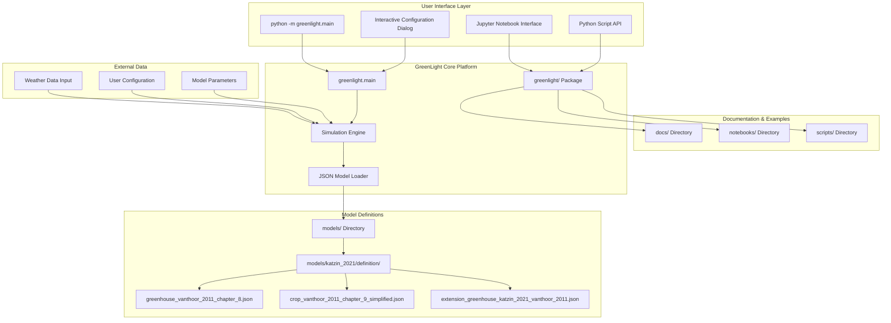
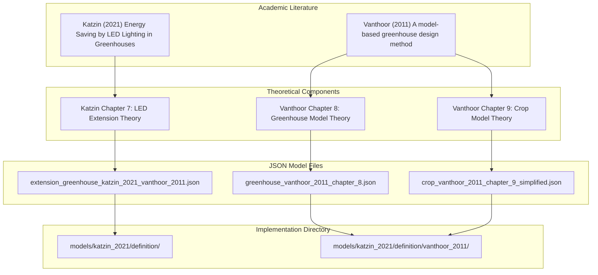
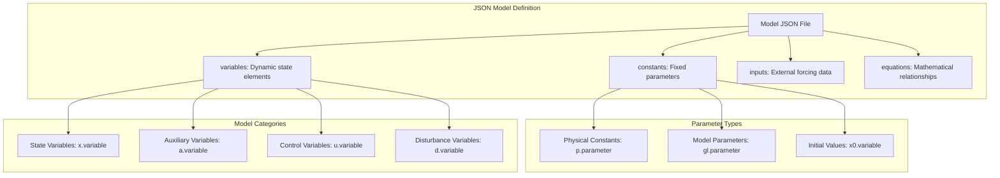
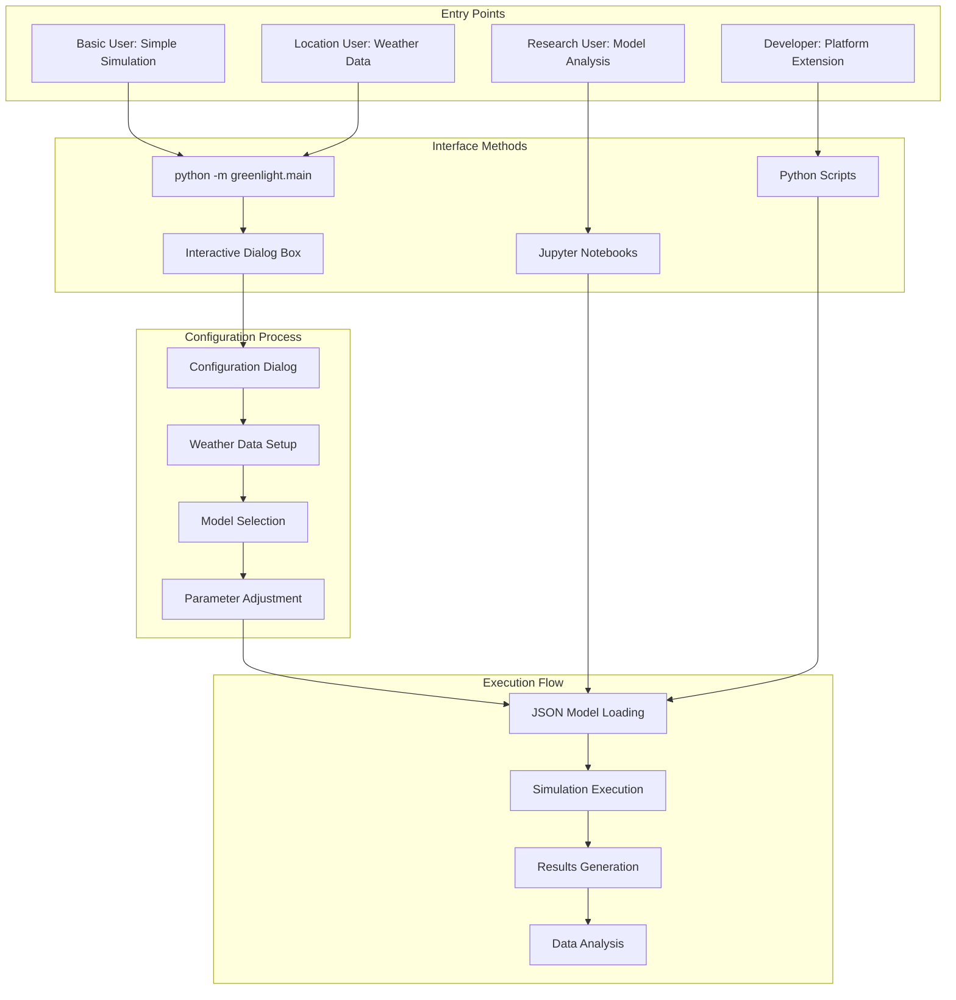
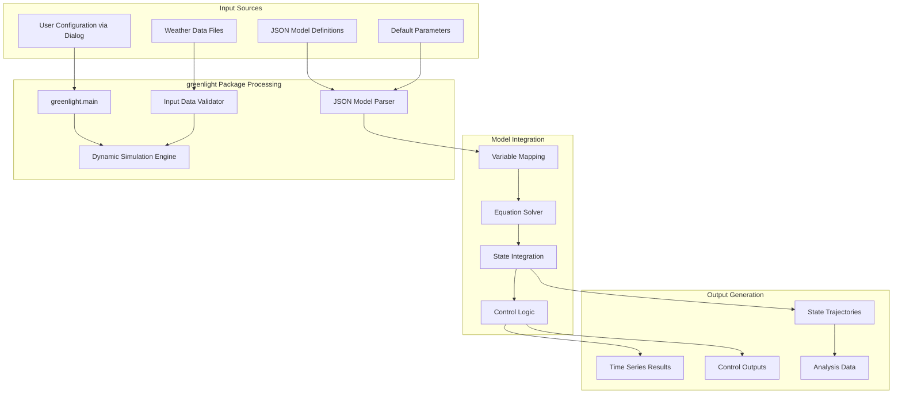
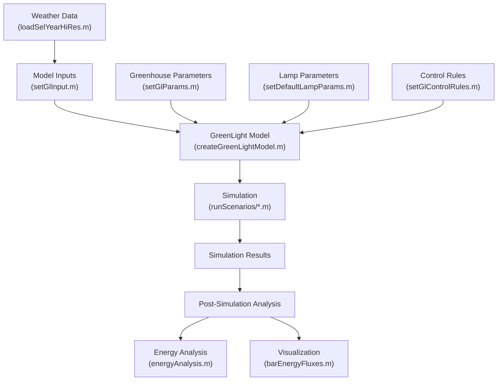
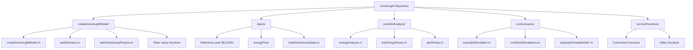

# GreenLight Model Overview

> **Relevant source files**
> * [readme.md](https://github.com/davkat1/GreenLight/blob/089602e3/readme.md)

## Purpose and Scope

GreenLight is a Python platform for creating, modifying, and combining dynamic models, with a focus on horticultural greenhouses and crops. The platform serves as a tool for **open science**, enabling transparent, reusable, and shareable research in dynamic modeling.

The platform enables researchers and practitioners to:

* Create and simulate dynamic greenhouse and crop models
* Combine existing models with extensions and modifications
* Implement models from academic literature in a standardized format
* Run location-specific simulations using weather data
* Share and reproduce modeling research transparently

Key capabilities include:

* JSON-based model definitions for transparency and modularity
* Integration of academic literature into executable models
* Command-line interface with interactive configuration
* Support for weather data integration
* Extensible architecture for custom model development

For installation instructions and system requirements, see [Installation and Requirements](/davkat1/GreenLight/1.1-installation-and-requirements). For details on the repository structure, see [Repository Structure](/davkat1/GreenLight/1.2-repository-structure).

Sources: [readme.md L2](https://github.com/davkat1/GreenLight/blob/089602e3/readme.md#L2-L2)

 [readme.md L15-L18](https://github.com/davkat1/GreenLight/blob/089602e3/readme.md#L15-L18)

## Platform Architecture

GreenLight is built on a modular Python architecture that separates model definitions, simulation engine, and user interfaces.

### Overall System Architecture

Sources: [readme.md L33-L34](https://github.com/davkat1/GreenLight/blob/089602e3/readme.md#L33-L34)

 [readme.md L76-L82](https://github.com/davkat1/GreenLight/blob/089602e3/readme.md#L76-L82)

 [readme.md L56-L60](https://github.com/davkat1/GreenLight/blob/089602e3/readme.md#L56-L60)

## Academic Foundations

GreenLight implements models from established academic literature, providing a bridge between theoretical research and practical simulation tools.

### Literature to Implementation Mapping

The platform implements these models as JSON definitions that can be read, modified, and combined. Users are encouraged to read the original literature alongside the JSON files to understand the model structure and variables.

Sources: [readme.md L52-L61](https://github.com/davkat1/GreenLight/blob/089602e3/readme.md#L52-L61)

## Model Structure

GreenLight models are defined using JSON files that specify variables, constants, inputs, and equations in a standardized format.

### JSON Model Architecture

Each JSON model file contains structured definitions that can be combined with other models to create complex simulations. The naming conventions (x., a., u., d., p., gl.) provide clear categorization of model elements.

Sources: [readme.md L56-L61](https://github.com/davkat1/GreenLight/blob/089602e3/readme.md#L56-L61)

 [readme.md L67-L68](https://github.com/davkat1/GreenLight/blob/089602e3/readme.md#L67-L68)

## User Interface and Workflow

GreenLight provides multiple entry points for different user scenarios, from simple simulations to advanced model development.

### User Interaction Flow

The primary entry point `python -m greenlight.main` launches an interactive dialog box for configuration, making the platform accessible to users without programming experience.

Sources: [readme.md L30-L37](https://github.com/davkat1/GreenLight/blob/089602e3/readme.md#L30-L37)

 [readme.md L43-L46](https://github.com/davkat1/GreenLight/blob/089602e3/readme.md#L43-L46)

## Data Flow and Processing

GreenLight processes multiple data sources through a structured pipeline from inputs to simulation results.

### Data Processing Pipeline

Sources: [readme.md L39-L41](https://github.com/davkat1/GreenLight/blob/089602e3/readme.md#L39-L41)

 [readme.md L71](https://github.com/davkat1/GreenLight/blob/089602e3/readme.md#L71-L71)

## Repository Organization

The GreenLight repository follows a structured organization that separates platform code, model definitions, documentation, and examples.

### Repository Structure

| Directory | Purpose | Key Contents |
| --- | --- | --- |
| `greenlight/` | Core Python platform implementation | Main module, simulation engine, utilities |
| `models/` | JSON model definition files | Katzin 2021 models, Vanthoor 2011 models |
| `docs/` | Platform documentation | Installation, usage, model format guides |
| `notebooks/` | Example Jupyter notebooks | Interactive examples and tutorials |
| `scripts/` | Python example scripts | Command-line usage examples |

Sources: [readme.md L76-L82](https://github.com/davkat1/GreenLight/blob/089602e3/readme.md#L76-L82)

### Data Flow in GreenLight

This diagram shows how data flows through the GreenLight system, from inputs like weather data and parameters, through model creation and simulation, to results analysis.

Sources: [inputs/loadSelYearHiRes.m](https://github.com/davkat1/GreenLight/blob/089602e3/inputs/loadSelYearHiRes.m)

 [createGreenLightModel/setGlInput.m](https://github.com/davkat1/GreenLight/blob/089602e3/createGreenLightModel/setGlInput.m)

 [createGreenLightModel/createGreenLightModel.m](https://github.com/davkat1/GreenLight/blob/089602e3/createGreenLightModel/createGreenLightModel.m)

 [runScenarios/exampleSimulation.m](https://github.com/davkat1/GreenLight/blob/089602e3/runScenarios/exampleSimulation.m)

 [postSimAnalysis/energyAnalysis.m](https://github.com/davkat1/GreenLight/blob/089602e3/postSimAnalysis/energyAnalysis.m)

 [postSimAnalysis/barEnergyFluxes.m](https://github.com/davkat1/GreenLight/blob/089602e3/postSimAnalysis/barEnergyFluxes.m)

## Code Organization

The GreenLight codebase is organized into several key directories that handle different aspects of the model:

Sources: [readme.md L171-L244](https://github.com/davkat1/GreenLight/blob/089602e3/readme.md#L171-L244)

## Connecting Model Concepts to Code

```mermaid
flowchart TD

A["Greenhouse Climate"]
A1["setGlOdes.m<br>(Climate ODEs)"]
A2["evaluateClimateModelHps.m/Led.m<br>(Climate Evaluation)"]
B["Energy Use"]
B1["energyAnalysis.m<br>(Energy Calculations)"]
B2["evaluateEnergyUseHps.m/Led.m<br>(Energy Evaluation)"]
C["Lighting Systems"]
C1["setDefaultLampParams.m<br>(Modern Lamps)"]
C2["setBleiswijk2010HpsParams.m<br>(HPS Configuration)"]
C3["setBleiswijk2010LedParams.m<br>(LED Configuration)"]
D["Control Systems"]
D1["setGlControlRules.m<br>(Control Logic)"]
D2["setGlControls.m<br>(Control Trajectories)"]
E["Simulation Scenarios"]
E1["exampleSimulation.m<br>(Basic Example)"]
E2["runWorldSimulations.m<br>(Global Comparison)"]
E3["heatByLightScript.m<br>(Heating by Light)"]

A --> A1
A --> A2
B --> B1
B --> B2
C --> C1
C --> C2
C --> C3
D --> D1
D --> D2
E --> E1
E --> E2
E --> E3
```

This diagram connects high-level greenhouse concepts to the specific code files that implement them, helping users navigate the codebase.

Sources: [createGreenLightModel/setGlOdes.m](https://github.com/davkat1/GreenLight/blob/089602e3/createGreenLightModel/setGlOdes.m)

 [runScenarios/evaluateClimateModelHps.m](https://github.com/davkat1/GreenLight/blob/089602e3/runScenarios/evaluateClimateModelHps.m)

 [runScenarios/evaluateClimateModelLed.m](https://github.com/davkat1/GreenLight/blob/089602e3/runScenarios/evaluateClimateModelLed.m)

 [postSimAnalysis/energyAnalysis.m](https://github.com/davkat1/GreenLight/blob/089602e3/postSimAnalysis/energyAnalysis.m)

 [runScenarios/evaluateEnergyUseHps.m](https://github.com/davkat1/GreenLight/blob/089602e3/runScenarios/evaluateEnergyUseHps.m)

 [runScenarios/evaluateEnergyUseLed.m](https://github.com/davkat1/GreenLight/blob/089602e3/runScenarios/evaluateEnergyUseLed.m)

 [createGreenLightModel/setDefaultLampParams.m](https://github.com/davkat1/GreenLight/blob/089602e3/createGreenLightModel/setDefaultLampParams.m)

 [createGreenLightModel/setBleiswijk2010HpsParams.m](https://github.com/davkat1/GreenLight/blob/089602e3/createGreenLightModel/setBleiswijk2010HpsParams.m)

 [createGreenLightModel/setBleiswijk2010LedParams.m](https://github.com/davkat1/GreenLight/blob/089602e3/createGreenLightModel/setBleiswijk2010LedParams.m)

 [createGreenLightModel/setGlControlRules.m](https://github.com/davkat1/GreenLight/blob/089602e3/createGreenLightModel/setGlControlRules.m)

 [createGreenLightModel/setGlControls.m](https://github.com/davkat1/GreenLight/blob/089602e3/createGreenLightModel/setGlControls.m)

 [runScenarios/exampleSimulation.m](https://github.com/davkat1/GreenLight/blob/089602e3/runScenarios/exampleSimulation.m)

 [runScenarios/runWorldSimulations.m](https://github.com/davkat1/GreenLight/blob/089602e3/runScenarios/runWorldSimulations.m)

 [runScenarios/heatByLightScript.m](https://github.com/davkat1/GreenLight/blob/089602e3/runScenarios/heatByLightScript.m)

## Usage Workflow

A typical workflow for using GreenLight includes:

1. **Model Creation**: Use `createGreenLightModel.m` to create a greenhouse model
2. **Parameter Configuration**: Set appropriate parameters for the greenhouse and lighting system
3. **Simulation Execution**: Run the model with specific weather data and conditions
4. **Results Analysis**: Analyze the results using the post-simulation tools

### Example Simulations

The repository provides several example simulations:

* `exampleSimulation.m` - Basic simulation with different lamp settings using Dutch reference year weather data
* `exampleSimulation2.m` - Simulation of a modern greenhouse with detailed configuration
* `exampleCropModel.m` - Simple example using only the crop component
* `runWorldSimulations.m` - Simulations across different global locations

Sources: [readme.md L106-L169](https://github.com/davkat1/GreenLight/blob/089602e3/readme.md#L106-L169)

 [runScenarios/exampleSimulation.m](https://github.com/davkat1/GreenLight/blob/089602e3/runScenarios/exampleSimulation.m)

 [runScenarios/exampleSimulation2.m](https://github.com/davkat1/GreenLight/blob/089602e3/runScenarios/exampleSimulation2.m)

 [runScenarios/exampleCropModel.m](https://github.com/davkat1/GreenLight/blob/089602e3/runScenarios/exampleCropModel.m)

 [runScenarios/runWorldSimulations.m](https://github.com/davkat1/GreenLight/blob/089602e3/runScenarios/runWorldSimulations.m)

## Research Applications

GreenLight has been used in several published research studies:

1. **Climate Model Evaluation** (Katzin et al., 2020) * Comparing simulated and measured greenhouse climate data * Evaluating model performance for both HPS and LED lighting
2. **Energy Use Comparison** (Katzin et al., 2020) * Evaluating energy consumption differences between HPS and LED lighting * Validating model energy predictions against measured data
3. **Global Energy Savings Analysis** (Katzin et al., 2021) * Analyzing greenhouse performance across different world locations * Quantifying potential energy savings from transitioning to LED lighting
4. **Heating by Light Strategy Analysis** (Katzin et al., 2023) * Investigating using light not just for plant growth but as a heating strategy * Evaluating energy trade-offs and efficiency of different heating approaches

For more detailed information on these research applications, see [Applications and Research](/davkat1/GreenLight/6-applications-and-research).

Sources: [readme.md L27-L56](https://github.com/davkat1/GreenLight/blob/089602e3/readme.md#L27-L56)

 [runScenarios/evaluateClimateModelHps.m](https://github.com/davkat1/GreenLight/blob/089602e3/runScenarios/evaluateClimateModelHps.m)

 [runScenarios/evaluateClimateModelLed.m](https://github.com/davkat1/GreenLight/blob/089602e3/runScenarios/evaluateClimateModelLed.m)

 [runScenarios/evaluateEnergyUseHps.m](https://github.com/davkat1/GreenLight/blob/089602e3/runScenarios/evaluateEnergyUseHps.m)

 [runScenarios/evaluateEnergyUseLed.m](https://github.com/davkat1/GreenLight/blob/089602e3/runScenarios/evaluateEnergyUseLed.m)

 [runScenarios/runWorldSimulations.m](https://github.com/davkat1/GreenLight/blob/089602e3/runScenarios/runWorldSimulations.m)

## Compatibility and Requirements

GreenLight is compatible with MATLAB 2015b and later versions. It requires the [DyMoMa package](https://github.com/davkat1/GreenLight/blob/089602e3/DyMoMa package)

 (specifically version 1.0.1) to function properly. For more details about installation and requirements, see [Installation and Requirements](/davkat1/GreenLight/1.1-installation-and-requirements).

Sources: [readme.md L13-L17](https://github.com/davkat1/GreenLight/blob/089602e3/readme.md#L13-L17)