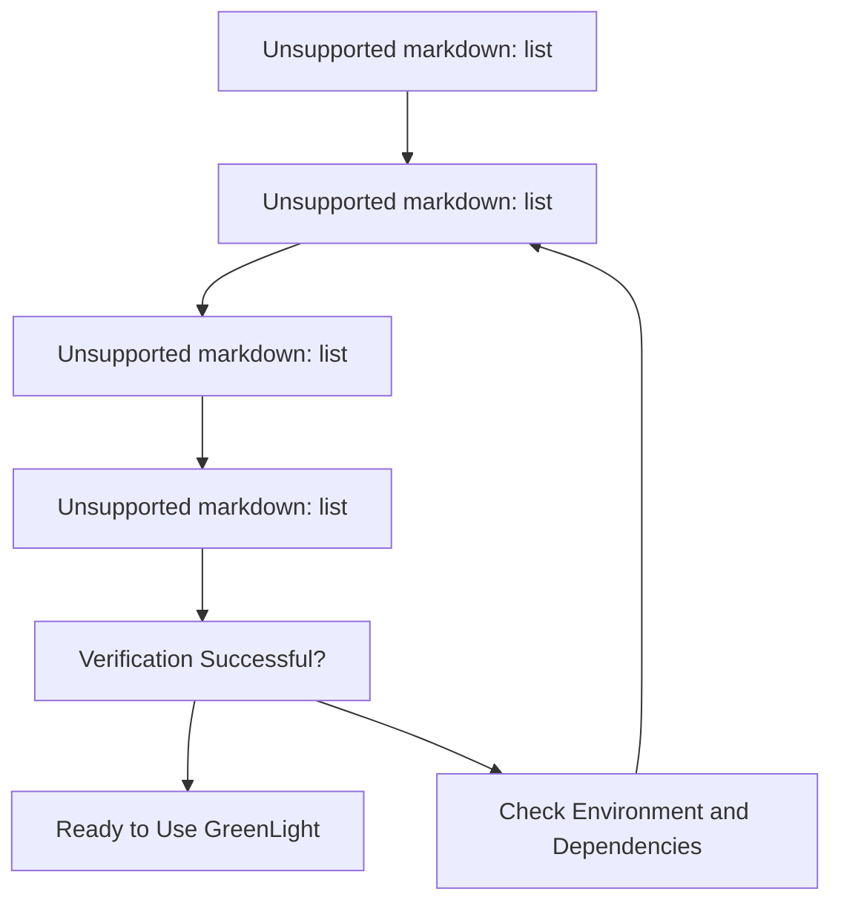
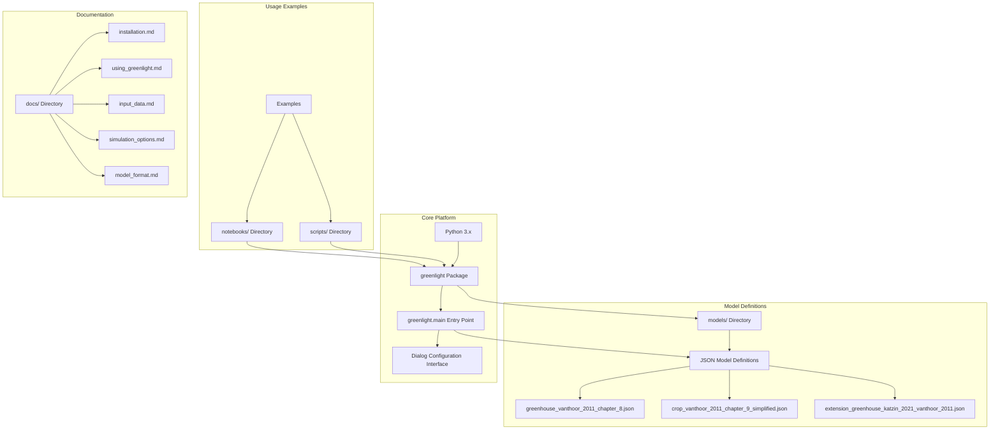
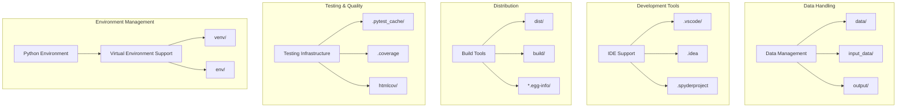
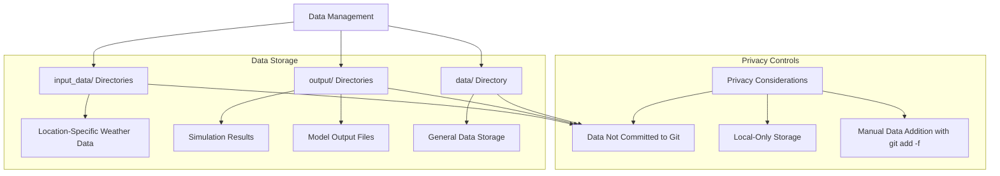

# Installation and Requirements

> **Relevant source files**
> * [.gitignore](https://github.com/davkat1/GreenLight/blob/089602e3/.gitignore)
> * [readme.md](https://github.com/davkat1/GreenLight/blob/089602e3/readme.md)

This document provides detailed instructions for installing the GreenLight platform and meeting all necessary requirements to run simulations successfully. GreenLight is a Python platform for creating, modifying, and combining dynamic models, with a focus on horticultural greenhouses and crops.

For information about the model's capabilities and high-level architecture, see [GreenLight Model Overview](/davkat1/GreenLight/1-greenlight-model-overview). For details on actually running simulations after installation, see [Running Simulations](/davkat1/GreenLight/4-running-simulations).

## System Requirements

### Python Requirements

The GreenLight platform requires:

* Python 3.x (specific minimum version to be confirmed from package dependencies)
* Standard Python scientific computing libraries
* Platform-independent installation (Windows, macOS, Linux)

The platform is designed to work across different operating systems and Python environments.

Sources: [readme.md L1-L2](https://github.com/davkat1/GreenLight/blob/089602e3/readme.md#L1-L2)

 [.gitignore L37-L38](https://github.com/davkat1/GreenLight/blob/089602e3/.gitignore#L37-L38)

### Virtual Environment Support

GreenLight supports standard Python virtual environment configurations:

* `venv/` for Python virtual environments
* `env/` for alternative environment setups
* Standard Python package management through pip

The `.gitignore` configuration indicates support for multiple virtual environment approaches.

Sources: [.gitignore L37-L38](https://github.com/davkat1/GreenLight/blob/089602e3/.gitignore#L37-L38)

## Installation Process

### Installation Steps Diagram



### Getting the Source Code

1. Clone the GreenLight repository from GitHub: [https://github.com/davkat1/GreenLight](https://github.com/davkat1/GreenLight)
2. Navigate to the cloned directory

The repository contains the current Python-based implementation. Previous MATLAB versions (1.x) are discontinued.

Sources: [readme.md L1](https://github.com/davkat1/GreenLight/blob/089602e3/readme.md#L1-L1)

 [readme.md L4-L6](https://github.com/davkat1/GreenLight/blob/089602e3/readme.md#L4-L6)

### Python Environment Setup

1. Create a virtual environment (recommended): ``` python -m venv venv ```
2. Activate the virtual environment: * Windows: `venv\Scripts\activate` * macOS/Linux: `source venv/bin/activate`
3. Install the package and dependencies following the detailed installation guide

For complete installation instructions, refer to the dedicated installation documentation.

Sources: [readme.md L31](https://github.com/davkat1/GreenLight/blob/089602e3/readme.md#L31-L31)

 [.gitignore L37-L38](https://github.com/davkat1/GreenLight/blob/089602e3/.gitignore#L37-L38)

### Verifying Installation

To verify the installation is working properly:

1. In your terminal, navigate to the GreenLight directory
2. Run the main entry point: ``` python -m greenlight.main ```
3. A dialog box should appear with various simulation parameters
4. For quick testing, adjust the **End date** to a date closer to the start date (e.g., 9/30/21) for faster simulation runs

Sources: [readme.md L31-L37](https://github.com/davkat1/GreenLight/blob/089602e3/readme.md#L31-L37)

## Key Dependencies and Components

### Platform Architecture



### Development Environment Components



Sources: [readme.md L76-L82](https://github.com/davkat1/GreenLight/blob/089602e3/readme.md#L76-L82)

 [.gitignore L37-L52](https://github.com/davkat1/GreenLight/blob/089602e3/.gitignore#L37-L52)

 [.gitignore L64-L74](https://github.com/davkat1/GreenLight/blob/089602e3/.gitignore#L64-L74)

 [.gitignore L84-L98](https://github.com/davkat1/GreenLight/blob/089602e3/.gitignore#L84-L98)

## Data Management and Privacy

### Data Directory Structure



### Weather Data Requirements

For location-specific simulations, weather data integration is required:

1. Weather data is privacy-sensitive and not included in the repository
2. Users must acquire location-specific weather data separately
3. Input data handling is documented in the dedicated guide
4. Data should be placed in appropriate `input_data/` directories

For detailed weather data acquisition and setup, refer to the input data documentation.

Sources: [.gitignore L100-L105](https://github.com/davkat1/GreenLight/blob/089602e3/.gitignore#L100-L105)

 [readme.md L39-L41](https://github.com/davkat1/GreenLight/blob/089602e3/readme.md#L39-L41)

## Additional Resources

### Documentation

* **User's Guide**: Available in Chapter 7 (pages 235-280) of [David Katzin's PhD thesis](https://doi.org/10.18174/544434)
* **Example Simulations**: The repository includes several examples that demonstrate different aspects of the model
* **Related Datasets**: Several datasets associated with published studies are available on the 4TU.ResearchData database

Sources: [readme.md L24-L25](https://github.com/davkat1/GreenLight/blob/089602e3/readme.md#L24-L25)

 [readme.md L19-L22](https://github.com/davkat1/GreenLight/blob/089602e3/readme.md#L19-L22)

### Repository Structure

| Directory | Purpose |
| --- | --- |
| `createGreenLightModel` | Contains files for creating the greenhouse model |
| `inputs` | Files for defining outdoor climate inputs |
| `postSimAnalysis` | Methods for analyzing simulation results |
| `runScenarios` | Example scripts for different simulation scenarios |
| `serviceFunctions` | General utility functions |

Sources: [readme.md L170-L244](https://github.com/davkat1/GreenLight/blob/089602e3/readme.md#L170-L244)

## Example Usage After Installation

After completing the installation, you can run a simple simulation with the GreenLight model using:

```
% Navigate to the GreenLight directory
cd path/to/GreenLight

% Run an example simulation
run('runScenarios/exampleSimulation.m')

% For more advanced usage with modern greenhouse settings
run('runScenarios/exampleSimulation2.m')

% To use only the crop component
run('runScenarios/exampleCropModel.m')
```

For more detailed examples and specific scenarios, refer to the documentation on [Running Simulations](/davkat1/GreenLight/4-running-simulations).

Sources: [readme.md L110-L121](https://github.com/davkat1/GreenLight/blob/089602e3/readme.md#L110-L121)