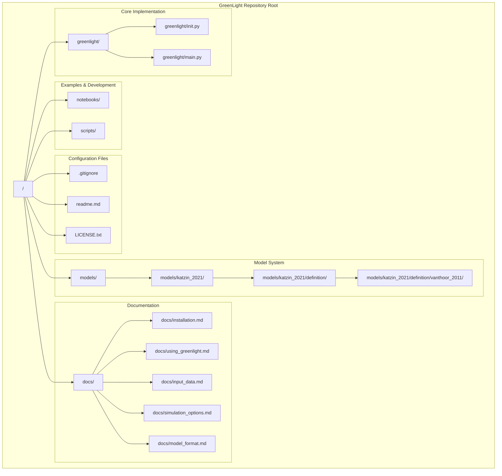
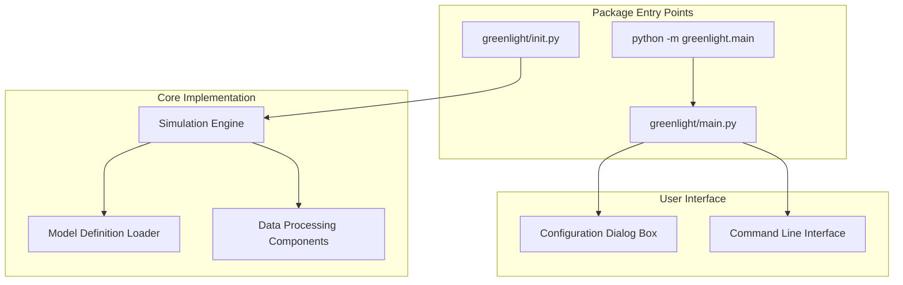
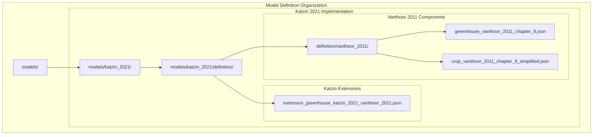
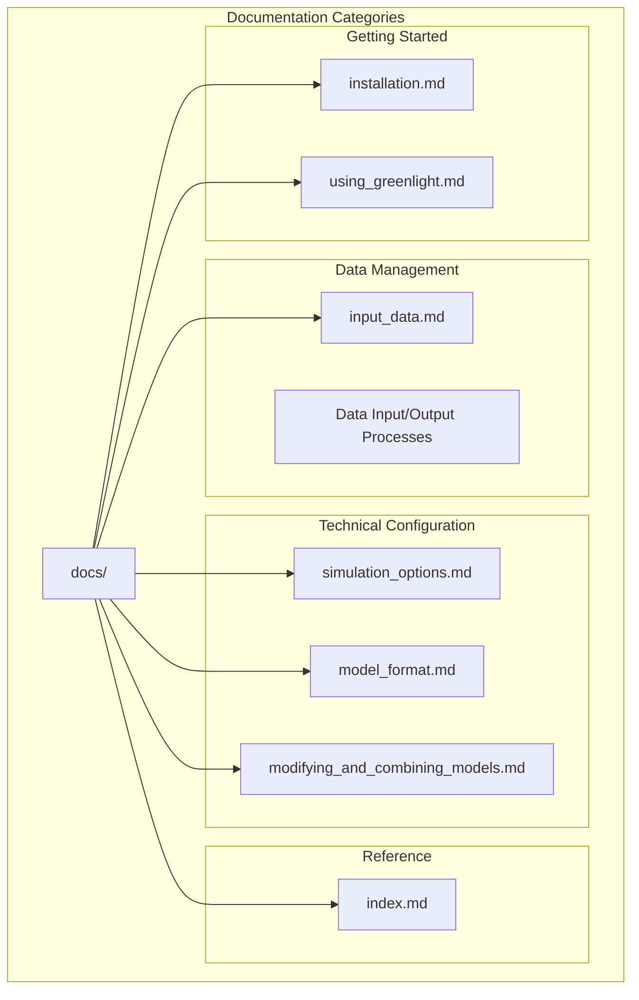
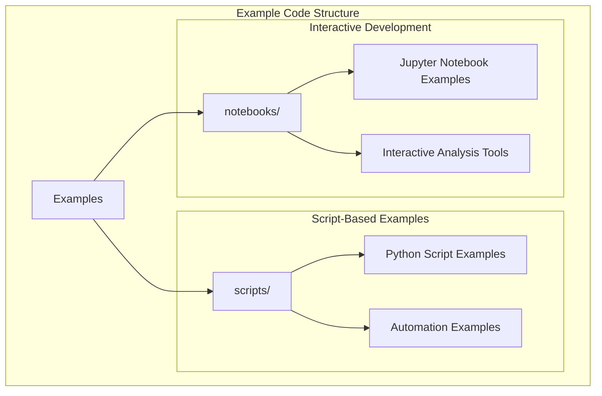
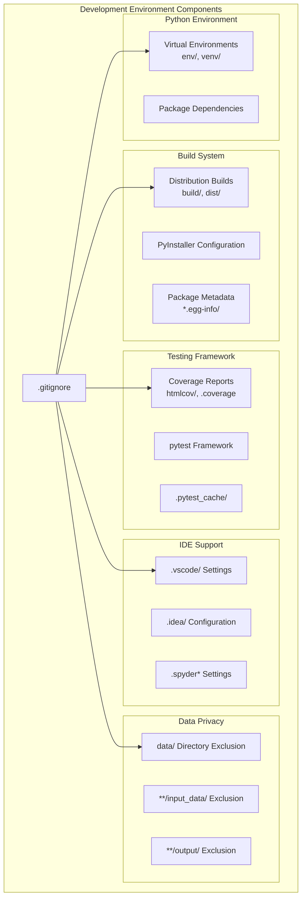

# Repository Structure

> **Relevant source files**
> * [.gitignore](https://github.com/davkat1/GreenLight/blob/089602e3/.gitignore)
> * [readme.md](https://github.com/davkat1/GreenLight/blob/089602e3/readme.md)

This document provides a detailed explanation of the GreenLight repository organization, including the core package structure, model definitions, documentation system, and development environment components. For installation procedures and setup instructions, see [Installation and Requirements](/davkat1/GreenLight/1.1-installation-and-requirements). For information about running simulations and using the platform, see [Command Line Interface](/davkat1/GreenLight/4.1-command-line-interface).

## Directory Organization Overview

The GreenLight repository follows a standard Python project structure with specialized directories for model definitions and greenhouse simulation components. The organization supports both end-users running simulations and developers extending the platform.

*Sources: [readme.md L76-L81](https://github.com/davkat1/GreenLight/blob/089602e3/readme.md#L76-L81)

 [.gitignore L37-L53](https://github.com/davkat1/GreenLight/blob/089602e3/.gitignore#L37-L53)*

## Core Package Structure

The `greenlight/` directory contains the main Python package implementing the simulation platform. The primary entry point is accessible through the module interface.

| Component | Path | Purpose |
| --- | --- | --- |
| Package Root | `greenlight/__init__.py` | Package initialization and public API |
| Main Entry Point | `greenlight/main.py` | Command-line interface and dialog system |
| Core Modules | `greenlight/` subdirectories | Simulation engine components |

The main execution path follows the pattern `python -m greenlight.main`, which invokes the dialog-based configuration system for end users.

*Sources: [readme.md L31-L37](https://github.com/davkat1/GreenLight/blob/089602e3/readme.md#L31-L37)

 [readme.md L71](https://github.com/davkat1/GreenLight/blob/089602e3/readme.md#L71-L71)*

## Model Definition System

The `models/` directory contains JSON-based model definitions organized by academic publication and model components.

### Model Hierarchy Structure

### Model File Organization

| Model Component | File Path | Academic Source |
| --- | --- | --- |
| Greenhouse Dynamics | `greenhouse_vanthoor_2011_chapter_8.json` | Vanthoor (2011) Chapter 8 |
| Crop Growth | `crop_vanthoor_2011_chapter_9_simplified.json` | Vanthoor (2011) Chapter 9 |
| LED Integration | `extension_greenhouse_katzin_2021_vanthoor_2011.json` | Katzin (2021) Chapter 7 |

*Sources: [readme.md L52-L61](https://github.com/davkat1/GreenLight/blob/089602e3/readme.md#L52-L61)

 [readme.md L56-L60](https://github.com/davkat1/GreenLight/blob/089602e3/readme.md#L56-L60)*

## Documentation System

The `docs/` directory provides comprehensive documentation for different user types and use cases.

### Documentation Structure

### Documentation Purpose Mapping

| Document | Target User | Primary Purpose |
| --- | --- | --- |
| `installation.md` | All users | Setup and installation procedures |
| `using_greenlight.md` | Script users | Programmatic interface usage |
| `input_data.md` | Location-specific users | Weather data integration |
| `simulation_options.md` | Advanced users | Technical parameter configuration |
| `model_format.md` | Model developers | JSON model definition specification |

*Sources: [readme.md L31](https://github.com/davkat1/GreenLight/blob/089602e3/readme.md#L31-L31)

 [readme.md L41](https://github.com/davkat1/GreenLight/blob/089602e3/readme.md#L41-L41)

 [readme.md L45](https://github.com/davkat1/GreenLight/blob/089602e3/readme.md#L45-L45)

 [readme.md L65](https://github.com/davkat1/GreenLight/blob/089602e3/readme.md#L65-L65)

 [readme.md L68](https://github.com/davkat1/GreenLight/blob/089602e3/readme.md#L68-L68)

 [readme.md L74](https://github.com/davkat1/GreenLight/blob/089602e3/readme.md#L74-L74)*

## Examples and Development Environment

### Example Code Organization

The repository includes practical examples in two formats:

*Sources: [readme.md L80-L81](https://github.com/davkat1/GreenLight/blob/089602e3/readme.md#L80-L81)

 [readme.md L44-L46](https://github.com/davkat1/GreenLight/blob/089602e3/readme.md#L44-L46)*

## Development Configuration and Artifacts

### Version Control and Build Configuration

The repository uses standard Python development practices with specific configurations for data privacy and build management.

#### Excluded Development Artifacts

| Category | Patterns | Purpose |
| --- | --- | --- |
| Python Runtime | `__pycache__/`, `*.pyc`, `*.pyo` | Compiled bytecode |
| Virtual Environments | `env/`, `venv/` | Isolated Python environments |
| Build Artifacts | `build/`, `dist/`, `*.egg-info/` | Package distribution files |
| IDE Configuration | `.vscode/`, `.idea/`, `.spyder*` | Editor-specific settings |
| Data Files | `data/`, `**/input_data/`, `**/output/` | Privacy-sensitive simulation data |

#### Development Tools Integration

The `.gitignore` configuration specifically excludes data directories to maintain privacy compliance, as noted in the comment: "do not upload data to git. Its slow and privacy sensitive."

*Sources: [.gitignore L37-L53](https://github.com/davkat1/GreenLight/blob/089602e3/.gitignore#L37-L53)

 [.gitignore L64-L74](https://github.com/davkat1/GreenLight/blob/089602e3/.gitignore#L64-L74)

 [.gitignore L84-L98](https://github.com/davkat1/GreenLight/blob/089602e3/.gitignore#L84-L98)

 [.gitignore L100-L114](https://github.com/davkat1/GreenLight/blob/089602e3/.gitignore#L100-L114)*

## Repository Entry Points and Navigation

### Primary Access Patterns

The repository supports multiple user workflows through different entry points:

| User Type | Entry Point | Primary Directory |
| --- | --- | --- |
| Basic Users | `python -m greenlight.main` | `greenlight/` |
| Location-Specific Users | Documentation → `docs/input_data.md` | `docs/` |
| Model Developers | Model definitions in `models/` | `models/katzin_2021/definition/` |
| Platform Developers | Package exploration from `greenlight/__init__.py` | `greenlight/` |
| Research Users | Examples in `notebooks/` and `scripts/` | `notebooks/`, `scripts/` |

*Sources: [readme.md L21-L27](https://github.com/davkat1/GreenLight/blob/089602e3/readme.md#L21-L27)

 [readme.md L30-L71](https://github.com/davkat1/GreenLight/blob/089602e3/readme.md#L30-L71)*