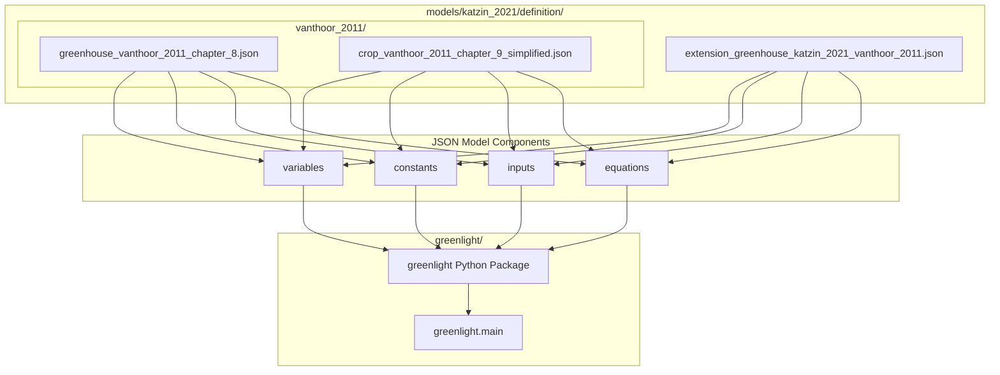
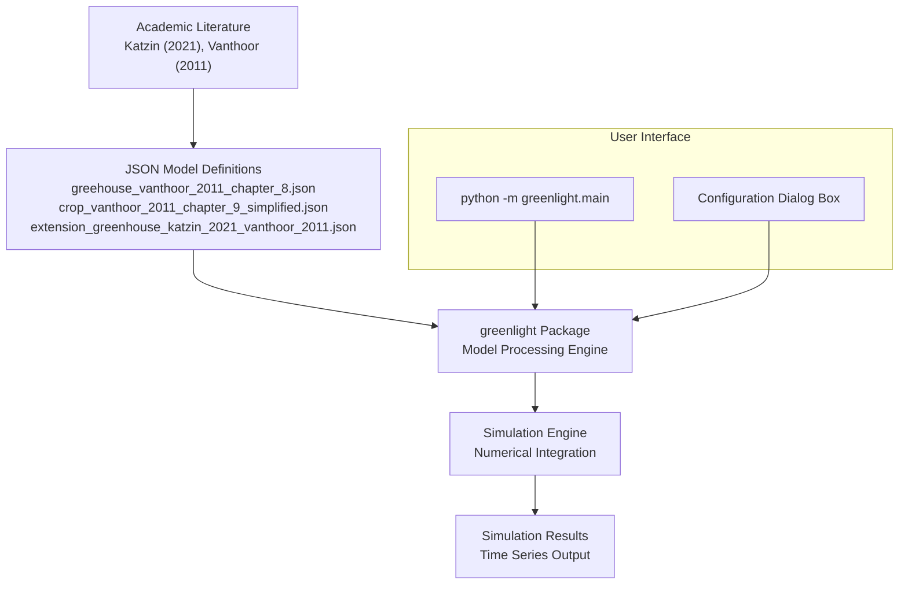
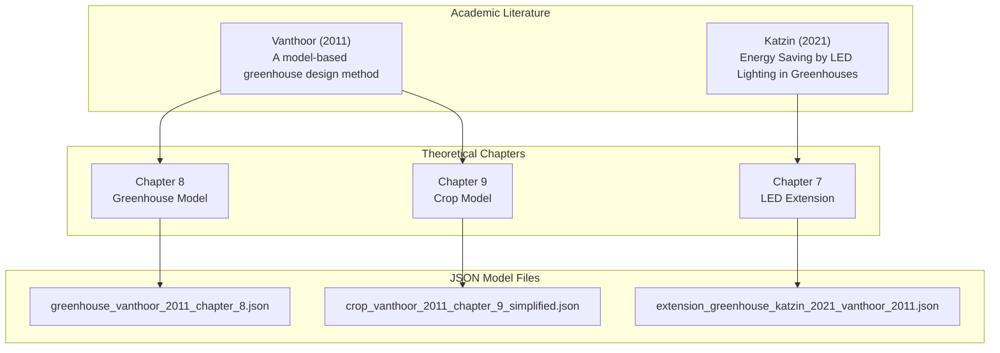
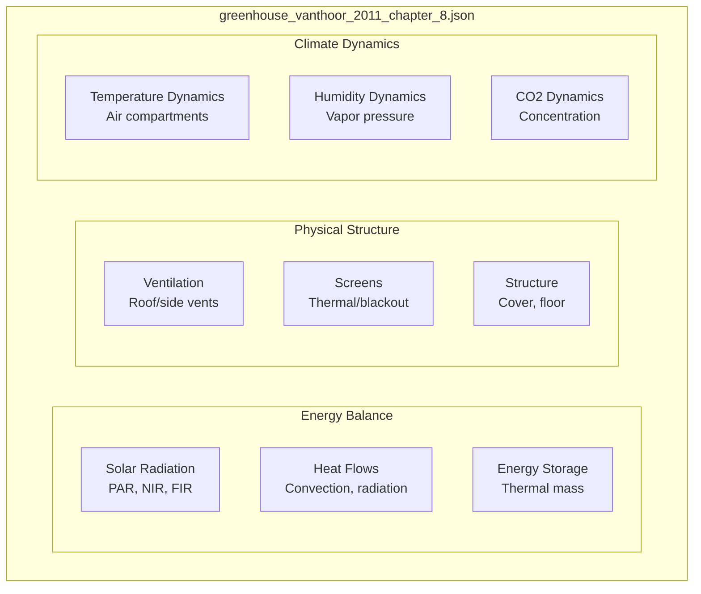
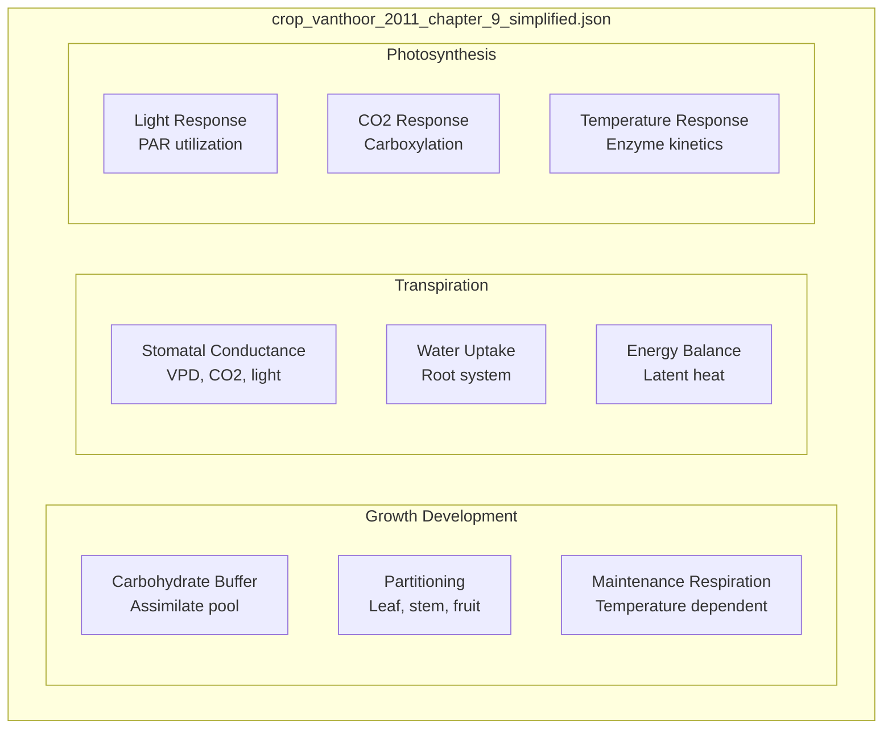
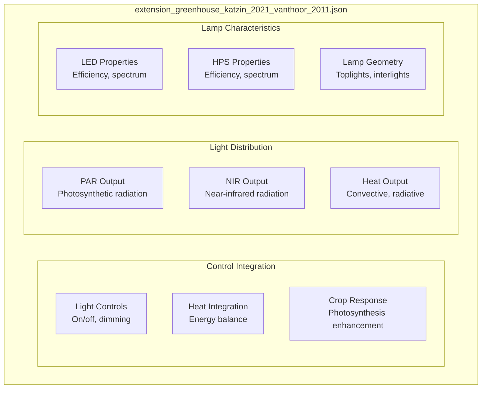
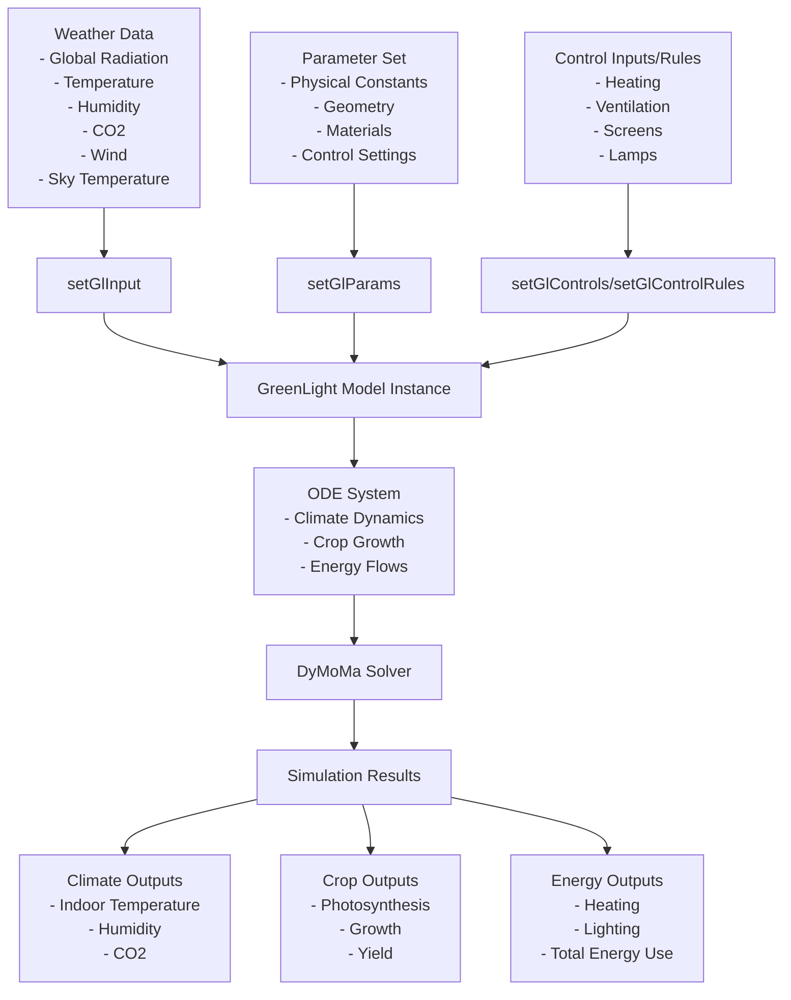
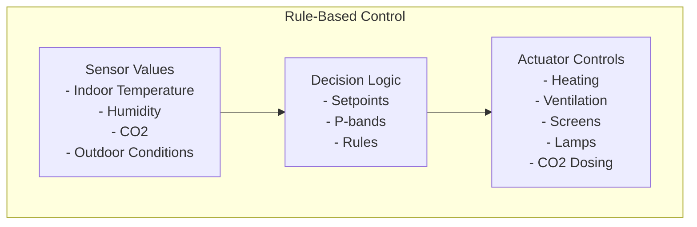
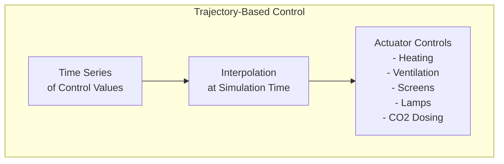

# Model Architecture

> **Relevant source files**
> * [readme.md](https://github.com/davkat1/GreenLight/blob/089602e3/readme.md)

## Purpose and Scope

This document describes the architecture of the GreenLight model system, focusing on its JSON-based model definitions, academic foundations, and system components. The GreenLight platform uses a modular approach where models are defined in JSON format and processed by the Python greenlight package to create dynamic simulations of greenhouse and crop systems.

## Architectural Overview

The GreenLight model architecture is built on JSON model definitions that encode academic literature into computable mathematical models. The system integrates greenhouse climate dynamics, crop growth models, and lighting extensions through a modular JSON-based approach that allows for transparent and reusable model definitions.

### JSON Model Architecture

JSON-based Model Definition Structure

Sources: [readme.md L56-L60](https://github.com/davkat1/GreenLight/blob/089602e3/readme.md#L56-L60)

### Model Processing Flow

Sources: [readme.md L32-L37](https://github.com/davkat1/GreenLight/blob/089602e3/readme.md#L32-L37)

 [readme.md L52-L60](https://github.com/davkat1/GreenLight/blob/089602e3/readme.md#L52-L60)

## Academic Foundations

The GreenLight model architecture is built on established academic literature that provides the theoretical foundation for the mathematical models implemented in JSON format.

### Literature-to-Implementation Mapping

Academic Literature to JSON Model Implementation

Sources: [readme.md L52-L60](https://github.com/davkat1/GreenLight/blob/089602e3/readme.md#L52-L60)

### Model Component Structure

The JSON model definitions follow a consistent structure that encodes the academic models into computable form:

| Component | Description | JSON Elements |
| --- | --- | --- |
| **variables** | Dynamic state variables that change over time | Temperature, humidity, CO2, biomass |
| **constants** | Fixed parameters and physical properties | Heat transfer coefficients, geometries |
| **inputs** | External forcing variables | Weather data, control signals |
| **equations** | Mathematical relationships between variables | ODEs, algebraic equations |

Sources: [readme.md L56-L60](https://github.com/davkat1/GreenLight/blob/089602e3/readme.md#L56-L60)

## Core Model Components

### Greenhouse Model (Vanthoor 2011 Chapter 8)

The greenhouse component models the physical greenhouse structure and climate dynamics, implemented in `greenhouse_vanthoor_2011_chapter_8.json`:

Greenhouse Model Structure

Sources: [readme.md L56-L57](https://github.com/davkat1/GreenLight/blob/089602e3/readme.md#L56-L57)

### Crop Model (Vanthoor 2011 Chapter 9)

The crop component models plant growth and physiological processes, implemented in `crop_vanthoor_2011_chapter_9_simplified.json`:

Crop Model Structure

Sources: [readme.md L59](https://github.com/davkat1/GreenLight/blob/089602e3/readme.md#L59-L59)

### LED Extension (Katzin 2021)

The LED extension adds supplemental lighting capabilities, implemented in `extension_greenhouse_katzin_2021_vanthoor_2011.json`:

LED Extension Structure

Sources: [readme.md L60](https://github.com/davkat1/GreenLight/blob/089602e3/readme.md#L60-L60)

## Structure Integration and Data Flow

The GreenLight model integrates the above components in a unified structure, where changes in one component affect others through a network of ordinary differential equations (ODEs).

### Data Flow Diagram

Sources: [Code/createGreenLightModel/createGreenLightModel.m L73-L128](https://github.com/davkat1/GreenLight/blob/089602e3/Code/createGreenLightModel/createGreenLightModel.m#L73-L128)

## State Variables

The GreenLight model uses a state-based approach, where the condition of the greenhouse is described by a set of state variables that evolve over time according to the ODEs.

### Key State Variables

| Category | State Variables | Description |
| --- | --- | --- |
| Climate | `tAir`, `tTop`, `vpAir`, `vpTop`, `co2Air`, `co2Top` | Temperature, vapor pressure, and CO2 concentration in the main and top compartments |
| Structure | `tCov`, `tThScr`, `tBlScr`, `tCanE`, `tCanI` | Temperatures of cover, screens, and canopy (external and internal) |
| Heating | `tPipe`, `tGroPipe` | Pipe rail and grow pipe temperatures |
| Lighting | `tLamp`, `tIntLamp` | Top and interlight lamp temperatures |
| Soil | `tFlr`, `tSo1`-`tSo5` | Floor and soil layer temperatures |
| Crop | `cBuf`, `cFruit`, `cLeaf`, `cStem` | Carbohydrate buffer and dry weight of plant components |

Sources: [Code/createGreenLightModel/createGreenLightModel.m L80](https://github.com/davkat1/GreenLight/blob/089602e3/Code/createGreenLightModel/createGreenLightModel.m#L80-L80)

## Control Systems

The GreenLight model supports two different approaches to controlling the greenhouse environment:

### Rule-Based Control

When no control trajectory is provided, the model uses rule-based control that mimics typical greenhouse climate control strategies:

* Heating control based on temperature setpoints
* Ventilation based on temperature and humidity
* Screen control based on outside conditions and humidity
* Lighting control based on time, radiation, and temperature

Sources: [Code/createGreenLightModel/createGreenLightModel.m L122-L124](https://github.com/davkat1/GreenLight/blob/089602e3/Code/createGreenLightModel/createGreenLightModel.m#L122-L124)

 [Code/createGreenLightModel/setGlParams.m L323-L368](https://github.com/davkat1/GreenLight/blob/089602e3/Code/createGreenLightModel/setGlParams.m#L323-L368)

### Trajectory-Based Control

When control trajectories are provided, the model follows these predefined control actions:

* Time series for screen positions
* Time series for ventilation openings
* Time series for pipe temperatures
* Time series for lamp operation
* Time series for CO2 injection

Sources: [Code/createGreenLightModel/createGreenLightModel.m L85-L116](https://github.com/davkat1/GreenLight/blob/089602e3/Code/createGreenLightModel/createGreenLightModel.m#L85-L116)

## Model Creation Process

The creation of a GreenLight model follows a well-defined process managed by the `createGreenLightModel` function:

1. **Create base DynamicModel**: Instantiate a new model object from DyMoMa
2. **Set parameters**: Define physical constants and greenhouse properties
3. **Set inputs**: Configure the weather data inputs
4. **Define time**: Set simulation time range and step size
5. **Define controls**: Set up control variables (heating, ventilation, screens, etc.)
6. **Define states**: Create state variables for temperatures, humidity, CO2, etc.
7. **Set lamp parameters**: Configure according to lamp type (HPS, LED, none)
8. **Set control method**: Either rule-based or trajectory-based
9. **Set auxiliary states**: Define derived variables
10. **Set ODEs**: Define the differential equations for state evolution
11. **Set initial values**: Initialize all state variables

This process creates a complete model instance ready for simulation.

Sources: [Code/createGreenLightModel/createGreenLightModel.m L1-L128](https://github.com/davkat1/GreenLight/blob/089602e3/Code/createGreenLightModel/createGreenLightModel.m#L1-L128)

## Parameter Categories

The model includes over 200 parameters organized into functional categories:

### General Model Parameters

Physical constants, heat transfer coefficients, and optical properties affecting the entire model.

Sources: [Code/createGreenLightModel/setGlParams.m L45-L104](https://github.com/davkat1/GreenLight/blob/089602e3/Code/createGreenLightModel/setGlParams.m#L45-L104)

### Location and Structure Parameters

Parameters for greenhouse geometry, construction, and geographical location.

Sources: [Code/createGreenLightModel/setGlParams.m L106-L131](https://github.com/davkat1/GreenLight/blob/089602e3/Code/createGreenLightModel/setGlParams.m#L106-L131)

### Component-Specific Parameters

Parameters for specific greenhouse components such as:

* Roof, floor, and soil
* Heating systems (pipe rail and grow pipes)
* Screens (thermal, blackout, shadow)
* Lamps (toplights and interlights)

Sources: [Code/createGreenLightModel/setGlParams.m L132-L223](https://github.com/davkat1/GreenLight/blob/089602e3/Code/createGreenLightModel/setGlParams.m#L132-L223)

 [Code/createGreenLightModel/setGlParams.m L369-L419](https://github.com/davkat1/GreenLight/blob/089602e3/Code/createGreenLightModel/setGlParams.m#L369-L419)

### Crop Parameters

Parameters related to photosynthesis, growth, and development.

Sources: [Code/createGreenLightModel/setGlParams.m L273-L322](https://github.com/davkat1/GreenLight/blob/089602e3/Code/createGreenLightModel/setGlParams.m#L273-L322)

### Control Parameters

Setpoints and bands for climate control strategies.

Sources: [Code/createGreenLightModel/setGlParams.m L323-L368](https://github.com/davkat1/GreenLight/blob/089602e3/Code/createGreenLightModel/setGlParams.m#L323-L368)

## Advanced Features

The GreenLight model includes several advanced features that extend its capabilities:

### Multi-Span Modeling

The model can represent multi-span greenhouses with appropriate scaling of parameters.

### Multiple Climate Zones

Separate top and main compartments with air exchange between them.

### Supplemental Lighting Options

Support for both top-lighting and inter-lighting with different technologies.

### Heat Harvesting

Modeling of heat buffers for storing excess heat for later use.

Sources: [Code/createGreenLightModel/setGlParams.m L422-L425](https://github.com/davkat1/GreenLight/blob/089602e3/Code/createGreenLightModel/setGlParams.m#L422-L425)

## Summary

The GreenLight model architecture integrates climate, crop, energy, and lighting components in a comprehensive greenhouse simulation framework. Its modular structure allows for flexible configuration of different greenhouse designs and control strategies, making it a powerful tool for research on greenhouse energy efficiency, particularly for comparing different lighting technologies.