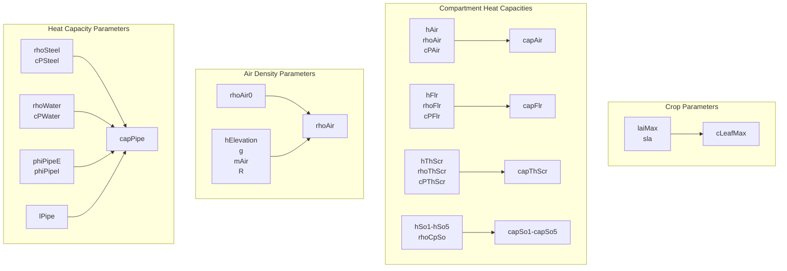
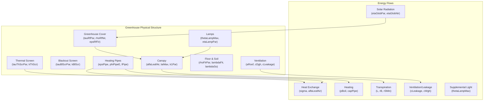

# Model Definitions

> **Relevant source files**
> * [readme.md](https://github.com/davkat1/GreenLight/blob/089602e3/readme.md)

This page documents the JSON model definitions that form the core of the GreenLight simulation platform. Model definitions specify the mathematical structure of dynamic systems including variables, constants, inputs, and equations. The GreenLight platform uses modular JSON-based model definitions that can be combined and extended to create complex greenhouse and crop simulation models.

For information about the academic foundations of these models, see page 2.2. For details on combining and extending models, see page 2.3.

## Model Definition Overview

The GreenLight platform uses JSON-based model definitions stored in the `models/` directory. Each model definition contains structured mathematical descriptions of dynamic systems including state variables, parameters, external inputs, and differential equations. The core models are based on established academic literature and can be combined to create comprehensive greenhouse simulations.

### Core Model Structure

```

```

### Primary Model Files

| Model File | Academic Source | Purpose |
| --- | --- | --- |
| `greenhouse_vanthoor_2011_chapter_8.json` | Vanthoor (2011) Chapter 8 | Greenhouse climate dynamics |
| `crop_vanthoor_2011_chapter_9_simplified.json` | Vanthoor (2011) Chapter 9 | Crop growth and development |
| `extension_greenhouse_katzin_2021_vanthoor_2011.json` | Katzin (2021) Chapter 7 | LED lighting extensions |

Sources: [readme.md L52-L61](https://github.com/davkat1/GreenLight/blob/089602e3/readme.md#L52-L61)

 [readme.md L79](https://github.com/davkat1/GreenLight/blob/089602e3/readme.md#L79-L79)

## JSON Model Definition Structure

Each JSON model definition follows a standardized structure that defines the mathematical components of a dynamic system. The JSON format enables transparent, version-controlled, and modular model development.

### Model Definition Format

```

```

### Model Loading Process

```

```

Sources: [readme.md L32-L35](https://github.com/davkat1/GreenLight/blob/089602e3/readme.md#L32-L35)

 [models/katzin_2021/definition/](https://github.com/davkat1/GreenLight/blob/089602e3/models/katzin_2021/definition/)

## Greenhouse Model Definition

The `greenhouse_vanthoor_2011_chapter_8.json` file defines the greenhouse climate dynamics model based on Vanthoor (2011) Chapter 8. This model describes the energy and mass balance equations for greenhouse climate control.

### Variable Categories

| Category | Description | Examples |
| --- | --- | --- |
| **State Variables** | Dynamic system states that change over time | Air temperature, humidity, CO2 concentration |
| **Algebraic Variables** | Calculated values derived from state variables | Heat fluxes, ventilation rates, energy balances |
| **Control Variables** | System inputs that can be manipulated | Heating valve position, screen closure, ventilation opening |

### Key Model Components

```

```

### Physical Constants and Parameters

The greenhouse model includes physical constants for heat transfer, thermodynamic properties, and greenhouse-specific parameters such as dimensions, material properties, and equipment specifications.

Sources: [readme.md L56-L57](https://github.com/davkat1/GreenLight/blob/089602e3/readme.md#L56-L57)

 [models/katzin_2021/definition/vanthoor_2011/](https://github.com/davkat1/GreenLight/blob/089602e3/models/katzin_2021/definition/vanthoor_2011/)

## Crop Model Definition

The `crop_vanthoor_2011_chapter_9_simplified.json` file implements the crop growth model based on Vanthoor (2011) Chapter 9. This model describes photosynthesis, growth, development, and yield formation processes.

### Crop State Variables

```

```

### Photosynthesis Model Components

| Component | Description | Purpose |
| --- | --- | --- |
| **Light Interception** | PAR absorption by canopy based on leaf area index | Drives photosynthetic rate |
| **CO2 Uptake** | Stomatal conductance and CO2 diffusion | Limits photosynthetic capacity |
| **Temperature Response** | Enzymatic temperature dependencies | Modifies photosynthetic efficiency |
| **Carbohydrate Allocation** | Distribution of photosynthates | Determines growth patterns |

### Growth and Development

The crop model tracks biomass allocation to different plant organs and calculates development rates based on temperature and light conditions.

Sources: [readme.md L59-L60](https://github.com/davkat1/GreenLight/blob/089602e3/readme.md#L59-L60)

 [models/katzin_2021/definition/vanthoor_2011/](https://github.com/davkat1/GreenLight/blob/089602e3/models/katzin_2021/definition/vanthoor_2011/)

## LED Extension Model Definition

The `extension_greenhouse_katzin_2021_vanthoor_2011.json` file extends the greenhouse model with LED lighting capabilities based on Katzin (2021) Chapter 7. This extension adds supplemental lighting effects to both greenhouse climate and crop growth.

### LED System Components

```

```

### Integration with Base Models

The LED extension modifies both greenhouse climate equations (by adding heat sources) and crop equations (by providing additional PAR for photosynthesis). This demonstrates the modular nature of GreenLight's model definition system.

Sources: [readme.md L60-L61](https://github.com/davkat1/GreenLight/blob/089602e3/readme.md#L60-L61)

 [models/katzin_2021/definition/](https://github.com/davkat1/GreenLight/blob/089602e3/models/katzin_2021/definition/)

### Default Parameter Sources

The parameters in the GreenLight model are based on several scientific publications:

1. Vanthoor, B. et al. (2011) - Greenhouse climate model
2. Vanthoor, B. et al. (2011) - Tomato yield model
3. Katzin, D. et al. (2020) - GreenLight model evaluation
4. Katzin, D. (2021) - Energy saving by LED lighting in greenhouses
5. Katzin, D. et al. (2021) - Energy savings in greenhouses by transition from HPS to LED lighting

In the `setGlParams.m` file, parameter sources are indicated by reference numbers in square brackets.

Sources: [Code/createGreenLightModel/setGlParams.m L3-L38](https://github.com/davkat1/GreenLight/blob/089602e3/Code/createGreenLightModel/setGlParams.m#L3-L38)

## Parameter Dependencies and Relationships

Some parameters in the GreenLight model are derived from other parameters. These calculations are performed at the end of the `setGlParams` function.



Sources: [Code/createGreenLightModel/setGlParams.m L230-L254](https://github.com/davkat1/GreenLight/blob/089602e3/Code/createGreenLightModel/setGlParams.m#L230-L254)

 [Code/createGreenLightModel/setGlParams.m L294-L295](https://github.com/davkat1/GreenLight/blob/089602e3/Code/createGreenLightModel/setGlParams.m#L294-L295)

## Physical Meaning of Parameters

The parameters in the GreenLight model correspond to physical elements and processes in a greenhouse, as illustrated in the diagram below:



Sources: [Code/createGreenLightModel/setGlParams.m L50-L419](https://github.com/davkat1/GreenLight/blob/089602e3/Code/createGreenLightModel/setGlParams.m#L50-L419)

## Modifying Parameters for Different Scenarios

The default parameters represent a typical Dutch-style greenhouse growing tomatoes. However, these parameters can be modified to simulate different scenarios:

1. Different greenhouse structures (by changing construction parameters)
2. Different climate control strategies (by changing setpoints and control bands)
3. Different lighting systems (by changing lamp parameters)
4. Different crops (by changing crop growth and photosynthesis parameters)
5. Different geographic locations (by changing weather data and elevation)

When creating a simulation, parameters can be modified after calling `setGlParams` by directly changing values in the `gl.p` structure.

Sources: [Code/createGreenLightModel/setGlParams.m L1-L426](https://github.com/davkat1/GreenLight/blob/089602e3/Code/createGreenLightModel/setGlParams.m#L1-L426)