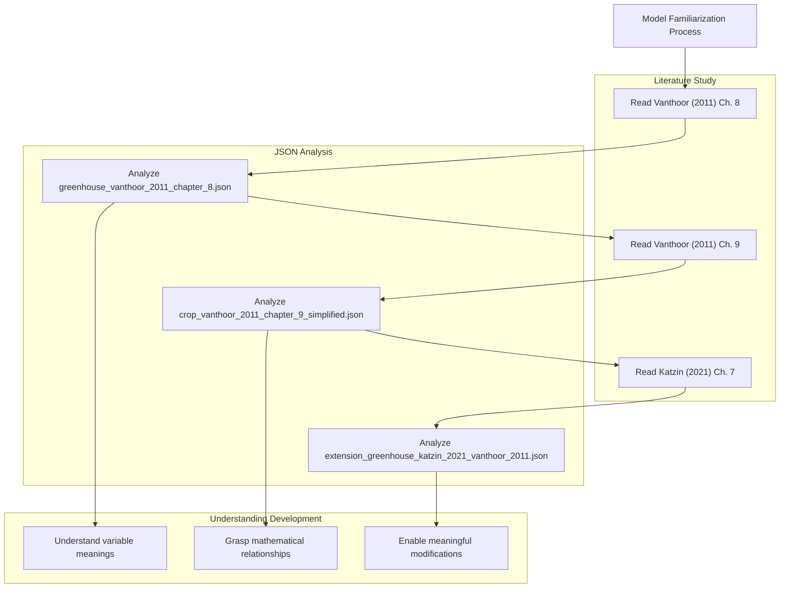

# Academic Foundations

> **Relevant source files**
> * [readme.md](https://github.com/davkat1/GreenLight/blob/089602e3/readme.md)

This document explains the academic literature basis for the GreenLight platform models, specifically detailing how the Katzin (2021) and Vanthoor (2011) publications are implemented in the codebase. It covers the theoretical foundations, their mapping to JSON model definitions, and the modular architecture that enables research-based modeling.

For information about the specific JSON model structure and variables, see [Model Definitions](/davkat1/GreenLight/2.1-model-definitions). For guidance on extending and combining these academic models, see [Model Combination](/davkat1/GreenLight/2.3-model-combination).

## Literature Hierarchy and Implementation

The GreenLight platform implements a hierarchical academic foundation where newer research builds upon established theoretical frameworks. This structure enables transparent, reusable research in dynamic greenhouse modeling.

### Academic Literature Foundation

The GreenLight platform is built upon two primary academic publications that form a hierarchical foundation:

| Publication | Focus | Implementation Location |
| --- | --- | --- |
| Vanthoor (2011) | Base greenhouse and crop modeling theory | `models/katzin_2021/definition/vanthoor_2011/` |
| Katzin (2021) | LED lighting extensions and energy optimization | `models/katzin_2021/definition/` |

**Literature to Implementation Mapping**

```

```

Sources: [readme.md L52-L61](https://github.com/davkat1/GreenLight/blob/089602e3/readme.md#L52-L61)

## Vanthoor (2011) Foundation Models

The Vanthoor (2011) publication provides the fundamental theoretical framework for greenhouse and crop modeling within GreenLight. This work establishes the core mathematical relationships and physical principles.

### Chapter 8: Greenhouse Model Implementation

Vanthoor's Chapter 8 focuses on greenhouse climate dynamics, heat transfer, and environmental control systems. This theoretical foundation is directly implemented in the GreenLight platform.

**Chapter 8 Implementation Structure**

```

```

Sources: [readme.md L56-L57](https://github.com/davkat1/GreenLight/blob/089602e3/readme.md#L56-L57)

### Chapter 9: Crop Model Implementation

Vanthoor's Chapter 9 addresses crop growth dynamics, photosynthesis, and plant development processes. The GreenLight implementation uses a simplified version of this model.

**Chapter 9 Implementation Structure**

```

```

Sources: [readme.md L59-L60](https://github.com/davkat1/GreenLight/blob/089602e3/readme.md#L59-L60)

## Katzin (2021) LED Extensions

The Katzin (2021) publication builds upon the Vanthoor (2011) foundation by adding LED lighting optimization and energy efficiency considerations. This work represents the current state-of-the-art implementation in GreenLight.

### Chapter 7: LED Extension Implementation

Katzin's Chapter 7 introduces LED lighting models, energy optimization strategies, and their integration with the existing greenhouse-crop system.

**LED Extension Architecture**

```

```

Sources: [readme.md L60-L61](https://github.com/davkat1/GreenLight/blob/089602e3/readme.md#L60-L61)

## Academic Model Integration

The GreenLight platform implements a modular architecture that reflects the hierarchical nature of the academic literature. This design enables researchers to understand, modify, and extend models while maintaining theoretical consistency.

### Model Component Mapping

The academic foundations are implemented through a systematic mapping of theoretical components to JSON model definitions:

| Academic Component | Theoretical Basis | JSON Implementation | Purpose |
| --- | --- | --- | --- |
| Greenhouse dynamics | Vanthoor Ch. 8 | `greenhouse_vanthoor_2011_chapter_8.json` | Climate control and heat transfer |
| Crop growth | Vanthoor Ch. 9 | `crop_vanthoor_2011_chapter_9_simplified.json` | Plant development and photosynthesis |
| LED lighting | Katzin Ch. 7 | `extension_greenhouse_katzin_2021_vanthoor_2011.json` | Energy-efficient lighting systems |

### Research Integration Framework

The platform's architecture facilitates transparent, reusable research by maintaining clear connections between academic theory and implementation:

**Academic-to-Code Integration Flow**

```

```

Sources: [readme.md L17-L18](https://github.com/davkat1/GreenLight/blob/089602e3/readme.md#L17-L18)

 [readme.md L48-L62](https://github.com/davkat1/GreenLight/blob/089602e3/readme.md#L48-L62)

## Understanding the Academic Models

The GreenLight platform emphasizes the importance of understanding the underlying academic theory before making model modifications. This approach ensures that changes maintain theoretical consistency and scientific rigor.

### Recommended Study Approach

The platform documentation recommends a specific sequence for studying the academic foundations:

1. **Start with Vanthoor Chapter 8** - Read alongside `greenhouse_vanthoor_2011_chapter_8.json`
2. **Continue with Vanthoor Chapter 9** - Study with `crop_vanthoor_2011_chapter_9_simplified.json`
3. **Extend with Katzin Chapter 7** - Examine `extension_greenhouse_katzin_2021_vanthoor_2011.json`

This progression builds understanding from fundamental greenhouse physics through crop biology to advanced LED integration.

### Model Familiarization Process

**Literature Study Integration**



Sources: [readme.md L48-L62](https://github.com/davkat1/GreenLight/blob/089602e3/readme.md#L48-L62)

## Open Science Integration

The academic foundations of GreenLight directly support its role as a tool for open science. The transparent mapping between academic literature and implementation enables reproducible research and collaborative model development.

### Transparency and Reproducibility

The platform's design ensures that:

* **Theoretical basis** is clearly documented and citable
* **Implementation details** are transparent through JSON definitions
* **Model modifications** can be tracked and validated against academic sources
* **Research results** can be reproduced and extended by other researchers

This integration of academic rigor with open-source implementation establishes GreenLight as a platform for transparent, collaborative research in greenhouse and crop modeling.

Sources: [readme.md L17-L18](https://github.com/davkat1/GreenLight/blob/089602e3/readme.md#L17-L18)

 [readme.md L48-L62](https://github.com/davkat1/GreenLight/blob/089602e3/readme.md#L48-L62)