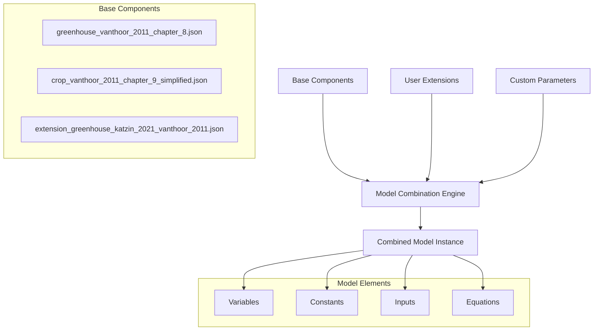
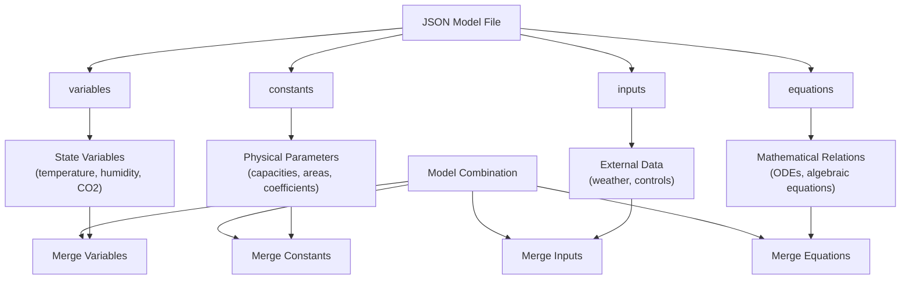
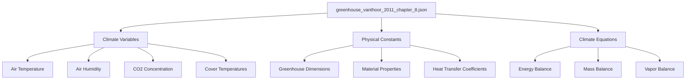
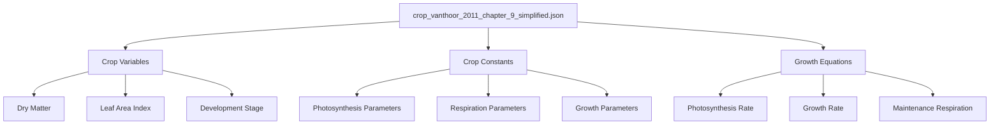
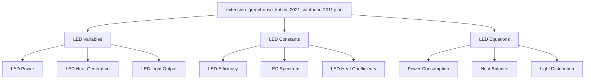
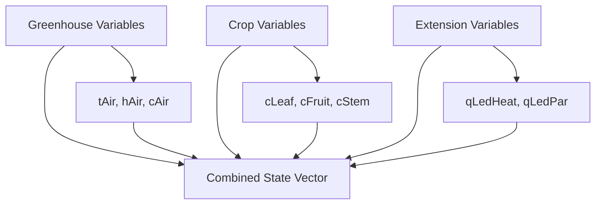
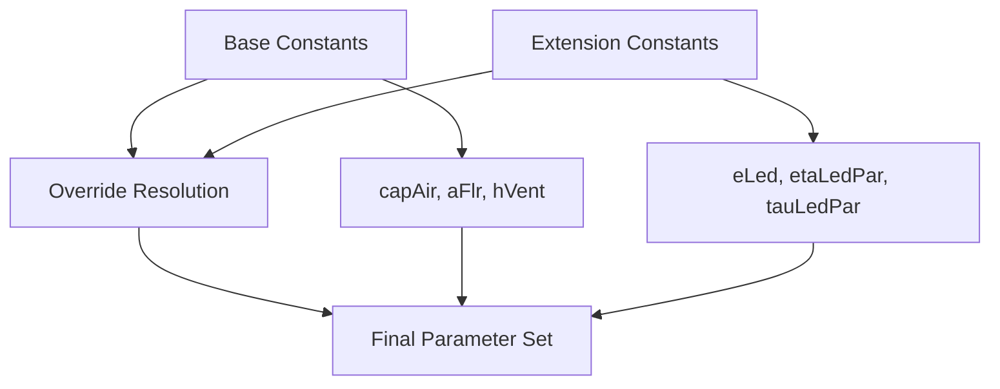
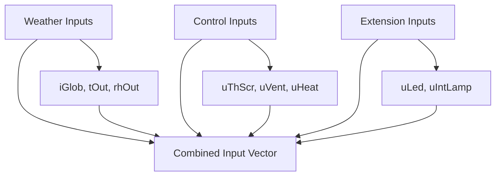
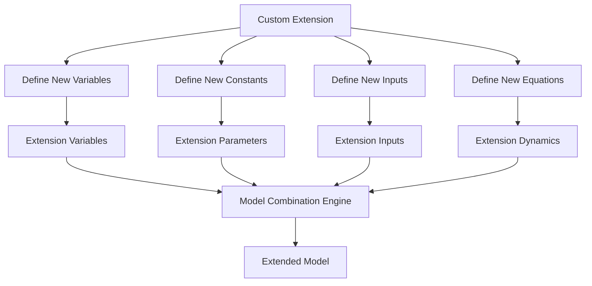
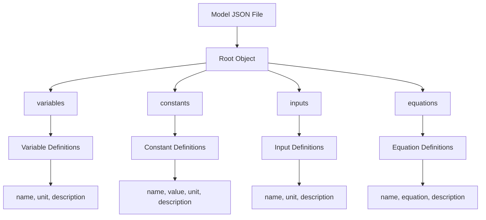

# Model Combination

> **Relevant source files**
> * [readme.md](https://github.com/davkat1/GreenLight/blob/089602e3/readme.md)

## Purpose and Scope

This page explains how to extend, combine, and modify models using the GreenLight framework. GreenLight uses a modular JSON-based approach that allows users to combine different model components (greenhouse, crop, extensions) to create comprehensive simulation models. This page covers the model format conventions and combination mechanisms used in the platform.

## Overview

GreenLight's model combination system enables users to build complex simulation models by combining modular components. The platform uses JSON model definitions that can be combined to create integrated greenhouse-crop-lighting systems. This modular approach supports both academic research reproducibility and practical model customization.

## Model Combination Architecture

Sources: [readme.md L52-L61](https://github.com/davkat1/GreenLight/blob/089602e3/readme.md#L52-L61)

## JSON Model Format Structure

GreenLight models are defined as JSON files with a standardized structure containing four main sections:

| Section | Description | Purpose |
| --- | --- | --- |
| `variables` | Dynamic state variables | Define system states that change during simulation |
| `constants` | Fixed parameters | Define model constants and physical parameters |
| `inputs` | External forcing data | Define weather, controls, and other external inputs |
| `equations` | Mathematical relationships | Define differential equations and algebraic relations |

### JSON Model Structure Overview

Sources: [readme.md L67-L68](https://github.com/davkat1/GreenLight/blob/089602e3/readme.md#L67-L68)

## Core Model Components

GreenLight's model combination system is built around three core components that implement academic greenhouse modeling literature:

### 1. Greenhouse Model (Vanthoor 2011 Chapter 8)

The base greenhouse model implements the physical climate dynamics:

Sources: [readme.md L56-L57](https://github.com/davkat1/GreenLight/blob/089602e3/readme.md#L56-L57)

### 2. Crop Model (Vanthoor 2011 Chapter 9)

The crop model adds plant growth and physiological processes:

Sources: [readme.md L59-L60](https://github.com/davkat1/GreenLight/blob/089602e3/readme.md#L59-L60)

### 3. LED Extension Model (Katzin 2021)

The LED extension adds supplemental lighting capabilities:

Sources: [readme.md L60-L61](https://github.com/davkat1/GreenLight/blob/089602e3/readme.md#L60-L61)

## Model Combination Process

The GreenLight platform combines models through a systematic merging process that respects the modular structure of each component:

### 1. Variable Merging

Variables from different models are combined into a unified state space:

### 2. Constant Merging

Physical parameters and constants are combined with conflict resolution:

### 3. Input Integration

External inputs from different models are unified into a single input structure:

Sources: [readme.md L67-L68](https://github.com/davkat1/GreenLight/blob/089602e3/readme.md#L67-L68)

## Model Extension and Customization

### Creating Custom Extensions

Users can create custom extensions by following the JSON model format:

### Model Modification Patterns

Common patterns for extending and modifying models include:

| Pattern | Description | Use Case |
| --- | --- | --- |
| **Parameter Override** | Modify existing constants | Adjust physical properties |
| **Variable Addition** | Add new state variables | Include new physical processes |
| **Input Extension** | Add new external inputs | Include new control or environmental data |
| **Equation Modification** | Modify existing equations | Change model behavior or add coupling |

Sources: [readme.md L67-L68](https://github.com/davkat1/GreenLight/blob/089602e3/readme.md#L67-L68)

## Model Format Conventions

### JSON Structure Requirements

GreenLight models must follow specific JSON structure conventions:

### Academic Model Mapping

The JSON format maps directly to academic literature:

| JSON Element | Academic Source | Purpose |
| --- | --- | --- |
| `variables` | State variables in literature | Dynamic system states |
| `constants` | Parameter tables in papers | Fixed model parameters |
| `inputs` | External forcing functions | Boundary conditions |
| `equations` | Mathematical formulations | System dynamics |

### Combination Rules

When combining models, the following rules apply:

1. **Variable Namespace**: Each model component maintains its variable namespace
2. **Constant Override**: Later models can override earlier constants
3. **Input Merging**: Inputs are combined without conflict
4. **Equation Integration**: Equations are merged preserving dependencies

Sources: [readme.md L52-L61](https://github.com/davkat1/GreenLight/blob/089602e3/readme.md#L52-L61)

## Usage Example

The basic pattern for using `createGreenLightModel` is:

1. Prepare weather data in the required format
2. Decide on a lamp type ('hps', 'led', or 'none')
3. Set a start time for the simulation
4. Optionally, prepare control trajectories
5. Call `createGreenLightModel` with the appropriate parameters

Once the model is created, it can be used for simulation with different scenarios, as described in [Running Simulations](/davkat1/GreenLight/4-running-simulations).

## Summary

The model creation process is a fundamental part of the GreenLight system. It establishes the simulation environment with the appropriate parameters, inputs, states, and control mechanisms. The process supports both rule-based and trajectory-driven control, providing flexibility for different simulation scenarios.

The `createGreenLightModel` function serves as the main entry point for creating a GreenLight model, bringing together all the components needed for greenhouse climate and energy simulation. After creating a model using this function, users can proceed to run simulations and analyze the results using other components of the GreenLight system.