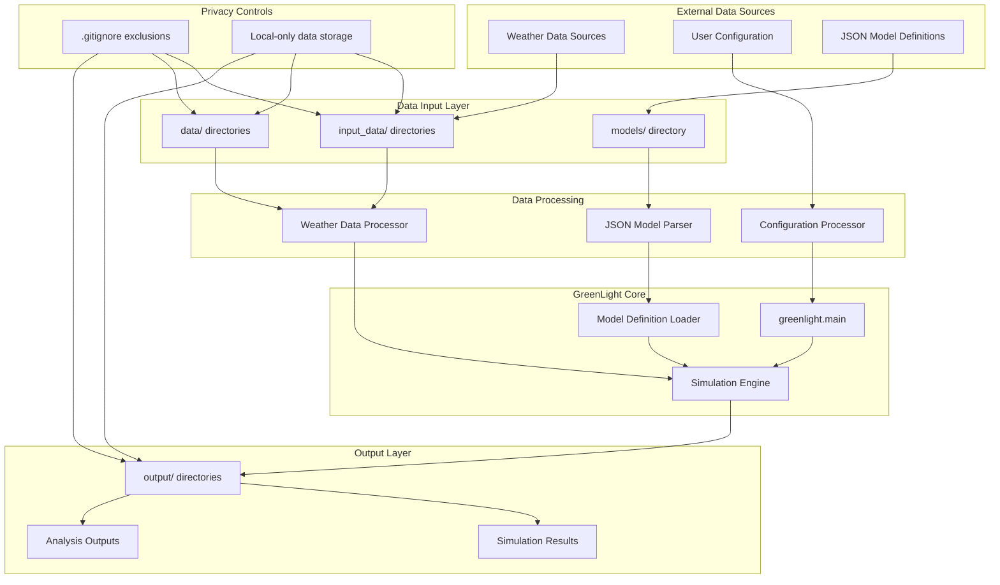
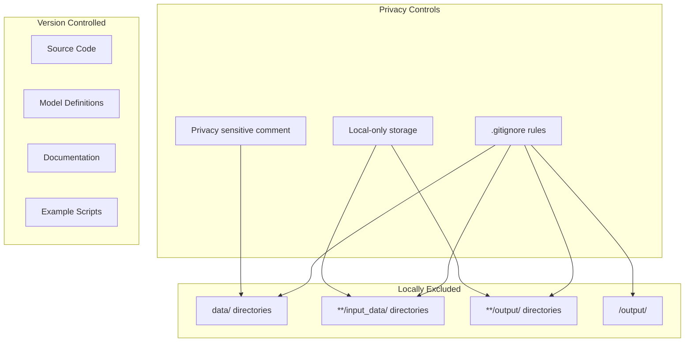
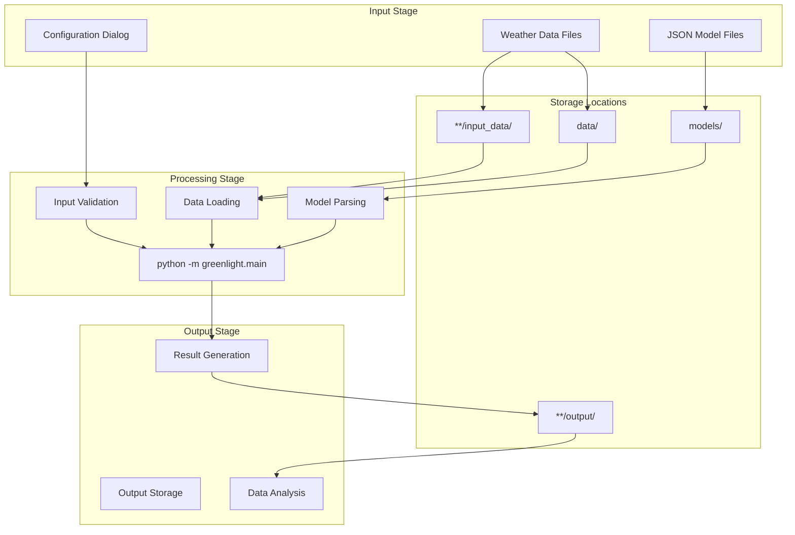

# Data Handling

> **Relevant source files**
> * [.gitignore](https://github.com/davkat1/GreenLight/blob/089602e3/.gitignore)
> * [readme.md](https://github.com/davkat1/GreenLight/blob/089602e3/readme.md)

This document covers GreenLight's data handling architecture, including input data management, output generation, and privacy considerations. The platform processes weather data, model configurations, and simulation results while maintaining strict data privacy practices.

For specific guidance on weather data acquisition and usage, see [Weather Data](/davkat1/GreenLight/3.1-weather-data). For detailed data management practices and directory structures, see [Input and Output Data](/davkat1/GreenLight/3.2-input-and-output-data).

## Data Architecture Overview

GreenLight processes multiple data types through a structured pipeline that separates external data sources from the core simulation engine while maintaining privacy and reproducibility.



Sources: [readme.md L40-L41](https://github.com/davkat1/GreenLight/blob/089602e3/readme.md#L40-L41)

 [.gitignore L100-L113](https://github.com/davkat1/GreenLight/blob/089602e3/.gitignore#L100-L113)

## Data Types and Sources

The GreenLight platform handles several distinct data categories, each with specific handling requirements and storage patterns.

| Data Type | Source | Storage Location | Privacy Level |
| --- | --- | --- | --- |
| Weather Data | External APIs/Files | `data/`, `**/input_data/` | High - Location sensitive |
| Model Definitions | JSON Files | `models/` directory | Public - Version controlled |
| User Configuration | Dialog Interface | Runtime memory | Medium - User preferences |
| Simulation Results | Engine Output | `**/output/`, `output/` | Medium - Derived data |
| Analysis Outputs | Post-processing | `**/output/` | Medium - Derived data |

The platform distinguishes between **configuration data** (model definitions stored in version control) and **runtime data** (weather inputs and simulation outputs excluded from version control).

Sources: [.gitignore L100-L113](https://github.com/davkat1/GreenLight/blob/089602e3/.gitignore#L100-L113)

 [readme.md L77-L81](https://github.com/davkat1/GreenLight/blob/089602e3/readme.md#L77-L81)

## Privacy and Security Considerations

GreenLight implements strict data privacy controls, recognizing that weather data can be location-sensitive and simulation results may contain proprietary information.

### Data Exclusion Strategy

The platform uses comprehensive `.gitignore` patterns to prevent sensitive data from entering version control:



The exclusion strategy includes an explicit privacy comment: *"do not upload data to git. Its slow and privacy sensitive"*.

Sources: [.gitignore L100-L103](https://github.com/davkat1/GreenLight/blob/089602e3/.gitignore#L100-L103)

### Exception Handling

While most data is excluded, the platform allows for controlled inclusion of demonstration data using Git's force-add mechanism: `git add -f data/...` for specific demo or dummy datasets.

Sources: [.gitignore L102](https://github.com/davkat1/GreenLight/blob/089602e3/.gitignore#L102-L102)

## Data Flow Process

The data handling process follows a structured pipeline from external sources through processing to final output, with privacy controls applied at each stage.



The process ensures that sensitive input data never leaves the local environment while maintaining separation between configuration and runtime data.

Sources: [readme.md L31-L37](https://github.com/davkat1/GreenLight/blob/089602e3/readme.md#L31-L37)

 [.gitignore L104-L113](https://github.com/davkat1/GreenLight/blob/089602e3/.gitignore#L104-L113)

## Directory Structure for Data

GreenLight employs a consistent directory structure that separates different data types while maintaining privacy boundaries.

### Standard Directory Pattern

```python
project_root/
├── data/                     # Excluded from version control
├── models/                   # Version controlled model definitions
├── **/input_data/           # Weather and input data (excluded)
│   └── .gitkeep            # Preserves directory structure
├── **/output/              # Simulation results (excluded) 
│   └── .gitkeep            # Preserves directory structure
└── output/                 # General output directory (excluded)
```

### Directory-Specific Handling

* **`data/` directories**: General data storage, privacy-sensitive, completely excluded
* **`**/input_data/` patterns**: Weather data and external inputs, excluded but structure preserved
* **`**/output/` patterns**: Model-specific outputs, excluded but structure preserved
* **`models/` directory**: JSON model definitions, version controlled and public
* **`.gitkeep` files**: Maintain directory structure in version control while excluding contents

The pattern `<model_name>/output/` provides model-specific output organization while maintaining consistent exclusion rules.

Sources: [.gitignore L103-L113](https://github.com/davkat1/GreenLight/blob/089602e3/.gitignore#L103-L113)