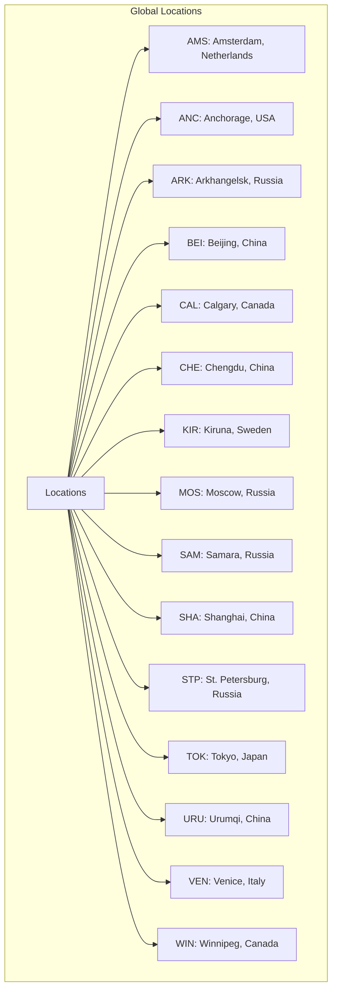
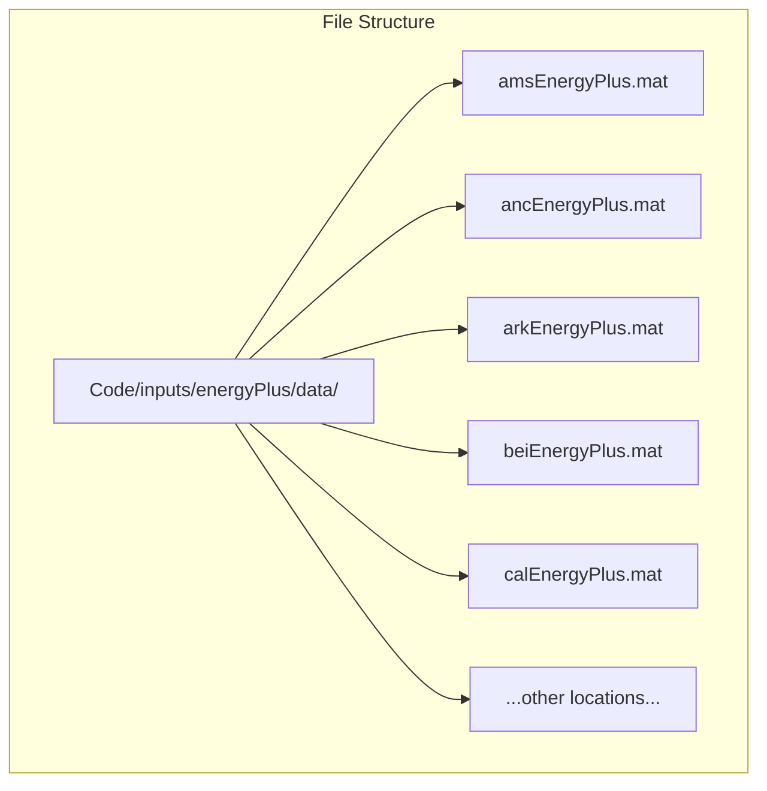
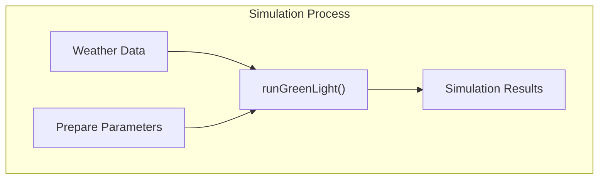
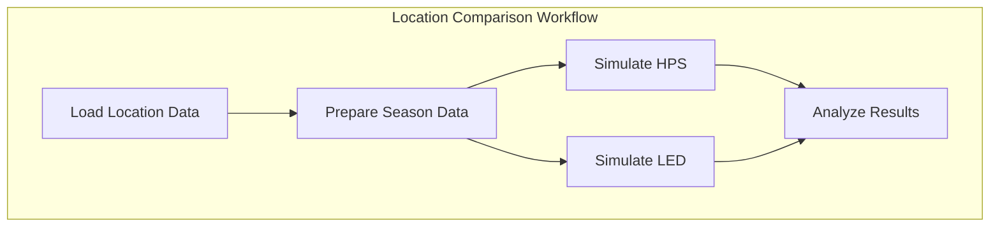

# Weather Data

> **Relevant source files**
> * [readme.md](https://github.com/davkat1/GreenLight/blob/089602e3/readme.md)

## Purpose and Scope

This document details the weather data formats, sources, and usage within the GreenLight model. Weather data is an essential input for greenhouse simulations as it provides the external climate conditions that influence the internal greenhouse environment. The GreenLight model uses weather data for simulating greenhouse energy use and climate under different lighting technologies (HPS and LED) across various global locations.

This page focuses on the structure of weather data files, available locations, and how weather data is prepared and used in simulations. For information about greenhouse trial data, see [Greenhouse Data](/davkat1/GreenLight/3.1-weather-data).

Sources: [Code/runScenarios/runWorldSimulations.m L1-L15](https://github.com/davkat1/GreenLight/blob/089602e3/Code/runScenarios/runWorldSimulations.m#L1-L15)

## Weather Data Format

The GreenLight model primarily uses weather data in the EnergyPlus format, stored in MATLAB `.mat` files. Each weather file contains a variable named `weather` which is a matrix with multiple columns representing different weather parameters.

```

```

The primary weather parameters used in the model include:

* Temperature (°C) - Found in column 3 of the weather matrix
* Solar radiation (W/m²) - Found in column 2 of the weather matrix

These parameters are crucial for simulating the external conditions affecting greenhouse energy use and climate control.

Sources: [Code/inputs/energyPlus/scatterYearAvgTempRad.m L42-L47](https://github.com/davkat1/GreenLight/blob/089602e3/Code/inputs/energyPlus/scatterYearAvgTempRad.m#L42-L47)

 [Code/inputs/energyPlus/scatterYearAvgTempRad.m L165-L166](https://github.com/davkat1/GreenLight/blob/089602e3/Code/inputs/energyPlus/scatterYearAvgTempRad.m#L165-L166)

## Available Weather Locations

The GreenLight model includes weather data for 15 global locations, covering a range of climate conditions from cold to warm and from low to high solar radiation levels. These locations are used to evaluate greenhouse performance across different climate scenarios.



These locations represent diverse climate conditions, allowing researchers to evaluate the performance of different lighting technologies across various scenarios. The locations vary significantly in terms of average temperature and solar radiation, with some locations being colder (e.g., Kiruna, Anchorage) and others warmer (e.g., Shanghai, Venice).

Sources: [Code/runScenarios/runWorldSimulations.m L16-L17](https://github.com/davkat1/GreenLight/blob/089602e3/Code/runScenarios/runWorldSimulations.m#L16-L17)

 [Code/inputs/energyPlus/scatterYearAvgTempRad.m L42-L161](https://github.com/davkat1/GreenLight/blob/089602e3/Code/inputs/energyPlus/scatterYearAvgTempRad.m#L42-L161)

## Weather Data File Structure

Each weather location has its corresponding data file stored in the `Code/inputs/energyPlus/data/` directory with the naming convention `[locationCode]EnergyPlus.mat`. For example, Amsterdam's weather data is stored in `amsEnergyPlus.mat`.



When loaded, each weather file contains a variable named `weather` that stores the climate data in a matrix format. The data typically covers a full year with hourly measurements.

Sources: [Code/runScenarios/runWorldSimulations.m L22-L27](https://github.com/davkat1/GreenLight/blob/089602e3/Code/runScenarios/runWorldSimulations.m#L22-L27)

 [Code/inputs/energyPlus/scatterYearAvgTempRad.m L15-L17](https://github.com/davkat1/GreenLight/blob/089602e3/Code/inputs/energyPlus/scatterYearAvgTempRad.m#L15-L17)

## Preparing Weather Data for Simulations

Before weather data can be used in simulations, it often needs to be prepared by selecting the relevant time period. The GreenLight model includes a function called `cutEnergyPlusData` that extracts a specific season from the yearly weather data.

```mermaid
sequenceDiagram
  participant runWorldSimulations.m
  participant cutEnergyPlusData()
  participant Weather File

  runWorldSimulations.m->>Weather File: Load full year data
  runWorldSimulations.m->>cutEnergyPlusData(): firstDay, seasonLength, fileLocation
  cutEnergyPlusData()->>Weather File: Extract data from specified day
  cutEnergyPlusData()->>runWorldSimulations.m: Return season data
  runWorldSimulations.m->>runWorldSimulations.m: Use prepared data for simulation
```

Key parameters for preparing weather data:

* `firstDay`: Day of the year where the season starts (default is 270, approximately October 1)
* `seasonLength`: Duration of the season in days (default is 350)

This preparation step allows researchers to focus on specific growing seasons relevant to their research questions.

Sources: [Code/runScenarios/runWorldSimulations.m L18-L19](https://github.com/davkat1/GreenLight/blob/089602e3/Code/runScenarios/runWorldSimulations.m#L18-L19)

 [Code/runScenarios/runWorldSimulations.m L32-L34](https://github.com/davkat1/GreenLight/blob/089602e3/Code/runScenarios/runWorldSimulations.m#L32-L34)

## Using Weather Data in Simulations

Once prepared, the weather data is passed to the simulation functions. The `runGreenLight` function uses the weather data as an input to simulate greenhouse climate and energy use under different lighting technologies (HPS and LED).



Weather data influences several aspects of the greenhouse simulation:

1. **Heating requirements**: Based on the temperature difference between outside and inside
2. **Lighting control**: Supplemental lighting is adjusted based on natural solar radiation
3. **Climate control**: Ventilation and humidity management are influenced by outside conditions

By using weather data from different locations, researchers can evaluate the performance of greenhouse technologies across various climate scenarios, leading to region-specific recommendations for energy-efficient greenhouse operations.

Sources: [Code/runScenarios/runWorldSimulations.m L36-L38](https://github.com/davkat1/GreenLight/blob/089602e3/Code/runScenarios/runWorldSimulations.m#L36-L38)

 [Code/runScenarios/runWorldSimulations.m L49-L51](https://github.com/davkat1/GreenLight/blob/089602e3/Code/runScenarios/runWorldSimulations.m#L49-L51)

## Example: Comparing Locations

The GreenLight model has been used to compare greenhouse performance across different global locations, helping to understand how climate affects energy use and potential savings when transitioning from HPS to LED lighting.



The research using this approach demonstrated that climate conditions significantly influence the potential energy savings when transitioning from HPS to LED lighting in greenhouses, with some locations showing greater benefits than others.

Sources: [Code/runScenarios/runWorldSimulations.m L29-L38](https://github.com/davkat1/GreenLight/blob/089602e3/Code/runScenarios/runWorldSimulations.m#L29-L38)

 [Code/inputs/energyPlus/scatterYearAvgTempRad.m L1-L9](https://github.com/davkat1/GreenLight/blob/089602e3/Code/inputs/energyPlus/scatterYearAvgTempRad.m#L1-L9)

## Weather Data Visualization

The GreenLight model includes tools for visualizing weather data to better understand the climate characteristics of different locations. For example, the `scatterYearAvgTempRad.m` script creates a scatter plot showing the yearly average temperature and radiation for all 15 locations.

This visualization helps researchers understand the climate distribution across the studied locations and provides context for interpreting simulation results.

Example data from visualization:

| Location | Avg. Temperature (°C) | Avg. Radiation (MJ/m²/day) |
| --- | --- | --- |
| AMS (Amsterdam) | ~9.5 | ~9.5 |
| KIR (Kiruna) | ~-1.5 | ~7.0 |
| CAL (Calgary) | ~4.0 | ~13.0 |
| SHA (Shanghai) | ~16.0 | ~13.0 |

Sources: [Code/inputs/energyPlus/scatterYearAvgTempRad.m L1-L9](https://github.com/davkat1/GreenLight/blob/089602e3/Code/inputs/energyPlus/scatterYearAvgTempRad.m#L1-L9)

 [Code/inputs/energyPlus/scatterYearAvgTempRad.m L164-L166](https://github.com/davkat1/GreenLight/blob/089602e3/Code/inputs/energyPlus/scatterYearAvgTempRad.m#L164-L166)