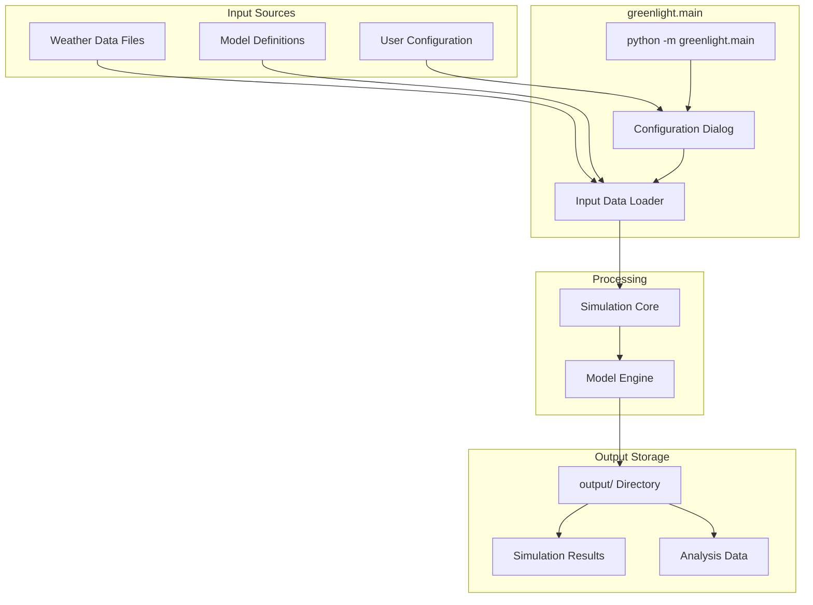
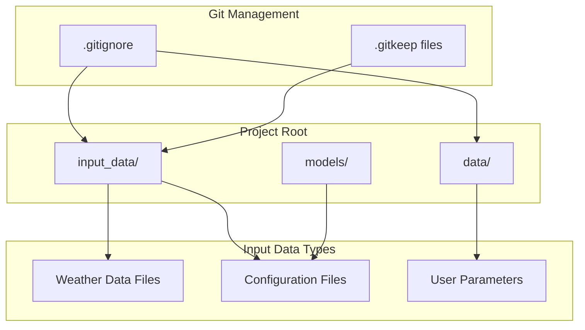
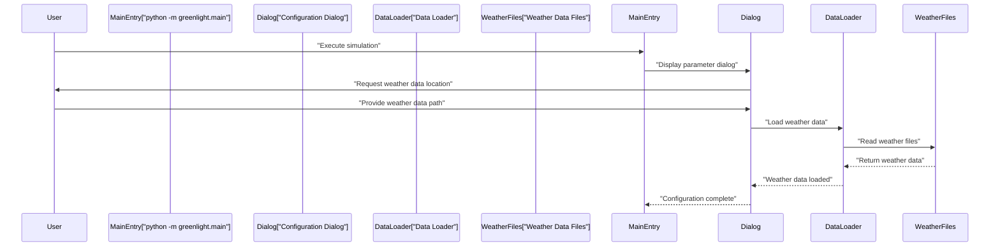
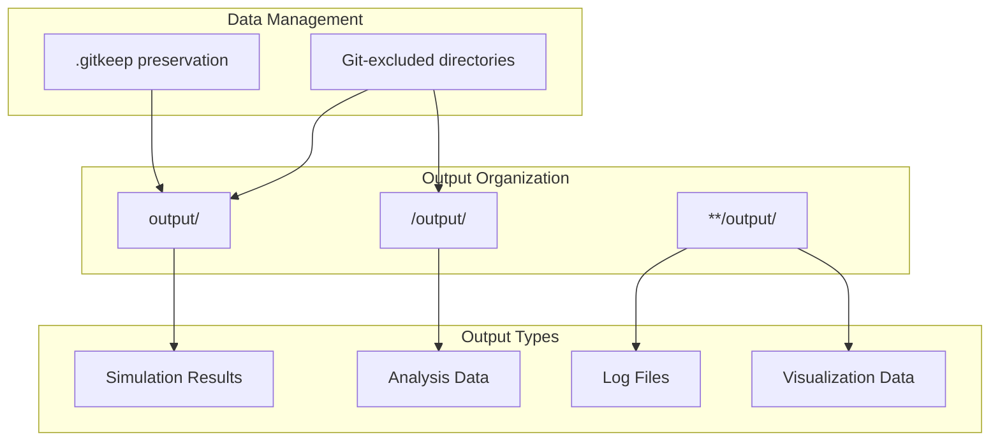
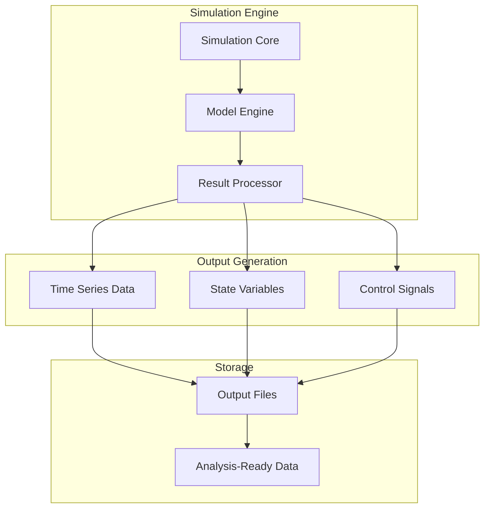
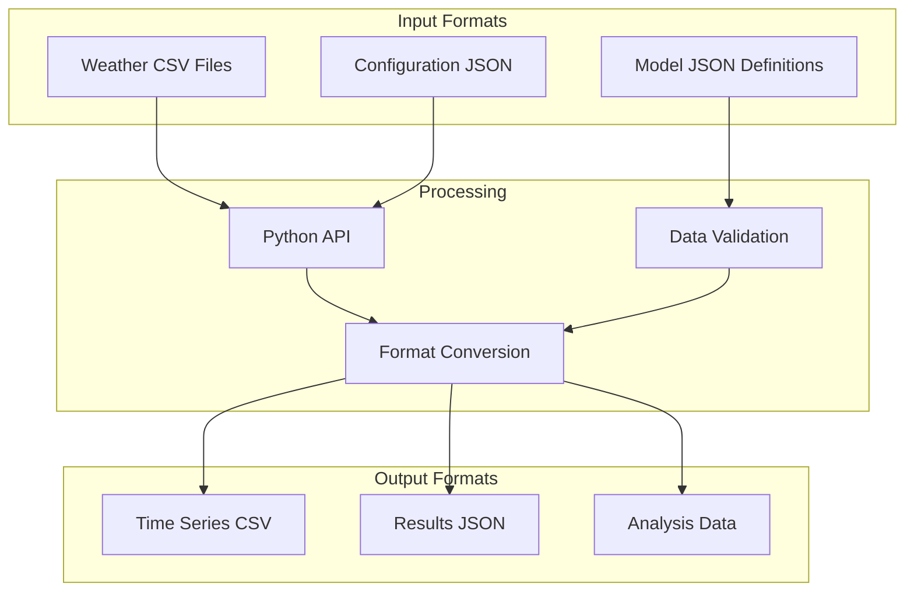
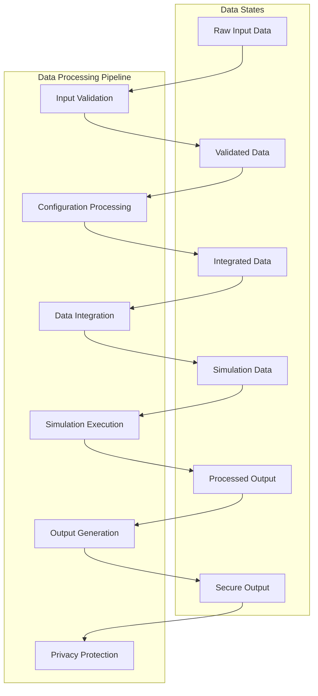

# Input and Output Data

> **Relevant source files**
> * [.gitignore](https://github.com/davkat1/GreenLight/blob/089602e3/.gitignore)
> * [readme.md](https://github.com/davkat1/GreenLight/blob/089602e3/readme.md)

## Purpose and Scope

This document details data management practices in the GreenLight platform, covering input data handling, output generation, and privacy considerations. The platform is designed to handle various types of input data, primarily weather data for location-specific simulations, while generating simulation outputs in structured formats.

## Data Flow Architecture

The GreenLight platform processes data through a structured flow from input sources to simulation outputs:

Sources: [readme.md L32-L41](https://github.com/davkat1/GreenLight/blob/089602e3/readme.md#L32-L41)

 [.gitignore L101-L113](https://github.com/davkat1/GreenLight/blob/089602e3/.gitignore#L101-L113)

## Input Data Management

### Data Directory Structure

The GreenLight platform uses a standardized directory structure for managing input data:

### Privacy and Security Considerations

The platform implements several privacy measures for data handling:

| Directory | Privacy Status | Purpose |
| --- | --- | --- |
| `data/` | Git-excluded | User-sensitive data storage |
| `**/input_data/` | Git-excluded | Location-specific input data |
| `**/output/` | Git-excluded | Simulation results and outputs |

The `.gitignore` file specifically excludes data directories to prevent accidental upload of sensitive information, with the comment "do not upload data to git. Its slow and privacy sensitive."

Sources: [.gitignore L101-L113](https://github.com/davkat1/GreenLight/blob/089602e3/.gitignore#L101-L113)

## Input Data Types and Formats

### Weather Data Requirements

Weather data is essential for location-specific simulations. The platform requires weather data to produce meaningful simulation results:

| Data Type | Description | Requirement |
| --- | --- | --- |
| Weather Files | Location-specific meteorological data | Required for realistic simulations |
| User Configuration | Dialog box parameters and settings | Required for all simulations |
| Model Definitions | JSON model specification files | Predefined in models directory |

### Weather Data Integration

The platform processes weather data through the following workflow:

Sources: [readme.md L39-L41](https://github.com/davkat1/GreenLight/blob/089602e3/readme.md#L39-L41)

## Output Data Generation

### Output Directory Structure

The GreenLight platform generates simulation outputs in organized directory structures:

### Output Data Processing

The platform processes simulation outputs through the `greenlight` package:

Sources: [.gitignore L107-L113](https://github.com/davkat1/GreenLight/blob/089602e3/.gitignore#L107-L113)

 [readme.md L71-L81](https://github.com/davkat1/GreenLight/blob/089602e3/readme.md#L71-L81)

### Data Access and Usage

The platform provides multiple interfaces for accessing input and output data:

| Interface | Purpose | Data Access |
| --- | --- | --- |
| `python -m greenlight.main` | Primary CLI entry point | Dialog-based configuration |
| `greenlight` package | Programmatic access | Direct Python API |
| `notebooks/` | Interactive analysis | Jupyter-based exploration |
| `scripts/` | Batch processing | Script-based automation |

### Data Format Considerations

The platform handles data in formats suitable for scientific computing:

Sources: [readme.md L44-L46](https://github.com/davkat1/GreenLight/blob/089602e3/readme.md#L44-L46)

 [readme.md L80-L81](https://github.com/davkat1/GreenLight/blob/089602e3/readme.md#L80-L81)

## Data Processing Workflow

The GreenLight platform implements a structured data processing workflow:

1. **Input validation**: Checking data format and completeness
2. **Configuration processing**: Parsing user settings and model parameters
3. **Data integration**: Combining weather data with model definitions
4. **Simulation execution**: Running the dynamic model with integrated data
5. **Output generation**: Creating structured result files
6. **Privacy protection**: Ensuring sensitive data remains local

Sources: [.gitignore L101-L113](https://github.com/davkat1/GreenLight/blob/089602e3/.gitignore#L101-L113)

## Data Usage in the GreenLight Model

The greenhouse data serves primarily for model validation and evaluation. After loading with `loadGreenhouseData`, the data is used in various evaluation functions:

1. **Climate Model Evaluation** - Comparing simulated and measured greenhouse climate
2. **Energy Use Evaluation** - Validating energy consumption predictions

These evaluations are essential for assessing model accuracy and for comparing the performance of different lighting technologies (HPS vs. LED) in terms of climate control and energy efficiency.

Sources: [Code/inputs/Recorded L16-L22](https://github.com/davkat1/GreenLight/blob/089602e3/Code/inputs/Recorded greenhouse data from 2010 Bleiswijk trial/Readme.txt#L16-L22)

## Research Context

The greenhouse datasets are documented in published research:

* **HPS and LED datasets**: Described in Dueck et al. (2010), "Lichtbenuttig van tomaat onder LED en SON-T belichting"
* **Model validation**: Used in Katzin et al. (2020), "GreenLight – An open source model for greenhouses with supplemental lighting: Evaluation of heat requirements under LED and HPS lamps"

The data represents real-world greenhouse operations and provides a benchmark for testing the GreenLight model's ability to accurately simulate greenhouse climate and energy use under different lighting technologies.

Sources: [Code/inputs/loadGreenhouseData.m L8-L16](https://github.com/davkat1/GreenLight/blob/089602e3/Code/inputs/loadGreenhouseData.m#L8-L16)

 [Code/inputs/Recorded L21-L22](https://github.com/davkat1/GreenLight/blob/089602e3/Code/inputs/Recorded greenhouse data from 2010 Bleiswijk trial/Readme.txt#L21-L22)