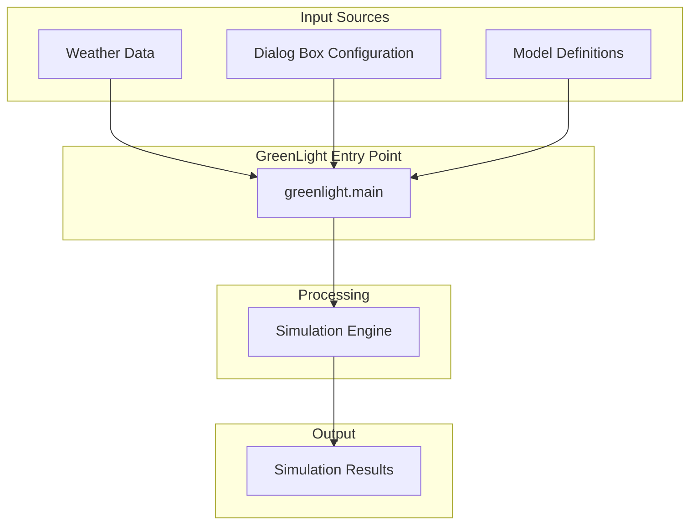
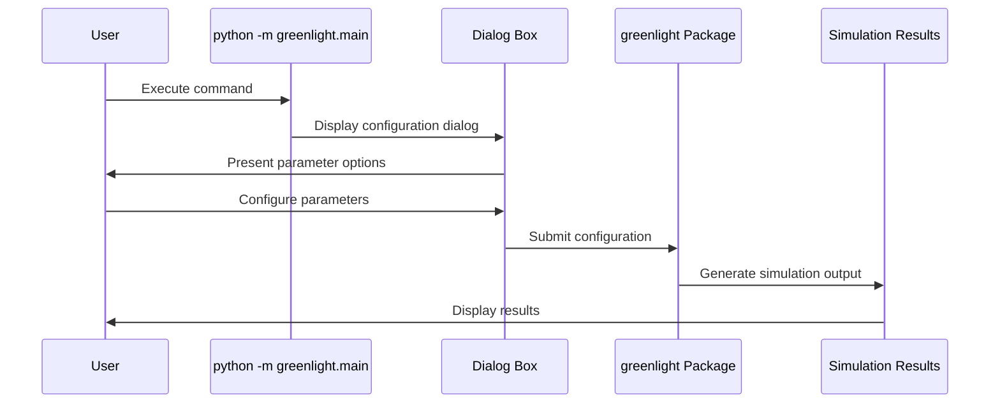
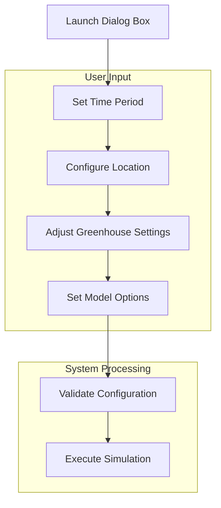
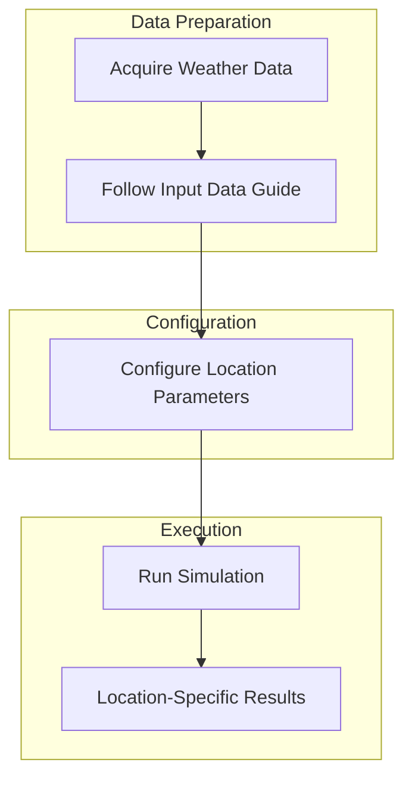
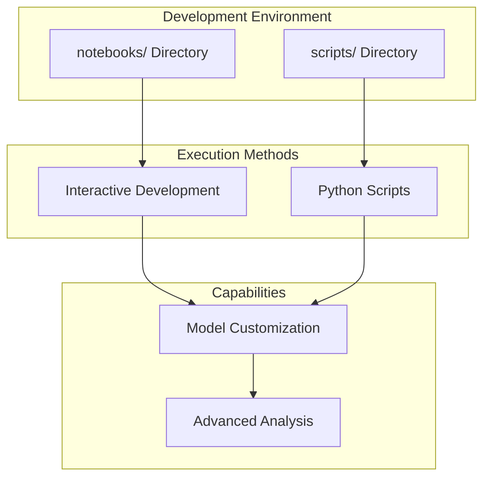
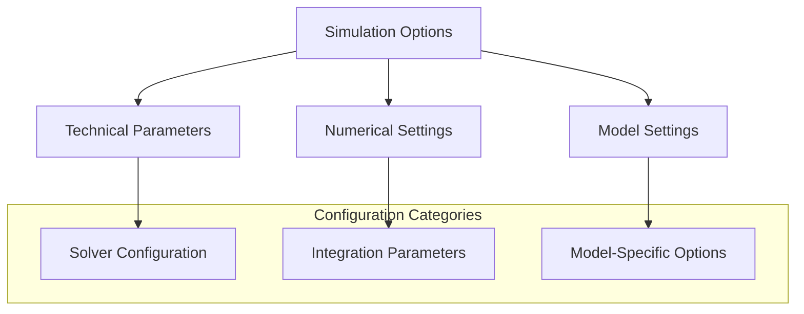
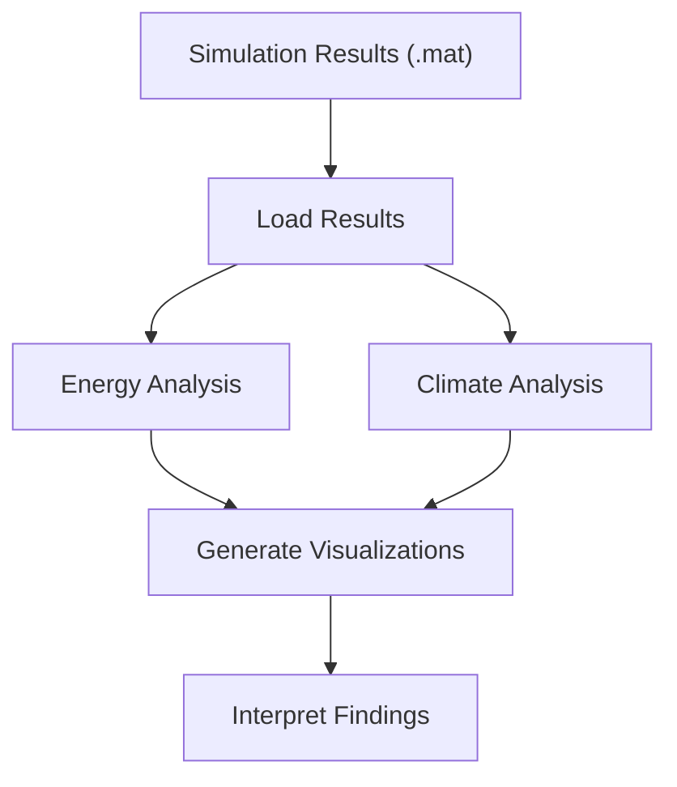

# Running Simulations

> **Relevant source files**
> * [readme.md](https://github.com/davkat1/GreenLight/blob/089602e3/readme.md)

This page provides a comprehensive guide on how to configure and execute simulations using the GreenLight platform. It covers basic simulation setup, dialog box configuration, and execution of different simulation scenarios using the Python-based GreenLight system.

## Simulation Workflow

The GreenLight platform follows a structured workflow for simulation execution. This process involves preparing input data, configuring the model through the dialog interface, executing the simulation, and generating outputs for subsequent analysis.



Sources: [readme.md L31-L37](https://github.com/davkat1/GreenLight/blob/089602e3/readme.md#L31-L37)

 [readme.md L39-L41](https://github.com/davkat1/GreenLight/blob/089602e3/readme.md#L39-L41)

## Basic Simulation Execution

### Primary Entry Point

The primary method for running simulations is through the command line interface using the `greenlight.main` module. This provides an interactive dialog box for configuring simulation parameters.

**Command Line Interface:**

```
python -m greenlight.main
```

After running this command, a dialog box will appear with various configuration inputs. You can adjust these parameters according to your simulation needs and click **OK** to execute the simulation.



Sources: [readme.md L31-L37](https://github.com/davkat1/GreenLight/blob/089602e3/readme.md#L31-L37)

### Quick Start Tips

For initial exploration and faster simulation execution:

| Parameter | Recommendation | Purpose |
| --- | --- | --- |
| End Date | Set closer to start date (e.g., 9/30/21) | Shorter simulation duration |
| Location | Use default settings initially | Avoid weather data complexity |
| Model Settings | Keep default values | Standard greenhouse configuration |

Sources: [readme.md L35-L37](https://github.com/davkat1/GreenLight/blob/089602e3/readme.md#L35-L37)

## Dialog Box Configuration

The GreenLight dialog box provides an intuitive interface for configuring simulation parameters. The dialog presents various input fields for customizing the simulation according to your specific requirements.

### Configuration Categories

The dialog box organizes parameters into logical groups:

| Category | Description | Configuration Method |
| --- | --- | --- |
| Time Period | Simulation start and end dates | Date picker fields |
| Location | Geographical parameters | Location selection |
| Greenhouse Settings | Physical and operational parameters | Input fields and dropdowns |
| Model Options | Technical simulation settings | Checkbox and numeric inputs |

### Configuration Workflow



Sources: [readme.md L31-L37](https://github.com/davkat1/GreenLight/blob/089602e3/readme.md#L31-L37)

## Location-Specific Simulations

### Weather Data Integration

For accurate and informative simulations, weather data should be provided as input to enable location-specific modeling. Without weather data, simulations will not provide meaningful results for specific geographical locations.



### Weather Data Requirements

To perform location-specific simulations, follow the guidelines in the input data documentation to acquire appropriate weather data for your target location.

| Data Type | Purpose | Source |
| --- | --- | --- |
| Weather Data | Climate forcing for simulation | Location-specific meteorological data |
| Location Parameters | Geographical configuration | Coordinates and local settings |
| Seasonal Patterns | Temporal variations | Historical weather patterns |

Sources: [readme.md L39-L41](https://github.com/davkat1/GreenLight/blob/089602e3/readme.md#L39-L41)

## Script and Notebook Usage

### Advanced Modeling Workflow

Complex modeling work typically requires writing and using scripts or notebooks for greater flexibility and customization beyond the basic dialog box interface.



### Available Examples

The GreenLight repository provides examples in two main directories:

| Directory | Content Type | Purpose |
| --- | --- | --- |
| `notebooks/` | Jupyter notebooks | Interactive development and examples |
| `scripts/` | Python scripts | Programmatic usage examples |

### Script-Based Workflow

For users who need to:

* Modify model settings programmatically
* Perform batch processing of multiple simulations
* Integrate GreenLight with other tools
* Conduct systematic parameter studies

The script-based approach provides the necessary flexibility through the Python API.

Sources: [readme.md L43-L46](https://github.com/davkat1/GreenLight/blob/089602e3/readme.md#L43-L46)

 [readme.md L80-L81](https://github.com/davkat1/GreenLight/blob/089602e3/readme.md#L80-L81)

## Configuration Options

### Simulation Options

The GreenLight platform provides various technical settings that can be modified to customize simulation behavior. These options control numerical aspects and computational parameters of the simulation engine.



### Configuration Sources

| Configuration Method | Description | Use Case |
| --- | --- | --- |
| Dialog Box | Interactive parameter setting | Basic simulations |
| Simulation Options | Technical parameter configuration | Advanced simulations |
| Model Settings | Model-specific configurations | Research applications |

For detailed information on available simulation options and their effects, refer to the simulation options documentation.

Sources: [readme.md L65](https://github.com/davkat1/GreenLight/blob/089602e3/readme.md#L65-L65)

## Simulation Outputs and Analysis

After running simulations, the results are typically saved as MATLAB `.mat` files containing the `gl` object, which holds all simulation states and results.

To analyze simulation results, refer to the [Post-Simulation Analysis](/davkat1/GreenLight/5-development-environment) section, which covers tools for:

* Energy usage analysis
* Climate comparison
* Visualization of results



Sources: [readme.md L209-L223](https://github.com/davkat1/GreenLight/blob/089602e3/readme.md#L209-L223)

## Example: Complete Simulation Workflow

This example shows a complete workflow for running and analyzing simulations:

1. Prepare climate data for your location of interest
2. Set appropriate greenhouse and lamp parameters
3. Run simulations for different lighting technologies (HPS and LED)
4. Compare energy use and climate conditions
5. Analyze potential energy savings

For specific research applications, see the [Applications and Research](/davkat1/GreenLight/6-applications-and-research) section which highlights how the GreenLight model has been used in published studies.

Sources: [readme.md L27-L60](https://github.com/davkat1/GreenLight/blob/089602e3/readme.md#L27-L60)

 [readme.md L107-L112](https://github.com/davkat1/GreenLight/blob/089602e3/readme.md#L107-L112)