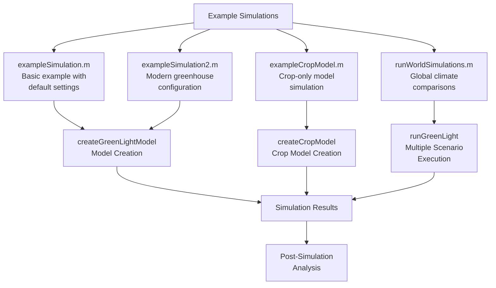
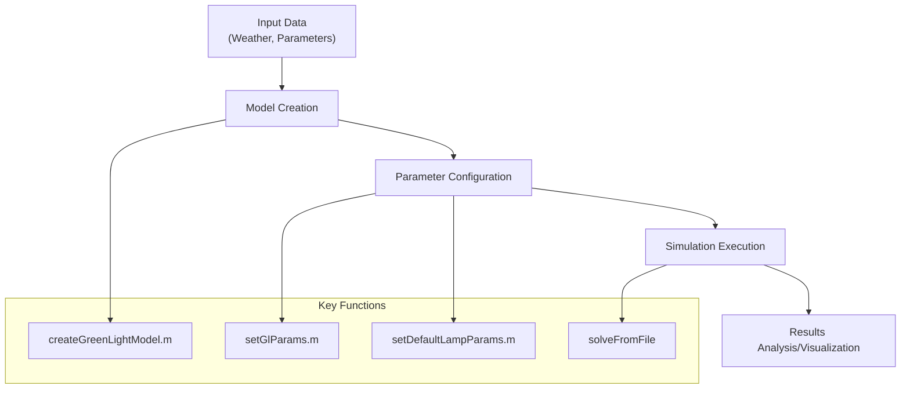
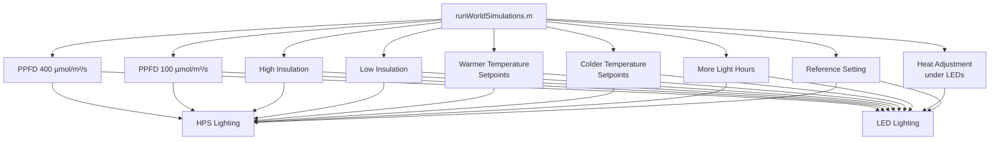
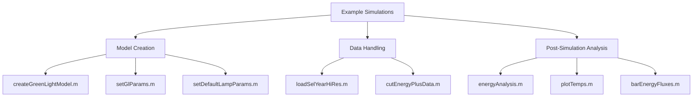

# Example Simulations

> **Relevant source files**
> * [readme.md](https://github.com/davkat1/GreenLight/blob/089602e3/readme.md)

## Purpose and Scope

This page provides guidance on using the example simulations included in the GreenLight model. These examples demonstrate how to run simulations with different configurations, ranging from basic model operations to complex multi-location climate scenarios. The examples serve as educational tools for understanding how to configure and execute your own GreenLight simulations.

For information about evaluating climate models against measured data, see [Climate Model Evaluation](/davkat1/GreenLight/4.2-configuration-and-options). For details on evaluating energy use, see [Energy Use Evaluation](/davkat1/GreenLight/4.3-examples-and-scripts).

Sources: [readme.md L110-L112](https://github.com/davkat1/GreenLight/blob/089602e3/readme.md#L110-L112)

 [readme.md L227-L233](https://github.com/davkat1/GreenLight/blob/089602e3/readme.md#L227-L233)

## Overview of Example Simulations

The GreenLight model includes several example simulations with varying complexity:

1. **Basic Example** - Demonstrates using a dataset of weather data to run the model with default settings
2. **Modern Greenhouse Example** - Shows more advanced configurations for a modern greenhouse
3. **Crop Model Example** - Focuses only on the crop component of the model
4. **World Simulations** - Demonstrates running the model in various climate settings globally



Sources: [readme.md L227-L234](https://github.com/davkat1/GreenLight/blob/089602e3/readme.md#L227-L234)

 [Code/runScenarios/runWorldSimulations.m L1-L15](https://github.com/davkat1/GreenLight/blob/089602e3/Code/runScenarios/runWorldSimulations.m#L1-L15)

## Basic Simulation Workflow

All example simulations follow a similar general workflow, though the complexity and specific configurations may vary.



Sources: [readme.md L110-L112](https://github.com/davkat1/GreenLight/blob/089602e3/readme.md#L110-L112)

 [readme.md L175-L190](https://github.com/davkat1/GreenLight/blob/089602e3/readme.md#L175-L190)

## Example Simulation Types

### Basic Example (exampleSimulation.m)

This example demonstrates how to use a dataset of weather data (Reference Year for Dutch Greenhouses) to run the model with default settings. It focuses on showing the lamp temperatures in the simulation.

```mermaid
sequenceDiagram
  participant User
  participant loadSelYearHiRes()
  participant createGreenLightModel()
  participant setGlParams()
  participant gl.solveFromFile()
  participant plot()

  User->>loadSelYearHiRes(): Load reference weather data
  loadSelYearHiRes()->>createGreenLightModel(): Input weather data
  User->>createGreenLightModel(): Create model instance
  createGreenLightModel()->>setGlParams(): Set default parameters
  setGlParams()->>gl.solveFromFile(): Configure simulation
  gl.solveFromFile()->>plot(): Generate lamp temperature plot
```

Sources: [readme.md L112](https://github.com/davkat1/GreenLight/blob/089602e3/readme.md#L112-L112)

 [readme.md L227-L228](https://github.com/davkat1/GreenLight/blob/089602e3/readme.md#L227-L228)

### Modern Greenhouse Example (exampleSimulation2.m)

This example demonstrates more advanced usage of the model with settings for a modern greenhouse. It includes more comprehensive plotting of the outputs.

Sources: [readme.md L114-L115](https://github.com/davkat1/GreenLight/blob/089602e3/readme.md#L114-L115)

 [readme.md L229](https://github.com/davkat1/GreenLight/blob/089602e3/readme.md#L229-L229)

### Crop Model Example (exampleCropModel.m)

This example demonstrates running only the crop component of the GreenLight model, useful when users are primarily interested in crop growth dynamics rather than the full greenhouse climate system.

Sources: [readme.md L117](https://github.com/davkat1/GreenLight/blob/089602e3/readme.md#L117-L117)

 [readme.md L230](https://github.com/davkat1/GreenLight/blob/089602e3/readme.md#L230-L230)

## World Simulations (runWorldSimulations.m)

One of the most complex examples is the World Simulations script, which demonstrates running the model across multiple global locations with different climate conditions and configuration parameters.

### Global Locations

The world simulations use weather data from 15 different locations around the world to simulate greenhouse performance under different climate conditions:

| Location Code | Description |
| --- | --- |
| cal | California, USA |
| win | Winnipeg, Canada |
| bei | Beijing, China |
| sha | Shanghai, China |
| che | Chengdu, China |
| uru | Uruguay |
| ven | Venezuela |
| ams | Amsterdam, Netherlands |
| tok | Tokyo, Japan |
| ark | Arkhangelsk, Russia |
| mos | Moscow, Russia |
| stp | St. Petersburg, Russia |
| sam | Samara, Russia |
| kir | Kirov, Russia |
| anc | Anchorage, USA |

Sources: [Code/runScenarios/runWorldSimulations.m L16-L17](https://github.com/davkat1/GreenLight/blob/089602e3/Code/runScenarios/runWorldSimulations.m#L16-L17)

### Simulation Scenarios

The world simulations script demonstrates running multiple scenarios with different parameters:



Sources: [Code/runScenarios/runWorldSimulations.m L29-L167](https://github.com/davkat1/GreenLight/blob/089602e3/Code/runScenarios/runWorldSimulations.m#L29-L167)

### Running a World Simulation Example

The `runWorldSimulations.m` script shows how to:

1. Define locations for simulation
2. Set season parameters (start day, length)
3. Load and format climate data
4. Configure and run simulations for different lighting types (HPS and LED)
5. Adjust parameters for different scenarios

For example, to run a simulation with colder temperature setpoints:

```
paramNames = ["tSpNight" "tSpDay"]; % Parameters to modify
paramVals = [16.5 17.5];           % New parameter values
runGreenLight('hps', season, outputPath, paramNames, paramVals);
```

Sources: [Code/runScenarios/runWorldSimulations.m L70-L84](https://github.com/davkat1/GreenLight/blob/089602e3/Code/runScenarios/runWorldSimulations.m#L70-L84)

## Running Your Own Example Simulations

To run any of the example simulations:

1. Ensure the GreenLight repository and DyMoMa package are on your MATLAB path
2. Navigate to the desired example script in the `Code/runScenarios/` directory
3. Run the script directly or modify parameters as needed

For the world simulations, note that running all scenarios can take significant time. You can comment out sections to run only specific scenarios or split the work across multiple machines.

Sources: [readme.md L106-L108](https://github.com/davkat1/GreenLight/blob/089602e3/readme.md#L106-L108)

 [Code/runScenarios/runWorldSimulations.m L8-L10](https://github.com/davkat1/GreenLight/blob/089602e3/Code/runScenarios/runWorldSimulations.m#L8-L10)

## Related Components

The example simulations are closely related to other components of the GreenLight system:



Sources: [readme.md L175-L191](https://github.com/davkat1/GreenLight/blob/089602e3/readme.md#L175-L191)

 [readme.md L209-L222](https://github.com/davkat1/GreenLight/blob/089602e3/readme.md#L209-L222)

## Example Outputs and Analysis

After running example simulations, you can analyze the outputs using the various post-simulation analysis tools provided in the GreenLight repository. These include:

* Energy analysis (`energyAnalysis.m`)
* Temperature plotting (`plotTemps.m`)
* Energy flux visualization (`barEnergyFluxes.m`)
* Daily energy trajectories (`plotDailyEnergyFullYear.m`)
* Winter/summer day comparisons (`plotWinterSummerDayTrajectory.m`)

Sources: [readme.md L209-L222](https://github.com/davkat1/GreenLight/blob/089602e3/readme.md#L209-L222)