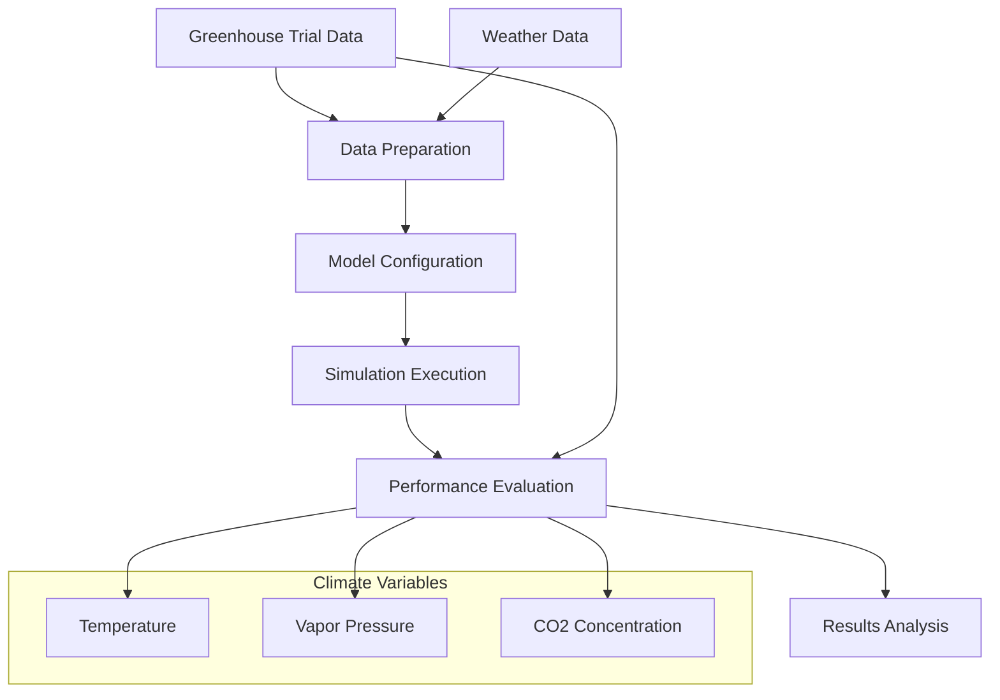
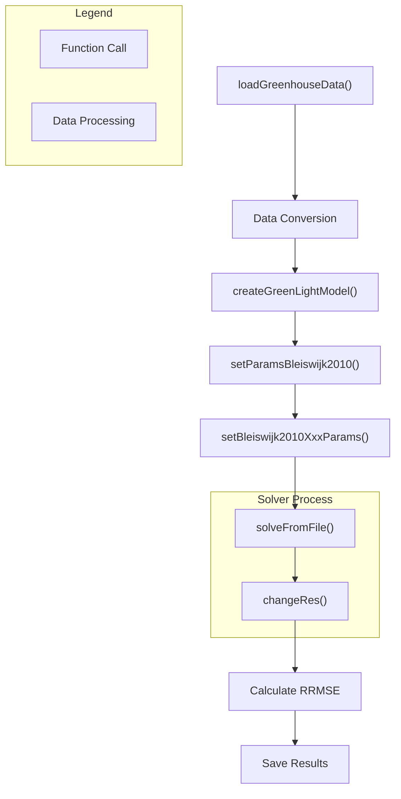
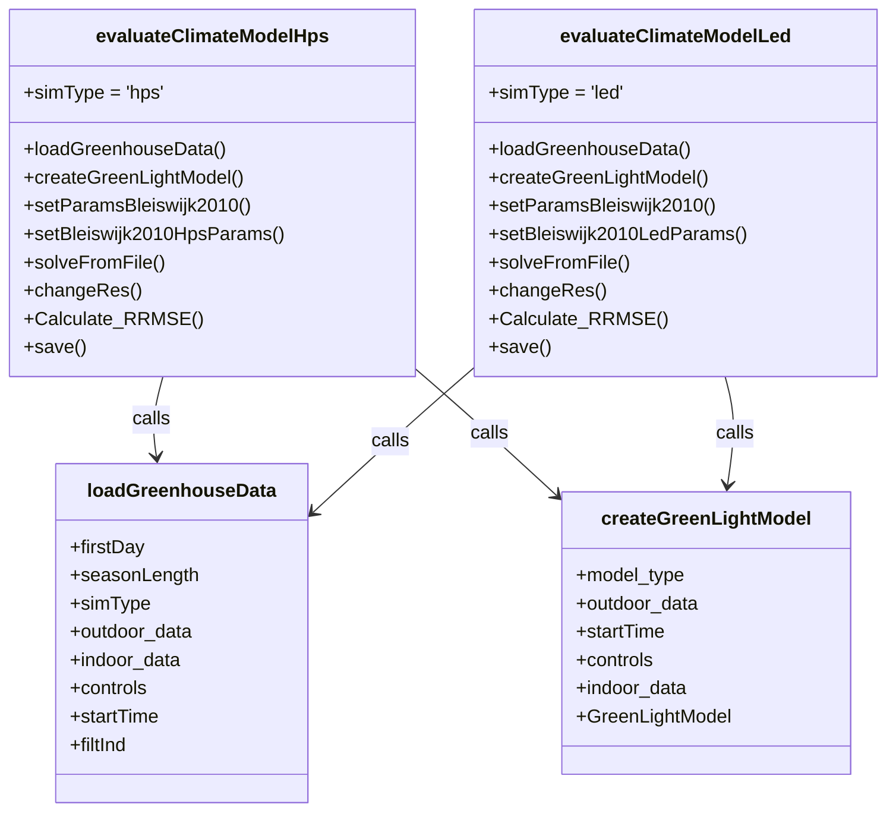
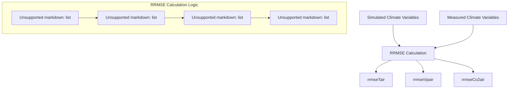

# Climate Model Evaluation

> **Relevant source files**
> * [readme.md](https://github.com/davkat1/GreenLight/blob/089602e3/readme.md)

## Purpose and Scope

This document describes the climate model evaluation framework within the GreenLight model. It explains how to evaluate the model's climate predictions against measured greenhouse data, specifically for High-Pressure Sodium (HPS) and Light-Emitting Diode (LED) lighting systems. The evaluation process helps validate the accuracy of the GreenLight climate model and assess its reliability for greenhouse simulation research.

For information about evaluating energy use in the model, see [Energy Use Evaluation](/davkat1/GreenLight/4.3-examples-and-scripts).

## Overview of Climate Model Evaluation

Climate model evaluation in GreenLight involves comparing simulated greenhouse climate conditions against measured data from real greenhouse trials. The evaluation focuses on three key climate variables:

1. Air temperature (°C)
2. Vapor pressure (Pa)
3. CO₂ concentration (mg/m³)

The process uses data from a 2010 experiment conducted in Bleiswijk, The Netherlands, which featured identical greenhouse compartments with either HPS or LED lighting.



Sources: [Code/runScenarios/evaluateClimateModelHps.m L1-L76](https://github.com/davkat1/GreenLight/blob/089602e3/Code/runScenarios/evaluateClimateModelHps.m#L1-L76)

 [Code/runScenarios/evaluateClimateModelLed.m L1-L76](https://github.com/davkat1/GreenLight/blob/089602e3/Code/runScenarios/evaluateClimateModelLed.m#L1-L76)

## Data Requirements

To evaluate the climate model, you need access to the following data files:

* `inputs\Recorded greenhouse data from 2010 Bleiswijk trial\dataLED.mat`
* `inputs\Recorded greenhouse data from 2010 Bleiswijk trial\dataHPS.mat`

These files contain recorded measurements from the greenhouse trial and can be accessed through the dataset at DOI: 10.4121/78968e1b-eaea-4f37-89f9-2b98ba3ed865.

The data includes:

* Indoor climate measurements (temperature, humidity, CO₂)
* Outdoor climate conditions (temperature, radiation, etc.)
* Control actions (heating, ventilation, lighting, etc.)

| Data Type | Variables | Units | Conversion Required |
| --- | --- | --- | --- |
| Indoor Temperature | tAir | °C | None |
| Indoor Humidity | vpAir | Pa | Convert from vapor density |
| Indoor CO₂ | co2Air | mg/m³ | Convert from ppm |
| Outdoor Weather | Multiple | Various | None |
| Control Actions | Multiple | Various | None |

Sources: [Code/runScenarios/evaluateClimateModelHps.m L11-L17](https://github.com/davkat1/GreenLight/blob/089602e3/Code/runScenarios/evaluateClimateModelHps.m#L11-L17)

 [Code/runScenarios/evaluateClimateModelLed.m L11-L17](https://github.com/davkat1/GreenLight/blob/089602e3/Code/runScenarios/evaluateClimateModelLed.m#L11-L17)

## Evaluation Workflow

The climate model evaluation follows a systematic workflow for both HPS and LED lighting systems:



Sources: [Code/runScenarios/evaluateClimateModelHps.m L24-L76](https://github.com/davkat1/GreenLight/blob/089602e3/Code/runScenarios/evaluateClimateModelHps.m#L24-L76)

 [Code/runScenarios/evaluateClimateModelLed.m L24-L76](https://github.com/davkat1/GreenLight/blob/089602e3/Code/runScenarios/evaluateClimateModelLed.m#L24-L76)

### Key Steps in Evaluation

1. **Data Loading and Preprocessing**: * Load greenhouse data using `loadGreenhouseData()` * Convert vapor density to vapor pressure * Convert CO₂ from ppm to mg/m³ * Create DynamicElements for measured data * Calculate sky and soil temperatures
2. **Model Setup**: * Create GreenLight model instance for specific lighting type * Set parameters for the Bleiswijk 2010 experiment * Set specific lamp parameters (HPS or LED) * Initialize crop state variables
3. **Simulation**: * Solve model equations using the ODE15s solver * Adjust simulation resolution to match measurement intervals
4. **Performance Evaluation**: * Calculate Relative Root Mean Square Error (RRMSE) for each climate variable * Save evaluation results

Sources: [Code/runScenarios/evaluateClimateModelHps.m L30-L76](https://github.com/davkat1/GreenLight/blob/089602e3/Code/runScenarios/evaluateClimateModelHps.m#L30-L76)

 [Code/runScenarios/evaluateClimateModelLed.m L30-L76](https://github.com/davkat1/GreenLight/blob/089602e3/Code/runScenarios/evaluateClimateModelLed.m#L30-L76)

## Code Structure and Implementation

The evaluation process is implemented in two parallel scripts:



Sources: [Code/runScenarios/evaluateClimateModelHps.m L24-L50](https://github.com/davkat1/GreenLight/blob/089602e3/Code/runScenarios/evaluateClimateModelHps.m#L24-L50)

 [Code/runScenarios/evaluateClimateModelLed.m L24-L50](https://github.com/davkat1/GreenLight/blob/089602e3/Code/runScenarios/evaluateClimateModelLed.m#L24-L50)

## Performance Metrics

The climate model is evaluated using Relative Root Mean Square Error (RRMSE), which quantifies the relative difference between simulated and measured values:

$$RRMSE = \frac{\sqrt{\frac{1}{n}\sum_{i=1}^{n}(simulated_i - measured_i)^2}}{\frac{1}{n}\sum_{i=1}^{n}measured_i}$$

This metric is calculated for three key climate variables:

1. Air temperature (`rrmseTair`)
2. Vapor pressure (`rrmseVpair`)
3. CO₂ concentration (`rrmseCo2air`)

Lower RRMSE values indicate better model performance, as they represent smaller deviations between simulated and measured values.



Sources: [Code/runScenarios/evaluateClimateModelHps.m L64-L74](https://github.com/davkat1/GreenLight/blob/089602e3/Code/runScenarios/evaluateClimateModelHps.m#L64-L74)

 [Code/runScenarios/evaluateClimateModelLed.m L64-L74](https://github.com/davkat1/GreenLight/blob/089602e3/Code/runScenarios/evaluateClimateModelLed.m#L64-L74)

## Implementation Details

### Data Preparation

Before running the evaluation, the greenhouse data must be properly formatted:

```python
[outdoor, indoor, controls, startTime, filtInd] = loadGreenhouseData(firstDay, seasonLength, simType);

indoor(:,3) = vaporDens2pres(indoor(:,2), indoor(:,3));  % convert vapor density to vapor pressure
indoor(:,4) = 1e6*co2ppm2dens(indoor(:,2),indoor(:,4));  % convert co2 from ppm to mg m^{-3}
```

The `loadGreenhouseData` function retrieves data for the specified lighting type (`'hps'` or `'led'`), starting day, and season length. Data conversions ensure that units are consistent throughout the evaluation.

Sources: [Code/runScenarios/evaluateClimateModelHps.m L30-L36](https://github.com/davkat1/GreenLight/blob/089602e3/Code/runScenarios/evaluateClimateModelHps.m#L30-L36)

 [Code/runScenarios/evaluateClimateModelLed.m L30-L36](https://github.com/davkat1/GreenLight/blob/089602e3/Code/runScenarios/evaluateClimateModelLed.m#L30-L36)

### Dynamic Elements for Measured Data

Measured climate data is stored in DynamicElement objects for comparison with simulated values:

```
v.tAir = DynamicElement('v.tAir', [floor(indoor(:,1)) indoor(:,2)]);
v.vpAir = DynamicElement('v.vpAir', [floor(indoor(:,1)) indoor(:,3)]);
v.co2Air = DynamicElement('v.co2Air', [floor(indoor(:,1)) indoor(:,4)]);
```

These objects store time-series data with timestamps in the first column and values in the second column.

Sources: [Code/runScenarios/evaluateClimateModelHps.m L38-L41](https://github.com/davkat1/GreenLight/blob/089602e3/Code/runScenarios/evaluateClimateModelHps.m#L38-L41)

 [Code/runScenarios/evaluateClimateModelLed.m L38-L41](https://github.com/davkat1/GreenLight/blob/089602e3/Code/runScenarios/evaluateClimateModelLed.m#L38-L41)

### Model Configuration

The model is configured with parameters specific to the Bleiswijk 2010 experiment and the particular lighting type:

```
hps = createGreenLightModel('none', outdoor, startTime, controls, indoor);
setParamsBleiswijk2010(hps);
setBleiswijk2010HpsParams(hps);  % set lamp params
```

For LED evaluation, the corresponding functions are used:

```
led = createGreenLightModel('none', outdoor, startTime, controls, indoor);
setParamsBleiswijk2010(led);
setBleiswijk2010LedParams(led);  % set lamp params
```

Initial values for crop parameters are also set to represent the starting state of the greenhouse crop.

Sources: [Code/runScenarios/evaluateClimateModelHps.m L49-L56](https://github.com/davkat1/GreenLight/blob/089602e3/Code/runScenarios/evaluateClimateModelHps.m#L49-L56)

 [Code/runScenarios/evaluateClimateModelLed.m L49-L56](https://github.com/davkat1/GreenLight/blob/089602e3/Code/runScenarios/evaluateClimateModelLed.m#L49-L56)

### Simulation and Resolution Matching

The model is solved using ODE15s, and the resolution of simulation results is adjusted to match the measurement intervals:

```
solveFromFile(hps, 'ode15s');

mesInterval = v.tAir.val(2,1) - v.tAir.val(1,1);  % the interval (seconds) of the measurement data
hps = changeRes(hps, mesInterval);  % set resolution of trajectories equal to that of the measurement data
```

This ensures that simulated and measured data points align for proper comparison.

Sources: [Code/runScenarios/evaluateClimateModelHps.m L59-L62](https://github.com/davkat1/GreenLight/blob/089602e3/Code/runScenarios/evaluateClimateModelHps.m#L59-L62)

 [Code/runScenarios/evaluateClimateModelLed.m L59-L62](https://github.com/davkat1/GreenLight/blob/089602e3/Code/runScenarios/evaluateClimateModelLed.m#L59-L62)

### RRMSE Calculation

The code first ensures that measured and simulated datasets have compatible sizes:

```
mesLength = length(v.tAir.val(:,1));  % the length (array size) of the measurement data
simLength = length(hps.x.tAir.val(:,1));  % the length (array size) of the simulated data
compareLength = min(mesLength, simLength);
```

Then, RRMSE values are calculated for each climate variable:

```
rrmseTair = sqrt(mean((hps.x.tAir.val(1:compareLength,2)-v.tAir.val(:,2)).^2))./mean(v.tAir.val(1:compareLength,2));
rrmseVpair = sqrt(mean((hps.x.vpAir.val(1:compareLength,2)-v.vpAir.val(1:compareLength,2)).^2))./mean(v.vpAir.val(1:compareLength,2));
rrmseCo2air = sqrt(mean((hps.x.co2Air.val(1:compareLength,2)-v.co2Air.val(1:compareLength,2)).^2))./mean(v.co2Air.val(:,2));
```

Sources: [Code/runScenarios/evaluateClimateModelHps.m L68-L74](https://github.com/davkat1/GreenLight/blob/089602e3/Code/runScenarios/evaluateClimateModelHps.m#L68-L74)

 [Code/runScenarios/evaluateClimateModelLed.m L68-L74](https://github.com/davkat1/GreenLight/blob/089602e3/Code/runScenarios/evaluateClimateModelLed.m#L68-L74)

## Running the Evaluation

To evaluate the climate model for HPS or LED lighting, run the corresponding script:

1. For HPS lighting: Run `evaluateClimateModelHps.m`
2. For LED lighting: Run `evaluateClimateModelLed.m`

The scripts will save the evaluation results to `hpsClimate.mat` or `ledClimate.mat` respectively. These files contain the simulation objects and RRMSE metrics, which can be further analyzed or visualized.

Sources: [Code/runScenarios/evaluateClimateModelHps.m L76](https://github.com/davkat1/GreenLight/blob/089602e3/Code/runScenarios/evaluateClimateModelHps.m#L76-L76)

 [Code/runScenarios/evaluateClimateModelLed.m L76](https://github.com/davkat1/GreenLight/blob/089602e3/Code/runScenarios/evaluateClimateModelLed.m#L76-L76)

## Interpreting Results

RRMSE values can be interpreted as follows:

* Values closer to 0 indicate better model performance
* Typical values from published studies: * Temperature RRMSE: 0.01-0.05 (1-5%) * Vapor pressure RRMSE: 0.05-0.15 (5-15%) * CO₂ RRMSE: 0.10-0.25 (10-25%)

The evaluation results serve multiple purposes:

1. Validating model accuracy
2. Identifying potential areas for model improvement
3. Comparing model performance across different lighting technologies
4. Supporting research conclusions about greenhouse climate dynamics

## Conclusion

The climate model evaluation framework provides a structured approach to validating the GreenLight model's climate predictions against real greenhouse data. By conducting separate evaluations for HPS and LED lighting, researchers can assess the model's accuracy across different greenhouse lighting technologies and gain confidence in the model's ability to simulate greenhouse climate dynamics.