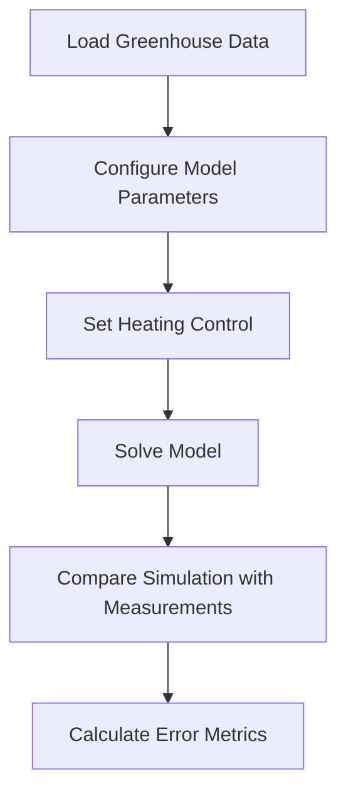
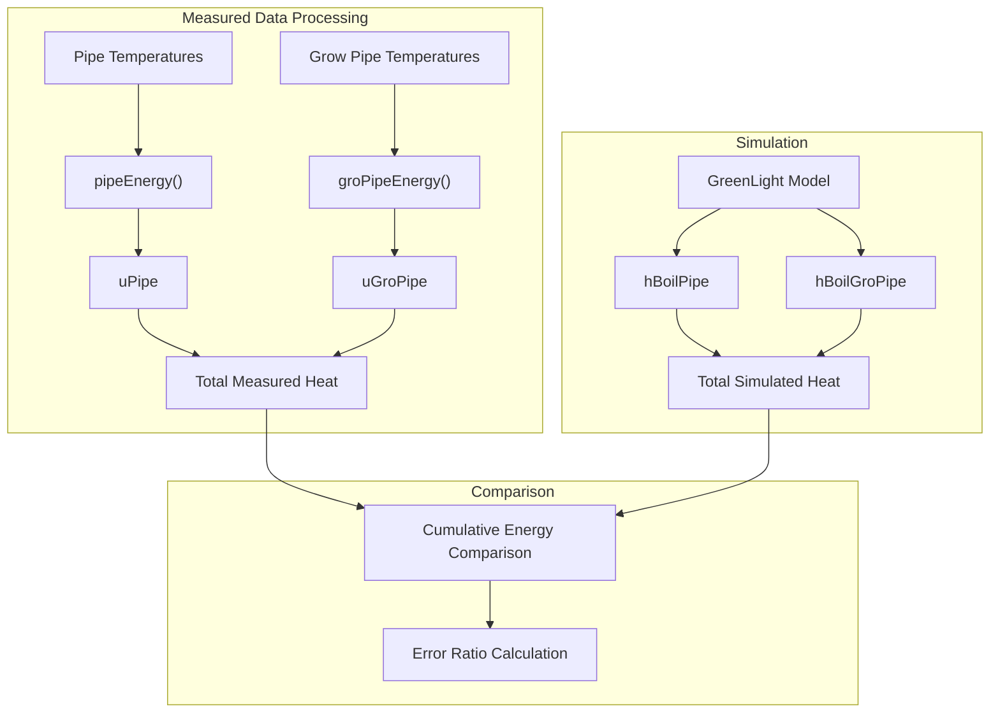

# Energy Use Evaluation

> **Relevant source files**
> * [readme.md](https://github.com/davkat1/GreenLight/blob/089602e3/readme.md)

## Purpose and Scope

The Energy Use Evaluation component of the GreenLight model allows users to assess the accuracy of the model's energy use predictions by comparing simulated heating requirements with measured data from real greenhouse trials. This page explains how to evaluate energy use for both High-Pressure Sodium (HPS) and LED lighting systems using the Bleiswijk 2010 trial data as a reference case.

For information about evaluating the climate model (temperature, humidity, and CO2), see [Climate Model Evaluation](/davkat1/GreenLight/4.2-configuration-and-options). For post-simulation energy analysis, see [Energy Analysis](/davkat1/GreenLight/5.1-development-setup).

## Evaluation Process Overview

The energy use evaluation verifies that the GreenLight model accurately predicts heating requirements by comparing simulated heating energy with calculated heating energy from measured greenhouse data. The evaluation follows these steps:



Sources: [Code/runScenarios/evaluateEnergyUseHps.m L27-L82](https://github.com/davkat1/GreenLight/blob/089602e3/Code/runScenarios/evaluateEnergyUseHps.m#L27-L82)

 [Code/runScenarios/evaluateEnergyUseLed.m L27-L84](https://github.com/davkat1/GreenLight/blob/089602e3/Code/runScenarios/evaluateEnergyUseLed.m#L27-L84)

## Data Requirements

To run the energy use evaluation, you'll need data from the 2010 Bleiswijk greenhouse trial, which includes:

* Indoor climate measurements (temperature, humidity, CO2)
* Outdoor weather conditions
* Heating pipe temperatures
* Lighting control data

These data files must be accessible in the specified path:

* 'inputs\Recorded greenhouse data from 2010 Bleiswijk trial\dataLED.mat'
* 'inputs\Recorded greenhouse data from 2010 Bleiswijk trial\dataHPS.mat'

The data can be accessed through [https://doi.org/10.4121/78968e1b-eaea-4f37-89f9-2b98ba3ed865](https://doi.org/10.4121/78968e1b-eaea-4f37-89f9-2b98ba3ed865)

Sources: [Code/runScenarios/evaluateEnergyUseHps.m L14-L19](https://github.com/davkat1/GreenLight/blob/089602e3/Code/runScenarios/evaluateEnergyUseHps.m#L14-L19)

 [Code/runScenarios/evaluateEnergyUseLed.m L14-L19](https://github.com/davkat1/GreenLight/blob/089602e3/Code/runScenarios/evaluateEnergyUseLed.m#L14-L19)

## Model Configuration for Energy Evaluation

The evaluation scripts configure the GreenLight model with parameters that represent the specific characteristics of either HPS or LED lighting systems from the Bleiswijk trial:

```

```

Sources: [Code/runScenarios/evaluateEnergyUseHps.m L48-L77](https://github.com/davkat1/GreenLight/blob/089602e3/Code/runScenarios/evaluateEnergyUseHps.m#L48-L77)

 [Code/runScenarios/evaluateEnergyUseLed.m L48-L77](https://github.com/davkat1/GreenLight/blob/089602e3/Code/runScenarios/evaluateEnergyUseLed.m#L48-L77)

### Key Configuration Steps

1. **Model Creation**: Create a GreenLight model using `createGreenLightModel()` with outdoor and indoor climate data
2. **Parameter Setting**: Apply appropriate greenhouse parameters using `setParamsBleiswijk2010()` and lamp-specific parameters
3. **Temperature Control**: Set up proportional heating control using the measured temperature as setpoint
4. **Heating Capacity**: Configure the heating capacity of pipe rail and grow pipes
5. **Initial Crop State**: Set initial values for crop biomass components (leaf, stem, fruit)

Sources: [Code/runScenarios/evaluateEnergyUseHps.m L48-L77](https://github.com/davkat1/GreenLight/blob/089602e3/Code/runScenarios/evaluateEnergyUseHps.m#L48-L77)

 [Code/runScenarios/evaluateEnergyUseLed.m L48-L82](https://github.com/davkat1/GreenLight/blob/089602e3/Code/runScenarios/evaluateEnergyUseLed.m#L48-L82)

## Evaluation Workflow

The evaluation workflow consists of these major steps:

```

```

Sources: [Code/runScenarios/evaluateEnergyUseHps.m L27-L106](https://github.com/davkat1/GreenLight/blob/089602e3/Code/runScenarios/evaluateEnergyUseHps.m#L27-L106)

 [Code/runScenarios/evaluateEnergyUseLed.m L27-L110](https://github.com/davkat1/GreenLight/blob/089602e3/Code/runScenarios/evaluateEnergyUseLed.m#L27-L110)

## HPS Lighting Evaluation

To evaluate energy use with HPS lighting:

1. Use `evaluateEnergyUseHps.m` which loads data from an HPS compartment
2. The script configures the model with HPS-specific parameters using `setBleiswijk2010HpsParams()`
3. The heating pipes energy is simulated and compared to measured data

Sources: [Code/runScenarios/evaluateEnergyUseHps.m](https://github.com/davkat1/GreenLight/blob/089602e3/Code/runScenarios/evaluateEnergyUseHps.m)

## LED Lighting Evaluation

To evaluate energy use with LED lighting:

1. Use `evaluateEnergyUseLed.m` which loads data from an LED compartment
2. The script configures the model with LED-specific parameters using `setBleiswijk2010LedParams()`
3. The heating pipes energy is simulated and compared to measured data

Sources: [Code/runScenarios/evaluateEnergyUseLed.m](https://github.com/davkat1/GreenLight/blob/089602e3/Code/runScenarios/evaluateEnergyUseLed.m)

## Comparing Simulation to Measured Data

The evaluation compares two key energy metrics:

1. **Simulated heating input**: The heating energy predicted by the model (`hBoilPipe + hBoilGroPipe`)
2. **Measured heating input**: The heating energy calculated from measured pipe temperatures (`uPipe + uGroPipe`)

The comparison is typically visualized as cumulative energy use over time, allowing for assessment of both short-term dynamics and long-term energy consumption.



Sources: [Code/runScenarios/evaluateEnergyUseHps.m L86-L105](https://github.com/davkat1/GreenLight/blob/089602e3/Code/runScenarios/evaluateEnergyUseHps.m#L86-L105)

 [Code/runScenarios/evaluateEnergyUseLed.m L86-L110](https://github.com/davkat1/GreenLight/blob/089602e3/Code/runScenarios/evaluateEnergyUseLed.m#L86-L110)

## Error Calculation

The error ratio is calculated as the ratio of total simulated energy to total measured energy:

```
eMeas = 1e-6*trapz(model.d.uPipe + model.d.uGroPipe);
eSim = 1e-6*trapz(model.a.hBoilPipe + model.a.hBoilGroPipe);
errorRatio = eSim./eMeas;
```

An error ratio close to 1.0 indicates good agreement between the model and measurements.

Sources: [Code/runScenarios/evaluateEnergyUseHps.m L104-L106](https://github.com/davkat1/GreenLight/blob/089602e3/Code/runScenarios/evaluateEnergyUseHps.m#L104-L106)

 [Code/runScenarios/evaluateEnergyUseLed.m L107-L110](https://github.com/davkat1/GreenLight/blob/089602e3/Code/runScenarios/evaluateEnergyUseLed.m#L107-L110)

## Usage Example

To evaluate energy use for HPS or LED lighting systems:

1. Ensure you have the required Bleiswijk trial data files
2. Run the appropriate evaluation script: * For HPS: `evaluateEnergyUseHps.m` * For LED: `evaluateEnergyUseLed.m`
3. The script will display a plot comparing simulated and measured cumulative energy use
4. The error ratio will be calculated and stored in the `errorRatio` variable
5. Results are saved to either `hpsEnergy.mat` or `ledEnergy.mat` for further analysis

Sources: [Code/runScenarios/evaluateEnergyUseHps.m L111](https://github.com/davkat1/GreenLight/blob/089602e3/Code/runScenarios/evaluateEnergyUseHps.m#L111-L111)

 [Code/runScenarios/evaluateEnergyUseLed.m L116](https://github.com/davkat1/GreenLight/blob/089602e3/Code/runScenarios/evaluateEnergyUseLed.m#L116-L116)

## Implementation Details

### Data Preparation

The evaluation scripts convert units of input data to ensure consistency:

* Vapor density to vapor pressure
* CO2 from ppm to mg m^-3
* Adding sky temperature using `skyTempRdam` function
* Adding soil temperature using `soilTempNl` function

Sources: [Code/runScenarios/evaluateEnergyUseHps.m L36-L46](https://github.com/davkat1/GreenLight/blob/089602e3/Code/runScenarios/evaluateEnergyUseHps.m#L36-L46)

 [Code/runScenarios/evaluateEnergyUseLed.m L36-L46](https://github.com/davkat1/GreenLight/blob/089602e3/Code/runScenarios/evaluateEnergyUseLed.m#L36-L46)

### Heating Control

Both evaluations use proportional control for heating:

```
addControl(model, 'boil', proportionalControl(x.tAir, model.d.heatSetPoint+setPointAdd, model.p.tHeatBand, 0, 1));
addControl(model, 'boilGro', proportionalControl(x.tAir, model.d.heatSetPoint+setPointAdd, model.p.tHeatBand, 0, 1));
```

The setpoint is derived from the measured temperature with a small addition (`setPointAdd = 0.5`) to ensure the controller reaches the desired temperature.

Sources: [Code/runScenarios/evaluateEnergyUseHps.m L63-L69](https://github.com/davkat1/GreenLight/blob/089602e3/Code/runScenarios/evaluateEnergyUseHps.m#L63-L69)

 [Code/runScenarios/evaluateEnergyUseLed.m L64-L69](https://github.com/davkat1/GreenLight/blob/089602e3/Code/runScenarios/evaluateEnergyUseLed.m#L64-L69)

## Integration with Research

The energy use evaluation is primarily used to validate the GreenLight model for research applications, such as comparing energy requirements between HPS and LED lighting systems in greenhouses.

The evaluation scripts were used in the research published in:

* Katzin, D., van Mourik, S., Kempkes, F., & van Henten, E. J. (2020). GreenLight – An open source model for greenhouses with supplemental lighting: Evaluation of heat requirements under LED and HPS lamps. Biosystems Engineering, 194, 61–81.

Sources: [Code/runScenarios/evaluateEnergyUseHps.m L7-L12](https://github.com/davkat1/GreenLight/blob/089602e3/Code/runScenarios/evaluateEnergyUseHps.m#L7-L12)

 [Code/runScenarios/evaluateEnergyUseLed.m L7-L12](https://github.com/davkat1/GreenLight/blob/089602e3/Code/runScenarios/evaluateEnergyUseLed.m#L7-L12)