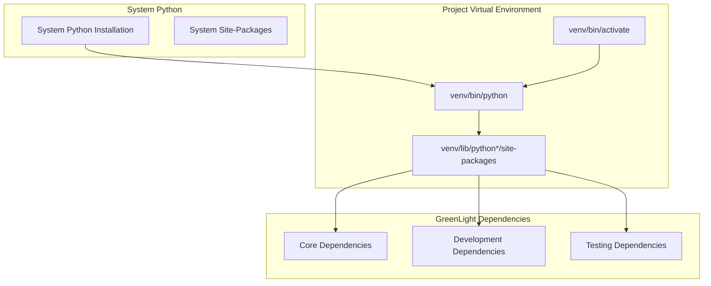
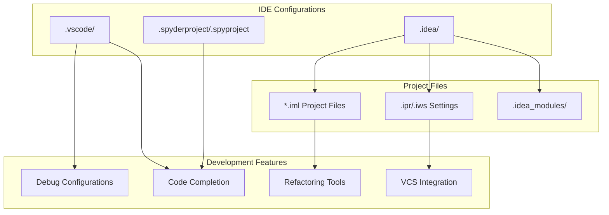
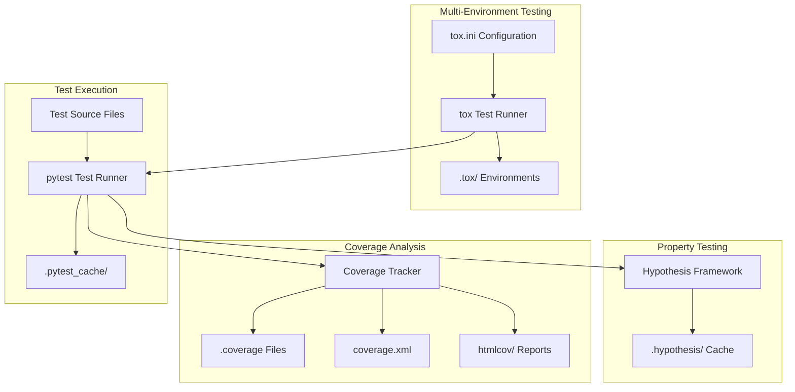
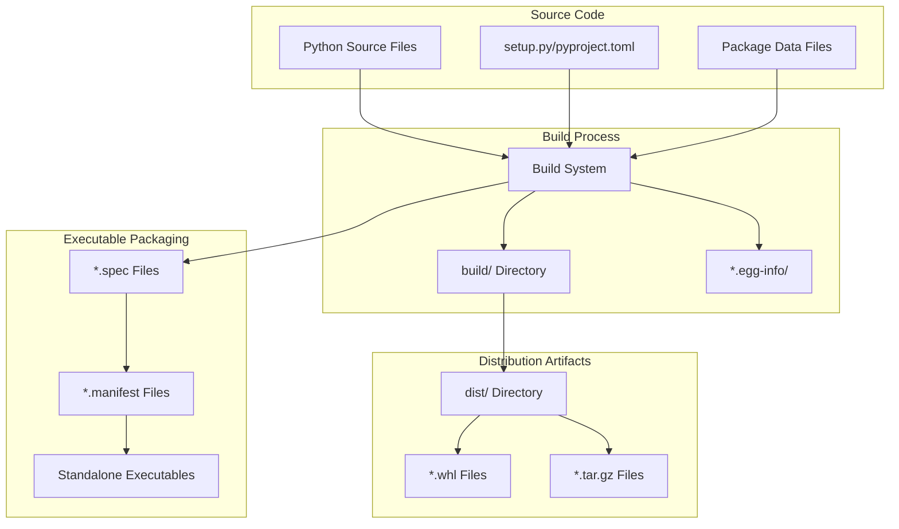
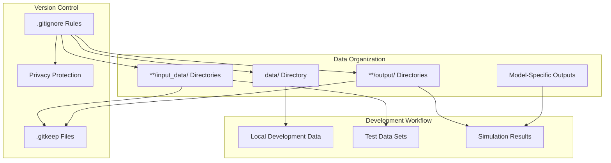

# Development Environment

> **Relevant source files**
> * [.gitignore](https://github.com/davkat1/GreenLight/blob/089602e3/.gitignore)
> * [readme.md](https://github.com/davkat1/GreenLight/blob/089602e3/readme.md)

This document provides a technical overview of the development environment, build processes, and testing infrastructure used in the GreenLight platform. It covers the tooling, configuration, and processes that support development of the core simulation engine and model definitions.

For detailed setup instructions, see [Development Setup](/davkat1/GreenLight/5.1-development-setup). For information about testing frameworks and build tools, see [Testing and Build Processes](/davkat1/GreenLight/5.2-testing-and-build-processes).

## Development Environment Architecture

The GreenLight development environment is structured to support both local development and distribution packaging, with clear separation between development artifacts and production code.

```mermaid
flowchart TD

SourceCode["Source Code"]
DevEnv["Development Environment"]
LocalConfig["Local Configuration"]
VenvDir["venv/ Directory"]
EnvDir["env/ Directory"]
SitePackages["Site Packages"]
PipInstall["pip Installation"]
VSCode[".vscode/ Settings"]
IntelliJ[".idea/ Configuration"]
Spyder[".spyderproject Files"]
PytestCache[".pytest_cache/"]
CoverageFiles[".coverage Files"]
HtmlCov["htmlcov/ Reports"]
ToxEnv[".tox/ Environments"]
BuildDir["build/ Directory"]
DistDir["dist/ Directory"]
EggInfo["*.egg-info/"]
PyInstaller["PyInstaller Artifacts"]
DataDir["data/ Directory"]
InputData["input_data/ Directories"]
OutputDir["output/ Directory"]
ModelOutput["Model Outputs"]

DevEnv --> VenvDir
DevEnv --> EnvDir
DevEnv --> VSCode
DevEnv --> IntelliJ
DevEnv --> Spyder
DevEnv --> PytestCache
DevEnv --> CoverageFiles
DevEnv --> HtmlCov
SourceCode --> BuildDir
DevEnv --> DataDir

subgraph subGraph5 ["Data Management"]
    DataDir
    InputData
    OutputDir
    ModelOutput
    DataDir --> InputData
    DataDir --> OutputDir
end

subgraph subGraph4 ["Build and Distribution"]
    BuildDir
    DistDir
    EggInfo
    PyInstaller
    BuildDir --> DistDir
    BuildDir --> EggInfo
end

subgraph subGraph3 ["Testing Infrastructure"]
    PytestCache
    CoverageFiles
    HtmlCov
    ToxEnv
end

subgraph subGraph2 ["IDE and Editor Support"]
    VSCode
    IntelliJ
    Spyder
end

subgraph subGraph1 ["Python Environment Management"]
    VenvDir
    EnvDir
    SitePackages
    PipInstall
end

subgraph subGraph0 ["Development Workspace"]
    SourceCode
    DevEnv
    LocalConfig
    SourceCode --> DevEnv
end
```

Sources: [.gitignore L37-L53](https://github.com/davkat1/GreenLight/blob/089602e3/.gitignore#L37-L53)

 [.gitignore L84-L99](https://github.com/davkat1/GreenLight/blob/089602e3/.gitignore#L84-L99)

 [.gitignore L64-L75](https://github.com/davkat1/GreenLight/blob/089602e3/.gitignore#L64-L75)

 [.gitignore L35-L58](https://github.com/davkat1/GreenLight/blob/089602e3/.gitignore#L35-L58)

 [.gitignore L100-L114](https://github.com/davkat1/GreenLight/blob/089602e3/.gitignore#L100-L114)

## Python Environment Isolation

The development environment uses virtual environments to isolate dependencies and ensure reproducible builds. The project supports multiple virtual environment directory conventions.

| Environment Type | Directory | Purpose |
| --- | --- | --- |
| Standard venv | `venv/` | Primary virtual environment location |
| Alternative env | `env/` | Alternative virtual environment directory |
| Site packages | `lib/`, `lib64/` | Python package installation directories |

The virtual environment structure ensures that development dependencies are isolated from system Python installations and other projects.

Sources: [.gitignore L37-L38](https://github.com/davkat1/GreenLight/blob/089602e3/.gitignore#L37-L38)

 [.gitignore L45-L47](https://github.com/davkat1/GreenLight/blob/089602e3/.gitignore#L45-L47)

## IDE and Editor Configuration

The development environment supports multiple IDEs and editors with appropriate configuration exclusions to prevent development-specific settings from being committed to version control.

### Supported Development Environments

* **Visual Studio Code**: Configuration stored in `.vscode/` directory
* **IntelliJ IDEA Family**: Project files in `.idea/` directory, with support for `.iml`, `.ipr`, and `.iws` files
* **Spyder**: Project configuration in `.spyderproject` and `.spyproject` files

Sources: [.gitignore L84-L99](https://github.com/davkat1/GreenLight/blob/089602e3/.gitignore#L84-L99)

## Testing Framework Integration

The development environment includes comprehensive testing infrastructure with support for multiple testing frameworks and coverage analysis.

### Testing Components

| Component | Files/Directories | Purpose |
| --- | --- | --- |
| pytest | `.pytest_cache/` | Test execution cache and temporary files |
| Coverage | `.coverage`, `.coverage.*`, `coverage.xml` | Code coverage tracking and reports |
| HTML Reports | `htmlcov/` | Human-readable coverage reports |
| Tox | `.tox/` | Multi-environment testing |
| Hypothesis | `.hypothesis/` | Property-based testing artifacts |

Sources: [.gitignore L64-L75](https://github.com/davkat1/GreenLight/blob/089602e3/.gitignore#L64-L75)

## Build and Distribution Infrastructure

The development environment includes tools for building and distributing the GreenLight package, with proper separation of build artifacts from source code.

### Build System Components

* **Build Directory**: `build/` contains intermediate build files
* **Distribution Directory**: `dist/` contains final distribution packages
* **Egg Info**: `*.egg-info/` directories contain package metadata
* **PyInstaller**: Support for creating standalone executables with `*.manifest` and `*.spec` files

Sources: [.gitignore L35-L58](https://github.com/davkat1/GreenLight/blob/089602e3/.gitignore#L35-L58)

## Data Management in Development

The development environment carefully manages data files to ensure privacy and performance while supporting development workflows.

### Data Directory Structure

The project uses a structured approach to data management with explicit exclusions for sensitive and large files:

* **Primary Data Directory**: `data/` - excluded from version control
* **Input Data Directories**: `**/input_data/` - location-specific with `.gitkeep` files
* **Output Directories**: `output/`, `**/output/` - simulation results with `.gitkeep` files
* **Model Outputs**: Organized by model name in `<model_name>/output/` structure

Sources: [.gitignore L100-L114](https://github.com/davkat1/GreenLight/blob/089602e3/.gitignore#L100-L114)

## Notebook Development Support

The development environment includes specific support for Jupyter notebook development with checkpoint management.

Jupyter notebook checkpoints (`.ipynb_checkpoints`) are excluded from version control to prevent unnecessary commits of temporary notebook state. This allows developers to use notebooks for exploration and analysis while maintaining clean version control.

Sources: [.gitignore L115-L116](https://github.com/davkat1/GreenLight/blob/089602e3/.gitignore#L115-L116)

 [readme.md L80](https://github.com/davkat1/GreenLight/blob/089602e3/readme.md#L80-L80)