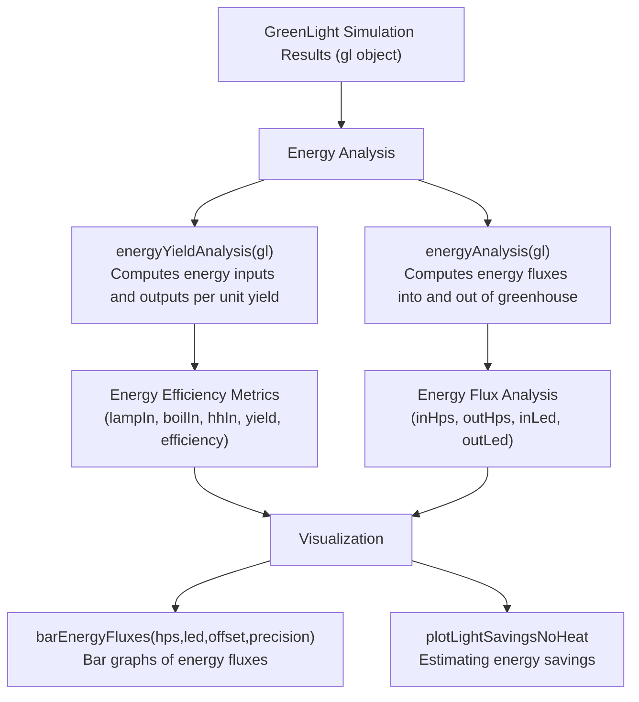
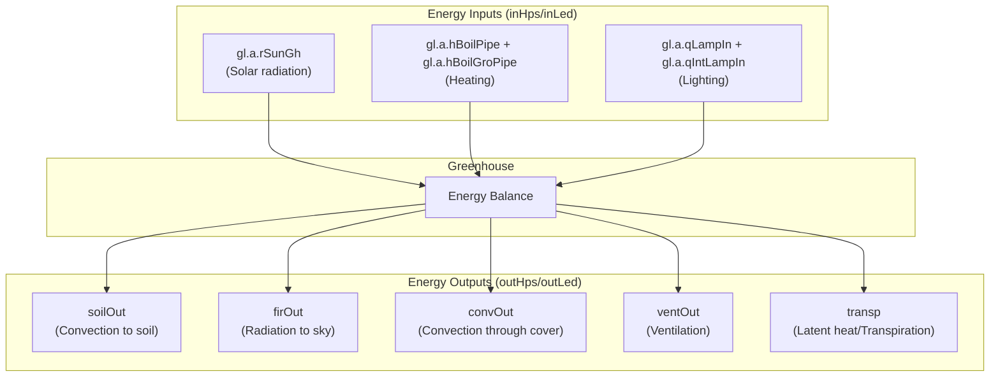
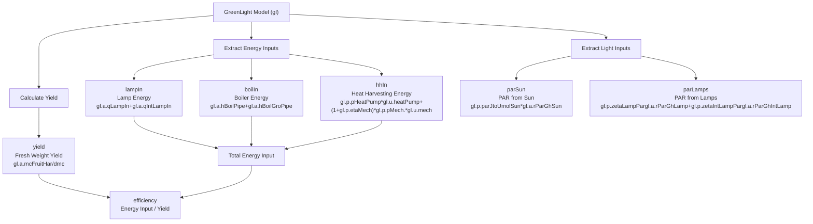
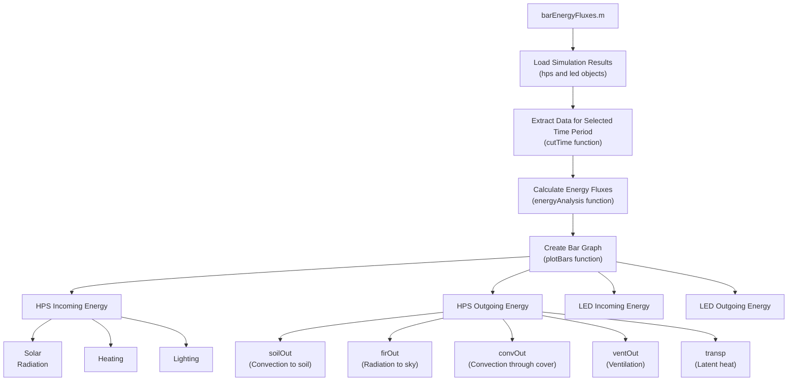

# Energy Analysis

> **Relevant source files**
> * [.gitignore](https://github.com/davkat1/GreenLight/blob/089602e3/.gitignore)

This document details the methods, functions, and tools provided by the GreenLight model for analyzing energy use and efficiency from simulation results. The energy analysis tools allow researchers to evaluate the energy performance of different greenhouse configurations, particularly when comparing different lighting technologies (HPS vs. LED).

For information on analyzing energy savings from transitioning between lighting technologies, see [Energy Savings Analysis](/davkat1/GreenLight/5.2-testing-and-build-processes). For additional visualization tools that can be used with energy data, see [Visualization Tools](#5.3).

## Energy Analysis Workflow

The GreenLight model provides several functions for analyzing energy use and efficiency in simulated greenhouses. The general workflow for energy analysis follows these steps:

1. Run a greenhouse simulation using the GreenLight model
2. Extract energy input and output values using analysis functions
3. Calculate energy efficiency metrics, such as energy use per unit of yield
4. Visualize results using specialized plotting functions

### Energy Analysis Workflow Diagram



Sources: [Code/postSimAnalysis/energyYieldAnalysis.m](https://github.com/davkat1/GreenLight/blob/089602e3/Code/postSimAnalysis/energyYieldAnalysis.m)

 [Code/postSimAnalysis/barEnergyFluxes.m](https://github.com/davkat1/GreenLight/blob/089602e3/Code/postSimAnalysis/barEnergyFluxes.m)

 [Code/serviceFunctions/plotLightSavingsNoHeat.m](https://github.com/davkat1/GreenLight/blob/089602e3/Code/serviceFunctions/plotLightSavingsNoHeat.m)

## Energy Flux Analysis

The energy flux analysis examines the flow of energy into and out of the greenhouse system. This analysis quantifies the energy balance and identifies where energy is being used or lost.

### Greenhouse Energy Balance Components



Sources: [Code/postSimAnalysis/barEnergyFluxes.m L73-L88](https://github.com/davkat1/GreenLight/blob/089602e3/Code/postSimAnalysis/barEnergyFluxes.m#L73-L88)

### Energy Flux Calculation

The `energyAnalysis` function (called from within `barEnergyFluxes.m`) calculates the energy inputs and outputs from a simulated greenhouse. The function returns two arrays:

* Energy inputs (`inHps`/`inLed`): solar radiation, heating, and lighting
* Energy outputs (`outHps`/`outLed`): transpiration, soil conduction, ventilation, convection through cover, and radiation to the sky

These values can be analyzed for the entire simulation period or for specific time periods (e.g., winter day vs. summer day) to understand seasonal variations in energy use.

Sources: [Code/postSimAnalysis/barEnergyFluxes.m L75-L88](https://github.com/davkat1/GreenLight/blob/089602e3/Code/postSimAnalysis/barEnergyFluxes.m#L75-L88)

## Energy-Yield Analysis

The `energyYieldAnalysis` function computes the relationship between energy inputs and crop yield, providing insights into the energy efficiency of the greenhouse system.

### Calculated Metrics

The function calculates the following key metrics:

| Metric | Description | Unit | Code Implementation |
| --- | --- | --- | --- |
| lampIn | Energy consumption of the lamps | MJ m^-2 | `1e-6*trapz(gl.a.qLampIn+gl.a.qIntLampIn)` |
| boilIn | Energy consumption of the boiler | MJ m^-2 | `1e-6*trapz(gl.a.hBoilPipe+gl.a.hBoilGroPipe)` |
| hhIn | Energy consumption of the heat harvesting system | MJ m^-2 | `1e-6*trapz(gl.p.pHeatPump*gl.u.heatPump+(1+gl.p.etaMech)*gl.p.pMech.*gl.u.mech)` |
| parSun | PAR light from the sun reaching above the canopy | mol m^-2 | `1e-6*trapz(gl.p.parJtoUmolSun*gl.a.rParGhSun)` |
| parLamps | PAR light from the lamps reaching above the canopy | mol m^-2 | `1e-6*trapz(gl.p.zetaLampPar*gl.a.rParGhLamp+gl.p.zetaIntLampPar*gl.a.rParGhIntLamp)` |
| yield | Fresh weight tomato yield | kg m^-2 | `1e-6*trapz(gl.a.mcFruitHar)/dmc` |
| efficiency | Energy input needed per tomato yield | MJ kg^-1 | `(lampIn+boilIn+hhIn)/yield` |

Sources: [Code/postSimAnalysis/energyYieldAnalysis.m L1-L70](https://github.com/davkat1/GreenLight/blob/089602e3/Code/postSimAnalysis/energyYieldAnalysis.m#L1-L70)

### Energy-Yield Calculation Method



Sources: [Code/postSimAnalysis/energyYieldAnalysis.m L29-L69](https://github.com/davkat1/GreenLight/blob/089602e3/Code/postSimAnalysis/energyYieldAnalysis.m#L29-L69)

## Visualizing Energy Analysis Results

The GreenLight model provides specialized functions for visualizing energy analysis results.

### Energy Flux Bar Graphs

The `barEnergyFluxes.m` function creates bar graphs that visualize the energy fluxes in a simulated greenhouse. This function can produce:

* A bar graph for the full year
* Bar graphs for specific days (e.g., a winter day and a summer day)

The function was used to create Figure 10 in the paper by Katzin et al. (2021), showing energy fluxes in winter and summer.

### barEnergyFluxes Function Workflow



Sources: [Code/postSimAnalysis/barEnergyFluxes.m L1-L126](https://github.com/davkat1/GreenLight/blob/089602e3/Code/postSimAnalysis/barEnergyFluxes.m#L1-L126)

### Time-Specific Energy Analysis

The `barEnergyFluxes.m` function can analyze energy fluxes for specific days:

```
% Choose dates for the winter and summer days. Dates are represented by
% "days since Sept 27 (the beginning of the growing season)". 
% 116 - January 21; 292 - July 15 (used in Paper).
winterDay = 116;
summerDay = 292;

hpsWin = cutTime(hps, datenum(hps.t.label)+winterDay-1/24,86400);
ledWin = cutTime(led, datenum(led.t.label)+winterDay-1/24,86400);

hpsSum = cutTime(hps, datenum(hps.t.label)+summerDay-1/24,86400);
ledSum = cutTime(led, datenum(led.t.label)+summerDay-1/24,86400);
```

Sources: [Code/postSimAnalysis/barEnergyFluxes.m L40-L54](https://github.com/davkat1/GreenLight/blob/089602e3/Code/postSimAnalysis/barEnergyFluxes.m#L40-L54)

### Light Savings Analysis

The `plotLightSavingsNoHeat.m` function visualizes potential energy savings from transitioning from HPS to LED lighting. This function:

* Estimates energy savings based on the efficacy of HPS (1.8 μmol PAR J^-1) and different LED lamps (3.0, 4.1, and infinite μmol PAR J^-1)
* Shows savings as a function of the fraction of energy used for lighting in the current system
* Assumes no change in heating demand when transitioning from HPS to LED

The function was used to create Figure 5 in the paper by Katzin et al. (2021).

Sources: [Code/serviceFunctions/plotLightSavingsNoHeat.m L1-L31](https://github.com/davkat1/GreenLight/blob/089602e3/Code/serviceFunctions/plotLightSavingsNoHeat.m#L1-L31)

## Applications in Research

The energy analysis tools in the GreenLight model have been used in several research papers, including:

1. Katzin, D., Marcelis, L. F. M., & van Mourik, S. (2021). Energy savings in greenhouses by transition from high-pressure sodium to LED lighting. Applied Energy, 281, 116019.
2. Katzin, D. (2021). Energy saving by LED lighting in greenhouses: a process-based modelling approach (PhD Thesis, Wageningen University).
3. Katzin, Marcelis, Van Henten, Van Mourik (2023). Heating greenhouses by light: A novel concept for intensive greenhouse production (Biosystems Engineering).

These studies used the GreenLight model's energy analysis capabilities to evaluate energy efficiency in greenhouses and quantify potential energy savings from transitioning to LED lighting.

Sources: [Code/postSimAnalysis/energyYieldAnalysis.m L17-L23](https://github.com/davkat1/GreenLight/blob/089602e3/Code/postSimAnalysis/energyYieldAnalysis.m#L17-L23)

 [Code/postSimAnalysis/barEnergyFluxes.m L2-L7](https://github.com/davkat1/GreenLight/blob/089602e3/Code/postSimAnalysis/barEnergyFluxes.m#L2-L7)

 [Code/serviceFunctions/plotLightSavingsNoHeat.m L2-L6](https://github.com/davkat1/GreenLight/blob/089602e3/Code/serviceFunctions/plotLightSavingsNoHeat.m#L2-L6)