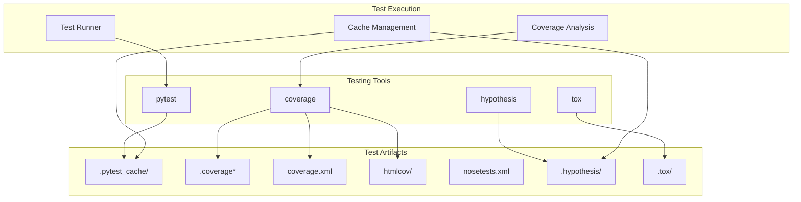
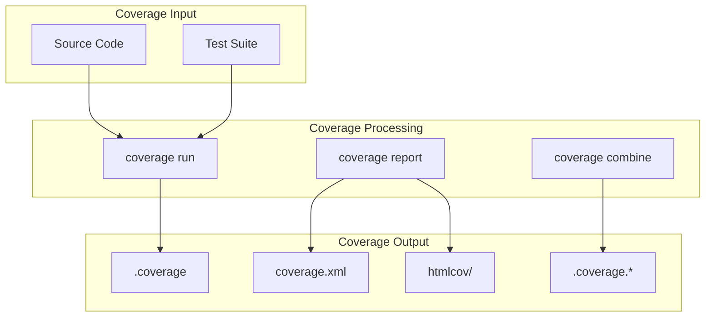
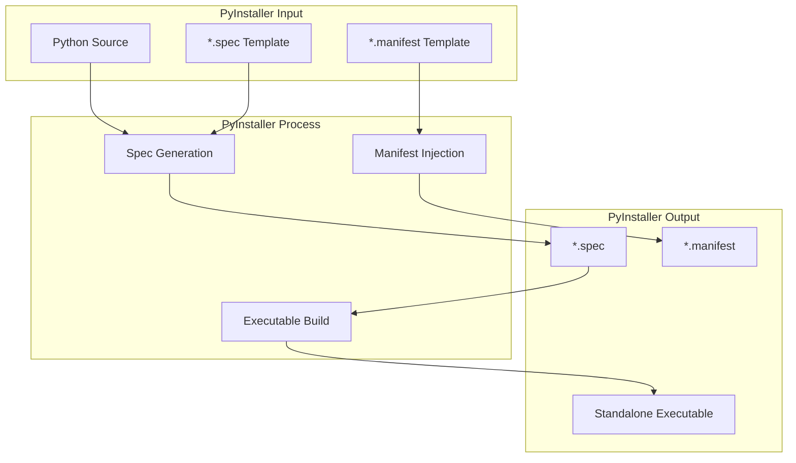
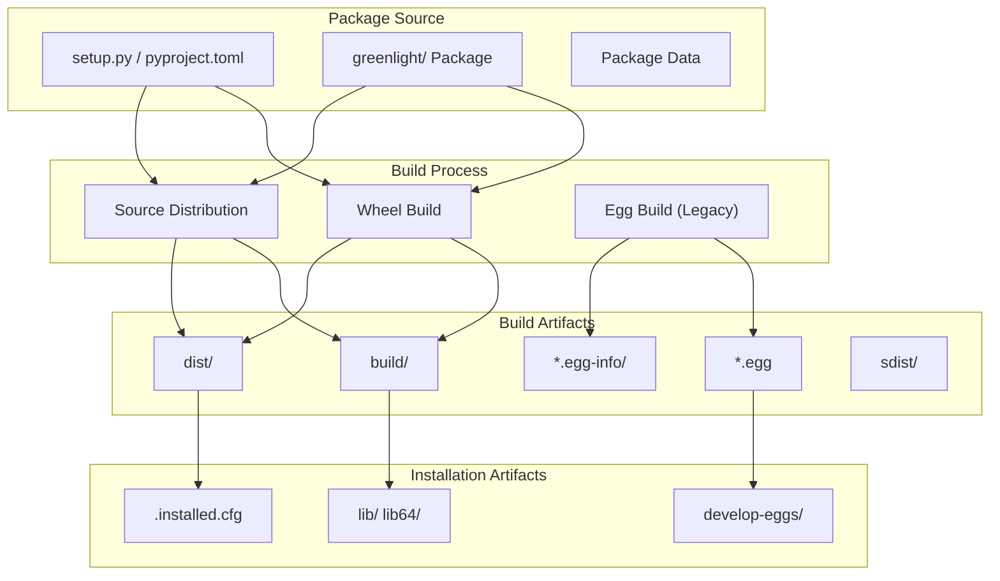
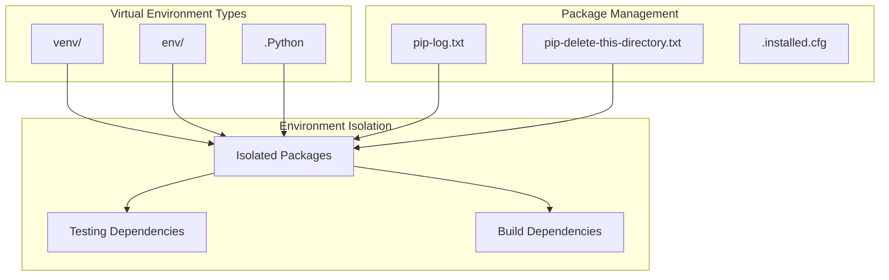
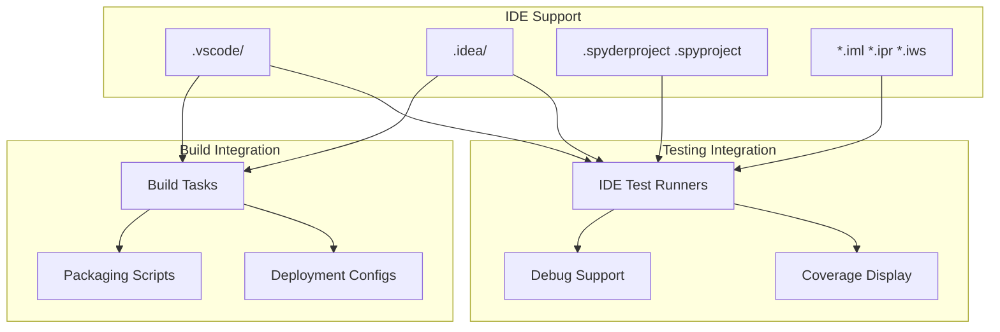
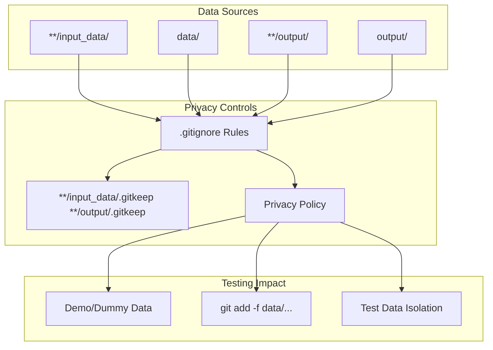
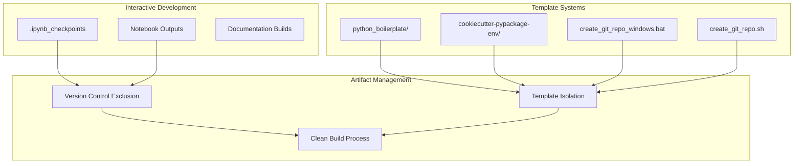

# Testing and Build Processes

> **Relevant source files**
> * [.gitignore](https://github.com/davkat1/GreenLight/blob/089602e3/.gitignore)

This document covers the testing infrastructure, build tools, and distribution processes used in the GreenLight project. It details the testing frameworks, coverage analysis setup, build automation, and packaging mechanisms that support development and deployment workflows.

For information about development environment setup and project dependencies, see [Development Setup](/davkat1/GreenLight/5.1-development-setup). For general project structure and organization, see [Repository Structure](/davkat1/GreenLight/1.2-repository-structure).

## Testing Infrastructure

The GreenLight project implements a comprehensive testing infrastructure using industry-standard Python testing tools and practices.

### Testing Framework Configuration

The project uses `pytest` as the primary testing framework, with coverage analysis and caching mechanisms configured to support efficient test execution.

**Testing Framework Components**

| Component | Purpose | Artifacts |
| --- | --- | --- |
| `pytest` | Primary test framework | `.pytest_cache/` directory |
| `coverage` | Code coverage analysis | `.coverage`, `coverage.xml`, `htmlcov/` |
| `hypothesis` | Property-based testing | `.hypothesis/` cache directory |
| `tox` | Multi-environment testing | `.tox/` directory |

Sources: [.gitignore L64-L74](https://github.com/davkat1/GreenLight/blob/089602e3/.gitignore#L64-L74)

### Coverage Analysis Setup

The project implements comprehensive coverage analysis to track test effectiveness and identify untested code paths.

**Coverage Artifacts**

* `.coverage` - Primary coverage data file
* `coverage.xml` - XML format coverage report for CI/CD integration
* `htmlcov/` - HTML coverage reports for browser viewing
* `.coverage.*` - Distributed coverage data files
* `*,cover` - Legacy coverage format files

Sources: [.gitignore L67-L72](https://github.com/davkat1/GreenLight/blob/089602e3/.gitignore#L67-L72)

## Build and Distribution Processes

The GreenLight project uses multiple build tools and distribution mechanisms to support various deployment scenarios.

### PyInstaller Build Process

PyInstaller is configured for creating standalone executable distributions of the GreenLight application.

**PyInstaller Configuration**

* `*.spec` files contain build specifications and entry point definitions
* `*.manifest` files are generated with build metadata and version information
* Build process supports injection of dynamic information like build dates

Sources: [.gitignore L54-L58](https://github.com/davkat1/GreenLight/blob/089602e3/.gitignore#L54-L58)

### Python Packaging System

The project follows standard Python packaging conventions using setuptools and related tools.

**Packaging Components**

| Component | Purpose | Artifacts |
| --- | --- | --- |
| `build/` | Temporary build files | Compilation artifacts |
| `dist/` | Distribution packages | `.whl`, `.tar.gz` files |
| `*.egg-info/` | Package metadata | Installation metadata |
| `develop-eggs/` | Development installations | Editable package links |
| `sdist/` | Source distributions | Source package archives |

Sources: [.gitignore L35-L52](https://github.com/davkat1/GreenLight/blob/089602e3/.gitignore#L35-L52)

## Development Environment Integration

The testing and build processes integrate with various development environments and tools to support different development workflows.

### Virtual Environment Support

Multiple virtual environment systems are supported to isolate development dependencies and testing environments.

**Environment Management**

* `venv/` and `env/` directories contain isolated Python environments
* `.Python` symlink indicates virtual environment activation
* `pip-log.txt` and `pip-delete-this-directory.txt` track package installation operations

Sources: [.gitignore L37-L38](https://github.com/davkat1/GreenLight/blob/089602e3/.gitignore#L37-L38)

 [.gitignore L61-L62](https://github.com/davkat1/GreenLight/blob/089602e3/.gitignore#L61-L62)

### IDE and Tool Integration

The project supports multiple development environments with specific configurations for testing and building.

**IDE Configuration Files**

* `.vscode/` - Visual Studio Code workspace and task configurations
* `.idea/` - IntelliJ IDEA project settings and run configurations
* `.spyderproject`, `.spyproject` - Spyder IDE project files
* `*.iml`, `*.ipr`, `*.iws` - IntelliJ family project format files

Sources: [.gitignore L84-L98](https://github.com/davkat1/GreenLight/blob/089602e3/.gitignore#L84-L98)

## Data and Output Management

Testing and build processes handle various data artifacts and output files that require special management considerations.

### Test Data and Privacy

The project implements strict data handling policies that affect testing procedures and build artifacts.

**Data Management Policies**

* All data directories are excluded from version control by default
* `.gitkeep` files maintain directory structure without including sensitive data
* Demo data can be explicitly added using `git add -f` when needed for testing
* Model outputs are isolated to prevent accidental inclusion in repositories

Sources: [.gitignore L100-L113](https://github.com/davkat1/GreenLight/blob/089602e3/.gitignore#L100-L113)

### Notebook and Documentation Artifacts

Development artifacts from interactive environments are managed separately from core testing and build processes.

**Development Artifact Categories**

* `.ipynb_checkpoints` - Jupyter notebook automatic save files
* `python_boilerplate/`, `cookiecutter-pypackage-env/` - Project template directories
* `create_git_repo_windows.bat`, `create_git_repo.sh` - Repository initialization scripts

Sources: [.gitignore L115-L123](https://github.com/davkat1/GreenLight/blob/089602e3/.gitignore#L115-L123)